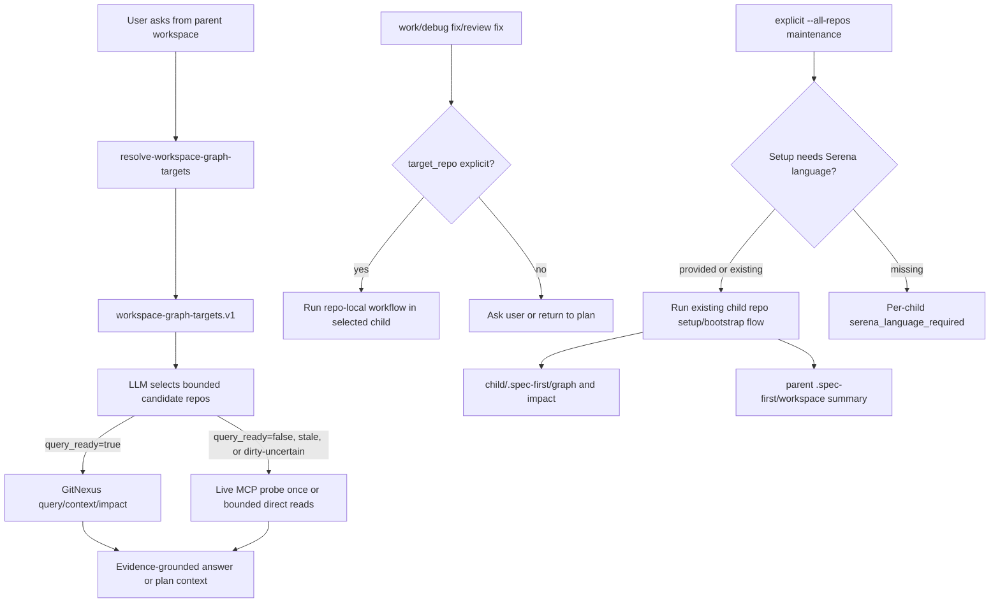

# feat: 支持多仓 workspace 的 GitNexus-first 查询路由

## Overview

让父目录下多个独立 Git 仓库的 workspace 成为一等查询模式：保留每个 child repo 的 Git、ownership、`.spec-first/graph/*`、`.spec-first/impact/*` 和 provider artifacts 边界，同时在父 workspace 提供只读 graph target 聚合和 GitNexus-first 证据消费策略。

本计划解决当前缺口：`spec-mcp-setup` 和 `spec-graph-bootstrap` 已能逐 child repo 生成 GitNexus/code-review-graph readiness，但后续普通代码问答和 `$spec-plan`、`$spec-work`、`$spec-debug`、`$spec-code-review` 等 workflow 在父 workspace 下没有统一的 target map，因此容易绕过 GitNexus 直接走 `rg` / search。改造后，父 workspace 下的 read-only 问答和上下文收集会先解析 child repo graph readiness，再对 primary repo 使用 GitNexus；只有 degraded、stale、missing 或语义不明确时才降级到 bounded direct reads。

---

## Problem Frame

真实用户场景是一个父目录包含多个独立 Git 项目，例如 CRM workspace 下的 `hs-kaz-crm-money-service`、`hs-kaz-crm-web`、`hs-kaz-crm-admin` 等。用户在父目录完成了 `$spec-mcp-setup` 和 `$spec-graph-bootstrap --repo <child>` 的批量执行后，child repo 的 GitNexus 已生成，但随后直接问“出金支持哪些方式”时，agent 没有先用 GitNexus 查询，而是直接 `rg` / 文件读取。

根因不是 GitNexus 未安装，也不是 child repo 没有 graph artifacts；而是父 workspace 只被当前 contract 当作“需要显式选择 child repo 的写入边界”，没有作为 read-only graph query router 被下游 workflow 消费。现有设计已经正确避免父目录伪装为 Git repo，但还缺少一个 provider-neutral、只读、可被 downstream skills 复用的 workspace graph target resolver。

---

## Requirements Trace

- R1. 父 workspace 下必须能解析所有 child repo 的 graph readiness、GitNexus repo label、primary/degraded/stale 状态和 artifact pointers，输出 machine-readable facts。
- R2. 父 workspace 不得拥有 repo-local canonical graph artifacts；`.spec-first/graph/*`、`.spec-first/impact/*`、`.spec-first/providers/*` 仍只属于 child repo。
- R3. 普通 read-only 代码问答和 downstream workflow 在父 workspace 下必须 GitNexus-first：先解析 workspace graph targets，再对候选 primary repo 调用 GitNexus。
- R4. 对 `graph_ready=true/query_ready=false`、definitions-only、stale、dirty-uncertain 或 missing 的 child repo，必须明确降级路径：一次 bounded live MCP probe 或 bounded direct reads，不得静默标成 query-ready。仅比较 `worktree_dirty` 布尔值不够；没有 `worktree_status_hash` / diff fingerprint 时，曾经 dirty 的 compiled graph facts 必须降级为 `dirty-uncertain` 或 `stale`。
- R5. 写入类 workflow 必须有明确 `target_repo` 或 per-unit/per-task `target_repo`，不得从父 workspace 直接写 sibling repo。
- R6. 显式批处理能力可以支持 `--all-repos`，但只能作为 maintenance action，逐 child repo 执行并输出 workspace summary，不成为默认隐式路径。`spec-mcp-setup --all-repos` 不能让脚本猜 Serena language；first-time Serena bootstrap 必须消费 LLM-prepared language map、复用既有 `.serena/project.yml`，或逐 repo 返回 `serena_language_required`。
- R7. GitNexus group mode 可以作为 optional fast path；基础能力必须使用 per-repo bounded fan-out，不依赖 provider-specific group。
- R8. GitNexus query probe candidate 选择必须避免 `HealthController`、`Ping`、`Actuator` 等弱业务入口优先导致 definitions-only 误降级。
- R9. Shell 与 PowerShell runtime contract 必须保持 parity；source 修改后通过 `spec-first init --codex|--claude` 生成 runtime，而不是手改 generated mirrors。
- R10. 文档、README、CHANGELOG、用户手册、host instruction source/templates、init/runtime contract tests 必须同步更新，使多仓模式的 setup、bootstrap、query、work/review 边界清晰。
- R11. 普通轻量代码问答不一定进入公开 workflow；AGENTS/CLAUDE managed bootstrap 或等价 host-level evidence policy 必须明确：父 workspace 下遇到代码库事实、业务流程、接口关系类问题时，先解析 workspace graph targets 并 GitNexus-first，而不是直接 search-first。

---

## Scope Boundaries

- 不把父 workspace 伪装成 Git repo。
- 不合并 child repo 的 GitNexus graph、code-review-graph facts 或 impact artifacts。
- 不在父 workspace 写 repo-local `.spec-first/config/*`、`.spec-first/graph/*`、`.spec-first/impact/*`、`.spec-first/providers/*` 或 `.serena/*`。
- 不让脚本根据用户问题语义自动决定“出金属于哪个 repo”；脚本只提供候选与 readiness facts，LLM 做语义判断。
- 不默认对所有 child repo fan-out；read-only 查询默认 bounded 到少量候选，写入前必须明确 repo scope。
- 不恢复 retired internal CRG runtime、Stage-0 context routing、`graph.db` 主路径或旧 `.spec-first/graph/raw/<provider>` 输出结构。

### Deferred to Follow-Up Work

- GitNexus group mode 自动配置和 `repo="@workspace"` 查询：作为 optional acceleration，在 per-repo fan-out 稳定后单独落地。
- Cross-repo dependency graph：例如 backend 与 frontend DTO/API 关系推断，需要独立 contract，不属于本计划。
- Workspace visualization：可在 resolver contract 稳定后补充 human-readable graph target dashboard。
- 高级 include/exclude/max-depth workspace 配置：本轮只支持现有 bounded discovery 与显式 `--repo` / `--all-repos`。
- Graph-bootstrap 写入 `worktree_status_hash` 的完整 freshness contract：本计划可以让 resolver 对现有 dirty artifacts fail-closed；更精确 hash 可作为后续 graph-bootstrap artifact 扩展。

---

## Graph Readiness

- target_repo: `spec-first`
- status: stale
- source_revision: `dbf9bab1a871fc7aa6c790fe26b70eda10e0e0dc`
- current_revision: `498087502c94e8153589ef0e09782d936ae04ac2`
- stale: true
- primary_providers: `code-review-graph`, `gitnexus` in stale compiled artifacts
- degraded_providers: none in stale compiled artifacts
- fallback_capabilities: Serena and `ast-grep` partial fallback are available per compiled impact capabilities
- runtime_mcp_evidence: live GitNexus query returned process results and definitions for current planning context, but compiled graph facts remain stale
- confidence: medium
- limitations: current worktree has existing unrelated changes; this plan relies on live MCP and bounded direct source reads rather than treating stale graph artifacts as current primary evidence

---

## Context & Research

### Relevant Code and Patterns

- `skills/spec-mcp-setup/scripts/resolve-project-target.sh` already detects `workspace-multi-repo`, returns `candidates[]`, rejects workspace escape, and exposes `state_write_allowed`.
- `skills/spec-mcp-setup/scripts/resolve-project-target.ps1` mirrors the resolver contract for Windows/PowerShell parity.
- `skills/spec-graph-bootstrap/scripts/bootstrap-providers.sh` uses the resolver and correctly fails closed from unresolved parent workspace before provider execution.
- `skills/spec-graph-bootstrap/scripts/bootstrap-providers.ps1` must stay contract-parity with shell changes.
- `skills/spec-mcp-setup/scripts/write-provider-config.sh` owns GitNexus repo label projection and `query_probe_policy` candidate selection.
- `skills/spec-plan/SKILL.md` already has a Graph Readiness block and requires `target_repo` for parent workspace plans, but it still forces target selection before using graph facts instead of supporting read-only multi-repo evidence discovery.
- `skills/spec-work/SKILL.md` already requires `target_repo` before edits, tests, changelog, or commits from parent workspace; this should remain strict.
- `skills/spec-code-review/SKILL.md` already says parent workspace review groups changed files by Git repo; this needs a shared graph target resolver.
- `skills/spec-debug/SKILL.md` currently lacks equivalent multi-repo graph evidence language and should be brought in line with plan/work/review.
- `tests/unit/mcp-setup.sh` and `tests/unit/spec-graph-bootstrap.sh` already cover parent workspace fail-closed behavior and explicit child repo execution.
- `tests/unit/spec-plan-contracts.test.js`, `tests/unit/spec-work-contracts.test.js`, and `tests/unit/spec-code-review-contracts.test.js` protect downstream skill prose contracts.
- `docs/05-用户手册/08-三种开发模式.md` documents the current three topology modes and needs an update from “parent only candidates” to “parent supports read-only graph routing”.

### Institutional Learnings

- `docs/plans/2026-04-28-005-feat-workspace-target-readiness-plan.md` completed the project target resolver and established that parent workspace cannot receive repo-local config/graph facts.
- `docs/plans/2026-04-26-003-feat-crg-workspace-topology-plan.md` established the durable model: parent workspace owns lightweight control-plane facts; child repos own graph artifacts.
- `docs/plans/2026-04-17-auto-discover-child-git-bootstrap-plan.md` captured the earlier motivation: multi Git workspace must not be flattened into a monorepo context.
- `docs/10-prompt/结构化项目角色契约.md` is the governing baseline: scripts prepare deterministic facts, LLM decides semantic routing; source/runtime boundaries must remain explicit.
- `docs/solutions/workflow-issues/modify-source-not-artifacts-2026-04-13.md` reinforces source-first changes and avoiding runtime mirror edits as source fixes.
- `docs/solutions/workflow-issues/host-entrypoint-mapping-source-boundary-2026-04-29.md` is relevant for dual-host entrypoint wording and runtime delivery boundaries.

### External References

- VS Code Multi-root Workspaces: roots remain separate folders while editor features aggregate search/source-control by folder.
- Nx affected: uses Git changes plus a project graph to select affected projects without merging project boundaries.
- Turborepo package/task graph: separates package graph facts from task execution decisions.
- Maven Reactor / multi-module guide: module aggregation is explicit and different from independent Git repo aggregation.

---

## Key Technical Decisions

- Add a provider-neutral `workspace-graph-targets.v1` resolver rather than overloading `project-target.v1`. `project-target.v1` answers “where may this workflow write repo-local state?”; `workspace-graph-targets.v1` answers “which child repos have graph evidence usable for read-only routing?”.
- Keep parent workspace artifacts under `.spec-first/workspace/*` only when explicitly requested. Default resolver output should be stdout to avoid creating project truth in the parent.
- Preserve child repo canonical graph boundaries. Child `.spec-first/graph/graph-facts.json` and `.spec-first/impact/bootstrap-impact-capabilities.json` remain the only canonical readiness facts for downstream repo-local work.
- Make read-only multi-repo evidence discovery first-class. Parent workspace code questions can inspect multiple child repo readiness records and perform bounded GitNexus fan-out without asking the user to pick one repo first.
- Keep write workflows strict. `spec-work`, fix mode in `spec-debug`, and code-modifying review follow-ups must require explicit `target_repo`.
- Treat GitNexus MCP evidence as session-local. A successful live MCP query does not update compiled `query_ready` and does not mutate setup-owned or graph-bootstrap artifacts.
- Implement `--all-repos` as an explicit maintenance action with per-child results and partial success semantics, not as the default behavior for unresolved parent workspace.
- Improve query probe candidates by demoting health/status/infrastructure controllers and preferring flow-bearing business controllers/services/repositories.
- Do not make GitNexus group mode required. If group support is present later, it is an optional fast path that falls back to per-repo fan-out.
- Keep tests focused on machine-readable contracts and key prose invariants, not exact user-facing paragraphs.

---

## Open Questions

### Resolved During Planning

- Should parent workspace receive `.spec-first/graph/*`? No. That would confuse canonical graph freshness and repo ownership.
- Should downstream read-only questions force a single `target_repo` before any graph use? No. Read-only questions may use bounded multi-repo discovery; write workflows still require explicit target scope.
- Should `--all-repos` be automatic when user says “全部”? It can be supported explicitly, but scripts must still report per-child outcomes and keep parent artifacts advisory.
- Should GitNexus group mode be the default aggregation primitive? No. It is provider-specific and should not be required for spec-first multi-repo support.
- Should scripts rank repo semantic relevance? No. Scripts can expose names, readiness, paths, provider status, stale flags, and optional keyword hints; LLM decides semantic candidates.
- Should dirty compiled graph facts ever be treated as primary by boolean comparison alone? No. If the artifact was generated from a dirty worktree and no stable dirty fingerprint is available, downstream resolver must mark it `dirty-uncertain` / `stale`.
- Can setup `--all-repos` infer Serena languages from file extensions in shell? No. Language selection is LLM-owned. Batch setup needs an explicit language map, existing Serena project facts, or per-repo action-required results.

### Deferred to Implementation

- Exact field names for optional workspace summary files can be finalized while implementing tests, as long as `workspace-graph-targets.v1` remains stable.
- Exact fan-out limit defaults can be tuned during implementation; planning expectation is 1-3 candidate repos for ordinary read-only questions and no broad all-repo query by default.
- Exact PowerShell JSON formatting can follow existing style if schema fields remain parity with shell.
- Whether `--all-repos` lives on existing scripts or a wrapper script can be decided during implementation; user-facing behavior and summaries must remain the same.
- Whether graph-bootstrap also adds `worktree_status_hash` in this implementation can be decided after reviewing artifact compatibility; if not added, resolver must conservatively degrade any dirty compiled artifact.

---

## Output Structure

```text
skills/spec-graph-bootstrap/scripts/
  resolve-workspace-graph-targets.sh
  resolve-workspace-graph-targets.ps1

.spec-first/workspace/
  graph-targets.json              # optional advisory cache, not canonical repo graph truth
  setup-summary.json              # optional explicit all-repos setup summary
  graph-bootstrap-summary.json    # optional explicit all-repos bootstrap summary

tests/unit/
  workspace-graph-targets.test.js # if implemented in Node; otherwise shell coverage in existing tests
```

---

## High-Level Technical Design

> *This illustrates the intended approach and is directional guidance for review, not implementation specification. The implementing agent should treat it as context, not code to reproduce.*



---

## Implementation Units

- U1. **新增 workspace graph target resolver**

**Goal:** 提供父 workspace 下的只读 graph readiness 聚合入口，让 downstream workflows 能看到每个 child repo 的 GitNexus/code-review-graph 可用性。

**Requirements:** R1, R2, R3, R4

**Dependencies:** None

**Files:**
- Create: `skills/spec-graph-bootstrap/scripts/resolve-workspace-graph-targets.sh`
- Create: `skills/spec-graph-bootstrap/scripts/resolve-workspace-graph-targets.ps1`
- Modify: `skills/spec-graph-bootstrap/SKILL.md`
- Test: `tests/unit/spec-graph-bootstrap.sh`
- Test: `tests/unit/mcp-setup-powershell-contracts.test.js`

**Approach:**
- Reuse `resolve-project-target.*` discovery behavior to identify child Git repos when cwd is a parent workspace.
- For each child repo, read setup-owned inputs when present: `.spec-first/config/graph-providers.json`, `.spec-first/config/runtime-capabilities.json`, and `.spec-first/config/provider-artifacts.json`. These distinguish `setup-ready-bootstrap-required` from truly unavailable repos and expose GitNexus repo label/query probe policy.
- Then read canonical readiness artifacts when present: `.spec-first/graph/graph-facts.json`, `.spec-first/impact/bootstrap-impact-capabilities.json`, and `.spec-first/providers/gitnexus/status.json`.
- Compare stored `source_revision` against current child repo HEAD. Treat exact revision mismatch as `stale`.
- Treat dirty artifacts conservatively: if recorded `worktree_dirty=true` and there is no matching `worktree_status_hash` / diff fingerprint to compare, classify the record as `dirty-uncertain` rather than primary. If a hash exists, compare it against the current status hash.
- Classify children as `primary`, `degraded-fallback`, `dirty-uncertain`, `stale`, `setup-ready-bootstrap-required`, `setup-not-ready`, or `unavailable`.
- Include `gitnexus_repo`, `target_repo`, `workspace_relative_path`, provider booleans, setup status, stale/dirty flags, artifact pointers, candidate query tokens, and limitations.
- Default to stdout JSON. Optional `--write-summary` may write `.spec-first/workspace/graph-targets.json` with `advisory: true`.

**Patterns to follow:**
- `skills/spec-mcp-setup/scripts/resolve-project-target.sh`
- `skills/spec-graph-bootstrap/scripts/bootstrap-providers.sh`
- `tests/unit/spec-graph-bootstrap.sh`

**Test scenarios:**
- Happy path: parent workspace with two bootstrapped child repos returns `schema_version=workspace-graph-targets.v1`, two repos, and no parent `.spec-first/graph`.
- Edge case: one child repo has missing graph facts and another is primary; resolver returns both records with per-child status rather than failing the whole workspace.
- Edge case: child graph facts source revision differs from current HEAD; resolver marks only that child as `stale`.
- Edge case: child graph facts were generated while `worktree_dirty=true` and no fingerprint exists; resolver marks only that child as `dirty-uncertain`, not `primary`.
- Edge case: child has setup-owned config but no canonical graph artifacts; resolver reports `setup-ready-bootstrap-required` and includes next action, not `unavailable`.
- Error path: cwd is a single Git repo; resolver returns mode `git-repo` or equivalent single-target facts without treating modules as child repos.
- Error path: cwd has no Git candidates; resolver emits `workspace-no-git-candidates` with empty repos.
- Integration: PowerShell source contains the same schema name, reason codes, and graph artifact path fields as shell.

**Verification:**
- Resolver produces stable JSON for parent workspace fixtures.
- Parent workspace remains free of repo-local graph artifacts.
- Existing graph bootstrap selected-child tests still pass.

---

- U2. **支持显式 all-repos setup/bootstrap maintenance**

**Goal:** 把用户“全部”的手工循环变成显式、可审计、可复用的 maintenance path。

**Requirements:** R2, R6, R9

**Dependencies:** U1

**Files:**
- Modify: `skills/spec-mcp-setup/SKILL.md`
- Modify: `skills/spec-mcp-setup/scripts/install-mcp.sh`
- Modify: `skills/spec-mcp-setup/scripts/install-mcp.ps1`
- Modify: `skills/spec-mcp-setup/scripts/verify-tools.sh`
- Modify: `skills/spec-mcp-setup/scripts/verify-tools.ps1`
- Modify: `skills/spec-graph-bootstrap/SKILL.md`
- Modify: `skills/spec-graph-bootstrap/scripts/bootstrap-providers.sh`
- Modify: `skills/spec-graph-bootstrap/scripts/bootstrap-providers.ps1`
- Test: `tests/unit/mcp-setup.sh`
- Test: `tests/unit/spec-graph-bootstrap.sh`
- Test: `tests/unit/mcp-setup-powershell-contracts.test.js`

**Approach:**
- Add explicit `--all-repos` / `-AllRepos` accepted only from parent workspace mode.
- Separate setup batch semantics from graph-bootstrap batch semantics:
  - `spec-graph-bootstrap --all-repos` may run deterministically for child repos whose setup-owned config is present.
  - `spec-mcp-setup --all-repos` may write host-level setup and project config, but first-time Serena bootstrap needs an explicit LLM-prepared language map such as `{ "project-a": ["java"], "project-b": ["typescript"] }`, existing `.serena/project.yml` language facts, or it must return per-child `serena_language_required`.
- Execute existing child flow per repo; do not create a second provider runner or script-owned language inference engine.
- Default to sequential execution for stability; optionally support a conservative future `--concurrency`.
- Record per-child `overall_status`, provider status, Serena status, language source (`provided`, `existing-project`, `required`), reason codes, and artifact pointers.
- Write optional `.spec-first/workspace/setup-summary.json` and `.spec-first/workspace/graph-bootstrap-summary.json` only for explicit all-repos commands.
- Preserve partial success semantics: successful child repos keep their artifacts even if another child fails.

**Patterns to follow:**
- Existing manual loop behavior in the execution log.
- `bootstrap-providers.sh` provider raw/normalized/status writing.
- `verify-tools.sh` grouped readiness reporting.

**Test scenarios:**
- Happy path: parent workspace with two child repos and `--all-repos` writes child artifacts and a parent workspace summary.
- Happy path: setup `--all-repos` with explicit language map bootstraps Java and TypeScript child repos using the provided per-child languages.
- Edge case: setup `--all-repos` without language map on a first-time child reports that child as `serena_language_required` while preserving successful siblings.
- Edge case: one child provider query is definitions-only; summary marks only that child as degraded.
- Error path: `--all-repos` inside a single Git repo is rejected or no-op with explicit reason, not broad filesystem scanning.
- Error path: one child repo missing setup config; summary records action-required for that child and still reports successful siblings.
- Integration: no parent `.spec-first/graph`, `.spec-first/impact`, `.spec-first/providers`, or `.serena` is created.

**Verification:**
- Existing `--repo <child>` behavior remains unchanged.
- `--all-repos` output is machine-readable enough for handoff and docs.

---

- U3. **更新 downstream workflow 的 GitNexus-first 多仓证据策略**

**Goal:** 让 `$spec-plan`、`$spec-work`、`$spec-debug`、`$spec-code-review` 和入口治理在父 workspace 下统一消费 workspace graph targets。

**Requirements:** R3, R4, R5, R7, R11

**Dependencies:** U1

**Files:**
- Modify: `skills/spec-plan/SKILL.md`
- Modify: `skills/spec-work/SKILL.md`
- Modify: `skills/spec-work-beta/SKILL.md`
- Modify: `skills/spec-debug/SKILL.md`
- Modify: `skills/spec-code-review/SKILL.md`
- Modify: `skills/using-spec-first/SKILL.md`
- Test: `tests/unit/spec-plan-contracts.test.js`
- Test: `tests/unit/spec-work-contracts.test.js`
- Test: `tests/unit/spec-work-beta-contracts.test.js`
- Test: `tests/unit/spec-code-review-contracts.test.js`
- Test: `tests/unit/using-spec-first-contracts.test.js`

**Approach:**
- `spec-plan`: parent workspace 可以先读取 `workspace-graph-targets.v1`；single-repo plan 仍要求 `target_repo`，cross-repo plan 每个 implementation unit 写 `target_repo`。
- `spec-work` / `spec-work-beta`: 保持写入严格 gate；如果 plan/task pack 缺 repo scope，不写文件。
- `spec-debug`: investigation 阶段允许 workspace graph resolver + GitNexus-first；fix 阶段必须明确 child repo。
- `spec-code-review`: 按 Git repo 分组 diff 后，对每个 child repo 读取 graph target record 和 repo-local graph facts。
- `using-spec-first`: 对普通父 workspace 代码问答增加 GitNexus-first evidence guidance，不强制进入 workflow。
- Host-level instruction policy: add a thin but explicit evidence policy to the managed bootstrap/source instruction surface so lightweight codebase factual questions that bypass workflows still use workspace graph targets before bounded search. Keep the full decision tree in `using-spec-first`; the bootstrap block only carries the trigger rule and source pointer.
- 所有 prose 都保留 session-local MCP evidence 与 compiled readiness 的区别。

**Patterns to follow:**
- `skills/spec-plan/SKILL.md` Graph Readiness block。
- `skills/spec-work/SKILL.md` Workspace Repo Scope。
- `skills/spec-code-review/SKILL.md` parent workspace grouping language。

**Test scenarios:**
- Contract: `spec-plan` 包含 `workspace-graph-targets.v1`、bounded candidate repos、GitNexus-first 和 per-unit `target_repo`。
- Contract: `spec-work` 明确 read evidence 可以多仓，但 writes require target scope。
- Contract: `spec-debug` 包含 investigation/fix 阶段的多仓边界差异。
- Contract: `spec-code-review` 说明 per-repo graph readiness and findings scope。
- Contract: `using-spec-first` 普通代码问答不直接 search-first，也不把 `using-spec-first` 暴露成 command。
- Contract: AGENTS/CLAUDE managed bootstrap or instruction-bootstrap source contains the lightweight parent-workspace codebase evidence policy, while still avoiding a full duplicated workflow state machine.

**Verification:**
- Skill prose tests 通过。
- 下游 workflows 的 source/runtime 边界仍然指向 source skill，不要求手改 generated mirrors。

---

- U4. **改良 GitNexus query probe candidate 质量**

**Goal:** 降低 Spring/Java/前端项目因弱业务入口 token 导致 GitNexus CLI proof definitions-only 的概率。

**Requirements:** R4, R8

**Dependencies:** None

**Files:**
- Modify: `skills/spec-mcp-setup/scripts/write-provider-config.sh`
- Modify: `skills/spec-mcp-setup/scripts/write-provider-config.ps1`
- Modify: `skills/spec-mcp-setup/SKILL.md`
- Test: `tests/unit/mcp-setup.sh`
- Test: `tests/unit/mcp-setup-powershell-contracts.test.js`

**Approach:**
- Extend weak proof filters to demote `Health*`, `Ping*`, `Actuator*`, `Status*`, `Info*`, `Error*`, `Metrics*`, and pure infrastructure lifecycle names.
- Add or tighten reason codes so selected candidates explain why a token is business-flow-bearing.
- Prefer business `*Controller`, `*Service`, `*ServiceImpl`, `*Repository`, handlers, forms, pages, dashboards, routers, and login/home/navigation entrypoints.
- Keep candidate limit at 5. Do not expand into broad search.
- Preserve `query_probe_policy.token`, `selected_from`, and `candidates[]` backward compatibility.

**Patterns to follow:**
- Existing `gitnexus_probe_token_low_signal`, `gitnexus_probe_token_workflow_signal`, and `gitnexus_probe_token_weak_proof_signal` functions.
- Existing May 2026 changelog entries around GitNexus probe hardening.

**Test scenarios:**
- Happy path: repo with `HealthController` and `MemberWithdrawController` chooses `MemberWithdrawController` first.
- Edge case: repo with only health/status files still emits a fallback candidate and clear low-confidence reason.
- Edge case: DTO/entity-only names remain weak proof and do not beat service/controller candidates.
- Integration: generated `graph-providers.json` still has query command array shape accepted by graph-bootstrap.

**Verification:**
- `npm run test:mcp-setup` passes.
- Existing graph-bootstrap query proof validation remains fail-closed.

---

- U5. **更新文档、README 和 runtime delivery contract**

**Goal:** 把多仓 workspace 的 setup/bootstrap/query/work/review 边界写清楚，避免用户以为父目录是单一 project。

**Requirements:** R2, R3, R5, R6, R9, R10

**Dependencies:** U1, U2, U3

**Files:**
- Modify: `docs/05-用户手册/08-三种开发模式.md`
- Modify: `README.md`
- Modify: `README.zh-CN.md`
- Modify: `CHANGELOG.md`
- Modify: `CLAUDE.md`
- Modify: `AGENTS.md`
- Modify: `src/cli/instruction-bootstrap.js`
- Modify: `templates/claude/hooks/session-start`
- Modify: `templates/claude/commands/spec/graph-bootstrap.md`
- Modify: `templates/claude/commands/spec/mcp-setup.md`
- Test: `tests/unit/dual-host-governance-contracts.test.js`
- Test: `tests/unit/init-dry-run.test.js`
- Test: `tests/unit/using-spec-first-contracts.test.js`
- Test: `tests/smoke/cli.sh`

**Approach:**
- User manual: 将第三种模式从“父 workspace 只候选发现”升级为“父 workspace 支持只读 graph query routing；写入仍必须 child repo scoped”。
- README: 在 setup/bootstrap 后续步骤中说明多仓父目录的 `--repo`、`--all-repos` 和 GitNexus-first query behavior。
- AGENTS/CLAUDE managed source blocks: 只保留薄提醒、入口锚点和父 workspace 代码库事实问答的 GitNexus-first evidence trigger，避免复制完整策略；完整策略仍在 source skills。
- `src/cli/instruction-bootstrap.js` is the source of generated AGENTS/CLAUDE bootstrap blocks; update it rather than hand-editing generated runtime copies. Claude SessionStart template should continue to inject the managed block, so it must not need a second hard-coded policy.
- Claude command templates for setup/bootstrap should mention `--all-repos` only as explicit maintenance and should preserve the selected-child canonical artifact boundary.
- Runtime: source 修改验证后，用 `spec-first init --codex|--claude` 刷 generated runtime；不手改 `.agents/skills`、`.claude`、`.codex` 作为 source fix。

**Patterns to follow:**
- `docs/05-用户手册/08-三种开发模式.md`
- `CLAUDE.md` / `AGENTS.md` managed block style
- `skills/using-spec-first/SKILL.md` source-of-truth routing boundary

**Test scenarios:**
- Documentation: manual includes read-only GitNexus-first and write-target gate distinction.
- Governance: generated host instructions remain thin and do not embed a second copy of full workflow rules.
- Runtime delivery: init dry-run output or generated AGENTS/CLAUDE includes the parent-workspace evidence trigger from `instruction-bootstrap.js`.
- Smoke: init dry-run still installs relevant skills and scripts.

**Verification:**
- README and user manual present consistent terminology: `Multi Repo Workspace`, `target_repo`, `workspace-graph-targets.v1`, `--all-repos`.

---

- U6. **全局验证和 fresh-source review**

**Goal:** 收口全局风险，证明新增多仓 query routing 没有破坏 setup/bootstrap 的安全边界和下游 workflow scope。

**Requirements:** R1-R10

**Dependencies:** U1, U2, U3, U4, U5

**Files:**
- Modify: `tests/unit/mcp-setup.sh`
- Modify: `tests/unit/spec-graph-bootstrap.sh`
- Modify: `tests/unit/spec-plan-contracts.test.js`
- Modify: `tests/unit/spec-work-contracts.test.js`
- Modify: `tests/unit/spec-work-beta-contracts.test.js`
- Modify: `tests/unit/spec-code-review-contracts.test.js`
- Modify: `tests/unit/using-spec-first-contracts.test.js`
- Modify: `tests/unit/mcp-setup-powershell-contracts.test.js`
- Test: `tests/unit/spec-debug-contracts.test.js`

**Approach:**
- Add unit/contract tests for resolver schema, parent no-write guarantee, selected-child behavior, all-repos summaries, downstream GitNexus-first prose, and weak candidate demotion.
- Run narrow tests first, then expand to `npm run test:unit` only if touched surfaces warrant it.
- For skill prose semantics, perform fresh-source review/eval by reading source skill files from disk, not relying on current session cached skill behavior.

**Execution note:** Characterization-first: add tests for current safe boundaries before implementing broad `--all-repos` behavior.

**Patterns to follow:**
- `tests/unit/mcp-setup.sh`
- `tests/unit/spec-graph-bootstrap.sh`
- `tests/unit/spec-plan-contracts.test.js`
- `tests/unit/spec-code-review-contracts.test.js`

**Test scenarios:**
- Happy path: parent workspace with two primary child repos resolves both and downstream prose says GitNexus-first.
- Edge case: mixed primary/degraded/stale children preserve per-child statuses.
- Edge case: explicit `--repo` bypasses multi-repo fan-out and runs selected child only.
- Error path: unresolved parent workspace without `--all-repos` still fails closed for state-changing setup/bootstrap.
- Error path: write workflow without `target_repo` refuses edits.
- Integration: generated runtime contains new scripts after init and source tests verify script path delivery.

**Verification:**
- Narrow validation commands pass.
- `CHANGELOG.md` has a new entry using current developer profile author.
- No unrelated existing dirty files are reverted.

---

## System-Wide Impact

- **Interaction graph:** `spec-mcp-setup` continues to prepare host and project setup facts; `spec-graph-bootstrap` continues to compile child repo graph readiness; the new resolver sits between compiled child facts and downstream LLM evidence selection.
- **Error propagation:** Missing/stale/degraded child facts degrade only that child repo. Parent workspace resolver should preserve sibling records and report limitations instead of failing the whole workspace.
- **State lifecycle risks:** Explicit `--all-repos` can produce partial success; summary artifacts must distinguish successful child artifacts from failed child actions.
- **API surface parity:** Shell and PowerShell scripts, source skills, README, user manual, and generated runtime expectations must remain aligned.
- **Integration coverage:** Unit tests must prove parent no-write, child write, all-repos summary, downstream prose contracts, and GitNexus candidate selection.
- **Unchanged invariants:** Child repo remains canonical project boundary; compiled `query_ready` remains fail-closed; live MCP does not mutate readiness artifacts; `code-review-graph` host MCP remains optional.

---

## Alternative Approaches Considered

- **Parent workspace as fake Git repo:** rejected because it breaks source revision, dirty state, repo label, impact, review, and ownership boundaries.
- **Require user to always pick one child repo first:** rejected for read-only questions because it wastes available graph evidence and prevents cross-repo inquiry; retained only for write workflows.
- **GitNexus group mode as required path:** rejected because it couples spec-first core to provider-specific grouping and fails when group config is absent. Optional fast path remains future work.
- **Broad `rg` first, GitNexus later:** rejected because it ignores prepared graph readiness and caused the observed failure mode.
- **One script decides semantic target repo:** rejected because it violates the LLM/script boundary and would become a brittle keyword router.

---

## Risks & Dependencies

| Risk | Mitigation |
|------|------------|
| Parent summary accidentally treated as canonical graph truth | Schema and docs label `.spec-first/workspace/*` as advisory; tests assert parent `.spec-first/graph/*` is absent |
| Downstream skills over-fan-out across all repos | Prose contract says bounded candidate repos; write workflows require explicit target scope |
| Stale child graph facts mislead planning/work | Resolver compares child `source_revision` and `worktree_dirty`; stale records require live MCP or direct-read fallback |
| GitNexus definitions-only evidence is over-trusted | Keep compiled `query_ready=false`; downstream prose says definitions are only pointers |
| All-repos maintenance causes cache or provider contention | Default sequential execution; concurrency deferred |
| Setup all-repos guesses wrong Serena language | Require LLM-prepared language map, existing `.serena/project.yml`, or per-child `serena_language_required`; scripts do not infer semantic language |
| PowerShell drift from shell behavior | Add contract assertions for schema, reason codes, script paths, and user-facing flags |
| Ordinary lightweight code questions bypass workflows and still search first | Put a thin parent-workspace evidence trigger in generated host instruction source, with full policy in `using-spec-first` |
| Existing dirty worktree causes accidental overwrite | Implementation must work only in touched files, preserve unrelated changes, and inspect diffs before edits |

---

## Documentation / Operational Notes

- User-facing docs must distinguish:
  - single Git repo single project
  - single Git repo multi-module
  - parent workspace multi independent Git repos
- After implementation, users should be able to run setup/bootstrap in parent workspace with explicit all-repos maintenance, then ask read-only code questions from the parent and still get GitNexus-first evidence.
- When setup batch needs Serena language selection, docs should show an explicit per-child language map pattern and the degraded `serena_language_required` result for ambiguous or first-time repos.
- Restart or a new session is still only required when relying on newly written MCP host config or fresh runtime skill definitions; CLI scripts and source docs can be verified in the current session.
- Plan implementation should update `CHANGELOG.md` for every source change and mark user-visible behavior changes.

---

## Phased Delivery

### Phase 1: Resolver and Query Consumption

- Implement `workspace-graph-targets.v1`.
- Include setup-owned config inputs and conservative dirty artifact handling before marking any child `primary`.
- Update downstream skills to use resolver facts for read-only GitNexus-first evidence.
- Add the thin host-level evidence trigger for ordinary parent-workspace codebase questions.
- Add tests for parent no-write and downstream contracts.

### Phase 2: Explicit All-Repos Maintenance

- Add `--all-repos` setup/verify/bootstrap behavior.
- Add explicit per-child Serena language map handling for setup batch; report `serena_language_required` instead of script-guessing.
- Write optional workspace summaries.
- Add partial-success and no-parent-graph tests.

### Phase 3: Probe Quality and Docs

- Improve GitNexus probe candidate selection.
- Update README/user manual/CHANGELOG.
- Refresh runtime assets only after source validation.

### Phase 4: Optional Provider Fast Paths

- Evaluate GitNexus group mode as a future optional acceleration.
- Keep per-repo fan-out as fallback.

---

## Sources & References

- Related plan: `docs/plans/2026-04-28-005-feat-workspace-target-readiness-plan.md`
- Related plan: `docs/plans/2026-04-26-003-feat-crg-workspace-topology-plan.md`
- Related plan: `docs/plans/2026-04-17-auto-discover-child-git-bootstrap-plan.md`
- Role contract: `docs/10-prompt/结构化项目角色契约.md`
- Current resolver: `skills/spec-mcp-setup/scripts/resolve-project-target.sh`
- Current graph bootstrap: `skills/spec-graph-bootstrap/scripts/bootstrap-providers.sh`
- Current probe selection: `skills/spec-mcp-setup/scripts/write-provider-config.sh`
- Downstream plan skill: `skills/spec-plan/SKILL.md`
- Downstream work skill: `skills/spec-work/SKILL.md`
- Downstream review skill: `skills/spec-code-review/SKILL.md`
- User manual: `docs/05-用户手册/08-三种开发模式.md`
- VS Code Multi-root Workspaces: `https://code.visualstudio.com/docs/editor/multi-root-workspaces`
- Nx affected: `https://nx.dev/docs/features/ci-features/affected`
- Turborepo Package and Task Graphs: `https://turborepo.com/docs/core-concepts/package-and-task-graph`
- Maven Multiple Modules / Reactor: `https://maven.apache.org/guides/mini/guide-multiple-modules.html`
