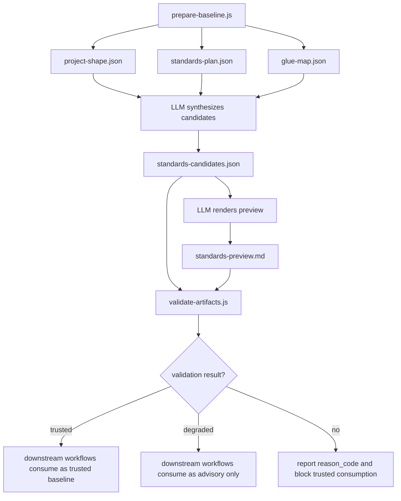

# feat: 为 spec-standards 最小闭环增加 artifact 质量门

## Overview

本计划为 `spec-standards` 的最小闭环增加轻量质量保障：

```text
prepare-baseline.js
  -> project-shape.json
  -> standards-plan.json
  -> glue-map.json
  -> standards-candidates.json
  -> standards-preview.md
  -> downstream workflows read as context
```

当前事实层已经有 `prepare-baseline.js` 和 contract tests 支撑；缺口在 LLM 合成后的 `standards-candidates.json`、`standards-preview.md` 和下游消费边界。目标不是把 `spec-standards` 做成规范平台，而是在 artifact 交接点增加最小 validator 和 consumer contract，避免 observed/imported/suggested 被误升级成 confirmed，也避免 preview 隐藏 conflict、unknown 或 writeback 状态。

---

## Problem Frame

`spec-standards` 的定位是 Graph-backed Project Standards & Glue Compiler。它必须遵守 `Light contract + Explicit boundaries + Scripts prepare, LLM decides`：

- 脚本负责 deterministic facts、schema-ish 校验、reason code 和 artifact path。
- LLM 负责候选规范合成、冲突解释、unknown 归纳和用户确认建议。
- `repo-profile.yaml` 只能通过 preview + patch + 用户确认进入长期真相源。

当前实现已经具备 baseline/quick/refresh/deep/import-source 的事实准备层，但 LLM 产出的 candidate 和 preview 还缺少确定性质量门。没有质量门时，下游 `spec-plan`、`spec-work`、`spec-code-review` 可能消费到结构不完整、证据不足或状态升级错误的 standards artifacts。

> 前提假设：上述失败模式目前是基于 artifact 产生机制（LLM-owned synthesis + 下游 advisory/hard 混合消费）的结构性风险推断，尚未绑定具体的线上事件或 PR 回溯。本计划按"防御性硬化"落地，而不是把验证器当作对既有事故的回归测试。后续 dogfood 或 drift/update 阶段若观察到真实失败样本，应回写到 fixtures。

---

## Requirements Trace

- R1. 为 LLM 产出的 `standards-candidates.json` 增加 deterministic validator，校验结构、candidate status 词表、source_type、按 status 分级的 support evidence、evidence 元素最小形状、status_counts、conflict/unknown 引用和 writeback 安全边界。
- R2. 为 `standards-preview.md` 增加轻量 checker，确保必需审查章节、条件必需章节、candidate status 摘要（若带计数必须与 `status_counts` 一致）、conflicts/unknowns 可见性和 `repo-profile.yaml` 未修改声明。
- R3. 保持脚本职责边界：validator 只校验 artifact contract，不判断规范内容是否“正确”。
- R4. 保持 preview-first：本计划不实现 `repo-profile.yaml` apply，也不自动把 candidate 写入 repo profile。
- R5. 将下游 workflow 的消费规则固化为 contract tests：`confirmed -> hard`，`observed/imported/suggested -> advisory`，`conflict/unknown -> risk/question`，validator fail 或 fallback validation 只能进入 degraded/advisory consumption。
- R6. 保持现有 `spec-standards` fact compiler 行为和测试通过，不破坏 baseline/quick/refresh/deep/import-source 模式。
- R7. 固定 validator CLI、exit code、reason_code 和 `trust_level` contract，避免实现阶段漂移或 fallback 结果被误当可信 baseline。
- R8. 保证 standards artifacts 是 downstream-readable，而不只是 human-readable：candidate status、support evidence、preview risks 和 trust_level 必须足以支撑 `spec-plan`、`spec-write-tasks`、`spec-work`、`spec-code-review` 的一致消费。

---

## Scope Boundaries

- 不实现远程 shared standards Git fetch、ref upgrade 或 `standards-import-diff.md`。
- 不实现 monorepo module 级 standards 或 workspace 级 cross-repo glue-map。
- 不自动执行 GitNexus deep query，不提交 raw graph query results。
- 不引入完整 JSON Schema validator 依赖；使用仓库现有 CommonJS + 轻量结构校验模式。
- 不写 `.claude/`、`.codex/`、`.agents/skills/` generated runtime mirrors。
- 不实现 `repo-profile.yaml` apply；若检测到 `repo-profile.patch.yaml`，只做 safety validation。
- 不新增 `.spec-standards/` standards pack 目录体系；当前真相源仍是 `.spec-first/standards/` runtime artifacts 与 source skill/docs/tests。
- 不在本计划中新增或重新设计 candidate status 词表；validator 以 `standards-plan.json.synthesis_contract.allowed_statuses` 为准。`deprecated`、`drifted` 若由当前 source script 暴露，属于既有 vocabulary，不是本计划新增能力。

### Deferred to Follow-Up Work

- `repo-profile.patch.yaml` 生成与 apply：需要单独计划 Phase 4，先完成 validator 后再评估。
- shared standards diff / conflict preview：等本地 import + candidate validator 稳定后再做。
- drift/update-from-review/compound 反哺：等 candidate 和 preview contract 稳定后再接入。
- 完整 Standards Pack 文档形态，例如 `PROJECT_PROFILE.md`、`SOURCE_OF_TRUTH.md`、`ASSET_POLICY.md`、`CAPABILITY_REGISTRY.md`、`REVIEW_GATES.md`：只作为未来信息架构灵感，不进入当前最小闭环。

---

## Graph Readiness

- target_repo: `spec-first`
- status: `stale`
- source_revision: `dbf9bab1a871fc7aa6c790fe26b70eda10e0e0dc`
- current_revision: `7928d76c957c8600deaa6ecbb9548a83724afd41`
- stale: `true`
- primary_providers: `gitnexus`, `code-review-graph`
- degraded_providers: none confirmed for this planning pass
- fallback_capabilities: bounded direct source reads, existing contract tests, runtime MCP query attempt
- runtime_mcp_evidence: GitNexus query for `spec-standards validate artifacts standards candidates preview downstream consumers` returned no processes, symbols, or definitions; treated as no usable flow evidence
- confidence: medium
- limitations: compiled graph facts are stale and do not cover the new `spec-standards` flow; this plan is grounded in current source files, tests, docs, and live dry-run facts instead

---

## Context & Research

### Relevant Code and Patterns

- `skills/spec-standards/SKILL.md` defines the workflow boundary, candidate status vocabulary, preview-first rule, and final response contract.
- `skills/spec-standards/scripts/prepare-baseline.js` already defines schemas, allowed candidate statuses/source types, mode budgets, `synthesis_contract`, downstream consumer metadata, and deterministic artifact writes.
- `tests/unit/spec-standards-contracts.test.js` already covers fact-layer behavior: baseline writes only fact artifacts, child repo writes are child-local, quick emits update decision only, refresh scopes plan, deep emits graph query index, import-source marks shared standards as imported.
- `skills/spec-plan/SKILL.md`, `skills/spec-write-tasks/SKILL.md`, `skills/spec-work/SKILL.md`, and `skills/spec-code-review/SKILL.md` already have partial standards consumption language, but the boundary is uneven and should be contract-tested.
- `docs/05-用户手册/11-项目规范与胶水基线.md` describes current user-visible standards modes and must be updated only if validator behavior becomes user-visible.

### Institutional Learnings

- `docs/solutions/architecture-patterns/upstream-ce-sync-upgrade-methodology-2026-04-26.md` reinforces the same architectural rule used here: scripts prepare deterministic facts, LLM performs semantic adaptation, and workflow assets should avoid state-machine overreach or multi-truth-source drift.

### External References

- None. The work is internal artifact governance in a CommonJS CLI with strong local patterns; external research would add little practical value.

---

## Key Technical Decisions

- Add `validate-artifacts.js` as a deterministic checker, not as a generator. Rationale: keeps semantic synthesis in LLM-owned space while making artifact handoff verifiable.
- Keep artifact-first as the operating model. Rationale: standards context should survive outside chat history as reviewable `standards-candidates.json` and `standards-preview.md`, then be consumed by downstream workflows with explicit trust boundaries.
- Require standards artifacts to be downstream-readable, not only human-readable. Rationale: Plan/Tasks/Work/Review need stable status, support, risk, and trust signals; prose-only preview is not enough for a reusable engineering loop.
- Keep `advisory` out of `candidate.status`. Rationale: candidate status vocabulary is provided by `standards-plan.json.synthesis_contract.allowed_statuses`; `advisory` is a downstream `consumption_mode`, not a candidate lifecycle state. The core consumption mapping remains `confirmed -> hard`、`observed/imported/suggested -> advisory`、`conflict/unknown -> risk/question`; additional existing statuses such as `deprecated` or `drifted` must be handled through explicit consumption mapping, not silently treated as confirmed.
- Require confirmation evidence for `confirmed`, and require that evidence's provenance is **non-LLM-authored**. Rationale: a candidate can become hard context only if it comes from repo profile confirmation, explicit `--user-input` provenance, or an external confirmation file (e.g., `repo-profile.patch.yaml.confirmed_candidate_ids` or `.spec-first/standards/confirmations.json`) that the LLM does not write in the same synthesis pass; `confirmation.type` alone inside `standards-candidates.json` is self-attestation and must not be trusted.
- Validate support requirements by status. Rationale: `unknown` should not be forced to invent code evidence; it needs `question`、`reason` 或 `missing_evidence`，while `observed` needs evidence, `imported` needs source document, `suggested` needs rationale, and `conflict` needs conflict references. Each `evidence[]` element must be either a non-empty string of meaningful length or a `{ source, quote }` object with both fields non-empty; `evidence: [""]` / `evidence: [{}]` must fail with reason_code `invalid-evidence-shape`.
- Read allowed statuses, source types, and `candidate_required_fields` from `standards-plan.json`'s `synthesis_contract` when available, and treat the script as the single source of truth for the vocabulary. Rationale: `prepare-baseline.js` already exposes `CANDIDATE_STATUSES` (including `deprecated`、`drifted`) and `CANDIDATE_SOURCE_TYPES` via `synthesis_contract`; validator must not hard-code a narrower list and must not treat fallback vocabulary as trusted.
- Include `trust_level: trusted|degraded` in validation output. Rationale: downstream workflows need to distinguish structural acceptability from trusted standards baseline.
- Keep preview validation structural and bilingual-tolerant with required and conditional sections. Rationale: preview should be reviewable in Chinese or English; the hard requirements are visibility, writeback status, and risk surfacing, not exact prose.
- Treat `repo-profile.patch.yaml` as optional safety input only. Rationale: this phase must not introduce durable writeback risk.
- Add fixtures for positive and negative artifact states. Rationale: validator quality is best protected by small golden cases that represent real failure modes.

---

## Open Questions

### Resolved During Planning

- Should this use a full JSON Schema validator? Resolution: no. The current need is a light contract checker aligned with existing tests, not standards-complete JSON Schema behavior.
- Should validator judge whether a candidate rule is semantically good? Resolution: no. It only checks structure, evidence presence, allowed status/source_type, and writeback safety.
- Should this plan implement repo-profile apply? Resolution: no. Apply is deferred until candidate/preview quality is proven.
- Should `advisory` be allowed as a candidate status? Resolution: no. `advisory` is a consumption mode; the candidate status vocabulary remains `confirmed`、`observed`、`imported`、`suggested`、`conflict`、`unknown`.
- Should missing `standards-plan.json` use fallback vocabulary silently? Resolution: no. Trusted validation fails by default; `--allow-fallback-vocabulary` may return degraded pass with warning only when the caller explicitly accepts reduced trust.
- Should CLI flag spelling be deferred? Resolution: no. The minimal public contract is fixed in this plan to protect docs and tests from implementation drift.

### Deferred to Implementation

- Exact preview heading aliases can be tuned from fixtures during implementation; the plan requires bilingual/equivalent matching, not one fixed heading string.

---

## Output Structure

```text
skills/spec-standards/scripts/validate-artifacts.js
tests/unit/spec-standards-validation.test.js
tests/unit/spec-standards-consumers.test.js
tests/fixtures/spec-standards/
  valid-baseline/
  missing-graph/
  imported-standards/
  conflict-and-unknown/
  invalid-writeback/
  downstream-consumption-map/
```

### Validator CLI Contract

```bash
node skills/spec-standards/scripts/validate-artifacts.js \
  --standards-dir .spec-first/standards \
  --json

node skills/spec-standards/scripts/validate-artifacts.js \
  --candidates .spec-first/standards/standards-candidates.json \
  --preview .spec-first/standards/standards-preview.md \
  --plan .spec-first/standards/standards-plan.json \
  --json
```

Exit codes:

- `0`: trusted pass（`status=pass` 且 `trust_level=trusted`）
- `1`: validation fail
- `2`: usage error
- `3`: internal error
- `4`: degraded pass（`status=pass` 且 `trust_level=degraded`，仅在 `--allow-fallback-vocabulary` 等显式 degraded 路径下产生）

Validation output must include `schema_version`、`status`、`trust_level`、`checked`、`errors[]`、`warnings[]`。`trust_level=degraded` 只允许出现在 `--allow-fallback-vocabulary` 这类显式 degraded 路径中，downstream workflows 不能把它当作 trusted baseline。退出码 `0` 与 `4` 的分离是机械 forcing function：仅看 `$?` 的 shell/CI caller 也能区分 trusted 与 degraded，而不必解析 JSON。trusted-only callers 应断言 `exit == 0`；tolerant callers 才接受 `exit == 0 || exit == 4`。

Degraded pass output is fixed as:

```json
{
  "status": "pass",
  "trust_level": "degraded",
  "warnings": [
    {
      "reason_code": "missing-standards-plan"
    }
  ]
}
```

`status=pass` + `trust_level=degraded` 使用退出码 `4`，表明 artifact 结构上可读但只证明 degraded 结构可接受。它不能被消费为 trusted standards baseline。

### Reason Code Vocabulary

Initial stable vocabulary:

```text
missing-required-field
invalid-candidate-status
invalid-source-type
missing-support
empty-evidence
invalid-evidence-shape
missing-source
missing-rationale
missing-conflict-reference
missing-unknown-question
status-count-mismatch
unsafe-confirmed-source
unsafe-confirmed-without-confirmation
confirmation-not-externally-attested
patch-references-non-confirmed-candidate
conflict-reference-mismatch
unknown-reference-mismatch
preview-missing-section
preview-missing-writeback-status
preview-missing-repo-profile-unchanged-statement
preview-hides-conflict
preview-hides-unknown
preview-count-mismatch
missing-standards-plan
invalid-json
file-not-found
```

Reason code boundaries:

- `missing-support`: a candidate status requires a support object or equivalent support field, but no support field is present.
- `empty-evidence`: `status=observed` has an `evidence` field, but it is an empty array or otherwise empty.
- `invalid-evidence-shape`: `evidence[]` 至少有一个元素既不是非空字符串（≥ 8 字符），也不是 `{ source, quote }` 且两字段都非空的对象。
- `missing-source`: `status=imported` lacks a source document reference.
- `missing-rationale`: `status=suggested` lacks a rationale.
- `confirmation-not-externally-attested`: candidate 通过 `confirmation.type=user_input | human_confirmed` 升级为 `confirmed`，但对应 candidate id 没有出现在 non-LLM-authored 的外部 attestation 文件（`repo-profile.patch.yaml.confirmed_candidate_ids` 或 `.spec-first/standards/confirmations.json`）中；validator 不接受同一份 `standards-candidates.json` 内部的自证 confirmation。
- `preview-missing-writeback-status`: preview lacks the Writeback Status section.
- `preview-missing-repo-profile-unchanged-statement`: preview has writeback status content but does not explicitly state that `repo-profile.yaml` was not modified.
- `preview-count-mismatch`: preview 在 conflicts/unknowns/by-status 摘要中给出了显式计数，但与 `standards-candidates.json` 的 `status_counts` 不一致。

---

## High-Level Technical Design

> *This illustrates the intended approach and is directional guidance for review, not implementation specification. The implementing agent should treat it as context, not code to reproduce.*



The validator owns only the `I -> J` quality gate and the `trust_level` distinction. It does not replace LLM synthesis, user review, or future repo-profile confirmation.

---

## Implementation Units

- U0. **冻结 validator contract、reason_code 和 trust model**

**Goal:** 在实现前固定最小 public contract，避免 validator 语义、CLI、状态词表和下游消费模式在实现中漂移。

**Requirements:** R1, R5, R7, R8

**Dependencies:** None

**Files:**
- Create: `skills/spec-standards/scripts/validate-artifacts.js`
- Create: `tests/unit/spec-standards-validation.test.js`

**Approach:**
- 在 validator 中集中定义 `candidate.status` 词表、`consumption_mode` 映射、reason_code 词表、exit code、validation output envelope 和 downstream-readable consumption map。
- 明确 `advisory` 只存在于 downstream consumption，不存在于 `candidate.status`。
- `consumption_mode` 必须显式映射每个 allowed status；任何未映射 allowed status 必须 fail validation 或降级为 risk/degraded advisory，不能默认成为 hard context。
- 输出 `trust_level: trusted|degraded`；`degraded` 不等于 trusted baseline。
- 固定 CLI contract：`--standards-dir`、`--candidates`、`--preview`、`--plan`、`--json`、`--allow-fallback-vocabulary`。
- 缺少 `standards-plan.json` 时默认 validation fail；只有显式 `--allow-fallback-vocabulary` 才可返回 `status=pass`、`trust_level=degraded`、exit code `4`，并携带 warnings。
- U0 只负责 contract shell、CLI、output envelope、exit code、trust model 和 constants；fixture-driven artifact domain cases 留给 U4。

**Patterns to follow:**
- `skills/spec-standards/scripts/prepare-baseline.js` 的 CommonJS CLI、参数解析、结构化输出和非 0 退出风格。
- `tests/unit/spec-standards-contracts.test.js` 的临时目录和 fixture 构造方式。

**Test scenarios:**
- CLI: `--standards-dir` + `--json` 输出包含固定 envelope。
- CLI: 单文件参数 `--candidates`、`--preview`、`--plan` 可组合执行。
- Error path: `allowed_statuses` 出现未映射状态且 validator 没有 explicit consumption mapping -> 失败或 degraded/risk，不能默认为 hard。
- Error path: 缺少 `standards-plan.json` 且未传 `--allow-fallback-vocabulary` -> exit code 1，reason_code 为 `missing-standards-plan`。
- Degraded path: 缺少 `standards-plan.json` 但传 `--allow-fallback-vocabulary` -> `status=pass`、`trust_level=degraded`、warnings 非空、exit code `4`，不能标记为 trusted。
- Usage path: 参数不完整或互斥 -> exit code 2。

**Verification:**
- Contract constants 和测试期望一致。
- 任意 fallback vocabulary 路径不会生成 trusted pass。
- Consumption map 可被 downstream consumer tests 读取和断言。

---

- U1. **实现 candidates 基础结构校验**

**Goal:** 校验 `standards-candidates.json` 的最小 artifact 结构，确保下游能稳定读取而不需要猜字段。

**Requirements:** R1, R3, R7, R8

**Dependencies:** U0

**Files:**
- Modify: `skills/spec-standards/scripts/validate-artifacts.js`
- Test: `tests/unit/spec-standards-validation.test.js`

**Approach:**
- 支持以 `.spec-first/standards/` 目录为输入，也支持单独指定 candidates/preview/plan 文件。
- 优先读取 `standards-plan.json` 的 `synthesis_contract.allowed_statuses`、`allowed_source_types` 和 `candidate_required_fields`。
- 校验 JSON 可解析、必需字段存在、`status_counts` 与实际 candidates 重新计算结果一致。
- 校验 candidate 暴露足够 downstream-readable 字段，让下游能区分 hard/advisory/risk/question，而不依赖 preview prose 推断。
- 对失败项给稳定 `reason_code`，并定位到具体 file、candidate id 和 field。
- 不读取或判断 raw graph query results，不执行 GitNexus，不写 repo profile。

**Test scenarios:**
- Happy path: valid candidates、preview 和 standards-plan 输入 -> validation result 为 `pass`，exit code 为 0。
- Error path: candidate 缺少 `id`、`status` 或 `source_type` -> result 为 `fail`，errors 包含 `missing-required-field`。
- Error path: `status` 不在 `allowed_statuses` 中 -> result 为 `fail`，errors 包含 `invalid-candidate-status`。
- Error path: `source_type` 不在 `allowed_source_types` 中 -> result 为 `fail`，errors 包含 `invalid-source-type`。
- Error path: `status_counts` 声称 observed 为 2，但实际为 1 -> result 为 `fail`，errors 包含 `status-count-mismatch`。

**Verification:**
- Validator 可以被单独执行并在有效 fixture 上通过、无效 fixture 上失败。
- 错误输出足够定位具体 candidate id 和字段。

---

- U2. **固化 status/source/confirmation/writeback safety**

**Goal:** 防止 LLM 合成阶段把 observed/imported/suggested 误升级成 confirmed，或把未确认 candidate 写入 patch。

**Requirements:** R1, R3, R4, R7, R8

**Dependencies:** U1

**Files:**
- Modify: `skills/spec-standards/scripts/validate-artifacts.js`
- Create: `tests/fixtures/spec-standards/valid-baseline/`
- Create: `tests/fixtures/spec-standards/imported-standards/`
- Create: `tests/fixtures/spec-standards/conflict-and-unknown/`
- Create: `tests/fixtures/spec-standards/invalid-writeback/`
- Test: `tests/unit/spec-standards-validation.test.js`

**Approach:**
- `status=confirmed` 必须满足以下条件之一，且 confirmation provenance 不能由 LLM 在同一份 `standards-candidates.json` 内自证：
  - `source_type=repo_profile_confirmed`（来自 deterministic facts，不依赖外部 attestation）。
  - `source_type=user_input`（来自 CLI / 调用方显式输入，不依赖外部 attestation）。
  - `confirmation.type=user_input` 或 `confirmation.type=human_confirmed`，并保留原始 `source_type`，例如 `shared_standard_imported`；此时 candidate id 必须同时出现在 non-LLM-authored 的外部 attestation 文件中：`repo-profile.patch.yaml.confirmed_candidate_ids` 或 `.spec-first/standards/confirmations.json`。任一外部 attestation 文件存在即可，缺失时以 `confirmation-not-externally-attested` 失败。
- `shared_standard_imported` 默认只能生成 `status=imported`；如需成为 `confirmed`，必须有 explicit confirmation evidence 与外部 attestation。
- `graph_observed`、`code_observed`、`config_observed`、`docs_observed`、`llm_suggested` 不能在无 confirmation 与外部 attestation 的情况下生成 `confirmed`。
- 按 status 分级校验 support：
  - `confirmed`: 必须有 repo-profile source 或 confirmation evidence + 外部 attestation。
  - `observed`: 必须有 evidence；evidence[] 元素必须满足 `invalid-evidence-shape` 校验。
  - `imported`: 必须有 source document。
  - `suggested`: 必须有 rationale，evidence 可选；若提供 evidence 也走元素形状校验。
  - `conflict`: 必须有 `conflict_refs` 或 conflicting evidence。
  - `unknown`: 必须有 question、reason 或 missing_evidence，不强制 code evidence。
- evidence[] 元素校验规则统一适用：每个元素必须是非空字符串（trim 后 ≥ 8 字符），或 `{ source: string, quote: string }` 形式且两字段非空；`evidence: [""]`、`evidence: [{}]`、`evidence: ["see code"]`（≤ 8 字符）等占位形式必须以 `invalid-evidence-shape` 失败。
- 如果检测到 `repo-profile.patch.yaml`，其中 `confirmed_candidate_ids` 必须全部引用 status 为 `confirmed` 的 candidate；若 patch 文件不存在但 candidates 中含有依赖 `confirmation.type` 升级的 confirmed candidate，则必须存在 `.spec-first/standards/confirmations.json` 作为外部 attestation。
- `conflicts[]` 必须引用 status 为 `conflict` 的 candidate；`unknowns[]` 必须引用 status 为 `unknown` 的 candidate。

**Patterns to follow:**
- `prepare-baseline.js` 中 `CANDIDATE_STATUSES`、`CANDIDATE_SOURCE_TYPES`、`writeback_policy` 和 `buildSynthesisContract` 的字段语义。
- `skills/spec-standards/SKILL.md` 中 “Observed is not confirmed” 和 “Only confirmed may be proposed for repo-profile writeback” 的 contract。

**Test scenarios:**
- Happy path: `repo_profile_confirmed` + `confirmed` -> 通过。
- Happy path: `shared_standard_imported` + `confirmed` + `confirmation.type=human_confirmed` 且 candidate id 出现在 `confirmations.json` -> 通过。
- Happy path: `unknown` 有 question/reason/missing_evidence 且无 code evidence -> 通过。
- Error path: `shared_standard_imported` + `confirmed` 且无 confirmation -> 失败，reason_code 为 `unsafe-confirmed-without-confirmation`。
- Error path: `shared_standard_imported` + `confirmed` + `confirmation.type=human_confirmed`，但 `confirmations.json` 不存在且 patch 未列入该 id -> 失败，reason_code 为 `confirmation-not-externally-attested`。
- Error path: `graph_observed` + `confirmed` 且无 confirmation -> 失败，reason_code 为 `unsafe-confirmed-source`。
- Error path: patch 引用 `observed` candidate -> 失败，reason_code 为 `patch-references-non-confirmed-candidate`。
- Error path: `conflict` 无 conflict refs -> 失败，reason_code 为 `missing-conflict-reference`。
- Error path: `unknown` 无 question/reason/missing_evidence -> 失败，reason_code 为 `missing-unknown-question`。
- Error path: `evidence: [""]` 或 `evidence: [{}]` -> 失败，reason_code 为 `invalid-evidence-shape`。

**Verification:**
- 所有错误状态都有稳定 reason_code。
- 任何未确认 candidate 都不能通过 patch safety check。

---

- U3. **实现 preview checker 的必需/条件必需章节**

**Goal:** 确保 `standards-preview.md` 是团队可审查的 preview，而不是隐藏风险的自由 prose，同时避免对局部 refresh 过硬。

**Requirements:** R2, R4, R7, R8

**Dependencies:** U1, U2

**Files:**
- Modify: `skills/spec-standards/scripts/validate-artifacts.js`
- Create: `tests/fixtures/spec-standards/missing-graph/`
- Test: `tests/unit/spec-standards-validation.test.js`

**Approach:**
- Required sections 或等价中文标题：
  - Summary
  - Candidates By Status
  - Conflicts
  - Unknowns / Requires User Decision
  - Downstream Consumption
  - Writeback Status
- Conditional sections：
  - Detected Project Mode / Detected Project Shape：存在 `project-shape.json` 时必需。
  - Artifact Plan：存在 `standards-plan.json` 时必需。
  - Evidence Quality：存在 evidence 或 graph-query-index artifacts 时必需。
  - Glue Capability Map Summary：存在 `glue-map.json` 时必需。
- 检查 preview 明确声明 `repo-profile.yaml was not modified` 或 `repo-profile.yaml 未被修改`。
- 如果 candidates 中存在 conflict 或 unknown，preview 必须出现对应 id 或数量摘要。
- 如果 preview 对 Candidates By Status、Conflicts 或 Unknowns 给出显式计数，计数必须与 `standards-candidates.json.status_counts` 一致；不一致时返回 `preview-count-mismatch`。
- missing graph fixture 应证明 graph 缺失只能降低 evidence quality，不应阻止 direct-read candidates 通过结构校验。

**Patterns to follow:**
- `skills/spec-standards/SKILL.md` Phase 4 的 preview rendering section。
- `skills/spec-standards/examples/standards-preview.example.md` 的章节和 writeback status。

**Test scenarios:**
- Happy path: preview 包含 required sections、满足条件必需章节、并有未修改声明 -> 通过。
- Error path: preview 缺 Writeback Status -> 失败，reason_code 为 `preview-missing-writeback-status`。
- Error path: preview 有 Writeback Status 章节但没有 repo-profile 未修改声明 -> 失败，reason_code 为 `preview-missing-repo-profile-unchanged-statement`。
- Error path: candidates 含 conflict，但 preview 没有 conflict 可见摘要 -> 失败，reason_code 为 `preview-hides-conflict`。
- Error path: candidates 含 unknown，但 preview 没有 unknown 可见摘要 -> 失败，reason_code 为 `preview-hides-unknown`。
- Error path: preview 写 `Conflicts: 0`，但 candidates/status_counts 中存在 conflict -> 失败，reason_code 为 `preview-count-mismatch`。
- Error path: preview 写 `Unknowns: 0`，但 candidates/status_counts 中存在 unknown -> 失败，reason_code 为 `preview-count-mismatch`。
- Edge case: 中文章节标题和中文 writeback 声明 -> 通过。
- Edge case: `glue-map.json` 不存在时不要求 Glue Capability Map Summary。

**Verification:**
- Preview checker 不要求固定英文文案，但能挡住缺失 writeback 状态和隐藏 conflict/unknown 的 preview。

---

- U4. **补 fixtures 和 validation tests**

**Goal:** 用小型、真实失败模式驱动 validator，防止质量门退化成宽松 prose 检查或过硬语义裁判。

**Requirements:** R1, R2, R3, R7, R8

**Dependencies:** U0, U1, U2, U3

**Files:**
- Create: `tests/fixtures/spec-standards/valid-baseline/`
- Create: `tests/fixtures/spec-standards/missing-graph/`
- Create: `tests/fixtures/spec-standards/imported-standards/`
- Create: `tests/fixtures/spec-standards/conflict-and-unknown/`
- Create: `tests/fixtures/spec-standards/invalid-writeback/`
- Modify: `tests/unit/spec-standards-validation.test.js`

**Approach:**
- fixtures 保持小而高信号，每个 fixture 对应一个真实 artifact contract 风险。
- 每个 negative fixture 至少断言 exit code、`status=fail`、reason_code 和 candidate/file 定位。
- positive fixture 覆盖 `confirmed`、`observed`、`imported`、`suggested`、`conflict`、`unknown` 的合法最小形态。
- 避免把 fixture 变成大型规范库；它们只服务 validator contract。
- U4 只负责 fixture-driven domain cases 和 positive/negative artifact cases；不重新定义 U0 已冻结的 CLI、envelope、exit code 或 trust model。

**Test scenarios:**
- Valid baseline fixture -> trusted pass。
- Missing graph fixture -> 结构通过或 degraded warning，不把 graph 缺失误判成 candidate invalid。
- Imported standards fixture -> imported 为 advisory consumption；导入后 human confirmed 才能 confirmed。
- Conflict/unknown fixture -> preview 必须显式展示风险和待决问题。
- Conflict/unknown fixture -> 包含 preview count mismatch 负例，证明 checker 不只是查标题或关键词。
- Invalid writeback fixture -> patch 引用非 confirmed candidate 时 fail。

**Verification:**
- `npx jest tests/unit/spec-standards-validation.test.js --runInBand` 覆盖 validator 的正负路径。

---

- U5. **更新 spec-standards 文档和 examples**

**Goal:** 将 validator 纳入 workflow contract，让 LLM 生成 candidates/preview 后必须通过质量门，且不夸大 validator 的语义能力。

**Requirements:** R3, R4, R6, R7

**Dependencies:** U1, U2, U3, U4

**Files:**
- Modify: `skills/spec-standards/SKILL.md`
- Modify: `skills/spec-standards/README.md`
- Modify: `docs/05-用户手册/11-项目规范与胶水基线.md`
- Modify: `skills/spec-standards/examples/standards-candidates.example.json`
- Modify: `skills/spec-standards/examples/standards-preview.example.md`
- Test: `tests/unit/spec-standards-contracts.test.js`
- Test: `tests/unit/user-manual-contracts.test.js`
- Modify: `CHANGELOG.md`

**Approach:**
- 在 `spec-standards` workflow 的 LLM synthesis 之后加入 “validate generated artifacts” 步骤。
- 明确 validator 通过前，downstream workflows 不应把 artifacts 作为可信 standards baseline。
- 明确 validator 只证明 artifact contract，不证明候选规范的业务合理性。
- examples 保持小而高信号，覆盖 confirmed/observed/imported/conflict/unknown 的边界，不扩展成大型规范库。
- 用户手册只描述用户可见的质量门、fallback trust 和 preview-first 边界，不引入新 workflow 入口。

**Patterns to follow:**
- 当前 `skills/spec-standards/README.md` 对 deterministic script 与 LLM-owned candidates/preview 的边界描述。
- `CHANGELOG.md` 当前 `- v版本号 YYYY-MM-DD HH:MM:SS 作者: 摘要` 格式。

**Test scenarios:**
- Contract test: `skills/spec-standards/SKILL.md` 包含 validator 步骤、preview-first、observed-is-not-confirmed、repo-profile not modified 默认答案。
- Contract test: 用户手册说明 validator 不执行 repo-profile apply。
- Contract test: examples 展示 `advisory` 是 consumption mode 而不是 candidate status。
- Test expectation: examples are fixture-like docs; validation behavior由 U1-U4 测试覆盖。

**Verification:**
- 文档没有把 validator 描述为语义裁判或自动规范生成器。
- Changelog 有 user-visible 记录。

---

- U6. **补齐下游 consumer contract tests**

**Goal:** 防止下游 workflow 把未确认 standards candidate 当硬约束使用，并让消费映射不仅停留在 prose。

**Requirements:** R5, R7, R8

**Dependencies:** U1, U2, U4

**Files:**
- Modify: `skills/spec-plan/SKILL.md`
- Modify: `skills/spec-write-tasks/SKILL.md`
- Modify: `skills/spec-work/SKILL.md`
- Modify: `skills/spec-code-review/SKILL.md`
- Create: `tests/fixtures/spec-standards/downstream-consumption-map/`
- Create or Modify: `tests/unit/spec-standards-consumers.test.js`

**Approach:**
- 对四个下游 workflow 加一致的消费边界：
  - `confirmed` -> hard context。
  - `observed`、`imported`、`suggested` -> advisory context。
  - `conflict`、`unknown` -> risk/question，需要在 plan/task/review 中显式处理。
  - validator fail、missing validator result、`trust_level=degraded` -> degraded/advisory only。
  - `glue-map.json` 只支持 reuse-first 判断，不是状态机。
- 增加小型结构化 fixture，例如 candidates 同时含 `confirmed`、`observed`、`unknown`，测试消费映射而不真实执行下游 workflow。
- Contract tests 同时检查 workflow prose 和 fixture consumption map，避免“文档写了但映射不可测”。

**Patterns to follow:**
- `prepare-baseline.js` 的 `buildDownstreamConsumers()` 中已有 consumer metadata。
- `skills/spec-code-review/SKILL.md` Stage 3b 的标准路径发现与 advisory/hard context 区分。

**Test scenarios:**
- Contract test: `spec-plan` 明确 confirmed hard、observed/imported/suggested advisory、conflict/unknown 进入风险或问题。
- Contract test: `spec-work` 明确使用 glue-map reuse-first，但不能把 soft candidates 当硬规则。
- Contract test: `spec-code-review` 明确只有 confirmed-standard violation 可作为硬 finding。
- Contract test: `spec-write-tasks` 明确 task constraints 不能升级 plan 未确认标准。
- Fixture test: consumption map 将 `confirmed -> hard`、`observed/imported/suggested -> advisory`、`conflict/unknown -> risk/question`、validator fail -> degraded/advisory only。
- Error-prevention scenario: 如果 prose 中删除 validator、confirmed-only 或 degraded trust 规则，测试失败。

**Verification:**
- 下游四个 workflow 的 standards consumption contract 一致。
- 不引入 runtime behavior 或 state-machine dependency。

---

## Pre-Merge Manual Validation

Dogfood 当前 `spec-first` repo 是 pre-merge manual validation，不是阻塞 implementation unit。原因：真实 `.spec-first/standards/` artifacts 可能需要一次 LLM-owned `spec-standards` workflow 才能生成；它适合证明真实 handoff 体验，不适合作为 U0-U6 的 deterministic / CI-gated 前置条件。

U0-U6 的阻塞验证由 fixtures 覆盖：

- Full fixture artifacts -> trusted pass。
- Missing plan without fallback flag -> fail。
- Missing plan with fallback flag -> exit code `4` degraded pass，不进入 trusted baseline。
- Preview contains conflict/unknown -> validator 要求可见摘要。
- Preview count mismatch -> `preview-count-mismatch`。

Manual dogfood 建议：

- 若当前 repo 已有 `.spec-first/standards/` artifacts，可直接运行 validator 并记录 trusted/degraded/fail 结果。
- 若 artifacts 不存在，不强制现场生成 LLM-owned artifacts；记录未执行原因即可。
- 如产生值得保留的证据，写入 `docs/validation/standards-artifact-quality-gates-dogfood-2026-05-05.md`。
- 若 dogfood 暴露真实 artifact 缺口，回到 U1-U6 修正；不要放宽 validator 来掩盖问题。

---

## System-Wide Impact

- **Interaction graph:** `spec-standards` 生成或要求 LLM 生成的 standards artifacts 会被 `spec-plan`、`spec-write-tasks`、`spec-work`、`spec-code-review` 读取；validator 和 `trust_level` 成为这些 artifacts 被信任前的轻量 gate。
- **Error propagation:** validator 失败应以 reason_code 和具体 candidate/file path 返回，不应吞掉错误或让下游误以为 baseline 可用。
- **State lifecycle risks:** 不写 `repo-profile.yaml`，不写 runtime mirrors；只校验 `.spec-first/standards/` 下的 reviewable artifacts。
- **API surface parity:** `validate-artifacts.js` 是 source skill script，不是新增 public `$spec-*` workflow；Claude/Codex runtime 投递只需在 source skill 更新后由 init 再生成。
- **Integration coverage:** Unit tests 覆盖 artifact contract；downstream consumer tests 覆盖 prose contract 和结构化消费映射；pre-merge manual dogfood 在 artifacts 可用时覆盖当前仓库的真实 handoff；不需要完整 e2e runtime workflow 执行。
- **Unchanged invariants:** `prepare-baseline.js` 仍只写 deterministic facts 和 mode-support artifacts；LLM 仍负责 candidates/preview；repo-profile 仍默认不修改。

---

## Risks & Dependencies

| Risk | Mitigation |
|------|------------|
| Validator 变成语义规则引擎 | 限定为结构、词表、证据和 writeback safety 校验，不判断 rule_candidate 内容好坏 |
| Preview checker 对中英文文案过度僵硬 | 使用语义章节别名和关键状态检查，避免 exact prose matching |
| 状态词表出现多 truth source | 优先读取 `standards-plan.json` 的 `synthesis_contract`；缺 plan 默认 fail，显式 fallback 只能 degraded |
| `advisory` 被误写成 candidate status | 在 validator constants、fixtures 和 downstream consumer tests 中固定 status 与 consumption mode 的分离 |
| 导入规范被确认后无法表达 | 用 non-LLM-authored attestation 支持 imported -> confirmed，同时保留 origin/source evidence |
| unknown 被迫伪造 evidence | 按 status 分级校验 support，unknown 只要求 question/reason/missing_evidence |
| 下游 workflow 误用未验证 artifacts | 文档、consumer tests 和结构化 fixture 明确 validated baseline 与 degraded/advisory context 区分 |
| dogfood 隐性依赖 LLM-owned workflow | 将 dogfood 降级为 pre-merge manual validation，U0-U6 的阻塞验证由 fixtures 覆盖 |
| 补充材料诱导新增一套 standards pack 目录 | 明确当前不新增 `.spec-standards/`，只吸收 artifact-first、reviewable candidate、downstream-readable 原则 |
| 计划范围扩张到 repo-profile apply 或 shared standards platform | 本计划明确 defer apply、remote fetch、diff、drift 和 workspace engine |

---

## Documentation / Operational Notes

- 用户手册应说明 validator 是质量门，不是规范判断器。
- README 不需要新增主入口，除非后续把 validator 暴露为用户常用命令。
- 若修改 `skills/spec-standards/SKILL.md`，需要考虑 source/runtime 边界；不要手改 `.agents/skills/spec-standards/` 或 `.claude/spec-first/workflows/spec-standards/`。
- 任何 source/docs/test 变更必须更新 `CHANGELOG.md`。

---

## Sources & References

- Source skill: `skills/spec-standards/SKILL.md`
- Deterministic facts script: `skills/spec-standards/scripts/prepare-baseline.js`
- Existing contract tests: `tests/unit/spec-standards-contracts.test.js`
- Downstream plan consumer: `skills/spec-plan/SKILL.md`
- Downstream task consumer: `skills/spec-write-tasks/SKILL.md`
- Downstream work consumer: `skills/spec-work/SKILL.md`
- Downstream review consumer: `skills/spec-code-review/SKILL.md`
- User manual: `docs/05-用户手册/11-项目规范与胶水基线.md`
- Role baseline: `docs/10-prompt/结构化项目角色契约.md`
- Related learning: `docs/solutions/architecture-patterns/upstream-ce-sync-upgrade-methodology-2026-04-26.md`
