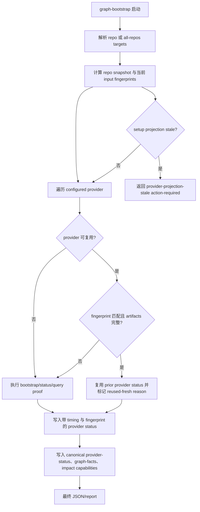

# feat: 加速 graph-bootstrap 并保证版本更新后自动失效

## Summary

本计划为 `spec-graph-bootstrap` 增加可观测耗时、版本感知 freshness fingerprint、可证明安全的 reuse fast path，并把 provider / all-repos 并行化作为后续加速层纳入同一设计边界。核心目标是在重复执行时显著缩短耗时，同时保证 spec-first、provider 或投影配置版本变化后不会复用旧 readiness。

2026-05-09 更新：本计划中关于 `code-review-graph` floating `uvx --upgrade` 的 narrow remediation 已被 `docs/plans/2026-05-09-005-fix-code-review-graph-uvx-pin-plan.md` 提前拆出并落实为 source-owned pin。本文后续 fast-reuse 设计仍保留 `floating-unverifiable` 作为通用 provider 策略，但不再代表当前 CRG 默认路径。

---

## Problem Frame

`spec-graph-bootstrap` 当前每次都会重新执行 provider bootstrap/status/query proof。这个行为证据可信，但在重复执行、父 workspace 多 child repo、外部 provider 首次下载或 provider 查询失败路径中会明显变慢。

不能用“跳过 query proof”来换速度，因为 `query_ready=true` 是 downstream workflows 选择 GitNexus/code-review-graph 的证据基础。正确改造方向是：脚本先记录每段耗时，再用可复验 fingerprint 判断上一次 ready 结果是否仍然 fresh；任何版本、配置、脚本实现、provider package 或 repo snapshot 变化都必须让旧结果失效并重新执行。

---

## Requirements

- R1. `spec-graph-bootstrap` 必须输出每个 provider command、每个 provider、单 repo 总体和 parent all-repos child 的耗时事实，便于定位慢点。
- R2. 重复执行时，如果 repo snapshot、provider 投影、spec-first 实现和 provider 版本输入都未变化，允许复用上一次可证明 fresh 的 ready / no-source 结果。
- R3. spec-first 包版本、graph-bootstrap 脚本内容、`mcp-tools.json`、`graph-providers.json`、`runtime-capabilities.json`、`provider-artifacts.json` 或 provider command/package 变化时，旧 readiness 必须自动失效。
- R4. `spec-mcp-setup` 的 bundled provider package/version 与 `.spec-first/config/graph-providers.json` 的 projected command 不一致时，graph-bootstrap 不得复用旧结果，应返回结构化 stale projection reason 并提示先刷新 setup 投影。
- R5. 无法证明 provider 版本稳定的命令不得进入默认 reuse fast path，除非先有 cheap version probe 或明确 pinned provider identity。
- R6. reuse fast path 不得削弱 readiness contract：`query_ready=true` 仍只能来自历史 verified proof 且 fingerprint fresh，不能由 build/status 成功或 live MCP 成功推导。
- R7. 加速改造必须保持 Bash 与 PowerShell parity，stdout 仍只输出最终 JSON，provider raw logs 和 canonical artifacts 仍保持原路径契约。
- R8. parent all-repos 和 provider 并行化必须保持 per-child / per-provider 隔离、稳定 summary ordering 和 partial success 语义。
- R9. 文档、contract tests、`CHANGELOG.md` 与 graph-bootstrap skill prose 必须同步说明 fast path、失效原因和降级边界。

---

## Assumptions

- A1. 用户期望优先优化重复执行和多仓维护场景，而不是压缩首次 cold run 的 provider 实际分析时间。
- A2. GitNexus 与 `code-review-graph` 默认 provider path 均已由 `mcp-tools.json` package/version pin 驱动；后续 fast-reuse 必须把 pinned identity、投影 command hash 与 provider fingerprint 一起比较，不能复用任何 phase 混用旧投影的 provider status。
- A3. 并行化可以作为同一计划的后续 implementation unit，但应在 timing 和 freshness reuse 稳定后再做，避免把 correctness 与调度复杂度混在一起。

---

## Scope Boundaries

- 不取消 provider query proof，不把 `query_ready=true` 降级为“build/status 成功即可”。
- 不把 live MCP 成功写回 `.spec-first/graph/*`，也不让 live MCP 改变 compiled readiness。
- 不由 graph-bootstrap 写回 setup-owned `.spec-first/config/graph-providers.json` 或 `.spec-first/config/runtime-capabilities.json`。
- 不手改 `.claude/`、`.codex/`、`.agents/skills/` runtime mirror。
- 不把 cache 设计成语义判断系统；脚本只比较确定性 hash、版本、路径、schema、exit code 和 artifact 完整性。
- 不默认并行 GitNexus candidate probes。候选 probe 仍按 setup 排序短路，避免给 provider/index 施加无界压力。

### Deferred to Follow-Up Work

- 其他 provider 的 package/version pin 或 cheap version probe 策略：`floating-unverifiable` 仍作为通用非 pinned provider 策略保留，但不代表当前默认 CRG 路径。
- GitNexus candidate ranking 的进一步优化：可以继续改善 setup 侧 candidate 顺序，但不作为本计划的主要提速机制。
- 用户可配置 fast/strict mode：默认应为 strict correctness；显式 fast mode 可在 reuse 与 timing 稳定后再讨论。

---

## Graph Readiness

- target_repo: `.`
- status: stale
- source_revision: `488599a351283466a5e5c08fe529989d1fd3cb9f`
- current_revision: `488599a351283466a5e5c08fe529989d1fd3cb9f`
- stale: true
- primary_providers: `gitnexus`, `code-review-graph` in compiled artifacts
- degraded_providers: none in compiled artifacts
- fallback_capabilities: Serena and `ast-grep` partial fallback are available per compiled impact capabilities
- runtime_mcp_evidence: 本轮曾针对计划主题尝试 session-local GitNexus query；由于 compiled graph facts 的 dirty worktree fingerprint 已不匹配，实际计划证据以 bounded source reads 为主
- confidence: medium
- limitations: 当前 `worktree_status_hash` 与 compiled graph facts 不一致，因此本计划将现有 readiness artifacts 视为 stale，并依赖直接源码检查与本地 docs/tests

---

## Context & Research

### Relevant Code and Patterns

- `skills/spec-graph-bootstrap/scripts/bootstrap-providers.sh` owns target resolution, provider command validation, provider command execution, GitNexus query probes, normalized artifacts, canonical graph facts, impact capabilities, bootstrap report, and final JSON result.
- `skills/spec-graph-bootstrap/scripts/bootstrap-providers.ps1` 镜像同一流程；任何 schema、timing、fingerprint、reuse 或 parallel summary 行为都必须保持 PowerShell parity。
- `write_provider_status` 当前按 provider 串行执行 `bootstrap -> status -> query_probe` 并记录 `command_results[]`，但还没有记录 command duration 或 reuse decision。
- Parent `--all-repos` 当前对每个 repo 调用同一 child bootstrap path，并把 child results 聚合到 `.spec-first/workspace/graph-bootstrap-summary.json`。
- GitNexus query probe 被有意限制为最多五个 source-derived candidates，并在第一个 process result 后停止；这保持了证据质量，但失败路径可能较慢。
- `skills/spec-mcp-setup/scripts/write-provider-config.sh` 负责把 `skills/spec-mcp-setup/mcp-tools.json` 中的 provider package projection 写入 `.spec-first/config/graph-providers.json`；graph-bootstrap 应比较这个投影，不应修改它。
- `skills/spec-mcp-setup/mcp-tools.json` 以 `package + version` pin 住 GitNexus 与 `code-review-graph`；graph-bootstrap 必须校验 bootstrap/status/query_probe 三个 phase 的 projected package token 都与 bundled package identity 一致。
- `tests/unit/spec-graph-bootstrap.sh` 已有覆盖 primary、degraded、no-source、stale、dirty-uncertain、all-repos、GitNexus diagnostics 和 provider failure modes 的 shell fixtures。
- `tests/unit/mcp-setup-powershell-contracts.test.js` 是当前 PowerShell graph-bootstrap 行为的 static parity guard，因为本地环境不一定能执行 `pwsh`。

### Institutional Learnings

- `docs/contracts/graph-evidence-policy.md` defines `confirmed`, `session-local`, `advisory`, and `stale` evidence levels. This plan should keep reuse as confirmed only when fingerprint proof is current.
- `docs/plans/2026-05-03-001-feat-workspace-graph-query-router-plan.md` established that parent workspace summaries are advisory and child repos own canonical graph facts.
- `docs/plans/2026-04-29-001-feat-startup-version-reminder-plan.md` established version checks as read-only facts that route users to update decisions rather than mutating automatically.
- `docs/10-prompt/结构化项目角色契约.md` requires scripts to prepare deterministic facts and leave semantic decisions to the LLM.

### External References

- 已跳过外部研究。本计划由本地 shell/PowerShell 脚本、spec-first artifact contract 和 provider projection policy 决定；当前外部框架资料不会实质改变设计。

---

## Key Technical Decisions

- 先增加 timing instrumentation，再做优化。没有 command/provider duration facts，后续 concurrency 或 reuse 改造无法被客观评估。
- 引入 `bootstrap_fingerprint`，而不是泛化 cache marker。fingerprint 必须包含 repo snapshot、setup-owned projections、spec-first implementation inputs、provider command identity 和 provider version identity。
- 只复用成功且有证据的状态。默认 reusable statuses 是 `ready` 与 `query-not-applicable`；`failed`、`query-unverified`、`degraded-fallback` 和 `blocked` 都不应作为 readiness success 复用。Host instruction normalization failure 仍是 advisory fact，不应改变 provider readiness reuse。
- 对版本不确定性 fail closed。没有 pinned package/version 且没有 cheap version probe 的 provider command 应设置 `reuse_eligible=false`，并给出类似 `provider-version-unverifiable` 的 reason。
- 将 setup projection drift 视为 action-required，而不是用 stale commands 静默重跑。如果 bundled `mcp-tools.json` package/version 与 `.spec-first/config/graph-providers.json` 不一致，graph-bootstrap 应先要求执行 `spec-mcp-setup`。
- 保持 host instruction normalization 在 readiness proof 之外。它的 advisory result 可以保存在 provider status，但 reuse 与 query readiness 不应依赖 prose cleanup。
- 在 provider result files 隔离之前推迟 provider/all-repos parallelism。`RUN_EXIT_CODE`、`RUN_DIAGNOSTIC`、`QUERY_PROBE_ATTEMPTS` 等 Bash globals 让同进程后台函数有 race 风险；worker subprocess 或 isolated temp-result file 是更稳妥的形态。

---

## Open Questions

### Resolved During Planning

- 版本变化是否应在 repo source 未变时也让 reuse 失效？是。Provider 行为和 graph schema 可能随版本变化，source-only freshness 不够。
- 未 pin 的 provider 是否可仅凭 command hash 复用？否。Floating package resolution 可能在 command string 不变时解析到新版本；当前 CRG 默认路径已改为 source-owned pin。
- `graph-bootstrap` 检测到 stale projection 时是否应更新 setup-owned provider config？否。它应返回结构化 reason 并提示用户重新执行 setup；projection ownership 属于 setup。
- GitNexus host instruction normalization 是否应进入 reuse fingerprint？它应作为 advisory 报告，但不应 gate graph/query readiness。可以 cheap check 现有 host block 稳定性，但不应只因为 host prose cleanup 变化就让 provider reuse 失效。
- 是否为了省时间复用 failed provider states？默认否。复用失败会隐藏用户修复环境后的恢复路径；failure summaries 可以保留给诊断，但不应 short-circuit 主路径，除非未来增加显式 diagnostic-only mode。

### Deferred to Implementation

- timing 和 fingerprint 的精确字段名可在测试中定稿，但必须稳定、machine-readable，并在 Bash/PowerShell 中镜像。
- 精确 hash helper 的位置可在实现时决定：共享 shell/PowerShell 函数可以接受；如果小型 Node helper 能减少重复 JSON hash 逻辑，也可以接受。
- all-repos job 默认值应保持保守。本计划预期先 opt-in 或 bounded concurrency，再基于 timing evidence 调整默认值。
- 第一版是否增加 `--no-reuse` flag 可在实现时决定；环境变量 override 可能已足够支持初始 rollback。

---

## High-Level Technical Design

> *This illustrates the intended approach and is directional guidance for review, not implementation specification. The implementing agent should treat it as context, not code to reproduce.*

---

## Implementation Units

- U1. **增加 command/provider 耗时观测**

**目标：** 让 graph-bootstrap 输出可复验耗时事实，先定位慢点，再判断 reuse 和并行化是否有效。

**需求：** R1, R7, R9

**依赖：** 无

**文件：**
- 修改: `skills/spec-graph-bootstrap/scripts/bootstrap-providers.sh`
- 修改: `skills/spec-graph-bootstrap/scripts/bootstrap-providers.ps1`
- 修改: `skills/spec-graph-bootstrap/SKILL.md`
- 测试: `tests/unit/spec-graph-bootstrap.sh`
- 测试: `tests/unit/mcp-setup-powershell-contracts.test.js`

**方案：**
- 在每次 provider command 执行前后记录 UTC timestamp 和 duration。
- 将 timing 字段附加到 `command_results[]`，并在 provider status 中汇总 provider 级 duration。
- parent all-repos child summary 记录每个 child 的 duration，但保持 stdout 仍为最终 JSON。
- bootstrap report 可以增加一个轻量 timing 摘要，帮助用户识别慢在 analyze/build、status、query probe 还是 child fan-out。
- PowerShell 侧使用等价 timestamp/duration 表达，contract tests 锁定字段存在和语义描述。

**遵循模式：**
- `append_command_result` 当前集中生成 command result。
- `Invoke-ConfiguredCommand` 和 `Invoke-GitNexusQueryProbeCandidate` 当前集中生成 PowerShell command result。
- parent workspace summary 已有 child start/finish stderr，可扩展为 machine-readable duration。

**测试场景：**
- 正常路径: primary repo 的每个 `command_results[]` 都包含 started/finished/duration 事实，duration 为非负数字。
- 正常路径: provider status 包含 provider 级 duration，canonical aggregate 可读取到 provider timing。
- 边界场景: command timeout 后仍记录 duration、exit code 和 raw log。
- 边界场景: skipped provider 不伪造 command duration，但 provider status 仍有明确 skip reason。
- 集成场景: parent all-repos summary 的每个 child row 包含 duration，排序仍按 child discovery order。
- 跨平台一致性: PowerShell source contract 包含 command duration、provider duration 和 child duration 字段。

**验收：**
- 用户能从 artifacts 判断慢点位于 provider bootstrap、status、query probe、host normalization 还是 child repo fan-out。
- 旧有 provider readiness 判断不因 timing 字段改变。

---

- U2. **定义 bootstrap fingerprint 与 reuse eligibility contract**

**目标：** 为后续 fast path 建立可测试的 freshness 输入集，确保版本更新、配置投影变化和脚本实现变化都会让旧结果失效。

**需求：** R2, R3, R4, R5, R6, R7, R9

**依赖：** U1

**文件：**
- 修改: `skills/spec-graph-bootstrap/scripts/bootstrap-providers.sh`
- 修改: `skills/spec-graph-bootstrap/scripts/bootstrap-providers.ps1`
- 修改: `skills/spec-graph-bootstrap/SKILL.md`
- 修改: `skills/spec-mcp-setup/SKILL.md`（如果需要澄清 provider identity 文案）
- 测试: `tests/unit/spec-graph-bootstrap.sh`
- 测试: `tests/unit/mcp-setup-powershell-contracts.test.js`

**方案：**
- 为每个 provider 计算 `bootstrap_fingerprint`，至少覆盖 repo source revision、worktree status hash、provider command hash、provider projected config hash、runtime capability hash、provider artifact contract hash、`mcp-tools.json` relevant provider identity、graph-bootstrap script hash 和 spec-first package version。
- 为每个 provider 计算 `reuse_eligible` 与 `reuse_ineligible_reason`。GitNexus 与 `code-review-graph` 可基于 pinned package/version 参与 reuse；任何非 pinned、phase-mixed 或 bundled/projected mismatch 的 provider 默认不可复用，并应给出 stale/unverifiable reason。
- 在 provider status、canonical graph facts 或 provider aggregate 中保留 fingerprint summary，供 downstream 和 resolver 判断 freshness。
- 比较 bundled provider identity 与 projected command identity，发现 mismatch 时输出 provider projection stale 事实，而不是继续用旧投影。
- Hash 内容应使用规范化 JSON，避免 key order 或 pretty-print 差异导致误失效。

**遵循模式：**
- `write-provider-config.sh` 从 `mcp-tools.json` 投影 GitNexus package/version。
- `graph-facts.json` 已有 `worktree_status_hash` 和 `staleness_hints`。
- GitNexus query stale projection 诊断已有 provider package mismatch 的 failure classification 可复用。

**测试场景：**
- 正常路径: GitNexus provider status 写入 fingerprint，且 fingerprint 包含 repo snapshot、projected command identity 和 bundled package identity。
- 正常路径: spec-first package version 或 graph-bootstrap script hash 变化时，fingerprint mismatch 会阻止 reuse。
- 边界场景: `graph-providers.json` command 数组变化时，旧 status 不可复用。
- 边界场景: `mcp-tools.json` GitNexus version 与 projected command version 不一致时，返回 projection stale reason 和 setup next action。
- 边界场景: `code-review-graph` 的任一 command phase 仍是 legacy `uvx --upgrade/--refresh code-review-graph`、缺失 package token 或不同 pinned version 时，provider status 标记 `reuse_eligible=false`，不进入 reuse fast path。
- 错误路径: fingerprint 计算所需 artifact 缺失或 schema unsupported 时 fail closed，不复用旧结果。
- 跨平台一致性: PowerShell source contract 覆盖 fingerprint、reuse eligibility、projection stale reason。

**验收：**
- 版本或投影变化后重新执行一定 cold run 或 action-required，不会从旧 provider status 得出 ready。
- Downstream graph readiness artifact 能解释为什么被复用、为什么未复用、或为什么需要先跑 setup。

---

- U3. **实现 version-safe reuse fast path**

**目标：** 在 fingerprint fresh 且 artifact 完整时跳过昂贵 provider 命令，显著加速重复执行。

**需求：** R2, R3, R5, R6, R7, R9

**依赖：** U2

**文件：**
- 修改: `skills/spec-graph-bootstrap/scripts/bootstrap-providers.sh`
- 修改: `skills/spec-graph-bootstrap/scripts/bootstrap-providers.ps1`
- 修改: `skills/spec-graph-bootstrap/SKILL.md`
- 测试: `tests/unit/spec-graph-bootstrap.sh`
- 测试: `tests/unit/mcp-setup-powershell-contracts.test.js`

**方案：**
- 在 provider cold run 前读取上一次 `.spec-first/providers/<provider>/status.json`。
- 只在 previous status 为 `ready` 或 `query-not-applicable`、fingerprint 完全匹配、provider raw/normalized/canonical artifacts 完整、schema version 支持、provider 标记 reusable 时复用。
- 复用时写入新的 provider status 或 aggregate result，明确 `readiness_source=reused` / `reuse_status=reused-fresh`，并保留原始 proof 的 raw log pointers。
- 不复用 failed、query-unverified、blocked、degraded-fallback 或 artifact 缺失状态；这些状态仍进入 cold run，使环境修复后有机会恢复。
- 提供 rollback 入口，例如环境变量禁用 reuse，便于诊断时强制 cold run。
- 保持 GitNexus host instruction normalization 为 advisory：复用 provider graph readiness 时仍可选择做 cheap host block check，但不应把 host prose cleanup 作为 readiness proof。

**遵循模式：**
- 当前 provider status schema 已集中写在 `write_provider_status`。
- `resolve-workspace-graph-targets` 已消费 `worktree_status_hash` 做 stale/dirty 判断。
- MCP setup warmup cache 的经验表明 cache marker 要能容错损坏，并且不能阻断主路径。

**测试场景：**
- 正常路径: 第一次 GitNexus cold run ready 后，第二次同 snapshot 且 fingerprint fresh 时不调用 fake `npx` GitNexus provider command，并返回 ready。
- 边界场景: 任一 provider 保持 `floating-unverifiable` 或出现 mixed phase package identity 时，第二次执行仍会 cold run 或 preflight-block 该 provider，测试明确断言它未进入 reuse fast path。
- 正常路径: GitNexus no-source / `query-not-applicable` 状态在 fingerprint fresh 时可复用，并保持 workflow mode no-source。
- 边界场景: worktree status hash 变化时不复用，重新执行 provider command。
- 边界场景: provider normalized artifact 缺失时不复用，即使 status fingerprint 匹配。
- 边界场景: previous status 为 `query-unverified` 时不复用，环境修复后可重新验证。
- 边界场景: 禁用 reuse 的环境开关存在时强制 cold run。
- 错误路径: previous status JSON 损坏时忽略旧 status 并 cold run，不因 cache 损坏失败。
- 集成场景: canonical graph facts 明确报告哪些 provider 是 reused，哪些 provider 是 cold run。

**验收：**
- 重复执行路径显著减少 provider 外部命令调用。
- 所有复用状态都有可追溯的历史 proof、fresh fingerprint 和 artifact 完整性检查。

---

- U4. **收敛 projection stale 与 provider version policy**

**目标：** 确保 spec-first 或 provider 更新后，用户重新执行 graph-bootstrap 时能自动拿到新版本路径，而不是继续使用旧投影或旧 readiness。

**需求：** R3, R4, R5, R6, R9

**依赖：** U2, U3

**文件：**
- 修改: `skills/spec-graph-bootstrap/scripts/bootstrap-providers.sh`
- 修改: `skills/spec-graph-bootstrap/scripts/bootstrap-providers.ps1`
- 修改: `skills/spec-mcp-setup/scripts/write-provider-config.sh`
- 修改: `skills/spec-mcp-setup/scripts/write-provider-config.ps1`
- 修改: `skills/spec-mcp-setup/mcp-tools.json`（仅当新增或调整 provider package/version identity）
- 修改: `skills/spec-graph-bootstrap/SKILL.md`
- 测试: `tests/unit/spec-graph-bootstrap.sh`
- 测试: `tests/unit/mcp-setup-powershell-contracts.test.js`

**方案：**
- 将 GitNexus 的 bundled package/version 与 projected command package/version mismatch 提升为 bootstrap 前置 stale projection check，而不仅是 query diagnostic 后的失败解释。
- 对 provider identity 增加 `version_policy`: pinned、version-probed、floating-unverifiable 之一。
- pinned provider 可以参与 reuse；version-probed provider 只有 probe 与 previous fingerprint 一致时参与 reuse；floating-unverifiable provider 默认不参与 reuse。
- Provider package/version 字段应由 `spec-mcp-setup` 投影命令消费；graph-bootstrap 只比较 bundled identity 与 projected command identity，不自己猜版本。
- stale projection 的 user-facing next action 指向 `$spec-mcp-setup` / 当前 host setup，而不是让用户清理 graph artifacts。

**遵循模式：**
- `mcp-tools.json` GitNexus `package` + `version` 模板化投影。
- 现有 `gitnexus-query-provider-projection-stale` 与 `gitnexus-repo-label-mismatch` reason code 风格。
- `spec-update` 与 startup reminder 的版本事实边界：检查只读，更新由显式 workflow 决定。

**测试场景：**
- 正常路径: bundled GitNexus version 与 projected command version 相同，允许后续 fingerprint/reuse 判断继续。
- 边界场景: bundled GitNexus version 升级但 `.spec-first/config/graph-providers.json` 仍是旧版本；graph-bootstrap 返回 projection stale，不复用旧 ready。
- 边界场景: 非 pinned provider 或 mixed phase package identity 即使 previous status ready 也不复用该 provider。
- 边界场景: CRG 已被 pin，命令投影 hash 与 package identity 一起进入 fingerprint，版本或投影变化后自动 invalidates。
- 错误路径: provider command shape unsupported 时仍优先走 existing unsupported-provider-command failure，不进入 fingerprint/reuse。

**验收：**
- spec-first/provider 版本更新后，重新执行不会被旧 cache 吞掉。
- setup projection stale 与 provider runtime failure 的原因能被用户区分。

---

- U5. **引入安全的 provider 与 all-repos 并行化**

**目标：** 在 correctness fast path 稳定后，缩短 cold run 和父 workspace 多 child repo 维护的墙钟时间。

**需求：** R1, R7, R8, R9

**依赖：** U1, U2, U3

**文件：**
- 修改: `skills/spec-graph-bootstrap/scripts/bootstrap-providers.sh`
- 修改: `skills/spec-graph-bootstrap/scripts/bootstrap-providers.ps1`
- 修改: `skills/spec-graph-bootstrap/SKILL.md`
- 测试: `tests/unit/spec-graph-bootstrap.sh`
- 测试: `tests/unit/mcp-setup-powershell-contracts.test.js`

**方案：**
- provider 并行化优先采用 isolated worker result file，而不是在同一 shell 进程后台调用共享全局变量函数。
- 每个 provider worker 只写自身 `.spec-first/providers/<provider>/...` 和临时 result；父流程等待所有 worker 后再写 `.spec-first/graph/provider-status.json`、`graph-facts.json`、`impact` 和 report。
- parent all-repos 使用 bounded jobs，把每个 child stdout/stderr 分离到临时文件；父流程按 discovery index 聚合，避免 JSON stdout interleaving。
- 默认并发度先保守，可通过环境变量配置；等 timing 事实证明稳定后再考虑自动默认。
- 保留 partial success：一个 child/provider 失败不能覆盖其他 child/provider 的 status。

**遵循模式：**
- PowerShell 已有 `Invoke-ChildScriptCaptured` 风格，避免把 child stdout/stderr 混在当前输出中。
- parent workspace summaries 已有 `run_id` 和 child result rows，可扩展 jobs/duration 字段。
- provider artifact 路径天然按 provider 隔离，适合 worker 化。

**测试场景：**
- 正常路径: 两个 provider cold run 在 isolated outputs 下都成功，aggregate 与串行语义一致。
- 边界场景: 一个 provider 失败、另一个 provider ready，aggregate 仍进入 degraded-fallback 或 blocked 的既有规则。
- 边界场景: parent all-repos 多 child 中一个 child 输出非 JSON，summary 只标记该 child unparseable，不破坏其他 child。
- 边界场景: jobs=1 时行为与旧串行路径一致，便于 rollback 和调试。
- 集成场景: stderr progress 可以关联 child/provider，但 stdout 仍只有最终 JSON。
- 跨平台一致性: PowerShell contract 包含 bounded child/provider execution 和 captured output，不使用会污染 stdout 的合流写法。

**验收：**
- cold run 墙钟时间随 provider/child 并行度降低，同时最终 artifacts 与串行路径语义一致。
- 并行失败不会产生半写 canonical aggregate；父流程只在 worker results 完整后写 aggregate。

---

- U6. **更新文档、报告和 downstream contract**

**目标：** 让用户和 downstream workflows 能正确理解 reused readiness、cold run、projection stale、version-unverifiable 和并行 summary。

**需求：** R6, R7, R8, R9

**依赖：** U1, U2, U3, U4

**文件：**
- 修改: `skills/spec-graph-bootstrap/SKILL.md`
- 修改: `docs/contracts/graph-evidence-policy.md`
- 修改: `docs/05-用户手册/08-三种开发模式.md`（如果用户可见 graph-bootstrap 行为发生变化）
- 修改: `CHANGELOG.md`
- 测试: `tests/unit/spec-graph-bootstrap.sh`
- 测试: `tests/unit/mcp-setup-powershell-contracts.test.js`

**方案：**
- Skill 文档说明 timing fields、reuse eligibility、fingerprint invalidation、unverifiable provider policy 和 projection stale next action。
- Graph evidence policy 增加 `reused-fresh` 的证据解释：它是 confirmed readiness 的延续，前提是 fingerprint fresh 且 raw proof 可追溯。
- 用户手册只描述用户可见行为：重复执行可能复用已验证 facts；版本更新或 setup projection stale 时会要求先刷新 setup。
- Bootstrap report 增加 human-readable timing/reuse 摘要，但不把 report 变成唯一事实源。
- Changelog 记录用户可见加速与正确性边界。

**遵循模式：**
- 当前 `spec-graph-bootstrap/SKILL.md` 已区分 compiled readiness 和 session-local live MCP。
- `docs/contracts/graph-evidence-policy.md` 已定义 confirmed/session-local/advisory/stale。
- Changelog 当前格式要求版本、日期时间、作者和 user-visible 标识。

**测试场景：**
- 正常路径: docs/prose contract 提到 reuse 不改变 query proof contract。
- 边界场景: docs/prose contract 提到 unpinned/floating provider 默认不安全复用。
- 边界场景: docs/prose contract 提到 projection stale 应 rerun setup，而不是手改 config 或 runtime mirrors。
- 集成场景: user-facing report 能区分 cold run 与 reused provider。

**验收：**
- Downstream workflow 作者能从文档判断 reused readiness 何时可信、何时需要降级。
- 用户不会把 reuse 理解成跳过验证或 live MCP 写回 compiled facts。

---

## System-Wide Impact

- **Interaction graph:** `spec-mcp-setup` 继续拥有 provider projection；`spec-graph-bootstrap` 消费 projection、运行或复用 provider readiness；`spec-plan`、`spec-work`、`spec-debug`、`spec-code-review` 消费 canonical graph facts 和 limitations。
- **Error propagation:** projection stale、version-unverifiable、fingerprint mismatch、artifact-missing、cache-corrupt、provider-timeout 应保留结构化 reason，不能压缩成 generic graph-not-ready。
- **State lifecycle risks:** reuse status 必须从 previous proof 和 current fingerprint 派生；canonical aggregate 应由当前 run 重写，避免把旧 provider status 直接当作当前 run 输出。
- **API surface parity:** Bash、PowerShell、single repo、parent all-repos、GitNexus、code-review-graph 的字段语义必须一致；PowerShell 自动化暂以 static contract 为主。
- **Integration coverage:** 单元测试要覆盖 fake provider command 是否被跳过或重跑，这是证明 reuse 是否真的生效的核心。
- **Unchanged invariants:** provider command array validation、raw log path contract、canonical graph/impact artifact 路径、live MCP session-local 边界、source/runtime 边界均不改变。

---

## Risks & Dependencies

| Risk | Mitigation |
|------|------------|
| Fingerprint 漏掉版本输入导致旧 ready 被错误复用 | 将 spec-first package version、script hash、`mcp-tools.json` provider identity、projected command hash 和 provider config hash 纳入 contract tests |
| Floating provider 被错误复用 | 默认 `reuse_eligible=false`，只有 pinned 或 version-probed provider 进入 fast path |
| 并行化引入 stdout interleaving 或 shared global race | 先实现 worker result file；父流程统一聚合，jobs=1 保持旧行为 |
| cache 损坏阻断用户 | cache/status 损坏时忽略旧结果并 cold run，保留 diagnostic，不让损坏状态成为 hard blocker |
| 用户误解 reused 为 fresh graph rebuild | report 和 status 明确 `readiness_source=reused`，并指向原 raw proof 与 fingerprint |
| setup projection stale 与 provider runtime failure 混淆 | 使用独立 reason code 和 next action：projection stale 指向 setup，runtime failure 指向 provider repair |

---

## Documentation / Operational Notes

- 这是用户可见行为变化：重复执行可能更快，但输出应明确说明哪些 provider 是 reused、哪些是 cold run。
- 版本升级后，如果 `spec-mcp-setup` 尚未刷新 provider projection，用户应看到 action-required，而不是继续拿旧 provider 运行。
- 首次 cold run 仍可能慢，因为 provider analyze/build/query proof 本身仍需要执行；本计划主要优化重复执行和多仓维护墙钟时间。
- 实施后建议在真实项目上记录 before/after timing，作为是否默认开启 all-repos 并行的依据。

---

## Alternative Approaches Considered

- **直接跳过 query proof:** 拒绝。速度提升明显，但会破坏 `query_ready=true` 的证据含义。
- **只看 repo `HEAD` 和 dirty flag:** 拒绝。provider 版本和 setup projection 更新不会反映在 source revision 中。
- **默认复用失败状态:** 拒绝。会掩盖用户修复环境后的恢复路径。
- **先做并行化再做 fingerprint:** 拒绝。并行只能缩短 cold run，不能解决重复执行；且没有 timing/fingerprint 时很难判断 correctness。
- **把 graph-bootstrap 改成写 setup config:** 拒绝。setup-owned projection 是明确边界，graph-bootstrap 只能诊断 stale projection。

---

## Success Metrics

- 重复执行同一 repo 且 GitNexus fingerprint fresh 时，GitNexus provider command 不再被调用，status 仍能解释原 proof。
- provider 版本或 `mcp-tools.json` 变化后，旧 readiness 不被复用。
- parent all-repos 的 child summary 能显示每个 child 耗时和 reuse/cold-run 情况。
- 现有 graph-bootstrap unit tests 继续覆盖 primary/degraded/no-source/stale/dirty/failure 语义。
- 用户能从 final JSON 和 bootstrap report 区分 `cold-run`、`reused-fresh`、`fingerprint-mismatch`、`provider-projection-stale` 和 `provider-version-unverifiable`。

---

## Sources & References

- 相关代码：`skills/spec-graph-bootstrap/scripts/bootstrap-providers.sh`
- 相关代码：`skills/spec-graph-bootstrap/scripts/bootstrap-providers.ps1`
- 相关代码：`skills/spec-mcp-setup/scripts/write-provider-config.sh`
- 相关代码：`skills/spec-mcp-setup/mcp-tools.json`
- 相关测试：`tests/unit/spec-graph-bootstrap.sh`
- 相关测试：`tests/unit/mcp-setup-powershell-contracts.test.js`
- 证据政策：`docs/contracts/graph-evidence-policy.md`
- 相关计划：`docs/plans/2026-05-03-001-feat-workspace-graph-query-router-plan.md`
- 相关计划：`docs/plans/2026-04-29-001-feat-startup-version-reminder-plan.md`
