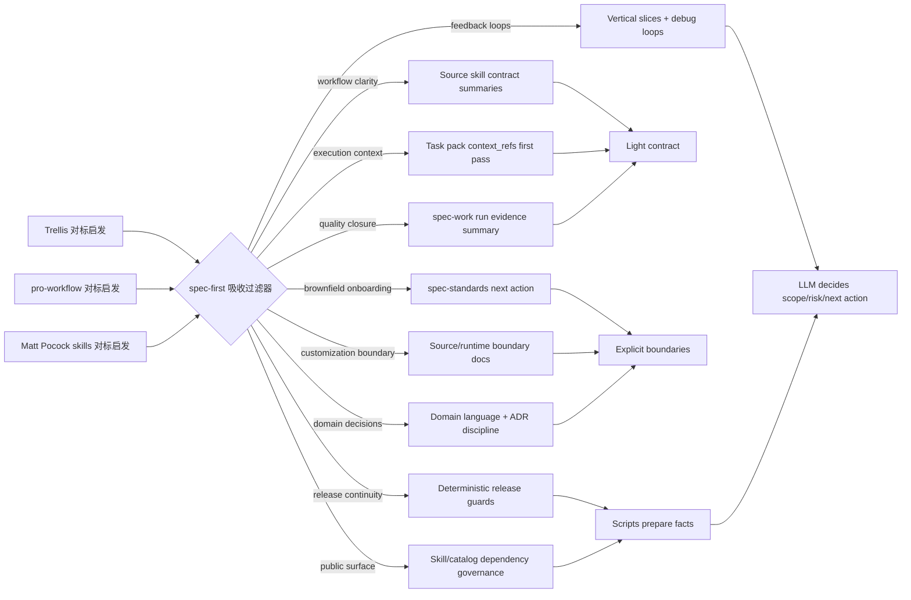

# feat: 吸收 Trellis、pro-workflow 与 Matt Pocock skills 启发的 workflow 质量提升

## 摘要

本方案把 Trellis、pro-workflow 与 Matt Pocock skills 的可取点吸收到 spec-first 的现有链路中：更清晰的 workflow contract、更低成本的 task handoff、更明确的执行 evidence、更强的 brownfield onboarding、更可靠的 release/catalog guard、更显式的 context/cost discipline、更可复用的 knowledge replay，以及更扎实的领域语言、ADR、反馈环、纵向切片和 skill 公开面治理。实现方向是 source-first、light contract、deterministic facts + LLM judgment，不迁移 Trellis 的强状态机、current-task 文件、task status 生命周期，也不把 pro-workflow 的 always-on hooks、全局 SQLite 记忆库、自动研究循环，或 Matt Pocock skills 的 issue triage 状态机、固定 `CONTEXT.md` / `docs/adr/` 目录形态搬进核心路径。

---

## 问题框架

用户要求深度理解当前项目，并连续对标用户提供的 Trellis、pro-workflow 与 Matt Pocock skills 三个外部项目，判断 agent、skill、workflow、插件公开面与工程方法中哪些设计可以吸收，以提升 spec-first 的质量。当前 spec-first 已经具备 `Codebase -> Graph -> Spec -> Plan -> Tasks -> Code -> Review -> Knowledge` 链路、双宿主 runtime generation、task-pack 派生执行输入、standards/glue baseline、review 和 compound 闭环；Trellis 的优势集中在任务执行上下文、角色分工、首次接入项目材料、检查/发布连续性等方面。

进一步对标 pro-workflow 后，新增观察是：AI coding 质量问题还来自 context 膨胀、学习无法 replay、hook/command/catalog 漂移、权限提示疲劳、review finding 未验证、并行执行缺少 suitability gate。关键不是把 pro-workflow 做成 spec-first 的第二套 hooks 和 memory engine，而是把它暴露出的质量缺口落到 spec-first 已有节点：workflow 入口更易读、task pack 更能压缩执行上下文、`spec-work` 收尾更可审计、`spec-standards` 对 brownfield 初次接入更能给出下一步、release 前对 source/runtime/docs drift 更有确定性 guard、执行前后能显式管理 context/cost/knowledge replay。

继续对标 Matt Pocock skills 后，最关键的补充不是“再收集一批 prompt”，而是把软件工程基本功落实到 spec-first 的 artifact 与 workflow 边界：共享领域语言让 agent 少猜术语，ADR 只记录真实且难逆的取舍，debug 先构造反馈环，TDD 以纵向 tracer bullet 迭代，issue/task 切分应可独立验证，hard dependency 与 soft dependency 要区别提示，skill 公开面必须和 README/plugin manifest/catalog 对齐。它与 spec-first 的契约高度一致：small composable skills、用户保留控制权、deterministic 操作脚本化、语义判断交给 LLM。

---

## 需求

- R1. Public workflow skill 必须在 source skill 内提供轻量 contract summary，让执行者能快速理解入口、source-of-truth、产物、降级和禁止事项。
- R2. `spec-write-tasks` / `spec-work` 必须强化 `context_refs` first-pass consumption：task pack 是派生执行索引，不是第二份 plan。
- R3. `spec-work` 必须提供轻量 run evidence summary，记录执行范围、验证、degraded evidence、deferred follow-up，而不引入 `.current-task` 或 per-turn 状态机。
- R4. `spec-standards` 必须改善首次 brownfield 接入后的 next action 输出，帮助用户从 project facts/glue map 进入合适 workflow。
- R5. Release/source-runtime guard 必须吸收 Trellis manifest/docs continuity 的优点，用脚本校验确定性事实，而不是让 LLM 记忆发布规则。
- R6. 必须补清 source/runtime/customization 边界，让用户知道应改 source、何时运行 `spec-first init --claude|--codex`、何时 runtime drift 只是生成结果。
- R7. Agent/skill 改进必须保持 explicit dispatch：默认不自动引入 implement/check 双 agent，也不让 agent 变成隐藏执行状态机。
- R8. 必须保持 license 安全：Trellis 为 AGPL-3.0，本方案只吸收思想和工程原则，不复制代码、大段 prose、schema 或 prompt 文本。
- R9. 必须引入显式 context discipline：workflow 应区分 context write/select/compress/isolate，task handoff 应压缩到 minimal sufficient context，长任务必须有 compaction/resume 证据。
- R10. 必须改善 knowledge replay：历史 learnings、sessions、solutions、standards 和 wiki-like 研究材料应以 provenance-backed refs 被检索和引用，不能靠模型记忆。
- R11. 必须把 review finding verification、deslop cleanup、risk/thoroughness scoring 纳入 review/work 收尾纪律，防止未验证 finding 和 AI slop 进入提交。
- R12. 必须增强 permission/safety/write-scope 边界：危险命令、秘密扫描、read-before-write、lockdown-like write scope 只能作为确定性 guard 或 workflow guidance，不能替代人类/LLM judgment。
- R13. 必须把 command/skill/agent/catalog 数量与描述 drift 纳入 release/catalog guard，避免 README、plugin metadata、runtime capability catalog 和 source inventory 不一致。
- R14. 必须引入领域语言与 ADR consumption discipline：plan/debug/work/review 在需要理解业务术语或架构取舍时，应优先消费已有 project glossary、standards、decision docs 和 ADR-like artifacts；缺失时可以建议创建，但不强制固定目录形态。
- R15. 必须把 feedback-loop-first diagnosis 与 vertical tracer-bullet slicing 写入 debug/work/task 质量标准：先建立可运行 pass/fail 信号，再修复；计划和任务拆分应优先可独立验证的纵向切片，而不是按层水平拆分。
- R16. 必须区分 hard dependency 与 soft dependency：缺失会导致错误输出的配置必须被 setup/doctor 明确提示；只会降低质量的上下文只能作为 advisory guidance，不能阻塞 workflow。
- R17. 必须治理 skill 公开面和 progressive disclosure：skill description、README、plugin/runtime catalog、governance contract 应保持一致；长 skill 内容应下沉到 references/scripts，避免主入口膨胀。

## 产品验收 / 成功信号

本方案的验收不是“多写了多少 skill prose”，而是用户在真实 AI coding 链路中更少返工、更少误判、更容易恢复上下文，并且 release 前更少漏掉公开面 drift。每个阶段都必须有用户结果级信号和反向验收。

| 阶段 | 用户结果级成功信号 | 反向验收 |
|------|--------------------|----------|
| 阶段 1 | 用户从 plan/task pack 进入 work 时，执行者能在首轮读取中说清 scope authority、acceptance、non-goals、当前 task context 和验证方式；长任务恢复时不依赖模型记忆。 | 如果执行者仍把 task pack 当第二份 plan、只读 task card 不回查 source plan 聚焦片段，或 compaction 后无法说明证据来源，则不通过。 |
| 阶段 2 | 新项目 onboarding 后，用户能看到基于 facts 的下一步候选和 LLM 解释；涉及领域术语、ADR 或 debug 时，agent 先查证再追问，先建立反馈环再修。 | 如果 workflow 继续问可从 repo/docs 推导的问题，或把 advisory standards/graph facts 当 confirmed policy，则不通过。 |
| 阶段 3 | 新增或修改 public skill 后，README、governance contract、runtime capability catalog、release/package surface 的 drift 能在 release 前被 deterministic guard 或 skill audit 明确指出。 | 如果脚本开始判断 skill 语义质量，或 guard 无法区分 blocking drift 与 docs-only no-impact，则不通过。 |

补充量化观察项可在实现 PR 中记录：not-run reason 是否减少、review finding verification 是否更完整、task-pack stale/mismatch 是否更早暴露、release 前 catalog/governance drift 是否被稳定捕获。它们是质量信号，不是硬性 KPI。

## 默认产品面与能力分层

为了避免把所有对标启发都推到默认用户路径，本方案把能力分成三层：

| 层级 | 默认行为 | 能力 |
|------|----------|------|
| 默认产品面 | 对所有 public workflow 可见；轻量、可维护、不增加必经状态。 | contract summary、source/runtime boundary、task-pack source-plan 聚焦核对、final evidence summary、not-run/degraded reason、changelog discipline。 |
| Advanced / opt-in | 只在 plan/task/review/debug 复杂度或用户意图触发时使用。 | task-pack compilation、fresh-source eval、deep plan/research、worker delegation suitability gate、domain language/decision ledger、feedback-loop-first debug、release/package guard 扩展。 |
| Internal-only | 只服务维护、审计或 release；不作为普通用户入口暴露。 | catalog/governance drift scripts、runtime capability generation、provider readiness facts、skill-audit deterministic inventory checks、rejected/out-of-scope replay indexes。 |

`src/cli/contracts/dual-host-governance/skills-governance.json` 是 public/internal skill delivery 的 source of truth。最终覆盖口径是所有 `entry_surface: workflow_command` 的 public workflow 都必须具备最低 contract summary；第一轮实现可按高频链路分批，但 R1 只有在 governance contract 中的 public workflows 全部被覆盖或明确豁免后才算完成。

---

## 假设

- A1. 本次 `$spec-plan` 只产出 durable implementation plan，不在本轮实现 skill、CLI、test 或 runtime generation 代码。
- A2. Trellis 是对标材料和启发来源，不成为 spec-first 的运行时依赖、vendored 代码或可复制文本来源。
- A3. 当前工作区已有大量未提交改动；本方案只把 graph/readiness 作为有限证据，不假设 dirty worktree 代表稳定 source truth。
- A4. 后续实现可以分阶段提交；最先落地的应是 source skill contract 和 task-pack context handoff，因为它们收益高、风险低。
- A5. 用户提供的 Matt Pocock skills 仓库是只读对标输入；该项目本地存在 MIT LICENSE，且当前插件 manifest 只暴露 skills、没有发布自定义 agents。spec-first 可吸收工程方法和治理原则，但不复制其 prose、模板或目录结构作为新 source-of-truth。

---

## 范围边界

- 不新增 Trellis 兼容层、导入器或运行时依赖。
- 不引入 `.trellis` 风格的 `.current-task`、`task.json.status`、per-turn hook 状态机或中心化 workflow engine。
- 不强制所有任务都经过 task pack；继续保留 `plan -> work`、`plan -> write-tasks -> work`、`tasks -> work` 等路径。
- 不手改 `.claude/`、`.codex/`、`.agents/skills/` 来“实现”行为；这些是 generated runtime assets。
- 不把 `.spec-first/standards/*` observed/imported/suggested 事实提升为 confirmed policy，除非由 source 文档或用户确认。
- 不让 scripts 做语义判断；scripts 输出 schema、hash、readiness、reason_code、artifact path，LLM 负责范围、风险和下一步判断。
- 不复制 Trellis 代码、大段说明、agent prompt 或 schema；所有实现应按 spec-first 架构重新表达。
- 不引入 pro-workflow 的全局 SQLite 作为 spec-first 核心记忆库；knowledge 仍以 repo-local artifacts、docs、standards、sessions 和 source contracts 为主，索引只是可再生辅助。
- 不默认安装 always-on hooks、LLM blocking hooks、auto-research overnight loop、agent teams 或 teammate mailbox。
- 不让 token/cost heuristics 凌驾质量；context/cost 只作为效率与降级信号。
- 不把 pro-workflow 的模型版本、Claude 专有 hook 行为或 plugin runtime 当作 spec-first 双宿主 source truth。
- 不强制 spec-first 或目标项目采用 `CONTEXT.md`、`CONTEXT-MAP.md`、`docs/adr/`、`docs/agents/` 或 `.out-of-scope/` 的具体目录形态；只吸收“领域语言 / 决策记录 / 拒绝原因可复用”的原则，并映射到现有 standards、contracts、solutions、plans 或项目自有文档。
- 不引入 Matt Pocock skills 的 issue tracker state machine、ready-for-agent label lifecycle、triage label vocabulary 或自动 issue 写入路径作为 spec-first 核心 workflow 状态。
- 不把 personal、writing、exercise scaffolding 类 skill 作为 spec-first 核心研发链路能力；只在文档质量、技能编写或可选 productivity rubric 层面吸收有限原则。

### 后续单独处理

- 新 public workflow 或新 agent：只有现有 workflow/agent profile 无法表达时才另开方案，不纳入第一轮。
- 自动化 benchmark/eval 平台：本方案只要求 contract tests 和 fresh-source eval，不建设长期 benchmark runner。
- 跨 repo 官网或文档站发布 gate：若需要，另开 release/website 方案处理。

---

## 图谱可用性

- status: degraded-fallback
- source_revision: `b5ca72a99056fb2dc6c21b6e0c063c5d6b8203a7`
- current_revision: `b5ca72a99056fb2dc6c21b6e0c063c5d6b8203a7`
- stale: `worktree_dirty=true`; compiled graph facts 与当前 HEAD 一致，但不覆盖 dirty worktree 中尚未提交的变更。
- primary_providers: `code-review-graph`, `gitnexus`
- degraded_providers: none reported by compiled facts
- fallback_capabilities: direct source reading, targeted `rg`, contract tests, fresh-source eval
- runtime_mcp_evidence: GitNexus live query used as session-local pointer for task-pack and standards symbols; source files and tests remain primary evidence.
- confidence: high for source layout and existing contracts; medium for current dirty worktree impact.
- limitations: provider evidence must follow `docs/contracts/graph-evidence-policy.md` and `docs/contracts/graph-provider-consumption.md`; live query success must not be written back as compiled readiness.

## 外部来源 inventory 与 clean-room 证据

外部项目只作为只读 comparative input。本方案不公开记录用户本地绝对路径；实现审查时可在本地 review notes 中保留路径和命令输出，但 plan 文档只记录可复验的 repo label、revision、license evidence 和 inspected surfaces。

| repo label | observed revision | worktree status | license evidence | inspected surfaces | authority limitation |
|------------|-------------------|-----------------|------------------|--------------------|----------------------|
| `external:trellis` | `3d0949f5b28711226423edb8472b6f7ab2f13d87` | dirty, 4 paths reported | `LICENSE` identifies AGPL-3.0 | `README.md`, `package.json`, `.agents/skills/*/SKILL.md`, `.claude/skills/*/SKILL.md`, template skill surfaces under package source, local agent/skill runtime projections | AGPL source/prose/schema 不可复制；只吸收方法原则并用 spec-first source contracts 重新表达。Dirty snapshot 只作为观察材料，不作为稳定 upstream release。 |
| `external:pro-workflow` | `9fc35f5e3cb419da8a095fa8f32015be7ce267f6` | clean | `package.json` declares MIT; no root LICENSE found in inspected snapshot | `README.md`, `package.json`, `.claude-plugin/plugin.json`, `.cursor-plugin/plugin.json`, `skills/*/SKILL.md` | License evidence 不完整；按 methodology mining 处理，不复制 implementation、schema 或长段 prose。 |
| `external:matt-skills` | `733d312884b3878a9a9cff693c5886943753a741` | dirty, 7 paths reported | `LICENSE` identifies MIT | `README.md`, `CONTEXT.md`, `.claude-plugin/plugin.json`, `skills/**/SKILL.md`, category READMEs | MIT 允许度更高，但本方案仍不复制模板或 prose；只吸收领域语言、ADR、feedback loop、skill 编写治理等可重新表达的方法。Dirty snapshot 只作为观察材料。 |

Clean-room handling:

- 只记录 ideas、trade-offs、workflow failure modes、contract boundaries 和 verification lessons。
- 不复制外部代码、schema、模板、大段 prompt 或长段 prose；新的 skill/docs/tests 必须使用 spec-first 自己的语言、文件结构和 contract。
- 如果后续实现需要引用更精确的外部事实，必须重新读取对应 local snapshot 或 upstream source，并记录 revision、license evidence、inspected file list、是否 dirty、authority limitation。
- 外部来源的“好实践”不能越过 spec-first 角色契约：scripts 只准备 facts，LLM/agents 做语义判断；generated runtime mirrors 不成为 source-of-truth。

---

## 上下文与研究

### 相关代码与模式

- `docs/10-prompt/结构化项目角色契约.md`: evolution baseline，锚定 light contract、explicit boundaries、scripts prepare facts、LLM decides。
- `skills/using-spec-first/SKILL.md`: workflow 入口治理和 public `$spec-*` 路由边界。
- `skills/spec-plan/SKILL.md`: durable implementation plan workflow，已经要求 repo-relative paths、graph readiness、source/runtime boundaries 和 right-sized plans。
- `skills/spec-write-tasks/SKILL.md`: 把 source plan 转为 derived executable task packs；必须保持 optional 且不成为 scope authority。
- `skills/spec-write-tasks/references/task-pack-schema.md`: `spec_id`、`source_plan`、`source_plan_hash`、`Task Pack Contract` 和 `context_refs` 的 identity/freshness/contract 规则。
- `skills/spec-write-tasks/references/task-quality-guide.md`: low-context execution、`stop_if`、`done_signal` 和最小 `context_refs` 的 task quality 规则。
- `skills/spec-work/SKILL.md`: 执行 workflow；最适合落地 first-pass task context consumption 和 run evidence summary。
- `docs/contracts/workflows/spec-work-run-artifact.schema.json`: `spec-work` run artifact 的现有 machine-readable surface。
- `skills/spec-standards/SKILL.md`: brownfield/project standards workflow 和 advisory/confirmed standards consumption boundary。
- `skills/spec-standards/scripts/prepare-baseline.js`: deterministic standards facts builder；适合生成 machine-readable next-action candidates，但不做语义路由决策。
- `skills/spec-standards/scripts/validate-artifacts.js`: standards artifact validation；适合承担 schema/field invariants。
- `src/cli/task-pack.js`: deterministic task-pack parser/validator；验证结构和 freshness，不判断 task 语义质量。
- `src/cli/contracts/dual-host-governance/skills-governance.json`: public/internal skill delivery 与 host runtime 边界的 source of truth。
- `src/cli/plugin.js`: runtime asset catalog、filtered source delivery、governance checks 和 release/package surface。
- `src/cli/adapters/claude.js` 与 `src/cli/adapters/codex.js`: dual-host runtime projection；任何 host-visible 变化都必须保持两端一致。
- `scripts/generate-runtime-capability-catalog.js`、`scripts/release-publish.cjs`、`scripts/run-test-suite.cjs`: release/catalog/test runner surface，确定性 continuity guards 应落在这里。
- `skills/spec-debug/SKILL.md`: root-cause-first debug workflow；适合落地 feedback-loop-first、hypothesis ledger 和 post-fix prevention handoff。
- `skills/spec-skill-audit/SKILL.md`: skill governance 审计入口；适合落地 trigger precision、progressive disclosure、public-surface drift 和 script-owned deterministic work 检查。
- `skills/spec-compound/SKILL.md`、`skills/spec-compound-refresh/SKILL.md`、`skills/spec-sessions/SKILL.md`: knowledge capture、refresh 与 replay 链路；适合吸收 provenance-backed learnings、rejected rationale 和 stale learning 检索。
- 外部对标 Matt Pocock skills：README 强调 small composable skills；`CONTEXT.md` 展示领域语言；ADR 0001 区分 hard/soft dependency；`diagnose`、`tdd`、`grill-with-docs`、`to-issues`、`write-a-skill` 分别提供反馈环、纵向切片、领域语言、任务切分和 skill 编写治理参考。

### 项目沉淀

- `docs/03-实施方案/2026-04-26-spec-write-tasks-技术方案.md`: task pack 是“派生型执行压缩器”，不是 mandatory stage 或第二计划。
- `docs/contracts/workflows/spec-id-traceability.md`: `spec_id` 是跨 artifact 身份，不是状态、审批、进度或 freshness；`source_plan_hash` 才处理 task-pack freshness。
- `docs/solutions/workflow-issues/modify-source-not-artifacts-2026-04-13.md`: runtime mirror 滞后不等价于 source 错误；修改 source 后再通过 init 刷新 runtime。
- `docs/contracts/workflows/fresh-source-eval-checklist.md`: skill/agent prose 变更后，需要 fresh-source eval 或明确记录未执行原因。
- `docs/plans/2026-05-07-002-feat-gitnexus-evidence-governance-plan.md`: graph evidence 是 evidence，不是 workflow state 或第二 plan。
- `docs/plans/2026-04-22-002-fix-graph-bootstrap-boundary-contract-plan.md`: runtime/source/target repo/package CLI surfaces 必须明确，避免 LLM 用错决策输入。
- `docs/solutions/workflow-issues/self-reflection-cud-contract-loop-2026-05-05.md`: recurring workflow upgrade 优先 light source contract + review evidence + compound，不先堆状态机。

### Trellis 观察

本节逐个拆 Trellis 的 skill 与 agent，只分析可参考的工程思想，不复制实现、prompt、schema 或长段 prose。吸收标准是：能否服务 spec-first 的 `Codebase -> Graph -> Spec -> Plan -> Tasks -> Code -> Review -> Knowledge` 链路；能否保持 `Light contract + Explicit boundaries + Scripts prepare, LLM decides`；能否落到现有 source skills、agents、contracts、tests，而不是引入第二状态机。

#### Trellis skill: `trellis-start`

- 内容重点：启动 session 时读取当前状态、workflow overview、developer/project guidelines，再基于是否有 active task、是否已有 PRD 等信息决定下一步。
- 可参考点：入口层先收集 facts，再做 route recommendation。它把“读当前状态”和“决定下一步”拆开，能减少 agent 直接跳进实现的概率。
- 不能照搬点：Trellis 依赖 `.trellis` active task 与 task status；spec-first 不应引入 `.current-task` 或 active-task 作为 scope authority。
- spec-first 落点：`using-spec-first` 和 public workflow contract summary 可以吸收“启动时先读 facts、再推荐 workflow”的结构；`spec-standards` brownfield onboarding 可以输出 next-action candidates，但最终 route 仍由 LLM 解释。
- 对应实施单元：U1、U4。

#### Trellis skill: `trellis-brainstorm`

- 内容重点：先创建 task/PRD，自动检查 repo/docs，再只问高价值问题；技术选择先研究再给 2-3 个具体选项；先发散未来演进、相关场景和失败边界，再收敛 MVP；最后形成 PRD、acceptance criteria、out-of-scope 和小 PR 实施计划。
- 可参考点：`action-before-asking` 是最有价值的机制。Brainstorm 不应先问“代码在哪”“要不要我查”，而应先读 repo、docs、configs、existing patterns；只有无法从事实推导的阻塞问题或偏好问题才问用户。spec-first 可把它吸收到 `spec-brainstorm` / `spec-plan` 的前置调研：凡能由 codebase、docs、standards、graph facts、existing plans 推导的问题，不进入用户问题列表。
- 可参考点：`Question Gate` 值得明确固化。每个候选问题先分成三类：可推导、阻塞、偏好。可推导问题由 agent 自行查证；阻塞问题才直接问用户；偏好问题必须先给 2-3 个具体方案和 trade-off 再问。spec-first 可以把这个 gate 加入 `spec-brainstorm`，并在 requirements doc 中保留“为什么这是用户偏好而不是可推导事实”的轻量依据。
- 可参考点：`one-question-at-a-time` 能降低用户负担，也能防止需求澄清变成问卷。spec-first 已有 blocking question 工具约束，但可以进一步要求每轮回答后立即更新 requirements artifact：answered item 从 open question 移入 requirements、acceptance criteria、out-of-scope 或 assumptions。
- 可参考点：`research-first for technical choices` 很适合 spec-first。涉及 library、protocol、framework、CLI UX、plugin mechanism 或行业惯例时，先 research，再提出可执行选项；不要让用户凭空枚举方案。spec-first 可映射到 `spec-plan` 的 repo researcher / learnings researcher / external docs research，并把输出压缩为 2-3 个 feasible approaches。
- 可参考点：`diverge -> converge` 可以补强 scope quality。在收敛 MVP 前先扫未来演进、相邻流程、失败/边界场景，然后明确哪些纳入 MVP、哪些进入 out-of-scope。spec-first 的 `spec-brainstorm` 可以把这一步做成标准小节，`spec-plan` 则把结果落到 Scope Boundaries、Risks、Deferred Work。
- 可参考点：持续更新 PRD 的节奏值得吸收。Trellis 会维护 known facts、temporary assumptions、open questions、requirements、acceptance criteria、Definition of Done、out-of-scope、technical notes。spec-first 对应产物应是 `docs/brainstorms/*-requirements.md`，并用 `spec_id` 串到后续 plan/task pack，而不是让关键决策只留在对话里。
- 可参考点：`ADR-lite` 适合复杂需求收敛。对架构或产品取舍，记录 context、decision、consequences；spec-first 可把它并入 `spec-plan` 的 Key Technical Decisions，要求每个重大取舍说明为什么选、代价是什么、未来如何调整。
- 可参考点：最终确认和小 PR 分解能提升 handoff 质量。Brainstorm 结束前应确认 goal、requirements、acceptance criteria、DoD、out-of-scope、technical approach；spec-first 可映射为：`spec-brainstorm` 输出 requirements，`spec-plan` 输出 implementation units，`spec-write-tasks` 可选地产生 task pack。
- 不能照搬点：Trellis 的 task-first 会强制创建任务目录；spec-first 不应让所有 brainstorm 都落成 task pack 或 task directory。spec-first 可以生成 requirements doc 或 plan，但不应把“存在任务目录”作为 workflow 前提。
- 不能照搬点：Trellis 明确要求 research sub-agent 写入 task research 文件；spec-first 应保持当前 `spec-plan` documented read-only research phase 和 fallback，不把所有技术选择都强制 subagent 化。
- 不能照搬点：Trellis PRD 绑定 task lifecycle；spec-first 的 requirements doc 是 source artifact，不是状态机节点。后续 freshness 通过 `spec_id`、origin path、plan/task-pack hash 和 validation，而不是 task status。
- spec-first 落点：增强 `spec-brainstorm` 的 question gate、research-first mode、divergence sweep、artifact update discipline 和 ADR-lite；增强 `spec-plan` 对 brainstorm 产物的 traceability consumption；task-pack 仍只作为 plan 后的 optional execution compression。
- 最小实施建议：先在 `skills/spec-brainstorm/SKILL.md` 增加四个轻量 contract 小节：`自助取证优先`、`问题分流 gate`、`技术选择 research-first`、`发散后收敛`；再补 `tests/unit/spec-brainstorm-contracts.test.js` 覆盖不能问懒问题、一次一个高价值问题、偏好问题必须带选项、复杂决策必须记录取舍。
- 对应实施单元：U1、U2、U7。

#### Trellis skill: `trellis-before-dev`

- 内容重点：编码前发现相关 package/layer spec index，读取 pre-development checklist 和 shared guides，再进入实现。
- 可参考点：先读“索引”，再读“索引指向的具体规范”，这个两段式加载能降低上下文成本，也避免只读目录但没读真正规则。
- 不能照搬点：Trellis 把 `.trellis/spec/` 作为项目内规范系统；spec-first 已经有 `.spec-first/standards/*`、`docs/contracts/**`、`docs/solutions/**` 和 AGENTS/CLAUDE source boundaries，不能新增平行规范根。
- spec-first 落点：`spec-work` 的开始阶段应吸收“先读相关 standards/glue/contracts，再读具体 context refs”的姿态；`context_refs` 应支持指向具体 sections/files，而不是只指向整份 plan。
- 对应实施单元：U2、U4。

#### Trellis skill: `trellis-continue`

- 内容重点：恢复任务时先读取 current context 和 phase index，再根据 task status 与 artifact presence 找到应恢复的 phase/step。
- 可参考点：恢复时不要靠模型记忆，要根据 artifacts 判断下一步；这对长任务、压缩上下文后的继续执行很有价值。
- 不能照搬点：它的核心依赖 status field 和 phase state machine；spec-first 明确不应把 plan/task-pack/run artifact 变成 progress state store。
- spec-first 落点：`spec-work` 可以在 resume 场景读取 git diff、plan、task pack freshness、run evidence 和 validation notes，给出 session-local continuation posture；但不写入“当前 phase”状态。
- 对应实施单元：U2、U3。

#### Trellis skill: `trellis-check`

- 内容重点：先识别变更，再读取适用 specs，运行 lint/typecheck/tests，然后按 code quality、test coverage、spec sync、cross-layer data flow、code reuse、imports、same-layer consistency 做检查，并要求修复后重跑。
- 可参考点：检查维度覆盖了 spec compliance、自动化验证、跨层流、复用一致性和知识同步。这个结构比单纯“跑测试”更贴近 AI coding 风险。
- 可参考点：它把“是否需要更新 spec”放进 quality gate，能推动执行结果进入知识沉淀。
- 不能照搬点：Trellis 的 check 默认可以自修并写代码；spec-first 的 `spec-code-review` 和 `$spec-doc-review` 应保持 review 与 autofix 边界清晰，只有用户授权或 workflow 明确允许时才改。
- spec-first 落点：强化 `spec-code-review` / `spec-work` final evidence：changed files、验证命令、cross-layer impact、knowledge update 是否需要；把“spec sync needed?” 转化为 `spec-compound` 或 docs/solutions follow-up。
- 对应实施单元：U3、U7、U8。

#### Trellis skill: `trellis-finish-work`

- 内容重点：收尾时检查 active tasks、git status、recent commits，分类 dirty paths，确认哪些路径属于当前任务，归档任务并记录 session journal。
- 可参考点：dirty-path classification 很实用，能防止 agent 在脏工作区误提交或混入其他窗口改动；session journal 也体现了 execution evidence 的价值。
- 不能照搬点：自动 archive task 和自动 journal commit 依赖 Trellis task lifecycle；spec-first 不应默认自动提交、归档或写开发者日志。
- spec-first 落点：`spec-work` final response 和 run evidence summary 可吸收 dirty-path classification、verification summary、deferred follow-up、not-run reason；不要引入 task archive。
- 对应实施单元：U3、U8。

#### Trellis skill: `trellis-break-loop`

- 内容重点：bug 修复后从 root cause category、fix failed reasons、prevention mechanisms、systematic expansion、knowledge capture 五个维度复盘，并要求把结果写回 specs/guides。
- 可参考点：它把 bug 归因分成 missing spec、cross-layer contract、change propagation failure、test coverage gap、implicit assumption，适合转化为 `spec-debug` 和 `spec-compound` 的复盘维度。
- 可参考点：prevention mechanisms 分层清楚：documentation、architecture、compile-time、runtime、test coverage、code review。这能帮助 spec-first 把 bugfix 之后的动作从“写总结”升级为“选择合适的防复发机制”。
- 不能照搬点：它要求立即更新 Trellis spec、同步 templates、提交 spec updates；spec-first 应按 source/runtime 边界、用户授权和 changelog 规则执行，不自动提交。
- spec-first 落点：增强 `spec-debug` 的 post-fix analysis 和 `spec-compound` 的 capture rubric；将复盘结果沉淀到 `docs/solutions/**`、contracts 或 tests，而不是写入 generated runtime。
- 对应实施单元：U3、U7、U8。

#### Trellis skill: `trellis-update-spec`

- 内容重点：把实现中学到的 executable contracts、签名、payload fields、env keys、validation/error behavior、good/base/bad cases 和 tests required 写回 code-spec；区分 code-spec 与 guide。
- 可参考点：它对“知识沉淀必须可执行、可测试、可验证”的要求非常接近 spec-first 的目标。尤其是 7-section contract 模板，适合启发 spec-first 的 docs/solutions、contracts 和 task-pack quality。
- 可参考点：它区分“how to implement safely”的 code-spec 与“what to consider”的 guide，这能帮助 spec-first 避免把 checklist、policy、contract、artifact schema 混在一份文档里。
- 不能照搬点：Trellis 的 `.trellis/spec/` 是项目内规范写入目标；spec-first 的 source-of-truth 更分散且更严格，包括 `skills/`、`agents/`、`templates/`、`src/cli/contracts/**`、`docs/contracts/**`、`docs/solutions/**`。
- spec-first 落点：为 `spec-compound`、`spec-standards` 和 docs contract 增加“executable contract depth”判断：涉及 CLI/API/schema/env/cross-layer 时，必须有 signatures、validation matrix、good/base/bad cases 和 tests。
- 对应实施单元：U4、U6、U8。

#### Trellis skill: `trellis-meta`

- 内容重点：解释本地 Trellis 架构、平台目录、generated files、customization entry points 和不要修改全局安装目录的边界。
- 可参考点：这是最直接可吸收的 source/runtime/customization boundary 模型。它把 local architecture、platform files、customization topics 拆成 reference index，能降低用户改错位置的概率。
- 不能照搬点：Trellis 允许本地修改 `.trellis/` 和平台目录；spec-first 的 generated runtime assets 不应作为默认 source patch 入口。spec-first 要强调 checked-in source-first，再通过 `spec-first init --claude|--codex` 投影 runtime。
- spec-first 落点：新增 `docs/contracts/source-runtime-customization-boundary.md`，并在 README/doctor/init 文档中说明 source、runtime mirror、target repo artifacts、provider facts 四类 surface。
- 对应实施单元：U6。

#### Trellis skill: `first-principles-thinking`

- 内容重点：用 axioms、problem essence、assumptions、ground truths、reasoning chain、validation/stress-test 六阶段防止浅层类比和默认 best practice。
- 可参考点：它对“每一步必须产出 artifact 才能进入下一步”的 gate 设计，适合 spec-first 用在 architecture/prompt/workflow governance 的高风险计划或 review 中。
- 可参考点：把 assumptions 与 ground truths 分开，能防止 LLM 把 advisory facts、provider hints 或传统做法当成 confirmed truth。
- 不能照搬点：它有 Trellis task artifact integration，例如 `fp-analysis.md`、progress tracker、task.json 状态。spec-first 不应新增 FP progress artifact 作为 workflow state。
- spec-first 落点：把第一性原理作为 `spec-plan` Deep plan 或 `spec-ideate` 的 optional reasoning mode，用于复杂架构决策；输出应落到 plan 的 assumptions、key decisions、risks，而不是新状态文件。
- 对应实施单元：U1、U7。

#### Trellis skill: `python-design`

- 内容重点：围绕 deep modules、type-first、information hiding、pull complexity downward、define errors out of existence、KISS/rule of three、responsibility boundaries、shared infrastructure、structured CLI parsing，约束 CLI scripts 设计。
- 可参考点：虽然 spec-first 是 Node.js CommonJS，不是 Python，但原则高度适用于 `src/cli/` 和 `scripts/`：集中路径解析/IO/外部命令执行；用 schema/typed contracts 固化边界；避免 raw dict/raw process result 在多层传递；解析 CLI 输出时保留语义 whitespace。
- 可参考点：“按知识封装拆模块，而不是按执行顺序拆模块”特别适合 spec-first 当前的 CLI/helpers/contracts/refactor 判断。
- 不能照搬点：Python 类型工具、dataclass、TypedDict、NewType 等实现形态不适用于本仓库；只能吸收设计原则，用 JS contract tests 和 schema 验证表达。
- spec-first 落点：在 `spec-standards` 生成项目规范和 code review rubric 时吸收这些 red flags；对 CLI 脚本改动增加 shared helper、structured output、path safety、non-shell spawn 等检查。
- 对应实施单元：U4、U5、U7。

#### Trellis skill: `contribute`

- 内容重点：贡献 skill/template/docs 时要求 marketplace registry、docs navigation、双语页面、local preview、lint/verify、frontmatter、broken links 和 PR checklist。
- 可参考点：它把“新增能力”拆成 source registry、docs registry、双语 docs、导航、预览和 PR checklist，适合 spec-first 的 public skill/agent/README/runtime catalog 治理。
- 可参考点：双语内容一致性和 docs structure verification 与 spec-first 当前 `README.md` / `README.zh-CN.md`、runtime catalog、changelog 治理方向一致。
- 不能照搬点：Trellis 的 docs repo/Mintlify/marketplace paths 不适用于 spec-first；spec-first 不应引入独立 marketplace registry，除非另开产品级计划。
- spec-first 落点：release/source-runtime continuity guards 可吸收“新增 public surface 必须更新 registry/docs/catalog/changelog”的 checklist；README language split tests 可继续承担双语对齐。
- 对应实施单元：U5、U8。

#### Trellis agent: `research`

- 内容重点：只负责查找、解释、记录信息；区分 internal/external/mixed research；internal 从 specs 和代码模式开始；external 必须拉取真实 source/docs，写入 task context 文件，并用 evidence 支撑 claims；再为 implement/check 写 JSONL context。
- 可参考点：角色边界非常清晰：research 不改源代码，不做实现建议泛化，产物是可被下游 agent 读取的 bounded context。这与 spec-first 的 repo researcher / learnings researcher / graph evidence policy 高度一致。
- 可参考点：“摘要不是证据，链接不是研究”的标准能强化 spec-first 对 external research 和 GitNexus/session-local evidence 的证据等级要求。
- 不能照搬点：Trellis research 会写 `.trellis/tasks/{id}/context/*` 和 JSONL；spec-first 目前不应把 research 结果强绑定到 task directory。计划/review 阶段可以使用 artifact references，但不让它成为 mandatory task state。
- spec-first 落点：收紧 `agents/spec-repo-research-analyst.agent.md`、`agents/spec-learnings-researcher.agent.md` 和 `spec-plan` research phase：要求 facts、paths、evidence level、unanswered questions，减少 paraphrase-only research。
- 对应实施单元：U2、U7。

#### Trellis agent: `implement`

- 内容重点：读取 specs、requirements、PRD/info，按 existing patterns 实现，运行 lint/typecheck，自身禁止 git commit/push/merge。
- 可参考点：实现 agent 的职责边界清晰：读规范、读需求、写代码、自检，但不负责提交和流程推进。对 spec-first worker delegation 很有参考价值。
- 不能照搬点：Trellis implement 默认嵌在 task lifecycle 中；spec-first 不应默认每次 `spec-work` 都 spawn implement agent。Codex subagent/worker 只能在用户或 workflow 明确授权、且写范围清楚时使用。
- spec-first 落点：如果后续强化 `spec-work-beta` 或 worker delegation，应继承“明确禁止 git commit/push/merge、必须先读 source plan/task context、必须自检”的 contract。
- 对应实施单元：U7。

#### Trellis agent: `check`

- 内容重点：读取 diff 和 specs，检查目录结构、命名、模式、类型、潜在 bug，直接修复问题并运行 lint/typecheck；同时有 forbidden changes，防止破坏 workflow enforcement。
- 可参考点：check agent 把“review + small fix + verification”合在一个 bounded role 中，并明确 forbidden changes。这个模式可启发 spec-first 对 review autofix 的边界说明。
- 不能照搬点：spec-first 的 code review 默认应先报告 findings；自动修复必须有清晰授权和 write scope，不能让 reviewer 隐式修改代码。
- spec-first 落点：`spec-code-review` 可以吸收 forbidden-change guard、diff-first orientation、spec-compliance scan；`spec-work` 可在 final check 时列出 self-fix 是否发生以及验证结果。
- 对应实施单元：U3、U7。

#### pro-workflow 观察

本节逐个拆 pro-workflow 的 34 个 skill 与 8 个 agent。pro-workflow 的优势集中在 context engineering、self-correction memory、hook-driven quality gates、parallel orchestration、knowledge wiki 和 verified review。spec-first 的吸收标准仍是角色契约：不能把 always-on hook engine、全局 SQLite store、agent team state 或 LLM blocking gate 搬进核心路径；能吸收的是可验证 evidence、轻量 contract、显式边界和可再生 knowledge artifacts。

##### pro-workflow skill: `agent-teams`

- 内容重点：多 Claude Code session 作为 team lead / teammates 协作，带共享 task list、mailbox、file lock、plan approval 和 teammate idle hooks。
- 可参考点：任务分解必须 non-overlapping files、independent verification、clear done criteria；3-5 个 worker 是合理上限；并行协作必须先做 plan approval 和 file ownership。
- 不能照搬点：agent teams 是 Claude Code 实验能力，依赖共享 task state、mailbox 和 file locks；spec-first 不应把它作为默认执行模型，也不应在 Codex/Claude 双宿主核心中引入 teammate lifecycle。
- spec-first 落点：强化 `spec-work-beta` / `git-worktree` 的 parallel suitability gate 和 file ownership language；在 task pack wave 分解中明确 disjoint write set 和 dependency ordering。
- 采纳等级：P1。

##### pro-workflow skill: `auto-setup`

- 内容重点：通过项目文件探测 Node/Python/Rust/Go/Mixed，配置 lint/typecheck/test/format 和权限/ hooks。
- 可参考点：deterministic project type detection 与 quality gate candidate 输出适合 `spec-standards` / `spec-mcp-setup`，尤其是“detect, don't assume”和 missing tools actionable guidance。
- 不能照搬点：直接生成 `.claude/settings.json` 与 hooks 配置会越过 spec-first 的 source/runtime 边界和双宿主治理；工具命令候选不能被脚本提升为 confirmed policy。
- spec-first 落点：让 `spec-standards` baseline 增加 quality_gate_candidates 与 tool_readiness reason codes，由 LLM 决定推荐 workflow 和验证命令。
- 采纳等级：P0。

##### pro-workflow skill: `batch-orchestration`

- 内容重点：大型机械变更先 research、decompose、approval，再以 isolated worktrees 并行执行 5-30 个 units。
- 可参考点：batch suitability 条件清楚：mechanical、repetitive、independent、self-contained、verifiable；不适用于 architecture/schema/shared-state/human-judgment-heavy changes。
- 不能照搬点：自动每 unit 开 PR、后台 agent 并行执行和 heavy worktree orchestration 不应进入稳定 `spec-work` 默认路径。
- spec-first 落点：增强 `spec-write-tasks` wave decomposition 与 `spec-work-beta` worker delegation：只有可机械拆分且写集独立时才允许并行 worker；否则保留单 orchestrator 执行。
- 采纳等级：P1。

##### pro-workflow skill: `bug-capture`

- 内容重点：把用户口头缺陷转成 GitHub issue，用领域语言描述行为，避免文件路径/行号泄露到 issue，先查重再创建。
- 可参考点：bug report artifact 应稳定跨重构，适合 spec-first 的 `spec-debug` / `spec-compound` bug capture：issue 面向行为与复现，不面向当前实现位置。
- 不能照搬点：自动 `gh issue create` 需要明确用户授权；spec-first 不应默认联网写 issue。
- spec-first 落点：`spec-debug` 可增加“issue-ready defect summary”输出选项：what happened、expected、repro、domain context、duplicate check status。
- 采纳等级：P2。

##### pro-workflow skill: `compact-guard`

- 内容重点：compact 前保存当前任务、最多 5 个关键文件、决策、blockers 和 next steps；compact 后立即恢复关键上下文。
- 可参考点：长任务 evidence 需要 compaction/resume boundary；“下一步一句话 + touched files + decisions + blockers”适合 `spec-work` run evidence。
- 不能照搬点：Claude Code compaction constants 和 `/compact` 行为是 host-specific；spec-first 不应把它写成双宿主确定性事实。
- spec-first 落点：U3 扩展 `spec-work` run evidence：context checkpoint、resume cue、not-run reason、current limitations；host-specific 数字只作为 advisory。
- 采纳等级：P0。

##### pro-workflow skill: `context-engineering`

- 内容重点：Write / Select / Compress / Isolate 四操作，配合 memory taxonomy、AGENTS.md 互操作、MCP/tool overhead 与 compaction strategy。
- 可参考点：这是 pro-workflow 最值得吸收的抽象。spec-first 的 task pack、standards、sessions、compound、graph evidence 都可用这四操作解释，能成为 project role contract 的实践层。
- 不能照搬点：root CLAUDE.md 行数、Claude-specific lazy loading 和模型成本数值不能成为 spec-first 通用 contract。
- spec-first 落点：新增或扩展 `docs/contracts/context-evidence-boundary.md`，把 artifacts 分为 write/select/compress/isolate，并让 `spec-plan` / `spec-work` 明确 minimal sufficient context。
- 采纳等级：P0。

##### pro-workflow skill: `context-optimizer`

- 内容重点：按 context 使用率、MCP 数量、工具数量、subagent 输出、CLAUDE.md 尺寸给出优化建议。
- 可参考点：context health 可作为 degraded-mode evidence；MCP/tool schema overhead 与 spec-first provider boundary 高度相关。
- 不能照搬点：`/context`、`CLAUDE_AUTOCOMPACT_PCT_OVERRIDE`、MCP 数量阈值等是 host/provider-specific，不能硬编码为 spec-first pass/fail。
- spec-first 落点：`spec-mcp-setup` / `spec-graph-bootstrap` / `spec-work` 输出 context pressure advisory facts；release/doc 不把 advisory 当 confirmed。
- 采纳等级：P1。

##### pro-workflow skill: `cost-tracker`

- 内容重点：按任务类型估算成本、tool-call budget、模型选择和 budget alerts。
- 可参考点：tool-call budget 与 wrap-up threshold 能帮助长任务停下来产出 evidence，而不是无界探索。
- 不能照搬点：美元成本、模型选择和具体价格强时效，不能写进 durable spec-first source。
- spec-first 落点：只吸收“effort budget + wrap-up threshold”思想到 `spec-work` 和 `spec-code-review`：超过预算时做 status/evidence checkpoint。
- 采纳等级：P2。

##### pro-workflow skill: `deslop`

- 内容重点：对当前 branch diff 删除 AI 产生的过度抽象、无用注释、防御性代码和 scope creep，验证行为不变。
- 可参考点：AI slop 是 spec-first review 的真实风险；“cleanup must be behavior-preserving and diff-grounded”适合 `spec-code-review` 与 `spec-work` final pass。
- 不能照搬点：固定 against `origin/main` 和 broad cleanup 可能误删用户改动；spec-first 必须尊重 dirty worktree 与用户所有权。
- spec-first 落点：`spec-code-review` 增加 AI-slop rubric；`spec-work` 收尾只清理本次引入的 slop，并记录验证命令。
- 采纳等级：P0。

##### pro-workflow skill: `file-watcher`

- 内容重点：用 FileChanged/CwdChanged hooks 对 `.env`、package/config 文件变化做 reactive reminders 和 env injection。
- 可参考点：dependency/config drift 是 workflow 输入质量问题；对 package/config 变化触发 re-validate 的思想可吸收。
- 不能照搬点：always-on file watching 和 `CLAUDE_ENV_FILE` 是 Claude runtime behavior，不能成为 spec-first source contract。
- spec-first 落点：release/doctor/standards 可增加“changed config implies re-run readiness/quality gate”的 deterministic advisory，不引入 watcher。
- 采纳等级：P2。

##### pro-workflow skill: `insights`

- 内容重点：统计 session、learning、correction heatmap 和 productivity metrics，找 recurring corrections 和 stale learnings。
- 可参考点：knowledge health 应该可审计。spec-first 的 `spec-sessions` / `spec-compound-refresh` 可以吸收 recurring issue、stale learning、most-used pattern 的分析维度。
- 不能照搬点：以 correction rate 驱动行为 gate 需要可靠数据源；spec-first 当前不能假设所有 session 都写入同一 DB。
- spec-first 落点：`spec-sessions` 可输出 “recurring corrections / stale learnings / high-risk areas” research digest；`spec-compound-refresh` 可据此找 drifted docs。
- 采纳等级：P1。

##### pro-workflow skill: `learn-rule`

- 内容重点：用户纠正后形成 `[LEARN] Category: rule`，带 mistake/correction，等待用户批准再持久化；可 wiki-scope。
- 可参考点：必须经用户批准、保留 mistake/correction context、规则要具体可执行，这些很适合 `spec-compound`。
- 不能照搬点：自动写 LEARNED 或 SQLite 会制造多真相源；spec-first 的知识沉淀应落到 `docs/solutions/**`、contracts、standards 或 sessions artifacts。
- spec-first 落点：增强 `spec-compound`：capture 时区分 mistake、correction、scope、applicability、tests required，并标记 project-local/global。
- 采纳等级：P0。

##### pro-workflow skill: `llm-council`

- 内容重点：多 provider 独立回答、匿名互评、chairman synthesis，并把 transcript 持久化到 wiki。
- 可参考点：三阶段 deliberation 对高风险 plan/review 很有启发，尤其是保留 raw responses 和 rankings 作为审查证据。
- 不能照搬点：provider-agnostic multi-LLM runner、raw response 存储和模型互评成本高，且容易把 LLM vote 误当 truth。
- spec-first 落点：不新增 council runner；只把“independent reviewer findings + synthesis + contradiction resolution”继续用于 `$spec-doc-review` / `$spec-code-review`。
- 采纳等级：P2。

##### pro-workflow skill: `llm-gate`

- 内容重点：用 prompt hooks 阻断 commit、secret、destructive command 等操作。
- 可参考点：某些规则需要 semantic check，可作为 advisory reviewer 的一层。
- 不能照搬点：LLM-powered blocking gate 与 spec-first 的 scripts prepare facts / LLM decides 边界冲突；blocking guard 应尽量 deterministic，人类/LLM 负责解释。
- spec-first 落点：拒绝进入核心 release/doctor guard；只允许在 review workflow 中作为 non-blocking semantic finding。
- 采纳等级：不采纳核心，P2 advisory。

##### pro-workflow skill: `mcp-audit`

- 内容重点：统计 MCP server/tool 数量、token overhead、重叠和长期未使用 server。
- 可参考点：spec-first 已有 provider evidence boundary，但缺少 provider/tool overhead 的用户可见 audit。
- 不能照搬点：具体 token 估算阈值不稳定，不能用作硬失败。
- spec-first 落点：`spec-mcp-setup` / `runtime-capabilities` 增加 MCP overhead advisory：active providers、tool counts、overlap、degraded/not used status。
- 采纳等级：P1。

##### pro-workflow skill: `module-map`

- 内容重点：为陌生代码区域输出一屏 map：entry points、core modules、flow、callers、hidden coupling；每个 claim 都要有路径证据。
- 可参考点：这非常适合 spec-first 的 Codebase -> Graph -> Spec 入口。比全量架构说明更轻，能降低 plan/work 首轮理解成本。
- 不能照搬点：一屏 map 不等于完整 impact analysis；不能替代 GitNexus、tests 或 direct source reading。
- spec-first 落点：新增 `spec-plan` / `spec-standards` 的 optional “module map” research artifact；当 graph degraded 时作为 fallback orientation。
- 采纳等级：P0。

##### pro-workflow skill: `orchestrate`

- 内容重点：Research -> Plan -> Implement -> Review，每阶段有 confidence gate、approval gate 和 quality gates。
- 可参考点：confidence score 五维度（scope、pattern、dependency、edge cases、test strategy）可作为 `spec-work` readiness check。
- 不能照搬点：显式 approval between phases 和 orchestrator agent 默认实现不适合 spec-first 所有任务；spec-first 已有 workflow 链路，不能再套一层中心 orchestrator。
- spec-first 落点：在 `spec-plan` / `spec-work` 中加入 GO/HOLD readiness language；低 confidence 时回到 plan/debug/research。
- 采纳等级：P0。

##### pro-workflow skill: `parallel-worktrees`

- 内容重点：用 git worktrees 隔离并行 session、比较方案和等待测试期间的工作。
- 可参考点：spec-first 已有 internal `git-worktree`，可吸收清晰的 cleanup、same-file conflict 和 branch isolation guard。
- 不能照搬点：不把 `claude -w` 作为通用命令；Codex/Claude 双宿主需各自 runtime 边界。
- spec-first 落点：强化 `git-worktree` helper 和 `spec-work-beta` 文档：worktree 是 explicit opt-in isolation，不是默认并行。
- 采纳等级：P1。

##### pro-workflow skill: `permission-tuner`

- 内容重点：根据 permission denials 推荐 alwaysAllow / alwaysDeny，按 safe/medium/dangerous 分层。
- 可参考点：风险分层清晰，适合 host permissions / sandbox 文档，尤其是 read-only、test/lint、destructive git、dependency install 的分类。
- 不能照搬点：自动修改 `.claude/settings.json` 会越界；spec-first 不应为用户生成 broad allow rules。
- spec-first 落点：`spec-mcp-setup` / `docs/contracts/source-runtime-customization-boundary.md` 可加入 permission tuning advisory 和 never-auto-approve examples。
- 采纳等级：P1。

##### pro-workflow skill: `plan-interrogate`

- 内容重点：把 plan 提炼成 decision tree，逐个 open node 询问，问题必须有推荐答案和 source tag。
- 可参考点：这是对 `spec-brainstorm` / `spec-plan` 的直接增强：问题分流、依赖顺序、recommended answer、decision ledger。
- 不能照搬点：不要把每个 plan 都变成逐节点问答；仅在 open decisions 影响架构/范围/验收时启用。
- spec-first 落点：`spec-plan` 增加 optional decision ledger；`spec-doc-review` 对缺少 source-tag 的 open decision 报 finding。
- 采纳等级：P0。

##### pro-workflow skill: `pro-workflow`

- 内容重点：核心 8 模式：self-correction、pre-flight discipline、parallel worktrees、wrap-up、split memory、review checkpoints、model selection、context discipline、learning log，以及 Command > Agent > Skill 架构。
- 可参考点：pre-flight discipline 与 spec-first AGENTS.md 已高度一致；Command > Agent > Skill 的责任分层可用来审查 spec-first workflow / agent / skill 边界。
- 不能照搬点：模型版本、Claude hooks、CLAUDE.md split 模板和 plugin install 不是 spec-first source truth。
- spec-first 落点：把“Command/Workflow entry -> Agent judgment -> Skill methodology -> Script facts”写入 role contract 或 workflow summary 作为边界说明。
- 采纳等级：P1。

##### pro-workflow skill: `replay-learnings`

- 内容重点：新任务开始前根据关键词检索历史 learnings/session mistakes，输出 replay briefing。
- 可参考点：spec-first 的 `spec-sessions` / `spec-compound` 可以在 plan/work 前提供 focused learning replay，减少重复犯错。
- 不能照搬点：全局 DB 与 grep LEARNED 文件不是 spec-first 的 canonical knowledge source。
- spec-first 落点：`spec-work` 可在有 `spec_id` / source plan 时建议读取相关 `docs/solutions/**`、standards、sessions digest；`spec-sessions` 提供 bounded replay。
- 采纳等级：P0。

##### pro-workflow skill: `safe-mode`

- 内容重点：cautious destructive-command warning、lockdown path write restriction、session-scoped temp state。
- 可参考点：write-scope guard 与 destructive operation taxonomy 很适合 spec-first 的 worker delegation 和 review autofix boundary。
- 不能照搬点：session temp state 和 hooks 不能成为 spec-first workflow state；path lockdown 不能替代用户授权和 git hygiene。
- spec-first 落点：`spec-work-beta` worker contract 必须声明 write scope；`spec-code-review` autofix mode 只能改 bounded paths；doctor/setup 可提供 dangerous command deny examples。
- 采纳等级：P1。

##### pro-workflow skill: `session-handoff`

- 内容重点：生成下一 session 可恢复文档：branch、commits、uncommitted changes、done/in-progress/pending、decisions、files touched、gotchas、resume command。
- 可参考点：这与 `spec-work` run evidence summary 高度一致，尤其是“写给下一 session”的 resume cue。
- 不能照搬点：写入用户全局 handoff 目录不是 spec-first source；line numbers 对 issue 可漂移，但对 resume context 可接受。
- spec-first 落点：U3 将 run evidence 扩展成 resume-friendly：what done、in progress、pending、decisions、verification、next action。
- 采纳等级：P0。

##### pro-workflow skill: `smart-commit`

- 内容重点：commit 前跑 quality gates、scan staged diff、conventional commit、specific file staging、learning check。
- 可参考点：specific staging、不用 `git add -A`、质量 gate 和 learning check 可作为 spec-first commit/PR guidance。
- 不能照搬点：当前任务不是实现 commit workflow；spec-first 不应在 plan 中要求自动 commit。
- spec-first 落点：`spec-work` closeout 和 release/PR docs 增加 commit hygiene checklist；已有 changelog rule 继续优先。
- 采纳等级：P1。

##### pro-workflow skill: `sprint-status`

- 内容重点：多 session 时每个重要响应带 project/branch/task orientation，结束 major step 输出 COMPLETE/COMPLETE_WITH_NOTES/BLOCKED/NEEDS_INFO。
- 可参考点：status taxonomy 可用于 `spec-work` final/run evidence 和 multi-session handoff，尤其是 `COMPLETE_WITH_NOTES` 与 `NEEDS_INFO`。
- 不能照搬点：每条回复强制 status line 会增加噪音，不符合 spec-first 中文输出和现有交互风格。
- spec-first 落点：`spec-work` run artifact 用 status enum；用户可见 final summary 保持自然语言。
- 采纳等级：P1。

##### pro-workflow skill: `survey-generator`

- 内容重点：从 anchor source 构建 research bundle，生成 wiki markdown survey，要求 bibliography 真实、section references 与 sources 对齐。
- 可参考点：external research artifact 必须有 bibliography、citation key、section-paper consistency，这能强化 `spec-plan` external research 和 docs/solutions research quality。
- 不能照搬点：provider runner、wiki target、HTML/markdown具体生成流程不是 spec-first 核心。
- spec-first 落点：`spec-plan` 的 external research section 增加 source bundle checklist；高风险外部研究不允许无来源综述。
- 采纳等级：P1。

##### pro-workflow skill: `thoroughness-scoring`

- 内容重点：给方案 T:1-10 完整度评分，先判断 contained vs unbounded scope，并推荐高 thoroughness 方案。
- 可参考点：contained/unbounded 是好边界；“AI 降低 marginal cost”可提醒不要选择脆弱 hack。
- 不能照搬点：默认总是推荐 T:8+ 容易过度工程；spec-first 需要 right-sized validation，而不是最高完整度崇拜。
- spec-first 落点：在 `spec-plan` / `spec-code-review` 中转化为 “risk-adjusted rigor scoring”：scope contained 则做完整验证，scope unbounded 则拆分。
- 采纳等级：P1。

##### pro-workflow skill: `token-efficiency`

- 内容重点：anti-sycophancy、tool-call budgets、one-pass coding、task profiles、read-before-write、ASCII-only。
- 可参考点：read-before-write、no re-read unchanged files、tool-call budget、profile-specific output 可直接提升 agent efficiency。
- 不能照搬点：ASCII-only 已由当前开发者指令覆盖；“never iterate more than twice”不适用于复杂 debug。
- spec-first 落点：`spec-work` / `spec-debug` 增加 tool-call/checkpoint guidance；contract tests 可拒绝未读文件即修改的 worker prompt。
- 采纳等级：P0。

##### pro-workflow skill: `wiki-builder`

- 内容重点：全局或项目级 wiki，markdown on disk + SQLite FTS5 index，sources、raw、derived、maintenance log、flavors、privacy。
- 可参考点：knowledge artifact 应区分 raw source、compiled interpretation、derived outputs、sources rows 和 maintenance log；这对 `docs/solutions/**` 与 project standards 很有价值。
- 不能照搬点：spec-first 不应新增全局 wiki root 或 SQLite 作为核心 source；project `.claude/wikis` 也不是 spec-first source-of-truth。
- spec-first 落点：未来可做 `docs/knowledge/**` 或 `docs/solutions` index，但第一轮只吸收 provenance/source/derived separation。
- 采纳等级：P1。

##### pro-workflow skill: `wiki-query`

- 内容重点：FTS5 BM25 检索 wiki pages，返回 snippets、rank、source citation，并在 SessionStart 自动注入 top hits。
- 可参考点：answering should cite retrieved artifact；检索结果必须显示 wiki slug/path/title，不能无来源 paraphrase。
- 不能照搬点：SessionStart 自动注入可能污染 context；BM25 rank 不是 semantic truth。
- spec-first 落点：`spec-sessions` / `spec-compound-refresh` / `spec-plan` research digest 应要求 cited repo paths 和 evidence levels。
- 采纳等级：P1。

##### pro-workflow skill: `wiki-research-loop`

- 内容重点：budget-capped BFS 自动研究，fetch web/arXiv/GitHub，dedupe claims，enqueues follow-up seeds，kill-switch，privacy guard。
- 可参考点：budget cap、kill switch、convergence、privacy guard 是长跑自动研究的必要边界。
- 不能照搬点：overnight auto-research loop 容易越界、产出低置信来源和维护负担；spec-first 不应作为通用研究爬虫。
- spec-first 落点：`spec-slack-research` / external research 只吸收 cap/kill-switch/privacy/convergence language；不新增 auto loop。
- 采纳等级：P2。

##### pro-workflow skill: `wiki-viewer`

- 内容重点：把 wiki 渲染成单文件 HTML，便于视觉审计、分享、搜索、seed queue 查看。
- 可参考点：复杂知识 artifact 需要 human-auditable viewer；spec-first 的 graph/readiness/catalog 也可受益于单文件 artifact 或 summary report。
- 不能照搬点：UI viewer 不是当前 workflow 质量的核心瓶颈，且引入前端维护面。
- spec-first 落点：若未来扩展 graph/standards reports，可采用“single-file, no external deps, snapshot, auditable”的 artifact principle。
- 采纳等级：P2。

##### pro-workflow skill: `wrap-up`

- 内容重点：结束 session 时 audit changes、run quality checks、capture learnings、next context、summary。
- 可参考点：与 Trellis `finish-work` 一致，证明收尾 evidence 是高价值共性能力。
- 不能照搬点：不应要求每个轻量任务都完整 wrap-up；也不自动写 global learnings。
- spec-first 落点：U3/U8 强化 `spec-work` final evidence、learning capture handoff、not-run reason。
- 采纳等级：P0。

##### pro-workflow agent: `context-engineer`

- 内容重点：只读审计 CLAUDE.md、skills、MCP、agents、memory redundancy，输出 context health 和 move-to-subagent 建议。
- 可参考点：spec-first 需要 context health reviewer，尤其是 skill/agent prose 扩张后的 context bloat 风险。
- 不能照搬点：Claude-specific file loading 和 line thresholds 不可直接作为 spec-first rule。
- spec-first 落点：`spec-skill-audit` 可增加 context footprint / progressive disclosure / description overhead checks。
- 采纳等级：P1。

##### pro-workflow agent: `cost-analyst`

- 内容重点：分析 token/cost drivers、cache、model selection 和 optimization。
- 可参考点：可作为 context/cost advisory reviewer，不参与语义决策。
- 不能照搬点：实际成本需要 host telemetry；没有 telemetry 时不能编造数字。
- spec-first 落点：只作为 `spec-skill-audit` / `spec-mcp-setup` 的 optional checklist，不新增默认 agent。
- 采纳等级：P2。

##### pro-workflow agent: `debugger`

- 内容重点：reproduce、hypothesize、investigate、root cause、fix proposal，2-3 hypotheses with evidence for/against。
- 可参考点：与 `spec-debug` 完全契合，尤其是 hypothesis table 和 stuck-after-3-rounds escalation。
- 不能照搬点：它要求 approval before implementing；spec-first 在用户要求 fix 时可以自主实现，但仍需先确认 root cause。
- spec-first 落点：`spec-debug` 增加 hypothesis ledger、evidence for/against、root cause before fix、failed attempts capture。
- 采纳等级：P0。

##### pro-workflow agent: `orchestrator`

- 内容重点：Research GO/NO-GO、Plan approval、Implement checkpoints，confidence scoring 五维度。
- 可参考点：confidence dimensions 可作为 `spec-work` readiness and fallback criteria。
- 不能照搬点：默认 orchestrator agent 有 write tools、preloaded skill 和 memory；spec-first 不应隐藏此 agent 作为所有 feature 的执行器。
- spec-first 落点：`spec-plan` / `spec-work` 把 confidence score 作为 LLM-owned readiness judgment，不新增强 orchestrator。
- 采纳等级：P0。

##### pro-workflow agent: `permission-analyst`

- 内容重点：读取 permission settings 和 denial logs，按 safe/medium/dangerous 推荐 allow/deny。
- 可参考点：适合补强 spec-first host permission/security 文档。
- 不能照搬点：自动修改 host settings 或广泛 auto-allow 不符合 least privilege。
- spec-first 落点：`spec-mcp-setup` 只输出 recommendations，不写 host permissions，除非用户明确要求 setup。
- 采纳等级：P1。

##### pro-workflow agent: `planner`

- 内容重点：read-only exploration、files to change、dependencies、ordering、risks、questions。
- 可参考点：明确 read-only planner boundary，适合 spec-first `spec-plan` researcher/reviewer roles。
- 不能照搬点：`>5 files` 只是 heuristic；spec-first 应按 risk/scope 而非文件数硬路由。
- spec-first 落点：`spec-plan` 的 planning personas 明确 read-only 和 question quality gate。
- 采纳等级：P0。

##### pro-workflow agent: `reviewer`

- 内容重点：每个 finding 必须实际读代码、引用 file:line、检查上下文、确认修复可行；drop unverified findings。
- 可参考点：这是 spec-code-review 最直接可吸收点。review finding quality 应以 verified evidence 为门槛。
- 不能照搬点：要求 quote exact code 需要注意版权/篇幅；本地代码 review 可以短引用，但输出仍应聚焦 finding。
- spec-first 落点：`spec-code-review` finding schema 增加 `verified_evidence` / `counter_evidence_checked` / `drop_if_unverified`。
- 采纳等级：P0。

##### pro-workflow agent: `scout`

- 内容重点：background + worktree isolated exploration，confidence 0-100，GO/HOLD verdict。
- 可参考点：探索和实现分离、confidence-gated readiness 对 spec-first 很有价值。
- 不能照搬点：background worktree isolation 是 host/runtime capability，不应默认 dispatch。
- spec-first 落点：`spec-plan` research phase 和 `spec-work` preflight 可输出 GO/HOLD readiness，不强制 scout agent。
- 采纳等级：P0。

#### pro-workflow 逐项集成审查矩阵

| pro-workflow 对象 | 采纳等级 | 可参考优化点 | spec-first 集成方式 | 目标 source / tests | 不采纳边界 |
|-------------------|----------|--------------|---------------------|---------------------|------------|
| `context-engineering` | P0 | Write/Select/Compress/Isolate，minimal context | 补 `spec-plan`/`spec-work` context contract 与 task handoff rubric | `skills/spec-plan/SKILL.md`, `skills/spec-work/SKILL.md`, `tests/unit/spec-work-contracts.test.js` | 不复制 Claude-specific context constants |
| `module-map` | P0 | 一屏 codebase orientation，path-backed claims | `spec-plan`/`spec-standards` optional module-map artifact | `skills/spec-plan/SKILL.md`, `skills/spec-standards/SKILL.md` | 不替代 graph impact/tests |
| `plan-interrogate` | P0 | decision tree、source-tag、one-question gate | `spec-brainstorm`/`spec-plan` decision ledger | `skills/spec-brainstorm/SKILL.md`, `skills/spec-plan/SKILL.md` | 不让每个 plan 强制问答化 |
| `replay-learnings` / `learn-rule` | P0 | correction capture + task-start replay | 强化 `spec-compound`、`spec-sessions`、`spec-work` knowledge replay | `skills/spec-compound/SKILL.md`, `skills/spec-sessions/SKILL.md`, `skills/spec-work/SKILL.md` | 不引入全局 LEARNED/SQLite source truth |
| `deslop` / `reviewer` | P0 | verified findings、AI slop cleanup | 强化 `spec-code-review` 与 `spec-work` final cleanup | `skills/spec-code-review/SKILL.md`, `tests/unit/spec-code-review-contracts.test.js` | 不做 broad cleanup，不碰非本任务改动 |
| `orchestrate` / `scout` / `debugger` | P0 | confidence GO/HOLD、hypothesis ledger、root-cause first | 强化 `spec-plan`、`spec-work`、`spec-debug` readiness/fallback | `skills/spec-debug/SKILL.md`, `skills/spec-work/SKILL.md`, `tests/unit/spec-debug-contracts.test.js` | 不默认隐藏 orchestrator/scout agent |
| `compact-guard` / `session-handoff` / `wrap-up` | P0 | resume-friendly run evidence | 扩展 `spec-work` run evidence summary | `docs/contracts/workflows/spec-work-run-artifact.schema.json`, `skills/spec-work/SKILL.md` | 不写 host-specific global handoff state |
| `auto-setup` / `mcp-audit` / `permission-tuner` | P1 | readiness candidates、MCP overhead、permission risk tiers | `spec-mcp-setup`/`spec-standards` 输出 advisory facts | `skills/spec-mcp-setup/SKILL.md`, `skills/spec-standards/SKILL.md` | 不自动改 host settings |
| `agent-teams` / `batch-orchestration` / `parallel-worktrees` | P1 | parallel suitability、file ownership、worktree isolation | `spec-work-beta` 和 task-pack wave 分解 | `skills/spec-work-beta/SKILL.md`, `skills/spec-write-tasks/**` | 不默认 agent team / PR fan-out |
| `smart-commit` / `sprint-status` / `thoroughness-scoring` | P1 | commit hygiene、status enum、risk-adjusted rigor | `spec-work` closeout / PR guidance / review rubric | `skills/spec-work/SKILL.md`, `skills/spec-code-review/SKILL.md` | 不强制每条回复 status，不鼓励过度工程 |
| `wiki-builder` / `wiki-query` / `survey-generator` | P1 | provenance-backed durable knowledge | `docs/solutions`/research artifacts 的 source/derived/citation discipline | `skills/spec-compound/SKILL.md`, `skills/spec-plan/SKILL.md` | 不新增核心 SQLite/wiki runtime |
| `context-optimizer` / `cost-tracker` / `cost-analyst` | P2 | context/cost advisory | 作为 skill-audit/mcp-setup checklist | `skills/spec-skill-audit/SKILL.md`, `skills/spec-mcp-setup/SKILL.md` | 不写时效性价格/模型事实 |
| `file-watcher` / `safe-mode` | P2/P1 | reactive config drift、bounded write scope | doctor/release advisory + worker write-scope guard | `skills/spec-work-beta/SKILL.md`, `docs/contracts/source-runtime-customization-boundary.md` | 不引入 always-on hooks state |
| `llm-council` / `llm-gate` / `wiki-research-loop` / `wiki-viewer` | P2/拒绝核心 | multi-review synthesis、semantic gates、auto research、auditable viewer | 只吸收边界原则：independent review、cap/kill-switch/privacy、snapshot reports | `skills/spec-doc-review/SKILL.md`, `skills/spec-code-review/SKILL.md` | 不让 LLM gate 成 blocking guard，不建 auto crawler |

#### Matt Pocock skills 观察

本节逐个拆用户提供的 Matt Pocock skills 仓库中的 23 个 skill，并单独说明 agent 公开面。该项目的强项不是大型 workflow harness，而是 small composable skills：用少量入口把工程基本功固定下来，让宿主 coding agent 保持控制权。它对 spec-first 的最大启发是：不要把所有质量问题都上升成状态机；很多质量提升来自更好的领域语言、更短反馈环、更可靠的纵向切片、更明确的依赖分级和更可审计的公开面。

本地核实结果：

- License：仓库存在 MIT LICENSE；仍按 clean-room methodology mining 处理，不复制大段 prose、模板或脚本实现。
- Public surface：`.claude-plugin/plugin.json` 当前只发布 engineering 与 productivity skills，没有发布自定义 agents。
- Governance tension：README、CLAUDE 和 `docs/exposed-agents-skills.md` 对 misc skill 是否属于公开面存在口径差异；这是 spec-first 需要 release/catalog drift guard 的反向案例。

##### Matt skill: `diagnose`

- 内容重点：先构造快速、确定、agent-runnable 的 pass/fail feedback loop，再 reproduce、hypothesise、instrument、fix、regression-test。
- 可参考点：`feedback loop first` 应成为 `spec-debug` 的硬执行纪律。没有反馈环时应记录尝试、请求环境或 captured artifact，而不是直接猜 root cause。
- 不能照搬点：它要求所有 bug 都先展示 hypothesis list 给用户；spec-first 在用户明确要求修复时可以继续推进，但必须先确认 root cause 和证据。
- spec-first 落点：`spec-debug` 增加 feedback-loop-first、hypothesis ledger、debug instrumentation cleanup、post-fix prevention handoff。
- 采纳等级：P0。

##### Matt skill: `tdd`

- 内容重点：测试公共行为和接口，拒绝水平切片式“先写完所有测试再实现”，要求 one test -> one implementation -> repeat 的 vertical tracer bullet。
- 可参考点：这能直接提升 `spec-work` 和 task-pack 执行质量。任务拆分应优先独立可验证的端到端窄路径，而不是按 schema/API/UI/tests 水平拆。
- 不能照搬点：不是所有 docs-only、配置、窄文案任务都需要 TDD；spec-first 应按风险和行为面选择 test-first、characterization-first 或 docs-contract-first。
- spec-first 落点：`spec-work` 执行姿态、`spec-write-tasks` task-quality guide、`spec-plan` implementation units 都加入 vertical slice / public behavior test 语言。
- 采纳等级：P0。

##### Matt skill: `grill-with-docs`

- 内容重点：用项目领域语言与 ADR 挑战方案，一次一个问题，能从代码推导的问题先自助探索；术语冲突和模糊词必须当场澄清。
- 可参考点：`spec-brainstorm` / `spec-plan` 的 question gate 应消费现有 standards、contracts、domain docs、ADR-like docs；复杂取舍应记录 context、decision、consequence。
- 不能照搬点：不强制创建 `CONTEXT.md` 或 `docs/adr/`；spec-first 目标项目的真相源可能是 `.spec-first/standards`、AGENTS/CLAUDE、docs/contracts 或其他 confirmed project docs。
- spec-first 落点：增强 `spec-brainstorm` 的 domain language gate、`spec-plan` 的 decision ledger、`spec-doc-review` 对 fuzzy terms / missing source-tag decisions 的审查。
- 采纳等级：P0。

##### Matt skill: `improve-codebase-architecture`

- 内容重点：用 deep modules、interface、seam、adapter、leverage、locality 识别架构摩擦，并用领域语言和 ADR 避免重复挑战已确认决策。
- 可参考点：它适合强化 `spec-standards`、`spec-code-review` 和 architecture reviewer：只提出真实摩擦导致的 deepening opportunity，不列理论 refactor。
- 不能照搬点：它默认依赖 Explore subagent 和固定术语文件；spec-first 应复用现有 reviewer/researcher，且不把术语表变成唯一 source。
- spec-first 落点：architecture review rubric 增加 locality/leverage/deep-module 检查，`spec-standards` 可把模块深度作为 observed/suggested advisory fact。
- 采纳等级：P1。

##### Matt skill: `setup-matt-pocock-skills`

- 内容重点：初始化 issue tracker、triage label vocabulary、domain docs layout；区分哪些 skill 缺配置会出错、哪些只会降低质量。
- 可参考点：hard dependency vs soft dependency 是 spec-first setup/doctor/workflow contract 很需要的边界。缺失 hard dependency 应给阻塞或明确 setup pointer；soft dependency 只能降级。
- 不能照搬点：不自动写 `docs/agents/*` 或 host instruction block 作为 spec-first 的通用目录；spec-first 已有 source/runtime governance。
- spec-first 落点：`spec-mcp-setup`、`spec-standards`、`spec-work` 和 `using-spec-first` 明确 dependency tier、readiness severity 和 degraded reason codes。
- 采纳等级：P0。

##### Matt skill: `to-issues`

- 内容重点：把 plan/spec/PRD 拆成 independently-grabbable tracer-bullet issues；每个 issue 是穿过所有集成层的纵向切片，并标记 HITL/AFK。
- 可参考点：可直接启发 `spec-write-tasks`：task pack 应拆成可独立完成和验证的纵向 task，明确 blocked-by、human decision、done signal。
- 不能照搬点：不自动写 GitHub/Linear/local issue tracker；spec-first task pack 是 repo-local derived artifact，不是外部 issue 状态源。
- spec-first 落点：task-quality guide 增加 “horizontal slice smell” 与 HITL/AFK-like `stop_if` / `requires_human_decision` guidance。
- 采纳等级：P0。

##### Matt skill: `to-prd`

- 内容重点：从已有对话和代码理解综合 PRD，不再访谈；PRD 包含问题、方案、用户故事、implementation decisions、testing decisions 和 out-of-scope。
- 可参考点：requirements artifact 应把实现和测试决策显式留痕，尤其是哪些模块/接口需要测试、哪些决策来自 prototype 或代码观察。
- 不能照搬点：不自动发布 issue 或设置 ready-for-agent label；spec-first 的 requirements/plan artifact 仍是 repo docs。
- spec-first 落点：`spec-brainstorm` / `spec-plan` 输出应区分 product requirements、implementation decisions、testing decisions 和 out-of-scope。
- 采纳等级：P1。

##### Matt skill: `triage`

- 内容重点：用小状态机处理 issue，先读完整 issue/comments/labels，再查 `.out-of-scope`，bug 先尝试复现，ready-for-agent 时写 durable agent brief。
- 可参考点：agent brief 模板很有价值：current behavior、desired behavior、key interfaces、acceptance criteria、out of scope、known constraints；拒绝原因也应可复用。
- 不能照搬点：issue triage role、label state machine、AI disclaimer 和自动 issue mutation 不进入 spec-first 核心。
- spec-first 落点：`spec-debug` bug summary、`spec-write-tasks` task card、`spec-work-beta` worker prompt 可吸收 durable brief 结构；`spec-compound` 可记录 rejected/out-of-scope rationale。
- 采纳等级：P1。

##### Matt skill: `zoom-out`

- 内容重点：让 agent 上升一层抽象，给出相关模块、调用者和系统位置的地图。
- 可参考点：与 pro-workflow `module-map` 收敛，是 spec-first Codebase -> Graph -> Spec 的高价值 orientation artifact。
- 不能照搬点：只给高层地图不能替代 impact analysis、tests 或 direct source reading。
- spec-first 落点：`spec-plan` / `spec-standards` optional module map artifact；graph degraded 时作为 path-backed fallback orientation。
- 采纳等级：P0。

##### Matt skill: `prototype`

- 内容重点：prototype 是 throwaway code that answers a question；分 logic prototype 与 UI prototype；答案保留，代码删除或吸收。
- 可参考点：复杂状态模型、UI 方向或 schema 取舍可以用 spike/prototype 降低 plan 风险，并把结论写入 ADR/plan/issue，而不是把 prototype 当 production。
- 不能照搬点：不把 prototype 变成 spec-first 默认阶段；不要求每个 UI/logic 问题都新增临时代码。
- spec-first 落点：`spec-plan` 可增加 “implementation spike / throwaway prototype” 选项；`spec-work` 收尾必须删除或吸收 prototype，并记录保留的决策。
- 采纳等级：P1。

##### Matt skill: `write-a-skill`

- 内容重点：skill description 是 agent 判断是否加载 skill 的唯一入口；`SKILL.md` 超过约 100 行应拆 references；deterministic 操作用 scripts。
- 可参考点：与 spec-first `spec-skill-audit`、skill entrypoint lint、source/runtime governance 高度一致。
- 不能照搬点：不直接采用其模板作为 spec-first 唯一 skill schema；spec-first public workflow skill 还需要 workflow contract summary、dual-host boundary 和 tests。
- spec-first 落点：`spec-skill-audit` 增加 trigger precision、progressive disclosure、script-owned deterministic work、description/runtime catalog drift checks。
- 采纳等级：P0。

##### Matt skill: `grill-me`

- 内容重点：通用方案追问，一次一个问题，并给 recommended answer。
- 可参考点：question quality gate 和 recommended answer 适合 `spec-brainstorm` / `spec-plan` open decisions；用户不应被丢给空泛问卷。
- 不能照搬点：不要把每个 plan 都变成全量 grilling session；只有 unresolved decisions 影响范围、架构或验收时启用。
- spec-first 落点：decision ledger 记录 question、recommended answer、source tag、user decision 和 consequence。
- 采纳等级：P1。

##### Matt skill: `caveman`

- 内容重点：极简压缩沟通模式，减少 filler 和 token。
- 可参考点：可提醒 spec-first final/status 输出保持高信号；尤其是长任务 handoff 要短而完整。
- 不能照搬点：不作为默认项目语言风格；spec-first 已有中文治理与 final answer 风格要求。
- spec-first 落点：仅作为 `spec-work` / `spec-code-review` closeout 的 brevity rubric，不新增 public mode。
- 采纳等级：P2。

##### Matt skill: `git-guardrails-claude-code`

- 内容重点：Claude Code hooks 阻止危险 git 命令。
- 可参考点：危险命令 taxonomy 对 permission/safety docs 有价值。
- 不能照搬点：Claude hook 与 host settings 不应成为 spec-first 双宿主核心；blocking guard 应优先 deterministic 且由用户显式启用。
- spec-first 落点：`spec-mcp-setup` / source-runtime boundary docs 给出 dangerous command examples 和 host-specific opt-in guidance。
- 采纳等级：P2。

##### Matt skill: `setup-pre-commit`

- 内容重点：配置 pre-commit hooks、lint-staged、Prettier、typecheck、tests。
- 可参考点：quality gate discovery 可用于 `spec-standards` suggested tooling。
- 不能照搬点：不自动安装 hooks 或修改 package scripts；spec-first 不应替项目选择 formatter/test policy。
- spec-first 落点：`spec-standards` 输出 quality_gate_candidates，用户确认后才进入 confirmed policy。
- 采纳等级：P2。

##### Matt skill: `migrate-to-shoehorn`

- 内容重点：迁移特定测试断言库。
- 可参考点：基本不适用于 spec-first；只能作为“领域特化 skill 不应进入核心”的反例。
- 不能照搬点：第三方库迁移逻辑、AST 规则和 package-specific guidance 不进入 spec-first。
- spec-first 落点：无核心落点；如果未来需要迁移类 workflow，应作为独立 opt-in skill。
- 采纳等级：不采纳核心。

##### Matt skill: `scaffold-exercises`

- 内容重点：生成课程练习目录、题目、解答和解释。
- 可参考点：与 spec-first 核心 AI coding workflow 链路弱相关。
- 不能照搬点：不新增 exercise/course scaffolding 能力。
- spec-first 落点：无核心落点。
- 采纳等级：不采纳。

##### Matt skill: `handoff` in-progress

- 内容重点：为后续 session 传递上下文。
- 可参考点：与 Trellis `finish-work`、pro-workflow `session-handoff` 收敛，证明 resume-friendly evidence 是跨项目共性。
- 不能照搬点：in-progress skill 不作为稳定契约来源。
- spec-first 落点：`spec-work` final evidence / run summary 记录 next action、touched files、decisions、verification 和 blockers。
- 采纳等级：P1。

##### Matt writing skills: `writing-beats` / `writing-fragments` / `writing-shape`

- 内容重点：文章结构、段落节奏和表达形态的写作辅助。
- 可参考点：对 spec-first 文档质量有轻量启发：长文档要有结构、beats、scannable headings 和读者视角。
- 不能照搬点：它们是写作领域 skill，不应进入研发 workflow 核心。
- spec-first 落点：`spec-doc-review` 可作为文档可读性低风险 rubric，不新增 writing workflow。
- 采纳等级：P2。

##### Matt personal skills: `edit-article` / `obsidian-vault`

- 内容重点：个人写作和知识库工作流。
- 可参考点：knowledge artifact 需要 owner、scope、capture target。
- 不能照搬点：个人 vault 结构、写作语气和个人知识库路径不属于 spec-first。
- spec-first 落点：无核心落点；只保留“知识沉淀必须有明确归属和可检索路径”的原则。
- 采纳等级：不采纳核心。

#### Matt Pocock skills 集成矩阵

| Matt skills 对象 | 采纳等级 | 可参考优化点 | spec-first 集成方式 | 目标 source / tests | 不采纳边界 |
|------------------|----------|--------------|---------------------|---------------------|------------|
| `diagnose` | P0 | feedback-loop-first、hypothesis ledger、instrument cleanup | 强化 `spec-debug` root-cause-first 和 post-fix prevention | `skills/spec-debug/SKILL.md`, `tests/unit/spec-debug-contracts.test.js` | 不靠猜测修复；无反馈环时明确阻塞或降级 |
| `tdd` / `to-issues` | P0 | vertical tracer bullets、public behavior tests、独立可验证 slice | 强化 `spec-work`、`spec-write-tasks`、`spec-plan` task slicing | `skills/spec-work/SKILL.md`, `skills/spec-write-tasks/references/task-quality-guide.md`, `tests/unit/spec-write-tasks-contracts.test.js` | 不把所有任务强制 TDD；不发布外部 issue |
| `grill-with-docs` / `grill-me` | P0/P1 | domain language、ADR、one-question gate、recommended answer | 强化 `spec-brainstorm` / `spec-plan` decision ledger 和 fuzzy-term review | `skills/spec-brainstorm/SKILL.md`, `skills/spec-plan/SKILL.md`, `tests/unit/spec-brainstorm-contracts.test.js` | 不强制 `CONTEXT.md` / `docs/adr` 目录 |
| `setup-matt-pocock-skills` | P0 | hard vs soft dependency setup boundary | `spec-mcp-setup` / `spec-standards` readiness severity 和 reason_code | `skills/spec-mcp-setup/SKILL.md`, `skills/spec-standards/SKILL.md`, `tests/unit/spec-standards-contracts.test.js` | 不自动改 host instruction 或 issue tracker config |
| `write-a-skill` | P0 | trigger precision、progressive disclosure、scripts for deterministic ops | 强化 `spec-skill-audit` 和 runtime capability catalog guard | `skills/spec-skill-audit/SKILL.md`, `tests/unit/lint-skill-entrypoints.test.js`, `tests/unit/runtime-capability-catalog.test.js` | 不复制模板作为唯一 skill schema |
| `zoom-out` / `improve-codebase-architecture` | P0/P1 | module map、deep modules、locality/leverage | `spec-plan`/`spec-standards` orientation artifact 与 architecture rubric | `skills/spec-plan/SKILL.md`, `skills/spec-standards/SKILL.md`, `skills/spec-code-review/SKILL.md` | 不替代 impact analysis、tests 或 confirmed ADR |
| `prototype` | P1 | throwaway spike answers a question | `spec-plan` optional spike guidance；`spec-work` 删除或吸收 prototype | `skills/spec-plan/SKILL.md`, `skills/spec-work/SKILL.md` | 不把 prototype 变成 mandatory phase |
| `triage` | P1 | durable agent brief、repro-before-grill、out-of-scope memory | task card / worker brief / bug summary / rejected-rationale capture | `skills/spec-write-tasks/**`, `skills/spec-debug/SKILL.md`, `skills/spec-compound/SKILL.md` | 不引入 issue label state machine |
| `handoff` / writing skills | P1/P2 | resume-friendly handoff、文档可读性 | `spec-work` closeout 和 `spec-doc-review` readability rubric | `skills/spec-work/SKILL.md`, `skills/spec-doc-review/SKILL.md` | 不采用 in-progress/personal skill 作为 contract |
| misc / personal package-specific skills | 不采纳核心 | 领域特化、个人知识库、课程 scaffolding | 只作为反例或 optional standalone future skill | 无核心 source | 不进入核心 workflow 链路 |

#### Trellis 逐项集成审查矩阵

采纳等级用于后续排期，不代表全部进入同一 PR：

- P0：应优先集成，直接提升当前高频 workflow 质量，且不需要新增状态系统。
- P1：应集成，但适合在 P0 source contracts 稳定后做。
- P2：可选吸收，作为 rubric、review checklist 或 standards 候选，不应进入核心路径。
- 不采纳：不进入 spec-first，或只保留为明确反例。

| Trellis 对象 | 采纳等级 | 可参考优化点 | spec-first 集成方式 | 目标 source / tests | 不采纳边界 |
|--------------|----------|--------------|---------------------|---------------------|------------|
| `trellis-start` | P0 | 启动时先读 facts，再推荐下一步 | 强化 `using-spec-first` / public workflow contract summary / `spec-standards` next-action candidates | `skills/using-spec-first/SKILL.md`, `skills/spec-standards/SKILL.md`, `tests/unit/using-spec-first-contracts.test.js`, `tests/unit/spec-standards-contracts.test.js` | 不引入 active task 或 current-task 状态 |
| `trellis-brainstorm` | P0 | 自助取证、问题分流、research-first、发散后收敛、ADR-lite | 强化 `spec-brainstorm`；让 requirements artifact 记录 assumptions、open questions、acceptance、out-of-scope | `skills/spec-brainstorm/SKILL.md`, `tests/unit/spec-brainstorm-contracts.test.js` | 不强制 task directory；不把 PRD 绑定 task lifecycle |
| `trellis-before-dev` | P0 | 先读 index，再读具体 guideline；编码前加载相关规范 | 映射到 `spec-work` 首轮读取 standards/glue/contracts/context_refs | `skills/spec-work/SKILL.md`, `skills/spec-write-tasks/references/task-quality-guide.md`, `tests/unit/spec-work-contracts.test.js` | 不新增 `.trellis/spec` 风格平行规范根 |
| `trellis-continue` | P1 | 根据 artifacts 恢复上下文，而不是依赖模型记忆 | `spec-work` resume posture 读取 plan/task-pack freshness、git diff、run evidence | `skills/spec-work/SKILL.md`, `docs/contracts/workflows/spec-work-run-artifact.schema.json`, `tests/unit/spec-work-run-artifact-contract.test.js` | 不写 phase/status progress store |
| `trellis-check` | P0 | diff-first、spec compliance、cross-layer、test coverage、spec sync 检查 | 强化 `spec-code-review` 和 `spec-work` final evidence；把 knowledge follow-up 路由到 `spec-compound` | `skills/spec-code-review/SKILL.md`, `skills/spec-work/SKILL.md`, `tests/unit/spec-code-review-contracts.test.js`, `tests/unit/spec-work-contracts.test.js` | 不让 reviewer 默认自修；autofix 必须有授权和 write scope |
| `trellis-finish-work` | P1 | dirty-path 分类、验证摘要、session 收尾证据 | `spec-work` final response / run evidence summary 记录 changed files、not-run reason、deferred follow-up | `skills/spec-work/SKILL.md`, `docs/contracts/workflows/spec-work-run-artifact.schema.json`, `tests/unit/spec-work-run-artifact-contract.test.js` | 不自动 archive task，不自动 commit journal |
| `trellis-break-loop` | P1 | bug root cause taxonomy、防复发机制、knowledge capture | 强化 `spec-debug` post-fix analysis 和 `spec-compound` capture rubric | `skills/spec-debug/SKILL.md`, `skills/spec-compound/SKILL.md`, `tests/unit/spec-debug-contracts.test.js`, `tests/unit/spec-compound-contracts.test.js` | 不自动提交 spec updates，不写 generated runtime |
| `trellis-update-spec` | P0 | executable contract depth、code-spec vs guide 区分、good/base/bad cases | 强化 `spec-compound` / `spec-standards` / docs contracts；涉及 CLI/API/schema/env 时要求可验证 contract | `skills/spec-compound/SKILL.md`, `skills/spec-standards/SKILL.md`, `docs/contracts/**`, `tests/unit/spec-standards-contracts.test.js` | 不新增 `.trellis/spec` 写入目标 |
| `trellis-meta` | P0 | 本地架构、平台文件、customization entry points、generated files 边界 | 新增 source/runtime customization boundary 文档，并链接 README / runtime catalog | `docs/contracts/source-runtime-customization-boundary.md`, `README.md`, `README.zh-CN.md`, `tests/unit/runtime-contract-boundary.test.js` | 不鼓励手改 `.claude/`、`.codex/`、`.agents/skills/` runtime mirrors |
| `first-principles-thinking` | P2 | assumptions vs ground truths、reasoning chain、stress-test | 作为 `spec-plan` Deep plan / `spec-ideate` optional reasoning rubric | `skills/spec-plan/SKILL.md`, `skills/spec-ideate/SKILL.md`, `tests/unit/spec-plan-contracts.test.js` | 不新增 FP progress artifact 或 task.json 状态 |
| `python-design` | P2 | deep modules、information hiding、shared infrastructure、structured CLI parsing | 转化为 Node CLI/script review rubric 和 standards candidates | `skills/spec-standards/SKILL.md`, `skills/spec-code-review/SKILL.md`, `tests/unit/spec-standards-contracts.test.js` | 不复制 Python 实现形态、类型工具或代码样例 |
| `contribute` | P1 | public surface registry、双语 docs、docs/catalog/changelog continuity | 强化 release/source-runtime guard 和 README language split governance | `scripts/release-publish.cjs`, `scripts/generate-runtime-capability-catalog.js`, `tests/unit/release-publish.test.js`, `tests/unit/readme-language-split.test.js` | 不引入 Trellis marketplace 或 Mintlify 路径模型 |
| `research` agent | P0 | research 只查找/记录 evidence；claim 必须有 source；区分 internal/external/mixed | 收紧 repo/learnings researcher 输出 contract 和 graph evidence consumption | `agents/spec-repo-research-analyst.agent.md`, `agents/spec-learnings-researcher.agent.md`, `docs/contracts/graph-evidence-policy.md`, `tests/unit/agent-support-contracts.test.js` | 不强制写 task JSONL；不把 research artifact 变成状态 |
| `implement` agent | P1 | 实现前读 specs/requirements/context，自检，禁止 commit/push/merge | 强化 `spec-work-beta` worker delegation contract 和 worker prompt boundary | `skills/spec-work-beta/SKILL.md`, `tests/unit/spec-work-beta-contracts.test.js`, `tests/unit/spec-dispatch-boundary-contracts.test.js` | 不默认每次 `spec-work` 都 spawn worker |
| `check` agent | P1 | diff/spec-first orientation、small fix + verification、forbidden changes | 强化 `spec-code-review` autofix 边界和 forbidden-change guard | `skills/spec-code-review/SKILL.md`, `tests/unit/spec-code-review-contracts.test.js`, `tests/unit/spec-dispatch-boundary-contracts.test.js` | 不让 reviewer 隐式修改代码；默认仍 findings-first |

按集成价值排序：

1. 第一批 P0：`trellis-start`、`trellis-brainstorm`、`trellis-before-dev`、`trellis-check`、`trellis-update-spec`、`trellis-meta`、`research` agent。它们直接改善入口路由、输入质量、上下文传递、证据留存和知识沉淀。
2. 第二批 P1：`trellis-continue`、`trellis-finish-work`、`trellis-break-loop`、`contribute`、`implement` agent、`check` agent。它们适合在 run evidence、release guard、agent dispatch 边界稳定后集成。
3. 第三批 P2：`first-principles-thinking`、`python-design`。它们更适合作为 review/plan/standards rubric，不应变成强制 workflow。

#### 角色契约校准

本审查矩阵以 `docs/10-prompt/结构化项目角色契约.md` 为裁剪标准。Trellis 的能力只有通过以下过滤后，才进入 spec-first 的可集成范围：

- 是否服务核心链路：必须改善 `Codebase -> Graph -> Spec -> Plan -> Tasks -> Code -> Review -> Knowledge` 中的输入质量、上下文传递、证据留存、审查闭环或知识沉淀；否则只保留为参考，不进入核心路径。
- 是否保持 light contract：能用轻量 source skill contract、agent profile、artifact schema 或 contract test 表达的，优先这样落地；需要多状态流转、中心化 gate 或复杂规则树的设计直接降级或拒绝。
- 是否明确 scripts / LLM 职责：Trellis 中可脚本化的部分只吸收为 deterministic facts、schema validation、hash/freshness、reason_code、artifact path；需求理解、风险解释、fallback 和 next action 仍由 LLM 判断。
- 是否避免多真相源：Trellis 的 `.trellis/tasks`、`.trellis/spec`、task status、task JSONL 不能原样成为 spec-first source；对应能力必须映射到现有 `docs/brainstorms`、`docs/plans`、`docs/tasks`、`docs/contracts`、`docs/solutions`、`.spec-first/standards` 或 checked-in source skills。
- 是否守住 source/runtime 边界：任何吸收动作都必须修改 `skills/`、`agents/`、`templates/`、`src/cli/`、`src/cli/contracts/**`、`docs/contracts/**` 等 source；不得通过 patch `.claude/`、`.codex/`、`.agents/skills/` runtime mirror 来“实现”行为。
- 是否保留 agent dispatch 边界：Trellis 的 `research` / `implement` / `check` 分工可用于校准 spec-first agents，但不能变成隐藏 worker pipeline；只有公开 workflow 文档化的 reviewer/researcher/worker phase 才能 dispatch，最终 judgment 仍由 orchestrator 负责。
- 是否区分 artifact authority：本方案、Trellis 对标材料和 live provider evidence 都是 planning/evidence context，不是当前 runtime contract；实施时必须回到 source skills、agents、CLI contracts 和 tests 做真变更。

#### 逐项审查结论

以下审查把每个 Trellis skill / agent 都过一遍角色契约过滤器，结论不是“复制什么”，而是“能否以 spec-first 的 source-first 方式重新表达”。

1. `trellis-start`
   - 结论：采纳核心思想，进入 P0。
   - 角色契约理由：它改善 workflow 入口输入质量，符合 entry governor 的职责；但 Trellis active task/status 属于状态机风险。
   - 集成动作：把“先读 facts，再推荐 workflow”写入 `using-spec-first` 和 public workflow contract summary；`spec-standards` 只输出 next-action candidates 和 reason codes。
   - 验证点：contract tests 应证明推荐是 LLM-owned judgment，不是脚本替用户选择 workflow。
   - 拒绝边界：不新增 current-task、active-task 或 phase status。

2. `trellis-brainstorm`
   - 结论：采纳核心方法，进入 P0。
   - 角色契约理由：它直接提升 Spec 节点输入质量，把低价值问题转成自助取证、research-first 和 artifact traceability。
   - 集成动作：强化 `spec-brainstorm` 的 question gate、research-first、diverge/converge、ADR-lite 和 requirements artifact 更新纪律。
   - 验证点：`tests/unit/spec-brainstorm-contracts.test.js` 应覆盖不问可推导问题、偏好问题必须带 concrete options、复杂决策记录取舍。
   - 拒绝边界：不强制创建 task directory，不把 PRD 绑定到 task lifecycle。

3. `trellis-before-dev`
   - 结论：采纳上下文加载模式，进入 P0。
   - 角色契约理由：它改善 Code -> Tasks -> Code 的上下文传递，但 `.trellis/spec` 不能成为 spec-first 的第二规范根。
   - 集成动作：让 `spec-work` / task-pack 模式先读 standards/glue/contracts/context_refs，再必要时回 source plan。
   - 验证点：`spec-work` contract tests 应证明 execution 前会读取相关 source artifacts，并且 `context_refs` 不是 scope source。
   - 拒绝边界：不新增 `.trellis/spec` 等平行 source-of-truth。

4. `trellis-continue`
   - 结论：延期采纳，进入 P1。
   - 角色契约理由：恢复上下文很有价值，但 Trellis 的 phase/status routing 接近状态机。
   - 集成动作：只吸收 artifact-based resume posture：读取 git diff、plan、task-pack freshness、run evidence 和 validation notes。
   - 验证点：run artifact tests 应证明 evidence 是 run-scoped，不保存 next active phase。
   - 拒绝边界：不写 progress store，不让 task status 决定 workflow 语义。

5. `trellis-check`
   - 结论：采纳检查维度，进入 P0。
   - 角色契约理由：它强化 Review 节点的 evidence 和 cross-layer 风险检查；但默认自修会混淆 review 与 work 边界。
   - 集成动作：把 diff-first、spec compliance、cross-layer、test coverage、knowledge follow-up 纳入 `spec-code-review` 和 `spec-work` final evidence。
   - 验证点：review contract tests 应覆盖 findings-first、autofix authorization、forbidden-change guard。
   - 拒绝边界：reviewer 不默认写代码；autofix 必须由 workflow 或用户明确授权。

6. `trellis-finish-work`
   - 结论：采纳收尾证据，不采纳归档生命周期，进入 P1。
   - 角色契约理由：dirty path 分类和 verification summary 提升 evidence closure；archive/journal commit 属于 Trellis task lifecycle。
   - 集成动作：扩展 `spec-work` final response / run evidence summary，记录 dirty paths、验证命令、not-run reason、deferred follow-up。
   - 验证点：run artifact schema 和 contract tests 应拒绝把 evidence 写成 progress state。
   - 拒绝边界：不自动 archive task，不自动 commit journal。

7. `trellis-break-loop`
   - 结论：采纳 bug 复盘维度，进入 P1。
   - 角色契约理由：它服务 Debug -> Knowledge 闭环，把修 bug 升级为防复发机制；但自动写 spec/commit 不符合 spec-first 边界。
   - 集成动作：强化 `spec-debug` post-fix analysis 和 `spec-compound` capture rubric，分类 root cause、failed fix、prevention mechanism。
   - 验证点：`spec-debug` / `spec-compound` contract tests 应覆盖 post-fix learning handoff 和 not-run/skip reason。
   - 拒绝边界：不自动提交，不写 generated runtime。

8. `trellis-update-spec`
   - 结论：采纳 executable contract depth，进入 P0。
   - 角色契约理由：它最贴近 Knowledge 节点的可复用目标，强调 contracts、cases、validation 和 tests，而不是原则性散文。
   - 集成动作：把 CLI/API/schema/env/cross-layer 变更的知识沉淀标准加到 `spec-compound`、`spec-standards`、`docs/contracts/**`。
   - 验证点：contracts/tests 应要求 high-risk learning 至少有 trigger、contract、validation/error matrix、good/base/bad case、tests required。
   - 拒绝边界：不新增 `.trellis/spec` 写入目标，不把 guide/checklist 与 executable contract 混为一谈。

9. `trellis-meta`
   - 结论：采纳 source/runtime/customization boundary，进入 P0。
   - 角色契约理由：它直接对应 source-of-truth 与 generated runtime 边界，是当前 spec-first 容易被用户误改的位置。
   - 集成动作：新增 `docs/contracts/source-runtime-customization-boundary.md`，并从 README / runtime catalog 链接；强调 source-first 与 init regeneration。
   - 验证点：runtime boundary tests 应拒绝把 `.claude/`、`.codex/`、`.agents/skills/` 描述成 source。
   - 拒绝边界：不鼓励手改 generated runtime mirror，不把平台目录当作 source patch 入口。

10. `first-principles-thinking`
    - 结论：只作为可选 rubric，进入 P2。
    - 角色契约理由：它有助于架构判断和 assumptions/ground truths 分离，但 phase gates 和 progress tracker 容易变成新状态机制。
    - 集成动作：作为 `spec-plan` Deep plan、`spec-ideate` 或 review 的 optional reasoning checklist。
    - 验证点：contract tests 只需证明 optional，不应强制所有计划走第一性原理 phase。
    - 拒绝边界：不新增 `fp-analysis.md`、progress tracker 或 task status 字段。

11. `python-design`
    - 结论：提炼原则，不采纳实现形态，进入 P2。
    - 角色契约理由：deep modules、information hiding、shared infrastructure 能提升 CLI/scripts 质量；Python 类型和代码样例不适用于 Node CommonJS repo。
    - 集成动作：转化为 `spec-standards` standards candidates、`spec-code-review` review rubric、CLI helper 设计原则。
    - 验证点：tests 应关注 Node source 的 helper reuse、path safety、structured output、non-shell spawn 等本仓库事实。
    - 拒绝边界：不复制 Python dataclass/TypedDict/NewType 方案或代码。

12. `contribute`
    - 结论：采纳 release/docs continuity 思路，进入 P1。
    - 角色契约理由：它服务 source/runtime/catalog/docs/changelog 一致性；但 Trellis marketplace/docs repo 结构不是 spec-first 的 source。
    - 集成动作：强化 release guard、runtime capability catalog、README 双语对齐、changelog governance。
    - 验证点：release/build/readme tests 应覆盖 public surface 新增后的 docs/catalog/changelog 同步。
    - 拒绝边界：不引入 Trellis marketplace registry、Mintlify 路径或双 repo docs 模型。

13. `research` agent
    - 结论：采纳角色边界和 evidence 标准，进入 P0。
    - 角色契约理由：它符合 Agent 作为专业研究角色的定义，能改善 evidence-first；但写 task JSONL 属于 Trellis task system。
    - 集成动作：收紧 `spec-repo-research-analyst` / `spec-learnings-researcher` 输出：事实、路径、证据等级、未回答问题、限制。
    - 验证点：agent-support 或 plan contract tests 应拒绝 paraphrase-only、无 source path、把 advisory 当 confirmed 的 researcher 输出。
    - 拒绝边界：不强制写 task context JSONL，不让 research artifact 成为 workflow state。

14. `implement` agent
    - 结论：采纳 worker boundary，不默认启用，进入 P1。
    - 角色契约理由：它清楚区分实现、自检和禁止提交；符合 bounded worker 的定义，但用户未授权时不能隐藏 dispatch。
    - 集成动作：用于 `spec-work-beta` worker delegation：必须读 source plan/task context，限定 write scope，自检，禁止 commit/push/merge。
    - 验证点：dispatch boundary tests 应证明 worker 只在 documented phase 或用户授权下运行。
    - 拒绝边界：不让每次 `spec-work` 默认 spawn worker。

15. `check` agent
    - 结论：采纳 forbidden-change 和 verification boundary，进入 P1。
    - 角色契约理由：它能强化 review/autofix 的边界，但默认 self-fix 会冲突 findings-first review stance。
    - 集成动作：用于 `spec-code-review` autofix mode 或 `spec-work` final check：先 diff/spec orientation，再限定可修范围，最后运行验证。
    - 验证点：contract tests 应覆盖 forbidden changes、write scope、verification reporting。
    - 拒绝边界：不让 reviewer 隐式改代码；默认仍先报告 findings。

#### 反向针对审查

本节不是继续补充可吸收点，而是专门用角色契约反向挑战本方案，找出容易把 Trellis 经验吸收过度、吸收错位或执行时漏项的风险。

1. P1：P0 矩阵与实施单元覆盖不一致。
   - 问题：`trellis-start` 与 `trellis-brainstorm` 被标为 P0，但原 U1 文件列表没有覆盖 `skills/using-spec-first/SKILL.md` 与 `skills/spec-brainstorm/SKILL.md`，后续执行可能漏掉最高优先级的入口治理和需求澄清改进。
   - 处理：本方案已把 `trellis-start` 加回 P0 批次，并在 U1 中补入 `using-spec-first`、`spec-brainstorm` 及对应 contract tests。
   - 剩余验证：实施时必须让 U1 的 tests 覆盖入口推荐属于 LLM judgment、brainstorm 不问可推导问题、偏好问题带 concrete options。

2. P1：P0 范围可能膨胀成一次性大改。
   - 问题：P0 同时触达 entry routing、brainstorm、work context、review evidence、knowledge capture、runtime boundary 和 researcher agents；如果同一 PR 全部实现，容易产生难审查的大 diff。
   - 处理：实施时 P0 也应切成最小 PR：先做 U1 的 contract summary 与 brainstorm gate，再做 U2/U3 的 execution context/evidence，最后做 U4/U6/U7。
   - 剩余验证：每个 PR 的 changelog、contract tests 和 fresh-source eval 只覆盖本 PR touched surface，不用一次跑完整 release gate。

3. P1：Trellis 的 `check` / `check agent` 自修能力容易污染 review 边界。
   - 问题：如果把 Trellis 的 self-fix 直接搬进 `spec-code-review`，会违反 findings-first review stance，并让 reviewer 隐式写代码。
   - 处理：本方案只采纳 diff-first、forbidden-change 和 verification boundary；autofix 必须在 documented autofix mode 或 `spec-work` 执行上下文中发生。
   - 剩余验证：`spec-code-review` contract tests 应拒绝“默认自修”措辞。

4. P2：`first-principles-thinking` 容易变成强制 phase gate。
   - 问题：它的 phase gates、progress tracker 和 artifact integration 很容易演化成新流程状态机。
   - 处理：只作为 Deep plan / ideation / review 的 optional rubric，不进入 public workflow mandatory path。
   - 剩余验证：`spec-plan` / `spec-ideate` tests 只验证 optional wording，不要求所有计划产出 axioms 或 FP progress artifact。

5. P2：`python-design` 的语言特化内容不能直接迁移。
   - 问题：Python dataclass、TypedDict、NewType、脚本组织样例不适用于 Node.js CommonJS CLI；照搬会造成实现风格漂移。
   - 处理：只保留 deep modules、information hiding、shared infrastructure、structured CLI parsing 等原则，转化为 Node-specific review rubric。
   - 剩余验证：standards/review tests 应基于本仓库 Node source，而不是 Python code examples。

6. P2：license clean-room 无法完全脚本化。
   - 问题：release guard 可以检查文件和 catalog，但无法可靠判断是否复制了 AGPL prose 或实现思想表达。
   - 处理：license safety 必须作为 review checklist 和 implementation note，而不是宣称有 deterministic guard 全自动保证。
   - 剩余验证：PR/review 说明应记录“只吸收概念，未复制 Trellis code/prose/schema”；需要时由 reviewer 做人工判断。

7. P2：research evidence 标准可能过度收紧。
   - 问题：Trellis research agent 要求外部 claims 有 verbatim snippets；spec-first 需要遵守本仓库 evidence policy 和版权/引用边界，不能把“长段原文”变成默认要求。
   - 处理：spec-first researcher 应要求 repo-relative paths、source facts、evidence level、limitations；对外部资料使用短引用或摘要，避免复制大段内容。
   - 剩余验证：agent contract tests 应拒绝 paraphrase-only claims，但不要求长段 verbatim excerpts。

#### 业界最佳实践复审

本轮复审使用 2026 年可检索的官方文档和研究材料作为 advisory evidence。它们用于挑战方案完整性，不替代 `docs/10-prompt/结构化项目角色契约.md`。

1. P1：验证证据需要从“运行了什么”提升到“可追溯的验证输出”。
   - 业界依据：Anthropic Claude Code best practices 强调给 agent 明确的 tests、screenshots 或 expected outputs；OpenAI Codex 也强调 terminal logs、test results 和 citations 作为可验证证据；GitHub Copilot cloud agent 建议任务描述包含 acceptance criteria。
   - 对本方案的挑战：U3 已有 run evidence summary，但还不够明确要求记录 test output/log path、not-run reason 和人工复核入口；`trellis-brainstorm` 的 requirements artifact 也需要把 acceptance criteria 写成能验证的条件。
   - 调整建议：U3/U8 实施时要求 `spec-work` final evidence 至少包含 commands run、result、log/artifact path when available、not-run reason、manual review needed；U1 中 `spec-brainstorm` contract tests 覆盖 acceptance criteria 必须可验证。

2. P1：worker delegation 需要 task suitability gate。
   - 业界依据：GitHub Copilot 文档建议给 agent 清晰、well-scoped tasks，并提醒 broad-scoped、sensitive、ambiguous、deep-domain tasks 不适合直接交给 cloud agent。
   - 对本方案的挑战：U7 说“不默认 spawn worker”，但还没有定义什么任务适合 worker。
   - 调整建议：U7 增加 delegation suitability check：clear scope、known files or discoverable surface、verification command available、no unresolved product blocker、no sensitive/security-critical ambiguity。未通过时走 plan/debug/review，而不是 worker。

3. P1：探索、计划、实现必须继续分离，不能被 P0 集成压扁。
   - 业界依据：Anthropic 推荐 explore -> plan -> implement -> commit 的分阶段模式；GitHub 也建议先 research/plan/iterate，再决定是否 PR。
   - 对本方案的挑战：P0 同时触达 brainstorm、work、review、knowledge，容易在执行时把 planning guidance 和 implementation behavior 混进同一 patch。
   - 调整建议：保持 P0 分 PR 执行：先改 `spec-brainstorm` / `using-spec-first` 的 source contract，再改 `spec-work` context/evidence，最后改 review/knowledge capture。每个 PR 只验证自己的 source surface。

4. P1：context management 应成为显式成功标准。
   - 业界依据：Claude Code docs 把 context window 视为最关键资源，并建议使用 subagents 做 investigation 以保持主上下文干净。
   - 对本方案的挑战：方案强调 `context_refs`，但 U1 的 contract summary 扩展如果写太长，反而会增加 skill 首读成本。
   - 调整建议：U1 只放轻量 summary；详细 checklist 放 references。U2 的 `context_refs` 应要求 minimal sufficient set，并在 task quality guide 中标记“整份 plan 或全量文档列表”是低质量上下文。

5. P1：Subagents 最适合 investigation / verification，不应成为默认 implementation lane。
   - 业界依据：Anthropic subagent best practice 强调把读取很多文件或需要专业 focus 的任务分到独立上下文；OpenAI/GitHub 都强调用户仍要审查 agent 输出。
   - 对本方案的挑战：`research` agent P0 合理，但 `implement` / `check` agent P1 仍需防止被后续实现误读成固定流水线。
   - 调整建议：U7 明确三类 dispatch：research/verification 可默认在 documented workflow phase 中使用；implementation worker 需要更强 scope/write boundary；review autofix 默认关闭。

6. P2：Repository-level instructions 仍是最低成本、最高互操作入口。
   - 业界依据：GitHub 支持 `AGENTS.md`、`CLAUDE.md` 等 repo instruction files；OpenAI Codex 通过 `AGENTS.md` 指导导航、测试和项目标准；2026 年 agentic coding configuration 研究也指出 AGENTS.md 正成为跨工具互操作起点，而 skills/subagents 的采用仍较浅。
   - 对本方案的挑战：方案容易因 Trellis skills/agents 对标而过度偏向新增 skill/agent。
   - 调整建议：所有 P0 先优先修改 checked-in source skills 和 AGENTS/CLAUDE managed source slice，只有确有独立角色价值时再新增 agent；不要为每个 Trellis 对象新增 spec-first skill。

7. P2：Tool / MCP / provider safety boundary 需要更明确。
   - 业界依据：OpenAI Codex agent loop 说明 shell sandbox 与外部 MCP tools 的 guardrails 并不等价；这与 spec-first 的 external provider evidence 边界一致。
   - 对本方案的挑战：U6 讲 source/runtime/customization boundary，但还应覆盖 provider/tool trust boundary，尤其是 GitNexus、CRG、Serena、browser/MCP tools 的 evidence authority。
   - 调整建议：U6 文档新增 tool/provider boundary：provider facts 是 evidence，不是 semantic authority；MCP/tool 执行安全由对应 provider/host guardrail 负责；downstream workflows 消费 canonical artifacts 而非 provider internals。

#### 跨对标源的综合判断

- 最值得吸收的不是 Trellis 的任务状态、pro-workflow 的 hooks/memory engine，或 Matt Pocock skills 的 issue workflow，而是“上下文先行、证据先行、反馈环先行、收尾可审计、知识可沉淀”的执行纪律。
- Trellis 把很多规则绑定到 `.trellis/tasks` 和 `.trellis/spec`；spec-first 应把同类能力映射到 `docs/plans`、`docs/tasks`、`docs/contracts`、`docs/solutions`、`.spec-first/standards` 和 source skills，而不是新增平行真相源。
- Trellis 的 implement/check/research 三角色适合帮助 spec-first 校准 agent profiles，但不适合变成默认后台流水线。
- Trellis 的 release/docs/contribution guard 适合启发 spec-first 的 deterministic release checks，但 guard 只能验证事实，不应替代 LLM 对范围、风险和发布策略的判断。
- Trellis 的 AGPL-3.0 license 要求 clean-room adoption：本方案只保留重新表达后的原则、映射和取舍，不引入 Trellis implementation 或长段原文。
- pro-workflow 证明 context、review verification、knowledge replay、permission 和 catalog drift 是真实质量缺口；spec-first 应把它们落进 existing workflows 和 deterministic guards，而不是引入 always-on engine。
- Matt Pocock skills 证明 small composable skills 可以保留用户控制权；spec-first 应吸收领域语言、ADR、feedback loop、vertical slice、dependency tier 和 progressive disclosure，不复制其 issue state machine 或固定目录。

### 外部参考

- Anthropic Claude Code best practices（<https://www.anthropic.com/engineering/claude-code-best-practices>）：verification criteria、explore-plan-code、context management、subagents for investigation。
- OpenAI Codex AGENTS.md guidance（<https://developers.openai.com/codex/guides/agents-md>）：repo-level instructions、navigation/test guidance、AGENTS.md 互操作入口。
- OpenAI Codex agent loop / launch materials（<https://openai.com/index/introducing-codex/>）：isolated tasks、terminal logs/test results/citations、tool/sandbox boundary。
- GitHub Copilot cloud agent best practices（<https://docs.github.com/en/enterprise-cloud@latest/copilot/using-github-copilot/using-copilot-coding-agent-to-work-on-tasks/best-practices-for-using-copilot-to-work-on-tasks>）：well-scoped tasks、acceptance criteria、file directions、research/plan/iterate before PR、repository custom instructions。
- `Configuring Agentic AI Coding Tools: An Exploratory Study` (arXiv:2602.14690，<https://arxiv.org/abs/2602.14690>)：AGENTS.md 作为互操作起点，skills/subagents adoption 仍较浅。
- 用户提供的本地 Trellis 仓库：只读对标输入；revision、license evidence、dirty status 和 inspected surfaces 见“外部来源 inventory 与 clean-room 证据”；未复制 Trellis 代码或大段 prose。
- 用户提供的本地 pro-workflow 仓库：只读对标输入；revision、license evidence 和 inspected surfaces 见“外部来源 inventory 与 clean-room 证据”；按 clean-room methodology mining 处理，不复制代码、schema 或长段 prose。
- 用户提供的本地 Matt Pocock skills 仓库：只读对标输入；revision、license evidence、dirty status 和 inspected surfaces 见“外部来源 inventory 与 clean-room 证据”；未复制 implementation、模板或长段 prose。

---

## 关键技术决策

- Workflow 行为放在 source skills，不放在 host templates：`templates/claude/commands/spec/*.md` 和 Codex runtime projections 应保持薄层；durable behavior 属于 `skills/*/SKILL.md` 和相关 references。
- 增加 contract summaries，而不是新增状态机：public workflow entry 应提供 inputs、outputs、source-of-truth、degraded modes 和 non-goals 的简短摘要，不成为中心 router。
- 把 task pack 视为可丢弃的执行索引：`docs/tasks/*` 继续派生自 `docs/plans/*`；`source_plan_hash` 和 `spec_id` 保护 identity/freshness，`context_refs` 只降低首轮读取成本。`spec-work` task-pack mode 必须始终核对 source plan 的聚焦片段，包括 `source_unit`、`requirement_refs`、acceptance criteria、scope boundaries 和 non-goals。
- `spec-work` evidence 必须 run-scoped 且 append-only：记录触达范围、验证、deferred、degraded evidence；不追踪 current task progress。Final response 只是人类摘要；长任务、task-pack execution、compaction/resume、deferred follow-up 和 degraded evidence 必须有 durable artifact 或 schema-aligned artifact 作为证据载体。
- Brownfield next action 采用 deterministic facts + LLM explanation：scripts 可以产出 machine-readable candidate facts、reason codes 和 evidence paths；workflow 解释哪个 `$spec-*` route 最合适。
- 先复用现有 agents，再考虑新增 agent：优先改进 role profiles 和 dispatch instructions；只有现有角色无法干净承接某类判断时才新增。
- Release guards 必须是窄而确定的 checks：验证 catalogs、changelog/docs sync、runtime governance 和 package contents；不把 semantic release judgment 写进 scripts。
- 保持 clean-room 外部对标边界：Trellis 是 AGPL-3.0，只能吸收高层思想并重新表达；pro-workflow 本地 license evidence 不完整，按 methodology mining 处理；Matt Pocock skills 本地为 MIT，但仍不复制 implementation、模板或长段 prose。所有 external-inspired work 都必须用 spec-first 自己的语言、contracts、schemas、tests 和 docs 重新表达。

---

## 待定问题

### 规划中已解决

- 是否复制 Trellis task lifecycle？不复制。吸收 execution context compression 和 check discipline，但拒绝 persistent task state 作为 source-of-truth。
- Task pack 是否变成 mandatory？不变。它继续作为较大任务或并行任务的 optional execution compression。
- 是否直接编辑 generated runtime assets？不编辑。只改 source；runtime refresh 使用 `spec-first init --claude|--codex`。
- 是否能复用 Trellis 代码或 prose？不能。Trellis 是 AGPL-3.0；只安全吸收高层思想并重新表达。
- 是否强制引入 `CONTEXT.md`、`docs/adr/` 或 issue tracker state？不引入。吸收领域语言、决策记录、agent brief 和 rejected rationale 的原则，具体 source path 仍由项目确认。

### 延后到实现期

- `spec-work` run evidence summary 的扩展字段：实现时与 `docs/contracts/workflows/spec-work-run-artifact.schema.json` 对齐，避免新增暗示 progress state 的字段；但持久化边界已确定，final response 不能替代需要留存的 run evidence。
- `spec-standards` next action 第一版采用最小 machine-readable `next_action_candidates` contract；实现期只决定字段是否扩展，不能退回 prose-only，除非回到 plan 重新审查。
- Release guards 应进入 `npm run test:release`、`npm run build`，还是两者都进入：实现时根据 runner 成本和 failure semantics 决定。
- 是否需要新增 agent profile：先改进现有 profiles；只有具体 review/research 责任仍无人承接时才新增。

---

## 高层技术设计

> 本图只说明方向，用于审查方案形状，不是实现规范。实现者应把它当作上下文，而不是要逐字复刻的代码。

每个吸收点都要经过三道门：

- Contract gate：是否澄清 source skill、agent profile、schema 或 docs contract，并且不复制 source-of-truth？
- Evidence gate：脚本是否只能验证确定性事实，并把语义判断留给 LLM？
- Boundary gate：是否避免制造第二份 plan、第二个 status store 或 generated-runtime source patch？

---

## 实施单元

### U1. 增加 public workflow contract summary blocks

**目标：** 为 public workflow skills 增加紧凑的首读契约，让用户和 agents 快速识别 workflow 目的、输入、输出、source-of-truth、generated runtime boundary、degraded mode 和 hard non-goals。U1 只负责“入口摘要和边界可见性”，不承载 domain language、decision ledger、feedback loop 或 release guard 的深层行为；这些分别归 U9、U10、U5/U11。

**对应需求：** R1, R6, R7, R8, R17

**依赖：** 无

**覆盖规则：** 以 `src/cli/contracts/dual-host-governance/skills-governance.json` 为准，所有 `entry_surface: workflow_command` 的 skill 最终都要有最低 contract summary；`using-spec-first` 和 `spec-write-tasks` 虽不是 command-backed public workflow，也要保持入口治理和 standalone task compilation summary。

**文件：**
- 修改: `skills/using-spec-first/SKILL.md`
- 修改: `skills/spec-app-consistency-audit/SKILL.md`
- 修改: `skills/spec-brainstorm/SKILL.md`
- 修改: `skills/spec-code-review/SKILL.md`
- 修改: `skills/spec-compound/SKILL.md`
- 修改: `skills/spec-compound-refresh/SKILL.md`
- 修改: `skills/spec-debug/SKILL.md`
- 修改: `skills/spec-doc-review/SKILL.md`
- 修改: `skills/spec-graph-bootstrap/SKILL.md`
- 修改: `skills/spec-ideate/SKILL.md`
- 修改: `skills/spec-mcp-setup/SKILL.md`
- 修改: `skills/spec-optimize/SKILL.md`
- 修改: `skills/spec-plan/SKILL.md`
- 修改: `skills/spec-polish-beta/SKILL.md`
- 修改: `skills/spec-release-notes/SKILL.md`
- 修改: `skills/spec-sessions/SKILL.md`
- 修改: `skills/spec-skill-audit/SKILL.md`
- 修改: `skills/spec-slack-research/SKILL.md`
- 修改: `skills/spec-standards/SKILL.md`
- 修改: `skills/spec-update/SKILL.md`
- 修改: `skills/spec-work/SKILL.md`
- 修改: `skills/spec-work-beta/SKILL.md`
- 修改: `skills/spec-write-tasks/SKILL.md`
- 测试: `tests/unit/public-workflow-contract-summary.test.js`
- 测试: 现有目标 workflow contract tests，例如 `tests/unit/spec-work-contracts.test.js`、`tests/unit/spec-plan-contracts.test.js`、`tests/unit/spec-doc-review-contracts.test.js`
- 测试: `tests/unit/lint-skill-entrypoints.test.js`

**做法：**
- 在每个 source skill 顶部靠前位置加入短 summary，放在 metadata 后、深层 workflow phases 前。
- 每个 summary 保持轻量并贴合对应 skill；不要复制完整 workflow 或 host bootstrap 文案。
- 需要时覆盖 `source_of_truth`、`primary_artifacts`、`generated_runtime_boundary`、`degraded_mode`、`hard_non_goals`、`handoff` 等概念。
- 只在必要处 cross-link 现有 contract docs，避免 summary 变成会漂移的新规范源。
- Summary 可以指向“本 workflow 产出 acceptance criteria / review findings / run evidence / standards facts”的位置，但不在 U1 中重写这些行为的深层规则。

**执行姿态：** Characterization-first。先补或更新 contract tests，锁定应出现的契约概念，再做大范围 prose 编辑。

**遵循模式：**
- `skills/using-spec-first/SKILL.md` 的入口治理边界。
- `docs/contracts/workflows/fresh-source-eval-checklist.md` 的 source-vs-runtime 验证语言。
- 现有 `tests/unit/*-contracts.test.js` 的 prose contract assertions 风格。

**测试场景：**
- 正常路径：`using-spec-first` 先消费确定性 facts，再由 LLM 给出 workflow recommendation。
- 正常路径：governance contract 中每个 `workflow_command` skill 都有 concise contract summary，并包含 source-of-truth 与 artifact boundaries。
- 正常路径：standalone `spec-write-tasks` 被描述为 derived task compilation，而不是 command-backed mandatory stage。
- 边界情况：contract tests 拒绝把 generated runtime assets 指向 source 的 summary。
- 边界情况：contract tests 拒绝把 task pack 写成所有工作的 mandatory stage。
- 错误路径：新增章节后 skill entrypoint lint 仍然通过。
- 集成验证：fresh-source eval checklist 仍用于 skill/agent prose 变化验证，不被当前会话 runtime 行为替代。

**验证：**
- `npm run lint:skill-entrypoints`
- `npm run test:unit`，或 targeted contract tests 覆盖所有 public workflow summary。

---

### U2. 强化 task-pack `context_refs` 首轮消费

**目标：** 让 `context_refs` 成为 `spec-work` 可靠的 context compression 机制，同时保留 plan 作为 scope 和 acceptance 的唯一源头。

**对应需求：** R2, R3, R7, R9, R15

**依赖：** U1 有帮助但不阻塞

**文件：**
- 修改: `skills/spec-write-tasks/SKILL.md`
- 修改: `skills/spec-write-tasks/references/task-pack-schema.md`
- 修改: `skills/spec-write-tasks/references/task-quality-guide.md`
- 修改: `skills/spec-work/SKILL.md`
- 修改: `src/cli/task-pack.js`
- 修改: `src/cli/commands/tasks.js`
- 测试: `tests/unit/spec-write-tasks-contracts.test.js`
- 测试: `tests/unit/spec-work-contracts.test.js`
- 测试: `tests/unit/task-pack-command.test.js`

**做法：**
- 明确 `context_refs` 是 bounded reading pointers：指向首轮执行必要的 plan sections、contracts、code patterns、tests 或 research notes。
- 要求 `context_refs` 是 minimal sufficient set；整份 plan、全量 docs 目录或无筛选 research dump 只能作为 fallback，不应成为高质量 task handoff。
- 让 `spec-work` task-pack mode 先读 task pack identity/freshness，再读当前 wave/task，再读最小 `context_refs`。无论 context 是否看似足够，都必须回查 source plan 的聚焦片段：`source_unit`、`requirement_refs`、acceptance criteria、scope boundaries、non-goals 和相关 `Deferred to Implementation`。
- 保留 `source_unit`、`requirement_refs`、`source_plan`、`source_plan_hash` 和 `spec_id` 作为 traceability 与 freshness anchors。
- 只把 deterministic validation 扩展到 scripts 可验证的结构约束，例如 type/shape/path safety 和 required fields；不要让 validator 判断 context ref 是否语义充分。

**执行姿态：** Validator 行为 test-first；machine-readable contract 锁住后再更新 prose。

**遵循模式：**
- `docs/contracts/workflows/spec-id-traceability.md`
- `skills/spec-write-tasks/references/task-quality-guide.md`
- `docs/03-实施方案/2026-04-26-spec-write-tasks-技术方案.md`

**测试场景：**
- 正常路径：带 bounded `context_refs` 的 executable task pack 能通过验证，并给 `spec-work` 足够的首轮读取指引。
- 正常路径：`spec-work` task-pack mode 消费当前 task 后，仍会核对 source plan 中对应 unit/requirements/acceptance/boundaries，而不是只依赖 task card。
- 边界情况：`context_refs` 只指向整份 plan 时，CLI 可结构性接受，但语义指导应标记为低质量，而不是由 CLI 拒绝。
- 错误路径：`source_plan_hash` stale 时，必须先拒绝或降级，再消费 context refs。
- 错误路径：如果 path validation 纳入范围，`context_refs` 中 path traversal 或 unsafe generated runtime path 必须失败。
- 集成验证：`spec-doc-review` 仍把 task pack 当作 derived artifact review，不把 `context_refs` 当成新 scope。

**验证：**
- `npm run test:unit`，或 targeted 运行 `spec-write-tasks`、`spec-work`、`task-pack-command` 相关测试。

---

### U3. 定义轻量 `spec-work` run evidence summary

**目标：** 在 run-scoped durable artifact 或 schema-aligned artifact 中记录执行收尾：changed surfaces、verification、degraded evidence、unresolved risks 和 deferred follow-ups。Final response 只作为人类摘要；它不能替代需要跨 compaction、resume、review 或 follow-up 保留的 evidence。Run evidence 提升 reviewability，但不成为 persistent workflow state。

**对应需求：** R3, R5, R7, R9, R10, R11

**依赖：** U2 的 task-pack mode context handoff

**文件：**
- 修改: `skills/spec-work/SKILL.md`
- 修改: `skills/spec-work-beta/SKILL.md`
- 修改: `docs/contracts/workflows/spec-work-run-artifact.schema.json`
- 修改: `tests/unit/spec-work-run-artifact-contract.test.js`
- 测试: `tests/unit/spec-work-contracts.test.js`
- 测试: `tests/unit/spec-work-beta-contracts.test.js`

**做法：**
- 与现有 run artifact schema 对齐，不发明第二套 evidence format。
- 记录 verification 时至少包含命令或检查项、结果、exit status/summary、可用时的 log 或 artifact path、预期输出与实际输出的差异，以及是否需要人工复核。
- 要求 run evidence 在相关场景下把 graph/provider facts 分类为 confirmed、session-local、advisory、stale、degraded 或 not used。
- 明确 durable evidence 触发条件：长任务、validated task-pack execution、compaction/resume、deferred follow-up、degraded provider evidence、not-run validation、handoff to review/compound/release。窄小 docs-only 或单文件修复可以只在 final response 汇总，除非发生上述条件。
- Resume cue 必须能从 durable artifact 或 schema-aligned notes 读到：source artifact、current diff surface、last validation result、not-run reason、deferred follow-up 和已知 degraded evidence。
- 明确禁止：run artifact 不存 current task progress、approval state、next active task 或 source scope。
- `spec-work` 的 final response 必须向人类总结核心 evidence，但不能声称未持久化的 evidence 已可用于后续 resume。

**执行姿态：** Characterization-first。编辑 schema 前先读现有 run-artifact tests。

**遵循模式：**
- `docs/contracts/workflows/spec-work-run-artifact.schema.json`
- `docs/contracts/graph-evidence-policy.md`
- `docs/contracts/graph-provider-consumption.md`

**测试场景：**
- 正常路径：`spec-work` guidance 要求 final evidence summary 包含 changed files、validation commands 和 deferred follow-ups。
- 正常路径：task-pack 或 compaction/resume 场景要求 durable evidence artifact 或 schema-aligned artifact，final response 只是摘要。
- 正常路径：验证记录在可用时包含 log/artifact path；无 log 时也要有 concise result summary。
- 边界情况：无法运行 tests 时，evidence summary 必须说明 not run 和原因，不能声称通过。
- 错误路径：prose contract 拒绝暗示 `.current-task`、per-task status mutation 或 approval state tracking 的语言。
- 集成验证：graph/provider evidence classifications 与 graph evidence policy 保持一致。

**验证：**
- `npm run test:unit`，或 targeted 运行 `spec-work` 与 run-artifact tests。

---

### U4. 改善 `spec-standards` brownfield onboarding next action

**目标：** 让首次 project onboarding 基于 deterministic facts 和 advisory standards 给出更清晰的 next-action guidance，同时不自动路由、不把 policy 写进错误 repo。第一版采用最小 machine-readable `next_action_candidates` contract，避免把 schema/prose-only 选择留到实现期。

**对应需求：** R4, R5, R6, R10, R14, R16

**依赖：** U1 有助于 contract summary 对齐

**文件：**
- 修改: `skills/spec-standards/SKILL.md`
- 修改: `skills/spec-standards/scripts/prepare-baseline.js`
- 修改: `skills/spec-standards/scripts/validate-artifacts.js`
- 修改: `skills/spec-standards/examples/glue-map.example.json`
- 测试: `tests/unit/spec-standards-contracts.test.js`
- 测试: `tests/unit/spec-standards-validation.test.js`
- 测试: `tests/unit/spec-standards-consumers.test.js`

**做法：**
- 只有能从 facts 推导时才加入 machine-readable next-action candidate：例如 missing graph readiness、advisory-only workspace facts、absent tests、missing package scripts、stale standards validation、child repo scope ambiguity。
- `next_action_candidates` 最小 contract：`schema_version`、`producer`、`candidate_id`、`reason_code`、`source_fact_refs`、`evidence_paths`、`target_entrypoint`、`target_repo_scope`、`authority_level`、`blocking`。Scripts 只产出候选 facts 和 reason codes，不写最终推荐话术。
- LLM-owned recommendation 留在 skill output：解释最适合的 `$spec-*` workflow 以及原因。
- 保留 standards trust levels：`confirmed` 是硬项目上下文；`observed`、`imported`、`suggested` 继续 advisory；conflicts 必须显式解决。
- 保持 parent workspace 与 child repo 边界。Workspace-level advisory summary 不得成为 child-local standards truth。

**执行姿态：** 先用 fixtures 驱动 validation tests，避免 schema 变化静默破坏 downstream consumers。

**遵循模式：**
- `skills/spec-standards/SKILL.md`
- `skills/spec-standards/scripts/standards-targeting.js`
- `docs/plans/2026-05-03-001-feat-workspace-graph-query-router-plan.md`

**测试场景：**
- 正常路径：child-local brownfield standards baseline 产出 next-action candidates 和 human-readable recommendation。
- 边界情况：workspace-advisory-only run 建议 `spec-standards --repo <child>`，但不从 parent facts 写 child policy。
- 错误路径：next-action candidate fields malformed 时 validation fails，但 scripts 不要求语义 recommendation text。
- 集成验证：`spec-plan` 和 `spec-work` 按 validation result 以 confirmed/advisory/degraded 消费 standards artifacts。

**验证：**
- `npm run test:unit`，或 targeted 运行 `spec-standards` tests。

---

### U5. 增加 release 与 source/runtime continuity guards

**目标：** 增加 deterministic checks，避免常见 release drift：runtime capability catalog stale、governance contract mismatch、changelog/docs omissions、package files missing，或 generated runtime expectations 从 source 漂移。U5 独占 release/catalog/governance guard 的确定性实现；U11 只消费这些 guard 结果做 skill audit 和 knowledge replay 判断。

**对应需求：** R5, R6, R8, R13, R17

**依赖：** U1 的 source contract language；如新增用户文档，依赖 U6 的 docs boundary

**文件：**
- 修改: `scripts/generate-runtime-capability-catalog.js`
- 修改: `scripts/release-publish.cjs`
- 修改: `scripts/run-test-suite.cjs`
- 修改: `docs/catalog/runtime-capabilities.md`
- 修改: `src/cli/plugin.js`
- 修改: `src/cli/contracts/dual-host-governance/skills-governance.json`
- 测试: `tests/unit/runtime-capability-catalog.test.js`
- 测试: `tests/unit/release-publish.test.js`
- 测试: `tests/unit/dual-host-governance-contracts.test.js`
- 测试: `tests/unit/runtime-contract-boundary.test.js`
- 测试: `tests/unit/changelog-format.test.js`
- 测试: `tests/unit/readme-language-split.test.js`

**做法：**
- 先识别已有 continuity checks，避免用新名字重复实现。
- 只在 deterministic failure 能提供 reason code 或 actionable message 时，才把 guard 加进 release/test runner。
- Release flow 优先 preview-first checks；验证阶段避免 silent writes。
- 如果当前 source model 认为 generated runtime assets 是本地 runtime mirrors，不要求它们被提交。
- 新 release warning 必须区分 user-visible docs drift、runtime catalog drift 和 package delivery drift。
- 输出供 U11 消费的 guard result summary，包括 guard id、checked source inventory、result、reason_code、artifact path 和 blocking/advisory classification；不输出 skill 质量结论。

**执行姿态：** 修改 release scripts 前，先为缺失 continuity case 添加 failing tests。

**遵循模式：**
- `tests/unit/release-publish.test.js`
- `tests/unit/runtime-capability-catalog.test.js`
- `tests/unit/dual-host-governance-contracts.test.js`
- 现有 changelog format 与 README language split tests。

**测试场景：**
- 正常路径：catalog、governance、changelog、docs 和 package files 对齐时 release checks 通过。
- 边界情况：docs-only user-visible change 有 changelog 但无 README impact；release guard 能解释为什么 README 非必需。
- 错误路径：stale runtime capability catalog 失败并给出可执行 regeneration command。
- 错误路径：新增 public skill entrypoint 但缺 governance delivery metadata 时，publish 前失败。
- 集成验证：`npm run build` package dry-run 包含预期 source assets，并排除 generated runtime mirrors。

**验证：**
- `npm run test:release:governance`
- package surface 变化时运行 `npm run test:release:install`
- `npm run build`

---

### U6. 增加 source/runtime customization boundary 文档

**目标：** 提供面向用户和维护者的边界文档，说明如何安全定制 spec-first，而不是编辑 generated runtime mirrors，或混淆 source、installed runtime、target repo artifacts 与 provider facts。

**对应需求：** R6, R8, R12, R16

**依赖：** U1 的统一措辞

**文件：**
- 新增: `docs/contracts/source-runtime-customization-boundary.md`
- 修改: `README.md`
- 修改: `README.zh-CN.md`
- 修改: `docs/catalog/runtime-capabilities.md`
- 测试: `tests/unit/readme-language-split.test.js`
- 测试: `tests/unit/user-manual-contracts.test.js`
- 测试: `tests/unit/runtime-contract-boundary.test.js`

**做法：**
- 文档化四类 surface：checked-in source、generated host runtime、target repo workflow artifacts、external provider/tool facts。
- 说明安全定制路径：编辑 source skill/agent/template/contract；需要 runtime refresh 时运行 `spec-first init --claude|--codex`；用 `doctor` 检测 drift；避免 runtime patching。
- 明确 provider/tool trust boundary：GitNexus、code-review-graph、Serena、browser/MCP tools 等只提供 evidence、capabilities 或 execution logs；它们不拥有 semantic authority，也不替代 canonical artifacts、source contracts 或 LLM judgment。
- 区分 host sandbox/tool guardrail 与 provider evidence reliability：工具可执行不代表结论可信，provider 可查询不代表 facts confirmed。
- 加入外部启发的 license note：comparative reading 可以，但不能复制 license 不兼容的 code/prose/schema。
- README 只放简短链接和说明，不把完整 contract 复制到多个文件。

**执行姿态：** Docs-first unit，但需要 contract tests 保证 README links 和 runtime boundary terms 不漂移。

**遵循模式：**
- `docs/solutions/workflow-issues/modify-source-not-artifacts-2026-04-13.md`
- `docs/contracts/workflows/fresh-source-eval-checklist.md`
- `tests/unit/runtime-contract-boundary.test.js`

**测试场景：**
- 正常路径：文档解释 Claude 和 Codex 下的 source-first customization 与 generated runtime refresh。
- 边界情况：用户有 local runtime drift；文档指向 `doctor` 和 `init`，而不是手改 `.codex/` 或 `.claude/`。
- 边界情况：provider/MCP facts 被描述为 evidence inputs，而不是 source-of-truth 或 workflow state。
- 错误路径：contract tests 拒绝把 generated runtime 描述成 source-of-truth 的文案。
- 集成验证：新增链接后 README language split 仍保持对齐。

**验证：**
- `npm run test:unit`，或 targeted docs/runtime boundary tests。

---

### U7. 收紧 agent role reuse 与 review dispatch guidance

**目标：** 吸收 Trellis 的角色清晰度，同时保持 spec-first explicit、bounded agent dispatch 模型。

**对应需求：** R1, R7, R8, R11, R12

**依赖：** U1

**文件：**
- 修改: `agents/spec-repo-research-analyst.agent.md`
- 修改: `agents/spec-learnings-researcher.agent.md`
- 修改: `agents/spec-architecture-strategist.agent.md`
- 修改: `agents/spec-testing-reviewer.agent.md`
- 修改: `agents/spec-scope-guardian-reviewer.agent.md`
- 修改: `skills/spec-code-review/SKILL.md`
- 修改: `skills/spec-doc-review/SKILL.md`
- 修改: `skills/spec-plan/SKILL.md`
- 测试: `tests/unit/agent-support-contracts.test.js`
- 测试: `tests/unit/spec-dispatch-boundary-contracts.test.js`
- 测试: `tests/unit/spec-code-review-contracts.test.js`
- 测试: `tests/unit/spec-doc-review-contracts.test.js`
- 测试: `tests/unit/spec-plan-contracts.test.js`

**做法：**
- 澄清 repository research、institutional learnings、architecture risk、test risk 和 scope drift 分别由哪个 agent 负责。
- Workflow prose 需要说明 dispatch 何时被授权、bounded、degraded 或 skipped。
- 增加 implementation worker suitability gate：只有 clear scope、write set 可限定或可发现、有验证命令、没有未解决产品阻塞、没有敏感/安全关键歧义时，才适合交给 worker；否则应回到 plan/debug/review 或由 orchestrator 本地推进。
- 区分三类 dispatch：research / verification 可在 documented workflow phase 中更主动使用；implementation worker 需要更强 write boundary；review autofix 默认关闭，除非 workflow 或用户明确授权。
- 避免 generic implement/check defaults。Execution workers 仍保持 workflow-specific 和 explicit，不成为背景生命周期要求。
- 有意义的 skill/agent prose 变化如果可能被 runtime caching 掩盖，必须执行 fresh-source eval。

**执行姿态：** Prose contract tests first；source changes 完成后做 fresh-source eval。

**遵循模式：**
- `docs/contracts/workflows/fresh-source-eval-checklist.md`
- `skills/spec-code-review/references/persona-catalog.md`
- 现有 `tests/unit/spec-dispatch-boundary-contracts.test.js`

**测试场景：**
- 正常路径：plan/doc/code review dispatch descriptions 明确 bounded agent purposes 和 fallback behavior。
- 边界情况：dispatch primitive unavailable 时，workflow fallback 到 inline read-only review/research，并记录 degraded mode。
- 边界情况：broad-scoped、敏感、安全关键或 acceptance criteria 不清的任务不能直接进入 worker delegation。
- 错误路径：tests 拒绝暗示每个任务都隐藏自动 implement/check agents 的语言。
- 集成验证：fresh-source eval checklist 被用于 behavior-changing prose edits。

**验证：**
- `npm run test:unit`，或 targeted agent/dispatch contract tests。
- 实现验证记录中包含 fresh-source eval 结果。

---

### U8. Cross-cutting implementation closeout checklist

**目标：** 按仓库治理闭环收尾每个 source-changing implementation PR：changelog entry、docs/catalog alignment、focused tests、runtime impact notes。U8 不是独立 feature，也不是最终一次性阶段；它是所有 U1-U11 实施 PR 都必须应用的 closeout checklist。

**对应需求：** R5, R6, R8, R13, R17

**依赖：** 应用于每个 source-changing implementation PR；当 closeout 触达 release/catalog guard 时，依赖 U5 的 guard results；当 closeout 触达 skill audit 或 knowledge replay 时，依赖 U11 的审查结果。

**文件：**
- 修改: `CHANGELOG.md`
- 修改: `docs/catalog/runtime-capabilities.md`，仅当 capability catalog source 变化时
- 修改: `README.md`，仅当 user-visible behavior 变化时
- 修改: `README.zh-CN.md`，仅当 user-visible behavior 变化时
- 测试: `tests/unit/changelog-format.test.js`
- 测试: `tests/unit/runtime-capability-catalog.test.js`
- 测试: `tests/unit/readme-language-split.test.js`

**做法：**
- 每个 source-changing implementation PR 都按当前 developer profile author 增加一条 changelog；U8 不等到所有单元结束后才补。
- 运行能证明 changed contracts 的最窄 test set；触达 runtime/package/release surface 时再扩大到 `npm run test:unit`、`npm run test:smoke`、`npm run test:release:governance` 或 `npm run build`。
- 如果本地使用需要刷新 generated runtime assets，应在 source 正确后运行 `spec-first init --claude|--codex` 并记录 runtime regeneration。除非仓库明确追踪 runtime mirror 作为 source，否则不要提交无关 runtime churn。
- 如果跳过 fresh-source eval，必须记录 `fresh_source_eval: not_run` 和原因。
- 如果 implementation PR 使用 task-pack、长任务、compaction/resume 或 degraded evidence，必须确认 U3 定义的 durable evidence 已存在或明确 not-run/not-written reason。

**执行姿态：** 这是 cross-cutting closeout checklist，不占用单独交付阶段。

**遵循模式：**
- `CHANGELOG.md`
- `tests/unit/changelog-format.test.js`
- `docs/contracts/workflows/fresh-source-eval-checklist.md`

**测试场景：**
- 正常路径：changelog entry 符合仓库格式和 developer profile。
- 边界情况：docs-only user-visible change 更新 README/user docs，或明确记录为什么不需要。
- 错误路径：runtime catalog generation 检出 source capabilities 改动后 stale generated docs。
- 集成验证：最终实现回复报告实际运行的 validation commands，以及任何 not-run checks。

**验证：**
- `git diff --check`
- Changed units 对应的最窄 targeted tests
- Runtime/package surface 变化时再运行 broader release/build checks

---

### U9. 引入领域语言、ADR 与 decision ledger 纪律

**目标：** 让 brainstorm、plan、standards、review 在涉及业务术语或架构取舍时，先消费已有领域语言和决策记录，再提出问题或方案；缺少 confirmed docs 时给出创建建议，但不制造固定目录依赖。

**对应需求：** R1, R4, R14, R16

**依赖：** U1 的 contract summary。U4 的 standards onboarding 是高价值输入，但不是阻塞依赖；没有 U4 时，U9 仍可消费现有 project docs、standards、contracts、plans 和 solutions。

**文件：**
- 修改: `skills/spec-brainstorm/SKILL.md`
- 修改: `skills/spec-debug/SKILL.md`
- 修改: `skills/spec-work/SKILL.md`
- 修改: `skills/spec-plan/SKILL.md`
- 修改: `skills/spec-code-review/SKILL.md`
- 修改: `skills/spec-doc-review/SKILL.md`
- 修改: `skills/spec-standards/SKILL.md`
- 修改: `docs/contracts/graph-evidence-policy.md`，仅当需要补充 artifact authority language
- 测试: `tests/unit/spec-brainstorm-contracts.test.js`
- 测试: `tests/unit/spec-debug-contracts.test.js`
- 测试: `tests/unit/spec-work-contracts.test.js`
- 测试: `tests/unit/spec-plan-contracts.test.js`
- 测试: `tests/unit/spec-code-review-contracts.test.js`
- 测试: `tests/unit/spec-doc-review-contracts.test.js`
- 测试: `tests/unit/spec-standards-contracts.test.js`

**做法：**
- 在 `spec-brainstorm` / `spec-plan` 中加入 domain language consumption gate：先读取 project standards、AGENTS/CLAUDE source、docs/contracts、已有 plan/solution 或目标项目自己的 glossary/ADR-like docs，再决定是否需要问用户。
- 对 open decisions 记录轻量 decision ledger：question、recommended answer、source tag、chosen answer、consequence、deferred reason。
- 把 ADR 使用边界写清：只有 hard-to-reverse、surprising-without-context、real-tradeoff 三者同时成立时才建议 durable ADR-like artifact。
- 不把 `CONTEXT.md` / `docs/adr/` 写成唯一正确形态；在 spec-first 中只要求“可引用、可追溯、authority level 明确”。

**执行姿态：** Prose contract tests first。先锁定“先查证再追问”“不强制固定目录”“open decision 必须有 source tag”的契约，再改 workflow prose。

**测试场景：**
- 正常路径：需求或计划涉及领域术语时，workflow 先消费现有 confirmed/advisory docs，再问剩余不可推导问题。
- 正常路径：重大取舍写入 decision ledger，并包含 source tag 与 consequence。
- 边界情况：目标项目没有 glossary/ADR docs 时，workflow 降级为 advisory suggestion，不阻塞 plan/work。
- 错误路径：tests 拒绝把 `CONTEXT.md` 或 `docs/adr/` 描述成 spec-first 必需目录。

**验证：**
- `npm run test:unit`，或 targeted 运行 brainstorm/plan/doc-review/standards contract tests。

---

### U10. 强化 feedback-loop-first debug 与纵向切片执行

**目标：** 把 Matt `diagnose` / `tdd` / `to-issues` 的工程基本功落到 spec-first：debug 先建立可运行反馈环，work/task 以 public behavior 和 vertical tracer bullet 为默认高质量切分方式。

**对应需求：** R2, R3, R11, R15

**依赖：** U2 的 task-pack context handoff；U3 的 run evidence

**文件：**
- 修改: `skills/spec-debug/SKILL.md`
- 修改: `skills/spec-work/SKILL.md`
- 修改: `skills/spec-write-tasks/SKILL.md`
- 修改: `skills/spec-write-tasks/references/task-quality-guide.md`
- 修改: `skills/spec-code-review/SKILL.md`
- 测试: `tests/unit/spec-debug-contracts.test.js`
- 测试: `tests/unit/spec-work-contracts.test.js`
- 测试: `tests/unit/spec-write-tasks-contracts.test.js`
- 测试: `tests/unit/spec-code-review-contracts.test.js`

**做法：**
- `spec-debug` 在 root cause 前要求反馈环：failing test、CLI invocation、HTTP/browser script、trace replay、throwaway harness、property/fuzz loop 或明确 not-possible reason。
- `spec-debug` 记录 hypothesis ledger：ranked hypothesis、prediction、evidence for/against、probe result、final root cause。
- `spec-work` 和 task quality guide 标记 horizontal slicing smell：只改 schema、只改 UI、只改 docs 的任务如果不能独立验证，应重新拆成纵向路径或显式说明原因。
- 测试建议聚焦 public behavior / interface，不鼓励 implementation-detail-only tests；docs/config 任务则用 contract/readme/catalog checks 替代 TDD。
- 收尾 evidence 要记录 regression test 或 feedback loop 是否重跑；无法重跑时给 not-run reason。

**执行姿态：** Characterization-first。先补 contract tests 证明 workflow guidance 不鼓励猜测修复或水平切片，再改 prose。

**测试场景：**
- 正常路径：bug 修复前必须建立或尝试建立反馈环，并把失败尝试写入 handoff。
- 正常路径：task pack 示例偏向可独立验证的纵向 slice，带 done_signal 和 stop_if。
- 边界情况：docs-only 或 prose-only 任务可使用 docs contract checks，不强制 TDD。
- 错误路径：tests 拒绝“先写完所有测试再实现全部功能”的水平切片指导。

**验证：**
- `npm run test:unit`，或 targeted 运行 debug/work/write-tasks/code-review contract tests。

---

### U11. 治理 skill 公开面、dependency tier 与 rejected-scope memory

**目标：** 把 Matt skills 的 public surface discipline、hard/soft dependency 分级、out-of-scope memory 与 pro-workflow catalog drift guard results 合并为 spec-first 的轻量治理闭环。U11 不实现 deterministic catalog/release guard；它消费 U5 的 guard result，聚焦 skill audit、dependency tier、rejected-scope memory 和 knowledge replay。

**对应需求：** R10, R13, R16, R17

**依赖：** U5 的 release/catalog guard；U6 的 source/runtime boundary docs

**文件：**
- 修改: `skills/spec-skill-audit/SKILL.md`
- 修改: `skills/spec-compound/SKILL.md`
- 修改: `skills/spec-compound-refresh/SKILL.md`
- 修改: `skills/spec-sessions/SKILL.md`
- 修改: `skills/spec-plan/SKILL.md`
- 修改: `skills/spec-work/SKILL.md`
- 测试: `tests/unit/lint-skill-entrypoints.test.js`
- 测试: `tests/unit/skill-audit-scripts.test.js`
- 测试: `tests/unit/spec-compound-contracts.test.js`
- 测试: `tests/unit/spec-sessions-contracts.test.js`
- 测试: `tests/unit/spec-plan-contracts.test.js`
- 测试: `tests/unit/spec-work-contracts.test.js`

**做法：**
- `spec-skill-audit` 审查 skill description 是否足以触发、是否 progressive disclosure、是否把 deterministic 操作交给 scripts、是否公开面与 governance/catalog/README 一致。
- 消费 U5 的 catalog/release guard result，比对 source inventory、governance contract、README/README.zh-CN、runtime capability catalog 和 plugin metadata 的结果，解释哪些属于 blocking drift、advisory drift、docs-only no-impact；不在 U11 中重新实现 guard。
- hard dependency 缺失时输出 setup/doctor pointer；soft dependency 缺失时只降低 quality/confidence，不阻塞 workflow。
- `spec-compound` / `spec-compound-refresh` / `spec-sessions` 支持 rejected/out-of-scope rationale 的检索与 replay，但不引入 issue label lifecycle 或新状态机。
- `spec-plan` / `spec-work` 在遇到相似需求、scope 反复争议或过往 rejected rationale 时，可以消费 provenance-backed replay refs；缺失时只标记 advisory gap，不阻塞执行。

**执行姿态：** 先界定 machine-checkable surface，再补 LLM-owned review guidance；不要让脚本判断 skill 语义优劣。

**测试场景：**
- 正常路径：新增 public skill 时，`spec-skill-audit` 能消费 U5 guard result，并解释 governance contract、runtime catalog、README 公开面是否一致。
- 正常路径：`spec-plan` / `spec-work` 能引用 provenance-backed rejected/out-of-scope rationale，减少重复讨论。
- 正常路径：缺 hard dependency 时输出明确 setup action；缺 soft context 时记录 degraded/advisory。
- 边界情况：internal helper 不要求出现在 public README，但必须在 governance 中标明 internal-only。
- 错误路径：tests 拒绝把 rejected/out-of-scope memory 变成 active workflow status。

**验证：**
- `npm run lint:skill-entrypoints`
- `npm run test:unit`，或 targeted 运行 skill-audit/compound/sessions/plan/work contract tests。

---

## 系统影响

- **交互图谱：** Public workflow skills、task-pack handoff、standards onboarding、review dispatch 和 release validation 都会更明确。不会新增 mandatory workflow node。
- **错误传播：** Deterministic scripts 应报告 machine-readable reason codes 或 actionable failure messages。LLM-facing workflows 应分类 degraded facts，并解释限制是否阻塞 planning/execution。
- **状态生命周期风险：** 本方案明确避免 persistent current-task state。Run evidence 是 run-scoped，不应成为 progress source-of-truth。
- **API surface parity：** 任何 host-visible workflow 或 runtime generation 变化都必须通过 source governance 和 adapters 覆盖 Claude 与 Codex。
- **集成覆盖：** Unit contract tests 覆盖 prose/contract drift。只有触达 runtime delivery、package content 或 CLI release behavior 时才需要 smoke/release/build checks。
- **不变约束：** `docs/plans/*` 仍是 planning source；`docs/tasks/*` 仍是 derived；generated runtime assets 仍是 generated；graph/provider facts 仍是 evidence，不是 scope authority。

---

## 风险与依赖

| 风险 | 缓解 |
|------|------|
| 外部对标吸收重新制造强 workflow state machine | 所有单元都绑定 source skill contracts、task-pack handoff、run evidence 和 deterministic guards；明确禁止 current-task/status stores、issue label lifecycle、always-on hook state。 |
| Task pack 变成第二计划 | 保留 `source_plan`、`source_plan_hash`、`spec_id`、`source_unit` 和 `requirement_refs`；tests 应拒绝让 task pack 对 scope 有权威性的 prose。 |
| Runtime mirror 被当成 source 编辑 | U6 文档化边界；U1 summary 和 tests 指向 source skill/agent/template paths；runtime refresh 只通过 init。 |
| 外部 license / prose 污染 | Trellis 只作为 comparative input；pro-workflow 按 license evidence 不完整处理；Matt skills 虽有 MIT 也不直接复制模板。所有 docs/contracts/tests 用 spec-first 语言重写，不复制 code/prose/schema。 |
| Release guards 过严，阻塞合法 docs-only work | 使用可解释的 deterministic checks，并允许记录清楚的 no-impact cases。Semantic release judgment 仍留给人或 LLM。 |
| Agent dispatch 隐式化或成本过高 | 复用现有 agents，要求 explicit dispatch scopes、fallback behavior，并禁止 default implement/check lifecycle。 |
| 领域语言/ADR 变成固定目录要求 | U9 明确只消费 confirmed/advisory docs，不强制 `CONTEXT.md`、`CONTEXT-MAP.md` 或 `docs/adr/`；缺失时只建议创建或降级。 |
| Feedback-loop-first 被误解为所有任务都必须 TDD | U10 区分 behavior-bearing code、docs/config contracts 和 manual review cue；只要求适配风险的可验证反馈环。 |
| Public surface guard 变成语义审批器 | U11 只让脚本验证 inventory/catalog/README/governance 一致性；skill 质量仍由 `spec-skill-audit` 的 LLM judgment 负责。 |
| Dirty worktree 让 graph evidence 不完整 | 本规划 run 把 compiled graph facts 作为 degraded-fallback；实现时重新检查当前 source 和 tests。 |

---

## 文档与运维说明

- 用户可见行为变化应在影响 workflow usage、setup、runtime refresh 或 release expectations 时更新 `README.md` 和 `README.zh-CN.md`。
- Source/skill/agent 变化必须按仓库当前单行格式更新 `CHANGELOG.md`。
- Skill 或 agent prose 变化若影响行为，应在 runtime caching 可能遮蔽 stale definitions 时执行 fresh-source eval。
- Runtime generation 变化必须说明是否运行过 `spec-first init --claude|--codex`，以及 generated files 是否预期提交。
- Release guard 变化必须说明 failure 是 blocking、advisory 还是 degraded-mode warning。

---

## 备选方案

- 复制 Trellis task lifecycle 到 spec-first：拒绝，因为它会制造第二套状态系统，并违背 `Light contract`。
- 新增一个镜像 Trellis 的 `spec-before-dev` workflow：暂不采用，因为 `using-spec-first`、`spec-standards`、`spec-write-tasks` 和 `spec-work` 已拥有相关节点。
- 每次执行都强制 implement/check agents：拒绝。spec-first 应按 scope 和 risk dispatch agents，而不是固定生命周期。
- 把全部改进放进 release scripts：拒绝。很多 Trellis 经验是语义 workflow guidance；scripts 只能拥有 deterministic facts。
- 强制所有项目采用 `CONTEXT.md` / `docs/adr/` / issue tracker labels：拒绝。领域语言、决策记录和 issue brief 是原则；具体 source path、tracker 和标签体系必须由目标项目确认。
- 引入 pro-workflow 式全局 SQLite/wiki/hook runtime：拒绝。knowledge replay 使用 repo-local artifacts、sessions、solutions、standards 和可再生索引。
- 只写文档不写 tests：拒绝。Skill/agent/runtime governance 已多次证明没有 contract tests 容易漂移。

---

## 分阶段交付

1. 阶段 1：U1、U2、U3、U4-minimal。先改 workflow contract summaries、task-pack context consumption、`spec-work` durable evidence closure，并交付 `spec-standards` 最小 `next_action_candidates` vertical slice。这是收益最高、runtime surface 最少的执行质量提升。
2. 阶段 2：U6、U7、U9、U10。再改善 source/runtime customization docs、agent role clarity、领域语言与 decision ledger、feedback-loop-first debug 与纵向切片执行，降低用户困惑和 execution drift。U9 放在 U4-minimal 之后消费其 onboarding facts；没有 U4 完整实现时只使用现有 docs/standards 作为输入。
3. 阶段 3：U5、U11，并在每个 source-changing PR 应用 U8 closeout checklist。最后增加 release/source-runtime continuity guards，再让 skill audit、dependency tier 和 rejected-scope replay 消费 guard results。Guard 应在 source behavior 稳定后再收紧。

---

## 来源与参考

- 项目演化基线：`docs/10-prompt/结构化项目角色契约.md`
- Planning workflow：`skills/spec-plan/SKILL.md`
- Task-pack workflow：`skills/spec-write-tasks/SKILL.md`
- Task-pack schema：`skills/spec-write-tasks/references/task-pack-schema.md`
- Task quality guide：`skills/spec-write-tasks/references/task-quality-guide.md`
- Work workflow：`skills/spec-work/SKILL.md`
- Work run artifact schema：`docs/contracts/workflows/spec-work-run-artifact.schema.json`
- Standards workflow：`skills/spec-standards/SKILL.md`
- Graph evidence policy：`docs/contracts/graph-evidence-policy.md`
- Graph provider consumption contract：`docs/contracts/graph-provider-consumption.md`
- Source/runtime learning：`docs/solutions/workflow-issues/modify-source-not-artifacts-2026-04-13.md`
- Fresh-source eval checklist：`docs/contracts/workflows/fresh-source-eval-checklist.md`
- Task-pack plan：`docs/03-实施方案/2026-04-26-spec-write-tasks-技术方案.md`
- Anthropic Claude Code best practices：<https://www.anthropic.com/engineering/claude-code-best-practices>
- OpenAI Codex AGENTS.md guidance：<https://developers.openai.com/codex/guides/agents-md>
- OpenAI Codex launch / agent loop materials：<https://openai.com/index/introducing-codex/>
- GitHub Copilot cloud agent best practices：<https://docs.github.com/en/enterprise-cloud@latest/copilot/using-github-copilot/using-copilot-coding-agent-to-work-on-tasks/best-practices-for-using-copilot-to-work-on-tasks>
- `Configuring Agentic AI Coding Tools: An Exploratory Study` (arXiv:2602.14690)：<https://arxiv.org/abs/2602.14690>
- 用户提供的 Trellis 仓库：只读对标输入；已观察到 AGPL-3.0 license；未复制 Trellis implementation 或大段 prose。
- 用户提供的 pro-workflow 仓库：只读对标输入；`package.json` 标注 MIT，但本地快照未发现 LICENSE 文件；按 clean-room methodology mining 处理。
- 用户提供的 Matt Pocock skills 仓库：只读对标输入；本地存在 MIT LICENSE；`.claude-plugin/plugin.json` 仅暴露 skills，无自定义 agents；`CONTEXT.md`、ADR、engineering/productivity/misc/in-progress/personal skill 结构用于方法对标。
