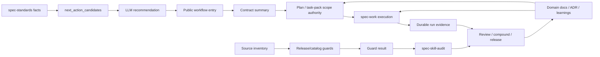

# feat: spec-first 当前项目优化升级方案

## 摘要

本计划以 `docs/plans/2026-05-11-001-feat-trellis-inspired-workflow-quality-plan.md` 为基准，把 Trellis、pro-workflow 与 Matt Pocock skills 对标结论收敛为 spec-first 当前项目的优化升级路线。升级目标不是新增一套状态机、agent 集合或 prompt collection，而是强化 spec-first 已有 `Codebase -> Graph -> Spec -> Plan -> Tasks -> Code -> Review -> Knowledge` 链路中的输入质量、上下文传递、证据留存、review 闭环、release 治理与知识复用。

实施策略是三阶段推进：先交付阶段 1 的执行质量基础垂直切片，再补齐 source/runtime 边界、agent dispatch 与工程纪律，最后收紧 release/catalog/skill governance。所有改动保持 source-first、light contract、explicit boundaries、scripts prepare facts, LLM decides。

---

## 问题框架

spec-first 已经具备双宿主 runtime generation、public workflow skills、task-pack 派生执行输入、standards/glue baseline、review personas、compound/sessions 知识链路和 release/package 验证基础。但当前项目仍存在几个高价值优化点：

- Public workflow 的入口契约不够统一，执行者需要读较长 skill 才能判断输入、输出、边界和降级模式。
- Task pack 已经有 identity/freshness 机制，但执行时仍可能只读 task card，而没有回查 source plan 的聚焦片段。
- `spec-work` 的 final response 能给人类总结，但长任务、task-pack、compaction/resume、degraded evidence 场景需要更明确的 durable evidence。
- `spec-standards` 可以产出 brownfield standards baseline，但首次 onboarding 后的 next action 仍偏 prose，缺少 machine-readable candidate facts。
- source/runtime/customization、provider facts、generated runtime mirror 的边界需要更容易被用户和 agent 理解。
- Agent dispatch 需要更明确地区分 research、review、verification、implementation worker，并避免隐式 implement/check 生命周期。
- Debug/work/review 需要吸收 feedback-loop-first、vertical slice、domain language、ADR/decision ledger 等工程纪律。
- Release/catalog/README/governance drift 需要更稳定的 deterministic guard，而不是依赖维护者记忆。
- Knowledge replay 需要能消费 provenance-backed rejected/out-of-scope rationale，避免反复讨论已经拒绝的范围。
- 深度规划、审查和自我演化场景非常耗费 token；需要把 token economy 作为系统设计约束，而不是依赖执行者临场少读。

本计划把这些优化落到现有 source skills、agents、CLI scripts、contracts、tests 和 docs 中，不新增平行真相源。

---

## 目标

- G1. 让 public workflow 入口更清晰：所有 public workflow skill 都有轻量 contract summary，说明 when to use、inputs、outputs、artifacts、failure modes、source/runtime boundary 和 downstream consumers。
- G2. 让 task-pack handoff 更可靠：`spec-work` task-pack mode 必须核对 source plan 的 `source_unit`、`requirement_refs`、acceptance、scope boundaries、non-goals 和 deferred implementation notes。
- G3. 让执行证据可恢复：长任务、validated task-pack、compaction/resume、deferred follow-up、degraded provider evidence 和 not-run validation 场景必须留下 durable 或 schema-aligned evidence。
- G4. 让 brownfield onboarding 更可操作：`spec-standards` 输出最小 `next_action_candidates` machine-readable contract，由 LLM 解释推荐入口。
- G5. 让 source/runtime/customization 边界更难误用：文档和 workflow summary 明确 source-of-truth、generated runtime mirror、target repo artifact 和 provider/tool facts 的区别。
- G6. 让 agent dispatch 更可治理：复用现有 agents，明确 research/review/worker suitability gate、fallback 和 fresh-source eval 要求。
- G7. 让 debug/work/review 更工程化：先建立反馈环，再修复；优先纵向切片；重大取舍进入 decision ledger；领域语言和 ADR-like artifacts 先消费后追问。
- G8. 让 release 与 public surface drift 更早暴露：release/catalog/governance checks 只验证确定性事实，输出 reason_code、artifact path 和 blocking/advisory classification。
- G9. 让知识沉淀可复用：`spec-plan` / `spec-work` / `spec-skill-audit` 能消费 provenance-backed learnings、sessions、solutions、standards 和 rejected/out-of-scope rationale。
- G10. 让 token 消耗可治理：通过 progressive disclosure、minimal sufficient context、phase task pack、deterministic inventory、bounded reviewer dispatch、durable checkpoint 和 distilled external inventory，减少重复读取长文档和外部仓库。

---

## 非目标

- 不复制 Trellis task lifecycle，不新增 `.current-task`、task status store、per-turn hook state 或中心化 workflow engine。
- 不把 task pack 变成 mandatory workflow stage；它仍是 optional execution compression。
- 不手改 `.claude/`、`.codex/`、`.agents/skills/` 作为 source fix。
- 不引入 pro-workflow 的 always-on hooks、全局 SQLite/wiki memory engine、overnight research loop 或 teammate mailbox。
- 不强制目标项目采用 `CONTEXT.md`、`CONTEXT-MAP.md`、`docs/adr/`、issue labels 或固定 tracker lifecycle。
- 不让 scripts 判断架构优先级、业务范围、review 结论、skill 语义质量或最终 workflow recommendation。
- 不新增 agent profile，除非现有 agent 无法干净承接明确职责。
- 不在本计划中实现跨 repo 官网同步 gate、长期 benchmark runner 或新 public workflow。

---

## 需求

- R1. Public workflow contract summary 必须覆盖 `src/cli/contracts/dual-host-governance/skills-governance.json` 中所有 `entry_surface: workflow_command` 的 skills；`using-spec-first` 和 `spec-write-tasks` 作为入口治理与 standalone task compilation 也必须保持 summary。
- R2. Contract summary 必须轻量，不复制完整 workflow，不成为第二个 runtime spec。
- R3. `spec-work` task-pack mode 必须把 task pack 当 derived executable index，而不是 scope authority。
- R4. `spec-work` task-pack mode 必须始终核对 source plan 聚焦片段，不能只在上下文不足时回查 source plan。
- R5. `spec-work` 必须定义 durable evidence 触发条件；final response 只是人类摘要，不能替代需要 resume/review/follow-up 的证据。
- R6. `spec-standards` 必须输出最小 `next_action_candidates` contract，scripts 只产出 facts、reason codes 和 evidence paths。
- R7. Source/runtime/customization 文档必须区分 checked-in source、generated host runtime、target repo workflow artifacts、provider/tool facts。
- R8. Agent dispatch guidance 必须区分 research、verification、review、implementation worker，并定义 worker suitability gate。
- R9. Skill/agent prose 行为变化必须有 contract tests；可能被 runtime caching 遮蔽时必须执行 fresh-source eval 或记录未执行原因。
- R10. Debug/work/task guidance 必须要求 feedback-loop-first，无法建立反馈环时必须记录 not-possible reason。
- R11. Task slicing guidance 必须偏向可独立验证的 vertical tracer bullet；水平切片需要说明原因。
- R12. Domain language、ADR-like docs 和 decision ledger 必须是可引用、可追溯、authority level 明确的 artifacts；缺失时只 advisory，不阻塞 workflow。
- R13. Release/catalog guard 必须检测 source inventory、governance contract、README/README.zh-CN、runtime capability catalog、plugin metadata 和 package delivery 的确定性 drift。
- R14. Guard 输出必须区分 blocking drift、advisory drift、docs-only no-impact 和 degraded-mode warning。
- R15. Skill audit 必须消费 deterministic guard result，但不能让脚本替代 LLM 对 skill 质量的判断。
- R16. Knowledge replay 必须支持 provenance-backed refs，尤其是 rejected/out-of-scope rationale；不得变成 active workflow state。
- R17. 每个 source-changing PR 必须应用 closeout checklist：changelog、targeted tests、runtime impact、fresh-source eval/not-run reason、docs/catalog impact。
- R18. Skill 主入口必须遵循 progressive disclosure：顶部 contract summary 和核心 workflow 保持短，长 rubric、examples、provider-specific details、checklists 下沉到 `references/` 或 scripts。
- R19. Task pack 与 plan handoff 必须传递 minimal sufficient context；`context_refs` 应优先指向具体 sections/files/tests/contracts，而不是整份 plan 或全量 docs 目录。
- R20. 大型计划必须支持 phase-level task pack；`spec-work` 不应默认一次消费 U1-U12 全量上下文。
- R21. Deterministic inventory 必须优先由 scripts/CLI 产出 facts，例如 public workflow inventory、governance coverage、catalog drift、package surface，而不是让 LLM 反复扫描长文件。
- R22. Reviewer/persona dispatch 必须按风险和规模收缩；docs-only、小 diff、低风险改动默认使用最小 reviewer set，高风险 workflow/contract/release 变化再扩大。
- R23. 长任务、深度审查和 context compaction 后必须有 durable checkpoint，记录已读 artifact、关键决策、验证状态、degraded evidence 和 next action，避免下轮重新读完整历史。
- R24. 外部对标完成后，后续 workflow 默认消费 distilled inventory 和映射矩阵；除非需要复验新事实，不重复读取外部仓库全量 skill/agent 内容。

---

## 产品验收 / 成功信号

| 阶段 | 用户结果级成功信号 | 反向验收 |
|------|--------------------|----------|
| 阶段 1 | 用户从 plan/task pack 进入 work 时，执行者能快速说清 scope authority、acceptance、non-goals、当前 task context 和验证方式；长任务恢复不依赖模型记忆。 | 如果 task pack 被当作第二份 plan，或 compaction 后无法说明 evidence source，则不通过。 |
| 阶段 2 | 新项目 onboarding 后，用户能看到 facts-backed next-action candidates；涉及领域术语、ADR 或 debug 时，agent 先查证再追问，先建立反馈环再修复。 | 如果 workflow 继续问可从 repo/docs 推导的问题，或把 advisory standards/provider facts 当 confirmed policy，则不通过。 |
| 阶段 3 | 新增或修改 public skill 后，README、governance contract、runtime catalog、release/package surface drift 能在发布前被 guard 或 skill audit 暴露。 | 如果 guard 开始判断 skill 语义质量，或无法区分 blocking drift 与 docs-only no-impact，则不通过。 |

补充观察项：

- task-pack stale/hash mismatch 是否更早暴露。
- not-run reason 是否更明确。
- review finding verification 是否更完整。
- release 前 catalog/governance drift 是否被稳定捕获。
- rejected/out-of-scope rationale 是否减少重复范围争议。

---

## 能力分层

| 层级 | 默认行为 | 能力 |
|------|----------|------|
| 默认产品面 | 对所有 public workflow 可见；不增加必经状态。 | contract summary、source/runtime boundary、task-pack source-plan 聚焦核对、final evidence summary、not-run/degraded reason、changelog discipline。 |
| Advanced / opt-in | 由复杂度或用户意图触发。 | task-pack compilation、fresh-source eval、deep research、worker suitability gate、decision ledger、feedback-loop-first debug、release/package guard 扩展。 |
| Internal-only | 服务维护、审计或 release。 | catalog/governance drift scripts、runtime capability generation、provider readiness facts、skill-audit deterministic inventory checks、rejected/out-of-scope replay indexes。 |

---

## Token Economy 设计

本项目的高 token 消耗主要来自自我演化任务：需要同时读取角色契约、AGENTS/CLAUDE 入口、public skills、agents、CLI contracts、runtime governance、tests、release scripts、长计划和外部对标材料。优化目标不是牺牲质量，而是把“需要读什么”变成可治理输入。

### 默认原则

- 先读 contract summary，再按需要打开 references。
- 先消费 deterministic inventory，再让 LLM 做语义判断。
- 先消费当前 phase/task 的 context refs，再按 source plan 聚焦片段回查 scope。
- 先使用 durable checkpoint，再决定是否需要重读完整历史。
- 外部对标默认消费 distilled inventory，只有复验事实时才回外部仓库。

### 优化方向

| 方向 | 落点 | 验收信号 |
|------|------|----------|
| Progressive disclosure | U1、U12 | `SKILL.md` 主入口不承载长篇 examples/rubrics；深层内容下沉到 `references/` 或 scripts。 |
| Minimal sufficient context | U2、U12 | task pack 的 `context_refs` 指向具体 sections/files/tests/contracts，而不是整份 plan 或全目录。 |
| Phase task pack | U2、U12 | 大型计划默认按阶段派生 task pack；`spec-work` 不一次吞下全量 U1-U12。 |
| Deterministic inventory | U4、U9、U12 | public workflow inventory、catalog/governance drift、package surface 由 scripts 输出 facts。 |
| Scale-aware reviewer dispatch | U6、U12 | 小 diff/docs-only 默认最小 reviewer set；高风险 contract/release/workflow 变化再扩大。 |
| Durable checkpoint | U3、U12 | 长任务和深度 review 能从 checkpoint 恢复，不重新读完整计划和历史对话。 |
| Distilled external inventory | U10、U12 | 后续 workflow 默认消费本计划和对标映射，不重复逐个读取外部 skill/agent。 |
| Plan/execution split | U2、U3、U11、U12 | Plan 保留方向和边界；执行只读取当前 wave/task 的压缩上下文和 source plan 聚焦片段。 |

### 反向约束

- 不用 token/cost heuristics 覆盖 correctness、license safety、security review 或 release safety。
- 不因为省 token 而跳过 source-of-truth、acceptance、non-goals、validation evidence。
- 不把 summary 当 confirmed truth；summary 只是入口索引，争议点仍回 source。
- 不把 inventory 脚本扩展成语义判断器；它只产出 facts、hash、reason_code、path 和 classification。

---

## 过度设计防线与 Phase 1 MVP

本计划作为长期升级路线图是合理的，但不能作为一次 PR 或第一轮开发的完整执行范围。第一轮必须先证明 task handoff、execution evidence 和 token economy 三件事确实变好；未证明前，不扩大到全量 public workflow、release blocking guard 或完整 knowledge replay。

### Phase 1 MVP 范围

第一轮只做下面 7 件事：

1. `spec-work` task-pack mode 必须回查 source plan 聚焦片段。
2. `spec-write-tasks` 明确 `context_refs` 粒度要求，避免默认整份 plan 或全目录。
3. `spec-work` 增加 evidence / not-run / degraded / deferred 收尾 contract。
4. `spec-standards` 增加最小 `next_action_candidates` 设计，不做复杂 router。
5. 只给核心链路补 contract summary：`using-spec-first`、`spec-plan`、`spec-write-tasks`、`spec-work`、`spec-standards`。`spec-doc-review`、`spec-code-review`、`spec-skill-audit` 只在测试或入口联动需要时做最小触达。
6. U12 只落 intake order 和 progressive disclosure guidance，不做 token 计量平台。
7. 更新 `CHANGELOG.md`，补 targeted contract tests，记录 runtime impact 和 fresh-source eval/not-run reason。

### Phase 1 暂缓项

以下内容保留在路线图中，但不得进入第一轮 MVP，除非先更新本计划并说明新的 consumer：

- 全 public workflow summary 覆盖。
- 完整 durable run artifact producer。
- 复杂 `next_action_candidates` schema、排序或自动路由。
- release blocking guard。
- rejected/out-of-scope replay 扩展。
- 全量 reviewer dispatch 重构。
- 所有 skill 的 token economy 改造。
- 新 agent profile 或 implement/check 双 agent lifecycle。

### 过度设计红线

如果 implementation PR 出现以下信号，应停下来回到 plan/doc-review，而不是继续扩大：

- 一个 PR 修改 15 个以上 skill。
- 新增 schema 或 artifact 但没有明确 consumer。
- Contract summary 模板化变长，却没有改变执行者的判断路径。
- Tests 只检查关键词存在，没有覆盖真实 workflow 风险。
- `spec-work` evidence 开始记录 current progress、approval state 或 next active task。
- `spec-standards` script 开始替 LLM 选择最终 workflow。
- Reviewer dispatch 对低风险 docs-only 改动仍默认多 persona。
- Token economy 变成硬 token 预算、自动压缩引擎或成本评分系统。

---

## 假设

- A1. 当前计划只规划 spec-first 自身升级，不在本轮实现代码。
- A2. 现有三源对标方案是规划基准；本计划不重新审查外部项目。
- A3. 工作区可能有其他未提交改动，实施时必须先检查当前 git status 并避免混入无关改动。
- A4. 实施应分阶段提交，第一阶段必须收窄为可验证的 vertical slice。
- A5. 如果阶段 1 规模仍然过大，应先由 `spec-write-tasks` 派生 task pack，再用 `spec-work` 执行。
- A6. 所有路径以 repo-relative 表达；不得在 plan 或 task pack 中写入用户本机绝对路径。

---

## Source 与 Runtime 边界

Source-of-truth：

- `skills/`
- `agents/`
- `templates/`
- `src/cli/`
- `src/cli/contracts/**`
- `docs/`
- `README.md`
- `README.zh-CN.md`
- `CHANGELOG.md`
- `CLAUDE.md`
- `AGENTS.md`

Generated runtime assets：

- `.claude/`
- `.codex/`
- `.agents/skills/`

执行规则：

- 优先修改 source，不手改 generated runtime mirrors。
- source 变更需要本地 runtime 刷新时，使用 `spec-first init --claude|--codex`。
- runtime drift 先判断 source-of-truth，再检查 generator，最后修 source 或 generator。
- provider/tool facts 只是 evidence inputs，不是 semantic authority 或 workflow state。

---

## 上下文与依据

主要依据：

- `docs/plans/2026-05-11-001-feat-trellis-inspired-workflow-quality-plan.md`
- `docs/10-prompt/结构化项目角色契约.md`
- `skills/using-spec-first/SKILL.md`
- `skills/spec-plan/SKILL.md`
- `skills/spec-write-tasks/SKILL.md`
- `skills/spec-work/SKILL.md`
- `skills/spec-standards/SKILL.md`
- `skills/spec-debug/SKILL.md`
- `skills/spec-code-review/SKILL.md`
- `skills/spec-doc-review/SKILL.md`
- `skills/spec-skill-audit/SKILL.md`
- `skills/spec-compound/SKILL.md`
- `skills/spec-compound-refresh/SKILL.md`
- `skills/spec-sessions/SKILL.md`
- `src/cli/task-pack.js`
- `src/cli/commands/tasks.js`
- `src/cli/contracts/dual-host-governance/skills-governance.json`
- `scripts/generate-runtime-capability-catalog.js`
- `scripts/release-publish.cjs`
- `scripts/run-test-suite.cjs`
- `docs/contracts/workflows/spec-work-run-artifact.schema.json`
- `docs/contracts/workflows/spec-id-traceability.md`
- `docs/contracts/workflows/fresh-source-eval-checklist.md`
- `docs/contracts/graph-evidence-policy.md`
- `docs/contracts/graph-provider-consumption.md`
- `docs/solutions/workflow-issues/modify-source-not-artifacts-2026-04-13.md`

图谱证据边界：

- 本计划以现有文档和直接 source reading 为主。
- Graph/provider evidence 在实施时可以作为定位辅助，但不能扩展 scope。
- 如果 graph readiness stale、degraded 或 unavailable，必须记录限制并回退到 bounded direct source reads。

---

## 关键技术决策

- D1. Workflow 行为放在 source skills，不放在 host runtime templates。Templates 和 generated runtime projection 保持薄层。
- D2. 增加 contract summary，不新增状态机。Summary 是入口摘要，不是完整 workflow spec。
- D3. Task pack 是派生执行索引，source plan 仍是 scope、acceptance 和 non-goals authority。
- D4. Run evidence 是 run-scoped append-only evidence，不是 task progress store。
- D5. Brownfield next action 使用 deterministic candidate facts + LLM recommendation。脚本输出候选和原因码，LLM 解释下一步。
- D6. Agent dispatch 默认复用现有 profiles；只有责任无法干净归属时才新增 agent。
- D7. Release/catalog guards 必须窄而确定；脚本不判断 semantic release readiness。
- D8. Domain language 和 ADR discipline 不强制固定目录，只要求 artifact 可引用、可追溯、authority level 明确。
- D9. Knowledge replay 使用 repo-local artifacts、sessions、solutions、standards 和可再生索引，不引入全局记忆状态机。
- D10. 所有外部启发都通过 clean-room 重新表达，不能复制外部 code/prose/schema/template。

---

## 高层设计



关键边界：

- `B` 是 lightweight summary，不拥有完整 workflow 语义。
- `C` 的 scope authority 来自 plan 或 source plan，不来自 task pack card。
- `E` 只保存证据，不保存 active task progress。
- `H` 是 script-owned facts，`I` 是 LLM-owned judgment。
- `K` 只做 deterministic checks，`M` 做语义审计。

---

## 实施单元

### U1. Public workflow contract summary 覆盖

**目标：** 为所有 public workflow skills 增加轻量 contract summary，统一入口可读性。

**对应需求：** R1, R2, R17

**依赖：** 无

**Phase 1 MVP 范围：** 第一轮只覆盖核心执行链路：`using-spec-first`、`spec-plan`、`spec-write-tasks`、`spec-work`、`spec-standards`。`spec-doc-review`、`spec-code-review`、`spec-skill-audit` 只在测试、入口联动或 closeout 需要时做最小触达。全 public workflow 覆盖保留为后续批次。

**文件：**
- 修改: `skills/using-spec-first/SKILL.md`
- 修改: `skills/spec-app-consistency-audit/SKILL.md`
- 修改: `skills/spec-brainstorm/SKILL.md`
- 修改: `skills/spec-code-review/SKILL.md`
- 修改: `skills/spec-compound/SKILL.md`
- 修改: `skills/spec-compound-refresh/SKILL.md`
- 修改: `skills/spec-debug/SKILL.md`
- 修改: `skills/spec-doc-review/SKILL.md`
- 修改: `skills/spec-graph-bootstrap/SKILL.md`
- 修改: `skills/spec-ideate/SKILL.md`
- 修改: `skills/spec-mcp-setup/SKILL.md`
- 修改: `skills/spec-optimize/SKILL.md`
- 修改: `skills/spec-plan/SKILL.md`
- 修改: `skills/spec-polish-beta/SKILL.md`
- 修改: `skills/spec-release-notes/SKILL.md`
- 修改: `skills/spec-sessions/SKILL.md`
- 修改: `skills/spec-skill-audit/SKILL.md`
- 修改: `skills/spec-slack-research/SKILL.md`
- 修改: `skills/spec-standards/SKILL.md`
- 修改: `skills/spec-update/SKILL.md`
- 修改: `skills/spec-work/SKILL.md`
- 修改: `skills/spec-work-beta/SKILL.md`
- 修改: `skills/spec-write-tasks/SKILL.md`
- 测试: `tests/unit/public-workflow-contract-summary.test.js`
- 测试: `tests/unit/lint-skill-entrypoints.test.js`

**做法：**
- 从 `src/cli/contracts/dual-host-governance/skills-governance.json` 读取 public workflow inventory。
- 每个 summary 至少覆盖 when to use、when not to use、inputs、outputs、artifacts、failure modes、workflow、downstream consumers。
- `using-spec-first` 说明它是 entry governor，不是 command-backed workflow。
- `spec-write-tasks` 说明它是 standalone derived task compilation，不是 mandatory stage。
- Summary 不写 deep behavior；domain language、feedback loop、guard 等深层规则由后续单元负责。

**测试场景：**
- 每个 `entry_surface: workflow_command` skill 有 contract summary。
- Summary 不把 generated runtime assets 描述为 source。
- Summary 不把 task pack 描述为 mandatory。
- Skill entrypoint lint 通过。

**验证：**
- `npm run lint:skill-entrypoints`
- `npm run test:unit` 或 targeted 运行 public workflow summary tests。

---

### U2. Task-pack source-plan 聚焦回查

**目标：** 强化 task-pack handoff，确保 `spec-work` 使用 task pack 压缩上下文，同时始终核对 source plan 的 scope 与 acceptance。

**对应需求：** R3, R4

**依赖：** U1 有帮助但不阻塞

**文件：**
- 修改: `skills/spec-write-tasks/SKILL.md`
- 修改: `skills/spec-write-tasks/references/task-pack-schema.md`
- 修改: `skills/spec-write-tasks/references/task-quality-guide.md`
- 修改: `skills/spec-work/SKILL.md`
- 修改: `src/cli/task-pack.js`
- 修改: `src/cli/commands/tasks.js`
- 测试: `tests/unit/spec-write-tasks-contracts.test.js`
- 测试: `tests/unit/spec-work-contracts.test.js`
- 测试: `tests/unit/task-pack-command.test.js`

**做法：**
- 明确 `context_refs` 是 bounded reading pointers，不是 scope authority。
- `spec-work` task-pack mode 读取当前 task 后，必须回查 source plan 的 `source_unit`、`requirement_refs`、acceptance criteria、scope boundaries、non-goals 和 deferred implementation notes。
- CLI validation 只检查 shape、identity、hash、path safety 和 required fields；不判断 context ref 语义是否充分。
- `context_refs` 指向整份 plan 时可以结构性通过，但 prose guidance 应标记为低质量 handoff。

**测试场景：**
- stale `source_plan_hash` 阻断执行。
- spec id mismatch 阻断执行。
- path traversal 或 unsafe generated runtime path 被拒绝。
- `spec-work` prose contract 要求回查 source plan 聚焦片段。

**验证：**
- `npm run test:unit` 或 targeted 运行 task-pack/spec-work tests。

---

### U3. `spec-work` durable run evidence

**目标：** 定义 `spec-work` 执行证据边界，让长任务和恢复场景可审计、可继续。

**对应需求：** R5, R17

**依赖：** U2

**文件：**
- 修改: `skills/spec-work/SKILL.md`
- 修改: `skills/spec-work-beta/SKILL.md`
- 修改: `docs/contracts/workflows/spec-work-run-artifact.schema.json`
- 测试: `tests/unit/spec-work-run-artifact-contract.test.js`
- 测试: `tests/unit/spec-work-contracts.test.js`
- 测试: `tests/unit/spec-work-beta-contracts.test.js`

**做法：**
- 与现有 run artifact schema 对齐，不新增第二套 evidence format。
- 定义 durable evidence 触发条件：validated task-pack、长任务、compaction/resume、degraded evidence、deferred follow-up、not-run validation、handoff to review/compound/release。
- Evidence 记录 changed surfaces、validation commands、exit status/summary、artifact/log path、not-run reason、degraded provider status、deferred follow-up。
- 明确 run evidence 不存 current task progress、approval state、next active task 或 source scope。

**测试场景：**
- Final response 被描述为 human summary，不是 durable evidence 替代。
- Task-pack/resume 场景要求 durable 或 schema-aligned artifact。
- Not-run validation 必须有原因。
- Prose contract 拒绝 `.current-task` 或 task status store 语言。

**验证：**
- `npm run test:unit` 或 targeted 运行 spec-work/run-artifact tests。

---

### U4. `spec-standards` next-action candidates

**目标：** 让 brownfield onboarding 输出可被 workflow 消费的 machine-readable next-action candidates。

**对应需求：** R6, R12

**依赖：** U1 有帮助但不阻塞

**文件：**
- 修改: `skills/spec-standards/SKILL.md`
- 修改: `skills/spec-standards/scripts/prepare-baseline.js`
- 修改: `skills/spec-standards/scripts/validate-artifacts.js`
- 修改: `skills/spec-standards/examples/glue-map.example.json`
- 测试: `tests/unit/spec-standards-contracts.test.js`
- 测试: `tests/unit/spec-standards-validation.test.js`
- 测试: `tests/unit/spec-standards-consumers.test.js`

**做法：**
- 增加最小 `next_action_candidates` contract：`schema_version`、`producer`、`candidate_id`、`reason_code`、`source_fact_refs`、`evidence_paths`、`target_entrypoint`、`target_repo_scope`、`authority_level`、`blocking`。
- Scripts 只产出 candidate facts；LLM 输出 human recommendation。
- Candidate examples 覆盖 missing graph readiness、workspace-advisory-only、absent tests、missing package scripts、stale validation、child repo ambiguity。
- 保持 confirmed/observed/imported/suggested/conflict trust level 语义。

**测试场景：**
- Child-local baseline 输出 candidates。
- Workspace advisory run 建议收窄 repo，但不写 child policy。
- Malformed candidate validation fails。
- Consumers 按 confirmed/advisory/degraded 消费。

**验证：**
- `npm run test:unit` 或 targeted 运行 spec-standards tests。

---

### U5. Source/runtime customization boundary 文档

**目标：** 面向用户和维护者说明如何安全定制 spec-first，以及如何理解 generated runtime 与 provider facts。

**对应需求：** R7, R9

**依赖：** U1 的统一措辞

**文件：**
- 新增: `docs/contracts/source-runtime-customization-boundary.md`
- 修改: `README.md`
- 修改: `README.zh-CN.md`
- 修改: `docs/catalog/runtime-capabilities.md`
- 测试: `tests/unit/readme-language-split.test.js`
- 测试: `tests/unit/user-manual-contracts.test.js`
- 测试: `tests/unit/runtime-contract-boundary.test.js`

**做法：**
- 文档化 checked-in source、generated host runtime、target repo workflow artifacts、external provider/tool facts。
- 说明修改 source、运行 `spec-first init --claude|--codex`、使用 `doctor` 检测 drift 的路径。
- 明确 GitNexus、code-review-graph、Serena、browser/MCP tools 等只提供 evidence/capability/logs，不拥有 semantic authority。
- README 只放简短链接，不复制完整 contract。

**测试场景：**
- 文档拒绝把 `.claude/`、`.codex/`、`.agents/skills/` 作为 source-of-truth。
- README 中英文链接对齐。
- Provider facts 被描述为 evidence inputs。

**验证：**
- `npm run test:unit` 或 targeted 运行 docs/runtime boundary tests。

---

### U6. Agent role 与 dispatch boundary 收紧

**目标：** 保持 explicit、bounded dispatch，避免隐式 implement/check lifecycle。

**对应需求：** R8, R9

**依赖：** U1

**文件：**
- 修改: `agents/spec-repo-research-analyst.agent.md`
- 修改: `agents/spec-learnings-researcher.agent.md`
- 修改: `agents/spec-architecture-strategist.agent.md`
- 修改: `agents/spec-testing-reviewer.agent.md`
- 修改: `agents/spec-scope-guardian-reviewer.agent.md`
- 修改: `skills/spec-code-review/SKILL.md`
- 修改: `skills/spec-doc-review/SKILL.md`
- 修改: `skills/spec-plan/SKILL.md`
- 测试: `tests/unit/agent-support-contracts.test.js`
- 测试: `tests/unit/spec-dispatch-boundary-contracts.test.js`
- 测试: `tests/unit/spec-code-review-contracts.test.js`
- 测试: `tests/unit/spec-doc-review-contracts.test.js`
- 测试: `tests/unit/spec-plan-contracts.test.js`

**做法：**
- 明确 repository research、institutional learnings、architecture risk、test risk、scope drift 的 agent 归属。
- Workflow prose 说明 dispatch 何时 authorized、bounded、degraded、skipped。
- 增加 implementation worker suitability gate：clear scope、write set 可限定、有验证命令、无产品阻塞、无敏感/安全关键歧义。
- Review autofix 默认关闭，除非 workflow 或用户明确授权。
- 行为性 prose 变化后执行 fresh-source eval 或记录未执行原因。

**测试场景：**
- Dispatch primitive unavailable 时有 inline fallback。
- Broad/sensitive/unclear task 不能直接 worker delegation。
- Tests 拒绝每个任务都有隐藏 implement/check agent 的语言。

**验证：**
- `npm run test:unit` 或 targeted agent/dispatch tests。
- Fresh-source eval 结果或 not-run reason。

---

### U7. Domain language、ADR 与 decision ledger

**目标：** 让 brainstorm、plan、debug、work、review 在涉及领域术语或架构取舍时先消费已有上下文，再提出问题或方案。

**对应需求：** R12

**依赖：** U1；U4 是高价值输入但不阻塞

**文件：**
- 修改: `skills/spec-brainstorm/SKILL.md`
- 修改: `skills/spec-debug/SKILL.md`
- 修改: `skills/spec-work/SKILL.md`
- 修改: `skills/spec-plan/SKILL.md`
- 修改: `skills/spec-code-review/SKILL.md`
- 修改: `skills/spec-doc-review/SKILL.md`
- 修改: `skills/spec-standards/SKILL.md`
- 修改: `docs/contracts/graph-evidence-policy.md`，仅当需要补充 artifact authority language
- 测试: `tests/unit/spec-brainstorm-contracts.test.js`
- 测试: `tests/unit/spec-debug-contracts.test.js`
- 测试: `tests/unit/spec-work-contracts.test.js`
- 测试: `tests/unit/spec-plan-contracts.test.js`
- 测试: `tests/unit/spec-code-review-contracts.test.js`
- 测试: `tests/unit/spec-doc-review-contracts.test.js`
- 测试: `tests/unit/spec-standards-contracts.test.js`

**做法：**
- 加入 domain language consumption gate：先读取 project standards、AGENTS/CLAUDE source、docs/contracts、已有 plans/solutions、目标项目 glossary/ADR-like docs。
- 对 open decisions 记录 question、recommended answer、source tag、chosen answer、consequence、deferred reason。
- ADR-like artifact 只在 hard-to-reverse、surprising-without-context、real-tradeoff 同时成立时建议创建。
- 不强制 `CONTEXT.md` 或 `docs/adr/`。

**测试场景：**
- 涉及领域术语时先消费 docs 再问不可推导问题。
- Major decision 有 source tag 和 consequence。
- 缺 glossary/ADR 时降级 advisory，不阻塞。
- Tests 拒绝固定目录强制要求。

**验证：**
- `npm run test:unit` 或 targeted 运行相关 workflow contract tests。

---

### U8. Feedback-loop-first debug 与 vertical slicing

**目标：** 把 debug/work/task 的质量标准从“直接修”升级为“先建立反馈环，再纵向验证”。

**对应需求：** R10, R11

**依赖：** U2, U3

**文件：**
- 修改: `skills/spec-debug/SKILL.md`
- 修改: `skills/spec-work/SKILL.md`
- 修改: `skills/spec-write-tasks/SKILL.md`
- 修改: `skills/spec-write-tasks/references/task-quality-guide.md`
- 修改: `skills/spec-code-review/SKILL.md`
- 测试: `tests/unit/spec-debug-contracts.test.js`
- 测试: `tests/unit/spec-work-contracts.test.js`
- 测试: `tests/unit/spec-write-tasks-contracts.test.js`
- 测试: `tests/unit/spec-code-review-contracts.test.js`

**做法：**
- `spec-debug` root cause 前要求 failing test、CLI invocation、HTTP/browser script、trace replay、throwaway harness、property/fuzz loop 或 not-possible reason。
- 增加 hypothesis ledger guidance：hypothesis、prediction、evidence for/against、probe result、final root cause。
- Task quality guide 标记 horizontal slicing smell，鼓励 vertical tracer bullet。
- Docs/config-only 任务用 docs contract checks，不强制 TDD。
- 收尾 evidence 记录 feedback loop 是否重跑。

**测试场景：**
- Bug 修复前必须建立或尝试建立反馈环。
- Task pack 示例偏向可独立验证的纵向 slice。
- Docs-only 任务不被强制 TDD。
- Tests 拒绝“先写完所有测试再实现全部功能”的水平切片指导。

**验证：**
- `npm run test:unit` 或 targeted debug/work/write-tasks/code-review contract tests。

---

### U9. Release/source-runtime continuity guards

**目标：** 用 deterministic checks 暴露 release 前的 source/runtime/docs/catalog drift。

**对应需求：** R13, R14, R15

**依赖：** U1；如新增用户文档则依赖 U5

**文件：**
- 修改: `scripts/generate-runtime-capability-catalog.js`
- 修改: `scripts/release-publish.cjs`
- 修改: `scripts/run-test-suite.cjs`
- 修改: `docs/catalog/runtime-capabilities.md`
- 修改: `src/cli/plugin.js`
- 修改: `src/cli/contracts/dual-host-governance/skills-governance.json`
- 测试: `tests/unit/runtime-capability-catalog.test.js`
- 测试: `tests/unit/release-publish.test.js`
- 测试: `tests/unit/dual-host-governance-contracts.test.js`
- 测试: `tests/unit/runtime-contract-boundary.test.js`
- 测试: `tests/unit/changelog-format.test.js`
- 测试: `tests/unit/readme-language-split.test.js`

**做法：**
- 先识别已有 checks，避免重复实现。
- Guard 只在 deterministic failure 可提供 reason_code 和 actionable message 时进入 release/test runner。
- 输出 guard result summary：guard id、checked source inventory、result、reason_code、artifact path、blocking/advisory classification。
- 区分 user-visible docs drift、runtime catalog drift、package delivery drift。
- Preview-first，不 silent write。

**测试场景：**
- Catalog、governance、README、changelog、package files 对齐时通过。
- 新增 public skill 但缺 governance metadata 时失败。
- Stale runtime capability catalog 给 regeneration command。
- Docs-only no-impact 能解释为什么 README 不需要改。

**验证：**
- `npm run test:release:governance`
- package surface 变化时运行 `npm run test:release:install`
- `npm run build`

---

### U10. Skill public surface、dependency tier 与 rejected-scope replay

**目标：** 让 skill audit 消费 deterministic guard results，同时强化 hard/soft dependency 和 rejected/out-of-scope memory。

**对应需求：** R15, R16

**依赖：** U9 的 guard results；U5 的 source/runtime docs

**文件：**
- 修改: `skills/spec-skill-audit/SKILL.md`
- 修改: `skills/spec-compound/SKILL.md`
- 修改: `skills/spec-compound-refresh/SKILL.md`
- 修改: `skills/spec-sessions/SKILL.md`
- 修改: `skills/spec-plan/SKILL.md`
- 修改: `skills/spec-work/SKILL.md`
- 测试: `tests/unit/lint-skill-entrypoints.test.js`
- 测试: `tests/unit/skill-audit-scripts.test.js`
- 测试: `tests/unit/spec-compound-contracts.test.js`
- 测试: `tests/unit/spec-sessions-contracts.test.js`
- 测试: `tests/unit/spec-plan-contracts.test.js`
- 测试: `tests/unit/spec-work-contracts.test.js`

**做法：**
- `spec-skill-audit` 消费 U9 guard result，解释 public surface drift，不重新实现 guard。
- Hard dependency 缺失输出 setup/doctor pointer；soft context 缺失只降低 confidence。
- `spec-compound` / `spec-compound-refresh` / `spec-sessions` 支持 rejected/out-of-scope rationale 检索与 replay。
- `spec-plan` / `spec-work` 在相似需求或范围争议时消费 provenance-backed replay refs。

**测试场景：**
- New public skill 的 governance/catalog/README drift 能被 audit 解释。
- Hard dependency 与 soft dependency 表达不同。
- Rejected/out-of-scope memory 不变成 workflow status。

**验证：**
- `npm run lint:skill-entrypoints`
- `npm run test:unit` 或 targeted skill-audit/compound/sessions/plan/work tests。

---

### U11. Cross-cutting closeout checklist

**目标：** 为每个 source-changing PR 提供统一收尾纪律。

**对应需求：** R17

**依赖：** 应用于所有实施单元

**文件：**
- 修改: `CHANGELOG.md`
- 修改: `README.md`，仅当 user-visible behavior 变化时
- 修改: `README.zh-CN.md`，仅当 user-visible behavior 变化时
- 修改: `docs/catalog/runtime-capabilities.md`，仅当 capability catalog source 变化时
- 测试: `tests/unit/changelog-format.test.js`
- 测试: `tests/unit/readme-language-split.test.js`
- 测试: `tests/unit/runtime-capability-catalog.test.js`

**做法：**
- 每个 source-changing PR 都按 `.codex/spec-first/.developer` 作者更新 changelog。
- 运行 changed unit 的最窄 targeted tests。
- 触达 runtime/package/release surface 时扩大验证。
- Skill/agent prose 变化执行 fresh-source eval 或记录 not-run reason。
- 说明是否运行 `spec-first init --claude|--codex`，以及 generated runtime 是否预期提交。

**测试场景：**
- Changelog 格式符合当前仓库规则。
- User-visible docs 变更同步 README 或说明无影响。
- Runtime catalog source change 后 catalog 不 stale。

**验证：**
- `git diff --check`
- Changed units 对应 targeted tests
- 需要时运行 broader smoke/release/build checks

---

### U12. Token economy guardrails 与 progressive disclosure

**目标：** 把 token economy 变成 workflow contract 和 tooling discipline，减少深度规划、审查和自我演化任务中的重复读取。

**对应需求：** R18, R19, R20, R21, R22, R23, R24

**依赖：** U1, U2, U3, U4；可与 U6、U9、U10 并行补强

**文件：**
- 修改: `skills/spec-plan/SKILL.md`
- 修改: `skills/spec-work/SKILL.md`
- 修改: `skills/spec-write-tasks/SKILL.md`
- 修改: `skills/spec-doc-review/SKILL.md`
- 修改: `skills/spec-code-review/SKILL.md`
- 修改: `skills/spec-skill-audit/SKILL.md`
- 修改: `skills/spec-sessions/SKILL.md`
- 修改: `skills/spec-compound/SKILL.md`
- 修改: `skills/spec-compound-refresh/SKILL.md`
- 修改: `skills/spec-standards/SKILL.md`
- 测试: `tests/unit/spec-plan-contracts.test.js`
- 测试: `tests/unit/spec-work-contracts.test.js`
- 测试: `tests/unit/spec-write-tasks-contracts.test.js`
- 测试: `tests/unit/spec-doc-review-contracts.test.js`
- 测试: `tests/unit/spec-code-review-contracts.test.js`
- 测试: `tests/unit/spec-sessions-contracts.test.js`

**做法：**
- 为 public workflows 增加 context intake order：summary -> deterministic inventory -> current task/phase refs -> source-of-truth focused sections -> deeper references。
- 在 `spec-write-tasks` 中要求 `context_refs` 标注 section/file/test/contract 粒度，避免默认整份 plan 或全目录。
- 在 `spec-work` 中要求大型计划先按 phase/wave 消费 task pack；直接执行整份大计划必须记录为什么不需要 task pack。
- 在 `spec-doc-review` / `spec-code-review` 中加入 scale-aware reviewer dispatch guidance：小改动最小 reviewer set，高风险 contract/workflow/release 变化扩大 reviewer set。
- 在 `spec-sessions` / `spec-compound` / `spec-compound-refresh` 中强调 durable checkpoint 和 distilled replay refs，避免重新读取完整历史。
- 在 `spec-skill-audit` 中加入 progressive disclosure 检查：主入口过长、重复 examples、provider-specific 细节未下沉时标记为优化项。

**测试场景：**
- Workflow prose 明确先读 summary/inventory，再按需读取 references。
- Task-pack guidance 拒绝把整份 plan 当作高质量 `context_refs`。
- Review workflow guidance 区分 low-risk docs-only 与 high-risk workflow/contract/release 变更的 reviewer set。
- Sessions/compound guidance 支持 checkpoint/replay refs，不鼓励重读完整历史。
- Skill audit 能识别 progressive disclosure drift。

**验证：**
- `npm run test:unit` 或 targeted 运行 plan/work/write-tasks/doc-review/code-review/sessions contract tests。
- 行为性 prose 变化执行 fresh-source eval 或记录 not-run reason。

---

## 分阶段交付

### 阶段 1：执行质量基础垂直切片

包含：

- U1-core
- U2
- U3
- U4-minimal
- U12-minimal
- U11 closeout checklist

交付目标：

- 核心执行链路 contract summary 覆盖，且不产生模板化 prose churn。
- Task-pack execution 必须回查 source plan 聚焦片段。
- `spec-work` durable evidence 触发条件明确。
- `spec-standards` 产出最小 `next_action_candidates`。
- Workflow intake order 明确 summary/inventory/context refs/source focused sections 的读取顺序。

建议执行方式：

- 如果直接开发，使用 `$spec-work` 并明确只执行阶段 1。
- 如果发现阶段 1 仍过大，先用 `spec-write-tasks` 从本计划派生 task pack。

### 阶段 2：边界、角色与工程纪律

包含：

- U5
- U6
- U7
- U8
- U12-progressive-disclosure
- U11 closeout checklist

交付目标：

- Source/runtime/provider boundary 清晰。
- Agent dispatch 明确 bounded/fallback/worker suitability。
- Domain language 与 decision ledger 进入 plan/debug/work/review。
- Debug/work/task 默认 feedback-loop-first 与 vertical slicing。
- Review dispatch 与 skill 主入口遵循 scale-aware / progressive disclosure 约束。

### 阶段 3：release 与治理闭环

包含：

- U9
- U10
- U12-checkpoint-replay
- U11 closeout checklist

交付目标：

- Release/catalog/governance drift deterministic checks 稳定。
- Skill audit 消费 guard results。
- Dependency tier 和 rejected/out-of-scope replay 进入 plan/work/skill-audit。
- Durable checkpoint 和 distilled replay refs 降低长任务恢复与深度审查重复读取成本。

---

## 验证策略

Docs-only 当前计划验证：

- `git diff --check`
- 使用仓库现有绝对路径扫描规则检查本计划不包含本机路径。
- `rg -n '[ \t]+$' docs/plans/2026-05-11-002-feat-spec-first-project-optimization-upgrade-plan.md CHANGELOG.md`

实施阶段验证：

- Skill prose 变更：targeted `*-contracts.test.js` + fresh-source eval 或 not-run reason。
- Task-pack/CLI 变更：`tests/unit/task-pack-command.test.js`、`tests/unit/spec-write-tasks-contracts.test.js`。
- `spec-work` evidence 变更：`tests/unit/spec-work-run-artifact-contract.test.js`、`tests/unit/spec-work-contracts.test.js`。
- Standards 变更：`tests/unit/spec-standards-validation.test.js`、`tests/unit/spec-standards-consumers.test.js`。
- Release/catalog 变更：`npm run test:release:governance`，必要时 `npm run build`。
- Public runtime surface 变更：考虑 `npm run test:smoke` 和 dual-host governance tests。

---

## 风险与缓解

| 风险 | 缓解 |
|------|------|
| 计划过大导致实现 PR 失控 | 阶段 1 先做 vertical slice；必要时先派生 task pack。 |
| Contract summary 膨胀成第二份 spec | Summary 只放入口摘要；深层行为留在对应 workflow sections 和 tests。 |
| Task pack 被误当 scope authority | 保留 `source_plan_hash`、`spec_id`、`source_unit`、`requirement_refs`；`spec-work` 强制回查 source plan 聚焦片段。 |
| Run evidence 变成 progress state | Schema/prose 明确禁止 current task progress、approval state、next active task。 |
| Scripts 侵入语义判断 | Scripts 只输出 facts、reason_code、artifact path、classification；推荐和取舍由 LLM/agent 完成。 |
| Runtime mirror 被误改 | U5 文档和 U1 summary 强调 source-first，runtime refresh 走 init。 |
| Agent dispatch 成本过高或隐式化 | 增加 worker suitability gate 和 fallback；默认复用现有 agents。 |
| Token economy 被误解为少做验证 | U12 明确不跳过 source-of-truth、acceptance、non-goals 和 validation evidence；只减少重复读取和无界 dispatch。 |
| Summary 或 distilled inventory 变 stale | Summary 只是入口索引；争议点回 source。Inventory 由 deterministic scripts 生成并带 freshness/hash/reason_code。 |
| Release guard 过严 | 区分 blocking/advisory/docs-only no-impact，保留人工/LLM judgment。 |
| Knowledge replay 变成状态机 | 只消费 provenance-backed refs，不写 active workflow status。 |
| 外部来源 license/prose 污染 | 所有外部启发均 clean-room 重新表达，不复制 code/prose/schema/template。 |

---

## 开发入口建议

推荐下一步不是直接全量执行 U1-U12，也不是直接全量覆盖所有 public workflow，而是：

```bash
$spec-work docs/plans/2026-05-11-002-feat-spec-first-project-optimization-upgrade-plan.md
```

进入后明确执行：

```text
只执行阶段 1 MVP：U1-core、U2、U3、U4-minimal、U12-minimal，并应用 U11 closeout checklist。
```

如果执行者判断阶段 1 仍过大，应先运行 standalone `spec-write-tasks` 生成 derived task pack，再从 task pack 进入 `$spec-work`。

---

## 完成定义

本升级计划完成时应满足：

- 所有 public workflow 有轻量 contract summary，且由 tests 锁定。
- Task pack handoff 不再绕过 source plan scope authority。
- `spec-work` 长任务和恢复场景有 durable evidence。
- `spec-standards` 能输出 machine-readable next-action candidates。
- Token economy guardrails 进入 plan/work/write-tasks/review/sessions workflows，减少重复读取长计划、历史对话和外部仓库。
- Source/runtime/customization boundary 有用户可读文档并从 README 链接。
- Agent dispatch boundary 和 worker suitability gate 明确。
- Debug/work/task 默认先建立反馈环并偏向纵向切片。
- Release/catalog/governance drift 能在发布前以 deterministic guard 暴露。
- Skill audit 能消费 guard results，同时保留 LLM-owned semantic judgment。
- Knowledge replay 能引用 provenance-backed rejected/out-of-scope rationale。
- 外部对标默认消费 distilled inventory；需要复验时才回外部 source。
- 每个 source-changing PR 都有 changelog、targeted verification 和 runtime impact 说明。

---

## 来源与参考

- 基准计划：`docs/plans/2026-05-11-001-feat-trellis-inspired-workflow-quality-plan.md`
- 角色契约：`docs/10-prompt/结构化项目角色契约.md`
- Workflow 入口治理：`skills/using-spec-first/SKILL.md`
- Planning workflow：`skills/spec-plan/SKILL.md`
- Task-pack workflow：`skills/spec-write-tasks/SKILL.md`
- Work workflow：`skills/spec-work/SKILL.md`
- Standards workflow：`skills/spec-standards/SKILL.md`
- Debug workflow：`skills/spec-debug/SKILL.md`
- Skill audit workflow：`skills/spec-skill-audit/SKILL.md`
- Task-pack traceability：`docs/contracts/workflows/spec-id-traceability.md`
- Work run artifact schema：`docs/contracts/workflows/spec-work-run-artifact.schema.json`
- Fresh-source eval checklist：`docs/contracts/workflows/fresh-source-eval-checklist.md`
- Graph evidence policy：`docs/contracts/graph-evidence-policy.md`
- Source/runtime learning：`docs/solutions/workflow-issues/modify-source-not-artifacts-2026-04-13.md`
