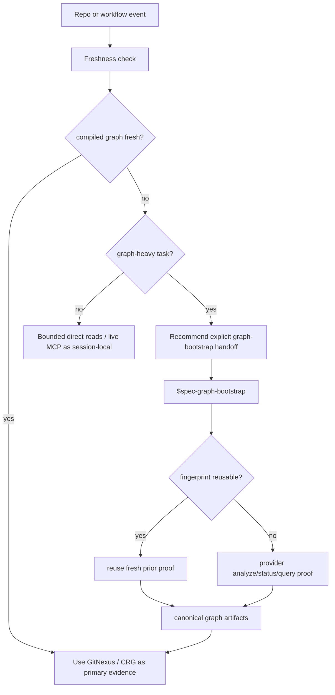

# feat: Govern GitNexus refresh trigger nodes

## Summary

本计划把 GitNexus 图谱刷新机制收敛为一套可执行的节点策略：所有 graph consumer 自动做 freshness check，只有 `$spec-graph-bootstrap` 拥有 canonical readiness refresh / provider rebuild，graph-heavy workflow 在 stale 时做显式 handoff 而不是静默重建。

结合代码索引、静态分析、构建缓存和搜索索引系统的常见做法，当前最佳默认不是“切分支自动重建”，而是“便宜事实自动校验、昂贵刷新显式进入”。本计划的实施范围只覆盖默认本地治理：freshness contract、consumer handoff、graph-bootstrap ownership、deterministic tests 和用户文档。advisory hook 与 CI / policy-based refresh 只作为后续独立计划的边界说明，不进入本轮 U1-U6。

---

## Problem Frame

当前仓库已经有 `graph-facts.json`、`provider-status.json`、`bootstrap_fingerprint`、`worktree_status_hash`、`workspace-graph-targets.v1` 和 live MCP 降级规则，但“哪些阶段应该自动刷新 GitNexus 图谱”仍主要散落在多个 workflow prose 和计划文档中。用户明确追问了刷新阶段和切换分支场景，说明需要一份 durable source contract 来防止两类漂移：

- 过度自动化：在 startup、branch switch、普通 plan/work/review 或 reviewer subagent 中隐式运行 `gitnexus analyze`，导致高频操作变慢、写入不可预期。
- 证据误信：切分支、pull/rebase、dirty worktree 或 provider package projection stale 后，consumer 仍把旧 `.spec-first/graph/*` 当成 current primary evidence。

目标不是新增后台 watcher 或 git hook，而是把“check 自动、refresh 显式、reuse 在 graph-bootstrap 内部自动、repair preview-first”写入 source-of-truth，并用 contract tests 锁住 consumer 行为。

---

## Requirements

- R1. 明确定义四类操作：`freshness-check`、`refresh-handoff`、`bootstrap-refresh`、`repair-preview`，并说明各自的 artifact 写入边界。
- R2. `$spec-graph-bootstrap` 是唯一可以写 `.spec-first/graph/*`、`.spec-first/providers/*`、`.spec-first/impact/*` canonical graph readiness artifacts 的默认刷新入口。
- R3. 切换分支、pull、rebase、merge、dirty worktree 变化和 provider fingerprint 变化只应让下游判定 stale / bootstrap required；不得默认自动运行 GitNexus analyze。
- R4. `$spec-mcp-setup` 只刷新 setup-owned provider projection 和 runtime capability facts；当 projection stale 或 setup 成功后，只提示或 handoff 到 `$spec-graph-bootstrap`。
- R5. `$spec-plan`、`$spec-work`、`$spec-work-beta`、`$spec-debug`、`$spec-code-review`、`$spec-doc-review` 等 consumer 自动 freshness check；轻量任务可 bounded direct reads fallback，graph-heavy / shared contract / cross-module 任务 stale 时应明确建议先运行 `$spec-graph-bootstrap`。
- R6. review / commit / PR 前可以在 fresh graph 下运行 GitNexus impact / detect changes 作为 evidence；detect changes 是 review evidence，不是自动重建索引的触发器。
- R7. Parent workspace 下批量 refresh 只能发生在 `$spec-graph-bootstrap --all-repos` / parent maintenance path；普通只读问题使用 `workspace-graph-targets.v1` advisory facts 选候选 child repo，不写 parent-local graph artifacts。
- R8. GitNexus repair、删除 `.gitnexus` 或 provider raw/status artifacts 必须保持 preview-first / confirm boundary，不得由普通 workflow 自动执行。
- R9. 用户文档、README、contract docs、workflow source、tests 和 `CHANGELOG.md` 必须同步，防止“graph readiness 是所有 workflow hard gate”或“graph stale 自动重建”的误导。
- R10. 不新增默认 git hook、daemon、watcher、`$spec-quick`、后台刷新服务或隐式 state machine。

---

## Assumptions

- A1. 用户要的是 spec-first 内部 GitNexus 刷新节点治理，而不是要求现在立即刷新当前仓库索引。
- A2. 当前已存在的 `2026-05-09-003-graph-bootstrap-fast-reuse` 计划继续负责 provider-level fast reuse 实现；本计划只定义何时允许进入 refresh 和何时只做 check / handoff。
- A3. 第一版以 policy、workflow prose 和 contract tests 为主；只有测试暴露现有 helper 无法表达 branch/pull/fingerprint stale 时，才补最小 deterministic helper 代码。
- A4. Sourcegraph / CodeQL / build cache / search refresh 等外部系统只能作为设计参照；spec-first 的 source-of-truth 仍是本仓库角色契约、workflow source、contracts 和 tests。

---

## Scope Boundaries

- 不把 GitNexus analyze 放入 startup reminder、`doctor`、`init`、branch switch、普通 code question 或 reviewer persona 内部。
- 不新增默认 `post-checkout` / `post-merge` / `pre-commit` git hook；git hook 最多作为 future optional advisory capability。
- 不让 live MCP 成功回写 `.spec-first/graph/*`，也不把 session-local evidence 升级为 compiled `query_ready=true`。
- 不恢复 retired internal CRG runtime，不创建新的中心化 graph state machine。
- 不把行业对齐优化扩展成常驻索引服务、IDE 后台进程、CI refresh 平台或 provider 自动调度器。
- 不手改 `.claude/`、`.codex/`、`.agents/skills/` generated runtime mirrors。

### Current Implementation Scope

本计划当前只实现默认本地工作流治理：

- contract docs 定义 refresh trigger policy、evidence levels 和 canonical artifact ownership。
- consumer workflows 对齐 freshness-check、graph-heavy handoff、lightweight fallback 和 no-hidden-rebuild 语义。
- deterministic tests 覆盖 branch / pull / rebase 等价 stale、dirty hash mismatch、provider fingerprint mismatch 和 consumer contract parity。
- README / user manual 说明 `$spec-graph-bootstrap` 是显式 graph readiness refresh 入口，同时保留 no-graph fast path。

本计划当前不实现：

- git hook、daemon、watcher 或后台刷新服务。
- CI / scheduled graph refresh policy。
- provider auto analyze、auto repair 或普通 workflow 内部 rebuild。
- 新的中心化 graph state machine。

### Deferred to Follow-Up Work

- Optional advisory git hook：未来可独立规划只写 “graph may be stale” marker 或 terminal hint 的 opt-in hook；不属于本计划 U1-U6，且默认不安装、不运行 provider。
- CI / policy-based refresh：未来可独立规划针对 default branch、protected branch、PR head 或 nightly schedule 的 `$spec-graph-bootstrap` 执行策略；不属于本计划 U1-U6，且必须保持显式配置、可审计 artifacts 和 provider fingerprint 校验。
- Provider fast reuse cold-run skip：沿用 `docs/plans/2026-05-09-003-feat-graph-bootstrap-fast-reuse-plan.md`，不在本计划重复实现。
- Full Windows behavioral parity runner：当前继续使用 shell behavior tests + PowerShell source contract parity；真实 Windows runner 可在后续 CI 计划补充。

---

## Graph Readiness

- target_repo: `.`
- status: stale
- source_revision: `ad4d2a9a9fe90591522f3aeebbf0e04cc20840bf`
- current_revision: `ad4d2a9a9fe90591522f3aeebbf0e04cc20840bf`
- stale: true
- primary_providers: `code-review-graph`, `gitnexus` in compiled artifacts
- degraded_providers: none in compiled artifacts
- fallback_capabilities: bounded direct repo reads, Serena / ast-grep where available, existing contract tests
- runtime_mcp_evidence: GitNexus MCP `context(computeReadiness)` succeeded as session-local corroboration; compiled readiness remains stale because the current worktree differs from the clean graph snapshot
- confidence: medium
- limitations: compiled graph facts were generated for a clean worktree; the current worktree has uncommitted changes, so this plan relies on direct source reads, tests, and session-local MCP evidence rather than treating graph facts as current primary evidence

---

## Context & Research

### Relevant Code and Patterns

- `skills/spec-graph-bootstrap/SKILL.md` owns project graph readiness compilation, provider command safety, GitNexus query proof, live MCP probe boundary, timing facts, `bootstrap_fingerprint`, and parent all-repos maintenance behavior.
- `skills/spec-graph-bootstrap/scripts/bootstrap-providers.sh` and `skills/spec-graph-bootstrap/scripts/bootstrap-providers.ps1` write provider status, raw logs, normalized artifacts, canonical graph facts, impact capabilities, and host instruction normalization advisory facts.
- `skills/spec-graph-bootstrap/scripts/resolve-workspace-graph-targets.sh` and `.ps1` classify child repos as `primary`, `degraded-fallback`, `dirty-uncertain`, `stale`, `setup-ready-bootstrap-required`, `no-source`, or `unavailable` for read-only routing.
- `docs/contracts/graph-evidence-policy.md` defines confirmed / session-local / advisory / stale evidence levels and GitNexus usage boundaries.
- `docs/contracts/graph-provider-consumption.md` defines canonical artifacts, fields, forbidden legacy reads, and stale / dirty-uncertain consumption rules.
- `skills/spec-plan/SKILL.md`, `skills/spec-work/SKILL.md`, `skills/spec-debug/SKILL.md`, `skills/spec-code-review/SKILL.md`, and `skills/spec-doc-review/SKILL.md` already say stale/degraded graph evidence should fallback to live MCP or bounded direct reads rather than become a gate.
- `src/cli/helpers/review-pre-facts.js` has a concrete freshness helper for review pre-facts: it compares current `source_revision`, `worktree_dirty`, and `worktree_status_hash` before producing graph-fresh query plans.
- `tests/unit/mcp-setup.sh` already covers stale `source_revision`, stale `worktree_status_hash`, and stale provider fingerprint causing setup projection to require graph bootstrap.
- `tests/unit/spec-graph-bootstrap.sh`, `tests/unit/mcp-setup-powershell-contracts.test.js`, `tests/unit/spec-plan-contracts.test.js`, `tests/unit/spec-work-contracts.test.js`, `tests/unit/spec-code-review-contracts.test.js`, `tests/unit/spec-debug-contracts.test.js`, and `tests/unit/graph-provider-consumption-contracts.test.js` are the main regression surfaces.

### Institutional Learnings

- `docs/10-prompt/结构化项目角色契约.md`: scripts prepare deterministic facts; LLM decides semantic use. Refresh policy must not become a hidden state machine.
- `docs/plans/2026-05-09-003-feat-graph-bootstrap-fast-reuse-plan.md`: fast reuse belongs inside graph-bootstrap and must be version/fingerprint safe.
- `docs/plans/2026-05-07-002-feat-gitnexus-evidence-governance-plan.md`: compiled facts, live MCP, and fallback evidence must stay separate; `detect_changes` is evidence, not an absolute gate.
- `docs/plans/2026-05-11-010-feat-no-graph-fast-path-plan.md`: graph readiness is an enhanced evidence path, not a mandatory prerequisite for lightweight workflows.
- `docs/plans/2026-05-03-001-feat-workspace-graph-query-router-plan.md`: parent workspace routing uses advisory child readiness and must not let scripts choose semantic repo scope.
- `docs/plans/2026-05-09-001-fix-graph-bootstrap-gitnexus-repair-preflight-plan.md`: GitNexus index repair and deletion are explicit preview/confirm operations, not silent recovery.

### External References

External systems are non-authoritative context. They help validate the shape of the policy, but repo-local source, tests, and prior plans remain the implementation authority.

- Sourcegraph code navigation auto-indexing uses policies for branch / tag / commit selection and documents resource usage tradeoffs. Implication for spec-first: graph refresh should be policy-owned and scoped, not silently attached to every local branch switch.
  - https://sourcegraph.com/docs/code-navigation/auto-indexing
  - https://sourcegraph.com/docs/code-navigation/how-to/policies-resource-usage-best-practices
- GitHub CodeQL analysis runs against an explicit checkout and workflow trigger such as pull request, push, schedule, or path filters. Implication for spec-first: CI / policy-based graph refresh is a better future extension point than local implicit rebuild.
  - https://docs.github.com/en/code-security/reference/code-scanning/workflow-configuration-options
  - https://docs.github.com/en/code-security/tutorials/customize-code-scanning/preparing-your-code-for-codeql-analysis
- Gradle build cache keys task reuse from declared inputs and outputs. Implication for spec-first: graph evidence reuse should be guarded by deterministic snapshot and provider fingerprints, not by workflow intuition.
  - https://docs.gradle.org/current/userguide/build_cache.html
- Elasticsearch refresh defaults avoid forcing synchronous visibility and warns that explicit refresh should be used deliberately. Implication for spec-first: provider refresh is an expensive side-effecting operation and should stay explicit unless a user opted into a refresh policy.
  - https://www.elastic.co/docs/reference/elasticsearch/rest-apis/refresh-parameter
- JetBrains IDE indexing shows the main counterexample: an IDE may index in the background because it owns a persistent UI/process model. Implication for spec-first: do not import IDE-style hidden indexing into a workflow harness unless a future opt-in runtime surface can expose progress, cost, and cancellation.
  - https://www.jetbrains.com/help/idea/indexing.html

---

## Key Technical Decisions

- Use “automatic check, explicit refresh” as the default model. Rationale: freshness comparison is cheap and deterministic; GitNexus analyze is stateful, slower, and provider-owned.
- Keep refresh ownership in `$spec-graph-bootstrap`. Rationale: it already owns canonical `.spec-first/graph/*`, `.spec-first/providers/*`, and `.spec-first/impact/*` artifacts.
- Treat branch switch / pull / rebase as staleness events, not refresh events. Rationale: users often inspect or hop branches temporarily; auto-rebuild would add noisy writes and latency.
- Consumer workflows should hand off, not rebuild. Rationale: planning, work, debug, and review own semantic decisions; graph-bootstrap owns provider execution.
- Preserve no-graph fast path. Rationale: docs-only, small bug fixes, and lightweight plans should not be blocked by stale or missing graph facts.
- Make graph-heavy handoff explicit. Rationale: shared API, provider contract, cross-module, route, workflow, or review-pre-facts changes benefit from current impact evidence and should surface stale graph risk.
- Keep repair preview-first. Rationale: deleting `.gitnexus` or provider artifacts is a recovery action with filesystem side effects and must not be hidden behind ordinary workflow entry.
- Prioritize a shared deterministic freshness-check contract before adding convenience refresh paths. Rationale: industry systems rely on input fingerprints / workflow triggers; prose-only consumer adoption would let graph evidence semantics drift across Plan, Work, Debug, and Review.
- Defer future automation to separate opt-in policy work. Rationale: advisory hooks and CI refresh may improve developer ergonomics, but including them in this plan would expand a graph evidence contract into a refresh platform.

### Industry-Aligned Boundary Notes

| Industry pattern | Useful lesson | spec-first application | Boundary |
| --- | --- | --- | --- |
| Code intelligence policy indexing | Indexing coverage is chosen by branch / age / policy and resource cost | Keep `$spec-graph-bootstrap` as the canonical refresh node and add future CI policy refresh only when explicitly configured | Do not attach provider rebuild to every local branch switch |
| Static analysis workflow triggers | Analysis runs on explicit checkout events such as PR, push, schedule, or path filters | Future CI refresh can target PR head / default branch / nightly windows | Do not make local consumer workflows run provider analyze silently |
| Build cache fingerprints | Reuse is valid only when inputs and environment match | Normalize a shared freshness helper around `source_revision`, `worktree_status_hash`, `worktree_dirty`, provider projection, and fingerprint | Do not let each workflow invent a different freshness rule |
| Search refresh economics | Explicit refresh trades correctness latency for indexing cost | Use fresh graph evidence when needed, otherwise disclose limitations and fallback | Do not turn graph freshness into a universal hard gate |
| IDE background indexing | Background work can be acceptable when progress and ownership are visible | Future opt-in host/runtime integration may show stale hints or refresh status | Do not create hidden daemons or watchers inside workflow prose |

Long-term optional layering, not current implementation scope:

1. **Current scope - default local workflow:** automatic freshness check, explicit `$spec-graph-bootstrap` refresh, no hidden provider writes.
2. **Deferred - optional local ergonomics:** advisory branch / merge hooks may write a stale hint or marker, but must not run GitNexus analyze.
3. **Deferred - optional team policy:** CI or scheduled refresh may run `$spec-graph-bootstrap` for agreed refs and publish artifacts, guarded by the same fingerprint and query-proof contracts.

---

## Open Questions

### Resolved During Planning

- Should switching branches auto-refresh GitNexus? No. It should invalidate or mark stale on the next consumer check; graph-heavy work can then hand off to `$spec-graph-bootstrap`.
- Should `$spec-mcp-setup` run GitNexus analyze after refreshing provider projection? No. It should refresh projection facts and point to graph-bootstrap.
- Should review/commit always refresh before `detect_changes`? No. Use detect/impact only when graph is fresh; stale high-risk review should recommend graph-bootstrap first.
- Should parent workspace read-only questions refresh all children? No. Use `workspace-graph-targets.v1` and bounded GitNexus-first evidence for primary children.

### Deferred to Implementation

- Exact workflow copy can be finalized while editing workflow prose, but the minimum “graph-heavy” trigger set is fixed in this plan: shared helper/API/route/provider contract/core workflow/cross-module changes, high-risk review, review-pre-facts changes, and planning/review that depends on execution flows or blast radius.
- If existing tests already cover a branch-switch-equivalent `source_revision` mismatch, implementation may add naming/contract coverage rather than new helper code.
- Whether README needs a dedicated trigger table or a short paragraph can be decided by document density; contract tests should guard the semantics, not one exact layout.
- Whether the shared freshness-check execution contract reuses `review-pre-facts`, introduces a small graph-readiness helper, or stays as explicit per-workflow artifact-field checks is implementation-time detail; every consumer must still inspect the same minimum fields before claiming primary graph evidence.
- Advisory hooks and CI / scheduled refresh are not implementation-time unknowns for this plan. If pursued, they require a separate plan with goals, non-goals, artifact ownership, failure modes, and opt-in boundaries.

---

## High-Level Technical Design

> *This illustrates the intended approach and is directional guidance for review, not implementation specification. The implementing agent should treat it as context, not code to reproduce.*

| Event / Stage | Default Action | Writes Canonical Graph Artifacts? |
| --- | --- | --- |
| startup reminder | read-only version / runtime reminder | no |
| `doctor` / `init` | runtime / instruction readiness guidance | no |
| `$spec-mcp-setup` | refresh setup-owned projection and mark bootstrap required when stale | no |
| `$spec-graph-bootstrap` | reuse or rebuild provider readiness | yes |
| branch switch / pull / rebase | next consumer detects `source_revision` mismatch | no |
| dirty worktree change | next consumer detects `worktree_status_hash` mismatch | no |
| lightweight plan/work/review | disclose stale/unavailable graph and fallback | no |
| graph-heavy plan/work/review | stale triggers explicit graph-bootstrap handoff | no, unless user enters bootstrap |
| commit / PR review | fresh graph can run impact/detect changes evidence | no rebuild |
| GitNexus repair | preview/confirm recovery path | only after explicit repair/bootstrap |

### Minimum Consumer Freshness-Check Contract

Every graph consumer that wants to treat compiled graph facts as primary evidence must verify the same deterministic inputs before using them:

| Check | Minimum rule |
| --- | --- |
| Canonical artifacts | Read `.spec-first/graph/provider-status.json`, `.spec-first/graph/graph-facts.json`, and `.spec-first/impact/bootstrap-impact-capabilities.json` when present. |
| Provider readiness | Require the selected provider to be `query_ready=true`; degraded, missing, definitions-only, or query-unverified evidence cannot become primary graph evidence. |
| Repo snapshot | Compare `source_revision`, `worktree_dirty`, and `worktree_status_hash` against the current repo snapshot. Mismatch means stale or dirty-uncertain. |
| Provider projection / fingerprint | Treat stale provider projection, unverifiable package identity, or mismatched provider fingerprint as bootstrap-required rather than current readiness. |
| Live MCP | Successful live MCP calls remain session-local evidence and must not update compiled readiness fields. |

The implementation should prefer a small shared helper or shared fixture-backed contract over per-workflow prose. Explicit per-workflow checks remain acceptable only as an intermediate step when tests assert the same minimum fields and stale reason codes across consumers. What must not happen is prose-only adoption where different consumers compare different freshness fields.

### Graph-Heavy Trigger Baseline

The minimum graph-heavy set is deliberately small and must be consistent across consumer workflow prose and tests:

| Category | Examples | Stale graph behavior |
| --- | --- | --- |
| Shared contracts | shared helper/API/route/provider contract/core workflow changes | recommend `$spec-graph-bootstrap` before claiming graph-backed impact evidence |
| Cross-module or cross-repo work | refactors, renames, moved symbols, parent workspace routing, multi-module plans | hand off when execution flows or blast radius materially shape the plan/review |
| Review evidence surfaces | review-pre-facts, code-review graph context, impact/detect changes use | do not run provider rebuild; refresh explicitly first if primary graph evidence is needed |
| High-risk review | public/shared symbol changes, provider/runtime governance, reviewer dispatch boundary changes | disclose stale graph limitations and recommend explicit bootstrap before high-confidence graph claims |
| Lightweight counterexamples | docs-only prose, narrow typo fixes, first project trial, small local bug with direct source evidence | continue with limitation disclosure and bounded direct reads |

---

## Implementation Units

### U1. Define graph refresh trigger policy

**Goal:** Create a single source of truth for when spec-first should check, hand off, refresh, or repair GitNexus graph evidence.

**Requirements:** R1, R2, R3, R6, R8, R10

**Dependencies:** None

**Files:**
- Modify: `docs/contracts/graph-evidence-policy.md`
- Modify: `docs/contracts/graph-provider-consumption.md`
- Test: `tests/unit/graph-provider-consumption-contracts.test.js`

**Approach:**
- Add a compact “refresh trigger policy” section that defines `freshness-check`, `refresh-handoff`, `bootstrap-refresh`, and `repair-preview`.
- State that branch switch, pull, rebase, merge, dirty hash mismatch, and provider fingerprint mismatch are invalidation signals, not automatic rebuild triggers.
- Extend the consumption contract truth table with “stale but graph-heavy” and “fresh graph before review/commit” guidance.
- Keep `session-local` live MCP and `compiled readiness` separate.

**Patterns to follow:**
- `docs/contracts/graph-evidence-policy.md` evidence-level vocabulary.
- `docs/contracts/graph-provider-consumption.md` canonical artifact and forbidden-read tables.

**Test scenarios:**
- Happy path: contract docs explicitly say `$spec-graph-bootstrap` owns canonical graph refresh.
- Edge case: docs mention branch switch / pull / rebase as stale detection events, not auto-rebuild events.
- Error path: docs forbid live MCP success from updating compiled `query_ready`.
- Integration: graph-provider consumption contract still requires `source_revision`, `worktree_dirty`, and `worktree_status_hash` checks.

**Verification:**
- Reviewers can answer “which node refreshes GitNexus?” from one contract section without scanning every workflow.

---

### U2. Tighten graph-bootstrap ownership and setup handoff

**Goal:** Make setup/bootstrap ownership explicit in workflow source and prevent setup or startup paths from being interpreted as provider rebuild entrypoints.

**Requirements:** R2, R4, R8, R9

**Dependencies:** U1

**Files:**
- Modify: `skills/spec-graph-bootstrap/SKILL.md`
- Modify: `skills/spec-mcp-setup/SKILL.md`
- Modify: `skills/using-spec-first/SKILL.md`
- Test: `tests/unit/spec-graph-bootstrap.sh`
- Test: `tests/unit/mcp-setup.sh`
- Test: `tests/unit/mcp-setup-powershell-contracts.test.js`
- Test: `tests/unit/using-spec-first-contracts.test.js`

**Approach:**
- In `spec-graph-bootstrap`, add a “refresh ownership” subsection: it is the only default workflow that writes canonical graph readiness artifacts.
- In `spec-mcp-setup`, clarify that setup can invalidate derived readiness and refresh provider projection, but provider analyze/build remains graph-bootstrap work.
- In `using-spec-first`, ensure explicit user requests to “refresh graph/GitNexus/index” route to `$spec-graph-bootstrap`, while setup/runtime repair still routes to `$spec-mcp-setup` or `$spec-update`.
- Preserve existing projection-stale behavior: stale package/version or provider command projection recommends setup refresh before bootstrap continues.

**Patterns to follow:**
- `skills/spec-graph-bootstrap/SKILL.md` Contract and Freshness sections.
- `tests/unit/mcp-setup.sh` stale `source_revision`, stale `worktree_status_hash`, and stale provider fingerprint fixtures.

**Test scenarios:**
- Happy path: setup text says graph providers are configured but not query-ready until graph-bootstrap runs.
- Edge case: stale provider fingerprint still marks bootstrap required without running provider commands from setup.
- Error path: provider projection stale recommends rerunning setup and does not proceed with stale provider command arrays.
- Boundary: using-spec-first routes graph refresh/index rebuild requests to `$spec-graph-bootstrap`, not `$spec-mcp-setup`.

**Verification:**
- Setup, update, startup, and bootstrap entrypoints have non-overlapping refresh responsibilities.

---

### U3. Add consumer workflow trigger-node guidance

**Goal:** Ensure Plan, Work, Work Beta, Debug, Code Review, and Doc Review consume stale graph evidence consistently and hand off to graph-bootstrap only when the task warrants current graph evidence.

**Requirements:** R3, R5, R6, R9, R10

**Dependencies:** U1

**Files:**
- Modify: `skills/spec-plan/SKILL.md`
- Modify: `skills/spec-work/SKILL.md`
- Modify: `skills/spec-work-beta/SKILL.md`
- Modify: `skills/spec-debug/SKILL.md`
- Modify: `skills/spec-code-review/SKILL.md`
- Modify: `skills/spec-doc-review/SKILL.md`
- Test: `tests/unit/spec-plan-contracts.test.js`
- Test: `tests/unit/spec-work-contracts.test.js`
- Test: `tests/unit/spec-work-beta-contracts.test.js`
- Test: `tests/unit/spec-debug-contracts.test.js`
- Test: `tests/unit/spec-code-review-contracts.test.js`
- Test: `tests/unit/spec-doc-review-contracts.test.js`

**Approach:**
- Add a shared prose pattern: consumers always check freshness; they do not rebuild provider indexes.
- Define the minimum graph-heavy trigger set from this plan in prose and tests: shared helper/API/route/provider contract/core workflow/cross-module changes, review-pre-facts changes, high-risk review, or planning/review that depends on execution flows and blast radius.
- Add a minimum freshness-check execution contract: before using compiled graph facts as primary evidence, consumers must inspect the same canonical artifact fields and snapshot values (`source_revision`, `worktree_dirty`, `worktree_status_hash`, provider `query_ready`, and provider projection/fingerprint freshness). Prefer a shared helper or shared test fixture now; a per-workflow implementation is only acceptable if the tests prove field parity and reason-code parity.
- For stale graph + lightweight work, require limitation disclosure and bounded direct reads fallback.
- For stale graph + graph-heavy work, require a clear handoff recommendation to `$spec-graph-bootstrap` before claiming graph-backed evidence.
- Apply the same semantics to `spec-work-beta` delegation prompts so beta worker execution does not drift from stable Work.
- For review/commit, clarify that `detect_changes` / impact analysis only runs as evidence when the graph is fresh or explicitly session-local; it does not trigger rebuild.

**Patterns to follow:**
- Existing Context Orientation Anchor paragraphs in `skills/spec-work/SKILL.md` and `skills/spec-code-review/SKILL.md`.
- `skills/spec-plan/SKILL.md` Graph Readiness block contract.
- `src/cli/helpers/review-pre-facts.js` graph-fresh vs graph-stale tiering.

**Test scenarios:**
- Happy path: each consumer says stale/degraded graph facts are limitations, not hidden refresh triggers.
- Edge case: branch switch or source revision mismatch routes to stale/fallback/handoff wording, not auto analyze wording.
- Error path: definitions-only GitNexus evidence remains pointer-only.
- Integration: Work Beta carries the same stale-graph check, fallback, and graph-bootstrap handoff semantics into delegated execution prompts.
- Integration: cross-workflow contract coverage fails if a consumer only describes the policy in prose without naming the shared freshness fields/helper boundary.
- Integration: plan, work, work-beta, debug, code-review, and doc-review all use the same minimum graph-heavy trigger categories and lightweight counterexamples.
- Integration: code review text continues to state reviewer dispatch is not disabled merely because graph provider `query_ready=false`.

**Verification:**
- Workflow prose makes the same refresh decision regardless of whether the user starts from plan, work, debug, or review.
- A reviewer can identify one deterministic freshness-check mechanism or one shared fixture-backed contract rather than six unrelated prose variants.

---

### U4. Lock branch and fingerprint stale behavior with deterministic tests

**Goal:** Make branch switch / pull / rebase equivalent stale states executable in tests so future changes cannot silently re-trust old graph facts.

**Requirements:** R3, R4, R5, R7

**Dependencies:** U1, U2, U3

**Files:**
- Modify: `tests/unit/mcp-setup.sh`
- Modify: `tests/unit/spec-graph-bootstrap.sh`
- Modify: `tests/unit/review-pre-facts-helper.test.js`
- Modify: `tests/unit/mcp-setup-powershell-contracts.test.js`
- Modify if needed: `src/cli/helpers/review-pre-facts.js`
- Modify if needed: `skills/spec-graph-bootstrap/scripts/resolve-workspace-graph-targets.sh`
- Modify if needed: `skills/spec-graph-bootstrap/scripts/resolve-workspace-graph-targets.ps1`

**Approach:**
- Add or rename fixtures so stale `source_revision` is explicitly covered as branch-switch / pull / rebase equivalent.
- Ensure dirty hash mismatch is covered as dirty worktree change, not only generic stale artifact.
- Ensure provider fingerprint mismatch remains bootstrap-required and does not auto-run provider commands from setup.
- For parent workspace resolver, verify stale child repos are excluded from primary evidence while sibling primary repos remain usable.
- Keep code edits optional: if existing helpers already pass the new semantic tests, do not refactor.

**Patterns to follow:**
- Existing `tests/unit/mcp-setup.sh` stale source/hash/provider fingerprint cases.
- Existing `tests/unit/spec-graph-bootstrap.sh` resolver stale and dirty-uncertain assertions.
- `src/cli/helpers/review-pre-facts.js` `computeReadiness` snapshot comparison.

**Test scenarios:**
- Happy path: matching `HEAD` + clean worktree + matching `worktree_status_hash` yields graph-fresh / primary evidence.
- Edge case: changed `HEAD` after branch switch marks stale and requires bootstrap before primary graph use.
- Edge case: same `HEAD` but dirty hash mismatch marks stale or dirty-uncertain.
- Edge case: one child repo stale in parent workspace does not degrade another primary child.
- Error path: provider fingerprint mismatch makes that provider bootstrap-required without claiming current query readiness.

**Verification:**
- Branch and fingerprint stale behavior is protected by deterministic tests, not just prose.

---

### U5. Update user-facing readiness guidance

**Goal:** Make the refresh nodes understandable to users without implying graph readiness is mandatory for every workflow.

**Requirements:** R3, R5, R7, R9, R10

**Dependencies:** U1, U2, U3

**Files:**
- Modify: `README.md`
- Modify: `README.zh-CN.md`
- Modify: `docs/05-用户手册/01-快速开始.md`
- Modify: `docs/05-用户手册/README.md`
- Audit/update as needed: `docs/05-用户手册/**`
- Test: `tests/unit/readme-language-split.test.js`
- Test: `tests/unit/user-manual-contracts.test.js`
- Test: `tests/unit/no-graph-fast-path-contracts.test.js`

**Approach:**
- Add a compact trigger table or prose block: startup/setup/check/readiness vs graph-bootstrap refresh vs consumer fallback.
- Audit all user-manual graph/GitNexus/readiness references, not just quickstart and index pages. Update any page that implies automatic refresh, omits branch/pull/rebase stale behavior, or blurs setup-owned projection with graph-bootstrap readiness artifacts.
- Preserve no-graph fast path wording for docs-only, small bug fix, first trial, lightweight plan/work/review.
- Mention branch switch/pull/rebase as a reason graph facts may become stale and that the next graph consumer will detect it.
- Keep parent workspace guidance child-local: batch refresh belongs to graph-bootstrap maintenance mode; read-only routing uses advisory target facts.

**Patterns to follow:**
- README readiness ladder and “Fast path vs enhanced readiness” sections.
- User manual quickstart no-graph fast path language.

**Test scenarios:**
- Happy path: README and zh README identify `$spec-graph-bootstrap` as graph readiness refresh entrypoint.
- Boundary: README and user manual still say lightweight workflows can proceed before graph readiness is compiled.
- Edge case: docs mention branch switching as stale detection, not an automatic rebuild.
- Integration: user-manual contract coverage scans graph/GitNexus/readiness references broadly enough to catch stale guidance outside quickstart/index.
- Overdesign guard: docs do not introduce `$spec-quick`, `spec-first graph watch`, or default git hooks.

**Verification:**
- Users can distinguish “I need current graph evidence” from “I can continue with bounded reads”.

---

### U6. Validate skill/runtime governance and changelog

**Goal:** Close the source/runtime and project governance loop for workflow prose changes.

**Requirements:** R9, R10

**Dependencies:** U1, U2, U3, U4, U5

**Files:**
- Modify: `CHANGELOG.md`
- Test: existing changelog contract test
- Review: `docs/contracts/workflows/fresh-source-eval-checklist.md`

**Approach:**
- Add the required `CHANGELOG.md` entry using the current Codex developer profile author.
- Run targeted contract tests for changed docs/skills plus `npm run test:graph-bootstrap` if graph-bootstrap scripts or resolver tests changed.
- Because skill prose changes can be cached by host runtime, perform fresh-source eval or record why it could not run. Do not rely on current session cached skill copies as proof.
- Do not hand-edit `.agents/skills/`, `.codex/`, or `.claude/`; runtime regeneration, if needed for release validation, uses `spec-first init --codex|--claude`.

**Patterns to follow:**
- AGENTS.md Agent / Skill change validation rules.
- Existing changelog single-line format.

**Test scenarios:**
- Happy path: changelog contains a v1.8.2 entry for the implementation with `leokuang` as author.
- Boundary: no generated runtime mirror is modified as source.
- Integration: fresh-source eval or equivalent review confirms the source skill text reflects check/refresh/repair boundaries.

**Verification:**
- Implementation leaves source truth, tests, and user-facing docs aligned.

---

## System-Wide Impact

- **Interaction graph:** Setup produces provider projection; graph-bootstrap compiles canonical readiness; consumers check and interpret; repair remains explicit. This plan tightens prose and tests around that chain without adding a new runtime node.
- **Error propagation:** Stale graph facts propagate as limitations and bootstrap-required guidance, not as hidden failures or automatic provider execution.
- **State lifecycle risks:** `.spec-first/graph/*` and `.spec-first/providers/*` remain generated runtime artifacts owned by graph-bootstrap. Plans/docs/tests are source truth.
- **API surface parity:** Claude and Codex workflow guidance must stay equivalent; public entrypoints remain `$spec-graph-bootstrap` / `/spec:graph-bootstrap`.
- **Integration coverage:** Contract tests cover prose semantics; shell tests cover deterministic artifact state; PowerShell tests cover source parity.
- **Unchanged invariants:** `query_ready=true` still requires analyze/build + status + query-surface proof; live MCP remains session-local; graph unavailable does not block lightweight workflows.

---

## Risks & Dependencies

| Risk | Mitigation |
| --- | --- |
| Policy duplicates existing fast-reuse plan | Keep this plan scoped to trigger nodes and reference the fast-reuse plan for provider command skipping. |
| Consumer prose becomes too abstract | Add concrete examples: branch switch, pull/rebase, lightweight docs change, shared API change, review/commit. |
| Graph-heavy handoff becomes a new hard gate | Preserve no-graph fast path and require limitation disclosure rather than blocking lightweight work. |
| Industry references pull the design toward heavyweight background indexing | Treat external systems as non-authoritative analogies and keep spec-first as a workflow harness, not a daemon or IDE indexer. |
| Optional CI / hook ideas expand current scope | Keep them deferred unless separately planned; this plan only reserves boundaries and user-facing language. |
| Shared helper becomes a mini state machine | Limit it to deterministic artifact reads, hash/fingerprint comparisons, reason_code output, and no semantic workflow decisions. |
| Tests assert wording too tightly | Prefer semantic snippets and negative assertions for forbidden auto-refresh / hook wording. |
| Generated runtime drift after skill edits | Validate source files and use fresh-source eval; regenerate runtime only through `spec-first init` when explicitly needed. |

---

## Documentation / Operational Notes

- Public docs should use “refresh graph readiness” for `$spec-graph-bootstrap`; avoid saying ordinary workflows “refresh GitNexus” unless they actually enter graph-bootstrap.
- Branch switching guidance should be explicit: `HEAD` changes make compiled graph facts stale; the next graph consumer detects this and graph-heavy work should refresh explicitly.
- If future docs mention hooks or CI refresh, they must say `opt-in`, name the artifact owner, and clarify whether the path writes only advisory markers or canonical graph readiness artifacts.
- Repair guidance should tie user actions to structured reason codes such as provider projection stale, provider storage write failure, or query-unverified evidence.

---

## Sources & References

- Related contract: `docs/contracts/graph-evidence-policy.md`
- Related contract: `docs/contracts/graph-provider-consumption.md`
- Related workflow: `skills/spec-graph-bootstrap/SKILL.md`
- Related workflow: `skills/spec-plan/SKILL.md`
- Related workflow: `skills/spec-work/SKILL.md`
- Related workflow: `skills/spec-work-beta/SKILL.md`
- Related workflow: `skills/spec-code-review/SKILL.md`
- Related helper: `src/cli/helpers/review-pre-facts.js`
- Related plan: `docs/plans/2026-05-09-003-feat-graph-bootstrap-fast-reuse-plan.md`
- Related plan: `docs/plans/2026-05-07-002-feat-gitnexus-evidence-governance-plan.md`
- Related plan: `docs/plans/2026-05-11-010-feat-no-graph-fast-path-plan.md`
- Related plan: `docs/plans/2026-05-03-001-feat-workspace-graph-query-router-plan.md`
- External reference: Sourcegraph code navigation auto-indexing policies and resource guidance.
- External reference: GitHub CodeQL workflow configuration and explicit checkout analysis guidance.
- External reference: Gradle build cache input/output reuse model.
- External reference: Elasticsearch refresh parameter cost boundary.
- External reference: JetBrains indexing as an IDE-specific counterexample.
