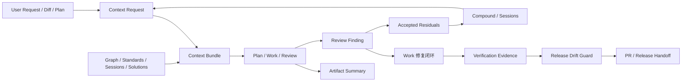

# feat: workflow harness evidence loop 三版本强化路线图

## 摘要

本计划把当前 `spec-first` 从 H4 evidence-governed harness 继续推进到 H5 review-closed engineering loop。路线分三版推进：先统一证据与阶段合同，再交付 summary-first context routing，最后闭合 review finding、work evidence、compound knowledge 和 release drift guard。

版本号是规划标签，不强制绑定最终 npm semver；实际 release 可按实现拆分。

---

## 问题框架

`spec-first` 已经具备 workflow skills、graph readiness、standards/glue baseline、task-pack、review pre-facts、task-level review gate、compound trigger checklist 和双宿主 runtime generation。当前主要缺口不再是“有没有能力”，而是这些能力之间的协议还不够统一：

- `Codebase -> Graph -> Spec -> Plan -> Tasks -> Code -> Review -> Knowledge` 链路中，不同 workflow 对 artifact、evidence、finding、context、degraded mode 的表达仍分散。
- Graph facts、standards、review pre-facts、context bundle 和 artifact summary 已有雏形，但 adoption 还没有覆盖核心 workflow chain。
- Review findings 已开始有共享 envelope，但 code/doc/app review 的 synthesis、residual handling、work follow-up 和 compound capture 还没有形成统一闭环。
- Context/token 治理已经有 `context-governance` 与 `context-bundle` 合同，但仍需要最小 producer、workflow 读取顺序和 fanout 预算策略。
- 外部主流方向正在收敛到 repo instructions、sandboxed/ephemeral agent environment、explicit skills/subagents、MCP capability boundaries、reviewable PR/session logs、eval/trace-driven optimization；`spec-first` 应吸收这些原则，但不能退化成中心化 agent platform 或强状态机。

核心判断仍按角色契约执行：scripts prepare deterministic facts，LLM decides semantic judgment。

---

## 需求

- R1. 三版路线必须直接服务 `workflow harness + evidence governance + repo-local engineering loop`，不能新增无明确 consumer 的 schema 或 runtime producer。
- R2. 所有新协议必须保持 light contract：字段少、可测试、能解释 authority/degraded/freshness，不复制完整 workflow。
- R3. Evidence governance 必须区分 deterministic facts、LLM judgment、assumptions、session-local evidence、advisory evidence、stale evidence。
- R4. Context routing 必须 summary-first、path-backed、budget-aware，不做中心化 semantic router，不扫描 generated runtime mirrors 作为普通上下文。
- R5. Review closure 必须用 shared finding envelope 打通 code/doc/app review、work fix loop、residual risk、compound capture 和 release notes。
- R6. `spec-work` / `spec-work-beta` 必须能产出最小 run closeout evidence，支持 compaction/resume、review handoff 和 not-run/degraded reason。
- R7. `spec-plan`、`spec-work`、`spec-code-review`、`spec-doc-review`、`spec-compound` 必须优先消费 artifact summary / context bundle，再按 trigger 展开 full artifact。
- R8. Graph/standards/provider/MCP raw output 必须保持 untrusted input 处理，进入 prompt 或 durable artifact 前要有 path containment、excerpt cap、provenance、reason_code 和 degraded classification。
- R9. Review fanout 必须 scale-aware：小 diff/docs-only 默认最小 reviewer set，高风险 contract/workflow/runtime/release 才扩大。
- R10. Public/internal helper 边界必须收紧：internal helpers 不作为用户入口推荐，mutating helper 必须有 explicit authorization、write scope、verification 和 changelog posture。
- R11. Skill/agent source 变更必须支持 fresh-source eval 或明确 not-run reason；runtime mirror 不作为 source truth。
- R12. Release/catalog guard 必须验证 public workflow inventory、runtime capability catalog、README/docs、package delivery 和 dual-host governance 的 deterministic drift。
- R13. Knowledge replay 必须能复用 accepted residuals、rejected/out-of-scope rationale、review findings 和 compound lessons，但不能变成 active workflow state。
- R14. 三版每版都必须有清晰 adoption gate、targeted tests 和 rollback/defer 边界。

---

## 假设

- A1. 当前工作区已有未提交的 context/evidence 相关 source 改动；本计划把它们视作当前分支事实，不改变或回滚。
- A2. `v1.9`、`v2.0`、`v2.1` 是路线标签；维护者可按实际 release cadence 合并或拆分。
- A3. 计划只规划 spec-first 当前项目，不实现代码，也不触碰 generated runtime mirrors。
- A4. `docs/contracts/context-governance.md`、`docs/contracts/context-bundle.md`、`docs/contracts/artifact-summary.md`、`docs/contracts/workflows/review-finding.md` 若在实施前被重命名或改写，实施者应以当时 source truth 为准。

---

## 范围边界

- 不新增中心化 workflow 状态机、current-task 文件、approval ledger、review dashboard、agent queue 或 marketplace。
- 不让 scripts 判断架构优先级、业务 scope、review 结论或 workflow route。
- 不把 graph/provider/MCP evidence 当作 confirmed truth；source、tests、compiled readiness facts 和 explicit user decisions 优先。
- 不手改 `.claude/`、`.codex/`、`.agents/skills/` 实现行为。
- 不默认把 `spec-work-beta` delegation、long-running autonomous runner 或 multi-agent fanout 推到普通用户路径。
- 不复制外部工具的 prompt/prose/schema；只吸收工程原则并用 spec-first 自己的 source contracts 表达。

### 后续单独处理

- H6 自动治理平台、dashboard、长期 benchmark platform、marketplace/catalog。
- Generic MCP adapter framework，除非先命名 concrete provider、fixed argv shape、consumer 和 safety tests。
- Cross-repo CI/scheduled graph refresh，除非 graph refresh L1/L2 evidence 已稳定并另开计划。

---

## 图谱就绪状态

- target_repo: `spec-first`
- status: stale
- source_revision: `2a16a9d7c80d86178f93cd928cc885d60b398ff9`
- current_revision: `7e18a210ac9f0a0d086c5cb19d1d20e49f138664`
- stale: true
- primary_providers: `code-review-graph`, `gitnexus`
- degraded_providers: none reported in compiled artifact
- fallback_capabilities: direct source reads, `rg`, existing contract tests, session-local GitNexus MCP pointer
- runtime_mcp_evidence: session-local GitNexus query used only as planning pointer; compiled graph facts remain stale
- confidence: medium
- limitations: 工作区 dirty 且 HEAD 已不同于 compiled graph facts；本计划依赖直接 source/doc reads 与现有 contract artifacts，不声明 primary graph-backed impact evidence。

---

## 上下文与研究

### 相关代码与模式

- `docs/10-prompt/结构化项目角色契约.md`: evolution baseline，定义 workflow harness、evidence loop、source/runtime 和 script/LLM 职责边界。
- `docs/contracts/graph-evidence-policy.md` 与 `docs/contracts/graph-provider-consumption.md`: compiled readiness、session-local evidence、stale graph、refresh ownership 和 forbidden compatibility reads。
- `docs/contracts/workflows/review-pre-facts-extraction.md`: pre-facts helper、query plan、provider result normalization、untrusted excerpts、temp artifact 和 run summary contract。
- `docs/contracts/context-governance.md`: runtime/generated/audit context 默认排除，summary-first 和 cache-friendly prompt layout。
- `docs/contracts/context-bundle.md`: `context-request.v1` / `context-bundle.v1` 的 lightweight envelope。
- `docs/contracts/artifact-summary.md`: durable workflow artifact 的 summary-first handoff。
- `docs/contracts/workflows/review-finding.md`: code/doc/app review 共享 finding envelope。
- `docs/10-prompt/skill-agent-harness-audit/11-final-recommendations.md`: 当前判断为 H4，下一阶段目标是 H5 review-closed loop，P0/P1 指向 public/internal、mutating helper、runtime parity 和 review closure。
- `docs/plans/2026-05-11-002-feat-spec-first-project-optimization-upgrade-plan.md`: 已有长期优化路线，第一阶段 MVP 聚焦 task handoff、execution evidence 和 token economy。

### 项目沉淀

- 已完成的 graph evidence、review pre-facts、task-pack review gate 和 no-graph fast path 说明：先交付轻量垂直切片，再扩大 adoption，是当前项目最稳的演进方式。
- `docs/solutions/workflow-issues/modify-source-not-artifacts-2026-04-13.md` 强化 source-first；runtime mirror drift 通过 init/update 处理。
- `docs/contracts/workflows/fresh-source-eval-checklist.md` 要求 skill/agent prose 变更后使用 fresh-source eval 或记录未执行原因。

### 外部参考

- OpenAI Codex docs 强调 coding agent 可以 read/modify/run code，cloud task 在 sandboxed environment 中执行，适合 background parallel work 和 PR draft，但需要 environment/security 边界。
- OpenAI agent docs 与 Codex use cases 强调 workflows、tools、knowledge、evals、skills、repeatable operations 和 reviewable outputs。
- Anthropic Claude Code docs 把 `CLAUDE.md`、skills、subagents、hooks、MCP 分成不同扩展面；subagents 有 separate context window 和 tool access，hooks 是 event automation。
- GitHub Copilot cloud agent docs 强调 research -> plan -> iterate -> PR/review，以及 ephemeral GitHub Actions environment、setup steps、session logs 和 PR review。
- MCP docs 把 prompts、resources、tools、roots、sampling 区分为不同 capability，且 prompts user-controlled、resources application-driven、roots define filesystem boundaries、sampling should keep human review in loop。

---

## 三个迭代版本

| 版本 | 主题 | 结果 | 主要验收门槛 |
| --- | --- | --- | --- |
| `v1.9` | 证据封套与紧凑阶段合同 | 核心链路共享 artifact summary、evidence packet、review finding、run closeout 的最小词表和采纳路径。 | `spec-plan` / `spec-work` / `spec-code-review` / `spec-doc-review` / `spec-compound` 合同测试通过，review-finding 不只是“文档已存在”，而是被 workflow 消费。 |
| `v2.0` | 上下文路由与证据选择 | `context-bundle` 成为 reviewer / worker / researcher 的 summary-first 动态后缀，graph / standards / sessions / solutions 进入有界证据选择。 | context helper、runtime exclusion、budget/degraded reason 和 scale-aware dispatch 有聚焦测试与 workflow 覆盖。 |
| `v2.1` | Review 闭合的 repo-local 工程循环 | review findings 能进入 work fix loop、accepted residuals、compound knowledge、release/changelog guard 和 source/runtime parity report。 | 一个真实 source-changing workflow 可从 plan / work / review / compound / release 形成 path-backed closeout，不依赖模型记忆。 |

---

## 关键技术决策

- D1. 先做 shared envelope adoption，再做 producer 扩展。理由：已有合同多于 adoption，先让核心 workflow 读写同一词表，避免继续增加孤立 schema。
- D2. Context routing 只做 deterministic envelope，不做 semantic router。理由：路径、预算、排除、reason_code 属于脚本；哪些上下文足够支撑当前判断仍属于 LLM。
- D3. Review closure 以 `review-finding.v1` 为最小共同字段，domain workflows 通过 `extensions` 保留差异。理由：code/doc/app review 风险不同，但 severity、evidence、owner、verification、residual status 应统一。
- D4. Durable evidence 记录 closeout 和 handoff，不记录 active progress state。理由：要支持 resume/review/compound，但不引入中心化状态机。
- D5. Release guard 只验证 deterministic drift。理由：脚本可判断 inventory、schema、manifest、README/catalog/package surface 是否一致；skill 语义质量仍由 LLM review/audit 判断。
- D6. 外部主流能力只映射到 spec-first 现有边界。理由：repo instructions、sandbox、skills/subagents、MCP、PR review 都支持本项目方向，但不能替代 source-first 和 workflow artifact chain。

---

## 开放问题

### 规划中已解决

- 是否应直接建设中心化 Context Router？不应。当前只做 `context-bundle` envelope、summary-first policy 和 helper，避免把语义排序交给脚本。
- 是否应把三版做成强 semver 承诺？不应。用 `v1.9` / `v2.0` / `v2.1` 作为路线标签，最终 release 可拆分。
- 是否应优先新增 agent？不应。当前缺口是 adoption、evidence、handoff、review closure，不是专家角色数量。

### 推迟到实施阶段

- `spec-work` run closeout 是否先写 durable JSON，还是先在 final response 中输出 schema-aligned section：取决于当前 branch 上 `spec-work-run-artifact` producer 的实际状态。
- `context-bundle` helper 是否只接受 explicit paths，还是允许 limited changed-file discovery：先以 explicit paths 为准，若需要 discovery 另开计划。
- `review-finding.v1` 在 code/doc/app review 中的 exact embedding 位置：实现时按各 workflow 现有 reviewer JSON/template 最小改动确定。

---

## 高层技术设计

> *本图只说明预期方案形态，作为审查方向参考，不是实现规格。实施者应把它当作上下文，而不是要逐字复刻的代码。*

该闭环是 repo-local 且 evidence-first 的。图示不是状态机；每条箭头表示 handoff contract 或消费路径。

---

## 实施单元

### U1. `v1.9` 紧凑阶段合同采纳

**目标：** 让核心 workflow 顶部在 30 秒内说明 Inputs、Outputs、Artifacts、Evidence Requirements、Context Policy、Handoff 和 Degraded Mode。

**需求：** R1, R2, R3, R7, R11

**依赖：** None

**文件：**
- Modify: `skills/spec-brainstorm/SKILL.md`
- Modify: `skills/spec-plan/SKILL.md`
- Modify: `skills/spec-write-tasks/SKILL.md`
- Modify: `skills/spec-work/SKILL.md`
- Modify: `skills/spec-code-review/SKILL.md`
- Modify: `skills/spec-doc-review/SKILL.md`
- Modify: `skills/spec-compound/SKILL.md`
- Test: `tests/unit/public-workflow-contract-summary.test.js`
- Test: `tests/unit/spec-plan-contracts.test.js`
- Test: `tests/unit/spec-work-contracts.test.js`
- Test: `tests/unit/spec-code-review-contracts.test.js`
- Test: `tests/unit/spec-doc-review-contracts.test.js`
- Test: `tests/unit/spec-compound-contracts.test.js`

**方案：**
- 复用已有 workflow contract summary 结构，不复制完整 workflow。
- 每个核心 stage 增加或校准 `Evidence Requirements` 与 `Context Policy`，明确 artifact summary、context bundle、graph readiness、standards 和 review finding 的消费姿态。
- 保持 progressive disclosure：长 examples、rubric、provider-specific details 下沉到 `references/`。

**执行说明：** 这是 skill prose 行为变化；实现后需要 focused contract tests，并执行 fresh-source eval 或记录未执行原因。

**遵循模式：**
- `skills/spec-plan/SKILL.md` 的 contract summary 和 graph readiness block。
- `skills/spec-doc-review/SKILL.md` 的 pre-facts / dispatch boundary。
- `docs/10-prompt/skill-agent-harness-audit/11-final-recommendations.md` 的 Skill MD Minimum。

**测试场景：**
- 合同断言： core workflow skills all expose compact Inputs/Outputs/Artifacts/Handoff/Degraded Mode.
- 合同断言： summaries do not recommend generated runtime mirrors as source truth.
- 合同断言： summaries distinguish script-owned facts from LLM-owned judgment.
- 合同断言： long provider-specific rules are referenced rather than duplicated.

**验证：**
- Focused workflow contract tests pass.
- Fresh-source eval result or not-run reason is recorded in implementation closeout.

### U2. `v1.9` Evidence Packet 与 Artifact Summary 采纳

**目标：** 让 plan/work/review/compound handoff 默认传递 `artifact-summary.v1` 等价摘要，并为高风险 claim 提供 `evidence-packet.v1` 最小合同。

**需求：** R2, R3, R6, R7, R8

**依赖：** U1

**文件：**
- Modify: `docs/contracts/artifact-summary.md`
- Create: `docs/contracts/evidence-packet.md`
- Modify: `docs/contracts/workflows/spec-work-run-artifact.schema.json`
- Modify: `skills/spec-plan/SKILL.md`
- Modify: `skills/spec-work/SKILL.md`
- Modify: `skills/spec-work-beta/SKILL.md`
- Modify: `skills/spec-code-review/SKILL.md`
- Modify: `skills/spec-compound/SKILL.md`
- Test: `tests/unit/spec-work-run-artifact-contract.test.js`
- Test: `tests/unit/context-governance-contracts.test.js`
- Test: `tests/unit/spec-work-contracts.test.js`

**方案：**
- 保持 `artifact-summary.v1` 是 summary-first handoff，不替代 full artifact。
- 新增 `evidence-packet.v1` 只用于 high-risk claim：包含 fact、inference、assumption、limitation、source path、freshness、authority。
- `spec-work` closeout 先支持 schema-aligned summary；durable JSON producer 可作为同版后段或独立 follow-up。
- Provider/raw outputs 只记录 summary、reason_code、artifact path，不嵌入大段 raw logs。

**遵循模式：**
- `docs/contracts/artifact-summary.md`
- `docs/contracts/workflows/review-pre-facts-extraction.md`
- `docs/contracts/graph-evidence-policy.md`

**测试场景：**
- 正向路径： work closeout includes changed files, verification, not-run/degraded reason and next action.
- 边界场景： graph stale evidence cannot be promoted to confirmed in evidence packet.
- 错误路径： provider raw output without provenance must be classified as advisory/degraded.
- 集成场景： compound can consume artifact summary without reading full review report.

**验证：**
- Contract tests prove summary-first consumption language and raw-output boundary.

### U3. `v1.9` 跨 Review Workflow 采纳 Review Finding

**目标：** 让 code/doc/app review 的 synthesis 先消费 structured finding envelope，再按 evidence insufficiency 打开详细 reviewer prose。

**需求：** R5, R8, R9

**依赖：** U1, U2

**文件：**
- Modify: `docs/contracts/workflows/review-finding.md`
- Modify: `skills/spec-code-review/SKILL.md`
- Modify: `skills/spec-code-review/references/findings-schema.json`
- Modify: `skills/spec-doc-review/SKILL.md`
- Modify: `skills/spec-doc-review/references/findings-schema.json`
- Modify: `skills/spec-app-consistency-audit/SKILL.md`
- Test: `tests/unit/spec-code-review-contracts.test.js`
- Test: `tests/unit/spec-doc-review-contracts.test.js`
- Test: `tests/unit/spec-app-consistency-audit-evidence.test.js`

**方案：**
- 不替换 domain-specific reviewer JSON；只要求 synthesis 可映射到 shared fields。
- P0/P1 findings 不得被 finding cap 静默丢弃。
- `owner` 和 `residual_status` 进入 final output，使 work/compound/release 能继续消费。
- 每个 actionable finding 必须有 path/command/artifact anchor。

**遵循模式：**
- `docs/contracts/workflows/review-finding.md`
- `skills/spec-code-review/references/findings-schema.json`
- `skills/spec-doc-review/references/synthesis-and-presentation.md`

**测试场景：**
- 正向路径： reviewer finding maps to shared severity/category/evidence/owner/residual_status.
- 边界场景： low-confidence finding remains advisory and cannot block release without evidence.
- 错误路径： actionable finding without evidence anchor is invalid or must be downgraded.
- 集成场景： work follow-up can identify unresolved/high findings from final review output.

**验证：**
- Focused review contract tests pass.
- One doc-review or code-review dry run records `review-finding.v1` adoption status, or implementation closeout records why not run.

### U4. `v2.0` Context Bundle Helper 与 Workflow Intake

**目标：** 让 reviewer、worker、researcher 的 dynamic suffix 通过 bounded `context-bundle.v1` 传递，减少 full artifact/full directory 读取。

**需求：** R4, R7, R8

**依赖：** U1, U2

**文件：**
- Modify: `docs/contracts/context-governance.md`
- Modify: `docs/contracts/context-bundle.md`
- Modify: `src/cli/commands/internal.js`
- Modify: `src/cli/helpers/context-bundle.js`
- Modify: `skills/spec-plan/SKILL.md`
- Modify: `skills/spec-work/SKILL.md`
- Modify: `skills/spec-code-review/SKILL.md`
- Modify: `skills/spec-doc-review/SKILL.md`
- Test: `tests/unit/context-bundle-contracts.test.js`
- Test: `tests/unit/context-governance-contracts.test.js`

**方案：**
- `spec-first internal context-bundle --json` 只接受 explicit paths 或 workflow-provided path lists；不做 repo search 或 semantic ranking。
- Bundle 输出 included/excluded context、reason_code、budget_used、full_read_triggers、confidence/degraded。
- Workflow 读取顺序改成 artifact summary -> context bundle -> exact evidence paths -> full read triggers。
- 默认排除 `.spec-first/audits/**` 与 generated runtime mirrors；runtime/audit/setup scoped tasks 显式例外。

**遵循模式：**
- `docs/contracts/context-governance.md`
- `docs/contracts/context-bundle.md`
- `src/cli/helpers/review-pre-facts.js` 的 temp/output/path containment 思路。

**测试场景：**
- 正向路径： explicit source/test paths produce a valid context bundle.
- 边界场景： `.spec-first/audits/**` is excluded with `runtime_audit_artifact_excluded`.
- 错误路径： generated mirror path is excluded unless explicitly runtime-scoped.
- 集成场景： spec-doc-review prompt context can reference bundle summary without copying full artifacts.

**验证：**
- Context bundle helper tests pass.
- Workflow contract tests prove high-frequency workflows mention summary-first dynamic suffix.

### U5. `v2.0` Graph、Standards、Sessions 与 Solutions 的证据源选择

**目标：** 把 graph readiness、standards/glue map、sessions、solutions、review pre-facts 纳入统一 evidence source selection 纪律。

**需求：** R3, R4, R7, R8, R13

**依赖：** U4

**文件：**
- Modify: `docs/contracts/graph-evidence-policy.md`
- Modify: `docs/examples/standards-glue-consumption-examples.md`
- Modify: `skills/spec-plan/SKILL.md`
- Modify: `skills/spec-work/SKILL.md`
- Modify: `skills/spec-debug/SKILL.md`
- Modify: `skills/spec-sessions/SKILL.md`
- Modify: `skills/spec-compound/SKILL.md`
- Test: `tests/unit/graph-provider-consumption-contracts.test.js`
- Test: `tests/unit/spec-standards-consumers.test.js`
- Test: `tests/unit/spec-sessions-contracts.test.js`

**方案：**
- 建立 workflow-facing source selection rule：compiled readiness and confirmed standards first；session-local MCP and observed standards advisory；solutions/sessions require provenance-backed refs。
- `context-bundle` 只记录 candidate paths and reasons；LLM 判断是否展开和如何解释。
- `review-pre-facts` 继续服务 review orchestrator；不要复制其 provider result normalization。
- Rejected/out-of-scope rationale 以 artifact summary 或 compound reference 进入 context，不成为 active state。

**遵循模式：**
- `.spec-first/standards/glue-map.json`
- `docs/examples/standards-glue-consumption-examples.md`
- `docs/contracts/graph-provider-consumption.md`

**测试场景：**
- 正向路径： confirmed standards can be cited as hard context.
- 边界场景： observed/imported/suggested standards remain advisory.
- 错误路径： stale graph facts trigger limitation and do not become primary evidence.
- 集成场景： spec-plan can reference relevant solution doc through context bundle without scanning all `docs/solutions/**`.

**验证：**
- Standards consumer and graph consumption contract tests pass.

### U6. `v2.0` 按规模调整的 Dispatch 与 Research Budget Policy

**目标：** 让 reviewer/researcher/subagent fanout 按 diff risk、artifact type、provider freshness、task complexity 收缩或扩大。

**需求：** R4, R9, R10, R11

**依赖：** U4, U5

**文件：**
- Create: `docs/contracts/workflows/dispatch-budget-policy.md`
- Modify: `skills/spec-code-review/SKILL.md`
- Modify: `skills/spec-doc-review/SKILL.md`
- Modify: `skills/spec-plan/SKILL.md`
- Modify: `skills/spec-work-beta/SKILL.md`
- Modify: `agents/*.agent.md` only when a specific agent lacks evidence/output boundary
- Test: `tests/unit/spec-dispatch-boundary-contracts.test.js`
- Test: `tests/unit/spec-code-review-contracts.test.js`
- Test: `tests/unit/spec-doc-review-contracts.test.js`

**方案：**
- Define small/medium/high-risk dispatch profiles for docs-only, narrow code, contract/runtime/security/release changes.
- Research agents receive context bundle and budget, not full plan/audit dumps.
- Implementation workers remain explicit opt-in/beta; ordinary review/research dispatch does not authorize mutation.
- Require fresh-source eval for agent/skill behavior changes or record not-run reason.

**遵循模式：**
- Claude Code subagent principle: separate context and focused tool access.
- Existing `spec-doc-review` multi-persona dispatch and fallback contract.
- Current Codex delegation restrictions in `spec-work-beta`.

**测试场景：**
- 正向路径： docs-only review uses minimal reviewer set.
- 边界场景： contract/runtime/security change escalates reviewer set and records why.
- 错误路径： report-only/no-agents disables dispatch and records fallback reason.
- 集成场景： worker delegation prompt carries context bundle, write scope and review gate metadata.

**验证：**
- Dispatch boundary tests pass.
- Fresh-source eval result or not-run reason is recorded.

### U7. `v2.1` Work 修复闭环与 Review Closure Handoff

**目标：** 把 unresolved review findings、fix verification、accepted residuals 和 next action 串成 work/review/compound 可消费的 closeout。

**需求：** R5, R6, R9, R13

**依赖：** U3, U4

**文件：**
- Create: `docs/contracts/workflows/review-closure.md`
- Modify: `skills/spec-work/SKILL.md`
- Modify: `skills/spec-work-beta/SKILL.md`
- Modify: `skills/spec-code-review/SKILL.md`
- Modify: `skills/spec-compound/SKILL.md`
- Test: `tests/unit/spec-work-contracts.test.js`
- Test: `tests/unit/spec-code-review-contracts.test.js`
- Test: `tests/unit/spec-compound-contracts.test.js`

**方案：**
- `review-closure` 只记录 final review summary, finding ids, residual_status, verification evidence and next action；不记录 progress state。
- `spec-work` 对 P0/P1 或 review_focus-matching findings 要求 fix/re-review 或 explicit handoff。
- Accepted residuals 进入 PR Known Residuals 或 concise durable summary；compound 只在 learning-worthy trigger 命中时建议，不自动写。
- Closeout 能支持 compaction/resume：已读 artifact、关键决策、验证状态、degraded evidence、next action。

**遵循模式：**
- `docs/contracts/workflows/review-finding.md`
- `docs/contracts/workflows/spec-work-run-artifact.schema.json`
- `skills/spec-work/references/shipping-workflow.md`

**测试场景：**
- 正向路径： fixed finding moves to `applied` with verification evidence.
- 边界场景： accepted residual is preserved with owner and next action.
- 错误路径： blocking finding cannot be silently deferred without explicit handoff.
- 集成场景： compound final checklist can consume review closure summary.

**验证：**
- Work/review/compound contract tests pass.

### U8. `v2.1` Release 与 Runtime Drift Guard

**目标：** 在 release 前用 deterministic guard 暴露 public surface、runtime catalog、README/docs、dual-host governance、package delivery drift。

**需求：** R10, R11, R12

**依赖：** U1, U3, U6

**文件：**
- Modify: `src/cli/plugin.js`
- Modify: `src/cli/contracts/dual-host-governance/skills-governance.json`
- Modify: `scripts/generate-runtime-capability-catalog.js`
- Modify: `scripts/release-publish.cjs`
- Modify: `tests/smoke/release-dual-host-governance.sh`
- Modify: `tests/unit/dual-host-governance-contracts.test.js`
- Modify: `tests/unit/runtime-contract-boundary.test.js`
- Modify: `tests/unit/package-install-contracts.test.js`
- Modify: `README.md`
- Modify: `README.zh-CN.md`

**方案：**
- Guard 输出 blocking/advisory/docs-only/degraded classifications，不做 semantic skill quality judgment。
- 验证 public workflows、standalone skills、internal-only helpers、runtime capability catalog、README/user manual references、package files list 一致。
- Runtime parity 可得到 confirmed clean 或 explicit degraded reason；不得 silent fail。
- Source changes require CHANGELOG and runtime impact note.

**遵循模式：**
- `src/cli/plugin.js` governance checks。
- `tests/smoke/release-dual-host-governance.sh`。
- `docs/contracts/dual-host-governance/README.md`。

**测试场景：**
- 正向路径： public workflow inventory matches docs/catalog/package projection.
- 边界场景： docs-only no-impact change is advisory, not blocking.
- 错误路径： internal helper exposed as public entrypoint is blocking.
- 集成场景： runtime parity failure emits degraded reason and next action.

**验证：**
- Release/governance focused tests pass.
- `npm run build` only if package surface changes.

### U9. `v2.1` 从 Findings、Residuals 与 Decisions 回放知识

**目标：** 让 future plan/work/review 能复用 resolved findings、accepted residuals、rejected scope rationale、compound lessons 和 decision docs。

**需求：** R5, R7, R13

**依赖：** U2, U5, U7

**文件：**
- Modify: `skills/spec-compound/SKILL.md`
- Modify: `skills/spec-compound-refresh/SKILL.md`
- Modify: `skills/spec-sessions/SKILL.md`
- Modify: `skills/spec-plan/SKILL.md`
- Modify: `docs/contracts/artifact-summary.md`
- Test: `tests/unit/spec-compound-contracts.test.js`
- Test: `tests/unit/spec-sessions-contracts.test.js`
- Test: `tests/unit/spec-plan-contracts.test.js`

**方案：**
- Compound captures only reusable lessons with source/test/review evidence; no auto-write from review without user/workflow decision.
- Sessions/replay returns summary + provenance, not raw transcript dumps by default.
- Rejected/out-of-scope rationale becomes queryable artifact summary when present.
- Plan/work consume knowledge as advisory unless backed by confirmed source/contract/test evidence.

**遵循模式：**
- `docs/solutions/**` existing structure.
- `skills/spec-compound-refresh/SKILL.md`
- `docs/contracts/artifact-summary.md`

**测试场景：**
- 正向路径： compound can cite review closure summary and source evidence.
- 边界场景： stale learning is flagged for refresh rather than treated as confirmed.
- 错误路径： session summary without provenance remains advisory.
- 集成场景： spec-plan uses relevant rejected/out-of-scope rationale to avoid re-planning a rejected direction.

**验证：**
- Compound/session/plan contract tests pass.

---

## 系统级影响

- **Interaction graph:** core public workflows will all touch shared contracts: `artifact-summary`, `context-bundle`, `review-finding`, graph evidence policy and release governance. Contract tests must prevent drift across skills.
- **Error propagation:** stale/degraded evidence must travel as reason_code and limitation, not be normalized away by context bundle or artifact summary.
- **State lifecycle risks:** closeout artifacts must not become active progress state; they only support resume, review, compound and release handoff.
- **API surface parity:** Claude/Codex runtime delivery, README, runtime capability catalog and governance JSON must stay aligned.
- **集成覆盖：** unit contract tests 证明 prose 与 schema 已被采纳；smoke / release tests 证明 package 与 dual-host surface；fresh-source eval 覆盖行为语义。
- **Unchanged invariants:** source-of-truth remains `skills/`, `agents/`, `templates/`, `src/cli/`, `docs/`, `README*`, `AGENTS.md`, `CLAUDE.md`; generated runtime mirrors remain generated.

---

## 风险与依赖

| 风险 | 缓解措施 |
|------|------------|
| 协议过多导致新复杂度 | 每个协议必须命名 producer、consumer、test；没有 consumer 的字段不进 v1。 |
| Context bundle 演化成 semantic router | Helper 只做 explicit path normalization、budget、exclusion、reason_code；LLM 决定语义相关性。 |
| Review closure 变成状态机 | 只记录 finding/residual/verification closeout，不记录 active progress、approval state 或 task lifecycle。 |
| Stale graph 被误当 primary evidence | 所有 workflow 在声明 graph-backed evidence 前比较 `source_revision`、`worktree_dirty`、`worktree_status_hash`。 |
| Release guard 误做语义判断 | Guard 只输出 deterministic drift classification；skill quality 仍由 review/audit 判断。 |
| 当前未提交改动和本计划冲突 | 实施前先读最新 source truth；本计划路径是目标 surface，不覆盖已有用户改动。 |

---

## 文档与运维说明

- 每版实施都必须更新 `CHANGELOG.md`。
- 用户可见行为变化需要同步 `README.md`、`README.zh-CN.md` 或用户手册。
- Skill/agent prose 变化需要 focused contract tests；高影响变化需要 fresh-source eval 或 explicit not-run reason。
- Runtime generation 变化必须说明是否需要 `spec-first init --claude|--codex`。
- Review closure adoption 前，不要宣称 H5 已完成；只能说 H4 到 H5 的协议面已铺设。

---

## 备选方案取舍

- 中心化 workflow engine：拒绝。它会把 LLM semantic judgment 推给状态机，违背角色契约。
- 全量 Context Router：拒绝。当前只需要 bounded envelope 和 summary-first policy，不需要脚本替 LLM 排语义优先级。
- 新增更多 reviewer/worker agents：暂缓。当前瓶颈是 evidence/handoff/closure adoption，不是 agent 数量。
- 自动 graph refresh / hook rebuild：暂缓。保持 automatic check, explicit refresh；高风险 graph-heavy 工作显式 handoff 到 graph-bootstrap。
- Dashboard / marketplace：暂缓。当前 repo-local artifact loop 未闭合前，不做产品平台化。

---

## 来源与参考

- Role baseline: `docs/10-prompt/结构化项目角色契约.md`
- Graph evidence: `docs/contracts/graph-evidence-policy.md`
- Graph consumption: `docs/contracts/graph-provider-consumption.md`
- Review pre-facts: `docs/contracts/workflows/review-pre-facts-extraction.md`
- Context governance: `docs/contracts/context-governance.md`
- Context bundle: `docs/contracts/context-bundle.md`
- Artifact summary: `docs/contracts/artifact-summary.md`
- Review finding: `docs/contracts/workflows/review-finding.md`
- Harness audit recommendations: `docs/10-prompt/skill-agent-harness-audit/11-final-recommendations.md`
- Existing optimization plan: `docs/plans/2026-05-11-002-feat-spec-first-project-optimization-upgrade-plan.md`
- OpenAI Codex cloud docs: `https://platform.openai.com/docs/codex`
- OpenAI Codex agent internet access docs: `https://platform.openai.com/docs/codex/agent-network`
- OpenAI Codex use cases: `https://developers.openai.com/codex/explore/`
- Anthropic Claude Code subagents docs: `https://docs.anthropic.com/en/docs/claude-code/sub-agents`
- Anthropic Claude Code hooks docs: `https://docs.anthropic.com/en/docs/claude-code/hooks`
- GitHub Copilot cloud agent research/plan/iterate docs: `https://docs.github.com/en/copilot/how-tos/use-copilot-agents/coding-agent/research-plan-iterate`
- GitHub Copilot custom instructions docs: `https://docs.github.com/en/copilot/concepts/about-customizing-github-copilot-chat-responses`
- MCP resources docs: `https://modelcontextprotocol.io/docs/concepts/resources`
- MCP prompts docs: `https://modelcontextprotocol.io/docs/concepts/prompts`
- MCP roots docs: `https://modelcontextprotocol.io/docs/concepts/roots`
- MCP sampling docs: `https://modelcontextprotocol.io/docs/concepts/sampling`
