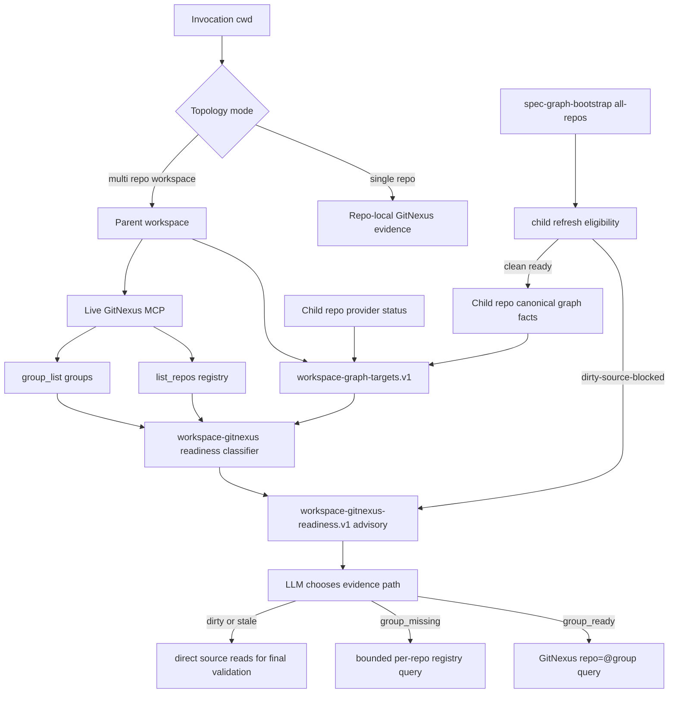

# feat: 建立 GitNexus 多仓 workspace group readiness 正确用法

## Summary

本计划把 GitNexus 多仓能力从“child repo refresh 批处理的副产品”提升为一等只读查询模型：child repo 继续拥有 canonical graph artifacts，GitNexus registry/group 负责多仓 query surface，workspace 只保存 advisory 控制面事实。

核心改变是先明确 topology gate 的两个互补字段——机器侧 `git_root_topology`（脚本确定性输出，二值：`single-repo` / `multi-repo-workspace`）+ 语义侧 `development_mode`（LLM/contract 三值：`single-repo-single-project` / `single-repo-multi-module` / `multi-repo-workspace`）——再在 `multi-repo-workspace` 模式下拆开 `refresh_eligibility`、`index_snapshot` 和 `query_usability`。dirty child repo 可以阻断该 repo 的新一轮 refresh，但若该 child 历史上至少有过一次 `query_ready=true` 快照或当前 live query proof 通过，已有 GitNexus index 仍可作为 stale/advisory evidence 使用，并要求源码验证；从未达到过 query-ready 的 child 只能归为 `registry-present-query-unverified`。单仓单项目和单仓多模块仍是 repo-local GitNexus 语义，不进入 workspace group path。

脚本唯一的确定性 topology 边界是 Git root 数量（`git_root_topology` 二值），`single-project` vs `multi-module` 的语义区分由 LLM 在 contract 层用 `development_mode` 表达。分阶段交付：Phase 1（U1+U2）建立 contract 与 resolver facts，可独立交付为 contract milestone（向后兼容、不破坏老 consumer）；用户可见的 workflow 行为变化（skill prose / durable summary / host instruction block / 用户文档）在 Phase 2-3 完成后体现。

---

## Problem Frame

当前 `spec-graph-bootstrap` 的 parent workspace 默认 all-child maintenance 能正确保护 child repo canonical artifacts：一旦 child repo 有 graph-affecting dirty paths，bootstrap 会在 provider command 前返回 `dirty-source-blocked`，避免把未提交修改写进索引快照。这条保护是必要的。

问题在于下游容易把“refresh 被 dirty gate 拦住”误读为“GitNexus 多仓查询不可用”。近期 KAZ 多仓 workspace 的现象正是如此：parent summary 变成 partial，7 个 child repo 是 `dirty-source-blocked`，但 GitNexus registry 实际上已经有这些 child repo 的既有 index。正确理解应该是：

- refresh readiness：这些 dirty child repo 不能安全刷新。
- query availability：若 child provider status 历史上至少有过一次 `query_ready=true` 快照（或当前 session live query proof 通过），其历史 index 仍可用于 read-only orientation，标为 `stale-advisory`；若 child 从未达到过 query-ready，最高只能归为 `registry-present-query-unverified` 或 `definitions-pointer`，不得作为 stale-advisory。
- workspace/group readiness：GitNexus 是否有 group，可否用 `repo="@<groupName>"` 做多仓查询，是独立于本轮 refresh 是否全绿的事实。

现有 `workspace-graph-targets.v1` 已解决 provider-neutral parent workspace target discovery；但 `2026-05-03-001` 计划把 GitNexus group mode 放在 optional future，导致现在的 consumer 仍偏向 per-repo refresh summary，而没有把 GitNexus registry/group 作为正确的多仓 query primitive 来建模。本计划补上这一层。

---

## Requirements

- R0. 所有 GitNexus workspace/group 行为必须先通过 topology gate；该 gate 由两个互补字段表达：
  - `git_root_topology`（脚本确定性输出，二值）：`single-repo` 或 `multi-repo-workspace`，仅由 Git root 数量决定；
  - `development_mode`（LLM / contract 语义层，三值）：`single-repo-single-project`、`single-repo-multi-module`、`multi-repo-workspace`，前两者要求 `git_root_topology="single-repo"`，后者要求 `git_root_topology="multi-repo-workspace"`。
  只有 `development_mode="multi-repo-workspace"` 允许 workspace group / registry fan-out；单仓和 monorepo 模式只能使用 repo-local GitNexus selector。
- R1. 明确区分 child repo refresh 资格、GitNexus index 快照状态、workspace/group 查询可用性，不能再用单个 `ready/action-required` 状态承载三种含义。
- R2. graph-affecting dirty worktree 必须继续阻断该 child repo 的 provider refresh；不得新增 `--allow-dirty` 或隐藏刷新路径。
- R3. dirty / stale child repo 的既有 GitNexus index 可作为 read-only stale/advisory evidence 使用；下游必须披露 limitations，并用源码读取或测试验证最终结论。
- R4. GitNexus registry/group 是多仓 query model，不是 refresh gate。`group_missing` 不能让 per-repo registry evidence 失效。
- R5. 父 workspace 不得拥有 repo-local `.spec-first/graph/*`、`.spec-first/providers/*` 或 `.spec-first/impact/*` canonical truth；新增 workspace artifact 只能是 `.spec-first/workspace/*` advisory facts。
- R6. Scripts 只编译确定性事实、读取 fixture/snapshot 和 current git status；LLM / workflow 才调用 live MCP 并决定语义相关 repo。
- R7. `group_sync` 或等价 provider mutation 必须是 explicit / preview-first / setup-or-bootstrap-owned；普通 plan/work/debug/review 不得静默同步 GitNexus group。
- R8. 下游 workflow 在 parent workspace 的 read-only 问题中应优先使用 GitNexus group 查询；group 缺失时使用 bounded registry/per-repo fan-out；写入、测试、autofix、commit 前仍必须有 `target_repo` 或 per-unit repo scope。
- R9. 当前 completed 的 `workspace-graph-targets.v1` provider-neutral fallback 必须保留；GitNexus group 是可用时优先的 provider-specific acceleration，不是唯一多仓能力。
- R10. 所有 source 变更必须同步 tests、docs、CHANGELOG，并通过 source-first 再 runtime regeneration 的边界交付；不手改 generated mirrors。
- R11. 回归测试必须覆盖两类机器输出 + 三类语义模式：(1) 脚本输出 `git_root_topology` 仅有两值 `single-repo` / `multi-repo-workspace`；(2) `development_mode` 三种语义模式分别有对应行为——单仓单项目不生成 workspace readiness，单仓多模块不把 modules 当 group members，多仓工作区才启用 group / bounded registry fan-out。

---

## Assumptions

- A1. 当前 GitNexus MCP surface 支持 repo registry、group list / sync，以及 group-mode query selector；本会话已通过 live MCP 看到 `list_repos` 和 `group_list` 可用，且 `group_list` 当前返回空 groups。
- A2. GitNexus group config 的具体文件位置和 schema 仍需在实施时从 provider source / docs 或 live environment 中证明；本计划不把未验证的 `group.yaml` 形状写死到 source contract。Proof gate 拆为两道：
  - **A2-Read：** `list_repos` / `group_list` 的 JSON response schema 已以静态 fixture 存档于 `tests/fixtures/gitnexus-workspace/` 并通过代码审查。**本计划范围内所有只读消费（U3 classifier、U4 handoff、U5 downstream）均要求 A2-Read 满足**。
  - **A2-Write：** group config 文件位置、schema、跨宿主（Codex / Claude）写入安全边界已从 GitNexus provider source 或官方 docs 证明，并以 fixture 存档。**A2-Write 不在本计划范围内**；group config writer / group_sync 自动化属于后续独立 task，必须在 A2-Write 满足后才可启动。
- A3. 本计划优先修正 spec-first 的消费模型和 readiness contract；如果后续确认 provider 支持稳定 CLI/JSON group management，再扩展自动 group manifest / sync。

---

## Scope Boundaries

- 不提交或清理 KAZ child repos 的 dirty worktree；本计划只定义 spec-first 如何正确解释 dirty 与 query availability。
- 不把 dirty repo 的 live working tree 内容当成 GitNexus index 已覆盖的事实。
- 不在 plan/work/debug/review 中运行 GitNexus `analyze`、provider repair、group sync、hooks、watchers 或 daemon。
- 不把 GitNexus group readiness 写成 child repo canonical graph readiness。
- 不在 `development_mode="single-repo-single-project"` 或 `development_mode="single-repo-multi-module"`（即 `git_root_topology="single-repo"`）下创建或建议 GitNexus workspace group；monorepo modules 是 repo-local topology，不是 group members。
- 不让脚本替用户或 LLM 判断“哪个业务问题属于哪个 repo”。
- 不删除现有 `workspace-graph-targets.v1`、all-repos maintenance 或 per-repo refresh 能力。
- 不在本计划里把 GitNexus 从 optional global-knowledge enhancement 改回核心 review/impact gate；code-review-graph 的 impact/review 角色不变。
- 不把已删除 / 正在删除的 `spec-standards` 纳入 GitNexus workspace group readiness 的 downstream consumer、handoff 或 artifact 设计；`spec-standards` active reference cleanup 由 `docs/plans/2026-05-21-002-refactor-remove-spec-standards-plan.md` 独立处理。

### Deferred to Follow-Up Work

- GitNexus group config 自动生成 / 自动写入：等 A2-Write proof gate（group config 文件位置、schema、跨宿主写入安全边界已证明）满足后再做；**A2-Read（本计划已完成的只读 schema 存档）不足以解锁该 deferred 工作**。
- 多仓 incremental refresh：当前 `--all-repos --incremental` 仍 unsupported，保持独立计划处理。
- Cross-repo API/DTO contract bridge 的语义推断：本计划只建立 group/query readiness，不自动生成跨 repo 业务依赖图。
- Workspace UI / dashboard：可在 workspace GitNexus readiness artifact 稳定后单独做。
- `spec-first doctor` 输出对新字段的适配：本计划不改 `spec-first doctor` 命令；若 doctor 输出暴露旧 workspace readiness 枚举（如单一 `status` 无三层拆分），在独立后续 task 中更新。

---

## Graph Readiness

- target_repo: `spec-first`
- status: stale
- source_revision: `4db7aaed1a78fa2ad7d6e28610348002cd85a531`
- current_revision: `5ce2fd44fb0cbc0fc903aacecf8daac0a064421a`
- stale: true
- primary_providers: compiled artifacts report `code-review-graph`, `gitnexus`
- degraded_providers: none in compiled artifacts
- fallback_capabilities: direct source reads, existing graph-provider contracts, and session-local GitNexus MCP evidence
- runtime_mcp_evidence: `list_repos` succeeded and shows the KAZ child repos registered in GitNexus; `group_list` succeeded and returned `groups=[]`; current MCP tool contract supports group-mode query selectors such as `repo="@<groupName>"`
- confidence: medium-high for planning decisions; low for claiming current graph-backed impact on changed `spec-first` source
- limitations: compiled graph facts are 11 commits behind current `HEAD` and the worktree already contains unrelated user changes; this plan uses direct source reads and live MCP registry facts as planning context, not as refreshed canonical readiness

---

## Context & Research

### Relevant Code and Patterns

- `skills/spec-graph-bootstrap/scripts/bootstrap-providers.sh` currently treats parent workspace no-arg and `--all-repos` as all-child maintenance, writes child-local canonical artifacts, and writes parent `.spec-first/workspace/graph-bootstrap-summary.json` as advisory.
- `skills/spec-graph-bootstrap/scripts/resolve-workspace-graph-targets.sh` emits `workspace-graph-targets.v1`, reads child canonical artifacts, and reports statuses such as `primary`, `degraded-fallback`, `stale`, `dirty-uncertain`, `setup-ready-bootstrap-required`, and `unavailable`.
- `docs/contracts/graph-provider-consumption.md` already states dirty graph-affecting refresh exits before provider commands with `dirty-source-blocked` and preserves canonical artifacts.
- `docs/contracts/graph-evidence-policy.md` already owns the `automatic check, explicit refresh` model and says live MCP evidence is session-local.
- `src/cli/instruction-bootstrap.js` currently tells parent workspace users that read-only code questions may use `workspace-graph-targets.v1`, while writes require `target_repo`.
- `docs/05-用户手册/04-workflows-artifacts-map.md` already defines `.spec-first/workspace/` as parent advisory summaries, not child canonical truth.
- `docs/05-用户手册/08-三种开发模式.md` already names the three supported development modes: single repo / single project, single repo / multi module, and multi repo workspace.
- `tests/unit/spec-graph-bootstrap.sh` already covers all-repos partial success, dirty refresh preservation, and dirty graph facts without fingerprint.

### Institutional Learnings

- `docs/plans/2026-04-28-005-feat-workspace-target-readiness-plan.md` established that parent workspace is control plane, child repo owns canonical config/graph facts.
- The same workspace target plan also established the invariant that monorepo modules remain inside one Git root and must not be split into independent project readiness snapshots.
- `docs/plans/2026-05-03-001-feat-workspace-graph-query-router-plan.md` implemented provider-neutral read-only graph target routing but deliberately deferred GitNexus group mode.
- `docs/plans/2026-05-18-001-refactor-crg-primary-gitnexus-optional-plan.md` records a compatible direction: GitNexus is global knowledge / query enhancement, not core impact/review gate.
- `docs/plans/2026-05-21-002-refactor-remove-spec-standards-plan.md` retires `spec-standards` as a public workflow, artifact producer, and downstream context source. This GitNexus plan must not reintroduce `spec-standards` as a consumer or handoff path.
- `docs/10-prompt/结构化项目角色契约.md` requires `Scripts prepare, LLM decides`: scripts provide deterministic readiness facts; LLM decides semantic repo relevance and evidence sufficiency.

### Live GitNexus Evidence

- `list_repos` shows GitNexus already has registry entries for the KAZ child repos such as `hs-kaz-bss-service`, `hs-kaz-crm-admin`, `hs-kaz-crm-basic-service`, `hs-kaz-crm-money-service`, `hs-kaz-crm-open-api`, `hs-kaz-crm-service`, `hs-kaz-crm-task`, and `hs-kaz-crm-web`.
- `group_list` currently returns no configured groups. Therefore the immediate correct fallback is bounded registry/per-repo querying, not assuming GitNexus cannot do multi-repo.
- The current MCP tool contract exposes group-mode selectors (`@<groupName>` and `@<groupName>/<memberPath>`) for query/context/impact-like calls. This is session-local capability evidence, not a compiled readiness artifact.

---

## Key Technical Decisions

| Decision | Rationale | Consequence |
| --- | --- | --- |
| Gate GitNexus group usage by topology fields | Single repo and monorepo are one Git root; GitNexus group is only meaningful when a parent workspace contains multiple independent child Git repos | `workspace-gitnexus-readiness.v1` must carry `git_root_topology` (script-side, two values) and `development_mode` (LLM-side, three values); downstream group logic is disabled outside `development_mode="multi-repo-workspace"` |
| Split topology into deterministic vs semantic field | Scripts can only count Git roots deterministically; the `single-project` vs `multi-module` distinction is an architectural / LLM judgment that must not be hard-coded into a resolver script | Resolver emits `git_root_topology`; LLM/contract layer chooses `development_mode`. R0 contract enforces invariant `development_mode ∈ allowed_set(git_root_topology)` |
| Treat GitNexus group as query model, not refresh gate | GitNexus registry can contain usable prior indexes even when current refresh is blocked by dirty worktree | `dirty-source-blocked` no longer implies `query_unusable`; it implies stale/advisory query evidence |
| Preserve child canonical artifact ownership | Parent workspace canonical graph truth would conflate multiple Git repos and break freshness semantics | New workspace facts stay under `.spec-first/workspace/*` and are advisory |
| Add query usability fields instead of replacing `status` | Existing consumers and tests already use `workspace-graph-targets.v1.status` | Backward compatible migration; new consumers prefer `query_usability` / `refresh_eligibility` |
| Keep live MCP evidence session-local | Scripts cannot call host MCP tools, and MCP success must not rewrite compiled readiness | Plans/reviews can cite live `list_repos` / `group_list`, but canonical facts remain unchanged |
| Make group sync explicit and preview-first | `group_sync` mutates provider-side contract registry and depends on provider group config | Only setup/bootstrap-owned explicit path may sync; plan/work/debug/review only read |
| Use bounded fallback when group missing | `groups=[]` is a configuration gap, not provider failure | Downstream can query selected registry repos with limitations while recommending group setup |
| Require source validation for dirty overlay | GitNexus index cannot include uncommitted graph-affecting changes if refresh was blocked | LLM must read dirty files directly before making claims about dirty-path behavior |

---

## Open Questions

### Resolved During Planning

- Should dirty child repos be submitted just to use GitNexus multi-repo query? No. Commit/stash/clean is required for refresh, not for stale/advisory read-only orientation.
- Should `group_missing` block multi-repo use? No. It blocks group-mode query, but registry/per-repo bounded fan-out remains available.
- Should `spec-graph-bootstrap --all-repos` be replaced by GitNexus group sync? No. all-repos bootstrap refreshes child canonical readiness; GitNexus group sync prepares query aggregation. They are different operations.
- Should scripts choose the semantic repo from group results? No. Scripts emit candidates, statuses, and limitations; LLM chooses relevance.
- Should current dirty worktree with clean HEAD index remain `primary`? For old `status` compatibility it may remain `primary`, but new `query_usability` must mark dirty overlay limitations so consumers do not over-trust indexed facts.
- Should monorepo packages/modules become GitNexus group members? No. A monorepo has one Git root and one repo-local graph/provider boundary; modules may appear in plan units, but not as child repos or workspace group members.

### Deferred to Implementation

- Exact GitNexus group config path and schema: implementation must verify provider source/docs or current environment before adding any group manifest writer.
- Whether GitNexus exposes stable CLI JSON for `list_repos` / `group_list`: if not, group readiness stays live-MCP/session-local in Phase A and only deterministic fixture classification is tested.
- Exact group id default: likely derived from workspace basename or explicit config, but must avoid collisions with existing GitNexus repo names and support explicit override.
- Whether `workspace-gitnexus-readiness.v1` should be written by `spec-graph-bootstrap --write-summary` or emitted only to stdout first.

---

## Output Structure

> 以下仅展示 U3 产生的核心新文件。**完整文件变更清单见 U1–U7 各 Implementation Unit 的 Files 段**：U1 新增 `docs/contracts/workspace-gitnexus-consumption.md` 并修改两个现有 contract 文档；U2 修改 resolver 脚本；U4 修改 `skills/spec-graph-bootstrap/SKILL.md`；U5 修改多个 skill 文件及 `src/cli/instruction-bootstrap.js`；U6 修改用户手册与 README。

```text
docs/contracts/
  workspace-gitnexus-consumption.md

src/cli/helpers/
  compile-workspace-gitnexus-readiness.js

skills/spec-graph-bootstrap/scripts/
  compile-workspace-gitnexus-readiness.sh

tests/fixtures/gitnexus-workspace/
  registry-list.kaz.example.json
  group-list.empty.example.json
  group-list.ready.example.json
  workspace-graph-targets.dirty-overlay.example.json
  topology-single-repo.example.json
  topology-monorepo.example.json
  topology-multi-repo-workspace.example.json

tests/unit/
  workspace-gitnexus-contracts.test.js
  workspace-gitnexus-readiness.test.js
```

The classifier 主体放在 `src/cli/helpers/compile-workspace-gitnexus-readiness.js`（与其他 helper 同 location），通过 `skills/spec-graph-bootstrap/scripts/compile-workspace-gitnexus-readiness.sh` thin wrapper 暴露给 skill 使用。这样测试可直接 `require()` helper 模块，skill 调用走 shell wrapper，符合 source/runtime 边界。

---

## High-Level Technical Design

> *This illustrates the intended approach and is directional guidance for review, not implementation specification. The implementing agent should treat it as context, not code to reproduce.*

### Topology Mode Contract

所有 consumer 在应用 GitNexus workspace/group 逻辑前，必须先识别研发拓扑。该 gate 由两个互补字段组成：

- **`git_root_topology`（脚本确定性输出，二值枚举）：** 仅由 Git root 数量决定。当前目录解析到一个 Git root → `"single-repo"`；当前目录不是 Git repo 且包含多个独立 child Git roots → `"multi-repo-workspace"`。
- **`development_mode`（LLM / contract 语义层，三值枚举）：** 由 LLM 基于文件布局、plan/module scope 或架构判断在 contract 层指定，取值为 `single-repo-single-project` / `single-repo-multi-module` / `multi-repo-workspace`。脚本不输出该字段。

**字段不变量：**

```
git_root_topology="single-repo"            ⇔  development_mode ∈ {single-repo-single-project, single-repo-multi-module}
git_root_topology="multi-repo-workspace"   ⇔  development_mode = "multi-repo-workspace"
```

下表的"模式"列指 `development_mode`。

| development_mode | git_root_topology | 判定边界 | Source of truth | GitNexus 用法 | Workspace group | 写入门槛 |
| --- | --- | --- | --- | --- | --- | --- |
| `single-repo-single-project` | `single-repo` | 当前目录解析到一个 Git root，且无需 module 级路由 | repo root `.spec-first/*` | 当前 Git repo 的 repo-local selector | 不适用；不得配置或查询 workspace group | 当前 Git root |
| `single-repo-multi-module` | `single-repo` | 当前目录解析到一个 Git root，packages/modules/apps 都在该 root 下 | repo root `.spec-first/*`；module 边界只是 planning context | 覆盖同一 repo 内所有 modules 的 repo-local selector | 禁止；modules 不是 child repos 或 group members | 当前 Git root，可在 implementation units 中标 module scope |
| `multi-repo-workspace` | `multi-repo-workspace` | 当前目录不是 Git repo，且包含多个独立 child Git roots | child repo canonical artifacts；父级 `.spec-first/workspace/*` 仅 advisory | 有 group 时优先 group；否则 bounded registry/per-repo fan-out | 仅作为只读 query acceleration；sync 仍 explicit / preview-first | 写入、测试、autofix、commit 前必须有 `target_repo` 或 per-unit repo scope |

这个 contract 刻意区分"一个 repo 内的 module routing"和"多个 Git roots 之间的 repo routing"。`git_root_topology` 是机器可验证事实；`development_mode` 是 LLM/contract 层的架构表达。`single-project` 与 `multi-module` 的区分仅在 `development_mode` 层存在，不是 resolver 脚本的输出枚举值。



### Multi-Repo Workspace Readiness Matrix

| Child repo condition | Refresh eligibility | GitNexus query usability | Required disclosure |
| --- | --- | --- | --- |
| Clean, compiled `source_revision` equals `HEAD`, `query_ready=true` | `eligible` / already current | `fresh-primary` | Normal graph evidence caveat |
| Registry has the repo, but child provider status `query_ready=false` (definitions-only / probe-failed / never-verified) | refresh may be needed | `registry-present-query-unverified` | Treat as pointer evidence only; do not promote to `stale-advisory` until live query proof passes or a prior `query_ready=true` snapshot is recorded |
| Current worktree has graph-affecting dirty paths, prior `query_ready=true` snapshot exists | `blocked-dirty-source` | `stale-advisory` | Index excludes dirty overlay; read dirty files directly |
| Current worktree dirty, but child has never reached `query_ready=true` | `blocked-dirty-source` | `registry-present-query-unverified` | Cannot use as stale-advisory; need clean refresh + live proof |
| Compiled `source_revision` behind `HEAD`, prior `query_ready=true` snapshot exists | `eligible-after-refresh` | `stale-advisory` | Index is behind current branch |
| Group exists and member repos are registered | independent of refresh | `group-ready` | Group query may still return stale members |
| Group missing, repos registered | independent of refresh | `registry-fanout-advisory` | Query bounded repo list; recommend group setup |
| Repo missing from GitNexus registry | refresh may be needed | `unavailable` | Run setup/bootstrap for that repo |

**Promotion gate：** `stale-advisory` 要求 child provider status 满足 (a) 当前或历史 `query_ready=true` 至少出现过一次（保留在 provider status snapshot 或 `last_indexed_commit`），或 (b) 当前 session 内 live query proof 已通过。仅 registry entry 存在但无任何 `query_ready=true` 历史的情况，最高只能归为 `registry-present-query-unverified` 或 `definitions-pointer`，不得归为 `stale-advisory` 或 `fresh-primary`。

### Directional Artifact Shape

```json
{
  "schema_version": "workspace-gitnexus-readiness.v1",
  "advisory": true,
  "git_root_topology": "multi-repo-workspace",
  "development_mode": "multi-repo-workspace",
  "gitnexus_selector_strategy": "workspace-group | bounded-registry-fanout | repo-local | direct-read-fallback",
  "parent_writes_repo_local_artifacts": false,
  "group": {
    "name": "workspace-name",
    "status": "group-ready | group-missing | group-sync-required | unavailable",
    "query_selector": "@workspace-name"
  },
  "repos": [
    {
      "target_repo": "child-repo",
      "repo_boundary": "child-git-root",
      "gitnexus_repo": "child-repo",
      "refresh_eligibility": "eligible | eligible-after-refresh | blocked-dirty-source | setup-required",
      "index_snapshot": "current-clean | current-with-dirty-overlay | stale-commit | missing",
      "query_usability": "fresh-primary | stale-advisory | registry-present-query-unverified | registry-fanout-advisory | definitions-pointer | unavailable",
      "limitations": []
    }
  ]
}
```

The JSON shape above is a review sketch, not a schema to copy verbatim. Implementation may refine enum names, but must preserve (a) the two-field topology gate (`git_root_topology` deterministic + `development_mode` semantic), (b) the field invariant `git_root_topology="single-repo" ⇔ development_mode ∈ {single-repo-single-project, single-repo-multi-module}`, and (c) the three-way separation between refresh, index snapshot, and query usability. For `development_mode="single-repo-single-project"` and `development_mode="single-repo-multi-module"`, the classifier should either emit a compact `not-applicable` advisory result or let the repo-local graph facts remain the only readiness object; it must not synthesize workspace group members from modules.

---

## Implementation Units

### U1. Define Workspace GitNexus Consumption Contract and Proof Gate

**Goal:** Establish the source-of-truth vocabulary for GitNexus multi-repo usage so downstream work stops conflating refresh failure with query unavailability.

**Requirements:** R0, R1, R2, R3, R4, R5, R6, R7, R11

**Dependencies:** None

**Files:**
- Create: `docs/contracts/workspace-gitnexus-consumption.md`
- Modify: `docs/contracts/graph-provider-consumption.md`
- Modify: `docs/contracts/graph-evidence-policy.md`
- Test: `tests/unit/workspace-gitnexus-contracts.test.js`

**Approach:**
- Record a proof gate: current source may rely on live MCP `list_repos`, `group_list`, and group-mode selector evidence, but may not implement a group config writer until provider group config path/schema is verified from GitNexus source/docs or a controlled local fixture.
- Define `workspace-gitnexus-readiness.v1` as advisory workspace evidence, not child canonical graph truth.
- Define the topology contract in `docs/contracts/workspace-gitnexus-consumption.md` using two fields: `git_root_topology` (script-deterministic, two values: `single-repo` / `multi-repo-workspace`) and `development_mode` (LLM-facing, three values: `single-repo-single-project` / `single-repo-multi-module` / `multi-repo-workspace`). State the invariant `git_root_topology="single-repo" ⇔ development_mode ∈ {single-repo-single-project, single-repo-multi-module}`. Only `development_mode="multi-repo-workspace"` allows group / registry fan-out.
- Document the three independent fields: `refresh_eligibility`, `index_snapshot`, and `query_usability`.
- Document that `dirty-source-blocked` is a refresh result, not a query result.
- Document that `group_ready`, `group_missing`, and `registry-fanout-advisory` are GitNexus query-surface facts.
- Document that live MCP `list_repos` / `group_list` / group-mode query is session-local evidence unless a deterministic script consumes a supplied snapshot.
- Add a short compatibility note to `graph-provider-consumption.md`: old consumers may still read `workspace-graph-targets.v1.status`, but new GitNexus-aware consumers must prefer the new fields when present.
- **Canonical shape pinning（防止 consumer 漂移）：** 在 `workspace-gitnexus-consumption.md` 中明确：
  - **`group` 是嵌套对象，不是顶层 snake_case 字段。** 形状固定为 `group: { name: string|null, status: "group-ready"|"group-missing"|"group-sync-required"|"unavailable"|"not-evaluated-no-mcp-input", query_selector: string|null }`。
  - 任何下游 consumer（`workspace-graph-bootstrap-summary.v1`、spec-plan 引用、SKILL prose、tests）必须使用 `group.status` 路径，**禁止写顶层 `group_status`**（包括字段名混用 snake_case 与 kebab-case 的情况）。
  - 命名规则：枚举值统一 kebab-case；JSON 字段名统一 snake_case；嵌套路径统一用点号 `group.status`。Contract test 必须断言这套规则。

**Execution note:** Start with contract tests that fail on the old conflated wording before changing prose. 这些 U1 contract 测试是全局回归锚点；U7 在其基础上补充 fixture-level 集成场景，不重写已在 U1 建立的 prose 断言。

**Patterns to follow:**
- `docs/contracts/graph-provider-consumption.md`
- `docs/contracts/graph-evidence-policy.md`
- `tests/unit/spec-graph-bootstrap-contracts.test.js`

**Test scenarios:**
- Happy path: contract contains explicit statements that dirty refresh blocked still allows stale/advisory read-only GitNexus use.
- Happy path: contract contains a three-mode decision matrix and states that monorepo modules are not GitNexus group members.
- Edge case: contract says `group_missing` is not provider failure and should fall back to bounded registry/per-repo evidence.
- Edge case: contract says single-repo and monorepo modes must use repo-local GitNexus evidence, not workspace group readiness.
- Error path: contract forbids plan/work/debug/review from running `group_sync` or provider refresh.
- Integration: contract test confirms `graph-provider-consumption.md` links or references the new workspace GitNexus contract.
- Canonical shape: contract test 断言 `group` 字段是嵌套对象（非顶层 `group_status`），status 值域含 `"not-evaluated-no-mcp-input"`，命名规则文字明确（snake_case 字段 / kebab-case 值 / 点号路径）。

**Verification:**
- A reviewer can tell which layer owns refresh, group query, and semantic repo selection without reading scripts.

---

### U2. Extend Workspace Graph Targets With Query Usability

**Goal:** Make parent workspace target discovery report dirty/stale query limitations without breaking existing `status` consumers.

**Requirements:** R0, R1, R2, R3, R5, R9, R11

**Dependencies:** U1

**Files:**
- Modify: `skills/spec-graph-bootstrap/scripts/resolve-workspace-graph-targets.sh`
- Modify: `skills/spec-graph-bootstrap/scripts/resolve-workspace-graph-targets.ps1`
- Modify: `skills/spec-graph-bootstrap/SKILL.md`
- Modify: `tests/unit/spec-graph-bootstrap.sh`
- Modify: `tests/unit/spec-graph-bootstrap-contracts.test.js`
- Create (if absent) or Modify: `tests/unit/resolve-workspace-graph-targets-powershell-contracts.test.js` — 验证 PS resolver 输出新增字段（`git_root_topology`、`refresh_eligibility`、`index_snapshot`、`query_usability`、`working_tree_overlay`）的字段名与枚举值与 Bash 完全一致

**Approach:**
- Preserve existing `.repos[].status` for backward compatibility.
- Preserve existing resolver topology semantics: when cwd resolves to a Git root, return repo-local facts and do not discover modules/packages as workspace repos.
- Add a new `git_root_topology` field to the top-level resolver output: map current `mode=git-repo` → `git_root_topology="single-repo"`; non-Git parent workspace with child repos → `git_root_topology="multi-repo-workspace"`. The field has exactly two values; do not introduce a `single-project` vs `multi-module` distinction in the resolver script. Keep `schema_version="workspace-graph-targets.v1"`; new fields are additive and backward-compatible. The semantic `development_mode` (three values) is **not** emitted by the resolver; it is set by LLM/contract layer in U3 / U5 consumers.
- Add fields such as `refresh_eligibility`, `index_snapshot`, `query_usability`, and `working_tree_overlay` to each child row.
- Classify current dirty worktree with prior clean index as usable only as stale/advisory for dirty-aware conclusions, even when the old `status` remains `primary`.
- Classify `source_revision` mismatch as `query_usability=stale-advisory` when GitNexus prior index exists, not as `unavailable`.
- Preserve existing `dirty-uncertain` behavior for artifacts generated from dirty worktrees without a matching fingerprint.
- Include GitNexus repo label and candidate query tokens as pointers, but do not call GitNexus MCP from the script.

**Execution note:** Characterization-first: keep existing tests for `status` passing, then add new assertions for the new fields.

**Patterns to follow:**
- Current `resolve-workspace-graph-targets.sh` JSON classification
- Current PowerShell parity tests
- Dirty classification truth table in `docs/contracts/graph-provider-consumption.md`

**Test scenarios:**
- Happy path: clean child with current graph facts and `query_ready=true` reports `query_usability=fresh-primary`.
- Happy path: single Git repo returns repo-local readiness, emits `git_root_topology="single-repo"`, and produces no workspace group recommendation.
- Happy path: multi-repo parent fixture（非 Git 父目录，含 ≥2 child Git repos）emits `git_root_topology="multi-repo-workspace"`，`repos[]` 长度等于 child Git repo 数量，且 resolver 不输出 `development_mode`。
- Edge case: monorepo fixture with multiple packages/modules under one `.git` root emits `git_root_topology="single-repo"` and does not emit workspace group members; the script's deterministic criterion is number of Git roots, not directory structure. The resolver does not emit `development_mode`.
- Edge case: current child worktree has graph-affecting dirty paths but prior clean graph facts exist; old `status` stays compatible while new fields report dirty overlay and stale/advisory query use.
- Edge case: child HEAD differs from graph facts `source_revision`; row reports stale advisory query usability and a refresh recommendation.
- Edge case: GitNexus provider status exists but `query_ready=false`; row reports definitions/pointer limitation rather than fresh primary.
- Error path: malformed graph facts still return a bounded row with limitations, not a parent-level crash.
- Integration: PowerShell resolver contains the same field names and enum values as Bash.

**Verification:**
- Parent workspace target discovery can answer “can I query this repo?” separately from “can I refresh this repo now?”.

---

### U3. Add Deterministic GitNexus Workspace Readiness Classifier

**Goal:** Combine workspace target facts with GitNexus registry/group snapshots into an advisory readiness object without having scripts call MCP directly.

**Requirements:** R0, R1, R4, R5, R6, R8, R11

**Dependencies:** U1, U2

**Files:**
- Create: `src/cli/helpers/compile-workspace-gitnexus-readiness.js` — classifier 主体，与 `review-pre-facts.js` 等 helper 同位置，便于测试 `require()` 与单元测试
- Create: `skills/spec-graph-bootstrap/scripts/compile-workspace-gitnexus-readiness.sh` — thin wrapper，仅做参数转发到 helper；为 skill prose 提供 shell-callable 入口（保持 source/runtime 边界）
- Create: `tests/fixtures/gitnexus-workspace/registry-list.kaz.example.json`
- Create: `tests/fixtures/gitnexus-workspace/group-list.empty.example.json`
- Create: `tests/fixtures/gitnexus-workspace/group-list.ready.example.json`
- Create: `tests/fixtures/gitnexus-workspace/workspace-graph-targets.dirty-overlay.example.json`
- Create: `tests/fixtures/gitnexus-workspace/topology-single-repo.example.json`
- Create: `tests/fixtures/gitnexus-workspace/topology-monorepo.example.json`
- Create: `tests/fixtures/gitnexus-workspace/topology-multi-repo-workspace.example.json`
- Test: `tests/unit/workspace-gitnexus-readiness.test.js`

**Approach:**
- **Two invocation modes（必须显式区分，不要混用）：**
  - **Script mode（bootstrap-providers.sh 调用）：** 输入仅 `workspace-graph-targets.v1` 与 child `provider-status.v1`（脚本可读的 deterministic 输入）；不接受 `list_repos` / `group_list`（脚本不能调 live MCP，R6 强制）。Group 部分输出嵌套形态 `group: { name: null, status: "not-evaluated-no-mcp-input", query_selector: null }` 并把对应 limitation 记入 artifact；per-repo `query_usability` 仍可计算（按 query_ready 历史与 last_indexed_commit）。**Script mode 可写文件**（`.spec-first/workspace/gitnexus-readiness.json`），由调用方加 `--write-artifact` flag 控制。
  - **Skill-prose mode（U4 SKILL.md handoff 调用）：** session 内通过 LLM 调 live MCP 后，把 `list_repos` / `group_list` 结果作为 JSON 参数传入 classifier；可产出完整 group/registry 分类。**Skill-prose mode 只写 stdout，不持久化文件**（避免把 session-local 数据写成 canonical readiness）。
- Accept supplied JSON snapshots accordingly: `workspace-graph-targets.v1` 与 child provider status 在两种 mode 都必需；`list_repos` / `group_list` 在 script mode 缺失合法、在 skill-prose mode 必需。
- Emit `workspace-gitnexus-readiness.v1` to stdout in both modes; only script mode + `--write-artifact` 写文件。
- Read `git_root_topology` from the resolver output (added in U2; values: `"single-repo"` or `"multi-repo-workspace"`). If `git_root_topology="single-repo"`, treat as repo-local and emit `not-applicable` or repo-local guidance; do not classify registry groups or write workspace advisory artifact, even when the repo contains multiple packages or modules. Only `git_root_topology="multi-repo-workspace"` allows group / registry fan-out classification.
- Emit `development_mode` only on the multi-repo-workspace path:
  - `git_root_topology="multi-repo-workspace"`：classifier 输出 readiness artifact，包含 `development_mode="multi-repo-workspace"`（caller 可提供同值或显式覆盖；该路径下三值中只有 `"multi-repo-workspace"` 是合法值）。
  - `git_root_topology="single-repo"`：classifier 仅返回 compact `not-applicable` 摘要（不写 advisory artifact，不持久化 `development_mode`）。如果 caller 显式提供了 `development_mode`（`"single-repo-single-project"` 或 `"single-repo-multi-module"`），classifier 在摘要 stdout 中**回显**该值并设置 `development_mode_source="caller-supplied"`，但**不写入** `.spec-first/workspace/*` 文件。Classifier 自己永远不发明 `single-project` 与 `multi-module` 的区分。
- Match child repos to registry by explicit GitNexus repo label first, then by repo basename as a fallback with low confidence.
- Report group readiness independently from repo refresh eligibility.
- **Apply the query usability promotion gate：** classifier 不得仅凭 "registry contains repo" 就给出 `stale-advisory`。必须读 child provider status (`provider-status.v1` 中的 `providers[].query_ready` 与历史 `last_indexed_commit`) 决定可升级到 `stale-advisory`；只有 registry entry、无 `query_ready=true` 历史的归类为 `registry-present-query-unverified` 或 `definitions-pointer`。Live MCP query proof（如 U4 在 session 内调用）可作为升级依据，但不持久化为 canonical readiness。
- **Counts 与 mode 可计算性绑定（必须）：** `query_usability_counts` 字段固定 6 个 key：`fresh-primary`、`stale-advisory`、`registry-present-query-unverified`、`registry-fanout-advisory`、`definitions-pointer`、`unavailable`。但每个 key 在不同 mode 下值类型不同：
  - **Script-mode 可计算的 4 类**（仅依赖 child provider-status）：`fresh-primary`、`stale-advisory`、`definitions-pointer`、`unavailable`，输出整数 ≥ 0。
  - **Script-mode 不可计算的 2 类**（依赖 list_repos / group_list）：`registry-present-query-unverified`、`registry-fanout-advisory`，输出 `null` 表示"未评估"，并伴随顶层 `registry_overlay_status="not-evaluated-no-mcp-input"`。
  - **Skill-prose mode**：6 类全部输出整数 ≥ 0，顶层 `registry_overlay_status="evaluated-with-live-mcp"`。
  Consumer 必须按"`null` ≠ 0"原则解读：null 是 mode 限制下"未评估"，0 是评估后无 child 落入该类。Contract test 覆盖两种 mode 的字段类型。
- Include a `recommended_query_path`: `group-query`, `bounded-registry-fanout`, or `direct-read-fallback`.
- Keep raw live MCP payloads out of durable docs; fixtures can be sanitized examples.

**Execution note:** Keep this helper pure and deterministic; it should not shell out to GitNexus or read `.gitnexus` internals.

**Patterns to follow:**
- `src/cli/helpers/review-pre-facts.js` for compiled-facts style and conservative evidence classification
- `skills/spec-graph-bootstrap/scripts/resolve-workspace-graph-targets.sh` for advisory workspace JSON style

**Test scenarios:**
- Happy path: registry contains all workspace repos and group exists; output recommends `group-query`.
- Happy path: only `git_root_topology="multi-repo-workspace"` input can recommend `group-query`; `git_root_topology="single-repo"` never produces a workspace group recommendation regardless of `development_mode` override.
- Edge case: single-repo input returns repo-local guidance and no workspace advisory artifact write.
- Edge case: monorepo input (`git_root_topology="single-repo"` with caller-supplied `development_mode="single-repo-multi-module"`) is classified entirely as repo-local; does not match package/module names against GitNexus registry entries and does not emit workspace advisory artifact.
- Edge case: registry contains repos but groups list is empty; output recommends bounded registry fan-out, not setup failure.
- Edge case: seven repos are dirty-refresh-blocked but registry has prior `query_ready=true` snapshots; output counts them as `stale-advisory` query candidates.
- Edge case: registry contains a repo but its child provider status has `query_ready=false` and no `last_indexed_commit`; classifier returns `registry-present-query-unverified`, **not** `stale-advisory`.
- Edge case: dirty-refresh-blocked repo whose child has never reached `query_ready=true`; classifier returns `registry-present-query-unverified` and explicitly forbids promotion to `stale-advisory`.
- Edge case: one repo is present in workspace targets but missing from registry; output marks only that repo unavailable.
- Error path: supplied registry JSON is invalid; helper exits with an explicit `invalid-registry-snapshot` reason and writes no workspace artifact.
- Integration: sanitized KAZ-like fixture proves `1 ready / 7 refresh-blocked` can still produce multi-repo advisory query candidates.
- Edge case: script mode invocation 缺 `list_repos` / `group_list` 输入；artifact 中 `group.status="not-evaluated-no-mcp-input"`（嵌套形态，非顶层 `group_status`）与对应 limitation 出现，per-repo `query_usability` 仍按 query_ready 历史计算。
- Edge case: skill-prose mode invocation 提供完整 list_repos / group_list；输出含 group/registry 分类，但 `--write-artifact` 必须为 false（即使 caller 误传 true，classifier 拒绝写入并报错 `skill-prose-mode-cannot-persist`）。
- Integration: script mode + `--write-artifact` 真实写入 `.spec-first/workspace/gitnexus-readiness.json`；skill-prose mode 即使读取相同输入也只输出 stdout。

**Verification:**
- A deterministic unit test proves the exact failure mode from the user report is represented as partial refresh + usable stale/advisory query evidence.

---

### U4. Integrate GitNexus Group-Aware Handoff Into Graph Bootstrap

**Goal:** Make `$spec-graph-bootstrap` final handoff teach the correct GitNexus multi-repo use after all-repos maintenance.

**Requirements:** R0, R1, R3, R4, R5, R6, R7, R8, R11

**Dependencies:** U1, U2, U3

**Files:**
- Modify: `skills/spec-graph-bootstrap/SKILL.md` — 加 GitNexus workspace query evidence handoff 与 multi-repo / single-repo 分支文案（详见 Approach）
- Modify: `skills/spec-graph-bootstrap/evals/expected-behavior-cases.json` — 加 KAZ-like 场景 eval case
- Modify: `skills/spec-graph-bootstrap/scripts/bootstrap-providers.sh` — 扩展 `workspace-graph-bootstrap-summary.v1`：新增 `query_usability_counts`（6 个 key 固定，但 script mode 下 `registry-present-query-unverified` / `registry-fanout-advisory` 为 `null`，其余 4 类为整数；详见 Approach「Durable summary 三层拆分」）、`registry_overlay_status` 与 `workspace_gitnexus_readiness_pointer`
- Modify: `skills/spec-graph-bootstrap/scripts/bootstrap-providers.ps1` — 与 `.sh` 完全等价的 PS 实现：相同字段名、相同 null 语义、相同 6 类枚举与 reason 值。**这是 dual-host parity 的硬要求**（System-Wide Impact API surface parity 条目）
- Create (if absent) or Modify: `tests/unit/bootstrap-providers-powershell-contracts.test.js` — PS bootstrap summary 字段覆盖测试：验证 PS 输出与 Bash JSON shape 完全一致（key 列表、null 语义、reason 值集合）
- Modify: `src/cli/gitnexus-instruction-block.js` — 扩展 renderer 签名（见下）+ 新增 multi-repo workspace 渲染分支（详见 Approach「Host instruction block parity」）
- Modify: `src/cli/commands/init.js` — 在调用 `normalizeGitNexusInstructionBlock` 前 resolve 当前 cwd 的 topology（通过新建 helper 复用 resolver 的 git-root detection 逻辑或直接调 `resolve-workspace-graph-targets`）；将解析得到的 `git_root_topology` 与 workspace facts pointer 传给 renderer。**修改前 init 不知 topology，修改后才能选 multi-repo / single-repo 分支**
- Modify: `skills/spec-graph-bootstrap/scripts/bootstrap-providers.sh` 与 `.ps1` — all-repos normalize parent host instruction block 时同样传入 `git_root_topology="multi-repo-workspace"`（已知是多仓父级）
- Modify: `tests/unit/gitnexus-instruction-block.test.js` — 加 case 覆盖 multi-repo workspace 渲染分支
- Modify (if exists) `tests/unit/init-dry-run.test.js` 或新增 `tests/unit/init-gitnexus-block-topology.test.js` — 端到端验证 init 在 single-repo 与 multi-repo parent 两种 cwd 下生成的 GitNexus block 文案分别正确（不只是 renderer unit 通过）
- Modify: `tests/unit/spec-graph-bootstrap.sh` — 更新 parent GitNexus block 断言改为 workspace-aware 措辞；新增 summary 字段断言
- Modify: `tests/unit/spec-graph-bootstrap-contracts.test.js` — 同步 contract 断言

**Approach:**
- After parent all-repos bootstrap in `multi-repo-workspace` mode, keep reporting compiled child refresh outcomes first.
- Add a separate “GitNexus workspace query evidence” handoff when the current session exposes GitNexus MCP:
  - call `list_repos` once for registry evidence,
  - call `group_list` once for group status,
  - if a group is configured, use group-mode query as the preferred read-only path,
  - if no group is configured, state `group_missing` and use bounded registry/per-repo fallback.
- Do not write live MCP results into `.spec-first/graph/*` or child provider status.
- Do not run `group_sync` automatically. If group config exists but contract registry is stale, report a preview-first next action owned by setup/bootstrap.
- Update final response contract to show two separate tables: child refresh status and GitNexus workspace query usability.
- **Durable summary 三层拆分（`bootstrap-providers.sh` 的 `workspace-graph-bootstrap-summary.v1`）：** 当前 summary 仅有 `counts.{ready,degraded,not_applicable,action_required,...}` 与单值 `overall_status`，无法表达 R1 要求的三层。本 unit 把 summary 扩展为：
  - (a) 保留 `counts` 与 `overall_status` 以兼容老 consumer；
  - (b) 新增 `query_usability_counts`，6 个 key 固定与 U3 classifier 一致；script mode 下 `registry-present-query-unverified` 与 `registry-fanout-advisory` 为 `null`，其余 4 类（`fresh-primary` / `stale-advisory` / `definitions-pointer` / `unavailable`）为 ≥0 整数。**`null` 表示"script mode 无 MCP 输入未评估"，与 0（评估后无 child）严格区分**；
  - (c) 新增 `registry_overlay_status`：script mode 下值为 `"not-evaluated-no-mcp-input"`；skill-prose mode 下值为 `"evaluated-with-live-mcp"`（注：skill-prose mode 不持久化 summary，此值仅为 schema 完整性保留）；
  - (d) 新增 `workspace_gitnexus_readiness_pointer`：**bootstrap-providers.sh 以 script mode 调 classifier 并加 `--write-artifact` flag**，若成功写入则指向 `.spec-first/workspace/gitnexus-readiness.json` 并附 reason `script-mode-no-mcp`；若 classifier 未运行/失败则 null 并附对应 reason（`classifier-not-run` / `classifier-failed`）。
  **bootstrap-providers.sh 不调 live MCP**（R6 强制）；group/registry 部分由后续 skill prose 在 skill-prose mode 补，不持久化进 artifact。`schema_version` 保持 `workspace-graph-bootstrap-summary.v1`（additive 兼容）。Headless / CI consumer 必须优先读新字段才能不被旧的 ready/action-required 二元误导，且必须容忍 `query_usability_counts` 中的 null 值。
- For single-repo and monorepo bootstrap results, keep the existing repo-local GitNexus handoff and do not mention workspace group setup.
- **Host instruction block parity (`src/cli/gitnexus-instruction-block.js` + `src/cli/commands/init.js`)：** parent workspace 下渲染的 GitNexus block 当前指引读 `.spec-first/graph/graph-facts.json`、`.spec-first/graph/provider-status.json` 等 repo-local canonical 路径，但 R5 已禁止 parent 拥有这些路径。**当前 renderer 签名不接收 topology 输入**（`renderGitNexusInstructionBlock({repoName, lang})`），init.js 调用时也只传 `defaultRepoName + lang`，无法在代码层选分支——这是上一轮遗漏的实施盲点。本 unit 修复路径：
  1. **扩展 renderer 签名：** `renderGitNexusInstructionBlock({ repoName, lang, gitRootTopology })`，`gitRootTopology` 取值 `"single-repo"` / `"multi-repo-workspace"`；缺省值视为 `"single-repo"` 以保证旧 caller 行为不变（向后兼容）。`normalizeGitNexusInstructionBlock` 同样接收并透传。
  2. **multi-repo 分支：** 当 `gitRootTopology="multi-repo-workspace"`，block 文案指向 `.spec-first/workspace/graph-targets.json`、`.spec-first/workspace/gitnexus-readiness.json`（如已写入）与 child repo artifacts 边界；显式不写 `.spec-first/graph/*` 路径。
  3. **single-repo 分支：** 保留现有 repo-local 文案与路径，行为完全不变。
  4. **中英两份模板同步。**
  5. **调用方修复：**
     - `src/cli/commands/init.js`：在 `normalizeGitNexusInstructionBlock` 调用前，对 `projectRoot` 执行 git-root probe（复用 resolver 的 `--target-only` 模式或新建轻量 helper），得到 `git_root_topology`，传给 renderer。
     - `bootstrap-providers.sh` / `.ps1`：normalize parent block 路径已知是多仓父级，直接传 `git_root_topology="multi-repo-workspace"`。
  6. **测试覆盖：** renderer unit 测试覆盖两个分支；init 端到端测试覆盖 init 在两种 cwd 下生成正确文案（单测打桩不能替代）。

**Execution note:** This is prose/workflow contract work, not provider execution logic. Validate with contract tests and eval cases; do not add hidden MCP calls to scripts.

**Patterns to follow:**
- `skills/spec-graph-bootstrap/SKILL.md` Live MCP Probe section
- `skills/spec-graph-bootstrap/evals/expected-behavior-cases.json`

**Test scenarios:**
- Happy path: skill prose requires compiled artifacts first, then session-local registry/group evidence.
- Happy path: skill prose gates registry/group evidence behind parent workspace / multi-repo mode.
- Edge case: `group_list` returns empty; skill prose says bounded registry/per-repo fallback, not “GitNexus unavailable”.
- Edge case: monorepo all-module graph readiness remains repo-local and does not recommend GitNexus group setup.
- Edge case: child refresh `dirty-source-blocked`; final handoff says refresh blocked but prior index can be stale/advisory.
- Error path: GitNexus MCP unavailable; final handoff says no live workspace query evidence and falls back to workspace targets/direct reads.
- Integration: eval case covers KAZ-like `1 ready / 7 dirty-source-blocked` and expects a query-usability explanation.
- Edge case: rendered GitNexus host instruction block in multi-repo parent workspace **does not** include any string pointing to `.spec-first/graph/graph-facts.json` or `.spec-first/graph/provider-status.json`; instead points to `.spec-first/workspace/*` and child boundaries.
- Happy path: rendered GitNexus host instruction block in `git_root_topology="single-repo"` retains existing repo-local pointers (no regression for single-repo / monorepo hosts).
- E2E: `spec-first init` 在 multi-repo parent cwd 下生成的 AGENTS.md / CLAUDE.md GitNexus block 走 multi-repo 分支（**不只是 renderer unit 测试通过，必须 init 端到端走通**）。
- E2E: `spec-first init` 在 single-repo cwd 下生成的 block 走 single-repo 分支，行为与历史一致。
- Regression: 旧 caller 不传 `gitRootTopology` 时 renderer 默认 `single-repo`，行为不变（向后兼容性）。
- Integration: `tests/unit/spec-graph-bootstrap.sh` "all-repos graph bootstrap creates parent ... GitNexus block" assertions are updated to require workspace-aware language and explicitly reject the old `.spec-first/graph/graph-facts.json` mention.
- Integration: `workspace-graph-bootstrap-summary.v1` 输出包含 6 个 key 的 `query_usability_counts`（script mode 下 `registry-present-query-unverified` 与 `registry-fanout-advisory` 必为 `null`，其余 4 类必为整数）、`registry_overlay_status="not-evaluated-no-mcp-input"`、与 `workspace_gitnexus_readiness_pointer`（非 null 时配 reason，null 时也带 reason）；旧的 `counts.{ready,...}` 仍存在以保证向后兼容。
- Edge case: KAZ-like fixture（1 ready / 7 dirty-source-blocked）的 summary 中 `query_usability_counts.stale-advisory` ≥ 7（前提：7 个 dirty child 历史上至少有过一次 `query_ready=true`），`registry-present-query-unverified` 与 `registry-fanout-advisory` 为 `null`（script mode 未评估），`overall_status` 仍可能为 `partial`，但新字段使下游能区分"refresh partial"与"query unusable"。
- Contract: consumer 容忍性测试 — 当 `query_usability_counts.registry-fanout-advisory === null` 时不得当作 0 解读；测试用例验证 SKILL prose / spec-plan 引用文案明确处理 null。

**Verification:**
- A user reading the bootstrap result can decide whether to clean/stash for refresh or proceed with stale/advisory query evidence for read-only planning.

---

### U5. Update Downstream Workflow Consumption Rules

**Goal:** Ensure plan/work/debug/review use GitNexus multi-repo capabilities correctly without weakening write-scope gates.

**Requirements:** R0, R3, R4, R5, R7, R8, R9, R11

**Dependencies:** U1, U2, U3, U4

**Boundary:** U5 covers only active downstream workflow consumers and host bootstrap guidance. It intentionally excludes retired `spec-standards`; no `spec-standards` handoff, artifact, generated baseline, or cleanup work belongs to this GitNexus plan.

**Files:**（每个文件的最小改动边界已标注；不得超出范围做无关重构）
- Modify: `skills/using-spec-first/SKILL.md` — 在 parent workspace read-only 路由段补充 group-ready vs bounded-fallback 两行说明
- Modify: `skills/spec-plan/SKILL.md` — 在 Graph Readiness block 加跨仓 plan 引用 `workspace-gitnexus-readiness.v1` artifact 的说明（1-2 句；指向 `.spec-first/workspace/gitnexus-readiness.json` 的 `group.status` / per-repo `query_usability` summary；嵌套字段路径，不要写成顶层 `group_status`；单仓计划可省略；不引入新字段名）
- Modify: `skills/spec-work/SKILL.md` — 在 orientation 段说明可用 stale/advisory group 证据做只读定向；write gate 不变
- Modify: `skills/spec-work-beta/SKILL.md` — 与 spec-work 同步等范围改动（orientation 段 1-2 句）
- Modify: `skills/spec-debug/SKILL.md` — 在 investigation 段说明可用 bounded registry evidence；fix scope 仍需 explicit child repo
- Modify: `skills/spec-code-review/SKILL.md` — 说明 GitNexus group 可用于跨仓风险定向；review grouping 仍 per Git repo，code-review-graph 仍为主 diff provider
- Modify: `src/cli/instruction-bootstrap.js` — 在 parent workspace 段补充一句 group-ready / bounded-fallback 路由提示；不拷贝完整 schema 或枚举列表
- Modify: `tests/unit/spec-plan-contracts.test.js` — 验证 spec-plan 跨仓段引用 `workspace-gitnexus-readiness.v1` artifact 路径（1 个断言）
- Modify: `tests/unit/spec-work-contracts.test.js` — 验证 write gate 仍要求 target_repo（1 个断言）
- Modify: `tests/unit/spec-debug-contracts.test.js` — 验证 fix phase 要求 explicit child repo（1 个断言）
- Modify: `tests/unit/spec-code-review-contracts.test.js` — 验证 review grouping per Git repo（1 个断言）
- Modify: `tests/unit/init-dry-run.test.js` — (a) 验证生成的 bootstrap block 不含完整 schema 或枚举列表；(b) 验证 Codex 与 Claude 两侧 init 输出的 GitNexus / workspace 段措辞等价（dual-host parity），不出现宿主特有的散文偏移

**Approach:**
- Treat the active consumer set as `using-spec-first`, `spec-plan`, `spec-work`, `spec-work-beta`, `spec-debug`, `spec-code-review`, and `src/cli/instruction-bootstrap.js`. Do not add `spec-standards` as a lightweight adjustment, follow-up consumer, or compatibility handoff.
- `using-spec-first`: parent workspace read-only code questions should use `workspace-graph-targets.v1` plus GitNexus registry/group evidence when available.
- `using-spec-first`: when cwd is inside a Git repo, use repo-local graph/GitNexus evidence; do not invoke workspace group guidance just because the repo contains multiple packages/modules.
- `spec-plan`: Graph Readiness block for cross-repo plans should reference the `workspace-gitnexus-readiness.v1` artifact at `.spec-first/workspace/gitnexus-readiness.json` and surface its `group.status`（嵌套字段，**不要写成顶层 `group_status`**）、`query_usability_counts`、limitations、与 per-unit target repo requirements。**不引入新字段名**；统一复用 artifact 路径与字段。
- `spec-plan`: monorepo plans may use module-scoped implementation units, but `target_repo` remains the single Git root and the `workspace-gitnexus-readiness.v1` reference is not required.
- `spec-work`: keep strict `target_repo` before edits/tests/changelog/commit; allow GitNexus group evidence only as orientation context before writing.
- `spec-debug`: investigation may use group or bounded registry evidence; fix phase must narrow to explicit child repo.
- `spec-code-review`: review grouping remains per Git repo; GitNexus group evidence can orient cross-repo risk, while code-review-graph remains the primary diff impact provider.
- Host bootstrap: keep a thin reminder; do not copy the full contract into `AGENTS.md` / `CLAUDE.md`.

**Execution note:** Keep changes small and source-first. Runtime mirrors update only through `spec-first init --codex|--claude` when needed.

**Patterns to follow:**
- Existing parent workspace language in `src/cli/instruction-bootstrap.js`
- Existing graph readiness consumption in `skills/spec-plan/SKILL.md`
- Existing write-scope gates in `skills/spec-work/SKILL.md`

**Test scenarios:**
- Happy path: parent workspace read-only question contract mentions group-ready path and bounded registry fallback.
- Happy path: single-repo and monorepo workflows keep repo-local GitNexus wording and omit workspace group readiness.
- Edge case: `group_missing` path is represented as fallback, not provider failure.
- Edge case: dirty/stale query usability requires source validation before final claims.
- Error path: work/debug fix/review autofix contracts still require `target_repo` and forbid hidden provider refresh.
- Integration: init dry-run generated bootstrap block mentions only thin workspace guidance and does not include full schema or stale enum lists.

**Verification:**
- Downstream consumers can use GitNexus group for read-only orientation while maintaining explicit write boundaries.

---

### U6. Update User Documentation and Migration Guidance

**Goal:** Make the correct multi-repo GitNexus mental model visible to users and future maintainers.

**Requirements:** R0, R1, R2, R3, R4, R5, R8, R10, R11

**Dependencies:** U1, U4, U5

**Files:**
- Modify: `docs/05-用户手册/02-核心概念.md`
- Modify: `docs/05-用户手册/04-workflows-artifacts-map.md`
- Modify: `docs/05-用户手册/05-最佳实践.md`
- Modify: `docs/05-用户手册/08-三种开发模式.md`
- Modify: `docs/05-用户手册/13-代码图谱Provider作用域与差异化.md`
- Modify: `README.md`
- Modify: `README.zh-CN.md`
- Modify: `CHANGELOG.md`
- Test: `tests/unit/user-manual-contracts.test.js`

**Approach:**
- Add a concise section: “refresh blocked != query unavailable”.
- Update the three development modes doc first, making GitNexus group explicitly scoped to `multi-repo-workspace` and explaining that monorepo modules remain repo-local.
- Explain parent workspace `.spec-first/workspace/*` remains advisory.
- Explain GitNexus group path vs registry fan-out fallback.
- Document when users need to commit/stash/clean: only before refresh, not before stale/advisory read-only analysis.
- Clarify that dirty-path conclusions still require direct source reads because GitNexus index excludes uncommitted overlay.
- Keep README high level and link to the user manual / contract; avoid copying enum tables into the README.

**Patterns to follow:**
- Current `.spec-first/` artifact map style
- Current provider role table in `docs/05-用户手册/13-代码图谱Provider作用域与差异化.md`

**Test scenarios:**
- Happy path: user manual mentions GitNexus group and registry fallback.
- Happy path: `08-三种开发模式.md` includes the topology mode gate and forbids treating monorepo modules as group members.
- Edge case: docs explicitly say dirty refresh blocked does not require committing just to ask a read-only question.
- Error path: docs forbid hidden `group_sync` / provider refresh inside plan/work/review.
- Integration: README and zh-CN README do not contradict the contract.

**Verification:**
- Users can answer “do I need to commit before asking GitNexus a read-only multi-repo question?” from docs alone.

---

### U7. Add Regression Fixtures and End-to-End Contract Checks

**Goal:** Lock the new model against regressions where future changes re-conflate refresh readiness and query availability.

**Requirements:** R0, R1, R2, R3, R4, R5, R7, R8, R10, R11

**Dependencies:** U1, U2, U3, U4, U5, U6

**Files:**
- Modify: `tests/unit/spec-graph-bootstrap.sh`
- Modify: `tests/unit/spec-graph-bootstrap-contracts.test.js`
- Modify: `tests/unit/graph-provider-consumption-contracts.test.js`
- Modify: `tests/unit/workspace-gitnexus-contracts.test.js`（U1 已 Create；本 unit 追加 fixture-based 场景测试）
- Modify: `tests/unit/workspace-gitnexus-readiness.test.js`（U3 已 Create；本 unit 追加 KAZ-like / monorepo / group-ready / group-missing / missing-registry / query-unverified fixture 场景）
- Create: `tests/fixtures/gitnexus-workspace/README.md`

**Approach:**
- Add a KAZ-like fixture: one clean/ready child, seven dirty-refresh-blocked children, all present in GitNexus registry, no group configured.
- Add a single-repo fixture proving repo-local GitNexus evidence does not produce workspace group readiness.
- Add a monorepo fixture proving package/module directories under one `.git` root are not group members.
- Add a group-ready fixture: same children, group configured, query selector available.
- Add a group-missing fixture: registry present, group absent, bounded fan-out expected.
- Add a missing-registry fixture: workspace target exists but GitNexus repo absent.
- Add a registry-present-query-unverified fixture: registry 含 repo，但 child provider status `query_ready=false` 且无 `last_indexed_commit`，验证 promotion gate 阻止升为 `stale-advisory`。
- Add contract assertions that no consumer says dirty refresh blocked equals query unavailable.（U1 已建立的 prose contract 测试不重写；U7 补充 fixture-based 场景测试和跨 unit 集成路径覆盖。）
- Add contract assertions that `group_sync` appears only in setup/bootstrap-owned explicit context.

**Execution note:** Run the narrowest unit and contract tests first, then expand only if touched docs or source require it.

**Patterns to follow:**
- `tests/unit/spec-graph-bootstrap.sh` fixture style
- `tests/unit/init-dry-run.test.js` generated prose assertions
- `tests/unit/spec-graph-bootstrap-contracts.test.js` contract string checks

**Test scenarios:**
- Happy path: group-ready fixture recommends group query.
- Happy path: single-repo fixture recommends repo-local query, not group query.
- Edge case: group-missing fixture recommends bounded registry fan-out.
- Edge case: monorepo fixture keeps one Git root and emits no per-module registry matches.
- Edge case: dirty-refresh-blocked fixture with at-least-one historical `query_ready=true` snapshot reports `stale-advisory` query candidates.
- Edge case: registry-present-query-unverified fixture（child 从未达到过 query-ready）reports `registry-present-query-unverified` 而非 `stale-advisory`。
- Error path: invalid registry fixture fails with structured reason and no artifact write.
- Integration: downstream workflow contract tests all preserve write-target gates.
- Integration (R5)：parent workspace fixture 验证写入路径仅在 `.spec-first/workspace/*`，**不**写入 `.spec-first/graph/*`、`.spec-first/providers/*` 或 `.spec-first/impact/*`；任一 child canonical 路径出现在 parent 即测试失败。

**Verification:**
- Regressions in dirty/query semantics fail deterministic tests before reaching runtime workflows.

---

## System-Wide Impact

- **Interaction graph:** `spec-mcp-setup` remains provider projection owner; `spec-graph-bootstrap` remains refresh/readiness compiler; downstream workflows consume workspace GitNexus query facts as advisory context. **本计划不修改 `spec-mcp-setup` 的输入、输出或 projection schema**；workspace readiness 是 graph-bootstrap 阶段的衍生物，与 setup-owned projection 解耦。
- **Topology boundary:** single repo and monorepo stay repo-local; workspace GitNexus readiness is only meaningful for a non-Git parent with multiple child Git repos.
- **Error propagation:** dirty refresh errors stay per-child refresh facts; group missing stays query-surface limitation; neither should become global workspace failure.
- **State lifecycle risks:** live MCP registry/group results must not be silently persisted as canonical readiness. Optional workspace summary must be advisory and tied to generated time / limitations.
- **API surface parity:** Bash and PowerShell resolver fields must match; Codex and Claude bootstrap guidance must remain equivalent.
- **Integration coverage:** Tests must cover script facts, skill prose, docs, and generated bootstrap wording. 这主要是 workflow contract 与文档变更，但也包含两处确切的 script-level 数据 shape 添加（`bootstrap-providers.sh` 的 summary jq 计算、`gitnexus-instruction-block.js` 的渲染分支）；测试矩阵需同时覆盖 contract / prose / data-shape 三类输出。
- **Unchanged invariants:** child repo `.spec-first/graph/*`, `.spec-first/providers/*`, and `.spec-first/impact/*` remain canonical only for that child; writes still require `target_repo`.
- **Retired workflow boundary:** the parallel `spec-standards` removal reduces, rather than expands, downstream consumer scope. This plan must not resurrect standards handoffs, `.spec-first/standards/*` artifacts, or generated baseline dependencies while adding GitNexus workspace guidance.

---

## Alternative Approaches Considered

- **Require clean worktree before any GitNexus multi-repo query:** rejected because it confuses refresh correctness with read-only orientation. It creates unnecessary friction and ignores existing registry indexes.
- **Make parent all-repos bootstrap success the only query gate:** rejected because one dirty child would make the workspace look unusable even when registry evidence exists.
- **Auto-run `group_sync` whenever group is missing:** rejected because provider-side mutation must be explicit and the group config surface has not been proven in source.
- **Replace `workspace-graph-targets.v1` with GitNexus group:** rejected because provider-neutral fallback is still needed when GitNexus MCP is unavailable, group missing, or another provider is the better evidence source.
- **Treat monorepo modules as GitNexus group members:** rejected because modules share one Git revision, dirty status, changelog, graph snapshot, and review boundary. Module routing belongs to plan/task decomposition inside the repo-local graph.
- **Persist live MCP outputs directly into docs:** rejected because session-local evidence can contain volatile paths/counts and should not become durable source truth.

---

## Success Metrics

- A KAZ-like workspace with `1 ready / 7 dirty-source-blocked` produces a clear "refresh partial, query stale/advisory available" explanation **when the seven dirty children have at least one historical `query_ready=true` snapshot**；若任一 child 从未达到过 query-ready，则归为 `registry-present-query-unverified`，handoff 据此提示用户 setup/bootstrap。**Before/after 对比：** 修复前 LLM/handoff 看到 `overall_status=partial` + `counts.action_required=7` 一律推断"GitNexus 多仓查询不可用 / group 缺失"；修复后 durable summary 同时携带 `query_usability_counts`（按 `stale-advisory` / `registry-present-query-unverified` 分桶）与 `workspace_gitnexus_readiness_pointer`，handoff 文案区分"refresh 部分阻塞"、"只读 query 可用"和"需先 bootstrap 验证 query proof"。
- Single-repo and monorepo fixtures remain repo-local and never recommend workspace group setup or per-module group membership.
- Parent workspace read-only planning can use GitNexus registry/group evidence without requiring the user to commit dirty child repos.
- Work/debug/review fix paths still refuse to edit without explicit `target_repo`.
- Contract tests prevent future prose from saying `dirty-source-blocked` means GitNexus is unavailable.
- User docs clearly explain when to clean/stash/commit and when stale/advisory query is acceptable.

---

## Risk Analysis & Mitigation

| Risk | Likelihood | Impact | Mitigation |
| --- | --- | --- | --- |
| Stale/advisory GitNexus evidence is over-trusted | Medium | High | Require `query_usability` limitations and direct source validation for dirty/stale paths |
| Group sync mutates provider state unexpectedly | Medium | High | Keep `group_sync` explicit, preview-first, and setup/bootstrap-owned only |
| New fields break existing `workspace-graph-targets.v1` consumers | Low | Medium | Preserve existing `.status`; add fields as backward-compatible extensions |
| GitNexus group logic leaks into monorepo workflows | Medium | High | Add topology mode gate, monorepo fixture, and downstream contract tests forbidding per-module group members |
| GitNexus group config shape differs from assumptions | Medium | Medium | U1/U4 proof gate before writer implementation; Phase A can work with live MCP group list only |
| Docs become too provider-specific | Medium | Medium | Keep provider-neutral resolver and CRG impact role unchanged; GitNexus group docs live in a focused contract |
| Generated runtime drift after source prose changes | Medium | Medium | Source-first changes, then `spec-first init --codex|--claude` only when runtime refresh is explicitly part of implementation |
| PowerShell resolver 字段同步遗漏 | Medium | Low | U2 测试要求 Bash / PS 输出字段名与枚举值完全一致；`mcp-setup-powershell-contracts.test.js` 覆盖新字段 |
| `development_mode` caller-supplied 默认值或 echo 值被 consumer 误读为已确认架构判断 | Medium | Medium | classifier 输出含 `development_mode_source` 标记（值域至少 `"caller-supplied"` / `"default"`）；下游 consumer 必须根据该字段决定是否提示 LLM 显式确认 module 拓扑；contract test 验证字段同时出现 |
| `workspace_gitnexus_readiness_pointer` 指向不存在文件，或 null 处理不一致 | Medium | Medium | classifier 在 pointer 非 null 时必须确保文件已写；pointer 必定与 reason 字段配对（非 null 时 reason 描述写入条件，null 时 reason 描述未写原因如 `classifier-not-run` / `script-mode-degraded`）；consumer 必须容忍 null 并按 reason 降级；contract test 验证两种状态下 pointer + reason 配对一致 |

---

## Phased Delivery

### Phase 1: Correct Facts and Vocabulary

- Deliver U1 and U2.
- Outcome: topology fields (`git_root_topology` + `development_mode`) are explicit, and workspace target facts can express refresh eligibility and query usability separately.
- **Phase 1 可独立交付（非终端可见）：** U1+U2 完成后，contract 已建立、resolver facts 已能正确表达三层拆分；新字段对现有 consumer 向后兼容（additive 添加），不破坏老路径。但用户可见的 workflow 行为变化（skill prose 引用、durable summary 三层、host instruction block 文案、用户文档）要等 Phase 2-3 才体现。如有时间压力，Phase 1 可先行交付为 contract milestone，但不要对 KAZ 类用户宣称"误解已消除"。
- **Phase 1 已知未修复项（明示给 release notes 与 stakeholder）：**
  1. parent workspace 的 GitNexus host instruction block 仍指向不存在的 `.spec-first/graph/graph-facts.json` / `.spec-first/graph/provider-status.json`（修复在 U4，Phase 2）；
  2. `workspace-graph-bootstrap-summary.v1` 仍只输出单值 `overall_status`，CI / headless consumer 仍按旧 ready/action-required 二元解读（修复在 U4，Phase 2）；
  3. classifier 与 advisory artifact 不存在（修复在 U3，Phase 2）。
  Phase 1 单独发布时必须在 changelog / release notes 显式标注这三项，避免 KAZ 类用户误以为多仓 GitNexus 用法已修复。

### Phase 2: GitNexus Registry/Group Consumption

- Deliver U3 and U4.
- Outcome: graph-bootstrap and planning handoffs can use registry/group evidence correctly without hidden provider mutation.

### Phase 3: Downstream Adoption and Documentation

- Deliver U5, U6, and U7.
- **执行顺序：** 严格按 U5 → U6 → U7 串行（U6 依赖 U5 才能引用 host bootstrap 文案，U7 依赖 U1–U6 全部完成）。如要进一步压缩工期，U6 的"用户文档草稿"可在 U5 进行中并行起草，但定稿必须等 U5 落地后再做引用对齐。
- Outcome: public workflows, host bootstrap guidance, docs, and tests all encode the same multi-repo usage model.

### Release Gating

- **仅 Phase 3 完成后**方可在 release notes / README / 用户公告中宣称"GitNexus 多仓 read-only query 用法已可用"。
- Phase 1 单独发布只能标记为 internal contract milestone；release notes 须列出 Phase 1 已知未修复项（见 Phase 1 caveat 段）。
- Phase 2 完成（含 U3 + U4）可标记为 "GitNexus 多仓 readiness facts available"，但 release notes 仍须说明下游 workflow / 用户文档尚未对齐（U5 + U6 在 Phase 3）。
- 任何 Phase 的 release notes 都必须显式列出本计划尚未覆盖的 deferred 项（见 Scope Boundaries → Deferred to Follow-Up Work），避免对外承诺 group writer / cross-repo DTO 推断等未实施能力。

---

## Documentation / Operational Notes

- Implementation must update `CHANGELOG.md` for every source/docs change.
- If runtime mirrors need refresh, use `spec-first init --codex` and `spec-first init --claude`; do not edit `.agents/skills/`, `.codex/`, or `.claude/` directly.
- If GitNexus MCP is not loaded in the current host session, workflows should report `runtime_mcp_evidence=unavailable` and fall back to deterministic workspace target facts plus bounded source reads.
- If a group is missing, the recommended operational action is to configure/sync a GitNexus group explicitly after verifying provider config format; it is not to rerun all child refreshes blindly.

---

## Sources & References

- Project role baseline: `docs/10-prompt/结构化项目角色契约.md`
- Existing workspace target plan: `docs/plans/2026-04-28-005-feat-workspace-target-readiness-plan.md`
- Existing workspace query router plan: `docs/plans/2026-05-03-001-feat-workspace-graph-query-router-plan.md`
- Spec-standards removal boundary: `docs/plans/2026-05-21-002-refactor-remove-spec-standards-plan.md`
- Graph consumption contract: `docs/contracts/graph-provider-consumption.md`
- Graph evidence policy: `docs/contracts/graph-evidence-policy.md`
- Three development modes: `docs/05-用户手册/08-三种开发模式.md`
- Provider scope doc: `docs/05-用户手册/13-代码图谱Provider作用域与差异化.md`
- Workspace artifact map: `docs/05-用户手册/04-workflows-artifacts-map.md`
- Workspace resolver: `skills/spec-graph-bootstrap/scripts/resolve-workspace-graph-targets.sh`
- Bootstrap all-repos path: `skills/spec-graph-bootstrap/scripts/bootstrap-providers.sh`
- Session-local MCP evidence: GitNexus `list_repos` and `group_list` responses observed during planning
