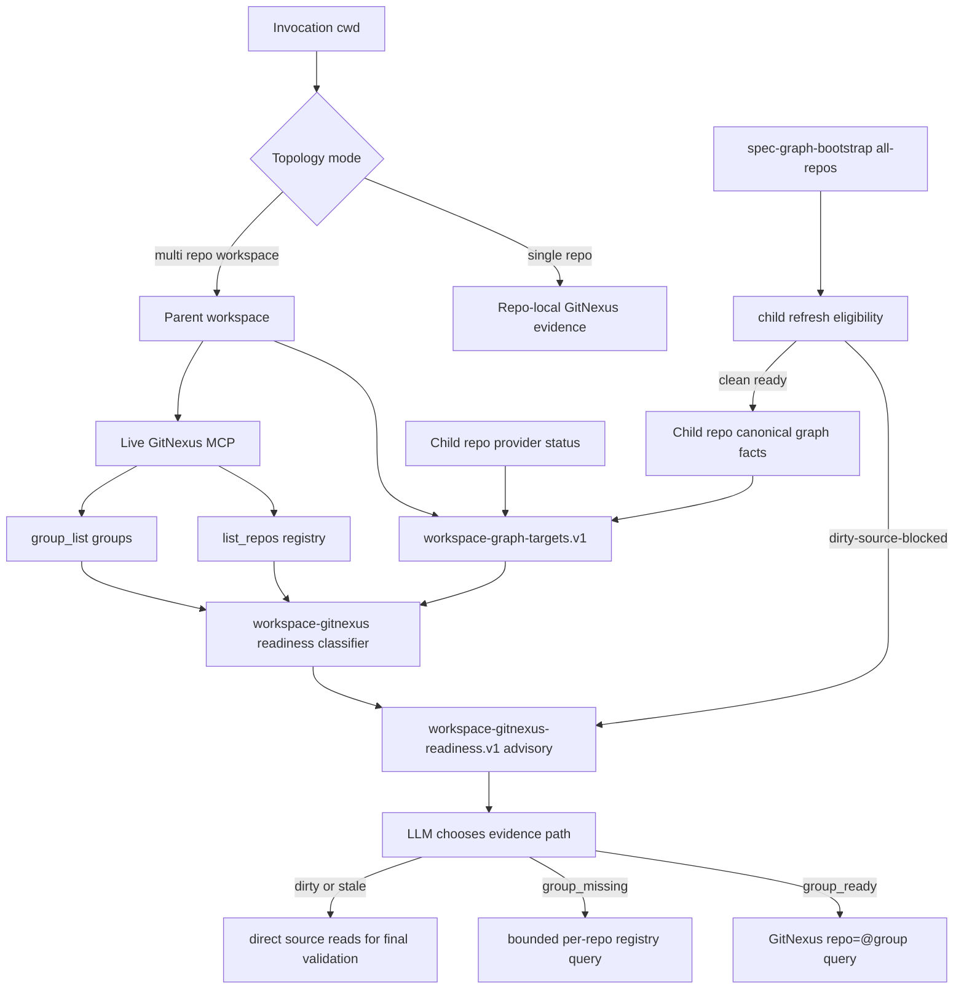

# feat: 建立 GitNexus 多仓 workspace group readiness 正确用法

## Summary

本计划把 GitNexus 多仓能力从“child repo refresh 批处理的副产品”提升为一等只读查询模型：child repo 继续拥有 canonical graph artifacts，GitNexus registry/group 负责多仓 query surface，workspace 只保存 advisory 控制面事实。

核心改变是先明确三种研发拓扑模式，再在 `multi-repo-workspace` 模式下拆开 `refresh_eligibility`、`index_snapshot` 和 `query_usability`。dirty child repo 可以阻断该 repo 的新一轮 refresh，但不应让已有 GitNexus index 从多仓 read-only 查询中消失；它应降级为 stale/advisory evidence，并要求源码验证。单仓单项目和单仓多模块仍是 repo-local GitNexus 语义，不进入 workspace group path。

---

## Problem Frame

当前 `spec-graph-bootstrap` 的 parent workspace 默认 all-child maintenance 能正确保护 child repo canonical artifacts：一旦 child repo 有 graph-affecting dirty paths，bootstrap 会在 provider command 前返回 `dirty-source-blocked`，避免把未提交修改写进索引快照。这条保护是必要的。

问题在于下游容易把“refresh 被 dirty gate 拦住”误读为“GitNexus 多仓查询不可用”。近期 KAZ 多仓 workspace 的现象正是如此：parent summary 变成 partial，7 个 child repo 是 `dirty-source-blocked`，但 GitNexus registry 实际上已经有这些 child repo 的既有 index。正确理解应该是：

- refresh readiness：这些 dirty child repo 不能安全刷新。
- query availability：这些 repo 的历史 index 仍可用于 read-only orientation，但必须标为 stale/advisory。
- workspace/group readiness：GitNexus 是否有 group，可否用 `repo="@<groupName>"` 做多仓查询，是独立于本轮 refresh 是否全绿的事实。

现有 `workspace-graph-targets.v1` 已解决 provider-neutral parent workspace target discovery；但 `2026-05-03-001` 计划把 GitNexus group mode 放在 optional future，导致现在的 consumer 仍偏向 per-repo refresh summary，而没有把 GitNexus registry/group 作为正确的多仓 query primitive 来建模。本计划补上这一层。

---

## Requirements

- R0. 所有 GitNexus workspace/group 行为必须先通过 topology mode gate：`single-repo-single-project`、`single-repo-multi-module`、`multi-repo-workspace`。只有 `multi-repo-workspace` 允许 workspace group / registry fan-out；单仓和 monorepo 只能使用 repo-local GitNexus selector。
- R1. 明确区分 child repo refresh 资格、GitNexus index 快照状态、workspace/group 查询可用性，不能再用单个 `ready/action-required` 状态承载三种含义。
- R2. graph-affecting dirty worktree 必须继续阻断该 child repo 的 provider refresh；不得新增 `--allow-dirty` 或隐藏刷新路径。
- R3. dirty / stale child repo 的既有 GitNexus index 可作为 read-only stale/advisory evidence 使用；下游必须披露 limitations，并用源码读取或测试验证最终结论。
- R4. GitNexus registry/group 是多仓 query model，不是 refresh gate。`group_missing` 不能让 per-repo registry evidence 失效。
- R5. 父 workspace 不得拥有 repo-local `.spec-first/graph/*`、`.spec-first/providers/*` 或 `.spec-first/impact/*` canonical truth；新增 workspace artifact 只能是 `.spec-first/workspace/*` advisory facts。
- R6. Scripts 只编译确定性事实、读取 fixture/snapshot 和 current git status；LLM / workflow 才调用 live MCP 并决定语义相关 repo。
- R7. `group_sync` 或等价 provider mutation 必须是 explicit / preview-first / setup-or-bootstrap-owned；普通 plan/work/debug/review 不得静默同步 GitNexus group。
- R8. 下游 workflow 在 parent workspace 的 read-only 问题中应优先使用 GitNexus group 查询；group 缺失时使用 bounded registry/per-repo fan-out；写入、测试、autofix、commit 前仍必须有 `target_repo` 或 per-unit repo scope。
- R9. 当前 completed 的 `workspace-graph-targets.v1` provider-neutral fallback 必须保留；GitNexus group 是可用时优先的 provider-specific acceleration，不是唯一多仓能力。
- R10. 所有 source 变更必须同步 tests、docs、CHANGELOG，并通过 source-first 再 runtime regeneration 的边界交付；不手改 generated mirrors。
- R11. 回归测试必须覆盖三种研发拓扑：单仓单项目不生成 workspace readiness，单仓多模块不把 modules 当 group members，多仓工作区才启用 group / bounded registry fan-out。

---

## Assumptions

- A1. 当前 GitNexus MCP surface 支持 repo registry、group list / sync，以及 group-mode query selector；本会话已通过 live MCP 看到 `list_repos` 和 `group_list` 可用，且 `group_list` 当前返回空 groups。
- A2. GitNexus group config 的具体文件位置和 schema 仍需在实施时从 provider source / docs 或 live environment 中证明；本计划不把未验证的 `group.yaml` 形状写死到 source contract。
- A3. 本计划优先修正 spec-first 的消费模型和 readiness contract；如果后续确认 provider 支持稳定 CLI/JSON group management，再扩展自动 group manifest / sync。

---

## Scope Boundaries

- 不提交或清理 KAZ child repos 的 dirty worktree；本计划只定义 spec-first 如何正确解释 dirty 与 query availability。
- 不把 dirty repo 的 live working tree 内容当成 GitNexus index 已覆盖的事实。
- 不在 plan/work/debug/review 中运行 GitNexus `analyze`、provider repair、group sync、hooks、watchers 或 daemon。
- 不把 GitNexus group readiness 写成 child repo canonical graph readiness。
- 不在 `single-repo-single-project` 或 `single-repo-multi-module` 中创建或建议 GitNexus workspace group；monorepo modules 是 repo-local topology，不是 group members。
- 不让脚本替用户或 LLM 判断“哪个业务问题属于哪个 repo”。
- 不删除现有 `workspace-graph-targets.v1`、all-repos maintenance 或 per-repo refresh 能力。
- 不在本计划里把 GitNexus 从 optional global-knowledge enhancement 改回核心 review/impact gate；code-review-graph 的 impact/review 角色不变。

### Deferred to Follow-Up Work

- GitNexus group config 自动生成 / 自动写入：等 U1 proof gate 确认 provider group schema、配置位置和跨宿主安全边界后再做。
- 多仓 incremental refresh：当前 `--all-repos --incremental` 仍 unsupported，保持独立计划处理。
- Cross-repo API/DTO contract bridge 的语义推断：本计划只建立 group/query readiness，不自动生成跨 repo 业务依赖图。
- Workspace UI / dashboard：可在 workspace GitNexus readiness artifact 稳定后单独做。

---

## Graph Readiness

- target_repo: `spec-first`
- status: stale
- source_revision: `4db7aaed1a78fa2ad7d6e28610348002cd85a531`
- current_revision: `5ce2fd44fb0cbc0fc903aacecf8daac0a064421a`
- stale: true
- primary_providers: compiled artifacts report `code-review-graph`, `gitnexus`
- degraded_providers: none in compiled artifacts
- fallback_capabilities: direct source reads, existing graph-provider contracts, and session-local GitNexus MCP evidence
- runtime_mcp_evidence: `list_repos` succeeded and shows the KAZ child repos registered in GitNexus; `group_list` succeeded and returned `groups=[]`; current MCP tool contract supports group-mode query selectors such as `repo="@<groupName>"`
- confidence: medium-high for planning decisions; low for claiming current graph-backed impact on changed `spec-first` source
- limitations: compiled graph facts are 11 commits behind current `HEAD` and the worktree already contains unrelated user changes; this plan uses direct source reads and live MCP registry facts as planning context, not as refreshed canonical readiness

---

## Context & Research

### Relevant Code and Patterns

- `skills/spec-graph-bootstrap/scripts/bootstrap-providers.sh` currently treats parent workspace no-arg and `--all-repos` as all-child maintenance, writes child-local canonical artifacts, and writes parent `.spec-first/workspace/graph-bootstrap-summary.json` as advisory.
- `skills/spec-graph-bootstrap/scripts/resolve-workspace-graph-targets.sh` emits `workspace-graph-targets.v1`, reads child canonical artifacts, and reports statuses such as `primary`, `degraded-fallback`, `stale`, `dirty-uncertain`, `setup-ready-bootstrap-required`, and `unavailable`.
- `docs/contracts/graph-provider-consumption.md` already states dirty graph-affecting refresh exits before provider commands with `dirty-source-blocked` and preserves canonical artifacts.
- `docs/contracts/graph-evidence-policy.md` already owns the `automatic check, explicit refresh` model and says live MCP evidence is session-local.
- `src/cli/instruction-bootstrap.js` currently tells parent workspace users that read-only code questions may use `workspace-graph-targets.v1`, while writes require `target_repo`.
- `docs/05-用户手册/04-workflows-artifacts-map.md` already defines `.spec-first/workspace/` as parent advisory summaries, not child canonical truth.
- `docs/05-用户手册/08-三种开发模式.md` already names the three supported development modes: single repo / single project, single repo / multi module, and multi repo workspace.
- `tests/unit/spec-graph-bootstrap.sh` already covers all-repos partial success, dirty refresh preservation, and dirty graph facts without fingerprint.

### Institutional Learnings

- `docs/plans/2026-04-28-005-feat-workspace-target-readiness-plan.md` established that parent workspace is control plane, child repo owns canonical config/graph facts.
- The same workspace target plan also established the invariant that monorepo modules remain inside one Git root and must not be split into independent project readiness snapshots.
- `docs/plans/2026-05-03-001-feat-workspace-graph-query-router-plan.md` implemented provider-neutral read-only graph target routing but deliberately deferred GitNexus group mode.
- `docs/plans/2026-05-18-001-refactor-crg-primary-gitnexus-optional-plan.md` records a compatible direction: GitNexus is global knowledge / query enhancement, not core impact/review gate.
- `docs/10-prompt/结构化项目角色契约.md` requires `Scripts prepare, LLM decides`: scripts provide deterministic readiness facts; LLM decides semantic repo relevance and evidence sufficiency.

### Live GitNexus Evidence

- `list_repos` shows GitNexus already has registry entries for the KAZ child repos such as `hs-kaz-bss-service`, `hs-kaz-crm-admin`, `hs-kaz-crm-basic-service`, `hs-kaz-crm-money-service`, `hs-kaz-crm-open-api`, `hs-kaz-crm-service`, `hs-kaz-crm-task`, and `hs-kaz-crm-web`.
- `group_list` currently returns no configured groups. Therefore the immediate correct fallback is bounded registry/per-repo querying, not assuming GitNexus cannot do multi-repo.
- The current MCP tool contract exposes group-mode selectors (`@<groupName>` and `@<groupName>/<memberPath>`) for query/context/impact-like calls. This is session-local capability evidence, not a compiled readiness artifact.

---

## Key Technical Decisions

| Decision | Rationale | Consequence |
| --- | --- | --- |
| Gate GitNexus group usage by topology mode | Single repo and monorepo are one Git root; GitNexus group is only meaningful when a parent workspace contains multiple independent child Git repos | `workspace-gitnexus-readiness.v1` must carry `topology_mode`; downstream group logic is disabled outside `multi-repo-workspace` |
| Treat GitNexus group as query model, not refresh gate | GitNexus registry can contain usable prior indexes even when current refresh is blocked by dirty worktree | `dirty-source-blocked` no longer implies `query_unusable`; it implies stale/advisory query evidence |
| Preserve child canonical artifact ownership | Parent workspace canonical graph truth would conflate multiple Git repos and break freshness semantics | New workspace facts stay under `.spec-first/workspace/*` and are advisory |
| Add query usability fields instead of replacing `status` | Existing consumers and tests already use `workspace-graph-targets.v1.status` | Backward compatible migration; new consumers prefer `query_usability` / `refresh_eligibility` |
| Keep live MCP evidence session-local | Scripts cannot call host MCP tools, and MCP success must not rewrite compiled readiness | Plans/reviews can cite live `list_repos` / `group_list`, but canonical facts remain unchanged |
| Make group sync explicit and preview-first | `group_sync` mutates provider-side contract registry and depends on provider group config | Only setup/bootstrap-owned explicit path may sync; plan/work/debug/review only read |
| Use bounded fallback when group missing | `groups=[]` is a configuration gap, not provider failure | Downstream can query selected registry repos with limitations while recommending group setup |
| Require source validation for dirty overlay | GitNexus index cannot include uncommitted graph-affecting changes if refresh was blocked | LLM must read dirty files directly before making claims about dirty-path behavior |

---

## Open Questions

### Resolved During Planning

- Should dirty child repos be submitted just to use GitNexus multi-repo query? No. Commit/stash/clean is required for refresh, not for stale/advisory read-only orientation.
- Should `group_missing` block multi-repo use? No. It blocks group-mode query, but registry/per-repo bounded fan-out remains available.
- Should `spec-graph-bootstrap --all-repos` be replaced by GitNexus group sync? No. all-repos bootstrap refreshes child canonical readiness; GitNexus group sync prepares query aggregation. They are different operations.
- Should scripts choose the semantic repo from group results? No. Scripts emit candidates, statuses, and limitations; LLM chooses relevance.
- Should current dirty worktree with clean HEAD index remain `primary`? For old `status` compatibility it may remain `primary`, but new `query_usability` must mark dirty overlay limitations so consumers do not over-trust indexed facts.
- Should monorepo packages/modules become GitNexus group members? No. A monorepo has one Git root and one repo-local graph/provider boundary; modules may appear in plan units, but not as child repos or workspace group members.

### Deferred to Implementation

- Exact GitNexus group config path and schema: implementation must verify provider source/docs or current environment before adding any group manifest writer.
- Whether GitNexus exposes stable CLI JSON for `list_repos` / `group_list`: if not, group readiness stays live-MCP/session-local in Phase A and only deterministic fixture classification is tested.
- Exact group id default: likely derived from workspace basename or explicit config, but must avoid collisions with existing GitNexus repo names and support explicit override.
- Whether `workspace-gitnexus-readiness.v1` should be written by `spec-graph-bootstrap --write-summary` or emitted only to stdout first.

---

## Output Structure

```text
docs/contracts/
  workspace-gitnexus-consumption.md

skills/spec-graph-bootstrap/scripts/
  compile-workspace-gitnexus-readiness.js

tests/fixtures/gitnexus-workspace/
  registry-list.kaz.example.json
  group-list.empty.example.json
  group-list.ready.example.json
  workspace-graph-targets.dirty-overlay.example.json
  topology-single-repo.example.json
  topology-monorepo.example.json
  topology-multi-repo-workspace.example.json

tests/unit/
  workspace-gitnexus-contracts.test.js
  workspace-gitnexus-readiness.test.js
```

The output structure is directional. The implementing agent may keep the deterministic classifier under `src/cli/helpers/` instead of `skills/spec-graph-bootstrap/scripts/` if that better matches the final dependency direction, but it must preserve the same source/runtime boundary.

---

## High-Level Technical Design

> *This illustrates the intended approach and is directional guidance for review, not implementation specification. The implementing agent should treat it as context, not code to reproduce.*

### Topology Mode Contract

所有 consumer 在应用 GitNexus workspace/group 逻辑前，必须先识别研发拓扑。硬边界是 Git root 数量：当前目录能解析到一个 Git root 时就是 repo-local；只有当前目录不是 Git repo 且包含多个独立 child Git roots 时，才进入 `multi-repo-workspace`。`single-repo-single-project` 与 `single-repo-multi-module` 的细分可来自文件布局、plan/module scope 或 LLM 语义判断，不要求脚本替代架构判断。

| Topology mode | 判定边界 | Source of truth | GitNexus 用法 | Workspace group | 写入门槛 |
| --- | --- | --- | --- | --- | --- |
| `single-repo-single-project` | 当前目录解析到一个 Git root，且无需 module 级路由 | repo root `.spec-first/*` | 当前 Git repo 的 repo-local selector | 不适用；不得配置或查询 workspace group | 当前 Git root |
| `single-repo-multi-module` | 当前目录解析到一个 Git root，packages/modules/apps 都在该 root 下 | repo root `.spec-first/*`；module 边界只是 planning context | 覆盖同一 repo 内所有 modules 的 repo-local selector | 禁止；modules 不是 child repos 或 group members | 当前 Git root，可在 implementation units 中标 module scope |
| `multi-repo-workspace` | 当前目录不是 Git repo，且包含多个独立 child Git roots | child repo canonical artifacts；父级 `.spec-first/workspace/*` 仅 advisory | 有 group 时优先 group；否则 bounded registry/per-repo fan-out | 仅作为只读 query acceleration；sync 仍 explicit / preview-first | 写入、测试、autofix、commit 前必须有 `target_repo` 或 per-unit repo scope |

这个 contract 刻意区分“一个 repo 内的 module routing”和“多个 Git roots 之间的 repo routing”。Scripts 只输出确定性 topology facts，LLM 仍负责判断当前任务语义上相关的是哪个 repo 或 module。



### Multi-Repo Workspace Readiness Matrix

| Child repo condition | Refresh eligibility | GitNexus query usability | Required disclosure |
| --- | --- | --- | --- |
| Clean, compiled `source_revision` equals `HEAD`, `query_ready=true` | `eligible` / already current | `fresh-primary` | Normal graph evidence caveat |
| Current worktree has graph-affecting dirty paths, prior index exists | `blocked-dirty-source` | `stale-advisory` | Index excludes dirty overlay; read dirty files directly |
| Compiled `source_revision` behind `HEAD`, prior index exists | `eligible-after-refresh` | `stale-advisory` | Index is behind current branch |
| Group exists and member repos are registered | independent of refresh | `group-ready` | Group query may still return stale members |
| Group missing, repos registered | independent of refresh | `registry-fanout-advisory` | Query bounded repo list; recommend group setup |
| Repo missing from GitNexus registry | refresh may be needed | `unavailable` | Run setup/bootstrap for that repo |

### Directional Artifact Shape

```json
{
  "schema_version": "workspace-gitnexus-readiness.v1",
  "advisory": true,
  "topology_mode": "multi-repo-workspace",
  "gitnexus_selector_strategy": "workspace-group | bounded-registry-fanout | repo-local | direct-read-fallback",
  "module_topology": "not-applicable",
  "parent_writes_repo_local_artifacts": false,
  "group": {
    "name": "workspace-name",
    "status": "group-ready | group-missing | group-sync-required | unavailable",
    "query_selector": "@workspace-name"
  },
  "repos": [
    {
      "target_repo": "child-repo",
      "repo_boundary": "child-git-root",
      "gitnexus_repo": "child-repo",
      "refresh_eligibility": "eligible | blocked-dirty-source | setup-required",
      "index_snapshot": "current-clean | current-with-dirty-overlay | stale-commit | missing",
      "query_usability": "fresh-primary | stale-advisory | registry-fanout-advisory | unavailable",
      "limitations": []
    }
  ]
}
```

The JSON shape above is a review sketch, not a schema to copy verbatim. Implementation may refine enum names, but must preserve the topology mode gate and the three-way separation between refresh, index snapshot, and query usability. For `single-repo-single-project` and `single-repo-multi-module`, the classifier should either emit a compact `not-applicable` advisory result or let the repo-local graph facts remain the only readiness object; it must not synthesize workspace group members from modules.

---

## Implementation Units

### U1. Define Workspace GitNexus Consumption Contract and Proof Gate

**Goal:** Establish the source-of-truth vocabulary for GitNexus multi-repo usage so downstream work stops conflating refresh failure with query unavailability.

**Requirements:** R0, R1, R2, R3, R4, R5, R6, R7, R11

**Dependencies:** None

**Files:**
- Create: `docs/contracts/workspace-gitnexus-consumption.md`
- Modify: `docs/contracts/graph-provider-consumption.md`
- Modify: `docs/contracts/graph-evidence-policy.md`
- Test: `tests/unit/workspace-gitnexus-contracts.test.js`

**Approach:**
- Record a proof gate: current source may rely on live MCP `list_repos`, `group_list`, and group-mode selector evidence, but may not implement a group config writer until provider group config path/schema is verified from GitNexus source/docs or a controlled local fixture.
- Define `workspace-gitnexus-readiness.v1` as advisory workspace evidence, not child canonical graph truth.
- Define the topology mode contract in `docs/contracts/workspace-gitnexus-consumption.md`: `single-repo-single-project` and `single-repo-multi-module` are repo-local; `multi-repo-workspace` is the only mode where group / registry fan-out applies.
- Document the three independent fields: `refresh_eligibility`, `index_snapshot`, and `query_usability`.
- Document that `dirty-source-blocked` is a refresh result, not a query result.
- Document that `group_ready`, `group_missing`, and `registry-fanout-advisory` are GitNexus query-surface facts.
- Document that live MCP `list_repos` / `group_list` / group-mode query is session-local evidence unless a deterministic script consumes a supplied snapshot.
- Add a short compatibility note to `graph-provider-consumption.md`: old consumers may still read `workspace-graph-targets.v1.status`, but new GitNexus-aware consumers must prefer the new fields when present.

**Execution note:** Start with contract tests that fail on the old conflated wording before changing prose.

**Patterns to follow:**
- `docs/contracts/graph-provider-consumption.md`
- `docs/contracts/graph-evidence-policy.md`
- `tests/unit/spec-graph-bootstrap-contracts.test.js`

**Test scenarios:**
- Happy path: contract contains explicit statements that dirty refresh blocked still allows stale/advisory read-only GitNexus use.
- Happy path: contract contains a three-mode decision matrix and states that monorepo modules are not GitNexus group members.
- Edge case: contract says `group_missing` is not provider failure and should fall back to bounded registry/per-repo evidence.
- Edge case: contract says single-repo and monorepo modes must use repo-local GitNexus evidence, not workspace group readiness.
- Error path: contract forbids plan/work/debug/review from running `group_sync` or provider refresh.
- Integration: contract test confirms `graph-provider-consumption.md` links or references the new workspace GitNexus contract.

**Verification:**
- A reviewer can tell which layer owns refresh, group query, and semantic repo selection without reading scripts.

---

### U2. Extend Workspace Graph Targets With Query Usability

**Goal:** Make parent workspace target discovery report dirty/stale query limitations without breaking existing `status` consumers.

**Requirements:** R0, R1, R2, R3, R5, R9, R11

**Dependencies:** U1

**Files:**
- Modify: `skills/spec-graph-bootstrap/scripts/resolve-workspace-graph-targets.sh`
- Modify: `skills/spec-graph-bootstrap/scripts/resolve-workspace-graph-targets.ps1`
- Modify: `skills/spec-graph-bootstrap/SKILL.md`
- Modify: `tests/unit/spec-graph-bootstrap.sh`
- Modify: `tests/unit/spec-graph-bootstrap-contracts.test.js`

**Approach:**
- Preserve existing `.repos[].status` for backward compatibility.
- Preserve existing resolver topology semantics: when cwd resolves to a Git root, return repo-local facts and do not discover modules/packages as workspace repos.
- Add fields such as `refresh_eligibility`, `index_snapshot`, `query_usability`, and `working_tree_overlay` to each child row.
- Classify current dirty worktree with prior clean index as usable only as stale/advisory for dirty-aware conclusions, even when the old `status` remains `primary`.
- Classify `source_revision` mismatch as `query_usability=stale-advisory` when GitNexus prior index exists, not as `unavailable`.
- Preserve existing `dirty-uncertain` behavior for artifacts generated from dirty worktrees without a matching fingerprint.
- Include GitNexus repo label and candidate query tokens as pointers, but do not call GitNexus MCP from the script.

**Execution note:** Characterization-first: keep existing tests for `status` passing, then add new assertions for the new fields.

**Patterns to follow:**
- Current `resolve-workspace-graph-targets.sh` JSON classification
- Current PowerShell parity tests
- Dirty classification truth table in `docs/contracts/graph-provider-consumption.md`

**Test scenarios:**
- Happy path: clean child with current graph facts and `query_ready=true` reports `query_usability=fresh-primary`.
- Happy path: single Git repo returns repo-local readiness and no workspace group recommendation.
- Edge case: monorepo fixture with multiple packages/modules under one `.git` root does not emit group members for those modules.
- Edge case: current child worktree has graph-affecting dirty paths but prior clean graph facts exist; old `status` stays compatible while new fields report dirty overlay and stale/advisory query use.
- Edge case: child HEAD differs from graph facts `source_revision`; row reports stale advisory query usability and a refresh recommendation.
- Edge case: GitNexus provider status exists but `query_ready=false`; row reports definitions/pointer limitation rather than fresh primary.
- Error path: malformed graph facts still return a bounded row with limitations, not a parent-level crash.
- Integration: PowerShell resolver contains the same field names and enum values as Bash.

**Verification:**
- Parent workspace target discovery can answer “can I query this repo?” separately from “can I refresh this repo now?”.

---

### U3. Add Deterministic GitNexus Workspace Readiness Classifier

**Goal:** Combine workspace target facts with GitNexus registry/group snapshots into an advisory readiness object without having scripts call MCP directly.

**Requirements:** R0, R1, R4, R5, R6, R8, R11

**Dependencies:** U1, U2

**Files:**
- Create: `skills/spec-graph-bootstrap/scripts/compile-workspace-gitnexus-readiness.js`
- Create: `tests/fixtures/gitnexus-workspace/registry-list.kaz.example.json`
- Create: `tests/fixtures/gitnexus-workspace/group-list.empty.example.json`
- Create: `tests/fixtures/gitnexus-workspace/group-list.ready.example.json`
- Create: `tests/fixtures/gitnexus-workspace/workspace-graph-targets.dirty-overlay.example.json`
- Create: `tests/fixtures/gitnexus-workspace/topology-single-repo.example.json`
- Create: `tests/fixtures/gitnexus-workspace/topology-monorepo.example.json`
- Create: `tests/fixtures/gitnexus-workspace/topology-multi-repo-workspace.example.json`
- Test: `tests/unit/workspace-gitnexus-readiness.test.js`

**Approach:**
- Accept supplied JSON snapshots: `workspace-graph-targets.v1`, GitNexus `list_repos` output, and GitNexus `group_list` output.
- Emit `workspace-gitnexus-readiness.v1` to stdout, optionally later to `.spec-first/workspace/gitnexus-readiness.json`.
- Read `topology_mode` / resolver `mode` first. If resolver mode is `git-repo`, treat it as repo-local even when optional advisory context later identifies it as monorepo; emit `not-applicable` or repo-local guidance and do not classify registry groups.
- Match child repos to registry by explicit GitNexus repo label first, then by repo basename as a fallback with low confidence.
- Report group readiness independently from repo refresh eligibility.
- Count repos by `fresh-primary`, `stale-advisory`, `registry-fanout-advisory`, `definitions-pointer`, and `unavailable`.
- Include a `recommended_query_path`: `group-query`, `bounded-registry-fanout`, or `direct-read-fallback`.
- Keep raw live MCP payloads out of durable docs; fixtures can be sanitized examples.

**Execution note:** Keep this helper pure and deterministic; it should not shell out to GitNexus or read `.gitnexus` internals.

**Patterns to follow:**
- `src/cli/helpers/review-pre-facts.js` for compiled-facts style and conservative evidence classification
- `skills/spec-graph-bootstrap/scripts/resolve-workspace-graph-targets.sh` for advisory workspace JSON style

**Test scenarios:**
- Happy path: registry contains all workspace repos and group exists; output recommends `group-query`.
- Happy path: `multi-repo-workspace` input is the only path that can recommend `group-query`.
- Edge case: single-repo input returns repo-local guidance and no workspace advisory artifact write.
- Edge case: monorepo input does not match package/module names against GitNexus registry entries.
- Edge case: registry contains repos but groups list is empty; output recommends bounded registry fan-out, not setup failure.
- Edge case: seven repos are dirty-refresh-blocked but registry has prior index entries; output counts them as stale/advisory query candidates.
- Edge case: one repo is present in workspace targets but missing from registry; output marks only that repo unavailable.
- Error path: supplied registry JSON is invalid; helper exits with an explicit `invalid-registry-snapshot` reason and writes no workspace artifact.
- Integration: sanitized KAZ-like fixture proves `1 ready / 7 refresh-blocked` can still produce multi-repo advisory query candidates.

**Verification:**
- A deterministic unit test proves the exact failure mode from the user report is represented as partial refresh + usable stale/advisory query evidence.

---

### U4. Integrate GitNexus Group-Aware Handoff Into Graph Bootstrap

**Goal:** Make `$spec-graph-bootstrap` final handoff teach the correct GitNexus multi-repo use after all-repos maintenance.

**Requirements:** R0, R3, R4, R6, R7, R8, R11

**Dependencies:** U1, U2, U3

**Files:**
- Modify: `skills/spec-graph-bootstrap/SKILL.md`
- Modify: `skills/spec-graph-bootstrap/evals/expected-behavior-cases.json`
- Modify: `tests/unit/spec-graph-bootstrap-contracts.test.js`

**Approach:**
- After parent all-repos bootstrap in `multi-repo-workspace` mode, keep reporting compiled child refresh outcomes first.
- Add a separate “GitNexus workspace query evidence” handoff when the current session exposes GitNexus MCP:
  - call `list_repos` once for registry evidence,
  - call `group_list` once for group status,
  - if a group is configured, use group-mode query as the preferred read-only path,
  - if no group is configured, state `group_missing` and use bounded registry/per-repo fallback.
- Do not write live MCP results into `.spec-first/graph/*` or child provider status.
- Do not run `group_sync` automatically. If group config exists but contract registry is stale, report a preview-first next action owned by setup/bootstrap.
- Update final response contract to show two separate tables: child refresh status and GitNexus workspace query usability.
- For single-repo and monorepo bootstrap results, keep the existing repo-local GitNexus handoff and do not mention workspace group setup.

**Execution note:** This is prose/workflow contract work, not provider execution logic. Validate with contract tests and eval cases; do not add hidden MCP calls to scripts.

**Patterns to follow:**
- `skills/spec-graph-bootstrap/SKILL.md` Live MCP Probe section
- `skills/spec-graph-bootstrap/evals/expected-behavior-cases.json`

**Test scenarios:**
- Happy path: skill prose requires compiled artifacts first, then session-local registry/group evidence.
- Happy path: skill prose gates registry/group evidence behind parent workspace / multi-repo mode.
- Edge case: `group_list` returns empty; skill prose says bounded registry/per-repo fallback, not “GitNexus unavailable”.
- Edge case: monorepo all-module graph readiness remains repo-local and does not recommend GitNexus group setup.
- Edge case: child refresh `dirty-source-blocked`; final handoff says refresh blocked but prior index can be stale/advisory.
- Error path: GitNexus MCP unavailable; final handoff says no live workspace query evidence and falls back to workspace targets/direct reads.
- Integration: eval case covers KAZ-like `1 ready / 7 dirty-source-blocked` and expects a query-usability explanation.

**Verification:**
- A user reading the bootstrap result can decide whether to clean/stash for refresh or proceed with stale/advisory query evidence for read-only planning.

---

### U5. Update Downstream Workflow Consumption Rules

**Goal:** Ensure plan/work/debug/review use GitNexus multi-repo capabilities correctly without weakening write-scope gates.

**Requirements:** R0, R3, R4, R5, R7, R8, R9, R11

**Dependencies:** U1, U2, U3, U4

**Files:**
- Modify: `skills/using-spec-first/SKILL.md`
- Modify: `skills/spec-plan/SKILL.md`
- Modify: `skills/spec-work/SKILL.md`
- Modify: `skills/spec-work-beta/SKILL.md`
- Modify: `skills/spec-debug/SKILL.md`
- Modify: `skills/spec-code-review/SKILL.md`
- Modify: `src/cli/instruction-bootstrap.js`
- Modify: `tests/unit/spec-plan-contracts.test.js`
- Modify: `tests/unit/spec-work-contracts.test.js`
- Modify: `tests/unit/spec-debug-contracts.test.js`
- Modify: `tests/unit/spec-code-review-contracts.test.js`
- Modify: `tests/unit/init-dry-run.test.js`

**Approach:**
- `using-spec-first`: parent workspace read-only code questions should use `workspace-graph-targets.v1` plus GitNexus registry/group evidence when available.
- `using-spec-first`: when cwd is inside a Git repo, use repo-local graph/GitNexus evidence; do not invoke workspace group guidance just because the repo contains multiple packages/modules.
- `spec-plan`: Graph Readiness block for cross-repo plans should include `workspace_gitnexus_query` or equivalent fields: group status, registry evidence, limitations, and target repo requirements per unit.
- `spec-plan`: monorepo plans may use module-scoped implementation units, but `target_repo` remains the single Git root and `workspace_gitnexus_query` is not required.
- `spec-work`: keep strict `target_repo` before edits/tests/changelog/commit; allow GitNexus group evidence only as orientation context before writing.
- `spec-debug`: investigation may use group or bounded registry evidence; fix phase must narrow to explicit child repo.
- `spec-code-review`: review grouping remains per Git repo; GitNexus group evidence can orient cross-repo risk, while code-review-graph remains the primary diff impact provider.
- Host bootstrap: keep a thin reminder; do not copy the full contract into `AGENTS.md` / `CLAUDE.md`.

**Execution note:** Keep changes small and source-first. Runtime mirrors update only through `spec-first init --codex|--claude` when needed.

**Patterns to follow:**
- Existing parent workspace language in `src/cli/instruction-bootstrap.js`
- Existing graph readiness consumption in `skills/spec-plan/SKILL.md`
- Existing write-scope gates in `skills/spec-work/SKILL.md`

**Test scenarios:**
- Happy path: parent workspace read-only question contract mentions group-ready path and bounded registry fallback.
- Happy path: single-repo and monorepo workflows keep repo-local GitNexus wording and omit workspace group readiness.
- Edge case: `group_missing` path is represented as fallback, not provider failure.
- Edge case: dirty/stale query usability requires source validation before final claims.
- Error path: work/debug fix/review autofix contracts still require `target_repo` and forbid hidden provider refresh.
- Integration: init dry-run generated bootstrap block mentions only thin workspace guidance and does not include full schema or stale enum lists.

**Verification:**
- Downstream consumers can use GitNexus group for read-only orientation while maintaining explicit write boundaries.

---

### U6. Update User Documentation and Migration Guidance

**Goal:** Make the correct multi-repo GitNexus mental model visible to users and future maintainers.

**Requirements:** R0, R1, R2, R3, R4, R5, R8, R10, R11

**Dependencies:** U1, U4, U5

**Files:**
- Modify: `docs/05-用户手册/02-核心概念.md`
- Modify: `docs/05-用户手册/04-workflows-artifacts-map.md`
- Modify: `docs/05-用户手册/05-最佳实践.md`
- Modify: `docs/05-用户手册/08-三种开发模式.md`
- Modify: `docs/05-用户手册/13-代码图谱Provider作用域与差异化.md`
- Modify: `README.md`
- Modify: `README.zh-CN.md`
- Modify: `CHANGELOG.md`
- Test: `tests/unit/user-manual-contracts.test.js`

**Approach:**
- Add a concise section: “refresh blocked != query unavailable”.
- Update the three development modes doc first, making GitNexus group explicitly scoped to `multi-repo-workspace` and explaining that monorepo modules remain repo-local.
- Explain parent workspace `.spec-first/workspace/*` remains advisory.
- Explain GitNexus group path vs registry fan-out fallback.
- Document when users need to commit/stash/clean: only before refresh, not before stale/advisory read-only analysis.
- Clarify that dirty-path conclusions still require direct source reads because GitNexus index excludes uncommitted overlay.
- Keep README high level and link to the user manual / contract; avoid copying enum tables into the README.

**Patterns to follow:**
- Current `.spec-first/` artifact map style
- Current provider role table in `docs/05-用户手册/13-代码图谱Provider作用域与差异化.md`

**Test scenarios:**
- Happy path: user manual mentions GitNexus group and registry fallback.
- Happy path: `08-三种开发模式.md` includes the topology mode gate and forbids treating monorepo modules as group members.
- Edge case: docs explicitly say dirty refresh blocked does not require committing just to ask a read-only question.
- Error path: docs forbid hidden `group_sync` / provider refresh inside plan/work/review.
- Integration: README and zh-CN README do not contradict the contract.

**Verification:**
- Users can answer “do I need to commit before asking GitNexus a read-only multi-repo question?” from docs alone.

---

### U7. Add Regression Fixtures and End-to-End Contract Checks

**Goal:** Lock the new model against regressions where future changes re-conflate refresh readiness and query availability.

**Requirements:** R0, R1, R2, R3, R4, R7, R8, R10, R11

**Dependencies:** U1, U2, U3, U4, U5, U6

**Files:**
- Modify: `tests/unit/spec-graph-bootstrap.sh`
- Modify: `tests/unit/spec-graph-bootstrap-contracts.test.js`
- Modify: `tests/unit/graph-provider-consumption-contracts.test.js`
- Create: `tests/unit/workspace-gitnexus-contracts.test.js`
- Create: `tests/unit/workspace-gitnexus-readiness.test.js`
- Create: `tests/fixtures/gitnexus-workspace/README.md`

**Approach:**
- Add a KAZ-like fixture: one clean/ready child, seven dirty-refresh-blocked children, all present in GitNexus registry, no group configured.
- Add a single-repo fixture proving repo-local GitNexus evidence does not produce workspace group readiness.
- Add a monorepo fixture proving package/module directories under one `.git` root are not group members.
- Add a group-ready fixture: same children, group configured, query selector available.
- Add a group-missing fixture: registry present, group absent, bounded fan-out expected.
- Add a missing-registry fixture: workspace target exists but GitNexus repo absent.
- Add contract assertions that no consumer says dirty refresh blocked equals query unavailable.
- Add contract assertions that `group_sync` appears only in setup/bootstrap-owned explicit context.

**Execution note:** Run the narrowest unit and contract tests first, then expand only if touched docs or source require it.

**Patterns to follow:**
- `tests/unit/spec-graph-bootstrap.sh` fixture style
- `tests/unit/init-dry-run.test.js` generated prose assertions
- `tests/unit/spec-graph-bootstrap-contracts.test.js` contract string checks

**Test scenarios:**
- Happy path: group-ready fixture recommends group query.
- Happy path: single-repo fixture recommends repo-local query, not group query.
- Edge case: group-missing fixture recommends bounded registry fan-out.
- Edge case: monorepo fixture keeps one Git root and emits no per-module registry matches.
- Edge case: dirty-refresh-blocked fixture reports stale/advisory query candidates.
- Error path: invalid registry fixture fails with structured reason and no artifact write.
- Integration: downstream workflow contract tests all preserve write-target gates.

**Verification:**
- Regressions in dirty/query semantics fail deterministic tests before reaching runtime workflows.

---

## System-Wide Impact

- **Interaction graph:** `spec-mcp-setup` remains provider projection owner; `spec-graph-bootstrap` remains refresh/readiness compiler; downstream workflows consume workspace GitNexus query facts as advisory context.
- **Topology boundary:** single repo and monorepo stay repo-local; workspace GitNexus readiness is only meaningful for a non-Git parent with multiple child Git repos.
- **Error propagation:** dirty refresh errors stay per-child refresh facts; group missing stays query-surface limitation; neither should become global workspace failure.
- **State lifecycle risks:** live MCP registry/group results must not be silently persisted as canonical readiness. Optional workspace summary must be advisory and tied to generated time / limitations.
- **API surface parity:** Bash and PowerShell resolver fields must match; Codex and Claude bootstrap guidance must remain equivalent.
- **Integration coverage:** Tests must cover script facts, skill prose, docs, and generated bootstrap wording because this is a workflow contract change more than an algorithm change.
- **Unchanged invariants:** child repo `.spec-first/graph/*`, `.spec-first/providers/*`, and `.spec-first/impact/*` remain canonical only for that child; writes still require `target_repo`.

---

## Alternative Approaches Considered

- **Require clean worktree before any GitNexus multi-repo query:** rejected because it confuses refresh correctness with read-only orientation. It creates unnecessary friction and ignores existing registry indexes.
- **Make parent all-repos bootstrap success the only query gate:** rejected because one dirty child would make the workspace look unusable even when registry evidence exists.
- **Auto-run `group_sync` whenever group is missing:** rejected because provider-side mutation must be explicit and the group config surface has not been proven in source.
- **Replace `workspace-graph-targets.v1` with GitNexus group:** rejected because provider-neutral fallback is still needed when GitNexus MCP is unavailable, group missing, or another provider is the better evidence source.
- **Treat monorepo modules as GitNexus group members:** rejected because modules share one Git revision, dirty status, changelog, graph snapshot, and review boundary. Module routing belongs to plan/task decomposition inside the repo-local graph.
- **Persist live MCP outputs directly into docs:** rejected because session-local evidence can contain volatile paths/counts and should not become durable source truth.

---

## Success Metrics

- A KAZ-like workspace with `1 ready / 7 dirty-source-blocked` produces a clear “refresh partial, query stale/advisory available” explanation.
- Single-repo and monorepo fixtures remain repo-local and never recommend workspace group setup or per-module group membership.
- Parent workspace read-only planning can use GitNexus registry/group evidence without requiring the user to commit dirty child repos.
- Work/debug/review fix paths still refuse to edit without explicit `target_repo`.
- Contract tests prevent future prose from saying `dirty-source-blocked` means GitNexus is unavailable.
- User docs clearly explain when to clean/stash/commit and when stale/advisory query is acceptable.

---

## Risk Analysis & Mitigation

| Risk | Likelihood | Impact | Mitigation |
| --- | --- | --- | --- |
| Stale/advisory GitNexus evidence is over-trusted | Medium | High | Require `query_usability` limitations and direct source validation for dirty/stale paths |
| Group sync mutates provider state unexpectedly | Medium | High | Keep `group_sync` explicit, preview-first, and setup/bootstrap-owned only |
| New fields break existing `workspace-graph-targets.v1` consumers | Low | Medium | Preserve existing `.status`; add fields as backward-compatible extensions |
| GitNexus group logic leaks into monorepo workflows | Medium | High | Add topology mode gate, monorepo fixture, and downstream contract tests forbidding per-module group members |
| GitNexus group config shape differs from assumptions | Medium | Medium | U1/U4 proof gate before writer implementation; Phase A can work with live MCP group list only |
| Docs become too provider-specific | Medium | Medium | Keep provider-neutral resolver and CRG impact role unchanged; GitNexus group docs live in a focused contract |
| Generated runtime drift after source prose changes | Medium | Medium | Source-first changes, then `spec-first init --codex|--claude` only when runtime refresh is explicitly part of implementation |

---

## Phased Delivery

### Phase 1: Correct Facts and Vocabulary

- Deliver U1 and U2.
- Outcome: topology mode is explicit, and workspace target facts can express refresh eligibility and query usability separately.
- This phase already fixes the primary misunderstanding around dirty repos.

### Phase 2: GitNexus Registry/Group Consumption

- Deliver U3 and U4.
- Outcome: graph-bootstrap and planning handoffs can use registry/group evidence correctly without hidden provider mutation.

### Phase 3: Downstream Adoption and Documentation

- Deliver U5, U6, and U7.
- Outcome: public workflows, host bootstrap guidance, docs, and tests all encode the same multi-repo usage model.

---

## Documentation / Operational Notes

- Implementation must update `CHANGELOG.md` for every source/docs change.
- If runtime mirrors need refresh, use `spec-first init --codex` and `spec-first init --claude`; do not edit `.agents/skills/`, `.codex/`, or `.claude/` directly.
- If GitNexus MCP is not loaded in the current host session, workflows should report `runtime_mcp_evidence=unavailable` and fall back to deterministic workspace target facts plus bounded source reads.
- If a group is missing, the recommended operational action is to configure/sync a GitNexus group explicitly after verifying provider config format; it is not to rerun all child refreshes blindly.

---

## Sources & References

- Project role baseline: `docs/10-prompt/结构化项目角色契约.md`
- Existing workspace target plan: `docs/plans/2026-04-28-005-feat-workspace-target-readiness-plan.md`
- Existing workspace query router plan: `docs/plans/2026-05-03-001-feat-workspace-graph-query-router-plan.md`
- Graph consumption contract: `docs/contracts/graph-provider-consumption.md`
- Graph evidence policy: `docs/contracts/graph-evidence-policy.md`
- Three development modes: `docs/05-用户手册/08-三种开发模式.md`
- Provider scope doc: `docs/05-用户手册/13-代码图谱Provider作用域与差异化.md`
- Workspace artifact map: `docs/05-用户手册/04-workflows-artifacts-map.md`
- Workspace resolver: `skills/spec-graph-bootstrap/scripts/resolve-workspace-graph-targets.sh`
- Bootstrap all-repos path: `skills/spec-graph-bootstrap/scripts/bootstrap-providers.sh`
- Session-local MCP evidence: GitNexus `list_repos` and `group_list` responses observed during planning
