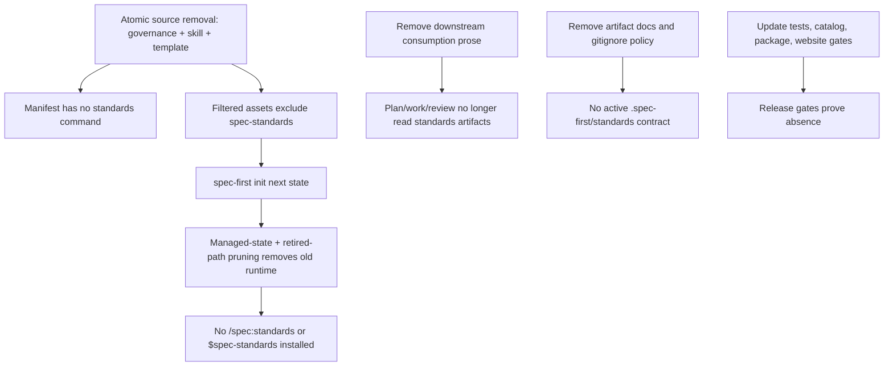
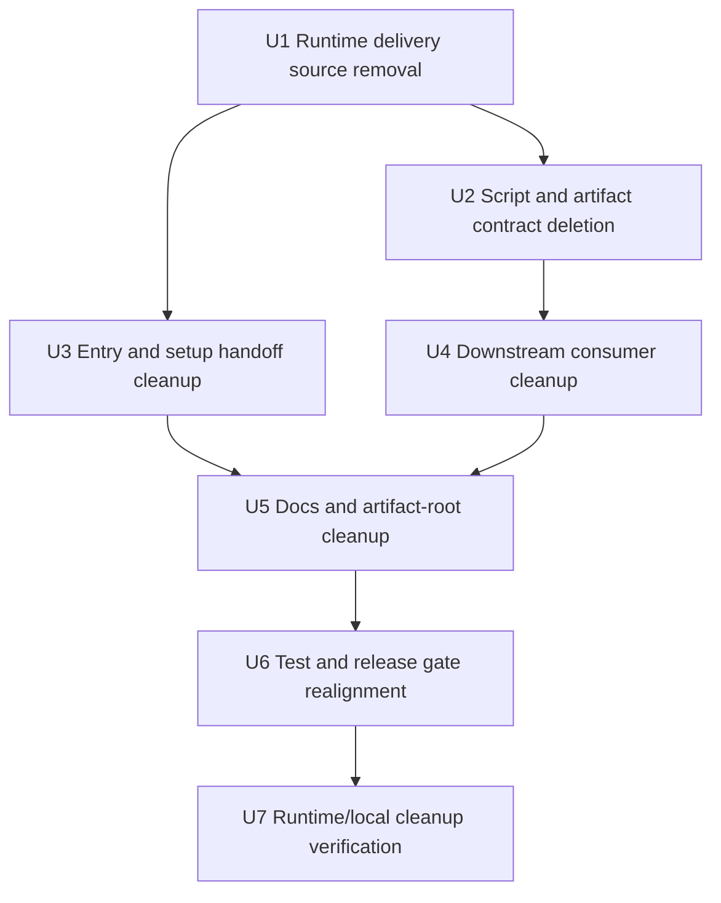
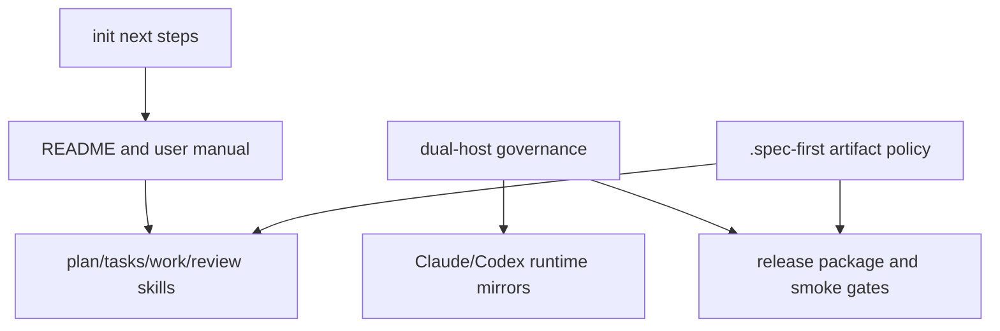

# refactor: Remove spec-standards workflow

## Summary

彻底移除 `spec-standards` 作为 public workflow、deterministic scripts、runtime delivery、local artifact producer 和下游 workflow context source。方案采用 source-first 删除：在同一个 source patch 中同步移除 governance record、skill source 和 command template，随后让 `spec-first init --claude|--codex` 清理 managed-state runtime mirrors，并补充 legacy / unrecorded runtime mirror prune 验证。

---

## Problem Frame

用户要求“彻底删除 `spec-standards` 这个 skill，相关的脚本、产物、skill 使用依赖，并保证清理干净”。当前代码显示 `spec-standards` 已跨越多个层面：

- public workflow source：`skills/spec-standards/` 和 `templates/claude/commands/spec/standards.md`
- 双宿主 runtime delivery：`src/cli/contracts/dual-host-governance/skills-governance.json`
- deterministic artifact scripts：`prepare-baseline.js`、`validate-artifacts.js`、workspace targeting helpers
- local artifact root：`.spec-first/standards/`
- 下游消费：`spec-plan`、`spec-write-tasks`、`spec-work`、`spec-code-review` 等 workflow prose 和 `spec-project-standards-reviewer`
- 用户可见入口：README、用户手册、init/mcp-setup/graph-bootstrap handoff、AGENTS/CLAUDE managed bootstrap block
- release/test gates：unit tests、smoke tests、tarball install checks、runtime capability catalog、release continuity / website sync gates、fixtures

删除目标不是隐藏入口，而是让当前版本不再生产、安装、推荐、消费或测试 `spec-standards`；同时保留历史记录的可审计性。

---

## Requirements

- R1. 当前 host 不再暴露 `/spec:standards` 或 `$spec-standards` public workflow entrypoint。
- R2. `skills/spec-standards/` 下的 skill source、scripts、examples、README 和对应 Claude command template 被删除。
- R3. `spec-first init --claude|--codex` 不再安装 `standards.md`、`.claude/spec-first/workflows/spec-standards/` 或 `.agents/skills/spec-standards/`，并能删除 managed-state 与 legacy / unrecorded 旧 runtime mirror。
- R4. `.spec-first/standards/` 不再作为当前 artifact contract、context source、gitignore policy、context-bundle exclusion 或用户手册中的 active artifact root。
- R5. 下游 workflow 不再读取、建议、引用或依赖 `standards-candidates.json`、`standards-preview.md`、`glue-map.json`、`project-shape.json`、`standards-plan.json` 等 `spec-standards` 产物。
- R6. 保留通用“项目标准”能力：`AGENTS.md` / `CLAUDE.md` 和目录级标准文件仍是 `spec-project-standards-reviewer` 的硬标准来源；删除的是 `spec-standards` baseline artifact 机制。
- R7. 测试、release package、smoke install、用户文档和 managed instruction block 与删除后的 public workflow 列表一致。
- R8. 历史 changelog、历史计划、历史 validation logs 和审计文档不被重写成“从未存在”；活跃 docs 和 runtime/source references 必须清理。
- R9. `docs/catalog/runtime-capabilities.md`、release continuity guard、website sync release gate 和对应测试不再宣传或要求 `spec-standards`。

---

## Assumptions

- A1. 这次删除不新增替代 workflow，也不把 `spec-standards` 合并进 `spec-graph-bootstrap`、`spec-plan` 或 `using-spec-first`。
- A2. “彻底清理干净”定义为 active source、runtime delivery、artifact producer、active docs、tests 和 downstream consumption 清零；历史记录允许保留，并在 verification allowlist 中明确。
- A3. 当前本仓库下存在忽略的本地产物 `.spec-first/standards/{project-shape.json,standards-plan.json,glue-map.json,standards-candidates.json,standards-preview.md}`；这些不是 source diff，但执行删除时应作为本地 cleanup 明确处理。
- A4. 最终清理不靠人工感觉判断；每个 active-reference grep 命中必须分类为 `remove`、`rewrite` 或 `reclassify-as-historical`，并记录历史 allowlist。

---

## Scope Boundaries

- 不实现新的 project standards compiler、repo-profile writer、standards importer 或 glue-map replacement。
- 不删除 `spec-project-standards-reviewer` 这个 code-review persona；只移除它对 `.spec-first/standards/` baseline artifacts 的特殊消费。
- 不手改 `.claude/`、`.codex/`、`.agents/skills/` 作为 source fix；runtime mirror 由 `spec-first init --claude|--codex` 重建和 prune。
- 不清理所有历史文本中的 `spec-standards` 字符串；`CHANGELOG.md` 旧条目、历史 `docs/plans/**`、`docs/tasks/**`、`docs/validation/**`、历史审计材料和本删除计划可以保留。
- 不把 `standards` 这个英文普通词全局删除；只删除 `spec-standards` workflow、`.spec-first/standards/` artifact contract、`/spec:standards` / `$spec-standards` entrypoint 和相关产物名。

### Deferred to Follow-Up Work

- 外部 downstream package docs：如果其他 repo 引用 `spec-standards`，需要单独计划或 release sync 检查。官方 website release gate 不是本项 follow-up；它属于 U6 release-ready 验证边界。
- 旧版本用户迁移脚本：本计划只要求当前 checkout 和新 init 产物清理；是否提供专门 migration command 另行决定。

---

## Graph Readiness

- target_repo: `spec-first`
- status: primary
- source_revision: `54a0e0ffa721141b04e392ce09a0ed6ff6420118`
- current_revision: `54a0e0ffa721141b04e392ce09a0ed6ff6420118`
- stale: false at planning-time evidence collection
- primary_providers: `code-review-graph`, `gitnexus`
- degraded_providers: none
- fallback_capabilities: bounded direct repo reads via `rg`, `sed`, `git ls-files`, and targeted source inspection
- runtime_mcp_evidence: GitNexus live evidence used for `prepareBaseline`, `buildDownstreamConsumers`, and `validateArtifacts`; impact results were useful for script/test callers but prose/docs/runtime references required direct source search
- confidence: high for current repo evidence; medium for external website/downstream repos because they were out of scope
- limitations: GitNexus symbolic impact does not model markdown prose dependency, release package grep assertions, ignored local runtime artifacts, or historical documentation semantics; direct source audit is authoritative for those surfaces

---

## Context & Research

### Relevant Code and Patterns

- `src/cli/plugin.js` derives `manifest.commands` from `src/cli/contracts/dual-host-governance/skills-governance.json` and `templates/claude/commands/spec/*.md`; removing the governance entry plus template is the source-level way to remove the public workflow.
- `src/cli/plugin.js` validates that every bundled skill appears in governance. Therefore `spec-standards` governance record, `skills/spec-standards/`, and `templates/claude/commands/spec/standards.md` must be removed atomically before running manifest/init/catalog/governance validation.
- `src/cli/state.js` removes obsolete managed commands, skills, workflow skills, agents, and support files based on previous vs next managed state. This helps prune recorded runtime mirrors, but legacy / unrecorded runtime mirrors need explicit fixture coverage and, if needed, retired path prune logic.
- `src/cli/commands/init.js` currently recommends `spec-standards` after graph readiness and includes parent-workspace `--repo` / `--workspace` guidance; this must be rewritten, not left as a dead next step.
- `src/cli/instruction-bootstrap.js` currently renders `/spec:standards` / `$spec-standards` as a common entry anchor; checked-in `AGENTS.md` and `CLAUDE.md` managed blocks mirror this.
- `skills/spec-mcp-setup/scripts/verify-tools.ps1` currently prints `$spec-standards` / `/spec:standards` handoff text after graph readiness; deleting only `skills/spec-mcp-setup/SKILL.md` is insufficient.
- `src/cli/gitignore-policy.js`, `.gitignore`, `src/cli/helpers/context-bundle.js`, `docs/contracts/context-governance.md`, and `docs/contracts/context-bundle.md` treat `.spec-first/standards/` as an active runtime context artifact root.
- `docs/catalog/runtime-capabilities.md` is generated by `scripts/generate-runtime-capability-catalog.js` from governance/source. It currently lists `standards | spec-standards | /spec:standards | $spec-standards` and is checked by `tests/unit/runtime-capability-catalog.test.js` plus release continuity guards.
- `scripts/release-publish.cjs` runs `npm run test:release:website`; release-ready claims must either pass website sync or explicitly stay below publish/release readiness.
- `skills/spec-standards/scripts/prepare-baseline.js` exports `prepareBaseline`, `buildProjectShape`, `buildStandardsPlan`, `buildGlueMap`, `buildDownstreamConsumers`, `buildNextActionCandidates`, and related artifact builders; tests import these directly.
- `skills/spec-standards/scripts/validate-artifacts.js` exports `validateArtifacts`; `tests/unit/spec-standards-validation.test.js` is its direct caller.
- `tests/smoke/cli.sh`, `tests/smoke/install-tarball.sh`, `tests/smoke/release-dual-host-governance.sh`, and `tests/unit/dual-host-governance-contracts.test.js` assert the presence of standards runtime/package assets.
- Downstream workflow prose in `skills/spec-plan/SKILL.md`, `skills/spec-write-tasks/SKILL.md`, `skills/spec-work/SKILL.md`, `skills/spec-work-beta/SKILL.md`, and `skills/spec-code-review/SKILL.md` consumes `.spec-first/standards/` and `docs/examples/standards-glue-consumption-examples.md`.
- `agents/spec-project-standards-reviewer.agent.md` has a useful generic role, but its `.spec-first/standards` baseline extension must be removed.

### Institutional Learnings

- `docs/10-prompt/结构化项目角色契约.md` reinforces source/runtime boundaries and `Scripts prepare, LLM decides`; deletion must remove deterministic producers without making downstream LLM workflows pretend those facts still exist.
- `docs/02-架构设计/规范建设/spec-standards存在价值与下一步判断.md` records that `spec-standards` had infrastructure potential but had not fully closed the user-visible baseline loop; this supports removing the feature without adding an over-engineered replacement.
- `docs/2026-05-04/spec-first-global-audit/07-overengineering-and-simplification.md` flagged `spec-standards` modes and `.spec-first` artifact sprawl as cognitive overhead. Removal should reduce workflow surface area rather than move the same complexity elsewhere.

### External References

- Not used. This is an internal source/runtime/workflow cleanup; external research would not materially improve the plan.

### Research Method Notes

- No read-only research subagents were dispatched. The current Codex host tool contract only permits `spawn_agent` when the user explicitly authorizes sub-agent or parallel agent work; this run used the documented inline fallback: graph readiness facts, live GitNexus evidence, and direct source reads.

---

## Key Technical Decisions

| Decision | Rationale |
|---|---|
| Remove governance/source/template atomically before validation | `loadSkillsGovernance()` requires every bundled skill to appear in governance, so deleting only the governance record while `skills/spec-standards/` still exists creates an invalid intermediate state. U1 must remove the governance record, skill source, and command template in one source patch before running manifest/init/catalog/governance tests. |
| Delete direct script tests and fixtures instead of weakening them | The scripts are feature-specific. Keeping tests around as “retired” active tests would force package contents and API exports to keep existing. Historical docs can preserve the rationale; active tests should assert absence or updated behavior. |
| Remove active `.spec-first/standards/` artifact contract | The user asked to delete related products. Keeping the root in current artifact maps, context bundle exclusions, and managed gitignore would preserve a shadow feature. Existing local dirs are one-time cleanup, not ongoing source. |
| Keep generic project standards review | `AGENTS.md` / `CLAUDE.md` standards review is a separate capability and remains valuable. The deletion targets generated standards baseline artifacts, not project governance review. |
| Use an explicit historical allowlist for final grep audits | A literal zero-match `rg spec-standards` is impossible and undesirable because `CHANGELOG.md` and historical validation/plans must remain auditable. The acceptance criterion is zero active references outside the removal plan/changelog and historical records. |
| Classify architecture docs before deleting | Active guidance must be removed, but historical design rationale is part of the knowledge base. `docs/02-架构设计/规范建设/**` hits should be classified as remove / rewrite / reclassify-as-historical instead of deleted blindly. |
| Treat runtime catalog and website gate as release surfaces | Deleting a public workflow changes generated capability docs and publish checks. Runtime catalog freshness and website sync must be included in release-ready validation, or the plan must explicitly avoid claiming release readiness. |

---

## High-Level Technical Design

> *This illustrates the intended approach and is directional guidance for review, not implementation specification. The implementing agent should treat it as context, not code to reproduce.*

---

## Implementation Units

### U1. Remove public workflow source and delivery

**Goal:** Remove `spec-standards` from the public workflow catalog and source asset set so new runtime generation cannot install it.

**Requirements:** R1, R2, R3

**Dependencies:** None

**Files:**
- Delete: `skills/spec-standards/`
- Delete: `templates/claude/commands/spec/standards.md`
- Modify: `src/cli/contracts/dual-host-governance/skills-governance.json`
- Modify: `tests/unit/dual-host-governance-contracts.test.js`
- Modify: `tests/smoke/cli.sh`
- Modify: `tests/smoke/release-dual-host-governance.sh`
- Modify: `tests/smoke/install-tarball.sh`
- Modify: `tests/unit/public-workflow-contract-summary.test.js`

**Approach:**
- Remove the `spec-standards` governance record, `skills/spec-standards/`, and `templates/claude/commands/spec/standards.md` in the same implementation unit and same source patch.
- Do not run `loadSkillsGovernance()`, `loadPluginManifest()`, `buildFilteredAssetSet()`, `init`, runtime catalog generation, or governance tests while governance and bundled source are in a mismatched intermediate state.
- Delete the skill directory as a source asset, including scripts and examples; do not leave a stub skill that says “retired”.
- Update tests to assert absence where the user-visible catalog and package contents previously asserted presence.

**Patterns to follow:**
- Retired graph command tests in `tests/smoke/cli.sh` show how to assert absence without preserving an executable compatibility shim.
- `src/cli/state.js` obsolete managed asset removal handles runtime cleanup; no special case should be added unless generic state removal fails.

**Test scenarios:**
- Integration: plugin manifest generation returns no command with `name="standards"` and no skill with `skill="spec-standards"`.
- Negative: final governance/source state has neither a governance record for `spec-standards` nor a bundled `skills/spec-standards/` directory, so `loadSkillsGovernance()` does not report missing bundled skills.
- Integration: Claude runtime sync in a temp project does not create `.claude/commands/spec/standards.md` or `.claude/spec-first/workflows/spec-standards/SKILL.md`.
- Integration: Codex runtime sync in a temp project does not create `.agents/skills/spec-standards/SKILL.md`.
- Error path: final-state manifest validation does not reference an unknown bundled skill or command template.
- Package: release/tarball checks no longer require `skills/spec-standards/**` or `templates/claude/commands/spec/standards.md`.

**Verification:**
- Public workflow lists and host filtered asset sets exclude `standards`.
- `loadSkillsGovernance()` and `loadPluginManifest()` pass only after the atomic source removal is complete.
- Runtime generation succeeds for both hosts without standards assets.
- Release package verification proves standards source is absent rather than merely unreferenced.

---

### U2. Delete standards scripts, examples, fixtures, and artifact tests

**Goal:** Remove the deterministic producers, validators, examples, fixtures, and direct unit tests for `spec-standards` artifacts.

**Requirements:** R2, R4, R5, R7

**Dependencies:** U1

**Files:**
- Delete: `tests/unit/spec-standards-contracts.test.js`
- Delete: `tests/unit/spec-standards-validation.test.js`
- Delete: `tests/unit/spec-standards-consumers.test.js`
- Delete: `tests/fixtures/spec-standards/`
- Delete: `docs/examples/standards-glue-consumption-examples.md`
- Modify: `tests/unit/spec-plan-contracts.test.js`
- Modify: `tests/unit/spec-write-tasks-contracts.test.js`
- Modify: `tests/unit/spec-work-contracts.test.js`
- Modify: `tests/unit/spec-code-review-contracts.test.js`
- Modify: `tests/unit/spec-graph-bootstrap-contracts.test.js`

**Approach:**
- Delete direct tests that import `skills/spec-standards/scripts/*`; they cannot remain after scripts are removed.
- Delete fixtures dedicated to standards artifact schemas and validation results.
- Remove assertions in downstream workflow contract tests that require `docs/examples/standards-glue-consumption-examples.md` or `.spec-first/standards/*` prose.
- Replace consumer-contract coverage with narrower assertions that downstream workflows rely on `AGENTS.md` / `CLAUDE.md`, graph readiness facts, plans/tasks, and direct source evidence.

**Patterns to follow:**
- `tests/unit/public-workflow-contract-summary.test.js` derives public workflows from governance, so removing the governance entry should naturally shrink required workflow-summary coverage.
- Existing context-bundle tests distinguish active runtime context roots from source docs; standards-specific expectations should be removed rather than moved.

**Test scenarios:**
- Happy path: unit suite discovery does not reference deleted standards tests or fixtures.
- Error path: no test imports `prepare-baseline.js`, `standards-targeting.js`, `standards-workspace-facts.js`, or `validate-artifacts.js`.
- Integration: downstream workflow contract tests pass without `docs/examples/standards-glue-consumption-examples.md`.
- Negative: `rg` over `tests/` finds no `skills/spec-standards/`, `spec-standards`, `/spec:standards`, `$spec-standards`, or `.spec-first/standards/` outside historical/removal allowlist.

**Verification:**
- Deleted scripts have no active `require()` callers.
- No active test asserts standards artifacts as current product behavior.

---

### U3. Remove entry routing and setup handoffs

**Goal:** Remove recommendations and bootstrap anchors that route users from setup/graph readiness into `spec-standards`.

**Requirements:** R1, R3, R7

**Dependencies:** U1

**Files:**
- Modify: `src/cli/commands/init.js`
- Modify: `src/cli/instruction-bootstrap.js`
- Modify: `AGENTS.md`
- Modify: `CLAUDE.md`
- Modify: `skills/using-spec-first/SKILL.md`
- Modify: `skills/spec-mcp-setup/SKILL.md`
- Modify: `skills/spec-mcp-setup/scripts/verify-tools.ps1`
- Modify: `skills/spec-graph-bootstrap/SKILL.md`
- Modify: `tests/unit/init-dry-run.test.js`
- Modify: `tests/unit/instruction-bootstrap.test.js`
- Modify: `tests/unit/using-spec-first-contracts.test.js`
- Modify: `tests/unit/mcp-setup.sh`
- Modify: `tests/unit/mcp-setup-powershell-contracts.test.js`
- Modify: `tests/unit/spec-graph-bootstrap-contracts.test.js`

**Approach:**
- Rewrite init next steps so enhanced readiness stops at graph readiness and then routes by user intent into brainstorm/plan/work/review/debug, not standards.
- Add a positive removed-workflow user journey: `mcp-setup -> graph-bootstrap -> user-intent workflow`; project guidance after removal comes from `AGENTS.md`, `CLAUDE.md`, `docs/contracts/`, direct source evidence, and graph readiness facts, not from generated standards/glue artifacts.
- Remove `project standards/glue -> standards` from generated bootstrap blocks.
- Update checked-in `AGENTS.md` and `CLAUDE.md` managed blocks to match `src/cli/instruction-bootstrap.js`; prefer generator-consistent edits over runtime mirror edits.
- Update `mcp-setup`, `skills/spec-mcp-setup/scripts/verify-tools.ps1`, and `graph-bootstrap` final handoff prose so they no longer recommend `/spec:standards` or `$spec-standards` after graph readiness.
- Remove the `using-spec-first` routing row for compiling/refreshing/importing standards.

**Patterns to follow:**
- Existing init output uses concise numbered next steps; keep the replacement similarly short.
- `instruction-bootstrap.js` is the source for managed blocks; do not patch `.claude/` or `.agents/skills/` runtime mirrors.

**Test scenarios:**
- Happy path: `init --claude` output contains no `/spec:standards`.
- Happy path: `init --codex` output contains no `$spec-standards`.
- Integration: generated AGENTS/CLAUDE managed bootstrap blocks do not list `standards` as a common entry anchor.
- Integration: Bash and PowerShell setup verification no longer print `/spec:standards`, `$spec-standards`, or standards/glue baseline handoff text.
- Error path: removing the route does not leave an orphan “project standards/glue” phrase pointing to a missing command.
- Regression: lightweight/no-graph paths and graph-bootstrap routing still have a clear next step after setup.

**Verification:**
- New sessions cannot discover `spec-standards` through init output, AGENTS/CLAUDE bootstrap, mcp-setup, graph-bootstrap, or using-spec-first.
- README and user manual discovery are verified in U5 and global Success Metrics.

---

### U4. Remove downstream standards baseline consumption

**Goal:** Ensure downstream workflow skills no longer read or reason from `.spec-first/standards/` artifacts.

**Requirements:** R4, R5, R6

**Dependencies:** U2, U3

**Files:**
- Modify: `skills/spec-plan/SKILL.md`
- Modify: `skills/spec-write-tasks/SKILL.md`
- Modify: `skills/spec-work/SKILL.md`
- Modify: `skills/spec-work-beta/SKILL.md`
- Modify: `skills/spec-code-review/SKILL.md`
- Modify: `skills/spec-brainstorm/SKILL.md`
- Modify: `skills/spec-debug/SKILL.md`
- Modify: `skills/spec-doc-review/SKILL.md`
- Modify: `agents/spec-project-standards-reviewer.agent.md`
- Modify: `tests/unit/spec-plan-contracts.test.js`
- Modify: `tests/unit/spec-write-tasks-contracts.test.js`
- Modify: `tests/unit/spec-work-contracts.test.js`
- Modify: `tests/unit/spec-code-review-contracts.test.js`
- Modify: `tests/unit/spec-brainstorm-contracts.test.js`
- Modify: `tests/unit/spec-debug-contracts.test.js`
- Modify: `tests/unit/spec-doc-review-contracts.test.js`

**Approach:**
- Remove explicit context orientation reads of `.spec-first/standards/project-shape.json`, `standards-candidates.json`, `standards-preview.md`, validation result, and `glue-map.json`.
- Replace those with the existing generic sources: `AGENTS.md`, `CLAUDE.md` compatibility fallback, `docs/contracts/`, existing brainstorms/plans/tasks/solutions, source code, tests, and graph readiness facts when relevant.
- In `spec-code-review`, keep directory-scoped AGENTS/CLAUDE discovery but delete the `<standards-baseline-paths>` extension.
- In `spec-project-standards-reviewer`, keep the persona focused on written standards files and remove the generated baseline artifact path block.
- Remove `workspace-advisory-only` and `trust_level=degraded` standards-specific consumption language from downstream skills unless it now belongs to another active artifact.

**Patterns to follow:**
- `spec-doc-review`, `spec-debug`, and `spec-brainstorm` already phrase “project standards” generically around AGENTS/CLAUDE and existing docs; align other skills to that model.
- `spec-code-review` already has a clear Stage 3b for written standards files; keep that stage but simplify its generated baseline branch away.

**Test scenarios:**
- Happy path: planning, task writing, work, and review skills still cite project guidance sources without `.spec-first/standards/`.
- Integration: code review project-standards persona can still review violations against AGENTS/CLAUDE.
- Negative: no downstream workflow tells users to run `spec-standards --repo <child>` for `workspace-advisory-only`.
- Negative: no downstream workflow mentions `glue-map.json` as reuse-first context.
- Regression: generated runtime path rewrite tests still pass for remaining skills.

**Verification:**
- Active workflow source has no dependency on standards baseline artifacts.
- Generic project standards review remains intact.

---

### U5. Remove active artifact root and user-facing docs

**Goal:** Remove `.spec-first/standards/` from current product documentation, artifact catalogs, context governance, and managed gitignore policy.

**Requirements:** R4, R5, R7, R8, R9

**Dependencies:** U3, U4

**Files:**
- Modify: `src/cli/gitignore-policy.js`
- Modify: `.gitignore`
- Modify: `src/cli/helpers/context-bundle.js`
- Modify: `docs/contracts/context-governance.md`
- Modify: `docs/contracts/context-bundle.md`
- Modify: `docs/contracts/source-runtime-customization-boundary.md`
- Modify: `docs/catalog/runtime-capabilities.md`
- Modify: `README.md`
- Modify: `README.zh-CN.md`
- Modify: `docs/05-用户手册/README.md`
- Modify: `docs/05-用户手册/01-快速开始.md`
- Modify: `docs/05-用户手册/04-workflows-artifacts-map.md`
- Modify: `docs/05-用户手册/10-产物目录.md`
- Modify: `docs/05-用户手册/12-gitignore参考.md`
- Delete: `docs/05-用户手册/11-项目规范与胶水基线.md`
- Classify by default: `docs/02-架构设计/规范建设/spec-standards存在价值与下一步判断.md`
- Classify by default: `docs/02-架构设计/规范建设/standards最终版技术方案文档.md`
- Classify by default: `docs/02-架构设计/规范建设/背景和目标.md`
- Classify by default: `docs/02-架构设计/规范建设/项目规范输出.md`
- Classify by default: `docs/02-架构设计/规范建设/**` active standards hits
- Classify by default: `docs/02-架构设计/规范方案.md`
- Modify: `tests/unit/user-manual-contracts.test.js`
- Modify: `tests/unit/gitignore-policy.test.js`
- Modify: `tests/unit/context-bundle-contracts.test.js`
- Modify: `tests/unit/dual-host-governance-contracts.test.js`
- Modify: `tests/unit/runtime-capability-catalog.test.js`

**Approach:**
- Remove `.spec-first/standards/` from active managed `.gitignore` and context exclusion lists because no current producer should own that path.
- Update current artifact maps so `graph`, `providers`, `impact`, `workspace`, `app-audit`, `workflows`, `sessions`, and host runtime mirrors remain documented, but `standards/` disappears as active artifact category.
- Delete the standalone user manual page for `spec-standards` and remove links to it.
- Regenerate `docs/catalog/runtime-capabilities.md` so the runtime capability catalog no longer lists `standards`, `spec-standards`, `/spec:standards`, or `$spec-standards`.
- Classify architecture docs under `docs/02-架构设计/` that mention retired standards tokens. For every non-allowlisted hit, choose exactly one action: `remove`, `rewrite`, or `reclassify-as-historical`.
- Delete architecture docs only when they are redundant or have no reusable historical rationale. Otherwise add a retired / historical-input banner, remove active workflow guidance, and remove active index links.
- Keep historical validation logs, old plans, task packs, and changelog entries as audit history.

**Active-reference classification contract:**
- Include globs: `src/**`, `skills/**`, `agents/**`, `templates/**`, `scripts/**`, `tests/**`, `README*`, `AGENTS.md`, `CLAUDE.md`, `docs/05-用户手册/**`, `docs/contracts/**`, `docs/catalog/**`, `docs/examples/**`, `docs/02-架构设计/**`, and root package/release files.
- Historical allowlist globs: `CHANGELOG.md`, `docs/plans/**`, `docs/tasks/**`, `docs/validation/**`, `docs/10-prompt/skill-reviews/**`, `docs/2026-05-04/**`, and this removal plan.
- Each non-allowlisted hit for `spec-standards`, `/spec:standards`, `$spec-standards`, `skills/spec-standards`, `templates/claude/commands/spec/standards.md`, `.spec-first/standards/`, `standards-candidates.json`, `standards-preview.md`, `standards-plan.json`, `project-shape.json`, or `glue-map.json` must be removed, rewritten to current generic project-guidance language, or reclassified as historical input.

**Patterns to follow:**
- `docs/contracts/context-governance.md` already differentiates ordinary source context and runtime facts; remove only the retired root, not the whole context governance model.
- `docs/05-用户手册/12-gitignore参考.md` should remain the user-facing source for current ignore behavior after standards is removed.

**Test scenarios:**
- Happy path: user manual tests delete the old method that required a standalone `spec-standards` guide and replace it with absence checks for the removed guide link and commands.
- Happy path: managed gitignore pattern list no longer contains `.spec-first/standards/`.
- Happy path: runtime capability catalog generation no longer emits the `standards` row.
- Edge case: context bundle excludes remaining runtime paths but no longer treats standards as a current runtime artifact root.
- Negative: README and quickstart no longer show `standards` as an enhanced readiness step.
- Negative: `docs/02-架构设计/规范建设/**` has no active standards workflow guidance outside explicitly historical/reclassified files.
- Regression: existing `.spec-first/graph/`, `.spec-first/providers/`, `.spec-first/impact/`, `.spec-first/workspace/`, `.spec-first/app-audit/`, `.spec-first/workflows/`, and generated mirror exclusions remain intact.

**Verification:**
- Active documentation has no public `spec-standards` entrypoint, no standards artifact root, and no instructions for generating or validating standards artifacts.
- `docs/catalog/runtime-capabilities.md` is regenerated and matches current governance/source.

---

### U6. Realign release, build, and regression gates

**Goal:** Make the test, catalog, package, and release gates prove the feature is absent and no active dependency remains.

**Requirements:** R1, R2, R3, R4, R5, R7, R9

**Dependencies:** U1, U2, U3, U4, U5

**Files:**
- Modify: `tests/smoke/cli.sh`
- Modify: `tests/smoke/install-tarball.sh`
- Modify: `tests/smoke/release-dual-host-governance.sh`
- Modify: `tests/unit/dual-host-governance-contracts.test.js`
- Modify: `tests/unit/init-dry-run.test.js`
- Modify: `tests/unit/public-workflow-contract-summary.test.js`
- Modify: `tests/unit/user-manual-contracts.test.js`
- Modify: `tests/unit/gitignore-policy.test.js`
- Modify: `tests/unit/context-bundle-contracts.test.js`
- Modify: `tests/unit/instruction-bootstrap.test.js`
- Modify: `tests/unit/runtime-capability-catalog.test.js`
- Modify: `tests/unit/release-continuity-guard.test.js`
- Modify: `tests/unit/website-sync-contracts.test.js`
- Modify or verify: `scripts/generate-runtime-capability-catalog.js`
- Modify or verify: `scripts/check-release-continuity.cjs`
- Modify or verify: `scripts/check-website-sync.cjs`
- Modify or verify: `docs/contracts/website-sync-contract.md`
- Modify: `CHANGELOG.md`

**Approach:**
- Delete test methods whose only purpose is asserting `spec-standards` behavior, generated artifacts, or user guide presence; replace only the necessary coverage with absence assertions and current generic project-guidance expectations.
- Ensure package/tarball checks fail if `skills/spec-standards/`, `templates/claude/commands/spec/standards.md`, or standards fixtures are included.
- Regenerate runtime capability catalog and keep release continuity guard aligned with the reduced workflow catalog.
- Add or update an active-reference audit test using the U5 include/allowlist classification contract; avoid brittle “no `standards` word anywhere” checks.
- Treat website sync as release-ready scope: if the implementation claims release readiness, run `npm run test:release:website` or update website sync facts so the gate passes. If the website repo is unavailable, report that release-ready validation was not completed rather than claiming all release gates pass.
- Record the removal as a user-visible breaking workflow cleanup in `CHANGELOG.md`.

**Patterns to follow:**
- `tests/smoke/cli.sh` already checks retired graph command absence; mirror that style for standards entrypoint absence where applicable.
- `tests/smoke/install-tarball.sh` already prevents obsolete bundled graph runtime content from entering tarballs.

**Test scenarios:**
- Integration: full host init smoke no longer expects standards command or skill files.
- Package: npm pack dry-run list omits deleted standards source and templates.
- Catalog: `npm run docs:runtime-catalog` produces a catalog with no `standards` row and `tests/unit/runtime-capability-catalog.test.js` passes.
- Release continuity: `scripts/check-release-continuity.cjs` and `tests/unit/release-continuity-guard.test.js` still pass after the standards row is removed.
- Website: `npm run test:release:website` passes for release-ready closure, or final status explicitly says website sync was not validated and release readiness is not claimed.
- Regression: doctor/init runtime asset health remains pass for both hosts.
- Negative: active-reference audit over the U5 include globs contains no retired standards entrypoint or artifact references outside the historical allowlist.
- Release: release governance and install smoke pass with reduced workflow asset counts.

**Verification:**
- The narrow unit/smoke gates, runtime catalog, release continuity guard, website release gate, and package build all align with the removed workflow surface.

---

### U7. Regenerate/prune runtime and clean local ignored artifacts

**Goal:** Prove source deletion actually removes generated runtime assets and current checkout local standards artifacts.

**Requirements:** R3, R4, R7

**Dependencies:** U6

**Files:**
- Generated/ignored runtime affected by execution, not committed: `.claude/commands/spec/standards.md`, `.claude/spec-first/workflows/spec-standards/`, `.agents/skills/spec-standards/`
- Local ignored artifacts affected by execution, not committed: `.spec-first/standards/`
- Modify if generic managed-state cleanup cannot remove legacy / unrecorded mirrors: `src/cli/state.js`
- Modify: `tests/unit/init-dry-run.test.js`
- Modify only if managed source blocks require regeneration: `AGENTS.md`, `CLAUDE.md`

**Approach:**
- Run host init regeneration for both Claude and Codex after source changes so managed state removes obsolete runtime paths.
- Inspect dry-run/apply output for obsolete managed command/workflow skill removals rather than manually deleting runtime mirrors as the primary fix.
- Add a legacy / unrecorded runtime fixture: seed `.agents/skills/spec-standards/`, `.claude/spec-first/workflows/spec-standards/`, and `.claude/commands/spec/standards.md` without a valid previous managed state, then run init and assert they are removed.
- If existing generic managed-state cleanup cannot remove those legacy paths, add a narrow retired runtime path prune for `spec-standards`; do not broaden this into a general hidden cleanup engine.
- Remove the current checkout's ignored `.spec-first/standards/` directory as local cleanup, then document that it is not part of the source diff.
- Verify the repo status only contains intended source/document/test changes and no generated runtime mirror changes.

**Patterns to follow:**
- `src/cli/state.js` `planObsoleteManagedAssetRemoval()` is already the generic cleanup path.
- `spec-first init` managed runtime untrack behavior should keep generated runtime from becoming tracked source.

**Test scenarios:**
- Happy path: after init regeneration, old standards runtime paths are absent for both hosts.
- Edge case: if a prior state file still lists `spec-standards`, obsolete removal prunes it without a hard reset.
- Edge case: no-state / legacy-unrecorded old standards runtime mirrors are pruned by init or a narrow retired-path cleanup rule.
- Error path: if generated runtime drift triggers managed hard reset, the final runtime still excludes standards.
- Local cleanup: ignored `.spec-first/standards/` files are removed from this checkout or explicitly reported if intentionally left behind.

**Verification:**
- Generated runtime mirrors do not contain `spec-standards`.
- `spec-first init --claude|--codex` removes both recorded managed-state and legacy / unrecorded old standards runtime mirrors in fixtures.
- Local ignored standards artifacts no longer exist in the current checkout after cleanup.
- Source git diff contains no accidental `.claude/`, `.codex/`, or `.agents/skills/` runtime edits.

---

## System-Wide Impact

- **Interaction graph:** Removal touches workflow discovery, host runtime generation, setup handoff prose, downstream skill context selection, docs indexes, package contents, and ignored local artifacts.
- **Error propagation:** The most likely break is manifest validation failing because governance/source/template are temporarily inconsistent. U1 prevents this by making public workflow source removal atomic and validating only the final state.
- **State lifecycle risks:** Existing installed projects may keep old runtime mirrors until users rerun `spec-first init --claude|--codex` or clean/init. Legacy / unrecorded mirrors need explicit prune fixture coverage, not just managed-state assumptions.
- **API surface parity:** Claude `/spec:standards` and Codex `$spec-standards` must disappear together. Removing only one host would violate dual-host governance.
- **Integration coverage:** Unit tests alone are insufficient; smoke install, runtime capability catalog, release continuity, website sync when claiming release readiness, and tarball package checks must prove absence.
- **Unchanged invariants:** `AGENTS.md` / `CLAUDE.md` remain project-standard sources; graph readiness remains a deterministic facts layer; downstream workflows still make semantic decisions from direct source evidence and plans.

---

## Risks & Dependencies

| Risk | Likelihood | Impact | Mitigation |
|---|---:|---:|---|
| Governance/source/template mismatch causes plugin manifest validation failure | Medium | High | Remove governance record, skill source, and command template atomically; run manifest/governance validation only after the final source state exists. |
| Runtime mirrors remain installed in existing projects | High | Medium | Use `spec-first init --claude|--codex` obsolete managed asset removal plus no-state / legacy-unrecorded prune fixtures; add narrow retired-path cleanup if needed. |
| Over-deleting generic project standards review weakens code-review quality | Medium | Medium | Preserve `spec-project-standards-reviewer`; remove only generated baseline artifact handling. |
| Removing `.spec-first/standards/` from gitignore exposes old ignored files | Medium | Medium | Current checkout cleanup removes existing local artifacts; release notes instruct users to delete stale local runtime artifacts if they appear. |
| Historical docs make grep audits noisy | High | Low | Define active-reference include globs and historical allowlist; classify every non-allowlisted hit as remove / rewrite / reclassify-as-historical. |
| Historical architecture docs are deleted unnecessarily | Medium | Medium | Classify `docs/02-架构设计/规范建设/**` before deleting; preserve reusable rationale as historical input after removing active guidance and links. |
| README/manual/docs drift across Chinese and English versions | Medium | Medium | Update English and Chinese surfaces in the same unit and keep user-manual contract tests. |
| Downstream workflow prose still suggests `glue-map.json` or `workspace-advisory-only` | Medium | High | U4 includes targeted `rg` audit and updates all downstream contract tests. |
| Package release still ships deleted source due broad `skills/` include | High | Medium | Delete source directory and add package absence checks in release install smoke. |
| Runtime capability catalog or website release gate still advertises standards | Medium | High | Regenerate `docs/catalog/runtime-capabilities.md`, run release continuity guard, and include `npm run test:release:website` when claiming release readiness. |

---

## Documentation / Operational Notes

- This is user-visible and likely breaking for users who relied on `$spec-standards` or `/spec:standards`; `CHANGELOG.md`, README, and user manual need explicit wording.
- Removed workflow user journey: after setup/graph readiness, route by user intent into brainstorm/plan/work/review/debug; project guidance comes from `AGENTS.md`, `CLAUDE.md`, `docs/contracts/`, direct source evidence, and graph facts rather than generated standards/glue artifacts.
- Existing sessions may still have cached runtime skill definitions until the host is restarted or a new session starts after init regeneration.
- Current project local `.spec-first/standards/` files are runtime artifacts, not source; they should be removed during implementation closeout and reported separately from source diff.
- Historical changelog entries should stay intact. Add a new removal entry rather than editing past feature history.

---

## Open Questions

- No product blocker remains for planning. The deletion target is treated as decided by the user request.
- Implementation-time classification: if a `docs/02-架构设计/` standards document contains reusable rationale, reclassify that specific document as historical input only after removing all active workflow guidance and active index links from it.
- Implementation-time question: existing user checkouts may contain `.spec-first/standards/` files that become unignored after gitignore removal; the implementation should report cleanup behavior clearly instead of hiding untracked files.

---

## Plan Confidence Check

- **Completeness:** High for in-repo source/runtime/docs/tests after doc-review fixes: the plan combines graph readiness, GitNexus symbolic impact, direct `rg` source search, runtime catalog/release gate coverage, and active-reference classification.
- **Source/runtime boundary:** High. The plan deletes source atomically and uses `spec-first init --claude|--codex` plus narrow retired-path cleanup when needed; it does not make generated runtime mirrors source-of-truth.
- **Downstream consumer cleanup:** High for named workflow skills and reviewer agent; implementation must still run final active-reference classification because prose dependencies are not fully captured by GitNexus.
- **Risk level:** Medium. The work is broad and user-visible, but the deletion path is straightforward if governance, skill source, and command template are removed atomically before validation.
- **Residual uncertainty:** External downstream repos outside the official website release gate remain out of scope and require a separate release-sync check if needed.

---

## Success Metrics

- Public workflow manifest has no `standards` command and no `spec-standards` workflow skill.
- Governance/source/template final state is internally consistent: no governance record for `spec-standards`, no `skills/spec-standards/`, and no `templates/claude/commands/spec/standards.md`.
- Host runtime generation for Claude and Codex produces no standards command or skill and prunes recorded plus legacy / unrecorded old standards runtime mirrors.
- Active source/docs/tests/catalogs have zero non-allowlisted references to `spec-standards`, `/spec:standards`, `$spec-standards`, `skills/spec-standards`, `templates/claude/commands/spec/standards.md`, `docs/examples/standards-glue-consumption-examples.md`, `.spec-first/standards/`, and retired standards artifact names.
- Runtime capability catalog, release continuity guard, and website release gate no longer advertise or require `spec-standards`; release-ready status is claimed only if `npm run test:release:website` passes, otherwise final status must say website sync was not validated and release readiness is not claimed.
- Package dry-run list excludes all deleted standards source, scripts, examples, fixtures, and template paths.
- README/user manual/init/setup handoffs describe the positive post-removal route: setup/graph readiness followed by user-intent workflows, with project guidance from AGENTS/CLAUDE, docs/contracts, source, tests, and graph facts.
- Downstream workflows still have enough project guidance context through AGENTS/CLAUDE, docs/contracts, graph readiness, plans/tasks, and direct source evidence.

---

## Sources & References

- Role baseline: `docs/10-prompt/结构化项目角色契约.md`
- Public workflow governance: `src/cli/contracts/dual-host-governance/skills-governance.json`
- Runtime asset generation: `src/cli/plugin.js`, `src/cli/state.js`, `src/cli/commands/init.js`
- Runtime catalog and release gates: `scripts/generate-runtime-capability-catalog.js`, `docs/catalog/runtime-capabilities.md`, `scripts/check-release-continuity.cjs`, `scripts/check-website-sync.cjs`, `docs/contracts/website-sync-contract.md`
- Host adapters: `src/cli/adapters/claude.js`, `src/cli/adapters/codex.js`
- Current standards source: `skills/spec-standards/SKILL.md`, `skills/spec-standards/README.md`, `skills/spec-standards/scripts/prepare-baseline.js`, `skills/spec-standards/scripts/validate-artifacts.js`
- Current command template: `templates/claude/commands/spec/standards.md`
- Current artifact policy: `src/cli/gitignore-policy.js`, `src/cli/helpers/context-bundle.js`, `docs/contracts/context-governance.md`, `docs/contracts/context-bundle.md`
- Setup handoff script: `skills/spec-mcp-setup/scripts/verify-tools.ps1`
- Downstream consumers: `skills/spec-plan/SKILL.md`, `skills/spec-write-tasks/SKILL.md`, `skills/spec-work/SKILL.md`, `skills/spec-work-beta/SKILL.md`, `skills/spec-code-review/SKILL.md`, `agents/spec-project-standards-reviewer.agent.md`
- User docs: `README.md`, `README.zh-CN.md`, `docs/05-用户手册/README.md`, `docs/05-用户手册/01-快速开始.md`, `docs/05-用户手册/04-workflows-artifacts-map.md`, `docs/05-用户手册/10-产物目录.md`, `docs/05-用户手册/11-项目规范与胶水基线.md`, `docs/05-用户手册/12-gitignore参考.md`, `docs/02-架构设计/规范建设/**`, `docs/02-架构设计/规范方案.md`
- Tests: `tests/unit/dual-host-governance-contracts.test.js`, `tests/unit/spec-standards-contracts.test.js`, `tests/unit/spec-standards-validation.test.js`, `tests/unit/spec-standards-consumers.test.js`, `tests/unit/runtime-capability-catalog.test.js`, `tests/unit/release-continuity-guard.test.js`, `tests/unit/website-sync-contracts.test.js`, `tests/unit/mcp-setup.sh`, `tests/unit/mcp-setup-powershell-contracts.test.js`, `tests/smoke/cli.sh`, `tests/smoke/install-tarball.sh`, `tests/smoke/release-dual-host-governance.sh`
