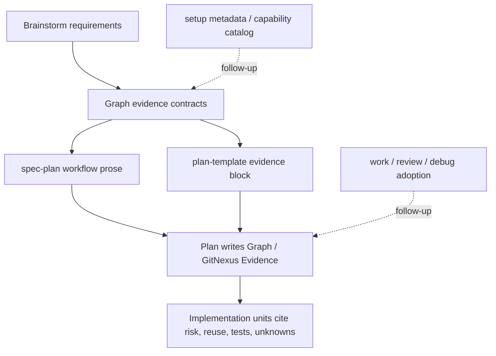

# feat: 将 GitNexus evidence posture 接入 spec-plan

## Summary

本计划把 GitNexus first-class capability 的首个实施切片收窄到 `$spec-plan`：保留现有 `## Graph Readiness` readiness block，在其后新增 GitNexus evidence posture，让计划阶段能按任务风险选择 lightweight probe、native deep dive、degraded fallback 和 scope/mutation guardrail。`$spec-mcp-setup` capability metadata 与长期 capability catalog 作为 follow-up，不进入本切片硬交付。

本计划是 `$spec-plan`-only precursor：它完成 Plan 阶段的一等消费能力，但不单独宣称完成完整 GitNexus first-class capability plugin 验收。完整 plugin completion 仍依赖后续 setup-owned discoverability / capability projection 与 durable capability catalog 的独立计划。

---

## Problem Frame

GitNexus 当前已经通过 setup/bootstrap 进入 spec-first readiness 链路，但 `$spec-plan` 仍更容易消费“provider 是否 ready”而不是 GitNexus 原生代码智能能力。结果是技术方案阶段可能知道 `.spec-first/graph/*` 是否存在，却没有稳定说明本轮计划是否用了 GitNexus query/context/impact/route/API/shape/resource evidence，以及这些证据如何改变实现拆分、风险热点和测试候选。

origin requirements 要求 GitNexus 成为 spec-first 的一等 capability enhancement plugin，但不允许它替代源码、测试或 LLM 语义判断。本计划选择首个实施切片收敛：先让 `$spec-plan` 拿到可执行的 evidence posture，再把 setup-owned metadata projection 和 durable capability catalog 留给 follow-up。这个分期保留需求的完整方向，同时避免首个实现把 setup、catalog、downstream workflow 一次性耦合进来。

---

## Requirements

- R1. `$spec-plan` 必须在涉及代码实现、架构、API、跨模块、跨仓、执行流、测试或 review 风险时执行 lightweight GitNexus evidence probe，并在计划中说明是否建议 deep dive。（origin R1, R2, R3, R4, R5, R6, R10, F1, AE1）
- R2. 新增的 GitNexus evidence posture 必须位于现有 `## Graph Readiness` block 之后，不改变该 block 的 readiness 字段语义。（origin R9）
- R3. Plan 输出必须区分 `capability_status`、`evidence_grade` 和 `freshness_state`，并明确这些字段是 Plan 层 envelope，不是 canonical readiness truth。（origin R14, R14a, R14b, R14c, AE11）
- R4. `primary` / `fallback` 只作为 Plan 层术语：`primary` 映射到 graph evidence policy 的 `confirmed`，`fallback` 是 direct source reads / ast-grep / git diff / code-review-graph posture，不是新的永久证据等级。（origin R14b）
- R5. 当任务出现 graph-heavy 信号时，`$spec-plan` 必须按任务匹配 GitNexus native capability：route/API 走 `api_impact` / `route_map` / `shape_check`，符号/复用走 `query` / `context` / `impact`，tool surface 走 `tool_map`，复杂结构才考虑 `cypher`。（origin R7, R8, AE2, AE14）
- R6. GitNexus unavailable、stale、dirty-advisory、query-unverified 或 definitions-only 时，Plan 继续执行，但必须披露 limitations、降低图谱证据信心，并扩大 direct source reads / ast-grep / code-review-graph fallback。（origin R11, R12, AE3, AE4）
- R7. Plan 不得静默运行 provider refresh、GitNexus group sync、GitNexus analyze、provider repair、host config 修改或 durable artifact refresh。（origin R13, R15, R16；AE5 的"不得静默 group sync / refresh"半边由本 R 覆盖，AE5 的"可使用 session-local query"半边由 R1/R6 与 origin R17/R18 覆盖）
- R8. mutation-capable capability 必须标注 `mutation-gated` / `requires explicit user action`，不能成为自动 implementation unit；GitNexus 影响面发现也不能自动扩大当前 scope。（origin R-MUT1, R-MUT2, R-MUT3, R-SCP1, R-SCP2, AE12）
- R9. Multi Repo Workspace 场景下，Plan evidence posture 必须说明 registry evidence、group evidence、per-repo query usability、dirty/stale limitations 和写入前 `target_repo` / per-child scope 要求。（origin R27, R28, R29, R30, R31, R32, F6, AE9, AE10）
- R10. 本计划不实现 setup-owned capability metadata projection 或 durable capability catalog；`R21-R26` 与 `R33-R35` 作为 follow-up 保留，不阻塞 `$spec-plan` evidence posture，但也不计入本切片完成条件。（origin R21-R26, R33-R35）
- R11. source 变更必须同步 focused contract tests、README/用户手册最小说明和 `CHANGELOG.md`，不手改 `.claude/`、`.codex/` 或 `.agents/skills/` generated mirrors。

**Origin actors:** A1 Developer, A2 `$spec-plan`, A3 GitNexus capability plugin, A4 Generic Code Intelligence Plugin protocol, A5 `$spec-graph-bootstrap`, A6 Downstream workflows, A7 `$spec-mcp-setup`

**Origin flows:** F1 Plan lightweight intelligence probe, F2 Conditional deep dive for high-risk plans, F3 Degraded but non-blocking planning, F4 Durable refresh remains explicit, F5 Setup-owned capability projection, F6 Multi-repo workspace planning evidence

**Origin acceptance examples:** AE1-AE6, AE9-AE10, AE12-AE14 are covered by this `$spec-plan` precursor. AE11 is covered **partially** — only Plan-envelope source tags, current verified tool/resource surface, and conservative source-contract mapping; durable catalog / setup projection aspects of AE11 (provider docs / setup facts disagreement reconciliation) remain follow-up work that requires R21-R26 and R33-R35. AE7-AE8 are deferred to setup metadata work and are NOT covered by this slice.

---

## Scope Boundaries

- 不把 GitNexus 变成 spec-first 内置 provider，也不 fork、代理或重实现 GitNexus。
- 不新增复杂 provider platform、中心化流程引擎或隐藏状态机；本切片只定义 `$spec-plan` 可消费的 lightweight evidence envelope 和 native capability routing prose。
- 不替换现有 `.spec-first/graph/*`、`.spec-first/providers/*`、`.spec-first/impact/*` 或 `.spec-first/workspace/*` canonical/advisory artifacts。
- 不让 GitNexus evidence 替代直接源码读取、测试、review 或 LLM 架构判断。
- 不要求用户为了生成计划而清理所有未提交变更；dirty 只影响 evidence grade / freshness disclosure。
- 不在普通 Plan 中运行 GitNexus analyze、group sync、provider repair、host config 修改、runtime regeneration、hooks、watchers 或 daemons。
- 不把 downstream workflow 深度接入作为 v1 完成条件；`$spec-work`、`$spec-code-review`、`$spec-debug` 后续复用同一 posture 属于 compatibility goal。

### Deferred to Follow-Up Work

- `$spec-mcp-setup` capability metadata projection：覆盖 R21-R26，落点可能涉及 `skills/spec-mcp-setup/mcp-tools.json`、provider projection writer、runtime capability facts、setup skill prose 和 setup contract tests。
- Durable capability catalog / checked-in baseline：覆盖 R33-R35；需先确认 provider pin、host MCP tool/resource surface 和 setup projection 的长期维护边界，避免形成第二套 source of truth。
- Downstream workflow adoption：覆盖 R19/R20 的 `$spec-work`、`$spec-code-review`、`$spec-debug` 深度接入；应基于本 `$spec-plan` precursor posture 经验单独规划。
- `workspace_group_sync` maintenance workflow：若后续需要真实 group sync，应走 preview-first、explicit approval 和 setup/bootstrap-owned 边界，不由 Plan 自动执行。

这些 follow-up 中，setup-owned discoverability / capability projection 是完整 first-class capability plugin 验收的剩余必要条件；它不是本 `$spec-plan` precursor 的隐藏 prerequisite。

---

## Graph Readiness

- target_repo: `spec-first`
- status: stale
- source_revision: `b21bafa5a3b6d649464e70fb0432fead4203bf26`
- current_revision: `b21bafa5a3b6d649464e70fb0432fead4203bf26`
- stale: true
- primary_providers: compiled artifacts report `code-review-graph`, `gitnexus`
- degraded_providers: none in compiled artifacts
- fallback_capabilities: direct source reads, focused `rg`, existing graph/provider/workspace contracts, session-local GitNexus MCP evidence
- runtime_mcp_evidence: `list_repos` succeeded for `spec-first`; `query` and `context` succeeded as session-local evidence; `list_mcp_resources` / `list_mcp_resource_templates` show GitNexus read-only resources and templates including repo context, processes, schema, cluster, process trace, group contracts, and group status
- confidence: medium for graph-assisted planning; high for direct-source contract and skill prose reads
- limitations: canonical graph facts were generated for a clean worktree, while the current worktree is dirty (`worktree_status_hash` differs: current `sha256:3fa07d474cef4bd3de3b0d364022650f9ece07a3e1129a1146dab0a4ca681d26`); this plan treats compiled graph as stale/advisory and does not claim refreshed graph-backed impact evidence

---

## Context & Research

### Relevant Code and Patterns

- `skills/spec-plan/SKILL.md` already owns Graph Readiness consumption rules, live MCP fallback, stale graph handling, and the mandatory machine-testable `## Graph Readiness` plan block.
- `skills/spec-plan/references/plan-template.md` is the plan skeleton source of truth and currently includes `## Graph Readiness` but not a separate GitNexus evidence posture section.
- `tests/unit/spec-plan-contracts.test.js` locks spec-plan graph readiness behavior, research fallback, plan template references, and workflow contract language.
- `docs/contracts/graph-evidence-policy.md` owns provider evidence levels and already defines `primary` as a Plan alias for `confirmed`, while `fallback` is a Plan posture rather than a canonical evidence grade.
- `docs/contracts/graph-provider-consumption.md` owns canonical artifact reads, freshness comparison, live MCP session-local boundaries, forbidden legacy reads, and consumer-side rebuild prohibitions.
- `docs/contracts/workspace-gitnexus-consumption.md` owns parent workspace GitNexus registry/group evidence, `group.status`, `refresh_eligibility`, `index_snapshot`, `query_usability`, and `target_repo` boundaries.
- `src/cli/helpers/review-pre-facts.js` already implements a script-owned freshness comparison pattern that computes current repo snapshot and degrades stale graph facts to bounded reads; it is useful as a pattern but should not become a parallel `$spec-plan` script pipeline.
- `docs/catalog/runtime-capabilities.md` describes runtime delivery and explicitly says provider readiness is represented by setup/bootstrap artifacts, not by runtime delivery itself.
- `skills/spec-mcp-setup/SKILL.md` and `tests/unit/mcp-setup.sh` already enforce that setup writes provider projections but does not run GitNexus analyze/query/status or graph bootstrap work.

### Institutional Learnings

- `docs/plans/2026-05-21-001-feat-gitnexus-workspace-group-readiness-plan.md` established that GitNexus registry/group evidence is a read-only query model, not a refresh gate, and that parent workspace facts are advisory.
- `docs/plans/2026-05-18-001-refactor-crg-primary-gitnexus-optional-plan.md` preserved the split where code-review-graph remains primary review/impact infrastructure and GitNexus remains global knowledge / query enhancement.
- `docs/plans/2026-05-07-002-feat-gitnexus-evidence-governance-plan.md` is prior art for keeping provider evidence as evidence, not workflow state or a second plan.
- `docs/10-prompt/结构化项目角色契约.md` requires `Light contract`, `Explicit boundaries`, and `Scripts prepare, LLM decides`; the precursor scope follows that by changing workflow guidance and contracts without adding a rule engine.

### External References

- No external research was used. The plan is grounded in repository source contracts, current GitNexus MCP surface, and local workflow patterns.

---

## Key Technical Decisions

| Decision | Rationale | Consequence |
| --- | --- | --- |
| Split `$spec-plan` precursor from full plugin completion | The requirements doc listed setup metadata and capability catalog in v1 P0, but `$spec-plan` can start from current canonical artifacts and live session-local MCP evidence | This plan ships the Plan-stage precursor only; R21-R26 and R33-R35 remain explicit follow-up work required before claiming full first-class plugin completion |
| Preserve `## Graph Readiness` unchanged | Existing tests and downstream expectations treat Graph Readiness as readiness/freshness context | Add a neighboring `Graph / GitNexus Evidence` block instead of overloading readiness status |
| Keep Plan envelope light | A broad Generic Code Intelligence Plugin framework would violate the light-contract goal and duplicate existing graph evidence policy | Add capability/evidence posture terms to existing contracts and skill prose, not a new provider platform |
| Treat native capability selection as LLM-owned | Scripts can verify artifact freshness; only the planning workflow can decide whether API impact, symbol context, route map, shape check, Cypher, or source reads fit the current task | `$spec-plan` gets trigger guidance and required disclosure, not a deterministic router |
| Use session-local GitNexus evidence conservatively | Live MCP tools/resources are useful but cannot rewrite compiled readiness or become permanent catalog truth | Plans can cite `native_tool_or_resource` and source tags, with freshness and limitations |
| Gate mutation and scope expansion | GitNexus `rename` and `group_sync` can mutate provider/source state; impact findings can reveal extra surfaces | Plan labels mutation-capable capabilities as `mutation-gated` and records extra surfaces as risks/follow-ups unless user scope changes |

---

## Open Questions

### Resolved During Planning

- Should setup capability metadata stay in the first implementation slice? No. It is useful but not required for `$spec-plan` to consume existing readiness facts and session-local GitNexus evidence; implementing it in this slice would enlarge the first slice without an independent consumer.
- Should `primary/fallback` be added as canonical evidence grades? No. `primary` is a Plan alias for `confirmed`; `fallback` is a Plan posture. `docs/contracts/graph-evidence-policy.md` remains canonical for evidence-grade semantics.
- Should this precursor create a new code intelligence plugin framework? No. The Plan envelope lives in existing graph evidence and plan workflow contracts; a broader provider framework would be speculative until another provider needs the same surface.
- Should Plan ever auto-run `group_sync` or `rename` preview? No. Plan can mention `mutation-gated` follow-up action, but execution requires explicit user authorization and a later workflow boundary.
- Should stale canonical graph facts block this plan? No. This is a source-prose/contract plan, and current source reads plus session-local GitNexus evidence are sufficient. The plan records graph evidence as stale/advisory.

### Deferred to Implementation

- Exact section title for the new plan block: implementation should choose `## Graph / GitNexus Evidence` or an equivalent stable heading and lock it in tests.
- Exact wording for `native_tool_or_resource`: implementation should keep it flexible enough to name MCP tools, resources, or direct-read fallback without requiring exact JSON schemas.
- Exact trigger language: implementation should tune the trigger matrix so common tasks are easy to follow without turning `$spec-plan` into a deterministic rules engine.
- Exact README/用户手册 location: implementation should choose the smallest existing section that explains graph evidence consumption without duplicating the full skill instructions.

---

## High-Level Technical Design

> *This illustrates the intended approach and is directional guidance for review, not implementation specification. The implementing agent should treat it as context, not code to reproduce.*

The implementation should keep the contract path short: contracts define evidence vocabulary and boundaries, `spec-plan` decides when to use a native GitNexus capability, and the plan template preserves output shape.

---

## Implementation Units

### U1. Lock the evidence vocabulary and precursor/follow-up boundary

**Goal:** Make the evidence vocabulary unambiguous before changing workflow prose, and encode the precursor scope split so implementers do not treat setup metadata/catalog as required for the first slice.

**Requirements:** R1, R3, R4, R6, R7, R8, R10, R11; origin R1-R4, R11-R14c, R15-R18, AE3, AE4, AE11, AE12

**Dependencies:** None

**Files:**
- Modify: `docs/contracts/graph-evidence-policy.md`
- Modify: `docs/contracts/graph-provider-consumption.md`
- Modify: `docs/contracts/workspace-gitnexus-consumption.md`
- Modify: `tests/unit/graph-provider-consumption-contracts.test.js`
- Modify: `tests/unit/workspace-gitnexus-contracts.test.js`

**Approach:**
- Ensure `docs/contracts/graph-evidence-policy.md` explicitly states that `primary` is a `$spec-plan` alias for `confirmed`, and `fallback` is a Plan posture, not a canonical evidence-grade enum.
- Lock the complete three-axis Plan envelope values: `capability_status=available|partial|unavailable|mutation-gated`, `evidence_grade=primary|session-local|advisory|fallback`, and `freshness_state=fresh|stale|dirty-advisory|query-unverified`.
- 锁定三轴的同时必须在 contract 中给出 validity 取值矩阵，至少枚举以下非法或自动归一组合（详细组合由实现选择 contract test 表达方式，但下列约束必须可由测试机械检查）：
  - `capability_status=unavailable` 时 `evidence_grade` 不得为 `primary`/`session-local`，必须收敛到 `advisory` 或 `fallback`。
  - `capability_status=mutation-gated` 不得自动产出 mutation 步骤；`evidence_grade` 仅可为 `session-local`/`advisory`/`fallback`，且 `freshness_state` 不得用于声称已验证 mutation 安全。
  - `freshness_state=fresh` 仅当来自当前 fingerprint 匹配的 canonical 或 query-ready provider；`capability_status=unavailable` 时禁用 `freshness_state=fresh`。
  - `freshness_state=query-unverified` 必须配合 `evidence_grade=advisory` 或 `fallback`；不得与 `primary` 共存。
  - `evidence_grade=fallback` 表示 Plan 切到 direct source/test/ast-grep 等替代证据，与 capability availability 解耦；当且仅当源码/测试本身仍可作为 confirmed evidence 时使用，contract 必须保证它不被解释为低可信证据等级。
- Add or tighten contract language that the GitNexus Plan envelope is derived from existing canonical artifacts, existing setup-owned readiness facts (e.g., `runtime-capabilities.json.project_graph_readiness` 与 `graph-providers.json.derived_readiness` 这类 setup-owned projection 指针，按 `docs/contracts/graph-provider-consumption.md` Consumer Rule 5 仅作为指向 canonical artifacts 的提示而非独立真相源)、workspace advisory facts 和 session-local MCP evidence；它必须不得写回 readiness artifacts。后续 R21-R26 setup capability projection 落地时，可在不破坏本 envelope 含义的前提下扩展该派生集合。
- Add a short precursor/follow-up boundary note: origin R21-R26 and R33-R35 stay follow-up; `$spec-plan` evidence posture can ship before setup-owned capability metadata/catalog work, so setup/catalog remains a boundary reference rather than a current-slice implementation requirement.
- Keep `docs/contracts/workspace-gitnexus-consumption.md` as the source for multi-repo registry/group evidence; do not restate the whole workspace contract in graph evidence policy.

**Patterns to follow:**
- `docs/contracts/graph-provider-consumption.md` field-level canonical artifact tables.
- `tests/unit/workspace-gitnexus-contracts.test.js` prose contract assertions that lock critical wording without overfitting full paragraphs.

**Test scenarios:**
- Happy path: contract tests assert `primary` maps to `confirmed`, `fallback` is a Plan posture, and `session-local` evidence cannot rewrite compiled readiness.
- Edge case: tests assert Plan envelope fields do not replace `Graph Readiness.status`, workspace `query_usability`, or provider `query_ready`.
- Edge case: tests assert the full three-axis enum values remain visible and that `definitions-only` is treated as an evidence limitation / query-usability condition, not a new `freshness_state`.
- Compound failure: tests assert envelope rejection or canonical degradation for the impossible cells in the validity matrix above — at least `capability_status=unavailable + evidence_grade=primary`、`capability_status=mutation-gated + 自动 mutation 步骤`、`freshness_state=query-unverified + evidence_grade=primary` 必须不通过 contract 校验。
- Error path: tests assert mutation-capable `group_sync` / `rename` remain explicit / preview-first and are not treated as `unavailable`.
- Integration: workspace GitNexus contract tests still pass and continue to prohibit `group_status` top-level drift and downstream hidden `group_sync`.

**Verification:**
- Focused contract tests prove the evidence vocabulary no longer has two competing enum systems.
- Contract prose makes setup/catalog follow-up explicit without deleting origin requirements.

---

### U2. Add GitNexus evidence posture to spec-plan output

**Goal:** Teach `$spec-plan` to emit a stable GitNexus evidence section after `## Graph Readiness`, while preserving the existing readiness block unchanged.

**Requirements:** R1, R2, R3, R4, R6, R7, R8, R11; origin R5-R10, R11-R14c, R17-R18, AE1, AE3, AE4, AE11

**Dependencies:** U1

**Files:**
- Modify: `skills/spec-plan/SKILL.md`
- Modify: `skills/spec-plan/references/plan-template.md`
- Modify: `tests/unit/spec-plan-contracts.test.js`

**Approach:**
- In `skills/spec-plan/SKILL.md`, add an explicit lightweight GitNexus evidence probe immediately after Graph Readiness facts are interpreted.
- Define the new plan output block with fields such as `provider`, `native_tool_or_resource`, `repo_scope`, `capability_status`, `evidence_grade`, `freshness_state`, `source_contract_fields`, `source_reads_required`, `impact_on_plan`, `capabilities_used`, `key_findings`, and `limitations`.
- Require the skill prose and template to show allowed values for `capability_status`, `evidence_grade`, and `freshness_state` so implementers do not invent provider-local status names.
- Make `source_reads_required` mandatory for stale/advisory/session-local/fallback paths, and strongly expected even for primary graph evidence when the plan changes source.
- Update `plan-template.md` so new plans include the GitNexus evidence block after Graph Readiness and before Context & Research.
- Preserve the existing Graph Readiness machine-testable fields exactly.

**Execution note:** Start with contract tests for the skill/template text before modifying the prose; this is a prompt/workflow contract change.

**Patterns to follow:**
- Existing `Graph Readiness Facts` guidance in `skills/spec-plan/SKILL.md`.
- Existing `tests/unit/spec-plan-contracts.test.js` checks for mandatory workflow phrases and plan-template fields.

**Test scenarios:**
- Covers AE1. Happy path: when a plan is generated from code-affecting input and graph facts are fresh/query-ready, the template supports both Graph Readiness and Graph / GitNexus Evidence sections.
- Covers AE3. Edge case: when graph facts are stale or dirty-advisory, the skill requires limitations and direct source validation instead of treating prior GitNexus evidence as current primary proof.
- Covers AE4. Error path: when GitNexus is unavailable or query-unverified, the skill still proceeds with fallback evidence and requires the limitation to appear in the plan.
- Compound failure: tests assert plan output for the realistic worst case — graph-stale + worktree dirty + GitNexus session-local-only + graph-heavy task + provider surface 包含 mutation-capable tool。在该场景下，Plan envelope 必须同时呈现降级 `capability_status`、`evidence_grade=session-local|advisory`、`freshness_state=stale|dirty-advisory`，limitations 必须可见，并且不得自动调用 mutation tool。
- Integration: spec-plan contract tests assert the new evidence block appears adjacent to Graph Readiness, lists the allowed three-axis values, and does not replace existing Graph Readiness fields.

**Verification:**
- `tests/unit/spec-plan-contracts.test.js` locks the new block, field names, fallback behavior, and no-refresh boundary.
- A fresh plan produced after implementation contains both Graph Readiness and GitNexus evidence sections.

---

### U3. Add native capability trigger guidance

**Goal:** Give `$spec-plan` enough native GitNexus capability guidance to choose useful evidence without collapsing everything into a generic query.

**Requirements:** R1, R3, R5, R6, R8, R11; origin R2, R3, R7, R8, R10, R34 resource-consumption aspect, AE2, AE6, AE13, AE14

**Dependencies:** U1, U2

**Files:**
- Modify: `skills/spec-plan/SKILL.md`
- Modify: `tests/unit/spec-plan-contracts.test.js`

**Approach:**
- Add a concise trigger matrix in `skills/spec-plan/SKILL.md`:
  - route/API changes prefer `api_impact`, then `route_map`, then `shape_check` where applicable.
  - response shape risk prefers `shape_check`.
  - symbol/refactor/reuse questions prefer `query`, `context`, and `impact`.
  - tool/RPC changes prefer `tool_map`.
  - complex graph structure questions may use `cypher` only after reading schema/resource context.
  - repo/workspace orientation may use `list_repos`, `group_list`, and read-only MCP resources when exposed.
- Require every native capability use to be reported as `native_tool_or_resource`, not hidden behind a generic `GitNexus used: yes`.
- Treat current MCP tool/resource surface as session-local: the skill can name known candidates, but must tell the executing agent to verify the live surface before claiming availability.
- Keep origin R33/R35 durable capability catalog behavior out of this unit; U3 only covers session-local tool/resource selection guidance for `$spec-plan`.
- Keep the guidance short enough that LLM judgment still decides relevance.

**Patterns to follow:**
- `docs/contracts/graph-evidence-policy.md` provider role language.
- The origin document's appendix for candidate tools/resources, but only as a session-local snapshot rather than a permanent source.

**Test scenarios:**
- Covers AE2 and AE14. Happy path: spec-plan prose prefers specialized API/route/shape capabilities before generic `query` for public route changes.
- Happy path: spec-plan prose names read-only resources as valid evidence sources and requires provenance/freshness disclosure.
- Edge case: if a specialized tool/resource is unavailable, the skill instructs fallback to `query/context + source reads` or bounded direct reads rather than claiming the capability exists.
- Error path: `cypher` guidance requires schema/resource orientation and stays an advanced/deep-dive option.

**Verification:**
- Contract tests prove native capability names remain visible in source prose and that capability catalog claims are not static or permanent.

---

### U4. Preserve scope and mutation boundaries in planning behavior

**Goal:** Prevent GitNexus findings from silently expanding implementation scope or executing mutation-capable provider actions.

**Requirements:** R7, R8, R9, R11; origin R-MUT1, R-MUT2, R-MUT3, R-SCP1, R-SCP2, R13, R27-R32, AE5, AE9, AE10, AE12

**Dependencies:** U1, U2, U3

**Files:**
- Modify: `skills/spec-plan/SKILL.md`
- Modify: `tests/unit/spec-plan-contracts.test.js`
- Modify: `tests/unit/workspace-gitnexus-contracts.test.js`

**Approach:**
- Add a scope authority rule to spec-plan: requirements, plan/task pack, user instruction, and git diff define implementation scope; GitNexus only proposes risks, impacted surfaces, reuse candidates, and follow-up options.
- Add `mutation-gated` handling for `workspace_group_sync` and `symbol_rename`: Plan can recommend explicit follow-up, but cannot list real mutation as an automatic implementation step.
- For Multi Repo Workspace plans, require `target_repo` or per-unit repo scope before any write/test/changelog/commit-oriented work, even when GitNexus group evidence finds cross-repo candidates.
- Ensure group-missing and group-sync-required are treated as orientation limitations, not provider failure.
- Keep downstream workflow references as future adoption notes, not current-slice behavior.

**Patterns to follow:**
- `docs/contracts/workspace-gitnexus-consumption.md` consumer rules.
- `skills/spec-plan/SKILL.md` existing parent workspace target repo rules.

**Test scenarios:**
- Covers AE10. Happy path: when group is missing but registry evidence exists, spec-plan prose requires bounded per-repo fallback and target_repo before write-oriented work.
- Covers AE12. Edge case: when GitNexus impact finds extra repos/symbols, spec-plan records them as risk/follow-up unless scope authority changes.
- Error path: mutation-capable capability is expressed as `mutation-gated` / `requires explicit user action`, not `unavailable` or an automatic unit.
- Compound failure: tests assert behavior when group is missing AND `target_repo` is missing AND GitNexus impact returns extra repo candidates; spec-plan prose must require explicit `target_repo` / per-child scope before任何 write/test/changelog/commit 步骤，把额外仓库候选记为 risk/follow-up，并把 `workspace_group_sync` 留为 `mutation-gated` 显式后续动作而非 implementation step。
- Integration: workspace GitNexus contract tests confirm downstream consumers still do not auto-run `group_sync`.

**Verification:**
- Tests lock the plan/workflow boundary so a future prompt edit cannot turn GitNexus evidence into automatic scope expansion or provider mutation.

---

### U5. Update user-facing docs and changelog for the new planning evidence behavior

**Goal:** Document the user-visible behavior change without duplicating the full spec-plan implementation contract.

**Requirements:** R1, R2, R6, R7, R9, R11; origin success criteria and scope boundaries

**Dependencies:** U2, U3, U4

**Files:**
- Modify: `README.md`
- Modify: `README.zh-CN.md`
- Modify: `docs/05-用户手册/04-workflows-artifacts-map.md`
- Modify: `docs/05-用户手册/05-最佳实践.md`
- Modify: `tests/unit/user-manual-contracts.test.js`
- Modify: `CHANGELOG.md`

**Approach:**
- Add a concise note that `$spec-plan` now reports GitNexus evidence posture next to Graph Readiness when the plan involves code/architecture/API/cross-module risk.
- Explain that dirty/stale GitNexus evidence can still be useful as advisory orientation, but current source reads remain required for critical claims.
- Keep setup/bootstrap docs unchanged except for cross-linking: setup prepares harness/provider projections; graph-bootstrap compiles durable readiness; plan decides relevance.
- Record the user-visible behavior change in changelog using the repository's current format and current developer profile.

**Patterns to follow:**
- Existing README “Current context and graph readiness” section.
- Existing user manual wording around dirty refresh blocked not equaling query unavailable.

**Test scenarios:**
- Happy path: README/user manual contract tests assert `$spec-plan` exposes GitNexus evidence posture without implying hidden provider refresh.
- Edge case: docs mention stale/dirty-advisory evidence as limited and source-validated, not as primary truth.
- Error path: docs do not restore Serena fallback wording or imply setup proves query-ready graph evidence.

**Verification:**
- User-facing docs describe what changes for plan consumers while preserving source/runtime/provider boundaries.
- Changelog includes a docs/workflow behavior entry marked user-visible.

---

## System-Wide Impact

- **Interaction graph:** `$spec-plan` remains a prose workflow; it consumes graph/provider facts and live MCP evidence but does not introduce a new script, artifact writer, or provider command path.
- **Error propagation:** GitNexus unavailable/stale/query-unverified becomes a visible limitation in the plan, not a planning failure. Graph-heavy work may recommend `$spec-graph-bootstrap` before claiming primary graph-backed evidence.
- **State lifecycle risks:** No new durable runtime/provider state is written by this slice. Session-local MCP evidence is cited only in plan output.
- **API surface parity:** Claude and Codex both consume the same source skill/templates after runtime regeneration; this plan does not manually edit generated mirrors.
- **Integration coverage:** Contract tests must cover skill prose, plan template, graph evidence policy, workspace GitNexus rules, and user docs.
- **Unchanged invariants:** `spec-mcp-setup` remains setup metadata/projection only; `spec-graph-bootstrap` remains durable readiness compiler; code-review-graph remains primary review/impact provider where existing contracts say so.

---

## Risks & Dependencies

| Risk | Mitigation |
|------|------------|
| Precursor scope creeps back into setup/catalog work | Keep R21-R26 and R33-R35 under `Deferred to Follow-Up Work`; U5 docs should mention behavior, not schema projection. |
| New evidence block duplicates Graph Readiness semantics | Require `Graph / GitNexus Evidence` to cite readiness fields as source inputs while keeping `Graph Readiness.status` unchanged. |
| Trigger matrix becomes a rigid rules engine | Phrase it as task-matched guidance for LLM judgment, not as deterministic routing code. |
| `fallback` gets mistaken for a low-confidence evidence grade | U1 contract must state fallback is a posture; direct source/test facts can still be confirmed evidence. |
| Live MCP surface snapshot becomes permanent truth | U3 requires current-session verification and source tags; P1 catalog work remains separate. |
| Multi-repo GitNexus evidence expands write scope | U4 requires target_repo/per-child scope before write/test/changelog/commit-oriented work. |
| Generated runtime drift after source changes | Do not patch generated mirrors; if runtime refresh is needed after implementation, run the appropriate `spec-first init --claude|--codex` path as a separate execution step. |

---

## Documentation / Operational Notes

- This precursor is user-visible because future `$spec-plan` outputs will include a GitNexus evidence posture for code-affecting plans.
- Implementation should update `CHANGELOG.md` in the same PR as source changes.
- If implementers modify skill prose, fresh-source eval or equivalent read-only review should be used before claiming behavior quality; current-session cached skill behavior is not proof.
- Runtime regeneration is not part of this plan document. If source changes require checked-in `AGENTS.md` / `CLAUDE.md` managed block updates, implementers should handle that through source generator paths, not manual runtime edits.

---

## Alternative Approaches Considered

- Keep original v1 P0 with setup metadata and catalog included: rejected for this precursor because `$spec-plan` can consume current canonical artifacts and session-local evidence without new setup projection; including setup/catalog makes the first slice larger without improving the first consumer.
- Build a standalone Code Intelligence Plugin framework: rejected as over-designed for one provider and one first consumer. The light contract can live in existing graph evidence and plan workflow contracts until another provider proves the need.
- Put GitNexus evidence inside `## Graph Readiness`: rejected because readiness facts and task-specific evidence have different meanings and consumers. A neighboring block preserves compatibility and clarity.
- Make GitNexus unavailable a planning blocker: rejected because the origin explicitly requires degraded but non-blocking planning with source-read fallback.

---

## Sources & References

- **Origin document:** `docs/brainstorms/2026-05-22-001-gitnexus-first-class-capability-plugin-requirements.md`
- Related contract: `docs/contracts/graph-evidence-policy.md`
- Related contract: `docs/contracts/graph-provider-consumption.md`
- Related contract: `docs/contracts/workspace-gitnexus-consumption.md`
- Planning workflow source: `skills/spec-plan/SKILL.md`
- Plan template source: `skills/spec-plan/references/plan-template.md`
- Setup boundary source: `skills/spec-mcp-setup/SKILL.md`
- Prior plan: `docs/plans/2026-05-21-001-feat-gitnexus-workspace-group-readiness-plan.md`
- Prior plan: `docs/plans/2026-05-18-001-refactor-crg-primary-gitnexus-optional-plan.md`
- Project role baseline: `docs/10-prompt/结构化项目角色契约.md`

---

## Deferred / Open Questions

### From 2026-05-22 review

- **`evidence_grade` 含 `fallback` 与 R4 / graph-evidence-policy 的 posture-only 声明矛盾** — U1 Approach + R4 + Risks (P1, adversarial-document/feasibility +1 anchor, confidence-first 100)

  Implementers will encounter contract tests that simultaneously assert (a) `evidence_grade` enum contains `fallback` 作为一个值，(b) `fallback` 是 Plan posture 而非 evidence grade。`docs/contracts/graph-evidence-policy.md` 已经写明 `fallback` 不是独立证据等级；锁住四值 enum 等同于在 contract 内部承认它是。需要先做出二选一设计决策：要么把 `fallback` 从 `evidence_grade` 移出、用单独的 `posture` / `evidence_role` 字段表达，要么修改 R4 与既有 contract，把 `fallback` 升格为正式第四等级。该决策不应在 U1 测试编写过程中临时定夺。

  <!-- dedup-key: section="u1 approach r4 risks" title="evidencegrade enum locks fallback while r4 and graphevidencepolicymd declare it a plan posture not an evidence grade  u1 contract tests would have to assert both contradictory claims" evidence="R4. `primary` / `fallback` 只作为 Plan 层术语：`primary` 映射到 graph evidence policy 的 `confirmed`，`fallback` 是 dir" -->

- **R27-R32 (origin v1 P1) 被 plan R9/U4 静默提升进入 precursor** — Requirements R9 + U4 (P2, scope-guardian, confidence-first 100)

  Origin `v1 实现优先级` 把 R27-R32 标为 v1 P1，与 setup capability metadata (R21-R26 / R33-R35) 同列，但优先级低于 Plan 核心。本 plan 在 R9 / U4 把它们整体并入 precursor，而 Summary 强调 "narrow precursor that defers setup, catalog, downstream"。需要选择：要么在 Summary 与 Key Technical Decisions 显式承认 R27-R32 从 v1 P1 提升进入 precursor 并给出理由（例如 mutation/scope 防护栏在单仓也成立、多仓边界与 group sync 风险在本切片必须封装），要么把 R9 / U4 的多仓专属内容拆出去做单独 follow-up，让 U4 只保留 mutation/scope 防护栏。

  <!-- dedup-key: section="requirements r9  u4" title="origin lists r2732 multirepo workspace as v1 p1 this precursor pulls them in via r9u4 with no explicit promotion rationale contradicting the smallest precursor framing in summary" evidence="Origin: 'v1 P1 — Multi Repo Workspace: R27-R32 多仓 evidence posture，group-ready / group-missing 两路径'" -->

- **Origin AE7 fresh-session capability discovery 不被本切片覆盖，user-experience cost 未在 Summary 暴露** — Summary + Deferred to Follow-Up Work (P2, product-lens, confidence-first 75)

  Origin success criterion 要求 `$spec-mcp-setup 能清楚表达 GitNexus live capability 是否已配置 / 需要新会话 / 是否建议 graph-bootstrap`，对应 AE7。本 precursor 把 setup metadata 整体推到 follow-up，意味着每个 cold session 的 Plan 都必须重跑 live MCP probe 才能得知 native capability availability — 正是 origin Problem Frame 所指出的 "GitNexus 被压缩成 readiness compiler 输入源" 摩擦。需要选择：要么在 precursor 中加一个最小 setup capability projection sibling unit 让 AE7 在 v1 落地，要么在 Summary / Deferred to Follow-Up Work 里显式声明 "fresh-session capability discovery 不在本切片交付，Plan 输出依赖 per-session live probe，直到 R21-R26 ship"，以 user-experience 语言而非 requirement ID 表述。

  <!-- dedup-key: section="summary  deferred to followup work" title="origin success criterion specmcpsetup 能清楚表达 gitnexus live capability 是否已配置 is unmet by this slice ae7 freshsession capability discovery from setupowned facts does not materialize but precursor disclosure names requirement ids without naming the userexperience cost every cold session reruns live mcp probe" evidence="本计划是 `$spec-plan`-only precursor：它完成 Plan 阶段的一等消费能力，但不单独宣称完成完整 GitNexus first-class capability plugin 验收。" -->

