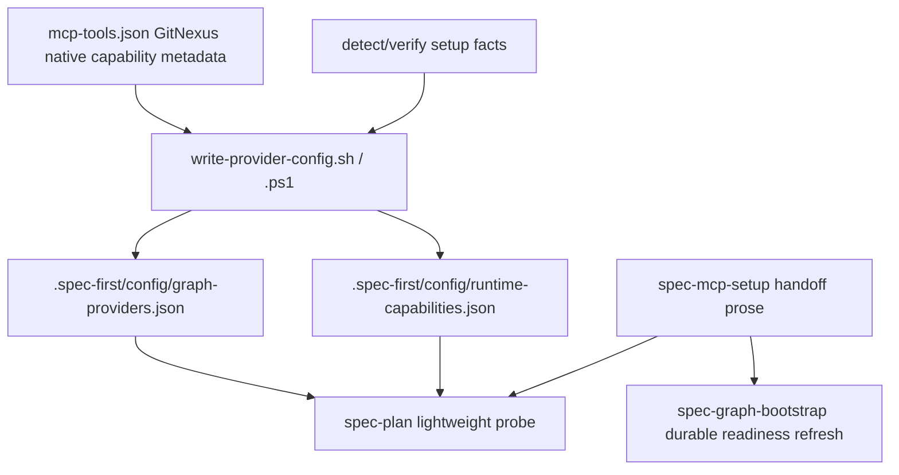

# feat: Add GitNexus setup capability metadata

## Summary

本计划只覆盖 origin R21-R26：让 `$spec-mcp-setup` 写出 setup-owned GitNexus capability metadata / projection facts，并同步补齐 `$spec-plan` 对这些 availability facts 的最小消费规则，使后续 fresh session 的 Plan 能知道当前 host/runtime 暴露了哪些 GitNexus 原生能力。Setup 仍只准备确定性 facts 和 handoff，不执行 GitNexus task-level query、analyze、status、group sync 或 provider repair。

---

## Problem Frame

上一切片 `docs/plans/2026-05-22-002-feat-gitnexus-plan-evidence-plan.md` 已把 GitNexus evidence posture 接入 `$spec-plan`，但它明确留下一个体验缺口：fresh session 中 Plan 仍需要重新做 live MCP surface probe，才能确认 GitNexus native tools/resources 是否可用。origin R21-R26 要求 `$spec-mcp-setup` 补一层 setup-owned capability availability facts，让 Plan 能先从 setup 投影中发现 GitNexus 能力面，再由 Plan 自己决定本轮是否使用 query/context/impact/route/API/shape/Cypher/tool/workspace 能力。

这个改动的边界是 setup-owned availability，不是 semantic evidence。脚本只写“当前 registry / host config / provider pin / setup facts 能观察到的能力是否可被下游发现”；LLM workflow 仍负责判断某个能力是否适合当前计划问题，并继续以源码、测试和 canonical readiness facts 校验关键结论。

---

## Requirements

- R1. `$spec-mcp-setup` 必须为 GitNexus 写出 setup-owned capability metadata，表达 GitNexus 作为 required host MCP / graph-provider 可向下游提供哪些原生能力；metadata 只描述 availability，不包含任务级查询结果或语义结论。（origin R21, F5, AE7）
- R2. Capability projection 至少覆盖 `query`、`context`、`impact`、route/API evidence、`shape_check`、`cypher`、`tool_map`、repo registry 和 workspace group；字段命名必须保持轻量、可扩展，并能说明该能力来自 registry baseline、provider pin、host MCP config surface 还是 setup-owned projection。（origin R22, AE7）
- R3. `$spec-mcp-setup` handoff 必须清楚区分三条路径：durable readiness refresh 进入 `$spec-graph-bootstrap`；只需要 Plan 阶段 live GitNexus evidence 时，在新会话或当前可见 MCP surface 下交给 `$spec-plan` lightweight probe；dirty worktree 阻断或降级 durable refresh 不等于 Plan 不能使用 prior/session-local evidence。（origin R23, AE7）
- R4. `$spec-mcp-setup` 不得因为新增 capability metadata 而运行 `gitnexus analyze`、`gitnexus status`、`gitnexus query`、GitNexus `group_sync`、provider repair 或任何 task-level deep dive。（origin R24, AE8）
- R5. Setup-owned fallback / degraded 文案不得恢复 Serena 语义；GitNexus 不可用时默认降级证据应表述为 direct source reads、ast-grep、code-review-graph、prior GitNexus evidence 或 bounded per-repo fallback。（origin R25, AE8）
- R6. 改动优先落在 `skills/spec-mcp-setup/mcp-tools.json` registry、provider projection writer、runtime capability facts、setup skill prose、`$spec-plan` availability-consumer guidance 和 contract tests；不得把 setup 执行流改造成 provider capability router。（origin R26, AE8）

**Origin actors:** A1 Developer, A3 GitNexus capability plugin, A5 `$spec-graph-bootstrap`, A7 `$spec-mcp-setup`, A2 `$spec-plan`

**Origin flows:** F5 Setup-owned capability projection; F1/F3/F4 作为下游消费与 handoff 边界参考

**Origin acceptance examples:** AE7-AE8 是本计划的硬验收。AE11 中 durable catalog / source-tag baseline 部分不进入本计划；它属于 R33-R35 follow-up。

---

## Scope Boundaries

- 不实现 R33-R35 durable capability catalog、checked-in baseline 或 resource source-tag catalog；本计划只为后续 catalog 保留字段兼容空间。
- 不接入 `$spec-work`、`$spec-code-review` 或 `$spec-debug`；这些 downstream adoption 属于单独计划。
- 不改变 `$spec-plan` evidence envelope 的四轴语义；setup projection 只是 Plan 可消费的 availability input。
- 不让 setup 写 canonical `.spec-first/graph/*`、`.spec-first/providers/*`、`.spec-first/impact/*` readiness truth。
- 不运行 GitNexus analyze/status/query、Cypher、group sync、rename、provider repair、index rebuild、hooks、watchers 或 daemons。
- 不手改 `.claude/`、`.codex/`、`.agents/skills/` generated runtime mirrors。
- 不恢复 Serena fallback 文案；若历史文案仍存在，只在本计划相关文件内按最小范围替换。

### Deferred to Follow-Up Work

- R33-R35 capability catalog / source tag baseline：单独规划 provider pin、checked-in baseline、live MCP tool/resource 复核和 setup projection 的长期维护边界。
- Downstream workflow adoption：除本计划内 `$spec-plan` 最小消费规则外，在 setup capability projection 稳定后，再规划 `$spec-work`、`$spec-code-review`、`$spec-debug` 如何复用 availability facts。
- GitNexus group sync maintenance：若需要真实 group sync，必须走 preview-first、explicit approval 和维护 workflow，不由 setup 或 Plan 自动执行。

---

## Graph Readiness

- target_repo: `spec-first`
- status: stale
- source_revision: `943eb59daf511045c89e9690b567d58176d47914`
- current_revision: `1aa6cf12eccc3a0b16e4202d111a4f070cbef628`
- stale: true
- primary_providers: compiled artifacts report `code-review-graph`, `gitnexus`
- degraded_providers: none in compiled artifacts
- fallback_capabilities: direct source reads, focused `rg`, existing setup/graph contracts, existing unit contract files
- runtime_mcp_evidence: session-local GitNexus query returned advisory pointers for setup/projection surfaces; no provider refresh or mutation was run
- confidence: high for direct source reads; medium for graph-assisted orientation
- limitations: canonical graph artifacts are stale relative to current `HEAD`, and current worktree has unrelated staged/unstaged changes from prior `$spec-plan` work. This plan treats graph output as advisory and does not claim refreshed impact evidence.

---

## Graph / GitNexus Evidence

- provider: GitNexus
- native_tool_or_resource: `gitnexus_query` session-local orientation only
- repo_scope: `spec-first`
- capability_status: partial
- evidence_grade: session-local
- evidence_posture: fallback
- freshness_state: stale
- source_contract_fields: `.spec-first/graph/graph-facts.json.source_revision`, `.spec-first/graph/provider-status.json.providers[].query_ready`, `skills/spec-mcp-setup/mcp-tools.json.tools[].provider_config.capabilities`, `docs/contracts/graph-provider-consumption.md`
- source_reads_required: mandatory
- impact_on_plan: GitNexus confirmed relevant neighborhoods exist, but file lists and implementation units are based on direct source reads.
- capabilities_used: query/orientation
- key_findings: setup projection writer already emits `graph-providers.json`, `runtime-capabilities.json`, and `provider-artifacts.json`; registry already has coarse GitNexus provider capabilities but not the R21-R22 native availability projection.
- limitations: session-local GitNexus evidence is not durable readiness truth and does not prove current provider freshness.

---

## Context & Research

### Relevant Code and Patterns

- `skills/spec-mcp-setup/mcp-tools.json` is the machine registry for required MCP servers and graph providers. GitNexus currently has `provider_config.capabilities` with coarse values such as `query_global_graph`, but it does not express R22 native capability availability.
- `skills/spec-mcp-setup/scripts/write-provider-config.sh` writes `.spec-first/config/graph-providers.json`, `.spec-first/config/runtime-capabilities.json`, and `.spec-first/config/provider-artifacts.json` from setup facts and registry pins.
- `skills/spec-mcp-setup/scripts/write-provider-config.ps1` is the PowerShell parity writer and must receive equivalent capability projection behavior.
- `skills/spec-mcp-setup/SKILL.md` already states that setup owns projection, not graph readiness refresh, and must not run GitNexus analyze/status/query.
- `skills/spec-mcp-setup/references/supported-mcp-tools.md` is the human-readable setup runtime catalog; it already says setup must not run GitNexus provider commands.
- `tests/unit/mcp-setup.sh` covers registry pins, provider projection JSON shape, setup-only boundaries, query probe policy, and post-bootstrap projection behavior.
- `tests/unit/mcp-setup-powershell-contracts.test.js` covers PowerShell parity, provider writer structure, command arrays, and graph-bootstrap handoff language.
- `docs/contracts/graph-provider-consumption.md` defines setup-owned projection pointers as inputs, not independent readiness truth.
- `skills/spec-plan/SKILL.md` currently checks setup-owned provider projection / fingerprint freshness, but it does not yet read a GitNexus native capability projection as a Plan-stage availability input. This plan must close that consumer side, otherwise the setup facts can be written but remain unused by fresh Plan sessions.
- `skills/spec-plan/references/graph-evidence-posture.md` currently warns not to claim a static durable capability catalog is current truth. The new consumer wording must preserve that boundary: setup projection can suggest availability and native surfaces, but it does not prove live query success or semantic relevance.
- `docs/catalog/runtime-capabilities.md` is generated by `scripts/generate-runtime-capability-catalog.js`; if implementation changes generated catalog text, regenerate through the script rather than hand-editing output.

### Institutional Learnings

- `docs/plans/2026-05-22-002-feat-gitnexus-plan-evidence-plan.md` deliberately deferred R21-R26 because Plan evidence posture could ship before setup-owned discoverability; this plan closes that follow-up.
- `docs/contracts/graph-evidence-policy.md` keeps capability status, evidence grade, evidence posture, and freshness state separate. Setup projection must not collapse those axes into a single ready flag.
- `docs/10-prompt/结构化项目角色契约.md` requires `Light contract`, `Explicit boundaries`, and `Scripts prepare, LLM decides`; this plan follows that by adding deterministic availability facts without adding semantic routing.

### External References

- No external research was used. The plan is grounded in repository source contracts, setup scripts, and the origin requirements document.

---

## Key Technical Decisions

| Decision | Rationale | Consequence |
| --- | --- | --- |
| Add capability metadata as setup-owned projection, not a new canonical artifact | R21-R26 ask setup to expose availability facts, while graph readiness truth remains under graph-bootstrap artifacts | Downstream workflows can read `.spec-first/config/*` for capability hints but must still use canonical readiness and live/source evidence for claims |
| Extend existing GitNexus registry entry instead of adding a separate registry | `mcp-tools.json` is already the machine truth for required graph providers and package pins | Avoids a second provider version/capability registry in setup |
| Keep fields capability-oriented, not task-result-oriented | Setup cannot know whether `api_impact` or `shape_check` is relevant to a future task | Plan decides usage; setup only says whether the host/runtime appears able to expose that capability |
| Write projection in both `graph-providers.json` and `runtime-capabilities.json` with clear meaning | Provider projection is useful for provider-specific details; runtime capabilities give downstream workflows a host/runtime summary | Consumers get a stable setup-owned discovery path without treating it as readiness truth |
| Update `$spec-plan` as the first consumer | R21-R23 explicitly target Plan fresh-session discovery; setup-only implementation would write facts without changing user-visible planning behavior | Plan reads setup projection as availability input, while `$spec-work` / `$spec-code-review` / `$spec-debug` remain follow-up adoption |
| Treat capability availability as setup-inferred, not live MCP surface check | R24 forbids live probe; availability is derived from registry baseline, provider pin, host MCP config, dependency readiness, and observed setup facts. The status enum (`available\|unavailable\|unknown\|mutation-gated`) reports inference, not confirmed live exposure. The separate `mutation_boundary` enum (`read-only\|mutation-gated\|policy-blocked\|unknown`) prevents forbidden setup/Plan surfaces from being mistaken for approvable gates. | Setup, projection writers, docs, and `$spec-plan` consumer guidance must word availability as "setup-inferred"; Plan still re-probes when claims depend on the running MCP surface or when projection is missing/stale by fingerprint. |
| Reconcile capability discovery with graph readiness explicitly | `runtime-capabilities.json` can legitimately say a GitNexus native capability is setup-inferred `available` while `project_graph_readiness.status=not-bootstrapped`; those are different axes. | See Locked Minimal JSON Contract — Consumer reconciliation rule for the binding wording. |
| Reuse provider projection / fingerprint freshness instead of adding TTL | A separate TTL or `capability_metadata_freshness` axis would add another state model without stronger evidence than existing setup/provider fingerprint checks. | See Locked Minimal JSON Contract — Freshness rule for the binding wording. |
| Split closed source tags from provenance | `source_tags` stay as a small closed input vocabulary, while `source_provenance` records whether the capability came from registry-only, configured-but-unverified, detected config/dependency facts, this setup run, or inherited prior setup output. | `$spec-plan` can choose when to live-probe without parsing ad hoc strings; provenance remains setup-inferred availability, not graph evidence. |
| Preserve command arrays as bootstrap-owned instructions only | Existing projection includes analyze/status/query command arrays for graph-bootstrap to run later; setup itself must not execute them | Tests must verify writes contain command metadata but command log does not include GitNexus query/analyze/status during setup |
| Use direct-source / ast-grep / code-review-graph fallback wording | R25 explicitly forbids restoring Serena fallback semantics | README/skill/docs changes stay aligned with current fallback model |

---

## Open Questions

### Resolved During Planning

- Should R33-R35 be included now? No. They introduce durable catalog/source-tag governance and read-only resource cataloging. R21-R26 can be delivered first as observed setup projection without making setup a permanent capability registry.
- Should setup run a live GitNexus MCP query to verify capability availability? No. R24 forbids query/status/analyze/deep dive in setup. Availability should come from registry, host config readiness, provider pin, and observed setup facts; Plan can do live probes later.
- Should dirty worktree block this capability projection? No. Dirty affects durable graph refresh and evidence freshness; setup can still write availability projection and hand off durable refresh separately.
- Should the projection decide which GitNexus capability Plan should use? No. That is LLM-owned planning judgment.
- Should forbidden workspace group / group sync / rename-like surfaces use `mutation-gated`? No. `mutation-gated` is reserved for genuinely approvable follow-up or maintenance workflows. Setup/Plan-forbidden surfaces in this slice use `mutation_boundary: policy-blocked` and remain non-automatic.
- Should `source_tags` stay open-ended? No. `source_tags` is a closed setup input vocabulary, and `source_provenance` carries drift-sensitive provenance for Plan re-probe decisions.
- Should U6 keep runtime catalog generator/catalog/tests in its file list? No. Runtime catalog work is only inspected or touched if implementation changes the catalog delivery-surface source-of-truth; otherwise U6 records it as intentionally untouched.

### Deferred to Implementation

- Exact setup final-output wording. Implementation should keep it concise and align with current `verify-tools.*` output style.

### Locked Minimal JSON Contract

This plan fixes the additive field names and enum so Bash, PowerShell, docs, and `$spec-plan` do not diverge during implementation:

- Registry input: `skills/spec-mcp-setup/mcp-tools.json` GitNexus entry adds `provider_config.native_capabilities`.
- Provider projection output: `.spec-first/config/graph-providers.json.providers.gitnexus.native_capabilities`.
- Runtime summary output: `.spec-first/config/runtime-capabilities.json.gitnexus_capability_discovery`.
- Capability keys: `query`, `context`, `impact`, `route_api_evidence`, `shape_check`, `cypher`, `tool_map`, `repo_registry`, `workspace_group`.
- Availability status enum: `available | unavailable | unknown | mutation-gated`.
- Required per-capability fields in projection: `status`, `source_tags`, `source_provenance`, `native_surfaces`, `mutation_boundary`, `limitations`.
- Required per-capability fields in registry: `meaning`, `native_surfaces`, `mutation_boundary`, `fallback_posture`.
- `source_tags[]` is a closed advisory vocabulary: `registry-baseline | provider-pin | host-config | dependency-ready | setup-projection | workspace-advisory`. Tests should require non-empty `source_tags[]` for any `available` or `mutation-gated` capability and reject unknown tag values.
- `source_provenance` is a required closed enum in projection: `registry-only | configured-not-verified | configured-and-detected | observed-this-run | inherited-prior-run`. It is per-capability provenance for downstream live-probe decisions, not a freshness or evidence-grade axis.
- `native_surfaces[]` names candidate tools/resources/protocol surfaces when known; it is not proof that the current session loaded them or that a future call will succeed.
- `mutation_boundary` is `read-only`, `mutation-gated`, `policy-blocked`, or `unknown`. `mutation-gated` is only for genuinely approvable follow-up or maintenance workflows outside this setup/Plan slice. `policy-blocked` is for surfaces this plan forbids setup or Plan from executing, including GitNexus `group_sync`, group creation, rename-like mutation surfaces, and any `workspace_group` capability surface that would require those actions. These surfaces must not become automatic setup or Plan steps.
- `limitations[]` records degraded or unknown reasons and must remain availability-oriented. It must not contain query snippets, graph results, task conclusions, or provider raw logs.
- Consumer reconciliation rule: `gitnexus_capability_discovery.capabilities.<key>.status=available` or `mutation-gated` with `project_graph_readiness.status=not-bootstrapped` is not a contradiction. It means the native surface is setup-inferred discoverable, but graph evidence is not durable/current. Plan may use it for orientation/discovery or a session-local live probe; it must not claim graph-backed evidence until canonical provider status reports `query_ready=true`.
- Consumer provenance rule: when `$spec-plan` sees `source_provenance` of `registry-only`, `configured-not-verified`, or `inherited-prior-run`, it must run a live MCP probe before making any current live-surface claim. `configured-and-detected` and `observed-this-run` can inform native surface selection, but they remain setup-inferred and still do not prove graph-backed evidence or query success.
- Consumer mutation rule: when `$spec-plan` sees `mutation_boundary: policy-blocked`, it must not ask the user for approval to execute that surface in this workflow. It may record the limitation, choose read-only alternatives, or hand off to a separate preview-first maintenance plan if the user explicitly asks for that class of action.
- Freshness rule: do not add TTL, aging windows, or a new `capability_metadata_freshness` field in this slice. Consumers reuse existing setup-owned provider projection / fingerprint freshness checks. `generated_at` is audit metadata only and must not be interpreted as expiration or readiness.
- Setup → Plan envelope status mapping: setup `available` → Plan envelope `capability_status: available`; setup `unavailable` → `unavailable`; setup `mutation-gated` → `mutation-gated`; setup `unknown` → `partial` with a non-empty `limitations[]` entry containing the literal phrase `setup-inferred unknown` so the mapping is test-assertable. Plan never invents `available` from setup `unknown`. Lock the mapping in `tests/unit/spec-plan-contracts.test.js`.

The existing `provider_config.capabilities` list remains as coarse provider capability vocabulary for backwards compatibility. The new `native_capabilities` object is the R22 GitNexus-native availability contract; it does not change `query_ready`, `derived_readiness`, or `project_graph_readiness`.

---

## High-Level Technical Design

> *This illustrates the intended approach and is directional guidance for review, not implementation specification. The implementing agent should treat it as context, not code to reproduce.*

---

## Implementation Units

### U1. Define the GitNexus native capability metadata contract

**Goal:** Add the minimal registry/projection vocabulary required by R21-R22 without creating a second provider platform.

**Requirements:** R1, R2, R6

**Dependencies:** None

**Files:**
- Modify: `skills/spec-mcp-setup/mcp-tools.json`
- Modify: `docs/contracts/graph-provider-consumption.md`
- Modify: `skills/spec-mcp-setup/references/supported-mcp-tools.md`
- Modify: `tests/unit/mcp-setup.sh`
- Modify: `tests/unit/mcp-setup-powershell-contracts.test.js`
- Modify: `tests/unit/graph-provider-consumption-contracts.test.js`

**Approach:**
- Add a GitNexus-specific native capability metadata block to the existing GitNexus registry entry. Keep it additive and provider-specific; do not generalize all providers into a new abstraction.
- Use the locked path `provider_config.native_capabilities` in the GitNexus registry entry. Keep existing `provider_config.capabilities` unchanged as the coarse backwards-compatible capability list.
- Cover at least these capabilities: `query`, `context`, `impact`, `route_api_evidence`, `shape_check`, `cypher`, `tool_map`, `repo_registry`, `workspace_group`.
- For each registry capability, store only availability-oriented metadata: `meaning`, `native_surfaces`, `mutation_boundary`, and `fallback_posture`.
- Registry entries do not store `source_tags` or `source_provenance`; those are projection fields computed by setup from registry metadata plus current setup facts.
- Use `mutation_boundary: policy-blocked` for any registry surface that would require GitNexus `group_sync`, group creation, rename-like mutation, or other setup/Plan-forbidden action. Do not label those surfaces as `mutation-gated`; `mutation-gated` is reserved for genuinely approvable follow-up or maintenance workflows.
- Document that registry metadata is a setup input and source hint, not proof that a future Plan query will succeed.

**Patterns to follow:**
- Existing `provider_config.capabilities` in `skills/spec-mcp-setup/mcp-tools.json`.
- Existing graph-provider consumption wording that distinguishes setup projection pointers from canonical readiness truth.

**Test scenarios:**
- Happy path: tests assert GitNexus registry includes `provider_config.native_capabilities` with all R22 capability keys.
- Boundary: tests assert capability metadata does not include task-level query output fields, result snippets, semantic conclusions, or mutable provider state.
- Contract: tests assert registry capability entries expose the locked fields and do not use alternative top-level names such as `capability_metadata`.
- Policy boundary: tests assert workspace group / group sync / rename-like surfaces use `mutation_boundary: policy-blocked` or are otherwise locked to non-automatic `unavailable | unknown` availability, and never imply setup/Plan can ask approval and proceed.
- Compatibility: tests assert existing package/version pins and command templates remain unchanged.

**Verification:** Registry and contract tests prove the capability surface is present, bounded, and not a second version registry.

### U2. Extend provider projection writer for setup-owned capability facts

**Goal:** Write GitNexus capability availability into setup-owned projection artifacts while preserving Bash/PowerShell parity and setup-only boundaries.

**Requirements:** R1, R2, R4, R6

**Dependencies:** U1

**Files:**
- Modify: `skills/spec-mcp-setup/scripts/write-provider-config.sh`
- Modify: `skills/spec-mcp-setup/scripts/write-provider-config.ps1`
- Modify: `tests/unit/mcp-setup.sh`
- Modify: `tests/unit/mcp-setup-powershell-contracts.test.js`

**Approach:**
- In `graph-providers.json`, add `providers.gitnexus.native_capabilities` that derives native capability availability from registry metadata plus setup facts such as host config required/ready, dependency status, provider role, access mode, and configured package pin.
- In `runtime-capabilities.json`, add `gitnexus_capability_discovery` with a summarized `capabilities` map for downstream workflows. It should explain setup-inferred availability, source tags, limitations, and handoff hints without restating command arrays.
- For each projected capability, write the locked fields `status`, `source_tags`, `source_provenance`, `native_surfaces`, `mutation_boundary`, and `limitations`; statuses must use only `available | unavailable | unknown | mutation-gated`, `source_tags[]` must use only the closed tag enum, `source_provenance` must use only the closed provenance enum, and `mutation_boundary` must use only `read-only | mutation-gated | policy-blocked | unknown`.
- Compute `source_provenance` conservatively: use `registry-only` when no current setup facts support the capability beyond the registry baseline, `configured-not-verified` when config appears present but dependency/runtime detection is incomplete, `configured-and-detected` when current setup facts detect the config/dependency surfaces, `observed-this-run` when the current setup writer directly observed all deterministic prerequisites it owns, and `inherited-prior-run` when preserving prior projection data across semantically idempotent writes.
- Preserve `mutation_boundary: policy-blocked` for workspace group / group sync / rename-like surfaces even if host config and dependencies are otherwise ready. Setup availability does not turn those policy-blocked surfaces into approvable setup or Plan actions.
- Preserve existing `derived_readiness` and `project_graph_readiness` semantics. Do not use capability metadata to mark `query_ready=true`.
- Do not add a TTL, freshness enum, or expiration mechanism for capability metadata in this slice. Preserve top-level `generated_at` as audit metadata only; freshness is determined by existing provider projection / fingerprint checks consumed by downstream workflows.
- Keep semantically idempotent writes: unchanged payloads should preserve `generated_at` just like current projection writer behavior.

**Patterns to follow:**
- Current `providers.gitnexus` projection construction in `write-provider-config.sh`.
- PowerShell `providerPayload` / `runtimePayload` parity structure in `write-provider-config.ps1`.
- Existing tests around semantically idempotent provider writer.

**Test scenarios:**
- Happy path: in a fake ready setup, `graph-providers.json.providers.gitnexus.native_capabilities` exposes the R22 capability keys with availability derived from host/dependency readiness.
- Runtime summary: `runtime-capabilities.json.gitnexus_capability_discovery.capabilities` includes the same R22 capability keys and still keeps `project_graph_readiness.status=not-bootstrapped` before graph-bootstrap.
- Failure path: when GitNexus dependency or host config is not ready, capability `status` is `unavailable` (or `unknown` when inference is incomplete) with non-empty `limitations[]` recording the setup-inferred reason; setup still does not claim graph readiness.
- Contract: tests assert all statuses, `source_tags[]`, `source_provenance`, and `mutation_boundary` values come from the locked enums, and `available` / `mutation-gated` capabilities have non-empty `source_tags[]`.
- Policy boundary: tests assert workspace group / group sync / rename-like projected surfaces are `policy-blocked` or non-automatic, and setup output never implies these can be executed by setup or Plan after approval.
- Reconciliation: tests assert `gitnexus_capability_discovery` can coexist with `project_graph_readiness.status=not-bootstrapped` and does not create or imply `query_ready=true`.
- Freshness boundary: tests assert this slice does not introduce `capability_metadata_freshness`, TTL fields, or generated-at expiration semantics.
- Parity: Bash and PowerShell writer source/contracts expose the same capability keys and status semantics.

**Verification:** Focused setup tests inspect generated JSON from fake facts and PowerShell contract tests lock equivalent source behavior.

### U3. Teach `$spec-plan` to consume setup capability availability

**Goal:** Make the setup-owned GitNexus capability projection actually improve fresh-session Plan behavior without turning Plan into a setup or provider router.

**Requirements:** R1, R2, R3, R6

**Dependencies:** U1, U2

**Files:**
- Modify: `skills/spec-plan/SKILL.md`
- Modify: `skills/spec-plan/references/graph-evidence-posture.md`
- Modify: `docs/contracts/graph-provider-consumption.md`
- Modify: `tests/unit/spec-plan-contracts.test.js`
- Modify: `tests/unit/graph-provider-consumption-contracts.test.js`

**Approach:**
- In Phase 1.1a, after the no-graph/no-MCP fast unavailable gate and before detailed GitNexus evidence posture, allow Plan to read `.spec-first/config/graph-providers.json.providers.gitnexus.native_capabilities` and `.spec-first/config/runtime-capabilities.json.gitnexus_capability_discovery` as setup-owned availability inputs.
- Preserve the current distinction between availability and evidence: these fields can inform `native_tool_or_resource`, `capability_status`, `capabilities_used`, and limitations, but they must not change `Graph Readiness.status`, provider `query_ready`, workspace `query_usability`, or `freshness_state`.
- Apply the reconciliation rule explicitly: setup-inferred `available` plus graph `not-bootstrapped` allows Plan to choose a native surface for orientation/discovery or a session-local live probe, but not to make durable graph-backed claims.
- Apply the provenance rule explicitly: `registry-only`, `configured-not-verified`, and `inherited-prior-run` require a live MCP probe before Plan makes any current live-surface claim; `configured-and-detected` and `observed-this-run` can guide surface selection but still remain setup-inferred availability, not graph evidence.
- Apply the mutation rule explicitly: `mutation_boundary: policy-blocked` is a hard workflow boundary for setup and Plan in this slice. Plan must not ask the user for approval to execute the surface; it records the limitation, chooses read-only alternatives, or hands off to a separate preview-first maintenance plan only if the user explicitly asks for that class of action.
- Update `graph-evidence-posture.md` so “do not claim a static durable capability catalog is current truth” remains true, while explicitly allowing setup projection as a source-tagged availability hint.
- If setup projection is missing, invalid, stale by fingerprint, lacks the requested capability, or reports the requested capability with `status: unknown`, Plan should disclose the limitation and continue with live MCP probe when available or bounded direct reads. It must not run setup, graph-bootstrap, provider refresh, GitNexus analyze/query/status, group sync, or repair.
- When projection reports `status: unavailable`, Plan defaults to a soft block: skip the capability and record the limitation. If a planning decision depends on confirming current absence, Plan may run a live MCP probe; it must not run setup, graph-bootstrap, provider refresh, GitNexus analyze/query/status, group sync, or repair.

**Patterns to follow:**
- Existing Phase 1.1a provider projection / fingerprint freshness wording in `skills/spec-plan/SKILL.md`.
- Existing four-axis envelope source-of-truth in `skills/spec-plan/references/plan-template.md`.
- Existing graph-provider consumption contract rule that setup-owned projection pointers are inputs, not independent readiness truth.

**Test scenarios:**
- Consumer happy path: `spec-plan` guidance names both setup projection paths and says they are availability inputs only.
- Setup-inferred wording: tests assert `skills/spec-plan/SKILL.md`, `skills/spec-plan/references/graph-evidence-posture.md`, and `docs/contracts/graph-provider-consumption.md` carry the literal phrase "setup-inferred" so the inference-vs-live-surface boundary cannot drift to "observed/confirmed".
- Status mapping: tests assert setup `unknown` resolves to Plan envelope `capability_status: partial` (with limitation), `mutation-gated` round-trips, and Plan never invents `available` from setup `unknown`.
- Provenance: tests assert Plan guidance treats `registry-only`, `configured-not-verified`, and `inherited-prior-run` as live-probe-required before any current live-surface claim, and does not treat `observed-this-run` as graph-backed evidence.
- Policy boundary: tests assert Plan guidance treats `policy-blocked` as no automatic action and no approval prompt inside setup/Plan for workspace group / group sync / rename-like surfaces.
- Boundary: tests assert Plan must not treat setup capability projection as `query_ready=true`, Graph Readiness primary evidence, or current live MCP proof.
- Reconciliation: tests assert Plan guidance handles `available + not-bootstrapped` as orientation/discovery or live-probe eligibility only, not durable graph evidence.
- Freshness: tests assert Plan uses existing provider projection / fingerprint freshness and treats missing/invalid/stale capability projection as `unknown` or stale advisory without adding TTL logic.
- Fallback: tests assert missing or stale capability projection falls back to live MCP evidence or bounded direct reads without running setup/bootstrap/provider commands.
- Token economy: tests assert no-graph/no-MCP fast unavailable path still skips detailed GitNexus capability enumeration.

**Verification:** `tests/unit/spec-plan-contracts.test.js` locks the consumer wording and protects the existing Graph Readiness / Graph Evidence envelope boundaries.

### U4. Rewrite setup handoff and degraded-mode prose

**Goal:** Make setup output and skill guidance distinguish graph-bootstrap refresh from Plan live evidence usage, while removing any Serena-shaped fallback semantics from the setup path.

**Requirements:** R3, R5, R6

**Dependencies:** U1, U2, U3

**Files:**
- Modify: `skills/spec-mcp-setup/SKILL.md`
- Modify: `skills/spec-mcp-setup/references/supported-mcp-tools.md`
- Modify: `skills/spec-mcp-setup/scripts/verify-tools.sh`
- Modify: `skills/spec-mcp-setup/scripts/verify-tools.ps1`
- Modify: `README.md`
- Modify: `README.zh-CN.md`
- Modify: `docs/05-用户手册/04-workflows-artifacts-map.md`
- Modify: `tests/unit/mcp-setup.sh`
- Modify: `tests/unit/mcp-setup-powershell-contracts.test.js`
- Modify: `tests/unit/readme-language-split.test.js`

**Approach:**
- Update setup prose to mirror R3's two paths: run `$spec-graph-bootstrap` when durable graph readiness refresh is needed; for Plan-stage live GitNexus evidence, hand off to `$spec-plan` either in a new session **or** under the current visible MCP surface, with new-session guidance scoped to runs where setup just wrote new MCP config that the current session cannot see.
- Explicitly state that dirty worktree or stale durable readiness does not automatically make prior/session-local Plan evidence unusable.
- Keep fallback wording to direct source reads, ast-grep, code-review-graph, prior GitNexus evidence, or bounded per-repo fallback.
- If setup final output mentions newly written MCP config, keep the new-session/restart guidance because current sessions may not see newly configured MCP tools.
- README, README.zh-CN, and `docs/05-用户手册/04-workflows-artifacts-map.md` carry both the handoff/fallback wording above **and** the user-facing framing of the new setup capability discovery (availability/discovery facts, not query-ready graph evidence). U6 must not re-edit the same files.

**Patterns to follow:**
- Existing `verify-tools.*` next-step prompt ordering.
- Current README graph-readiness consumer section.

**Test scenarios:**
- Handoff: tests assert setup prose distinguishes `$spec-graph-bootstrap` durable refresh from `$spec-plan` live evidence probe, and that the Plan-stage handoff covers both new-session and current-session paths matching R3.
- Dirty mode: tests assert dirty durable-refresh limitations are not worded as “Plan cannot use GitNexus evidence”.
- Fallback wording: tests assert setup/readme/user-manual text does not restore Serena fallback wording.
- Capability framing: tests assert README, README.zh-CN, and `docs/05-用户手册/04-workflows-artifacts-map.md` describe setup capability discovery as availability/discovery facts and explicitly disclaim query-ready graph evidence.
- Language parity: English and Chinese README carry equivalent user-visible guidance.

**Verification:** Contract tests lock handoff text and fallback vocabulary across Bash/PowerShell and bilingual docs.

### U5. Add explicit no-query/no-refresh guards around setup capability metadata

**Goal:** Prove R24 remains true after capability metadata is added.

**Requirements:** R4, R6

**Dependencies:** U2, U4

**Files:**
- Modify: `tests/unit/mcp-setup.sh`
- Modify: `tests/unit/mcp-setup-powershell-contracts.test.js`
- Modify: `skills/spec-mcp-setup/scripts/write-provider-config.sh`
- Modify: `skills/spec-mcp-setup/scripts/write-provider-config.ps1`
- Modify: `skills/spec-mcp-setup/scripts/verify-tools.sh`
- Modify: `skills/spec-mcp-setup/scripts/verify-tools.ps1`

**Approach:**
- Add tests that rerun setup in a fake dirty repo and inspect the command log. The log must not contain GitNexus `analyze`, `status`, `query`, `cypher`, `group_sync`, provider repair, or code-review-graph build/status calls from setup.
- Preserve command arrays in projection as future graph-bootstrap instructions, but make tests distinguish “serialized command metadata exists” from “setup executed provider commands”.
- Keep query probe policy as candidate metadata only; setup must not execute the query probe.

**Patterns to follow:**
- Existing fake `npx` command log in `tests/unit/mcp-setup.sh`.
- Existing provider command array assertions around `graph-providers.json`.

**Test scenarios:**
- AE8 dirty rerun: setup writes/updates projection facts while command log has no GitNexus query/analyze/status/group sync.
- Command metadata distinction: tests allow `providers.gitnexus.commands.query_probe` to exist in JSON but assert it was not executed by setup.
- PowerShell source guard: tests assert `verify-tools.ps1` / writer do not invoke GitNexus provider commands directly.

**Verification:** Unit tests provide direct evidence for the “metadata only” boundary.

### U6. Update changelog and conditional runtime-catalog expectations

**Goal:** Keep the changelog and the optional generated runtime catalog aligned with the new setup capability projection, after U4 has already covered README / user-manual prose.

**Requirements:** R3, R5, R6

**Dependencies:** U1, U2, U3, U4, U5

**Files:**
- Modify: `tests/unit/runtime-contract-boundary.test.js`
- Modify: `CHANGELOG.md`

**Approach:**
- README, README.zh-CN, and `docs/05-用户手册/04-workflows-artifacts-map.md` are owned by U4 (handoff prose plus capability-discovery framing). Do not re-edit them in U6.
- Only inspect or update runtime catalog files if the implementation changes the catalog's delivery-surface source-of-truth. Otherwise skip `scripts/generate-runtime-capability-catalog.js`, `docs/catalog/runtime-capabilities.md`, and `tests/unit/runtime-capability-catalog.test.js`, and record them as intentionally untouched.
- If that trigger fires and the catalog is updated, do it through `scripts/generate-runtime-capability-catalog.js`; never hand-edit generated text.
- Add a user-visible changelog entry for behavior/docs changes.

**Patterns to follow:**
- If the runtime catalog trigger fires, follow the existing generated-catalog test that compares checked-in catalog to `buildRuntimeCapabilityCatalog()`.
- Current changelog format and author policy.

**Test scenarios:**
- Catalog: if generator/catalog changes, generated runtime capability catalog remains reproducible; if not changed, runtime catalog tests remain untouched and are not required for this plan slice.
- Changelog: latest entry follows format and author.

**Verification:** Changelog/docs tests pass after source/docs updates. Runtime catalog tests are required only when the generator or generated catalog changes.

---

## Verification Plan

Implementation should run the narrowest checks first:

- `bash tests/unit/mcp-setup.sh`
- `npx jest --runTestsByPath tests/unit/mcp-setup-powershell-contracts.test.js tests/unit/graph-provider-consumption-contracts.test.js tests/unit/spec-plan-contracts.test.js tests/unit/runtime-contract-boundary.test.js tests/unit/readme-language-split.test.js tests/unit/changelog-format.test.js --runInBand`
- If `scripts/generate-runtime-capability-catalog.js` or `docs/catalog/runtime-capabilities.md` changes, also run `npx jest --runTestsByPath tests/unit/runtime-capability-catalog.test.js --runInBand`
- `npm run typecheck` if any JavaScript generator or CLI file changes
- `git diff --check`

Because U3 and U4 change skill prose semantics, fresh-source eval is a required verification item. Use the checklist in `docs/contracts/workflows/fresh-source-eval-checklist.md`. If the current host lacks a safe dispatch primitive, runtime dispatch is unavailable, or explicit authorization is not present, record the exact non-run reason in the implementation closeout and rely on direct source-contract tests plus human review; do not report fresh-source eval as passed.

---

## Handoff

This plan has been implemented through the setup projection, `$spec-plan` consumption, docs, and contract-test slices. The recommended next action is review / commit preparation for the completed diff, including confirming whether generated runtime mirrors need a source-driven refresh through `spec-first init --codex|--claude`.

Do not start R33-R35 as part of this completed slice. Treat them as a separate follow-up plan only after this implementation has been reviewed and accepted.

This slice's freshness model — reuse existing provider projection / fingerprint freshness, no TTL — is binding for `$spec-plan` only. As a recommendation (not an enforced gate), before extending capability discovery to `$spec-work` / `$spec-code-review` / `$spec-debug`, re-validate that this freshness model still holds under the new consumer's signals; introduce a freshness axis only if a downstream consumer's evidence demonstrates fingerprint reuse is insufficient.
