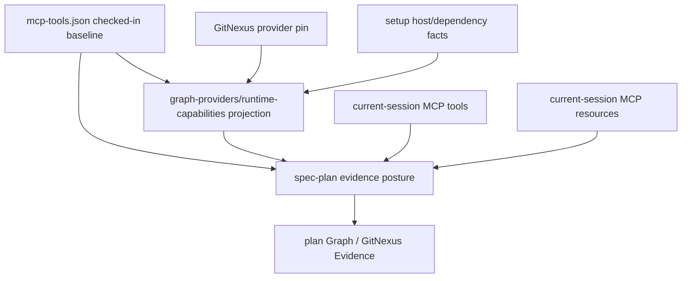

# feat: Define GitNexus capability catalog and resource provenance

## Summary

本计划覆盖 origin R33-R35：为 GitNexus 一等 capability 补上 checked-in baseline、source tag / verification posture、read-only MCP resource provenance，以及 setup projection 与 `$spec-plan` session-local probe 的边界。实施目标是让 GitNexus capability catalog 成为轻量 source input，而不是第二个 readiness truth 或隐藏 provider platform。

---

## Problem Frame

前置计划已经把 GitNexus evidence posture 接入 `$spec-plan`，并为 R21-R26 设计了 setup-owned capability metadata。剩余缺口在 R33-R35：如果没有一个稳定、轻量、可验证的 checked-in baseline，workflow 仍容易把某次 live MCP tool list、某个 setup projection、某个 provider pin 或某份资源清单误当成永久事实。

本切片要把 capability catalog 的职责拆清楚：checked-in baseline 只定义 capability 语义、候选 native tools/resources 和 fallback posture；`$spec-mcp-setup` 只写 observed availability / projection facts；`$spec-plan` 再结合当前 host 暴露的 MCP tools/resources 做 session-local probe，并由 LLM 判断本轮任务是否使用某个 native capability。脚本继续准备确定性 facts，LLM 继续做语义选择。

---

## Requirements

- R1. Capability catalog 必须记录 source tag 和 verification posture，最低 source tags 包括 `checked-in-baseline`、`setup-projection`、`provider-pin`、`live-mcp-tool`、`live-mcp-resource`、`session-local-inference`、`user-decision`。（origin R33, AE11）
- R2. Checked-in baseline 只能定义 capability 语义、候选 native tools/resources、mutation boundary 和 fallback posture；不得宣称当前 host 一定暴露这些能力，也不得成为 query readiness truth。（origin R33, R35）
- R3. GitNexus read-only MCP resources 必须作为一等 evidence surface 进入 catalog 与 `$spec-plan` guidance，和 tools 一样携带 provenance、freshness 和 limitations。（origin R34, AE13）
- R4. `$spec-mcp-setup` 可以消费 checked-in baseline 和 provider pin 来写 observed availability / projection facts，但 projection 不能成为第二个永久 capability registry。（origin R35, R21-R23）
- R5. `$spec-plan` 必须用 current-session tool/resource surface 复核 setup projection 与 checked-in baseline；当 baseline、projection、provider pin、live tool/resource surface 不一致时，按当前 verified surface 保守降级，不得 claim static catalog certainty。（origin R33-R35, AE11）
- R6. 本计划必须与 `docs/plans/2026-05-23-001-feat-gitnexus-setup-capability-metadata-plan.md` 对齐：如果该计划仍未实施，实施者应优先统一 source tag vocabulary；如果已部分实施，必须迁移到 origin R33 的最低 source tag 语义，避免 `source_tags` 出现两套含义。
- R7. mutation-capable surfaces 继续遵守 preview-first / explicit user action：catalog 可以记录候选 mutation surface，但 `$spec-plan` 不得把 `group_sync`、rename-like capability 或 workspace group mutation 写成自动 implementation step。（origin R-MUT1-R-MUT3, AE12）
- R8. Source 变更必须同步 focused contract tests、setup Bash/PowerShell parity tests、`$spec-plan` contract tests、用户文档或 runtime catalog 生成链路（如被修改），并更新 `CHANGELOG.md`。

**Origin actors:** A1 Developer, A2 `$spec-plan`, A3 GitNexus capability plugin, A4 Generic Code Intelligence Plugin protocol, A5 `$spec-graph-bootstrap`, A7 `$spec-mcp-setup`

**Origin flows:** F1 Plan lightweight intelligence probe, F2 Conditional deep dive, F3 Degraded but non-blocking planning, F5 Setup-owned capability projection, F6 Multi-repo workspace planning evidence

**Origin acceptance examples:** AE11 和 AE13 是本计划硬验收；AE7-AE8 通过与 R21-R26 setup projection 计划的兼容边界间接支持；AE12 的 mutation/scope guardrail 必须保持不回退。

---

## Assumptions

- A1. `skills/spec-mcp-setup/mcp-tools.json` 是 GitNexus provider pin 与 setup registry 的现有 checked-in source，因此本计划优先把 machine-readable baseline 增量放在该文件，而不是新增另一个永久 registry。
- A2. 新增 `docs/contracts/gitnexus-capability-catalog.md` 作为 human-readable contract 是可维护的：它解释 vocabulary 和 consumer rules，但 machine-readable baseline 仍来自 `mcp-tools.json`，避免多真相源。
- A3. 当前工作树出现了 R21-R26-shaped 的未提交 source edits，涉及 `skills/spec-mcp-setup/mcp-tools.json` 和 `skills/spec-mcp-setup/scripts/write-provider-config.sh`，并使用了 `registry-baseline` 等 setup-plan vocabulary。实施本计划时必须先判断这些 edits 是否继续保留，再把它们迁移或映射到 origin R33 的 source tag vocabulary；不能在两套语义之间继续叠加。

---

## Scope Boundaries

- 不把 GitNexus 内置到 spec-first，也不 fork、代理或重实现 GitNexus。
- 不新增复杂 Generic Code Intelligence provider 平台；catalog 是 GitNexus-native baseline 加轻量 source/provenance vocabulary。
- 不把 checked-in baseline、setup projection、live MCP surface 或 MCP resources 任意一个单独升级为永久事实。
- 不让 setup 运行 GitNexus query/analyze/status、Cypher、group sync、rename、provider repair、index rebuild、hooks、watchers 或 daemons。
- 不让 `$spec-plan` 静默执行 mutation-capable capability；只允许记录 limitation、risk、follow-up 或 explicit maintenance handoff。
- 不手改 `.claude/`、`.codex/`、`.agents/skills/` generated runtime mirrors。
- 不接入 `$spec-work`、`$spec-code-review` 或 `$spec-debug`；downstream adoption 继续作为后续切片。

### Deferred to Follow-Up Work

- Downstream workflow adoption：在 `$spec-plan` 和 setup projection 稳定后，再规划 `$spec-work`、`$spec-code-review`、`$spec-debug` 如何复用 source-tagged evidence posture。
- GitNexus group sync maintenance：如需真实 group sync，必须单独走 preview-first maintenance plan，不由本 catalog 或 Plan 自动执行。
- 非 GitNexus provider 泛化：只有当第二个 code intelligence provider 出现相同需求时，才考虑把 catalog 结构提升为 provider-neutral protocol。

---

## Graph Readiness

- target_repo: `spec-first`
- status: stale
- source_revision: `9641ff5cd69d6b50ef92c7ff2fba7d1424e9d5a5`
- current_revision: `9641ff5cd69d6b50ef92c7ff2fba7d1424e9d5a5`
- stale: true
- primary_providers: `code-review-graph`, `gitnexus`
- degraded_providers: none
- fallback_capabilities: direct source reads, focused `rg`, ast-grep, code-review-graph fallback where graph/provider evidence is insufficient
- runtime_mcp_evidence: current-session GitNexus `list_repos`, `query`, `group_list`, and read-only MCP resource/template discovery succeeded; `gitnexus://repo/spec-first/context` was read as session-local resource evidence
- confidence: high for direct source reads; medium for graph-assisted orientation
- limitations: compiled graph artifacts match `HEAD`, but current worktree is now dirty due to this plan/changelog plus overlapping uncommitted setup source edits in `skills/spec-mcp-setup/mcp-tools.json` and `skills/spec-mcp-setup/scripts/write-provider-config.sh`. Current-session live MCP tool/resource surface is evidence for this planning run only and must not be written back as canonical readiness or treated as static provider capability truth.

---

## Graph / GitNexus Evidence

- provider: GitNexus
- native_tool_or_resource: `list_repos`, `query`, `group_list`, `gitnexus://repos`, `gitnexus://repo/{name}/context`, `gitnexus://repo/{name}/schema`, `gitnexus://repo/{name}/processes`, `gitnexus://group/{name}/contracts`, `gitnexus://group/{name}/status`
- repo_scope: `spec-first`
- capability_status: partial
- evidence_grade: session-local
- evidence_posture: fallback
- freshness_state: dirty-advisory
- source_contract_fields: `.spec-first/graph/graph-facts.json.source_revision`, `.spec-first/graph/provider-status.json.providers[].query_ready`, `.spec-first/providers/gitnexus/status.json.bootstrap_fingerprint.provider.configured_package_spec`, `docs/contracts/graph-evidence-policy.md`, `docs/contracts/graph-provider-consumption.md`, `docs/contracts/workspace-gitnexus-consumption.md`
- source_reads_required: mandatory
- impact_on_plan: live MCP evidence confirmed that current host exposes both tools and read-only resources, while source reads confirmed existing contracts already warn against static catalog certainty and current worktree edits already started a setup projection path with a conflicting source-tag vocabulary. Implementation units therefore split catalog baseline, setup projection, and Plan session probe into separate responsibilities, with vocabulary reconciliation as an explicit prerequisite.
- capabilities_used: repository registry, query/orientation, group discovery, read-only resource discovery, repo context resource read
- key_findings: current resource context lists `query/context/impact/detect_changes/rename/cypher/list_repos` and read-only resources/templates; the current host tool surface also exposes specialized route/API/shape/tool-map capabilities. This mismatch is exactly why R33-R35 require source tags and verification posture instead of a single static surface list.
- limitations: `group_list` returned no configured groups, so group resources are recorded as candidate surfaces rather than current group-ready evidence. Current graph evidence is dirty-advisory because overlapping setup source edits are uncommitted. No provider refresh, group sync, or mutation was run.

---

## Context & Research

### Relevant Code and Patterns

- `skills/spec-mcp-setup/mcp-tools.json` already pins `gitnexus@1.6.4` and contains coarse `provider_config.capabilities`; it is the natural checked-in machine baseline to extend with GitNexus-native catalog metadata.
- Current uncommitted edits already add a `provider_config.native_capabilities` object in `skills/spec-mcp-setup/mcp-tools.json`, but it uses `native_surfaces` and prior setup-plan source tags such as `registry-baseline`, `host-config`, `dependency-ready`, and `workspace-advisory`. R33 requires reconciling that vocabulary before implementation can be considered complete.
- `skills/spec-mcp-setup/scripts/write-provider-config.sh` and `skills/spec-mcp-setup/scripts/write-provider-config.ps1` write setup-owned `.spec-first/config/graph-providers.json` and `.spec-first/config/runtime-capabilities.json`. They must project observed availability without becoming semantic routers.
- Current uncommitted edits modify only the Bash writer, not the PowerShell writer, so parity is an immediate implementation risk if those edits are retained.
- `skills/spec-plan/references/graph-evidence-posture.md` already requires live surface verification, read-only MCP resources, `native_tool_or_resource`, and a warning not to claim static durable catalog truth.
- `skills/spec-plan/references/plan-template.md` is the source of truth for the `## Graph / GitNexus Evidence` block fields.
- `docs/contracts/graph-evidence-policy.md`, `docs/contracts/graph-provider-consumption.md`, and `docs/contracts/workspace-gitnexus-consumption.md` already define the four-axis Plan envelope, canonical artifact boundary, live MCP session-local evidence, and multi-repo mutation/scope guardrails.
- `scripts/generate-runtime-capability-catalog.js` and `tests/unit/runtime-capability-catalog.test.js` protect the existing runtime capability catalog from becoming a readiness source. If implementation changes generated catalog content, it must update the generator and regenerate output.
- `tests/unit/spec-plan-contracts.test.js`, `tests/unit/mcp-setup.sh`, `tests/unit/mcp-setup-powershell-contracts.test.js`, `tests/unit/graph-provider-consumption-contracts.test.js`, and `tests/unit/workspace-gitnexus-contracts.test.js` are the closest focused regression surfaces.

### Institutional Learnings

- `docs/plans/2026-05-22-002-feat-gitnexus-plan-evidence-plan.md` intentionally deferred durable catalog work and added read-only MCP resources only as session-local Plan evidence.
- `docs/plans/2026-05-23-001-feat-gitnexus-setup-capability-metadata-plan.md` designs setup-owned native capability availability, but its `source_tags` vocabulary must be reconciled with origin R33 before implementation.
- `docs/solutions/workflow-issues/modify-source-not-artifacts-2026-04-13.md` reinforces source-first edits and no manual runtime mirror patching.
- `docs/solutions/workflow-issues/host-entrypoint-mapping-source-boundary-2026-04-29.md` warns against duplicating host-specific runtime mapping in ordinary prose; catalog wording should talk about current host surfaces without hardcoding Claude/Codex entrypoint tables.
- `docs/10-prompt/结构化项目角色契约.md` requires Light contract, Explicit boundaries, Scripts prepare facts, LLM decides. This plan keeps catalog/projection/probe as evidence inputs, not semantic authority.

### External References

- No external research was used. The target is an internal workflow/contract design grounded in repository contracts, current GitNexus provider pin, current MCP tool/resource surface, and prior spec-first plans.

---

## Key Technical Decisions

| Question | Chosen answer | Source tag | Consequence |
| --- | --- | --- | --- |
| Where should the machine-readable checked-in baseline live? | Extend `skills/spec-mcp-setup/mcp-tools.json` GitNexus entry with `provider_config.native_capabilities` rather than create a separate registry file. | confirmed | Reuses existing provider pin/setup registry source; avoids second permanent capability registry. |
| Where should source tag semantics be documented? | Add a small `docs/contracts/gitnexus-capability-catalog.md` and cross-link from existing graph evidence/provider contracts. | confirmed | Human-readable contract explains boundaries; machine baseline remains in setup registry. |
| How should R33 source tags relate to the prior setup plan vocabulary? | Use origin R33 tags as the public Plan/catalog source tags; rename or map any setup-internal tags so `source_tags` does not carry two meanings. | confirmed | Implementation must reconcile `docs/plans/2026-05-23-001-feat-gitnexus-setup-capability-metadata-plan.md` before or during code changes. |
| Are read-only MCP resources equivalent to tools? | They are equivalent evidence surfaces for provenance/freshness purposes, but not equivalent execution capabilities. | session-local | Catalog entries must separate `native_tools[]` and `native_resources[]`, and `$spec-plan` must report which one was actually used. |
| Can setup projection prove live MCP availability? | No. It can report setup-inferred observed availability and provider pin facts; `$spec-plan` still verifies current-session tool/resource surface before making live claims. | confirmed | R35 boundary stays intact and setup does not become a semantic router. |
| Should capability status and source tags be inferred by script or LLM? | Scripts compute deterministic availability/source facts; LLM decides task relevance, deep-dive choice, and whether limitations reduce plan confidence. | confirmed | Keeps Scripts prepare, LLM decides boundary. |
| How should mutation-capable surfaces appear? | Catalog can record them with mutation boundary, but Plan marks them `mutation-gated` or `policy-blocked` and never emits automatic mutation steps. | confirmed | Preserves scope authority and preview-first behavior. |

---

## Open Questions

### Resolved During Planning

- Should checked-in baseline be a new source outside setup registry? No. `mcp-tools.json` already owns provider pin and setup registry facts, so adding a second machine registry would violate R35.
- Should setup projection copy the baseline exactly? No. It should project observed availability and source/provenance facts derived from baseline, provider pin, host config/dependency facts, and prior/current setup evidence.
- Should `$spec-plan` trust setup projection without a live probe? No for live surface claims. Projection can help select candidate tools/resources, but live tool/resource claims require current-session evidence or must be labeled as setup-inferred.
- Should resources be read automatically for every Plan? No. Resource discovery is part of lightweight posture when graph/MCP surface is relevant; deep resource reads should be task-matched and bounded.
- Should `source_tags` accept arbitrary provider strings? No. Keep the public vocabulary closed enough for tests, with a separate freeform `source_notes` or `limitations` field if implementation needs explanatory prose.

### Deferred to Implementation

- Exact JSON field names for optional explanatory fields such as `source_notes` versus `verification_notes`, as long as the required source tag vocabulary and verification posture remain test-locked.
- Whether to update the active R21-R26 plan document directly before code work, or to encode the reconciliation only in source contracts. Implementation should choose the smallest path that prevents conflicting tests or handoff guidance.
- Whether the current uncommitted Bash/setup edits should be treated as the starting implementation or replaced. This is execution-time scope control for `$spec-work`; the plan requirement is that retained edits must be source-tag compatible and Bash/PowerShell parity-safe.

---

## High-Level Technical Design

> *This illustrates the intended approach and is directional guidance for review, not implementation specification. The implementing agent should treat it as context, not code to reproduce.*

The baseline defines what a capability means. Setup projection records what setup can infer. `$spec-plan` verifies what the current session actually exposes and decides whether those surfaces matter for the current task.

---

## Implementation Units

### U1. Lock source tag vocabulary and catalog boundary

**Goal:** Establish the R33-R35 vocabulary and ownership boundary before changing setup projection or Plan prose.

**Requirements:** R1, R2, R4, R5, R6, R7

**Dependencies:** None

**Files:**
- Create: `docs/contracts/gitnexus-capability-catalog.md`
- Modify: `docs/contracts/graph-evidence-policy.md`
- Modify: `docs/contracts/graph-provider-consumption.md`
- Modify: `docs/contracts/workspace-gitnexus-consumption.md`
- Test: `tests/unit/graph-provider-consumption-contracts.test.js`
- Test: `tests/unit/workspace-gitnexus-contracts.test.js`
- Test: `tests/unit/gitnexus-capability-catalog-contracts.test.js`

**Approach:**
- Define the public source tag vocabulary required by origin R33: `checked-in-baseline`, `setup-projection`, `provider-pin`, `live-mcp-tool`, `live-mcp-resource`, `session-local-inference`, `user-decision`.
- Treat verification posture as a derived view over `source_tags` plus current-session live verification state, not a parallel enum. Catalog/Plan prose may use descriptive phrases (e.g., "baseline-only", "setup-inferred", "live-verified", "resource-verified", "conflict-degraded", "user-confirmed") to summarize that derivation, but they are not a separate locked vocabulary and must not appear as a closed enum field. New posture terms only enter the contract when a consumer test demonstrates the existing source tags cannot express the case.
- State explicitly that checked-in baseline is source input, setup projection is observed availability, live MCP surface is session-local evidence, and `$spec-plan` is the semantic consumer.
- Reconcile the prior R21-R26 plan vocabulary by requiring either a direct rename/mapping or contract wording that prevents `source_tags` from meaning both setup-internal signals and Plan/catalog source tags.
- Keep mutation-capable capability wording aligned with existing `mutation-gated` / preview-first contracts.

**Patterns to follow:**
- `docs/contracts/graph-evidence-policy.md` Plan envelope validity matrix.
- `docs/contracts/graph-provider-consumption.md` Consumer Rules and forbidden compatibility reads.
- `docs/contracts/workspace-gitnexus-consumption.md` group/registry evidence and mutation boundary.

**Test scenarios:**
- Happy path: contract tests find all seven required source tags and assert the checked-in baseline is not canonical readiness truth.
- Edge case: tests assert setup projection and live MCP evidence are separate source tags and cannot be collapsed into one `available` fact.
- Error path: tests assert arbitrary/unknown `source_tags` are rejected or documented as non-public extension fields.
- Integration: workspace contract tests continue to mark `group_sync` and rename-like surfaces as explicit/preview-first only.

**Verification:**
- Contract tests prove the new catalog boundary is readable and does not conflict with existing Graph Readiness or four-axis Plan envelope semantics.

---

### U2. Add checked-in GitNexus native capability baseline

**Goal:** Add a machine-readable GitNexus-native capability baseline that defines semantics, candidate tools/resources, mutation boundary, and fallback posture without claiming current availability.

**Requirements:** R1, R2, R3, R7

**Dependencies:** U1

**Files:**
- Modify: `skills/spec-mcp-setup/mcp-tools.json`
- Modify: `skills/spec-mcp-setup/references/supported-mcp-tools.md`
- Test: `tests/unit/mcp-setup.sh`
- Test: `tests/unit/mcp-setup-powershell-contracts.test.js`
- Test: `tests/unit/gitnexus-capability-catalog-contracts.test.js`

**Approach:**
- Add or align `provider_config.native_capabilities` for GitNexus using the capability keys already selected by the R21-R26 setup metadata plan: `query`, `context`, `impact`, `route_api_evidence`, `shape_check`, `cypher`, `tool_map`, `repo_registry`, `workspace_group`.
- For each capability, record only stable baseline fields: `meaning`, candidate `native_tools[]`, candidate `native_resources[]`, `mutation_boundary`, `fallback_posture`, and baseline `source_tags[]` containing `checked-in-baseline` plus `provider-pin` when the candidate surface depends on the pinned GitNexus package.
- Include read-only MCP resource templates for repo context, schema, processes, process trace, group contracts, and group status where they are candidate evidence surfaces.
- Keep specialized route/API/shape/tool-map capabilities as candidate tools even when a resource context omits them; this preserves origin R2/R8 while forcing live verification before Plan uses them.
- Avoid putting task results, query snippets, provider raw logs, current session availability, or semantic routing decisions into the checked-in baseline.

**Patterns to follow:**
- Existing GitNexus `provider_config.capabilities` in `skills/spec-mcp-setup/mcp-tools.json`.
- Current `skills/spec-plan/references/graph-evidence-posture.md` native capability selection matrix.

**Test scenarios:**
- Happy path: tests assert every required capability key has `meaning`, `native_tools` or `native_resources`, `mutation_boundary`, `fallback_posture`, and required baseline source tags.
- Covers AE13. Happy path: tests assert read-only MCP resources/templates are represented separately from tools.
- Edge case: tests assert `workspace_group` can include read-only group resources while group sync remains outside automatic Plan/setup execution.
- Error path: tests assert no checked-in baseline field claims `query_ready`, live availability, current group readiness, or task-level evidence.

**Verification:**
- Machine-readable baseline exists in the setup registry source and can be consumed by setup/Plan without inventing another registry.

---

### U3. Project observed availability without creating a second registry

**Goal:** Let `$spec-mcp-setup` project source-tagged observed availability from the baseline while preserving R35's "setup projection is not the permanent catalog" boundary.

**Requirements:** R1, R4, R6, R8

**Dependencies:** U1, U2

**Files:**
- Modify: `skills/spec-mcp-setup/scripts/write-provider-config.sh`
- Modify: `skills/spec-mcp-setup/scripts/write-provider-config.ps1`
- Modify: `skills/spec-mcp-setup/SKILL.md`
- Modify: `skills/spec-mcp-setup/references/supported-mcp-tools.md`
- Test: `tests/unit/mcp-setup.sh`
- Test: `tests/unit/mcp-setup-powershell-contracts.test.js`

**Approach:**
- Project GitNexus native capabilities into setup-owned config as observed availability facts, retaining source tags that explain whether the fact came from checked-in baseline, provider pin, setup projection, host/dependency detection, prior projection, or current setup.
- If implementation uses fields from the prior R21-R26 plan (`source_provenance`, availability status, mutation boundary), map them to the R33 source tag vocabulary instead of maintaining a competing `source_tags` vocabulary.
- Keep setup projection additive in `.spec-first/config/graph-providers.json` and `.spec-first/config/runtime-capabilities.json`; do not write `.spec-first/graph/*`, `.spec-first/providers/*`, `.spec-first/impact/*`, or workspace advisory truth.
- Ensure setup records resources as candidate/observed availability when they are inferable from baseline/provider pin, but does not call or read MCP resources.
- Preserve command metadata for graph-bootstrap use without executing GitNexus analyze/status/query/group sync from setup.

**Execution note:** Characterize current setup projection output before changing the writers, then update Bash and PowerShell parity together.

**Patterns to follow:**
- Existing writer parity between `write-provider-config.sh` and `write-provider-config.ps1`.
- Existing tests around `runtime-capabilities.json.project_graph_readiness` and `graph-providers.json.derived_readiness`.

**Test scenarios:**
- Happy path: setup writes native capability projection with source tags including `checked-in-baseline`, `provider-pin`, and `setup-projection` where applicable.
- Edge case: when provider setup is not ready, projection keeps baseline candidates but marks observed availability as unavailable/unknown with limitations; it does not delete baseline semantics.
- Error path: setup output and logs do not include GitNexus query/analyze/status, group sync, Cypher, rename, provider repair, or live MCP resource reads.
- Integration: Bash and PowerShell outputs agree on field names, source tags, mutation boundary, and R35 limitations.

**Verification:**
- Setup projection can help `$spec-plan` select candidates, but tests prove it remains setup-owned availability facts rather than canonical graph readiness.

---

### U4. Teach spec-plan to verify tool and resource surfaces with provenance

**Goal:** Update `$spec-plan` guidance so it consumes checked-in baseline and setup projection as inputs, then verifies current live tool/resource surface before making capability claims.

**Requirements:** R1, R3, R5, R6, R7

**Dependencies:** U1, U2; U3 for full setup projection consumption, but `$spec-plan` should degrade cleanly when projection is absent

**Files:**
- Modify: `skills/spec-plan/SKILL.md`
- Modify: `skills/spec-plan/references/graph-evidence-posture.md`
- Modify: `skills/spec-plan/references/plan-template.md`
- Test: `tests/unit/spec-plan-contracts.test.js`

**Approach:**
- Extend the Graph/GitNexus evidence posture guidance so Plan reads source-tagged baseline/projection when present, but labels those as `checked-in-baseline` or `setup-projection` rather than live proof.
- Require current-session live tool/resource verification for claims tagged `live-mcp-tool` or `live-mcp-resource`; if live surface is missing or contradictory, Plan must choose conservative fallback and record `conflict-degraded` or equivalent limitation.
- Treat read-only MCP resources as first-class `native_tool_or_resource` values, not just background context. Plan should name specific resources/templates when they materially shape orientation or deep dive.
- Keep no-graph/no-MCP fast unavailable behavior intact: do not enumerate static catalog capabilities when no graph artifacts and no current GitNexus surface exist.
- Preserve LLM-owned native capability selection. The catalog helps choose candidates; it does not route tasks deterministically.

**Patterns to follow:**
- Existing `references/graph-evidence-posture.md` selection matrix and source_reads_required rule.
- Existing `plan-template.md` Graph / GitNexus Evidence block.

**Test scenarios:**
- Covers AE11. Happy path: skill/reference tests assert baseline/projection/live tool/live resource source tags are all represented and that live claims require live surface verification.
- Covers AE13. Happy path: tests assert read-only MCP resources can appear in `native_tool_or_resource` and must carry provenance/freshness.
- Edge case: tests assert setup projection `available` plus missing current live surface cannot be written as live-verified availability.
- Error path: tests assert no-graph/no-MCP fast unavailable path still skips static catalog enumeration.
- Integration: plan template remains ordered as `Graph Readiness` then `Graph / GitNexus Evidence` then `Context & Research`.

**Verification:**
- `$spec-plan` source can explain why a capability was selected, why a live probe is required, and how resource evidence affects plan confidence without turning catalog into semantic authority.

---

### U5. Update user-facing docs and generated catalog only where the delivery surface changes

**Goal:** Surface the new catalog/provenance boundary to users and maintainers without duplicating setup or Plan instructions across docs.

**Requirements:** R3, R4, R5, R8

**Dependencies:** U1-U4

**Files:**
- Modify: `README.md`
- Modify: `README.zh-CN.md`
- Modify: `docs/05-用户手册/04-workflows-artifacts-map.md`
- Modify: `docs/05-用户手册/05-最佳实践.md`
- Modify: `docs/05-用户手册/13-代码图谱Provider作用域与差异化.md`
- Modify if needed: `scripts/generate-runtime-capability-catalog.js`
- Modify if needed: `docs/catalog/runtime-capabilities.md`
- Test: `tests/unit/user-manual-contracts.test.js`
- Test if generator changes: `tests/unit/runtime-capability-catalog.test.js`

**Approach:**
- Explain the user-visible boundary briefly: checked-in baseline lists candidate GitNexus capabilities; setup projection reports observed availability; Plan verifies live tool/resource surface and writes limitations.
- Avoid host-specific command mapping in ordinary prose. Use current-host wording unless editing a centralized entrypoint table.
- Update generated runtime catalog only if implementation changes what runtime delivery exposes. If so, modify `scripts/generate-runtime-capability-catalog.js` and regenerate `docs/catalog/runtime-capabilities.md`; do not hand-edit generated catalog output alone.
- Keep docs focused on how to read evidence, not a full copy of the source tag schema.

**Patterns to follow:**
- Existing Graph / GitNexus Evidence docs in the README and user manual.
- `docs/solutions/workflow-issues/host-entrypoint-mapping-source-boundary-2026-04-29.md`.

**Test scenarios:**
- Happy path: user manual tests assert docs mention baseline/projection/live resource verification without treating any one as readiness truth.
- Edge case: tests assert ordinary docs do not duplicate Claude/Codex entrypoint mapping outside existing centralized tables.
- Error path: runtime catalog freshness test fails if generated output is hand-edited without generator changes.

**Verification:**
- User-facing docs explain why GitNexus capabilities can be listed, setup-inferred, and still require Plan live verification.

---

## System-Wide Impact

- **Interaction graph:** `mcp-tools.json` baseline feeds setup projection writers; setup projection feeds `$spec-plan` evidence posture; user docs explain the distinction. Graph readiness artifacts remain owned by `$spec-graph-bootstrap`.
- **Error propagation:** Missing baseline fields should fail contract tests. Missing setup projection should degrade `$spec-plan` to live probe or direct source reads. Missing live MCP surface should not invalidate checked-in baseline; it only lowers current Plan evidence confidence.
- **State lifecycle risks:** `.spec-first/config/*` projection is generated setup state and may go stale by provider pin or host config drift. Consumers must reuse existing provider projection/fingerprint freshness checks rather than introduce TTL.
- **API surface parity:** Bash and PowerShell setup writers must project the same fields. Claude/Codex runtime mirrors are regenerated from source only when needed.
- **Integration coverage:** Unit contract tests should cover source contracts, setup projection JSON shape, spec-plan guidance, user manual wording, and runtime catalog freshness if touched.
- **Unchanged invariants:** `Graph Readiness.status`, provider `query_ready`, workspace `query_usability`, and impact capability support levels remain independent from capability catalog availability.

---

## Risks & Dependencies

| Risk | Mitigation |
| --- | --- |
| Catalog becomes a second readiness truth | Keep baseline fields semantic/candidate-only; setup projection observed-only; Plan live proof session-local only. Contract tests assert no `query_ready` or task results in baseline. |
| Source tag vocabulary conflicts with active R21-R26 setup plan | Make U1 resolve vocabulary first and require implementation to map/rename setup-internal provenance before changing writers. |
| Resource surface is over-claimed from one session | Tag live resources as `live-mcp-resource` and session-local; require provider pin/setup projection recheck and current live surface verification. |
| Setup accidentally probes GitNexus while projecting capabilities | U3 tests assert setup does not run query/analyze/status/group sync/Cypher/resource reads. |
| Plan expands scope from GitNexus findings | Preserve existing scope authority rule; extra symbols/repos/resources are risk or follow-up candidates unless user changes scope. |
| Generated docs drift | Modify generator before generated catalog output, and keep runtime catalog as delivery surface documentation, not readiness source. |
| Current overlapping setup edits are mistaken for validated implementation | Treat current `mcp-tools.json` / Bash writer edits as unreviewed execution input only. If retained, they need PowerShell parity, focused tests, and a source-change changelog entry during `$spec-work`; this plan's changelog entry only records the plan artifact. |

---

## Documentation / Operational Notes

- `CHANGELOG.md` must include this source change and mark user-visible docs/workflow behavior changes.
- The current overlapping implementation-shaped edits in setup source files are not validated by this plan write. If `$spec-work` keeps them, that work must add or update its own source-change `CHANGELOG.md` entry and verification evidence.
- Runtime regeneration is not required just to create this plan. Implementation that changes source skills/templates and needs host runtime parity should use `spec-first init --claude|--codex` rather than hand-editing generated mirrors.
- Agent/skill prose changes should be verified with source-level contract tests and, when behavior semantics matter, a fresh-source eval or a recorded reason why it was not executed.

---

## Sources & References

- **Origin document:** [docs/brainstorms/2026-05-22-001-gitnexus-first-class-capability-plugin-requirements.md](../brainstorms/2026-05-22-001-gitnexus-first-class-capability-plugin-requirements.md)
- Prior plan: [docs/plans/2026-05-22-002-feat-gitnexus-plan-evidence-plan.md](2026-05-22-002-feat-gitnexus-plan-evidence-plan.md)
- Adjacent active plan: [docs/plans/2026-05-23-001-feat-gitnexus-setup-capability-metadata-plan.md](2026-05-23-001-feat-gitnexus-setup-capability-metadata-plan.md)
- Contracts: `docs/contracts/graph-evidence-policy.md`, `docs/contracts/graph-provider-consumption.md`, `docs/contracts/workspace-gitnexus-consumption.md`
- Setup source: `skills/spec-mcp-setup/mcp-tools.json`, `skills/spec-mcp-setup/scripts/write-provider-config.sh`, `skills/spec-mcp-setup/scripts/write-provider-config.ps1`
- Plan source: `skills/spec-plan/SKILL.md`, `skills/spec-plan/references/graph-evidence-posture.md`, `skills/spec-plan/references/plan-template.md`
- GitNexus session-local evidence: `list_repos`, `query`, `group_list`, `gitnexus://repo/spec-first/context`, MCP resource/resource-template discovery

---

## Deferred / Open Questions

### From 2026-05-23 review

- **Plan creates concurrent scope with still-active Plan 001 on identical files and vocabulary** — Requirements R6 / Assumptions A3 / U1-U4 file lists (P1, scope-guardian, confidence-first 100)

  Plan 001 (R21-R26) is `status: active` and unimplemented, with uncommitted edits already shaping `mcp-tools.json` and `write-provider-config.sh`. Plan 002 modifies the same files (`mcp-tools.json`, `write-provider-config.sh/.ps1`, `skills/spec-plan/SKILL.md`, `graph-evidence-posture.md`, `docs/contracts/graph-provider-consumption.md`) and re-defines `provider_config.native_capabilities` plus a different closed `source_tags[]` enum than Plan 001 already locked. Two unimplemented plans both lock conflicting test contracts on the same JSON object means whichever lands second has to re-tear-down the first plan's vocabulary tests. Right-sized delivery is a single merged plan, not two plans negotiating reconciliation in implementation.

  <!-- dedup-key: section="requirements r6 assumptions a3 u1u4 file lists" title="plan creates concurrent scope with stillactive plan 001 on identical files and vocabulary" evidence="plan 002 r1 capability catalog 必须记录 source tag 最低 source tags 包括 checkedinbaseline setupprojection providerpin livemcptool" -->

- **U1 七元 source-tag vocabulary 与既有 R21-R26 锁定 enum 直接冲突，迁移路径未定义** — Implementation Units → U1; Requirements R1, R6 (P1, feasibility, confidence-first 75)

  U1 把 R33 公共 source-tag 词表落到 `checked-in-baseline / setup-projection / provider-pin / live-mcp-tool / live-mcp-resource / session-local-inference / user-decision`，但 R21-R26 已在 `tests/unit/mcp-setup.sh:1067` 把 `providers.gitnexus.native_capabilities[].source_tags[]` 的闭合 enum 锁成 `registry-baseline | provider-pin | host-config | dependency-ready | setup-projection | workspace-advisory`，并由 `write-provider-config.sh`/`write-provider-config.ps1` 当前未提交编辑硬编码。`registry-baseline → checked-in-baseline` 是直接 rename，而 `host-config / dependency-ready / workspace-advisory` 在 R33 词表里没有对位，新增 `live-mcp-tool / live-mcp-resource / session-local-inference / user-decision` 是 Plan-side 标签且不能由 setup 写入。U1 "实施者应优先统一 vocabulary" 没有说明：保留两套词表（setup 内部 vs 公共 catalog/Plan）、彻底替换、还是把 setup 输出搬到不同字段名。三种方案影响的测试文件、写入器分支与 Plan envelope 映射完全不同，实施者无法直接开工。

  <!-- dedup-key: section="implementation units u1 requirements r1 r6" title="u1 七元 sourcetag vocabulary 与既有 r21r26 锁定 enum 直接冲突，迁移路径未定义" evidence="docsplans20260523002featgitnexuscapabilitycatalogplanmd28 r1 列出七元 sourcetag 词表" -->

- **U2 计划在 registry 加 `source_tags[]` 并把 `native_surfaces[]` 拆成 `native_tools[]` / `native_resources[]`，但与当前 registry 字段集 lock 冲突且未列出 schema migration 边界** — Implementation Units → U2; Key Technical Decisions 表第 4 行 (P1, feasibility, confidence-first 75)

  U2 Approach 写明每个 capability 要 "record stable baseline fields: `meaning`, candidate `native_tools[]`, candidate `native_resources[]`, `mutation_boundary`, `fallback_posture`, and baseline `source_tags[]` containing `checked-in-baseline` plus `provider-pin`"。当前 registry 现状是单一 `native_surfaces[]`，且 `tests/unit/mcp-setup.sh:297` 把 GitNexus capability 的字段集合精确锁为 `fallback_posture,meaning,mutation_boundary,native_surfaces`。Bash writer line 94、PowerShell writer line 699-705 都直接读 `metadata.native_surfaces`；R21-R26 locked contract 又明确说 registry 不存 source_tags。U2 同时要求字段拆分、字段重命名、字段新增并保留 R21-R26 兼容性，却没有列出 (a) 是否保留 `native_surfaces[]` 作 backwards-compat shim、(b) `source_tags` 进 registry 后 R21-R26 "registry 不存 source_tags" 锁条款怎么处理、(c) Bash/PS writer 在 `metadata.native_surfaces` 缺失时的回退路径。implementer 无法在不重写 mcp-tools.json + 双 writer + 至少 3 个测试文件的情况下保持 R21-R26 与 R33 同时通过。

  <!-- dedup-key: section="implementation units u2 key technical decisions 表第 4 行" title="u2 计划在 registry 加 sourcetags 并把 nativesurfaces 拆成 nativetools nativeresources，但与当前 registry 字段集 lock 冲突且未列出 schema migration 边界" evidence="docsplans20260523002featgitnexuscapabilitycatalogplanmd140 decision 分离 nativetools 与 nativeresources" -->

- **Key Technical Decisions "Source tag" column conflicts with the seven-tag vocabulary the plan itself defines** — Key Technical Decisions (P2, coherence, confidence-first 75)

  Implementers and reviewers reading this plan are told the public source-tag vocabulary is exactly seven values (`checked-in-baseline`, `setup-projection`, `provider-pin`, `live-mcp-tool`, `live-mcp-resource`, `session-local-inference`, `user-decision`), and Decision Row 3 explicitly warns that `source_tags` must not carry two meanings. The same document then reuses a column literally labeled "Source tag" whose values (`confirmed`, `session-local`) are not in that vocabulary; `confirmed` is the evidence-grade alias from `graph-evidence-policy.md`, and `session-local` collides with the catalog tag `session-local-inference` while being spelled differently. A reader cannot tell whether the table is asserting catalog source tags or plan-envelope decision provenance, which is exactly the dual-meaning hazard R6/U1 say to prevent.

  <!-- dedup-key: section="key technical decisions" title="key technical decisions source tag column conflicts with the seventag vocabulary the plan itself defines" evidence="r1 capability catalog 必须记录 source tag 和 verification posture，最低 source tags 包括 checkedinbaseline、setupprojection、providerpin、l" -->

- **U5 docs file list overlaps Plan 001 U4 docs scope** — U5 Files (P2, scope-guardian, confidence-first 75)

  Plan 001 U4 explicitly claims README.md, README.zh-CN.md, and `docs/05-用户手册/04-workflows-artifacts-map.md` and warns later units not to re-edit them. Plan 002 U5 lists the same three files plus two more user-manual docs. With both plans active, both edits target the same prose with different vocabularies (`registry-baseline` vs. `checked-in-baseline`). Whichever lands second has to revisit the same paragraphs. This is a concrete consequence of the broader Plan 001 / Plan 002 split.

  <!-- dedup-key: section="u5 files" title="u5 docs file list overlaps plan 001 u4 docs scope" evidence="plan 001 u4 files modify readmemd readmezhcnmd docs05用户手册04workflowsartifactsmapmd" -->

- **Reconciliation strategy with active Plan 001 deferred to implementation** — Open Questions / Deferred to Implementation (P2, scope-guardian, confidence-first 75)

  Plan 002 explicitly leaves the choice of whether to amend Plan 001 or only encode reconciliation in source contracts to `$spec-work` execution time. That is a scope decision, not an implementation detail: it determines whether two plan documents diverge on the same locked JSON contract or one is rewritten. Deferring it means the implementing agent will hit the conflict mid-work without an authoritative decision, and tests locked by either plan will block merge until the question is answered. Scope decisions belong in the plan, not in execution.

  <!-- dedup-key: section="open questions deferred to implementation" title="reconciliation strategy with active plan 001 deferred to implementation" evidence="plan 002 deferred to implementation whether to update the active r21r26 plan document directly before code work or to encode" -->

- **U2 candidate-resource list diverges from the Graph / GitNexus Evidence resource list (adds `process trace`, drops `repos`)** — Implementation Units → U2 Approach (line 253) vs Graph / GitNexus Evidence (line 90) (P2, coherence, confidence-first 75)

  An implementer building `provider_config.native_capabilities` from U2 will either invent a `process_trace` resource template that the plan never claims was probed (line 90 lists no such template) or omit `gitnexus://repos` despite it being live-verified, causing the checked-in baseline to disagree with the very session-local evidence the plan cites for it. Catalog/evidence drift is exactly the dual-source-of-truth failure R2/R5 try to prevent.

  <!-- dedup-key: section="implementation units u2 approach line 253 vs graph gitnexus evidence line 90" title="u2 candidateresource list diverges from the graph gitnexus evidence resource list adds process trace drops repos" evidence="line 90 nativetoolorresource gitnexusrepos gitnexusrepoonamecontext gitnexusreponameschema gitnexusreponameprocesses gitnexusgrou" -->
