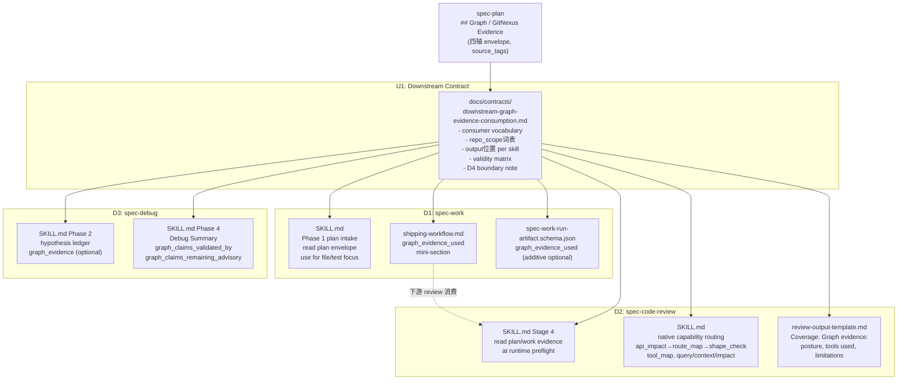

# feat: GitNexus downstream workflow 深度接入（spec-work / spec-code-review / spec-debug）

## Summary

本计划实现 `docs/brainstorms/2026-05-22-003-gitnexus-downstream-workflows-deep-integration.md` 定义的 R19 companion，把 `$spec-plan` 已经产出的 `Graph / GitNexus Evidence` envelope 向下游三个 workflow 传递：`$spec-work`（D1）、`$spec-code-review`（D2）、`$spec-debug`（D3）。D4 mutation-gated maintenance path 只以 boundary doc 形式落地，不进入普通 workflow。

核心思路：先建立轻量共享契约（U1），再逐 skill 补强消费 prose 和输出结构（U2-U7），最后同步文档（U8）。三个 downstream skill 消费 plan/work 输出的 evidence envelope，用于缩小读码范围、改善 review coverage 和提升 debug hypothesis quality。GitNexus 仍不拥有 scope authority，图谱发现的额外影响面进入 risk/follow-up 而非静默实现。

**本计划是 `$spec-plan` 一等接入（plan-002）的 follow-up 接入切片**，依赖 `docs/contracts/graph-evidence-policy.md`、`docs/contracts/graph-provider-consumption.md` 和 `docs/contracts/workspace-gitnexus-consumption.md` 的既有 vocabulary；不重新发明 evidence 语义。

---

## Problem Frame

`$spec-plan` 已经能输出完整的 `## Graph / GitNexus Evidence` block（capability_status / evidence_grade / evidence_posture / freshness_state 四轴）。但当执行进入 `$spec-work` 时，这些证据没有被消费：work 执行者仍然需要自己重新判断哪些文件需要读、哪些测试需要运行、哪些影响面需要关注。`$spec-code-review` 对 diff 的 graph-heavy 场景（route/API/shape 变更）缺少首选 native capability 的明确路由；Coverage section 也没有统一的 graph evidence posture 披露位置。`$spec-debug` 在 hypothesis ledger 中没有 graph evidence 的挂载点，root cause 确认规则也没有明确说明 GitNexus evidence 只能辅助，不能替代 reproduction/source/test/log 证明。

目标不是让 downstream workflow 变得依赖 GitNexus，而是让它们在 GitNexus 可用时利用好 plan-produced evidence，在 unavailable/stale 时以统一姿态降级——既不过度承诺图谱证据，也不静默丢弃已有的 evidence 输入。

---

## Requirements

- R1. 必须定义一个轻量共享契约（`docs/contracts/downstream-graph-evidence-consumption.md`），统一规范三个 downstream workflow 的 evidence 消费边界、输出结构和非法组合，避免各 skill 独立发明词汇。（see origin: AE-D1/AE-D2/AE-D3/AE-D4/AE-D5/AE-D6）
- R2. `$spec-work` 必须在执行阶段把 plan envelope 中的 GitNexus evidence 用于缩小 source reads 和 test selection，在 closeout/handoff 中以可读格式输出 `graph_evidence_used`；scope 不因图谱发现的额外影响面自动扩大。（see origin: AE-D1/AE-D2）
- R3. `$spec-work` 的 run-artifact schema 必须通过 additive optional `graph_evidence_used` 字段扩展，向下游 `$spec-code-review` 和 `$spec-compound` 传递 session-local 证据摘要，不破坏现有 fixtures。（see origin: AE-D1）
- R4. `$spec-code-review` 必须在 review preflight 阶段读取 plan/work evidence posture，并在 Coverage section 中以统一格式披露 graph evidence 状态（fresh/session-local/advisory/fallback）；degraded provider 只记录一次，不让各 persona 重复探测。（see origin: AE-D3/AE-D4）
- R5. `$spec-code-review` 必须为 graph-heavy diff（route/API/shape/tool surface）提供明确的 native capability 首选路由（`api_impact` → `route_map` → `shape_check`；tool diff → `tool_map`；symbol/reuse → `query`/`context`/`impact`），并在 finding evidence 中明确区分 graph-backed evidence 和 source-read-confirmed evidence。（see origin: AE-D3）
- R6. `$spec-debug` 的 hypothesis ledger 必须支持 `graph_evidence` 可选字段，并在 Debug Summary handoff 中说明哪些 graph claims 已被 reproduction/source/log/test 验证，哪些仍属 advisory。root cause 只有在 causal chain 被非图谱证据确认后才能声明。（see origin: AE-D5）
- R7. 所有 downstream workflow 在多仓 workspace 场景下必须遵守 target_repo / per-child scope 约束，即使 GitNexus group evidence 就绪也不允许越过此边界。（see origin: AE-D6）
- R8. mutation-capable capability（`workspace_group_sync`、`symbol_rename`）不得出现在任何 downstream workflow 的自动步骤；D4 只以契约 boundary note 形式存在，明确表达这些能力需要 preview-first explicit user action 才能进入专门 maintenance workflow。（see origin: brainstorm D4 non-goal）
- R9. 所有 source 变更必须同步 contract tests、CHANGELOG.md 和用户手册；不手改 generated runtime mirrors。

**Origin actors:** A1 Developer, A2 `$spec-plan`, A3 GitNexus capability plugin, A6 Downstream workflows (`$spec-work`, `$spec-code-review`, `$spec-debug`)

**Origin flows:** brainstorm D1 (spec-work consumer), D2 (code-review Coverage integration), D3 (debug hypothesis integration), D4 (mutation-gated boundary)

**Origin acceptance examples:** AE-D1, AE-D2, AE-D3, AE-D4, AE-D5, AE-D6

---

## Open Questions (Resolved During Planning)

| # | 问题 | 决策 |
|---|------|------|
| Q1 | 是否需要新增 shared helper 代码，还是只在各 workflow prose 中消费 plan envelope？ | **轻量契约（prose contract），无新代码 helper**。共享 vocabulary 放入新 contract doc。各 skill 独立在 prose 中消费。 |
| Q2 | `$spec-work` closeout 的 `graph_evidence_used` 是结构化字段还是人类可读文段？ | **两者均有**：prose closeout 加 mini-section；run-artifact schema 加 additive optional object。向下游提供机器可读数据，不破坏现有 fixtures。 |
| Q3 | code-review Coverage 中 graph evidence posture 映射到现有 reviewer JSON schema，还是只在 synthesis 输出中呈现？ | **只在 synthesis 输出（review-output-template.md Coverage section）呈现**。findings-schema.json 是 per-finding contract，不做变更。Coverage 是 review-wide summary，是正确的落点。 |
| Q4 | debug hypothesis ledger 需要固定字段还是保持轻量工作记录？ | **轻量可选字段**。`graph_evidence` 是 ledger entry 的可选字段，不强制。Debug Summary 加 `graph_claims_validated_by` 和 `graph_claims_remaining_advisory` prose，保持灵活。 |
| Q5 | 多仓 group evidence 在 downstream workflow 中是否需要统一 `repo_scope` 文案模板？ | **是**，在 U1 contract 中定义统一 `repo_scope` 取值词表，避免 group-ready 被误解成 write scope。三个 skill 的 prose 引用该词表。 |

---

## Assumptions

- A1. `$spec-plan` 的 `## Graph / GitNexus Evidence` block 已经 shipped（plan-002 completed），四轴 vocabulary（capability_status / evidence_grade / evidence_posture / freshness_state）已锁定在 `docs/contracts/graph-evidence-policy.md`。
- A2. `docs/contracts/workspace-gitnexus-consumption.md` 和 `docs/contracts/gitnexus-capability-catalog.md` 继续作为 canonical source；本计划只添加 downstream-facing complement，不重写现有契约。
- A3. D4 mutation-gated maintenance（group_sync、rename）在此计划中只做 boundary documentation，不进入任何 skill 自动步骤；实际 maintenance workflow 如需要将走单独计划。
- A4. spec-work-run-artifact schema 是 source-owned spec；additive optional field 不破坏 `producer_available=true` 语义和现有 fixtures。

---

## Scope Boundaries

- 不把 GitNexus 变成 downstream workflow 的新 scope authority。
- 不让 `$spec-work`、`$spec-code-review`、`$spec-debug` 静默运行 provider refresh、group sync、analyze、repair 或 index rebuild。
- 不修改 `findings-schema.json` 中的 per-finding schema；Coverage 是 review-wide summary，不是 finding-level field。
- 不实现 mutation-gated maintenance workflow；D4 仅落地 boundary note。
- 不手改 `.claude/`、`.codex/` 或 `.agents/skills/` generated mirrors。
- 不触碰 `$spec-plan` 自身的 evidence probe logic（plan-002 已完成）。

### Deferred to Follow-Up Work

- D4 mutation-gated maintenance workflow 实体（含 group_sync preview-first、symbol_rename dry-run）：需要显式用户授权 + preview-first contract，独立排计划。
- spec-work run-artifact replay/retention lifecycle 完整集成（schema 在 `workflow_integrated: false` 状态下只能 additive extension）。
- code-review persona-level graph evidence routing（如让各 reviewer sub-agent 各自做 GitNexus probe）：本计划只做 orchestrator-level preflight 和 Coverage，persona-level 是 P2 follow-up。

---

## Graph Readiness

- target_repo: spec-first
- status: stale
- source_revision: 9641ff5cd69d6b50ef92c7ff2fba7d1424e9d5a5
- current_revision: 0fdd5bd9e7853b81327f0339b6428e2158f50409
- stale: true（providers indexed at 9641ff5c，当前 HEAD 0fdd5bd9，差 2 commits；worktree dirty）
- primary_providers: compiled artifacts report `code-review-graph`, `gitnexus`（both `graph_ready=true`, `query_ready=true`，但基于旧 revision）
- degraded_providers: none in compiled artifacts
- fallback_capabilities: direct source reads, focused `rg`, existing contracts and skill prose reads
- runtime_mcp_evidence: 无本轮 live MCP probe（prose/contract plan 不依赖 graph-heavy evidence）
- confidence: high for direct-source contract and skill prose reads；low for graph-assisted impact analysis
- limitations: index stale 2 commits + dirty worktree；本计划为 prose/contract 变更，不依赖 graph-backed impact evidence；scope 由 origin brainstorm requirements 文档和 direct source reads 确定

---

## Graph / GitNexus Evidence

- provider: not-applicable
- native_tool_or_resource: not-applicable
- repo_scope: spec-first（single repo plan）
- capability_status: unavailable（stale index + dirty worktree；prose/contract plan 不需要 graph-heavy evidence）
- evidence_grade: stale
- evidence_posture: fallback
- freshness_state: stale
- source_tags: [checked-in-baseline]
- source_contract_fields: docs/contracts/graph-evidence-policy.md, docs/contracts/graph-provider-consumption.md, docs/contracts/workspace-gitnexus-consumption.md, docs/contracts/gitnexus-capability-catalog.md
- source_reads_required: 本计划全部 implementation units 均需直接读取 source files（SKILL.md、contract docs、test files、schema）验证改动范围
- impact_on_plan: graph 不参与本轮 plan evidence；所有 scope 决策来自 brainstorm doc 和 direct source reads
- capabilities_used: none
- key_findings: none
- limitations: providers stale；prose/contract plan 不需要 graph evidence；spec-work/spec-code-review/spec-debug 三 skill 的现有 graph boundary prose 经 direct source reads 确认已覆盖 framework，本计划在其上叠加 GitNexus native capability routing

---

## Context & Research

### Relevant Code and Patterns

- `skills/spec-plan/SKILL.md` — Phase 1.1a.1 Graph / GitNexus Evidence Posture 是下游消费的输入来源；Evidence block 的四轴字段和 source_tags 词表是本计划的依赖基础。
- `skills/spec-plan/references/plan-template.md` — `## Graph / GitNexus Evidence` block shape；downstream 消费者的 evidence 输入格式。
- `skills/spec-work/SKILL.md` — Phase 1 Read Work Document；Phase 2 Execute；Graph Freshness section；Workspace Repo Scope；Run Artifact Boundary。当前已有 graph freshness prose 但无 evidence 消费/输出。
- `skills/spec-work/references/shipping-workflow.md` — closeout handoff format；是 graph_evidence_used 输出的正确落点。
- `docs/contracts/workflows/spec-work-run-artifact.schema.json` — producer-available contract；additive `graph_evidence_used` object 落点。
- `skills/spec-code-review/SKILL.md` — Stage 4 runtime readiness preflight；Stage 6 Coverage section；graph evidence prose 现状。
- `skills/spec-code-review/references/review-output-template.md` — Coverage section template；graph evidence 披露格式的落点。
- `skills/spec-code-review/references/findings-schema.json` — per-finding schema；本计划不修改此 schema。
- `skills/spec-debug/SKILL.md` — Phase 1 Investigate；Phase 2 Root Cause（hypothesis ledger）；Phase 4 Debug Summary。当前已有 graph freshness prose 但 ledger 无 graph_evidence 字段。
- `docs/contracts/graph-evidence-policy.md` — 四轴 vocabulary source of truth；Plan envelope validity matrix。
- `docs/contracts/workspace-gitnexus-consumption.md` — multi-repo consumer rules；`target_repo` / per-child scope 边界。
- `docs/contracts/gitnexus-capability-catalog.md` — source_tags 词表；capability baseline/mutation boundary。
- `tests/unit/spec-work-contracts.test.js` — 现有 graph boundary assertions，需要扩展 graph evidence consumption 新行为。
- `tests/unit/spec-code-review-contracts.test.js` — 现有 graph boundary assertions；Coverage section contract。
- `tests/unit/spec-debug-contracts.test.js` — 现有 graph boundary assertions；hypothesis ledger contract。

### Institutional Learnings

- plan-002 关键决策：`evidence_posture=fallback + evidence_grade=primary` 是合法正交组合，源码 fallback 仍可是 confirmed；contract test 不做自相矛盾断言。
- plan-2026-05-18-001（crg-primary-gitnexus-optional）：code-review-graph 继续是 diff review 的主要 impact provider；GitNexus 作为 optional orientation/context 增强层，不是 reviewer-level 必选依赖。
- plan-2026-05-21-001（workspace-group-readiness）：GitNexus group evidence 是 read-only orientation model，不是 refresh gate；`group_missing` 不等于 provider failure。
- `docs/10-prompt/结构化项目角色契约.md`：Light contract + Explicit boundaries + Scripts prepare, LLM decides。downstream 接入不应新增复杂规则引擎或状态机。

### External References

- 无外部研究。scope 由 brainstorm 003 guidance + 001 requirements R19 + 已有 contracts 决定。

---

## Key Technical Decisions

| 决策 | 理由 | 后果 |
|------|------|------|
| Shared lightweight contract doc，无代码 helper | `Light contract` 原则；三个 skill 的消费逻辑各自不同（work=closeout, review=Coverage, debug=ledger）；shared code helper 会在 skill 边界间引入不必要耦合。**反驳考量（scope-guardian）：** 核心规则已被现有三份契约覆盖，可以只在 `graph-evidence-policy.md` 新增一节而非独立文件——已考虑，但独立 `downstream-graph-evidence-consumption.md` 文件使"downstream consumer 专用边界"查阅不依赖理解 plan-level evidence schema，信息组织清晰度优于在 plan-policy 中内嵌 consumer 规则。 | 三个 skill 各自有独立 prose；新 contract doc 是 single source of truth for vocabulary |
| spec-work run-artifact schema additive extension | producer_available=true 但 workflow_integrated=false；additive optional field 不破坏现有 fixtures，同时向下游提供机器可读 evidence | graph_evidence_used 是 optional object；schema validators 必须把缺失视为合法 |
| Coverage 而非 per-finding schema | per-finding `findings-schema.json` 是 reviewer-level contract；graph evidence posture 是 review-wide coverage fact，与 finding 正交 | review-output-template.md 加一行 Coverage 字段；findings-schema.json 不变 |
| hypothesis ledger 轻量可选字段 | 过度固化 ledger schema 会把 debugging 变成表单填写；graph_evidence 只在图谱真正辅助了 hypothesis 时才填 | `graph_evidence` 是 ledger entry 可选 field；Debug Summary 的 graph_claims 段也是 when-applicable prose |
| D4 boundary doc only（不实现 maintenance workflow）| brainstorm 003 明确 "不并入普通 plan/work/review/debug happy path"；mutation-gated capability 的实现需要 preview-first + explicit user authorization contract 单独设计 | D4 只在 U1 contract 中写 boundary note；maintenance workflow 是单独的 future follow-up |
| repo_scope 统一词表 | 避免 group-ready 被误解成 write scope；三个 skill 的 multi-repo 输出采用相同枚举 | `repo_scope` 取值：`<target-repo-name>`（单仓或写入前 target）、`per-unit`（多仓 per-unit scope）、`per-fix`（debug per-fix scope）、`parent-workspace-orientation-only`（read-only group/registry evidence，写入前 still need explicit target） |

---

## High-Level Technical Design

> *本图为方向性设计示意，供审查验证实现方向，不作为实现规范。*



---

## Implementation Units

### U1. 建立 Downstream Graph Evidence Consumption 契约

**Goal:** 创建 `docs/contracts/downstream-graph-evidence-consumption.md`，定义三个 downstream workflow 共用的 evidence 消费 vocabulary、`repo_scope` 词表、per-skill 输出位置、validity constraints 和 D4 mutation-gated boundary note；在 `docs/contracts/graph-evidence-policy.md` 中添加 downstream consumption cross-reference。

**Requirements:** R1, R7, R8, R9

**Dependencies:** None

**Files:**
- Create: `docs/contracts/downstream-graph-evidence-consumption.md`
- Modify: `docs/contracts/graph-evidence-policy.md`（添加 downstream consumption cross-reference 段）
- Modify: `tests/unit/graph-provider-consumption-contracts.test.js`（添加 downstream contract 存在性断言和 vocabulary 锁定）

**Approach:**
- 新契约定义以下 vocabulary（与现有 plan-envelope 四轴保持 source-compatible，不引入新 enum）：
  - **consumer role**: `plan-intake`（work 读 plan envelope）、`review-preflight`（review 在 preflight 读 plan/work posture）、`debug-trace`（debug 用 GitNexus 辅助 hypothesis）
  - **output location per skill**: work → `shipping-workflow.md` closeout `graph_evidence_used`；review → Coverage section `Graph evidence:` line；debug → hypothesis ledger `graph_evidence` + Debug Summary `graph_claims_*`
  - **repo_scope vocabulary**: `<target-repo-name>` / `per-unit` / `per-fix` / `parent-workspace-orientation-only`
  - **D4 boundary note**: `workspace_group_sync` / `symbol_rename` / GitNexus `rename` 必须 `mutation-gated`，不得出现在 downstream workflow 自动步骤；需要 preview-first + explicit user action + 独立 maintenance workflow
  - **validity constraints**: 三个 downstream skill 共用 plan-envelope validity matrix（来自 `graph-evidence-policy.md`），不得为 downstream 引入第二套合法性枚举
  - **degraded-once rule**: provider unavailable/stale 只在 Coverage 或 Summary 中记录一次，不让各 persona / hypothesis 重复探测同一个不可用 provider
  - **non-expansion rule**: GitNexus 发现的额外影响面只能进入 risk/follow-up/test-candidate；不能改变 plan/task 范围或 debug target
- `graph-evidence-policy.md` 加 `## Downstream Workflow Consumption` 段，cross-reference 到新 contract，说明 plan evidence envelope 是 downstream 的输入，四轴词表和 validity matrix 一并适用

**Patterns to follow:**
- `docs/contracts/graph-evidence-policy.md` 的 prose-contract 风格（表格 + 条目）
- `docs/contracts/gitnexus-capability-catalog.md` 的 mutation boundary 表达方式

**Test scenarios:**
- Happy path: `graph-provider-consumption-contracts.test.js` 断言 `downstream-graph-evidence-consumption.md` 存在，包含 `consumer role` 词表、`repo_scope` 词表、`D4 mutation-gated boundary note`、`degraded-once rule`、`non-expansion rule`。
- Edge case: tests 断言新 contract 引用现有 `graph-evidence-policy.md` 的四轴枚举，不引入第二套合法性 enum。
- Error path: tests 断言 `workspace_group_sync` 和 `symbol_rename` 在 boundary note 中被标记为 mutation-gated，不作为 downstream 自动步骤。
- Error path (D4 verification, merged from U7): tests 断言 `downstream-graph-evidence-consumption.md` 的 D4 section 明确写明 `mutation-gated ≠ unavailable`，且包含 preview-first + explicit user action 要求；tests 断言 contract 不含 "automatically execute group_sync" 或 "silent rename" 类措辞。
- Integration: `graph-evidence-policy.md` 加入 downstream consumption cross-reference 后，现有 contract tests 仍通过（不破坏现有语义）。

**Verification:**
- Contract tests 机械检查 vocabulary、boundary note 和 degraded-once rule 的关键措辞。
- `graph-evidence-policy.md` cross-reference 段可被 downstream skill tests 引用。

---

### U2. spec-work — Plan Envelope 消费 prose（D1）

**Goal:** 让 `$spec-work` 在 Phase 1 plan intake 时读取并使用 `## Graph / GitNexus Evidence` block，缩小 source reads 和 test selection；在 closeout/handoff 中输出 `graph_evidence_used` mini-section。

**Requirements:** R2, R7, R9

**Dependencies:** U1

**Files:**
- Modify: `skills/spec-work/SKILL.md`
- Modify: `skills/spec-work/references/shipping-workflow.md`
- Modify: `tests/unit/spec-work-contracts.test.js`

**Approach:**
- 在 `SKILL.md` Phase 1 "Read Work Document and Clarify" 段，添加一小段 GitNexus evidence intake prose：
  - 若 plan 包含 `## Graph / GitNexus Evidence` block，提取 `capabilities_used`、`key_findings`、`impact_on_plan`、`source_reads_required` 作为 **advisory 实现焦点**，不作为 scope authority。当 plan evidence 为 `evidence_posture=fallback`（GitNexus 不可用或 stale）时，提取操作仍执行，但 `key_findings`/`impact_on_plan` 将为空或 advisory-only，工作者应识别为低增益场景，不依赖图谱发现做文件选择，直接走 direct source reads。
  - 若 `evidence_grade=primary` 或 `session-local`，可优先读取图谱标记的文件/符号，再补充 direct source reads。
  - 若 `evidence_grade=advisory` 或 `stale`，只把 key_findings 作为候选文件/符号 pointer，仍需 direct source reads 验证。
  - 无论 evidence grade 如何，`source_reads_required` 列出的文件/符号必须 direct read。
  - GitNexus 在 plan 中发现的额外影响面（超出 plan/task scope）记录为 risk/follow-up，不进入静默实现；遵守 `non-expansion rule`（see U1 contract）。
- 在 `SKILL.md` Phase 1 "Choose Execution Strategy" 附近，添加 multi-repo scope guard prose：
  - 若 plan evidence block 含 `repo_scope: parent-workspace-orientation-only`，在写入任何文件前必须先 resolve 明确 `target_repo`。
- 在 `shipping-workflow.md` closeout handoff 段，新增 `Graph evidence used`（when-applicable）mini-section：
  ```
  ## Graph evidence used (when applicable)
  - capabilities_used: <list or none>
  - evidence_grade: <primary | session-local | advisory | stale>（四轴之一；`fallback` 只属于 `evidence_posture`，不属于 grade）
  - evidence_posture: <primary | fallback>
  - freshness_state: <fresh | stale | dirty-advisory | query-unverified>
  - repo_scope: <target-repo-name | per-unit | parent-workspace-orientation-only>
  - graph_findings_applied: <which findings influenced file/test selection>
  - graph_findings_as_risk_only: <extra discovered surfaces recorded as risk/follow-up, not implemented>
  - source_reads_validated: <key findings confirmed by direct source reads>
  ```
  - 若 plan/task 中无 GitNexus evidence，省略此 section；不强制所有 closeout 都输出此 block。

**Patterns to follow:**
- `skills/spec-work/SKILL.md` Graph Freshness section 中 stale/lightweight/graph-heavy 的描述风格。
- `skills/spec-work/references/shipping-workflow.md` 现有 closeout handoff format。

**Test scenarios:**
- Covers AE-D1. Happy path: `spec-work-contracts.test.js` 断言 SKILL.md 提到消费 plan envelope 的 `capabilities_used`、`key_findings`、`impact_on_plan`、`source_reads_required` 字段作为 advisory 实现焦点。
- Covers AE-D1. Happy path: tests 断言 `shipping-workflow.md` 包含 `graph_evidence_used` 或 `Graph evidence used` mini-section，含 `capabilities_used`、`evidence_grade`、`graph_findings_applied`、`graph_findings_as_risk_only` 字段。
- Covers AE-D2. Edge case: tests 断言 SKILL.md 写明 GitNexus 发现的额外影响面不得静默扩大 implementation unit scope；须记录为 risk/follow-up。
- Covers AE-D6. Error path: tests 断言 SKILL.md 含 `parent-workspace-orientation-only` 场景下在写文件前必须 resolve `target_repo`。
- Integration: 现有 `Graph Freshness` / `Workspace Repo Scope` prose assertions 仍通过；不破坏 `must not run GitNexus analyze` 等现有禁止边界。

**Verification:**
- contract tests 锁定 shipping-workflow.md 的新 mini-section 字段名。
- 现有 spec-work-contracts.test.js 全部通过。

---

### U3. spec-work — run-artifact schema additive 扩展（D1）

**Goal:** 在 `docs/contracts/workflows/spec-work-run-artifact.schema.json` 中以 additive optional 方式添加 `graph_evidence_used` object，向下游 `$spec-code-review` 和 `$spec-compound` 传递 session-local 证据摘要。

**Requirements:** R3, R9

**Dependencies:** U2

**Files:**
- Modify: `docs/contracts/workflows/spec-work-run-artifact.schema.json`
- Modify: `tests/unit/spec-work-run-artifact-contract.test.js`

**Approach:**
- 在 schema 的 `properties` 中添加 `graph_evidence_used` object，标记为 optional（不加入 `required` 数组）：
  ```json
  "graph_evidence_used": {
    "type": ["object", "null"],
    "description": "Session-local GitNexus evidence summary from plan intake. Absent means no graph evidence was consumed or available.",
    "additionalProperties": false,
    "properties": {
      "capabilities_used": { "type": "array", "items": { "type": "string" } },
      "evidence_grade": { "type": "string", "enum": ["primary", "session-local", "advisory", "stale"] },
      "evidence_posture": { "type": "string", "enum": ["primary", "fallback"] },
      "freshness_state": { "type": "string", "enum": ["fresh", "stale", "dirty-advisory", "query-unverified"] },
      "repo_scope": { "type": "string" },
      "graph_findings_applied": { "type": "array", "items": { "type": "string" } },
      "graph_findings_as_risk_only": { "type": "array", "items": { "type": "string" } },
      "source_reads_validated": { "type": "array", "items": { "type": "string" } }
    }
  }
  ```
- `graph_evidence_used` 必须同时加入顶层 `properties` 块（不加入 `required` 数组）。`additionalProperties: false` 拒绝的是未在 `properties` 中声明的字段，与 `required` 无关——仅不加入 `required` 是不够的；必须出现在 `properties` 中，现有不含此字段的 payload 才能通过 schema 验证（缺失即合法）。

**Patterns to follow:**
- schema 现有 `warnings` array pattern（同样是 optional）。
- `evidence_grade` enum 与 `docs/contracts/graph-evidence-policy.md` 字面对齐，含 Plan 层 `primary` 别名。

**Test scenarios:**
- Happy path: contract tests 断言 `graph_evidence_used` 字段存在于 schema `properties` 且不在 `required` 数组中（向后兼容）。
- Happy path: tests 断言 `evidence_grade` 枚举值严格对齐 `docs/contracts/graph-evidence-policy.md` 四轴（primary / session-local / advisory / stale）；`fallback` 不出现在 `evidence_grade` 枚举，只属于 `evidence_posture`。
- Edge case: tests 断言现有不含 `graph_evidence_used` 的 payload 不因新字段变成非法（additive backward compat）。
- Error path: tests 断言 `evidence_grade=primary + evidence_posture=fallback` 是合法组合（对应 graph-evidence-policy.md orthogonality rule：posture 不降低 grade 可信度）。
- (此 integration test 移至 U4，由 spec-code-review-contracts.test.js 验证；不在 U3 schema contract test 中断言 skill prose 内容)

**Verification:**
- `npm run test:unit` 通过，特别是 `spec-work-run-artifact-contract.test.js` 和 `spec-work-run-artifact-producer.test.js` 不失败。
- Schema 合法性可用 `node -e "require('./docs/contracts/workflows/spec-work-run-artifact.schema.json')"` 粗验。

---

### U4. spec-code-review — Preflight 消费 + Coverage 披露（D2）

**Goal:** 让 `$spec-code-review` 在 Stage 4 runtime readiness preflight 中读取 plan/work evidence posture，在 Coverage section 中以统一格式披露 graph evidence 状态；degraded provider 只记录一次。

**Requirements:** R4, R7, R9

**Dependencies:** U1

**Files:**
- Modify: `skills/spec-code-review/SKILL.md`
- Modify: `tests/unit/spec-code-review-contracts.test.js`

**Approach:**
- 在 Stage 4 runtime readiness preflight 段，在现有 `detect-tools.sh` 调用之后、reviewer dispatch 之前，添加 plan/work evidence intake prose：
  - 若 `plan:` argument 或 Stage 2b plan discovery 找到 plan，检查 plan 是否含 `## Graph / GitNexus Evidence` block（`evidence_grade`、`evidence_posture`、`capabilities_used`、`limitations`）。
  - 若能找到 spec-work run artifact，可读取其 `graph_evidence_used` 字段作为 session-local 补充（optional，best-effort）。发现策略：扫描 `.spec-first/workflows/spec-work/<repo-basename>/` 目录取最新 `run.json`（`<repo-basename>` 通常等于 `git rev-parse --show-toplevel | xargs basename`）；若目录不存在或扫描失败，写 `Graph evidence: unavailable (no work run artifact found)` 并继续，不阻断 review。
  - 把 consolidated evidence posture 携带到 Stage 6 Coverage，而不是由各 reviewer persona 各自重新探测 provider。
  - 若 plan 不存在或 plan 不含 evidence block，Coverage 记录 `Graph evidence: unavailable (no plan evidence)` 并继续。
- **Degraded-once rule**（关键）：若 GitNexus 在本轮 preflight 中 startup 失败或返回 degraded，在 Coverage 中记录一次；Stage 6 synthesis 不再让各 persona 重复探测同一不可用 provider。
- 在 Coverage section prose 中规范 `Graph evidence:` line 内容：
  ```
  - Graph evidence: <fresh/session-local/advisory/fallback> (from plan: <capabilities_used> / work: <if available>) | limitations: <if any>
  ```
  若图谱证据完全不可用，写 `Graph evidence: unavailable (reason)`。

**Patterns to follow:**
- `skills/spec-code-review/SKILL.md` Stage 4 runtime readiness preflight 的段落结构。
- `skills/spec-code-review/references/review-output-template.md` 中 Coverage 段的 bullet list 格式。

**Test scenarios:**
- Covers AE-D4. Happy path: `spec-code-review-contracts.test.js` 断言 SKILL.md 包含在 Stage 4 preflight 读取 plan evidence posture 的 prose，且 Coverage section 包含 `Graph evidence:` 字段描述。
- Covers AE-D4. Edge case: tests 断言 SKILL.md 含 "degraded-once rule"——provider unavailable/stale 只在 Coverage 中记录一次，各 persona 不重复探测。
- Covers AE-D3. Error path: tests 断言 plan 不存在或 plan 不含 evidence block 时，Coverage 记录 `unavailable` 并继续（不阻断 review）。
- Covers AE-D6. Integration: tests 断言 multi-repo review 按 child repo 分组 evidence，Coverage 包含 per-child graph evidence posture。
- Integration (moved from U3): tests 断言 SKILL.md 的 Stage 4 preflight prose 提及从 spec-work run artifact 读取 `graph_evidence_used`（best-effort，artifact 不存在时 continue）。
- Integration: 现有 graph boundary assertions（`Code Review must not run GitNexus analyze`，`workspace-graph-targets.v1`，`workspace-gitnexus-readiness.v1`）仍通过。

**Verification:**
- contract tests 锁定 preflight plan intake prose 和 Coverage `Graph evidence:` 字段存在。
- 现有 `spec-code-review-contracts.test.js` 全部通过。

---

### U5. spec-code-review — Native Capability Routing + Template 扩展（D2）

**Goal:** 让 `$spec-code-review` 在 graph-heavy diff 时按任务类型路由到正确的 GitNexus native capability；在 `review-output-template.md` Coverage section 中扩展 graph evidence posture template line。

**Requirements:** R5, R9

**Dependencies:** U4

**Files:**
- Modify: `skills/spec-code-review/SKILL.md`
- Modify: `skills/spec-code-review/references/review-output-template.md`
- Modify: `tests/unit/spec-code-review-contracts.test.js`

**Approach:**
- 在 `SKILL.md` Stage 3 reviewer selection 段，在 "Graph Freshness / Refresh Trigger Boundary" 之后、Stage 4 之前，添加 GitNexus native capability routing guidance（仅当 graph evidence 为 primary 或 session-local 时激活）：
  - **Route handler / public API diff** → 首选 `api_impact`，次选 `route_map`，再次 `query/context`；`shape_check` 覆盖 response shape drift 风险。
  - **Response shape / consumer access diff** → 首选 `shape_check`，需要源码确认方可作为 finding evidence。
  - **Shared symbol / helper diff** → `context`、`impact` 找 caller/callee 风险。
  - **MCP/RPC tool definition diff** → `tool_map`，找 handler/description/consumer mismatch。
  - **Workspace multi-repo diff** → per-child readiness + optional group resources（read-only），按 child repo 分组 finding evidence。
  - **Stale / unavailable / definitions-only** → 降级到 direct diff reads，Coverage 记录，不阻断 reviewer dispatch。
  - **Key constraint**: 只用 GitNexus 作为 supporting evidence pointer；finding 必须落到 diff/source/test/contract 证据，不能仅凭 graph output 提 finding。
- 在 `review-output-template.md` Coverage section 的 template 中添加 graph evidence line：
  ```
  ### Coverage
  - Graph evidence: <posture>: <tools/resources used or "none" | reason for unavailability>
  - ...（existing coverage items）
  ```
  - posture display string 由四轴组合推导（实现时可用此 mapping 表，不需要枚举所有组合，取最准确的优先描述）：

    | evidence_posture | evidence_grade | freshness_state | Coverage display |
    |---|---|---|---|
    | primary | primary | fresh | `primary (fresh)` |
    | primary | session-local | — | `session-local` |
    | primary | advisory | stale / dirty-advisory | `advisory (stale)` |
    | fallback | primary | — | `fallback (source-confirmed)` |
    | fallback | stale / advisory | — | `fallback (unavailable)` |
    | — | — | — (no plan evidence) | `unavailable (no plan evidence)` |

    特殊合法组合 `evidence_posture=fallback + evidence_grade=primary`（源码 fallback 但 confirmed 事实）应显示 `fallback (source-confirmed)` 而非 `unavailable`。

**Patterns to follow:**
- `skills/spec-plan/SKILL.md` Phase 1.1a.1 Graph/GitNexus Evidence Posture 的 routing matrix 写法（但更紧凑）。
- `skills/spec-code-review/references/review-output-template.md` 现有 Coverage 段格式。

**Test scenarios:**
- Covers AE-D3. Happy path: `spec-code-review-contracts.test.js` 断言 SKILL.md 包含 route handler diff 时首选 `api_impact`，response shape diff 时首选 `shape_check` 的 routing prose。
- Happy path: tests 断言 `review-output-template.md` Coverage section 包含 `Graph evidence:` 行。
- Edge case: tests 断言 SKILL.md 写明 GitNexus finding 必须有 diff/source/test/contract 证据支持，不能仅凭 graph output 提 finding。
- Error path: tests 断言 stale/unavailable GitNexus 时 reviewer dispatch 不中断；degraded-once rule 在 Coverage 中记录，不向个别 reviewer 传递负担。

**Verification:**
- `review-output-template.md` Coverage section 包含 `Graph evidence:` line。
- contract tests 锁定 routing prose 关键词（api_impact, shape_check, tool_map）。

---

### U6. spec-debug — Hypothesis Ledger + Debug Summary 接入（D3）

**Goal:** 让 `$spec-debug` 在 hypothesis ledger 中支持 `graph_evidence` 可选字段，在 Debug Summary 中说明哪些 graph claims 已被 reproduction/source/log/test 验证，哪些仍属 advisory；root cause 声明规则明确 GitNexus evidence 只能辅助。

**Requirements:** R6, R7, R9

**Dependencies:** U1

**Files:**
- Modify: `skills/spec-debug/SKILL.md`
- Modify: `tests/unit/spec-debug-contracts.test.js`

**Approach:**
- 在 `SKILL.md` Phase 2 Root Cause 的 hypothesis ledger 段，在现有字段（`hypothesis`, `prediction`, `evidence_for`, `evidence_against`, `probe_result`, `final_root_cause`）之后添加说明：
  - `graph_evidence`（可选）：当 GitNexus evidence 参与了 hypothesis 构建时填入；内容包括 capability 名、call 结果摘要、该 link 在 causal chain 中的作用。
  - 明确规则：`graph_evidence` 字段只记录 GitNexus 对本条 hypothesis 的贡献，**不替代** `evidence_for`（source/test confirmed facts）。
  - 若 graph evidence 是 stale 或 dirty-advisory，必须在字段中标注；stale graph + graph-heavy debugging 仍应建议先运行 `$spec-graph-bootstrap`。
- 在 Phase 2 Causal chain gate 段，添加（仅当 hypothesis ledger 中存在 `graph_evidence` 条目时生效的限定）：
  - 当某条 hypothesis 使用了 `graph_evidence` 时，该条目覆盖的 uncertain link 必须有至少一条 non-graph 证据（reproduction/source/log/test）关闭，才能声明 root cause。不依赖图谱证据的 hypothesis 不受此限制，trivial-bug fast-path 保持不变。
  - "GitNexus-backed root cause"（仅图谱证据而无 non-graph 确认）是对该规则的违反；规则不适用于没有填写 `graph_evidence` 字段的 hypothesis。
- 在 Phase 4 Debug Summary template 中，在 `Root Cause` 和 `Fix` 之间插入 when-applicable 段：
  ```
  **Graph evidence:**
  - graph_claims_validated_by: <which graph findings were confirmed by reproduction/source/log/test, or "none">
  - graph_claims_remaining_advisory: <which graph findings were not independently confirmed, or "none">
  ```
  - 若本次 debug 未使用 GitNexus evidence，省略此 section。

**Patterns to follow:**
- `skills/spec-debug/SKILL.md` Feedback Loop And Hypothesis Ledger 的字段格式。
- Phase 4 Debug Summary 的 markdown template 格式。

**Test scenarios:**
- Covers AE-D5. Happy path: `spec-debug-contracts.test.js` 断言 SKILL.md 包含 hypothesis ledger 的 `graph_evidence` 可选字段说明，并写明它不替代 `evidence_for`（source/test confirmed facts）。
- Covers AE-D5. Happy path: tests 断言 SKILL.md Phase 2 causal chain gate 包含"root cause 必须有 non-graph 证据确认"的 prose。
- Covers AE-D5. Edge case: tests 断言 Debug Summary template 包含 `graph_claims_validated_by` 和 `graph_claims_remaining_advisory` 字段，且标注为 when-applicable。
- Covers AE-D6. Error path: tests 断言 SKILL.md 写明 multi-repo debug 在写入 fix 前必须有明确 `target_repo` 或 per-fix repo scope，即使 GitNexus group evidence 就绪。
- Integration: 现有 `spec-debug-contracts.test.js` assertions（graph freshness prose、stale graph + graph-heavy debugging、`recommend $spec-graph-bootstrap`）仍通过。

**Verification:**
- contract tests 锁定 causal chain gate 的 non-graph confirmation rule 和 Debug Summary 的 graph claims 段。
- 现有 `spec-debug-contracts.test.js` 全部通过。

---

### U7. ~~D4 Mutation-Gated Maintenance Boundary~~（已合并入 U1）

> **Note (doc-review merge):** U7 无独立交付物——D4 boundary note 在 U1 中作为 downstream contract 的一部分写入，相关 contract test scenarios 已合并入 U1 的 test scenarios（Error path (D4 verification) 行）。U7 保留 U-ID 占位，实现者执行 U1 时同时覆盖 D4 boundary verification，无需再为 U7 单独创建任务。

**Requirements:** R8（由 U1 的 D4 error-path test 覆盖）

**Dependencies:** U1

**Files:** 无独立文件变更（均已在 U1 中处理）

**Verification:** U1 的 D4 contract test 通过即视为 U7 完成。

---

### U8. 文档与 Changelog 同步

**Goal:** 更新 README.md、README.zh-CN.md、用户手册和 CHANGELOG.md，反映 downstream workflow 接入 GitNexus evidence 的用户可见变化。

**Requirements:** R9

**Dependencies:** U2, U4, U6（所有 skill prose 变更完成后）

**Files:**
- Modify: `README.md`
- Modify: `README.zh-CN.md`
- Modify: `docs/05-用户手册/04-workflows-artifacts-map.md`
- Modify: `docs/05-用户手册/05-最佳实践.md`
- Modify: `tests/unit/user-manual-contracts.test.js`
- Modify: `CHANGELOG.md`

**Approach:**
- README/README.zh-CN 添加简短说明：`$spec-work`、`$spec-code-review`、`$spec-debug` 现在会消费来自 `$spec-plan` 的 GitNexus evidence posture，分别在 closeout、Coverage 和 hypothesis ledger 中呈现；stale/degraded evidence 仍触发降级但不中断 workflow。
- 用户手册 `04-workflows-artifacts-map.md` 更新 spec-work、spec-code-review、spec-debug 的 artifact 描述，加入 `graph_evidence_used` 和 Coverage `Graph evidence:` 字段说明。
- 用户手册 `05-最佳实践.md` 说明：plan 阶段的 GitNexus evidence 是 downstream workflow 的输入；dirty/stale evidence 仍可作为 advisory pointer，不等于 workflow 失败。
- CHANGELOG.md 按当前格式记录用户可见变更（user-visible）。

**Patterns to follow:**
- 现有 README graph readiness 段的简洁说明风格。
- 现有 CHANGELOG 格式（tag：feat，子条目用 `-`）。

**Test scenarios:**
- Happy path: `user-manual-contracts.test.js` 断言用户手册更新了 spec-work / spec-code-review / spec-debug 的 GitNexus evidence 消费描述。
- Edge case: tests 断言文档未暗示 GitNexus evidence 是 downstream workflow 的必要前提（degraded 时仍 continue）。
- Integration: `tests/unit/readme-language-split.test.js` 通过（README.md / README.zh-CN 同步更新）。

**Verification:**
- CHANGELOG.md 包含本次变更条目，带 `(user-visible)` 标注。
- README contract tests 通过。

---

## System-Wide Impact

- **Interaction graph**: 三个 downstream skill 新增 plan/work evidence intake；不新增脚本执行路径、artifact writer 或 provider command path。
- **Backwards compatibility**: spec-work-run-artifact schema 的 `graph_evidence_used` 是 optional；现有 fixtures 不受影响。
- **Error propagation**: GitNexus unavailable/stale/degraded 在 work closeout 和 review Coverage 中可见；不中断 workflow。debug root cause gate 加强了非图谱证据确认要求，实质上提高了 hypothesis quality bar。
- **Source/runtime boundary**: 所有变更都在 source files（skills/、docs/contracts/、tests/unit/）；不手改 `.claude/`、`.codex/`、`.agents/skills/` generated mirrors。
- **Dual-host parity**: source 变更后若需要 runtime 同步，走 `spec-first init --claude|--codex`；本计划不直接生成 runtime assets。
- **Unchanged invariants**: code-review-graph 仍是主 diff impact provider（2026-05-18-001 already established）；GitNexus 仍是 optional orientation/enhancement；`$spec-graph-bootstrap` 仍是 durable refresh 唯一入口；mutation-capable capability 仍不进入自动 workflow。

---

## Risks & Mitigations

| Risk | Mitigation |
|------|------------|
| downstream skill prose 各自发明 graph evidence vocabulary，与 plan-envelope 四轴偏差 | U1 contract 锁定 vocabulary 和 validity matrix；contract tests 机械检查关键措辞 |
| spec-work `non-expansion rule` 被实现者误解成"禁止读 graph evidence" | U2 prose 明确区分：evidence 可以影响文件/测试选择（focused reads）；但不能扩大 implementation unit scope |
| spec-code-review 个别 persona sub-agent 重复探测不可用 provider | U4 明确 degraded-once rule：orchestrator-level Coverage 记录一次；persona 不重复探测 |
| debug causal chain gate 新增 non-graph evidence requirement 与现有 fast-path 冲突 | U6 prose 仅在 `graph_evidence` 字段中注明此规则，不改变 trivial-bug fast-path 逻辑；fast-path 本来就是"obvious defect without uncertain links" |
| run-artifact schema additive extension 破坏 producer 边界 | U3 只在 `properties` 中添加可选 object，不改变 `required` 数组；`workflow_integrated=false` 不变 |
| D4 boundary doc 被误读为"可以实现 group_sync" | U7 contract note 明确 "D4 是 boundary document，不是 maintenance workflow 实现"；tests 断言不含 "automatically execute" 类措辞 |

---

## Alternative Approaches Considered

- **Per-skill 各自定义 vocabulary（无 shared contract）**: 拒绝。三个 skill 独立演化会导致 `capability_status`/`evidence_grade` 语义漂移；单一 contract doc 维护成本极低。
- **修改 findings-schema.json 添加 graph evidence per-finding 字段**: 拒绝。graph evidence 是 review-wide fact，不是 finding-level attribute；Coverage 是正确位置，且不破坏现有 reviewer JSON schema。
- **D1-D4 分四个独立 plan**: 拒绝。三个 read-only consumer 的 evidence vocabulary 高度一致；共享 U1 contract 是正确的依赖图；分离增加额外 handoff 摩擦，且 D4 仅是 boundary doc。
- **让 downstream skill 在运行时重新 probe GitNexus（不消费 plan envelope）**: 拒绝。破坏 plan-to-work-to-review evidence 链路；每次 probe 增加不必要 latency；plan 已经做了 session-local evidence consolidation。
- **把 downstream-graph-evidence-consumption.md 内容折叠进 graph-evidence-policy.md 的新节**: 可行但拒绝。现有 graph-evidence-policy.md 定义 plan-level evidence 语义；downstream consumer 规则（output location, repo_scope vocab, degraded-once rule）是不同关注域的内容，混入会使 plan-policy 文件过宽。独立 consumer contract 保持关注域分离。（scope-guardian 审查提出，已评估。）

---

## Sources & References

- **Origin guidance doc:** `docs/brainstorms/2026-05-22-003-gitnexus-downstream-workflows-deep-integration.md`
- **Parent requirements doc:** `docs/brainstorms/2026-05-22-001-gitnexus-first-class-capability-plugin-requirements.md` (R19)
- **Precursor plan (completed):** `docs/plans/2026-05-22-002-feat-gitnexus-plan-evidence-plan.md`
- **Graph evidence vocabulary:** `docs/contracts/graph-evidence-policy.md`
- **Provider consumption rules:** `docs/contracts/graph-provider-consumption.md`
- **Workspace consumption rules:** `docs/contracts/workspace-gitnexus-consumption.md`
- **Capability catalog contract:** `docs/contracts/gitnexus-capability-catalog.md`
- **Plan template source:** `skills/spec-plan/references/plan-template.md`
- **Work run artifact schema:** `docs/contracts/workflows/spec-work-run-artifact.schema.json`
- **Code review output template:** `skills/spec-code-review/references/review-output-template.md`
- **Project role baseline:** `docs/10-prompt/结构化项目角色契约.md`

---

## Deferred / Open Questions

### Deferred to Implementation

- `docs/contracts/downstream-graph-evidence-consumption.md` 的具体章节结构和标题：实现时在保持 light contract 原则下决定最优 prose 结构。
- `skills/spec-work/references/shipping-workflow.md` closeout mini-section 的精确位置（PR summary 之前还是之后）：由实现者根据现有 template flow 决定。
- spec-code-review Stage 4 plan/work evidence intake 的 exact 落点（native MCP preflight 之前还是之后）：实现者根据现有 preflight 流程选择最自然的插入点。
- `graph_evidence` optional field 在 hypothesis ledger 中的 markdown 呈现格式：实现时在 `spec-debug/SKILL.md` 中决定最简格式。
