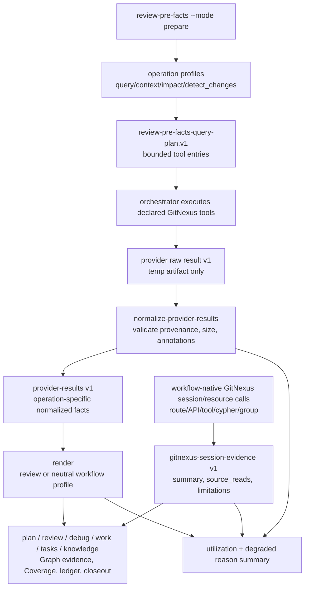

# feat: GitNexus Harness context and evidence integration

## Summary

本计划完整实现两份 GitNexus 需求文档的共同目标：用 GitNexus 提升 AI coding 的上下文质量和证据质量，同时保持 spec-first 的 AI Coding Harness 边界。落地分为 deterministic helper lane、workflow-native session lane、workspace/group resource lane、Evaluation/Knowledge lane 和 mutation-gated maintenance boundary。

实现顺序采用 80/20，但不做阶段性范围裁剪。`review-pre-facts` 从单一 `query` 扩展为 bounded、read-only、可归一化、可脱敏的 `query` / `context` / `impact` / `detect_changes` operation profile；`route_map`、`api_impact`、`shape_check`、`tool_map`、`cypher`、repo/group resources 和 group-aware `query/context/impact` 通过 shared evidence envelope 服务任务域明确的 workflow；`spec-work`、`spec-write-tasks`、`spec-compound/refresh` 消费 source-confirmed graph evidence；mutation-capable tools 只允许 preview-first/manual/setup governed 路径。

---

## Problem Frame

`spec-first` 已经有 GitNexus graph readiness、Graph / GitNexus Evidence posture、downstream graph evidence consumption、review Coverage 和 debug hypothesis ledger 边界。但确定性的 facts helper 仍停在浅层：`src/cli/helpers/review-pre-facts.js` 的 `buildQueryPlan()` 只产出 `gitnexus.query`，`normalizeRawFacts()` 也主要理解 query-shaped `facts` / `process_symbols` / `definitions`。

这导致 SKILL prose 与 facts layer 不对称：LLM 可以在会话中临时调用 GitNexus 深度能力，但没有统一的 query-plan provenance、operation bounds、size cap、redaction、degraded reason 和 durable rendering。要提升 AI coding 质量，正确的改造不是把更多 raw graph output 注入 prompt，而是把深度图谱结果压成有边界、可验证、可降级、可传递的 facts。

Harness 的核心判断是：把不稳定的 AI 推理放进可重复、可观察、可约束、可验证的工程闭环。GitNexus 服务的是 spec-first Harness 的 Context 和 Evidence 两层，提供代码图谱、symbol、调用关系、影响面和 diff/process evidence；它不拥有 scope、finding、root cause、自动修复、mutation 或 workflow 状态机权限。本计划因此同时做两件事：把高频四类能力固化为 deterministic facts，把 API/tool/Cypher/group 等更深能力纳入任务域明确时的 governed session/resource evidence，而不是让它们停留在 ad hoc 工具调用。

---

## Requirements

- R1. `review-pre-facts-query-plan.v1` 的 GitNexus executable operation allowlist 扩展为且仅为 `query`、`context`、`impact`、`detect_changes`；不加入 route/API、`cypher`、workspace group、refresh、repair、rename 或 group sync。
- R2. 每个 operation 必须有固定 operation profile：argument shape、默认 bounds、raw result budget、normalization shape、redaction behavior、fallback reason code 和 source-read requirement。
- R3. Provider raw/result schema 以 additive 方式支持 operation-specific normalized facts，不强迫 `context` / `impact` / `detect_changes` 伪装成 source excerpt。
- R4. `doc-review` / `code-review` 现有 reviewer rendering 必须向后兼容；新增 `plan` / `debug` workflow-neutral rendering，不使用 Coverage、finding 或 dispatch-gate wording。
- R5. `detect_changes` 和 `impact` 的 durable output 必须 summary-first，不保留 raw diff、完整 byDepth dump、credentialed URL、token、internal hostname 或私有 process/route dump。
- R6. Tool provenance、query-plan matching、snapshot freshness、temp artifact boundary、path containment、single-query 256 KiB cap、total raw 1 MiB cap 和 rendered block cap 必须继续 fail closed 或 degraded render。
- R7. 新增 utilization signals：记录 `capabilities_used[]`、operation counts、degraded reason distribution 和 graph-to-decision/finding/debug-hypothesis 的可观察摘要，为 helper promotion 和 workflow quality review 提供数据。
- R8. 会话启动或 workflow entry 应暴露短小 GitNexus readiness snapshot，帮助模型避免把 stale graph 当 primary evidence；实现必须 helper-first，hook 只做注入面。
- R9. `spec-write-tasks` 应消费 plan 里的 Graph / GitNexus Evidence，用于 task ordering、`test_focus` 和 `context_refs`，但不得扩大 plan scope。
- R10. `spec-work` 应消费 plan/review/debug graph evidence，用于 source-read focus、test focus、shared-symbol impact check 和 closeout risk disclosure；不得让 GitNexus 扩大 task scope。
- R11. `spec-compound` / `spec-compound-refresh` 只能沉淀 source-confirmed graph-informed learning；raw provider output 和 session-local unconfirmed graph evidence 不得进入 durable knowledge。
- R12. Workflow-native GitNexus calls for `route_map`、`api_impact`、`shape_check`、`tool_map`、`cypher` must use a shared evidence envelope with capability、lane、tool/resource、arguments/URI、repo_scope、task_domain、provenance、freshness/readiness、summary、source_reads_required、limitations and redaction status.
- R13. Workspace/group resources and group-aware `query/context/impact` may orient multi-repo work only after explicit `target_repo` or per-task repo scope is known; group evidence is advisory and cannot expand write scope.
- R14. `cypher` use requires schema-first read-only proof, bounded query text, row/byte limits, redacted summaries and source confirmation before claims.
- R15. `docs/solutions/` discoverability 只做最小 source-first 指引修补，不新增知识库 pipeline。
- R16. 全部 source 变更必须同步 contract/unit tests、`CHANGELOG.md`，并考虑 README / 双宿主 runtime generation；不手改 `.claude/`、`.codex/`、`.agents/skills/` generated mirrors。

**Origin acceptance examples:** AE1-AE6 from `docs/brainstorms/2026-05-26-001-gitnexus-workflow-context-evidence-requirements.md`.

**Portfolio trace:** deterministic helper lane、workflow-native session lane、workspace/group resource lane、Evaluation/Knowledge lane and mutation-gated boundary from `docs/brainstorms/2026-05-26-002-gitnexus-integration-portfolio-80-20.md`.

---

## Assumptions

- A1. Existing `spec-plan` / `spec-code-review` / `spec-debug` graph evidence prose and `docs/contracts/downstream-graph-evidence-consumption.md` are baseline, not scope to redesign.
- A2. `review-pre-facts` remains the single deterministic pre-facts pipeline; this work must not create a parallel facts helper.
- A3. GitNexus MCP tool annotations may not be observable in every host. The implementation should support verified annotations when supplied, and produce explicit `tool_annotation_unverified` degraded evidence when policy requires verification but the host cannot provide it.
- A4. The plan does not depend on hszq-app private evidence. Private repo observations are only validation inspiration and must not enter fixtures or durable docs as raw output.

---

## Scope Boundaries

- 不把 GitNexus evidence 变成 scope authority、finding authority、root-cause authority、task scheduler 或 mutation gate owner。
- 不在 ordinary workflow 内运行 GitNexus analyze/build/index refresh、provider repair、group sync、rename、clean 或 equivalent mutation-capable operation。
- 不把 `route_map`、`api_impact`、`shape_check`、`tool_map`、`cypher` 放入 deterministic helper query-plan；这些能力在任务域匹配时由 SKILL/LLM 作为 governed session/resource GitNexus evidence 使用。
- 不把 hook delivery 变成 graph governance source of truth；hook/startup 只注入 readiness/context snapshot，source/runtime parity 由现有双宿主治理和 focused tests 维护。
- 不把 raw provider stdout/stderr、raw diff hunks、完整 process traces 或私有仓库路径写入 durable project docs。
- 不手动编辑 generated runtime mirrors。

### Non-Helper Lanes In Scope

- `tool_map` session evidence：setup、skill-audit、app-consistency-audit 或 tool-surface 任务可显式调用；summary 进入 shared evidence envelope。
- `route_map` / `api_impact` / `shape_check` session evidence：API/web/backend 任务可显式调用；route/handler/consumer/shape 摘要必须 redacted and source-confirmed。
- `cypher` advanced session evidence：需要 schema-first read-only proof、bounded query/result 和 redacted summary。
- repo/group resources 与 group-aware `query/context/impact`：多仓/monorepo/service orientation 使用；不能选择写入 repo 或扩大 plan/task scope。
- `spec-work`、`spec-write-tasks`、`spec-compound/refresh`：消费 graph evidence 用于 source-read/test-focus/risk/knowledge，而不是让 GitNexus 调度任务或决定结论。

---

## Graph Readiness

- target_repo: `spec-first`
- status: stale
- source_revision: `8dc7e77627d1f38286d91bf1f4af11831dd6a766`
- current_revision: `3d822bd3800bad34524e8f5e9dae44c6bd6e37ad`
- stale: true
- primary_providers: `gitnexus`
- degraded_providers: none in compiled artifacts
- fallback_capabilities: bounded direct repo reads, focused source reads, current tests/contracts, session-local GitNexus orientation
- runtime_mcp_evidence: session-local `query` / `context` / `impact` were used for orientation only; `detect_changes` was not used during planning
- confidence: high for direct source and contract reads; advisory for GitNexus graph impact because compiled graph facts are stale and definitions-only
- limitations: `.spec-first/graph/graph-facts.json` was generated at `2026-05-25T19:21:12Z` for an older clean revision; current worktree is dirty; `impact_context=false` and limitations include `definitions_only_no_process_graph`, `definitions_only_no_impact_evidence`, `definitions_only_no_related_tests`

---

## Graph / GitNexus Evidence

- provider: GitNexus
- native_tool_or_resource: `query`, `context`, `impact` used as live MCP orientation; `detect_changes` planned but not used as current evidence
- repo_scope: `spec-first`
- capability_status: partial
- evidence_grade: session-local
- evidence_posture: fallback
- freshness_state: stale
- source_tags: [checked-in-baseline, live-mcp-tool, session-local-inference]
- source_contract_fields: `docs/contracts/graph-evidence-policy.md`, `docs/contracts/downstream-graph-evidence-consumption.md`, `docs/contracts/workflows/review-pre-facts-extraction.md`
- source_reads_required: mandatory for all implementation units; GitNexus pointers cannot replace direct reads because graph facts are stale
- impact_on_plan: GitNexus helped confirm that the core blast radius centers on `buildQueryPlan()` -> `runPrepare()` and `normalizeRawFacts()` -> `runNormalizeProviderResults()`; source reads define the actual scope
- capabilities_used: `query`, `context`, `impact`
- key_findings: `buildQueryPlan()` is directly called by `runPrepare()`; `normalizeRawFacts()` is directly called by `runNormalizeProviderResults()`; upstream impact for both was low in session-local graph output, but review/code tests still need direct verification
- limitations: graph index is stale; results are advisory; GitNexus README documents `impact.summaryOnly`, but the current executable MCP tool schema available to spec-first must be treated as the query-plan contract, so implementation must verify schema support before emitting that argument

---

## Context & Research

### Relevant Code and Patterns

- `src/cli/helpers/review-pre-facts.js` owns prepare / normalize-provider-results / render / one-shot modes, current workflow allowlist, raw/result validation, target extraction, query-plan generation, normalization, rendering, temp boundary and run summary.
- `tests/unit/review-pre-facts-helper.test.js` already covers query-plan generation, stale graph fallback, raw/provider-results validation, provenance repair, malformed render downgrade, path containment and temp boundary behavior.
- `tests/fixtures/review-pre-facts/` contains the current v1 query-only fixture set; new fixtures should be operation-specific and private-data-free.
- `docs/contracts/workflows/review-pre-facts-extraction.md` is the contract source for helper modes, query-plan contract, fact contract, limits and output boundary.
- `docs/contracts/graph-evidence-policy.md` and `docs/contracts/downstream-graph-evidence-consumption.md` define advisory evidence, non-expansion, degraded-once and mutation-gated boundaries.
- `skills/spec-plan/SKILL.md`, `skills/spec-code-review/SKILL.md`, `skills/spec-debug/SKILL.md` already own LLM judgment rules for graph evidence; edits should be narrow consumption/wording updates, not a redesign.
- `skills/spec-write-tasks/SKILL.md` is the optional plan-to-task-pack derived layer; it already preserves plan as source of truth and is the right low-cost place to consume plan graph evidence.
- `templates/claude/hooks/session-start`, `src/cli/index.js`, `src/cli/instruction-bootstrap.js`, `skills/using-spec-first/SKILL.md` are the current startup-reminder / SessionStart surfaces.
- `src/cli/helpers/secret-deny-patterns.js` and `src/cli/contracts/security/secret-deny-patterns.json` provide existing secret path denial primitives that redaction should reuse.
- `src/cli/helpers/spec-work-run-artifact.js` already has a compact `graph_evidence_used` schema shape and redaction boundary that can inform utilization summaries.

### Institutional Learnings

- `docs/solutions/tooling-decisions/codex-cli-supports-lifecycle-hooks-2026-05-26.md` corrects the old assumption that Codex has no lifecycle hooks, but also says core governance should remain helper-first and hooks should stay host-specific injection surfaces.
- `docs/plans/2026-05-23-003-feat-gitnexus-downstream-workflows-deep-integration-plan.md` already shipped downstream consumption prose for work/review/debug; this plan should extend facts production, not repeat that work.
- `docs/plans/2026-05-22-002-feat-gitnexus-plan-evidence-plan.md` established that `evidence_posture=fallback` is independent from `evidence_grade`; source fallback can still be confirmed evidence.
- `docs/10-prompt/结构化项目角色契约.md` requires `Light contract`, `Explicit boundaries`, and `Scripts prepare, LLM decides`; operation profiles must prepare facts, not decide scope or findings.

### External References

- No new external browsing was used for this plan. Industry alignment and AI Coding Harness framing are carried from the portfolio document, not introduced as additional implementation scope.
- GitNexus local source docs reviewed from the sibling repo provided by the user: `GitNexus/README.md`, `GitNexus/ARCHITECTURE.md`, `GitNexus/AGENTS.md`, `GitNexus/GUARDRAILS.md`, `GitNexus/RUNBOOK.md`. These establish the official MCP tool/resource capability map, recommended agent usage (`query`, `context`, `impact`, `detect_changes`), staleness posture, and group-aware/resource boundaries.

---

## Key Technical Decisions

| Decision | Rationale | Consequence |
| --- | --- | --- |
| Keep `review-pre-facts` as the deterministic facts layer name | Existing review workflows, contracts and tests already depend on this helper; renaming to a neutral helper first would enlarge the diff and risk breaking hidden command consumers | Add `plan` / `debug` workflow profiles inside the current helper; consider a neutral alias later only if naming becomes a real consumer problem |
| Use additive v1 schema evolution, not immediate v2 | Current provider-results v1 can accept additive operation metadata if validation is intentionally widened; v2 would force all existing fixtures and consumers to migrate at once | Preserve existing query-only review behavior; add `operation`, `fact_kind`, `summary`, `source_reads_required`, `limitations`, `redaction_status` fields as optional/required-by-kind |
| Provider `impact.summaryOnly` as optional optimization, not hard dependency | GitNexus README documents `summaryOnly`, but current host MCP schema must remain the executable query-plan contract; emitting unsupported provider arguments would break deterministic orchestration | Implement summary-first normalization and budget truncation on the spec-first side; add `summaryOnly` only after tool-schema/profile proof |
| Operation selection is deterministic but conservative | Scripts may classify targets and build bounded arguments, but they must not infer architecture scope or business priority | Emit `context` / `impact` only when a safe symbol/file target exists; otherwise degrade with a reason and require direct reads |
| Resource evidence stays separate from executable query-plan entries | MCP resources can be read-only evidence, but query-plan entries are executable tool calls with exact arguments | Contract may record resource refs as evidence metadata, but `queries[]` remains tool operation only |
| Workflow-native GitNexus evidence uses a shared envelope | Route/API/tool/Cypher/group capabilities are useful but task-domain dependent; leaving them as unstructured session notes would lose provenance and boundaries | Add `gitnexus-session-evidence.v1` vocabulary for summaries, source reads, limitations and redaction without adding them to helper query-plan |
| Redaction is a hard precondition for durable output | `detect_changes` and `impact` can expose private diff, internal process names and hostnames | Raw result stays temp; durable facts retain symbol/path/process summaries only after redaction |
| F3 readiness snapshot is helper-first, hook-light | SessionStart context is valuable, but hook parity can become a separate governance project | Add a shared readiness snapshot command and inject through existing startup surfaces; do not implement full Codex hook delivery unless a dedicated hook parity scope is approved |
| Utilization gates durable helper promotion | Without measurement, adding `tool_map`, route/API or `cypher` to the deterministic helper is architecture theater, even though session/resource native use remains valid | Record operation use/degrade/decision conversion first; promote only when data shows real workflow value |

---

## Open Questions

### Resolved During Planning

- Should this plan redesign `spec-plan` / `spec-code-review` / `spec-debug` graph evidence prose? No. Those workflow boundaries already exist; this plan fills the deterministic facts layer gap.
- Should `route_map` be included because GitNexus supports it? Yes, through workflow-native session evidence for API/web/backend work; no, not as a deterministic helper operation.
- Should `cypher` be included? Yes, through advanced session evidence with schema-first read-only proof, query/result budget, redaction and source confirmation; no, not as a deterministic helper operation.
- Should hszq-app evidence be committed as proof? No. Use private repo observations only as session-local inspiration for fixture shape; commit only synthetic fixtures.
- Should the first implementation assume GitNexus `impact` has `summaryOnly`? No as a query-plan default. Official README documents it, but implementation must verify the current MCP schema/profile before emitting it; local summary-first normalization remains mandatory.
- Should Codex hook support turn graph governance into hook logic? No. The complete implementation uses a shared readiness snapshot and source/runtime hook governance tests; hooks remain delivery surfaces.

### Implementation-Time Unknowns

- Exact target classifier shape: implementation should choose the smallest reliable structure for path, symbol, change-scope and workflow hints without building a semantic rules engine.
- Exact raw result envelope field for tool annotations: implementation should choose a shape that lets orchestrators supply annotation proof when the host exposes it and fail closed when required proof is absent.
- Exact utilization persistence location: prefer existing temp run summary / workflow outputs first; only add durable run artifact fields where a downstream consumer already exists.
- Exact session evidence persistence shape: prefer compact workflow summary/run-artifact fields before adding a new durable artifact namespace; all session evidence remains advisory until source confirmed.

---

## High-Level Technical Design

> *This illustrates the intended approach and is directional guidance for review, not implementation specification. The implementing agent should treat it as context, not code to reproduce.*

---

## Implementation Units

### U1. Contract, schema and redaction baseline

**Goal:** Update the review-pre-facts contract and helper schema boundaries so four GitNexus operations can be represented safely before generation/normalization logic changes.

**Requirements:** R1, R2, R3, R5, R6, R16

**Dependencies:** None

**Files:**
- Modify: `docs/contracts/workflows/review-pre-facts-extraction.md`
- Modify: `src/cli/helpers/review-pre-facts.js`
- Modify: `tests/unit/review-pre-facts-helper.test.js`
- Modify: `tests/fixtures/review-pre-facts/query-plan.valid.json`
- Modify: `tests/fixtures/review-pre-facts/provider-raw-result.valid.json`
- Modify: `tests/fixtures/review-pre-facts/provider-results.valid.json`

**Approach:**
- Add a single operation allowlist constant for `query`, `context`, `impact`, `detect_changes`.
- Define common normalized fact metadata: `provider`, `query_id`, `operation`, `repo_scope`, `target_refs`, `readiness`, `tier`, `reason_code`, `provenance`, `limitations[]`, `redaction_status`.
- Define operation-specific fact kinds without requiring every fact to have `source_path + excerpt`:
  - `query_symbol`: source path, anchor/line window, excerpt or compact symbol text.
  - `context_symbol`: symbol identity, disambiguation status, incoming/outgoing relationship summary, source reads required.
  - `impact_summary`: risk, affected modules/processes, by-depth counts, source/test candidates, omitted detail reason.
  - `detect_changes_summary`: scope/base/worktree, changed symbols, affected process summary, risk, omitted raw diff reason.
- Preserve existing v1 query fact contract for review rendering; widen validation only where operation facts intentionally use summary fields.
- Add `redaction_status` and `limitations[]` as required for non-query operation facts.

**Patterns to follow:**
- Existing `validateQueryPlan()`, `validateRawResult()`, `validateProviderResults()` fail-closed style in `src/cli/helpers/review-pre-facts.js`.
- Existing secret path utilities in `src/cli/helpers/secret-deny-patterns.js`.

**Test scenarios:**
- Happy path: current query-only fixture remains valid and renders the same review-facing block shape.
- Happy path: provider-results fixture with one fact per operation validates with common metadata and operation-specific fields.
- Edge case: `impact_summary` with oversized `byDepth` records omitted detail instead of persisting the full list.
- Error path: `detect_changes_summary` containing diff-like raw hunk text or secret-denied path degrades or redacts before provider-results validation succeeds.
- Error path: missing `operation`, `provenance`, `query_plan_id`, `tool_name`, `redaction_status` or required operation fields fails validation with stable reason codes.

**Verification:**
- `npm run test:unit -- review-pre-facts-helper` or the repo's equivalent focused Jest invocation for `tests/unit/review-pre-facts-helper.test.js`.

---

### U2. Operation profile selection and query-plan generation

**Goal:** Extend `buildQueryPlan()` from hardcoded `gitnexus.query` to conservative operation-profile routing for `query`, `context`, `impact`, and `detect_changes`.

**Requirements:** R1, R2, R4, R6

**Dependencies:** U1

**Files:**
- Modify: `src/cli/helpers/review-pre-facts.js`
- Modify: `tests/unit/review-pre-facts-helper.test.js`
- Add: `tests/fixtures/review-pre-facts/query-plan.multi-operation.json`

**Approach:**
- Add explicit workflow profiles for `doc-review`, `code-review`, `plan`, `debug`:
  - `doc-review`: keep query-first behavior for document target paths; no behavioral surprise.
  - `code-review`: prefer explicit change-scope `detect_changes` when scope/base is available, then bounded `impact` for changed files/symbols.
  - `plan`: use `query` for paths and `context` / `impact` only when a deterministic symbol or file target can be extracted from the plan/request.
  - `debug`: use `query` / `context` for stack-trace symbols or named files; use `detect_changes` only when the debug run is explicitly tied to current diff scope.
- Extend target extraction from path-only strings to typed target refs when safe: `path`, `symbol`, `kind`, `change_scope`, `base_ref`, `source`.
- `context` profile should prefer `uid` when available, then `name + file_path/kind`; if target is ambiguous, emit no `context` entry and record a limitation rather than inventing a symbol.
- `impact` profile must require explicit `target` and `direction`; for file-only targets use the repo-relative file path as `target` only if GitNexus supports file targets in current schema, otherwise degrade with `impact_target_unavailable`.
- `detect_changes` profile must require explicit scope: `staged`, `unstaged`, `all`, or `compare + base_ref`.
- Do not add provider arguments such as `summaryOnly=true` unless verified by the current GitNexus executable schema/profile; local summary-first truncation remains required even when provider summaries are available.

**Patterns to follow:**
- Existing readiness and query surface checks in `computeReadiness()` / `buildQueryPlan()`.
- Existing target ordering and cap logic in `orderTargets()` / `resolveTargets()`.

**Test scenarios:**
- Happy path: `doc-review` fixture still emits `gitnexus.query` entries with `include_content=false`, bounded `limit`, bounded `max_symbols`.
- Happy path: `code-review` with explicit `--changed-files` and change-scope fixture emits `detect_changes` and bounded `impact` entries with exact declared arguments.
- Happy path: `plan` document mentioning a symbol target emits `query`, `context`, and `impact` where arguments are deterministic and bounded.
- Edge case: `context` target without a symbol emits no context query and records `context_target_ambiguous`.
- Edge case: stale graph emits no executable GitNexus entries and falls back to direct-read candidates.
- Error path: unsupported operation name in query-plan fails validation.
- Error path: missing `base_ref` for `compare` detect_changes degrades with a stable reason code.

**Verification:**
- Focused unit tests for query-plan generation and validation.

---

### U3. Operation-specific normalization, budgets and rendering

**Goal:** Normalize real GitNexus operation responses into compact facts and render them differently for reviewer workflows versus plan/debug workflows.

**Requirements:** R3, R4, R5, R6

**Dependencies:** U1, U2

**Files:**
- Modify: `src/cli/helpers/review-pre-facts.js`
- Modify: `docs/contracts/workflows/review-pre-facts-extraction.md`
- Modify: `tests/unit/review-pre-facts-helper.test.js`
- Add: `tests/fixtures/review-pre-facts/provider-raw-result.context.json`
- Add: `tests/fixtures/review-pre-facts/provider-raw-result.impact.json`
- Add: `tests/fixtures/review-pre-facts/provider-raw-result.detect-changes.json`
- Add: `tests/fixtures/review-pre-facts/provider-results.multi-operation.json`

**Approach:**
- Split normalization by operation rather than extending one query-shaped loop indefinitely.
- Keep query normalization compatible with existing `facts`, `process_symbols`, and `definitions`.
- For `context`, retain symbol identity, candidate/disambiguation status, incoming/outgoing relationship counts/summaries, and direct source reads required.
- For `impact`, retain risk, direct/indirect counts, affected modules, affected processes, source/test candidate refs and truncation reasons; avoid full `byDepth` dump in durable output.
- For `detect_changes`, retain changed symbols, changed files if repo-relative and non-secret, affected processes and risk; omit raw diff hunks.
- Add per-operation budget accounting before global fact budget truncation.
- Add neutral renderer for `plan` / `debug`:
  - capabilities used,
  - key pointers,
  - source reads required,
  - advisory/freshness limitations,
  - degraded reason.
- Preserve review renderer semantics for existing `doc-review` and `code-review`; Coverage/finding wording stays review-only.

**Patterns to follow:**
- Existing `renderFactsBlock()` degraded render behavior: invalid provider-results still returns a legal degraded block.
- Existing run-summary recording for `selected_tier`, `reason_code`, `normalization_result`.

**Test scenarios:**
- Happy path: each operation raw fixture normalizes into at least one operation-specific fact.
- Happy path: plan/debug render output uses neutral wording and does not contain `Coverage`, `finding`, `reviewer`, or dispatch terminology.
- Happy path: doc-review/code-review render output remains backward compatible for query-only fixtures.
- Edge case: impact response over budget keeps summary counts and records `provider_fact_budget_truncated`.
- Edge case: detect_changes response with raw diff-like text omits diff lines and records `raw_diff_omitted`.
- Error path: raw result operation mismatch with query-plan returns `provider_raw_result_query_mismatch`.
- Error path: malformed context ambiguity payload degrades with `provider_result_no_usable_facts` rather than rendering unbounded text.

**Verification:**
- Focused review-pre-facts helper tests plus fixture schema checks.

---

### U4. Safety hardening for annotations, provenance and redaction

**Goal:** Make multi-operation provider consumption fail closed when the tool surface, raw result, target paths or durable summaries violate safety boundaries.

**Requirements:** R5, R6, R16

**Dependencies:** U1, U2, U3

**Files:**
- Modify: `src/cli/helpers/review-pre-facts.js`
- Modify: `src/cli/helpers/secret-deny-patterns.js` only if reusable helpers are missing
- Modify: `src/cli/contracts/security/secret-deny-patterns.json` only if the existing patterns cannot cover new durable evidence risks
- Modify: `tests/unit/review-pre-facts-helper.test.js`
- Modify: `tests/unit/secret-deny-patterns-contracts.test.js` if the contract changes

**Approach:**
- Require raw result entries to match `query_id`, `tool_name`, `operation`, and declared arguments where the orchestrator records arguments.
- Support optional raw-result/tool-surface annotation proof. If a workflow requires annotation proof and it is unavailable, degrade with `tool_annotation_unverified`.
- Reject mutation-capable tool names and operation names regardless of raw result content.
- Redact durable strings before provider-results persistence:
  - repo-relative paths only,
  - no absolute local paths,
  - no credentialed URLs,
  - no token/key/cookie-like substrings,
  - no secret-denied file paths,
  - no full raw diff hunks.
- Keep raw provider output under temp run root only; never copy raw output into project docs.

**Patterns to follow:**
- Existing temp run root validation and symlink escape tests in `tests/unit/review-pre-facts-helper.test.js`.
- Existing secret-deny helper contract.

**Test scenarios:**
- Happy path: safe symbol/path summaries receive `redaction_status=redacted` or `none-required`.
- Error path: raw result with `gitnexus.rename`, `group_sync`, provider refresh or unknown operation is rejected/degraded.
- Error path: raw result without required annotation proof produces `tool_annotation_unverified`.
- Error path: absolute paths, `..` escapes, secret-denied paths and credentialed URLs do not survive into provider-results.
- Error path: malformed raw output over 256 KiB for a single query still fails with `provider_raw_result_too_large`.

**Verification:**
- Focused helper and secret-deny tests.

---

### U5. Workflow consumption profile updates for plan, review and debug

**Goal:** Wire the expanded helper into `spec-plan`、`spec-code-review` and `spec-debug` without rewriting their graph evidence judgment rules.

**Requirements:** R4, R7, R16

**Dependencies:** U1-U4

**Files:**
- Modify: `skills/spec-plan/SKILL.md`
- Modify: `skills/spec-code-review/SKILL.md`
- Modify: `skills/spec-debug/SKILL.md`
- Modify: `skills/spec-doc-review/references/pre-facts-extraction.md` if shared helper usage text needs operation-profile updates
- Modify: `tests/unit/spec-plan-contracts.test.js`
- Modify: `tests/unit/spec-code-review-contracts.test.js`
- Modify: `tests/unit/spec-debug-contracts.test.js`
- Modify: `tests/unit/spec-doc-review-contracts.test.js` if shared text changes

**Approach:**
- `spec-plan`: when graph-heavy planning needs deterministic pre-facts, call the hidden helper with `--workflow plan`; rendered facts feed the existing `## Graph / GitNexus Evidence` block.
- `spec-code-review`: keep existing review pre-facts flow, but allow query-plan entries beyond `query`; Coverage records capabilities used and degraded reasons once.
- `spec-debug`: allow `--workflow debug` pre-facts for stack trace / symbol / changed-scope orientation; hypothesis ledger may cite `graph_evidence`, but root cause still requires non-graph closure.
- Keep stale/degraded rules unchanged: graph-heavy stale evidence recommends `$spec-graph-bootstrap`; lightweight cases continue with bounded reads.
- Keep direct source reads mandatory for `source_reads_required` items.

**Patterns to follow:**
- Existing graph evidence posture sections in the three SKILL files.
- `docs/contracts/downstream-graph-evidence-consumption.md` degraded-once and non-expansion rules.

**Test scenarios:**
- Happy path: spec-plan prose mentions `--workflow plan` and neutral facts feed Graph / GitNexus Evidence without turning GitNexus into scope authority.
- Happy path: spec-code-review prose mentions non-query pre-facts and Coverage capability disclosure, while findings still require diff/source/test/contract confirmation.
- Happy path: spec-debug prose mentions `--workflow debug` and keeps causal-chain non-graph confirmation gate.
- Error path: contract tests prevent route/API/`cypher` helper operations from appearing as deterministic helper scope.
- Error path: stale graph language remains degraded/fallback, not blocking ordinary workflow by itself.

**Verification:**
- Focused skill contract tests.
- If skill prose changes are semantically substantial, run fresh-source eval or record why unavailable, following `docs/contracts/workflows/fresh-source-eval-checklist.md`.

---

### U5a. Workflow-native session and workspace/resource evidence lane

**Goal:** Give GitNexus capabilities outside the deterministic helper a shared evidence envelope and workflow consumption rules, so `route_map` / `api_impact` / `shape_check` / `tool_map` / `cypher` / group resources improve context without bypassing Harness boundaries.

**Requirements:** R12, R13, R14, R16

**Dependencies:** U1 for shared vocabulary; can proceed alongside U5

**Files:**
- Modify: `docs/contracts/graph-evidence-policy.md`
- Modify: `docs/contracts/downstream-graph-evidence-consumption.md`
- Modify: `docs/contracts/workspace-gitnexus-consumption.md`
- Modify: `skills/spec-plan/SKILL.md`
- Modify: `skills/spec-code-review/SKILL.md`
- Modify: `skills/spec-debug/SKILL.md`
- Modify: `skills/spec-mcp-setup/SKILL.md` if `tool_map` guidance needs a setup consumer
- Modify: `skills/spec-skill-audit/SKILL.md` if tool-surface evidence is consumed there
- Modify: focused contract tests for changed skill/contract surfaces

**Approach:**
- Define `gitnexus-session-evidence.v1` as a compact envelope, not a new executable helper artifact.
- Route/API/shape tasks may use `route_map` / `api_impact` / `shape_check`; summaries must name route/handler/consumer evidence, source reads required and limitations, but findings still require source/API contract proof.
- Tool-surface tasks may use `tool_map`; summaries must identify tools/handlers/source candidates without becoming setup authority.
- `cypher` requires prior schema read, bounded query text, row/byte limits, redaction and reason code when it is not used.
- Workspace/group resources and group-aware calls may orient cross-repo work only after explicit `target_repo` / per-task scope; stale group evidence downgrades posture.
- No workflow may auto-call mutation or maintenance tools from this lane.

**Test scenarios:**
- Happy path: plan/review/debug contract tests allow session evidence envelope entries for task-domain GitNexus calls and require source confirmation.
- Happy path: API review guidance can cite `api_impact` / `shape_check` as evidence candidates without treating mismatches as findings by themselves.
- Happy path: tool-surface guidance can cite `tool_map` for setup/audit tasks without adding helper operation support.
- Error path: `cypher` guidance requires schema/budget/redaction fields before durable summary.
- Error path: workspace/group evidence cannot select or expand write scope.

**Verification:**
- Focused contract tests for graph evidence policy, downstream consumption and changed skill prose.
- Fresh-source eval when skill prose changes materially, or record why unavailable.

---

### U6. Utilization metrics for graph capability value

**Goal:** Record enough usage and conversion data to decide whether a GitNexus capability should be promoted into the deterministic helper or remain session/resource evidence.

**Requirements:** R7, R12, R16

**Dependencies:** U3, U5, U5a

**Files:**
- Modify: `src/cli/helpers/review-pre-facts.js`
- Modify: `docs/contracts/workflows/review-pre-facts-extraction.md`
- Modify: `docs/contracts/downstream-graph-evidence-consumption.md` if output vocabulary needs one field
- Modify: `skills/spec-work/references/shipping-workflow.md` only if closeout vocabulary needs alignment
- Modify: `tests/unit/review-pre-facts-helper.test.js`
- Modify: `tests/unit/spec-work-contracts.test.js` if closeout vocabulary changes

**Approach:**
- Add metrics to temp run summary first:
  - `capabilities_used[]`,
  - `operation_counts`,
  - `degraded_reason_counts`,
  - `source_reads_required_count`,
  - `redaction_status`.
- Expose compact metrics in render output or workflow Coverage/Summary, not raw logs.
- Avoid claiming quality improvement from usage count alone. The useful follow-up signal is whether graph facts changed file selection, test focus, finding support, or debug hypotheses after source confirmation.
- Do not create a durable analytics database. This is run-artifact and summary-level evidence only.

**Patterns to follow:**
- Existing `review-pre-facts-run-summary.v1`.
- Existing `graph_evidence_used` compact shape in `skills/spec-work/references/shipping-workflow.md` and `src/cli/helpers/spec-work-run-artifact.js`.

**Test scenarios:**
- Happy path: normalize/render summary includes operation counts and capabilities used for multi-operation raw results.
- Edge case: degraded render records degraded reason counts even when no usable provider facts remain.
- Edge case: query-only review still records `capabilities_used=["query"]` without changing old facts block semantics.
- Error path: metrics never include raw provider output, raw diff or unredacted private strings.

**Verification:**
- Focused helper tests and any contract tests for changed closeout vocabulary.

---

### U7. GitNexus readiness startup snapshot

**Goal:** Add a short helper-owned readiness snapshot so fresh workflow sessions see GitNexus query readiness, stale/dirty state and capability limitations before choosing graph evidence posture.

**Requirements:** R8, R16

**Dependencies:** None, but should land after U1 vocabulary is stable if wording references operation names

**Files:**
- Modify: `src/cli/index.js`
- Modify: `src/cli/version-reminder.js` or add a narrowly named helper under `src/cli/helpers/`
- Modify: `src/cli/commands/internal.js` if implemented as hidden helper command
- Modify: `templates/claude/hooks/session-start`
- Modify: `src/cli/instruction-bootstrap.js`
- Modify: `skills/using-spec-first/SKILL.md`
- Modify: `tests/unit/claude-settings.test.js`
- Modify: `tests/unit/instruction-bootstrap.test.js`
- Modify: `tests/unit/using-spec-first-contracts.test.js`
- Modify: `tests/unit/runtime-plan-contracts.test.js` if runtime plan output changes

**Approach:**
- Add one shared snapshot producer that reads canonical graph/provider artifacts and current repo snapshot, then emits <=500 token text:
  - `query_ready`,
  - provider name,
  - source revision freshness,
  - dirty state,
  - available/limited capabilities,
  - recommended posture (`primary` / `fallback`) and reason.
- Append this snapshot through existing Claude SessionStart startup-reminder path.
- For Codex, use the existing top-level `startup-reminder --codex` / managed instruction path and lifecycle hook templates when source/runtime governance opts in. The local knowledge doc says Codex hooks are possible; this unit keeps the snapshot shared and helper-owned rather than moving policy into hook code.
- Snapshot failure must be silent/degraded and must not block workflow routing.

**Patterns to follow:**
- Existing startup reminder behavior in `src/cli/index.js` and `templates/claude/hooks/session-start`.
- Existing using-spec-first Codex startup boundary.

**Test scenarios:**
- Happy path: Claude hook output includes a compact GitNexus readiness snapshot when graph artifacts exist.
- Happy path: Codex bootstrap/startup-reminder guidance can surface the same snapshot without requiring generated runtime mirror edits by hand.
- Edge case: missing graph artifacts produce a short unavailable/fallback note, not stack traces.
- Edge case: stale source revision or dirty status clearly marks `freshness_state=stale` / fallback.
- Error path: snapshot command failure does not break SessionStart JSON output or workflow routing.

**Verification:**
- Focused startup/reminder/bootstrapping tests.

---

### U8. Task/work/knowledge consumption and docs/solutions discoverability

**Goal:** Let task compilation, work execution and durable knowledge benefit from source-confirmed graph evidence, while making the knowledge store easier for future agents to find with minimal source-first changes.

**Requirements:** R9, R10, R11, R15, R16

**Dependencies:** U5 and U5a for final evidence vocabulary; can otherwise proceed independently

**Files:**
- Modify: `skills/spec-write-tasks/SKILL.md`
- Modify: `skills/spec-work/SKILL.md`
- Modify: `skills/spec-work/references/shipping-workflow.md` if closeout vocabulary needs alignment
- Modify: `skills/spec-compound/SKILL.md`
- Modify: `skills/spec-compound-refresh/SKILL.md`
- Modify: `tests/unit/spec-write-tasks-contracts.test.js`
- Modify: `tests/unit/spec-work-contracts.test.js`
- Modify: focused compound/compound-refresh contract tests if present
- Modify: `AGENTS.md`
- Modify: `CLAUDE.md`
- Modify: `src/cli/instruction-bootstrap.js` if managed bootstrap text must carry the discoverability line
- Modify: `tests/unit/instruction-bootstrap.test.js` if managed bootstrap text changes

**Approach:**
- In `spec-write-tasks`, consume plan `Graph / GitNexus Evidence` as advisory task focus:
  - `impact_on_plan` can influence task ordering,
  - `source_reads_required` becomes `context_refs` / `stop_if` / `test_focus`,
  - `key_findings` can add risk notes,
  - no graph finding expands plan scope.
- In `spec-work`, consume plan/review/debug graph evidence for source-read focus, test focus, risk checks and shared-symbol impact checks. Before editing a shared symbol, prefer session-local `impact` when available; before closeout/review, prefer `detect_changes` when scope is explicit.
- In `spec-compound` / `spec-compound-refresh`, record only source-confirmed graph-informed learnings. Raw provider output and unconfirmed session evidence must not become durable knowledge.
- Add a minimal `docs/solutions/` discoverability line only where checked-in host instructions or managed bootstrap would actually help future agents find reusable learnings.
- Do not turn `docs/solutions/` into a mandatory pre-read for every task; it is relevant when documented areas or prior learnings match.

**Patterns to follow:**
- Existing `spec-write-tasks` rule that task packs are derived from plans and must not change scope.
- Existing `spec-compound` discoverability guidance.

**Test scenarios:**
- Happy path: `spec-write-tasks` contract test sees Graph / GitNexus Evidence fields used for task focus and test selection.
- Happy path: `spec-work` guidance consumes graph evidence for source-read/test-focus and records accepted/rejected graph evidence in closeout without expanding scope.
- Happy path: `spec-compound` / refresh guidance requires source confirmation before graph-informed learning becomes durable.
- Error path: contract test prevents graph evidence from becoming new task scope or replacing source-plan authority.
- Happy path: checked-in host instructions or managed bootstrap mention `docs/solutions/` as a reusable learning store without creating a mandatory workflow gate.

**Verification:**
- Focused contract tests for spec-write-tasks and instruction bootstrap.

---

### U9. Documentation, changelog and release-surface verification

**Goal:** Keep docs, tests and release-visible behavior aligned after the helper capability extension lands.

**Requirements:** R15, R16

**Dependencies:** U1-U8 and U5a

**Files:**
- Modify: `README.md`
- Modify: `README.zh-CN.md`
- Modify: `CHANGELOG.md`
- Modify: `docs/contracts/workflows/review-pre-facts-extraction.md`
- Modify: `docs/contracts/downstream-graph-evidence-consumption.md` if any output fields changed
- Modify: package-surface tests if new source files must be packed

**Approach:**
- README changes should be short and user-visible: explain that graph facts are bounded advisory evidence, deterministic helper supports `query/context/impact/detect_changes`, and deeper GitNexus capabilities use workflow-native/session/resource lanes.
- Changelog entry must use the current developer profile author.
- If new helper/source files are added, verify they are included in package publishing surface if needed.
- Do not regenerate runtime mirrors unless implementation changes source assets that require `spec-first init` validation; generated mirrors are not committed as source.

**Test scenarios:**
- Happy path: user docs mention the four operation families without claiming GitNexus decides scope, findings or root cause.
- Edge case: release/package tests include any new source helper or contract file that must ship.
- Error path: docs do not mention route/API/`cypher` as deterministic helper support.

**Verification:**
- Focused docs/contract tests.
- `npm run typecheck`.
- `npm run test:unit` if implementation touches helper, CLI, skills and docs tests across several units.
- `npm run build` if new files affect published package content.

---

## System-Wide Impact

- **Interaction graph:** Main code impact centers on `runPrepare()` -> `buildQueryPlan()`, `runNormalizeProviderResults()` -> `normalizeRawFacts()`, `runRender()` -> `renderFactsBlock()`, plus workflow prose that invokes the hidden helper.
- **Error propagation:** Invalid provider raw/results should continue to render legal degraded facts blocks where render can recover; prepare/normalize schema failures should return stable JSON errors and record run summary reason codes.
- **State lifecycle risks:** Raw provider results remain temp-run scoped. Durable docs only carry redacted summaries. No provider refresh or runtime mirror writes happen from the helper.
- **API surface parity:** Hidden CLI command remains `spec-first internal review-pre-facts`; public CLI help should not expose it. Workflow profiles add behavior but not a new public command.
- **Integration coverage:** Unit tests must cover helper schema/normalization/rendering; skill contract tests must cover prose boundaries; startup snapshot tests must cover hook/reminder JSON integrity.
- **Unchanged invariants:** GitNexus evidence remains advisory; source/test/log/contract evidence wins conflicts; graph-discovered extra impact does not expand implementation scope; generated runtime mirrors are regenerated by `spec-first init`, not edited by hand.

---

## Risks & Dependencies

| Risk | Mitigation |
| --- | --- |
| Operation routing becomes a hidden rules engine | Keep profiles deterministic and conservative; missing/ambiguous targets degrade instead of inventing scope |
| Provider response shapes differ from fixtures | Normalize summary-first from observed stable fields; unknown fields stay omitted; tests include malformed and oversized payloads |
| `impact` output is too large | Apply local budget truncation and by-depth counts; use provider `summaryOnly` only after schema/profile proof and keep local truncation as defense in depth |
| Tool annotations are not observable in host | Define optional annotation proof input and explicit degraded reason; do not silently treat unknown tool surface as verified |
| Redaction misses private data in detect_changes | Reuse secret-deny path checks, strip raw diff and URLs/tokens, keep raw output temp-only |
| Existing review workflows regress | Keep query-only fixtures valid; run backward compatibility tests before adding new workflow profiles |
| Startup snapshot pollutes context | Hard cap to <=500 tokens; include only readiness/freshness/capability summary and one posture recommendation |
| Hook delivery scope balloons | Keep the snapshot helper-owned and shared; host-specific hook/template/init/doctor/clean changes must stay under source/runtime governance tests |
| Metrics become vanity adoption counts | Record decision linkage fields as summaries and use them only as retrospective evidence for helper promotion and workflow quality review |

---

## Documentation / Operational Notes

- This is a graph-heavy implementation plan. If execution starts with stale GitNexus and needs primary graph impact evidence, run `$spec-graph-bootstrap` first; otherwise continue with source reads and treat graph evidence as advisory.
- Implementer should start with characterization tests for current query-only behavior before broadening schema validation.
- If any skill prose changes substantially, run or explicitly record fresh-source eval status because active sessions may cache old skill content.
- Changelog is mandatory for all source/docs/test changes.
- Runtime mirrors should be regenerated only by `spec-first init --claude` / `spec-first init --codex` when implementation changes source assets that require runtime validation.

---

## Sources & References

- **Origin document:** [docs/brainstorms/2026-05-26-001-gitnexus-workflow-context-evidence-requirements.md](../brainstorms/2026-05-26-001-gitnexus-workflow-context-evidence-requirements.md)
- **Portfolio context:** [docs/brainstorms/2026-05-26-002-gitnexus-integration-portfolio-80-20.md](../brainstorms/2026-05-26-002-gitnexus-integration-portfolio-80-20.md)
- Role baseline: `docs/10-prompt/结构化项目角色契约.md`
- Helper code: `src/cli/helpers/review-pre-facts.js`
- Helper tests: `tests/unit/review-pre-facts-helper.test.js`
- Helper fixtures: `tests/fixtures/review-pre-facts/`
- Contract: `docs/contracts/workflows/review-pre-facts-extraction.md`
- Graph evidence policy: `docs/contracts/graph-evidence-policy.md`
- Downstream consumption: `docs/contracts/downstream-graph-evidence-consumption.md`
- Startup hook: `templates/claude/hooks/session-start`
- Task compilation skill: `skills/spec-write-tasks/SKILL.md`
- Codex hooks learning: `docs/solutions/tooling-decisions/codex-cli-supports-lifecycle-hooks-2026-05-26.md`
- GitNexus provider capability docs: sibling repo `GitNexus/README.md`, `GitNexus/ARCHITECTURE.md`, `GitNexus/AGENTS.md`, `GitNexus/GUARDRAILS.md`
