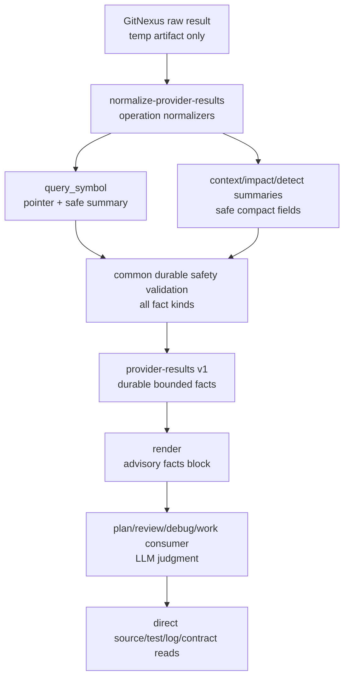

# fix: Harden review-pre-facts provider facts boundary

## Summary

本计划修复 `review-pre-facts` 在 GitNexus provider durable facts 边界上的实现偏差：`query_symbol` 不再成为 raw provider excerpt 和未脱敏 provenance 的例外，`impact` / `detect_changes` 空响应不再被伪装成“0 影响”事实，operation-only prepare intent 不再因缺少文件 target 被提前降级为 `no-targets`。

核心方向是把 GitNexus 用作导航、上下文和影响面候选来源，而不是把 provider 原文提升为长期事实。Durable output 默认保留 repo-relative pointer、symbol/line anchor、安全摘要和 `source_reads_required`；需要形成 plan/review/debug 结论时仍由 LLM 基于 direct source reads、测试、日志或合同确认。

---

## Problem Frame

当前实现完成了 GitNexus `query` / `context` / `impact` / `detect_changes` 四类 helper operation，但暴露出三个边界问题。

第一，虽然 `normalizeProviderFact` → `buildQuerySymbolFact` 已完成 pointer-first 改造（不再输出 `excerpt` 字段，测试 L604 已断言无 excerpt），但 `normalizeQueryResult` 的 `process_symbols`/`definitions` graphItems 合成路径（~L1394-1421）和 `compactOperationFact`（~L1672-1690，为 context/impact/detect_changes 合成 fact）在 normalize 阶段完全不调用 `validateDurableFactStrings()`——provider 不安全内容直接写入 `provider-results.json`，只在 render 前的 `validateProviderFactCommon()`（~L1927）阶段才被拦截。这是一个已存在的 normalize-stage safety bypass。

第二，`normalizeImpactResult()` 和 `normalizeDetectChangesResult()` 对空对象采用 JavaScript 默认值，可能把 provider 没有提供 usable evidence 的响应渲染成 `impact risk unknown / 0 direct / 0 processes` 或 `0 changed symbols / 0 affected processes`。这把“没有事实”误表达成“事实为零”。

第三，`runPrepare()` 以 `extractTargets()` 的文件 target 数量决定 readiness。纯 operation intent，例如只传 `--change-scope all`、`--impact-target <symbol>` 或从 options 指定 symbol target 时，可能被提前标记为 `no-targets`，导致可以安全执行的 GitNexus operation plan 无法生成。

这些问题不是 GitNexus 索引能力的问题。GitNexus 可以索引本地源码，官方实践也鼓励用 `query` 定位陌生代码、用 `context` 看 symbol、修改共享符号前跑 `impact`、提交前跑 `detect_changes`，并在 stale graph 后刷新索引。spec-first 要修的是 durable facts 边界：provider output 是外部事实候选，不能不经安全校验、预算和 source confirmation 就进入可复用 workflow context。

---

## Requirements

- R1. 所有 `review-pre-facts-provider-results.v1` durable provider facts 必须经过统一 string safety validation；`query_symbol` 不能绕过脱敏、安全路径和 raw diff 检查。
- R2. `query_symbol` normalizer 默认不得复制 provider raw `excerpt` 或 arbitrary provider provenance metadata；durable output 应保留 `source_path`、`line_window` / `anchor`、安全摘要、`source_reads_required[]`、limitations 和 helper-owned provenance。
- R3. 如果为了兼容旧 fixture 或外部 orchestrator 临时接受 provider-supplied `excerpt`，它必须通过同一套 deterministic redaction validation，并标记 `redaction_status`，但新 normalizer 不再主动生成 raw excerpt。
- R4. `impact_summary` 和 `detect_changes_summary` 只有在 provider 响应含有显式 usable evidence fields 时才生成事实；空对象、无 schema 信号或只靠默认值推导的响应必须进入 `omitted_facts` / degraded render。
- R5. `detect_changes` 的“确认为无变化”必须由显式 provider summary/status 字段表达，不能由缺失字段推导；`impact` 的“确认为无影响”同理需要显式 risk/count/target/summary 信号。
- R6. `prepare` 必须区分 file target 和 operation intent。没有 direct-read file target 但存在显式 symbol、impact 或 detect_changes intent 时，应继续计算 graph readiness 并生成对应 bounded query plan。
- R7. 合同、测试、fixture 和 rendering wording 必须同步更新，继续保持 `Scripts prepare, LLM decides`：helper 只准备安全事实和 source-read pointer，不决定 scope、finding、root cause 或 task ordering。
- R8. 不引入 `csv-generator.ts` 或等价 bulk source merger，不把源码内容预合并进 skill/prompt。需要源码确认时由 workflow consumer 基于 `source_reads_required` 做按需 direct read。
- R9. 所有 source 变更同步 `CHANGELOG.md`；不手改 generated runtime mirrors。

---

## Scope Boundaries

- 不修改 GitNexus indexer、MCP server、provider output schema 或 provider refresh 策略。
- 不把 `review-pre-facts` 变成源码聚合器、CSV generator、semantic reviewer 或 root-cause/finding 生成器。
- 不为 query facts 保留 raw provider excerpt 作为默认 durable proof。
- 不扩大 deterministic helper operation allowlist；本修复只收紧既有 `query` / `context` / `impact` / `detect_changes`。
- 不把 GitNexus graph evidence 自动升级为 source-confirmed evidence；consumer 仍必须 direct read / test / log / contract validation。
- 不修改 `.claude/`、`.codex/`、`.agents/skills/` runtime mirrors。

### Deferred to Follow-Up Work

- GitNexus provider schema 增加专门的 safe-summary field：本计划先在 spec-first normalizer 侧生成安全摘要，不要求 provider 同步发版。
- 更完整的 session-evidence metrics dashboard：本计划只修 durable facts correctness，不新增可视化或长期指标管线。
- 自动化 source-read prefetch：本计划保留 `source_reads_required`，不在 helper 内读取并注入源码内容。
- `omitted_facts` 到 `<codebase-facts>` block 的 render mapping：R4 降级输出通过 run-summary `degraded_reason_counts` 路径满足，不在本计划新增 codebase-facts block 内的 omitted_facts 渲染。

---

## Graph Readiness

- target_repo: `spec-first`
- status: stale / dirty-advisory
- source_revision: `16b0cf203a10ac223a3a0112ffa6eea96f48896c`
- current_revision: `1018b64097c52909887149da01e6c5bafb5a4192`
- stale: true, because current worktree is dirty and graph facts report `freshness_state="dirty-advisory"`
- primary_providers: `gitnexus`
- degraded_providers: none reported in `.spec-first/graph/graph-facts.json`
- fallback_capabilities: focused source reads, current contract/test inspection, bounded direct reads
- runtime_mcp_evidence: GitNexus `query` used for orientation only
- confidence: high for direct source/contract/test reads; advisory for graph-derived process/impact evidence
- limitations: graph artifacts report `impact_context=false` and `definitions_only_no_process_graph`, `definitions_only_no_impact_evidence`, `definitions_only_no_related_tests`

---

## Graph / GitNexus Evidence

- provider: GitNexus
- native_tool_or_resource: `query`
- repo_scope: `spec-first`
- capability_status: partial
- evidence_grade: advisory
- evidence_posture: fallback
- freshness_state: dirty-advisory
- source_tags: [checked-in-baseline, live-mcp-tool, session-local-inference]
- source_contract_fields: `.spec-first/graph/graph-facts.json`, `.spec-first/impact/bootstrap-impact-capabilities.json`, `docs/contracts/workflows/review-pre-facts-extraction.md`, `docs/contracts/downstream-graph-evidence-consumption.md`
- source_reads_required: all implementation units require direct source/test/contract reads; GitNexus pointers cannot replace them
- impact_on_plan: GitNexus helped locate `review-pre-facts` symbols and nearby tests; direct reads define all implementation requirements
- capabilities_used: `query`
- key_findings: relevant surfaces are `runPrepare()`, `buildQueryPlan()`, `normalizeQueryResult()`, `normalizeProviderFact()`, `normalizeImpactResult()`, `normalizeDetectChangesResult()`, `validateProviderResults()` and `validateProviderFactCommon()`
- limitations: current graph support is definitions-only and stale/dirty advisory; no GitNexus impact or review support is treated as confirmed evidence for this plan

---

## Context & Research

### Relevant Code and Patterns

- `src/cli/helpers/review-pre-facts.js` owns prepare, query-plan generation, provider raw/result validation, operation normalization, render, run summary, redaction helpers and temp artifact boundaries.
- `tests/unit/review-pre-facts-helper.test.js` already covers prepare, operation query-plan generation, provider normalization, render downgrade, invalid fact validation and workflow-neutral rendering.
- `docs/contracts/workflows/review-pre-facts-extraction.md` is the current helper mode / query-plan / fact / limit / output boundary contract.
- `docs/contracts/downstream-graph-evidence-consumption.md` already requires `source_reads_required` to be direct-read or validated, and forbids graph evidence from expanding scope or entering durable knowledge without source confirmation.
- `docs/02-架构设计/2026-05-27-gitnexus-bounded-pre-facts-技术方案.md` established summary-first, source-confirmed, helper-first boundaries; this plan tightens the implementation to match that design.
- `docs/plans/2026-05-27-001-feat-gitnexus-bounded-pre-facts-plan.md` is the completed implementation plan this fix follows up on.

### Provider Best Practice Mapping

- GitNexus official practice favors `query` / `context` / `impact` / `detect_changes` as navigation and development intelligence tools; it does not require downstream consumers to persist raw provider text as durable proof.
- GitNexus `context` defaults to no full source content unless explicitly requested; spec-first should preserve the same posture by defaulting durable facts to pointers and summaries.
- GitNexus stale graph guidance means indexed results are not a replacement for current source reads when making implementation, review, debug or knowledge claims.
- `impact` before editing shared symbols and `detect_changes` before commit remain good workflow recommendations, but their outputs must be summarized, redacted and source-confirmed before becoming spec-first conclusions.

### Anti-Patterns To Avoid

- Bulk source merging into skill context, including `csv-generator.ts`-style “read files then stuff them into the prompt”.
- Fake excerpts generated from provider raw content just to satisfy an old contract.
- Treating empty provider response as zero-risk / zero-change.
- Keeping arbitrary provider metadata in durable provenance.
- Adding complex semantic rules to scripts to decide whether evidence is important.

---

## Key Technical Decisions

| Decision | Rationale | Consequence |
| --- | --- | --- |
| Make `query_symbol` pointer-first, not excerpt-first | Query facts are graph navigation facts; source proof belongs to direct reads | Contract and renderer must accept summary + `source_reads_required` for provider query facts |
| Apply one durable string safety gate to every fact kind | Redaction exceptions are how provider output leaks into durable context | `validateProviderFactCommon()` should collect and validate strings for `query_symbol` too |
| Store helper-owned minimal provenance only | Provider provenance can contain raw or unstable metadata and is not needed for durable traceability | Keep source/query_plan/tool/operation and safe IDs only; omit arbitrary `provider_metadata` |
| Treat empty provider success as no usable facts unless explicit zero evidence exists | Missing fields and zero counts have different meanings | Normalizers need `hasUsableImpactEvidence()` and `hasUsableDetectChangesEvidence()` style guards |
| Let operation intent drive readiness when no file target exists | `detect_changes` and explicit impact targets are valid without a direct-read target list | `runPrepare()` should compute readiness when `hasOperationIntent(options)` is true |
| Do not make the helper source-read GitNexus pointers during normalization | That would turn a provider facts normalizer into a source aggregation layer and increase token/safety cost | Durable provider facts carry `source_reads_required`; downstream workflows read only what they use |

---

## High-Level Technical Design

> *This illustrates the intended approach and is directional guidance for review, not implementation specification. The implementing agent should treat it as context, not code to reproduce.*

The important boundary is that `Normalize` may validate file existence and repo-relative containment, but it should not read and embed source text to compensate for omitted provider excerpts. `source_reads_required` is an obligation for the consumer before turning a pointer into a claim.

---

## Implementation Units

### U1. Update contract and characterization tests for pointer-first query facts

**Goal:** Lock the intended boundary before code changes: provider `query_symbol` facts are durable pointers and summaries, not raw excerpts.

**Requirements:** R1, R2, R3, R7, R8

**Dependencies:** None

**Files:**
- Modify: `docs/contracts/workflows/review-pre-facts-extraction.md`
- Modify: `tests/unit/review-pre-facts-helper.test.js`
- Modify: `tests/fixtures/review-pre-facts/provider-results.valid.json`
- Modify: `tests/fixtures/review-pre-facts/provider-results.missing-provenance.json` if existing query fact fixture shape changes

**Approach:**
- Change fact contract wording so provider `query_symbol` requires `source_path`, line/window or anchor, safe summary/navigation metadata, provenance and `source_reads_required[]`; direct-read bounded facts may still carry excerpts.
- Add failing tests proving normalized query provider facts do not copy raw `excerpt` and do not include arbitrary `provenance.provider_metadata`.
- Add failing tests proving query facts containing token-like text, diff hunks, absolute local paths or secret-denied paths are rejected/downgraded by the same durable validation used by other fact kinds.
- Update stale limits wording: plan/debug profiles already exist, so contract should no longer say future plan/debug limits must be defined.

**Execution note:** Characterization-first. The first implementation pass should make these tests fail for the current code before changing the normalizer.

**Patterns to follow:**
- Existing malformed provider result tests in `tests/unit/review-pre-facts-helper.test.js`
- Existing redaction helpers in `src/cli/helpers/review-pre-facts.js`

**Test scenarios:**
- Error path: raw query fact excerpt contains `api_key=secret` -> provider results do not validate or render as graph-fresh.
- Error path: raw query fact excerpt contains `diff --git` / `@@ -1` -> validation returns `provider_fact_redaction_failed`.
- Error path: raw query fact provenance metadata contains an absolute local path -> validation rejects the durable fact.
- Happy path: query result with `process_symbols` / `definitions` produces pointer fact with `source_path`, `line_window`, safe summary and `source_reads_required`.
- Compatibility: legacy provider query fact with a safe excerpt is either accepted only after common safety validation or normalized into the new pointer-first shape without copying the excerpt.

**Verification:**
- Focused unit tests fail before implementation and pass after U2/U3.

---

### U2. Refactor query normalization to emit safe pointer facts

**Goal:** Stop `normalizeQueryResult()` / `normalizeProviderFact()` from promoting provider raw text into durable provider facts.

**Requirements:** R1, R2, R3, R8

**Dependencies:** U1

**Files:**
- Modify: `src/cli/helpers/review-pre-facts.js`
- Test: `tests/unit/review-pre-facts-helper.test.js`

**Approach:**
- `normalizeProviderFact` → `buildQuerySymbolFact` 已完成 pointer-first 改造：不输出 excerpt 字段，使用 `querySymbolSummary` 生成 summary，使用 `operationProvenance()` 生成 helper-owned provenance。无需额外修改此路径。
- 在 `normalizeQueryResult` graphItems 合成路径（~L1394-1421）：该路径调用 `buildQuerySymbolFact` 但之后不调用 `validateDurableFactStrings()`。在 graphItems 循环内 `buildQuerySymbolFact()` 返回后立即调用 `validateDurableFactStrings()`，unsafe fact 推入 omitted 而非 facts。
- `validateQuerySymbolFact`（~L1962）当前检查 `summary[]` 非空和 `source_reads_required[]` 存在——不检查 excerpt。确认此 validator 不需要变更。
- Add `source_reads_required: uniqueRepoPaths([sourcePath])` to provider `query_symbol` facts（如尚未存在）。
- Keep `source_path`, `anchor`, `line_window`, `target_refs`, `readiness`, `tier`, `reason_code`, `limitations` and `redaction_status`.
- Confirm `provenance` 使用 `operationProvenance()` 输出 helper-owned fields（`source`, `query_plan_id`, `tool_name`, `operation`），无 arbitrary `provider_metadata`。
- Make `normalizeProviderFact()` tolerate absent provider `excerpt` when source path and anchor/line window are present（已是当前行为，确认即可）。

**Technical design:** Directionally, `query_symbol` should look like a `context_symbol`-lite pointer: identity/location plus required source read. It should not fake a source excerpt.

**Patterns to follow:**
- `compactOperationFact()` and `operationProvenance()` for common provenance fields.
- `uniqueRepoPaths()` and `normalizeProviderSourcePath()` for repo-relative source-read paths.

**Test scenarios:**
- Happy path: raw query fact with source path and anchor but no excerpt still normalizes to a usable query fact.
- Happy path: GraphNexus `definitions` item with `filePath`, `startLine`, `endLine` normalizes into safe summary and source read pointer.
- Edge case: provider fact with unsafe target path is omitted, not repaired into a misleading pointer.
- Edge case: provider fact with anchor but unreadable source path is omitted.
- Error path: provider fact with unsafe excerpt is not allowed to pass through as a durable field.

**Verification:**
- Provider results JSON contains no raw provider excerpt strings and no arbitrary `provider_metadata`.

---

### U3. Apply unified durable safety validation to all fact kinds

**Goal:** Make redaction and unsafe string checks fact-kind agnostic.

**Requirements:** R1, R3, R7

**Dependencies:** U1, U2

**Files:**
- Modify: `src/cli/helpers/review-pre-facts.js`
- Test: `tests/unit/review-pre-facts-helper.test.js`

**Approach:**
- 当前 `validateProviderFactCommon()`（~L1927）已对所有 fact kind（含 query_symbol）调用 `validateDurableFactStrings()`。但 normalize 阶段的两条合成路径——`normalizeQueryResult` 的 `process_symbols`/`definitions`（~L1394-1421）和 `compactOperationFact`（~L1672-1690，为 context/impact/detect_changes 合成 fact）——完全不调用安全校验，provider 不安全内容直接写入 `provider-results.json`，形成 normalize-stage safety bypass。
- 在 `normalizeQueryResult` 的 graphItems 合成路径中 `buildQuerySymbolFact()` 返回后立即调用 `validateDurableFactStrings()`。在 `compactOperationFact()` 返回后同样添加调用，或在 `normalizeRawFacts` 的聚合循环中统一校验。
- 保留 `validateProviderFactCommon` 中的 validate-stage 校验作为二道防线，确保 normalize 和 validate 双重覆盖。
- **isSecretDeniedPath scope 分离（解决 Risks 表 High severity 风险）**：在 `validateDurableFactStrings` 中区分 `source_path` 文件路径和内容字符串的 secret-deny scope。`source_path` 只检查 `containsAbsoluteLocalPath()` 和 repo-relative containment，不应用 `isSecretDeniedPath()`（后者的 `**/*token*` 等 pattern 会误杀 `src/utils/tokenUtils.js` 等合法业务路径）。`isSecretDeniedPath` 继续用于内容类字符串（excerpt、summary text 等）。在 contract 中文档化此分离。
- 确保 `redaction_status` 对所有合成路径的 fact 一致要求；如果立即严格化会破坏现有 fixture，则文档化并测试兼容桥接。

**Patterns to follow:**
- Current `validateDurableFactStrings()`, `collectStrings()`, `containsRawDiffHunk()`, `containsCredentialLikeText()`, `containsAbsoluteLocalPath()`, `isSecretDeniedPath()`.

**Test scenarios:**
- Error path: `query_symbol.summary[]` containing credential-like text is rejected at normalize stage.
- Error path: `query_symbol.provenance` containing absolute path is rejected at normalize stage.
- Error path: `normalizeQueryResult` graphItems path — provider `definitions` item with `name` containing `api_key=secret123` is rejected by normalize-stage `validateDurableFactStrings`.
- Error path: `compactOperationFact` — provider `context_symbol` fact with `symbol.name` containing raw diff hunk markers is rejected at normalize stage.
- Happy path: safe repo-relative source path and safe symbol name pass both normalize-stage and validate-stage validation.
- Happy path: `source_path` containing legitimate `token` substring (e.g., `src/utils/tokenUtils.js`) passes validation (source_path is not subject to `isSecretDeniedPath` content-level check).
- Integration: `render` downgrades invalid query provider results to `tier="unavailable"` with a concrete reason.

**Verification:**
- No fact kind has a validation-only exemption from durable string safety checks.

---

### U4. Verify and harden usable-evidence guards for `impact` and `detect_changes`

**Goal:** Confirm that `hasUsableImpactEvidence()` (~L1617-1634) and `hasUsableDetectChangesEvidence()` (~L1636-1642) correctly prevent empty successful provider responses from becoming false zero-impact or zero-change facts; fix the empty-array false positive in `hasUsableDetectChangesEvidence`; strengthen test coverage for edge cases not yet proven.

**Requirements:** R4, R5, R7

**Dependencies:** U1 (tests should be in place before verification work)

**Files:**
- Modify: `src/cli/helpers/review-pre-facts.js`
- Test: `tests/unit/review-pre-facts-helper.test.js`
- Modify: `docs/contracts/workflows/review-pre-facts-extraction.md`

**Approach:**
- The usable-evidence guards (`hasUsableImpactEvidence`, `hasUsableDetectChangesEvidence`) already exist and handle `{}` correctly. Primary work is verifying edge cases and strengthening test coverage.
- **Fix:** `hasUsableDetectChangesEvidence` (~L1636) returns `true` for `{ changed_symbols: [] }` because it checks `Array.isArray()` without verifying `length > 0`. Tighten predicate to require non-empty arrays. Verify `hasUsableImpactEvidence` similarly for `{ affected_processes: [] }` and `{ byDepth: { 1: [] } }`.
- Confirm explicit zero evidence: `{ status: 'clean' }` passes `isNoImpactStatus`/`isNoChangesStatus` (allowed zero-result path); `{}` without status does not pass (correct rejection).
- Add explicit contract wording: "confirmed zero impact/change" requires provider `status` field or explicit numeric fields; `{}`, missing fields, or empty arrays without status always degrade.
- If any edge case (e.g., `{ summary: {} }` with empty summary object) is found to pass the guard incorrectly, tighten the predicate.
- Keep raw diff omitted and summary-first constraints unchanged.

**Patterns to follow:**
- Existing `normalizeContextResult()` ambiguity / no usable facts omission behavior.
- Existing `validateImpactSummaryFact()` and `validateDetectChangesSummaryFact()` fact-kind validators.

**Test scenarios:**
- Error path: `impact` raw response `{}` -> no provider fact, normalization reason becomes `provider_result_no_usable_facts` when no other facts exist.
- Error path: `detect_changes` raw response `{}` -> no provider fact.
- Error path: `detect_changes` response `{ changed_symbols: [] }` (empty array, no status) -> no usable facts (fixes current false positive).
- Error path: `impact` response `{ affected_processes: [] }` (empty array, no other signals) -> no usable facts.
- Happy path: `detect_changes` response with explicit `summary.changed_count=0`, `summary.affected_count=0` and empty arrays -> valid zero-change summary.
- Happy path: `impact` response with explicit low risk and zero direct/process counts -> valid zero-impact summary if provider fields are present.
- Edge case: `{ summary: {} }` with empty summary object -> no usable facts.
- Edge case: mixed raw results where one operation is empty and another has facts -> output preserves valid facts and records omitted reason for empty operation.

**Verification:**
- Rendered facts never state `0 direct`, `0 changed symbols` or equivalent unless provider explicitly supplied zero evidence.

---

### U5. Verify operation-only prepare intent without file targets

**Goal:** Confirm that `hasOperationIntent()` (L1140-1149, already implemented) and `runPrepare()` (L109-155) correctly allow explicit GitNexus operations when no file target list is present; strengthen test coverage for uncovered edge cases.

**Requirements:** R6, R7

**Dependencies:** None, but should land after U1 tests are in place.

**Files:**
- Modify: `src/cli/helpers/review-pre-facts.js` (only if edge case tightening is needed)
- Test: `tests/unit/review-pre-facts-helper.test.js`

**Approach:**
- `hasOperationIntent(options)` already exists at L1140-1149, checking `changeScope`, `symbol`, `symbolFile`, `symbolKind`, `impactTarget`, and `extractSymbolTargets()`. `runPrepare` L116-126 already uses it to skip `no-targets` when operation intent is present.
- Primary work is verifying uncovered edge cases and adding missing test assertions (e.g., operation-only query plan should have exactly 1 query entry, not extras).
- Confirm `detect_changes` operation-only path works when only `--change-scope` is provided.
- Keep direct-read candidates empty when there are no targets; do not invent target refs.
- Ensure `query` entries remain target-driven, while `context`, `impact` and `detect_changes` can be generated from explicit operation intent.

**Patterns to follow:**
- Existing `extractSymbolTargets(options)`, `impactTargetsFromOptions(options, targets)`, `buildDetectChangesQueryEntry()`.

**Test scenarios:**
- Happy path: `--change-scope all` with no changed files/document targets and fresh GitNexus surfaces emits a `detect_changes` query.
- Happy path: explicit `--impact-target runCli --impact-direction upstream` with no file targets emits an `impact` query.
- Happy path: explicit symbol target with `name + file_path` emits `context` and optional `impact` without requiring document file targets.
- Edge case: no file targets and no operation intent still returns `no-targets`.
- Edge case: `--change-scope compare` without `base_ref` records `detect_changes_scope_missing`, not `no-targets`.

**Verification:**
- Operation-only query plans expose graph readiness and operation limitations correctly.

---

### U6. Update renderer and downstream wording for source-read obligation

**Goal:** Make rendered output and docs communicate provider facts as advisory pointers that require source confirmation.

**Requirements:** R2, R7, R8

**Dependencies:** U2, U3, U4

**Files:**
- Modify: `src/cli/helpers/review-pre-facts.js`
- Modify: `docs/contracts/workflows/review-pre-facts-extraction.md`
- Modify: `docs/contracts/downstream-graph-evidence-consumption.md` only if wording needs tightening
- Test: `tests/unit/review-pre-facts-helper.test.js`

**Approach:**
- Render `query_symbol` facts with location, safe summary and `source_reads_required`, not source excerpt prose.
- Keep review and workflow-neutral rendering compatible with existing disclosure lines, including tier/reason and `source-reads-required`.
- Confirm downstream contract wording says Graph/GitNexus pointers focus direct reads; they are not proof until direct-read/validated.

**Patterns to follow:**
- Existing neutral plan/debug rendering that avoids Coverage/finding/dispatch wording.
- Existing `<source-reads-required>` rendering.

**Test scenarios:**
- Integration: rendered plan/debug facts block includes query symbol pointer and `source-reads-required`.
- Integration: rendered block does not include raw provider excerpt text.
- Integration: doc-review/code-review wording remains review-compatible and still discloses tier/reason.

**Verification:**
- Render snapshots or string assertions prove source-read obligations are visible and raw provider text is absent.

---

### U7. Final validation, docs and changelog

**Goal:** Close the fix with focused tests and source-only documentation updates.

**Requirements:** R7, R9

**Dependencies:** U1-U6

**Files:**
- Modify: `CHANGELOG.md`
- Modify: `docs/contracts/workflows/review-pre-facts-extraction.md`
- Modify: `docs/contracts/downstream-graph-evidence-consumption.md` if changed by U6
- Test: `tests/unit/review-pre-facts-helper.test.js`

**Approach:**
- Run the narrowest commands that prove the changed helper and docs contract:
  - `npm run typecheck`
  - `npm run test:unit -- review-pre-facts`
- If the Jest argument does not narrow the test set in this repo, run the nearest available unit command and record the actual behavior in closeout.
- Do not run `spec-first init` unless runtime drift is intentionally in scope; generated runtime mirrors should remain untouched.

**Test scenarios:**
- Regression: query fact with pointer-first excerpt passes normalize + validate + render without raw provider text.
- Regression: graphItems synthesis path (`process_symbols`/`definitions`) calls `validateDurableFactStrings` at normalize stage and rejects credential-like content.
- Regression: `compactOperationFact` synthesis path calls `validateDurableFactStrings` at normalize stage.
- Regression: empty `impact` `{}` response produces `omitted_facts` with `provider_result_no_usable_facts`, not zero-count fact.
- Regression: empty `detect_changes` `{}` response produces `omitted_facts`, not zero-change fact.
- Regression: explicit zero-change `detect_changes` with `summary.changed_count=0` and `status` field passes as valid.
- Regression: operation-only prepare with `--change-scope all` and no file targets emits `detect_changes` query (not `no-targets`).
- Regression: existing query/context/impact/detect_changes happy paths still pass.
- Consistency: `uniqueRepoPaths` called with and without `targetRepo` parameter produces consistent repo-relative paths.

**Verification:**
- Focused tests pass.
- `git diff` shows only source/docs/tests/changelog changes, no generated runtime mirror edits.

---

## System-Wide Impact

- **Interaction graph:** Affects only hidden `review-pre-facts` helper output and workflows that consume its rendered facts block. Public CLI help remains unchanged. All downstream consumers (`spec-doc-review`, `spec-code-review`, `spec-plan`, `spec-debug`) access helper output through the `spec-first internal review-pre-facts --mode render` CLI boundary, not by parsing `provider-results.json` directly. Backward compatibility risk is low.
- **Rendering asymmetry:** Pointer-first query change primarily affects the graphItems normalize-stage safety bypass. `doc-review`/`code-review` profiles render query facts via `buildFactsBlock` (~L2397), which uses summary/source-reads path when `summary[]` and `source_reads_required[]` are present (current `buildQuerySymbolFact` always sets both). The excerpt fallback (~L2431-2433) only fires for legacy/malformed facts missing both fields. `plan`/`debug` profiles (`buildNeutralFactsBlock`) do not read excerpt at all. `validateQuerySymbolFact` (~L1962) checks `summary[]` non-empty and `source_reads_required[]` present — not excerpt.
- **`omitted_facts` render gap:** Currently `omitted_facts` only flows into run summary `degraded_reason_counts` via `graphCapabilityUsage` — it does not appear in the `<codebase-facts>` block rendered to the reviewer LLM. If reviewer transparency for empty impact/detect_changes is desired, render would need to map `omitted_facts` to `<omitted-targets>`. This plan does not add that mapping; it is noted as a follow-up consideration.
- **Normalize-stage safety bypass (existing):** `normalizeQueryResult` graphItems path (~L1394-1421) and `compactOperationFact` (~L1672-1690, used by context/impact/detect_changes normalizers) do not call `validateDurableFactStrings` at normalize time. Unsafe provider content writes to `provider-results.json` unvalidated and is only intercepted at render-stage validate (~L1927). U2/U3 close this gap by adding normalize-stage validation to both paths.
- **Error propagation:** Invalid provider facts should degrade to legal `tier="unavailable"` render with concrete reason codes; normalization should use `omitted_facts` for operation-level no-usable-evidence cases.
- **State lifecycle risks:** Raw provider result remains temp-only. Provider-results artifacts are still temp run artifacts, but durable in the sense that they can be passed between prepare/normalize/render within a workflow run.
- **API surface parity:** `doc-review`, `code-review`, `plan` and `debug` profiles should all receive the same safety guarantees. Review rendering can keep review-specific wording; plan/debug remain neutral.
- **Integration coverage:** Unit tests must cover the full prepare -> normalize-provider-results -> render path for at least one query pointer fact and one degraded provider result.
- **Unchanged invariants:** GitNexus remains read-only in helper query-plan; mutation-capable tools, group sync, rename, provider refresh and arbitrary Cypher do not enter deterministic pre-facts.

---

## Risks & Dependencies

| Risk | Severity | Mitigation |
| --- | --- | --- |
| Existing fixtures and renderer assume `excerpt` exists for query facts | Low — only 2 fixture files contain `excerpt`; current `buildQuerySymbolFact` already omits it; `buildFactsBlock` excerpt path is fallback-only | Update contract and tests first (U1). Current normalizer (`buildQuerySymbolFact`) already emits `summary[]` and `source_reads_required[]` without `excerpt`. `validateQuerySymbolFact` checks `summary[]`, not `excerpt`. Renderer excerpt fallback (~L2431-2433) fires only for legacy facts missing both fields |
| Removing provider metadata makes debugging harder | Low | Keep helper-owned provenance and query/run summary paths; raw result remains temp artifact for run-local debugging |
| Zero-change `detect_changes` could be wrongly rejected | Low — guards already exist and handle `{}` correctly | Require explicit zero evidence fields (e.g., `status: 'clean'`) rather than accepting `{}`; add happy-path test for explicit zero-change summary. Edge case: `{ summary: {} }` with empty summary object must also be tested |
| Source confirmation could be misunderstood as helper bulk reads | Low | Contract and renderer must say `source_reads_required` is a consumer obligation, not automatic source injection |
| `isSecretDeniedPath` systematically rejects legitimate business code paths containing `token`, `secret`, `apiKey` etc. | **High** — `secret-deny-patterns.json` `token-secret-names` pattern (`**/*token*`, `**/*secret*`, `**/*apikey*`) denies paths like `src/auth/apiKey.js`, `src/utils/tokenUtils.js`. U3 extending validation to all synthesis paths amplifies this from a narrow issue to systematic rejection of common business code files. Current allowlist has no dynamic mechanism | Distinguish source_path secret-deny scope from content credential detection. For this fix: keep `isSecretDeniedPath` as-is for content strings but do not apply it to `source_path` file paths — source_path should only be checked for `containsAbsoluteLocalPath()` and repo-relative containment. Document this separation in contract. If full secret-deny on paths is desired later, add a user-configurable allowlist in a follow-up |
| Broader content redaction regex may reject legitimate symbol names that resemble credential assignments | Medium — `containsCredentialLikeText` regex triggers on `const token = getToken()` in raw code lines | Keep regex focused on credential assignments, credentialed URLs, raw diff markers, absolute local paths and secret-denied paths; add tests for ordinary repo-relative paths and symbol names. Pointer-first excerpts (`${item.name} (${item.module})`) do not trigger this regex, so risk drops significantly after U2 |
| Normalize-stage safety bypass is an existing vulnerability, not introduced by this plan | Medium — `normalizeQueryResult` graphItems path and `compactOperationFact` path write provider content to `provider-results.json` without `validateDurableFactStrings` at normalize time | U2 and U3 close this gap by adding normalize-stage validation. Render-stage validate remains as defense-in-depth |
| Backward compatibility: consumers parsing old `provider-results.json` after helper update | Low — all consumers access through render CLI boundary, not direct JSON parse; render-stage validate safely degrades non-conforming old artifacts to `tier="unavailable"` | No additional mitigation needed |

---

## Success Metrics

- `query_symbol` provider normalization no longer emits raw provider excerpt strings by default.
- All fact kinds, including `query_symbol`, fail closed on raw diff hunks, credential-like text, absolute local paths and secret-denied paths.
- Empty `impact` / `detect_changes` successful responses produce omitted/degraded output, not zero-count facts.
- Operation-only prepare inputs generate the intended bounded query plan when GitNexus readiness and operation surfaces are available.
- Existing review/plan/debug rendering remains bounded, advisory and source-read oriented.

---

## Alternative Approaches Considered

- **Keep raw excerpt but add redaction only:** Rejected as the default because it still makes provider text look like source proof and keeps query facts semantically different from other provider facts.
- **Have GitNexus return only safe facts:** Rejected for this fix because spec-first owns its durable artifact boundary regardless of provider behavior.
- **Read source content during provider normalization:** Rejected because it turns the helper into a source aggregator, increases prompt injection/data exposure risk, and conflicts with `Scripts prepare, LLM decides`.
- **Drop `query_symbol` entirely:** Rejected because query pointers are still useful for navigation and source-read focus when bounded and clearly advisory.

---

## Documentation / Operational Notes

- This is a source-first fix. Generated runtime mirrors should not be edited.
- The plan intentionally keeps GitNexus usage strong: use GitNexus to find symbols, inspect context, estimate impact and inspect changed-symbol effects. The correction is only that durable workflow artifacts must store safe pointers/summaries, not provider raw prose.
- Downstream workflow closeouts should continue to state graph evidence limitations once per run and require source/test/log/contract proof for conclusions.

---

## Sources & References

- Related requirements: `docs/brainstorms/2026-05-26-001-gitnexus-workflow-context-evidence-requirements.md`
- Related portfolio context: `docs/brainstorms/2026-05-26-002-gitnexus-integration-portfolio-80-20.md`
- Related design: `docs/02-架构设计/2026-05-27-gitnexus-bounded-pre-facts-技术方案.md`
- Prior implementation plan: `docs/plans/2026-05-27-001-feat-gitnexus-bounded-pre-facts-plan.md`
- Provider boundary contract: `docs/contracts/workflows/review-pre-facts-extraction.md`
- Downstream evidence contract: `docs/contracts/downstream-graph-evidence-consumption.md`
- Helper implementation: `src/cli/helpers/review-pre-facts.js`
- Helper unit tests: `tests/unit/review-pre-facts-helper.test.js`
- Provider best-practice source: GitNexus local provider docs reviewed as external input in the current workspace; not a spec-first source-of-truth file.
