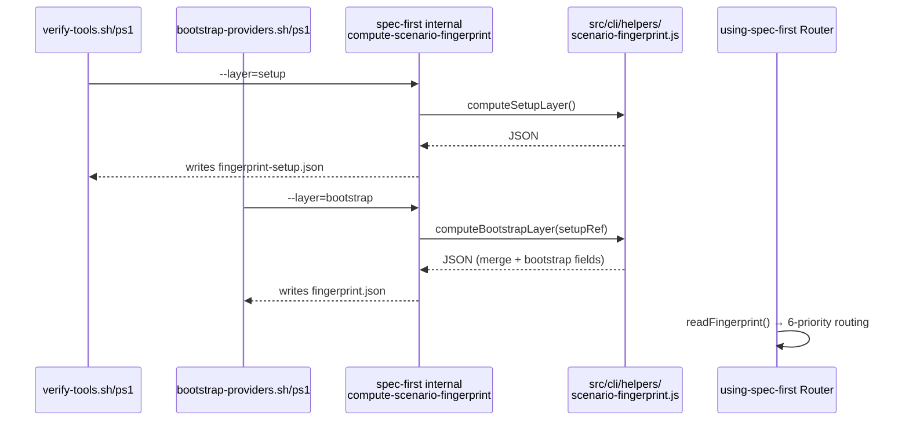

# feat: spec-first 研发场景自适应 Milestone (M1–M4)

## Summary

在 kaz-mvp 多仓实测暴露 4 类系统性设计缺口之后,本 plan 把「场景适配」从散落在每个 workflow 的 prose 判断升级为契约化工程事实。核心产物是两层 Developer Scenario Fingerprint(setup-time + bootstrap-time)、一份外置 Scenario Capability Matrix(default + 3 high-risk override)、以及维度驱动的 Entry Router 升级——让 spec-first 在任意研发场景下都能给 LLM 正确上下文,同时修补 Evidence/Governance/Evaluation Harness 的 7 个已知缺口(D1–D8)。

---

## Problem Frame

当前 spec-first 的隐性假设是「单 git 仓库 + clean worktree」。遇到 multi-repo workspace、non-git build target、跨机器残留、dirty-graph-affecting 等场景时,LLM 看到的是「事实不完整但不知道为什么不完整」——这违反了 Context Harness 的核心承诺和角色契约「Scripts prepare, LLM decides」原则。

2026-05-28 在 `/Users/kuang/xiaobu/kaz-mvp`(Android Gradle 多仓:6 个 git child + 20+ 个非 git Gradle module)实测时,完整暴露了以下缺口:

- **D1** parent 顶层 stale `.spec-first/{graph,config,providers}/**` 无 invalidation 机制(Evidence Harness)
- **D2** graph 完整性等同于 git child repo 边界,忽略 17 个顶层 Gradle module(Context Harness)
- **D3** GitNexus repo label 三源冲突无暴露机制,导致 6/6 query_probe 全部失败
- **D4** parent 顶层 `runtime-capabilities.json.host_ledger_pointer.path` 未刷新(指向 lynwang 路径)
- **D5** `host_instruction_normalization=drift-detected` 只 advisory,不强制 handoff
- **D6** `dirty_paths_breakdown` 是计数不是路径列表,LLM 无法精确降级
- **D7** `query_probe_policy.candidates[]` 与 build target/module 边界无关
- **D8** 无 Evaluation Harness 指标,无法量化 graph 对下游的真实价值

更深层的根因:场景判断散落在各 workflow 各自实现,没有被聚合为统一的**场景指纹**供下游共享消费。

---

## Requirements

- R1. 两层 Scenario Fingerprint(`developer-scenario-fingerprint-setup.v1` + `developer-scenario-fingerprint.v1`)由脚本产出确定性事实字段,`advisory: true` 固定,不作为硬 gate
- R2. Fingerprint schema 在 PA-pre calibration(≥2 个真实仓库 + 1 个合成最小样本)完成后 freeze;枚举值标记 `provisional`,允许 M3 后 RFC 修订
- R3. `using-spec-first` entry router 读 fingerprint 做维度独立路由(6 个优先级),不合成单一评分;老用户宽限规则:fingerprint 不存在但现有 graph artifacts 存在时仅 advisory 提示不强制
- R4. D1 修复:multi-repo workspace 模式下,parent 顶层产物写入 `parent-artifact-quarantine.v1`,提供 `spec-first clean --workspace-orphans` read-only 入口
- R5. D3 修复:`provider-status.json` 增加 `repo_label_resolution` 字段,冲突时 `conflict=true`
- R6. D6 修复:`graph-facts.json` 增加 `dirty_paths_sample[]`(bounded ≤30),含 build_module 字段
- R7. D5 修复:graph-bootstrap final-response 模板固定输出 drift handoff 行
- R8. Evaluation Harness 最小子集(P5-min):graph-bootstrap-summary 增加 `quality_signals.{child_count, process_results_rate, command_failed_rate, dirty_advisory_child_rate}` 4 个字段
- R9. spec-optimize 接入 P5-min 指标作为基线(PD-min)
- R10. `developer-scenario-fingerprint.v1` bootstrap 层 merge setup 层 + bootstrap 新增字段,含 `freshness.stale_setup_layer`;`build_target_coverage_ratio` 在 P4(U8)完成前为 null + reason_code 占位
- R11. D2 修复(Gradle 优先):graph-targets 增加 `non_git_build_modules[]`、`coverage_summary`;npm 扩展在独立后续 unit(U12)
- R12. `docs/contracts/workflows/scenario-capability-matrix.md` default matrix + 3 个 high-risk override(`spec-work` / `spec-code-review` / `spec-debug`)
- R13. 所有新增字段不破坏既有 schema 版本号,`additive=true` contract test 覆盖
- R14. Cross-platform Invariants:fingerprint JSON 中所有 path 字段 POSIX 风格,Bash/PowerShell 产出等价
- R15. 每个 U-unit 独立可发布、独立可回滚

---

## Assumptions

- A1. PA-pre calibration 使用 spec-first 本仓(single-repo, clean) + kaz-mvp(multi-repo, Gradle, foreign-residual)两个真实仓库,加一个本地临时构造的 pnpm workspaces 最小样本;枚举值标记 `provisional`,允许 M3 RFC 修订
- A2. `gitnexus analyze` 依赖 git 元数据,不支持 `--non-git-root`;P4 build-target scan 只做事实采集(读 settings.gradle),不尝试对非 git 目录跑 analyze
- A3. fingerprint 计算逻辑集中在 `src/cli/helpers/scenario-fingerprint.js`(Node),Bash/PowerShell 双宿主脚本通过调用 `spec-first internal compute-scenario-fingerprint` 获取产物;此架构与现有 `compile-workspace-gitnexus-readiness` prior art 一致
- A4. PA-1 改动量中偏大(Node helper + 两套 shell wrapper + dual-host contract test);M1 时间盒按 3-4 周估算

---

## Scope Boundaries

- 不实现非 git 目录的 GitNexus 索引(等上游 `--non-git-root` 支持)
- 不破坏既有 schema 版本号
- 不让 setup/bootstrap 自动删除 parent 污染产物——只 quarantine + 显式 clean 入口
- 不引入新 provider;`advisory: true` 永远固定,不成为任何 workflow 的硬 gate
- 不引入状态机/中心化流程引擎

### Deferred to Follow-Up Work

- P9 build-target-level GitNexus indexing(等上游能力)
- P4 Maven/Bazel/Cargo/Python ecosystem 解析器(M4+ 后续 PR)
- P7 GitNexus capability drift report + P8 probe candidate diversity — 见 origin 文档 A §3.2 Tier-2;不对应 D1–D8 任何核心缺口,归入独立后续 PR
- PB router 优先级配置化:首版固定写死
- `spec-doc-review` high-risk override:PC 阶段决定

---

## Graph Readiness

- target_repo: spec-first
- status: stale
- source_revision: fc3d0ca649ee6739d16302608858e1ef4165fc9f
- current_revision: fc3d0ca6 + dirty (1 graph-affecting file)
- stale: true (dirty-advisory, graph-affecting-blocked)
- primary_providers: gitnexus
- fallback_capabilities: bounded direct repo reads
- runtime_mcp_evidence: not-probed (planning session)
- confidence: advisory (definitions-level only; process graph unavailable)
- limitations: snapshot_mismatch; dirty worktree blocks fresh process-graph; impact evidence unavailable

---

## Graph / GitNexus Evidence

- provider: GitNexus
- capability_status: partial
- evidence_grade: stale
- evidence_posture: fallback
- freshness_state: dirty-advisory
- source_tags: [checked-in-baseline, setup-projection]
- source_reads_required: `skills/spec-mcp-setup/scripts/`, `skills/spec-graph-bootstrap/scripts/`, `src/cli/commands/internal.js`, `src/cli/helpers/compile-workspace-gitnexus-readiness.js`, `src/cli/commands/clean.js`
- impact_on_plan: 仅供参考;主要证据来自 origin 文档实测产物分析 + bounded direct reads
- key_findings: prior art `compile-workspace-gitnexus-readiness.sh` 验证了 Node internal helper + shell wrapper 架构可行性
- limitations: process-graph unavailable; all source reads are direct file reads

---

## Context & Research

### Relevant Code and Patterns

- **[关键 prior art]** `skills/spec-graph-bootstrap/scripts/compile-workspace-gitnexus-readiness.sh` — 调用模式:`exec node "$SPEC_FIRST_CLI" internal workspace-gitnexus-readiness "$@"`;PowerShell 侧:`Invoke-SpecFirstCliCaptured -CliArguments @('internal', 'workspace-gitnexus-readiness', ...)`。新增 `compute-scenario-fingerprint` 完全复用同一调用契约
- `src/cli/commands/internal.js` — 已有 5 个 subcommand 注册模式,新增 `compute-scenario-fingerprint` 走同样路径
- `src/cli/helpers/compile-workspace-gitnexus-readiness.js` — Node helper 模式参考;fingerprint helper 放 `src/cli/helpers/scenario-fingerprint.js`
- `skills/spec-mcp-setup/scripts/verify-tools.{sh,ps1}` — fingerprint-setup 产出在此阶段写入
- `skills/spec-graph-bootstrap/scripts/bootstrap-providers.{sh,ps1}` — fingerprint-bootstrap 产出在此阶段写入
- `src/cli/commands/clean.js` — `--workspace-orphans` read-only 与后续 confirm-delete 扩展点
- `tests/unit/bootstrap-providers-powershell-contracts.test.js` — dual-host contract test prior art;新测试平展命名于 `tests/unit/`
- `docs/contracts/dual-host-governance/` — cross-platform 规则

### Institutional Learnings

- `docs/solutions/` 中 multi-repo workspace、schema additive、dual-host governance 相关 learnings

---

## Key Technical Decisions

- **Node helper + shell wrapper 架构(而非双宿主各自实现)**:fingerprint 计算逻辑集中在 `src/cli/helpers/scenario-fingerprint.js`;Bash/PowerShell 脚本只调用 `spec-first internal compute-scenario-fingerprint --layer=setup|bootstrap`。理由:消除双写复杂 JSON/stat 逻辑的维护成本;dual-host 对称仅在 shell wrapper 调用契约层实现。
- **两层拆分(setup-time vs bootstrap-time)**:setup 层在 mcp-setup verify-tools 阶段产出;bootstrap 层在 graph-bootstrap 完成后通过 `ref:setup_layer` merge。理由:单层 schema 产出时机自相矛盾。
- **维度向量而非单一评分**:`complexity_dimensions.*` 全部 boolean,不合成 0~1 评分。LLM 按任务意图决定哪些维度重要。
- **外置 default matrix + 3 个 high-risk override**:1 份 default contract + 只有 `spec-work`/`spec-code-review`/`spec-debug` 内嵌 override。理由:80/20——7-8 个 workflow 各自维护矩阵是过度设计。
- **`providers_status_refs.*` 引用而非复制**:消除多真相源。
- **PA-pre calibration 结论先于 PA-1 schema freeze**:provisional 枚举值允许 M3 RFC 修订。
- **Evaluation Harness 与产物同步(P5-min 提前)**:P5-min 4 字段在 M2 发布,不等 P4。
- **`build_target_coverage_ratio` 在 PA-2 里 null 占位**:消除 PA-2 对 P4 的阻塞依赖。
- **老用户宽限规则**:fingerprint 不存在但有旧 graph artifacts → advisory 提示,不强制重跑 setup。

---

## Open Questions

### Resolved During Planning

- **Q: fingerprint 是否放进 graph-facts.json?** 不放。graph-facts 是 child-local,fingerprint 是 workspace-level。
- **Q: PA-pre 需要几个真实仓库才 safe?** 2 个真实(spec-first + kaz-mvp) + 1 个合成样本;枚举值 provisional,M3 可修订。
- **Q: fingerprint 复杂逻辑放脚本还是 Node?** Node helper + shell wrapper,与 `compile-workspace-gitnexus-readiness` prior art 一致。
- **Q: U10 是否要打包 4 项?** 不要,违反 R15。拆为 U10(P5-full+PD-full)、U11(P6)、U12(npm)。
- **Q: P7/P8 是否属于本 Milestone?** 不属于——不对应 D1-D8 任何核心缺口,归入独立 follow-up。

### Deferred to Implementation

- `complexity_dimensions.*` 首版字段集合(PA-pre 3 仓库实测后确定)
- Scenario class 完整枚举值(`using-spec-first` RFC 维护)
- Gradle settings.gradle 扫描深度(PA-pre calibration 决定,基准 3 层)
- `state_class` foreign-residual 判断:stat-failed + 路径前缀 mismatch 双重条件的 AND/OR 关系,需在 U2 实施时拍板并加测试
- `tags[]` 命名空间完整枚举(`docs/contracts/developer-scenario-fingerprint.md` 维护)

---

## High-Level Technical Design

> *以下为方向性设计,供审查验证用,不是实现规格。*

```
mcp-setup verify-tools 末尾
  └─ verify-tools.sh/ps1
       → exec spec-first internal compute-scenario-fingerprint --layer=setup --out=...
       → src/cli/helpers/scenario-fingerprint.js
       → .spec-first/workspace/scenario-fingerprint-setup.json

graph-bootstrap bootstrap-providers 末尾
  └─ bootstrap-providers.sh/ps1
       → exec spec-first internal compute-scenario-fingerprint --layer=bootstrap --out=...
       → src/cli/helpers/scenario-fingerprint.js (merge setup layer ref)
       → .spec-first/workspace/scenario-fingerprint.json

using-spec-first entry router
  ├─ 读 scenario-fingerprint.json (优先) / fallback: scenario-fingerprint-setup.json
  ├─ 老用户宽限:不存在但有旧 graph artifacts → advisory 提示,不阻断
  ├─ 6 优先级维度独立判断(不合成评分)
  └─ 推荐"一个入口 · 一个理由 · 一个动作"
```



---

## Implementation Units

### U1. PA-pre Scenario Calibration

**Goal:** 在 2 个真实仓库(spec-first 本仓 + kaz-mvp)+ 1 个合成最小样本实测 fingerprint 维度取值分布,冻结 Scenario class 枚举值(provisional)与 `complexity_dimensions.*` 字段集合;顺带做 best-effort 用户拓扑调查(≤2 天),获取真实使用场景分布。

**Requirements:** R2

**Dependencies:** 无

**Files:**
- Create: `docs/plans/2026-05-28-002-PA-pre-calibration-notes.md`(调研笔记)
- Modify: `docs/03-实施方案/2026-05-28-spec-first-场景自适应实施方案.md`(§10.2 Q1/Q3/Q4 填写结论)

**Approach:**
- 在 spec-first 本仓 + kaz-mvp 各跑 mcp-setup + graph-bootstrap,记录场景维度取值
- 构造最小 pnpm workspaces 样本(2-3 package),覆盖 npm ecosystem
- ≤2 天 best-effort 调查:询问 ≥3 个已知 spec-first 使用场景的开发者,记录仓库拓扑分布;无法调查时写明 limitation
- 输出:Scenario class provisional 枚举 RFC 草稿 + `complexity_dimensions` 字段集 freeze 决议

**Test scenarios:**
- Test expectation: none — 调研性步骤,产物是笔记和决议

**Verification:**
- ≥2 真实仓库 + 1 合成样本实测完成
- Scenario class provisional 枚举值草稿写入 calibration notes

---

### U2. PA-1 Setup-time Fingerprint — Node Helper + Shell Wrapper

**Goal:** 冻结 `developer-scenario-fingerprint-setup.v1` schema,实现 `src/cli/helpers/scenario-fingerprint.js`(setup layer 计算),注册 `internal compute-scenario-fingerprint` subcommand,并在 `verify-tools.{sh,ps1}` 末尾调用产出 fingerprint-setup.json。

**Requirements:** R1, R2, R14

**Dependencies:** U1

**Files:**
- Create: `src/cli/helpers/scenario-fingerprint.js`(Node source-of-truth,setup layer 计算逻辑)
- Modify: `src/cli/commands/internal.js`(注册 `compute-scenario-fingerprint` subcommand)
- Create: `docs/contracts/developer-scenario-fingerprint.md`(schema 单一真相)
- Modify: `skills/spec-mcp-setup/scripts/verify-tools.sh`(末尾调 `exec "$SPEC_FIRST_CLI" internal compute-scenario-fingerprint --layer=setup ...`)
- Modify: `skills/spec-mcp-setup/scripts/verify-tools.ps1`(同上;`Invoke-SpecFirstCliCaptured @('internal','compute-scenario-fingerprint','--layer','setup',...)`)
- Create: `tests/unit/scenario-fingerprint-setup-contracts.test.js`(Node helper schema 校验 + 各拓扑 input/output)
- Modify: `skills/spec-mcp-setup/SKILL.md`(Outputs / Workflow 节)
- Modify: `CHANGELOG.md`

**Approach:**
- `scenario-fingerprint.js` 导出 `computeSetupLayer({ workspaceRoot, childRepos, ... })`,返回 setup-layer JSON;与 `compile-workspace-gitnexus-readiness.js` 相同的函数式风格
- `internal.js` 新增分支:`if (subcommand === 'compute-scenario-fingerprint')` → 调 helper
- shell 调用契约参照 `compile-workspace-gitnexus-readiness.sh`:三级 fallback `node "$SPEC_FIRST_CLI" internal ...` → `"$SPEC_FIRST_CLI" internal ...` → `spec-first internal ...`
- `advisory: true` 固定写死;`foreign_residual_indicators` 用 stat 失败 **AND** 路径前缀 mismatch 双重判断(两条规则都需满足才标 foreign-residual);这条 AND/OR 决策在实施时写入注释
- `state_class` 枚举值从 U1 calibration 结论读入;首版 provisional,文件内注释标注
- PowerShell 侧所有 path 字段调 `$_.Replace('\','/')` 转 POSIX

**Patterns to follow:**
- `skills/spec-graph-bootstrap/scripts/compile-workspace-gitnexus-readiness.sh` — shell wrapper 模式
- `src/cli/helpers/compile-workspace-gitnexus-readiness.js` — Node helper 模式
- `tests/unit/bootstrap-providers-powershell-contracts.test.js` — dual-host contract test 命名与断言风格

**Test scenarios:**
- Happy path: spec-first 本仓(single-repo, clean) → `repo_topology=single-repo`, `state_class=clean`, `complexity_dimensions.*` 全 false
- Happy path: kaz-mvp(multi-repo-workspace, submodule-heavy) → `child_repo_count=6`, `submodule_heavy=true`
- Edge case: parent `.spec-first/graph/graph-facts.json.repo_root` stat 失败 **且** 路径前缀与当前 home 不一致 → `state_class=foreign-residual`, `foreign_residual_indicators` 非空
- Edge case: 正常 git clone 首次(无旧 artifacts) → `state_class=first-time-on-new-machine`,不误判为 foreign-residual
- Edge case: WSL 路径 `/mnt/c/...` — stat 成功且路径前缀规则不触发 → 不标 foreign-residual
- Cross-platform: PowerShell 产出的 `foreign_residual_indicators[].path` 无反斜杠
- internal CLI: `spec-first internal compute-scenario-fingerprint --layer=setup` 输出合法 JSON 且 `advisory=true`

**Verification:**
- `npm run test:unit` 通过 `scenario-fingerprint-setup-contracts.test.js`
- spec-first 本仓跑 mcp-setup 后,`.spec-first/workspace/scenario-fingerprint-setup.json` 存在且 `schema_version=developer-scenario-fingerprint-setup.v1`

---

### U3. PB Entry Router — 场景驱动 using-spec-first 升级

**Goal:** 升级 `using-spec-first` guide mode:读 fingerprint 做 6 优先级维度独立路由;加入老用户宽限规则。

**Requirements:** R3

**Dependencies:** U2(PA-1 后即可发布,PA-2/U7 完成后自动增强)

**Files:**
- Modify: `skills/using-spec-first/SKILL.md`(router 段落)
- Modify: `tests/integration/`(router 端到端行为,平展命名 `scenario-fingerprint-router-integration.test.js` 或 smoke 级)
- Modify: `CHANGELOG.md`

**Approach:**
- **老用户宽限规则(新增,优先级最低):**
  - fingerprint 不存在 **且** 已有 graph artifacts → advisory 提示"建议重跑 mcp-setup 升级场景指纹",不阻断后续 workflow
  - fingerprint 不存在 **且** 无任何旧 artifacts → 推荐先跑 `/spec:mcp-setup`
- **6 优先级路由(维度独立,不合成评分):**
  1. `state_class=foreign-residual` 或 `foreign_residual_indicators.length>0` → `spec-first clean --workspace-orphans` + `spec-first init`
  2. `state_class=first-time-on-new-machine` → `/spec:mcp-setup`
  3. `complexity_dimensions.git_alignment_broken=true` **且** 任务涉及 impact/review/refactor → 告知覆盖盲区
  4. `providers_status_refs.gitnexus` 引用 status 为 unavailable/query-unverified → `/spec:graph-bootstrap` 或 fallback
  5. `complexity_dimensions.worktree_dirty_graph_affecting=true` **且** 任务涉及 commit/PR → 提示 dirty 列表
  6. 上述都不命中 → 按用户意图正常路由
- 每次推荐"一个入口 · 一个理由 · 一个动作";所有推荐均为 advisory,LLM 可越级
- `freshness.stale_setup_layer=true` → 主动提示重跑 setup(advisory)

**Test scenarios:**
- Integration: `state_class=clean` + 用户意图 review → 正常路由 `/spec:code-review`
- Integration: `state_class=foreign-residual` → 优先级 1 触发,输出 clean + init 建议
- Integration: fingerprint 不存在 + 旧 graph artifacts 存在 → advisory 提示,不阻断
- Integration: fingerprint 不存在 + 无旧 artifacts → 推荐先跑 mcp-setup

**Verification:**
- `npm run lint:skill-entrypoints` 通过
- fresh-source eval 验证老用户宽限行为语义

---

### U4. P0 Parent Artifact Quarantine + Clean read-only

**Goal:** 修复 D1。mcp-setup 识别 multi-repo workspace 时写入 `parent-artifact-quarantine.v1`;提供 `spec-first clean --workspace-orphans` read-only 列举入口。

**Requirements:** R4

**Dependencies:** U2(共享 foreign_residual_indicators 检测逻辑)

**Files:**
- Modify: `skills/spec-mcp-setup/scripts/verify-tools.sh` / `verify-tools.ps1`(multi-repo 检测后写 quarantine 文件)
- Modify: `src/cli/commands/clean.js`(`--workspace-orphans` read-only 子命令)
- Create: `tests/unit/workspace-quarantine-contracts.test.js`
- Modify: `CHANGELOG.md`

**Approach:**
- quarantine JSON schema(`parent-artifact-quarantine.v1`):
  - `topology: multi-repo-workspace`, `advisory: true`
  - `quarantined_paths[]`: `{path, reason_code, stale_indicator, last_generated_at, fingerprint_origin}`
  - reason_code 枚举:`parent-workspace-must-not-have-repo-local-graph` / `foreign-absolute-path-stat-failed`
  - `next_action`: 固定文案提示用户确认后再执行 `spec-first clean --workspace-orphans --confirm`
- `mcp-setup-summary.json` 增加 `parent_workspace_pollution_count`
- `spec-first clean --workspace-orphans` 无 `--confirm` 时只列举路径不删除

**Patterns to follow:**
- `src/cli/commands/clean.js` 现有 `--claude`/`--codex` 命令结构

**Test scenarios:**
- Happy path: multi-repo + 顶层 stale graph-facts.json(repo_root 指向外机) → quarantine 文件写入,`quarantined_paths` 非空
- Happy path: single-repo → 不写 quarantine 文件
- `spec-first clean --workspace-orphans`(无 confirm) → 只打印路径,不删除

**Verification:**
- kaz-mvp 场景跑 mcp-setup 后,`.spec-first/workspace/parent-artifact-quarantine.json` 存在且含 `.spec-first/graph/graph-facts.json` 和 `.gitnexus/`

---

### U5. P1 Repo Label Resolution + P2 Dirty Paths Sample

**Goal:** 修复 D3(repo label 冲突无暴露)和 D6(dirty 影响面只有计数)。

**Requirements:** R5, R6

**Dependencies:** 无(独立字段增量)

**Files:**
- Modify: `skills/spec-graph-bootstrap/scripts/bootstrap-providers.sh` / `bootstrap-providers.ps1`(写 provider-status + graph-facts 时增字段)
- Modify: `tests/unit/spec-graph-bootstrap-contracts.test.js`(现有平展命名文件,扩展断言)
- Modify: `CHANGELOG.md`

**Approach:**
- `provider-status.json.gitnexus.repo_label_resolution`:
  - `selected`, `selected_source`, `candidates[]`, `conflict: bool`
  - 冲突时 `next_action: "rerun spec-mcp-setup or run gitnexus analyze --force"`
- `graph-facts.v1.dirty_paths_sample[]`:
  - 上限 ≤30 条,`graph_affecting=true` 优先
  - 每条含 `path`, `build_module`(best-effort, null 可), `graph_affecting: bool`
  - `dirty_paths_breakdown` 保留原有计数(additive)

**Test scenarios:**
- Happy path (P1): 三源 label 一致 → `conflict=false`
- Error path (P1): `.gitnexus/meta.json` label=`kaz-app` 但 git remote basename=`kaz-mvp` → `conflict=true`
- Happy path (P2): 2 个 graph-affecting 文件 → `dirty_paths_sample` 含对应条目
- Edge case (P2): dirty 文件 > 30 → 截断,不报错

**Verification:**
- spec-first 本仓 dirty 时 graph-facts.json 含 `dirty_paths_sample[]`
- 新增字段不改 schema 版本号(additive contract test 通过)

---

### U6. P3 Drift Handoff + P5-min Evaluation Harness

**Goal:** 修复 D5(强制 handoff 行);同步发布 P5-min 4 字段 + PD-min spec-optimize 接入。

**Requirements:** R7, R8, R9

**Dependencies:** U5(quality_signals 计数来源)

**Files:**
- Modify: `skills/spec-graph-bootstrap/SKILL.md`(final-response 模板固定 drift handoff 行)
- Modify: `skills/spec-graph-bootstrap/scripts/bootstrap-providers.sh` / `bootstrap-providers.ps1`(`quality_signals` 最小子集写入 bootstrap-summary)
- Modify: `skills/spec-optimize/SKILL.md`(接入 quality_signals 基线)
- Modify: `tests/unit/spec-graph-bootstrap-contracts.test.js`
- Modify: `CHANGELOG.md`

**Approach:**
- P3:graph-bootstrap SKILL.md final-response 模板,当 `parent_host_instruction_normalization.status=drift-detected` 时必须输出固定行:
  `- Host instruction drift detected (advisory). Run: spec-first init  to refresh AGENTS.md / CLAUDE.md GitNexus blocks.`
- P5-min quality_signals(**仅 4 字段**,不含 build_target_coverage_ratio):
  - `child_count`, `process_results_rate`, `command_failed_rate`, `dirty_advisory_child_rate`
  - `build_target_coverage_ratio` 不在 P5-min 范围,在 PA-2(U7)schema 里 null 占位,P4(U8)完成后回填
- PD-min:spec-optimize SKILL.md 新增段落,`process_results_rate < 0.5` 触发图谱质量降级建议

**Test scenarios:**
- drift-detected 状态 → final response 包含固定 handoff 行
- 无 drift → 不输出额外行
- 6 child 全成功 → `process_results_rate=1.0`, `command_failed_rate=0.0`
- 2/6 child 失败 → `command_failed_rate≈0.33`

**Verification:**
- `npm run test:graph-bootstrap` 通过
- quality_signals 含且仅含 4 个字段(contract test)

---

### U7. PA-2 Bootstrap-time Fingerprint

**Goal:** 冻结 `developer-scenario-fingerprint.v1` schema;在 `bootstrap-providers.{sh,ps1}` 末尾调 `internal compute-scenario-fingerprint --layer=bootstrap` 产出 bootstrap 层;`build_target_coverage_ratio` 在 P4 前为 null + reason_code 占位。

**Requirements:** R1, R10, R14

**Dependencies:** U2(setup 层存在), U5(dirty_paths_sample), U6(quality_signals)

**Files:**
- Modify: `src/cli/helpers/scenario-fingerprint.js`(新增 `computeBootstrapLayer()`,merge setup 层 ref + bootstrap 字段)
- Modify: `docs/contracts/developer-scenario-fingerprint.md`(更新至 bootstrap 层 schema,含 null 占位说明)
- Modify: `skills/spec-graph-bootstrap/scripts/bootstrap-providers.sh` / `bootstrap-providers.ps1`(末尾调 `internal compute-scenario-fingerprint --layer=bootstrap`)
- Create: `tests/unit/scenario-fingerprint-bootstrap-contracts.test.js`
- Modify: `CHANGELOG.md`

**Approach:**
- bootstrap 层字段:
  - `topology.git_misaligned_build_targets`: null,`reason_code: "pending-build-target-scan-p4"`(P4/U8 完成后回填)
  - `topology.build_target_coverage_ratio`: null,同上
  - `worktree.dirty_child_count`:从 quality_signals 读取
  - `providers_status_refs.gitnexus.*`:引用 child 仓代表性 provider-status 字段路径
  - `freshness.stale_setup_layer`:对比 setup 层 child_revisions 与当前 git revision
  - `freshness.bootstrap_generated_at`
- setup 层不存在时:不产出 bootstrap fingerprint,summary 写 `fingerprint-setup-missing: true`,不阻断主流程

**Test scenarios:**
- Happy path: setup 层存在 + bootstrap 成功 → fingerprint.json 产出,`build_target_coverage_ratio=null`
- Edge case: setup 层 child_revisions 与 bootstrap 时 git revision 不一致 → `stale_setup_layer=true`
- Error path: setup 层不存在 → 不产出 fingerprint.json;summary 含 `fingerprint-setup-missing: true`
- Cross-platform: PowerShell 产出 fingerprint.json 的 path 字段无反斜杠

**Verification:**
- spec-first 本仓跑 mcp-setup + graph-bootstrap 后,`.spec-first/workspace/scenario-fingerprint.json` 存在且 `build_target_coverage_ratio=null`
- kaz-mvp 场景产出 fingerprint.json,`worktree.dirty_child_count=6`

---

### U8. P4 Build-target Awareness — Gradle

**Goal:** 修复 D2(Gradle 优先)。`graph-targets.json` 增加 `non_git_build_modules[]` 和 `coverage_summary`;同步回填 U7 fingerprint 的 null 字段。

**Requirements:** R11(Gradle 优先部分)

**Dependencies:** U7(PA-2 fingerprint null 占位待回填)

**Files:**
- Modify: `skills/spec-graph-bootstrap/scripts/resolve-workspace-graph-targets.sh` / `resolve-workspace-graph-targets.ps1`(Gradle manifest 扫描 + graph-targets 写入)
- Create: 如需要,`skills/spec-graph-bootstrap/scripts/lib-build-manifest-gradle.sh` / `lib-build-manifest-gradle.ps1`(Gradle 解析 helper)
- Modify: `tests/unit/spec-graph-bootstrap-contracts.test.js`(扩展 graph-targets schema 测试)
- Modify: `CHANGELOG.md`

**Approach:**
- graph-targets.json 新增字段(additive):
  - `non_git_build_modules[]`: `{path, kind, manifest, in_settings_gradle, covered_by_child_repo, graph_coverage}`
  - `coverage_summary`: `{total_build_targets, covered_by_git_children, uncovered_build_modules, coverage_ratio}`
  - `graph_coverage_class`: `full` / `git-roots-only` / `partial-build-targets` / `none`
- Gradle 解析:读 `settings.gradle`(Groovy)静态 `include ':a:b:c'` 指令,扫描深度 3 层;`settings.gradle.kts`(KTS)与 `includeBuild`(composite)→ `coverage_inference: skipped, reason_code: kts-or-composite-not-supported`
- 解析失败时不阻断主流程:`coverage_inference: "skipped"`, `reason_code: "gradle-parse-error"`
- 完成后调用 U7 helper 回填 fingerprint 的 null 字段

**Test scenarios:**
- Happy path: kaz-mvp settings.gradle(Groovy 静态 include) → `non_git_build_modules` 含 app-kaz/app-core/annotation 等,`coverage_ratio≈0.26`
- Edge case: `settings.gradle.kts` → `coverage_inference: skipped, reason_code: kts-or-composite-not-supported`
- Edge case: 无 settings.gradle → `non_git_build_modules=[]`, `coverage_inference: skipped`
- Integration: U7 fingerprint 在 P4 后 `build_target_coverage_ratio` 从 null 更新为实际值

**Verification:**
- kaz-mvp 场景 graph-bootstrap 后,`graph-targets.json.coverage_summary.uncovered_build_modules≥17`
- `graph_coverage_class=partial-build-targets`
- additive contract test 通过(不改版本号)

---

### U9. PC Scenario Capability Matrix

**Goal:** 产出 default matrix contract;3 个 high-risk workflow 新增 override;其他公开 workflow 新增 default 声明一行。

**Requirements:** R12, R13

**Dependencies:** U7(fingerprint schema 稳定,Required Evidence 列引用字段必须存在)

**Files:**
- Create: `docs/contracts/workflows/scenario-capability-matrix.md`
- Modify: `skills/spec-work/SKILL.md`(新增 Scenario Capability override 节)
- Modify: `skills/spec-code-review/SKILL.md`(同上)
- Modify: `skills/spec-debug/SKILL.md`(同上)
- Modify: `skills/spec-plan/SKILL.md` + 其他公开 workflow SKILL.md(新增 default 声明一行)
- Create: `tests/unit/scenario-capability-matrix-contracts.test.js`
- Modify: `CHANGELOG.md`

**Approach:**
- default matrix 固定 5 列:`Scenario class | Capability class | Required Evidence | Fallback path | LLM 决策点`
- Capability class 枚举:`full` / `bounded` / `partial` / `fallback-only` / `blocked-action-required`
- Scenario class provisional 枚举值由 U1 决议确定(首版 9 个)
- high-risk override 必须含 `foreign-residual → blocked-action-required` 和 `unavailable-provider → fallback-only`
- 非 high-risk workflow 只加:
  ```
  ## Scenario Capability
  Follows `docs/contracts/workflows/scenario-capability-matrix.md` (default).
  Overrides: none
  ```
- contract test:每个 Capability class ≥1 测试案例;每个 Scenario class ≥1 行覆盖

**Test scenarios:**
- default matrix 含所有 provisional Scenario class,每行 5 列完整
- `spec-code-review` override 含 `foreign-residual → blocked-action-required`
- Capability class 枚举值全在规定取值内

**Verification:**
- `npm run lint:skill-entrypoints` 通过
- contract test 全部通过
- 所有公开 workflow SKILL.md 含 `## Scenario Capability` 节

---

### U10. P5-full + PD-full — Evaluation Harness 完整子集

**Goal:** 补全 quality_signals 剩余字段;spec-optimize 扩展使用全集。

**Requirements:** R8(full), R13

**Dependencies:** U8(build_target_coverage_ratio 已有), U6(P5-min 已发布)

**Files:**
- Modify: `skills/spec-graph-bootstrap/scripts/bootstrap-providers.sh` / `bootstrap-providers.ps1`(补全 quality_signals 字段)
- Modify: `skills/spec-optimize/SKILL.md`(PD-full 接入全集 + 维度向量)
- Modify: `tests/unit/spec-graph-bootstrap-contracts.test.js`
- Modify: `CHANGELOG.md`

**Approach:**
- P5-full 补全 3 个字段(在 P5-min 4 字段基础上):
  - `build_target_coverage_ratio`(从 U8 回填)
  - `impact_probe_with_test_provenance_rate`
  - `host_instruction_drift_rate`
- PD-full:spec-optimize 读取维度向量 `complexity_dimensions.*` + 全集 quality_signals,产出循环优化建议

**Test scenarios:**
- quality_signals 7 字段齐全(4 from P5-min + 3 new)
- `host_instruction_drift_rate=1.0` 时 spec-optimize 建议重跑 `spec-first init`

**Verification:**
- quality_signals 全集字段存在且值合理

---

### U11. P6 Clean Preview-first Delete

**Goal:** 将 `spec-first clean --workspace-orphans` 从 read-only 列举升级为 preview-first 实际删除。

**Requirements:** R13, R15

**Dependencies:** U4(read-only 版已发布)

**Files:**
- Modify: `src/cli/commands/clean.js`(`--workspace-orphans --confirm` 升级为实际删除)
- Modify: `tests/unit/clean-workspace-orphans-contracts.test.js`(新增或扩展)
- Modify: `CHANGELOG.md`

**Approach:**
- `--workspace-orphans`(无 `--confirm`) → preview 输出待删除路径,提示"加 `--confirm` 执行删除"
- `--workspace-orphans --confirm` → preview 输出 + 请求确认 → 确认后删除 quarantine 文件记录的路径
- 需要 `parent-artifact-quarantine.json` 存在;不存在时提示先跑 mcp-setup

**Test scenarios:**
- Happy path: `--workspace-orphans --confirm` → 删除 kaz-mvp 顶层 stale 产物,不影响 child 仓
- Error path: quarantine 文件不存在 → 提示先跑 mcp-setup

**Verification:**
- `spec-first clean --workspace-orphans --confirm` 后 `.spec-first/graph/graph-facts.json`(parent 顶层)不再存在

---

### U12. P4-npm Build-target Awareness

**Goal:** 扩展 P4,增加 npm/pnpm workspace 解析器。

**Requirements:** R11(npm 部分), R13

**Dependencies:** U8(Gradle 解析器框架已有)

**Files:**
- Modify: `skills/spec-graph-bootstrap/scripts/resolve-workspace-graph-targets.sh` / `resolve-workspace-graph-targets.ps1`(增加 npm/pnpm 解析)
- Modify: `tests/unit/spec-graph-bootstrap-contracts.test.js`
- Modify: `CHANGELOG.md`

**Approach:**
- 读 `package.json.workspaces`(string[] 或 object)+ `pnpm-workspace.yaml`
- 失败时退回 `coverage_inference: skipped, reason_code: npm-parse-error`

**Test scenarios:**
- Happy path: pnpm-workspace.yaml 含 `packages: ['packages/*']` → 枚举 packages/ 子包

**Verification:**
- pnpm workspaces 样本中 `graph_coverage_class` 包含 npm 模块信息

---

## System-Wide Impact

- **Interaction graph:** `mcp-setup verify-tools` → fingerprint-setup → `graph-bootstrap bootstrap-providers` → fingerprint + quality_signals → `using-spec-first` router → 所有下游 workflow capability decision
- **Error propagation:** fingerprint 计算失败时 Node helper 返回 exit code 非零;shell wrapper 捕获后 warn-and-continue(不阻断主流程);summary 记录 `fingerprint-failed: true`
- **State lifecycle risks:** `stale_setup_layer` 对比需 per-child git rev;多 child 并发 bootstrap 时 revision 对比 per-child 独立
- **API surface parity:** fingerprint path 字段 POSIX 强制;`state_class` 枚举跨平台同名
- **Integration coverage:** mcp-setup → fingerprint-setup → graph-bootstrap → fingerprint → using-spec-first → capability matrix 全链路 smoke test(kaz-mvp 场景)
- **Unchanged invariants:** 既有 schema 版本号不变;现有 downstream workflow 可忽略未知字段

---

## Risks & Dependencies

| Risk | Likelihood | Impact | Mitigation |
|------|-----------|--------|------------|
| PA-pre 仅 2 真实样本,Scenario class 枚举不够 | Medium | Medium | provisional 标记 + M3 RFC 修订窗口;U1 包含 best-effort 用户调查 |
| PA-1 实际改动量超出 3-4 周估算(Node helper + 双宿主 wrapper + contract test) | Medium | High | A4 明确;PA-1 完成后 prototype 实测,超期则 re-plan M2 |
| Gradle KTS / composite build 无法解析,kaz-mvp 覆盖率仍接近零 | High | Medium | fallback `coverage_inference: skipped`;Groovy 静态 include 是 kaz-mvp 主要场景;KTS 推 M4 |
| fingerprint 误判 WSL/Docker 路径为 foreign-residual | Low | High | stat + 路径前缀双重判断(AND);U2 contract test 覆盖 WSL 路径场景 |
| `host_instruction_drift_rate=1.0` 持续告警疲劳 | Medium | Low | CHANGELOG user-visible 注明;advisory 不阻断;onboarding 文档说明触发条件 |
| PA-2 发布后 using-spec-first 读到 stale bootstrap 层 | Low | Medium | `freshness.stale_setup_layer` 字段显式暴露;U3 router 提示重跑 |
| PowerShell 反斜杠路径泄漏 | Medium | Medium | shell wrapper 强制 POSIX 转换;dual-host contract test |
| M1 上线后老用户首次调用被强制重跑 setup | 已缓解 | Low | R3/U3 老用户宽限规则:advisory 提示不阻断 |

---

## Success Metrics

**实施完成指标:**
- kaz-mvp 场景:`graph_coverage_class=partial-build-targets`,`coverage_ratio≈0.26`
- kaz-mvp 场景:`parent-artifact-quarantine.json` 含 stale graph-facts + .gitnexus
- using-spec-first:`foreign-residual` 时优先级 1 触发 clean + init 建议
- spec-optimize:在 `process_results_rate < 0.5` 的 workspace 给出量化降级建议
- `npm test` 全绿

**功能价值指标(M3 完成后人工评估):**
- 在 spec-first 本仓 + kaz-mvp + 合成样本实跑场景路由,**LLM 路由建议命中率 ≥80%**(人工标注参考答案)
- kaz-mvp 场景:U3 router 推荐 `spec-first clean` 后,quarantine.json 路径与实际污染产物的**召回率 ≥90%**
- 所有既有 unit/smoke/integration/e2e test 通过率 100%(回归基线)

---

## Phased Delivery

### M1(3–4 周)— 场景指纹首版可用

- U1 PA-pre Scenario Calibration
- U2 PA-1 Setup-time Fingerprint
- U3 PB Entry Router

### M2(2–3 周)— Evidence + Evaluation Harness 同步

- U4 P0 Quarantine + Clean read-only
- U5 P1 Repo Label + P2 Dirty Paths
- U6 P3 Drift Handoff + P5-min

### M3(3–4 周)— 完整事实闭环

- U7 PA-2 Bootstrap-time Fingerprint
- U8 P4 Build-target Awareness(Gradle)
- U9 PC Scenario Capability Matrix

### M4(2–3 周)— 深化与收尾

- U10 P5-full + PD-full
- U11 P6 Clean preview-first delete
- U12 P4-npm

---

## Dependencies / Prerequisites

- Node.js + jq 已可用(verify-tools.sh 已检查)
- dual-host-governance Bash/PowerShell 对称(prior art 已有,需扩展 invariant test)
- PA-pre calibration 结论是 U2 schema freeze 的前提(M1 内串行)

---

## Documentation Plan

- `CHANGELOG.md`:每个 U-unit 独立条目,user-visible 行为变化标 `(user-visible)`
- **M1 发布时** README / `README.zh-CN.md` 加"场景自适应(M1 部分可用,M3 完整)"段落(不等 M3)
- **M1 发布时** CHANGELOG user-visible 行明确:"老用户重跑 mcp-setup 即可获得场景指纹;不重跑不影响既有 workflow"
- M3 完成后 `docs/05-用户手册/` 新增"研发场景与降级路径"完整章节
- `docs/contracts/developer-scenario-fingerprint.md`:U2 开始,U7 完善
- `docs/contracts/workflows/scenario-capability-matrix.md`:U9

---

## Sources & References

- **Origin 文档 A:** `docs/03-实施方案/2026-05-28-mcp-setup-graph-bootstrap-深度优化建议.md`
- **Origin 文档 B:** `docs/03-实施方案/2026-05-28-spec-first-场景自适应实施方案.md`
- 角色契约: `docs/10-prompt/结构化项目角色契约.md`
- Harness 6 层模型: `docs/contracts/ai-coding-harness.md`
- Prior art shell wrapper: `skills/spec-graph-bootstrap/scripts/compile-workspace-gitnexus-readiness.sh`
- Prior art dual-host contract test: `tests/unit/bootstrap-providers-powershell-contracts.test.js`
- Cross-platform 规则: `docs/contracts/dual-host-governance/`
