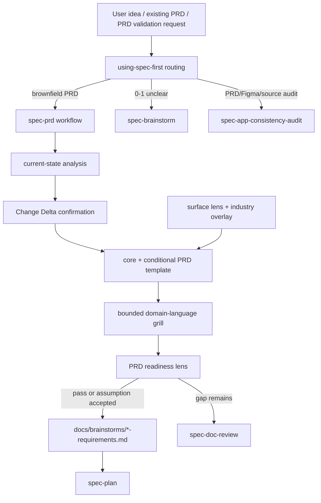

# feat: spec-prd 增量 PRD workflow 落地计划

## Summary

新增公开 workflow `spec-prd`，用于已有系统上的增量需求迭代 PRD 生成、完善与可规划性检查。v1 采用单入口、current-state evidence、bounded domain-language grill、core+conditional 模板、surface lens + 证券行业 overlay。**产物形态**：普通小/中增量默认**单文件 PRD**；owner 确认的超大初版 PRD 支持**轻量多文档拓扑**（原始 PRD by-reference + split summary + child PRD，共享 base `spec_id`）；完整 Requirements Packet / Multi-Surface Packet / manifest / trace-ledger 是 **v2+**。并把 `docs/需求文档模版/标准模版/` 的人用模板库与 `skills/spec-prd/references/*` 的 runtime authoring contract 建成可审查的同源关系。

---

## Problem Frame

origin 文档已经裁决：`spec-brainstorm` 继续负责 0-1 WHAT shaping，`spec-prd` 负责产品 owner 在已有系统上把一句话增量、低质量碎片或已有 PRD 转成可交给 `spec-plan` 的 PRD-grade requirements。当前还缺一条可实施路径，把新增 workflow、双宿主入口、current-state analysis、证券行业模板 overlay、readiness gate、routing tie-break、eval 与 docs/test 一次性收敛到 source-of-truth，而不手改 generated runtime mirror。

本计划把用户提出的“双向优化”作为硬边界：模板库不是孤立文档，必须反向塑造 `spec-prd` 的 output template 和 domain lenses；`spec-prd` runtime reference 也必须约束模板库后续演化，避免人用模板与 skill 输出模板各自漂移。

---

## Requirements

> **ID 命名空间约定**：本节及各 Implementation Unit 的 `Requirements: Rx` 指**本计划内的 plan-R**（R1-R12），括号内 `（origin …）` 才是 origin 需求文档的 R/AE/F/U ID。二者命名空间不同，plan R8 ≠ origin R8。

- R1. 新增单一公开 workflow `spec-prd`，支持内部 `create`、`refine`、`validate` intent；`code-align` 只作为 evidence posture / report-only 子模式，不拆公开入口。（origin R1-R6c, R36-R37, AE1-AE2b, AE5c, AE9）
- R2. 在 PRD 生成前执行 scope-appropriate current-state analysis，输出 `Current System Snapshot` 与 `Change Delta`，所有 current-state claim 必须带 evidence tag，GitNexus 只能作为 pointer 或 session-local orientation。（origin R7-R13, R23c, R40, AE3-AE4）
- R3. 产物仍写 `docs/brainstorms/*-requirements.md`，frontmatter 保留 `spec_id` / `artifact_kind: prd-requirements`，PRD 采用 core+conditional 模板并保留 requirement↔acceptance trace、稳定 ID 续接、trace/readiness 摘要自检、Success Metrics conditional、语言策略和 WHAT-not-HOW 边界。（origin R14-R23f, R35, AE5-AE5f, AE5c2）
- R4. `spec-prd` 必须组合 surface lens 与 industry overlay；证券行业 overlay 是首个行业示例，覆盖监管辖区、客户/账户/产品范围、适当性、AML/KYC、行情、交易、资金清结算、风控、审计、精度与时区。（origin R22b-R22c, R24-R30c, R32, AE5d, AE6-AE6b）
- R5. `docs/需求文档模版/标准模版/` 是 human-facing 标准模板库；`skills/spec-prd/references/prd-output-template.md` 与 `domain-lenses.md` 是 runtime authoring contract。实现必须声明 derive / reference / intentionally diverge 关系，并提供 drift 暴露机制。（origin R16d, R30c, AE11）
- R6. v1 以 by-reference 复用既有 Requirements Readiness Gate，不物理抽共享 contract；`prd-readiness-lens.md` 追加 PRD-specific lens，readiness 失败时输出最小补齐问题或风险记录，完成后只 handoff 到 refine / doc-review / plan / done。（origin R31-R35, AE7, AE10）
- R7. readiness reviewer 是 eval-gated 内部 helper：v1 默认由 orchestrator 自执行 readiness lens；只有 fresh-source eval 证明自审稳定失效时，才实体化 `agents/spec-requirements-readiness-reviewer.agent.md` 并同步 doc-review persona 契约。（origin R38-R39, AE8）
- R8. v1 不新增 `docs/prds/`、不新增 evidence enum、不实现 Requirements Packet / Multi-Surface Packet / packet 级 parent-child 拆分完整能力；复杂度识别闸只输出 split-decision 建议与 handoff。（origin NG6-NG8, R6b, R41, AE2b）
- R9. 完整落地必须覆盖 dual-host governance、Claude command template、Codex workflow skill delivery、routing、spec-plan intake、focused tests、fresh-source eval fixtures、README / README.zh-CN / 用户手册 / CHANGELOG。（origin U8-U13）
- R10. 对 PM 初版超大 PRD，v1 必须支持轻量多文档拓扑：原始 PRD/source input by-reference、split summary requirements 文档、多个 child PRD requirements 文档；同一大需求共享 base `spec_id` / slug，child PRD 通过 `document_role: child-prd` + 唯一 `child_id` 区分模块，并回链 `parent_spec_id` / `source_prd` / `split_summary`，且只能在 owner 确认拆分后落盘。（origin R6d, F1c, AE2c, U7b）
- R11. 借鉴 `grill-with-docs` 的有效模式，但只实现 bounded domain-language grill：能用代码/文档/既有术语或 ADR-like 材料回答的问题先查证再问；术语冲突、用户说法与源码矛盾、领域边界模糊时给推荐答案和最小 owner 问题；结果写入 PRD 的 Glossary、Evidence And Assumptions、Decision Notes 或 Outstanding Questions，不默认创建 `CONTEXT.md` / ADR / 长期知识库。（origin R13b, R17b, R21b, R23e, AE5g）
- R12. 借鉴 `cf-task:prd` 的 workflow ergonomics，但不采用其 artifact topology：实现输入模式判定（requirements 草稿恢复、其他 Markdown 参考、plan/design/task handoff、纯文本 create、无输入交互）、轻量需求绕行、最小阻塞的聚焦提问、跳过已知维度、用户“你定”时给 evidence-backed 默认值、稳定 trace ID 续接和收尾 trace 缺口自检；不引入 `.code-flow/tasks`、`.prd.md/.design.md` 后缀契约或 PRD→design→plan 中间文档链。（origin R6e, R21c, R23b, R23f, S7, AE5c2, D17）

**Origin actors:** A1 产品/业务 owner；A2 `spec-prd` orchestrator；A3 Evidence provider；A4 Downstream planner；A5 Reviewer；A6 内部 readiness reviewer helper。

**Origin flows:** F1 Create PRD from increment；F1b Existing PRD refinement；F1c Oversized initial PRD split-decision；F2 One-line increment to PRD；F3 Idea routing；F4 Code-aware validation；F5 Plan handoff。

**Origin acceptance examples:** AE1-AE11（含 AE2c）全部影响实现或验证；本计划在 Implementation Units 中按主要覆盖关系引用，不逐条复制验收正文。

---

## Assumptions

- A1. 当前工作树中的 `docs/需求文档模版/标准模版/` 计划作为 source docs 一并进入这条 spec chain；如果实施前该目录被移除，U3 必须退回 origin R16d/R22c/R30c 的抽象要求重新建立模板 seed。
- A2. v1 不要求默认联网检索证券监管资料。行业 overlay 只提供 PRD 作者期待确认清单；真实规则必须来自用户、合规确认、source docs 或显式外部研究并带 evidence tag。
- A3. 当前 Codex 会话没有用户显式授权 subagents；因此本计划不依赖本轮多 agent research 输出。实施阶段若需要 fresh-source eval，应按 host dispatch 授权边界执行或明确记录未运行原因。

---

## Scope Boundaries

- 不把 `spec-prd` 做成 `spec-brainstorm` 的换名版，也不把 0-1 产品探索拉进 PRD 模板生成。
- 不新增多个公开 PRD workflow，不公开 readiness reviewer，不把 internal helper 写成 `$spec-*` 或 `/spec:*` 入口。
- 不新增 `docs/prds/`，不改变 `docs/brainstorms/*-requirements.md` 作为需求 artifact 的现有链路。
- 不抽取 shared readiness gate 到 `docs/contracts/workflows/requirements-readiness-gate.md`；这是 v2 重构项。
- 不把证券行业常识写成合规事实，不替代法务/合规/牌照主体确认。
- 不手改 `.claude/`、`.codex/`、`.agents/skills/` generated runtime mirrors；source 修改后如需 runtime 对齐由 `spec-first init` 生成。

### Deferred to Follow-Up Work

- v2 Requirements Packet、Multi-Surface Packet、Parent/Child 拆分、manifest / trace-ledger / integration-contracts 结构。
- shared readiness gate 的物理抽取与 `spec-brainstorm` source 重构。
- 如果 fresh-source eval 证明 orchestrator 自审足够稳定，则 readiness reviewer agent 实体化与 `spec-doc-review` persona 复用继续 deferred。

---

## Completion Criteria

- `spec-prd` source skill、references、workflow command template、governance registration 均存在并通过 focused contract tests。
- `using-spec-first` 能区分 0-1 brainstorm、brownfield PRD、existing PRD refine、App consistency audit request。
- `spec-plan` 明确把 `artifact_kind: prd-requirements` 当普通 requirements artifact 消费。
- PRD output template 与标准模板库的 core sections、surface lenses 有 drift 暴露测试；证券 overlay 作为项目本地模板范例，用 fixture 或 reviewer checklist 暴露 drift，不锁进通用 runtime reference。
- bounded domain-language grill 能在 fixtures 中暴露术语歧义、source-confirmed contradiction 和 hard-decision unresolved；不会要求固定 `CONTEXT.md` / `docs/adr/`，也不会默认写长期知识文件。
- 输入模式 fixtures 能覆盖 requirements 草稿恢复、其他 Markdown 参考、plan/design/task 阶段不匹配 handoff、轻量 bugfix 绕行；PRD 收尾摘要能列出 section、需求/验收/NFR 数量、优先级分布和 trace 缺口。
- readiness reviewer 是否实体化有 fresh-source eval 记录，落在 durable artifact `docs/validation/spec-prd/fresh-source-eval-YYYY-MM-DD.md`（含 pass / fail / `not_run`+原因，按 `docs/contracts/workflows/fresh-source-eval-checklist.md` 的 YAML 模板）；未运行或未实体化时不能声称内部 agent 已验证。
- README / README.zh-CN / 用户手册 artifact map / CHANGELOG 更新完成；generated runtime mirrors 未被手工修改。

---

## Graph Readiness

- target_repo: spec-first
- status: stale
- source_revision: fc3d0ca649ee6739d16302608858e1ef4165fc9f
- current_revision: 4dba212d80f52f73509926603b5b1bde28ce00c0
- stale: true
- primary_providers: gitnexus
- degraded_providers: none
- fallback_capabilities: bounded direct repo reads
- runtime_mcp_evidence: session-local GitNexus query used for orientation only
- confidence: high
- limitations: canonical graph facts are dirty-advisory and impact_context=false; worktree status hash differs from compiled graph facts, so GitNexus results are pointers only and all implementation claims require source reads.

## Graph / GitNexus Evidence

- provider: GitNexus
- native_tool_or_resource: `mcp__gitnexus.query`
- repo_scope: spec-first
- capability_status: partial
- evidence_grade: stale
- evidence_posture: fallback
- freshness_state: dirty-advisory
- source_tags: [live-mcp-tool, session-local-inference]
- source_contract_fields: `capabilities.query_global_graph=true`, `provider_summary.ready_primary_providers=["gitnexus"]`, `capabilities.impact_context=false`
- source_reads_required: mandatory for every file/path decision
- impact_on_plan: GitNexus pointed to `src/cli/plugin.js`, runtime capability catalog, governance tests, and workflow boundary tests; direct source reads confirmed the actual implementation surfaces.
- capabilities_used: query orientation only
- key_findings: workflow commands are generated from `src/cli/contracts/dual-host-governance/skills-governance.json` plus `templates/claude/commands/spec/*.md`; Codex delivers workflow skills through `.agents/skills` generated from source; public workflow contract summaries and invocation boundary tests provide existing guardrails for a new workflow.
- limitations: no fresh graph impact, no process graph reliance, no generated runtime inspection.

---

## Context & Research

### Relevant Code and Patterns

- `skills/spec-brainstorm/SKILL.md` and `skills/spec-brainstorm/references/requirements-capture.md`: existing WHAT-shaping boundary, lightweight GitNexus posture, Requirements Readiness Gate dimensions, `docs/brainstorms/*-requirements.md` artifact pattern.
- `skills/spec-plan/SKILL.md` and `skills/spec-plan/references/plan-template.md`: requirements intake, `spec_id` inheritance, Graph Readiness block, implementation-unit format, repo-relative path rule.
- `skills/using-spec-first/SKILL.md`: current public workflow routing table and entry-governor source of truth.
- `skills/spec-doc-review/SKILL.md`: persona dispatch gate and conditional persona list; relevant only if readiness reviewer becomes reusable by doc-review.
- `src/cli/plugin.js`: workflow manifest generation from governance and command template frontmatter.
- `src/cli/contracts/dual-host-governance/skills-governance.json`: source of truth for workflow exposure and dual-host delivery.
- `templates/claude/commands/spec/brainstorm.md`: minimal Claude command template pattern.
- `tests/unit/public-workflow-contract-summary.test.js`, `tests/unit/workflow-invocation-boundary.test.js`, `tests/unit/dual-host-governance-contracts.test.js`, `tests/unit/lint-skill-entrypoints.test.js`, `tests/unit/spec-brainstorm-contracts.test.js`, `tests/unit/spec-plan-contracts.test.js`: existing focused guardrails to extend or mirror.
- `docs/需求文档模版/标准模版/README.md`, `00-通用增量需求模板.md`, `10-App客户端需求模板.md`, `20-Admin中后台需求模板.md`, `30-Backend中台服务需求模板.md`, `90-证券行业需求关注点与参考附录.md`: human-facing template library and securities overlay seed.

### Institutional Learnings

- `docs/solutions/architecture-patterns/workflow-entrypoint-exposure-contract-2026-04-26.md`: adding a public workflow requires source skill, command template, and dual-host governance alignment.
- `docs/solutions/workflow-issues/host-entrypoint-mapping-source-boundary-2026-04-29.md`: ordinary workflow prose should use current-host wording; concrete Claude/Codex mappings belong to init/governance/README tables.
- `docs/solutions/workflow-issues/modify-source-not-artifacts-2026-04-13.md`: fix source-of-truth, regenerate runtime; do not patch generated mirrors.
- `docs/solutions/workflow-issues/owner-driven-spec-iteration-methodology-2026-05-29.md`: prefer smallest durable mechanism, owner decision, and source-backed review over additive architecture.

### External References

> 以下为本地调研的外部 skill(`code_flow` 仓库 `cf-task` 命令族,未入本仓库;仅作 advisory 设计借鉴来源记录,不可解析为本 repo 路径、不采纳为 source-of-truth)：

- 外部 skill `cf-task:prd`(code_flow 仓库): advisory reference — input mode classification, lightweight PRD bypass, focused-question cadence, draft resume, US→FEAT→NFR trace and trace self-check.
- 外部 skill `cf-task:align`(code_flow 仓库): advisory reference — downstream inheritance from PRD, no-repeat questioning, FEAT source preservation, and trace closure into design/plan.
- 外部 skill `cf-task:plan`(code_flow 仓库): advisory reference — source-section trace, gap analysis before task breakdown, note/block handoff ideas; not adopted as spec-first task topology.
- 外部 `cf-task` PRD 模板与 specs map(code_flow 仓库 `prd-template.md` / `_map.md`): advisory reference — PRD ID体系、review boundary、workflow map; not adopted as source-of-truth.

---

## Key Technical Decisions

- **Single workflow, multiple internal intents:** `spec-prd` owns create/refine/validate routing internally. Public entrypoint proliferation is the main risk, so command/governance adds only `prd`.
- **Runtime references derive from templates, not vice versa:** human-facing templates stay readable and domain-rich; runtime references extract the execution contract. Drift is exposed by tests/checklists instead of a generator in v1.
- **By-reference readiness gate in v1:** duplicating the entire brainstorm gate would create drift; physical extraction would touch a completed workflow and raise dual-host risk. v1 references gate dimensions and tests for drift.
- **No default readiness reviewer file:** adding an agent before eval evidence is agent-collection creep. The planned default is orchestrator-owned readiness; agent creation is conditional on fresh-source eval findings.
- **Securities overlay is product constraint, not legal authority:** the overlay asks what must be confirmed and where to record uncertainty; it does not assert current regulatory facts.
- **Spec-plan remains HOW owner:** `spec-prd` may describe product-level contract expectations such as idempotency or audit needs, but must not write implementation units, schema, exact API fields, database tables, or task decomposition.
- **Borrow cf-task ergonomics, not cf-task topology:** use input-mode handling, no-repeat questioning and trace self-check as workflow UX; keep spec-first's artifact path, `spec-plan` handoff and no extra design-doc hop.

---

## Open Questions

### Resolved During Planning

- 是否创建 `docs/prds/`：否，继续写 `docs/brainstorms/*-requirements.md`。
- 是否在 v1 抽 shared readiness contract：否，by-reference + drift test；抽取推迟 v2。
- 是否新增公开 PRD 子 skill：否，create/refine/validate 是内部 intent。
- 是否现在实体化 readiness reviewer：否，先实现 orchestrator readiness lens 和 eval fixtures；是否实体化由 fresh-source eval 证据决定。
- 是否把证券模板作为 runtime source：不直接把人用模板当 runtime；runtime references 明确 derive/reference/diverge 关系。
- 是否照搬 `grill-with-docs` 的文档持久化：否。只吸收 source-first questioning、术语校准、scenario grill 和稀疏 decision note 门槛；不把 `CONTEXT.md` / ADR 作为 `spec-prd` 默认 source-of-truth 或写入目标。

### Deferred to Implementation

- `skills/spec-prd/references/*` 最终章节措辞：实现时按 origin R/AE 与标准模板库提炼，保持简洁。
- drift test 的实现形态：可用 focused unit test 锁定 core section / lens 关键短语，也可用 reviewer checklist；优先最小可维护测试。
- fresh-source eval 的运行方式：若 host 没有授权 dispatch，记录 `fresh_source_eval: not_run` 与原因，不能伪造 reviewer pass。

---

## Output Structure

```text
skills/spec-prd/
  SKILL.md
  references/
    current-state-analysis.md
    domain-language-and-decision-ledger.md
    domain-lenses.md
    intent-routing.md
    prd-output-template.md
    prd-readiness-lens.md
  evals/
    examples.json
templates/claude/commands/spec/prd.md
tests/unit/spec-prd-contracts.test.js
```

Optional only if eval proves necessary:

```text
agents/spec-requirements-readiness-reviewer.agent.md
```

---

## High-Level Technical Design

> This illustrates the intended approach and is directional guidance for review, not implementation specification. The implementing agent should treat it as context, not code to reproduce.



---

## Implementation Units

### U1. 新增 `spec-prd` workflow source 与 reference load skeleton

**Goal:** 创建精简的 `spec-prd` workflow 入口，声明触发、边界、输入输出、phase 流程、reference load 条件和 handoff，不在 `SKILL.md` 中堆完整模板。

**Requirements:** R1, R8, R9, R12; Covers AE1, AE2, AE5c, AE5c2, AE8, AE9

**Dependencies:** None

**Files:**
- Create: `skills/spec-prd/SKILL.md`
- Create: `skills/spec-prd/references/intent-routing.md`
- Create: `templates/claude/commands/spec/prd.md`（与 governance 同提交——见 Approach red-light 说明）
- Modify: `src/cli/contracts/dual-host-governance/skills-governance.json`（与 skill 目录同一原子提交登记 governance 记录——见 Approach 的 red-light 说明）
- Test: `tests/unit/spec-prd-contracts.test.js`
- Modify: `tests/unit/public-workflow-contract-summary.test.js` if needed to assert workflow summary coverage

**Approach:**
- `SKILL.md` 前 120 行必须包含 workflow contract summary，匹配现有 public workflow guardrail。
- 主流程按 Scope confirmation -> Complexity gate -> Current-state reveal -> Delta confirmation -> Focused gap questions -> Draft PRD / Split summary -> Readiness and handoff 编排。
- `intent-routing.md` 固化 create/refine/validate、低质量 refine 输入处理、code-align posture、complexity split-decision gate、brainstorm/app-audit tie-break。
- `intent-routing.md` 增加输入模式表：`artifact_kind: prd-requirements` 草稿恢复、其他 Markdown 作为参考、plan/design/task 文档 handoff、纯文本 create、无输入交互，以及清晰 bugfix/小脚本/已有技术方案的 compact PRD / `spec-plan` / `spec-work` 轻量绕行。
- `intent-routing.md` 明确 LLM 可给出语义拆分建议，但 owner/PM 确认拆分边界后才落盘 split summary 和 child PRDs；工具与代码分析只提供事实输入。
- 共享 prose 只写 current-host entrypoint，不复制 Claude/Codex 双宿主命令映射。
- **red-light 原子单元（关键）**：`skills/spec-prd/` 目录、governance 记录、Claude command template 三者必须在**同一提交**落地，否则中间态 unit 套件必红——有两条独立的即时校验:(1) `src/cli/plugin.js` 的 `validateSkillsGovernance()`（约 L425）对任何缺 governance 记录的 `skills/<dir>` 抛 `missing skills`；(2) `buildPluginManifestFromSources()`（约 L125）一旦读到 governance 的 workflow 记录,会**立即** `readCommandTemplateMetadata()` 读 `templates/claude/commands/spec/prd.md`（plugin.js 约 L158）,缺该 template 文件直接抛 `command template not found`。两条校验都被大量 unit test 间接触发。因此 U1 同时创建 skill 目录 + governance 记录 + command template。U5 只负责补 manifest/filtered-asset 测试断言与文档暴露面,不再新建 template（governance 完整字段清单见 U5 Approach）。

**Patterns to follow:**
- `skills/spec-brainstorm/SKILL.md` 的 WHAT/HOW 边界和 repo scan evidence posture。
- `skills/spec-doc-review/SKILL.md` 的 invocation boundary 表达方式。

**Test scenarios:**
- Happy path: `spec-prd` SKILL 前 120 行含 Contract Summary 八字段。
- Happy path: `intent-routing.md` 明确 create/refine/validate，且 `code-align` 不作为第四个 intent。
- Edge case: low-quality refine input 必须结构化为主张与缺口，不假装完整 PRD。
- Edge case: existing requirements draft 恢复时保留 `spec_id` 和既有 trace ID；plan/design/task 输入不被当作 PRD，给出 handoff。
- Edge case: 明确小 bugfix / 脚本 / 已有技术方案时，提示完整 PRD 可能过重并给 compact / plan / work 选择。
- Edge case: complexity gate 命中跨端/大需求信号时输出 split-decision 建议，不生成 packet 目录。
- Edge case: oversized initial PRD 只有在 owner 确认拆分后，才生成 split summary + child PRDs；原始 PRD by-reference 保留。
- Error path: 0-1 product idea 路由到 current host's brainstorm entrypoint，而不是生成伪 PRD。

**Verification:**
- 新 workflow source 可被 source tests 发现；runtime-facing prose 不违反 workflow invocation boundary 和 host entrypoint mapping 规则。

---

### U2. 落地 current-state analysis 与 PRD evidence contract

**Goal:** 让 `spec-prd` 在写 PRD 前能用 bounded source reads + GitNexus orientation 建立现状快照，并把 evidence tag 写入 PRD 输出约束。

**Requirements:** R2, R3, R11; Covers AE3, AE4, AE5b, AE5e, AE5g

**Dependencies:** U1

**Files:**
- Create: `skills/spec-prd/references/current-state-analysis.md`
- Create: `skills/spec-prd/references/domain-language-and-decision-ledger.md`
- Modify: `skills/spec-prd/SKILL.md`
- Test: `tests/unit/spec-prd-contracts.test.js`

**Approach:**
- 定义 source priority：用户陈述、repo source/docs/tests/contracts、GitNexus pointer、external research、assumption。
- 规定 GitNexus dirty/stale/impact-unavailable 时只能作为 candidate pointer；关键 current-state claim 要 source-confirm 或进入 assumption/outstanding question。
- 引入 source-first questioning：用户关于现状、术语或行为的说法若能由代码、测试、文档、contract 或已有项目术语/ADR-like 材料回答，先查证再问；若用户说法与 source-confirmed current state 冲突，输出 contradiction / mismatch、source tag 和最小 owner 确认问题。
- Current System Snapshot 覆盖现有能力、业务流程、页面/路由/API、权限/角色、状态/异常、配置/后台任务、测试和文档；小需求可 compact，但不能省略会改变 scope 的不确定点。
- Change Delta 固定 keep / extend / replace / remove / unknown。
- 映射 PRD tags 到既有 graph evidence policy，不新增 evidence enum。
- `domain-language-and-decision-ledger.md` 定义 bounded domain-language grill：读取已有项目 docs/glossary/ADR-like artifacts 作为 advisory context；提出推荐 canonical term 与避免词；用 1-3 个具体 scenario stress-test 领域边界；只有 hard-to-reverse + surprising-without-context + real-trade-off 同时满足时，才建议后续 ADR-like 沉淀。
- 明确不要求固定 `CONTEXT.md` / `docs/adr/`，不自动创建长期知识文件；本轮确认内容默认写入 PRD `Glossary`、`Evidence And Assumptions`、`Decision Notes` 或 `Outstanding Questions`。

**Patterns to follow:**
- `docs/contracts/graph-evidence-policy.md`
- `skills/spec-brainstorm/SKILL.md` 的 GitNexus lightweight pointer 纪律。
- `skills/spec-plan/references/graph-evidence-posture.md` 的 stale / session-local 边界。

**Test scenarios:**
- Happy path: reference 文档包含 Current System Snapshot、Change Delta、keep/extend/replace/remove/unknown。
- Happy path: `domain-language-and-decision-ledger.md` 包含 source-first questioning、canonical term、scenario grill、decision note 三条件和 no-default-CONTEXT/ADR 边界。
- Edge case: stale GitNexus pointer 不得写成 confirmed fact。
- Edge case: current-state facts 不得自动扩大产品范围。
- Edge case: 用户说法与源码矛盾时，不得把用户说法写成 confirmed fact，必须记录 contradiction 和 owner 确认问题。
- Error path: 未带 evidence tag 的现状主张不得作为 confirmed-source 写入 PRD 主体。
- Error path: reference 要求固定 `CONTEXT.md` / `docs/adr/` 或默认写长期知识文件时测试失败。

**Verification:**
- `spec-prd` tests 锁定 evidence tags、GitNexus downgrade、Change Delta 词表、bounded domain-language grill 和 no-new-evidence-enum / no-default-long-term-doc 边界。

---

### U3. 建立 PRD output template 与标准模板库 drift 守护

**Goal:** 把人用标准模板库提炼为 runtime authoring contract，让 PRD 输出 right-sized、可规划、符合证券行业模板边界，并防止模板库与 skill reference 分叉。

**Requirements:** R3, R4, R5, R11, R12; Covers AE5-AE6b, AE11

**Dependencies:** U1, U2

**Files:**
- Create: `skills/spec-prd/references/prd-output-template.md`
- Create: `skills/spec-prd/references/domain-lenses.md`
- Modify: `skills/spec-prd/SKILL.md`
- Test: `tests/unit/spec-prd-contracts.test.js`
- Reference: `docs/需求文档模版/标准模版/README.md`
- Reference: `docs/需求文档模版/标准模版/00-通用增量需求模板.md`
- Reference: `docs/需求文档模版/标准模版/10-App客户端需求模板.md`
- Reference: `docs/需求文档模版/标准模版/20-Admin中后台需求模板.md`
- Reference: `docs/需求文档模版/标准模版/30-Backend中台服务需求模板.md`
- Reference: `docs/需求文档模版/标准模版/90-证券行业需求关注点与参考附录.md`

**Approach:**
- `prd-output-template.md` 固定 core sections：Summary、Change Delta、Requirements、Acceptance Examples、Scope Boundaries、Evidence And Assumptions；支持 conditional sections：Problem Frame、Current System Snapshot、Goals / Success Metrics、Glossary、Decision Notes、Actors、Use Cases、Interaction Requirements、Exception Handling、Data / Compliance Boundaries、Release / Operation Readiness、Outstanding Questions。
- 随 derive 带上**字段级 authoring 示例**(brownfield 增量风格的"原文模糊 → 改进具体 → 原因"micro 示例,见标准模板库 `00` 的 Change Delta / Requirements 示例)与**反模糊词约束**("等/相关/合适的/更好/优化体验"不可作为可验收表述);示例必须是增量风格,不得搬 0-1 新产品扩写范例。
- 定义 stable trace rules：恢复草稿时现有 `R` / `AE` / `BR` / `NFR` 等 ID 不复用、不跳号；辅助 `US-*` / `FEAT-*` / `NFR-*` 可作为 project-local trace，但必须映射回 spec-first requirements / acceptance / scope。
- 定义 PRD closeout summary：列出实际包含章节、需求数、验收样例数、优先级分布、NFR/assumption/outstanding 数量、未覆盖 requirement、无来源/无验收功能项；有缺口时不得静默推荐 `spec-plan`。
- 明确 PRD frontmatter 和默认路径，确保 `artifact_kind: prd-requirements` 能被 `spec-plan` 直接消费。
- 定义 split summary 与 child PRD 的轻量 frontmatter：同组文档共享 base `spec_id` / slug；split summary 使用 `artifact_kind: prd-requirements` + `document_role: split-summary`；child PRD 使用 `artifact_kind: prd-requirements` + `document_role: child-prd` + 唯一 `child_id`，并带 `parent_spec_id`、`source_prd`、`split_summary` 回链。该设计不新增 manifest / trace-ledger。
- `domain-lenses.md` 定义 App、H5/PC、Admin、Backend/Java、CLI/DevTool、Mixed surface lens，并定义「surface lens + industry overlay」的**叠加机制**。
- **分层引用（关键，对应 origin R16d）**：区分两类内容、分发边界不同。**(a) 通用骨架**——core+conditional section 清单与 6 个 surface lens 机制——由 `prd-output-template.md` / `domain-lenses.md` **derive 内置并随 skill 分发**（它是模板库通用部分的可分发副本，单向派生、非第二真相源；下游项目装了 `spec-prd` 但没有 `docs/需求文档模版/`，故必须自带骨架）。**(b) 行业/团队 overlay**——如证券 C1-C12、适当性/行情/清结算——**不内置进通用 skill**，`domain-lenses.md` 只内置「如何检测并叠加项目本地行业 overlay」的机制，具体行业内容作为**项目本地模板库** by-reference 叠加（对应 origin R30c）。
- 证券 overlay 在 spec-first 本仓库以 `90-证券行业需求关注点与参考附录.md` 为**范例实现 + 设计种子**（C1-C12 横切关注点，待确认清单非合规事实）；它示范"证券项目本地 overlay 长什么样"，不是被通用 skill 硬编码的内容。
- drift 守护优先采用 focused unit test：**只锁通用骨架**——runtime reference 至少包含 core section 清单与 surface lens 清单，并引用标准模板库通用部分路径；**不锁行业 overlay**（项目本地，本就允许各异）；不要求全文一致。

**Patterns to follow:**
- `docs/需求文档模版/标准模版/README.md` 的 human-facing / runtime contract 关系说明。
- `skills/spec-brainstorm/references/requirements-capture.md` 的 right-sized requirements artifact 风格。

**Test scenarios:**
- Happy path: core sections 与 origin R16 一致，且 Success Metrics 是 conditional，不编造数值目标。
- Happy path: Glossary / Decision Notes 是 conditional；术语冲突和 hard decision 未确认时进入 Outstanding Questions，不写成长久 source-of-truth。
- Happy path: 恢复草稿新增 requirement 时 trace ID 续接当前最大编号，收尾摘要列出 trace 自检结果。
- Happy path: Backend/Java lens 关注状态机、幂等、事务、错误语义、兼容和观测性。
- Happy path: securities App order fixture 同时触发 App lens 与 securities overlay。
- Happy path: oversized PRD split fixture 产出 split summary 结构和 child PRD 回链规则。
- Edge case: H5/PC、CLI/DevTool、Mixed 没有人用专属模板时，runtime lens 仍可从通用模板叠加关注点，不臆造完整人用模板。
- Edge case: 证券 overlay 内容不被硬编进通用 skill reference——`domain-lenses.md` 只含「如何叠加行业 overlay」机制，drift test 只锁通用骨架(core section + surface lens)、不锁行业 overlay。
- Edge case: 下游项目装了 `spec-prd` 但无 `docs/需求文档模版/` 时，通用骨架(derive 内置)仍可用；缺项目本地行业模板库时，行业 overlay 优雅缺省(不报错、不臆造行业规则)。
- Error path: template reference 包含 implementation units、schema、接口字段设计、数据库表设计等 HOW 内容时测试失败或 reviewer checklist 标红。

**Verification:**
- `tests/unit/spec-prd-contracts.test.js` 能暴露 runtime reference 通用骨架与标准模板库 core/lens 语义漂移；行业 overlay 不在 drift 锁定范围。

---

### U4. 实现 PRD readiness lens 与 by-reference gate drift check

**Goal:** 复用既有 Requirements Readiness Gate，同时追加 PRD-specific readiness 检查，避免 `spec-prd` 产物让 `spec-plan` 发明 WHAT。

**Requirements:** R6, R7, R8, R11, R12; Covers AE7, AE8, AE10

**Dependencies:** U1, U2, U3

**Files:**
- Create: `skills/spec-prd/references/prd-readiness-lens.md`
- Modify: `skills/spec-prd/SKILL.md`
- Test: `tests/unit/spec-prd-contracts.test.js`
- Test: `tests/unit/spec-brainstorm-contracts.test.js` only if existing gate assertions need a reusable exported fixture pattern

**Approach:**
- `prd-readiness-lens.md` 引用既有 Requirements Readiness Gate 的维度清单，不复制全文、不跨读 `spec-brainstorm` 私有 reference 作为 runtime dependency。
- 追加 PRD-specific lens：current-state accuracy、change delta clarity、exception coverage、interaction readiness、evidence provenance、planning invention risk、terminology ambiguity、code-claim contradiction、hard-decision unresolved、vague-wording（反模糊词:"等/相关/合适的/更好"等定性表述须可验收化）、priority-completeness（核心需求有优先级/可降级/阻塞上线）。
- 当 securities overlay 命中时，额外检查监管/资金/交易/数据/审计边界是否显式标注。
- Readiness fail 输出最小补齐问题或修订建议；用户选择带 assumptions 继续时，PRD 必须记录风险。
- Contract test 锁定两处 gate dimension 不 drift。v1 不抽 shared contract 文件。

**Patterns to follow:**
- `skills/spec-brainstorm/references/requirements-capture.md` 的 `## Requirements Readiness Gate`。
- `docs/contracts/workflows/fresh-source-eval-checklist.md` 的 source-only eval 纪律。

**Test scenarios:**
- Happy path: `prd-readiness-lens.md` 包含 brainstorm gate 六维名，并追加 PRD-specific 十一项检查。
- Edge case: PRD 缺异常/交互/验收时 readiness 不推荐进入 work，输出补齐问题。
- Edge case: PRD 存在未确认 canonical term、用户说法与源码矛盾或硬决策未记录时 readiness fail 或输出最小补齐问题。
- Edge case: securities overlay 命中但未标资金/交易/审计边界时 readiness fail。
- Error path: 实现复制整段 brainstorm gate 或新增第二套 evidence enum 时测试失败。

**Verification:**
- Readiness lens 自包含 PRD-specific 判断，且 gate 复用姿态保持 by-reference。

---

### U5. 注册 public workflow command 与 dual-host delivery

**Goal:** 让 Claude 通过 `/spec:prd`、Codex 通过 `$spec-prd` 暴露同一个 source workflow，同时保持 command manifest、governance 和 runtime adapter 边界一致。

**Requirements:** R1, R8, R9; Covers AE8

**Dependencies:** U1

**Files:**
- Verify: `templates/claude/commands/spec/prd.md`（U1 已创建；本单元只校验内容与 manifest 暴露一致）
- Verify: `src/cli/contracts/dual-host-governance/skills-governance.json`（U1 已登记；本单元只校验字段完整与 filtered-asset 一致）
- Test: `tests/unit/dual-host-governance-contracts.test.js`
- Test: `tests/unit/workflow-invocation-boundary.test.js`
- Test: `tests/unit/lint-skill-entrypoints.test.js`

**Approach:**
- governance 记录的完整字段（schema `additionalProperties:false`，`required: [skill_name, entry_surface, command_name, host_scope, owner_host, host_delivery]`）：`skill_name: spec-prd`、`entry_surface: workflow_command`、`command_name: prd`、`host_scope: dual_host`、`owner_host: null`、`host_delivery: { claude: command, codex: skill }`。**注意 `host_scope` 与 `owner_host` 是 schema 必填字段**，遗漏会被 governance 校验拒绝（对照现有 `spec-brainstorm` / `spec-plan` 记录）。该字段清单是 U1 登记时的依据,在此重述供校验对照。
- governance 记录与 Claude command template 均已在 U1 同提交落地（见 U1 red-light 说明）；**本单元不重复创建**，只负责补齐 manifest 暴露、filtered-asset 一致性与 dual-host delivery 边界的测试断言。
- Claude command template 只放 frontmatter 与简短说明，正文由 `skills/spec-prd/SKILL.md` 合成（U1 已建，此处校验其 frontmatter 完整：description + argument-hint）。
- 不新增 `.codex/commands/spec/prd.md`，不手改 `.agents/skills/spec-prd/SKILL.md`。
- 若 existing tests 对 public workflow list 有 hard-coded expectations，按新增 workflow 更新 expected manifest。

**Patterns to follow:**
- `templates/claude/commands/spec/brainstorm.md`
- `src/cli/plugin.js` 的 `buildPluginManifestFromSources()`
- `docs/solutions/architecture-patterns/workflow-entrypoint-exposure-contract-2026-04-26.md`

**Test scenarios:**
- Happy path: generated manifest 包含 command `prd` -> skill `spec-prd`。
- Happy path: Claude filtered assets 包含 command + workflow skill，Codex filtered assets 包含 workflow skill 且不包含 command file。
- Edge case: runtime-facing prose 不把 `spec-prd` 描述为 agent type 或 standalone helper skill。
- Error path: readiness reviewer 若存在，不得作为 workflow command 暴露。

**Verification:**
- Dual-host governance tests 证明新增 workflow 暴露策略与现有 adapter 边界一致。

---

### U6. 更新 routing、spec-plan intake 与 downstream handoff

**Goal:** 把 `spec-prd` 接入 entry governor 和 downstream plan intake，让 brownfield PRD 请求走新 workflow，产物能被 plan 当 requirements artifact 消费。

**Requirements:** R1, R3, R8, R9, R12; Covers AE1, AE2, AE5c2, AE7, AE9

**Dependencies:** U1, U3, U5

**Files:**
- Modify: `skills/using-spec-first/SKILL.md`
- Modify: `skills/spec-plan/SKILL.md`
- Test: `tests/unit/spec-prd-contracts.test.js`
- Test: `tests/unit/spec-plan-contracts.test.js`
- Test: `tests/unit/lint-skill-entrypoints.test.js`

**Approach:**
- `using-spec-first` Route Map 增加 PRD authoring / existing PRD refine / code-aware PRD validation -> current host's PRD workflow entrypoint。
- 保留 `spec-brainstorm` 对 0-1 idea、产品形态未定、actor/core outcome 未定的优先权。
- 明确 `spec-app-consistency-audit` 继续负责 PRD/Figma/source/route/analytics/i18n 一致性审计，`spec-prd` 不替代 audit。
- `spec-plan` intake 增加 `artifact_kind: prd-requirements`，并说明它等价于 requirements origin，继承 `spec_id`、R/F/AE、Scope Boundaries 与 Evidence And Assumptions。
- `spec-plan` intake 应继承 PRD trace 自检摘要和稳定 ID（包括 project-local `US-*` / `FEAT-*` / `NFR-*` 辅助 trace 时的映射），并在 plan Context / Sources 中保留 trace 缺口，不让 planner 重建或忽略。
- 对 split summary，`spec-plan` 应把它当导航/边界 artifact，不默认直接规划；实施计划默认从具体 child PRD 进入，并保留 parent/source/summary trace。
- 普通 prose 使用 current-host wording；具体 `/spec:prd` / `$spec-prd` 映射只在 routing table 或 README 集中表中出现。

**Patterns to follow:**
- `skills/using-spec-first/SKILL.md` Route Map 和 explicit route normalization 风格。
- `skills/spec-plan/SKILL.md` Phase 0.3 source document intake。

**Test scenarios:**
- Happy path: “现有后台用户列表增加导入，帮我写 PRD” 路由到 `spec-prd`。
- Happy path: existing PRD path + “完善/优化/补齐” 路由到 `spec-prd` refine。
- Edge case: 0-1 新社区产品想法仍路由到 `spec-brainstorm`。
- Edge case: PRD + Figma + source consistency audit 路由到 `spec-app-consistency-audit`。
- Integration: `spec-plan` 对 `artifact_kind: prd-requirements` 不生成新 spec_id，而继承 origin spec chain。
- Integration: PRD closeout 中存在未覆盖 requirement / 无验收 feature / 未确认 NFR 时，`spec-plan` 不应静默进入 implementation plan，须记录 gap 或要求 refine/doc-review。
- Integration: child PRD 作为 plan origin 时继承共享 base `spec_id`，并在 plan frontmatter 或 Context / Sources 中保留 `child_id`、`parent_spec_id`、`source_prd`、`split_summary` trace；split summary 不被当作 implementation plan 的直接 WHAT 来源。

**Verification:**
- Routing prose 与 plan intake tests 覆盖 tie-break，不引入 standalone command alias 或双宿主 prose drift。

---

### U7. 增加 eval fixtures 并执行 readiness reviewer 实体化门槛

**Goal:** 用 fresh-source eval 事实决定是否需要内部 readiness reviewer agent，而不是预先新增 agent。

**Requirements:** R6, R7, R9, R11, R12; Covers AE5c2, AE5g, AE7, AE8

**Dependencies:** U1, U4

**Files:**
- Create: `skills/spec-prd/evals/examples.json`
- Create: `docs/validation/spec-prd/fresh-source-eval-YYYY-MM-DD.md`（eval 结果 durable artifact:pass/fail/not_run+原因）
- Optional Create: `agents/spec-requirements-readiness-reviewer.agent.md`
- Optional Modify: `skills/spec-doc-review/SKILL.md`
- Optional Test: `tests/unit/spec-doc-review-contracts.test.js`
- Test: `tests/unit/spec-prd-contracts.test.js`

**Approach:**
- `examples.json` 覆盖 brownfield PRD refine、one-line Admin iteration、0-1 idea route-out、Backend/Java change、low-quality refine input、existing PRD draft resume、plan/design/task wrong-stage handoff、lightweight bugfix bypass、trace gap self-check、security-sensitive export、securities App order、success metrics without evidence、terminology conflict、code-claim contradiction、hard-decision unresolved、template drift、stale GitNexus pointer、readiness fail。
- 默认实现不创建 agent 文件；先把 eval fixtures 用作 source-read reviewer context。
- Fresh-source eval 若证明 orchestrator 自审稳定漏判，才创建 `agents/spec-requirements-readiness-reviewer.agent.md`，并明确它是 internal helper / reviewer persona，不是 public workflow。
- 只有当 agent 实体化且确实要被 doc-review 复用时，才更新 `skills/spec-doc-review/SKILL.md` conditional persona 与 dispatch gate，并补 persona-selection contract test。
- 如果 host 无授权 dispatch，记录 not_run reason；不能声称 eval passed。

**Patterns to follow:**
- `skills/spec-doc-review/evals/examples.json`
- `docs/contracts/workflows/fresh-source-eval-checklist.md`
- `skills/spec-doc-review/SKILL.md` 的 Dispatch Capability Gate。

**Test scenarios:**
- Happy path: eval examples include readiness reviewer gate and public agent entry boundary cases.
- Edge case: no agent file exists by default but readiness lens still works through orchestrator.
- Error path: optional agent, if created, must not appear in workflow governance as `workflow_command` or standalone public entry.
- Error path: doc-review reuse text must not claim reviewer exists unless file and persona contract are updated.

**Verification:**
- Fresh-source eval 结果写入 durable artifact `docs/validation/spec-prd/fresh-source-eval-YYYY-MM-DD.md`（pass / fail / `not_run`+原因均须记录，遵循 `fresh-source-eval-checklist.md` 的 YAML 模板），不是只在 closeout 口头可见；optional agent path 要么按设计缺省、要么完全 governed。

---

### U8. 更新用户文档、artifact map 与 release-facing说明

**Goal:** 让用户知道何时用 `spec-prd`、它产出什么、如何与模板库和下游 plan/review 衔接，同时记录 changelog。

**Requirements:** R3, R4, R5, R8, R9

**Dependencies:** U1-U6

**Files:**
- Modify: `README.md`
- Modify: `README.zh-CN.md`
- Modify: `docs/05-用户手册/04-workflows-artifacts-map.md`
- Modify: `docs/05-用户手册/10-产物目录.md` if artifact routing docs need update
- Modify: `CHANGELOG.md`
- Test: `tests/unit/dual-host-governance-contracts.test.js` if README workflow table assertions are present
- Test: `tests/unit/workflow-artifact-paths.test.js` if artifact path contract is updated

**Approach:**
- README 集中 workflow entry table 可列 `/spec:prd` / `$spec-prd`，普通 workflow prose 继续用 current-host wording。
- **更新 README.md 与 README.zh-CN.md 中内嵌的 bundled-asset 计数**：`tests/unit/dual-host-governance-contracts.test.js`（约 L370「README runtime counts stay aligned」）按 `listBundledSkills().length`、`claudeAssets.commands.length`、`codexAssets.workflowSkills.length` 等动态值断言 README 字面数字。新增 `spec-prd` 会令 bundled skill 数、Claude command 数（含「Generated N command file(s)」行）、Codex workflow skill 数各 +1（若 U7 实体化 reviewer agent 则 agent 数另 +1）。两个 README 的对应数字必须同步更新，否则该测试失败。
- 用户文档说明 `spec-prd` 输出仍在 `docs/brainstorms/*-requirements.md`，不是 `docs/prds/`。
- Artifact map 标明 `artifact_kind: prd-requirements` 是 PRD-grade requirements，可进入 `spec-plan`，也可先走 `spec-doc-review`。
- 文档提及模板库时定位为 human-facing authoring reference；runtime skill references 是执行 contract。
- CHANGELOG 使用 `~/.spec-first/.developer` 中的作者，并标注 user-visible。

**Patterns to follow:**
- 现有 README workflow entrypoint 表。
- `docs/05-用户手册/04-workflows-artifacts-map.md` 的 artifact map 结构。
- `CHANGELOG.md` 现行记录格式。

**Test scenarios:**
- Happy path: docs 说明 PRD artifact path 仍是 `docs/brainstorms/*-requirements.md`。
- Happy path: README.md 与 README.zh-CN.md 的 bundled-asset 计数与 `listBundledSkills()` / filtered-asset 实际值一致（`dual-host-governance-contracts` README-count 断言通过）。
- Edge case: docs 不推荐直接进入 `spec-work`，而是 refine / doc-review / plan / done。
- Error path: docs 不声称 `docs/prds/` 存在，不让用户手改 generated runtime。

**Verification:**
- Documentation tests 或 focused grep 证明新增入口、artifact_kind 和 no-`docs/prds` 边界被覆盖。

---

## Phased Delivery

| Phase | Units | Intent |
| --- | --- | --- |
| Phase 1 | U1-U4 | 先把 workflow behavior、PRD template、evidence 和 readiness contract 写成 source truth |
| Phase 2 | U5-U6 | 再接入双宿主入口与 routing/downstream intake |
| Phase 3 | U7 | 用 fresh-source eval 决定是否需要内部 reviewer agent |
| Phase 4 | U8 | 补用户文档、artifact map、changelog 与最终验证 |

---

## System-Wide Impact

- **Interaction graph:** 新增 public workflow entrypoint；`using-spec-first` routing、README entry table、dual-host governance、plugin manifest generation、Codex/Claude runtime sync 都会感知该 workflow。
- **Error propagation:** PRD readiness fail 应回到最小补齐问题或 doc-review/plan handoff，不直接进入 implementation。
- **State lifecycle risks:** 不写 runtime mirrors；若 `spec-first init` 后 runtime 未刷新，属于 generated asset drift，不是 source 修复点。
- **API surface parity:** Claude `/spec:prd` 与 Codex `$spec-prd` 必须由同一 `skills/spec-prd/SKILL.md` source 生成，不能形成宿主分叉。
- **Integration coverage:** Unit tests 需覆盖 workflow registration、routing tie-break、spec-plan intake、template drift、readiness gate drift；fresh-source eval 补语义置信。
- **Unchanged invariants:** `spec-brainstorm` 仍是 0-1 WHAT shaping；`spec-plan` 仍是 HOW owner；`spec-app-consistency-audit` 仍是 App PRD/Figma/source 一致性审计 owner；`docs/brainstorms/*-requirements.md` 仍是 requirements artifact 路径。

---

## Risks & Dependencies

| Risk | Mitigation |
|------|------------|
| `spec-prd` 与 `spec-brainstorm` 入口边界混淆 | U6 routing tie-break + examples: brownfield PRD 优先 `spec-prd`，0-1 shape 未定优先 `spec-brainstorm` |
| 人用模板库与 runtime references 漂移 | U3 drift test 只锁通用骨架（core sections + surface lens + overlay 叠加机制）；证券 overlay 是项目本地模板，用 fixture/reviewer checklist 暴露 drift，不硬编进通用 runtime reference（与 U3 分层引用一致） |
| by-reference readiness gate 仍有 drift 风险 | U4 用 focused contract test 锁两处 gate dimensions；物理抽取 deferred v2 |
| 证券 overlay 被误读成合规事实 | U3/U4 明确 evidence tag、Outstanding Questions 和合规确认边界 |
| 借鉴 grill 后过度追问或写入长期知识库 | U2 的 bounded domain-language grill 只做 source-first questioning、少量 scenario stress-test 和 PRD-local Decision Notes；不要求固定 `CONTEXT.md` / ADR、不默认写长期知识文件 |
| 照搬 `cf-task` 的 `.code-flow` 拓扑或 PRD→design→plan 中间链 | 影响：产生第二套 artifact 路径和任务系统，破坏 `docs/brainstorms/*-requirements.md` -> `spec-plan` 的现有链路；缓解：只借鉴输入模式、交互节奏、ID 续接和 trace 自检，不引入 `.code-flow/tasks`、`.prd.md/.design.md` 后缀契约或强制 design 中间文档 |
| 过早新增 readiness reviewer agent | U7 默认不创建 agent；只有 fresh-source eval 证明 orchestrator 自审失效才实体化 |
| 新 workflow 注册漏某一宿主 | U5 覆盖 governance + command template + filtered asset tests |
| 工作树已有大量无关改动 | 实施时只改本计划列出的 source paths；不得 revert unrelated changes；必要时先读目标文件当前内容再 patch |

---

## Alternative Approaches Considered

- **继续扩 `spec-brainstorm` 而不新增 workflow:** 拒绝。origin 已裁决增量 PRD 与 0-1 brainstorm 是不同产品心智；继续扩会让 brainstorm 职责膨胀。
- **新增 `docs/prds/` 作为 PRD 目录:** 拒绝。会新增需求 artifact 第二真相源，破坏 `docs/brainstorms/*-requirements.md` 到 `spec-plan` 的现有链路。
- **v1 直接抽 shared readiness contract:** 拒绝。会触动已完成的 brainstorm gate 与双宿主 runtime，边际成本高于 v1 价值。
- **v1 直接创建 readiness reviewer agent:** 拒绝作为默认。没有 eval 证据前新增 agent 是维护成本和入口治理风险。
- **把标准模板库变成生成 runtime references 的脚本源:** 暂不采用。v1 用 reference + drift test 即可解决 80% 问题，脚本生成会增加 contract/schema 和维护成本。
- **照搬 `cf-task:prd -> align -> plan` 文档链:** 拒绝。该链路在 code_flow 内部自洽，但 spec-first 已有 `spec-prd -> spec-plan -> spec-work` 节点；直接照搬会增加中间设计文档和第二任务拓扑。保留其可验证 UX 机制即可。

---

## Documentation / Operational Notes

- 实施完成后如果需要刷新本机宿主 runtime，使用 `spec-first init`；这不是 source validation proof，也不应替代 tests/fresh-source eval。
- PRD 模板中出现证券市场、交易时段、交收周期、客户分类等示例时，必须标为示例或待确认，不写成通用事实。
- 新增 `spec-prd` 后，后续 `$spec-plan` 可直接消费 `artifact_kind: prd-requirements` 的 origin 文档，不需要新目录或新 artifact kind pipeline。

---

## Sources & References

- **Origin document:** `docs/brainstorms/2026-05-30-003-spec-prd-owner-final-requirements.md`
- Related design: `docs/02-架构设计/需求拆分/大需求拆分.md`
- Template library: `docs/需求文档模版/标准模版/README.md`
- Template library: `docs/需求文档模版/标准模版/00-通用增量需求模板.md`
- Template library: `docs/需求文档模版/标准模版/10-App客户端需求模板.md`
- Template library: `docs/需求文档模版/标准模版/20-Admin中后台需求模板.md`
- Template library: `docs/需求文档模版/标准模版/30-Backend中台服务需求模板.md`
- Template library: `docs/需求文档模版/标准模版/90-证券行业需求关注点与参考附录.md`
- Runtime governance: `src/cli/contracts/dual-host-governance/skills-governance.json`
- Manifest generator: `src/cli/plugin.js`
- Routing source: `skills/using-spec-first/SKILL.md`
- Plan intake source: `skills/spec-plan/SKILL.md`
- Fresh-source eval contract: `docs/contracts/workflows/fresh-source-eval-checklist.md`
- External skill (advisory, 未入库): `cf-task:prd`（code_flow 仓库 `cf-task` 命令族）
- External skill (advisory, 未入库): `cf-task:align`（code_flow 仓库）
- External skill (advisory, 未入库): `cf-task:plan`（code_flow 仓库）
- External reference (advisory, 未入库): `cf-task` 的 `prd-template.md` / `_map.md`（code_flow 仓库 specs）
