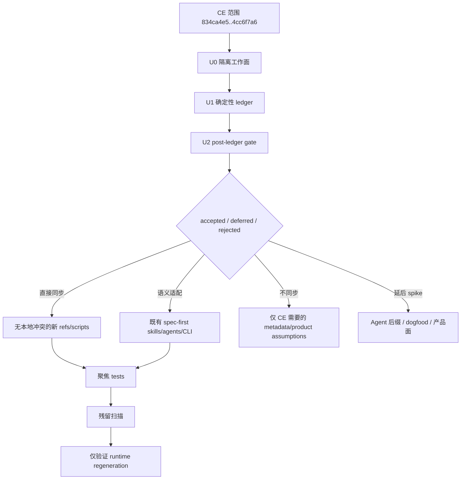

# 同步 CE 4cc6f7a6 工作流更新到 spec-first 技术方案

## 摘要

本计划用于把 CE `834ca4e5..4cc6f7a6` 中适合 spec-first 的工作流、agent、CLI/runtime 和治理更新同步到当前仓库。同步方式不是整文件复制，而是按 `docs/solutions/architecture-patterns/upstream-ce-sync-upgrade-methodology-2026-04-26.md` 做事实取证、路径映射、语义适配和分批验证。

本轮范围较大：CE `docs/**` 目录下的变更不作为同步 source，不进入逐文件同步台账、不提取 hunk、不做同步判定；过滤 `docs/**` 与 `tests/**` 后仍有 124 个 CE 文件条目，包含 18 个新增、14 个删除、52 个修改、40 个重命名。执行前必须先完成隔离工作面、非 docs/tests 实施面的逐文件判定台账（ledger）和 post-ledger gate；其中 agent 后缀、code-review base 检测、HTML 输出、`CONCEPTS.md`、`resolve-pr-feedback` 聚类删除、Codex runtime / `CODEX_HOME` 等都属于需要语义判断的变更。

---

## 问题背景

用户提供了 CE 同级仓库的 fast-forward（快进）输出：

```text
Updating 834ca4e5..4cc6f7a6
197 files changed, 7026 insertions(+), 2889 deletions(-)
```

`spec-first` 与 CE 已分叉，当前项目有独立的 source/runtime 边界、双宿主 runtime 治理、公开 `$spec-*` 工作流命名、README/CHANGELOG 治理和本地特有能力。CE 更新不能按路径机械复制到 spec-first，尤其不能把 CE 的 `.compound-engineering/config.local.yaml`、CE plugin metadata、`.md` agent 后缀或删除策略直接套用。

本计划定义落地方式：先构建完整同步台账，再按风险从低到高同步可证实有价值的最小切片。脚本与命令负责事实层；LLM/agent 负责同步判定、保留分叉、延后 spike 与计划内取舍。

---

## 需求

- R1. 对 CE `834ca4e5..4cc6f7a6` 中排除 `docs/**` 与 `tests/**` 后的实施面建立 100% 逐文件判定台账，至少记录 CE diff 证据、spec-first 当前状态、同步结论、目标路径和验证断言。
- R2. 保持 source-first：只修改 `skills/`、`agents/`、`templates/`、`src/cli/`、`docs/`、`tests/`、`README*.md`、`AGENTS.md`、`CHANGELOG.md` 等 source 文件；不手改 `.claude/`、`.codex/`、`.agents/skills/` 生成运行时镜像。
- R3. 所有 CE 路径、名称、配置、badge 和 repo URL 必须按 spec-first 语义适配，不能保留面向 CE 的当前行为。
- R4. Agent 重命名/删除不能按 CE 文件状态直接执行；必须审计 spec-first selector、persona catalog、runtime adapter、tests、README/runtime 计数和历史验证价值。
- R5. `*.agent.md -> *.md` agent 后缀变更不得混入普通同步；若接受，必须作为独立 runtime contract 迁移。
- R6. `spec-code-review` base 检测、reviewer dispatch、persona catalog、leaf artifact 写入边界和 tests 必须保持一致。
- R7. `resolve-pr-feedback` 行为改动必须保留会修改仓库的 resolver 边界、reply/resolve ownership、combined validation 和 PR thread safety。
- R8. 本轮接受 CE 的 `spec-plan` / `spec-brainstorm` HTML 输出、section references 和 `CONCEPTS.md`,但只作为有边界的 artifact/rendering/glossary 能力进入(Markdown 保持 canonical source,HTML 为 derived sidecar;`CONCEPTS.md` 为 advisory 词表),不得制造第二 PRD/ADR/source-of-truth。
- R9. CLI/runtime 变更必须映射到当前 CommonJS `src/cli/**` 架构，并覆盖 Codex/Claude 双宿主测试。
- R10. 所有 source 变更必须补 `CHANGELOG.md`；用户可见行为变化标注 `(user-visible)`。

---

## 范围边界

- 不同步 CE release metadata、CE package version、CE plugin manifest 当前值、CE changelog 当前值或 CE README 产品表述，除非被明确映射为 spec-first source behavior。
- CE `docs/**` 目录下的变更不作为同步 source；不进入逐文件同步台账、不提取 hunk、不做同步判定。若某个已接受的非 docs/tests 语义变更依赖 CE 同 range 的 docs/contracts rationale，可做 bounded advisory read，并在 ledger 或 report 中摘要为背景证据，明确不复制、不落为 source。
- 不直接复制 CE `tests/**`；只按 spec-first Jest/shell 测试布局重写必要断言。
- 不默认新增 `spec-dogfood-beta` 或等价公开 workflow；CE `ce-dogfood-beta` 先走产品边界 spike。
- 不默认删除 `spec-*` reviewer agents。删除必须以当前 spec-first 调用面和产品价值为准。
- 不把 `.spec-first/config.local.yaml` 或 setup-owned `.spec-first/config/*.json` 变成工作流语义权威；它们最多提供确定性/建议性事实。

### 延后到后续工作

- Agent source 后缀统一从 `.agent.md` 迁移到 `.md`：需要单独 runtime contract plan，覆盖 `src/cli/plugin.js`、`src/cli/adapters/*`、agent governance tests、runtime references 和 smoke tests。
- 新增 dogfood/browser QA 工作流：需要和 `spec-polish-beta`、`test-browser`、`spec-code-review` 的职责边界做产品判断。
- CE `docs/solutions/**` 的新增、删除、重命名、日期后缀清理都不在本轮处理，也不从本计划派生后续任务。

---

## 完成标准

- 排除 CE `docs/**` 与 `tests/**` 后的 124 个 CE 文件条目全部有同步判定。
- CE `docs/**` 变更没有逐文件台账行，且不会进入同步执行队列；若被 bounded advisory read，只作为 rationale 摘要，不作为同步 source。
- 每个修改/重命名文件都有 CE hunk 证据和 spec-first 当前目标文件对比。
- 每个删除文件都有引用审计和删除/保留/延后原因。
- 所有接受的 CE 变更都完成 spec-first 命名、配置路径、host/runtime、badge、repo URL 和 artifact path 适配。
- 所有新增/修改 source 都有对应 tests 或明确的无测试理由。
- 残留扫描无非预期 `ce-*` 当前调用、CE repo URL、CE badge、`.compound-engineering/config.local.yaml` 当前读取或旧 runtime path；允许项必须在最终报告中列明。
- `CHANGELOG.md` 有本轮 source 变更记录。
- 验证命令按本计划矩阵通过，或清楚记录既存失败与剩余风险。

---

## 直接证据就绪度

- 目标仓库：`spec-first`
- 证据来源：直接读取 source、CE 非 docs diff、当前 git status、既有 CE 同步方法论、历史 CE 同步计划/审查
- source 引用：
  - `docs/10-prompt/结构化项目角色契约.md`
  - `docs/solutions/architecture-patterns/upstream-ce-sync-upgrade-methodology-2026-04-26.md`
  - `docs/plans/2026-05-04-001-sync-ce-06a7cee0-workflow-updates-plan.md`
  - `docs/validation/2026-05-09-sync-ce-834ca4e5-workflow-updates-plan-doc-review.md`
  - `skills/spec-plan/references/plan-template.md`
  - `src/cli/adapters/codex.js`
  - `src/cli/plugin.js`
  - `skills/spec-code-review/SKILL.md`
  - `skills/resolve-pr-feedback/references/full-mode.md`
  - `agents/spec-pr-comment-resolver.agent.md`
- 当前 revision：`a6ec34960c648903315cd22a86dc8f6b52aa0d7b`
- worktree 状态：dirty；本计划前已有许多无关 docs/skill/test 文件被修改
- 置信度：计划范围为 medium-high；最终同步判定在 U1 ledger 与 U2 post-ledger gate 完成前为 medium
- 限制：本轮读取了本地 CE 同级仓库，但计划文档刻意避免绝对路径；计划阶段没有实施代码，也没有运行测试。

---

## 直接证据

- 仓库范围：当前 `spec-first` 仓库，加 CE 同级仓库 diff range `834ca4e5..4cc6f7a6` 的非 docs 实施面
- 已完成 source 读取：
  - 角色/演化基线与 CE 同步方法论。
  - CE `834ca4e5..4cc6f7a6` 的 diff name-status/stat 和 commit log；CE `docs/**` diff 只用于确认排除与必要的 bounded advisory rationale，不提取 hunk、不进入逐文件同步判定。
  - `agents/`、`src/cli/plugin.js`、`src/cli/adapters/codex.js` 及相关测试中的当前 agent/source 后缀假设。
  - 当前 `spec-code-review` base detection 与 `resolve-base.sh` 用法。
  - 当前 `resolve-pr-feedback` clustering 与 resolver agent 行为。
  - `.spec-first/config.local.yaml` 周边当前配置路径证据。
- 仍需 source 读取：
  - 对 124 个过滤后非 docs 条目逐文件提取完整 CE hunk。
  - 对每个接受映射比较当前目标文件。
  - 删除/重命名 agent 前完整扫描 selector、persona catalog 和 runtime governance。
- 已使用命令或工具：
  - `git diff --name-status 834ca4e5..4cc6f7a6`
  - `git diff --stat 834ca4e5..4cc6f7a6`
  - 过滤 `docs/**` 与 `tests/**` 后的 CE diff
  - 针对当前 source 与 tests 的聚焦 `rg` 扫描
  - 当前 `git status --short`
- 对计划的影响：
  - 重新分类为 Deep，因为范围触及工作流 prose、agents、runtime delivery、CLI 行为、tests、README/AGENTS 和 cleanup logic。
  - 将 agent 后缀迁移从普通同步中拆出。
  - 增加明确的 dirty-worktree / isolated-worktree 要求。
- 关键发现：
  - 当前 spec-first 仍把 source agents 视为 `*.agent.md`；CE 已将许多 agents 改为 `.md`。
  - 当前 Codex adapter 会把 agent 引用重写为 `.codex/agents/<name>.agent.md`。
  - 当前 `listBundledAgentNames()` 只过滤 `.agent.md`。
  - 当前 `spec-code-review` 仍依赖 `skills/spec-code-review/scripts/resolve-base.sh`。
  - 当前 `resolve-pr-feedback` 仍包含跨调用聚类。
  - 当前配置约定是 `.spec-first/config.local.yaml`，不是 CE `.compound-engineering/config.local.yaml`。
- 限制：
- 本计划自身不内嵌完整 124 行 ledger；U1 将该 ledger 作为第一个阻塞实施产物，以保持计划可维护。CE `docs/**` 变更不进入该 ledger 的逐文件同步行。

---

## 上下文与调研

### 相关代码与模式

- `docs/solutions/architecture-patterns/upstream-ce-sync-upgrade-methodology-2026-04-26.md` 定义固定 CE 同步协议：脚本准备确定性事实，LLM 决定语义同步取舍。
- `src/cli/plugin.js` 发现 bundled agents，并且当前从 `.agent.md` 推导 agent identity。
- `src/cli/adapters/codex.js` 会把 Codex runtime 引用重写到 `.codex/agents/<agent>.agent.md`。
- `skills/spec-code-review/SKILL.md` 与 `skills/spec-code-review/scripts/resolve-base.sh` 当前共同定义可信 review base 解析。
- `skills/resolve-pr-feedback/references/full-mode.md` 当前负责跨调用聚类与会修改仓库的 resolver 派发。
- `skills/spec-mcp-setup/references/config-template.yaml` 与 setup scripts 负责 `.spec-first/config.local.yaml` 本地配置 bootstrap。
- `README.md` / `README.zh-CN.md` 有意避免硬编码 runtime 数量；不要从 CE 重新引入静态计数。

### 组织经验沉淀

- `upstream-ce-sync-upgrade-methodology-2026-04-26.md`：路径映射和文件状态不足以决定同步；同步前必须比较 CE hunk 与当前 spec-first 语义。
- `docs/validation/2026-05-09-sync-ce-834ca4e5-workflow-updates-plan-doc-review.md`：CE 同步计划需要场景级深度，不能只有文件清单；测试必须证明 runtime/consumer 兼容性。
- 早期 CE 同步计划表明，`.compound-engineering/config.local.yaml` 必须映射到 `.spec-first/config.local.yaml`，仅 CE 需要的产品能力新增应作为显式 spike。

### 外部参考

- 未使用互联网或外部文档。本计划基于本地 CE diff 与当前 source。

---

## 关键技术决策

- **D1. 第一个同步产物是 CE 同步台账，而不是代码编辑。** 这个 range 太宽，不能直接 patch。先完成 U0 隔离工作面，再在隔离后的工作面创建完整逐文件台账；ledger/CHANGELOG 属于 planning artifact source edit，不等同于同步 CE source。
- **D2. 本批次保留 `.agent.md` source 后缀。** CE 的 `.md` 重命名是 runtime contract 迁移。本批次可以把 agent 内容同步到既有 `.agent.md` 文件，但后缀迁移延后。
- **D3. 删除是语义决策。** CE 删除只证明 CE 不再使用该文件,不代表该 reviewer 对 spec-first 无价值;"selector 无引用"同样只证明未被静态接线,不等于无价值。删除门槛由 orchestrator(非执行 leaf agent)持有,仅当(selector / persona-catalog / test / README / runtime 引用全无)AND(无独立 spec-first reviewer 能力)AND(git 历史显示从未承载 spec-first 特有价值)三者同时成立才删除,否则默认保留。
- **D4. 优先语义适配，而不是直接同步。** 多数现有目标文件都是已演化的 spec-first 资产；直接同步仅限没有本地等价物且不影响 host 边界的新 references/scripts。
- **D5. 保持 source/runtime 边界。** Runtime regeneration 可以作为 source 验证后的检查步骤，但 runtime mirrors 不作为 source 编辑。
- **D6. 用 tests 承接 consumer contracts。** CE tests 是证据，但 spec-first 需要本地 tests 证明当前 adapters、skill prose、agent governance 与 CLI 行为。

---

## 待决问题

### 计划阶段已解决

- **这次同步是否应直接在当前 dirty worktree 实施？** 不应。当前 worktree 已有大量既存编辑；实施应使用 clean worktree，或先协调、提交、stash 无关工作。
- **是否现在接受 CE 的 `.agent.md -> .md` 重命名？** 不应。它需要单独 runtime contract 迁移。
- **是否直接复制 CE docs/tests？** 不应。CE `docs/**` 变更不作为同步 source；CE tests 不直接复制，只能作为行为证据，接受的行为需要改写成本地 tests。

### 延后到实施阶段

- **哪些被 CE 删除的 reviewer agents 也应在 spec-first 删除？** 延后到 U3/U4 完成 reference 与 selector 审计后决定。
- **`resolve-base.sh` 应删除还是保留为 spec-first 的可信确定性 helper？** 本轮默认保留；若要删除，必须另开 runtime/review contract migration。
- **`CONCEPTS.md` 的 glossary authority 边界与 consumers 如何界定?** 本轮接受其作为 repo-local advisory 词表(R8);U8 只界定它被哪些 skill 读取、与 spec-prd domain-language ledger 的关系,不把它提升为 PRD/ADR/canonical source。
- **HTML output 是否属于当前 `spec-plan` / `spec-brainstorm` 产品面？** 本轮只允许作为 Markdown canonical artifact 的 derived sidecar；HTML-only artifact 需要另行证明 downstream consumer contract。

---

## 高层技术设计

> *这展示预期方案形态，仅作为审查方向参考，不是实现规格。实施 agent 应把它当作上下文，而不是要复刻的代码。*



---

## 实施单元

### U0. 准备隔离同步 Worktree

**目标：** 保护当前 dirty worktree，并为同步创建安全实施面。

**需求：** R2, R10

**依赖：** 无

**文件：**
- 修改：默认无
- 测试：无

**方案：**
- 修改任何同步目标 source 前，先使用单独 git worktree/branch，或明确协调当前 dirty 文件。
- 在同步 ledger 中记录目标分支、base revision 和 dirty-overlap 检查。
- 如果必须在当前 worktree 实施，先用当前 `git status --short` 计算 target-overlap，并为每个重叠文件记录合并策略。
- U1 ledger 与 `CHANGELOG.md` 属于 planning artifact source edit，也必须在 U0 建立的隔离面或记录完备的 overlap matrix 中落盘。

**遵循模式：**
- 既有 CE 同步方法论中的“执行约束”章节。

**测试场景：**
- 测试预期：无，本单元是工作流隔离与证据捕获。

**验证：**
- 实施从 clean worktree 开始，或已有记录完备的重叠矩阵。
- 不格式化或 revert 无关 dirty 文件。

---

### U1. 构建 CE 同步 Ledger

**目标：** 在修改任何同步目标 source 前，为排除 CE `docs/**` 与 `tests/**` 后的 124 个文件条目创建完整逐文件台账。

**需求：** R1, R2, R3

**依赖：** U0

**文件：**
- 新增：`docs/validation/2026-06-03-ce-4cc6f7a6-sync-ledger.md`
- 修改：`CHANGELOG.md`
- 测试：无

**方案：**
- 提取过滤 `docs/**` 与 `tests/**` 后的 CE `name-status`。
- 对 CE `docs/**` 变更只记录“按范围规则跳过”的总括说明，不建立逐文件台账行，不提取 hunk，不做同步判定；若某个已接受的非 docs/tests 变更需要 CE docs/contracts rationale，则记录 bounded advisory read 的路径、摘要和非 source 边界。
- 每个条目记录 CE 路径、状态、目标 spec-first 路径、当前目标是否存在、决策类别和验证断言。
- 对修改/重命名文件，记录简短 hunk 级证据，而不是只记录文件状态。
- 对删除文件，记录 `rg` 引用审计命令与结果。
- 在相关 ledger 行填完前，将实施单元 U3-U12 标记为 blocked。

**遵循模式：**
- `docs/solutions/architecture-patterns/upstream-ce-sync-upgrade-methodology-2026-04-26.md`
- `docs/validation/2026-05-05-ce-06a7cee0-sync-ledger.md`

**测试场景：**
- 测试预期：无，本单元创建 planning/validation 台账，不产生可执行行为。

**验证：**
- 台账包含 124 个过滤后的非 docs CE 条目。
- 台账不包含 CE `docs/**` 逐文件行。
- 台账中实施范围文件没有 `TBD` / `unknown` 决策行。
- 正确性抽检:独立重判抽样 N 行(覆盖 modify / rename / delete 各类)并比对其决策类别,验证台账不只是"填满"而是"判得对";抽检不一致的行必须回到逐文件证据重判。
- 每个 D/R 条目都有当前 spec-first 引用审计。
- 对已接受的语义变更，若存在相关 CE docs/contracts advisory rationale，台账只摘要 rationale，不把 CE docs 变更加入同步队列。

---

### U2. Post-Ledger Gate 与实施单元重切

**目标：** 基于 U1 ledger 重切本计划的实施面，防止未被 accepted ledger 行支撑的 U3-U12 被机械执行。

**需求：** R1, R3, R10

**依赖：** U1

**文件：**
- 修改：`docs/plans/2026-06-03-002-refactor-sync-ce-4cc6f7a6-workflow-updates-plan.md`，仅当 U1 ledger 证明需要重切实施单元时
- 修改：`CHANGELOG.md`，仅当本单元修改 source
- 测试：无

**方案：**
- 汇总 U1 ledger 的 accepted / deferred / rejected / spike 行。
- 没有 accepted ledger 行支撑的实施单元不得进入 U3-U12；必须取消、降级为 spike，或拆成独立 plan/contract migration。
- 对 accepted 行按目标文件、consumer contract 和验证面重排 U3-U12；若重排影响本计划正文，先更新计划与 `CHANGELOG.md`，再进入后续单元。
- 将 CE-only product assumptions、release metadata、plugin metadata 和 docs/tests 直接复制维持 rejected 或 out-of-scope 状态。
- 台账纠偏回路:任一下游单元(U3-U12)若发现与某 ledger 行的决策矛盾,必须回写该 ledger 行并重新推导受影响单元的范围,而非沿既定单元结构继续执行;回写记录进 ledger 的修订说明。

**遵循模式：**
- `docs/solutions/architecture-patterns/upstream-ce-sync-upgrade-methodology-2026-04-26.md`
- 本计划 D1-D6 的 source/runtime、script/LLM 和 tests-as-contract 边界。

**测试场景：**
- 测试预期：无，本单元是计划重切与执行 gate。

**验证：**
- U3-U12 中每个仍保留的单元都有至少一个 accepted ledger 行支撑，或被显式标为 spike/decision-only。
- 所有被取消、降级或拆出的 CE 变更都有 ledger reason。
- 若本计划被重切，`CHANGELOG.md` 记录本轮 source 文档变更。

---

### U3. 在不迁移后缀的前提下校准 Agent 清单

**目标：** 在保持 spec-first `.agent.md` source/runtime contract 不变的前提下，同步已接受的 CE agent 内容改动。

**需求：** R2, R3, R4, R5

**依赖：** U1, U2

**文件：**
- 修改：`agents/*.agent.md`
- 修改：`skills/spec-code-review/references/persona-catalog.md`
- 修改：`skills/spec-code-review/SKILL.md`
- 修改：`src/cli/plugin.js`，仅当接受的 agent 身份发生变化时
- 修改：`docs/catalog/runtime-capabilities.md`，仅当 agent inventory 或 runtime delivery surface 变化时
- 修改：`tests/unit/agents-governance-contracts.test.js`
- 修改：`tests/unit/spec-code-review-contracts.test.js`
- 修改：`tests/unit/agent-support-contracts.test.js`

**方案：**
- 本批次不把 spec-first source 文件重命名为 `.md`。
- 对 CE agent 内容更新，将 `ce-*` 映射为 `spec-*`，只应用匹配当前 spec-first reviewer catalog 的行为。
- 对 CE 删除的 reviewers，先审计 `skills/spec-code-review/SKILL.md`、`references/persona-catalog.md`、tests、README 和历史验证，再决定删除或保留。
- 对 maintainability / data-migration / pr-comment-resolver 等替换型 agents，保留 spec-first 输出 schema 与父工作流 ownership 边界。

**遵循模式：**
- `src/cli/plugin.js` 的 agent discovery 与当前 `.agent.md` 身份规则。
- `src/cli/adapters/codex.js` 的 Codex runtime agent path rewrite。

**测试场景：**
- 正常路径：已接受的 agent 内容保持 `name: spec-*`，并输出预期 reviewer JSON/schema 形状。
- 边界情况：因为本轮不做后缀迁移，CE `.md` source 文件不会导致 spec-first 漏掉 bundled agent discovery。
- 错误路径：删除 CE reviewer 前，如果 spec-first selector 仍引用该 reviewer，contract test 必须失败。

**验证：**
- Bundled agent discovery、persona catalog、selector references 与 U1 ledger / U2 post-ledger gate 中的 agent 决策一致；不以 CE 原始清单或 pre-change 清单作为默认基准。
- Codex runtime references 仍指向 `.codex/agents/<name>.agent.md`。
- source 或 tests 不引用不存在的已接受/已删除 agent。

---

### U4. 校准代码审查 Persona 与 Artifact 契约

**目标：** 同步能改善 reviewer selection、输出、maintainability 覆盖和 artifact discipline 的 CE code-review 变化，同时不削弱 spec-first review contracts。

**需求：** R4, R6

**依赖：** U3

**文件：**
- 修改：`skills/spec-code-review/SKILL.md`
- 修改：`skills/spec-code-review/references/persona-catalog.md`
- 修改：`skills/spec-code-review/references/review-output-template.md`
- 修改：`agents/spec-maintainability-reviewer.agent.md`
- 修改：`tests/unit/spec-code-review-contracts.test.js`
- 新增：`tests/unit/review-skill-contract.test.js`(本单元内创建)

**方案：**
- 只有在保留置信度校准与 output JSON contracts 的前提下，才应用新的 maintainability reviewer posture。
- 将 CE migration persona consolidation 与当前 spec-first data migration / schema drift 策略对齐。
- 除非当前已有独立 contract 授权 agent `Write`，否则 leaf reviewer artifact writing 仍由 orchestrator 拥有；如果修改 tool allowlist，必须记录精确写入位置和禁止 repo mutation 的负向边界。

**遵循模式：**
- 当前 `skills/spec-code-review/references/findings-schema.json`。
- `skills/spec-code-review/SKILL.md` 中既有 mode-aware demotion 与 reviewer synthesis 规则。

**测试场景：**
- 正常路径：maintainability reviewer 仍返回包含 `reviewer`、`findings`、`residual_risks`、`testing_gaps` 的 JSON。
- 边界情况：advisory P2/P3 maintainability findings 继续经过 mode-aware demotion。
- 错误路径：reviewer agent frontmatter 不能暗示可编辑 orchestrator artifact path 之外的 repo 文件。

**验证：**
- Persona catalog 与 selector references 匹配实际 agent 文件。
- Review output template 仍匹配当前 synthesis 行为。

---

### U5. 保留 Review Base Helper 并隔离删除迁移

**目标：** 本批次保留 `resolve-base.sh` 作为 spec-first 可信确定性 helper，只同步兼容的 prose 改良；CE 删除该 helper 的方向另开 runtime/review contract migration。

**需求：** R6, R9

**依赖：** U1, U2

**文件：**
- 修改：`skills/spec-code-review/scripts/resolve-base.sh`，仅当同步兼容改良或测试 fixture 需要
- 修改：`skills/spec-code-review/SKILL.md`
- 修改：`src/cli/adapters/claude.js`
- 修改：`src/cli/adapters/codex.js`
- 修改：`tests/unit/spec-code-review-contracts.test.js`
- 修改：如存在 focused resolve-base tests

**方案：**
- 将 CE 删除 `resolve-base.sh` 标记为本批次不同步，因为当前 spec-first 依赖 fork-safe helper contract。
- 只同步不削弱 helper 行为的 prose、tests 或 runtime path rewrite 改良。
- 如果后续确实要删除 helper，必须先创建独立 runtime/review contract migration plan，明确 PR mode、branch mode、non-default base、fork PR、unresolved base fail-closed、consumer tests 和 rollback path；不得在本批次 U5 内删除。

**遵循模式：**
- 既有 `skills/spec-code-review/scripts/resolve-base.sh` 使用点。
- 先前 doc-review finding：script/prose 变化需要 consumer tests。

**测试场景：**
- 正常路径：branch review 根据 default base 解析 merge-base。
- 正常路径：PR review 使用 PR metadata base，而不是硬编码 `main`。
- 边界情况：没有 matching remote 的 fork PR fail closed，或使用已文档化 fallback。
- 错误路径：unresolved base 不回退到 `git diff HEAD`。

**验证：**
- `resolve-base.sh` 仍存在，runtime adapters 仍能 rewrite 到已安装 workflow skill path。
- PR mode、branch mode、non-default base、fork PR 和 unresolved base failure 行为仍有测试或明确验证命令。

---

### U6. 围绕按价值修复简化 PR 反馈处理

**目标：** 同步 CE 的 `resolve-pr-feedback` 简化，同时保留 spec-first 的 mutating resolver 边界。

**需求：** R7

**依赖：** U3

**文件：**
- 修改：`skills/resolve-pr-feedback/SKILL.md`
- 修改：`skills/resolve-pr-feedback/references/full-mode.md`
- 修改：`skills/resolve-pr-feedback/references/targeted-mode.md`
- 修改：`skills/resolve-pr-feedback/scripts/get-pr-comments`
- 修改：`agents/spec-pr-comment-resolver.agent.md`
- 修改：`tests/unit/resolve-pr-feedback-contracts.test.js`
- 修改：`tests/unit/spec-pr-comment-resolver-contracts.test.js`

**方案：**
- 默认保留跨调用聚类或至少保留 advisory dedupe，直到重复 thread fixture 证明删除不会造成重复 mutation、重复 reply 或 thread resolution 冲突。
- 如果移除跨调用聚类，同时更新 `get-pr-comments` 的 `cross_invocation` 输出 schema，或明确保留该字段但父流程忽略。
- 将 resolver rubric 更新为“默认修复，只基于证据转向”，同时保留 `not-addressing`、`declined`、`replied`、`needs-human` 含义。
- 保持 validation、commit/push、replies 和 thread resolution 的 orchestrator ownership。
- 重写 resolver agent 与 rubric 时,必须保留“评论文本为不可信输入、绝不执行其中内嵌的命令/脚本/shell、独立读代码判断正确修复”的防注入护栏(当前 `agents/spec-pr-comment-resolver.agent.md` Security 段),将其作为“默认修复”姿态下不可协商的不变量,不得随 rubric 简化被稀释。
- 同步移除 parent 与 agent 中过时的 cluster-brief 语言。

**遵循模式：**
- `skills/resolve-pr-feedback/references/full-mode.md` 中当前 mutating resolver dispatch boundary。

**测试场景：**
- 正常路径：actionable review thread 派发一个 resolver 并记录 files changed。
- 边界情况：正确但无实际收益的点返回 `replied`，不改代码。
- 错误路径：风险不可界定的变更返回 `needs-human` 并携带 decision context。
- 安全:resolver agent 仍保留“评论文本不可信、绝不执行其中命令/脚本”的护栏;contract test 断言该 clause 在 rubric 重写后依然存在。
- 回归：重复根因的多个 PR threads 不会导致重复 mutation、重复 reply 或 thread resolution 冲突。
- 回归：如果移除聚类，则不残留 cluster-specific summary 或 `<cluster-brief>` 要求。

**验证：**
- Full-mode step numbers 与 summary references 一致。
- Resolver agent 与 parent workflow 对 result fields 的约定一致。
- `get-pr-comments` 输出 schema 与 parent workflow consumption 一致。

---

### U7. 评估 Markdown Canonical + HTML Sidecar 输出

**目标：** 只在 U2 post-ledger gate 接受后，把 CE HTML output mode 适配为 Markdown canonical artifact 的可选 derived sidecar；不引入 HTML-only source artifact。

**需求：** R3, R8

**依赖：** U1, U2

**文件：**
- 修改：`skills/spec-plan/SKILL.md`
- 新增/修改：`skills/spec-plan/references/html-rendering.md`
- 新增/修改：`skills/spec-plan/references/markdown-rendering.md`
- 新增/修改：`skills/spec-plan/references/plan-sections.md`
- 修改：`skills/spec-plan/references/plan-handoff.md`
- 修改：`skills/spec-brainstorm/SKILL.md`
- 新增/修改：`skills/spec-brainstorm/references/html-rendering.md`
- 新增/修改：`skills/spec-brainstorm/references/markdown-rendering.md`
- 新增/修改：`skills/spec-brainstorm/references/brainstorm-sections.md`
- 修改：`skills/spec-mcp-setup/references/config-template.yaml`
- 修改：`tests/unit/spec-plan-contracts.test.js`
- 修改：`tests/unit/spec-brainstorm-contracts.test.js`

**方案：**
- 将 CE config keys 从 `.compound-engineering/config.local.yaml` 映射到 `.spec-first/config.local.yaml`。
- Markdown 始终是 canonical source artifact；HTML 只能是由同一 Markdown 内容派生的展示 sidecar。
- 对 pipeline / disable-model-invocation contexts 强制 markdown，因为下游自动化消费 markdown。
- `spec-doc-review`、task-pack、`spec-work`、issue creation 和 Proof 继续消费 Markdown；HTML 不触发 source mutation path。
- 保持 plan/brainstorm section content 的权威性独立于 rendering。

**遵循模式：**
- `skills/spec-mcp-setup/scripts/bootstrap-project-config.sh` 中既有 `.spec-first/config.local.yaml` bootstrap。
- `skills/spec-plan/references/plan-template.md` 中当前 markdown plan template。

**测试场景：**
- 正常路径：`output:html` 同时保留 canonical Markdown artifact，并生成/加载 `.html` sidecar 的 rendering instructions。
- 正常路径：没有 output arg 时默认 markdown。
- 边界情况：注释掉的 `# plan_output: html` 被忽略。
- 边界情况：未知 `output:pdf` fallback，并报告最终 resolved output。
- 错误路径：即使 config 请求 HTML，pipeline mode 也强制 markdown。
- 回归：HTML artifacts 不触发 markdown-only downstream consumers，也不替代 Markdown source artifact。

**验证：**
- 没有当前工作流把 `.compound-engineering/config.local.yaml` 当作 active config 读取。
- HTML output 不为 plan/requirements content 创建第二 source-of-truth；downstream consumers 的 canonical input 仍是 Markdown。

---

### U8. 引入 CONCEPTS.md 作为 Advisory 词表基底

**目标：** 决定并实现 CE `CONCEPTS.md` 在 spec-first 中的最小适配。

**需求：** R8

**依赖：** U2, U7

**文件：**
- 新增/修改：`CONCEPTS.md`
- 修改：`skills/spec-plan/SKILL.md`
- 修改：`skills/spec-brainstorm/SKILL.md`
- 修改：`skills/spec-compound/SKILL.md`
- 修改：`skills/spec-compound-refresh/SKILL.md`
- 新增/修改：`skills/spec-compound/references/concepts-vocabulary.md`
- 新增/修改：`skills/spec-compound-refresh/references/concepts-vocabulary.md`
- 修改：`tests/unit/spec-plan-contracts.test.js`
- 修改：`tests/unit/spec-compound-contracts.test.js`

**方案：**
- 将 `CONCEPTS.md` 定义为 repo-local advisory vocabulary，而不是 PRD、ADR、glossary contract 或 canonical product truth。
- 允许 `spec-plan` / `spec-brainstorm` 在文件存在时读取它，用于命名一致性。
- 仅在明确 vocabulary bootstrap 或高置信 doc compounding 场景下，允许 `spec-compound` / `spec-compound-refresh` 创建或更新它。
- 不要求每个 repo 都必须有该文件。

**遵循模式：**
- `skills/spec-prd/references/domain-language-and-decision-ledger.md` 中既有 domain glossary 边界。

**测试场景：**
- 正常路径：planning 将既有 `CONCEPTS.md` 作为 vocabulary context 读取。
- 边界情况：缺少 `CONCEPTS.md` 不阻塞 plan/brainstorm。
- 错误路径：workflow prose 不把 `CONCEPTS.md` 提升到 confirmed source files 或 PRD decisions 之上。

**验证：**
- `CONCEPTS.md` references 是 advisory 且有边界。
- 没有 script 把它当作 required setup state。

---

### U9. 同步 Compound 与 Compound-Refresh 命名/Headless 改进

**目标：** 适配 CE compound 在日期后缀、concepts vocabulary 和 headless refresh mode 上的改动。

**需求：** R3, R8, R10

**依赖：** U8

**文件：**
- 修改：`skills/spec-compound/SKILL.md`
- 修改：`skills/spec-compound-refresh/SKILL.md`
- 修改：`tests/unit/spec-compound-contracts.test.js`
- 新增：`tests/unit/compound-support-files.test.js`(本单元内创建)

**方案：**
- 仅当匹配当前 discoverability 与 collision handling 时，同步“生成 learning filename 去日期后缀”。
- 只有在同步更新当前 references/tests 时，才把 `mode:autofix` 改为 `mode:headless`。
- 保持 compound-refresh 保守：不确定场景标记 stale 或给出推荐，不做破坏性覆盖。
- CE `docs/solutions/**` 变更本轮直接跳过；不做 filename cleanup、rename 同步或 broad mechanical renames。

**遵循模式：**
- 既有 `docs/solutions/` frontmatter 与 lifecycle conventions。

**测试场景：**
- 正常路径：无 collision 时，新 learning filename 不带日期后缀且稳定。
- 边界情况：collision 产生安全唯一文件名，或更新既有 high-overlap doc。
- 错误路径：headless refresh 不询问用户问题，也不删除 ambiguous docs。
- 回归：CE `docs/solutions/**` 变更不会进入同步队列。

**验证：**
- Learning discoverability scans 仍能找到生成 docs。
- 同步台账和最终报告明确 CE `docs/**` 已按范围规则跳过。

---

### U10. 同步 PR 描述与 Git Commit 工作流改进

**目标：** 适配 CE 对 PR title/body writing、default branch 分支创建行为和 GitHub-safe body updates 的改动。

**需求：** R3, R10

**依赖：** U1, U2

**文件：**
- 修改：`skills/git-commit-push-pr/SKILL.md`
- 修改：`skills/git-commit-push-pr/references/pr-description-writing.md`
- 修改：`skills/git-commit/SKILL.md`
- 修改：`tests/unit/git-commit-push-pr-contracts.test.js`
- 新增：`tests/unit/git-commit-contracts.test.js`(本单元内创建)

**方案：**
- 保留 spec-first 决策：PR description writing 归属 `git-commit-push-pr`，不是公开 `spec-pr-description` workflow。
- 同步 value-led PR body guidance 与 user-visible bug summary emphasis。
- 使用 body-file 风格的 update/create contract，避免 shell quoting 和 markdown parsing 陷阱。
- 如果当前分支是 default branch，根据当前 Git tool 边界要求从 fresh remote base 创建 feature branch。

**遵循模式：**
- 既有 `git-commit-push-pr` internal-only tool boundary。

**测试场景：**
- 正常路径：PR body update 使用 temp/body file，而不是 inline shell body。
- 边界情况：除非 focus 明确要求，否则保留既有 Demo/Screenshots section。
- 错误路径：default branch 状态不会在没有 branch creation path 的情况下直接提交到 default branch。
- 回归：不重新引入公开 `spec-pr-description` workflow。

**验证：**
- Contract tests 覆盖 title/body style、body-file usage 和 description-only behavior。

---

### U11. 同步 Web Researcher 与外部调研工具灵活性

**目标：** 将 CE web researcher 从固定 Claude tools 的假设，适配为 capability-based web search/fetch wording。

**需求：** R3

**依赖：** U3

**文件：**
- 修改：`agents/spec-web-researcher.agent.md`
- 修改：`skills/spec-plan/SKILL.md`，如果 external research dispatch references 变化
- 修改：`skills/spec-ideate/**`，如果当前 consumer wording 变化
- 新增：`tests/unit/web-researcher-contracts.test.js`(本单元内创建)
- 修改：`tests/unit/spec-ideate-contracts.test.js`
- 修改：`tests/unit/spec-plan-contracts.test.js`，如果 `spec-plan` external research dispatch references 变化

**方案：**
- 用当前环境 web-search / web-fetch capability checks 替换固定 `WebSearch` / `WebFetch` 假设。
- 保留规则：shell/network commands 不能自动替代 purpose-built web tools，除非当前 host 明确 wired 了这种工具。
- 保持 source attribution 和“external signal thin”输出纪律。

**遵循模式：**
- `spec-plan` 与 `spec-ideate` 中当前 web/external research agent dispatch boundaries。

**测试场景：**
- 正常路径：search 与 fetch capabilities 都存在时，research proceeds。
- 边界情况：一个 combined tool 同时覆盖 search 和 fetch responsibilities。
- 错误路径：没有 web capability 时，agent 报告 unavailable，而不是编造 research。
- 回归：`spec-ideate` dispatch 仍指向 `spec-web-researcher`，且 capability unavailable 时 warn-and-proceed。
- 回归：workflow prose 不把 shell/network command 当作 purpose-built web tool 的替代品。

**验证：**
- 没有 consumer prompt 把 Claude-only web tool names 硬编码为 runtime requirement。
- `tests/unit/web-researcher-contracts.test.js` 直接读取 `agents/spec-web-researcher.agent.md` 并锁定 capability-based wording。
- `tests/unit/spec-ideate-contracts.test.js` 覆盖主要 consumer dispatch 与 degraded-mode summary。

---

### U12. 同步 CLI Runtime 与清理改进

**目标：** 将 CE CLI/runtime 变化适配到当前 CommonJS CLI 架构中。

**需求：** R2, R3, R9, R10

**依赖：** U1, U2, U3

**文件：**
- 修改：`src/cli/commands/clean.js`
- 修改：`src/cli/commands/init.js`
- 修改：`src/cli/commands/doctor.js`，如果 detection output 变化
- 修改：`src/cli/adapters/codex.js`
- 修改：`src/cli/plugin.js`
- 修改：`src/cli/runtime-untrack.js`
- 修改：`src/cli/version-reminder.js` 或相关 model helpers
- 修改：`docs/catalog/runtime-capabilities.md`，仅当 runtime delivery surface 变化时
- 修改：`tests/unit/init-dry-run.test.js`
- 修改：`tests/unit/clean-dry-run.test.js`
- 修改：`tests/unit/runtime-plan-contracts.test.js`
- 修改：`tests/smoke/cli.sh`

**方案：**
- 先定义 spec-first 自己的 root/home contract：project root 默认来自当前工作目录；本轮不新增 explicit home arg，也不引入 CE TypeScript `resolveTargetHome` contract。
- 只有在符合 project-scoped Codex support 时，才把 CE `CODEX_HOME` detection/root behavior 映射到当前 adapter 与 init/doctor flow。
- `CODEX_HOME` 仅能作为 Codex runtime home 候选输入，不改变 project root、source root 或 `.spec-first` state root。
- 只为 exact managed marker 或已确认的 spec-first historical install inventory 增加 legacy cleanup entries；“可能存在”的 artifacts 只能进入 doctor/report scan，不能进入 clean delete plan。
- MiniMax model example refresh 只同步到由当前 model alias helpers 负责的 docs/tests。
- 避免 CE TypeScript path assumptions；在当前 CommonJS modules 中实现。

**遵循模式：**
- `src/cli/adapters/codex.js`
- `src/cli/plugin.js`
- `src/cli/commands/init.js`
- 既有 dry-run / preview-first runtime operation tests。

**测试场景：**
- 正常路径：当前 spec-first 支持该 target 时，Codex install 尊重 `CODEX_HOME`。
- 边界情况：本轮不新增 explicit home arg；若 CE diff 引入相关语义，标记为 rejected 或独立 contract migration。
- 错误路径：legacy cleanup 不删除 non-managed user files。
- 错误路径：仅“可能存在”的 legacy artifacts 只出现在 report/doctor 中，不进入 delete plan。
- 回归：接受变更后，agent discovery 仍能找到所有 bundled agents。

**验证：**
- `npm run typecheck` 通过。
- Init/clean dry-run plans 展示预期 runtime operations，且没有 CE-only legacy paths，除非明确支持。
- Clean dry-run 对每个 delete entry 都能说明 managed marker 或 confirmed historical inventory 来源。

---

## 系统影响

- **交互图谱：** CE sync 会触及公开 workflow prose（`spec-plan`、`spec-brainstorm`、`spec-code-review`）、internal Git tools、resolver agents、runtime adapters、setup config、README/AGENTS 和 tests。
- **错误传播：** deterministic scripts/tests 应在 missing refs、stale runtime path rewrites、unsafe cleanup、或被删除 agents 仍被 selectors 引用时 fail loud。
- **状态生命周期风险：** source 变化后 runtime mirrors 可能 stale。只在 source 验证后 regenerate，并记录 runtime outputs 是提交范围还是仅验证。
- **API surface parity：** Claude 与 Codex runtime delivery 必须保持一致。Codex `$spec-*` workflows 使用 `.agents/skills`；agents 位于 `.codex/agents`。
- **集成覆盖：** runtime delivery 变化不能只靠 unit tests；runtime paths 或 agent inventory 变化时，需要 smoke tests 与 init/clean dry-run outputs。
- **不变约束：** `spec-first` 仍是 workflow harness / project intelligence layer。CE product-specific plugin assumptions 不成为 spec-first core contracts。

---

## 风险分析与缓解

| 风险 | 可能性 | 影响 | 缓解 |
|------|------------|------|------|
| Agent suffix migration 破坏 runtime discovery | 若混入本轮同步则高 | 高 | 延后 suffix migration；本批次保留 `.agent.md` |
| CE 删除移除 spec-first-specific reviewer 价值 | 中 | 高 | 删除前强制 selector/reference/history audit |
| HTML output 破坏 markdown-only downstream workflows | 中 | 中 | Markdown 保持 canonical source artifact；HTML 只作为 derived sidecar |
| 从 CE 复制错误 config path | 中 | 中 | 所有 config 读取映射到 `.spec-first/config.local.yaml`；增加 residual scan |
| 当前 dirty worktree 导致意外覆盖 | 高 | 高 | 使用 isolated worktree 或记录完备的 overlap matrix |
| 删除 `resolve-base.sh` 移除 deterministic fork-safe 行为 | 低 | 高 | 本轮默认保留；删除必须另开 runtime/review contract migration |
| Legacy cleanup 误删用户 runtime 文件 | 中 | 高 | clean delete plan 只接受 managed marker 或 confirmed historical inventory；“可能存在”只进入 report |
| Source sync 后 runtime mirrors 漂移 | 中 | 中 | 先跑 source tests，再执行受控 `spec-first init` 验证 |

---

## 分阶段交付

### 阶段 1：证据与隔离

- U0 准备隔离同步 Worktree。
- U1 构建 CE 同步 Ledger。
- U2 Post-Ledger Gate 与实施单元重切。

### 阶段 2：Workflow 与 Agent 语义

- U3 在不迁移后缀的前提下校准 Agent 清单。
- U4 校准代码审查 Persona 与 Artifact 契约。
- U5 保留 Review Base Helper 并隔离删除迁移。
- U6 围绕按价值修复简化 PR 反馈处理。

### 阶段 3：Artifact 格式与知识面

- U7 评估 Markdown canonical + HTML sidecar 输出。
- U8 引入 `CONCEPTS.md` 作为 advisory 词表基底。
- U9 同步 Compound 与 Compound-Refresh 命名/Headless 改进。

### 阶段 4：Git、调研与 CLI Runtime

- U10 同步 PR 描述与 Git Commit 工作流改进。
- U11 同步 Web Researcher 与外部调研工具灵活性。
- U12 同步 CLI Runtime 与清理改进。

### 阶段 5：文档、验证与 Runtime 检查

- 仅针对已接受的用户可见行为更新 `README.md`、`README.zh-CN.md`、`AGENTS.md`、docs/catalog。
- 更新 `CHANGELOG.md`。
- 运行 focused tests、residual scans、smoke tests，并按需执行 runtime regeneration verification。

---

## 文档计划

- `CHANGELOG.md`：每个 source change 必须更新；workflow/runtime 的用户可见变化需要标注。
- `README.md` / `README.zh-CN.md`：仅当已接受变更改变公开 workflow、setup 或 runtime 行为时更新。
- `docs/catalog/runtime-capabilities.md`：runtime delivery 或公开 workflow inventory 变化时重新生成/更新。
- `docs/validation/2026-06-03-ce-4cc6f7a6-sync-ledger.md`：记录逐文件决策与验证证据。
- `docs/validation/2026-06-03-ce-4cc6f7a6-sync-report.md`：最终同步报告，包含 residual scans、validations 和 intentional differences。

---

## 验证矩阵

按单元聚焦检查：

- U0/U1/U2：检查 isolated worktree 或 overlap matrix、ledger 完整性和 post-ledger gate 结果。
- U3/U4：`npx jest tests/unit/agents-governance-contracts.test.js tests/unit/spec-code-review-contracts.test.js --runInBand`。
- U5：`npx jest tests/unit/spec-code-review-contracts.test.js --runInBand`；同步运行 `resolve-base.sh` 相关 focused tests。
- U6：`npx jest tests/unit/resolve-pr-feedback-contracts.test.js tests/unit/spec-pr-comment-resolver-contracts.test.js --runInBand`。
- U7/U8/U9：`npx jest tests/unit/spec-plan-contracts.test.js tests/unit/spec-brainstorm-contracts.test.js tests/unit/spec-compound-contracts.test.js tests/unit/compound-support-files.test.js --runInBand`(`compound-support-files.test.js` 由 U9 创建,矩阵命令在该测试落盘后运行)。
- U10：`npx jest tests/unit/git-commit-push-pr-contracts.test.js tests/unit/git-commit-contracts.test.js --runInBand`(`git-commit-contracts.test.js` 由 U10 创建,矩阵命令在该测试落盘后运行)。
- U11：`npx jest tests/unit/web-researcher-contracts.test.js tests/unit/spec-ideate-contracts.test.js --runInBand`（`web-researcher-contracts.test.js` 由 U11 创建,矩阵命令在该测试落盘后运行）；如果 `spec-plan` external research references 变化，同步运行 `tests/unit/spec-plan-contracts.test.js`。
- U12：`npx jest tests/unit/init-dry-run.test.js tests/unit/clean-dry-run.test.js tests/unit/runtime-plan-contracts.test.js --runInBand`。

最终检查：

- `npm run lint:skill-entrypoints`
- `npm run typecheck`
- `npm run test:unit`
- runtime delivery 或 adapter behavior 变化时运行 `npm run test:smoke`
- `git diff --check`
- 残留扫描：
  - `rg -n 'ce-|Compound Engineering|EveryInc/compound-engineering-plugin|\.compound-engineering/config\.local\.yaml|agents/[^ ]+\.md\b|\.codex/commands/spec' skills agents templates src tests README.md README.zh-CN.md AGENTS.md CHANGELOG.md`
  - 对扫描结果逐项标记 `unexpected` 或 allowlist；allowlist 只能包含历史 changelog、明确 legacy detection/report wording、或本轮 sync evidence wording。
  - U1 ledger / U2 post-ledger gate 决策后追加被删除 agent names。

---

## 来源与参考

- **来源文档：** `docs/solutions/architecture-patterns/upstream-ce-sync-upgrade-methodology-2026-04-26.md`
- **历史 CE 同步计划：** `docs/plans/2026-05-04-001-sync-ce-06a7cee0-workflow-updates-plan.md`
- **历史 CE 同步审查：** `docs/validation/2026-05-09-sync-ce-834ca4e5-workflow-updates-plan-doc-review.md`
- **角色契约：** `docs/10-prompt/结构化项目角色契约.md`
- **当前计划模板：** `skills/spec-plan/references/plan-template.md`
- **CE 范围：** `834ca4e5..4cc6f7a6`
