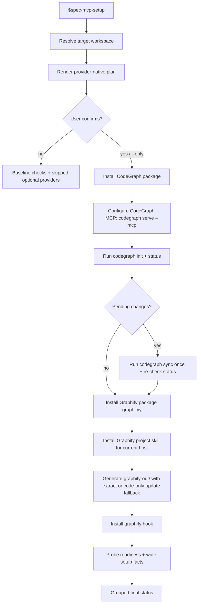

# refactor: Rebuild Runtime Setup provider-native CodeGraph and Graphify flow

## Summary

This plan replaces the rejected workspace-local Graphify wrapper/artifact design with a provider-native Runtime Setup flow. A bare `$spec-mcp-setup` should preview the CodeGraph and Graphify writes, ask for one confirmation, then install, configure, initialize, verify, and record readiness facts so downstream nodes can use the providers naturally.

### 2026-06-09 Execution Review Correction

Reviewing the real `$spec-mcp-setup` execution log `2026-06-09-134039-command-messagespecmcp-setupcommand-message.txt` exposed four implementation gaps that are now part of the plan contract:

- Runtime mirror compatibility is required. `setup-plan-renderer.cjs` and `provider-readiness-renderer.cjs` must run from generated skill mirrors such as `.agents/skills/spec-mcp-setup/scripts/` without requiring `../../../src/...`; registry reads must resolve from the current skill directory.
- Graphify first generation must be best-effort provider-native, not manual LLM repair. Setup first tries `graphify extract .`; when semantic extraction fails in a mixed docs/images repo without API keys, default project-root setup falls back to code-only `graphify update .`, then continues query probe and hook install if `graphify-out/graph.json` or `GRAPH_REPORT.md` exists.
- Graphify readiness must detect disk truth, not only current shell PATH/env overrides. A CLI installed at the provider-standard `~/.local/bin/graphify`, project skill runtime under `.claude/skills/graphify/` / `.codex/skills/graphify/` / `.agents/skills/graphify/`, and provider hooks under `.git/hooks/` must be reflected in `provider_readiness[]`.
- CodeGraph status freshness must get one bounded repair attempt. If `codegraph status` reports `Pending Changes`, Runtime Setup should run `codegraph sync` once and then re-run `codegraph status`; only remaining pending changes or sync failure becomes action-required.

This correction does not change the trust boundary: provider outputs remain advisory, scripts emit deterministic facts/diagnostics, and the LLM explains or repairs degraded cases within `$spec-mcp-setup` instead of pretending readiness.

---

## Problem Frame

The previous Runtime Setup provider plan over-constrained external tools into spec-first-owned paths and skipped important provider-native onboarding. In particular, it treated Graphify as a hidden CLI helper writing `.spec-first/workspace/providers/graphify/...`, explicitly avoided Graphify skill install, and avoided the natural `$graphify .` / `/graphify .` workflow surface. That does not match Graphify's README, generated Codex skill, or hook implementation, all of which expect project-root `graphify-out/`.

CodeGraph also needs correction. The user-facing command is `codegraph`, but the verified npm package with a `codegraph` bin is `@colbymchenry/codegraph@0.9.9`; the unscoped `codegraph` npm package currently does not expose a verifiable bin/repository from `npm view`. Runtime Setup must separate package identity from CLI command identity, then use provider-native project initialization: `codegraph init`, `codegraph status`, and `codegraph serve --mcp`. Initialization creates the project-local `.codegraph/` directory with the SQLite database, and the MCP server's native file watcher keeps the index fresh with a default 2000ms debounce.

The target experience is simple:

```text
$spec-mcp-setup
  -> render provider-native install/init plan
  -> ask the user to confirm
  -> install CodeGraph and Graphify
  -> configure host surfaces
  -> initialize .codegraph/ and graphify-out/
  -> enable provider-owned refresh
  -> refresh setup facts and final status
```

---

## Requirements

- R1. Bare `$spec-mcp-setup` is the primary user path; users should not need to run internal scripts or provider consent environment variables.
- R2. The setup plan must preview every host/project write before mutation and ask for one confirmation in guided mode.
- R3. CodeGraph install must distinguish the npm package from the CLI command: install the verified package `@colbymchenry/codegraph@0.9.9`, then use the `codegraph` command.
- R4. CodeGraph project initialization must run in the target workspace with `codegraph init`, verify with `codegraph status`, and record `.codegraph/codegraph.db` as the project-local SQLite index artifact.
- R5. CodeGraph MCP host config must launch `codegraph serve --mcp`, not an unscoped or repeated `npx` server command.
- R5a. CodeGraph steady-state freshness must be delegated to the provider's native Auto-Sync watcher when the MCP server is active; setup should report watcher/freshness status or fallback guidance instead of creating a spec-first sync loop.
- R6. Graphify install must use the official PyPI package `graphifyy==0.8.36` and expose the `graphify` CLI, preferring `uv tool install` and falling back only when necessary.
- R7. Graphify setup must install the provider's assistant skill project-scoped for the current host, for example `graphify install --project --platform codex` on Codex.
- R8. Graphify initialization must produce project-root `graphify-out/` with `graphify-out/graph.json` and `graphify-out/GRAPH_REPORT.md`; `.spec-first/workspace/providers/graphify/...` is no longer the primary artifact path.
- R9. Graphify refresh must be provider-owned after setup: install `graphify hook install` when a git repo is available and report hook status/readiness.
- R10. `$graphify .` / `/graphify .` must be described as the provider's assistant skill UX, while setup-internal initialization must use a scriptable provider-native CLI path or an explicitly documented skill-equivalent execution path.
- R11. Provider readiness remains advisory: CodeGraph and Graphify outputs can guide exploration, but conclusion-level findings still need source/test/log/user evidence.
- R12. Bash and PowerShell setup paths must stay behaviorally aligned.
- R13. All source changes must update `CHANGELOG.md`, and generated mirrors must not be hand-edited.
- R14. Runtime Setup renderers must be source/runtime-layout safe and runnable from generated skill mirrors.
- R15. Graphify first generation must use `graphify update .` as a project-root code-only fallback when `graphify extract .` fails before producing a usable artifact.
- R16. Graphify readiness detection must recognize provider-standard CLI paths, project skill runtime, and installed hooks from disk.
- R17. CodeGraph setup must run a bounded `codegraph sync` repair when `codegraph status` reports pending changes after init or cache-hit bootstrap.

---

## Scope Boundaries

- Do not auto-commit `graphify-out/`, `.codegraph/`, Graphify skill files, or hook changes.
- Do not promote provider artifacts into `docs/` or spec-first source truth.
- Do not make CodeGraph or Graphify required baseline dependencies; they remain optional providers selected by guided confirmation or `--only`.
- Do not add a new provider state machine, independent manifest, or semantic trust enum.
- Do not add a spec-first CodeGraph watcher. Auto-Sync belongs to `codegraph serve --mcp`; when the provider disables watching for the environment, report degraded readiness and point to provider-native `codegraph sync` or hook guidance.
- Do not add a recurring spec-first CodeGraph sync loop. A single setup-time `codegraph sync` after `Pending Changes` is a bounded install-init repair, not steady-state ownership.
- Do not run `graphify watch` by default; it is long-running and not needed for the default setup goal.
- Do not require LLM API keys for Runtime Setup to leave Graphify code navigation usable. Semantic docs/images extraction may remain incomplete and be reported as a limitation; code-only graph bootstrap should still complete when provider-native `graphify update .` succeeds.
- Do not use the unscoped `npm install -g codegraph` unless future one-source evidence proves it is the official package or alias with a working `bin.codegraph`.
- Do not edit provider-generated skill content by hand. If Graphify writes `.codex/skills/graphify/`, `.claude/skills/graphify/`, `AGENTS.md`, `.codex/hooks.json`, or adjacent `references/` sidecars, treat them as user-confirmed provider runtime output and record them as such.

---

## Direct Evidence Readiness

- target_repo: `.`
- evidence_sources: direct source reads, `rg`, npm package metadata, PyPI package metadata, local Graphify source, user-provided practice note and linked article
- source_refs:
  - `skills/spec-mcp-setup/SKILL.md`
  - `skills/spec-mcp-setup/mcp-tools.json`
  - `skills/spec-mcp-setup/provider-tools.json`
  - `skills/spec-mcp-setup/scripts/setup-plan-renderer.cjs`
  - `skills/spec-mcp-setup/scripts/install-mcp.sh`
  - `skills/spec-mcp-setup/scripts/install-helpers.sh`
  - `skills/spec-mcp-setup/scripts/provider-readiness-renderer.cjs`
  - `tests/unit/dependency-readiness-baseline.test.js`
  - `tests/unit/mcp-setup-powershell-contracts.test.js`
  - `tests/unit/scale-provider-doc-contracts.test.js`
  - `docs/contracts/provider-readiness.md`
  - `docs/contracts/provider-readiness.schema.json`
  - `docs/contracts/provider-tools-registry.schema.json`
  - external Graphify checkout: `README.md`
  - external Graphify checkout: `graphify/skill-codex.md`
  - external Graphify checkout: `graphify/__main__.py`
  - external Graphify checkout: `graphify/hooks.py`
- current_revision: `687df33e`
- worktree_status: dirty before this plan; includes existing runtime/provider setup changes and unrelated files. Implementation must not revert unrelated user changes.
- confidence: high for Graphify project-root artifact and skill/hook expectations; high for scoped CodeGraph npm package identity; medium for exact cross-host Graphify project install command until implementation tests the current CLI help.
- limitations: the linked GitCode/CSDN article is user-supplied practice evidence, not a primary source. It is useful for expected workflow but not authoritative over provider package metadata and local source.

---

## Direct Evidence

- repo_scope: single repo, `spec-first`
- source_reads_completed:
  - Current `spec-mcp-setup` source still says no Graphify skill/MCP install, no `graphify .`, and `.spec-first/workspace/providers/graphify/graphify-out`.
  - Current tests lock several old assertions such as `graphify extract`, `--no-cluster`, and `.spec-first/workspace/providers/graphify/...`.
  - Graphify README says install `graphifyy`, run `graphify install`, and normal use is `$graphify .` or `/graphify .`.
  - Graphify local source shows Codex project-scoped install writes `.codex/skills/graphify/SKILL.md`, `AGENTS.md`, `.codex/hooks.json`, `.codex/skills/graphify/references/`, and `.graphify_version`; Claude project-scoped install writes `.claude/skills/graphify/` and `CLAUDE.md`.
  - Graphify Codex skill fast path checks `graphify-out/graph.json` relative to the current working directory and queries it with `graphify query`.
  - Graphify hooks read/write project-root `graphify-out/.graphify_python` and `graphify-out/.graphify_root`.
  - Graphify `extract <path>` writes `<path>/graphify-out/` by default; `extract <path> --out DIR` writes `DIR/graphify-out/`, so `graphify extract .` and `graphify extract . --out .` are equivalent at the workspace root.
  - Graphify hook source installs post-commit and post-checkout hooks. They rebuild code AST output in the background and ignore doc/image semantic refresh, which still requires `$graphify --update` or equivalent.
  - `npm view @colbymchenry/codegraph` reports `bin.codegraph`; `npm view codegraph` does not provide equivalent bin/repository metadata.
  - Local CodeGraph source/README says MCP Auto-Sync uses native file events with a default `2000ms` debounce; manual `codegraph sync` is mainly for watcher-disabled or scripted preflight cases.
  - `python3 -m pip index versions graphifyy` reports latest `0.8.36`.
- source_reads_required during implementation:
  - Inspect `install-mcp.ps1` and `install-helpers.ps1` before patching PowerShell parity.
  - Inspect host config writer behavior for Codex TOML and Claude config/CLI path.
  - Inspect current test helpers around fake `npx`, fake `graphify`, and fake home directories before rewriting assertions.
- commands_or_tools_used:
  - `npm view codegraph ...`
  - `npm view @colbymchenry/codegraph ...`
  - `python3 -m pip index versions graphifyy`
  - `rg` over setup scripts, contracts, docs, and tests
  - `spec-first internal task-governance-signals --source plan-declared`
- impact_on_plan:
  - The plan is Deep because task-governance signals reported `candidate_level=deep`, `cross_module=true`, and runtime risk.
  - The package/command split becomes a hard test target.
  - Graphify project-root `graphify-out/` becomes canonical for this provider flow.
- limitations:
  - No implementation commands were run as proof; this is a planning artifact only.
  - Current session may not dynamically load a newly installed Graphify skill, so setup-internal initialization needs a scriptable CLI path even though the future user UX is `$graphify`.

---

## Context & Research

### Relevant Code and Patterns

- `skills/spec-mcp-setup/mcp-tools.json` is the source for baseline MCP servers and optional MCP providers.
- `skills/spec-mcp-setup/provider-tools.json` is the source for non-MCP provider helpers such as Graphify.
- `install-mcp.sh` already owns optional MCP selection and project bootstrap; it should own CodeGraph global install/config/init orchestration.
- `install-helpers.sh` already owns helper/provider setup and provider readiness generation; it should own Graphify install/skill/init/hook orchestration.
- `provider-readiness-renderer.cjs` already maps lifecycle bits into `provider-readiness.v2`; it should be extended, not replaced by a new manifest.
- `setup-plan-renderer.cjs` already renders setup previews; it should become the single provider pack preview renderer.

### Institutional Learnings

- `docs/solutions/architecture-patterns/competitor-skill-borrowing-judgment-2026-06-01.md`: borrow external tools' useful discipline and native workflow, not their shape blindly. Here that means following provider-native install/init surfaces while preserving spec-first trust boundaries.
- `docs/solutions/workflow-issues/host-entrypoint-mapping-source-boundary-2026-04-29.md`: host-specific entrypoint mapping belongs in init/governance or concrete host config, not scattered across ordinary prose.
- `docs/solutions/workflow-issues/workflow-host-instruction-reuse-policy-2026-05-25.md`: do not default to rereading generated mirrors; read source and precise runtime targets only when setup/runtime behavior is the task.

### External References

- User-supplied practice article: `https://gitcode.csdn.net/6a1b824110ee7a33f2767bd9.html`
- NPM metadata: `@colbymchenry/codegraph@0.9.9` exposes `bin.codegraph`.
- PyPI metadata: `graphifyy==0.8.36` is the latest version observed during planning.

---

## Key Technical Decisions

- KTD1. Install CodeGraph by verified package identity, not by command name. Use `npm install -g @colbymchenry/codegraph@0.9.9`; run the `codegraph` command afterwards.
- KTD2. CodeGraph host config should run `codegraph serve --mcp`. This matches provider-native operation and lets the MCP server own watcher refresh and connect-time catch-up. Its Auto-Sync watcher is the default steady-state path, with a documented 2-second debounce.
- KTD3. CodeGraph initialization should run `codegraph init`, then `codegraph status`. `init -i` is compatible in some documentation, but the current plan should not depend on deprecated or unnecessary flags.
- KTD3a. If `codegraph status` reports `Pending Changes`, run `codegraph sync` once and re-check status. This closes install-init freshness without turning spec-first into CodeGraph's steady-state watcher.
- KTD4. Graphify setup should install both CLI and assistant skill. The old “CLI only, no skill” design leaves the user without the natural `$graphify` / `/graphify` workflow.
- KTD5. Graphify canonical artifact root for normal project setup is `graphify-out/` at the target workspace root.
- KTD6. `$graphify .` and `/graphify .` are provider assistant commands, not shell commands. Setup implementation can install them and document them, but its internal first generation needs a scriptable provider-native CLI path such as `graphify extract .` run from the workspace root, with `--out .` only as an explicit equivalent when needed.
- KTD6a. `graphify extract .` is full-pipeline and may fail in mixed docs/images repos without a semantic backend key. Default project-root setup should then fall back to `graphify update .`, which is AST-only/no-LLM and writes the same project-root `graphify-out/` used by the skill/query fast path.
- KTD7. Graphify hooks are part of the confirmed provider pack, not silent baseline setup. After confirmation and successful graph initialization, run `graphify hook install` in git repos and verify with `graphify hook status` when available.
- KTD8. Graphify provider runtime writes under `.codex/skills/graphify`, `.claude/skills/graphify`, `AGENTS.md`, `.codex/hooks.json`, `CLAUDE.md`, and adjacent `references/` sidecars are allowed only after user confirmation and must be reported as provider-owned runtime writes, not spec-first source edits.
- KTD9. `provider_readiness[]` remains the canonical machine surface. Any install/apply summary is derived output for the user and should not become a second durable truth source.
- KTD10. If setup commands fail, scripts should return structured facts and diagnostics; the LLM orchestration should decide repair or fallback instead of pretending the provider is ready.

---

## Open Questions

### Resolved During Planning

- Should `npm install -g codegraph` be used literally? No. Current npm metadata does not prove that unscoped package provides the expected CLI. Use `@colbymchenry/codegraph@0.9.9` for install and `codegraph` for command.
- Should Graphify keep writing to `.spec-first/workspace/providers/graphify`? No. That conflicts with Graphify's own skill and hook expectations.
- Should Graphify skill install be default after confirmation? Yes. The provider's normal UX depends on it, and the user explicitly wants setup to close the loop.

### Deferred to Implementation

- Whether `graphify install --project --platform claude` or `graphify claude install --project` is the most reliable Claude project-scoped command: check current CLI help and implement the provider-preferred path.
- Whether `graphify extract .` succeeds without semantic backend keys on this repo: resolved by execution review. It can fail in mixed docs/images repos; setup now retries provider-native code-only `graphify update .` for the default project-root scope and records `graphify-code-only-fallback-used`.
- Whether Codex `[features].multi_agent = true` is already enabled: setup should detect it and include it in the confirmation/apply summary before writing host config.
- Whether `claude mcp add` is available on the target machine: use it when present; otherwise fall back to the existing config writer with a clear diagnostic.

---

## High-Level Technical Design

> *This illustrates the intended approach and is directional guidance for review, not implementation specification. The implementing agent should treat it as context, not code to reproduce.*



The flow keeps provider-owned behavior with providers: CodeGraph owns MCP watcher refresh; Graphify owns `$graphify` usage and git-hook refresh. spec-first owns orchestration, confirmation, deterministic facts, and trust-boundary documentation.

---

## Implementation Units

### U1. Correct Provider Registries and Contracts

**Goal:** Replace old registry semantics with provider-native install, initialization, artifact, and refresh metadata.

**Requirements:** R3, R4, R5, R6, R7, R8, R9, R11

**Dependencies:** None

**Files:**
- Modify: `skills/spec-mcp-setup/mcp-tools.json`
- Modify: `skills/spec-mcp-setup/provider-tools.json`
- Modify: `docs/contracts/provider-readiness.md`
- Modify: `docs/contracts/provider-tools-registry.schema.json`
- Modify: `tests/unit/dependency-readiness-baseline.test.js`
- Modify: `tests/unit/mcp-setup-powershell-contracts.test.js`

**Approach:**
- Set CodeGraph install metadata to global npm install for `@colbymchenry/codegraph@0.9.9`, with command `codegraph`.
- Set CodeGraph host config command to `codegraph serve --mcp`.
- Set CodeGraph project bootstrap command to `codegraph init` and verification/status expectation to `codegraph status`.
- Set Graphify install metadata to `graphifyy==0.8.36`, with command `graphify`.
- Set Graphify artifact paths to `graphify-out/graph.json` and `graphify-out/GRAPH_REPORT.md`.
- Represent Graphify skill install and hook install as lifecycle/configuration display fields or setup-owned details without creating a separate source-of-truth manifest.
- Update safety risk flags from `workspace-local-uvx-wrapper` to provider-native risks such as `pypi-name-bin-mismatch`, `project-runtime-skill-write`, and `git-hook-write`.

**Patterns to follow:**
- Existing provider-readiness v2 structure in `docs/contracts/provider-readiness.schema.json`.
- Existing optional provider profile semantics in `mcp-tools.json`.

**Test scenarios:**
- Happy path: registry validates with CodeGraph package `@colbymchenry/codegraph` and command `codegraph`.
- Error path: tests fail if unscoped `package: "codegraph"` is introduced for CodeGraph.
- Happy path: Graphify registry artifact paths include project-root `graphify-out/graph.json`.
- Error path: tests fail if `.spec-first/workspace/providers/graphify/graphify-out` returns as the default Graphify artifact root.
- Integration: provider-readiness v2 still validates without adding a new manifest or trust enum.

**Verification:**
- Provider schemas validate.
- Focused Jest tests lock package identity, command identity, and artifact root semantics.

---

### U2. Rebuild CodeGraph Install, MCP, Init, and Status Flow

**Goal:** Make CodeGraph setup perform the provider-native install/config/init path to a usable `.codegraph/` index.

**Requirements:** R1, R2, R3, R4, R5, R11, R12, R17

**Dependencies:** U1

**Files:**
- Modify: `skills/spec-mcp-setup/scripts/install-mcp.sh`
- Modify: `skills/spec-mcp-setup/scripts/install-mcp.ps1`
- Modify: `skills/spec-mcp-setup/scripts/configure-host.sh`
- Modify: `skills/spec-mcp-setup/scripts/configure-host.ps1`
- Modify: `skills/spec-mcp-setup/scripts/provider-readiness-renderer.cjs`
- Modify: `tests/unit/dependency-readiness-baseline.test.js`
- Modify: `tests/unit/mcp-setup.sh`
- Modify: `tests/unit/mcp-setup-powershell-contracts.test.js`

**Approach:**
- Add a controlled CodeGraph install case that runs `npm install -g @colbymchenry/codegraph@0.9.9` with existing npm mirror/sudo/failure diagnostics patterns.
- Detect `codegraph` on PATH after install; do not mark installed if only the package command was attempted.
- Configure host MCP:
  - Codex: existing TOML writer should write command `codegraph`, args `["serve", "--mcp"]`.
  - Claude: prefer `claude mcp add codegraph -- codegraph serve --mcp` when `claude` is present and succeeds; otherwise use the existing managed/user config fallback.
- Run `codegraph init` in the target workspace and verify `.codegraph/codegraph.db` as the SQLite-backed local index.
- Run `codegraph status` as a readiness probe; capture failure as `action-required` or `degraded` with diagnostics.
- If `codegraph status` reports `Pending Changes`, run one bounded provider-native `codegraph sync`, then re-run `codegraph status`. Remaining pending changes or sync failure becomes action-required with diagnostics.
- Let CodeGraph own steady-state refresh via `codegraph serve --mcp`; setup should not create its own file watcher or sync loop.
- Represent Auto-Sync as provider-owned readiness: watcher active/freshness known when the MCP server reports it, degraded with `codegraph sync` guidance when watching is disabled or unverified.

**Patterns to follow:**
- Existing install safety/mirror fallback in `install-helpers.sh`.
- Existing host config atomic writes and rollback guards in setup scripts.

**Test scenarios:**
- Happy path: fake `npm` global install plus fake `codegraph init/status` creates `.codegraph/codegraph.db` and marks CodeGraph initialized/indexed.
- Happy path: fake `codegraph status` reports `Pending Changes`, setup invokes `codegraph sync`, re-checks status, and still exits ready when pending changes clear.
- Happy path: final setup output describes `.codegraph/codegraph.db` as the SQLite index and CodeGraph Auto-Sync as provider-owned.
- Error path: if global install succeeds but `codegraph` is not on PATH, readiness is action-required.
- Error path: if `codegraph init` fails, host config may be present but project index is not ready.
- Edge case: watcher status unknown or disabled does not erase a valid index, but leaves freshness degraded/action-required with provider-native sync guidance.
- Integration: Codex config uses `codegraph serve --mcp`.
- Integration: Claude path uses `claude mcp add` when a fake `claude` CLI is available.
- Regression: tests fail if host config uses `npx -y @colbymchenry/codegraph@0.9.9 serve` as the default server.

**Verification:**
- `codegraph status` is represented in final setup output.
- Provider readiness lifecycle distinguishes installed/configured/indexed/server_reachable/query_verified.

---

### U3. Rebuild Graphify Install, Skill, Init, Hook, and Query Probe

**Goal:** Make Graphify setup install the provider CLI and project skill, initialize project-root `graphify-out/`, and enable provider-native hook refresh.

**Requirements:** R1, R2, R6, R7, R8, R9, R10, R11, R12, R15, R16

**Dependencies:** U1

**Files:**
- Modify: `skills/spec-mcp-setup/scripts/install-helpers.sh`
- Modify: `skills/spec-mcp-setup/scripts/install-helpers.ps1`
- Modify: `skills/spec-mcp-setup/scripts/provider-readiness-renderer.cjs`
- Modify: `tests/unit/dependency-readiness-baseline.test.js`
- Modify: `tests/unit/mcp-setup-powershell-contracts.test.js`

**Approach:**
- Install Graphify via `uv tool install graphifyy==0.8.36` when `uv` is available.
- Fallback in order: `pipx install graphifyy==0.8.36`, then explicit action-required or last-resort pip path with warnings. Avoid silently defaulting to plain pip on Mac/Windows because Graphify documents interpreter mismatch risk.
- After CLI install, verify `graphify` on PATH and package import if possible.
- Install project-scoped Graphify skill:
  - Codex: `graphify install --project --platform codex`.
  - Claude: check current CLI help; prefer the documented project-scoped Claude install command.
- For Codex, detect whether `[features].multi_agent = true` is present in `~/.codex/config.toml`; include it in guided confirmation if setup will write or ask the user to enable it.
- Initialize graph:
  - Prefer a scriptable provider-native equivalent that writes `graphify-out/` under the workspace root, for example `graphify extract .`; `graphify extract . --out .` is the explicit equivalent if the implementation wants to make the output root obvious.
  - If the default project-root `graphify extract .` path fails because semantic backend keys are missing or mixed docs/images cannot be processed, the script must retry provider-native `graphify update .` as an AST-only/no-LLM fallback. If this produces `graphify-out/graph.json` or `GRAPH_REPORT.md`, first generation is `completed` with `next_action=graphify-code-only-fallback-used`.
  - For explicit non-root `--requirement-workspace`, do not use `graphify update <path>` as the project-root fallback because Graphify writes `graphify-out/` under the watched path; keep failure structured unless `extract <workspace> --out <repo>` succeeds.
  - Do not write to `.spec-first/workspace/providers/graphify/...` as the normal path.
- Install hook only after `graphify-out/` exists and the target is a git repo: `graphify hook install`.
- Verify hook readiness with `graphify hook status` when available.
- Readiness rendering should independently detect `~/.local/bin/graphify`, project skill runtime on disk, and hook installation via `graphify hook status` or hook file inspection, so setup facts do not go stale just because the current shell PATH omits `~/.local/bin`.
- Report the hook's real refresh boundary: post-commit/post-checkout rebuilds code AST graph output in the background; docs, images, papers, and other semantic content still need `$graphify --update` or equivalent user-triggered refresh.
- Run a lightweight `graphify query` probe only when `graphify-out/graph.json` exists; keep `query_verified=false` if the probe is not run.

**Patterns to follow:**
- Graphify README install and team setup guidance.
- Graphify generated Codex skill fast path for `graphify-out/graph.json`.
- Graphify hook source's use of `graphify-out/.graphify_python` and `graphify-out/.graphify_root`.

**Test scenarios:**
- Happy path: fake `graphify install --project --platform codex`, fake `graphify extract .`, fake `graphify hook install`, and fake `graphify query` result in ready lifecycle bits.
- Happy path: fake `graphify extract .` fails, fake `graphify update .` writes `graphify-out/graph.json`, then hook install/status and query probe still run.
- Happy path: fake `graphify` exists only under `$HOME/.local/bin`, project skill/hook files exist on disk, and `provider-readiness-renderer.cjs` reports installed/configured/hook state without relying on current PATH.
- Happy path: Codex project install summary lists `.codex/skills/graphify/`, `AGENTS.md`, `.codex/hooks.json`, and `references/`.
- Error path: if Graphify CLI installs but skill install fails, setup reports configured/action-required without marking the provider fully ready.
- Error path: if graph generation fails, no `query_verified` and readiness includes next action.
- Edge case: non-git workspace skips hook install with a clear reason, not a false failure.
- Regression: tests fail if `graphify extract` defaults to `.spec-first/workspace/providers/graphify`.
- Regression: tests fail if setup says “will not install Graphify skill” after user confirms the provider pack.
- Integration: PowerShell path has the same install/init/hook semantics as Bash.

**Verification:**
- `graphify-out/graph.json` and `graphify-out/GRAPH_REPORT.md` are the recognized artifact refs.
- Final provider readiness shows lifecycle `installed`, `configured`, `initialized`, `indexed`, `artifact_exists`, and optional `query_verified`.

---

### U4. Rewrite Guided `$spec-mcp-setup` Plan and Apply Summary

**Goal:** Make the public setup workflow honestly preview and execute the new provider-native flow.

**Requirements:** R1, R2, R10, R11, R13

**Dependencies:** U1, U2, U3

**Files:**
- Modify: `skills/spec-mcp-setup/SKILL.md`
- Modify: `skills/spec-mcp-setup/scripts/setup-plan-renderer.cjs`
- Modify: `skills/spec-mcp-setup/scripts/render-status-block.cjs`
- Modify: `tests/unit/dependency-readiness-baseline.test.js`
- Modify: `tests/unit/mcp-setup.sh`

**Approach:**
- Replace old preview text:
  - Remove `.spec-first/workspace/providers/graphify/graphify-out` as Graphify default.
  - Remove “no Graphify skill install”.
  - Remove “no graphify .” as a blanket non-action.
- Guided confirmation should name:
  - CodeGraph package install: `npm install -g @colbymchenry/codegraph@0.9.9`.
  - CodeGraph project init/status: `codegraph init`, `codegraph status`.
  - CodeGraph project artifact: `.codegraph/codegraph.db` SQLite index.
  - CodeGraph host MCP command: `codegraph serve --mcp`.
  - CodeGraph Auto-Sync: provider MCP watcher with default 2-second debounce; no spec-first watcher.
  - Graphify package install: `uv tool install graphifyy==0.8.36`.
  - Graphify project skill install for current host.
  - Graphify initialization artifact: `graphify-out/`.
  - Graphify hook install and hook status.
  - Host writes and project writes separately.
- Clarify `$graphify .` / `/graphify .` as the provider assistant UX after setup, while setup-internal generation uses the scriptable equivalent.
- Keep `--plan` read-only and `--only codegraph,graphify` headless explicit opt-in.
- Add final ASCII or compact tree output showing the resulting directories.

**Patterns to follow:**
- Existing grouped setup output sections in `verify-tools`.
- Existing source/runtime boundary language in `spec-mcp-setup/SKILL.md`.

**Test scenarios:**
- Happy path: `setup-plan-renderer.cjs --mode guided-confirm` includes CodeGraph install/init/status/MCP and Graphify package/skill/graphify-out/hook.
- Regression: guided summary does not contain “no Graphify SKILL/MCP install”.
- Regression: guided summary does not claim `.spec-first/workspace/providers/graphify` is the default artifact.
- Regression: guided summary distinguishes `@colbymchenry/codegraph` package from `codegraph` command.
- Edge case: `--plan` has `mutation=false` and no apply status.
- Regression: runtime mirror copy of `setup-plan-renderer.cjs` runs with colocated registry JSON and no source-relative `../../../src` require.

**Verification:**
- Focused tests assert the new user-facing flow.
- `node --check skills/spec-mcp-setup/scripts/setup-plan-renderer.cjs` passes.

---

### U5. Best-Effort Failure Handling and LLM Repair Contract

**Goal:** Preserve deterministic script facts while allowing the orchestrating LLM to diagnose and repair provider install/init failures.

**Requirements:** R1, R2, R11, R12

**Dependencies:** U2, U3, U4

**Files:**
- Modify: `skills/spec-mcp-setup/SKILL.md`
- Modify: `skills/spec-mcp-setup/scripts/install-mcp.sh`
- Modify: `skills/spec-mcp-setup/scripts/install-mcp.ps1`
- Modify: `skills/spec-mcp-setup/scripts/install-helpers.sh`
- Modify: `skills/spec-mcp-setup/scripts/install-helpers.ps1`
- Modify: `skills/spec-mcp-setup/scripts/provider-readiness-renderer.cjs`
- Modify: `docs/contracts/provider-readiness.md`

**Approach:**
- Scripts should return structured `reason_code`, `exit_code`, and short diagnostics for each failed stage.
- Scripts should implement known deterministic best-effort repairs directly when they are provider-native and bounded: `graphify update .` after project-root `extract` failure, and one `codegraph sync` after pending status.
- `$spec-mcp-setup` prose should instruct the LLM to:
  - inspect the failing command output;
  - distinguish package install, PATH, host config, project init, graph generation, hook, and query-probe failures;
  - retry only a bounded, defensible repair path beyond the scripted best-effort fallbacks;
  - record degraded readiness if repair is not safe or still fails;
  - never mark a provider ready from package install alone.
- Use existing mirror fallback patterns for npm/PyPI where applicable.
- For Graphify semantic extraction failures, allow fallback to code-only initialization only when it still leaves a usable `graphify-out/graph.json`, and label limitations.
- For CodeGraph watcher or MCP server reachability issues, allow the index to be ready while `server_reachable=false`.

**Patterns to follow:**
- Existing `run_with_mirror_fallback` and `run_and_capture` diagnostics.
- Provider self-report mapping where `fresh` maps to `unknown` until probed.

**Test scenarios:**
- Error path: npm install failure surfaces install stage reason and does not run `codegraph init`.
- Error path: `codegraph init` failure leaves host config visible but provider readiness action-required.
- Error path: Graphify skill install failure prevents configured=true.
- Error path: Graphify hook failure does not erase a valid graph, but leaves hook readiness/action-required.
- Integration: a successful package install with failed query probe keeps `query_verified=false`.

**Verification:**
- Setup facts and final status make each failure actionable without overstating readiness.

---

### U6. Documentation and Anti-Regression Cleanup

**Goal:** Bring source docs, plans, tests, README, and changelog into alignment with provider-native setup.

**Requirements:** R11, R13

**Dependencies:** U1, U2, U3, U4, U5

**Files:**
- Modify: `docs/01-需求分析/13.scale-integration/Runtime-Setup目标.md`
- Modify: `docs/01-需求分析/13.scale-integration/CodeGraph技术方案.md`
- Modify: `docs/01-需求分析/13.scale-integration/README.md`
- Modify: `docs/01-需求分析/14.harness-engineering/gitnexus-graphify-codegraph-comparison.md`
- Modify: `docs/plans/2026-06-07-003-refactor-runtime-setup-lifecycle-plan.md`
- Modify: `docs/plans/2026-06-08-002-feat-runtime-setup-provider-selection-plan.md`
- Modify: `README.md`
- Modify: `README.zh-CN.md`
- Modify: `CHANGELOG.md`
- Modify: `tests/unit/scale-provider-doc-contracts.test.js`

**Approach:**
- Mark old `.spec-first/workspace/providers/graphify` Graphify default as superseded.
- Replace `graphify extract ... --out .spec-first/...` primary-path language with project-root `graphify-out/` and provider skill/hook flow.
- Replace CodeGraph `npx serve/init` defaults with global package install plus `codegraph` CLI commands.
- Keep advisory trust boundary: provider outputs are context candidates, not confirmed findings.
- Update tests so old wrong statements fail:
  - “不得用 `graphify .`” should not be a protected invariant.
  - “不能退回 repo-root `graphify-out/`” should be removed/reversed.
  - “Graphify SKILL/MCP 仍不默认安装” should become “Graphify project skill is installed after confirmation; Graphify MCP extra/watch remains optional.”
- Add changelog entry with `(user-visible)`.

**Patterns to follow:**
- Existing changelog format in `CHANGELOG.md`.
- Existing docs contract test style in `tests/unit/scale-provider-doc-contracts.test.js`.

**Test scenarios:**
- Docs contain CodeGraph `@colbymchenry/codegraph@0.9.9`, `codegraph init`, `codegraph status`, `.codegraph/codegraph.db`, Auto-Sync watcher guidance, and `codegraph serve --mcp`.
- Docs contain Graphify `graphifyy==0.8.36`, `graphify install --project --platform codex`, `graphify-out/`, and `graphify hook install`.
- Docs do not contain old Graphify default artifact path as a current target.
- Docs keep provider advisory/trust-boundary wording.

**Verification:**
- Focused docs contract tests pass.
- `git diff --check` passes.

---

## System-Wide Impact

- **Host config:** Codex and Claude MCP config behavior changes for CodeGraph from `npx`-backed command to installed `codegraph serve --mcp`.
- **Project runtime:** Confirmed setup can write `.codegraph/`, `graphify-out/`, `.codex/skills/graphify/`, `.codex/hooks.json`, `AGENTS.md`, `.claude/skills/graphify/`, `CLAUDE.md`, and `.git/hooks/*`.
- **Source/runtime boundary:** Graphify project skill files are provider runtime output, not spec-first source. Setup may create them only after confirmation and should not edit them manually.
- **Downstream workflow posture:** Workflows may use CodeGraph/Graphify candidates when ready, but must still return to direct source/test/log evidence for conclusions.
- **Git hygiene:** `graphify-out/` may be intended for team commit by Graphify practice, but `$spec-mcp-setup` should not auto-add or auto-commit it.
- **Dual host:** Both Bash and PowerShell paths need parity; both Claude and Codex host config/skill install surfaces need explicit handling.

---

## Risks & Dependencies

| Risk | Mitigation |
|------|------------|
| Unscoped `codegraph` npm package confusion | Pin package identity to `@colbymchenry/codegraph@0.9.9` and add tests against the unscoped package string. |
| Graphify skill install writes into `.codex/skills/`, `.claude/skills/`, `AGENTS.md`, `CLAUDE.md`, or host hook config files | Preview these writes before confirmation, label them provider-owned runtime output, and avoid hand-editing. |
| Current session may not load newly installed Graphify skill immediately | Use scriptable CLI initialization for setup; document `$graphify` as the next-session or current-host UX when available. |
| Graphify full extraction may need API keys for semantic content | Run best-effort provider-native init, then record degraded/partial facts or retry deterministic fallback with limitations. |
| Git hooks can surprise users | Install hooks only after guided confirmation or explicit `--only graphify`, show hook paths, and verify/report status. |
| Host config writes can break user config | Reuse existing atomic write/rollback behavior and prefer provider CLI config command where safer. |
| Existing dirty worktree contains unrelated changes | Scope implementation edits to the listed files and do not revert unrelated changes. |

---

## Documentation / Operational Notes

- Update user-facing setup docs to show the real directory result:

```text
<workspace>/
  .codegraph/
    codegraph.db                 # SQLite index, project-local
  graphify-out/
    graph.json
    GRAPH_REPORT.md
    .graphify_python
    .graphify_root
  .codex/skills/graphify/       # Codex project skill runtime, when Codex selected
    SKILL.md
    references/
  .codex/hooks.json             # Codex PreToolUse hook, when Codex selected
  AGENTS.md                     # Graphify always-on section, when Codex selected
  .claude/skills/graphify/      # Claude project runtime, when Claude selected
  .git/hooks/
    post-commit
    post-checkout
```

- The final setup status should show:
  - CodeGraph installed/configured/initialized/indexed/status checked, with Auto-Sync watcher/freshness status or provider-native sync guidance.
  - Graphify installed/skill installed/graph generated/hook installed/query probe status.
  - Graphify refresh boundary: code AST auto-rebuilds through provider hooks; semantic docs/images/papers require `$graphify --update` or equivalent.
  - Advisory limitations and next actions when any stage fails.

---

## Sources & References

- Origin plan being superseded: `docs/plans/2026-06-08-002-feat-runtime-setup-provider-selection-plan.md`
- Runtime setup source: `skills/spec-mcp-setup/SKILL.md`
- CodeGraph registry: `skills/spec-mcp-setup/mcp-tools.json`
- Graphify registry: `skills/spec-mcp-setup/provider-tools.json`
- Setup scripts: `skills/spec-mcp-setup/scripts/install-mcp.sh`, `skills/spec-mcp-setup/scripts/install-helpers.sh`, `skills/spec-mcp-setup/scripts/setup-plan-renderer.cjs`
- Provider readiness renderer: `skills/spec-mcp-setup/scripts/provider-readiness-renderer.cjs`
- Provider contracts: `docs/contracts/provider-readiness.md`, `docs/contracts/provider-readiness.schema.json`, `docs/contracts/provider-tools-registry.schema.json`
- Focused tests: `tests/unit/dependency-readiness-baseline.test.js`, `tests/unit/mcp-setup-powershell-contracts.test.js`, `tests/unit/scale-provider-doc-contracts.test.js`
- Graphify local source: external Graphify checkout files `README.md`, `graphify/skill-codex.md`, `graphify/__main__.py`, and `graphify/hooks.py`
- User-supplied practice article: `https://gitcode.csdn.net/6a1b824110ee7a33f2767bd9.html`
