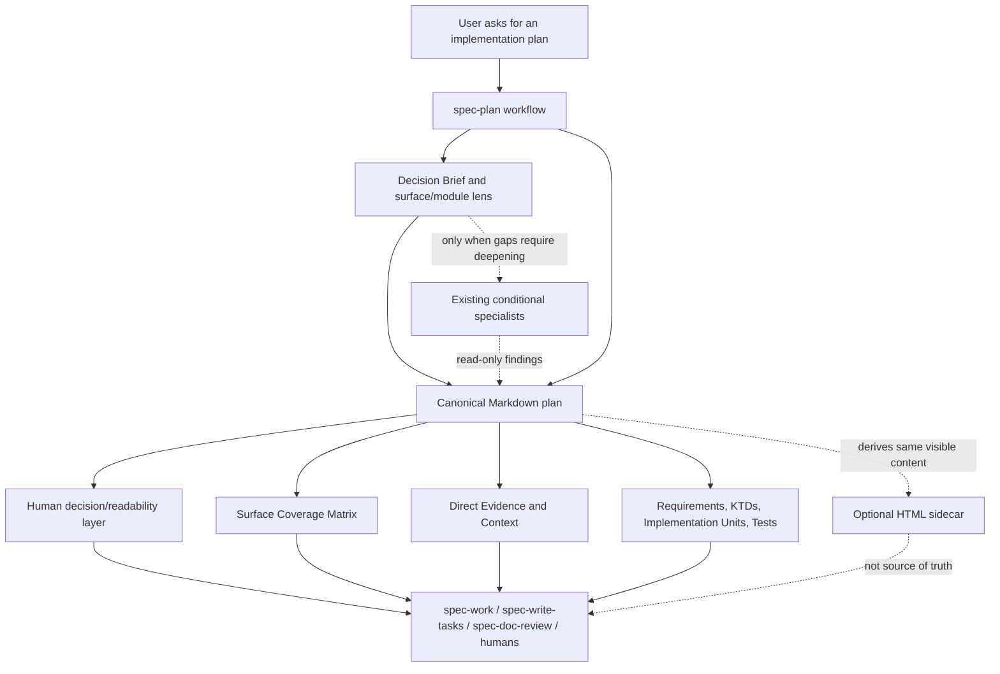

# refactor: Improve spec-plan decision brief and surface coverage

## Summary

Improve `spec-plan` output with a front-loaded decision brief, conditional multi-surface/module coverage lens, and professional technical-plan module guidance so a human reviewer can understand the proposed direction, decisions, risks, validation focus, and implementation shape in the first pass, while preserving canonical Markdown as the durable source artifact consumed by `spec-work`, `spec-write-tasks`, and `spec-doc-review`.

---

## Problem Frame

The current `spec-plan` artifact is strong as an AI/execution handoff: it carries stable IDs, Direct Evidence, implementation units, file references, test scenarios, downstream consumers, and handoff options. That density is useful for agent reuse, but it can make the first screen feel optimized for downstream parsing rather than human judgment. The user question is whether the current plan output is more suitable for AI to read than for people to read.

The planned change should not split the artifact into a human document and an AI document. The right direction is a single canonical Markdown plan with a front-loaded human decision/readability layer, followed by the existing machine-usable details. For professional software plans, that layer also needs a lightweight decision-analysis lens: whether the work touches App, H5, PC, Admin, backend, data, API contracts, observability, or rollout surfaces, and which modules require deeper thinking. Optional HTML can remain a presentation sidecar, but not a second source of truth.

---

## Requirements

- R1. Generated software plans must be easier for humans to scan quickly: the first major content area should state the goal, recommended approach, key decisions, validation focus, and largest risks without forcing the reader through evidence inventory first.
- R2. Canonical Markdown remains the source of truth for plans; no HTML-only plan, hidden metadata layer, or sidecar-only summary may become load-bearing.
- R3. Stable IDs, YAML metadata, repo-relative paths, Direct Evidence, requirements, implementation units, test scenarios, and source references must remain visible and usable by downstream workflows.
- R4. `spec-work`, `spec-write-tasks`, and `spec-doc-review` compatibility must be preserved or updated with focused contract tests when section names or ordering change.
- R5. The change must clarify what belongs to human-facing summary versus agent-facing reuse detail, without creating duplicate durable truth.
- R6. The implementation must update source assets only, then refresh runtime mirrors with `spec-first init` only if the implementation scope explicitly includes runtime regeneration.
- R7. Implementation must update `CHANGELOG.md` because this is a user-visible workflow output change.
- R8. Skill prose changes must receive focused source validation and, when possible, fresh-source eval; if dispatch/runtime cannot support that eval, the implementation closeout must say so.
- R9. Standard and Deep plans should include a conditional multi-surface/module coverage lens when the task touches more than one client, backend surface, data path, contract, or operational concern.
- R10. The technical-plan module model should cover professional engineering concerns without forcing irrelevant boilerplate: architecture, business flow, data flow, API contract, frontend/backend design, security, performance, rollout, observability, and verification.
- R11. `spec-plan` should prefer existing decision-analysis and reviewer primitives before adding new skill nodes or agents; new agents require evidence of repeated gaps that inline guidance and existing specialists do not cover.

---

## Scope Boundaries

- Do not replace canonical Markdown with HTML, rendered cards, or a generated sidecar as the primary artifact.
- Do not add a new schema or machine-readable contract unless implementation discovers a concrete downstream consumer need that cannot be satisfied by visible Markdown.
- Do not generate task packs during this planning work.
- Do not hand-edit `.claude/`, `.codex/`, or `.agents/skills/`; they are generated runtime mirrors.
- Do not redesign the whole `spec-plan` product positioning or turn it into a generic document system.
- Do not remove Direct Evidence or implementation-unit detail; make it better placed and easier to navigate.
- Do not create separate public workflow entries for App, H5, Admin, PC, backend, or data planning.
- Do not add per-surface specialist agents by default. Specialist dispatch must stay conditional, read-only, and bounded to documented `spec-plan` research/deepening phases.

### Deferred to Follow-Up Work

- A richer HTML/Proof presentation layer can be explored after Markdown-first readability is improved and downstream parity tests exist.
- Plan-quality eval fixtures for human readability can become a later optimization track if this first prose/template pass is not enough.

---

## Direct Evidence Readiness

- target_repo: `spec-first`
- evidence_sources: direct source reads, `rg`, git status, task-governance helper output, existing contract tests, degraded graphify availability check, prior dispatch attempt result
- source_refs: `docs/10-prompt/结构化项目角色契约.md`, `skills/spec-plan/SKILL.md`, `skills/spec-plan/references/deepening-workflow.md`, `skills/spec-plan/references/plan-sections.md`, `skills/spec-plan/references/markdown-rendering.md`, `skills/spec-plan/references/plan-template.md`, `skills/spec-plan/references/synthesis-summary.md`, `tests/unit/spec-plan-contracts.test.js`, `docs/contracts/artifact-summary.md`, `docs/contracts/source-runtime-customization-boundary.md`, `docs/solutions/workflow-issues/database-routing-and-dual-view-refresh-boundaries-2026-04-20.md`, `docs/solutions/architecture-patterns/rebar-structure-skill-simplification-pattern-2026-06-04.md`, `docs/solutions/architecture-patterns/ai-reviewer-capability-borrowing-gates-2026-06-09.md`
- external_refs: `https://docs.github.com/en/copilot/how-tos/copilot-on-github/customize-copilot/customize-cloud-agent/create-custom-agents`, `https://docs.github.com/en/copilot/concepts/agents/cloud-agent/about-cloud-agent`, `https://docs.anthropic.com/en/docs/claude-code/sub-agents`, `https://docs.cline.bot/core-workflows/plan-and-act`
- current_revision: `387abe4a`
- worktree_status: dirty before this plan; unrelated modified/deleted/untracked files were present and must not be reverted
- confidence: high for source/runtime boundary and downstream contract shape; medium for exact naming of the new human layer until implementation validates wording against generated examples
- limitations: read-only research agent dispatch failed due to capacity before this plan was written; `graphify-out/graph.json` exists but `graphify` CLI was not available in PATH, so graphify was not used as confirmed evidence; `skills/spec-plan/SKILL.md` and `.agents/skills/spec-plan/SKILL.md` differ in runtime projection paths, so implementation must treat `skills/spec-plan/**` as source truth and refresh generated mirrors deliberately

---

## Direct Evidence

- repo_scope: current repo `spec-first`
- source_reads_completed:
  - `docs/10-prompt/结构化项目角色契约.md` confirms light contracts, explicit boundaries, source/runtime separation, script-vs-LLM responsibility, and 80/20 evolution rules.
  - `skills/spec-plan/SKILL.md` confirms `spec-plan` must write durable plans, preserve downstream consumers, include Direct Evidence, and load `plan-sections.md`, `markdown-rendering.md`, and `plan-template.md` before writing.
  - `skills/spec-plan/references/deepening-workflow.md` confirms `spec-plan` already has conditional expert dispatch for architecture, flow, implementation units, system-wide impact, security, data integrity, performance, and deployment risks.
  - `skills/spec-plan/references/plan-sections.md` confirms three audiences: implementer, reviewer, and future reader; canonical Markdown remains the plan artifact.
  - `skills/spec-plan/references/markdown-rendering.md` confirms visible Markdown, YAML frontmatter, plain stable IDs, raw diff usefulness, and no HTML/hidden metadata.
  - `skills/spec-plan/references/plan-template.md` confirms current section skeleton and implementation-unit heading contract.
  - `docs/contracts/source-runtime-customization-boundary.md` confirms source assets own behavior, generated mirrors must not be hand-edited, and `docs/plans/` are workflow artifacts rather than behavior source.
  - `docs/contracts/artifact-summary.md` confirms summary-first handoff must not become a second complete report or source-of-truth replacement.
  - `tests/unit/spec-plan-contracts.test.js` confirms contract tests already pin plan template naming, Markdown/HTML sidecar boundaries, runtime projection references, and downstream wording.
- source_reads_required:
  - `skills/spec-plan/SKILL.md` and `skills/spec-plan/references/*` source copies during implementation, not generated runtime mirrors.
  - `skills/spec-work/SKILL.md`, `skills/spec-write-tasks/SKILL.md`, and `skills/spec-doc-review/SKILL.md` only if the new section name/order changes their consumption assumptions.
  - `tests/unit/spec-work-contracts.test.js`, `tests/unit/spec-write-tasks-contracts.test.js`, and `tests/unit/spec-doc-review-contracts.test.js` only when those consumer assets are touched.
- commands_or_tools_used:
  - `spec-first startup-reminder --codex` returned no blocking reminder output.
  - `spec-first internal task-governance-signals --source plan-declared ... --json` returned advisory `candidate_level: deep` with risk domains `contract`, `runtime`, and `workflow`.
  - `git rev-parse --short HEAD` returned `387abe4a`; `git status --short` showed unrelated dirty worktree entries before this plan.
  - `rg` searches found existing contracts and tests around `Summary`, canonical Markdown, optional HTML sidecar, and dual-view knowledge patterns.
  - `command -v graphify` returned no CLI path; `graphify-out/graph.json` exists.
  - `cmp` showed `skills/spec-plan/references/plan-sections.md`, `markdown-rendering.md`, and `plan-template.md` match their `.agents/skills/spec-plan/references/` runtime copies, while `skills/spec-plan/SKILL.md` differs from its runtime mirror in projection path wording and agent references.
  - Web research against official docs found that Copilot, Claude Code, and Cline all support specialized planning/agent/subagent concepts, but their docs frame them as task-specific or mode-specific helpers rather than mandatory per-surface workflows.
- impact_on_plan: choose a Markdown-first front-loaded readability layer, avoid HTML as primary mechanism, preserve visible details for downstream agents, and require focused contract tests instead of a broad rewrite.
- key_findings:
  - Current `spec-plan` quality bar already treats humans as an audience, but the concrete template does not yet make the human decision pass a first-class section.
  - Existing `Summary` is 1-3 lines, which is useful but too small to carry decisions, validation, risk, and implementation shape for deep plans.
  - Existing optional HTML sidecar guidance already has the right boundary and should not become the core solution.
  - The `Human Summary` / `LLM Reuse Context` learning supports dual-view content in one durable file, not a second artifact.
  - Existing `spec-plan` deepening already has many specialist agents; the gap is not "no agents", but lack of an explicit decision lens that tells the orchestrator when multi-end/module coverage matters.
- limitations: no successful read-only research agent reports were available; this plan uses direct source evidence and prior institutional docs instead.

---

## Context & Research

### Relevant Code and Patterns

- `skills/spec-plan/SKILL.md` is the source workflow spine that decides when to write a plan, how to gather context, when to deepen, and which references govern rendering.
- `skills/spec-plan/references/plan-sections.md` is the right place to define a human scan/readability layer because it owns section purpose and audience value.
- `skills/spec-plan/references/plan-template.md` is the concrete Markdown skeleton that needs the new section placement.
- `skills/spec-plan/references/markdown-rendering.md` is the rendering boundary that should keep the new layer visible, plain Markdown, and raw-diff friendly.
- `skills/spec-plan/references/html-rendering.md` may need only a boundary clarification if implementation finds the optional sidecar wording could imply alternate truth.
- `skills/spec-plan/references/deepening-workflow.md` already maps sections to specialists such as `spec-architecture-strategist`, `spec-spec-flow-analyzer`, `spec-security-sentinel`, `spec-data-integrity-guardian`, `spec-performance-oracle`, and `spec-deployment-verification-agent`.
- `tests/unit/spec-plan-contracts.test.js` already tests the `Summary`, `Requirements`, Markdown source artifact, optional HTML sidecar, and runtime projection references; it is the primary test target.

### Institutional Learnings

- `docs/solutions/workflow-issues/database-routing-and-dual-view-refresh-boundaries-2026-04-20.md` shows that `Human Summary` and `LLM Reuse Context` can coexist in one durable file when their purposes are distinct. The relevant pattern is not the exact title, but the separation between quick human handoff and high-density agent reuse.
- `docs/solutions/workflow-issues/modify-source-not-artifacts-2026-04-13.md` reinforces editing source assets instead of generated artifacts.
- `docs/solutions/workflow-issues/workflow-host-instruction-reuse-policy-2026-05-25.md` supports keeping host instruction reuse bounded rather than expanding always-on context.
- `docs/solutions/architecture-patterns/rebar-structure-skill-simplification-pattern-2026-06-04.md` says to find load-bearing axes and keep `SKILL.md` as the workflow spine, not an encyclopedia.
- `docs/solutions/architecture-patterns/ai-reviewer-capability-borrowing-gates-2026-06-09.md` supports evidence and existing-primitive gates before adding heavy borrowed mechanisms.

### External References

- GitHub Copilot cloud agent docs describe custom agents as specialized versions of the agent tailored to workflows, coding conventions, and use cases, including examples for implementation planning with headings, task breakdowns, acceptance criteria, testing, deployment, and risk considerations.
- Claude Code docs describe custom subagents as specialized AI assistants with custom prompts, tool restrictions, permission modes, hooks, and skills.
- Cline docs describe Plan & Act as separate modes: planning explores and strategizes without changing files, while act mode executes against the plan.
- These references support conditional specialization and plan/act separation, not unconditional proliferation of per-endpoint planning agents.

---

## Key Technical Decisions

- KTD1. Add a front-loaded human decision/readability layer inside canonical Markdown, not outside it.
  - `question`: Where should human readability be improved?
  - `recommended_answer`: Add a first-class section such as `## Decision Brief` or strengthen `## Summary` into a two-level human scan area before dense evidence and implementation detail.
  - `source_tag`: confirmed for Markdown boundary, advisory for exact section name.
  - `chosen_answer`: Plan for a canonical Markdown section; implementation should decide exact title after checking downstream wording.
  - `consequence`: Human readers get faster orientation without breaking downstream Markdown consumers.
- KTD2. Preserve `## Summary` as the short plan proposition; do not overload it with every decision.
  - `question`: Should `Summary` become the whole human-readable layer?
  - `recommended_answer`: Keep `Summary` short and add a neighboring decision brief for deep/standard plans.
  - `source_tag`: confirmed by `plan-template.md` and `synthesis-summary.md`.
  - `chosen_answer`: Use `Summary` for the 1-3 line plan proposition; use the new layer for decision/risk/validation scanning.
  - `consequence`: Existing consumers and older plan semantics stay stable.
- KTD3. Treat HTML as optional rendering only.
  - `question`: Should human readability be solved by an HTML companion?
  - `recommended_answer`: No. Improve Markdown first; HTML may render the same content later.
  - `source_tag`: confirmed by `plan-sections.md`, `markdown-rendering.md`, and `html-rendering.md`.
  - `chosen_answer`: Keep HTML sidecar optional and non-load-bearing.
  - `consequence`: Avoids a second durable truth and avoids downstream consumer drift.
- KTD4. Pin semantics with focused contract tests rather than broad snapshot tests.
  - `question`: How should this output-shape change be protected?
  - `recommended_answer`: Add assertions for the human layer, Markdown source boundary, section order, and no HTML replacement wording.
  - `source_tag`: confirmed by existing `tests/unit/spec-plan-contracts.test.js` style.
  - `chosen_answer`: Extend focused prose contract tests.
  - `consequence`: Tests protect load-bearing behavior without freezing full prose.
- KTD5. Expand `spec-plan` decision analysis as conditional lenses before adding new agent assets.
  - `question`: Should `spec-plan` add more decision-analysis capability, or add new per-surface skill/agent nodes first?
  - `recommended_answer`: Add a multi-surface/module coverage lens to the plan contract first; use existing specialist agents during deepening when the lens exposes gaps.
  - `source_tag`: confirmed for existing specialist coverage, advisory for future need of a new generic reviewer.
  - `chosen_answer`: Start with decision-analysis guidance and template changes. Defer new agent creation until eval or repeated real plans show that existing agents miss surface coverage.
  - `consequence`: Improves plan completeness for App/H5/Admin/PC/backend/data work without growing the public workflow surface or dispatch matrix prematurely.
- KTD6. If an agent is later needed, add at most one generic surface-coverage reviewer before any per-end agents.
  - `question`: What agent shape would be acceptable if inline guidance is not enough?
  - `recommended_answer`: A single read-only `spec-surface-coverage-reviewer` or equivalent planning reviewer that checks omitted surfaces, modules, contracts, and verification coverage.
  - `source_tag`: advisory.
  - `chosen_answer`: Do not implement now; record as a staged option behind evidence gates.
  - `consequence`: Avoids App/H5/Admin/backend agent sprawl while preserving an escape hatch for repeated gaps.

---

## Open Questions

### Resolved During Planning

- Should the plan recommend a separate human-only artifact? No. Existing source/runtime and dual-view learnings favor one durable canonical file.
- Should implementation hand-edit `.agents/skills/spec-plan` because the current session reads it? No. Runtime mirrors are generated; implementation should edit `skills/spec-plan/**` source and refresh runtime only through `spec-first init` when needed.
- Should this be treated as Deep? Yes. The advisory helper reported `candidate_level: deep`, and the change touches workflow, contract, runtime projection, and downstream consumer assumptions.

### Deferred to Implementation

- Exact heading name for the human layer: implementation should choose between `Decision Brief`, `At a Glance`, or a strengthened `Summary` substructure after checking generated examples and consumer tests.
- Whether `spec-doc-review`, `spec-write-tasks`, or `spec-work` need prose updates: decide after inspecting their current plan consumption assumptions against the final heading/ordering.
- Whether optional `html-rendering.md` needs any change: only update it if current wording becomes ambiguous after the Markdown layer is added.
- Whether a future `spec-surface-coverage-reviewer` is justified: decide only after inline multi-surface lenses and existing deepening agents are tested against representative App/H5/Admin/PC/backend plans.

---

## Target Technical Plan Module Model

`spec-plan` should not force every plan to contain every module. It should define a professional module model and trigger modules when they materially improve decisions, implementation, or review.

| Module | Include When | Purpose |
|---|---|---|
| Decision Brief | Standard/Deep plans, or any plan with meaningful tradeoffs | Human first-pass judgment: approach, scope, validation, risks |
| Problem Frame / Goals / Non-Goals | Always for durable software plans | Preserve why the work exists and what is deliberately excluded |
| Requirements / Acceptance Criteria | Always for durable software plans | Give reviewers and implementers stable success criteria |
| Direct Evidence | Always when repo/code/workflow claims are made | Separate confirmed source facts from advisory assumptions |
| Surface Coverage Matrix | Multi-end, multi-module, or cross-contract work | Prevent missing App/H5/Admin/PC/backend/data/API/ops surfaces |
| Business / User Flow | User-facing workflows, approval flows, state transitions | Clarify actors, key flows, and behavior sequencing |
| Architecture / Module Design | Multi-component, service, workflow, runtime, or package changes | Clarify boundaries, dependencies, and ownership |
| Data / State / Event Flow | Data persistence, migration, cache, analytics, jobs, events | Clarify lifecycle, consistency, and integrity risks |
| API / Contract Design | Frontend/backend, external API, schema, events, CLI, or task contracts | Clarify compatibility, versioning, errors, and consumers |
| Frontend / Client Design | App, H5, PC web, Admin, component, route, or UX changes | Clarify page/component/state/permission/adaptation behavior |
| Backend / Service Design | Domain logic, services, jobs, authorization, persistence | Clarify transactions, idempotency, concurrency, failure handling |
| Security / Privacy / Permission | Auth, user data, roles, external integrations, admin tools | Clarify trust boundaries, audit, redaction, and abuse paths |
| Performance / Reliability | Latency, capacity, availability, retries, background jobs | Clarify SLO-like expectations, degradation, and resource risks |
| Rollout / Migration / Rollback | Runtime, data migration, release, or user-visible workflow changes | Clarify rollout order, flags, compatibility window, rollback |
| Observability / Operations | Production behavior, support, admin tooling, background flows | Clarify logs, metrics, traces, alerts, runbook needs |
| Key Technical Decisions / Alternatives | Meaningful architecture, sequencing, or boundary tradeoffs | Make decisions reviewable and reusable |
| Implementation Units / Verification | Always for implementation plans | Give AI/humans bounded execution units and test expectations |

---

## Multi-Surface Coverage Model

Use this as a conditional lens, not a mandatory table for every plan. It belongs in Standard/Deep plans when the request touches multiple clients, contracts, or runtime surfaces.

| Surface | Typical Questions The Plan Must Answer |
|---|---|
| App / Native mobile | Deep links, OS/version constraints, offline/weak network, push, permissions, analytics, App Store release constraints |
| H5 / Mobile web | Responsive behavior, shareable URLs, browser compatibility, login/cookie/token behavior, accessibility |
| PC Web | Dense layout, routing, keyboard behavior, desktop browser support, responsive breakpoints |
| Admin / Back office | RBAC, audit logs, table/filter/export behavior, batch actions, dangerous-operation guardrails |
| Backend / API | Domain boundaries, authz, idempotency, transactions, errors, versioning, rate limits |
| Data / Storage | Schema, migration/backfill, indexes, retention, consistency, cache invalidation |
| Events / Jobs / Integrations | Async ordering, retries, dedupe, observability, webhook or message contract compatibility |
| Observability / Ops | Logs, metrics, tracing, dashboards, alerting, runbook, rollback |
| Testing / Quality | Unit, integration, contract, E2E, visual, accessibility, performance, security coverage |

The plan writer should mark each relevant surface as in scope, out of scope, deferred, or not applicable. A surface omitted because it is irrelevant should stay omitted; a surface omitted because nobody checked it is a planning gap.

---

## High-Level Technical Design

> *This illustrates the intended approach and is directional guidance for review, not implementation specification. The implementing agent should treat it as context, not code to reproduce.*

---

## Implementation Units

Execution order follows the `Dependencies` fields, not numeric U-ID order. Preserve U-IDs for review traceability; execute U7 before U4, execute U8 after U7, and execute U6 last.

### U1. Define the canonical human readability layer

**Goal:** Make the human scan layer an explicit part of plan content, including its audience, placement, and omission rules.

**Requirements:** R1, R2, R3, R5

**Dependencies:** None

**Files:**
- Modify: `skills/spec-plan/references/plan-sections.md`
- Test: `tests/unit/spec-plan-contracts.test.js`

**Approach:**
- Add a section concept that tells plan writers what the first human pass must contain: recommended approach, key decisions, validation focus, largest risks, and scope boundaries.
- State that this layer is part of the canonical Markdown artifact and must not duplicate or contradict lower sections.
- Keep the three-audience framing: implementer, reviewer, future reader. The new layer primarily serves the reviewer and future reader, while lower sections keep serving implementers and downstream agents.
- Define omission rules so lightweight plans can remain compact when a short `## Summary` is enough.

**Patterns to follow:**
- `skills/spec-plan/references/plan-sections.md` hard floor and "Include When Material" structure.
- `docs/solutions/workflow-issues/database-routing-and-dual-view-refresh-boundaries-2026-04-20.md` dual-view distinction, but avoid copying knowledge-doc section names blindly.

**Test scenarios:**
- Happy path: `plan-sections.md` contains the new human readability layer and states that canonical Markdown remains the source artifact.
- Edge case: prose makes clear that lightweight plans may omit or compress the layer when it adds no value.
- Error path: tests fail if wording implies a sidecar, hidden metadata, or HTML output can replace Markdown.

**Verification:**
- A reader can identify what the new layer is for, where it belongs, and what it must not replace.

---

### U2. Update the Markdown plan skeleton and rendering rules

**Goal:** Make new `spec-plan` outputs render the human layer in the right place without breaking Markdown invariants.

**Requirements:** R1, R2, R3, R4

**Dependencies:** U1

**Files:**
- Modify: `skills/spec-plan/references/plan-template.md`
- Modify: `skills/spec-plan/references/markdown-rendering.md`
- Test: `tests/unit/spec-plan-contracts.test.js`

**Approach:**
- Add the new human layer immediately after `## Summary` or as a clearly bounded expansion of the top-of-document area.
- Keep Direct Evidence before `Context & Research`, but avoid making evidence inventory dominate the first human decision pass.
- Ensure the new section uses visible plain Markdown, no HTML, no hidden metadata, and no generated layout syntax.
- Preserve implementation-unit heading format `### U1. [Name]` and existing required metadata.
- Choose the final heading name before extending contract tests: generate at least one representative plan output using the candidate heading, confirm the heading survives a raw-text diff and is readable at the top of the document, then commit to the name before adding the `expect(planTemplate).toContain('## <chosen-name>')` assertion. Record the chosen name in closeout evidence.

**Patterns to follow:**
- `skills/spec-plan/references/markdown-rendering.md` hard invariants.
- Existing top-level horizontal-rule convention for Standard and Deep plans.

**Test scenarios:**
- Happy path: the template includes the human layer near the top and still includes `## Summary`, `## Requirements`, `## Assumptions`, `## Scope Boundaries`, `## Completion Criteria`, `## Direct Evidence Readiness`, `## Direct Evidence`, and `## Implementation Units`.
- Edge case: the new layer does not introduce bolded stable-ID prefixes or hidden machine metadata.
- Error path: tests fail if the template includes HTML container tags, inline styles, or HTML-only layout guidance.

**Verification:**
- A newly generated standard/deep plan can be read top-down by a human without losing the downstream contract fields.

---

### U3. Teach `spec-plan` when and how to write the layer

**Goal:** Update the workflow spine so planning runs deliberately produce the human-readable top layer instead of treating it as a template-only concern.

**Requirements:** R1, R3, R5, R8

**Dependencies:** U1, U2

**Files:**
- Modify: `skills/spec-plan/SKILL.md`
- Test: `tests/unit/spec-plan-contracts.test.js`

**Approach:**
- Update Phase 4/5 guidance so plan writing and review check for the human scan layer on Standard and Deep plans.
- Keep `SKILL.md` as the workflow spine: link the section contract in references instead of embedding a long readability rubric.
- Add a final-review check that the first human pass answers "what are we doing, why this approach, what validates it, and what could go wrong?"
- Keep Direct Evidence mandatory; this change adjusts scan order and narrative shape, not evidence honesty.

**Patterns to follow:**
- `skills/spec-plan/SKILL.md` Phase 4.2 reference-loading pattern.
- `docs/solutions/architecture-patterns/rebar-structure-skill-simplification-pattern-2026-06-04.md` guidance to avoid turning `SKILL.md` into an encyclopedia.

**Test scenarios:**
- Happy path: `SKILL.md` instructs writers to include/check the layer for Standard and Deep plans.
- Edge case: `SKILL.md` keeps lightweight omission/compression possible.
- Error path: tests fail if `SKILL.md` suggests replacing Direct Evidence, implementation units, or Markdown consumers.

**Verification:**
- The source workflow tells future agents to write the layer, not merely to keep a template field.

---

### U4. Preserve downstream consumer compatibility

**Goal:** Ensure `spec-work`, `spec-write-tasks`, and `spec-doc-review` continue to consume plans safely after the new top-level section and conditional surface coverage lens are added.

**Requirements:** R3, R4, R8

**Dependencies:** U2, U3, U7

**Files:**
- Inspect: `skills/spec-work/SKILL.md`
- Inspect: `skills/spec-write-tasks/SKILL.md`
- Inspect: `skills/spec-doc-review/SKILL.md`
- Modify if needed: `skills/spec-work/SKILL.md`
- Modify if needed: `skills/spec-write-tasks/SKILL.md`
- Modify if needed: `skills/spec-doc-review/SKILL.md`
- Test if modified: `tests/unit/spec-work-contracts.test.js`
- Test if modified: `tests/unit/spec-write-tasks-contracts.test.js`
- Test if modified: `tests/unit/spec-doc-review-contracts.test.js`

**Approach:**
- Search consumers for assumptions about exact section order or heading names.
- If consumers already work from stable IDs and implementation-unit sections, leave them untouched.
- If consumers mention the top-of-plan structure, update wording minimally so the new layer is recognized as context, not a new task source.
- Keep task compilation based on written plan structure and U-IDs, not the human brief.

**Patterns to follow:**
- Existing downstream contract wording that treats plans as decision artifacts and derives progress from git/work evidence.
- `docs/contracts/governance/task-governance-signals.md` distinction between advisory helper output and written source-plan structure.

**Test scenarios:**
- Happy path: `spec-write-tasks` still treats implementation units, dependencies, and plan depth as primary task-pack evidence.
- Happy path: `spec-work` still starts from goals, non-goals, U-IDs, files, and verification expectations.
- Happy path: `spec-doc-review` can review the new layer for clarity without making it a second contract.
- Error path: tests fail if a consumer treats the human brief as a replacement for requirements or U-IDs.

**Verification:**
- Focused contract tests pass for every consumer file that changes; if no consumer files change, source inspection is documented in closeout.

---

### U5. Clarify optional HTML sidecar boundaries only if needed

**Goal:** Keep presentation improvements from turning into a second source of truth.

**Requirements:** R2, R3, R5

**Dependencies:** U1, U2

**Files:**
- Inspect: `skills/spec-plan/references/html-rendering.md`
- Modify if needed: `skills/spec-plan/references/html-rendering.md`
- Test: `tests/unit/spec-plan-contracts.test.js`

**Approach:**
- Read current HTML sidecar wording after U1/U2 changes.
- Update only if the new human layer creates ambiguity about whether HTML may add, omit, or rewrite load-bearing content.
- Keep the existing principle: Markdown is written first; HTML may render the same content.

**Patterns to follow:**
- `skills/spec-plan/references/html-rendering.md` current optional-sidecar stance.
- `skills/spec-plan/references/markdown-rendering.md` hard invariants.

**Test scenarios:**
- Happy path: tests confirm HTML remains optional and derived from Markdown.
- Error path: tests fail if HTML wording suggests an exclusive output mode, second source, or content divergence.

**Verification:**
- HTML sidecar text is either unchanged with an explicit inspection note, or changed with focused tests.
- If inspection finds the existing html-rendering.md wording is still unambiguous after U1/U2 land, close U5 with an explicit inspection note citing the unchanged content. The existing `expect(htmlRendering).toContain('optional HTML sidecar')` assertion in spec-plan-contracts.test.js already satisfies the happy path scenario; do not add a duplicate assertion. Only add a new assertion if the wording changes.

---

### U6. Update changelog, validate, and refresh runtime deliberately

**Goal:** Finish the implementation after all plan-shape, surface-coverage, consumer-compatibility, and agent-gate changes land, with traceable user-visible documentation, focused validation, and honest runtime handling.

**Requirements:** R6, R7, R8

**Dependencies:** U1, U2, U3, U4, U5, U7, U8

**Files:**
- Modify: `CHANGELOG.md`
- Test: `tests/unit/spec-plan-contracts.test.js`
- Test if touched: `tests/unit/spec-work-contracts.test.js`
- Test if touched: `tests/unit/spec-write-tasks-contracts.test.js`
- Test if touched: `tests/unit/spec-doc-review-contracts.test.js`

**Approach:**
- Add a `CHANGELOG.md` entry marked `(user-visible)` and use the configured developer author.
- Run the narrowest tests first, then expand only if consumer files changed.
- Run `npm run lint:skill-entrypoints` because workflow prose and references are being changed.
- Run `spec-first init` only if the implementation includes runtime regeneration; never patch runtime mirrors directly.
- Perform fresh-source eval for skill prose if host dispatch is available. If dispatch fails or is unavailable, state the reason and avoid claiming eval success.

**Patterns to follow:**
- `docs/contracts/source-runtime-customization-boundary.md` source-first/runtime-generated boundary.
- Existing `tests/unit/spec-plan-contracts.test.js` projection tests.

**Test scenarios:**
- Happy path: focused spec-plan contract tests pass.
- Integration path: consumer tests pass when consumer prose changes.
- Error path: validation or closeout catches any runtime/source drift claim that was not actually checked.

**Verification:**
- Implementation closeout lists commands run, whether `spec-first init` was run, whether fresh-source eval ran, and any residual limitations.

---

### U7. Add conditional technical-plan module and surface coverage lenses

**Goal:** Let `spec-plan` produce professional technical-plan modules for App/H5/PC/Admin/backend/data/API/ops work without forcing boilerplate into small plans.

**Requirements:** R1, R9, R10, R11

**Dependencies:** U1, U2, U3

**Files:**
- Modify: `skills/spec-plan/references/plan-sections.md`
- Modify: `skills/spec-plan/references/plan-template.md`
- Modify: `skills/spec-plan/references/markdown-rendering.md`
- Modify: `skills/spec-plan/SKILL.md`
- Create (if the coverage eval runs): `docs/plans/fixtures/spec-plan-surface-coverage-eval-example.md` — a representative fixture plan showing per-surface scope decisions, kept as a non-durable eval artifact
- Test: `tests/unit/spec-plan-contracts.test.js`

**Approach:**
- Add a conditional `Surface Coverage Matrix` or equivalent section to the plan section contract.
- Define trigger rules: include the matrix when the plan touches more than one client, backend surface, API/schema/event contract, data lifecycle, operational concern, or rollout path.
- Treat the listed surface rows (App, H5, PC Web, Admin, backend, data/API, events/jobs, observability, testing) as representative examples, not a closed set. State the derivation rule: the plan writer enumerates the surfaces that actually exist in the target repo/product (clients, contracts, runtimes, operational concerns) and extends or replaces the listed rows as needed.
- Define the professional module model as guidance, not mandatory headings. The plan writer selects modules that carry decision value.
- Split coverage ownership explicitly so the lens is not mistaken for a new reviewer role: coverage *breadth* (is every relevant surface accounted for?) is owned by the orchestrator through the matrix structure — an enumerated row left undecided is a self-evident gap, no second agent is needed to find it; coverage *depth* (is the H5 interface good, is the migration safe?) is owned by the existing specialist agents per surface (see U8). The matrix forces breadth; specialists deepen the rows that carry risk.
- Add a final-review check that Standard/Deep plans either include the relevant surface/module analysis or explicitly state why it is not applicable.
- Keep the surface matrix as visible Markdown and avoid hidden schema unless downstream consumers later require one.

**Patterns to follow:**
- `skills/spec-plan/references/plan-sections.md` "Include When Material" pattern.
- `skills/spec-plan/references/visual-communication.md` conditional diagram/table guidance.
- `skills/spec-doc-review/SKILL.md` progressive reviewer posture: use the smallest reviewer posture that catches material risk.

**Test scenarios:**
- Happy path: source references describe a conditional multi-surface/module coverage lens for Standard/Deep plans.
- Edge case: lightweight and single-surface plans are allowed to omit the matrix cleanly.
- Error path: tests fail if the guidance implies every plan must include App/H5/Admin/backend sections regardless of relevance.
- Integration path: tests confirm `spec-plan` still preserves `Summary`, `Direct Evidence`, `Requirements`, and implementation-unit contracts.
- Coverage eval path: verify via a fresh spec-plan run (record the result in closeout) for a feature spanning native App deep links, H5 share pages, PC web settings, Admin approval tables, backend APIs, a data migration/backfill, async notification jobs, observability, and rollback. The generated plan should mark relevant surfaces as in scope, out of scope, deferred, or not applicable, and should select only material technical-plan modules. If the eval produces a fixture plan, store it at `docs/plans/fixtures/spec-plan-surface-coverage-eval-example.md` as a non-durable eval artifact.

**Verification:**
- A plan involving App + H5 + backend + Admin can be generated with explicit coverage decisions, while a narrow backend-only plan remains compact.
- If a live plan-generation eval is unavailable (dispatch capacity or tool path unavailable), the implementer may substitute a direct prose review: manually apply the Surface Coverage Matrix guidance to the nine-surface scenario and confirm the matrix selects the correct in-scope/out-of-scope/deferred/not-applicable designations. Document this as a prose-review substitute in closeout, not as a passed eval.

---

### U8. Gate any new planning agents behind coverage-eval evidence

**Goal:** Decide whether new agent assets are necessary only after the improved decision lens is tested against real multi-surface planning gaps.

**Requirements:** R4, R8, R11

**Dependencies:** U7

**Files:**
- Modify: `skills/spec-plan/references/deepening-workflow.md`
- Do not create unless the evidence gate passes during implementation: `agents/spec-surface-coverage-reviewer.agent.md`
- Test: `tests/unit/spec-plan-contracts.test.js`
- Test if agent added: `tests/unit/agent-support-contracts.test.js`

**Approach:**
- Update deepening guidance so multi-surface/module gaps first use existing agents: `spec-architecture-strategist`, `spec-spec-flow-analyzer`, `spec-design-lens-reviewer`, `spec-api-contract-reviewer`, `spec-security-sentinel`, `spec-data-integrity-guardian`, `spec-performance-oracle`, and `spec-deployment-verification-agent`.
- Honest reuse caveat: of these eight, only `spec-spec-flow-analyzer` (description: "spec, plan, or feature description") and `spec-design-lens-reviewer` (description: "Reviews planning documents") are natively plan-facing. The other six are code/diff/PR review agents — `spec-api-contract-reviewer` is diff-bound (its confidence rubric anchors on "the exact line where the contract changes"), `spec-security-sentinel`/`spec-data-integrity-guardian`/`spec-performance-oracle`/`spec-deployment-verification-agent` work by scanning code, migrations, queries, or PRs. At plan time they contribute domain lenses only, not their native scanning/diff mechanisms (the deepening workflow already borrows them this way for plan review, e.g. "The spec-architecture-strategist reviewed Key Technical Decisions"). Additionally, none of the eight owns multi-surface coverage completeness as its ownership boundary: `design-lens` rates a single interface's IA/interaction states and `flow-analyzer` rates user-flow completeness — each covers only a subset of "are all client surfaces planned?". Therefore "reuse existing specialists to cover multi-surface gaps" is not load-bearing until U7's coverage-eval empirically shows the borrowed lenses actually catch missed surfaces.
- Add a clear evidence gate for a new agent: only create a generic `spec-surface-coverage-reviewer` if fresh-source evals or repeated real plans show that inline guidance plus existing specialists still miss App/H5/Admin/PC/backend/data/ops surfaces.
- Residual-gap shape and remedy order: the matrix forces a decision on every *listed* surface, but cannot guarantee the list is complete — the real residual risk is the unknown-unknown surface the orchestrator never enumerated (e.g., an embedded SDK), where there is no row and therefore no visible blank. The derivation rule in U7 (enumerate from surfaces actually present in the target repo) is the first mitigation, downgrading "forgot to imagine it" to "discoverable in the repo but overlooked". If U7's coverage-eval shows enumeration still misses real surfaces, prefer a deterministic surface-enumeration script over a new agent: surface discovery (scanning for `ios/`, `android/`, `admin/`, `migrations/`, and similar repo signals to emit a candidate surface list) is deterministic file-discovery work that scripts own per the project role contract, with the orchestrator making the in/out-of-scope judgment. A new reviewer agent is justified only if the residual gap is semantic (surfaces exist and are enumerable but their coverage judgment is consistently wrong), not merely enumerative.
- Context isolation alone is not a sufficient justification for a new agent type. Reducing orchestrator context is a property of the dispatch primitive, not of any new agent: the existing deepening dispatch already runs specialists in isolated contexts, so "reduce orchestrator context" is satisfied by fanning out to existing primitives, not by adding a new reviewer. The matrix is deliberately a small visible-Markdown table and creates no context pressure of its own, and per-surface depth deepening already isolates via the current deepening dispatch. The U8 evidence gate (a semantic coverage miss, not context pressure) still governs whether a new agent is created.
- If added, make the agent read-only, conditional, and internal to documented `spec-plan` research/deepening phases. Do not expose it as a public skill or workflow.
- Do not create separate agents per client surface unless there is later, evidence-backed demand and a narrow ownership contract.

**Patterns to follow:**
- `docs/10-prompt/结构化项目角色契约.md` dispatch boundary and 80/20 rules.
- `docs/solutions/architecture-patterns/ai-reviewer-capability-borrowing-gates-2026-06-09.md` evidence and existing-primitive gates.
- Existing `skills/spec-plan/references/deepening-workflow.md` section-to-agent mapping.

**Test scenarios:**
- Happy path: deepening guidance routes multi-surface coverage gaps through existing specialists first.
- Edge case: no new agent is required for a single-surface or simple plan.
- Error path: tests fail if the workflow suggests unconditional per-surface agent dispatch or public skill-node proliferation.
- Coverage eval path: reuse the representative App/H5/PC/Admin/backend/data/jobs/ops scenario from U7 before creating any new agent; only treat an agent as justified if inline guidance plus existing specialists still miss material surfaces.
- If a new agent is added: tests confirm it is discoverable as an internal reviewer/researcher asset and is not exposed as a standalone user entrypoint.

**Verification:**
- Implementation closeout reports whether a new agent was added, why, and what eval or repeated-plan evidence justified it. If no agent is added, closeout states that existing primitives cover the first implementation step.

---

## System-Wide Impact

- **Interaction graph:** `spec-plan` source references shape generated plan artifacts; downstream workflows read those artifacts. The new layer must improve human judgment without changing task identity semantics.
- **Error propagation:** If the new layer becomes inconsistent with requirements or implementation units, humans may trust the brief over the detailed contract. The plan mitigates this by making the layer canonical but non-duplicative.
- **State lifecycle risks:** No workflow state should be added. Plans remain decision artifacts; progress remains derived from git and `spec-work` evidence.
- **API surface parity:** Claude and Codex runtime projections may both receive the updated source through normal generation. The source change must remain host-neutral.
- **Integration coverage:** Unit/prose contract tests must cover runtime projection where existing tests already do so; fresh-source eval should cover actual generated plan behavior if available.
- **Unchanged invariants:** Stable IDs, YAML metadata, repo-relative paths, visible Markdown, Direct Evidence, implementation units, and optional HTML sidecar boundaries remain unchanged.
- **Agent governance:** Existing specialist agents are a conditional analysis layer, not new public workflow nodes. Any new surface-coverage agent must be justified by evidence and kept internal/read-only.

---

## Risks & Dependencies

| Risk | Likelihood | Impact | Mitigation |
|------|------------|--------|------------|
| New section adds more length instead of readability | Medium | Medium | Keep it short, front-loaded, and omission-friendly for lightweight plans. |
| Downstream consumers assume old section order | Low | Medium | Inspect consumer skills and update focused contract tests only where assumptions exist. |
| Human layer duplicates or contradicts details | Medium | High | Define it as a decision brief that summarizes lower sections, not a parallel truth. |
| HTML sidecar becomes tempting as the "human version" | Medium | High | Reaffirm Markdown-first and sidecar-derived-only rules. |
| `SKILL.md` grows into a readability encyclopedia | Medium | Medium | Put content contract in `plan-sections.md`; keep `SKILL.md` to workflow checks and references. |
| Fresh-source eval is unavailable again | Medium | Low | Record not-run reason; rely on direct source reads and contract tests rather than claiming behavior proof. |
| Multi-surface matrix becomes boilerplate | Medium | Medium | Make it conditional and omission-friendly; require "not applicable" only when omission could hide risk. |
| New agents become a substitute for orchestrator judgment | Medium | High | Use existing agents first; keep any new reviewer read-only, conditional, internal, and evidence-gated. |
| Per-end agent sprawl increases runtime and maintenance cost | Medium | High | Reject per-surface agents in v1; consider at most one generic coverage reviewer after eval evidence. |

---

## Alternative Approaches Considered

- Keep current output and tell readers to use `Summary`: rejected because `Summary` is intentionally 1-3 lines and cannot carry the decisions/risks/validation pass needed for Deep plans.
- Add a separate `*.human.md` plan companion: rejected because it creates two durable artifacts with drift risk.
- Make HTML the primary human-readable output: rejected because current contracts make Markdown canonical and downstream workflows consume Markdown.
- Add hidden machine metadata so Markdown can be prettified for humans: rejected because `markdown-rendering.md` requires visible stable IDs and raw-diff usefulness.
- Rewrite the entire plan template around human readability: rejected as too broad; the useful move is a small first-screen layer plus preserved details.
- Add App/H5/Admin/PC/backend-specific public workflow or skill nodes: rejected because it fragments the plan workflow and violates the public-workflow boundary; these are lenses inside planning, not separate products.
- Add many per-surface specialist agents immediately: rejected because existing deepening agents already cover architecture, flow, design, API contract, security, data, performance, and deployment. The missing mechanism is coverage selection, not agent count.
- Add one generic surface-coverage reviewer immediately: deferred. It may be useful, but should be introduced only after inline lenses and existing specialists fail representative evals.

---

## Success Metrics

- A human reviewer can read the top of a newly generated Standard/Deep plan and identify the recommended approach, key decisions, validation focus, and biggest risks without first scanning every implementation unit.
- `spec-work`, `spec-write-tasks`, and `spec-doc-review` can still consume existing fields and U-IDs without special casing a second artifact.
- Focused contract tests fail if canonical Markdown is replaced, HTML becomes load-bearing, or the human layer disappears from the template/guidance.
- A multi-end plan can explicitly show which of App, H5, PC Web, Admin, backend, data/API, events/jobs, observability, and testing are in scope, out of scope, deferred, or not applicable.
- A representative App + H5 + PC Web + Admin + backend + data + jobs + observability scenario exercises the coverage lens before any new agent is considered.
- Deepening uses existing specialist agents before any new agent asset is introduced.
- Any future `spec-surface-coverage-reviewer` decision is backed by fresh-source eval or repeated real-plan misses, not by generic desire for more agents.
- Implementation closeout honestly reports validation and runtime refresh status.

---

## Documentation / Operational Notes

- User-visible behavior changes require a `CHANGELOG.md` entry during implementation.
- README updates are probably not required unless the implementation changes public workflow instructions beyond plan artifact shape.
- Existing docs about artifact summaries and dual-view knowledge can remain advisory references; do not add another durable plan contract unless tests show a real gap.
- If the implementation adds multi-surface planning examples to README/docs, they should be examples, not required schema.
- If a new agent is later added, document it as an internal planning reviewer/researcher, not a user-facing workflow entry.
- If runtime mirrors are refreshed, closeout must mention that `spec-first init` was used and whether generated assets changed.

---

## Sources & References

- Project role contract: `docs/10-prompt/结构化项目角色契约.md`
- Plan workflow: `skills/spec-plan/SKILL.md`
- Plan sections contract: `skills/spec-plan/references/plan-sections.md`
- Plan deepening workflow: `skills/spec-plan/references/deepening-workflow.md`
- Markdown rendering contract: `skills/spec-plan/references/markdown-rendering.md`
- Plan template: `skills/spec-plan/references/plan-template.md`
- Optional HTML sidecar: `skills/spec-plan/references/html-rendering.md`
- Plan contract tests: `tests/unit/spec-plan-contracts.test.js`
- Artifact summary contract: `docs/contracts/artifact-summary.md`
- Source/runtime boundary: `docs/contracts/source-runtime-customization-boundary.md`
- Dual-view learning: `docs/solutions/workflow-issues/database-routing-and-dual-view-refresh-boundaries-2026-04-20.md`
- Source-not-artifacts learning: `docs/solutions/workflow-issues/modify-source-not-artifacts-2026-04-13.md`
- Rebar simplification pattern: `docs/solutions/architecture-patterns/rebar-structure-skill-simplification-pattern-2026-06-04.md`
- Capability borrowing gate pattern: `docs/solutions/architecture-patterns/ai-reviewer-capability-borrowing-gates-2026-06-09.md`
- GitHub Copilot custom agents: `https://docs.github.com/en/copilot/how-tos/copilot-on-github/customize-copilot/customize-cloud-agent/create-custom-agents`
- GitHub Copilot cloud agent: `https://docs.github.com/en/copilot/concepts/agents/cloud-agent/about-cloud-agent`
- Claude Code subagents: `https://docs.anthropic.com/en/docs/claude-code/sub-agents`
- Cline Plan & Act modes: `https://docs.cline.bot/core-workflows/plan-and-act`

---

## Deferred / Open Questions

### From 2026-06-11 review

- **Surface-coverage lens lacks the evidence gate the plan imposes on agents** — Problem Frame / Requirements R9-R11 / U7 (P1, product-lens, confidence-first 75)

  Implementers will land roughly half of this plan's new guidance surface — the 17-module model and 9-surface matrix, touching four spec-plan source files in U7 — on a premise the document never evidences: no generated plan, user complaint, or eval showing a missed App/H5/Admin/backend surface is cited; the gap is asserted, not observed. The plan applies an explicit evidence gate to new agents but not to this inline lens, and its own risk table rates the matrix-becomes-boilerplate outcome Medium/Medium while readability eval fixtures are deferred to follow-up, so there is no in-scope mechanism to detect that failure after shipping. The coverage lens also works against the headline R1 goal (a shorter human first pass) by growing what Standard/Deep plans carry. Turning U7's existing coverage-eval scenario into a pre-change baseline gate applies the plan's own discipline to the lens before the guidance lands.

  <!-- dedup-key: section="Problem Frame / Requirements R9-R11 / U7" title="Surface-coverage lens lacks the evidence gate the plan imposes on agents" evidence="The user question is whether the current plan output is more suitable for AI to read than for people to read." -->
