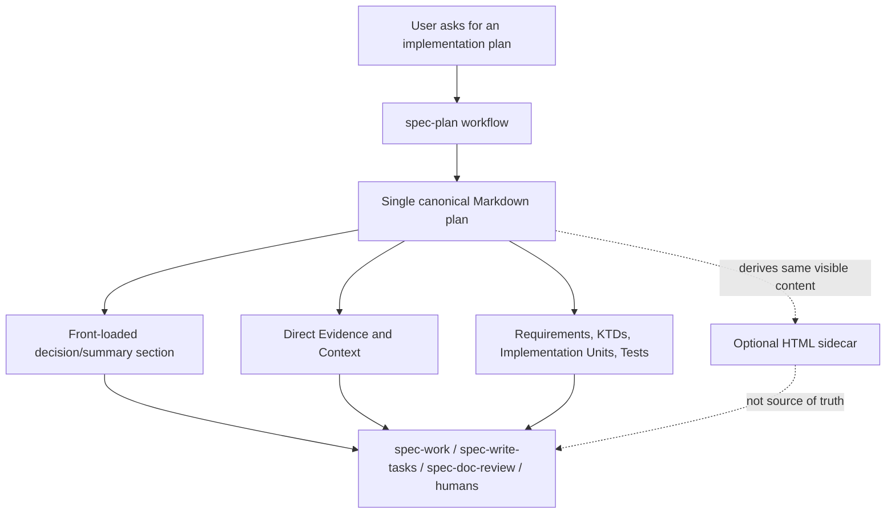

# refactor: Add a front-loaded decision brief to spec-plan output

> **Scope recalibration (2026-06-12, second pass):** This plan is now **Track A only** — a front-loaded human-readable decision section inside the single canonical Markdown plan. The former Track B (multi-surface/module coverage lens, 17-module model, 9-surface matrix, ablation evidence gate, new-agent gating) has been **split out** into `docs/plans/2026-06-12-005-refactor-spec-plan-surface-coverage-lens-plan.md` and deferred. Two reasons drove the split: (1) Track B grew Standard/Deep plan length, working *against* this plan's headline R1 (a shorter human first pass); (2) industry research (see Context & Research) showed Track B's heavy ablation gate is disproportionate to deciding a conditional checklist's value. Keeping them together inflated a small, shippable readability win into a contradictory two-track program.
>
> **Framing correction (the substantive change this pass):** Earlier drafts framed the work as separating a "human-facing layer" from an "agent-facing reuse layer" — a reader-tiered split inside one document. Verified industry research (spec-kit, Cline, Kiro, ADR) found the mainstream converges on a **single canonical human-readable Markdown plan that AI agents parse directly**, with no precedent for an in-document "human tier vs machine tier" split (a claim that such a split exists in spec-kit was specifically refuted in review). The corrected framing: this plan adds a **front-loaded summary/decision section** within the one canonical document — ordering and emphasis, like spec-kit's `Summary` section or an ADR's lightweight readable decision record — **not** two reader-tiered content sets.
>
> **Prerequisite fact (read source to confirm):** `2026-06-11-004` (governance-header keep/extract/remove) is `completed` — `skills/spec-plan/SKILL.md:64` is now a `STOP. read references/governance-boundaries.md` pointer, and `tests/unit/spec-plan-contracts.test.js` already uses `combined = spine + governance reference` capability binding (see L197-231). This plan reuses that capability-binding test posture in U2.

## Summary

Add a front-loaded decision brief to `spec-plan` output so a human reviewer can grasp the recommended approach, key decisions, validation focus, and largest risks in the first screen, while keeping a single canonical Markdown plan as the durable artifact that `spec-work`, `spec-write-tasks`, and `spec-doc-review` parse directly.

---

## Problem Frame

The current `spec-plan` artifact is strong as an execution handoff: it carries stable IDs, Direct Evidence, implementation units, file references, test scenarios, downstream consumers, and handoff options. That density is useful, but it pushes evidence inventory to the top, so the first screen reads as optimized for downstream scanning rather than for a human's first-pass judgment. The user question that started this work: is the current plan output more suitable for AI to read than for people to read?

The right answer is **not** to split the artifact into a human document and an AI document, and not to tier content inside the document into a "human layer" and a "machine layer." Industry practice (see Context & Research) converges on a single canonical human-readable Markdown plan that agents parse directly. The improvement is therefore one of **placement and emphasis**: front-load a short decision/readability section (recommended approach, key decisions, validation focus, largest risks, scope boundaries) before the dense evidence and implementation detail, within the same canonical Markdown. Optional HTML can remain a presentation sidecar, never a second source of truth.

---

## Requirements

- R1. Generated software plans must be easier for humans to scan quickly: the first major content area should state the goal, recommended approach, key decisions, validation focus, and largest risks without forcing the reader through evidence inventory first.
- R2. Canonical Markdown remains the single source of truth for plans; no HTML-only plan, hidden metadata layer, or sidecar-only summary may become load-bearing.
- R3. Stable IDs, YAML metadata, repo-relative paths, Direct Evidence, requirements, implementation units, test scenarios, and source references must remain visible and usable by downstream workflows.
- R4. `spec-work`, `spec-write-tasks`, and `spec-doc-review` compatibility must be preserved or updated with focused contract tests when section names or ordering change.
- R5. The change must clarify what the front-loaded summary section covers versus the detailed sections below it — as ordering and emphasis within one canonical document, **not** as two reader-tiered content sets — and without creating duplicate durable truth.
- R6. The implementation must update source assets only, then refresh runtime mirrors with `spec-first init` only if the implementation scope explicitly includes runtime regeneration.
- R7. Implementation must update `CHANGELOG.md` because this is a user-visible workflow output change.
- R8. Skill prose changes must receive focused source validation and, when possible, fresh-source eval; if dispatch/runtime cannot support that eval, the implementation closeout must say so.

---

## Scope Boundaries

- Do not replace canonical Markdown with HTML, rendered cards, or a generated sidecar as the primary artifact.
- Do not tier plan content into a "human-readable layer" and a separate "machine-readable detail layer" — the decision brief is a front-loaded section in one canonical document, not a second content set (no industry precedent; the claim that spec-kit does this was refuted in review).
- Do not add a separate `*.human.md` plan companion or any second durable plan artifact.
- Do not add a new schema or machine-readable contract unless implementation discovers a concrete downstream consumer need that cannot be satisfied by visible Markdown.
- Do not generate task packs during this planning work.
- Do not hand-edit `.claude/`, `.codex/`, or `.agents/skills/`; they are generated runtime mirrors.
- Do not redesign the whole `spec-plan` product positioning or turn it into a generic document system.
- Do not remove Direct Evidence or implementation-unit detail; make it better placed and easier to navigate.

### Deferred to Follow-Up Work

- **Multi-surface / module coverage lens (former Track B):** moved to `docs/plans/2026-06-12-005-refactor-spec-plan-surface-coverage-lens-plan.md`. Deferred until Track A ships and produces real Standard/Deep plan samples to judge whether existing primitives miss surfaces.
- A richer HTML/Proof presentation layer can be explored after Markdown-first readability is improved and downstream parity tests exist.
- Plan-quality eval fixtures for human readability can become a later optimization track if this first prose/template pass is not enough.

---

## Direct Evidence Readiness

- target_repo: `spec-first`
- evidence_sources: direct source reads, `rg`, git status, existing contract tests, prior `2026-06-11-004` validation docs, verified industry research report (deep-research run `wf_d7587d4a-88f`)
- source_refs: `docs/10-prompt/结构化项目角色契约.md`, `skills/spec-plan/SKILL.md`, `skills/spec-plan/references/plan-sections.md`, `skills/spec-plan/references/plan-template.md`, `skills/spec-plan/references/markdown-rendering.md`, `skills/spec-plan/references/html-rendering.md`, `skills/spec-plan/references/synthesis-summary.md`, `tests/unit/spec-plan-contracts.test.js`, `docs/contracts/artifact-summary.md`, `docs/contracts/source-runtime-customization-boundary.md`, `docs/solutions/workflow-issues/database-routing-and-dual-view-refresh-boundaries-2026-04-20.md`, `docs/solutions/architecture-patterns/rebar-structure-skill-simplification-pattern-2026-06-04.md`
- external_refs: `https://github.com/github/spec-kit/blob/main/templates/plan-template.md`, `https://github.github.io/spec-kit/`, `https://docs.cline.bot/features/plan-and-act`, `https://github.com/kirodotdev/Kiro/blob/main/README.md`, `https://adr.github.io/`, `https://docs.anthropic.com/en/docs/claude-code/sub-agents`
- current_revision: `387abe4a`
- worktree_status: dirty before this plan; unrelated modified/deleted/untracked files were present and must not be reverted
- confidence: high for source/runtime boundary, downstream contract shape, and the single-canonical-document framing (industry-verified); medium for the exact heading name of the decision brief until implementation validates wording against generated examples
- limitations: industry "single canonical document" convergence is supported by spec-kit / Cline / Kiro / ADR primary sources; Copilot custom agents, Cursor, Aider, Windsurf, and Devin plan-output shapes were not directly verified (WebFetch failed on some), so the convergence is a strong signal, not a full survey. `skills/spec-plan/SKILL.md` differs from its runtime mirror in projection-path wording, so implementation must treat `skills/spec-plan/**` as source truth and refresh mirrors with `spec-first init`.

---

## Direct Evidence

- repo_scope: current repo `spec-first`
- source_reads_completed:
  - `docs/10-prompt/结构化项目角色契约.md` confirms light contracts, explicit boundaries, source/runtime separation, and 80/20 evolution rules.
  - `skills/spec-plan/SKILL.md` confirms `spec-plan` writes durable plans, preserves downstream consumers, includes Direct Evidence, and loads `plan-sections.md`, `markdown-rendering.md`, and `plan-template.md` before writing.
  - `skills/spec-plan/references/plan-sections.md` confirms three audiences (implementer, reviewer, future reader) and that Markdown remains the canonical plan artifact; `## Summary` is a hard-floor 1-3 line section.
  - `skills/spec-plan/references/plan-template.md` confirms the current section skeleton and the `### U1. [Name]` implementation-unit heading contract.
  - `skills/spec-plan/references/markdown-rendering.md` confirms visible Markdown, YAML frontmatter, plain stable IDs, raw-diff usefulness, and no HTML/hidden metadata.
  - `tests/unit/spec-plan-contracts.test.js` confirms contract tests pin plan template naming, Markdown/HTML sidecar boundaries, runtime projection references, downstream wording, and (post-004) a `combined = spine + governance reference` capability-binding posture (L197-231).
  - `docs/contracts/source-runtime-customization-boundary.md` confirms source assets own behavior and generated mirrors must not be hand-edited.
  - `docs/contracts/artifact-summary.md` confirms summary-first handoff must not become a second complete report or source-of-truth replacement.
- source_reads_required:
  - `skills/spec-plan/SKILL.md` and `skills/spec-plan/references/*` source copies during implementation, not generated runtime mirrors.
  - `skills/spec-work/SKILL.md`, `skills/spec-write-tasks/SKILL.md`, and `skills/spec-doc-review/SKILL.md` only if the new section name/order changes their consumption assumptions.
  - `tests/unit/spec-work-contracts.test.js`, `tests/unit/spec-write-tasks-contracts.test.js`, and `tests/unit/spec-doc-review-contracts.test.js` only when those consumer assets are touched.
- commands_or_tools_used:
  - `rg` searches found existing contracts and tests around `Summary`, canonical Markdown, and optional HTML sidecar.
  - Deep-research run `wf_d7587d4a-88f` (16 primary sources, 25 claims adversarially verified) confirmed the industry framing facts in Context & Research.
- impact_on_plan: choose a single-canonical-Markdown front-loaded decision section; avoid HTML as primary mechanism; avoid reader-tiering; preserve visible details for downstream agents; protect with focused contract tests rather than a broad rewrite.
- key_findings:
  - The current `spec-plan` quality bar already treats humans as an audience, but the template does not make the human decision pass a first-class, front-loaded section.
  - Existing `## Summary` is intentionally 1-3 lines — useful, but too small to carry decisions, validation, risk, and approach for deep plans. A neighboring decision brief is the right addition.
  - Industry mainstream uses a single canonical human-readable Markdown plan that agents parse directly; in-document reader-tiering has no precedent (and a spec-kit "layered detail" claim was refuted). This directly grounds the framing correction.
  - ADR practice validates a lightweight, human-readable decision record as a recognized pattern, supporting the value of a front-loaded decision section (though ADR is a standalone doc, not an in-plan section).
- limitations: no successful read-only research-agent reports in the original pass; this plan uses direct source evidence, prior institutional docs, and the verified deep-research report.

---

## Context & Research

### Relevant Code and Patterns

- `skills/spec-plan/references/plan-sections.md` owns section purpose and audience value — the right place to define the front-loaded decision section.
- `skills/spec-plan/references/plan-template.md` is the concrete Markdown skeleton that needs the new section placement (immediately after `## Summary`).
- `skills/spec-plan/references/markdown-rendering.md` is the rendering boundary that keeps the new section visible, plain Markdown, and raw-diff friendly.
- `skills/spec-plan/references/html-rendering.md` may need only a boundary clarification if the optional-sidecar wording becomes ambiguous after the new section lands.
- `skills/spec-plan/SKILL.md` is the workflow spine; it should gain a short check, not an embedded readability rubric.
- `skills/spec-plan/references/synthesis-summary.md` is the plan-write composition contract: its "Doc Shape After Confirmation" routing table maps synthesis content to `## Summary` / `## Key Technical Decisions` / `## Scope Boundaries` and forbids a parallel synthesis section. The Decision Brief must be reconciled with it (U3) so the brief is a front-loaded summary, not a second decision-routing destination.
- `tests/unit/spec-plan-contracts.test.js` already tests `Summary`, `Requirements`, the Markdown source artifact, the optional HTML sidecar, and runtime projection references; it is the primary test target, and its post-004 capability-binding style is the pattern U2 follows.

### Institutional Learnings

- `docs/solutions/workflow-issues/database-routing-and-dual-view-refresh-boundaries-2026-04-20.md`: distinct purposes (quick human handoff vs high-density agent reuse) can coexist in one durable file. Relevant pattern is the separation of *emphasis*, not a second artifact or reader-tier.
- `docs/solutions/workflow-issues/modify-source-not-artifacts-2026-04-13.md`: edit source assets, not generated artifacts.
- `docs/solutions/architecture-patterns/rebar-structure-skill-simplification-pattern-2026-06-04.md`: keep `SKILL.md` as the workflow spine, not an encyclopedia.

### External References (industry research, deep-research run `wf_d7587d4a-88f`, adversarially verified)

- **Single canonical human-readable Markdown plan, parsed directly by agents — no human/AI split** (high confidence, unanimous/2-0 votes): Cline's plan artifact is a single `implementation_plan.md`; spec-kit's `plan-template.md` is a single human-readable Markdown where `Summary` is one section, not a separate human-only layer. The competing claim that spec-kit forces a "readable decision layer + machine detail layer" split was **refuted** (1-2). → Grounds R2, R5, and the framing correction.
- **Plan overhead should match task size** (high, unanimous): Cline routes small tasks straight to Act ("Planning adds overhead when the solution is obvious"). → Grounds R1's omission rules for lightweight plans.
- **ADR = lightweight, human-readable decision record** (high, unanimous): captures a single decision with rationale/trade-offs/consequences, "short text file", Markdown. → Supports the value of a front-loaded decision section (ADR is a standalone doc, so it is supporting, not a direct in-plan precedent).
- Conditional surface-coverage precedent (spec-kit `[REMOVE IF UNUSED]` options) and the Anthropic custom-subagent threshold are recorded in the deferred Track B plan, where they are load-bearing.

---

## High-Level Technical Design

> *This illustrates the intended approach and is directional guidance for review, not implementation specification. The implementing agent should treat it as context, not code to reproduce.*

---

## Key Technical Decisions

- KTD1. Add a front-loaded decision section inside canonical Markdown, not outside it and not as a reader-tier.
  - `question`: Where should human readability be improved?
  - `recommended_answer`: Add a first-class section (e.g., `## Decision Brief` or a strengthened two-level top-of-document area) before dense evidence and implementation detail, within the one canonical Markdown plan.
  - `source_tag`: confirmed for Markdown boundary and single-canonical-document framing (industry-verified); advisory for exact section name.
  - `chosen_answer`: Plan for a canonical Markdown section; implementation chooses the exact title after checking downstream wording and generated examples.
  - `consequence`: Faster human orientation without breaking downstream Markdown consumers or introducing a second content set.
- KTD2. Preserve `## Summary` as the short plan proposition; do not overload it.
  - `question`: Should `Summary` become the whole human-readable layer?
  - `recommended_answer`: Keep `Summary` at 1-3 lines; add a neighboring decision brief for Standard/Deep plans.
  - `source_tag`: confirmed by `plan-template.md`, `synthesis-summary.md`, and spec-kit's single-`Summary`-section pattern.
  - `consequence`: Existing consumers and older plan semantics stay stable.
- KTD3. Treat HTML as optional rendering only.
  - `question`: Should human readability be solved by an HTML companion?
  - `recommended_answer`: No. Improve Markdown first; HTML may render the same content later.
  - `source_tag`: confirmed by `plan-sections.md`, `markdown-rendering.md`, `html-rendering.md`, and industry single-canonical-doc convergence.
  - `consequence`: Avoids a second durable truth and downstream drift.
- KTD4. Pin semantics with focused, capability-binding contract tests rather than brittle phrase-as-contract or broad snapshot tests.
  - `question`: How should this output-shape change be protected?
  - `recommended_answer`: Bind the *capability* (the decision-brief readability section is offered and described, and stays omittable for lightweight plans) using the post-004 `combined`-style assertion; keep genuine generated-artifact invariants (heading order, `### U1.` format, lint REQUIRED_SECTIONS, runtime projection paths) as exact matches.
  - `source_tag`: confirmed by existing `tests/unit/spec-plan-contracts.test.js` post-004 style.
  - `consequence`: Tests protect load-bearing behavior without freezing conditional prose or re-introducing brittle heading binding.

---

## Open Questions

### Resolved During Planning

- Should the plan recommend a separate human-only artifact, or tier content by reader inside the doc? No to both. Industry converges on one canonical human-readable Markdown plan that agents parse directly; in-document reader-tiering has no precedent and was refuted in research.
- Should implementation hand-edit `.agents/skills/spec-plan` because the current session reads it? No. Edit `skills/spec-plan/**` source and refresh runtime via `spec-first init` when needed.
- Should the surface-coverage lens ship with this plan? No. It worked against R1 and its evidence gate was disproportionate; it is split to `2026-06-12-005` and deferred.

### Deferred to Implementation

- Exact heading name for the decision section: choose between `Decision Brief`, `At a Glance`, or a strengthened `Summary` substructure after checking generated examples and consumer tests.
- Whether `spec-doc-review`, `spec-write-tasks`, or `spec-work` need prose updates: decide after inspecting their current plan-consumption assumptions against the final heading/ordering.
- Whether optional `html-rendering.md` needs any change: only update it if current wording becomes ambiguous after the new section is added.

---

## Implementation Units

Execution order follows the `Dependencies` fields, not numeric U-ID order. U-IDs U1–U6 are preserved from the prior draft for review traceability; U7/U8 moved to `2026-06-12-005`.

Order: U1 → U2 → U3 → {U4, U5} → U6.

### U1. Define the canonical front-loaded decision section

**Goal:** Make the human scan section an explicit part of plan content, including its audience, placement, and omission rules — as a front-loaded section in one canonical Markdown plan, not a reader-tier.

**Requirements:** R1, R2, R3, R5

**Dependencies:** None

**Files:**
- Modify: `skills/spec-plan/references/plan-sections.md`
- Test: `tests/unit/spec-plan-contracts.test.js`

**Approach:**
- Add a section concept describing what the first human pass must contain: recommended approach, key decisions, validation focus, largest risks, and scope boundaries.
- State explicitly that this section is part of the single canonical Markdown artifact, summarizes lower sections, and must not duplicate or contradict them — and that it is **not** a reader-tiered "human layer" distinct from an "agent layer".
- Define the boundary against neighboring sections explicitly: the brief is a front-loaded *summary* of decisions/risks/validation that already live in `## Summary` (the 1-3 line proposition), `## Problem Frame` (why), `## Key Technical Decisions` (the decisions themselves), and `## Risks & Dependencies`. It points at them; it does not restate or replace them. This keeps it consistent with `synthesis-summary.md`'s rule that the plan gets no parallel summary/synthesis section (see U3).
- Keep the three-audience framing (implementer, reviewer, future reader). The new section primarily serves reviewer and future reader; lower sections keep serving implementers and downstream agents — same content set, different emphasis and order.
- Define omission rules so lightweight plans can remain compact when a short `## Summary` is enough.

**Patterns to follow:**
- `skills/spec-plan/references/plan-sections.md` hard-floor and "Include When Material" structure.
- spec-kit's single-`Summary`-section / ADR's lightweight readable-decision pattern (framing, not literal copy).

**Test scenarios:**
- Happy path: `plan-sections.md` describes the front-loaded decision section and states that canonical Markdown remains the single source artifact.
- Edge case: prose makes clear lightweight plans may omit or compress the section.
- Error path: tests fail if wording implies a sidecar, hidden metadata, HTML output, OR a reader-tiered "human vs machine" content split can replace or sit beside canonical Markdown.
- Error path: tests fail if `plan-sections.md` describes the brief as duplicating or replacing `## Summary`, `## Key Technical Decisions`, or `## Risks` content rather than summarizing and pointing to it.

**Verification:**
- A reader can identify what the section is for, where it belongs, that it is one canonical document, and what it must not become.

---

### U2. Update the Markdown plan skeleton and rendering rules

**Goal:** Make new `spec-plan` outputs render the decision section in the right place without breaking Markdown invariants.

**Requirements:** R1, R2, R3, R4

**Dependencies:** U1

**Files:**
- Modify: `skills/spec-plan/references/plan-template.md`
- Modify: `skills/spec-plan/references/markdown-rendering.md`
- Test: `tests/unit/spec-plan-contracts.test.js`

**Approach:**
- Add the new section immediately after `## Summary` as a clearly bounded top-of-document area.
- Keep Direct Evidence before `Context & Research`, but avoid making evidence inventory dominate the first human pass.
- Ensure the new section uses visible plain Markdown — no HTML, no hidden metadata, no generated layout syntax.
- Preserve the `### U1. [Name]` implementation-unit format and existing required metadata.
- Choose the final heading name, then **bind the capability, not a literal always-present heading** (per 004's two-class rule). The decision section is conditional/omittable for lightweight plans, so a hard `expect(...).toContain('## <chosen-name>')` would wrongly freeze conditional content and re-introduce the brittle phrase-binding 004 removed. Instead:
  - **Rebind to capability:** assert that `plan-sections.md` describes the decision section and that `plan-template.md` offers it, while allowing lightweight plans to omit it. Mirror the post-004 `combined`-style binding (capability satisfied if its semantic constraint is present in spine or a reachable reference).
  - **Keep non-rebindable contract assertions exact:** heading-order invariants, the `### U1.` format, lint REQUIRED_SECTIONS, and runtime projection paths stay phrase-as-contract — generated-artifact structure, not advisory prose.
  - Generate at least one representative plan with the chosen heading, confirm it survives a raw-text diff and reads well at the top, then record the chosen name in closeout evidence. This sample also seeds the deferred Track B baseline.

**Patterns to follow:**
- `skills/spec-plan/references/markdown-rendering.md` hard invariants.
- Existing top-level horizontal-rule convention for Standard and Deep plans.

**Test scenarios:**
- Happy path: the decision-section capability is described in `plan-sections.md` and offered by `plan-template.md`, and the template still includes `## Summary`, `## Requirements`, `## Assumptions`, `## Scope Boundaries`, `## Completion Criteria`, `## Direct Evidence Readiness`, `## Direct Evidence`, and `## Implementation Units` (these stay exact phrase-as-contract assertions).
- Edge case: a lightweight plan that compresses or omits the decision section still passes the capability binding — the assertion checks the section is *offered and described*, not literally present in every plan.
- Edge case: the new section does not introduce bolded stable-ID prefixes or hidden machine metadata.
- Error path: tests fail if the template includes HTML container tags, inline styles, or HTML-only layout guidance.
- Error path: tests fail if a non-rebindable contract assertion (heading order, `### U1.` format, projection path) is loosened into a soft capability check.

**Verification:**
- A newly generated Standard/Deep plan reads top-down for a human without losing any downstream contract field.

---

### U3. Teach `spec-plan` when and how to write the section

**Goal:** Update the workflow spine so planning runs deliberately produce the front-loaded decision section instead of treating it as a template-only concern.

**Requirements:** R1, R3, R5, R8

**Dependencies:** U1, U2

**Files:**
- Modify: `skills/spec-plan/SKILL.md`
- Modify: `skills/spec-plan/references/synthesis-summary.md`
- Test: `tests/unit/spec-plan-contracts.test.js`

**Approach:**
- Update Phase 4/5 guidance so plan writing and review check for the decision section on Standard and Deep plans.
- Keep `SKILL.md` as the workflow spine: link the section contract in references instead of embedding a long readability rubric.
- **Reconcile with `synthesis-summary.md`.** Its "Doc Shape After Confirmation" routing table maps the stage-2 summary → `## Summary` and routes decisions/scope to `## Key Technical Decisions` / `## Scope Boundaries`, and it forbids a parallel `## Synthesis` section. Update it so the Decision Brief is recognized as a front-loaded *summary* section, not a second place synthesis content is dumped: state where the brief sits relative to `## Summary`, that `## Summary` stays the 1-3 line proposition, that synthesis content still routes to its existing destinations, and that the brief summarizes/points to those destinations rather than duplicating them. Do not weaken the no-parallel-synthesis-section rule.
- Add a final-review check that the first human pass answers "what are we doing, why this approach, what validates it, and what could go wrong?"
- Keep Direct Evidence mandatory; this changes scan order and narrative shape, not evidence honesty.

**Patterns to follow:**
- `skills/spec-plan/SKILL.md` Phase 4.2 reference-loading pattern.
- `docs/solutions/architecture-patterns/rebar-structure-skill-simplification-pattern-2026-06-04.md` (avoid turning `SKILL.md` into an encyclopedia).

**Test scenarios:**
- Happy path: `SKILL.md` instructs writers to include/check the section for Standard and Deep plans.
- Happy path: `synthesis-summary.md` references the Decision Brief, keeps `## Summary` as the 1-3 line proposition, and preserves the no-parallel-synthesis-section rule (brief summarizes/points to routed sections, does not duplicate them).
- Edge case: `SKILL.md` keeps lightweight omission/compression possible.
- Error path: tests fail if `SKILL.md` suggests replacing Direct Evidence, implementation units, or Markdown consumers, or implies a reader-tiered split.
- Error path: tests fail if `synthesis-summary.md` routes synthesis decision/scope content into the brief instead of its existing `## Summary` / `## Key Technical Decisions` / `## Scope Boundaries` destinations.

**Verification:**
- The source workflow tells future agents to write the section, not merely to keep a template field.

---

### U4. Preserve downstream consumer compatibility

**Goal:** Ensure `spec-work`, `spec-write-tasks`, and `spec-doc-review` continue to consume plans safely after the new front-loaded decision section is added.

**Requirements:** R3, R4, R8

**Dependencies:** U2, U3

**Files:**
- Inspect: `skills/spec-work/SKILL.md`
- Inspect: `skills/spec-write-tasks/SKILL.md`
- Inspect: `skills/spec-doc-review/SKILL.md`
- Modify if needed: the three skills above
- Test if modified: `tests/unit/spec-work-contracts.test.js`, `tests/unit/spec-write-tasks-contracts.test.js`, `tests/unit/spec-doc-review-contracts.test.js`

**Approach:**
- Search consumers for assumptions about exact section order or heading names.
- If consumers already work from stable IDs and implementation-unit sections, leave them untouched.
- If consumers reference top-of-plan structure, update wording minimally so the new section is recognized as context, not a new task source.
- Keep task compilation based on written plan structure and U-IDs, not the decision brief.

**Patterns to follow:**
- Existing downstream contract wording that treats plans as decision artifacts and derives progress from git/work evidence.
- `docs/contracts/governance/task-governance-signals.md` distinction between advisory helper output and written source-plan structure.

**Test scenarios:**
- Happy path: `spec-write-tasks` still treats implementation units, dependencies, and plan depth as primary task-pack evidence.
- Happy path: `spec-work` still starts from goals, non-goals, U-IDs, files, and verification expectations.
- Happy path: `spec-doc-review` can review the new section for clarity without making it a second contract.
- Error path: tests fail if a consumer treats the decision brief as a replacement for requirements or U-IDs.

**Verification:**
- Focused contract tests pass for every consumer file that changes; if no consumer files change, source inspection is documented in closeout.

---

### U5. Clarify optional HTML sidecar boundaries only if needed

**Goal:** Keep presentation improvements from turning into a second source of truth.

**Requirements:** R2, R3, R5

**Dependencies:** U1, U2

**Files:**
- Inspect: `skills/spec-plan/references/html-rendering.md`
- Modify if needed: `skills/spec-plan/references/html-rendering.md`
- Test: `tests/unit/spec-plan-contracts.test.js`

**Approach:**
- Read current HTML sidecar wording after U1/U2 changes.
- Update only if the new section creates ambiguity about whether HTML may add, omit, or rewrite load-bearing content.
- Keep the existing principle: Markdown is written first; HTML may render the same content.

**Patterns to follow:**
- `skills/spec-plan/references/html-rendering.md` current optional-sidecar stance.
- `skills/spec-plan/references/markdown-rendering.md` hard invariants.

**Test scenarios:**
- Happy path: tests confirm HTML remains optional and derived from Markdown.
- Error path: tests fail if HTML wording suggests an exclusive output mode, second source, or content divergence.

**Verification:**
- HTML sidecar text is either unchanged with an explicit inspection note, or changed with focused tests.
- If inspection finds `html-rendering.md` wording still unambiguous after U1/U2, close U5 with an inspection note citing the unchanged content. The existing `expect(htmlRendering).toContain('optional HTML sidecar')` assertion already satisfies the happy path; do not add a duplicate assertion. Add a new assertion only if wording changes.

---

### U6. Update changelog, validate, and refresh runtime deliberately

**Goal:** Close out with traceable user-visible documentation, focused validation, and honest runtime handling.

**Requirements:** R6, R7, R8

**Dependencies:** U1, U2, U3, U4, U5

**Files:**
- Modify: `CHANGELOG.md`
- Test: `tests/unit/spec-plan-contracts.test.js`
- Test if touched: `tests/unit/spec-work-contracts.test.js`, `tests/unit/spec-write-tasks-contracts.test.js`, `tests/unit/spec-doc-review-contracts.test.js`

**Approach:**
- Add a `CHANGELOG.md` entry marked `(user-visible)` using the configured developer author.
- Run the narrowest tests first, then expand only if consumer files changed.
- Run `npm run lint:skill-entrypoints` because workflow prose and references changed.
- Run `spec-first init` only if the implementation includes runtime regeneration; never patch runtime mirrors directly.
- Perform fresh-source eval for skill prose if host dispatch is available. If dispatch fails or is unavailable, state the reason and avoid claiming eval success.

**Patterns to follow:**
- `docs/contracts/source-runtime-customization-boundary.md` source-first/runtime-generated boundary.
- Existing `tests/unit/spec-plan-contracts.test.js` projection tests.

**Test scenarios:**
- Happy path: focused spec-plan contract tests pass.
- Integration path: consumer tests pass when consumer prose changes.
- Error path: closeout catches any runtime/source drift claim that was not actually checked.

**Verification:**
- Closeout lists commands run, whether `spec-first init` was run, whether fresh-source eval ran, and any residual limitations.

---

## System-Wide Impact

- **Interaction graph:** `spec-plan` source references shape generated plan artifacts; downstream workflows read those artifacts. The new section must improve human judgment without changing task identity semantics.
- **Error propagation:** If the section becomes inconsistent with requirements or implementation units, humans may trust the brief over the detailed contract. Mitigated by making it canonical, summarizing, and non-duplicative.
- **State lifecycle risks:** No workflow state added. Plans remain decision artifacts; progress remains derived from git and `spec-work` evidence.
- **API surface parity:** Claude and Codex runtime projections both receive the updated source through normal generation. The source change must remain host-neutral.
- **Integration coverage:** Unit/prose contract tests cover runtime projection where existing tests already do; fresh-source eval covers actual generated plan behavior if available.
- **Unchanged invariants:** Stable IDs, YAML metadata, repo-relative paths, visible Markdown, Direct Evidence, implementation units, and optional HTML sidecar boundaries remain unchanged.

---

## Risks & Dependencies

| Risk | Likelihood | Impact | Mitigation |
|------|------------|--------|------------|
| New section adds length instead of readability | Medium | Medium | Keep it short, front-loaded, and omission-friendly for lightweight plans. |
| Downstream consumers assume old section order | Low | Medium | Inspect consumer skills; update focused contract tests only where assumptions exist. |
| Decision brief duplicates or contradicts details | Medium | High | Define it as a summary of lower sections, not a parallel truth or a separate content set. |
| HTML sidecar becomes tempting as the "human version" | Medium | High | Reaffirm Markdown-first and sidecar-derived-only rules. |
| `SKILL.md` grows into a readability encyclopedia | Medium | Medium | Put the content contract in `plan-sections.md`; keep `SKILL.md` to checks and references. |
| Capability binding loosens a genuine generated-artifact invariant | Low | High | Keep heading order, `### U1.` format, lint REQUIRED_SECTIONS, and projection paths as exact assertions (U2 error path). |
| Fresh-source eval is unavailable again | Medium | Low | Record not-run reason; rely on direct source reads and contract tests rather than claiming behavior proof. |

---

## Alternative Approaches Considered

- Keep current output and tell readers to use `Summary`: rejected — `Summary` is intentionally 1-3 lines and cannot carry decisions/risks/validation for Deep plans.
- Add a separate `*.human.md` plan companion: rejected — two durable artifacts with drift risk; contradicts industry single-canonical-doc convergence.
- Tier content inside the plan into a "human-readable layer" and a "machine-readable detail layer": rejected — no industry precedent (the spec-kit "layered detail" claim was refuted in research), and it risks two divergent content sets.
- Make HTML the primary human-readable output: rejected — contracts make Markdown canonical and downstream workflows consume Markdown.
- Add hidden machine metadata so Markdown can be prettified for humans: rejected — `markdown-rendering.md` requires visible stable IDs and raw-diff usefulness.
- Rewrite the entire plan template around human readability: rejected as too broad; the useful move is a small first-screen section plus preserved details.
- Ship the multi-surface coverage lens together with this readability change: rejected/split — it grew Standard/Deep length against R1 and carried a disproportionate evidence gate; moved to `2026-06-12-005` and deferred.

---

## Success Metrics

- A human reviewer can read the top of a newly generated Standard/Deep plan and identify the recommended approach, key decisions, validation focus, and biggest risks without first scanning every implementation unit.
- `spec-work`, `spec-write-tasks`, and `spec-doc-review` still consume existing fields and U-IDs without special-casing a second artifact or a reader-tier.
- Focused contract tests fail if canonical Markdown is replaced, HTML becomes load-bearing, the decision section disappears from the template/guidance, OR content is tiered by reader — while the section stays omittable for lightweight plans (capability binding, not literal-heading binding).
- Implementation closeout honestly reports validation and runtime refresh status.

---

## Documentation / Operational Notes

- User-visible behavior changes require a `CHANGELOG.md` entry during implementation.
- README updates are probably not required unless the implementation changes public workflow instructions beyond plan artifact shape.
- Existing docs about artifact summaries and dual-view knowledge remain advisory references; do not add another durable plan contract unless tests show a real gap.
- If runtime mirrors are refreshed, closeout must mention that `spec-first init` was used and whether generated assets changed.

---

## Sources & References

- Project role contract: `docs/10-prompt/结构化项目角色契约.md`
- Plan workflow: `skills/spec-plan/SKILL.md`
- Plan sections contract: `skills/spec-plan/references/plan-sections.md`
- Markdown rendering contract: `skills/spec-plan/references/markdown-rendering.md`
- Plan template: `skills/spec-plan/references/plan-template.md`
- Optional HTML sidecar: `skills/spec-plan/references/html-rendering.md`
- Plan contract tests: `tests/unit/spec-plan-contracts.test.js`
- Artifact summary contract: `docs/contracts/artifact-summary.md`
- Source/runtime boundary: `docs/contracts/source-runtime-customization-boundary.md`
- Dual-view learning: `docs/solutions/workflow-issues/database-routing-and-dual-view-refresh-boundaries-2026-04-20.md`
- Rebar simplification pattern: `docs/solutions/architecture-patterns/rebar-structure-skill-simplification-pattern-2026-06-04.md`
- Prerequisite (governance-header slimming): `docs/plans/2026-06-11-004-refactor-spec-plan-skill-slimming-plan.md`
- Deferred follow-up (surface-coverage lens): `docs/plans/2026-06-12-005-refactor-spec-plan-surface-coverage-lens-plan.md`
- Industry research (single canonical doc; conditional coverage; agent threshold): spec-kit `https://github.com/github/spec-kit/blob/main/templates/plan-template.md`, `https://github.github.io/spec-kit/`; Cline `https://docs.cline.bot/features/plan-and-act`; Kiro `https://github.com/kirodotdev/Kiro/blob/main/README.md`; ADR `https://adr.github.io/`; Claude Code subagents `https://docs.anthropic.com/en/docs/claude-code/sub-agents`

---

## Deferred / Open Questions

### From 2026-06-11 review — RESOLVED by the 2026-06-12 second pass

- **Surface-coverage lens lacks the evidence gate the plan imposes on agents** (P1, product-lens): resolved by removing the lens from this plan entirely. It is split to `docs/plans/2026-06-12-005-refactor-spec-plan-surface-coverage-lens-plan.md` and deferred until Track A produces real plan samples. The new plan replaces the heavy ablation gate with a cheaper "try the conditional lens on real multi-surface plans" check, per industry evidence (spec-kit's conditional `[REMOVE IF UNUSED]` pattern is the validated approach; controlled ablation is not how industry decides a checklist's value).
