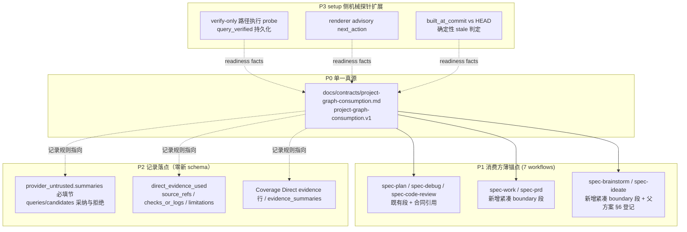

# feat: Project-Graph Consumption Protocol 统一消费协议与覆盖补齐

## Summary

新增共享合同 `docs/contracts/project-graph-consumption.md`（`project-graph-consumption.v1`），把分散在 CodeGraph 技术方案、Runtime-Setup 目标与三个 workflow SKILL 内嵌段落中的 project-graph 消费规则收编为单一真源：消费梯度、candidate-only、两档信任（探索可信/结论回源）、never cat graph.json、可用性 gate 锚定 `provider_readiness[]` facts、fallback 触发枚举、never-block、使用记录落点。随后把 capability-class evidence boundary 从 `spec-plan`/`spec-debug`/`spec-code-review` 扩展到 `spec-work`/`spec-prd`/`spec-brainstorm`/`spec-ideate`（薄锚点引用合同，不复制长段），使用记录全部复用既有 `provider_untrusted` + `direct_evidence_used` 字段（零新 schema），并对已存在的 Graphify 只读 query probe 做三点扩展（verify-only 路径执行、advisory next_action 渲染、built_at_commit 确定性陈旧事实）。全程不把 Graphify 输出抬升为 confirmed evidence，不恢复 GitNexus 式 provider 耦合。

---

## Problem Frame

分析文档 `docs/12-bug分析/2026-06-10-spec-first-graphify-collaboration-analysis.md` 的结论是三层分工模型：源码/tests/logs/docs 是 confirmed truth；CodeGraph/rg/ast-grep 做 tactical locating；Graphify 做 strategic project map，只提供 advisory candidates；spec-first 做 workflow harness 与证据纪律。当前的系统性缺口不是「Graphify 能不能用」，而是「消费口径不统一」：

1. 只有 3 个 workflow 有 capability-class evidence boundary，其余入口（work/prd/brainstorm/ideate）对 project-graph 消费没有同等协议，行为不稳定。
2. 消费规则散落在 `docs/01-需求分析/13.scale-integration/CodeGraph技术方案.md` §4.2.1/§8.1、`Runtime-Setup目标.md` §7/§8 与三份 SKILL.md 内嵌段落中，没有独立可引用的合同，新增覆盖只能靠复制 prose——这正是 `docs/solutions/workflow-issues/workflow-host-instruction-reuse-policy-2026-05-25.md` 点名的退化模式。
3. Graphify 召回质量有实测盲区（运行时探针证实：四种代表性查询全部未召回已被索引的关键方案文档），「图谱存在」≠「图谱可用」，需要把 candidate-only 纪律和 setup 侧机械探针区分清楚。

本仓库曾因 GitNexus provider 耦合付出过解耦成本（routing/reminder/schema/CI gate 全部绑定具体 provider）。本计划是对该教训的结构性回应：合同只使用 capability-class 词表，具名工具命令不进入 workflow prose。

---

## Requirements

- R1. 新增 `docs/contracts/project-graph-consumption.md`（`project-graph-consumption.v1`），按 docs/contracts 现行 house style（H1 + 版本化 identity 段 + "is X, not Y" + harness map 链接 + Goals/Non-Goals + 规则节 + Validation Expectations，无 YAML frontmatter）收编以下既有规则：意图级消费梯度（broad orientation query / relationship path / concept explain）、candidate-only、两档信任（探索性导航可直接使用、结论性消费必须 source/test/log/doc 回源确认）、不读全量图谱 artifact（never cat graph.json）、可用性 gate 锚定 `provider_readiness[]` facts 而非 artifact 存在性、readiness_status 消费映射（`stale` 允许探索档使用且须标注图谱落后事实，不得直接支撑结论档——结论档本须回源；`fresh` 两档均可用、结论档仍须回源）、fallback 触发条件枚举（provider 缺失、readiness facts 缺失或 `unknown`/`unverified`、调用失败、显式禁用、不安全）与降级路径（bounded direct reads/rg/ast-grep）、never-block、只读消费面声明（mutation 类 provider 操作不在本合同范围）、三层协作接力链（源自 origin §背景三层分工模型：project-graph 做 strategic orientation 定向「先看哪里」→ code-graph/rg/ast-grep 做 tactical locating 定位「具体在哪、连到谁」→ source/tests/logs/docs 做 confirmed truth 确认「到底是不是」；信任随层级递增，禁止跳层抬升——project-graph 候选不得未经下层确认直接进入结论档；code-graph 的回源义务限定于图派生关系事实（调用边、影响面、归属、affected-test 候选）进入结论档时——经 native 接口透传的 verbatim source 片段本身计为 bounded direct read，记录 file:line ref 即可，不要求二次读取；链约束的是证据信任的抬升方向，不规定调用顺序——任何 workflow 可直接从更低层（含直读 source）开始，跳过上层不构成违规，是否发起 project-graph 查询是 LLM 基于 readiness facts 与任务形态的判断；readiness_status 消费映射按 `provider_readiness[]` 中单个 provider entry 独立判定，不跨 provider 传染）。
- R2. 合同正文使用 provider-neutral 词表（`project-graph`/`code-graph` capability-class），具名命令（`graphify query` 等）只出现在降级为示例的附录小节；workflow SKILL prose 不得出现具名 provider 命令（受 `tests/unit/capability-aware-provider-contracts.test.js:32-33` 负向断言约束）。rg/ast-grep 属无状态基线工具而非 readiness-lifecycle provider，在合同与 SKILL prose 中具名不违反 provider-neutral 约束（负向断言仅禁具名 provider 字面量）；合同中以一句显式说明这一区分，避免「不点名 provider」被误读为禁名所有工具。
- R3. 合同必须显式声明：project-graph 是 advisory candidate provider，不构成确定性 TIA/覆盖率/依赖图 provider，不解锁「点名受影响测试/影响清单」作为 confirmed fact（对齐 `docs/solutions/architecture-patterns/ai-reviewer-capability-borrowing-gates-2026-06-09.md` 的证据确定性门）。
- R4. `spec-work`、`spec-prd`、`spec-brainstorm`、`spec-ideate` 各新增一个紧凑的 `## Capability-Class Evidence Boundary` 段：引用合同路径 + 1-3 句 workflow 专属边界动词，挂在各 skill 既有 evidence/boundary 轴上，不新建 reference 文件，不复制完整协议文本。
- R5. 既有三个 workflow（`spec-plan`/`spec-debug`/`spec-code-review`）的 boundary 段补充合同路径引用，使合同成为单一真源；既有 workflow 专属句保留，能力不回退。
- R6. `spec-brainstorm`/`spec-ideate` 纳入消费方之前，先在父方案 `docs/01-需求分析/13.scale-integration/spec-first内化集成scale-project-scaffold技术方案.md` §6 接入矩阵登记（含一句 80/20 边际增益论证）；新合同同时在父方案 §1.x 命名表登记，遵守「唯一登记处」规则。
- R7. 使用记录统一落既有字段，零新 schema：advisory 侧（queries 运行、candidates 采纳/拒绝）落 `provider_untrusted.summaries[]`（spec-work-run-artifact 必填节）；验证侧落 `direct_evidence_used.source_refs/checks_or_logs/limitations`；review 侧落 Coverage 的 `Direct evidence:` 行；跨 workflow handoff 复用 `evidence_summaries[]`。不复活 `graph_evidence_used` 作为主 schema，不新增 evidence enum、字段或信任档。
- R8. 扩展既有 Graphify 只读 query probe（`skills/spec-mcp-setup/scripts/install-helpers.sh:1120-1132` 的 `probe_graphify_query_if_available` 与 PowerShell 孪生 `Invoke-GraphifyQueryProbe` :1111-1128），而非新建机制：(a) verify-only/refresh 路径上 gated 执行 probe，修复当前每次 fact 刷新把 `lifecycle.query_verified` 静默回退为 false 的缺陷（根因已核实：`install_graphify_provider_if_requested` :1158 与 ps1 `Invoke-GraphifyProviderInstallIfRequested` :1131 都以 `MODE/$mode != install` 早退，verify-only 整条 Graphify 分支不执行，probe 永不触发）；(b) renderer 在 installed && artifact_exists && query_verified=false 时输出 Graphify advisory next_action（落既有 `next_actions` 字段，镜像 CodeGraph 在 `provider-readiness-renderer.cjs:516` 的先例——注意：Graphify 当前仅有 PATH/configured/version/hook 类 next_action :410-429，**无** query_verified advisory 分支，须新增）；(c) 增加确定性陈旧事实：比对图谱 artifact 内嵌 `built_at_commit` 与 `git rev-parse HEAD`，不匹配时 readiness_status 按确定性证据降为 `stale` 并给出 advisory next_action（renderer 当前**无** built_at_commit 逻辑，须新增）；(d)（**HEAD `0921d016` 已实现，本计划不再交付**）setup-side Graphify CLI 解析前置自愈已落地：sh 侧 `resolve_graphify_cli`（:1007，含 `~/.local/bin/graphify[.exe/.cmd]` candidates :1024）+ `run_graphify_with_timeout`（:1041）封装，install/first-generation/hook/probe 全部经此 resolved command；ps1 侧 `Resolve-GraphifyCli`（:839）+ `Invoke-GraphifyCommand`（:862）同构。renderer `knownCommandCandidates()`（:87-97）口径一致。(d) 仅剩一处待补——见 U6(a) 关于 ps1 probe 超时包装的 parity 缺口。probe 保持只读、`run_graphify_with_timeout` 有界、无条件 return 0、不阻塞 setup 与 doctor；verify-only 高频路径上的 probe 须使用独立短超时（默认 ≤30 秒，可经 env 覆盖），不得沿用 install 段的 900 秒默认值（机制见 U6(a)：调用点 env 覆盖，不改函数签名）。
- R9. 脚本只产机械事实（退出码、输出非空、commit 比对结果）；「召回质量是否足够」的语义判断留给 LLM/用户，不实现质量评分脚本（Scripts prepare, LLM decides）。
- R10. focused tests 锁住核心边界：新增 `tests/unit/project-graph-consumption-contracts.test.js`（pin 合同承重句——含 readiness_status 消费映射句与三层接力链/禁止跳层抬升句——与消费方 SKILL 引用循环）；`tests/unit/capability-aware-provider-contracts.test.js` 的 `WORKFLOW_SKILLS` 扩展为 7 个 skill 并新增合同引用断言，扩展时须保留 `readWorkflowSurface()`（:18-27）对 spec-plan 的双文件（SKILL.md + references/governance-boundaries.md）拼接特例，新消费方走单文件默认分支；`tests/unit/ai-coding-harness-contracts.test.js` referenced-files 列表加入新合同；`tests/unit/mcp-setup.sh` 与 `tests/unit/mcp-setup-powershell-contracts.test.js` 增加 verify-only probe 断言；`tests/unit/dependency-readiness-baseline.test.js` 增加 refresh 持久性与 advisory next_action 行为用例。
- R11. 文档同步：`CHANGELOG.md`（user-visible）、`docs/contracts/ai-coding-harness.md` Evidence Harness map、`package.json` files 白名单加入新合同、父方案登记行；U5 确定修改 `skills/spec-work/references/shipping-workflow.md` closeout prose，并同步检查 `docs/05-用户手册/04-workflows-artifacts-map.md` 是否需要对应更新；`CLAUDE.md` 与 `AGENTS.md` 的 `## graphify` 指引小节须与合同对齐（**HEAD `0921d016` 已部分完成**）——该小节随会话注入（CLAUDE.md:309-319 / AGENTS.md:313 区域），slimming 已把强制 query-first 改写为「CLI runtime-visible 时再用」的 candidate-style + readiness-visibility gating（CLAUDE.md:314-318），**剩余唯一冲突**是 :319「After modifying code, run `... update .`」的运行期刷新祈使句，与合同「不运行期刷新图谱」非目标直接冲突；R11 收窄为软化/移除该单句（改写为「图谱陈旧由 setup advisory 反映，结论回源；不在 workflow 内运行期刷新」口径），并指向合同路径。host 入口文档可保留具名命令（R2 的 provider-neutral 约束只作用于 workflow SKILL prose）。
- R12. 双宿主 parity：.sh 与 .ps1 同步修改并双侧测试；skill/contract 源变更后用 `spec-first init` 刷新 runtime mirrors，不手改 `.claude/`、`.codex/`、`.agents/skills/`。
- R13. skill prose 变更按 `docs/contracts/workflows/fresh-source-eval-checklist.md` 做 fresh-source eval；宿主无法支持时在 closeout 记录未执行原因，不得声称通过。

---

## Assumptions

- A1. 四个 workflow 全部纳入 P1 覆盖是用户意图（origin 文档 §10 P1 明示）；spec-brainstorm/spec-ideate 的边际增益按「定义期 workflow 用 project-graph 做 context orientation，不得决定 WHAT/scope authority」口径在父方案 §6 登记时论证，而非砍掉。若计划评审认为增益论证不成立，这两个 skill 降级为 Deferred，不影响其余交付。
- A2. 合同收编以 `skills/spec-code-review/SKILL.md:93-95` 现行措辞为基底（它已包含全部要素），既有三个 skill 的 boundary 段保留为薄锚点而非删除迁移，避免测试断言与能力回退。
- A3.（评审期已核实）`built_at_commit` 仅存在于 `graphify-out/graph.json` 顶层键（顶层键集：directed/multigraph/graph/nodes/links/hyperedges/built_at_commit）；`manifest.json` 是 per-file hash 字典（mtime/ast_hash/semantic_hash），无图谱级元数据。陈旧比对从 `graph.json` 做有界提取——统一在 renderer（Node 侧）以首段流式读取首匹配即停（见 U6(c)），不在 sh/ps1 各自实现孪生提取——不整体解析 29.7MB JSON，不引入 jq 依赖。
- A4. 本计划不 bump 版本号；CHANGELOG 记录在 v1.10.0 现行版本行下，发布节奏由发布流程决定。
- A5.（**helper 自愈侧已在 HEAD `0921d016` 落地**）Graphify CLI 路径检测与 setup 自愈复用既有 helper/renderer 口径：`docs/contracts/provider-readiness.md:24` 已含 PATH-外 provider-standard path（`~/.local/bin/graphify`）检测语义、:25 已含「`artifact_exists=true` 不等于 runtime usable」门；renderer `knownCommandCandidates()`（:87-97）+ helper `resolve_graphify_cli`/`Resolve-GraphifyCli` 已实现进程内自愈。renderer 仍输出 PATH next_action（:411）给人工 shell 使用；install/probe/hook helper 已在当前进程内用 resolved command path 自愈并继续，未新增 `cli_not_on_path` 类 reason_code 词表，也不静默修改用户 shell profile。本计划在此口径下只需把 verify-only probe 接进同一 resolver（U6(a)）。

---

## Scope Boundaries

以下为 origin 文档 §11 非目标，原样继承：

- 不把 Graphify 输出当 confirmed evidence。
- 不让 workflow 运行期自动生成或刷新 Graphify 图谱来补缺口。
- 不直接读取全量 `graphify-out/graph.json`。
- 不新增 Graphify 专属 reader 或 adapter envelope。
- 不把 Graphify 名称写死进所有 workflow 的决策逻辑。
- 不恢复 GitNexus 式 provider-specific consumption coupling。

本计划补充的边界：

- 不修改 `provider-readiness.v2` schema 的字段集与必填集（advisory next_action 使用既有 `next_actions` 字段；陈旧判定使用既有 `readiness_status` enum 的 `stale` 值）。
- 不修改 `spec-work-run-artifact` schema 与 producer 的字段集（P2 记录全部落既有字段）。
- 不新增公开 workflow surface、agent、reference 文件或 per-skill `references/project-graph.md`。
- 不实现召回质量评分脚本；probe 只产机械事实。
- 不在本计划内运行 `graphify update .` 或重建图谱。
- 不重写既有三个 skill 的 boundary 段措辞（只追加合同引用）。唯一例外：既有段落把 `stale` 与缺失/unknown 并列为无差别 fallback 触发，与合同的 readiness_status 消费映射冲突（活跃仓库中图谱几乎恒 stale，严格按该措辞会把探索档结构性归零）；该单一短语对齐为映射口径（stale=探索档可用并标注、结论档回源），修订由 R10 测试锁定，其余句子不动。

### Deferred to Follow-Up Work

- 关键方案文档的 anchor/alias 优化以提升 Graphify 召回（origin §9.3 第 1 点）——属于语料治理，待合同落地后单独评估。
- 落地验证后用 `/spec:compound` 把 Graphify 集成与 GitNexus 解耦判断沉淀进 `docs/solutions/`（当前为知识库空白），并对 `database-routing` 与 `mysql-precheck` 两篇指向已删除 `skills/spec-graph-bootstrap/` 的 stale source_refs 做窄 scope compound-refresh 标注。
- probe 区分 `cli_not_on_path` 与 `cli_not_installed` 的细分 reason_code（实测环境中 `command -v graphify` 失败但 `~/.local/bin/graphify` 可用）。
- 召回质量 anchor query 变体（origin §9.3 第 2 点的特定查询串）——当前 probe 保持 liveness 语义，避免脚本越界做语义判断。

---

## Completion Criteria

- `docs/contracts/project-graph-consumption.md` 存在，含全部 R1 规则节与 R3 声明，并已登记进 ai-coding-harness map、package.json files 白名单、父方案 §1.x 命名表。
- 7 个 workflow SKILL.md 均含 `## Capability-Class Evidence Boundary` 段与合同路径引用；`WORKFLOW_SKILLS` 测试数组为 7 项且全部断言通过（若 A1 被否决，brainstorm/ideate 随 U4 降级 Deferred：5 个 skill 与 5 项数组即视为达成）。
- spec-brainstorm/spec-ideate 已在父方案 §6 接入矩阵登记（A1 成立时；A1 被否决则本项随 U4 降级 Deferred，不适用）。
- verify-only/refresh 路径执行 Graphify probe，`lifecycle.query_verified` 在 fact 刷新后持久；Graphify CLI 仅位于 provider-standard path（例如 `~/.local/bin/graphify`）且不在 `PATH` 时，setup helper 能在当前进程内自愈并继续 probe；query_verified=false 时 `next_actions` 含 Graphify advisory 条目；built_at_commit 与 HEAD 不一致时 readiness_status 为 `stale`。
- 零新 schema 字段/enum；`git diff` 中两个 schema 文件无字段集变更。
- `skills/spec-work/references/shipping-workflow.md` closeout mini-section 含 capability-class 候选记录指引行（U5）。
- `CLAUDE.md`/`AGENTS.md` 的 graphify 小节已对齐合同口径，不再含运行期强制刷新指令（R11）。
- `npm test`、`npm run test:mcp-setup` 全部通过，`spec-first doctor --claude` 与 `spec-first doctor --codex` 均通过；`CHANGELOG.md` 已按格式记录。

---

## Direct Evidence Readiness

- target_repo: `spec-first`
- evidence_sources: 7 路并行核查 agent（boundary 覆盖审计、mcp-setup 源码审计、evidence schema 追踪、contracts 惯例审计、先行方案审计、learnings 检索、Graphify 只读运行时探针）+ `spec-first internal task-governance-signals`（candidate_level=deep）+ 直接源码读取
- source_refs: 见 `## Sources`
- current_revision: 计划撰写期 `387abe4a`（分支 `leo-2026-06-03-ceupdate`）；锚点已于 HEAD `0921d016`（分支 `leo-2026-06-11-plan-update`，含 governance-header slimming + Graphify CLI resolver 落地）重新校准——失效锚点修订见 R8(d)/A5/U2/U6 与 Direct Evidence 内各条
- worktree_status: dirty——存在与本计划无关的 modified/deleted/untracked 文件（CHANGELOG.md、docs/12-bug分析 删除项、两份既有 plan），实现时不得回滚
- confidence: 高——P0/P1/P2 全部锚点经源码逐行核实；高——P3 staleness 字段已核实位于 `graph.json` 顶层（A3，评审期 feasibility 核查确认）；中——brainstorm/ideate 边际增益论证待评审确认（A1）
- limitations: graphify CLI 不在 PATH（binary 位于 `~/.local/bin/graphify` v0.8.36）；`graphify-out/graph.json` 落后 HEAD 一个 commit（built_at_commit=786f55a2）；`graphify-out/wiki/index.md` 不存在；本会话对 skill prose 的行为验证受会话缓存限制，须按 R13 处理

---

## Direct Evidence

- repo_scope: 当前仓库 `spec-first`
- source_reads_completed:
  - `skills/spec-plan/references/governance-boundaries.md:39-41`、`skills/spec-debug/SKILL.md:90-92`、`skills/spec-code-review/SKILL.md:93-95`：三个 `## Capability-Class Evidence Boundary` 段形状一致（advisory candidate、readiness_status/lifecycle 检查、fallback、provider_untrusted 记录、never-block），spec-code-review 变体额外指明记录进 Coverage。注意：governance-header slimming（HEAD `0921d016`）已把 spec-plan 的 boundary 段从 SKILL.md 迁到 `references/governance-boundaries.md`；`tests/unit/capability-aware-provider-contracts.test.js:18-27` 的 `readWorkflowSurface()` helper 因此**仅对 spec-plan** 拼接 `SKILL.md + references/governance-boundaries.md` 两文件再断言——WORKFLOW_SKILLS 扩到 7 个时必须保留这条 spec-plan 特例读取，新消费方的 boundary 段直接写在各自 SKILL.md 即可。
  - `skills/spec-work/SKILL.md:99-105`（Recall Trust Boundary、Direct Evidence Boundary）、`skills/spec-prd/SKILL.md:56`（Invocation Boundary）、`skills/spec-brainstorm/SKILL.md:53-55`（Scenario Capability）、`skills/spec-ideate/SKILL.md:83`（Dispatch Boundary）：四个 skill 零 project-graph/capability-class 提及，但各有现成的 boundary 轴可挂新段。
  - `tests/unit/capability-aware-provider-contracts.test.js:8-12,19-36`：WORKFLOW_SKILLS 硬编码 3 个 skill；test.each 断言 boundary 标题与 `capability-class`/`code-graph`/`project-graph`/`readiness_status`/`provider_untrusted`/`never-block`/`lifecycle.fallback_used` token；:32-33 负向断言禁止 skill prose 含字面 `codegraph_`/`graphify`。
  - `skills/spec-mcp-setup/scripts/install-helpers.sh:1120-1132,1197,1213,1327`（HEAD `0921d016` 复核）：`probe_graphify_query_if_available`（:1120）已存在——只读、经 `run_graphify_with_timeout` 有界（:1126）、输出丢弃（`>/dev/null`，exit-code liveness）、无条件 return；仅在 `install_graphify_provider_if_requested`（MODE=install 早退，:1158）的首次生成/code-only-fallback 路径执行（:1197/:1213）；`verify-tools.sh:534` 走 `--verify-only` 时整条 Graphify 分支早退，probe 不执行，导致 query_verified 从未设置的 env var 重算为 false；:1327 的 `PROVIDER_JSON=$(node provider-readiness-renderer.cjs --source helper ...)` 是每次运行（含 verify-only）都经过的渲染收口点。CLI resolver `resolve_graphify_cli`（:1007，`~/.local/bin` candidates :1024）+ `run_graphify_with_timeout`（:1041）已落地，(d) 自愈不需新写。
  - `skills/spec-mcp-setup/scripts/install-helpers.ps1:839,862,1111-1128,1131`：`Resolve-GraphifyCli`（:839）+ `Invoke-GraphifyCommand`（:862）已落地（双宿主 resolver parity 确认）；`Invoke-GraphifyQueryProbe`（:1111）经 `Invoke-HelperCommand`（:168）同步执行**无超时包装**（与 sh 的 `run_*_with_timeout` 不对等，U6(a) 须补）；`Invoke-GraphifyProviderInstallIfRequested`（:1131）同样 `$mode -ne 'install'` 早退（verify-only 缺口与 sh 同构）。
  - `skills/spec-mcp-setup/scripts/provider-readiness-renderer.cjs:87-97,342,359,410-429,516`：`knownCommandCandidates()`（:87）含 `~/.local/bin` candidates；env flag 进 `lifecycle.query_verified`（:342/:359）；graphify next_actions 当前只有 PATH/configured/version/hook 类（:410-429），**无** query_verified advisory（须新增）；CodeGraph 在 :516 已有 query_verified=false 的 next_action 先例可镜像；renderer **无** built_at_commit 逻辑（U6(c) 须新增）。
  - `docs/contracts/provider-readiness.schema.json:27,30-51,75-78`：`readiness_status` enum 五值含 `stale`；`lifecycle.query_verified` 是必填布尔位；`next_actions` 顶层数组已存在——R8 全部落点在既有 schema 内。
  - `docs/contracts/provider-readiness.md:3,12,16,18-25`：readiness 是 advisory setup fact 非 workflow truth；禁止语义信任字段进 readiness contract；lifecycle 位是 display/passthrough 不自行决定 workflow health（:16）；:24 PATH-外 provider-standard path 检测、:25 `artifact_exists≠usable` 门已成文——约束 P3 advisory 不得变 doctor 阻塞项。
  - `docs/contracts/workflows/spec-work-run-artifact.schema.json:27,230-242,243-245,321-352` 与 `src/cli/helpers/spec-work-run-artifact.js:56-70,96,871-877,1138`：`provider_untrusted` 是必填顶层节（readiness_status enum + summaries[] maxItems 20、maxLength 500）；`direct_evidence_used` 是可选块；`graph_evidence_used` 是 legacy（schema 描述原文）且被 v2 producer 的 ALLOWED_PAYLOAD_FIELDS 排除——R7 零新 schema 成立。
  - `docs/01-需求分析/13.scale-integration/spec-first内化集成scale-project-scaffold技术方案.md:114,790,815,1166-1172`：§1.x 命名表是「唯一命名与路径事实源」；spec-work/spec-prd 已是 §6 登记 consumer；spec-brainstorm/spec-ideate 未登记；「有 producer+consumer 再创建合同」规则——R6 的登记动作与「合同与至少一个消费 workflow 同批落地」由此而来。
  - `docs/01-需求分析/13.scale-integration/CodeGraph技术方案.md:180,235,266,299,393` 与 `Runtime-Setup目标.md:45,53,63,83,257,289`：P0 五条规则在先行方案中逐条已存在（梯度/candidate-only/回源/never-cat/fallback）；两档信任（探索 vs 结论）是既定纪律；下游可用性事实源钉死为 `provider_readiness[]`；缺失时不补装不补生成。
  - 运行时探针（只读）：四种代表性 graphify 查询全部未召回 `CodeGraph技术方案.md`（图内 30 节点）与 `provider-readiness.md`（图内 3 节点），召回被 CLAUDE.md:309/AGENTS.md:313 的 graphify 小节自指占据；`graphify path` 报 ambiguous 且 no path——origin §8.2 确认且细化为「检索/种子选择失败而非索引缺失」，直接支撑 candidate-only 纪律。
- key_files_for_implementation:
  - `docs/contracts/project-graph-consumption.md`（新增）
  - `skills/spec-work/SKILL.md`、`skills/spec-prd/SKILL.md`、`skills/spec-brainstorm/SKILL.md`、`skills/spec-ideate/SKILL.md`
  - `skills/spec-plan/references/governance-boundaries.md`、`skills/spec-debug/SKILL.md`、`skills/spec-code-review/SKILL.md`
  - `skills/spec-mcp-setup/scripts/install-helpers.sh`、`install-helpers.ps1`、`provider-readiness-renderer.cjs`
  - `tests/unit/project-graph-consumption-contracts.test.js`（新增）、`tests/unit/capability-aware-provider-contracts.test.js`、`tests/unit/ai-coding-harness-contracts.test.js`、`tests/unit/mcp-setup.sh`、`tests/unit/mcp-setup-powershell-contracts.test.js`、`tests/unit/dependency-readiness-baseline.test.js`
  - `docs/contracts/ai-coding-harness.md`、`package.json`、`docs/01-需求分析/13.scale-integration/spec-first内化集成scale-project-scaffold技术方案.md`、`skills/spec-work/references/shipping-workflow.md`、`CHANGELOG.md`

---

## Context & Research

origin 文档主张的核查裁定（7 路并行核查 agent，含一次只读运行时探针）：

| origin 主张 | 裁定 | 关键细化 |
|---|---|---|
| §7 现状证据（graphifyy==0.8.36、graphify-out/、readiness contract、3 workflow boundary） | 确认 | 全部锚点逐行核实 |
| §8.1 四个 workflow 缺 boundary | 确认 | 各 skill 有现成 boundary 轴可挂；测试硬编码 3 skill |
| §8.2 召回关键方案不稳定 | 确认并细化 | 目标文档已被索引（30/3 节点），失败在种子选择自指，非索引缺失 |
| §8.3 provider evidence 无统一落点 | 确认并收窄 | `provider_untrusted` 已是必填节、`direct_evidence_used` 已存在——缺的是消费协议指引，不是字段 |
| §10 P3 新增 query probe | 部分被超越 | probe 已存在于源码；真实缺口=verify-only 不执行（结果不持久）+ 无 Graphify advisory next_action + 无陈旧事实 |

learnings 检索（`docs/solutions/` 20 篇命中 8 篇）给出的落地形态约束：一份 docs/contracts 合同 + 各 skill 薄锚点 + contract tests 守措辞（workflow-host-instruction-reuse-policy）；新场景挂既有轴不新建 reference（rebar-structure）；probe 告警语义=软不匹配仅告警继续、硬失败才停（mysql-precheck）；降级建模为 capability gate 且双路径留痕（doc-review dispatch boundary）；Graphify/CodeGraph 集成在知识库为空白，落地后应 compound。

---

## Key Technical Decisions

- D1. **合同定位为「收编」而非「新设计」**：P0 五条规则在 CodeGraph 技术方案 §4.2.1/§8.1 与 Runtime-Setup 目标 §7/§8 中逐条已存在，合同的增量是把它们变成独立可引用的单一真源。深度按中型收编任务控制，不做协议工程。
- D2. **单一真源 + 薄锚点 + contract tests**：完整规则只在合同里；7 个 skill 各持紧凑 boundary 段（引用 + workflow 专属动词）；测试 pin 合同承重句并循环断言消费方引用，防止平行表述漂移。
- D3. **正文意图级动词，具名命令降级附录**：合同正文写「broad orientation / relationship / concept explanation」类意图动词；`graphify query --budget` 等具体命令只在附录示例小节，workflow prose 完全 provider-neutral（受既有负向断言保护）。
- D4. **P2 零新 schema**：advisory 记录落 `provider_untrusted.summaries[]`，验证记录落 `direct_evidence_used`，review 落 Coverage 行，handoff 落 `evidence_summaries[]`；不复活 `graph_evidence_used`，不加字段/enum/信任档。
- D5. **P3 = 扩展既有 probe 三点**，不新建机制；脚本只产机械事实（exit code、commit 比对），召回质量判断留给 LLM/用户；advisory 不进 doctor 阻塞路径，readiness_status 仍是唯一权威状态位。
- D6. **brainstorm/ideate 先登记后纳入**：满足父方案「§6 接入矩阵是唯一登记处」规则；登记行携带 80/20 论证（定义期 workflow 仅 context orientation，不得决定 scope authority）；评审若否决则降级 Deferred（A1）。
- D7. **可用性 gate 锚定 `provider_readiness[]` facts**：合同的「判断是否可用」步骤以 `.spec-first/config/tool-facts.json` 的 readiness facts 为准，不以 `graphify-out/` 存在性分支，不引入 provider 形态分支键。
- D8. **两档信任写入合同**：探索性导航（找相关区域、缩小读取面）可直接使用工具输出；结论性消费（finding/root-cause/scope/merge 依据）必须回源确认——避免一刀切「所有输出都要验证」把探索价值归零。配套 readiness_status 消费映射：`stale` 不触发全量 fallback，而是「探索档可用 + 标注图谱落后 + 结论档回源」；否则在活跃仓库中图谱几乎恒 stale（当前即落后 HEAD 一个 commit），严格 HEAD 等值判定会让探索档形同虚设。
- D9. **三层协作接力链显式入合同，而非只留在背景叙述**：origin §背景的三层分工模型（project-graph=strategic orientation、code-graph/rg/ast-grep=tactical locating、source/tests/logs/docs=confirmed truth）是 candidate-only 与两档信任的结构性依据，但此前只存在于分析文档叙述与隐含共识中。合同将其收编为规则节：定向→定位→确认的漏斗接力（面越收越窄、置信度越走越高）+ 禁止跳层抬升句（project-graph 候选不得未经下层确认进入结论档）+ code-graph 回源义务限定句（仅图派生关系事实进结论档时回源；verbatim source 透传计为 bounded direct read，避免仪式性重读）+ 「链约束信任抬升方向、不规定调用顺序」澄清句（防止被误读为强制 query-first 调用序——首环召回有实测盲区，从更低层直接开始永远合法）。仍用 capability-class 词表表述，不点名 provider；该节与 D8 两档信任互为表里——两档信任回答「单个输出可信到什么程度」，接力链回答「多层工具之间证据如何流转」。code-graph 限定句的依据来自 CodeGraph 技术方案 §4.1.2 的工具语义（native explore 透传 verbatim source），属消费侧规则而非 provider 实现细节，不构成合同名外溢；接力链虽是 origin §10 P0 清单之外的评审期收编，但其内容是 candidate-only 与两档信任的结构性前提，不收编则两条规则失去「为什么」，故纳入 P0 而非 Deferred。

---

## Open Questions

- Q1.（已解决，评审期核实）built_at_commit 位于 `graph.json` 顶层；`manifest.json` 为 per-file hash 字典，无该字段。A3 已改写为确认事实，有界提取方式见 A3 与 U6(c)。
- Q2. spec-brainstorm/spec-ideate 的边际增益论证是否通过计划评审（否决路径已在 A1/D6 预设：降级 Deferred，其余单元不受影响）。

---

## High-Level Technical Design

合同是唯一规则载体；skills 是引用方；evidence 字段是既有落点；probe 只生产 readiness facts 供合同的可用性 gate 消费。四个方向相互独立可分批交付。

---

## Implementation Units

### U1. P0 合同文档与注册

- **Goal:** 创建 `project-graph-consumption.v1` 合同并完成全部注册点，使其成为可被引用、被测试锁定的单一真源。
- **Requirements:** R1, R2, R3, R6(命名表部分), R7(记录规则节), R10(合同内容断言), R11
- **Dependencies:** 无
- **Files:**
  - `docs/contracts/project-graph-consumption.md`（新增，顶层，provider-readiness.md 的同级伙伴）
  - `docs/contracts/ai-coding-harness.md`（Evidence Harness map 注册）
  - `package.json`（files 白名单，现行合同逐个列出于 :41-45 区域）
  - `docs/01-需求分析/13.scale-integration/spec-first内化集成scale-project-scaffold技术方案.md`（§1.x 命名表 :114 区域登记）
  - `tests/unit/project-graph-consumption-contracts.test.js`（新增）
  - `tests/unit/ai-coding-harness-contracts.test.js`（referenced-files 列表 :38-51）
- **Approach:** 按 house style 撰写（无 YAML frontmatter；identity 段：「`project-graph-consumption.v1` 定义 workflows 消费 project-graph/code-graph capability-class providers 的 candidate-only 边界。它是 advisory consumption 合同，不是 provider readiness 合同、不是 workflow 状态机、不是 confirmed evidence 来源」+ harness map 链接）。规则节按 R1 清单收编，基底措辞提炼自 `skills/spec-code-review/SKILL.md:93-95` 与 CodeGraph 技术方案 §4.2.1；三层接力链节（D9）基底措辞提炼自 origin 文档 §3/§最佳协作模型段（strategic project map / tactical locating / confirmed truth 三层分工），以 capability-class 词表改写后入合同；R3 声明独立成节；记录落点节指向 R7 的四个既有字段；附录小节给具名命令示例（含「查询用领域词而非工具名」的种子自指告警，源自运行时探针发现）。新测试 test A pin 承重句（梯度节标题、candidate-only 句、字面 `graph.json` never-cat 句、`provider_untrusted`、never-block、fallback 枚举、readiness_status 消费映射句、三层接力链/禁止跳层抬升句——接力链 pin token 钉「禁止跳层抬升」与「不规定调用顺序」两个短语，避免锁死整段措辞）；消费方引用循环（test B）随 U2-U4 增长。
- **Test scenarios:** 合同含全部承重句；ai-coding-harness 引用存在；`npm pack --dry-run` 包含新合同；合同正文（附录外）不含字面 `graphify`。
- **Verification:** `npx jest tests/unit/project-graph-consumption-contracts.test.js tests/unit/ai-coding-harness-contracts.test.js` + `npm run build`

### U2. 既有三 workflow 单一真源化

- **Goal:** `spec-plan`/`spec-debug`/`spec-code-review` 的 boundary 段引用合同，消除平行表述漂移风险。
- **Requirements:** R5, R10
- **Dependencies:** U1
- **Files:** `skills/spec-plan/references/governance-boundaries.md`（:39-41，spec-plan 的 boundary 段在 slimming 后位于此处而非 SKILL.md）、`skills/spec-debug/SKILL.md`（:90-92）、`skills/spec-code-review/SKILL.md`（:93-95）、`tests/unit/capability-aware-provider-contracts.test.js`、`tests/unit/project-graph-consumption-contracts.test.js`
- **Approach:** 各 boundary 段开头追加一句「Follows `docs/contracts/project-graph-consumption.md`」式引用（匹配 Scenario Capability 声明块的现行引用惯例），保留既有 workflow 专属句不动；唯一措辞修订：把既有「If the capability is absent, stale, unknown, or unverified, continue with...」这句把 stale 与 absent/unknown 并列为无差别 fallback 触发的措辞，对齐为合同 readiness_status 消费映射（见 Scope Boundaries 例外条款）。spec-plan 的修订落在 `references/governance-boundaries.md:41`（不是 SKILL.md）。capability-aware 测试现状须先认清：`WORKFLOW_SKILLS`（:8-12）当前为 3 项，`readWorkflowSurface()`（:18-27）仅对 spec-plan 拼双文件；现有负向断言是 `not.toContain('缺失即 warn/降级/阻断')`（:45，中文软断言，与英文措辞正交，不冲突）；另有独立的第二个 test（:48-56）pin 住 `provider-readiness.md` 五句承重措辞——本计划不动 provider-readiness.md 故该 test 不受影响，但 U6 若改 renderer/contract 文案须回头确认这五句不被破坏。capability-aware 测试新增合同路径断言；新合同测试的引用循环加入这三个路径。
- **Test scenarios:** 三个 skill 均含合同路径；既有 7 个正向 token 断言全部不回退；既有负向断言 `not.toContain('缺失即 warn/降级/阻断')`（:45）与 `codegraph_`/`graphify` 字面量负向断言保持通过；stale 短语修订**新增**一条负向断言 `not.toContain('absent, stale, unknown, or unverified')`（与既有中文负向断言并存、互不替代），锁住旧英文措辞不回流——注意当前三段 boundary 文案**都仍含**该英文短语，故此断言要求 U2 真的改写每段措辞后才会通过，spec-plan 的改写须落在 `references/governance-boundaries.md`。
- **Verification:** `npx jest tests/unit/capability-aware-provider-contracts.test.js tests/unit/project-graph-consumption-contracts.test.js`

### U3. P1a：spec-work 与 spec-prd 补 boundary

- **Goal:** 两个已登记 consumer 获得与既有三个 workflow 一致的 capability-class 边界。
- **Requirements:** R4, R10
- **Dependencies:** U1
- **Files:** `skills/spec-work/SKILL.md`、`skills/spec-prd/SKILL.md`、`tests/unit/capability-aware-provider-contracts.test.js`（WORKFLOW_SKILLS :8-12）
- **Approach:** 各新增一个紧凑 `## Capability-Class Evidence Boundary` 段（合同引用 + 必备 token + workflow 专属动词），挂既有轴：spec-work 紧邻 `## Direct Evidence Boundary`（:103），动词=「候选仅帮助定位相关区域；修改依据必须是 plan/task/source/tests」；spec-prd 紧邻 `## Invocation Boundary`（:56），动词=「候选做 context orientation；PRD 结论必须 source 确认，候选不得决定 scope authority」。段落须包含测试要求的全部 token（`capability-class`、`code-graph`、`project-graph`、`readiness_status`、`provider_untrusted`、`never-block`、`lifecycle.fallback_used`）。WORKFLOW_SKILLS 加入两个路径。
- **Test scenarios:** 两个 skill 通过 test.each 全部断言（含负向）；引用循环通过。
- **Verification:** `npx jest tests/unit/capability-aware-provider-contracts.test.js`

### U4. P1b：spec-brainstorm 与 spec-ideate 补 boundary 并登记

- **Goal:** 两个未登记 workflow 先在父方案 §6 登记，再获得同等边界，全程遵守「唯一登记处」。
- **Requirements:** R4, R6, R10
- **Dependencies:** U1（可与 U3 并行）
- **Files:** `skills/spec-brainstorm/SKILL.md`、`skills/spec-ideate/SKILL.md`、`docs/01-需求分析/13.scale-integration/spec-first内化集成scale-project-scaffold技术方案.md`（§6 接入矩阵 :790/:815 区域）、`tests/unit/capability-aware-provider-contracts.test.js`
- **Approach:** 先在父方案 §6 矩阵补两行登记（capability_class=project-graph，消费面=context orientation only，80/20 论证一句：定义期 workflow 的图谱输入仅用于「先看哪些区域/该问什么问题」，不进入需求结论）。再加 boundary 段：spec-brainstorm 挂 `## Scenario Capability`（:53）之后，动词=「候选用于发散定向；WHAT 的定义必须来自用户对话与 source 确认」；spec-ideate 挂 `## Dispatch Boundary`（:83）邻接，动词同向。WORKFLOW_SKILLS 加入两个路径。
- **Test scenarios:** 同 U3；另以 grep 断言父方案 §6 含两行新登记（放进新合同测试或手工验证记录）。
- **Verification:** `npx jest tests/unit/capability-aware-provider-contracts.test.js` + `rg "spec-brainstorm|spec-ideate" "docs/01-需求分析/13.scale-integration/spec-first内化集成scale-project-scaffold技术方案.md"`

### U5. P2：使用记录落点 prose 收口

- **Goal:** closeout/handoff 对 project-graph 候选使用的记录路径在 prose 层面闭合，零 schema 变更。
- **Requirements:** R7, R11
- **Dependencies:** U1
- **Files:** `skills/spec-work/references/shipping-workflow.md`（:209-220 `Direct evidence used` mini-section）、`docs/05-用户手册/04-workflows-artifacts-map.md`（:110 区域，按需）
- **Approach:** 在 shipping-workflow 的 closeout mini-section 增加一行指引：使用过 capability-class candidate 时，advisory 摘要（queries 运行、候选采纳/拒绝）记入 `provider_untrusted.summaries[]`，经回源验证的内容落 `direct_evidence_used.source_refs/checks_or_logs`，未确认候选落 `limitations`。不改 schema、不动 producer、不复活 `graph_evidence_used`。检查用户手册 artifacts map 的对应描述是否需要一句同步。
- **Test scenarios:** `tests/unit/spec-work-run-artifact-contract.test.js` 与 producer 测试不回退（legacy 兼容断言保持）；新合同测试可 pin shipping-workflow 的指引句（可选）。
- **Verification:** `npx jest tests/unit/spec-work-run-artifact-contract.test.js tests/unit/spec-work-run-artifact-producer.test.js`

### U6. P3：probe 扩展（双宿主）

- **Goal:** 修复 query_verified 刷新回退缺陷，补 Graphify advisory next_action 与确定性陈旧事实；保持只读、有界、never-block。
- **Requirements:** R8, R9, R10, R12
- **Dependencies:** 无（与 U1-U5 独立，可并行）
- **Files:**
  - `skills/spec-mcp-setup/scripts/install-helpers.sh`（在 :1327 渲染收口点 `PROVIDER_JSON=$(node provider-readiness-renderer.cjs ...)` 之前，于 verify-only 路径 gated 调用 `probe_graphify_query_if_available`；resolver `resolve_graphify_cli`/`run_graphify_with_timeout` 已就绪，直接复用）
  - `skills/spec-mcp-setup/scripts/install-helpers.ps1`（`Invoke-GraphifyQueryProbe` :1111-1128 同步：补超时包装 + verify-only 调用；`Resolve-GraphifyCli` :839 已就绪）
  - `skills/spec-mcp-setup/scripts/provider-readiness-renderer.cjs`（graphify next_actions 分支 :410-429 增加 query_verified=false advisory 条目，镜像 CodeGraph :516 先例；新增 built_at_commit 有界提取 + `git rev-parse HEAD` 比对，结果进 readiness_status/stale 与 next_actions；buildEntry :340-374 与 helperProviderEntries :377-450 区域）
  - `tests/unit/mcp-setup.sh`、`tests/unit/mcp-setup-powershell-contracts.test.js`、`tests/unit/dependency-readiness-baseline.test.js`（install 路径用例旁增 verify-only 用例；行号以现行文件为准，不沿用计划撰写期锚点）
- **Approach:** (a0)（**已完成，不再交付**）Graphify command resolver 在 sh（`resolve_graphify_cli` :1007 + `~/.local/bin` candidates :1024 + `run_graphify_with_timeout` :1041）与 ps1（`Resolve-GraphifyCli` :839 + `Invoke-GraphifyCommand` :862）双侧均已落地，install/project-skill/first-generation/code-only-fallback/hook/probe 全部经 resolved command；不需要再写裸 `graphify`/`command -v graphify`/`Test-CommandExists 'graphify'` 的替换。实测限制（CLI 在 `~/.local/bin` 不在 PATH）已被该机制覆盖。(a) verify-only 分支在渲染收口（:1327）前调用既有 probe 函数，gate 条件=`resolve_graphify_cli` 可达且 `graphify-out/graph.json` 存在；artifact 路径从既有全局派生：`repo_root=${SPEC_FIRST_PROVIDER_REPO_ROOT:-$PWD}`、`artifact_abs=${repo_root}/${GRAPHIFY_ARTIFACT_ROOT_DEFAULT}`（:208/:211 已存在）。超时解耦：probe 函数体内部用 `run_graphify_with_timeout "$DEFAULT_STAGE_TIMEOUT_SECONDS"`（:1126），不改函数签名，由 verify-only 调用点以局部 env 覆盖——`DEFAULT_STAGE_TIMEOUT_SECONDS="${SPEC_FIRST_PROBE_TIMEOUT_SECONDS:-30}" probe_graphify_query_if_available ...`；install 路径调用不变仍用 900s。ps1 侧 `Invoke-GraphifyQueryProbe` 经 `Invoke-GraphifyCommand`→`Invoke-HelperCommand`（:168）执行，`Invoke-HelperCommand` 当前是同步 try/catch **无超时包装**（与 sh 的 `run_*_with_timeout` 不对等），verify-only 高频路径须为 probe 补等价有界机制（如 `Wait-Job -Timeout`），超时同样取 `SPEC_FIRST_PROBE_TIMEOUT_SECONDS` 默认 30s；并在 ps1 加 verify-only 分支调用 probe（当前 `Invoke-GraphifyProviderInstallIfRequested` :1131 在 `$mode -ne 'install'` 早退，与 sh 同构缺口）。保持函数无条件 return（不改 setup 退出码）。落地顺序：(a) 先于或与 (b) 同 commit 交付，避免 (b) 先上线导致每次 verify-only 都触发 advisory。(b) renderer 在 installed && artifact_exists && query_verified=false 时 push advisory next_action（提示重跑 `$spec-mcp-setup --only graphify`，与既有 graphify next_action 文案口径一致）；(b) 不写 readiness_status——它仍由既有逻辑与 (c) 的确定性陈旧判定决定，两者职责不重叠：(b) 只增 next_actions 条目，(c) 只依据 built_at_commit 比对结果置 `stale`；若 entry 已因其他原因处于更差档位（`degraded`/`unknown`），(c) 不得把它「提升」回 stale——stale 仅在原状态为 fresh/正常时降档写入。(c) 的提取与比对统一放在 renderer（Node 侧，已能读文件系统与执行 git）：用流式/首段读取做有界提取（读文件头部块匹配 `"built_at_commit"`，首匹配即停，不 `JSON.parse` 29.7MB 全量），sh/ps1 不再各自实现提取逻辑，消除双宿主孪生漂移面；与 `git rev-parse HEAD` 比对，不一致时置 readiness_status=`stale` 并附 next_action。陈旧 advisory 的文案须诚实表述（「图谱落后 HEAD，探索档仍可用，结论须回源」），不催促运行期刷新（与「不运行期自动刷新」非目标一致）。所有输出仍是 advisory setup facts，不进 doctor 阻塞路径。
- **Test scenarios:** verify-only 路径含 probe 调用（双宿主 grep 断言）；Graphify 仅存在于 `~/.local/bin` 且不在 `PATH` 时，install/first-generation/probe 使用 resolved command 并能持久 `query_verified`（sh 与 ps1 行为/contract 用例）；refresh 后 query_verified 持久（行为用例）；query_verified=false 产出 Graphify advisory next_action；query_verified=true 不产出该 advisory（反向用例）；built_at_commit 与 HEAD 不一致 → readiness_status=stale + next_action；built_at_commit 与 HEAD 一致 → 状态不被改写；graph.json 缺失 → probe 早退 return 0 不报错；probe 失败不改变 setup 退出码；verify-only 调用点带 `SPEC_FIRST_PROBE_TIMEOUT_SECONDS` 覆盖而非裸用 install 段超时（grep 断言）；ps1 probe 含超时包装（grep 断言）。
- **Verification:** `npm run test:mcp-setup` + `npx jest tests/unit/dependency-readiness-baseline.test.js tests/unit/mcp-setup-powershell-contracts.test.js`

### U7. 文档、CHANGELOG 与 runtime 同步收尾

- **Goal:** 治理要求闭合：CHANGELOG、runtime mirrors、fresh-source eval、全链路验证。
- **Requirements:** R11, R12, R13
- **Dependencies:** U1-U6
- **Files:** `CHANGELOG.md`、`CLAUDE.md`/`AGENTS.md`（graphify 小节对齐，R11）、`README.md`/`README.zh-CN.md`（按需）、generated runtime mirrors（经 `spec-first init`）
- **Approach:** 对齐 `CLAUDE.md`/`AGENTS.md` 的 graphify 指引小节：slimming（HEAD `0921d016`）已把无条件 query-first 改写为 CLI-runtime-visible 的 candidate-style（CLAUDE.md:314-318），**仅剩** :319「After modifying code, run `... update .`」运行期刷新祈使句须软化/移除，改写为「图谱陈旧由 setup advisory 反映、结论回源、不在 ordinary workflow 内运行期刷新」口径并指向合同路径（host 入口文档保留具名命令合法，R2 约束不及于此）；先判定该小节是否属 spec-first managed block——若是则改 source slice 经 `spec-first init` 生成同步，若为手工段落则直接修订。CHANGELOG 按仓库现行格式以 developer profile（leokuang）记录，标注 `(user-visible)`（workflow 边界与 setup advisory 行为对用户可见）。skill prose 变更按 `docs/contracts/workflows/fresh-source-eval-checklist.md` 执行 fresh-source eval（把磁盘上的目标 SKILL 源文件注入全新 read-only subagent 评估边界语义是否可执行）；宿主不支持时记录未执行原因。源变更全部完成后运行 `spec-first init` 刷新 mirrors，确认 source/runtime 无 drift。README 仅在用户可见行为描述受影响时小幅同步。
- **Test scenarios:** 非行为性单元——以 `npm test` 全链路 + `spec-first doctor --claude` / `spec-first doctor --codex` 双宿主通过为准。
- **Verification:** `npm test` + `npm run lint:skill-entrypoints` + `spec-first doctor --claude` + `spec-first doctor --codex`

---

## System-Wide Impact

- **双宿主 runtime**：7 个 SKILL.md 变更触发 `.claude/`、`.codex/`、`.agents/skills/` mirrors 再生成（U7 经 `spec-first init`），Claude 与 Codex 两侧投影都受影响；本会话内 typed-agent 调用可能仍缓存旧 prose（R13 的 fresh-source eval 由此必要）。
- **测试矩阵**：`WORKFLOW_SKILLS` 从 3 扩到 7 后，capability-aware 的 token 断言对四个新 skill 的措辞构成持续约束——后续任何人改这些段落都会被测试拦截，这是预期的护栏而非负担。
- **下游 consumers**：`spec-work-run-artifact` schema/producer 零变更，`spec-code-review` 对 work-run artifact 的消费路径不受影响；`provider-readiness.v2` 字段集不变，doctor/setup 渲染只多 advisory 条目，无阻塞语义变化。
- **包内容**：`package.json` files 白名单新增一个合同文件，`npm run build`（pack dry-run）校验。
- **父方案文档**：§1.x 命名表与 §6 矩阵各加登记行，保持「唯一登记处」一致性。

---

## Risks

- **新 skill 措辞被 token 断言过约束**：四个新 boundary 段必须同时满足 7 个正向 token 与 2 个负向 token。缓解：U3/U4 先按断言清单写 prose，再跑窄测试迭代；token 列表已在 Direct Evidence 中逐项核实。
- **brainstorm/ideate 增益论证被评审否决**：A1/D6 已预设降级路径（移入 Deferred），WORKFLOW_SKILLS 相应保持 5 项，其余单元不受影响。
- **双宿主 drift**：.sh 修改而 .ps1 遗漏会造成 Windows 侧 query_verified 行为不一致。缓解：U6 把 PS twin 与 PS contract 测试列为同一单元的硬交付物。
- **built_at_commit 提取越界**：字段位置已核实（`graph.json` 顶层），剩余风险是提取实现不慎整体解析 29.7MB JSON；缓解：A3/U6(c) 钉死首匹配即停的有界提取方式，且统一放 renderer 单点实现，消除 sh/ps1 孪生漂移；该子项仍独立于 (a)(b) 两点，失败不拖累 probe 扩展主体。
- **合同与三个既有 skill 段落漂移**：D2 的 citation 断言 + 合同承重句 pin 测试双向锁定；不重写既有段落（Scope Boundaries）使回退面最小。
- **verify-only 路径执行 probe 增加刷新耗时**：probe 当前复用 `DEFAULT_STAGE_TIMEOUT_SECONDS=900`（install-helpers.sh:13），不解耦时 verify-only 高频刷新最坏情况停顿 15 分钟；缓解：R8/U6(a) 引入独立短超时（默认 ≤30s）并加测试断言；probe 仍仅在 CLI 可达 + artifact 存在时执行，超时不阻塞（return 0）。
- **活跃仓库恒 stale 导致 advisory 疲劳**：本仓库提交频繁，built_at_commit 几乎总落后 HEAD，(c) 的 stale advisory 会在每次 verify-only 刷新中出现。缓解：advisory 文案按 U6 诚实表述（落后≠不可用，探索档仍可用），定位为状态陈述而非催办；不引入「落后 N commit 才告警」阈值（脚本不做语义判断，R9），若实际使用中确认疲劳，再以 explicit opt-in 配置降噪，列为后续观察项。
- **会话缓存导致 prose 验证失真**：按 R13 用 fresh-source eval 或明确记录未执行，不声称通过。

---

## Alternatives Considered

- **恢复 `graph_evidence_used` 作为主 schema**：被 origin 文档自身（:197）与 schema legacy 标注双重否决；既有 `provider_untrusted` + `direct_evidence_used` 已覆盖记录需求。
- **把完整协议文本复制进每个 SKILL.md**：违反 prose 重复治理学习（workflow-host-instruction-reuse-policy）；选择单一合同 + 薄锚点。
- **新建 Graphify-specific reader/adapter**：GitNexus 教训与 origin §11 非目标直接否决。
- **probe 实现召回质量评分**：违反 Scripts prepare, LLM decides（角色契约 :58 与评审报告裂缝 A 裁决）；脚本只产机械事实。
- **为 P1 新建独立 references/project-graph.md**：违反 rebar-structure 学习（挂既有轴优先）；选择 SKILL 内紧凑段。

---

## Phased Delivery

1. **批次一（P0+P1a）**：U1 → U2 → U3——合同与至少一批消费方同批落地，避免孤儿合同（父方案 :1170「无消费方=不交付」）。
2. **批次二（P1b+P2）**：U4 + U5——登记驱动的扩展与 prose 收口。
3. **批次三（P3）**：U6——setup 侧独立交付，可与前两批并行开发。
4. **收尾**：U7——CHANGELOG、mirrors、fresh-source eval、全链路验证。

单 PR 或按批次拆 PR 均可；若拆分，每个 PR 自带其 CHANGELOG 条目与窄验证命令。

---

## Sources

- origin：`docs/12-bug分析/2026-06-10-spec-first-graphify-collaboration-analysis.md`（无 frontmatter/spec_id，origin identity 未继承，spec_id 为 plan-local 新建）
- 角色契约：`docs/10-prompt/结构化项目角色契约.md`（:44,:50,:58,:107,:121,:160——Light contract、Scripts prepare LLM decides、80/20）
- 先行方案：`docs/01-需求分析/13.scale-integration/CodeGraph技术方案.md`（§3.1,§4.1.2,§4.2.1,§8.1）、`Runtime-Setup目标.md`（§7,§8）、`spec-first内化集成scale-project-scaffold技术方案.md`（:114,:790,:815,:1166-1172）、`2026-06-06-SCALE集成方案优化评审报告.md`（:89-96,:142-144）
- 既有边界与测试：`skills/spec-plan/references/governance-boundaries.md:39-41`、`skills/spec-debug/SKILL.md:90-92`、`skills/spec-code-review/SKILL.md:93-95`、`tests/unit/capability-aware-provider-contracts.test.js:8-56`（含 `readWorkflowSurface()` :18-27 与第二个 provider-readiness 断言 :48-56）、`tests/unit/context-governance-contracts.test.js:16-102`、`tests/unit/scenario-capability-matrix-contracts.test.js:46-138`
- setup/probe 源码（HEAD `0921d016`）：`skills/spec-mcp-setup/scripts/install-helpers.sh:1007,1024,1041,1120-1132,1158,1197,1213,1327`、`install-helpers.ps1:168,839,862,1111-1128,1131`、`provider-readiness-renderer.cjs:87-97,342,359,410-429,516`、`verify-tools.sh:534`
- contracts/schema：`docs/contracts/provider-readiness.md:3,12,16,18-25`、`provider-readiness.schema.json:27,30-51,75-78`、`docs/contracts/workflows/spec-work-run-artifact.schema.json:27,230-352`、`src/cli/helpers/spec-work-run-artifact.js:56-70,96,871-877,1138`、`src/cli/helpers/setup-facts.js:298,323`
- learnings：`docs/solutions/workflow-issues/workflow-host-instruction-reuse-policy-2026-05-25.md`、`docs/solutions/architecture-patterns/rebar-structure-skill-simplification-pattern-2026-06-04.md`、`docs/solutions/architecture-patterns/ai-reviewer-capability-borrowing-gates-2026-06-09.md`、`docs/solutions/documentation-gaps/spec-graph-bootstrap-mysql-consistency-precheck-contract-2026-04-19.md`、`docs/solutions/workflow-issues/database-routing-and-dual-view-refresh-boundaries-2026-04-20.md`、`docs/solutions/workflow-issues/doc-review-codex-multi-agent-dispatch-boundary-2026-05-05.md`
- 运行时探针事实（只读，2026-06-11）：graphify CLI v0.8.36 位于 `~/.local/bin` 不在 PATH；`graphify-out/graph.json` built_at_commit=786f55a2（落后 HEAD 一个 commit）；wiki/index.md 不存在；四种代表性查询零召回已索引的关键方案文档
