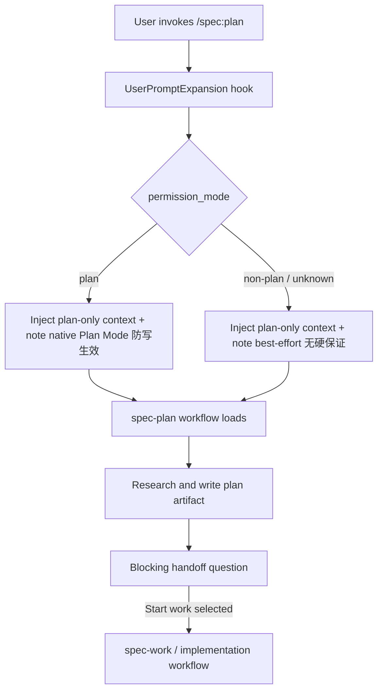

# refactor: Reinforce spec-plan plan-only discipline via harness attention

## Summary

把 `spec-plan` 的“只计划、不实现”从长 prompt 里的自然语言纪律，升级为 Claude Code 宿主层的**注意力增强**：用 `UserPromptExpansion` hook 识别 `/spec:plan` 命令，在它展开成 prompt 之前注入一段短而高显著性的 plan-only / handoff 提醒。该机制对所有 permission mode、所有模型生效，但**只注入上下文、不硬阻断**。

v1 明确定位为 **best-effort attention hardening，不是硬防写保证**。需要硬防写的用户使用 Claude 原生 Plan Mode——那是宿主自带能力，零额外代码。v1 不实现 `PreToolUse` mutation guard、不引入文件 marker / Stop hook / TTL cleanup / 新 writer。同步把 `spec-plan` 的 plan-only 安全契约和 question-tool 规则上移到 skill 热路径。保留 source/runtime 边界，不手改 generated mirrors。

---

## Problem Frame

用户报告：Kimi 2.6 等第三方/非原生模型通过 Claude Code CLI 跑 `/spec:plan` 时，可能不可靠地调用 Plan Mode 或 `AskUserQuestion`，从而跳过“写计划后等待用户选择”，直接改代码。Claude 原生模型较少出现，因为其 Plan Mode / `ExitPlanMode` / `AskUserQuestion` 工具调用路径更可靠。

当前 `skills/spec-plan/SKILL.md` 已写了 `NEVER CODE during this skill`、blocking question、post-plan handoff menu，但关键边界主要埋在约 68KB skill 后半段。对工具调用弱、长上下文注意力不稳的模型，这些规则不足以成为可靠提醒。

**诚实的边界**：注意力增强最弱的地方，恰恰是目标人群最弱的地方——弱 tool-call 模型的问题正是“不听指令”，而注意力增强靠它听指令。能给“非 Plan Mode 目标人群”兜底的硬手段（跨事件防写）需要 marker lifecycle，那正是本项目要避免的复杂度；而一个只在 Plan Mode 触发的 `PreToolUse` guard 只保护“已经在 Plan Mode、本就被宿主保护”的用户，对目标人群零贡献——属于把复杂度花在边际收益最低处。

因此 v1 选择相称的最小机制：用 harness 在 `/spec:plan` 展开前注入高显著性提醒（覆盖所有模式、所有模型），并把“要硬防写就用 native Plan Mode”作为零成本逃生口。硬兜底留作带触发条件的后续工作。

---

## Requirements

- R1. Claude Code 端直接输入 `/spec:plan` 时，`UserPromptExpansion` attention guard 必须通过 `command_name` 识别命令，并注入短而显眼的 `additionalContext`：本次是 planning-only、只能研究/决策/写计划 artifact、完成后必须等待用户 handoff 选择。`permission_mode` 只作为上下文事实：在 `plan` 模式下可附注“native Plan Mode 防写生效”，在非 Plan Mode（`default` / `acceptEdits` / `bypassPermissions` / `auto` / `dontAsk` 等）下必须注明“这是 best-effort 提醒，无硬防写保证”。遇到缺失或无法识别的 `permission_mode` 仍注入提醒，并标注无硬保证。
- R2. attention guard 只约束 `spec-plan` 对应命令（matcher 匹配 `command_name`），不改变其他 `/spec:*` workflow，不影响计划批准后的 `/spec:work` 或实现流程。
- R3. Hook 输出必须使用 Claude Code 官方 `UserPromptExpansion` 形态：`hookSpecificOutput.hookEventName = "UserPromptExpansion"` + `additionalContext`，非阻断。不得尝试 deny / block 该命令的展开。
- R4. 新增或修改 hook 必须通过 source-of-truth 路径完成：`templates/`、`src/cli/`、tests；不得手改 `.claude/`、`.codex/`、`.agents/skills/` runtime mirrors。
- R5. Claude `.claude/settings.json` managed hook 的写入、检查、清理需支持多个 spec-first managed matcher（`SessionStart` + `UserPromptExpansion`），不得破坏现有 `SessionStart` bootstrap。
- R6. `spec-first init --claude` / doctor / clean / smoke 对新增 hook 有完整 source-side 投影、drift 检查、删除路径与测试覆盖。
- R7. `spec-plan` SKILL 顶部新增短热路径 safety contract：计划阶段只能研究、决策、写计划文件；不得调用 implementation tools；完成计划后必须用 blocking question tool 或 loud fallback 等待用户选择。
- R8. `spec-plan` 的 question-tool 规则对齐 `spec-doc-review`：Claude Code 交互模式开始时预加载 `AskUserQuestion`；“schema 尚未加载”“工具不方便”“指令埋得深”都不是文本 fallback 的理由；文本编号 fallback 只在工具缺失或调用失败时可用，并且必须等待用户回复。
- R9. 不让脚本判断“计划语义是否完成”、不解析 plan 文档质量、不自动决定 handoff；这些仍由 `spec-plan` / `spec-doc-review` 的 LLM 判断承担。hook 只做确定性事实处理：事件名、`command_name`、`permission_mode`、上下文注入。
- R10. Codex 端不伪造 Claude Plan Mode parity，也不在本轮强行引入 Codex 端等价 attention hook。`$spec-plan` 仍按 Codex workflow contract 写计划文件；本轮只做规则文案和测试中的双宿主边界说明，除非实现时确认 Codex 有可靠的 slash-command 展开 hook 可注入同等 plan-only 上下文。
- R11. 用户可见 workflow 行为变化必须更新 `CHANGELOG.md`，README / docs 仅在新增用户操作或 troubleshooting 说明需要公开时同步。
- R12. v1 明确不实现硬防写保证：不实现 `PreToolUse` mutation guard、不引入文件 marker、Stop hook、TTL cleanup 或新的 artifact writer。文档与提醒措辞不得声称非 Plan Mode 存在硬防写。
- R13. Skill prose 变更需要 fresh-source eval 或明确记录未执行原因；hook/CLI 变更需要 focused unit/smoke 验证。

---

## Scope Boundaries

- 不实现 `PreToolUse` mutation guard 或任何硬防写机制。
- 不实现通用 workflow 状态机、文件 marker、跨会话 cleanup。
- 不让 hook 或脚本审查计划内容质量。
- 不改变 `spec-work`、`spec-debug`、`spec-code-review` 的入口语义。
- 不在 Codex 端引入会阻止 `$spec-plan` 写 plan 文件的 gate。
- 不依赖第三方模型必须正确调用 `AskUserQuestion`；blocking question 规则保留，但 v1 不为其提供硬兜底。
- 不把 generated runtime mirrors 当 source 修复点；runtime drift 通过 `spec-first init` 刷新。

### Deferred to Follow-Up Work

- **非 Plan Mode 硬兜底**：若注意力增强后仍积累到可观测的“非 Plan Mode 误改代码”事件，再单独规划基于 marker lifecycle 的硬防写（含 `UserPromptExpansion` 写 session 级 marker、`PreToolUse` 读 marker deny、handoff 清除）。本计划不引入。
- **Codex attention parity**：若 Codex 暴露与 Claude `UserPromptExpansion` 等价、可在 slash-command 展开前注入上下文的 hook，再规划 `$spec-plan` 的 Codex 端注意力增强。

---

## Completion Criteria

- `/spec:plan` 在 Claude Code 任意 permission mode 下都进入 planning workflow；`UserPromptExpansion` 注入高显著性 plan-only / handoff 提醒，且不阻断命令展开、不强制切 Plan Mode。
- 注入文案对 permission mode 自适应：Plan Mode 注明“native 防写生效”，非 Plan Mode 注明“best-effort 提醒、无硬保证”。
- 文档与提醒不声称非 Plan Mode 有硬防写；native Plan Mode 作为零成本硬保护逃生口被明确记录。
- 计划完成后的 handoff question 规则在 `spec-plan` 热路径中可见、可测试，并明确 loud fallback 条件。
- `spec-first init/doctor/clean` 对新增 Claude hook 的安装、drift、删除行为都有 focused tests，且 `SessionStart` bootstrap 不受影响。
- `CHANGELOG.md` 有 user-visible 记录；source 变更后 runtime mirrors 仅通过 `spec-first init` 刷新。

---

## Direct Evidence Readiness

- target_repo: `.`
- evidence_sources: direct source reads, `rg`, codegraph advisory lookup, deterministic helper output, **本地 Claude Code 二进制 hook schema 实证**
- source_refs:
  - `docs/10-prompt/结构化项目角色契约.md`
  - `skills/spec-plan/SKILL.md`
  - `skills/spec-doc-review/SKILL.md`
  - `src/cli/claude-settings.js`
  - `src/cli/adapters/claude.js`
  - `src/cli/adapters/codex.js`
  - `templates/claude/hooks/session-start`
  - `tests/unit/claude-settings.test.js`
  - `docs/solutions/tooling-decisions/codex-cli-supports-lifecycle-hooks-2026-05-26.md`
- current_revision: `387abe4a`
- worktree_status: dirty；existing unrelated modified/deleted/untracked files include `CHANGELOG.md`、两个 deleted `docs/12-bug分析/**`、两个无关新 docs，以及 untracked plans `2026-06-10-001` / `2026-06-11-001` / `2026-06-11-002` / `2026-06-11-004`。Implementation must preserve them.
- confidence: high for local source/runtime shape 与 UserPromptExpansion 宿主契约（binary 实证）；medium for third-party model 是否真的“听”注入提醒，因为这取决于 provider 行为。
- limitations: `graphify query` 不在 PATH，project-graph 证据降级为直接源码读取与 CodeGraph advisory；Anthropic 官方 live 文档因网络策略不可达，hook 契约改以本地二进制实证替代。

---

## Direct Evidence

- repo_scope: single repo `spec-first`
- **UserPromptExpansion hook 契约（Claude Code 2.1.173 二进制实证，决定性）**：
  - 该事件真实存在、可在 settings 注册（出现在 hook 事件枚举与可注册 hooks 集合中）。
  - 输入 schema：`{ session_id, transcript_path, cwd, permission_mode?, agent..., hook_event_name:"UserPromptExpansion", expansion_type: "slash_command"|"mcp_prompt", command_name, command_args, command_source?, prompt }`。
  - 触发时机：slash command / mcp prompt **展开时**，正好覆盖 `/spec:plan` 直接输入路径。
  - matcher：对 `UserPromptExpansion`，settings matcher 匹配的是 `command_name`。
  - 输出 schema：`{ hookEventName:"UserPromptExpansion", additionalContext? }` —— **只能注入上下文、无 decision/deny 字段**，与 v1“非阻断注意力”定位完全一致。
- source_reads_completed:
  - `skills/spec-plan/SKILL.md`：plan-only 与 question-tool 规则已存在但埋在长内容后段。
  - `skills/spec-doc-review/SKILL.md`：question-tool preload/fallback 措辞更强，可复用。
  - `src/cli/claude-settings.js`：当前 `MANAGED_HOOK_PATH_PATTERN` 仅匹配 `.claude/hooks/session-start`；`removeManagedHookEntries` 只遍历 `hooks.SessionStart`；inspect 也只检查 `SessionStart`。三处需泛化以支持新 matcher，否则 clean 会静默残留新 hook。
  - `src/cli/adapters/claude.js`：当前只写 `.claude/hooks/session-start` 作为 managed runtime hook；`planRuntimeFilesRemoval` / `removeRuntimeFiles` 硬编码单一 `SESSION_START_RELATIVE_PATH`，需扩展枚举全部 managed hook 脚本。
  - `tests/unit/claude-settings.test.js`：覆盖现有 SessionStart 行为，是自然扩展点。
- source_reads_required:
  - `/spec:plan` 渲染后的确切 `command_name` 取值（很可能是 `spec:plan`）应用一次真实 hook 输入或 fixture 固化。这是一个 fixture 级小问题，不是 go/no-go。
- commands_or_tools_used:
  - `spec-first internal task-governance-signals` 在含 mutation-guard 的旧范围下返回 `candidate_level: deep`；reshape 砍掉 mutation guard 后实际范围降至 medium。
  - `rg` 搜索 hook / question-tool / runtime / test 面。
  - CodeGraph advisory 探索 Claude/Codex adapters 与 settings helper。
  - 本地 Claude Code 二进制字符串与 schema 抽取（确认 UserPromptExpansion 契约）。
- impact_on_plan:
  - 确认这不是 prompt-only 工作；触及 CLI runtime projection 与 hook settings，但范围比原计划小（单一新 hook、无 PreToolUse、无 Bash 分类器）。
  - 确认 medium plan depth 与 focused unit/smoke 覆盖即可。
- key_findings:
  - UserPromptExpansion 原生支持本计划的核心机制：展开前触发、暴露 `command_name` 与 `permission_mode`、输出 `additionalContext`、非阻断。
  - PreToolUse mutation guard 被移除：它只在 Plan Mode 触发，对目标人群零贡献，且与 native Plan Mode 大量重叠。
  - settings helper 需从“单一 SessionStart matcher”泛化为“多 managed matcher”。
- limitations:
  - 未运行 live Claude Code hook 执行；契约来自二进制 schema 实证。
  - 第三方模型是否真的消费注入上下文为 medium confidence。

---

## Context & Research

### Relevant Code and Patterns

- `src/cli/claude-settings.js` owns `.claude/settings.json` 的 managed hook matcher upsert/remove/inspect（当前仅 SessionStart）。
- `src/cli/adapters/claude.js` owns Claude runtime hook 脚本投影与 drift 检查（当前仅 session-start）。
- `templates/claude/hooks/session-start` 展示自包含 bash + 内嵌 Node hook 模板形态，可复用给 `UserPromptExpansion` guard。
- `tests/unit/claude-settings.test.js` 验证 hook settings merge/drift/removal，可扩展到新 matcher。
- `skills/spec-plan/SKILL.md` 的 Interaction Method、Phase 4、Phase 5 handoff 是当前 prompt 级边界。
- `skills/spec-doc-review/SKILL.md` 的 question-tool preload/fallback 提供更强措辞。

### Institutional Learnings

- `docs/10-prompt/结构化项目角色契约.md`：Gate 是轻量确认点，不是中心状态机；Scripts prepare, LLM decides；用最小 durable mechanism 解决高价值问题。
- `docs/solutions/tooling-decisions/codex-cli-supports-lifecycle-hooks-2026-05-26.md`：Codex hook parity 不再不可能，但核心治理保持 helper-first，hook 作为 host-specific 加固。
- Source/runtime 治理：先改 `skills/`、`templates/`、`src/cli/`、tests、docs，再用 `spec-first init` 刷新 runtime。

### External References

- Claude Code 2.1.173 hook 契约：以本地二进制实证为准（见 Direct Evidence）。Anthropic 官方 live 文档本轮不可达。
- Kimi K2.6 / Claude Code integration：Kimi 环境示例设 `ENABLE_TOOL_SEARCH=false`，并强调 tool-call 可靠性是 agentic-loop 关注点——支持“第三方模型工具调用可靠性不同”的前提，但也意味着注入提醒能否被消费仍需观测。

---

## Key Technical Decisions

- KTD1. 用 harness 注意力增强替代 prompt-only 强化。
  - Rationale：prompt 措辞仍有用但最弱；`UserPromptExpansion` 是在 workflow body 加载前提升显著性的确定性位置，且模型无关。

- KTD2. 用 `UserPromptExpansion` 作为 `/spec:plan` 的 attention guard。
  - Rationale：二进制实证它在 slash command 展开时触发、暴露 `command_name`、输出 `additionalContext`、非阻断——原生契合本机制。直接 slash command 展开是 `PreToolUse`(Skill) 覆盖不到的路径，而 `UserPromptExpansion` 正好覆盖。

- KTD3. native Plan Mode 是硬防写逃生口；v1 不另建 mutation guard。
  - Rationale：Plan Mode 本身已防写；一个只在 `permission_mode=plan` 触发的 `PreToolUse` guard 只保护已被 Plan Mode 保护的用户，对目标的非 Plan Mode 人群零贡献，属把复杂度放在边际收益最低处。需要硬防写的用户用 Plan Mode（零代码）。

- KTD4. hook helper 保持确定性、句法级。
  - Rationale：只检查事件名、`command_name`、`permission_mode`，注入固定提醒文案；不解析计划质量、不推断用户意图、不维护跨事件状态。

- KTD5. 强化 `spec-plan` 热路径 prose，但保持短。
  - Rationale：长文档正是弱模型丢约束的地方；safety contract 需出现在 workflow 细节之前。

- KTD6. Codex 端显式非 parity。
  - Rationale：Codex 有本地 hook，但 `$spec-plan` 必须能写计划文件；本轮不引入 Codex attention hook，除非确认有等价展开 hook。

---

## Open Questions

### Resolved During Planning

- `UserPromptExpansion` 事件是否存在、是否暴露命令标识、是否在展开前触发？
  - Resolution：**是**。Claude Code 2.1.173 二进制实证：事件可注册、在 slash/mcp 展开时触发、输入含 `command_name` / `command_args` / `command_source` / `expansion_type` / `permission_mode`、输出 `additionalContext`、非阻断。原 `[阻断前置] go/no-go` 以“通过”结案。

- 是否做 prompt-only？
  - Resolution：不。对第三方模型/工具调用变异性不足；用 harness 在长 skill 加载前提升注意力。

- 是否让脚本验证 `AskUserQuestion` 被调用？
  - Resolution：不。那是语义工作流状态推断，会漂向中心状态机。

- 是否直接改 runtime mirrors 快速止血？
  - Resolution：不。Source-first 治理，改 source/template/generator 后用 `spec-first init` 刷新。

- 是否做非 Plan Mode 硬防写？
  - Resolution：v1 不做。它需要 marker lifecycle（项目要避免的复杂度），且只在出现可观测误改事件后才相称。留作带触发条件的 Deferred。

### Deferred to Implementation

- `/spec:plan` 的确切 `command_name` matcher 值。
  - Reason：用一次真实 hook 输入或 fixture 固化（很可能是 `spec:plan`）。fixture 级，非阻断。

- README 是否需要面向用户的说明。
  - Reason：若注入文案已自解释，README/FAQ 可能不需要新指令。措辞稳定后在实现期决定。

---

## High-Level Technical Design

> *方向性说明，供评审参考，非实现规格。*

单层设计：在 `/spec:plan` 展开前注入与模式自适应的高显著性提醒。硬防写不在本机制内——由用户自行选择 native Plan Mode 提供。

---

## Implementation Units

### U1. Claude spec-plan UserPromptExpansion attention guard

**Goal:** 识别 `/spec:plan` 展开并注入模式自适应的 plan-only / handoff 提醒；泛化 managed settings 以支持多 matcher。

**Requirements:** R1, R2, R3, R4, R5, R9, R12

**Dependencies:** None

**Files:**
- Create: `templates/claude/hooks/spec-plan-guard`
- Modify: `src/cli/adapters/claude.js`
- Modify: `src/cli/claude-settings.js`
- Test: `tests/unit/claude-settings.test.js`
- Test: `tests/unit/runtime-plan-contracts.test.js`

**Approach:**
- 注册一个 managed `UserPromptExpansion` matcher，matcher 值匹配 `/spec:plan` 的 `command_name`。
- hook 读取 JSON 事件输入，按 `permission_mode` 选择文案：`plan` → 注明 native 防写生效；非 Plan Mode / 缺失 / 未知 → 注明 best-effort、无硬保证。
- 始终通过 `hookSpecificOutput.additionalContext` 注入；绝不尝试 deny。
- 泛化 managed hook settings 支持 `SessionStart` 与 `UserPromptExpansion` 共存、去重、inspect、干净移除。具体改动点：`src/cli/claude-settings.js` 的 `MANAGED_HOOK_PATH_PATTERN`（仅匹配 `session-start`）、`removeManagedHookEntries`（仅遍历 `SessionStart`）、inspect（仅检查 `SessionStart`）三处必须泛化以覆盖新 hook 脚本路径与新事件键（`UserPromptExpansion`）；`src/cli/adapters/claude.js` 的 `planRuntimeFilesRemoval` / `removeRuntimeFiles` 硬编码的单一 `SESSION_START_RELATIVE_PATH` 需扩展枚举全部 managed hook 脚本。
- 注意 `tests/unit/runtime-plan-contracts.test.js` 现有的 `expect(plan.operations).toHaveLength(1)` 与 `{ write_file: 1 }` 断言会因新增 hook 脚本失败，必须随新增操作数同步更新，作为 U1 通过的一部分。

**Patterns to follow:**
- `templates/claude/hooks/session-start`（bash + 内嵌 Node 模板形态）。
- `src/cli/claude-settings.js`（managed matcher upsert/remove/inspect）。
- `tests/unit/claude-settings.test.js`（settings merge/drift/removal fixture）。

**Test scenarios:**
- Happy path：settings upsert 保留既有用户 hook，并同时存在 managed `SessionStart` 与 `UserPromptExpansion` 条目。
- Happy path：`permission_mode=plan` 注入提醒且含“native 防写生效”措辞，无 block。
- Happy path：`permission_mode` 为 `bypassPermissions` / `acceptEdits` / `auto` / `dontAsk` / `default` 时注入提醒且含“best-effort、无硬保证”措辞，无 block。
- Edge case：缺失或未知 `permission_mode` 仍注入提醒且不声称硬保护。
- Edge case：非 `spec-plan` 命令不触发本 guard。

**Verification:**
- Claude runtime plan 含 recognition/guard hook 脚本与 managed settings matcher。
- Focused tests 证明 upsert/inspect 幂等且保留无关 settings。Clean/doctor lifecycle 在 U3 验证。

---

### U2. spec-plan hot-path safety contract and question-tool preload

**Goal:** 把最重要的 `spec-plan` 边界上移到 skill 顶部，并强化 `AskUserQuestion` 使用纪律。

**Requirements:** R7, R8, R9, R13

**Dependencies:** None

**Files:**
- Modify: `skills/spec-plan/SKILL.md`
- Modify: `tests/unit/spec-plan-contracts.test.js`
- Reference: `skills/spec-doc-review/SKILL.md`

**Approach:**
- 在 workflow 细节之前新增简短 `Plan-Only Safety Contract`。
- 写明三条红线：handoff 前不调用 implementation tools；计划阶段只写计划 artifact；handoff menu 后必须等待用户显式选择。
- 移植 `spec-doc-review` 更强的 question-tool preload 与 loud fallback 措辞。
- 把 question-tool preload 定位为 UX/可靠性加固，而非第三方模型的硬安全保证；明确 v1 的安全姿态是 best-effort attention，硬防写靠 native Plan Mode。
- 保持 prose 足够短以抵抗长上下文注意力丢失；不新增长 reference 文件。

**Patterns to follow:**
- `skills/spec-doc-review/SKILL.md` Interaction Mode question-tool 措辞。
- 现有 `tests/unit/spec-plan-contracts.test.js` prose contract 检查。

**Test scenarios:**
- Contract：`spec-plan` 在 Phase 0 之前含新顶层 safety contract。
- Contract：`spec-plan` 说明 Claude Code 交互工作中必须用 `ToolSearch` 预加载 `AskUserQuestion` schema。
- Contract：`spec-plan` 说明 schema-not-loaded / 不方便 / 指令埋得深都不是 fallback 触发器。
- Contract：`spec-plan` 保留 `NEVER CODE during this skill` 与最终 handoff menu 要求。
- Contract：`spec-plan` 不声称非 Plan Mode 有硬防写；明确 best-effort 定位。

**Verification:**
- fresh-source evaluator 能在不通读全文的情况下识别 plan-only / handoff / wait 边界无歧义，同时正确理解 question-tool preload 是 best-effort UX 加固、硬防写靠 native Plan Mode。

---

### U3. Runtime projection, clean, doctor, and dual-host boundary

**Goal:** 让 runtime 生成与修复流处理新增的单一 Claude hook，并记录 Codex 端有意非 parity。

**Requirements:** R4, R5, R6, R10, R11

**Dependencies:** U1

**Files:**
- Modify: `src/cli/adapters/claude.js`
- Modify: `src/cli/claude-settings.js`
- Modify: `src/cli/commands/init.js`（仅当未完全委托 adapter）
- Modify: `src/cli/commands/doctor.js`（仅当未完全委托 adapter）
- Modify: `src/cli/commands/clean.js`（仅当未完全委托 adapter）
- Test: `tests/unit/claude-settings.test.js`
- Test: `tests/unit/runtime-plan-contracts.test.js`
- Test: `tests/unit/clean-dry-run.test.js`
- Test: `tests/smoke/cli.sh`

**Approach:**
- 扩展 Claude adapter runtime 操作，以可执行模式写全部 managed hook 脚本（session-start + spec-plan-guard）。
- 扩展 doctor 独立报告每个 managed hook 脚本/settings matcher，保留可执行修复信息。
- 扩展 clean 移除全部 managed hook 文件与 managed settings 条目，保留无关 hook。
- **实现前先确认 init/doctor/clean 是否已完全委托给 adapter 做 hook 操作。** 若是，则改动收敛到 adapter 与 settings helper，不要把 hook 注册知识散落到命令文件；若命令文件确需直接改，在实现说明里记录原因。结论回填本单元。
- Keep Codex docs/prose honest：Codex 有本地 hook parity，但本轮 attention 加固针对 Claude。不加 Codex guard，除非有等价展开 hook 且不破坏 `$spec-plan`。

**Patterns to follow:**
- `src/cli/adapters/codex.js` 的多 hook 文件写/查模式。
- `docs/solutions/tooling-decisions/codex-cli-supports-lifecycle-hooks-2026-05-26.md` helper-first 指引。

**Test scenarios:**
- Happy path：init preview/apply 含全部 Claude managed hook 脚本与 settings 条目。
- Drift：删除一个 hook 脚本只报告该 hook 缺失。
- Drift：改动一个 managed settings matcher 报告 settings drift。
- Cleanup：clean 移除 managed hooks 与 settings 条目，保留无关用户 hook。
- Dual-host boundary：Codex runtime tests 除显式措辞更新外不变；不引入 Codex Plan Mode 声明。

**Verification:**
- `spec-first doctor --claude` 能区分缺失 SessionStart vs 缺失 spec-plan guard。
- `spec-first clean --claude` preview 列出新 managed runtime 资产。
- focused Jest 套件通过；`npm run typecheck` 通过；runtime projection 变化时 `npm run test:smoke` 通过。

---

### U4. Documentation, changelog, and runtime refresh

**Goal:** 闭合 source-change 治理环，不手改 runtime mirrors。

**Requirements:** R4, R10, R11, R13

**Dependencies:** U1, U2, U3

**Files:**
- Modify: `CHANGELOG.md`
- Modify: `README.md`（仅当注入文案需要面向用户文档）
- Modify: `README.zh-CN.md`（若 `README.md` 变更）
- Reference: `docs/contracts/workflows/fresh-source-eval-checklist.md`
- Generated by command only: `.claude/**`、`.codex/**`、`.agents/skills/**`

**Approach:**
- 新增 `(user-visible)` `CHANGELOG.md` 条目，因为 `/spec:plan` 调用行为变化（注入注意力提醒）。
- 仅当实现新增超出注入文案的用户可见指引时更新 README。
- source 与 tests 通过后运行 `spec-first init` 刷新受影响 host runtime；不手改 generated mirrors。
- 在 closeout 记录 fresh-source eval 状态。

**Test scenarios:**
- Test expectation：docs-only changelog 条目沿用现有 changelog 格式检查。
- Integration：`spec-first init` 后 generated runtime mirrors 反映 source templates，无手改。

**Verification:**
- Changelog 格式匹配现行单行约定。
- Runtime 生成 source-derived，无手改。

---

## System-Wide Impact

- **Workflow entry:** `/spec:plan` 获得 Claude 端识别/注意力要求。任意 permission mode 进入 planning，带模式自适应的短提醒。
- **安全姿态:** 全模式注意力增强（best-effort）；硬防写仍是 native Plan Mode 的既有能力，未被本计划改变或扩展。
- **Runtime 生成:** Claude managed hook 资产从一个 SessionStart 脚本扩展为两个脚本/settings 条目。
- **Doctor/clean:** 需区分多个 managed hook。
- **双宿主:** Codex 仍受支持，本轮不声称 Plan Mode parity，也不加 Codex attention hook。
- **Generated mirrors:** `.claude/**`、`.codex/**`、`.agents/skills/**` 是 `spec-first init` 后的派生产物，非实现目标。
- **Review scope:** 触及 workflow contract 与 runtime projection，实现完成前宜过 doc review + focused code review。

---

## Risks & Dependencies

| Risk | Mitigation |
|------|------------|
| 注入文案变噪音 | 保持短，聚焦三条事实：plan-only、不实现、等 handoff。测试非 `spec-plan` 命令不受影响。 |
| 模型无视提醒（尤其弱 tool-call 模型） | 接受为 v1 tradeoff。v1 是 best-effort 注意力，不假装非 Plan Mode 有硬防写；需要硬防写引导用户用 native Plan Mode。 |
| Claude hook API 形态变化 | hook 解析保持防御性，针对实证字段测试，doctor 报告 drift/missing 并给 init 指引。 |
| settings helper 误删用户 hook | 扩展测试覆盖 mixed user + managed hook 数组与部分移除。 |
| Codex parity 压力导致越界 | 显式记录非 parity，不加无稳定信号的 Codex hook。 |
| skill prose 继续膨胀 | 加短热路径段，不加大 reference 文件。 |
| Generated runtime drift | source 变更后用 `spec-first init`；不手改 mirrors。 |

---

## Alternative Approaches Considered

- Prompt-only 强化。
  - Rejected as insufficient for 弱 tool-call 模型与长 skill 文档。保留为次层。

- **`PreToolUse` mutation guard（defense-in-depth 硬闸门）。**
  - **Rejected for v1。** 它只在 `permission_mode=plan` 触发，而 native Plan Mode 本身已防写——guard 对“已被保护的 Plan Mode 用户”是冗余，对“目标的非 Plan Mode 人群”零贡献。其复杂度（settings/lifecycle 泛化、Bash 分类器、characterization）与边际收益不成比例。需要硬防写的用户使用 native Plan Mode。

- Hard-denying 非 Plan Mode `/spec:plan`。
  - Rejected：期望的 UX 不是强推 Plan Mode；且 `UserPromptExpansion` 输出不支持 deny。

- 中心 workflow 状态文件 / 文件 marker（标记“planning active”）。
  - Rejected for v1：制造重状态机与跨会话 cleanup 风险。留作带触发条件的 Deferred 硬兜底基础。

- 脚本检查 `AskUserQuestion` 是否被调用。
  - Rejected：需要 transcript 语义，易脆，且只解 handoff 症状不解 wrong-mode 入口。

- 手改 `.claude/` runtime mirrors 快速止血。
  - Rejected by source/runtime 治理。

- 对所有 `/spec:*` 的全局 mutation guard。
  - Rejected as overbroad：`spec-work` 等实现流必须能在用户意图后写入。

---

## Phased Delivery

### Phase 1: Claude attention guard + runtime lifecycle

- Land U1（UserPromptExpansion guard + settings 泛化）。
- 用 characterization fixture 固化 `/spec:plan` 的 `command_name` 与注入文案。
- Land U3（runtime projection / doctor / clean / smoke），随 U1 的新增 hook 数量同步更新断言。
- 范围窄到 Claude runtime projection 与确定性 guard 逻辑。

### Phase 2: Workflow contract tightening

- Land U2，然后对更新后的 `spec-plan` source 跑 fresh-source eval。
- 确保 question-tool fallback 语言明确且靠近 workflow 顶部。

### Phase 3: Documentation closeout

- Land U4 changelog/docs，运行 focused tests、`typecheck`、smoke（runtime 变化时）。
- 仅在 source 验证后用 `spec-first init` 刷新 runtime mirrors，记录验证/fresh-source eval 状态。

---

## Documentation / Operational Notes

- 注入文案避免点名特定模型。建议短提醒：“`/spec:plan` 是 planning-only：研究、写/预览计划，然后等用户的 handoff 选择再实现。需要硬防写请使用 Plan Mode。”
- README 更新应短，仅在新行为需要 hook 文案之外的可发现性时添加。
- 实现 closeout 应说明 Kimi/K2.6 是否被手动测试；未测试则不声称 provider-specific 验证。

---

## Sources & References

- Role contract: `docs/10-prompt/结构化项目角色契约.md`
- Planning workflow source: `skills/spec-plan/SKILL.md`
- Stronger question-tool wording source: `skills/spec-doc-review/SKILL.md`
- Claude settings helper: `src/cli/claude-settings.js`
- Claude runtime adapter: `src/cli/adapters/claude.js`
- Codex runtime adapter: `src/cli/adapters/codex.js`
- Claude SessionStart hook template: `templates/claude/hooks/session-start`
- Codex hook parity learning: `docs/solutions/tooling-decisions/codex-cli-supports-lifecycle-hooks-2026-05-26.md`
- UserPromptExpansion hook 契约：Claude Code 2.1.173 本地二进制 schema 实证（见 Direct Evidence）。

---

## Completion Evidence

Implemented U1-U4: Claude `UserPromptExpansion` spec-plan attention guard, managed settings/runtime lifecycle for both Claude hooks, `spec-plan` hot-path safety/question-tool contract, changelog/docs/gitignore updates, and source-driven runtime refresh via `spec-first init`.

Post-review closeout: `$spec-code-review` multi-agent review found 3 actionable issues and they were fixed: the Claude `spec-plan-guard` hook now reads the full `UserPromptExpansion` payload from stdin instead of passing large prompts through an environment variable; Claude runtime inspection now warns on managed hook executable-bit drift; smoke coverage now asserts the `UserPromptExpansion` settings matcher and doctor entries.

Verification completed for this closeout: `npm run test:unit -- --runTestsByPath tests/unit/runtime-plan-contracts.test.js tests/unit/claude-settings.test.js tests/unit/runtime-hook-permissions.test.js` (runner executed the full unit suite: 140 suites / 1091 tests passed), `npm run typecheck`, `npm run test:smoke`, `./bin/spec-first.js doctor --claude --json`, `git diff --check`, and `/Users/kuang/.local/bin/graphify update .`. The earlier broad `npm test`, Codex doctor, and fresh-source eval claims were not rerun in this follow-up closeout and are not used as the post-review evidence.

Generated runtime status: `.claude/settings.json` was refreshed by `spec-first init`; ignored runtime mirrors such as `.claude/hooks/spec-plan-guard`, `.claude/spec-first/**`, and `.agents/skills/**` were regenerated from source and intentionally not hand-edited as source.

---

## Deferred / Open Questions

### From 2026-06-11 review（已通过 reshape 处理）

- **Attention 可能触达不到目标第三方模型** — 处理：v1 明确定位为 best-effort attention hardening，不再声称解决目标人群的硬安全问题；硬防写引导至 native Plan Mode；marker 硬兜底进 Deferred 并附触发条件（积累可观测误改事件后再做）。仍建议在实现期用一次真实第三方模型 session 观测 hook 是否触发、context 是否带入，并据此校准措辞。

  <!-- dedup-key: section="problem frame scope boundaries" title="fix may not reach the thirdparty models it targets" evidence="the guard only protects them if claude code host lifecycle events fire identically and populate permissionmode for nonnative model sessions" -->

- **Deep scope 由单一 anecdote 支撑** — 处理：reshape 砍掉 `PreToolUse` mutation guard / Bash 分类器 / characterization 前置，范围从 deep（6 单元）降至 medium（4 单元）；机制收敛为“便宜的注意力增强 + native Plan Mode 逃生口”。措辞改为“高影响、频率未知”。

  <!-- dedup-key: section="problem frame" title="deep scope justified by a single anecdote" evidence="the entire deep 6unit hostlayer investment is justified by one user report about kimi 26 with no incident count" -->

- **U3 modifies init/doctor/clean — verify adapter encapsulation** — 处理：U3 Approach 已加“实现前确认是否已委托 adapter”的前置说明，命令文件改动仅在确需时进行并记录原因。结论回填 U3。

  <!-- dedup-key: section="u4" title="u4 modifies initdoctorclean verify adapter encapsulation" evidence="u4 lists initjs doctorjs and cleanjs as separate modification targets alongside claudejs and claudesettingsjs" -->

- **U5 作为独立单元 vs 折叠验证里程碑** — 处理：原 U5 已取消独立单元身份，验证折叠进各单元的 Test/Verification 段与 Phased Delivery。

  <!-- dedup-key: section="u5" title="u5 as a separate unit vs folded verification milestone" evidence="u5 creates no new source files and modifies only test files that are already listed as test targets inside u1 u2 u3 and u4" -->
