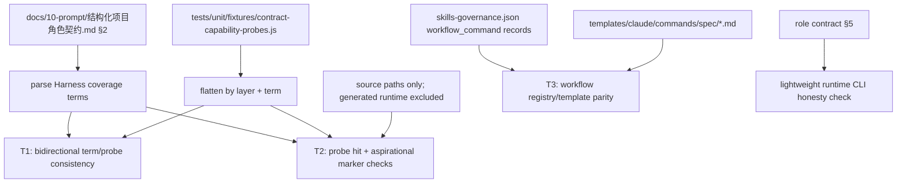

# test: Add contract drift guard

## Summary

本计划把 `docs/01-需求分析/15.contract-drift-guard/技术方案.md` 收敛为一个可执行的测试落地方案：新增轻量 Jest guard 和 test-owned probe registry，让角色契约中的 Harness 能力声明、workflow command registry、Claude command templates 保持可机械核对的一致性。

计划刻意保持在 test/source 层，不新增 runtime writer、JSON schema 或 workflow engine。脚本只判断可确定的存在性、注册一致性和 source/runtime 边界；是否实现、删除或降级某个能力词仍由维护者语义判断。

---

## Problem Frame

角色契约是 spec-first 演化判断基线，但当前只有人工审计能发现“契约声称能力存在，source 没有承载”这类 honesty drift。技术方案已经确认最高杠杆修复不是再扩审计流程，而是把最低限度的声明-承载核对固化到 unit tests 中。

该 guard 要防的是 contract drift，不是能力质量评估。它应当在 `npm run test:unit` 这种常规验证链路里尽早暴露以下问题：角色契约 §2 新增能力词但没有 probe、probe registry 残留 stale term、未实现能力没有逐词 `(aspirational)` 标记、Claude command template 与 `skills-governance.json` 的 workflow registry 漂移，以及 runtime 维护动作被误写成 `/spec:*` 入口。

本计划使用 plan-local `spec_id`，因为 origin 技术方案没有 frontmatter `spec_id` 可继承。

---

## Requirements

- R1. 角色契约 §2 Harness 覆盖词必须与 `tests/unit/fixtures/contract-capability-probes.js` 双向一致：缺 probe、stale probe、layer mismatch 都应失败。
- R2. `path` / `content` / `aspirational` 三类 probe 必须只产生 deterministic existence facts，不判断实现质量、成熟度或架构合理性。
- R3. `(aspirational)` 必须绑定到具体 term 切片，不能用同一 markdown 表格行的任意 marker 放过多个未标能力词。
- R4. `content` probe 必须用 Node `fs` 扫描 source 文本，不依赖外部 `grep` / `rg` 命令，且默认排除 generated runtime、audit output、`node_modules` 与 `graphify-out`。
- R5. workflow command expected set 必须从 `src/cli/contracts/dual-host-governance/skills-governance.json` 中 `entry_surface === "workflow_command"` 的 `command_name` 派生，不能从角色契约 §5 示例句反推。
- R6. Claude command template 必须与 workflow registry 双向一致；Codex v1 不做 command parity，因为 `src/cli/adapters/codex.js` 明确 `hasCommands = false`，Codex workflow delivery 是 skill projection。
- R7. 角色契约 §5 只做 lightweight honesty check：不得出现 `/spec:update`，runtime 维护动作必须表述为 terminal CLI `spec-first update/init/clean/doctor`，不要求 §5 枚举全量 workflow commands。
- R8. 新增测试和文档变更必须同步 `CHANGELOG.md`，不手改 `.claude/`、`.codex/`、`.agents/skills/` generated runtime mirrors。

---

## Assumptions

- A1. origin 技术方案的 WHAT 已经足够清楚，本计划不回到 `spec-brainstorm` 重新定义产品范围。
- A2. 初次落地时具体哪些 §2 term 应标 `(aspirational)` 由实现时的 probe 命中事实决定；计划只规定判定边界和更新规则。
- A3. v1 guard 只服务 Jest 和 CI/release readiness，不需要被 `doctor`、runtime setup 或 downstream workflow 直接消费。

---

## Scope Boundaries

- 不新增 `src/cli/contracts/**` schema 或 machine-readable runtime artifact；probe registry 是 test-owned mirror。
- 不让测试脚本推断架构优劣、业务优先级、能力成熟度、review finding 是否成立。
- 不扫描 generated runtime mirrors 作为 source 承载证据。
- 不实现 Evaluation Harness 指标采集；未 instrument 的指标只能被诚实标注为 `(aspirational)` 或从契约删除。
- 不把 Codex 伪造成 command 平台；后续 Codex parity 应围绕 `.agents/skills` projection，而不是 `.codex/commands/spec`。

### Deferred to Follow-Up Work

- Codex skill projection parity guard：若未来发现真实 Codex projection drift，再围绕 `CodexAdapter.transformSkillContent()`、`planBundledAssetSync()` 或 `inspectInstalledAssets()` 增加专门测试。
- 将 probe registry 提升为 `src/cli/contracts/**`：只有当 CLI/doctor/downstream workflow 需要消费同一 registry 时再版本化。

---

## Completion Criteria

- `tests/unit/contract-drift-guard.test.js` 存在并覆盖 R1-R7。
- `tests/unit/fixtures/contract-capability-probes.js` 覆盖角色契约 §2 当前全部 Harness term。
- 任何未实现或未 instrument term 在角色契约 §2 中逐词标注 `(aspirational)`，且 registry 使用 `type: "aspirational"` 并给出非空 `reason`。
- workflow command set 从 `skills-governance.json` 派生，Claude templates 双向一致，§5 不把 runtime CLI 维护动作伪装成 slash workflow。
- 聚焦 guard 测试和 unit test 链路通过；若因工作区既有脏改或非本计划问题无法运行全量 unit，closeout 必须明确记录。
- `CHANGELOG.md` 追加本计划和后续实现记录。

---

## Direct Evidence Readiness

- target_repo: `spec-first`
- evidence_sources: direct source reads, `rg`, Node inspection scripts, codegraph exploration, `git status`, `task-governance-signals`
- source_refs:
  - `docs/01-需求分析/15.contract-drift-guard/技术方案.md`
  - `docs/10-prompt/结构化项目角色契约.md`
  - `src/cli/plugin.js`
  - `src/cli/adapters/claude.js`
  - `src/cli/adapters/codex.js`
  - `src/cli/contracts/dual-host-governance/skills-governance.json`
  - `src/cli/contracts/dual-host-governance/skills-governance.schema.json`
  - `templates/claude/commands/spec/*.md`
  - `tests/unit/public-workflow-contract-summary.test.js`
  - `tests/unit/governance-contracts.test.js`
  - `tests/unit/spec-plan-contracts.test.js`
  - `tests/unit/context-bundle-contracts.test.js`
- current_revision: `d3d3fd3c`
- worktree_status: dirty; multiple pre-existing modified and untracked files are present, so implementation must avoid reverting unrelated changes.
- confidence: high for source/runtime and workflow registry boundaries; medium for exact initial probe choices because those should be selected while implementing against current §2 terms.
- limitations:
  - `graphify-out/graph.json` exists, but `graphify` CLI is unavailable in this shell (`command not found`), so project-graph evidence was not used.
  - No implementation tests were run during planning; this workflow is plan-only.

---

## Direct Evidence

- repo_scope: single repo, current working directory `spec-first`
- source_reads_completed:
  - Origin 技术方案完整读取并 preserved its Goals, Non-goals, T1/T2/T3 design, validation plan, artifact table, dual-host boundary, risks, and acceptance standard.
  - 角色契约 §2 currently lists Harness coverage terms such as `bounded direct source reads`, `` `rg` ``, `ast-grep`, `context bundle`, `docs/solutions`, `debug 命中率`, `review 漏判率`, `workflow 质量反馈`, `hook budget`, and related source/governance terms.
  - 角色契约 §5 currently treats `/spec:*` entries as examples and states runtime maintenance actions are terminal CLI commands.
  - `src/cli/plugin.js` builds command manifest from `skills-governance.json` plus `templates/claude/commands/spec/*.md`, and validates governance/manifest consistency.
  - `src/cli/adapters/claude.js` has command delivery under `.claude/commands/spec`; `src/cli/adapters/codex.js` has `hasCommands = false` and uses `.agents/skills`.
  - Current workflow registry has 18 `workflow_command` records; current Claude command templates have 18 files; Node comparison found no missing or stale templates.
- source_reads_required:
  - Implementation should re-read role contract §2 at edit time before deciding exact `(aspirational)` term changes.
  - Implementation should inspect final `contract-capability-probes.js` against current source after any concurrent edits.
- commands_or_tools_used:
  - codegraph exploration for adapters and test/source surfaces
  - `rg` over `src/cli`, `tests/unit`, `docs/contracts`, `docs/solutions`, `docs/10-prompt`, and `templates`
  - Node scripts for registry/template parity and role-contract §2/§5 extraction
  - `git status --short`, `git rev-parse --short HEAD`, `task-governance-signals`
- impact_on_plan:
  - Confirms plan depth as Deep by advisory helper (`candidate_level=deep`) due cross-module contract/runtime/governance surfaces, but implementation remains a small test-first slice.
  - Confirms T3 must use `skills-governance.json`, not role contract prose.
  - Confirms v1 Codex command parity would be wrong.
- key_findings:
  - Existing tests already use CommonJS + Node `fs` direct reads, so the new guard should follow that pattern.
  - Existing dual-host contract documents `workflow_command` as a source-layer category and Codex delivery as `skill`.
  - Institutional learning `docs/solutions/architecture-patterns/workflow-entrypoint-exposure-contract-2026-04-26.md` already records the same command manifest/governance/adapter boundary.
- limitations:
  - Direct evidence is bounded to the named source/test/contract files; it is not a repository-wide audit.

---

## Context & Research

### Relevant Code and Patterns

- `tests/unit/public-workflow-contract-summary.test.js` reads `skills-governance.json` and derives public workflow skill sets from `entry_surface === "workflow_command"`.
- `tests/unit/governance-contracts.test.js` shows the local pattern for deterministic contract assertions with structured fixture payloads.
- `tests/unit/spec-plan-contracts.test.js` shows runtime integrity anchor coverage using `planBundledAssetSync()` / `inspectInstalledAssets()` without hand-editing generated runtime.
- `tests/unit/context-bundle-contracts.test.js` shows generated runtime exclusion expectations and path-backed evidence boundary patterns.
- `src/cli/plugin.js` already validates command manifest construction from governance records and command template metadata.

### Institutional Learnings

- `docs/contracts/dual-host-governance/README.md` defines `workflow_command` as source-layer classification and separates Claude command delivery from Codex skill delivery.
- `docs/solutions/architecture-patterns/workflow-entrypoint-exposure-contract-2026-04-26.md` records the maintenance rule: workflow entrypoints require source skill, governance record, and Claude template; Codex is not a command platform.
- `docs/solutions/workflow-issues/modify-source-not-artifacts-2026-04-13.md` reinforces that `.claude/`, `.codex/`, and `.agents/skills/` are generated mirrors, not source fixes.

### External References

- None used. The implementation is a repo-local governance/test contract; external research would not materially change the plan.

---

## Key Technical Decisions

- KTD1. Keep probe registry in `tests/unit/fixtures/contract-capability-probes.js`: v1 has one Jest consumer, so a test fixture is enough and avoids turning advisory probe data into a new runtime truth source.
- KTD2. Keep parser and executor helpers local to `tests/unit/contract-drift-guard.test.js`: extract only after a second test file actually reuses them.
- KTD3. Preserve backticks in term keys: the current role contract lists `` `rg` `` with markdown code formatting, so the registry key should match the visible contract term unless the contract text changes.
- KTD4. Treat `(aspirational)` as term-local state: it prevents row-level markers from masking multiple unsupported claims.
- KTD5. Use `skills-governance.json` for workflow command truth: it is already consumed by `src/cli/plugin.js` and documented as the dual-host governance truth source.
- KTD6. Let role contract §5 remain explanatory prose: only guard against dishonest runtime CLI/slash command wording, not against incomplete examples.
- KTD7. Prefer permanent synthetic negative cases where cheap: parser/compare/probe functions can be exercised with in-memory markdown or temporary test fixtures, while file-system mutation checks can remain manual closeout evidence if permanent coverage would overcomplicate the test.

---

## Open Questions

### Resolved During Planning

- Should T3 require Codex command parity? No. `CodexAdapter.hasCommands = false`; Codex parity belongs to skill projection, not `.codex/commands/spec`.
- Should expected workflow commands come from role contract §5? No. §5 is prose and examples; `skills-governance.json` is the machine-readable registry.
- Should the guard use external `grep` or `rg`? No. Unit tests should use Node `fs` and be independent of host shell tools.

### Deferred to Implementation

- Exact probe pattern choices for each §2 term: choose the narrowest stable source path/content anchor while implementing against current source.
- Exact list of terms to mark `(aspirational)`: determine from actual probe evidence, then either implement source support, mark aspirational, or remove the term.
- Whether to add permanent negative fixtures for every manual negative check: prefer permanent in-memory coverage where simple; otherwise record manual reverse validation in closeout.

---

## High-Level Technical Design

> *This illustrates the intended approach and is directional guidance for review, not implementation specification. The implementing agent should treat it as context, not code to reproduce.*

---

## Implementation Units

### U1. Build Harness Term Parser And Probe Registry

**Goal:** Create the test-owned registry and the parser/flattening surface that turns role contract §2 into comparable layer/term facts.

**Requirements:** R1, R2, R3

**Dependencies:** None

**Files:**
- Create: `tests/unit/fixtures/contract-capability-probes.js`
- Create: `tests/unit/contract-drift-guard.test.js`
- Read: `docs/10-prompt/结构化项目角色契约.md`

**Approach:**
- Parse only `## 2. 核心链路与 Harness 层` and only the Harness markdown table.
- Treat column 1 as `layer` and column 3 as coverage text.
- Split terms by `、`, preserve visible term text after removing only the `(aspirational)` marker, and keep backticks in keys.
- Store `layer`, `lineNumber`, `rawCell`, `termText`, and `hasAspirationalMarker` so failures can cite the exact contract location.
- Flatten registry as `{ layer, term, probe }` and validate duplicate terms, unknown layers, and invalid shapes before executing probes.

**Execution note:** Implement parser behavior with synthetic markdown samples first, then wire it to the current role contract.

**Patterns to follow:**
- `tests/unit/public-workflow-contract-summary.test.js`
- `tests/unit/context-bundle-contracts.test.js`

**Test scenarios:**
- Happy path: a table row with `Context Harness` and two terms split by `、` yields two term records with the same layer.
- Edge case: a term written as `` `rg` `` keeps backticks in the normalized registry key.
- Edge case: `debug 命中率 (aspirational)、review 漏判率` marks only the first term as aspirational.
- Error path: duplicate registry keys under the same layer produce a structured `duplicate_probe` error.
- Error path: registry term under a different layer than the contract term produces `layer_mismatch`.

**Verification:**
- Parser and registry comparison produce deterministic, structured errors without scanning runtime mirrors or using external shell commands.

---

### U2. Implement Probe Executor And Contract Honesty Checks

**Goal:** Enforce T1/T2 so every §2 term is either backed by a valid source probe or explicitly marked aspirational term-by-term.

**Requirements:** R1, R2, R3, R4, R8

**Dependencies:** U1

**Files:**
- Modify: `tests/unit/contract-drift-guard.test.js`
- Modify: `tests/unit/fixtures/contract-capability-probes.js`
- Modify: `docs/10-prompt/结构化项目角色契约.md`
- Modify: `CHANGELOG.md`

**Approach:**
- Implement `path`, `content`, and `aspirational` probe execution in the test file.
- For `path`, require `anyOf` as a non-empty array and pass when at least one repo-relative path exists.
- For `content`, require non-empty `paths`, scan allowed text files with Node `fs`, and count string or RegExp hits.
- Apply the default exclusion prefixes from the origin: `.claude/`, `.codex/`, `.agents/skills/`, `.spec-first/audits/`, `node_modules/`, `graphify-out/`.
- For `aspirational`, require a non-empty `reason` and a term-local marker in the role contract.
- Fail `unexpected_aspirational_marker` when the contract marks a term aspirational but the registry declares it implemented.
- Update role contract §2 only where current facts prove a term is not implemented/instrumented, and record the change in `CHANGELOG.md`.

**Execution note:** Treat the first full run as a characterization signal: do not weaken probes just to get green; either choose a better source anchor or make the contract honest.

**Patterns to follow:**
- `tests/unit/governance-contracts.test.js`
- `docs/contracts/context-governance.md` generated runtime exclusion rules

**Test scenarios:**
- Happy path: `path` probe with an existing source file or directory passes and records hit path.
- Happy path: `content` probe finds a stable string under an allowed source directory and reports hit count greater than zero.
- Edge case: `content` scan ignores a matching file under `.agents/skills/` or `graphify-out/`.
- Error path: `path` probe with empty `anyOf` fails `invalid_probe_shape`.
- Error path: `content` probe with no hits fails `content_probe_missed` with term, layer, pattern, paths, and hit count.
- Error path: aspirational registry without term-local marker fails `aspirational_marker_missing`.
- Error path: term-local `(aspirational)` marker with non-aspirational registry fails `unexpected_aspirational_marker`.

**Verification:**
- T1/T2 fail with structured, reproducible errors when contract terms and probes drift.
- Role contract changes preserve source/runtime and script/LLM boundaries.

---

### U3. Add Workflow Registry And Template Guard

**Goal:** Enforce T3 using the existing dual-host governance source of truth and keep role contract §5 as honest prose rather than a second command registry.

**Requirements:** R5, R6, R7

**Dependencies:** U1

**Files:**
- Modify: `tests/unit/contract-drift-guard.test.js`
- Read: `src/cli/contracts/dual-host-governance/skills-governance.json`
- Read: `templates/claude/commands/spec/*.md`
- Read: `src/cli/adapters/codex.js`
- Read: `docs/10-prompt/结构化项目角色契约.md`

**Approach:**
- Read `skills-governance.json` and select records where `entry_surface === "workflow_command"`.
- Require every workflow record to have non-empty `command_name`.
- Compare sorted `command_name` values with basenames under `templates/claude/commands/spec/*.md`.
- Require each workflow record to use `host_delivery.claude === "command"`.
- For dual-host workflows, require Codex delivery to be the registry-allowed skill delivery; do not check `.codex/commands`.
- Parse role contract §5 only for honesty anti-patterns: no `/spec:update`, and terminal maintenance actions remain `spec-first update/init/clean/doctor`.

**Patterns to follow:**
- `src/cli/plugin.js` `buildPluginManifestFromSources()`
- `docs/contracts/dual-host-governance/README.md`
- `docs/solutions/architecture-patterns/workflow-entrypoint-exposure-contract-2026-04-26.md`

**Test scenarios:**
- Happy path: current 18 workflow commands match current 18 Claude templates with no missing/stale entries.
- Error path: a synthetic workflow record without `command_name` fails `missing_command_name`.
- Error path: a registry command without a matching template fails `missing_claude_command_template`.
- Error path: a template basename not present in workflow registry fails `stale_claude_command_template`.
- Error path: workflow record with `host_delivery.claude` not equal to `command` fails `invalid_claude_delivery`.
- Edge case: Codex command directory absence is not a failure when `CodexAdapter.hasCommands = false`.
- Error path: role contract §5 containing `/spec:update` fails `runtime_cli_misclassified_as_workflow`.

**Verification:**
- T3 derives truth from `skills-governance.json` and templates, not from role contract examples.
- The guard protects Claude command delivery while preserving Codex skill-delivery semantics.

---

### U4. Register Drift-Guard Family And Documentation Boundaries

**Goal:** Make the new guard discoverable as the implementation of the §4-B audit recommendation without creating a second source of truth.

**Requirements:** R2, R8

**Dependencies:** U2, U3

**Files:**
- Modify: `tests/unit/contract-drift-guard.test.js`
- Modify: `docs/01-需求分析/15.contract-drift-guard/技术方案.md`
- Modify: `CHANGELOG.md`
- Optional modify: `docs/项目审查/2026-06-11-契约对照全项目审计报告.md`

**Approach:**
- Add a short test comment or describe block naming this as the `contract-drift-guard` family, with `tests/unit/spec-plan-contracts.test.js` as an existing specialized runtime integrity anchor rather than code to rewrite.
- Update the origin technical方案 status only if implementation lands and the repo convention favors marking plan-linked docs; otherwise leave it as historical origin and use closeout evidence.
- If the audit report §4-B is still active and local edits allow a narrow update, mark the guard plan/implementation path there; if unrelated dirty edits make this risky, defer the audit status update and mention it in closeout.
- Keep `CHANGELOG.md` as the durable source-change record.

**Patterns to follow:**
- Existing changelog entries for docs-only plans and test/source changes.
- `tests/unit/spec-plan-contracts.test.js` high-value runtime anchor style.

**Test scenarios:**
- Test expectation: none -- this unit is documentation and discoverability work; behavioral coverage comes from U1-U3.

**Verification:**
- A future maintainer can trace the guard to the audit recommendation, the technical方案, and the test file without reading generated runtime mirrors.

---

### U5. Add Negative Validation And Regression Closure

**Goal:** Prove the guard fails for the intended drift classes and fits the existing unit test chain without relying on manual inspection alone.

**Requirements:** R1, R3, R4, R5, R7, R8

**Dependencies:** U2, U3

**Files:**
- Modify: `tests/unit/contract-drift-guard.test.js`
- Test: `tests/unit/contract-drift-guard.test.js`

**Approach:**
- Add cheap permanent negative coverage with synthetic contract markdown, synthetic registries, or injectable helper inputs where doing so keeps the test readable.
- For file-system mutation negatives that would require broad fixture setup, run temporary manual reverse checks during implementation and record them in closeout.
- Validate at least these drift classes: missing probe for a §2 term, missing term-local aspirational marker, stale Claude template not in governance, and runtime CLI misclassified as slash workflow.
- Keep helper extraction local; if negative coverage requires a complex framework, prefer manual reverse validation over a new abstraction.

**Patterns to follow:**
- Jest structured error arrays ending in `expect(errors).toEqual([])`.
- Existing focused unit test commands under `package.json` `test:unit`.

**Test scenarios:**
- Error path: synthetic §2 term missing from registry fails `missing_probe`.
- Error path: synthetic registry term absent from §2 fails `stale_probe`.
- Error path: synthetic aspirational term without marker fails `aspirational_marker_missing`.
- Error path: synthetic extra template basename fails `stale_claude_command_template`.
- Error path: synthetic §5 prose with `/spec:update` fails the lightweight honesty check.

**Verification:**
- Focused guard test passes when source is honest and fails for the intended negative cases.
- Full unit chain is run or any non-plan-related blocker is reported precisely.

---

## System-Wide Impact

- **Interaction graph:** The new test reads role contract docs, test fixture, dual-host governance registry, Claude command templates, and selected adapter facts. It does not write runtime assets or participate in CLI runtime generation.
- **Error propagation:** Failures surface as Jest assertion errors with structured reason objects; no new CLI error path is introduced.
- **State lifecycle risks:** None for runtime state. The main lifecycle risk is stale test fixture entries, addressed by T1 bidirectional comparison.
- **API surface parity:** Claude command parity is covered through templates; Codex command parity is explicitly out of scope because Codex delivery is skill-based.
- **Integration coverage:** Existing `src/cli/plugin.js` manifest validation remains separate; this guard adds role-contract honesty and template/registry drift protection.
- **Unchanged invariants:** Generated runtime mirrors remain excluded as source evidence; `skills-governance.json` remains the workflow registry truth source; LLM/maintainer still decide semantic remediation.

---

## Risks & Dependencies

| Risk | Mitigation |
|------|------------|
| Probe registry becomes a second truth source | Keep it under `tests/unit/fixtures`, document it as test-owned mirror, and enforce stale/missing probe failures. |
| Content probes become too broad and pass on incidental prose | Prefer `path` probes or constrained source directories; avoid historical `docs/plans` and `docs/validation` as implementation evidence by default. |
| Content probes become too brittle | Use stable source contracts, helper filenames, and skill/reference anchors; accept failures as a forcing function when source moves. |
| Test starts judging semantic quality | Restrict outputs to existence/registration/marker facts and reason codes; do not encode maturity or architecture judgments. |
| Role contract marker changes create user-visible governance drift | Require `CHANGELOG.md` and keep marker changes minimal and fact-backed. |
| Existing dirty worktree obscures verification | Run focused tests after implementation and disclose unrelated blockers instead of reverting user changes. |

---

## Alternative Approaches Considered

- Parse role contract §5 as the full slash command registry: rejected because §5 is prose with examples and `等`; `skills-governance.json` is the existing machine-readable truth.
- Put probe registry under `src/cli/contracts/**`: rejected for v1 because only Jest consumes it; moving it to CLI contracts would imply stronger authority and versioning cost.
- Use external `grep` / `rg` in tests: rejected because unit tests should not depend on shell tooling availability.
- Scan `.claude/`, `.codex/`, or `.agents/skills/` for evidence: rejected because generated runtime mirrors can self-prove drift and violate source-first governance.
- Reuse or rewrite existing `spec-plan` runtime integrity tests: rejected because those tests guard runtime projection anchors; this plan adds a complementary role-contract declaration guard.

---

## Documentation / Operational Notes

- `CHANGELOG.md` must be updated for both this plan and the eventual implementation.
- No `spec-first init` is required unless implementation changes source that participates in runtime projection. The planned test/doc changes alone should not hand-edit or regenerate runtime mirrors.
- If implementation updates `docs/10-prompt/结构化项目角色契约.md`, reviewers should check whether `CLAUDE.md` / `AGENTS.md` managed guidance remains consistent, but the role contract itself is not a generated runtime mirror.
- Closeout should explicitly list focused guard test result, full unit result or reason not run, and whether negative reverse validation was permanent or manual.

---

## Sources & References

- **Origin document:** `docs/01-需求分析/15.contract-drift-guard/技术方案.md`
- **Role contract:** `docs/10-prompt/结构化项目角色契约.md`
- **Workflow registry:** `src/cli/contracts/dual-host-governance/skills-governance.json`
- **Registry schema:** `src/cli/contracts/dual-host-governance/skills-governance.schema.json`
- **Plugin manifest builder:** `src/cli/plugin.js`
- **Claude adapter:** `src/cli/adapters/claude.js`
- **Codex adapter:** `src/cli/adapters/codex.js`
- **Claude command templates:** `templates/claude/commands/spec/*.md`
- **Existing test patterns:** `tests/unit/public-workflow-contract-summary.test.js`, `tests/unit/governance-contracts.test.js`, `tests/unit/spec-plan-contracts.test.js`, `tests/unit/context-bundle-contracts.test.js`
- **Dual-host contract:** `docs/contracts/dual-host-governance/README.md`
- **Institutional learning:** `docs/solutions/architecture-patterns/workflow-entrypoint-exposure-contract-2026-04-26.md`

---

## Completion Evidence

- Implemented `tests/unit/contract-drift-guard.test.js` and `tests/unit/fixtures/contract-capability-probes.js`.
- Updated role contract §2 honesty markers and term names for current source-backed facts.
- Updated the origin technical方案 and project audit §4-B with implementation status.
- Verification:
  - `npx jest tests/unit/contract-drift-guard.test.js --runInBand` passed (9/9).
  - `node --check tests/unit/contract-drift-guard.test.js && node --check tests/unit/fixtures/contract-capability-probes.js` passed.
  - `git diff --check -- <changed contract-drift-guard files>` passed.
  - `npm run test:unit` ran 141 suites / 1106 tests; 140 suites and 1105 tests passed, with one pre-existing unrelated failure in `tests/unit/context-governance-contracts.test.js` caused by `AGENTS.md` / `CLAUDE.md` English generated instruction blocks while the test still expects the Chinese runtime exclusion phrase.
- Generated runtime mirrors were not edited.
- `graphify update .` was attempted but not run because `graphify` is unavailable in this shell (`command not found`).
