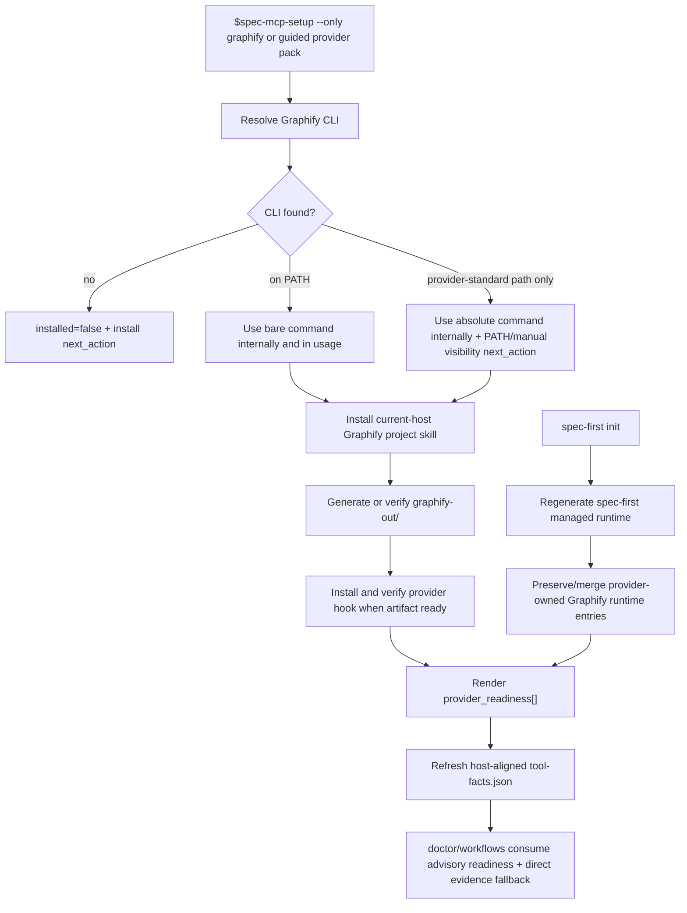
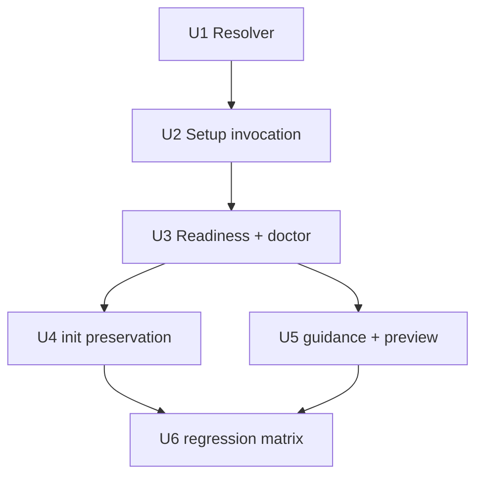

# fix: Make Graphify setup runtime-visible

## Summary

This plan fixes the gap where Runtime Setup can leave `graphify-out/graph.json` on disk while later Codex/Claude flows cannot actually invoke Graphify. The fix is to make Graphify install success a durable ladder: resolved CLI command, current-host project skill/runtime, project artifact, refresh hook, and host-aligned setup facts must all be visible after setup and after `spec-first init`.

---

## Problem Frame

The current repo demonstrates the failure mode:

- `graphify-out/graph.json` exists, and the pinned Graphify CLI exists in the provider-standard user tool location.
- Bare `graphify` is not resolvable in the current Codex shell, so AGENTS guidance that says to run `graphify query ...` fails in practice.
- `provider-readiness-renderer.cjs` can detect the user-local Graphify binary and reports `lifecycle.installed=true`, `artifact_exists=true`, and verified hooks, but `lifecycle.configured=false` because the current-host project skill is missing.
- `.spec-first/config/tool-facts.json` is host-mismatched (`host: claude`) while the current request is Codex, so `spec-first doctor --codex --json` reports `decision_input_health=missing`.
- `.codex/skills/graphify/SKILL.md` is absent and `.codex/hooks.json` currently contains only the spec-first `SessionStart` hook config. Graphify's provider install source shows Codex project install writes `.codex/skills/graphify/SKILL.md`, `AGENTS.md`, and `.codex/hooks.json`; these are provider-owned runtime writes that can be lost or made invisible when spec-first regenerates host runtime.

The root cause is not graph generation. The root cause is that setup currently treats a process-local install/init path as success, while downstream agent sessions need durable command and runtime visibility.

---

## Requirements

- R1. Define Graphify install success as a ladder, not one exit code: CLI resolved, CLI runnable by setup, CLI usable by downstream/manual calls, current-host project skill configured, project artifact present, provider refresh hook verified or honestly degraded, and setup facts aligned to the requested host.
- R2. Add one Graphify CLI resolver contract shared across Bash, PowerShell, and Node renderers. It must distinguish `found_on_path`, `found_at_provider_standard_path`, `version_matches_pin`, `resolved_command`, and `manual_visibility_action` without modifying user shell profiles.
- R3. Use the resolved command everywhere setup invokes Graphify: project skill install, first generation, code-only fallback, query probe, hook install, and hook status. Setup may continue with an absolute command path when bare `graphify` is not on `PATH`, but the final facts must still disclose that manual shell visibility is degraded.
- R4. `lifecycle.configured` must be derived from durable current-host runtime artifacts, not from `SPEC_FIRST_PROVIDER_GRAPHIFY_CONFIGURED` alone. The env flag may annotate the current run, but it must not make later `--verify-only`, `doctor`, or downstream workflow facts look configured after the files disappear.
- R5. `spec-first init` and runtime inspection must preserve or merge non-spec-first provider-owned runtime entries such as Graphify Codex `PreToolUse` hooks and project skill directories. If preservation is not possible for a host surface, readiness must mark Graphify degraded and point to `$spec-mcp-setup --only graphify` instead of reporting success.
- R6. Host setup facts must be refreshed per requested host. `doctor --codex` must not reuse Claude-scoped setup facts as valid Codex decision input, and the repair action must clearly name the setup refresh command.
- R7. AGENTS/CLAUDE Graphify instructions must stop assuming a bare command is always visible. They should direct agents to use a resolved Graphify CLI path when available, and to fall back to bounded source reads when the provider is absent, stale, unconfigured, or hidden from the current runtime.
- R8. Multi-platform parity is required: macOS/Linux Bash and Windows PowerShell must support the same resolver semantics, project skill install flow, readiness facts, and tests.
- R9. Graphify output remains advisory. This plan must not install the optional Graphify MCP server, start `graphify watch`, promote `graphify-out/` to source truth, or let provider facts replace direct source/test/log evidence.
- R10. Source changes must update `CHANGELOG.md`; generated mirrors under `.claude/`, `.codex/`, and `.agents/skills/` must not be hand-edited.

---

## Assumptions

- A1. Keep the current Graphify version pin (`graphifyy==0.8.36`) unless implementation explicitly verifies a planned version update in a separate slice.
- A2. The provider-owned Graphify project skill content should stay provider-owned. spec-first should preserve or repair it, not vendor or rewrite the provider skill as spec-first source.
- A3. The current host for this failure is Codex, but the fix must cover Claude and Windows-equivalent paths because Runtime Setup is dual-host and cross-platform.
- A4. Existing `provider-readiness.v2` fields are sufficient for the first fix if resolver detail can be represented through lifecycle status, `next_actions`, and `usage_note`. If implementation proves machine-readable command resolution is necessary, bump or extend the contract in the same unit with focused schema tests.

---

## Scope Boundaries

- Do not hand-edit `.codex/skills/graphify/`, `.codex/hooks.json`, `.claude/skills/graphify/`, or other generated/provider runtime files as the fix.
- Do not add a new provider state machine, semantic trust enum, or independent provider manifest unless existing `provider_readiness[]` cannot represent a required mechanical fact.
- Do not make Graphify a required baseline dependency; it remains an explicit optional provider selected through guided Runtime Setup or `--only graphify`.
- Do not mutate user shell startup files such as `.zshrc`, `.bashrc`, PowerShell profiles, or global PATH. Report the action; do not apply it silently.
- Do not run Graphify generation from ordinary plan/work/review/debug workflows to compensate for missing setup.

### Deferred to Follow-Up Work

- Graphify recall-quality improvements, query anchor tuning, and `graphify-out/` content quality checks. This plan only makes the provider visible and honestly reported.
- A future `spec-runtime-setup` rename/alias migration. This plan keeps the current `spec-mcp-setup` source path and compatibility entrypoint.

---

## Completion Criteria

- `command -v graphify` missing but `$HOME/.local/bin/graphify` present is handled consistently: setup can invoke the resolved command, readiness reports installed, and user/manual next actions name the visibility gap.
- `lifecycle.configured=false` when the current-host Graphify skill/runtime files are absent, even if a previous setup run exported a configured env flag.
- Re-running `spec-first init --codex` after Graphify setup does not silently erase or overwrite provider-owned Graphify runtime without readiness detecting and surfacing repair.
- `spec-first doctor --codex --json` gives a host-aligned decision input result after setup refresh; host mismatch remains `missing` with an actionable repair.
- Bash and PowerShell setup contract tests cover off-PATH Graphify, project skill install, query probe, hook verification, and provider facts persistence.
- AGENTS/CLAUDE source guidance no longer requires a bare `graphify` command as the only valid path.
- Focused tests for setup/readiness/runtime projection pass, and `CHANGELOG.md` records the user-visible runtime setup fix.

---

## Direct Evidence Readiness

- target_repo: `spec-first`
- evidence_sources: direct source reads, `rg`, `codegraph_explore`, Graphify CLI query via resolved path, current command probes, `spec-first doctor --codex --json`, `provider-readiness-renderer.cjs`, `task-governance-signals`
- source_refs:
  - `docs/10-prompt/结构化项目角色契约.md`
  - `skills/spec-mcp-setup/SKILL.md`
  - `skills/spec-mcp-setup/provider-tools.json`
  - `skills/spec-mcp-setup/scripts/install-helpers.sh`
  - `skills/spec-mcp-setup/scripts/install-helpers.ps1`
  - `skills/spec-mcp-setup/scripts/provider-readiness-renderer.cjs`
  - `skills/spec-mcp-setup/scripts/setup-plan-renderer.cjs`
  - `docs/contracts/provider-readiness.md`
  - `docs/contracts/provider-readiness.schema.json`
  - `src/cli/adapters/codex.js`
  - `src/cli/commands/init.js`
  - `src/cli/plugin.js`
  - `tests/unit/dependency-readiness-baseline.test.js`
  - `tests/unit/mcp-setup.sh`
  - `tests/unit/mcp-setup-powershell-contracts.test.js`
  - `docs/plans/2026-06-08-004-refactor-provider-native-runtime-setup-plan.md`
  - `docs/plans/2026-06-11-002-feat-project-graph-consumption-protocol-plan.md`
- current_revision: `d3d3fd3c`
- worktree_status: dirty before this plan; many existing modified/untracked files are unrelated and must not be reverted.
- confidence: high for the observed PATH/configuration failure; high for required source/runtime boundary; medium for exact host-runtime preservation patch shape until `buildInitPlan`/`applyInitPlan` tests are written.
- limitations:
  - No implementation code was changed during planning.
  - Sub-agent research was not used because the available spawn tool requires explicit user authorization for sub-agents; this plan uses direct source evidence instead.
  - Provider package source was inspected as external local evidence, not as spec-first source truth.

---

## Direct Evidence

- repo_scope: current repo, `spec-first`
- source_reads_completed:
  - `install-helpers.sh` prepends `$HOME/.local/bin`, `$HOME/.cargo/bin`, and `.spec-first/tools` to `PATH` inside the helper process, so a successful setup run can mask the fact that later shells cannot resolve `graphify`.
  - `install_graphify_cli`, `graphify_cli_version_matches_pin`, first generation, project skill install, query probe, and hook install currently invoke bare `graphify`.
  - `provider-readiness-renderer.cjs` already knows provider-standard Graphify paths and can detect a binary outside `PATH`, then emits a PATH next action.
  - `projectSkillConfigured()` treats `.codex/skills/graphify/SKILL.md`, `.agents/skills/graphify/SKILL.md`, or `.claude/skills/graphify/SKILL.md` as configured evidence.
  - `providerEntry()` stores readiness in `provider-readiness.v2`, whose schema is closed and does not currently expose command-resolution details.
  - `setup-plan-renderer.cjs` previews Graphify provider runtime writes including `.codex/skills/graphify/`, `.codex/hooks.json`, `AGENTS.md`, `.claude/skills/graphify/`, and `CLAUDE.md`.
  - Graphify provider package source shows Codex project install writes `.codex/skills/graphify/SKILL.md`, installs a `.codex/hooks.json` `PreToolUse` hook, and updates `AGENTS.md`.
  - `syncSkills()` removes and rewrites spec-first managed skill directories; runtime writers also own Codex hook config, so provider-owned runtime must be preserved or repaired explicitly.
  - `.gitignore` treats `.codex/`, `.agents/skills/`, and `.claude/skills/` as generated runtime, and `.spec-first/tools/` as local runtime tooling.
- commands_or_tools_used:
  - `command -v graphify` returned no path.
  - `$HOME/.local/bin/graphify --version` returned `graphify 0.8.36`.
  - `graphify-out/graph.json` exists.
  - Resolved Graphify CLI query via `$HOME/.local/bin/graphify query ...` worked but returned broad low-value context, so planning used direct source evidence.
  - `node skills/spec-mcp-setup/scripts/provider-readiness-renderer.cjs --source helper --repo-root .` reported `installed=true`, `configured=false`, `artifact_exists=true`, `hook_status=verified`, and a PATH next action.
  - `node bin/spec-first.js doctor --codex --json` reported `decision_input_health=missing` with `reason_code=setup-facts-host-mismatch` because tool facts are for `host: claude`.
  - `.codex/skills/graphify/SKILL.md` is missing; `.codex/hooks.json` contains only `SessionStart`.
  - `task-governance-signals` returned `candidate_level=deep` with `cli`, `contract`, `runtime`, and `workflow` risk domains.
- impact_on_plan:
  - Confirms this is a runtime visibility and ownership bug, not an artifact generation bug.
  - Confirms a resolver-only patch is insufficient unless configured runtime and host facts are also durable.
  - Confirms plan depth as Deep because the fix crosses shell scripts, PowerShell scripts, Node renderers, doctor/setup facts, dual-host runtime generation, docs, and tests.
- key_findings:
  - Existing provider readiness already detects off-PATH Graphify but does not make that enough for downstream runtime visibility.
  - Existing setup facts can be fresh in time but wrong for the current host, so host alignment is part of “installed successfully.”
  - Existing Graphify project runtime is provider-owned and must not be converted into spec-first source.
- limitations:
  - Direct evidence is bounded to Runtime Setup and host runtime surfaces; it is not a full audit of Graphify internals.

---

## Context & Research

### Relevant Code and Patterns

- `skills/spec-mcp-setup/SKILL.md` already states scripts produce setup facts and downstream workflows must use direct source evidence for semantic conclusions.
- `docs/contracts/provider-readiness.md` explicitly says provider readiness is advisory setup evidence, and that provider-standard command paths such as `~/.local/bin/graphify` may be used for detection.
- `tests/unit/dependency-readiness-baseline.test.js` already has fixtures for Graphify outside `PATH`, project skill detection, hook readiness, version pin mismatch, and install-helper execution.
- `tests/unit/mcp-setup-powershell-contracts.test.js` and `tests/unit/mcp-setup.sh` lock Bash/PowerShell parity through source-contract assertions.
- `src/cli/adapters/codex.js` owns Codex `SessionStart` hook rendering; it is the right surface for preserving or merging non-managed hook entries.
- `src/cli/helpers/setup-facts.js` already treats host mismatch as `decision_input_health=missing`, which should remain the right behavior until refreshed for the current host.

### Institutional Learnings

- `docs/plans/2026-06-08-004-refactor-provider-native-runtime-setup-plan.md` already rejected moving Graphify artifacts into spec-first-owned provider workspace paths. This plan preserves that decision and fixes the later visibility gap instead.
- `docs/plans/2026-06-11-002-feat-project-graph-consumption-protocol-plan.md` already defines Graphify as advisory project-graph evidence; this plan makes setup and runtime visibility honest enough for that consumption protocol to work.
- `docs/contracts/source-runtime-customization-boundary.md` and the role contract require source changes first and runtime regeneration through `spec-first init`, not hand edits to mirrors.

### External References

- No web research was used. The only external-provider evidence came from the locally installed Graphify package source and CLI behavior.

---

## Key Technical Decisions

- KTD1. **Resolver-first, no shell profile mutation.** Runtime Setup should resolve Graphify deterministically and use the resolved command internally, but it should not edit user shell startup files to make bare `graphify` work.
- KTD2. **Configured means durable current-host runtime.** A successful `graphify install --project --platform codex` in the same process is not enough; later readiness must verify current-host project skill and host integration from disk.
- KTD3. **Provider runtime stays provider-owned.** spec-first should preserve, merge, or repair provider-owned Graphify runtime; it should not vendor the Graphify skill into `skills/` or rewrite provider content.
- KTD4. **Host facts are part of success.** `graphify-out/` plus a user-local CLI is not enough when `tool-facts.json` is for a different host. Setup refresh must produce host-aligned decision input.
- KTD5. **Use existing `provider_readiness[]` first.** Prefer existing lifecycle bits, `next_actions`, and `usage_note`. Only extend `provider-readiness.v2` if implementation needs machine-readable command-resolution detail that cannot be safely represented today.
- KTD6. **Preserve user/provider hooks when rendering spec-first hooks.** Codex `.codex/hooks.json` should keep Graphify `PreToolUse` entries while ensuring the spec-first `SessionStart` entry is current.
- KTD7. **Docs should teach resolution and fallback, not force generation.** AGENTS/CLAUDE Graphify instructions should prefer provider-native query/path/explain when visible, but fallback to direct source reads when not.

---

## Open Questions

### Resolved During Planning

- Should this plan update the older project-graph consumption plan in place? No. That plan is about consumption protocol; this one is about install/runtime visibility and setup facts.
- Is `graphify-out/graph.json` existence sufficient? No. It proves artifact presence, not command visibility or current-host skill runtime.
- Should setup fix PATH by editing shell profiles? No. That is a global side effect and outside Runtime Setup's project-scoped boundary.

### Deferred to Implementation

- Whether to add a machine-readable command-resolution field to `provider-readiness.v2` or keep the first patch on existing fields. Decide after implementing the resolver tests.
- Exact merge behavior for `.codex/hooks.json` when the file contains malformed JSON or conflicting non-managed entries.
- Whether Claude project settings need new preservation tests beyond existing `claude-settings` custom-entry coverage.

---

## High-Level Technical Design

> *This illustrates the intended approach and is directional guidance for review, not implementation specification. The implementing agent should treat it as context, not code to reproduce.*

The two important branches are command visibility and runtime ownership. Setup can use an absolute command path to finish first generation, but readiness and docs must still disclose that later bare shell calls need a resolved path or PATH repair.

---

## Implementation Units

### U1. Add a Cross-Platform Graphify CLI Resolver

**Goal:** Provide one mechanical resolution model for Graphify across Bash, PowerShell, and Node readiness rendering.

**Requirements:** R1, R2, R3, R8

**Dependencies:** None

**Files:**
- Modify: `skills/spec-mcp-setup/scripts/install-helpers.sh`
- Modify: `skills/spec-mcp-setup/scripts/install-helpers.ps1`
- Modify: `skills/spec-mcp-setup/scripts/provider-readiness-renderer.cjs`
- Test: `tests/unit/dependency-readiness-baseline.test.js`
- Test: `tests/unit/mcp-setup.sh`
- Test: `tests/unit/mcp-setup-powershell-contracts.test.js`

**Approach:**
- Centralize command resolution around ordered candidates: current `PATH`, provider-standard user tool paths, and platform-specific executable suffixes.
- Return a structured local result inside each runtime: command string/path, on-path boolean, executable boolean, version output, version-pin match, and manual visibility action.
- Keep implementation shell-safe: quote resolved paths, avoid string-concatenated command execution where array invocation is available, and handle spaces in user directories.
- Do not edit user shell profiles or create global symlinks.

**Patterns to follow:**
- `provider-readiness-renderer.cjs` already has `resolveCommand()` and `knownCommandCandidates()`.
- `install-helpers.ps1` already computes `$homeLocalBin` and prepends process-local PATH.

**Test scenarios:**
- Happy path: fake `graphify` on `PATH` with `graphify 0.8.36` -> resolver returns on-path and version match.
- Edge case: fake `graphify` only under a user-local provider-standard path with empty `PATH` -> resolver returns found but off-path, and setup still invokes it successfully.
- Error path: fake `graphify` returns `0.8.35` -> readiness degrades with the existing pinned-version repair action.
- Integration: Bash, PowerShell, and Node fixtures agree on the same off-path visibility semantics.

**Verification:**
- Focused setup tests prove off-path Graphify no longer blocks setup-internal first generation, while readiness still reports the downstream visibility gap.

---

### U2. Use Resolved Graphify Commands Through Setup

**Goal:** Remove bare-command assumptions from Graphify project skill install, first generation, query probe, and hook operations.

**Requirements:** R1, R3, R8, R9

**Dependencies:** U1

**Files:**
- Modify: `skills/spec-mcp-setup/scripts/install-helpers.sh`
- Modify: `skills/spec-mcp-setup/scripts/install-helpers.ps1`
- Modify: `skills/spec-mcp-setup/SKILL.md`
- Modify: `skills/spec-mcp-setup/provider-tools.json`
- Test: `tests/unit/dependency-readiness-baseline.test.js`
- Test: `tests/unit/mcp-setup.sh`
- Test: `tests/unit/mcp-setup-powershell-contracts.test.js`

**Approach:**
- Pass the resolved command into every Graphify operation instead of re-running bare `graphify`.
- Keep first generation behavior unchanged semantically: `extract .` first, `update .` code-only fallback for default project-root scope, query probe when artifact exists, hook install/status when first generation is ready.
- Ensure setup logs and facts distinguish “CLI install failed” from “CLI installed but hidden from current shell.”
- Keep provider outputs advisory; query probe remains a liveness check only.

**Patterns to follow:**
- Existing `run_with_timeout` and `Invoke-HelperCommand` timeout wrappers.
- Existing `graphify-code-only-fallback-used` first-generation next action.

**Test scenarios:**
- Happy path: off-path Graphify fake captures `install --project --platform codex`, `extract`, `query`, `hook install`, and `hook status` invocations by absolute command path.
- Edge case: `extract` fails but `update .` succeeds -> `first_generation.status=completed` and fallback next action is preserved.
- Error path: resolved CLI missing -> setup skips project skill/first generation and emits `graphify-cli-install-failed` without pretending configured.
- Integration: `--requirement-workspace` escaping still skips first generation and does not run hook install.

**Verification:**
- Setup output proves Graphify operations no longer depend on a parent shell PATH mutation.

---

### U3. Tighten Provider Readiness And Doctor Semantics

**Goal:** Make `provider_readiness[]` and `doctor` report durable Graphify usability instead of process-local success.

**Requirements:** R1, R4, R6, R9

**Dependencies:** U1, U2

**Files:**
- Modify: `skills/spec-mcp-setup/scripts/provider-readiness-renderer.cjs`
- Modify: `skills/spec-mcp-setup/scripts/write-setup-facts.sh`
- Modify: `skills/spec-mcp-setup/scripts/write-setup-facts.ps1`
- Modify: `src/cli/helpers/setup-facts.js`
- Modify: `src/cli/commands/doctor.js` if wording needs a better repair hint
- Modify: `docs/contracts/provider-readiness.md`
- Modify: `docs/contracts/provider-readiness.schema.json` only if command-resolution detail must become machine-readable
- Test: `tests/unit/dependency-readiness-baseline.test.js`
- Test: `tests/unit/mcp-setup.sh`
- Test: `tests/unit/mcp-setup-powershell-contracts.test.js`

**Approach:**
- Compute `configured` from current-host durable artifacts: project skill path, host instruction integration, and host hook/runtime status where applicable.
- Remove env-only configured truth. If the current install run says project skill install succeeded, use that only when the corresponding file exists at render time.
- Preserve host-mismatch behavior as missing decision input, but improve repair copy so the user knows to refresh setup facts for Codex/Claude specifically.
- Decide during implementation whether off-path-but-resolved Graphify should remain `readiness_status=unknown` with next action or become `degraded`; document the chosen semantics in `provider-readiness.md`.

**Patterns to follow:**
- `setup-facts.js` already emits `setup-facts-host-mismatch`.
- `provider-readiness.md` already distinguishes lifecycle display bits from decision health.

**Test scenarios:**
- Happy path: current-host Graphify skill exists, artifact exists, hook verified -> configured true, initialized/indexed true.
- Edge case: env configured flag true but skill file missing -> configured false and repair action names `$spec-mcp-setup --only graphify`.
- Error path: tool facts host `claude` with requested Codex -> `decision_input_health=missing` and basis remains `setup-facts-host-mismatch`.
- Integration: refreshed Codex tool facts with Graphify provider readiness are consumed by doctor without host mismatch.

**Verification:**
- `doctor --codex --json` can no longer imply Graphify is ready from stale or wrong-host setup facts.

---

### U4. Preserve Provider-Owned Runtime Across `spec-first init`

**Goal:** Prevent spec-first runtime regeneration from silently removing Graphify's provider-owned Codex/Claude runtime surfaces, or detect and repair when preservation is not possible.

**Requirements:** R4, R5, R6, R9, R10

**Dependencies:** U3

**Files:**
- Modify: `src/cli/adapters/codex.js`
- Inspect/modify if needed: `src/cli/claude-settings.js`
- Inspect/modify if needed: `src/cli/plugin.js`
- Inspect/modify if needed: `src/cli/commands/init.js`
- Test: `tests/unit/runtime-plan-contracts.test.js`
- Test: `tests/unit/runtime-untrack.test.js` if cleanup/untrack behavior changes
- Test: `tests/unit/dependency-readiness-baseline.test.js`

**Approach:**
- Treat Graphify project skill/hook files as provider-owned runtime, not spec-first managed runtime.
- When rendering `.codex/hooks.json`, merge the spec-first `SessionStart` hook with existing non-managed hook entries instead of replacing the whole file.
- Add a regression fixture where `.codex/hooks.json` contains a Graphify `PreToolUse` hook and `build/apply init` leaves it intact while updating `SessionStart`.
- Confirm `.codex/skills/graphify/` and `.claude/skills/graphify/` are not deleted by managed skill sync; add tests if current behavior is ambiguous.
- If a host surface cannot be preserved safely, ensure readiness says unconfigured/degraded after init and gives the setup repair command.

**Patterns to follow:**
- `claude-settings.js` has tests for preserving custom entries while removing managed matchers.
- Runtime untrack tests already preserve worktree files while untracking generated runtime paths.

**Test scenarios:**
- Happy path: existing Graphify Codex hook plus spec-first SessionStart -> init output contains both.
- Edge case: malformed `.codex/hooks.json` -> implementation either preserves by backup/degraded repair or rewrites only with an explicit warning path; no silent success.
- Error path: Graphify skill directory missing after init -> provider readiness configured false.
- Integration: `spec-first init --codex` followed by provider readiness render still reports Graphify configured when provider files existed beforehand.

**Verification:**
- Runtime regeneration does not erase provider-owned Graphify runtime without a visible degraded state.

---

### U5. Update User-Facing Guidance And Setup Preview

**Goal:** Make the visible instructions match the new success ladder and stop telling agents to assume bare `graphify` is available.

**Requirements:** R1, R5, R7, R9, R10

**Dependencies:** U1-U4

**Files:**
- Modify: `AGENTS.md`
- Modify: `CLAUDE.md`
- Modify: `skills/spec-mcp-setup/SKILL.md`
- Modify: `skills/spec-mcp-setup/scripts/setup-plan-renderer.cjs`
- Modify: `README.md`
- Modify: `README.zh-CN.md`
- Modify: `docs/contracts/provider-readiness.md`
- Test: `tests/unit/dependency-readiness-baseline.test.js`
- Test: `tests/unit/sync-instruction-files.test.js` if managed instruction blocks are affected

**Approach:**
- Replace bare-command-only Graphify guidance with a resolution chain: use provider-native CLI query/path/explain when a resolved command is visible; if only a provider-standard path is available, use that path; if no usable command or current-host skill exists, fall back to bounded source reads.
- Keep Graphify output advisory and require source confirmation for conclusions.
- Update setup preview to disclose command visibility and provider runtime writes separately.
- Preserve the source/runtime boundary: source docs change first; runtime mirrors refresh through `spec-first init` only when implementation reaches that step.

**Patterns to follow:**
- Existing README Runtime Setup section already describes setup modes and provider readiness facts.
- Existing Graphify guidance in AGENTS/CLAUDE already contains the project-graph usage surface; revise, do not duplicate.

**Test scenarios:**
- Happy path: setup preview names Graphify CLI install, project skill install, artifact generation, hook setup, and command visibility state.
- Edge case: instruction source no longer says bare `graphify update .` must run after every code modification from ordinary workflows.
- Error path: provider absent guidance points to setup repair and direct-source fallback, not workflow-time generation.

**Verification:**
- User-facing docs explain why `graphify-out/graph.json` can exist while the provider is still not runtime-visible.

---

### U6. Add End-to-End Fixture Coverage For Multi-Platform Visibility

**Goal:** Lock the failure mode with tests so future setup changes cannot regress into “artifact exists, runtime hidden.”

**Requirements:** R1-R10

**Dependencies:** U1-U5

**Files:**
- Modify: `tests/unit/dependency-readiness-baseline.test.js`
- Modify: `tests/unit/mcp-setup.sh`
- Modify: `tests/unit/mcp-setup-powershell-contracts.test.js`
- Modify: `tests/unit/runtime-plan-contracts.test.js`
- Add focused fixtures under existing test helpers only if needed

**Approach:**
- Add a fixture with Graphify installed only in a provider-standard user-local path, no bare PATH visibility, existing `graphify-out/graph.json`, and missing project skill. Expected result: installed true, configured false, artifact true, explicit visibility/repair next actions.
- Add a fixture where setup runs with off-PATH Graphify and produces project skill, artifact, query probe, hook status, and host-aligned facts.
- Add runtime regeneration fixture preserving Graphify hook entries.
- Mirror key contract assertions in PowerShell tests without requiring Windows-only execution in every local environment.

**Patterns to follow:**
- Existing fake Graphify shell fixtures in `dependency-readiness-baseline.test.js`.
- Existing PowerShell contract tests that assert script content and JSON output shape.

**Test scenarios:**
- Happy path: full Graphify setup from off-PATH resolved binary -> provider readiness configured true and manual visibility action retained when applicable.
- Edge case: artifact exists but skill missing -> configured false, proving graph artifact alone is insufficient.
- Edge case: wrong-host setup facts -> doctor decision input missing until refreshed.
- Error path: malformed/overwritten hooks -> readiness degraded with repair action.
- Integration: Bash and PowerShell scripts both contain resolver usage for install, first generation, query probe, and hook status.

**Verification:**
- The focused test suite fails on the current observed bug and passes only when runtime visibility, host facts, and provider-owned runtime preservation are fixed.

---

## System-Wide Impact

- **Runtime Setup:** Moves Graphify from “best-effort install happened” to “durable provider visibility is reported honestly.”
- **Doctor / decision input:** Keeps host-mismatch strictness and makes repair guidance more useful.
- **Host runtime generation:** Requires Codex hook merging/preservation discipline so spec-first does not clobber provider hooks.
- **Workflow consumption:** Makes project-graph guidance usable without depending on the user's shell PATH.
- **Source/runtime boundary:** Reinforces that `.codex/`, `.claude/`, and `.agents/skills/` are runtime mirrors/provider output, not source patches.

---

## Risks & Dependencies

| Risk | Mitigation |
|------|------------|
| Hook merging accidentally preserves unsafe or malformed entries | Preserve only syntactically valid non-managed entries; malformed files should produce degraded repair guidance or backup behavior, not silent success. |
| Adding machine-readable resolver fields bloats `provider-readiness.v2` | First try existing lifecycle/next_actions/usage_note; only extend schema with focused tests if strings are insufficient for consumers. |
| PowerShell parity drifts behind Bash | Keep PowerShell contract assertions for every Bash Graphify resolver/invocation behavior. |
| Provider-owned runtime under ignored directories is mistaken for source | Document provider ownership and test source/runtime boundaries; do not vendor provider skill files. |
| Users expect bare `graphify` after setup | Report the exact visibility action and update AGENTS/CLAUDE guidance to use resolved command fallback instead of pretending PATH was changed. |

---

## Alternative Approaches Considered

- **Edit user shell profiles to add `~/.local/bin`:** Rejected. It is a global mutation, platform-specific, and outside Runtime Setup's project-scoped boundary.
- **Only improve provider-readiness next_action strings:** Rejected as incomplete. It explains the CLI gap but does not fix setup's own bare-command assumptions or provider skill/runtime loss.
- **Vendor the Graphify skill into spec-first source:** Rejected. Graphify skill content is provider-owned and can change independently; vendoring would create a second truth source.
- **Create a new provider manifest/state machine:** Rejected for v1. Existing `provider_readiness[]` plus host setup facts should be exhausted first.

---

## Documentation / Operational Notes

- Update README/README.zh-CN only for user-visible Runtime Setup behavior, not for Graphify internals.
- Keep `CHANGELOG.md` as the release-visible summary.
- Runtime mirrors should be regenerated with `spec-first init` only during implementation verification, never patched directly.
- Fresh-source eval is required if implementation changes skill/agent prose that affects routing or runtime behavior; if the host cannot run it, closeout must record the exact reason.

---

## Sources & References

- Role contract: `docs/10-prompt/结构化项目角色契约.md`
- Runtime setup source: `skills/spec-mcp-setup/SKILL.md`
- Provider registry: `skills/spec-mcp-setup/provider-tools.json`
- Bash helper: `skills/spec-mcp-setup/scripts/install-helpers.sh`
- PowerShell helper: `skills/spec-mcp-setup/scripts/install-helpers.ps1`
- Readiness renderer: `skills/spec-mcp-setup/scripts/provider-readiness-renderer.cjs`
- Setup preview renderer: `skills/spec-mcp-setup/scripts/setup-plan-renderer.cjs`
- Provider readiness contract: `docs/contracts/provider-readiness.md`
- Provider readiness schema: `docs/contracts/provider-readiness.schema.json`
- Codex runtime adapter: `src/cli/adapters/codex.js`
- Init/runtime sync logic: `src/cli/plugin.js`, `src/cli/commands/init.js`
- Current provider-native setup plan: `docs/plans/2026-06-08-004-refactor-provider-native-runtime-setup-plan.md`
- Current project-graph consumption plan: `docs/plans/2026-06-11-002-feat-project-graph-consumption-protocol-plan.md`
