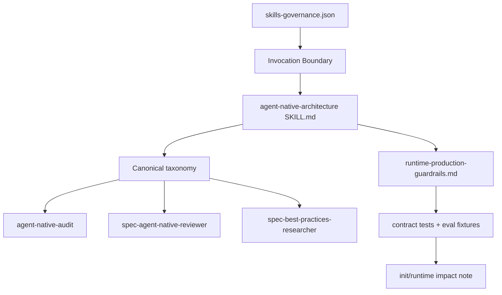
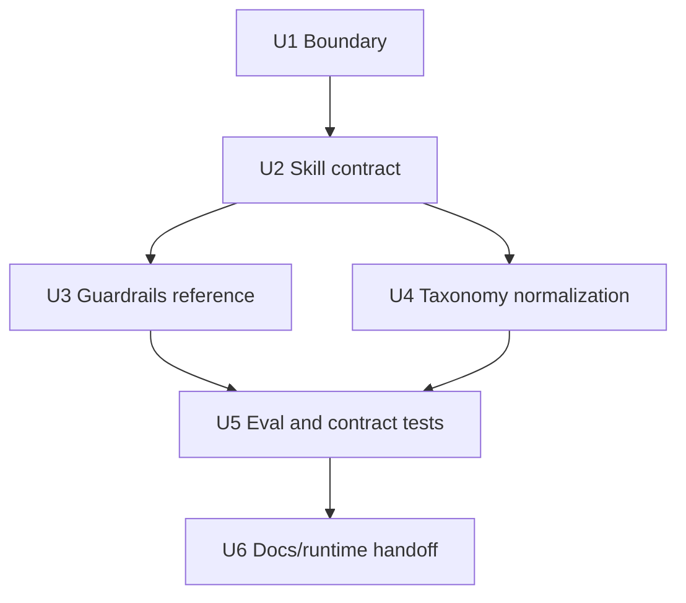

# refactor: Harden agent-native architecture skill governance

## Summary

This plan turns `agent-native-architecture` from a useful but loosely governed architecture guide into a bounded, source-first, eval-ready internal capability. The work aligns entry-surface governance, adds a lightweight skill contract, centralizes production guardrails, normalizes taxonomy across adjacent assets, and upgrades static tests/evals so future prose changes are reviewable.

---

## Decision Brief

- **Recommended approach:** Keep `agent-native-architecture` and `agent-native-audit` internal for this change, and make that boundary explicit in source prose and tests. Public exposure, if desired later, should be a separate governance decision.
- **Key decisions:** Add contract sections without turning the skill into a heavyweight workflow; add one production guardrails reference instead of scattering more local warnings; make `agent-native-architecture` the canonical taxonomy source for audit/reviewer/researcher assets.
- **Validation focus:** Static contract tests, eval fixture coverage, fresh-source eval for skill/agent prose, and source/runtime impact disclosure after implementation.
- **Largest risks / boundaries:** The main risk is overfitting to current providers or social-media discourse. External findings are used only as provider-neutral design pressure, not as spec-first contract fields.

---

## Problem Frame

The current skill has strong core ideas: action parity, primitive tools, prompt-native features, shared workspace, and improvement over time. The weakness is governance shape. `src/cli/contracts/dual-host-governance/skills-governance.json` marks `agent-native-architecture` and `agent-native-audit` as `internal_only`, while `skills/agent-native-architecture/SKILL.md` reads like a user-facing public skill and `skills/agent-native-audit/SKILL.md` tells the agent to invoke a nonexistent `/agent-native-architecture` command.

That mismatch creates three practical problems:

- Agents can infer an entrypoint that does not exist.
- Reviewers must reconcile three partially overlapping taxonomies across the skill, audit helper, and reviewer agent.
- Production concerns such as sandboxing, approval, rollback, secrets, tracing, and evaluation are present but scattered, so they are easy to miss at the skill entrypoint.

---

## Requirements

- R1. Align `agent-native-architecture` and `agent-native-audit` with the dual-host governance truth source: no implied public slash or `$spec-*` command unless governance explicitly exposes one.
- R2. Add standard lightweight skill contract sections: Purpose, Invocation Boundary, When To Use, When Not To Use, Inputs, Outputs, Workflow, Failure Modes, and Runtime/Source Boundary.
- R3. Preserve the current agent-native principles while making production guardrails first-class: sandbox/workspace boundaries, approvals, secrets, audit logs/tracing, rollback/checkpoints, eval gates, and human-in-the-loop escalation.
- R4. Establish a canonical taxonomy consumed by `agent-native-audit`, `spec-agent-native-reviewer`, and `spec-best-practices-researcher` without duplicating divergent principle lists.
- R5. Add eval/readiness coverage that tests trigger boundaries, expected artifacts, failure modes, guardrail routing, and adjacent-asset taxonomy drift.
- R6. Use latest external GitHub/official docs as advisory pressure only; do not bake provider-specific SDK fields into spec-first contracts.
- R7. Keep implementation source-first: no manual edits to `.claude/`, `.codex/`, or `.agents/skills/`; implementation closeout must state whether `spec-first init` is needed.

---

## Scope Boundaries

- This plan does not promote `agent-native-architecture` to a public workflow command.
- This plan does not redesign all spec-first agent-native capability discovery or add a new CLI command.
- This plan does not rewrite every reference file. It adds or moves only the minimum prose needed to make guardrails and boundaries discoverable.
- This plan does not rely on X/Twitter-specific claims. Direct X/Twitter fetch was blocked by robots.txt, so no social-media fact is used as evidence.

### Deferred to Follow-Up Work

- Public standalone exposure for agent-native architecture guidance: requires a separate governance decision, naming decision, and host delivery plan.
- Full model-graded benchmark for this skill: can follow after static eval fixtures define the intended boundaries.
- Broader runtime capability catalog or doctor freshness improvements: useful but outside this targeted skill-governance change.

---

## Direct Evidence

- **target_repo:** `.`
- **source_refs:** `skills/agent-native-architecture/SKILL.md`, `skills/agent-native-audit/SKILL.md`, `agents/spec-agent-native-reviewer.agent.md`, `agents/spec-best-practices-researcher.agent.md`, `src/cli/contracts/dual-host-governance/skills-governance.json`, `tests/unit/agent-native-architecture-contracts.test.js`, `docs/项目审查/2026-06-12-agent-native-architecture-audit-report.md`, `docs/10-prompt/结构化项目角色契约.md`, `skills/spec-plan/SKILL.md`, `skills/spec-plan/references/governance-boundaries.md`, `skills/spec-plan/references/plan-sections.md`, `skills/spec-plan/references/markdown-rendering.md`, `skills/spec-plan/references/plan-template.md`, `skills/spec-plan/references/visual-communication.md`
- **current_revision:** `ee76a7ec`
- **worktree_dirty:** `true`; many existing modified/untracked files are unrelated or pre-existing, including `CHANGELOG.md`, `skills/spec-plan/SKILL.md`, `skills/spec-skill-audit/SKILL.md`, and `docs/项目审查/2026-06-12-agent-native-architecture-audit-report.md`. Planned target `skills/spec-code-review/SKILL.md` is also already dirty; implementation must inspect `git diff -- skills/spec-code-review/SKILL.md` and reread the file immediately before any U4 edit.
- **discovery_methods:** bounded source reads, `rg`, `rg --files`, git status/revision, Graphify query via fallback CLI discovery, `spec-first internal task-governance-signals`, official/GitHub fetches
- **tests_or_logs:** `task-governance-signals` returned `candidate_level: deep` with `cross-module`, `many-files-or-paths`, `critical-path-hit`, `keyword-hit`, and risk domains `cli`, `contract`, `runtime`, `workflow`; no implementation tests were run because this is planning-only
- **confidence:** high for local source/governance/test gaps; medium for external trend synthesis because X/Twitter direct fetch was blocked and external docs are advisory
- **limitations:** Graphify result was weak exploration-tier evidence; X/Twitter pages could not be fetched due robots.txt; Anthropic article fetch was not reliable in this run, so it is not used as a confirmed source in this plan

---

## Context & Research

### Relevant Code and Patterns

- `skills/agent-native-architecture/SKILL.md` contains strong core principles and routing, but lacks explicit skill contract sections and internal/public boundary language.
- `skills/agent-native-audit/SKILL.md` already says it is an internal helper, but Step 1 still references `/agent-native-architecture` and says option 1 loads action parity even though option 1 in the architecture skill is design architecture.
- `agents/spec-agent-native-reviewer.agent.md` has a practical review taxonomy, including valid exceptions for human-only/security/platform flows, but it is not declared as derived from the architecture skill.
- `agents/spec-best-practices-researcher.agent.md` maps AI/Agents to `spec-agent-native-architecture`, which does not match the actual skill name.
- `tests/unit/agent-native-architecture-contracts.test.js` currently protects identity, some route/reference text, dated provider IDs, and one audit prompt drift check. It does not test invocation boundary, failure modes, guardrails, or eval fixture readiness.
- `src/cli/contracts/dual-host-governance/skills-governance.json` records both target skills as `internal_only`, with `host_delivery` set to `internal` for Claude and Codex.

### Institutional Learnings

- `docs/solutions/architecture-patterns/workflow-entrypoint-exposure-contract-2026-04-26.md`: entry exposure belongs in governance and host adapters, not scattered prose.
- `docs/solutions/workflow-issues/modify-source-not-artifacts-2026-04-13.md`: source changes must land in `skills/`, `agents/`, `templates/`, `src/cli/`, or docs source, then runtime mirrors are regenerated.
- `docs/solutions/architecture-patterns/rebar-structure-skill-simplification-pattern-2026-06-04.md`: skill improvement should find load-bearing axes and contract tests, not keep adding unstructured reference sprawl.
- `docs/solutions/architecture-patterns/competitor-skill-borrowing-judgment-2026-06-01.md`: borrow discipline, not shape; use 80/20 filtering and fresh-source eval.
- `docs/solutions/workflow-issues/routing-skill-eval-methodology-2026-06-08.md`: evals for routing/guidance skills must isolate strategy value and include hard boundary cases.

### External References

- OpenAI Agents SDK docs and GitHub release `v0.17.5` published 2026-06-11 emphasize few primitives, agent loops, handoffs, guardrails, sessions, sandbox agents, human-in-the-loop, and tracing.
- MCP latest stable release `2025-11-25` and tools spec emphasize model-controlled discovery, valid `inputSchema`, optional `outputSchema`, structured results, annotations, and execution metadata.
- GitHub Copilot coding agent docs emphasize deterministic setup, least-privilege setup permissions, secrets/variables, and firewall limits for cloud agent environments.
- LangGraph latest GitHub release `langgraph-cli==0.4.29` published 2026-06-11 is advisory evidence that durable agent runtimes keep evolving around execution infrastructure, not just prompt text.

---

## Key Technical Decisions

- KTD1. **Keep internal-only as the default decision.** The current governance catalog is the source of truth. The implementation should make `SKILL.md` and helper prose conform to it instead of silently creating a public entrypoint.
- KTD2. **Treat the skill as an architecture method, not a workflow state machine.** Add contract sections and failure modes, but keep semantic judgment with the LLM.
- KTD3. **Create one production guardrails reference.** Centralize production-readiness checks in a new reference and link it from entry routing, checklists, testing, product, and self-modification where needed.
- KTD4. **Use canonical taxonomy with local adapters.** The architecture skill owns core principles; the audit helper and reviewer agent may adapt names for their jobs but must state the mapping.
- KTD5. **Static tests first, fresh-source eval second.** Contract tests should mechanically prevent known drift; fresh-source eval should assess whether the prose actually routes and explains correctly.
- KTD6. **Provider-neutral external absorption.** OpenAI, MCP, GitHub, LangGraph, and other sources should become generic checks such as guardrails, tracing, sessions, sandbox, schema, firewall, and HITL, not provider-shaped dependencies.

---

## High-Level Technical Design

> *This illustrates the intended approach and is directional guidance for review, not implementation specification. The implementing agent should treat it as context, not code to reproduce.*

The dependency flow is intentionally source-first: governance establishes exposure, the skill explains how it is consumed, references carry reusable checks, adjacent assets map to the same taxonomy, and tests/evals protect the contract.

---

## Implementation Units

### U1. Fix invocation and governance boundary

**Goal:** Make the target skills' entry surfaces match `skills-governance.json` and remove nonexistent command references.

**Requirements:** R1, R7

**Dependencies:** None

**Files:**
- Modify: `skills/agent-native-architecture/SKILL.md`
- Modify: `skills/agent-native-audit/SKILL.md`
- Modify: `tests/unit/agent-native-architecture-contracts.test.js`
- Inspect: `src/cli/contracts/dual-host-governance/skills-governance.json`

**Approach:**
- Add clear language that `agent-native-architecture` is currently an internal architecture reference/helper, not a public `$spec-*` or `/spec:*` workflow.
- Replace `/agent-native-architecture` in `agent-native-audit` with an instruction to read `skills/agent-native-architecture/SKILL.md` and the relevant references as source context.
- Fix the audit helper's option mismatch: action parity is option 8 in the current architecture skill, not option 1.
- Add tests that assert both skills remain `internal_only`, do not mention nonexistent public commands, and keep the audit option mapping accurate.

**Patterns to follow:**
- `docs/solutions/architecture-patterns/workflow-entrypoint-exposure-contract-2026-04-26.md`
- `docs/solutions/workflow-issues/host-entrypoint-mapping-source-boundary-2026-04-29.md`

**Test scenarios:**
- Happy path: governance says `internal_only`; skill prose contains explicit internal/helper boundary and no public command invocation.
- Error path: audit helper contains `/agent-native-architecture` or says option 1 is action parity; contract test fails.
- Integration: architecture skill, audit helper, and governance catalog remain consistent after Codex/Claude adapter transform tests.

**Verification:**
- Static tests prove entry-surface alignment and the absence of nonexistent command references.

---

### U2. Add lightweight workflow contract sections to the architecture skill

**Goal:** Make the skill scannable and safe to consume by adding standard contract sections without bloating the core method.

**Requirements:** R2, R3

**Dependencies:** U1

**Files:**
- Modify: `skills/agent-native-architecture/SKILL.md`
- Modify: `tests/unit/agent-native-architecture-contracts.test.js`

**Approach:**
- Add compact sections for Purpose, Invocation Boundary, When To Use, When Not To Use, Inputs, Outputs, Workflow, Failure Modes, and Runtime/Source Boundary.
- Keep existing core principles, intake routing, quick start, and reference index, but make the intake boundary explicit: if a consuming workflow already has a bounded task, it may select the relevant reference directly instead of asking the user the 13-option menu.
- Add failure modes for missing context, unsafe write authority, provider-specific overfitting, eval absence, and generated runtime confusion.

**Patterns to follow:**
- `skills/spec-plan/SKILL.md` Workflow Contract Summary shape, but smaller.
- `docs/10-prompt/结构化项目角色契约.md` for source/runtime and scripts/LLM boundaries.

**Test scenarios:**
- Happy path: required contract headings are present and concise enough to keep `SKILL.md` as a spine, not a reference dump.
- Edge case: skill still preserves the five core principles and all 13 route options.
- Error path: generated runtime mirrors are mentioned as source-of-truth or direct edit targets; test fails.

**Verification:**
- Contract tests enforce the presence of boundary sections and preservation of current core principles.

---

### U3. Add production guardrails reference and wire it into existing references

**Goal:** Make production safety and operability a first-class agent-native architecture checklist.

**Requirements:** R3, R6

**Dependencies:** U2

**Files:**
- Create: `skills/agent-native-architecture/references/runtime-production-guardrails.md`
- Modify: `skills/agent-native-architecture/SKILL.md`
- Modify: `skills/agent-native-architecture/references/checklists.md`
- Modify: `skills/agent-native-architecture/references/mcp-tool-design.md`
- Modify: `skills/agent-native-architecture/references/agent-native-testing.md`
- Modify: `skills/agent-native-architecture/references/product-implications.md`
- Modify: `skills/agent-native-architecture/references/self-modification.md`
- Modify: `tests/unit/agent-native-architecture-contracts.test.js`

**Approach:**
- Define a provider-neutral guardrails checklist: sandbox/workspace authority, least privilege, secret redaction, network/firewall posture, approval by stakes/reversibility, audit/tracing, checkpoints/rollback, completion semantics, HITL escalation, and eval gates.
- Link the reference from the architecture skill's production-related routes and from `checklists.md`.
- Keep provider-specific examples in Sources/References or notes only. Do not add OpenAI/MCP/GitHub-specific schemas to spec-first contracts.
- Ensure existing product/self-modification guidance points to the new reference instead of duplicating long safety text.

**Patterns to follow:**
- `skills/agent-native-architecture/references/product-implications.md` approval matrix.
- `skills/agent-native-architecture/references/self-modification.md` approval/checkpoint/build/health-check ideas.
- MCP tools spec for structured tool result and schema pressure.
- GitHub Copilot cloud agent docs for setup/firewall/secrets pressure.

**Test scenarios:**
- Happy path: new guardrails reference exists and is linked from the main skill and checklist.
- Edge case: guardrails reference distinguishes explicit user-requested actions from unsolicited agent autonomy.
- Error path: guardrails prose claims a provider firewall/sandbox is comprehensive security; test or eval fixture flags the overclaim.
- Integration: testing reference includes at least one guardrail-oriented scenario category, not just parity/outcome tests.

**Verification:**
- Contract tests prove guardrails are discoverable from the entry skill and not stranded in a single reference.

---

### U4. Normalize taxonomy across audit helper, reviewer agent, and researcher mapping

**Goal:** Stop principle drift by declaring a canonical source and explicit adapters for each consuming asset.

**Requirements:** R4

**Dependencies:** U2

**Files:**
- Modify: `skills/agent-native-architecture/SKILL.md`
- Modify: `skills/agent-native-audit/SKILL.md`
- Modify: `agents/spec-agent-native-reviewer.agent.md`
- Modify: `agents/spec-best-practices-researcher.agent.md`
- Modify: `skills/spec-code-review/SKILL.md`
- Modify: `skills/spec-code-review/references/persona-catalog.md`
- Modify: `tests/unit/agent-native-architecture-contracts.test.js`

**Approach:**
- Declare `agent-native-architecture` as the canonical taxonomy source for parity, primitives, shared workspace, context injection, prompt-native features, production guardrails, and eval readiness.
- Keep `spec-agent-native-reviewer` focused on code-review findings, but add a short mapping explaining how review categories derive from the canonical taxonomy and which exceptions stay reviewer-specific.
- Fix `spec-best-practices-researcher` mapping from `spec-agent-native-architecture` to the actual source asset name, while avoiding any implication that it is a public route.
- Keep code-review persona catalog references stable, only adjusting wording where it misstates the canonical taxonomy.
- Before editing `skills/spec-code-review/SKILL.md`, inspect its existing diff and preserve unrelated changes. If `skills/spec-code-review/references/persona-catalog.md` is sufficient to express the mapping, leave `skills/spec-code-review/SKILL.md` untouched.

**Patterns to follow:**
- `agents/spec-agent-native-reviewer.agent.md` exception list for human-only/security/platform flows.
- `docs/solutions/architecture-patterns/rebar-structure-skill-simplification-pattern-2026-06-04.md` for one canonical spine plus consumer-specific adapters.

**Test scenarios:**
- Happy path: researcher references the actual skill name and calls it a curated/internal source, not a public command.
- Edge case: reviewer-specific exceptions remain intact while taxonomy mapping is added.
- Error path: audit helper, reviewer, or researcher introduces a new top-level principle list without mapping to canonical taxonomy; drift test fails.

**Verification:**
- Tests assert exact critical mappings and absence of the stale `spec-agent-native-architecture` name.

---

### U5. Add eval/readiness fixtures and strengthen contract tests

**Goal:** Move beyond text-anchor tests to boundary and behavior-readiness checks.

**Requirements:** R5, R6

**Dependencies:** U3, U4

**Files:**
- Create: `skills/agent-native-architecture/evals/examples.json`
- Create: `tests/unit/agent-native-architecture-eval-readiness.test.js`
- Modify: `tests/unit/agent-native-architecture-contracts.test.js`
- Inspect: `docs/contracts/workflows/fresh-source-eval-checklist.md`

**Approach:**
- Add eval examples for internal-only invocation, public-route refusal/redirect, production guardrail routing, action parity audit mapping, provider-neutral external absorption, and generated-runtime boundary.
- Use static unit tests to verify eval fixture schema and coverage tags before any model-graded benchmark exists.
- Add tests that fail on known drift classes: nonexistent slash command, option mismatch, missing Failure Modes, missing guardrails link, stale researcher skill name, and missing runtime/source boundary.
- Plan for a fresh-source eval after implementation: a clean reviewer reads current disk source and checks whether the new contract actually guides correct decisions.

**Patterns to follow:**
- `docs/solutions/workflow-issues/routing-skill-eval-methodology-2026-06-08.md`
- `docs/contracts/workflows/fresh-source-eval-checklist.md`

**Test scenarios:**
- Happy path: eval fixture contains cases for trigger boundary, guardrail selection, expected outputs, failure modes, and forbidden provider-specific overfitting.
- Edge case: a case asks for Twitter/X latest claims; expected behavior is to state fetch limitations and avoid unsupported claims.
- Error path: fixture omits boundary or failure-mode categories; readiness test fails.
- Integration: contract tests and eval-readiness tests together cover skill, audit helper, reviewer agent, researcher agent, and governance catalog.

**Verification:**
- New and existing unit tests cover source contract readiness; fresh-source eval is recorded as passed or explicitly not run with reason.

---

### U6. Update docs, changelog, and runtime impact guidance

**Goal:** Make the implementation consumable and honest after source changes land.

**Requirements:** R7

**Dependencies:** U1, U2, U3, U4, U5

**Files:**
- Modify: `CHANGELOG.md`
- Modify: `docs/项目审查/2026-06-12-agent-native-architecture-audit-report.md` or add a short follow-up note only if the implementation materially changes audit interpretation
- Inspect: `README.md`
- Inspect: `README.zh-CN.md`

**Approach:**
- Add a CHANGELOG entry because skill/agent/source behavior changes are user-visible to maintainers and runtime generation consumers.
- Decide whether README changes are needed. If the skill remains internal-only, README likely should not advertise it; only update README if existing docs already mention it incorrectly.
- Implementation closeout must state generated runtime impact: whether `spec-first init` is needed for Claude, Codex, or both, and whether current host session cache means a fresh session is needed to observe prose changes.
- Do not run `spec-first init` as part of planning. During implementation, run it only if the user/workflow authorizes runtime regeneration.

**Patterns to follow:**
- `docs/solutions/workflow-issues/modify-source-not-artifacts-2026-04-13.md`
- Repository AGENTS language/changelog policy.

**Test scenarios:**
- Happy path: CHANGELOG describes source skill/agent/test changes and marks user-visible impact where appropriate.
- Edge case: README has no public mention of this internal skill; implementation leaves README untouched and states why.
- Error path: implementation edits generated runtime mirrors directly; review blocks the change.

**Verification:**
- Final implementation report distinguishes source verification, runtime regeneration status, and current-session cache limitations.

---

## System-Wide Impact

- **Interaction graph:** `agent-native-architecture` becomes the taxonomy spine for `agent-native-audit`, `spec-agent-native-reviewer`, and AI/Agents research mapping.
- **Error propagation:** Known drift classes become test failures instead of latent prose inconsistencies.
- **State lifecycle risks:** Skill/agent prose changes affect generated runtime only after `spec-first init`; the current session may still cache old definitions.
- **API surface parity:** No new public CLI/workflow surface is introduced. Governance remains `internal_only` unless a separate plan changes it.
- **Integration coverage:** Tests must cover source skill, audit helper, reviewer agent, researcher mapping, governance catalog, and eval fixtures together.
- **Unchanged invariants:** Scripts prepare deterministic facts; LLMs keep semantic architecture judgment. Generated mirrors are not source.

---

## Risks & Dependencies

| Risk | Likelihood | Impact | Mitigation |
| --- | --- | --- | --- |
| Over-exposing an internal helper as a public workflow by accident | Medium | High | Keep governance as source of truth; add tests for no public command references |
| Guardrails reference becomes a vendor-specific checklist | Medium | Medium | Encode provider-neutral concepts and cite providers only as advisory sources |
| Contract tests become brittle text snapshots | Medium | Medium | Test stable headings, mappings, and forbidden drift patterns, not full paragraphs |
| Prose changes are not reflected in runtime mirrors | High | Medium | Closeout must state `spec-first init` and fresh-session requirements |
| Existing dirty worktree causes accidental overwrite | Medium | High | Implementation must inspect touched files immediately before edits, especially already-dirty target `skills/spec-code-review/SKILL.md`, and avoid reverting unrelated changes |
| X/Twitter trend claims cannot be verified | High | Low | Record fetch limitation and avoid X-specific conclusions |

---

## Alternative Approaches Considered

- **Promote to public standalone skill now:** Rejected for this plan. It would require a separate naming, host delivery, docs, and discovery decision. The current failure is drift against `internal_only`, not absence of a public command.
- **Only patch `agent-native-audit` option text:** Rejected as too small. It fixes one symptom but leaves missing contract sections, guardrails scattering, and taxonomy drift.
- **Rewrite the full reference tree into one large document:** Rejected as too heavy. Existing references contain useful specialized material; the right move is one guardrails spine plus explicit mappings.
- **Add a provider-specific OpenAI/MCP/LangGraph contract:** Rejected. External sources are moving quickly and should inform architecture checks, not become spec-first schema.

---

## Success Metrics

- `agent-native-architecture` can be consumed by an upstream workflow without implying nonexistent public commands.
- `agent-native-audit`, `spec-agent-native-reviewer`, and `spec-best-practices-researcher` use a consistent taxonomy or state their adapter mapping.
- Production guardrails are discoverable from the main skill path and appear in checklist/testing coverage.
- Unit tests fail on the current known drift classes: nonexistent command reference, stale researcher mapping, option mismatch, missing boundary sections, and missing guardrail link.
- Fresh-source eval can assess the current disk source without depending on cached session skill definitions.

---

## Phased Delivery

### Phase 1
- Land U1 and U2 first: governance boundary and contract shape. This removes the highest-risk false entrypoint and gives later edits a stable spine.

### Phase 2
- Land U3 and U4: guardrails reference and taxonomy normalization. These are parallel after the contract sections exist.

### Phase 3
- Land U5 and U6: eval/test hardening, CHANGELOG/docs/runtime impact. This turns prose changes into governed, reviewable source changes.

---

## Documentation Plan

- Update `CHANGELOG.md` for all source changes.
- Do not advertise the internal skill in README unless an existing README mention is already wrong.
- If the implementation changes the conclusions of `docs/项目审查/2026-06-12-agent-native-architecture-audit-report.md`, add a short follow-up note rather than rewriting historical audit evidence.

---

## Operational / Rollout Notes

- No runtime mirror should be edited by hand.
- After implementation, run source-focused tests first, then decide whether to run `spec-first init` for runtime regeneration.
- Because host sessions may cache skill/agent definitions, implementation validation should use source reads and fresh-source eval rather than current-session invocations of modified skills.

---

## Sources & References

- Local source: `skills/agent-native-architecture/SKILL.md`
- Local source: `skills/agent-native-audit/SKILL.md`
- Local source: `agents/spec-agent-native-reviewer.agent.md`
- Local source: `agents/spec-best-practices-researcher.agent.md`
- Local source: `src/cli/contracts/dual-host-governance/skills-governance.json`
- Local source: `tests/unit/agent-native-architecture-contracts.test.js`
- Review evidence: `docs/项目审查/2026-06-12-agent-native-architecture-audit-report.md`
- Role baseline: `docs/10-prompt/结构化项目角色契约.md`
- Learning: `docs/solutions/architecture-patterns/workflow-entrypoint-exposure-contract-2026-04-26.md`
- Learning: `docs/solutions/workflow-issues/modify-source-not-artifacts-2026-04-13.md`
- Learning: `docs/solutions/architecture-patterns/rebar-structure-skill-simplification-pattern-2026-06-04.md`
- Learning: `docs/solutions/workflow-issues/routing-skill-eval-methodology-2026-06-08.md`
- External: OpenAI Agents SDK docs, `https://openai.github.io/openai-agents-python/`
- External: OpenAI Agents SDK latest GitHub release `v0.17.5`, `https://github.com/openai/openai-agents-python/releases/tag/v0.17.5`
- External: MCP latest stable release `2025-11-25`, `https://github.com/modelcontextprotocol/modelcontextprotocol/releases/tag/2025-11-25`
- External: MCP tools specification, `https://modelcontextprotocol.io/specification/2025-11-25/server/tools`
- External: GitHub Copilot cloud agent setup docs, `https://docs.github.com/en/copilot/customizing-copilot/customizing-the-development-environment-for-copilot-coding-agent`
- External: GitHub Copilot cloud agent firewall docs, `https://docs.github.com/en/copilot/how-tos/use-copilot-agents/cloud-agent/customize-the-agent-firewall`
- External: LangGraph latest GitHub release, `https://github.com/langchain-ai/langgraph/releases/tag/cli%3D%3D0.4.29`
