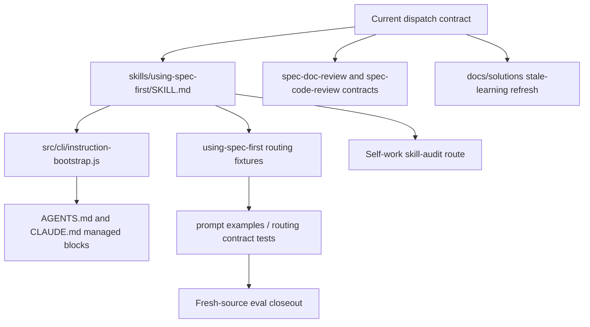
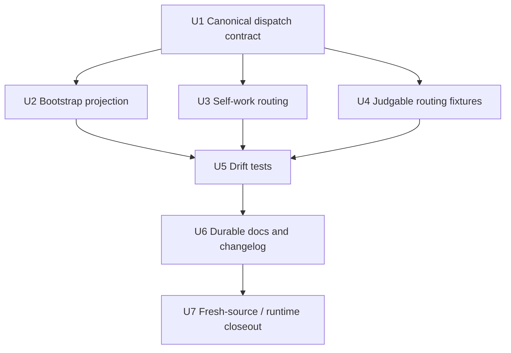

# fix: Align using-spec-first dispatch governance

## Summary

This plan resolves the governance drift found while auditing `skills/using-spec-first`: the full skill now says workflow entry does not automatically authorize Codex `spawn_agent`, while the generated bootstrap block still says public `$spec-*` invocation authorizes documented reviewer/researcher dispatch. The fix makes one dispatch contract authoritative across the full skill, checked-in host instruction blocks, generator output, review workflows, eval fixtures, and durable learning docs.

---

## Decision Brief

- **Recommended approach:** Keep the current source/test direction: public workflow invocation authorizes the workflow, but Codex host-level `spawn_agent` still requires explicit subagent/delegation/parallel/persona wording or an already authorized parent context.
- **Key decisions:** Treat `skills/using-spec-first/SKILL.md` and dispatch workflow tests as the semantic source; make `src/cli/instruction-bootstrap.js` a compressed projection; route skill/agent asset audits to `$spec-skill-audit`; upgrade examples from context-only prose into machine-judgable routing fixtures.
- **Validation focus:** Bootstrap/full-skill drift tests, doc-review/code-review dispatch contract tests, prompt example fixture tests, checked-in `AGENTS.md`/`CLAUDE.md` managed block parity, and fresh-source eval disclosure.
- **Acknowledged product tradeoff:** Under the canonical contract, a Codex user running the obvious `$spec-doc-review <path>` gets single-agent report-only review unless they also signal subagents/personas. This deliberately trades out-of-box review depth on the most common Codex path for host-boundary safety, because `spawn_agent` is an unprompted side-effect the user did not ask for. This posture is intentional; the mitigation is a *loud* fallback that tells the Codex user how to opt into multi-persona in one line, so the default still teaches the capability rather than silently degrading it.
- **Largest risks / boundaries:** The main risk is flipping dispatch semantics by accident. Historical docs that say direct `$spec-doc-review` authorizes persona dispatch are stale unless intentionally revived with a broader contract change. The strict contract is not merely "what tests happen to encode": it was a deliberate, dated reversal — commit `fc3d43c1` (2026-05-24, "闭合 must-fix 批次") introduced the stricter `spec-doc-review` wording *after* the 2026-05-05 learning, so the strict reading is the most recent adjudication, not an accident.

---

## Problem Frame

The audit of `skills/using-spec-first` surfaced four governance issues:

- The full skill's `Workflow Dispatch Admission` section states that routing into a public workflow does not override host-level subagent tool contracts, and Codex should call `spawn_agent` only with explicit subagent/delegation/parallel/persona wording or an already authorized parent context.
- `src/cli/instruction-bootstrap.js` and the checked-in Codex managed block still state that public `$spec-*` invocation authorizes documented read-only reviewer/researcher phases and that `$spec-doc-review` defaults to multi-persona dispatch.
- `Spec-First Self-Work` routes review-only requests only to `spec-code-review` or `spec-doc-review`, even though skill/agent asset review should route to `$spec-skill-audit`.
- `skills/using-spec-first/evals/examples.json` contains useful examples, but current tests only validate examples-as-context shape; they do not mechanically catch route/dispatch drift.

This is a workflow governance fix, not a review workflow redesign. The implementation should repair source-of-truth wording, generator projections, tests, eval fixtures, and durable docs so future agents cannot reintroduce the same ambiguity.

---

## Requirements

- R1. Establish one current dispatch authorization contract for `using-spec-first`, bootstrap blocks, and dispatch-bearing review workflows.
- R2. Remove bootstrap wording that implies direct public `$spec-*` invocation alone authorizes Codex `spawn_agent`.
- R3. Preserve the distinction between workflow admission and host-level dispatch authorization for `$spec-doc-review`, `$spec-code-review`, `$spec-plan`, `$spec-ideate`, and similar workflows.
- R4. Route skill/agent asset audit requests to `$spec-skill-audit` or `/spec:skill-audit`, not only to code/doc review.
- R5. Add machine-judgable routing/dispatch eval fixtures so tests can catch future drift, while keeping examples usable as context for prompt evaluation.
- R6. Keep the source/runtime boundary intact: update source files and generator-managed checked-in blocks; do not hand-edit generated mirrors under `.claude/`, `.codex/`, or `.agents/skills/`.
- R7. Update `CHANGELOG.md` and any stale durable learning or docs that would otherwise teach the old dispatch contract.
- R8. Provide a fresh-source eval closeout posture for skill/host instruction prose changes; if helper dispatch is not authorized, record `fresh_source_eval: not_run` with a concrete reason.

---

## Assumptions

- A1. The intended contract is the current full-skill and focused-test direction: direct workflow invocation is not enough to call Codex `spawn_agent`.
- A2. The older durable learning `docs/solutions/workflow-issues/doc-review-codex-multi-agent-dispatch-boundary-2026-05-05.md` is superseded, not merely "stale". The stricter contract was introduced deliberately in commit `fc3d43c1` (2026-05-24) as a must-fix closure that postdates that learning; the learning documents a model that was intentionally reversed, so it must not override current source and tests. U6 must record this supersession date/commit, not a vague "refresh against current source/tests".
- A3. The work targets this repo only, with `target_repo: .`.
- A4. No runtime mirror refresh is proof of semantic correctness. Runtime regeneration, if needed after source validation, is a follow-up step and must be disclosed.

---

## Scope Boundaries

- This plan does not redesign `spawn_agent` tool policy or Codex host permissions.
- This plan does not remove multi-persona review as a capability. It clarifies when dispatch is permitted and what fallback applies when authorization is absent.
- This plan does not turn `using-spec-first` into a command-backed workflow or artifact producer.
- This plan does not require external research; all load-bearing facts are local source, tests, and durable docs.
- This plan does not manually patch `.claude/`, `.codex/`, or `.agents/skills/` runtime mirrors.

### Deferred to Follow-Up Work

- Broader evaluation harness work for all routing skills beyond `using-spec-first`. Note: U4 deliberately stays minimal (a 2–3 field extension on existing examples, or a single dedicated routing-fixture file) precisely so it does not become the cross-skill routing eval schema. If a multi-field, multi-skill routing eval contract is later wanted, that is the deferred follow-up — U4 must not grow into it (this keeps U4 consistent with the Alternatives rejection of "a large new routing schema").
- Any reversal to "direct workflow invocation authorizes documented persona dispatch" across Codex workflows; that would be a larger semantic change requiring explicit design review and test migration.

---

## Completion Criteria

- `skills/using-spec-first/SKILL.md`, `src/cli/instruction-bootstrap.js`, `AGENTS.md`, and `CLAUDE.md` no longer conflict on Codex dispatch authorization.
- `using-spec-first` self-work routing names `$spec-skill-audit` / `/spec:skill-audit` for skill and agent asset audits.
- Focused tests fail on the old bootstrap dispatch wording and pass on the new contract.
- Routing fixtures can express expected entrypoint, dispatch decision, fallback reason, host, and mode for at least the doc-review dispatch cases.
- Durable docs no longer present the old dispatch contract as current truth.
- Closeout records fresh-source eval status honestly and states whether runtime regeneration was performed or remains pending.

---

## Direct Evidence Readiness

- **target_repo:** `.`
- **evidence_sources:** direct source reads, Graphify query, `rg`, git status/revision, deterministic planning-depth helper output, focused Jest output from the preceding audit run.
- **source_refs:** `skills/using-spec-first/SKILL.md`, `src/cli/instruction-bootstrap.js`, `AGENTS.md`, `CLAUDE.md`, `skills/using-spec-first/evals/examples.json`, `tests/unit/using-spec-first-contracts.test.js`, `tests/unit/instruction-bootstrap.test.js`, `tests/unit/spec-doc-review-contracts.test.js`, `tests/unit/spec-code-review-contracts.test.js`, `tests/unit/spec-dispatch-boundary-contracts.test.js`, `tests/unit/prompt-examples-contracts.test.js`, `docs/solutions/workflow-issues/doc-review-codex-multi-agent-dispatch-boundary-2026-05-05.md`, `docs/solutions/workflow-issues/routing-skill-eval-methodology-2026-06-08.md`, `docs/solutions/architecture-patterns/workflow-entrypoint-exposure-contract-2026-04-26.md`, `docs/contracts/workflows/fresh-source-eval-checklist.md`, `docs/10-prompt/结构化项目角色契约.md`
- **current_revision:** `d2622b7f`
- **worktree_status:** dirty during planning: `CHANGELOG.md` had existing modifications and `docs/tasks/2026-06-12-007-refactor-agent-native-architecture-governance-tasks.md` was untracked before this plan was written; later `spec-write-tasks` files also appeared dirty and are outside this plan's scope.
- **confidence:** high for the local source/test drift; medium for stale-learning treatment until the implementation decides whether to edit the existing learning or add an explicit supersession note.
- **limitations:** Graphify query returned only weakly scoped context, so source/test reads are the primary evidence. No external research was needed or used.

---

## Direct Evidence

- **repo_scope:** single repo, `target_repo: .`
- **source_reads_completed:** role contract, full `spec-plan` workflow references, `using-spec-first` self-work and dispatch sections, bootstrap generator, checked-in bootstrap snippets, dispatch-related unit tests, eval examples, stale durable learning, routing-skill eval methodology, workflow entrypoint exposure contract.
- **source_reads_required:** implementation should reread every target file immediately before editing, especially `CHANGELOG.md`, because it was already modified.
- **commands_or_tools_used:** `git status --short`, plan file discovery, Graphify query, targeted `sed` reads, targeted `rg`, planning-depth helper, and focused Jest suites from the preceding audit.
- **impact_on_plan:** confirms this is a Deep plan because the change crosses skill prose, generator-managed host instruction blocks, dual-host dispatch semantics, eval fixtures, tests, docs, changelog, and possible runtime regeneration.
- **key_findings:** full skill and review workflow tests support the stricter dispatch boundary; bootstrap generator and its tests still encode the older looser boundary; self-work prose omits skill-audit despite route map coverage; eval examples lack machine-judgable expected routing fields.
- **limitations:** this plan did not execute implementation tests after writing because planning is not implementation.

---

## Context & Research

### Relevant Code and Patterns

- `skills/using-spec-first/SKILL.md` already defines `Workflow Dispatch Admission` with the stricter boundary: workflow routing authorizes the workflow, not host-level `spawn_agent`.
- `src/cli/instruction-bootstrap.js` has separate Chinese and English Codex lines that still say public `$spec-*` invocation authorizes documented reviewer/researcher phases and `$spec-doc-review` defaults to multi-persona dispatch.
- `tests/unit/instruction-bootstrap.test.js` currently asserts the old bootstrap wording, so it must be updated with stronger negative assertions.
- `tests/unit/using-spec-first-contracts.test.js`, `tests/unit/spec-doc-review-contracts.test.js`, and `tests/unit/spec-code-review-contracts.test.js` already encode the stricter dispatch boundary.
- `skills/using-spec-first/evals/examples.json` has a direct doc-review route case, but `tests/unit/prompt-examples-contracts.test.js` only checks prompt-examples shape and context references.

### Institutional Learnings

- `docs/solutions/workflow-issues/routing-skill-eval-methodology-2026-06-08.md` says routing-skill evals need hard boundary cases and fresh-source evaluation, not only obvious routing examples.
- `docs/solutions/architecture-patterns/workflow-entrypoint-exposure-contract-2026-04-26.md` says public workflow entry surfaces belong in governance and host adapters, not scattered prose.
- `docs/solutions/workflow-issues/doc-review-codex-multi-agent-dispatch-boundary-2026-05-05.md` currently teaches a looser dispatch-admission model. Treat it as stale until refreshed against current source/tests.

### External References

- None used. The issue is an internal workflow contract conflict with sufficient local source and test evidence.

---

## Key Technical Decisions

- KTD1. **Canonical dispatch contract:** Public workflow entry authorizes the workflow. It does not automatically authorize host-level `spawn_agent` in Codex.
- KTD2. **Bootstrap is a projection, not an override:** `src/cli/instruction-bootstrap.js` and checked-in managed blocks should summarize the full skill; they must not create a separate Codex dispatch policy.
- KTD3. **Fallback is part of normal workflow behavior:** When dispatch authorization is absent, dispatch-bearing workflows should use documented report-only or inline fallback and record concrete reason codes such as `dispatch_authorization_missing`.
- KTD4. **Skill/agent asset audits route to skill-audit:** Review-only self-work over skill or agent assets should route to `$spec-skill-audit` / `/spec:skill-audit`, while diffs/PRs still route to code review and markdown plans/requirements still route to doc review.
- KTD5. **Examples become fixtures:** Keep examples readable for prompt context, but add enough structured fields for unit tests to assert expected entrypoints, dispatch decisions, fallback reasons, host, and mode.
- KTD6. **Stale learning must be neutralized:** Either update the old dispatch-boundary learning in place with an explicit supersession note (citing commit `fc3d43c1` / 2026-05-24) or add a new durable learning that points consumers to the current contract.
- KTD7. **Parent-context authorization is bounded, not self-declared:** "An upstream workflow delegates from an already authorized multi-agent context" counts as authorization only when the original user turn carried explicit subagent/delegation/parallel/persona wording (or an equivalent verifiable signal) that the parent inherited. A parent merely asserting "I am authorized" in prose is not sufficient. U4 must include a negative fixture: parent claims authorization but the originating turn lacked explicit dispatch wording → `dispatch_decision: fallback`, `fallback_reason: dispatch_authorization_missing`.
- KTD8. **Headless/programmatic invocation has no implicit dispatch authorization:** `mode:headless` is not a dispatch-disabling flag, but headless/autofix/programmatic flows skip the session-disclosure check and have no interactive user to supply explicit wording. Treat such invocations as unauthorized for `spawn_agent` unless a machine-readable authorization signal (CLI flag, env var, or explicit task field) is present. Cover with a `host: codex, mode: headless` fallback fixture (U4).

---

## Open Questions

### Resolved During Planning

- **Should the plan adopt the older learning and loosen dispatch admission again?** No. Current source and tests already moved to the stricter contract; reversing it would be a broader behavior change, not a drift fix.
- **Should implementation manually edit runtime mirrors to make current sessions behave differently?** No. Source and generator must be fixed first; runtime regeneration is separate and disclosed.

### Deferred to Implementation

- **Should eval fixtures remain in `examples.json` or move to a new routing-case file?** Decide during implementation based on the smallest testable shape. Either is acceptable if prompt-context examples remain intact and machine checks cover dispatch drift.
- **Should stale durable learning be edited in place or superseded by a new doc?** Decide based on repository convention and churn. The end state must prevent readers from treating stale dispatch admission as current truth.

---

## High-Level Technical Design

> *This illustrates the intended approach and is directional guidance for review, not implementation specification. The implementing agent should treat it as context, not code to reproduce.*

The implementation should land the semantic source first, then generator projections, then machine fixtures and docs. Tests should prove the old bootstrap sentence and missing skill-audit route cannot return silently.

> **Unit-weight note:** The confirmed drift is small and localized (bootstrap/`AGENTS.md` wording, self-work skill-audit omission, missing machine fields in examples). U1 and U7 are intentionally lightweight: **U1 is a verification precondition** (`using-spec-first` SKILL.md is already strict; the only possible edit is the residual doc-review contradiction), and **U7 is an inspect-only closeout** with no source edits. They are kept as separate units only to preserve the dependency arc and disclosure obligations (R8); an implementer may execute U1 as a check and fold U7's disclosure into U6's closeout without losing any of the three drift fixes.

---

## Implementation Units

### U1. Define the canonical dispatch authorization contract

**Goal:** Confirm the intended dispatch rule is already explicit in `using-spec-first` and aligned with existing doc-review/code-review contracts, and resolve the one residual contradiction inside the doc-review prose. This is mostly a verification precondition for U2–U5, not a rewrite of an already-correct file.

**Requirements:** R1, R3

**Dependencies:** None

**Files:**
- Inspect (verify-only; already strict): `skills/using-spec-first/SKILL.md`
- Modify (only if the residual contradiction below is confirmed): `skills/spec-doc-review/SKILL.md`
- Inspect: `skills/spec-code-review/SKILL.md`
- Test: `tests/unit/using-spec-first-contracts.test.js`
- Test: `tests/unit/spec-doc-review-contracts.test.js`
- Test: `tests/unit/spec-code-review-contracts.test.js`
- Test: `tests/unit/spec-dispatch-boundary-contracts.test.js`

**Approach:**
- `skills/using-spec-first/SKILL.md` already states the strict principle (workflow routing authorizes workflow execution, not host-level subagent tools). Do not rewrite it; verify it via the contract tests and only adjust wording if a test gap is found.
- Resolve the residual contradiction in `skills/spec-doc-review/SKILL.md`: "Default doc-review posture is multi-persona analysis" sits in tension with "a direct invocation alone is not `spawn_agent` authorization". Reword to "default posture is multi-persona analysis **when host capability and dispatch authorization are both present**; the plain-invocation default on a gated host is single-agent report-only fallback", so Success Metric "no contradictory text" actually holds.
- Keep examples for `$spec-doc-review`, `$spec-code-review`, `$spec-plan`, and `$spec-ideate` as capability-bearing workflows with fallback, not as unconditional dispatch triggers.
- Avoid Codex-only capability-denial phrasing; the boundary is authorization and safety, not host capability denial.

**Patterns to follow:**
- Current `Workflow Dispatch Admission` section in `skills/using-spec-first/SKILL.md`
- Dispatch capability gate language in `skills/spec-doc-review/SKILL.md`
- Single-agent report-only fallback language in `skills/spec-code-review/SKILL.md`

**Test scenarios:**
- Happy path: direct `$spec-doc-review` without explicit subagent/delegation wording routes to doc-review workflow and records dispatch fallback rather than calling `spawn_agent`.
- Happy path: explicit "use persona reviewers/subagents/parallel agents" permits bounded dispatch when the workflow safety boundary is satisfied.
- Edge case: route normalization from `spec-doc-review` to `$spec-doc-review` does not create extra dispatch authorization.
- Error path: wording that says public `$spec-*` invocation alone authorizes `spawn_agent` causes a focused contract test failure.

**Verification:**
- Existing dispatch contract suites and `using-spec-first` contract tests establish the current canonical wording baseline; U5 adds the old unconditional-admission wording as an explicit negative drift guard.

---

### U2. Align bootstrap generator and checked-in managed blocks

**Goal:** Remove the bootstrap/full-skill conflict from generated host instruction text and checked-in source slices.

**Requirements:** R1, R2, R6

**Dependencies:** U1

**Files:**
- Modify: `src/cli/instruction-bootstrap.js`
- Modify: `AGENTS.md`
- Inspect: `CLAUDE.md`
- Test: `tests/unit/instruction-bootstrap.test.js`
- Test: `tests/unit/context-governance-contracts.test.js`
- Test: `tests/unit/using-spec-first-contracts.test.js`

**Approach:**
- Replace Codex bootstrap lines that say public `$spec-*` invocation authorizes reviewer/researcher dispatch with wording that mirrors the full skill. The load-bearing strings are `src/cli/instruction-bootstrap.js:143` (zh) and `:176` (en).
- Keep startup reminder guidance separate from dispatch authorization; bounded subagents, leaf reviewers, and worker agents still do not run startup reminders.
- **`AGENTS.md` is a generator-rendered managed block, not a free-text source file.** Do not hand-edit it. The only durable path: edit `instruction-bootstrap.js`, then regenerate the checked-in `AGENTS.md`/`CLAUDE.md` managed blocks via the generator/`spec-first init` path, and commit the regenerated blocks in the same batch. A hand-edit alone diverges from generator output (flagged by `inspectInstructionBootstrap` / `doctor --codex`) and is reverted by the next `init` — which is exactly the source/runtime drift R6/KTD2 forbid. The "smallest source-safe checked-in update" escape hatch is removed.
- `CLAUDE.md`'s managed block is rendered by the same generator (host `claude`). Inspect it to confirm no Codex-specific dispatch wording leaks in; if the shared block structure changes, regenerate and commit it too rather than treating it as inspect-only.
- **Blocking-test ordering (must be done inside U2, not deferred to U5):** `tests/unit/instruction-bootstrap.test.js:301/307/309` currently assert the *old* stale wording *positively* (`toContain('…defaults to multi-persona dispatch')`, `toContain('授权该 workflow 文档化的只读 reviewer/researcher phase')`, `toContain('invoking public \`$spec-*\` authorizes')`). Changing the generator strings makes these existing tests fail immediately. U2 must remove/invert those three positive assertions and add the corresponding negative guards in the same unit, so there is no window where the generator is fixed but the suite is red and unguarded.

**Patterns to follow:**
- `tests/unit/instruction-bootstrap.test.js` existing dual-language assertions
- `docs/10-prompt/结构化项目角色契约.md` source/runtime boundary

**Test scenarios:**
- Happy path: Codex bootstrap includes "host capability and authorization" style language and names fallback for missing authorization.
- Edge case: Claude bootstrap does not gain Codex-specific `spawn_agent` wording or `$spec-*` syntax.
- Error path: the old phrases "`$spec-doc-review` defaults to multi-persona dispatch" or "public `$spec-*` invocation authorizes" cause tests to fail.
- Integration: checked-in `AGENTS.md` matches the Codex generator output; `CLAUDE.md` is inspected or tested to confirm it does not acquire Codex-specific dispatch wording.

**Verification:**
- Bootstrap tests prove generator output and checked-in blocks carry the same dispatch contract.

---

### U3. Correct spec-first self-work review routing

**Goal:** Ensure skill/agent asset audit requests route to `spec-skill-audit` instead of being flattened into code/doc review.

**Requirements:** R4

**Dependencies:** U1

**Files:**
- Modify: `skills/using-spec-first/SKILL.md`
- Test: `tests/unit/using-spec-first-contracts.test.js`
- Test: `tests/unit/instruction-bootstrap.test.js`

**Approach:**
- In `Spec-First Self-Work`, distinguish artifact type: code/diff/PR review -> code review; requirements/plan/markdown review -> doc review; skill/agent asset governance audit -> skill audit.
- Keep "review plus concrete revisions" routed to work when the user asks for both review and edits.
- Ensure the route map and bootstrap entry mapping continue to include skill-audit for both hosts.

**Patterns to follow:**
- Existing route map row for "audit spec-first skill/agent assets"
- `spec-skill-audit` skill description and current entry mapping

**Test scenarios:**
- Happy path: "review this skill for trigger precision/governance" recommends `$spec-skill-audit`.
- Happy path: "review this PR/diff" recommends `$spec-code-review`.
- Happy path: "review this plan/requirements doc" recommends `$spec-doc-review`.
- Edge case: "review this skill and then apply fixes" routes to `$spec-work` with a review posture, not pure audit.

**Verification:**
- Contract tests assert the self-work paragraph and route map do not regress to code/doc-only review routing.

---

### U4. Upgrade routing examples into machine-judgable fixtures

**Goal:** Make dispatch and route decisions testable instead of leaving them as prose-only examples.

**Requirements:** R5

**Dependencies:** U1, U3

**Files:**
- Modify: `skills/using-spec-first/evals/examples.json`
- Modify or create: `tests/unit/prompt-examples-contracts.test.js`
- Optional create: `tests/unit/using-spec-first-routing-fixtures.test.js`

**Approach:**
- **This is "add machine-readable fields to existing examples", not "build fixtures from scratch".** `examples.json` already contains the load-bearing prose cases — "document review routes to doc-review", "direct doc-review route is not subagent authorization" (with the `boundary_note` "public workflow admission authorizes workflow execution, not host-level subagent tools"), and the report-only case. The gap is only the machine field names plus an asserting test.
- Add the minimum fields needed to catch the confirmed drift: `expected_entrypoint` and `dispatch_decision` (plus `fallback_reason` where a fallback case applies). Treat `host`, `mode`, and `must_not` as optional and add them only where a specific fixture (e.g. the headless case in U4 below) actually needs them — do not mandate a 6-field schema on every example.
- New fields must be optional in the schema: the existing examples that do not carry them must still validate; only examples that declare a `dispatch_decision` are subject to dispatch-decision assertions. This avoids retrofitting all 6 examples.
- **`examples.json` is at the test's hard `≤6` cap (`prompt-examples-contracts.test.js:27`, currently exactly 6 examples).** Adding the U3 skill/agent-audit route case overflows it. Resolve by one explicit choice: (a) replace a lower-value existing example with the skill-audit case, keeping count at 6; or (b) put the new routing cases in the dedicated `tests/unit/using-spec-first-routing-fixtures.test.js` + a separate fixture file and keep `examples.json` at 6 prose examples. Prefer (b) so prompt-context examples stay clean and the cap stays meaningful. Only raise the `≤6` bound if neither fits, with a justifying comment.
- Avoid self-referential (tautological) assertions: at least one fixture assertion must tie a fixture token (e.g. `dispatch_authorization_missing`) to load-bearing SKILL/bootstrap *prose*, not just compare the fixture value to the JSON it was typed into. See U5.
- Cover the route cases required by R3 beyond doc-review: add a no-authorization fallback fixture for `$spec-plan` (research-agent path) and `$spec-ideate` (grounding-agent path), matching the doc-review fallback shape.
- Add the headless authorization case: `host: codex`, `mode: headless`, no explicit dispatch wording → `dispatch_decision: fallback`, `fallback_reason: dispatch_authorization_missing` (see U1 headless decision).
- Keep human-readable `expected_posture`, `boundary_note`, and `source_note` so examples remain useful for prompt-context evals.

**Patterns to follow:**
- `docs/solutions/workflow-issues/routing-skill-eval-methodology-2026-06-08.md`
- Existing `prompt-examples/v1` shape, extended only as much as needed for stable tests.

**Test scenarios:**
- Happy path: fixture declares `$spec-doc-review` with `dispatch_decision: fallback` and `fallback_reason: dispatch_authorization_missing` when no explicit dispatch wording exists.
- Happy path: fixture declares `$spec-skill-audit` for skill/agent asset review.
- Edge case: direct lightweight explanation fixture declares no workflow and no dispatch.
- Error path: missing `expected_entrypoint` or an unknown `fallback_reason` fails fixture validation.

**Verification:**
- Prompt example/routing fixture tests fail on incomplete or contradictory dispatch metadata.

---

### U5. Add cross-surface drift guards

**Goal:** Prevent future prose or generator changes from reintroducing dispatch/bootstrap drift.

**Requirements:** R1, R2, R3, R5, R6

**Dependencies:** U2, U3, U4

**Files:**
- Modify: `tests/unit/instruction-bootstrap.test.js`
- Modify: `tests/unit/using-spec-first-contracts.test.js`
- Modify: `tests/unit/spec-dispatch-boundary-contracts.test.js`
- Modify: `tests/unit/prompt-examples-contracts.test.js`

**Approach:**
- Add a focused invariant that bootstrap dispatch wording is a subset/projection of the full skill's `Workflow Dispatch Admission`.
- Add negative assertions for stale phrases from the old bootstrap contract.
- Add fixture-driven assertions that route cases and dispatch fallback cases align with the skill prose. At least one assertion must be **anchored to prose, not self-referential**: e.g. assert the `fallback_reason` token `dispatch_authorization_missing` literally appears both in a fixture and in `skills/spec-doc-review/SKILL.md` / the generated bootstrap, so the fixture is tied to load-bearing text rather than tested against the JSON it was typed into.
- **String guards are a secondary backstop, not the primary defense.** `tests/unit/spec-dispatch-boundary-contracts.test.js` already scans durable learnings for stale authorization phrasing and currently *passes* even with the 2026-05-05 learning present (its "invocation … authorizes that reviewer phase" wording matches no existing pattern). Doubling down on short literal snippets repeats that exact miss. State explicitly in the tests' intent that literal guards cannot catch all paraphrase; the durable-doc supersession note (U6) is the primary defense. Where feasible, broaden one guard to a semantic pattern covering "invocation … authorizes … reviewer/persona phase" / "do not require a second use-subagents confirmation".
- Add a fallback-integrity guard: assert that, on the no-authorization path, the rendered/transformed skill prose does not present `spawn_agent` as unconditionally callable. Acknowledge in the test comment that this checks prose shape, not a runtime block — actual enforcement relies on the agent following prose, which is a known limitation, not a code-level gate.
- Keep tests string-based where the contract is prose-owned, but anchor on short load-bearing snippets and reason codes to reduce brittleness.

**Patterns to follow:**
- Existing route map identifier drift invariant in `tests/unit/instruction-bootstrap.test.js`
- Existing runtime transform preservation tests in `tests/unit/using-spec-first-contracts.test.js`

**Test scenarios:**
- Happy path: full skill, generator output, and checked-in blocks all mention missing dispatch authorization fallback.
- Error path: generator output says direct `$spec-*` authorizes reviewer dispatch; bootstrap drift test fails.
- Error path: full skill drops skill-audit from self-work review guidance; self-work route test fails.
- Integration: adapter-transformed runtime skill preserves the source dispatch boundary text without inventing a command-backed workflow.

**Verification:**
- Focused unit suites cover full skill, generator, checked-in host blocks, runtime transform, dispatch workflows, and routing fixtures.

---

### U6. Refresh durable docs and changelog

**Goal:** Keep project knowledge and release notes aligned with the corrected contract.

**Requirements:** R7

**Dependencies:** U5

**Files:**
- Modify: `CHANGELOG.md`
- Modify: `docs/solutions/workflow-issues/doc-review-codex-multi-agent-dispatch-boundary-2026-05-05.md`
- Optional create: `docs/solutions/workflow-issues/using-spec-first-dispatch-authorization-boundary-2026-06-12.md`
- Test: `tests/unit/spec-dispatch-boundary-contracts.test.js`

**Approach:**
- Add a changelog entry for source-visible behavior changes.
- Neutralize the stale learning by editing it with a dated supersession note (must cite the superseding decision: commit `fc3d43c1`, 2026-05-24, "闭合 must-fix 批次") or creating a replacement learning and cross-linking the old one. The note must make the provenance traceable, not a vague "refreshed against current source/tests".
- Keep the durable lesson precise: direct workflow admission and host-level dispatch authorization are separate; fallback reason codes make degraded review explicit. Record that string-based drift guards are a secondary backstop and the supersession note is the primary defense against paraphrased reintroduction.

**Patterns to follow:**
- Current changelog format and `~/.spec-first/.developer` author profile
- `docs/contracts/workflows/fresh-source-eval-checklist.md` for prose-change validation posture

**Test scenarios:**
- Happy path: durable docs no longer state the old looser contract as current guidance.
- Error path: dispatch docs contain stale phrases such as "direct `$spec-doc-review` authorizes persona dispatch" without a supersession note; dispatch-boundary doc tests fail or a reviewer blocks closeout.
- Integration: changelog describes user-visible routing/dispatch governance impact without claiming runtime mirrors were manually patched.

**Verification:**
- Changelog and durable doc changes are included in source diff, and focused doc/dispatch tests pass.

---

### U7. Run fresh-source and runtime boundary closeout

**Goal:** Verify skill/host-instruction prose from current disk and disclose runtime regeneration status honestly.

**Requirements:** R6, R8

**Dependencies:** U6

**Files:**
- Inspect: `docs/contracts/workflows/fresh-source-eval-checklist.md`
- Inspect: `skills/using-spec-first/SKILL.md`
- Inspect: `src/cli/instruction-bootstrap.js`
- Inspect: `AGENTS.md`
- Inspect: `CLAUDE.md`

**Approach:**
- If explicit helper/subagent authorization is available in the implementation context, run a fresh read-only source reviewer using current disk snippets.
- **Expected outcome in this implementation context is `fresh_source_eval: not_run`.** Because this very change tightens dispatch authorization, the implementing work session will normally lack explicit subagent authorization wording, so the preferred fresh-source-via-subagent path will not fire. Record `not_run` with a concrete reason (e.g. `dispatch_authorization_absent_in_implementation_context`) and rely on focused source reads plus contract tests as the primary verification path. Do not force authorization just to make the eval run.
- **Separate two regeneration concerns.** The checked-in receiver blocks `AGENTS.md`/`CLAUDE.md` are generator-managed *source slices* and must already be regenerated and committed in U2 — they are not deferrable. Only the runtime *mirrors* under `.claude/`, `.codex/`, `.agents/skills/` are the deferrable concern: state whether `spec-first init` was run to refresh them, and if not, mark mirror regeneration as pending rather than implying runtime behavior changed.
- Do not edit generated runtime mirrors to make closeout look cleaner.

**Patterns to follow:**
- `docs/contracts/workflows/fresh-source-eval-checklist.md`
- Source/runtime gate in `docs/10-prompt/结构化项目角色契约.md`

**Test scenarios:**
- Happy path: fresh-source eval or honest not-run record covers trigger precision, source/runtime boundary, host entrypoints, deterministic-vs-semantic boundary, and tests.
- Edge case: runtime regeneration is unnecessary because checked-in source slices are sufficient for the current change; closeout states that explicitly.
- Error path: implementation claims fresh-source eval passed after only current-session reads; review blocks closeout.

**Verification:**
- Closeout includes fresh-source eval status, focused tests, and runtime regeneration status with no generated-mirror manual edits.

---

## System-Wide Impact

- **Interaction graph:** The change touches entry governance (`using-spec-first`), review workflow dispatch semantics, bootstrap generation, checked-in host instruction blocks, runtime projection tests, prompt eval fixtures, and durable learning docs.
- **Error propagation:** Missing dispatch authorization should produce explicit fallback posture and reason code, not silent single-agent behavior or unauthorized `spawn_agent` calls.
- **State lifecycle risks:** Runtime mirrors may remain stale until regeneration. That must be disclosed rather than hidden by manual mirror edits.
- **API surface parity (contract symmetry, not behavior symmetry):** The authorization *rule* has the same shape on both hosts after normalizing command names, but the *effective default behavior diverges*: the same intent ("review this doc") yields multi-persona-by-default on Claude and single-agent report-only-by-default on Codex, because only Codex gates `spawn_agent` behind explicit authorization. This asymmetry is an intentional consequence of the host tool-permission difference, not a spec-first quality gap. Do not claim full "semantic parity"; claim contract symmetry with an owned, host-driven behavior asymmetry.
- **Integration coverage:** Unit tests need to cover generator output, checked-in blocks, adapter transforms, review workflow contracts, and routing fixtures.
- **Unchanged invariants:** `using-spec-first` remains a standalone meta skill; `$spec-doc-review` and `$spec-code-review` remain public workflows; multi-persona dispatch remains available when host capability and authorization are both present.

---

## Risks & Dependencies

| Risk | Likelihood | Impact | Mitigation |
|------|------------|--------|------------|
| Accidentally weakening doc-review/code-review multi-persona capability | Medium | High | Phrase the fix as authorization-gated dispatch, not Codex anti-dispatch; keep explicit authorized-dispatch fixtures. |
| Bootstrap block becomes too verbose and repeats the full skill | Medium | Medium | Keep it a compressed core decision set and test only load-bearing snippets. |
| Fixture schema overgrows into a second workflow contract | Medium | Medium | Add only fields needed for route/dispatch checks and keep prose skill as semantic source. |
| Stale durable learning keeps reintroducing the old policy | High | High | Refresh or supersede the learning in the same implementation batch. |
| Runtime mirrors drift after source changes | Medium | Medium | Disclose whether regeneration ran; never hand-edit mirrors. |
| Changelog conflict with existing dirty file | Medium | Medium | Reread `CHANGELOG.md` before edit and append without removing unrelated entries. |

---

## Alternative Approaches Considered

- **Adopt the older learning and loosen the contract again:** Rejected for this plan. It would contradict current full-skill, doc-review, and code-review tests and should be handled as a separate semantic redesign.
- **Patch only the bootstrap generator:** Rejected. The self-work skill-audit omission, eval fixture weakness, and stale learning would still allow drift.
- **Add a large new routing schema:** Rejected for now. A small fixture extension or dedicated routing-cases file is enough to catch this class of regression.
- **Skip durable docs because tests are enough:** Rejected. This repo uses `docs/solutions/` as a knowledge harness, and stale learnings are active future inputs.

---

## Success Metrics

- Focused tests fail against the old bootstrap dispatch wording.
- Routing fixtures include at least one no-authorization doc-review fallback case, one explicit-dispatch case, and one skill/agent audit case.
- A future reviewer can answer "when may Codex call `spawn_agent`?" from `using-spec-first`, bootstrap blocks, and review workflow docs without finding contradictory text.
- Closeout can state source/runtime status and fresh-source eval status without caveats beyond any honestly recorded fallback.

---

## Documentation Plan

- Update `CHANGELOG.md` for the source-visible routing/dispatch governance change.
- Refresh or supersede `docs/solutions/workflow-issues/doc-review-codex-multi-agent-dispatch-boundary-2026-05-05.md`.
- No README update is expected unless implementation changes public command lists or user-facing CLI behavior beyond routing guidance.
- No runtime mirror docs should be edited directly; any runtime regeneration should be reported as a generated follow-up.

---

## Operational / Rollout Notes

- This is source and test work. There is no data migration, deployment switch, or external API rollout.
- If `spec-first init` is run after source validation, note the target host selection and inspect generated diffs before closeout.
- Because skill/host instruction prose may be cached by the current session, do not rely on invoking the current cached skill as validation.

---

## Sources & References

- User request: audit `skills/using-spec-first` using `skills/agent-native-architecture/SKILL.md`, then `$spec-plan deep`, option `1`.
- Source skill: `skills/using-spec-first/SKILL.md`
- Bootstrap generator: `src/cli/instruction-bootstrap.js`
- Host entry source slices: `AGENTS.md`, `CLAUDE.md`
- Routing examples: `skills/using-spec-first/evals/examples.json`
- Tests: `tests/unit/using-spec-first-contracts.test.js`, `tests/unit/instruction-bootstrap.test.js`, `tests/unit/spec-doc-review-contracts.test.js`, `tests/unit/spec-code-review-contracts.test.js`, `tests/unit/spec-dispatch-boundary-contracts.test.js`, `tests/unit/prompt-examples-contracts.test.js`
- Durable learnings: `docs/solutions/workflow-issues/doc-review-codex-multi-agent-dispatch-boundary-2026-05-05.md`, `docs/solutions/workflow-issues/routing-skill-eval-methodology-2026-06-08.md`, `docs/solutions/architecture-patterns/workflow-entrypoint-exposure-contract-2026-04-26.md`
- Governance baseline: `docs/10-prompt/结构化项目角色契约.md`
- Fresh-source eval contract: `docs/contracts/workflows/fresh-source-eval-checklist.md`
