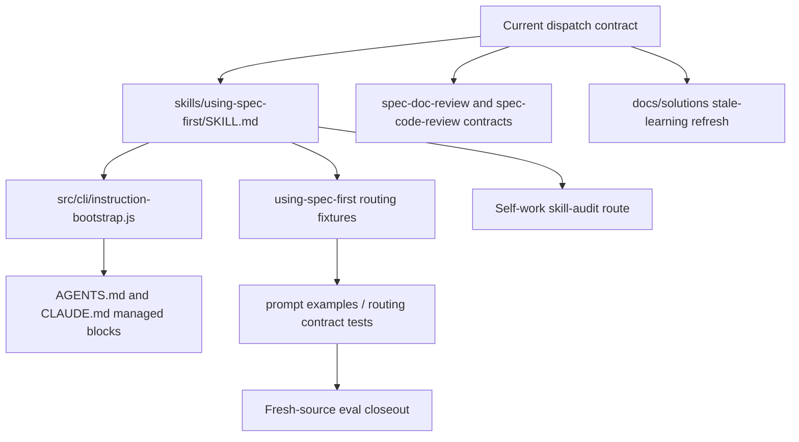
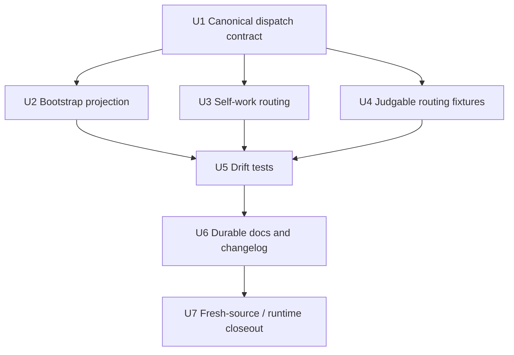

# fix: Align using-spec-first dispatch governance

## Summary

This plan resolves the governance drift found while auditing `skills/using-spec-first`: the full skill now says workflow entry does not automatically authorize Codex `spawn_agent`, while the generated bootstrap block still treats public `$spec-*` entry as enough for documented reviewer/researcher fan-out. The fix makes one dispatch contract authoritative across the full skill, checked-in host instruction blocks, generator output, review workflows, eval fixtures, and durable learning docs.

---

## Decision Brief

- **Recommended approach:** Keep the current source/test direction: public workflow invocation authorizes the workflow, but Codex host-level `spawn_agent` still requires explicit subagent/delegation/parallel/persona wording or an already authorized parent context.
- **Key decisions:** Treat `skills/using-spec-first/SKILL.md` and dispatch workflow tests as the semantic source; make `src/cli/instruction-bootstrap.js` a compressed projection; route skill/agent asset audits to `$spec-skill-audit`; upgrade examples from context-only prose into machine-judgable routing fixtures.
- **Validation focus:** Bootstrap/full-skill drift tests, doc-review/code-review dispatch contract tests, prompt example fixture tests, checked-in `AGENTS.md`/`CLAUDE.md` managed block parity, and fresh-source eval disclosure.
- **Acknowledged product tradeoff:** Under the canonical contract, a Codex user running the obvious `$spec-doc-review <path>` gets single-agent report-only review unless they also signal subagents/personas. This deliberately trades out-of-box review depth on the most common Codex path for host-boundary safety, because `spawn_agent` is an unprompted side-effect the user did not ask for. This posture is intentional; the mitigation is a *loud* fallback that tells the Codex user how to opt into multi-persona in one line, so the default still teaches the capability rather than silently degrading it. The implementation must test for that user-facing opt-in guidance, not just the machine reason code.
- **Largest risks / boundaries:** The main risk is flipping dispatch semantics by accident. Historical docs that teach the old model where plain document-review workflow entry is enough for persona fan-out are superseded unless intentionally revived with a broader contract change. The strict contract is not merely "what tests happen to encode": it was a deliberate, dated reversal — commit `fc3d43c1` (2026-05-24, "闭合 must-fix 批次") introduced the stricter `spec-doc-review` wording *after* the 2026-05-05 learning, so the strict reading is the most recent adjudication, not an accident.

---

## Problem Frame

The audit of `skills/using-spec-first` surfaced four governance issues:

- The full skill's `Workflow Dispatch Admission` section states that routing into a public workflow does not override host-level subagent tool contracts, and Codex should call `spawn_agent` only with explicit subagent/delegation/parallel/persona wording or an already authorized parent context.
- `src/cli/instruction-bootstrap.js` and the checked-in Codex managed block still state that public `$spec-*` invocation is sufficient for documented read-only reviewer/researcher phases and unconditional Codex reviewer fan-out.
- `Spec-First Self-Work` routes review-only requests only to `spec-code-review` or `spec-doc-review`, even though skill/agent asset review should route to `$spec-skill-audit`.
- `skills/using-spec-first/evals/examples.json` contains useful examples, but current tests only validate examples-as-context shape; they do not mechanically catch route/dispatch drift.

This is a workflow governance fix, not a review workflow redesign. The implementation should repair source-of-truth wording, generator projections, tests, eval fixtures, and durable docs so future agents cannot reintroduce the same ambiguity.

---

## Requirements

- R1. Establish one current dispatch authorization contract for `using-spec-first`, bootstrap blocks, and dispatch-bearing review workflows.
- R2. Remove bootstrap wording that implies direct public `$spec-*` invocation alone authorizes Codex `spawn_agent`.
- R3. Preserve the distinction between workflow admission and host-level dispatch authorization for the confirmed drift surfaces: `$spec-doc-review`, `$spec-code-review`, and the `using-spec-first` prose that mentions dispatch-bearing workflows such as `$spec-plan`/`$spec-ideate`. This plan should not claim broad cross-skill routing-eval coverage beyond the fixtures it actually adds.
- R4. Route skill/agent asset audit requests to `$spec-skill-audit` or `/spec:skill-audit`, not only to code/doc review.
- R5. Add machine-judgable routing/dispatch eval fixtures so tests can catch future drift, while keeping examples usable as context for prompt evaluation.
- R6. Keep the source/runtime boundary intact: update source files and generator-managed checked-in blocks; do not hand-edit generated mirrors under `.claude/`, `.codex/`, or `.agents/skills/`.
- R7. Update `CHANGELOG.md` and any stale durable learning or docs that would otherwise teach the old dispatch contract.
- R8. Provide a fresh-source eval closeout posture for skill/host instruction prose changes; if helper dispatch is not authorized, record `fresh_source_eval: not_run` with a concrete reason.

---

## Assumptions

- A1. The intended contract is the current full-skill and focused-test direction: direct workflow invocation is not enough to call Codex `spawn_agent`.
- A2. The older durable learning `docs/solutions/workflow-issues/doc-review-codex-multi-agent-dispatch-boundary-2026-05-05.md` is superseded, not merely "stale". The stricter contract was introduced deliberately in commit `fc3d43c1` (2026-05-24) as a must-fix closure that postdates that learning; the learning documents a model that was intentionally reversed, so it must not override current source and tests. U6 must record this supersession date/commit, not a vague "refresh against current source/tests".
- A3. The work targets this repo only, with `target_repo: .`.
- A4. No runtime mirror refresh is proof of semantic correctness. Runtime regeneration, if needed after source validation, is a follow-up step and must be disclosed.

---

## Scope Boundaries

- This plan does not redesign `spawn_agent` tool policy or Codex host permissions.
- This plan does not remove multi-persona review as a capability. It clarifies when dispatch is permitted and what fallback applies when authorization is absent.
- This plan does not turn `using-spec-first` into a command-backed workflow or artifact producer.
- This plan does not require external research; all load-bearing facts are local source, tests, and durable docs.
- This plan does not manually patch `.claude/`, `.codex/`, or `.agents/skills/` runtime mirrors.

### Deferred to Follow-Up Work

- Broader evaluation harness work for all routing skills beyond `using-spec-first`. Note: U4 deliberately stays minimal (a 2–3 field extension on existing examples, or a single dedicated routing-fixture file) precisely so it does not become the cross-skill routing eval schema. If a multi-field, multi-skill routing eval contract is later wanted, that is the deferred follow-up — U4 must not grow into it (this keeps U4 consistent with the Alternatives rejection of "a large new routing schema").
- Any reversal to the older "plain workflow entry is enough for persona fan-out" model across Codex workflows; that would be a larger semantic change requiring explicit design review and test migration.
- **Parent-context authorization bounding** (when does "an already authorized multi-agent context" actually count?) and **headless/programmatic dispatch authorization** (whether headless invocation needs its own machine-readable authorization signal). These were raised during review as real questions, but they do not trace to the three confirmed drifts, are not expressible in the current `routing-cases.json` schema (no `parent_context`/`host`/`mode` fields, and the originating user turn is structurally unknowable to a child reviewer), and would require designing new `spawn_agent` authorization infrastructure — which Scope Boundaries explicitly excludes. Defer to a dedicated authorization-hardening plan that can own the schema and rule set as its stated goal. Interim rule for this plan: an "already authorized parent context" may be cited only when the visible parent request or handoff evidence itself contains explicit subagent/delegation/parallel/persona wording; if that provenance is absent or unverifiable, the child workflow must use the missing-authorization fallback. `mode:headless` is not by itself a dispatch-disabling flag (`skills/spec-doc-review/SKILL.md`), but this plan does not add a headless machine-readable authorization signal.

---

## Completion Criteria

- `skills/using-spec-first/SKILL.md`, `src/cli/instruction-bootstrap.js`, `AGENTS.md`, and `CLAUDE.md` no longer conflict on Codex dispatch authorization.
- `using-spec-first` self-work routing names `$spec-skill-audit` / `/spec:skill-audit` for skill and agent asset audits.
- Focused tests fail on the old bootstrap dispatch wording and pass on the new contract.
- Routing fixtures can express expected entrypoint, dispatch decision, and fallback reason for the Codex-surface dispatch cases this plan owns. `host` and `mode` stay deferred as schema fields, so Codex scope must be explicit in case ids, names, and boundary notes rather than implied by host-neutral metadata.
- The no-authorization fallback path includes user-facing opt-in guidance for multi-persona/subagent review, not only `dispatch_authorization_missing`.
- Durable docs no longer present the old dispatch contract as current truth.
- Checked-in `AGENTS.md`/`CLAUDE.md` managed source slices are regenerated through the documented generator path, with pre/post diff preservation checks around the existing dirty worktree.
- Closeout records fresh-source eval status honestly and gates runtime mirror status: either runtime regeneration was run and diffs inspected, or a tracked follow-up names the owner, command, and stale-runtime scope.

---

## Direct Evidence Readiness

- **target_repo:** `.`
- **evidence_sources:** direct source reads, Graphify query, `rg`, git status/revision, deterministic planning-depth helper output, focused Jest output from the preceding audit run.
- **source_refs:** `skills/using-spec-first/SKILL.md`, `src/cli/instruction-bootstrap.js`, `AGENTS.md`, `CLAUDE.md`, `skills/using-spec-first/evals/examples.json`, `skills/using-spec-first/evals/routing-cases.json`, `tests/unit/using-spec-first-contracts.test.js`, `tests/unit/instruction-bootstrap.test.js`, `tests/unit/spec-doc-review-contracts.test.js`, `tests/unit/spec-code-review-contracts.test.js`, `tests/unit/spec-dispatch-boundary-contracts.test.js`, `tests/unit/prompt-examples-contracts.test.js`, `docs/solutions/workflow-issues/doc-review-codex-multi-agent-dispatch-boundary-2026-05-05.md`, `docs/solutions/workflow-issues/routing-skill-eval-methodology-2026-06-08.md`, `docs/solutions/architecture-patterns/workflow-entrypoint-exposure-contract-2026-04-26.md`, `docs/contracts/workflows/fresh-source-eval-checklist.md`, `docs/10-prompt/结构化项目角色契约.md`
- **current_revision:** `3a0663fc` (plan originally drafted at `d2622b7f`; recalibrated forward through `a98b9b89` and `3a0663fc`). **HEAD is unchanged, but plan 008 remains UNIMPLEMENTED:** the stale dispatch strings this plan targets are still byte-for-byte present in `src/cli/instruction-bootstrap.js`, `AGENTS.md`, and `tests/unit/instruction-bootstrap.test.js`. No commit references the 008 dispatch fix.
- **coexisting uncommitted refactor (post-`3a0663fc`):** The working tree now carries a *large neighboring* uncommitted change set from a different workstream — the progressive-disclosure / context-injection refactor (plans `2026-06-12-007` and `2026-06-13-001`). That refactor **restructured the bootstrap body and edited all four in-scope test files** (`instruction-bootstrap.test.js`, `using-spec-first-contracts.test.js`, `prompt-examples-contracts.test.js`, `context-governance-contracts.test.js`) **without changing any dispatch-authorization wording**. Implication for this plan: (1) the dirty edits on in-scope files are NOT partial 008 work and must not be reverted or treated as a starting point; (2) 008's edits must be layered on top of the current dirty state, not on the committed `3a0663fc` content; (3) the bootstrap-body restructure (entry now uses a "minimal entry anchor" / "最小入口锚点" framing with `Common entry anchors`, and the `Priority (high→low)` line was removed) changed the *surrounding* lines but left the load-bearing dispatch strings at their original positions.
- **worktree_status:** planning snapshot only and now stale in scope (the dirty set is dominated by the coexisting refactor above). Implementation must rerun `git status --short` immediately before editing and read the current diff for every in-scope path (`AGENTS.md`, `CLAUDE.md`, `skills/using-spec-first/SKILL.md`, `src/cli/instruction-bootstrap.js`, the four in-scope tests, `skills/using-spec-first/evals/routing-cases.json`, this plan, `CHANGELOG.md`) before applying changes, so 008's edits compose with the neighboring refactor rather than clobbering it. Do not rely on this snapshot as current state.
- **recalibration note (re-verified against the current working tree):** Source anchors were re-pinned by content search, not arithmetic. Current verified anchors: `instruction-bootstrap.js` zh `:143` / en `:177` still carry stale admission/fan-out wording; `AGENTS.md` `:243` has the stale zh dispatch line; `CLAUDE.md` managed block carries **no** Codex dispatch wording (inspect-only confirmed); `using-spec-first/SKILL.md` strict-contract lines `263` (spawn_agent rule) / `275` (host-surface `$spec-doc-review`); self-work review-only routing line `:94`. **Anchor correction for U2:** the bootstrap-test stale-wording assertions are NOT three but **six** positive assertions — zh `:305-307` and en `:313-315` cover stale fan-out/admission/fallback language — plus an existing Claude negative guard at `:320`. U2 must invert all six positives (and adjust the `:320` negative-guard token if the new wording changes it), not just the three the earlier draft named. **Material finding (unchanged):** the routing-fixtures file U4 once called "optional create" exists at `skills/using-spec-first/evals/routing-cases.json` (`schema_version: using-spec-first-routing-cases/v1`, 5 cases, bound `5..8`, fields `expected_outcome`/`public_workflow_required`/`expected_entrypoint`/`graphify_required`/`artifact_expected`/`boundary_note`; no `dispatch_decision`/`fallback_reason` yet) with its backing test in `tests/unit/prompt-examples-contracts.test.js` (`:83-84` bound assertion). U4/U5 are "extend the existing fixture", not "create".
- **confidence:** high for the local source/test drift; medium for stale-learning treatment until the implementation decides whether to edit the existing learning or add an explicit supersession note.
- **limitations:** Graphify query returned only weakly scoped context, so source/test reads are the primary evidence. No external research was needed or used.

---

## Direct Evidence

- **repo_scope:** single repo, `target_repo: .`
- **source_reads_completed:** role contract, full `spec-plan` workflow references, `using-spec-first` self-work and dispatch sections, bootstrap generator, checked-in bootstrap snippets, dispatch-related unit tests, eval examples, stale durable learning, routing-skill eval methodology, workflow entrypoint exposure contract.
- **source_reads_required:** implementation should reread every target file and its current diff immediately before editing, especially `CHANGELOG.md` and generator-managed host instruction slices, because the worktree may already contain unrelated or partially related modifications. For generator-rendered blocks, capture a pre-change diff baseline, run the generator path, then inspect the post-change diff before accepting it; unrelated neighboring refactor hunks must be preserved or the implementation stops for reconciliation.
- **commands_or_tools_used:** `git status --short`, plan file discovery, Graphify query, targeted `sed` reads, targeted `rg`, planning-depth helper, and focused Jest suites from the preceding audit.
- **impact_on_plan:** confirms this is a Deep plan because the change crosses skill prose, generator-managed host instruction blocks, dual-host dispatch semantics, eval fixtures, tests, docs, changelog, and possible runtime regeneration.
- **key_findings:** full skill and review workflow tests support the stricter dispatch boundary; bootstrap generator and its tests still encode the older looser boundary; self-work prose omits skill-audit despite route map coverage; eval examples lack machine-judgable expected routing fields.
- **limitations:** this plan did not execute implementation tests after writing because planning is not implementation.

---

## Context & Research

### Relevant Code and Patterns

- `skills/using-spec-first/SKILL.md` already defines `Workflow Dispatch Admission` with the stricter boundary: workflow routing authorizes the workflow, not host-level `spawn_agent`.
- `src/cli/instruction-bootstrap.js` has separate Chinese and English Codex lines that still encode stale admission/fan-out wording for reviewer/researcher phases.
- `tests/unit/instruction-bootstrap.test.js` currently asserts the old bootstrap wording, so it must be updated with stronger negative assertions.
- `tests/unit/using-spec-first-contracts.test.js`, `tests/unit/spec-doc-review-contracts.test.js`, and `tests/unit/spec-code-review-contracts.test.js` already encode the stricter dispatch boundary.
- `skills/using-spec-first/evals/examples.json` has a direct doc-review route case checked only for prompt-examples shape and context references. A separate machine-judgable fixture already exists at `skills/using-spec-first/evals/routing-cases.json` (schema `using-spec-first-routing-cases/v1`), exercised by the "routing cases pin lightweight direct outcomes" block in `tests/unit/prompt-examples-contracts.test.js`; it currently covers progressive-disclosure outcomes only and lacks the dispatch dimension (`dispatch_decision`/`fallback_reason`) this plan adds in U4.

### Institutional Learnings

- `docs/solutions/workflow-issues/routing-skill-eval-methodology-2026-06-08.md` says routing-skill evals need hard boundary cases and fresh-source evaluation, not only obvious routing examples.
- `docs/solutions/architecture-patterns/workflow-entrypoint-exposure-contract-2026-04-26.md` says public workflow entry surfaces belong in governance and host adapters, not scattered prose.
- `docs/solutions/workflow-issues/doc-review-codex-multi-agent-dispatch-boundary-2026-05-05.md` currently teaches a looser dispatch-admission model. Treat it as stale until refreshed against current source/tests.

### External References

- None used. The issue is an internal workflow contract conflict with sufficient local source and test evidence.

---

## Key Technical Decisions

- KTD1. **Canonical dispatch contract:** Public workflow entry authorizes the workflow. It does not automatically authorize host-level `spawn_agent` in Codex.
- KTD2. **Bootstrap is a projection, not an override:** `src/cli/instruction-bootstrap.js` and checked-in managed blocks should summarize the full skill; they must not create a separate Codex dispatch policy.
- KTD3. **Fallback is part of normal workflow behavior:** When dispatch authorization is absent, dispatch-bearing workflows should use documented report-only or inline fallback, record concrete reason codes such as `dispatch_authorization_missing`, and tell Codex users the shortest opt-in wording needed when they do want multi-persona/subagent review.
- KTD4. **Skill/agent asset audits route to skill-audit:** Review-only self-work over skill or agent assets should route to `$spec-skill-audit` / `/spec:skill-audit`, while diffs/PRs still route to code review and markdown plans/requirements still route to doc review.
- KTD5. **Examples become fixtures:** Keep examples readable for prompt context, but add enough structured fields for unit tests to assert expected entrypoints, dispatch decisions, and fallback reasons. `host` and `mode` are intentionally out of scope for this fixture slice; Codex scope for dispatch cases is carried by case id/name/boundary note, not by a new schema axis.
- KTD6. **Stale learning must be neutralized in place:** Update the old dispatch-boundary learning with an explicit supersession section (citing commit `fc3d43c1` / 2026-05-24) and rewrite or retire any normative stale guidance outside that section. Do not rely on a separate replacement doc while leaving the old file readable as current advice.
- KTD7. **Parent-context remains a prose exception until hardened:** This plan keeps the current "already authorized parent context" exception, but only as a visible-provenance rule: if the parent cannot point to explicit user dispatch wording or an equivalent documented handoff signal, fallback applies. Machine-readable parent/headless authorization is deferred.

---

## Open Questions

### Resolved During Planning

- **Should the plan adopt the older learning and loosen dispatch admission again?** No. Current source and tests already moved to the stricter contract; reversing it would be a broader behavior change, not a drift fix.
- **Should implementation manually edit runtime mirrors to make current sessions behave differently?** No. Source and generator must be fixed first; runtime regeneration is separate and disclosed.
- **Should eval fixtures remain in `examples.json` or move to a new routing-case file?** Neither. The machine fixture already exists at `skills/using-spec-first/evals/routing-cases.json`; U4 extends that file and leaves `examples.json` as prose context only.

### Deferred to Implementation

- **What exact opt-in sentence should the fallback show?** Decide during implementation, but it must be user-facing and testable. Example shape: "For multi-persona review in Codex, ask for `subagents`/`personas` in the request."
- **What exact runtime closeout artifact records stale mirrors if init is not run?** Decide during implementation, but it must name the command to run, the target host scope, and the stale-runtime consumer risk.

---

## High-Level Technical Design

> *This illustrates the intended approach and is directional guidance for review, not implementation specification. The implementing agent should treat it as context, not code to reproduce.*

The implementation should land the semantic source first, then generator projections, then machine fixtures and docs. Tests should prove the old bootstrap sentence and missing skill-audit route cannot return silently.

> **Unit-weight note:** The confirmed drift is small and localized (bootstrap/`AGENTS.md` wording, self-work skill-audit omission, missing machine fields in examples). U1 and U7 are intentionally lightweight: **U1 is a verification precondition** (`using-spec-first` SKILL.md is already strict; the only possible edit is the residual doc-review contradiction), and **U7 is an inspect-only closeout** with no source edits. They are kept as separate units only to preserve the dependency arc and disclosure obligations (R8); an implementer may execute U1 as a check and fold U7's disclosure into U6's closeout without losing any of the three drift fixes.

---

## Implementation Units

### U1. Define the canonical dispatch authorization contract

**Goal:** Confirm the intended dispatch rule is already explicit in `using-spec-first` and aligned with existing doc-review/code-review contracts, and resolve the one residual contradiction inside the doc-review prose. This is mostly a verification precondition for U2–U5, not a rewrite of an already-correct file.

**Requirements:** R1, R3

**Dependencies:** None

**Files:**
- Inspect (verify-only; already strict): `skills/using-spec-first/SKILL.md`
- Modify (only if the residual contradiction below is confirmed): `skills/spec-doc-review/SKILL.md`
- Inspect: `skills/spec-code-review/SKILL.md`
- Test: `tests/unit/using-spec-first-contracts.test.js`
- Test: `tests/unit/spec-doc-review-contracts.test.js`
- Test: `tests/unit/spec-code-review-contracts.test.js`
- Test: `tests/unit/spec-dispatch-boundary-contracts.test.js`

**Approach:**
- `skills/using-spec-first/SKILL.md` already states the strict principle (workflow routing authorizes workflow execution, not host-level subagent tools). Do not rewrite it; verify it via the contract tests and only adjust wording if a test gap is found.
- Resolve the residual contradiction in `skills/spec-doc-review/SKILL.md`: "Default doc-review posture is multi-persona analysis" sits in tension with "a direct invocation alone is not `spawn_agent` authorization". Reword to "default posture is multi-persona analysis **when host capability and dispatch authorization are both present**; the plain-invocation default on a gated host is single-agent report-only fallback", so Success Metric "no contradictory text" actually holds.
- Keep examples for `$spec-doc-review`, `$spec-code-review`, `$spec-plan`, and `$spec-ideate` as capability-bearing workflows with fallback, not as unconditional dispatch triggers.
- Avoid Codex-only capability-denial phrasing; the boundary is authorization and safety, not host capability denial.

**Patterns to follow:**
- Current `Workflow Dispatch Admission` section in `skills/using-spec-first/SKILL.md`
- Dispatch capability gate language in `skills/spec-doc-review/SKILL.md`
- Single-agent report-only fallback language in `skills/spec-code-review/SKILL.md`

**Test scenarios:**
- Happy path: direct `$spec-doc-review` without explicit subagent/delegation wording routes to doc-review workflow and records dispatch fallback rather than calling `spawn_agent`.
- Happy path: explicit "use persona reviewers/subagents/parallel agents" permits bounded dispatch when the workflow safety boundary is satisfied.
- Edge case: route normalization from `spec-doc-review` to `$spec-doc-review` does not create extra dispatch authorization.
- Error path: wording that says public `$spec-*` invocation alone authorizes `spawn_agent` causes a focused contract test failure.

**Verification:**
- Existing dispatch contract suites and `using-spec-first` contract tests establish the current canonical wording baseline; U5 adds the old unconditional-admission wording as an explicit negative drift guard.

---

### U2. Align bootstrap generator and checked-in managed blocks

**Goal:** Remove the bootstrap/full-skill conflict from generated host instruction text and checked-in source slices.

**Requirements:** R1, R2, R6

**Dependencies:** U1

**Files:**
- Modify: `src/cli/instruction-bootstrap.js`
- Modify: `AGENTS.md`
- Inspect: `CLAUDE.md`
- Test: `tests/unit/instruction-bootstrap.test.js`
- Test: `tests/unit/context-governance-contracts.test.js`
- Test: `tests/unit/using-spec-first-contracts.test.js`

**Approach:**
- Replace Codex bootstrap lines that treat public `$spec-*` entry as enough for reviewer/researcher fan-out with wording that mirrors the full skill. The load-bearing strings are `src/cli/instruction-bootstrap.js:143` (zh) and `:177` (en) — still at those positions despite the coexisting bootstrap-body refactor, which restructured the *surrounding* lines (minimal-entry-anchor framing, removed `Priority (high→low)` line) but did not touch these dispatch strings. Edit only the two dispatch lines; do not revert or fight the neighboring refactor's structural changes.
- Keep startup reminder guidance separate from dispatch authorization; bounded subagents, leaf reviewers, and worker agents still do not run startup reminders.
- **`AGENTS.md` is a generator-rendered managed block, not a free-text source file.** Do not hand-edit it. The only durable path: edit `instruction-bootstrap.js`, then regenerate the checked-in `AGENTS.md`/`CLAUDE.md` managed blocks via `spec-first init --codex` (and `--claude` only if the shared block structure actually changes), and commit the regenerated checked-in blocks in the same batch. In the current repository there is no documented source-slice-only CLI that rewrites only `AGENTS.md`/`CLAUDE.md`; if a future helper exists, the implementation must name it explicitly and prove it matches `inspectInstructionBootstrap`. A hand-edit alone diverges from generator output (flagged by `inspectInstructionBootstrap` / `doctor --codex`) and is reverted by the next `init` — which is exactly the source/runtime drift R6/KTD2 forbid. The "smallest source-safe checked-in update" escape hatch is removed.
- `CLAUDE.md`'s managed block is rendered by the same generator (host `claude`). **Inspect-only confirmed:** as of the current working tree the `CLAUDE.md` managed block carries no Codex `spawn_agent` / `多 persona dispatch` / `reviewer/researcher` wording, so changing the Codex-only dispatch strings should not alter it. Still regenerate and commit it if the shared block structure changes; the existing Claude-side negative guard (`instruction-bootstrap.test.js:320`) backs this.
- **Blocking-test ordering (must be done inside U2, not deferred to U5):** `tests/unit/instruction-bootstrap.test.js` currently asserts the *old* stale wording *positively* in **six** places (not three — re-verified against the current working tree after the coexisting bootstrap-body refactor): zh `:305-307` and en `:313-315` cover stale fan-out/admission/fallback language. There is also an existing Claude-side negative guard at `:320` that must keep holding and may need a token refresh if the new zh wording changes. Changing the generator strings makes all six positive assertions fail immediately. U2 must remove/invert all six positives and add the corresponding negative guards in the same unit, so there is no window where the generator is fixed but the suite is red and unguarded.
- **Dirty-worktree preservation gate:** before running the generator path, capture the current diff for `AGENTS.md`, `CLAUDE.md`, `src/cli/instruction-bootstrap.js`, and `tests/unit/instruction-bootstrap.test.js`. After generation, inspect the post-change diff and accept only intended bootstrap managed-block and test-assertion hunks. If the generator rewrites neighboring progressive-disclosure refactor text or unrelated dirty changes, stop and reconcile; do not accept a broad regenerated diff just because it came from `init`.

**Patterns to follow:**
- `tests/unit/instruction-bootstrap.test.js` existing dual-language assertions
- `docs/10-prompt/结构化项目角色契约.md` source/runtime boundary

**Test scenarios:**
- Happy path: Codex bootstrap includes "host capability and authorization" style language and names fallback for missing authorization.
- Edge case: Claude bootstrap does not gain Codex-specific `spawn_agent` wording or `$spec-*` syntax.
- Error path: stale unconditional fan-out/admission phrasing causes tests to fail.
- Integration: checked-in `AGENTS.md` matches the Codex generator output; `CLAUDE.md` is inspected or tested to confirm it does not acquire Codex-specific dispatch wording.

**Verification:**
- Bootstrap tests prove generator output and checked-in blocks carry the same dispatch contract.

---

### U3. Correct spec-first self-work review routing

**Goal:** Ensure skill/agent asset audit requests route to `spec-skill-audit` instead of being flattened into code/doc review.

**Requirements:** R4

**Dependencies:** U1

**Files:**
- Modify: `skills/using-spec-first/SKILL.md`
- Test: `tests/unit/using-spec-first-contracts.test.js`
- Inspect: `tests/unit/instruction-bootstrap.test.js` (confirm the bootstrap curated core stays intentionally smaller than the full Route Map)

**Approach:**
- In `Spec-First Self-Work`, distinguish artifact type: code/diff/PR review -> code review; requirements/plan/markdown review -> doc review; skill/agent asset governance audit -> skill audit. The load-bearing sentence is `skills/using-spec-first/SKILL.md:94` ("Route review-only requests to `spec-code-review` or `spec-doc-review`"), which still omits skill-audit in the current working tree; the full Route Map already covers it at `:237` (`audit spec-first skill/agent assets … /spec:skill-audit | $spec-skill-audit`). The fix adds the skill-audit branch to the `:94` prose so the self-work paragraph matches the Route Map.
- Keep "review plus concrete revisions" routed to work when the user asks for both review and edits.
- Ensure the full Route Map continues to include skill-audit for both hosts. Do not add `skill-audit` to the bootstrap curated core in this unit; the bootstrap remains a minimal entry anchor that points readers to the complete map.

**Patterns to follow:**
- Existing route map row for "audit spec-first skill/agent assets"
- `spec-skill-audit` skill description and current entry mapping

**Test scenarios:**
- Happy path: "review this skill for trigger precision/governance" recommends `$spec-skill-audit`.
- Happy path: "review this PR/diff" recommends `$spec-code-review`.
- Happy path: "review this plan/requirements doc" recommends `$spec-doc-review`.
- Edge case: "review this skill and then apply fixes" routes to `$spec-work` with a review posture, not pure audit.

**Verification:**
- Contract tests assert the self-work paragraph and full Route Map do not regress to code/doc-only review routing, while bootstrap curated-core tests remain unchanged unless a separate bootstrap-scope decision is made.

---

### U4. Upgrade routing examples into machine-judgable fixtures

**Goal:** Make dispatch and route decisions testable instead of leaving them as prose-only examples.

**Requirements:** R5

**Dependencies:** U1, U3

**Files:**
- Modify: `skills/using-spec-first/evals/routing-cases.json` (already exists, schema `using-spec-first-routing-cases/v1`)
- Modify: `tests/unit/prompt-examples-contracts.test.js` (already contains the routing-cases test block)
- Inspect (prose context only, likely unchanged): `skills/using-spec-first/evals/examples.json`

**Approach (recalibrated — the fixture file already exists):**
- **The "optional create" framing is stale.** `skills/using-spec-first/evals/routing-cases.json` already exists with top-level `schema_version: "using-spec-first-routing-cases/v1"` (note: the field is `schema_version`, asserted at `prompt-examples-contracts.test.js:80`), a `cases` array (currently 5 cases: `greeting-direct-answer`, `current-context-explanation-direct`, `narrow-where-used-bounded-read`, `current-document-summary-direct`, `explicit-spec-plan-honored`; only the last sets `expected_entrypoint: $spec-plan`), bound `5..8` (`:83-84`), and per-case fields `expected_outcome`, `public_workflow_required`, `expected_entrypoint`, `graphify_required`, `artifact_expected`, `boundary_note`, `user_intent`. The backing test is `tests/unit/prompt-examples-contracts.test.js` ("using-spec-first routing cases pin lightweight direct outcomes without becoming a router"). U4 is therefore **extend the existing fixture**, not create one.
- **Coverage gap to close:** the existing `cases` only exercise progressive-disclosure outcomes (`direct_answer`, `bounded_read`, one `public_workflow` for `$spec-plan`). They do **not** carry the Codex dispatch dimension this plan owns. Extend the schema with the minimum dispatch fields: `dispatch_decision` (`dispatch` | `fallback` | `none`) and `fallback_reason` (e.g. `dispatch_authorization_missing`), added only on cases where Codex dispatch is in play. Keep them optional so the 5 existing cases still validate.
- Add exactly the three dispatch-bearing cases that fit the existing `5..8` bound (5 current + 3 = 8, no bound change): a Codex `$spec-doc-review` request with no explicit dispatch wording → `dispatch_decision: fallback`, `fallback_reason: dispatch_authorization_missing`; a skill/agent asset review → `expected_entrypoint: $spec-skill-audit`; and a Codex `$spec-plan` or `$spec-ideate` request with explicit delegated/research/persona wording → `dispatch_decision: dispatch`. Do **not** raise the test bound; a fourth case belongs in the deferred authorization-hardening follow-up, not here.
- Because `host` is intentionally out of schema scope, each dispatch-bearing fixture id/name/boundary note must carry the Codex surface explicitly (for example `codex-doc-review-no-subagents-fallback`). Tests must not read these dispatch cases as host-neutral behavior.
- **Existing-test compatibility constraints (verified against the current test body):** (1) the strict `expect(['direct_answer','bounded_read']).toContain(entry.expected_outcome)` / `not.toBe('public_workflow')` assertion is scoped to a **hardcoded id allowlist** (`greeting-direct-answer`, `current-context-explanation-direct`, `narrow-where-used-bounded-read`, `current-document-summary-direct`) — so the three new dispatch cases must use *new ids* and will not trip it; do not reuse those four ids. (2) The generic per-case loop (`prompt-examples-contracts.test.js:113-121`) runs over **all** cases and requires `name`, `user_intent`, `boundary_note` to be present non-empty trimmed strings and to contain no placeholder token — each new dispatch case must populate all three. (3) The new dispatch cases that route to a workflow should set `expected_outcome: public_workflow` + `public_workflow_required: true` to stay consistent with the `explicit-spec-plan-honored` precedent (matched at `:105-110`), unless they model a no-dispatch fallback that still stays inside the entered workflow.
- Scope guard: add only `dispatch_decision` and `fallback_reason` as optional fields. Do **not** add `host`, `mode`, `parent_context`, or `must_not` — those need new schema design and a new test surface, the "fixture overgrows into a second workflow contract" risk this plan guards against (Risks table). Parent-context and headless authorization are deferred (Scope Boundaries): they are not expressible in this schema and the originating user turn is structurally unknowable to a child reviewer. Codex scope is prose/fixture labeling for this plan, not a new contract field.
- `examples.json` already carries the prose equivalents ("direct doc-review route is not subagent authorization", the report-only case) and is at its own `≤6` cap; do **not** add machine fields there. Leave it as prompt-context prose; the machine-judgable dispatch checks live in `routing-cases.json`. This avoids the `examples.json` overflow entirely.
- Avoid self-referential (tautological) assertions: at least one assertion must tie a fixture token (e.g. `dispatch_authorization_missing`) to load-bearing SKILL/bootstrap *prose*, not just compare the fixture value to the JSON it was typed into. See U5.
- **Two-surface coherence guard:** dispatch intent now lives in both `examples.json` (prose) and `routing-cases.json` (machine); U5 must add one assertion that a shared load-bearing token (e.g. `dispatch_authorization_missing` / "not subagent authorization") stays coherent across both files, so the two fixture surfaces cannot silently diverge — the prose-vs-machine split this plan exists to close, one layer up.

**Patterns to follow:**
- `docs/solutions/workflow-issues/routing-skill-eval-methodology-2026-06-08.md`
- Existing `using-spec-first-routing-cases/v1` shape and its test block in `tests/unit/prompt-examples-contracts.test.js`, extended only as much as needed for stable tests.

**Test scenarios:**
- Happy path: a `routing-cases.json` case declares `$spec-doc-review` with `dispatch_decision: fallback` and `fallback_reason: dispatch_authorization_missing` when no explicit dispatch wording exists.
- Happy path: a case declares `expected_entrypoint: $spec-skill-audit` for skill/agent asset review.
- Happy path: the explicit-dispatch case covers a non-doc-review Codex workflow (`$spec-plan` or `$spec-ideate`) with explicit delegated/research/persona wording, satisfying R3 without adding a broad cross-skill fixture matrix.
- Edge case: the existing direct/bounded-read cases keep `dispatch_decision` absent or `none` and still validate (optional-field invariant holds).
- Edge case: dispatch-bearing fixture ids/names/boundary notes identify Codex scope, so a Claude reviewer cannot treat the fallback case as host-neutral behavior.
- Error path: a case declares `dispatch_decision` with an unknown `fallback_reason` → fixture validation fails.

**Verification:**
- Prompt example/routing fixture tests fail on incomplete or contradictory dispatch metadata.

---

### U5. Add cross-surface drift guards

**Goal:** Prevent future prose or generator changes from reintroducing dispatch/bootstrap drift.

**Requirements:** R1, R2, R3, R5, R6

**Dependencies:** U2, U3, U4

**Files:**
- Modify: `tests/unit/instruction-bootstrap.test.js`
- Modify: `tests/unit/using-spec-first-contracts.test.js`
- Modify: `tests/unit/spec-dispatch-boundary-contracts.test.js`
- Modify: `tests/unit/prompt-examples-contracts.test.js`

**Approach:**
- Add a focused invariant that bootstrap dispatch wording is a subset/projection of the full skill's `Workflow Dispatch Admission`.
- Add negative assertions for stale phrases from the old bootstrap contract.
- Add fixture-driven assertions that route cases and dispatch fallback cases align with the skill prose. At least one assertion must be **anchored to prose, not self-referential**: e.g. assert the `fallback_reason` token `dispatch_authorization_missing` literally appears both in a fixture and in `skills/spec-doc-review/SKILL.md` / the generated bootstrap, so the fixture is tied to load-bearing text rather than tested against the JSON it was typed into.
- Add a fallback-teaching assertion: the no-authorization Codex fallback prose must include a user-facing opt-in cue for multi-persona/subagent review, not only the reason code. The test can anchor on short stable words such as `subagents` / `personas` plus `dispatch_authorization_missing`; it should not require one exact full sentence.
- **String guards are a secondary backstop, not the primary defense.** `tests/unit/spec-dispatch-boundary-contracts.test.js` already scans durable learnings for stale authorization phrasing and currently *passes* even with the 2026-05-05 learning present because its old-model wording matches no existing pattern. Doubling down on short literal snippets repeats that exact miss. State explicitly in the tests' intent that literal guards cannot catch all paraphrase; the durable-doc supersession note (U6) is the primary defense. Where feasible, broaden one guard to semantic shapes such as "plain workflow entry implies reviewer/persona phase" or "no second subagent confirmation needed".
- Add a supersession-aware durable-doc guard: stale dispatch-admission prose is allowed only inside the explicitly dated supersession section of `docs/solutions/workflow-issues/doc-review-codex-multi-agent-dispatch-boundary-2026-05-05.md`; the live guidance sections must point to the current stricter contract and fallback reason. If the test cannot reliably parse sections, keep the guard narrow and require the supersession heading/date/commit near any old-model quotation.
- Add a fallback-integrity guard: assert that, on the no-authorization path, the rendered/transformed skill prose does not present `spawn_agent` as unconditionally callable. Acknowledge in the test comment that this checks prose shape, not a runtime block — actual enforcement relies on the agent following prose, which is a known limitation, not a code-level gate.
- Keep tests string-based where the contract is prose-owned, but anchor on short load-bearing snippets and reason codes to reduce brittleness.

**Patterns to follow:**
- Existing route map identifier drift invariant in `tests/unit/instruction-bootstrap.test.js`
- Existing runtime transform preservation tests in `tests/unit/using-spec-first-contracts.test.js`

**Test scenarios:**
- Happy path: full skill, Codex generator output, and checked-in Codex block mention missing dispatch authorization fallback plus user-facing opt-in guidance; Claude checked-in block remains covered by the separate negative/parity guard and does not need Codex-specific wording.
- Error path: generator output says plain `$spec-*` entry is enough for reviewer fan-out; bootstrap drift test fails.
- Error path: full skill drops skill-audit from self-work review guidance; self-work route test fails.
- Integration: adapter-transformed runtime skill preserves the source dispatch boundary text without inventing a command-backed workflow.

**Verification:**
- Focused unit suites cover full skill, generator, checked-in host blocks, runtime transform, dispatch workflows, and routing fixtures.

---

### U6. Refresh durable docs and changelog

**Goal:** Keep project knowledge and release notes aligned with the corrected contract.

**Requirements:** R7

**Dependencies:** U5

**Files:**
- Modify: `CHANGELOG.md`
- Modify: `docs/solutions/workflow-issues/doc-review-codex-multi-agent-dispatch-boundary-2026-05-05.md`
- Test: `tests/unit/spec-dispatch-boundary-contracts.test.js`

**Approach:**
- Add a changelog entry for source-visible behavior changes.
- Neutralize the stale learning in place with a dated supersession section (must cite the superseding decision: commit `fc3d43c1`, 2026-05-24, "闭合 must-fix 批次"). Rewrite or retire any normative old-model guidance outside that supersession section so readers cannot treat the old dispatch-admission model as current advice. Do not leave correctness dependent on a separate replacement learning that future readers may miss.
- Keep the durable lesson precise: direct workflow admission and host-level dispatch authorization are separate; fallback reason codes make degraded review explicit. Record that string-based drift guards are a secondary backstop and the supersession note is the primary defense against paraphrased reintroduction.

**Patterns to follow:**
- Current changelog format and `~/.spec-first/.developer` author profile
- `docs/contracts/workflows/fresh-source-eval-checklist.md` for prose-change validation posture

**Test scenarios:**
- Happy path: durable docs no longer state the old looser contract as current guidance.
- Happy path: any historical old-model quotation is visibly inside the supersession section and near the commit/date provenance.
- Error path: dispatch docs contain old-model authorization phrasing outside the supersession section; dispatch-boundary doc tests fail or a reviewer blocks closeout.
- Integration: changelog describes user-visible routing/dispatch governance impact without claiming runtime mirrors were manually patched.

**Verification:**
- Changelog and durable doc changes are included in source diff, and focused doc/dispatch tests pass.

---

### U7. Run fresh-source and runtime boundary closeout

**Goal:** Verify skill/host-instruction prose from current disk and disclose runtime regeneration status honestly.

**Requirements:** R6, R8

**Dependencies:** U6

**Files:**
- Inspect: `docs/contracts/workflows/fresh-source-eval-checklist.md`
- Inspect: `skills/using-spec-first/SKILL.md`
- Inspect: `src/cli/instruction-bootstrap.js`
- Inspect: `AGENTS.md`
- Inspect: `CLAUDE.md`

**Approach:**
- If explicit helper/subagent authorization is available in the implementation context, run a fresh read-only source reviewer using current disk snippets.
- **Expected outcome in this implementation context is `fresh_source_eval: not_run`.** Because this very change tightens dispatch authorization, the implementing work session will normally lack explicit subagent authorization wording, so the preferred fresh-source-via-subagent path will not fire. Record `not_run` with a concrete reason (e.g. `dispatch_authorization_absent_in_implementation_context`) and rely on focused source reads plus contract tests as the primary verification path. Do not force authorization just to make the eval run.
- **Separate two regeneration concerns.** The checked-in receiver blocks `AGENTS.md`/`CLAUDE.md` are generator-managed *source slices* and must already be regenerated and committed in U2 — they are not deferrable. Because the documented U2 path is `spec-first init --codex`, runtime mirror writes are expected side effects unless a future source-slice-only helper is explicitly named and verified. Closeout must make a gated decision: either runtime regeneration ran and generated/runtime diffs were inspected, or a tracked follow-up records `runtime_mirror_status: pending`, the exact command to run, target host scope, owner, and the stale-consumer risk.
- Do not edit generated runtime mirrors to make closeout look cleaner.

**Patterns to follow:**
- `docs/contracts/workflows/fresh-source-eval-checklist.md`
- Source/runtime gate in `docs/10-prompt/结构化项目角色契约.md`

**Test scenarios:**
- Happy path: fresh-source eval or honest not-run record covers trigger precision, source/runtime boundary, host entrypoints, deterministic-vs-semantic boundary, and tests.
- Edge case: runtime regeneration is intentionally deferred only when a checked-in source-slice-only path was used or runtime writes were outside the current permission scope; closeout names the pending follow-up rather than implying current runtime behavior changed.
- Error path: implementation claims fresh-source eval passed after only current-session reads; review blocks closeout.
- Error path: closeout says runtime mirrors are pending without an owner/command/scope follow-up; review blocks closeout.

**Verification:**
- Closeout includes fresh-source eval status, focused tests, pre/post generator diff preservation result, and runtime regeneration status with no generated-mirror manual edits.

---

## System-Wide Impact

- **Interaction graph:** The change touches entry governance (`using-spec-first`), review workflow dispatch semantics, bootstrap generation, checked-in host instruction blocks, runtime projection tests, prompt eval fixtures, and durable learning docs.
- **Error propagation:** Missing dispatch authorization should produce explicit fallback posture and reason code, not silent single-agent behavior or unauthorized `spawn_agent` calls.
- **State lifecycle risks:** Runtime mirrors may remain stale until regeneration. That must be disclosed with a tracked follow-up (owner, command, host scope, stale-consumer risk) rather than hidden by manual mirror edits or a vague "pending" note.
- **API surface parity (contract symmetry, not behavior symmetry):** The authorization *rule* has the same shape on both hosts after normalizing command names, but the *effective default behavior diverges*: the same intent ("review this doc") yields multi-persona-by-default on Claude and single-agent report-only-by-default on Codex, because only Codex gates `spawn_agent` behind explicit authorization. This asymmetry is an intentional consequence of the host tool-permission difference, not a spec-first quality gap. Do not claim full "semantic parity"; claim contract symmetry with an owned, host-driven behavior asymmetry.
- **Integration coverage:** Unit tests need to cover generator output, checked-in blocks, adapter transforms, review workflow contracts, and routing fixtures.
- **Unchanged invariants:** `using-spec-first` remains a standalone meta skill; `$spec-doc-review` and `$spec-code-review` remain public workflows; multi-persona dispatch remains available when host capability and authorization are both present.

---

## Risks & Dependencies

| Risk | Likelihood | Impact | Mitigation |
|------|------------|--------|------------|
| Accidentally weakening doc-review/code-review multi-persona capability | Medium | High | Phrase the fix as authorization-gated dispatch, not Codex anti-dispatch; keep explicit authorized-dispatch fixtures. |
| Bootstrap block becomes too verbose and repeats the full skill | Medium | Medium | Keep it a compressed core decision set and test only load-bearing snippets. |
| Fixture schema overgrows into a second workflow contract | Medium | Medium | Add only fields needed for route/dispatch checks and keep prose skill as semantic source. |
| Stale durable learning keeps reintroducing the old policy | High | High | Add the in-place supersession section and rewrite/retire stale normative guidance in the same implementation batch. |
| Runtime mirrors drift after source changes | Medium | Medium | Either run and inspect `spec-first init` output or create a tracked runtime-refresh follow-up with owner/command/scope; never hand-edit mirrors. |
| Changelog conflict with existing dirty file | Medium | Medium | Reread `CHANGELOG.md` before edit and append without removing unrelated entries. |

---

## Alternative Approaches Considered

- **Adopt the older learning and loosen the contract again:** Rejected for this plan. It would contradict current full-skill, doc-review, and code-review tests and should be handled as a separate semantic redesign.
- **Patch only the bootstrap generator:** Rejected. The self-work skill-audit omission, eval fixture weakness, and stale learning would still allow drift.
- **Add a large new routing schema:** Rejected for now. A small fixture extension or dedicated routing-cases file is enough to catch this class of regression.
- **Skip durable docs because tests are enough:** Rejected. This repo uses `docs/solutions/` as a knowledge harness, and stale learnings are active future inputs.

---

## Success Metrics

- Focused tests fail against the old bootstrap dispatch wording.
- Routing fixtures include at least one Codex no-authorization doc-review fallback case, one Codex explicit-dispatch case for a non-doc-review dispatch-bearing workflow, and one skill/agent audit route case.
- A future reviewer can answer direct Codex dispatch questions from `using-spec-first`, bootstrap blocks, and review workflow docs without contradictory text; parent-context/headless machine authorization remains explicitly deferred with the interim provenance rule above.
- Closeout can state source/runtime status, pre/post generator diff preservation result, and fresh-source eval status without caveats beyond any honestly recorded fallback or tracked runtime follow-up.

---

## Documentation Plan

- Update `CHANGELOG.md` for the source-visible routing/dispatch governance change.
- Update `docs/solutions/workflow-issues/doc-review-codex-multi-agent-dispatch-boundary-2026-05-05.md` in place with the dated supersession section and current guidance.
- No README update is expected unless implementation changes public command lists or user-facing CLI behavior beyond routing guidance.
- No runtime mirror docs should be edited directly; any runtime regeneration should be reported as a generated follow-up.

---

## Operational / Rollout Notes

- This is source and test work. There is no data migration, deployment switch, or external API rollout.
- If `spec-first init` is run after source validation, note the target host selection and inspect generated diffs before closeout. If it is not run, closeout must include a tracked runtime-refresh follow-up with owner, exact command, host scope, and stale-runtime limitation.
- Because skill/host instruction prose may be cached by the current session, do not rely on invoking the current cached skill as validation.

---

## Sources & References

- User request: audit `skills/using-spec-first` using `skills/agent-native-architecture/SKILL.md`, then `$spec-plan deep`, option `1`.
- Source skill: `skills/using-spec-first/SKILL.md`
- Bootstrap generator: `src/cli/instruction-bootstrap.js`
- Host entry source slices: `AGENTS.md`, `CLAUDE.md`
- Routing examples: `skills/using-spec-first/evals/examples.json` (prose context) and `skills/using-spec-first/evals/routing-cases.json` (machine-judgable fixture, schema `using-spec-first-routing-cases/v1`)
- Tests: `tests/unit/using-spec-first-contracts.test.js`, `tests/unit/instruction-bootstrap.test.js`, `tests/unit/spec-doc-review-contracts.test.js`, `tests/unit/spec-code-review-contracts.test.js`, `tests/unit/spec-dispatch-boundary-contracts.test.js`, `tests/unit/prompt-examples-contracts.test.js`
- Durable learnings: `docs/solutions/workflow-issues/doc-review-codex-multi-agent-dispatch-boundary-2026-05-05.md`, `docs/solutions/workflow-issues/routing-skill-eval-methodology-2026-06-08.md`, `docs/solutions/architecture-patterns/workflow-entrypoint-exposure-contract-2026-04-26.md`
- Governance baseline: `docs/10-prompt/结构化项目角色契约.md`
- Fresh-source eval contract: `docs/contracts/workflows/fresh-source-eval-checklist.md`

## Completion Evidence

Implemented in source/test/docs with Codex bootstrap projection regenerated for the checked-in `AGENTS.md` block. Verification passed focused dispatch/bootstrap/routing Jest suites, full `npm run test:unit`, `npm run typecheck`, `npm run lint:skill-entrypoints`, `npm run sync:instructions`, and `git diff --check`; `smoke` and `integration` were not run and are recorded as schedulable in the spec-work run artifact. Review completed via `$spec-code-review` single-agent report-only fallback with no actionable findings. Runtime regeneration ran with `spec-first init --codex -y`; generated runtime mirrors were not hand-edited. Fresh-source eval was not run because this implementation context lacked explicit subagent/persona dispatch authorization; closeout artifact: `.spec-first/workflows/spec-work/spec-first/20260613-using-spec-first-dispatch-governance-final/run.json`.
