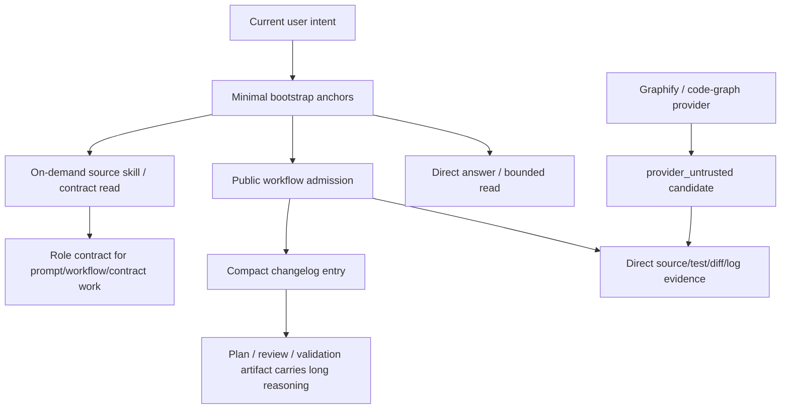
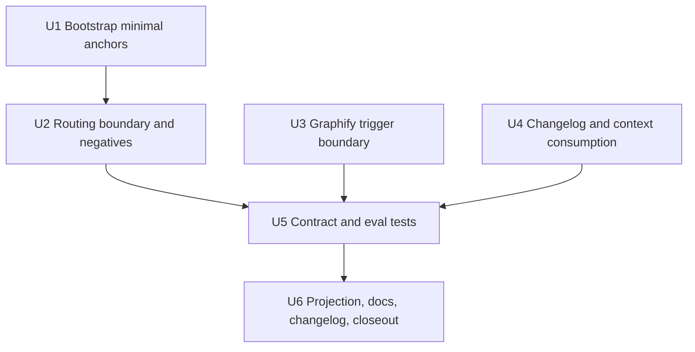

# refactor: Context Injection Progressive Disclosure

## Summary

本计划把 `spec-first` 的常驻上下文从“完整治理规则尽量在场”收敛为“最小入口锚点 + 按需 source 展开”。实施重点是瘦身 `using-spec-first` bootstrap、补轻量请求负例、收窄 Graphify/provider 触发、压缩 changelog 消费方式，并用 focused contract tests 保护 source/runtime、provider advisory 和 workflow routing 边界。

---

## Decision Brief

- **Recommended approach:** 先把常驻启动层降为高信号锚点，完整路由和边界仍留在 `skills/using-spec-first/SKILL.md`、`docs/contracts/context-governance.md`、`docs/contracts/project-graph-consumption.md` 等 source-of-truth；再用 routing cases 和 contract tests 防止回退到过度 workflow / Graphify / changelog 消费。
- **Key decisions:** 保留 `CHANGELOG.md` gate、source/runtime gate 和 public workflow routing；不新增中心化 context router，不把 provider 输出升级为 confirmed truth，不把 skill trigger 等同 public workflow admission。
- **Validation focus:** bootstrap 内容预算与双宿主投影、SessionStart 不复读、轻量请求不进 public workflow、Graphify 非触发场景、provider_untrusted 回源要求、changelog latest-window/compact entry 契约。
- **Largest risks / boundaries:** 最大风险是为了省 token 削弱治理边界，或反过来只追加更多 prose 导致上下文继续膨胀。实施必须以源文件和测试收敛，不手改 `.claude/`、`.codex/`、`.agents/skills/` runtime mirrors。

---

## Problem Frame

`docs/brainstorms/2026-06-08-001-using-spec-first-injection-redesign-requirements.md` 的方向是扩大 `using-spec-first` 启动注入，让模型启动即拿到核心 route map。后续 `docs/10-prompt/context-token-audit/12-context-injection-optimization-notes.md` 和本 successor 需求指出了相反成本：常驻上下文过重、重复注入、Graphify 触发面过宽、CHANGELOG entry 和消费方式过重，以及 skill trigger 与 public workflow admission 的边界容易互相放大。

本计划继承 successor 需求，不改写旧需求。旧需求作为历史证据保留，当前 WHAT 以 `docs/brainstorms/2026-06-12-002-context-injection-progressive-disclosure-requirements.md` 为准：常驻注入只保留当场必须生效的治理锚点；完整策略通过 source-backed progressive disclosure 读取；Graphify/code-graph/provider 只做 advisory navigation；重要结论必须回源确认。

---

## Requirements

- R1. 保留 2026-06-08 旧需求为历史证据，本计划以 2026-06-12 successor 需求的 progressive disclosure 方向为准。
- R2. 常驻启动注入从完整 route map / 长反例 / provider 细节收敛为最小治理锚点、source pointer 和关键禁线。
- R3. `skills/using-spec-first/SKILL.md` 继续作为完整 routing policy source-of-truth；bootstrap 只能是 faithful core subset，不成为第二套完整路由真相源。
- R4. substantial work、prompt/workflow/contract 设计或 source/runtime 判断仍必须按需读取 `docs/10-prompt/结构化项目角色契约.md` 和相关 source skill。
- R5. 不新增中心化强状态机；scripts/tools 只产 deterministic facts、reason_code、paths 和 validation outcome，LLM 继续做语义路由。
- R6. 明确 skill trigger 与 workflow admission 是两层判断；读取 skill 方法论不自动等于进入 public `$spec-*` workflow。
- R7. `using-spec-first` 合法输出包括 direct answer / normal execution；轻量事实问答、当前上下文解释、窄定位查询、当前材料整理不得强制升级为 brainstorm、plan 或 work。
- R8. Graphify 默认只用于架构关系、跨文件关系、影响面和代码库导航；单文档整理、当前对话总结、简单事实问答和用户明确给定材料不默认触发 Graphify。
- R9. Graphify、code-graph 和 capability-class provider 输出必须记录为 advisory / `provider_untrusted`，不得作为 confirmed source truth。
- R10. 重要结论必须回到 source 文件、测试、diff、日志或用户材料确认；无法回源时标注 limitation。
- R11. 任何项目 source 变更继续同步根 `CHANGELOG.md`；本改造不得削弱 changelog gate、user-visible 标记规则或 author 解析规则。
- R12. `CHANGELOG.md` entry 应 compact；长 reasoning 放在 requirements、plan、review 或 validation artifact。
- R13. 普通 workflow 消费 changelog、plan、review、tool output 和 runtime facts 时遵循 summary-first / latest-window / path-backed evidence，不默认读取完整历史、raw logs 或 generated runtime mirror。
- R14. 补 routing negative examples，覆盖问候、当前上下文解释、窄定位查询、当前对话/文档整理不进入 public workflow。
- R15. 保持 source-first：修改 `skills/`、`templates/`、`docs/contracts/`、`CLAUDE.md` / `AGENTS.md` source slices、scripts 或 tests；不得把 generated runtime mirrors 当 source fix。
- R16. 需要 runtime 刷新时，只能在 source 验证后通过 `spec-first init` 重新生成，并在 closeout 中说明 generated runtime impact。
- R17. 双宿主行为保持一致；Claude 与 Codex 差异只体现在 entrypoint spelling、host hooks 和能力边界。

**Origin actors:** A1 顶层 Codex/Claude orchestrator；A2 轻量问答用户；A3 spec-first maintainer；A4 下游 planner/reviewer；A5 optional provider/helper tool。

**Origin flows:** F1 轻量请求直接回答；F2 substantial work 按需展开治理 source；F3 provider-assisted navigation without authority inflation；F4 source 变更记录与消费。

**Origin acceptance examples:** AE1 successor posture；AE2 当前上下文解释可直接答；AE3 治理修改读取角色契约且只改 source；AE4 provider 证据回源或标注未确认；AE5 compact changelog；AE6 routing negative examples。

---

## Assumptions

- A1. 用户已明确调用 `$spec-plan deep` 并给出 successor requirements 路径，本计划按 headless-like plan-write 处理 scoping checkpoint；未另行中断询问，关键可替代选择记录在本节、Scope Boundaries 和 Open Questions。
- A2. 当前计划只规划本仓 `target_repo: .` 的 source 改动；不跨仓写入。
- A3. 旧 2026-06-08 扩注入计划已完成并影响当前 source/test 形态；本计划不是 revert，而是在 successor 需求下做二次校准。
- A4. Graphify 触发收窄需要同时改仓库根 instruction source section 和 `spec-mcp-setup` 的 Graphify instruction renderer，否则 provider install/normalization 会把旧触发规则写回。
- A5. Changelog 优化从 consumption guidance 和 entry 约束开始，不做机械截断历史 changelog，也不改变 `CHANGELOG.md` 必填规则。
- A6. Fresh-source eval 可作为语义验证补充；若当前 host 没有明确 subagent/reviewer dispatch 授权，实施 closeout 必须记录 not-run reason，而不是声称多 reviewer 已跑。

---

## Scope Boundaries

- 不删除 `using-spec-first`，不取消 public `$spec-*` workflow routing。
- 不删除 `CHANGELOG.md` gate，不弱化 source/runtime gate、verification honesty 或 degraded-mode reason_code。
- 不把 Graphify、code-graph、browser、git-worktree 等 helper 暴露成新的 public workflow 入口。
- 不新增中心化 context router、强状态机、全消息拦截器或“每条请求必须 workflow route”的机制。
- 不手改 `.claude/**`、`.codex/**`、`.agents/skills/**` generated runtime mirrors。
- 不把 `graphify-out/graph.json`、provider readiness 或 query success 当成 confirmed evidence。
- 不修改旧 2026-06-08 requirements；只在本计划与后续 source 中显式标注其 successor 状态。

### Deferred to Follow-Up Work

- 对所有 workflow skill 做系统性 prompt slimming；本计划只处理 `using-spec-first`、Graphify instruction、context/changelog contract 和直接相关测试。
- 建立独立 token-budget telemetry 或自动 budget profiler；本计划只要求轻量 line/byte/fixture 级 guard。
- 全量重新设计 changelog 生成工具；本计划只做 compact entry guidance、latest-window consumption 和现有格式测试补强。

---

## Completion Criteria

- `src/cli/instruction-bootstrap.js`、`CLAUDE.md`、`AGENTS.md` 的 managed bootstrap 不再复制完整 intent route map，且仍保留语言、target repo、workflow-first、source/runtime、internal helper、source pointer 等核心锚点。
- `skills/using-spec-first/SKILL.md` 明确 skill trigger、direct answer、public workflow admission、host-level dispatch authorization 的边界。
- `skills/using-spec-first/evals/**` 或测试 fixture 覆盖轻量请求负例：问候、当前上下文解释、窄定位查询、当前对话/文档整理。
- Graphify instruction source 和 `spec-mcp-setup` renderer 均收窄默认触发条件，并保留 `/graphify` 显式触发、provider_untrusted、回源确认和 setup repair path。
- `docs/contracts/context-governance.md` 或相关 workflow prose 明确 changelog latest-window / summary-first consumption，不削弱根 `CHANGELOG.md` source change 记录要求。
- Focused tests 覆盖 bootstrap budget、SessionStart 不复读、routing negatives、Graphify trigger boundary、project-graph candidate-only、changelog compact/latest-window contract。
- Closeout 说明是否运行 `spec-first init`；如果未刷新 runtime mirrors，明确 source 已变更但 generated runtime refresh 待后续执行。

---

## Direct Evidence Readiness

- **target_repo:** `.`
- **evidence_sources:** direct source reads, `rg`, git status/revision, planning-depth helper, prior Graphify query summary from session handoff, existing unit/contract tests.
- **source_refs:** `docs/brainstorms/2026-06-12-002-context-injection-progressive-disclosure-requirements.md`, `docs/brainstorms/2026-06-08-001-using-spec-first-injection-redesign-requirements.md`, `docs/10-prompt/context-token-audit/12-context-injection-optimization-notes.md`, `docs/10-prompt/结构化项目角色契约.md`, `src/cli/instruction-bootstrap.js`, `templates/claude/hooks/session-start`, `templates/codex/hooks/session-start`, `skills/using-spec-first/SKILL.md`, `skills/using-spec-first/evals/examples.json`, `docs/contracts/context-governance.md`, `docs/contracts/project-graph-consumption.md`, `skills/spec-mcp-setup/scripts/install-helpers.sh`, `skills/spec-mcp-setup/scripts/install-helpers.ps1`, `CLAUDE.md`, `AGENTS.md`, `tests/unit/instruction-bootstrap.test.js`, `tests/unit/using-spec-first-contracts.test.js`, `tests/unit/context-governance-contracts.test.js`, `tests/unit/project-graph-consumption-contracts.test.js`, `tests/unit/prompt-examples-contracts.test.js`, `tests/unit/codex-session-start-hook.test.js`, `tests/unit/claude-settings.test.js`, `tests/unit/mcp-setup.sh`, `tests/unit/mcp-setup-powershell-contracts.test.js`, `tests/unit/changelog-format.test.js`, `tests/unit/changelog-skill-contracts.test.js`, `package.json`, `CHANGELOG.md`.
- **current_revision:** `a98b9b89`
- **worktree_status:** dirty before this plan write: `CHANGELOG.md` modified; untracked `docs/10-prompt/context-token-audit/12-context-injection-optimization-notes.md`, successor requirements doc, related dispatch-governance plan, and a task-pack file were present. Do not revert or overwrite unrelated dirty work.
- **confidence:** high for source/runtime and provider boundary direction; medium for exact bootstrap budget and changelog fixture shape until implementation edits current source and tests.
- **limitations:** No implementation tests were run before plan write. Prior Graphify query was low-value and is treated as `provider_untrusted`, not conclusion evidence. No external web research was used because the plan is repo-local prompt/workflow governance.

---

## Direct Evidence

- **repo_scope:** single repo, `target_repo: .`
- **source_reads_completed:** full successor requirements, old 2026-06-08 requirements, context-token audit note, role contract, `spec-plan` governance/template/handoff refs, bootstrap generator and tests, SessionStart hooks, using-spec-first source/evals/tests, context and project-graph contracts, Graphify instruction source and renderers, changelog format/tests, package scripts, and adjacent dispatch-governance plan.
- **source_reads_required:** implementation must reread target files immediately before editing, especially `CHANGELOG.md`, `skills/using-spec-first/SKILL.md`, `src/cli/instruction-bootstrap.js`, `CLAUDE.md`, `AGENTS.md`, and `skills/spec-mcp-setup/scripts/install-helpers.*`, because concurrent dirty source may change.
- **commands_or_tools_used:** `git status --short`, `git rev-parse --short HEAD`, `rg --files`, targeted `rg`, targeted `sed`, `node bin/spec-first.js internal task-governance-signals --json`.
- **advisory_tool_facts:** planning-depth helper returned `candidate_level: deep` with `cross-module`, `many-files-or-paths`, `critical-path-hit`, `keyword-hit`, and risk domains `cli`, `contract`, `runtime`, `workflow`.
- **provider_untrusted:** prior Graphify query reportedly returned only weak CHANGELOG-centered context; it was not used to support planning conclusions.
- **impact_on_plan:** confirms Deep scope because the work crosses host instruction source, workflow skill prose, provider setup scripts, contracts, eval fixtures, tests, docs, and runtime regeneration closeout.
- **key_findings:** current SessionStart hooks already avoid duplicate full bootstrap injection; current bootstrap still enumerates a broad intent map; current `examples.json` has only one broad lightweight negative; current Graphify instruction says “For codebase questions, first use Graphify”; current project-graph contract already says provider output is candidate-only; current changelog tests only pin format, not compact/latest-window consumption.
- **limitations:** Direct evidence is bounded to named source/test surfaces and does not claim repository-wide prompt slimness coverage.

---

## Context & Research

### Relevant Code and Patterns

- `src/cli/instruction-bootstrap.js` builds Chinese/English, Claude/Codex bootstrap blocks from a single generator surface and current tests assert key tokens plus line-count bounds.
- `templates/claude/hooks/session-start` and `templates/codex/hooks/session-start` detect existing managed blocks and emit short governance pointers instead of re-injecting the full body.
- `skills/using-spec-first/SKILL.md` already defines the entry-governor contract, direct answer/normal execution output, source/runtime boundary, dispatch admission boundary, and public route map.
- `skills/using-spec-first/evals/examples.json` is examples-as-context, not a routing state machine; `tests/unit/prompt-examples-contracts.test.js` currently keeps examples compact with a 4-6 item range.
- `docs/contracts/project-graph-consumption.md` already defines candidate-only, no skip-layer elevation, fallback, and `provider_untrusted` recording rules; its body intentionally avoids provider-specific names outside the appendix.
- `CLAUDE.md`, `AGENTS.md`, and `skills/spec-mcp-setup/scripts/install-helpers.*` currently render Graphify instruction text that defaults to “For codebase questions, first use Graphify”.
- `docs/contracts/context-governance.md` already has runtime/generated exclusions and summary-first rules, but changelog-specific latest-window guidance is only implicit through release-note skill behavior and the token audit note.

### Institutional Learnings

- The 2026-06-08 plan and current tests show how route-map identifier tests can become overfitted to an expanded bootstrap direction; this plan should update those tests to protect a curated core subset instead of requiring full route enumeration.
- The 2026-06-12 dispatch-governance plan is adjacent work and should not be overwritten. Implementation should preserve its stricter Codex `spawn_agent` admission boundary and rerun relevant dispatch tests if touching `using-spec-first` bootstrap wording.
- Existing `project-graph-consumption` and provider-readiness docs already carry the right trust model; the gap is trigger breadth and source projection, not evidence schema.

### External References

- None used. The work is internal prompt/workflow governance with sufficient local source and test evidence.

---

## Key Technical Decisions

- KTD1. **Minimal anchor over full route map:** Keep bootstrap as an admission and boundary anchor, not a complete route table. Full route details remain in `skills/using-spec-first/SKILL.md`.
- KTD2. **Negative routing coverage before prose confidence:** Add focused negative routing cases for lightweight requests so prompt wording changes have executable guardrails.
- KTD3. **Skill trigger is not workflow admission:** Global skill use can load a method or source; public workflow admission is a separate artifact/validation/handoff boundary.
- KTD4. **Provider trigger narrows at source and renderer:** Graphify trigger text must be updated in `CLAUDE.md` / `AGENTS.md` source and in `spec-mcp-setup` renderers so setup normalization does not reintroduce the broad trigger.
- KTD5. **Provider evidence stays advisory:** Reuse `project-graph-consumption.md` and `provider_untrusted`; do not add a Graphify-specific confirmed evidence schema.
- KTD6. **Changelog gate remains hard; consumption becomes compact:** Optimize entry shape and reading scope, not the existence of changelog records.
- KTD7. **Tests protect invariants, not every sentence:** Use budget, source pointer, key-token, route-subset, negative-case, and renderer parity tests; avoid forcing exact prose equality across skill, bootstrap, and host instruction files.
- KTD8. **Runtime regeneration is a closeout action:** Source validation comes first. `spec-first init` may refresh runtime mirrors after tests, but generated mirrors are never edited by hand.

---

## Open Questions

### Resolved During Planning

- **Should old 2026-06-08 requirements be edited or deleted?** No. Keep it as historical decision evidence and let this successor plan define the current implementation direction.
- **Should Graphify be removed from normal planning/review workflows?** No. It remains useful for architecture relationships and broad navigation, but default triggers narrow and conclusions require source confirmation.
- **Should changelog be made optional to reduce tokens?** No. Keep the gate; optimize entry compactness and consumer reading windows.
- **Should a central context router decide all requests mechanically?** No. That conflicts with Light contract and LLM-owned semantic routing.

### Deferred to Implementation

- **Exact bootstrap budget:** Choose final line/byte thresholds after editing the compressed block; tests should allow normal wording maintenance but fail on large expansion.
- **Routing fixture shape:** Decide whether to add `skills/using-spec-first/evals/routing-cases.json` or extend existing examples with structured fields. Prefer a separate machine-judgable fixture if adding all negative cases would bloat examples-as-context.
- **Runtime refresh timing:** Run `spec-first init` only after source tests pass and only if the implementation owner wants checked local runtime mirrors refreshed in the same session.
- **Docs breadth:** Decide during implementation whether README/user-manual updates are needed beyond contracts and changelog; avoid expanding documentation unless user-visible behavior changes require it.

---

## High-Level Technical Design

> *This illustrates the intended approach and is directional guidance for review, not implementation specification. The implementing agent should treat it as context, not code to reproduce.*

The core flow is two-stage: the bootstrap decides whether deeper context is warranted; deeper source files then provide the full policy. Providers only shrink the next read and never skip source confirmation.

---

## Implementation Units

### U1. Recalibrate bootstrap to minimal persistent anchors

**Goal:** Reduce generated bootstrap from a near-complete route table to a compact admission/boundary anchor while preserving source/runtime, target repo, language, internal helper, and workflow-first signals.

**Requirements:** R2, R3, R4, R5, R6, R7, R15, R17

**Dependencies:** None

**Files:**
- Modify: `src/cli/instruction-bootstrap.js`
- Modify: `skills/using-spec-first/SKILL.md`
- Modify: `CLAUDE.md`
- Modify: `AGENTS.md`
- Test: `tests/unit/instruction-bootstrap.test.js`
- Test: `tests/unit/using-spec-first-contracts.test.js`
- Test: `tests/unit/context-governance-contracts.test.js`
- Test: `tests/unit/init-dry-run.test.js`

**Approach:**
- Keep bootstrap as a bilingual compressed core subset: language source, substantial-work admission, direct-answer allowance, source/runtime exclusion, target_repo write boundary, active workflow/subagent non-reroute, current host entrypoint spelling, internal helper non-exposure, and pointer to `skills/using-spec-first/SKILL.md`.
- Replace full `入口映射(意图→入口)` / `Entry map` enumeration with shorter category anchors or a source pointer. Keep enough examples for obvious route families, but do not enumerate every public workflow.
- Update `skills/using-spec-first/SKILL.md` to state that bootstrap is an admission/boundary core subset, not the complete route map.
- Update tests that currently require broad route identifier coverage so they assert curated anchors and prohibit complete route-table expansion instead of preserving the old expanded-bootstrap posture.
- Preserve the existing SessionStart design: hooks should continue to emit short pointers when checked-in instruction files already carry the managed block.

**Execution note:** Start with focused tests for the new bootstrap budget and route-map non-expansion, then update generator and source slices.

**Patterns to follow:**
- `src/cli/instruction-bootstrap.js` host/language helper pattern.
- `tests/unit/instruction-bootstrap.test.js` line-count and marker-repair style.
- `templates/*/hooks/session-start` short-pointer behavior.

**Test scenarios:**
- Happy path: generated Claude and Codex bootstrap blocks include minimal anchors and `skills/using-spec-first/SKILL.md` pointer.
- Happy path: language policy, target_repo boundary, generated mirror exclusion, direct-answer allowance, and internal helper non-exposure remain present.
- Edge case: bootstrap no longer contains a complete route table with every public workflow identifier.
- Edge case: `inspectInstructionBootstrap` reports installed for the new block and drifted when a load-bearing anchor is changed.
- Error path: adding a large route table or provider-specific detail to bootstrap fails a budget/non-expansion test.
- Integration: SessionStart hook output remains a short pointer and does not duplicate `CLAUDE.md` / `AGENTS.md` managed block contents.

**Verification:**
- Focused bootstrap and init-dry-run tests pass.
- Checked-in `CLAUDE.md` / `AGENTS.md` managed source slices match the new generator output.

---

### U2. Clarify routing boundary and add lightweight negative cases

**Goal:** Make lightweight requests a first-class direct-answer outcome and mechanically guard against over-routing from skill trigger or workflow-first language.

**Requirements:** R6, R7, R14, R15, R17

**Dependencies:** U1

**Files:**
- Modify: `skills/using-spec-first/SKILL.md`
- Modify: `skills/using-spec-first/evals/examples.json`
- Create or modify: `skills/using-spec-first/evals/routing-cases.json`
- Test: `tests/unit/prompt-examples-contracts.test.js`
- Test: `tests/unit/using-spec-first-contracts.test.js`
- Test: `tests/unit/spec-dispatch-boundary-contracts.test.js`

**Approach:**
- Add explicit prose that skill trigger/source loading is not public workflow admission; `using-spec-first` may decide direct answer / bounded direct read / normal execution.
- Add machine-judgable negative cases for:
  - greeting;
  - "当前上下文注入了哪些内容";
  - "where is X used" narrow lookup;
  - current conversation or user-provided document summarization.
- Keep examples-as-context compact. If existing `examples.json` would exceed its 4-6 item budget, add a separate routing-case fixture with structured expected outcomes and update tests accordingly.
- Preserve explicit-route precedence: `$spec-plan`, `$spec-work`, `$spec-doc-review` still route when the user explicitly invokes them.
- Preserve dispatch governance from the adjacent 2026-06-12 dispatch plan: public workflow admission does not automatically authorize Codex `spawn_agent`.

**Execution note:** Treat routing fixtures as behavior guardrails, not as a hardcoded router state machine.

**Patterns to follow:**
- `skills/using-spec-first/evals/examples.json` examples-as-context framing.
- `tests/unit/prompt-examples-contracts.test.js` fixture shape checks.
- `tests/unit/spec-dispatch-boundary-contracts.test.js` dispatch admission boundary.

**Test scenarios:**
- Happy path: explicit `$spec-plan` remains honored for plan requests.
- Happy path: clear docs/source edit request routes to work/plan as appropriate.
- Edge case: greeting returns direct answer and expects no public workflow artifact.
- Edge case: current context injection explanation returns direct answer or bounded source read, not `$spec-plan` / `$spec-work`.
- Edge case: narrow "where is X used" lookup may use `rg`/bounded reads and does not require workflow admission.
- Edge case: summarizing a user-provided current document does not trigger Graphify or public workflow by default.
- Error path: fixture expecting a lightweight direct answer fails if mapped to brainstorm/plan/work.

**Verification:**
- Routing fixture tests and `using-spec-first` contract tests pass.
- No new hidden helper skill is presented as a public `$spec-*` entrypoint.

---

### U3. Narrow Graphify and provider trigger boundaries

**Goal:** Keep Graphify valuable for architecture navigation while preventing simple docs/current-material questions from defaulting to project-graph provider calls.

**Requirements:** R8, R9, R10, R15, R17

**Dependencies:** None

**Files:**
- Modify: `CLAUDE.md`
- Modify: `AGENTS.md`
- Modify: `skills/spec-mcp-setup/scripts/install-helpers.sh`
- Modify: `skills/spec-mcp-setup/scripts/install-helpers.ps1`
- Modify: `docs/contracts/project-graph-consumption.md`
- Test: `tests/unit/project-graph-consumption-contracts.test.js`
- Test: `tests/unit/mcp-setup.sh`
- Test: `tests/unit/mcp-setup-powershell-contracts.test.js`
- Test: `tests/unit/dependency-readiness-baseline.test.js`

**Approach:**
- Change Graphify instruction text from broad "For codebase questions, first use Graphify" to narrower trigger language: architecture relationships, cross-file relationships, impact analysis, broad codebase navigation, and "how does X connect to Y".
- Add explicit non-trigger examples: simple factual Q&A, current conversation summarization, user-provided single document summarization/editing, and already-scoped file reads.
- Preserve explicit `/graphify` handling where present.
- Keep setup repair path host-specific (`/spec:mcp-setup --only graphify` or `$spec-mcp-setup --only graphify`).
- Reuse `docs/contracts/project-graph-consumption.md` for trust tiers and `provider_untrusted`; do not add provider-specific commands to the contract body beyond the existing appendix.
- Update both Bash and PowerShell renderers so provider install/normalization writes the same narrowed instruction section.

**Execution note:** Run tests before and after edits around provider scripts because Bash/PowerShell parity is easy to drift.

**Patterns to follow:**
- Current `render_graphify_instruction_section` / `Get-GraphifyInstructionSection` dual renderer.
- `project-graph-consumption` provider-neutral body with provider-specific appendix.
- Existing mcp-setup tests that assert ordinary workflows do not refresh project graphs.

**Test scenarios:**
- Happy path: architecture relationship query remains a valid Graphify trigger.
- Happy path: explicit `/graphify` still invokes Graphify skill first where that instruction exists.
- Edge case: "summarize this document" is a non-trigger in rendered instruction text.
- Edge case: "当前上下文注入了哪些内容" is not represented as Graphify-required work.
- Error path: Graphify output cannot be described as confirmed evidence without source/test/log/doc confirmation.
- Integration: Bash and PowerShell renderers emit matching trigger/non-trigger rules with host-specific setup repair path.

**Verification:**
- Provider contract tests and mcp-setup Bash/PowerShell tests pass.
- Root `CLAUDE.md` and `AGENTS.md` graphify sections match the renderer intent.

---

### U4. Add changelog and artifact consumption constraints

**Goal:** Keep `CHANGELOG.md` as a mandatory source governance record while preventing ordinary workflows from consuming or writing long changelog bodies by default.

**Requirements:** R11, R12, R13, R15

**Dependencies:** None

**Files:**
- Modify: `docs/contracts/context-governance.md`
- Modify: `skills/using-spec-first/SKILL.md`
- Modify: `skills/spec-release-notes/SKILL.md`
- Test: `tests/unit/context-governance-contracts.test.js`
- Test: `tests/unit/changelog-format.test.js`
- Test: `tests/unit/spec-release-notes-contracts.test.js`

**Approach:**
- Add explicit changelog consumption guidance to `context-governance`: ordinary workflows read format guidance plus latest relevant window; release/history tasks may expand the window.
- Add compact entry guidance: one concise source/user-visible/validation/caveat summary, with long design reasoning in plan/review/validation artifacts by path.
- Keep author resolution via `~/.spec-first/.developer`; do not add a second source for author identity.
- Preserve `spec-release-notes` rule that scoped answers should not dump long changelog bodies.
- Avoid mechanical hard caps on historical changelog entries; enforce format and consumption guidance rather than rewriting history.

**Patterns to follow:**
- `docs/contracts/context-governance.md` summary-first and runtime exclusion sections.
- `tests/unit/changelog-format.test.js` current format guard.
- `skills/spec-release-notes/SKILL.md` anti-long-dump rule.

**Test scenarios:**
- Happy path: source change still requires root `CHANGELOG.md` update.
- Happy path: compact entry guidance mentions source surface, verification or not-run reason, and caveat path when needed.
- Edge case: ordinary plan/work/review context should not require reading full historical changelog.
- Error path: prose that makes changelog optional for source changes fails contract tests.
- Error path: release-note skill must not encourage copying long changelog sequences.

**Verification:**
- Context governance and changelog/release-note focused tests pass.
- U4 source changes are covered by the single implementation changelog entry owned by U6.

---

### U5. Consolidate focused contract and eval coverage

**Goal:** Build the regression net that proves progressive disclosure improved boundaries without weakening high-risk governance.

**Requirements:** R2-R17

**Dependencies:** U1, U2, U3, U4

**Files:**
- Modify: `tests/unit/instruction-bootstrap.test.js`
- Modify: `tests/unit/using-spec-first-contracts.test.js`
- Modify: `tests/unit/prompt-examples-contracts.test.js`
- Modify: `tests/unit/context-governance-contracts.test.js`
- Modify: `tests/unit/project-graph-consumption-contracts.test.js`
- Modify: `tests/unit/mcp-setup.sh`
- Modify: `tests/unit/mcp-setup-powershell-contracts.test.js`
- Modify: `tests/unit/codex-session-start-hook.test.js`
- Modify: `tests/unit/claude-settings.test.js`
- Inspect: `tests/unit/spec-dispatch-boundary-contracts.test.js`

**Approach:**
- Replace old expanded-bootstrap invariants with progressive-disclosure invariants:
  - minimal bootstrap anchors present;
  - route table not fully copied;
  - source pointer present;
  - source/runtime and target_repo boundaries present;
  - SessionStart short-pointer behavior unchanged.
- Add routing negative tests or fixture assertions for the four origin negative examples.
- Add Graphify trigger/non-trigger tests against root instruction sections and renderers.
- Add changelog consumption guidance assertions without overfitting exact prose.
- Keep dispatch-boundary tests green if touching Codex workflow admission wording.

**Execution note:** Use the narrowest Jest/shell tests first, then `npm run test:unit` only if touched surfaces justify it.

**Patterns to follow:**
- Existing contract tests read source directly with Node `fs`.
- Existing shell tests in `tests/unit/mcp-setup.sh` use precise grep assertions for script contracts.

**Test scenarios:**
- Happy path: Deep governance work still routes through public workflow when explicitly invoked.
- Happy path: prompt/workflow/contract work still requires role contract source read.
- Edge case: lightweight current-context explanation fixture expects no workflow artifact.
- Edge case: Graphify renderer non-trigger examples survive both Bash and PowerShell variants.
- Error path: generated mirror paths appear as source-fix targets in guidance and fail tests.
- Error path: provider output promoted to confirmed truth without source confirmation fails contract tests.

**Verification:**
- Focused tests for all touched units pass.
- `npm run lint:skill-entrypoints` passes if public entrypoint prose changed.
- `git diff --check` passes.

---

### U6. Projection, docs, changelog, and closeout discipline

**Goal:** Finish source-level consistency, record the change, and make runtime impact explicit without silently patching generated mirrors.

**Requirements:** R1, R11, R12, R15, R16, R17

**Dependencies:** U1, U2, U3, U4, U5

**Files:**
- Modify: `CHANGELOG.md`
- Inspect or modify: `README.md`
- Inspect or modify: `README.zh-CN.md`
- Inspect or modify: `docs/05-用户手册/05-最佳实践.md`
- Inspect: `.claude/**`
- Inspect: `.codex/**`
- Inspect: `.agents/skills/**`
- Test: `tests/unit/sync-instruction-files.test.js`
- Test: `tests/smoke/cli.sh`

**Approach:**
- Add a compact changelog entry naming user-visible prompt/context behavior, source surfaces, focused validation, and runtime regeneration status.
- If root `CLAUDE.md` changes outside managed blocks, run or account for `npm run sync:instructions` so `AGENTS.md` remains derived correctly.
- Decide after tests whether to run `spec-first init`; if run, disclose generated runtime impact and verify no generated mirror was used as source truth. If not run, state runtime refresh is pending.
- Run fresh-source eval for `using-spec-first` / bootstrap changes when authorized; otherwise record `fresh_source_eval: not_run` with reason.
- Check README/user manual only if public behavior descriptions need updating; avoid docs churn for internal wording only.

**Patterns to follow:**
- `CHANGELOG.md` current timestamped v1.10.0 format.
- `tests/unit/sync-instruction-files.test.js` derived AGENTS guard.
- `docs/contracts/workflows/fresh-source-eval-checklist.md` honesty checklist.

**Test scenarios:**
- Happy path: changelog entry exists and stays compact.
- Happy path: `AGENTS.md` remains derivable from `CLAUDE.md` with its own managed region preserved.
- Edge case: runtime regeneration not run is explicitly disclosed and not treated as failure.
- Error path: generated runtime mirror diff is not cited as source evidence.
- Integration: smoke/init tests still project the updated bootstrap and using-spec-first runtime surfaces.

**Verification:**
- `git diff --check` passes.
- Focused unit/smoke tests selected from touched surfaces pass or closeout states exact not-run reason.
- Runtime refresh status and fresh-source eval status are recorded honestly.

---

## System-Wide Impact

- **Top-level orchestrators:** Fewer tokens stay permanently in bootstrap; substantial work still routes into public workflow and expands source policy on demand.
- **Lightweight users:** Greetings, current-context explanations, narrow lookups, and current-material summaries should avoid unnecessary workflow artifacts and Graphify calls.
- **Maintainers:** Source/runtime and changelog gates remain; tests move from “more text present” to “right anchors present, over-expansion absent”.
- **Provider setup:** Graphify installer/renderers must emit narrower trigger guidance consistently across Bash/PowerShell and Claude/Codex instruction files.
- **Downstream planners/reviewers:** Provider evidence remains `provider_untrusted`; long reasoning moves to artifacts, while changelog entries become compact breadcrumbs.
- **Runtime mirrors:** Generated mirrors may need refresh after source validation, but they are not implementation inputs or source fixes.

---

## Risks & Dependencies

| Risk | Mitigation |
|------|------------|
| Bootstrap becomes too thin and future agents miss routing boundaries | Keep source/runtime, target_repo, substantial-work, direct-answer, host entrypoint, internal-helper, and source pointer anchors; add focused tests. |
| Tests overcorrect and make full route map impossible to maintain where needed | Test curated anchor set and non-expansion budget, not exact prose; full route map stays in `using-spec-first`. |
| Skill trigger vs workflow admission remains ambiguous | Add explicit prose and negative routing cases; keep examples readable and machine-judgable fixture separate if needed. |
| Graphify instruction regresses through setup renderer | Update root instruction sections and Bash/PowerShell renderers together; add parity tests. |
| Changelog compactness guidance weakens auditability | Keep mandatory entry, author source, user-visible marker, and artifact path references; only reduce long reasoning in the entry. |
| Adjacent dispatch-governance dirty work is overwritten | Reread dirty files before editing; preserve stricter Codex `spawn_agent` boundary and rerun related tests if touched. |
| Fresh-source eval cannot run | Record not-run reason and rely on focused source/tests; do not claim semantic reviewer coverage. |
| Runtime behavior stays stale after source changes | Run `spec-first init` after validation when desired, or explicitly disclose pending runtime regeneration. |

---

## Alternative Approaches Considered

- **Keep expanded bootstrap and only add negative evals:** Rejected because it does not solve the persistent token cost or duplicate route-map truth problem identified by the successor requirements.
- **Delete bootstrap down to a single pointer:** Rejected because source/runtime, target_repo, direct-answer, and workflow-first anchors must be present before the model decides whether to read more.
- **Build a deterministic context router:** Rejected because it violates the project role contract: scripts prepare facts, LLM decides semantic routing.
- **Disable Graphify by default everywhere:** Rejected because project-graph remains useful for architecture/cross-file navigation; the problem is trigger breadth and trust elevation, not the provider's existence.
- **Make changelog optional for docs-only/source-only changes:** Rejected because it weakens source governance and breaks existing repo policy.

---

## Success Metrics

- Lightweight routing fixtures expect direct answer / bounded read for all four origin negative examples.
- Bootstrap block is measurably shorter or less complete than the current route-table style while retaining required anchors.
- SessionStart hook output remains a short pointer and does not duplicate the managed block.
- Graphify instruction text includes trigger and non-trigger criteria, and tests prevent broad "all codebase questions first use Graphify" wording from returning.
- Changelog entry for this work references the plan rather than embedding long design reasoning.
- Focused unit/contract tests pass, and any skipped broader validation is explicitly explained.

---

## Phased Delivery

### Phase 1: Routing Core

- Land U1 and U2 together so bootstrap thinning and direct-answer/routing negative guidance remain coherent.
- Validate with focused `instruction-bootstrap`, `using-spec-first`, prompt examples/routing fixture, and SessionStart tests.

### Phase 2: Provider and Artifact Consumption

- Land U3 and U4 after routing core stabilizes.
- Validate Graphify renderer parity, project-graph contract, context governance, changelog format/release-note tests.

### Phase 3: Regression Net and Runtime Closeout

- Land U5 and U6.
- Run focused tests, `git diff --check`, optional full unit/smoke where warranted, then decide whether to run `spec-first init`.

---

## Documentation Plan

- Update `docs/contracts/context-governance.md` for changelog latest-window and compact consumption.
- Update `docs/contracts/project-graph-consumption.md` only if trigger/non-trigger wording needs a provider-neutral anchor; keep provider-specific details in appendix or setup renderer.
- Update `skills/using-spec-first/SKILL.md` for skill trigger vs workflow admission and bootstrap source-of-truth posture.
- Update README/user manual only if the user-visible behavior description changes beyond internal workflow governance.
- Add a compact `CHANGELOG.md` entry for this plan and a separate implementation entry when work executes.

---

## Operational / Rollout Notes

- This plan changes prompt/workflow governance, so cached current-session skill text may not reflect final behavior. Semantic validation should use fresh source reads or fresh-source eval, not the current loaded skill instance.
- Runtime mirrors should be regenerated only after source validation. If local runtime refresh is skipped, closeout must say so.
- Graphify provider setup may rewrite root instruction sections during install/normalization; keeping renderers aligned is part of rollout, not optional cleanup.

---

## Sources & References

- **Origin document:** `docs/brainstorms/2026-06-12-002-context-injection-progressive-disclosure-requirements.md`
- **Superseded direction:** `docs/brainstorms/2026-06-08-001-using-spec-first-injection-redesign-requirements.md`
- **Cost analysis:** `docs/10-prompt/context-token-audit/12-context-injection-optimization-notes.md`
- **Role contract:** `docs/10-prompt/结构化项目角色契约.md`
- **Routing source:** `skills/using-spec-first/SKILL.md`
- **Bootstrap generator:** `src/cli/instruction-bootstrap.js`
- **Context contract:** `docs/contracts/context-governance.md`
- **Project graph contract:** `docs/contracts/project-graph-consumption.md`
- **Graphify renderer:** `skills/spec-mcp-setup/scripts/install-helpers.sh`, `skills/spec-mcp-setup/scripts/install-helpers.ps1`
- **Adjacent plan:** `docs/plans/2026-06-12-008-fix-using-spec-first-dispatch-governance-plan.md`
