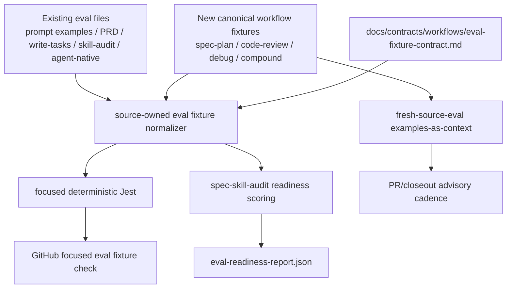
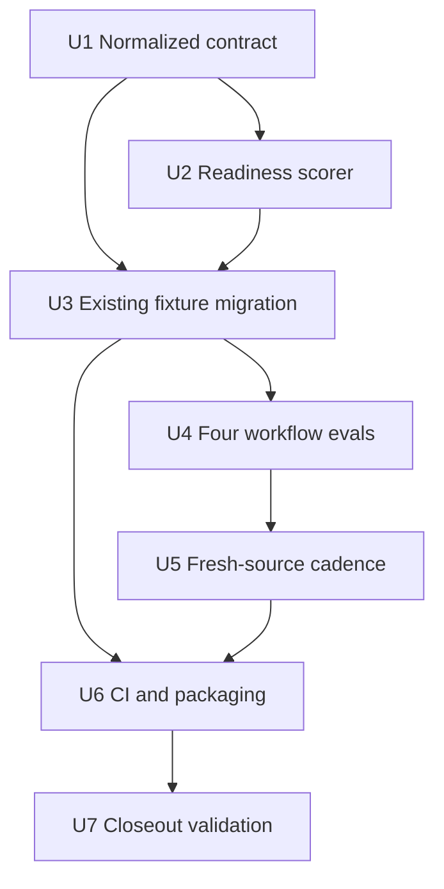

# refactor: Unify eval readiness fixture schema

## Summary

本计划把 agent-native 审查报告中的 W1 主线落成一个 Deep 级 eval readiness 改造方案：先建立最小 normalized fixture envelope 和 source-owned normalizer，再让 `spec-skill-audit` 评分器消费同一个 normalized 解释层和结构化 `coverage_tags`，随后按 first-wave heuristic 给 4 个 workflow 补 `trigger` / `boundary` 样例，并把 fresh-source-eval 变成有节奏的 advisory 验证，而不是硬 CI gate。

---

## Decision Brief

- **Recommended approach:** 采用“canonical normalized envelope + source-owned normalizer + legacy adapter”的轻量契约，保留现有 fixture 文件和局部字段，新增统一读取/评分层，避免一次性重写成重型 eval 平台。
- **Key decisions:** deterministic tests 只校验 JSON shape、唯一性、coverage tags、source refs authority、bucket-level 最低结构证据和评分器消费；语义质量仍由 fresh-source-eval、人工抽样和后续 review 判断。
- **Validation focus:** `write-audit-artifacts.js` 不再依赖文件名 regex；新增/迁移 fixture 能被同一个 source-owned normalizer 解释；first-wave 4 个 workflow 至少具备 trigger/boundary 覆盖；fresh-source-eval 记录诚实区分 `passed`、`concerns`、`not_run`。
- **Largest risks / boundaries:** 不引入 promptfoo/LangSmith/Braintrust/OpenAI Evals 等外部平台（OpenAI Evals 已进入弃用关停时间线），不快照断言 prose，不把 LLM judge 变成 release blocker，不手改 generated runtime mirrors。

---

## Problem Frame

审查报告确认 spec-first 的 eval 方法论方向是对的：结构化 examples、廉价断言、fresh-source-eval 和人工/LLM 抽样，符合“scripts prepare, LLM decides”。真实短板不是“没做 eval”，而是两点：

- fixture schema 已经形成 5 套局部形态，字段名和语义入口发散，后续补 case 时很难复用判断。
- `skills/spec-skill-audit/scripts/write-audit-artifacts.js` 当前用文件名中的 `trigger`、`boundary`、`failure`、`expected` 判 readiness，导致内容充分但文件名不匹配的 eval 被低估。

这会让 Evaluation Harness 的信号不诚实：scorecard 可能惩罚命名而不是覆盖，也可能鼓励为得分而改文件名。计划目标是让 readiness 分数回到“覆盖了什么语义风险”这个问题上，同时继续保持 spec-first 的 light contract。

---

## Requirements

- R1. 建立一个 repo 内最小 eval fixture envelope，能表达 `id`、`input`、按 tag 分级的 `expected_outcome`、`coverage_tags[]`、`source_refs[]`、`source_ref_authority`、`boundary_note`、`forbidden_signals[]`，并允许各 skill 保留局部扩展字段。
- R2. 提供 source-owned legacy normalizer，让现有 `prompt-examples/v1`、`spec-prd-evals.v1`、`spec-write-tasks` 四件套、`spec-skill-audit` cases、`agent-native-architecture` examples 都能规范化为同一 normalized shape；生产 scorer 与 contract tests 必须消费同一个 normalizer，避免双实现漂移。
- R3. `spec-skill-audit` readiness 评分必须读取 normalized schema、declared structural `coverage_tags` 和 bucket-level 最低结构证据，而不是从文件名 regex 推断覆盖类型；report 必须把 tags 表述为 declared structural coverage，不声称它们证明语义质量。
- R4. 新增或迁移 fixture 的 deterministic tests 只校验结构、枚举、source refs、coverage completeness，不判断 prose 语义质量。
- R5. 按 first-wave selection table 给 `spec-plan`、`spec-code-review`、`spec-debug`、`spec-compound` 各补最小 trigger/boundary eval fixtures，覆盖核心链路入口和边界误触发，不追求 failure/expected 四件套。
- R6. fresh-source-eval 作为 L2 语义验证节奏进入 PR/closeout 可见面，并支持 judge 与人工抽样校准；它不能成为随机、不可复现的硬 gate，且 PR template 字段必须允许非 prompt/skill 变更填写 `N/A`，避免把 eval 术语强加给所有 PR。
- R7. 全部变更必须 source-first：只改 `skills/`、`docs/`、`tests/`、`.github/`、`package.json` 等 source；不手改 `.claude/`、`.codex/`、`.agents/skills/`。
- R8. 执行完成必须同步 `CHANGELOG.md`，并在 closeout 中说明 runtime impact、fresh-source-eval 状态、未执行原因和验证命令。

---

## Assumptions

- A1. 当前目标 repo 是 `spec-first` 单仓；所有计划路径均为 repo-relative。
- A2. 这次计划从审查报告直接进入 HOW 设计，无单独 brainstorm/PRD origin；W1 的 WHAT 已由审查报告定界。
- A3. 当前 Codex 请求没有授权 subagents / parallel agents，因此本计划生成阶段不派发 research/review 子代理；后续执行 fresh-source-eval 时仍应按当时 host 权限诚实记录。
- A4. 现有 GitHub repo 没有 PR template；本计划若执行 U5，则新增 `.github/pull_request_template.md` 作为 advisory checklist，但其 fresh-source/runtime 字段只对 `skills/**`、`agents/**`、`templates/**`、host entry blocks 或 workflow/prompt prose 变更适用，其他 PR 可填 `N/A`，且它不是 merge gate。

---

## Scope Boundaries

- 不新增外部 eval SaaS / framework 依赖；OpenAI Evals 已被官方确认弃用（2026-06-03 通知弃用、2026-10-31 转只读、2026-11-30 dashboard 与 API 关停，官方迁移目标为 Promptfoo），更不能作为新基础设施。
- 不把所有 public workflow 一次性补齐 eval；本轮只做 first-wave selection table 里的 `spec-plan`、`spec-code-review`、`spec-debug`、`spec-compound` 四个核心链路/高风险 workflow。这里的 first-wave 是 planning judgment，不伪装成有完整使用频率统计的 confirmed fact。
- 不把 fresh-source-eval 纳入必过 CI；CI 只跑 deterministic JSON/contract/scoring checks。
- 不创建新的 public workflow、agent 或 command；这是 evaluation harness 的 source/test 改造。
- 不用 eval fixture 替代 SKILL.md / references 的 source-of-truth；fixture 是 examples-as-context 和 regression signal。
- 不把 legacy fixture 的局部字段强删；先用 adapter 兼容，再在新 case 中采用 normalized envelope。

### Deferred to Follow-Up Work

- using-spec-first confusion matrix / per-class pass-rate 聚合视图：有价值但不是本轮 W1 核心闭环。
- 更完整的 model-runner 或 benchmark harness：只有当 normalized fixtures 和 fresh-source-eval 采样暴露稳定需求后再评估。
- optional/internal skills 的全量 eval coverage：继续按 `eval-readiness-rubric.md` 的 high-traffic 优先原则处理。

---

## Completion Criteria

- `spec-skill-audit` readiness report 能基于 normalized cases、declared structural `coverage_tags` 和最低结构证据判断 `trigger`、`boundary`、`failure`、`expected` 覆盖，并在 report 中说明 coverage basis；report 文案不得把 tag 自声明称为 semantic truth。
- `using-spec-first/evals/routing-cases.json` 这类非 `trigger` 文件名的 fixture 不再仅因文件名被判 `partial`。
- 现有 5 类 fixture 家族均能通过同一个 normalizer 的 contract test。
- `spec-plan`、`spec-code-review`、`spec-debug`、`spec-compound` 均有最小 eval 文件，并被对应 SKILL.md 作为 examples-as-context 引用。
- fresh-source-eval checklist 和 PR template 为 skill/agent/workflow prose 变更提供声明位置；closeout 必须声明 `passed` / `concerns` / `not_run` 并记录 not-run reason，该声明仍是 human/LLM-owned judgment；非适用 PR 可填 `N/A`。
- 至少用一个当前已知误判样例做 before/after readiness report 对比，证明非 `trigger` / `boundary` 文件名但含有效 tags 和结构证据的 fixture 不再被低估；同时记录没有新增已知 false ready。
- Focused Jest、`npm run typecheck`、`npm run lint:skill-entrypoints` 和 `git diff --check` 通过；若改动 `.github/` 或 package scripts，应覆盖相应 workflow/script contract。

---

## Direct Evidence Readiness

- **target_repo:** `.`
- **evidence_sources:** audit report, bounded source reads, `rg`, `find`, `git status`, CodeGraph exploration, Graphify query, `task-governance-signals`, official external docs fetches, 2026-06-13 deep-research 多源对抗式核查
- **source_refs:** `docs/项目审查/2026-06-12-agent-native-architecture-audit-report.md`, `skills/spec-skill-audit/scripts/write-audit-artifacts.js`, `skills/spec-skill-audit/references/eval-readiness-rubric.md`, `docs/contracts/workflows/fresh-source-eval-checklist.md`, `tests/unit/prompt-examples-contracts.test.js`, `tests/unit/spec-prd-contracts.test.js`, `tests/unit/spec-write-tasks-contracts.test.js`, `tests/unit/agent-native-architecture-eval-readiness.test.js`, `.github/workflows/skill-entrypoint-gate.yml`, `.github/workflows/ai-dev-quality-gate.yml`, `package.json`
- **current_revision:** `68ba27ef`
- **worktree_status:** dirty at planning time; unrelated modified/untracked files already existed, including `CHANGELOG.md`, several docs/plans, `skills/spec-plan/references/*`, and `tests/unit/spec-plan-contracts.test.js`. Execution must re-check in-scope diffs before editing.
- **confidence:** high for local file layout, scoring regex, and existing fixture family differences; medium for CI implications until implementation re-runs full focused tests; external docs are design pressure only.
- **limitations:** Graphify query returned weak/broad navigation and is marked `provider_untrusted`; no fresh-source-eval was run during planning; no implementation tests were run because this is plan-only. 外部方法论与平台论断已于 2026-06-13 经多源对抗式核查确认（一手厂商/机构文档），但 OpenAI 弃用关停日期为未来日期（2026-11-30），不可逆决策前应复核；RQ5 软主题无外部一手证据，仍属内部设计判断。

---

## Direct Evidence

- **repo_scope:** `spec-first` package repo, Node.js CommonJS CLI with source/runtime split.
- **source_reads_completed:**
  - `find skills -path '*/evals/*' -type f` confirmed current eval file distribution.
  - `skills/spec-skill-audit/scripts/write-audit-artifacts.js` lines around `buildEvalReadinessReport()` confirmed filename regex scoring.
  - `tests/unit/prompt-examples-contracts.test.js` confirmed `prompt-examples/v1` shape for `spec-work`、`spec-doc-review`、`using-spec-first`。
  - `tests/unit/spec-prd-contracts.test.js` confirmed `spec-prd-evals.v1` large case set and fresh-source eval artifact expectations.
  - `tests/unit/spec-write-tasks-contracts.test.js` and `skills/spec-write-tasks/evals/README.md` confirmed decision/failure enum coverage pattern and LLM review boundary.
  - `tests/unit/agent-native-architecture-eval-readiness.test.js` confirmed existing `coverage_tags` / `forbidden_signals` / `source_refs` pattern.
  - `.github/workflows/*.yml` confirmed current CI workflow shapes and lack of PR template.
- **source_reads_required during implementation:**
  - Re-read all target SKILL.md before editing because prompt/workflow prose may have changed in the dirty worktree.
  - Re-read `scripts/run-test-suite.cjs` if adding package script or CI command.
  - Re-read `.gitignore` / package publish rules if any new fixture helper path could affect packaging.
- **commands_or_tools_used:** `rg`, `find`, `git status --short`, `git rev-parse --short HEAD`, `spec-first internal task-governance-signals --source plan-declared --json`, CodeGraph `codegraph_explore`, Graphify `query`, official docs fetch.
- **impact_on_plan:** confirms Deep scope because work crosses fixture contracts, scoring script, public workflow skills, tests, CI, docs contracts, PR/closeout process, and source/runtime governance.
- **key_findings:**
  - Current eval files exist under `agent-native-architecture`, `spec-work`, `spec-doc-review`, `spec-prd`, `spec-skill-audit`, `spec-write-tasks`, and `using-spec-first`; the four target public workflows currently lack `evals/`.
  - `buildEvalReadinessReport()` currently infers coverage by regex matching filenames, not case metadata.
  - Existing fixture families already prove useful local patterns: prompt examples, enum-covered cases, coverage-tag examples, and source-ref boundary tests.
  - `fresh-source-eval-checklist.md` already has the source/runtime and not-run honesty boundary; this plan should extend cadence, not reinvent it.
- **limitations:**
  - Existing dirty files may change exact target lines before execution.
  - External official docs are current planning inputs, but they are not spec-first contracts.
  - No model-run eval was executed during planning, and none is required to approve this plan.

---

## Context & Research

### Relevant Code and Patterns

- `skills/spec-skill-audit/scripts/write-audit-artifacts.js` currently produces `spec-first.eval-readiness-report.v1` and is the right narrow place to fix readiness scoring.
- `tests/unit/spec-write-tasks-contracts.test.js` is the strongest local precedent for deterministic eval fixture checks that validate shape, allowed enums, and coverage while explicitly leaving semantic quality to LLM review.
- `tests/unit/agent-native-architecture-eval-readiness.test.js` is the strongest precedent for `coverage_tags`, `forbidden_signals`, and `source_refs` guarding source-first examples.
- `tests/unit/prompt-examples-contracts.test.js` is the existing owner for prompt examples used by `spec-work`、`spec-doc-review`、`using-spec-first`。
- `docs/contracts/workflows/fresh-source-eval-checklist.md` is the existing source contract for semantic evaluation of skill/agent prose changes; it already prohibits relying on cached runtime mirrors.
- `.github/workflows/skill-entrypoint-gate.yml` currently runs only `npm run lint:skill-entrypoints`; `.github/workflows/ai-dev-quality-gate.yml` covers a subset of skill paths and AI-dev tests. A focused eval-fixture CI step should be deterministic and narrow.

### Institutional Learnings

- `docs/solutions/workflow-issues/routing-skill-eval-methodology-2026-06-08.md` shows that routing/guidance skill evals need hard boundary cases and with-skill vs baseline discipline, not only textbook easy cases.
- `docs/solutions/architecture-patterns/competitor-skill-borrowing-judgment-2026-06-01.md` reinforces borrowing discipline rather than platform shape, with fresh-source eval after prompt/skill prose changes.
- `docs/solutions/architecture-patterns/rebar-structure-skill-simplification-pattern-2026-06-04.md` cautions against adding prose bulk without load-bearing tests and explicit boundaries.

### External References

> *以下外部论断已于 2026-06-13 经多源对抗式事实核查确认，全部基于一手权威文档；详见 `docs/项目审查/` 同日核查记录与下方 Sources。*

- Anthropic, `Demystifying evals for AI agents`: agent evals 由 task/trial/grader/transcript/outcome/harness/suite 词汇构成；实践中 **typically combines**（通常组合）code-based、model-based、human 三类 grader，model grader 需用 human grader 校准。本计划借鉴该词汇与 grader 分层，但保持轻量本地化。
- OpenAI platform docs, `Deprecations` / `Evaluations` / `Datasets` / `Graders`: evals 指定 task、test inputs 与 grading criteria；OpenAI Evals platform 已被官方确认弃用（2026-06-03 通知、2026-10-31 转只读、2026-11-30 dashboard 与 API 关停），官方推荐迁移目标为 Promptfoo。本计划只借概念，不采纳任何外部平台——而 OpenAI 钦定的后继者 Promptfoo 恰是本计划借鉴 fixture 约定的对象之一，说明"借概念不绑平台"与行业收敛方向一致。
- UK AI Security Institute Inspect docs: evaluation Task 由 dataset、solver、scorer 组合；其 `Sample` 类型是 `input` 必填、`id`/`target`/`metadata` 可选的 normalized case envelope，且原生读取 JSON/JSONL/CSV，支持本计划的 in-repo JSON fixture 形态。注意术语映射：Inspect 的 solver 是被测系统执行管线（非字面 reviewer），打分由 scorer 负责；`target`（expected）在 Inspect 中可选——这支持本计划按 coverage-tag 分级决定 `expected_outcome` 是否必填。

### First-Wave Workflow Selection

本轮 first-wave 选择不是完整 usage analytics 结论，而是基于核心 workflow 链路、当前 eval 缺口、治理风险和 W1 范围的 planning judgment。若后续有真实使用频率、review 漏判或 support incident 数据，应替换这里的启发式依据。

| Candidate | Current eval signal | Decision | Basis |
| --- | --- | --- | --- |
| `spec-plan` | 目前无 `skills/spec-plan/evals/` | in-scope | Plan 是 `Spec -> Plan -> Tasks` 的核心节点；已有 `spec-plan` contract tests，但缺 trigger/boundary examples-as-context。 |
| `spec-code-review` | 目前无 `skills/spec-code-review/evals/` | in-scope | Review 是闭环质量节点，且 Codex dispatch / report-only / diff boundary 最近频繁变化，边界误触发风险高。 |
| `spec-debug` | 目前无 `skills/spec-debug/evals/` | in-scope | Debug 是 failure-first 入口；应覆盖 stack trace/test failure 触发与 feature planning/code review 边界。 |
| `spec-compound` | 目前无 `skills/spec-compound/evals/` | in-scope | Knowledge promotion 是硬 gate 类边界；需要防止 unresolved/advisory findings 被沉淀为 durable knowledge。 |
| `using-spec-first` / `spec-work` / `spec-doc-review` / `spec-prd` / `spec-write-tasks` / `agent-native-architecture` / `spec-skill-audit` | 已有 eval 或专门 cases | out-of-scope this wave | 本轮通过 U3 接入 normalized contract，不新增首批 workflow cases。 |
| 其他 public workflows（setup、sessions、slack-research、ideate、brainstorm、optimize、polish、release-notes、compound-refresh、app-consistency-audit 等） | 未全量核查或非 W1 核心 | deferred | 有价值但不是本轮 W1 最小闭环；后续按真实 failure/support 信号或 `eval-readiness-rubric.md` 再排期。 |

---

## Key Technical Decisions

- KTD1. **Normalize by source-owned adapter before rewriting all fixtures.** A source-owned helper reads legacy fixture shapes and emits a normalized in-memory case. This gives one consumer contract without forcing every existing fixture to be destructively rewritten in one PR, and prevents production scorer / test helper interpretation drift.
- KTD2. **Use `coverage_tags` as declared structural coverage, not semantic truth.** File names may remain descriptive, but readiness scoring should use tags such as `trigger`, `boundary`, `failure`, `expected`, `routing`, `source-runtime-boundary`, or `dispatch-boundary`, plus bucket-level minimum evidence. Tags alone never prove case quality.
- KTD3. **Allow file-level defaults and source-ref authority.** To avoid repetitive `source_refs` in large files such as `spec-prd/evals/examples.json`, canonical files may declare top-level defaults inherited by each case. Case-level values override or extend them. `source_ref_authority` defaults to `source`; `historical` / `advisory` must be explicit when refs point at historical artifacts such as plans, validation reports, or generated mirrors used only as examples.
- KTD4. **Keep deterministic checks structural.** Tests can reject malformed JSON, duplicate IDs, missing tags, invalid refs, and missing high-traffic coverage. They must not judge whether a prose answer is semantically excellent.
- KTD5. **New fixtures use canonical v1.** Legacy files can remain in their current schema with adapters, but new `spec-plan` / `spec-code-review` / `spec-debug` / `spec-compound` fixtures should start with `spec-first.workflow-eval-fixtures.v1`.
- KTD6. **Fresh-source-eval is L2 cadence, not L1 gate.** PR/closeout should surface whether it ran and what it found. CI should not block on nondeterministic judge output.
- KTD7. **No runtime mirror edits.** Any SKILL.md fixture reference changes are source changes. Runtime mirrors are refreshed later through `spec-first init` only if execution decides runtime impact requires it.

---

## Open Questions

### Resolved During Planning

- **Should this introduce a full JSON Schema file?** No for first slice. A small markdown contract plus JS normalizer/test helper is enough. Add JSON Schema only if downstream non-JS consumers appear.
- **Should this adopt OpenAI Evals, Inspect, promptfoo, LangSmith, or Braintrust?** No. External platforms add provider/tool dependencies and exceed the current 80/20 need. OpenAI Evals 更已被官方确认弃用（2026-11-30 关停 dashboard 与 API），其官方迁移目标 Promptfoo 也只作概念借鉴，不作平台采纳。
- **Should every workflow get evals now?** No. `eval-readiness-rubric.md` already says high-traffic workflows should prioritize trigger and boundary cases before scoring complexity.
- **Should fresh-source-eval fail CI?** No. It is semantic, host/runtime dependent, and may require user authorization for subagents. Hard gating would create flaky false blockers.
- **Should `expected_outcome` be globally required?** No. Cross-platform evidence supports optional expected/target fields. The canonical contract should require `expected_outcome` only for deterministic `trigger` / `expected` cases; LLM-judged `boundary` cases may omit ground truth when they carry `boundary_note` or `forbidden_signals`.
- **Should the normalizer live in `tests/helpers/` only?** No. It must be source-owned and consumed by both `write-audit-artifacts.js` and Jest contract tests, otherwise the plan creates a second truth source while trying to remove filename regex.
- **Should the new PR template be mandatory for every PR?** No. If created, it is repo-wide but conditionally filled: prompt/workflow/skill/agent/template changes fill fresh-source/runtime fields, unrelated changes use `N/A`.
- **Should readiness `ready` require failure/expected buckets?** No for this slice. `ready` means at least one valid `trigger` case and one valid `boundary` case; `failure` and `expected` remain visible optional buckets unless a future rubric explicitly raises the bar.

### Deferred to Implementation

- **Exact tag vocabulary:** Implementation should start with the minimal tags in this plan, then add only tags required by current fixtures. Do not design a large taxonomy upfront.
- **Exact CI workflow shape:** Implementation may either add `npm run test:eval-fixtures` or run focused Jest directly in workflow, depending on current package script conventions.
- **Exact PR template wording:** Keep it short, advisory, and conditional. It must include `N/A` as the normal path for changes outside skill/agent/workflow prose and generated-runtime impact.
- **是否建模 trial / 非确定性：** Inspect、Anthropic 词汇中有 `trial`（同 case 多次尝试）概念。对 dispatch/routing 这类 single-shot 路由判断，本轮**不建模多 trial**；U1 contract 应显式声明"single-shot expected-match"假设，避免后续误判为缺失能力。

---

## High-Level Technical Design

> *This illustrates the intended approach and is directional guidance for review, not implementation specification. The implementing agent should treat it as context, not code to reproduce.*

The shape is intentionally two-layered:

- **L1 deterministic:** Normalize fixture metadata and verify coverage tags/source refs/IDs. Fast, cheap, CI-friendly.
- **L2 semantic:** Use fresh-source-eval or human/LLM sampling to judge whether cases actually catch meaningful trigger and boundary regressions. Advisory, not a hard gate.

---

## Implementation Units

**Delivery slicing note:** The minimum viable slice that directly fixes W1 is U1 + U2 + the smallest U3 migration needed to remove filename-regex scoring drift from existing fixture families. U4-U6 are valuable first-wave hardening and may land in the same PR only if the diff remains reviewable; otherwise they should split into follow-up PRs after U1-U3 prove the normalized scoring path. Do not let PR template, CI path filters, or four new workflow eval files block the core readiness truth-source fix.

### U1. Define the normalized eval fixture contract

**Goal:** Establish a single normalized case envelope and adapter boundary without replacing every existing fixture shape at once.

**Requirements:** R1, R2, R4

**Dependencies:** None

**Files:**
- Create: `docs/contracts/workflows/eval-fixture-contract.md`
- Create: `skills/spec-skill-audit/scripts/eval-fixture-normalizer.js`
- Create: `tests/unit/eval-fixture-contracts.test.js`
- Modify: `tests/unit/agent-native-architecture-eval-readiness.test.js`

**Approach:**
- Define `spec-first.workflow-eval-fixtures.v1` as the canonical shape for new files:
  - top-level `schema_version`, `skill`, optional `description`, optional `source_refs`, optional `source_ref_authority`, and `cases[]`;
  - each case has required `id`, `input`, and `coverage_tags[]`;
  - `expected_outcome` is conditionally required: deterministic `trigger` / `expected` cases need it; LLM-judged `boundary` cases may omit it when they carry a concrete `boundary_note` or `forbidden_signals[]`;
  - optional case fields include `boundary_note`, `forbidden_signals[]`, `source_refs[]`, `source_ref_authority`, and `extensions`.
- Implement a source-owned normalizer that normalizes both canonical and legacy files to the same internal case shape. `write-audit-artifacts.js` and Jest contract tests must both import this helper; tests may wrap it, but must not maintain a second adapter implementation.
- Support file-level `source_refs` inherited by every case to avoid repetitive large-case edits. `source_ref_authority` defaults to `source`; historical/advisory refs must opt in explicitly and should carry a short reason in `boundary_note` or `extensions`.
- Document that `coverage_tags` are coverage claims, not proof of semantic quality, and that readiness report wording must say declared structural coverage.

**Execution note:** Add the normalizer tests before changing existing fixtures so failures describe current gaps clearly. 在 contract 中显式声明两条边界：(a) `expected_outcome` 按 coverage-tag 分级——确定性 `trigger` case 必填，LLM-judged `boundary` case 允许无 ground truth（对齐跨平台 expected-optional 惯例与 U2 readiness buckets）；(b) 本轮采用 single-shot expected-match 假设，不建模 Inspect/Anthropic 的多 `trial` 重复采样。

**Patterns to follow:**
- `tests/unit/spec-write-tasks-contracts.test.js` for enum/coverage checks that do not judge prose quality.
- `tests/unit/agent-native-architecture-eval-readiness.test.js` for `source_refs` source-boundary checks.
- `docs/contracts/workflows/fresh-source-eval-checklist.md` for semantic-vs-deterministic boundary language.

**Test scenarios:**
- Happy path: canonical v1 file with file-level `source_refs` normalizes every case with inherited refs and tags.
- Happy path: `prompt-examples/v1` file normalizes `name` to stable `id` or requires explicit `id` after migration, and maps `user_intent` to `input`.
- Edge case: case has duplicate `id` across files for the same skill; test reports the duplicated id and file path.
- Edge case: `source_refs` points into `.claude/`, `.codex/`, `.agents/skills/`, `docs/plans/`, or `docs/validation/` when `source_ref_authority` is `source`; test fails unless explicitly marked as `historical` or `advisory`.
- Error path: case lacks non-empty `coverage_tags`; deterministic test fails without trying to infer from filename.
- Error path: `trigger` / `expected` case lacks non-empty `expected_outcome`; deterministic test fails. A `boundary` case without `expected_outcome` is valid only with `boundary_note` or `forbidden_signals[]`.

**Verification:**
- The new test suite can load all existing eval files and produce normalized cases without requiring a model run.

---

### U2. Rewrite eval readiness scoring to consume normalized coverage

**Goal:** Make `spec-skill-audit` readiness scores reflect actual fixture coverage instead of file naming conventions.

**Requirements:** R3, R4

**Dependencies:** U1

**Files:**
- Modify: `skills/spec-skill-audit/scripts/write-audit-artifacts.js`
- Modify: `skills/spec-skill-audit/references/eval-readiness-rubric.md`
- Modify: `tests/unit/skill-audit-scripts.test.js`
- Modify: `tests/unit/eval-fixture-contracts.test.js`

**Approach:**
- Use the source-owned normalizer from U1. `write-audit-artifacts.js` should not reimplement legacy/canonical mapping locally; it should only interpret normalized cases into readiness buckets.
- Score readiness by normalized coverage buckets:
  - `trigger`: at least one structurally valid case tagged `trigger`, with non-empty `input` and `expected_outcome`;
  - `boundary`: at least one structurally valid case tagged `boundary`, with non-empty `input` and either `expected_outcome`, `boundary_note`, or `forbidden_signals[]`;
  - `failure`: optional but recognized;
  - `expected`: optional but recognized.
- Preserve the existing readiness values `ready` / `partial` / `missing`; add a `coverage_basis` or equivalent report field that explains whether each bucket came from declared tags, legacy adapter, filename fallback, or missing metadata.
- Define the status truth table:
  - `missing`: no eval files, or eval files exist but produce zero normalized cases;
  - `partial`: normalized cases exist but lack a valid `trigger` case or a valid `boundary` case;
  - `ready`: at least one valid `trigger` case and at least one valid `boundary` case;
  - `failure` and `expected` are reported as optional coverage buckets and do not block `ready` in this slice.
- Keep filename regex only as a temporary compatibility fallback for legacy files that have not yet been migrated, and mark fallback usage in the report as `coverage_basis: legacy_filename_fallback`. Remove or tighten this fallback after U3 if implementation fully migrates all existing fixtures.

**Patterns to follow:**
- Existing report writer style in `skills/spec-skill-audit/scripts/write-audit-artifacts.js`.
- Existing contract tests in `tests/unit/skill-audit-scripts.test.js` for temp fixture repos.

**Test scenarios:**
- Happy path: a skill with `evals/routing-cases.json` containing `coverage_tags: ["trigger", "boundary"]` is scored ready for those buckets even though the filename lacks `trigger` or `boundary`.
- Happy path: a legacy `trigger-cases.json` without tags still works only through a clearly reported legacy fallback if U3 has not migrated it yet.
- Edge case: a skill has eval files but no normalized cases; readiness is `partial` with missing `trigger cases` and `boundary cases`.
- Edge case: a skill has valid `trigger` and `boundary` cases but no `failure` or `expected` cases; readiness is `ready`, with missing optional buckets reported separately.
- Error path: a fixture claims `coverage_tags: ["trigger"]` but has empty `input` or `expected_outcome`; contract test fails before the scorer can give credit. A `boundary` case without `expected_outcome` fails only when it also lacks `boundary_note` and `forbidden_signals[]`.

**Verification:**
- `eval-readiness-report.json` contains stable, inspectable coverage basis rather than hidden filename inference.
- Before/after report comparison shows the known non-`trigger` filename case is no longer under-scored, and the report does not introduce a known false-ready case.

---

### U3. Migrate existing fixture families to normalized metadata

**Goal:** Bring the existing 5 fixture families under the normalized contract while preserving their local semantics.

**Requirements:** R1, R2, R4

**Dependencies:** U1, U2

**Files:**
- Modify: `skills/spec-work/evals/examples.json`
- Modify: `skills/spec-doc-review/evals/examples.json`
- Modify: `skills/using-spec-first/evals/examples.json`
- Modify: `skills/using-spec-first/evals/routing-cases.json`
- Modify: `skills/spec-prd/evals/examples.json`
- Modify: `skills/spec-skill-audit/evals/trigger-review-cases.json`
- Modify: `skills/spec-skill-audit/evals/boundary-review-cases.json`
- Modify: `skills/spec-skill-audit/evals/security-review-cases.json`
- Modify: `skills/spec-skill-audit/evals/audit-quality-cases.json`
- Modify: `skills/spec-write-tasks/evals/trigger-cases.json`
- Modify: `skills/spec-write-tasks/evals/boundary-cases.json`
- Modify: `skills/spec-write-tasks/evals/failure-cases.json`
- Modify: `skills/spec-write-tasks/evals/expected-behavior-cases.json`
- Modify: `skills/agent-native-architecture/evals/examples.json`
- Modify: `tests/unit/prompt-examples-contracts.test.js`
- Modify: `tests/unit/spec-prd-contracts.test.js`
- Modify: `tests/unit/spec-write-tasks-contracts.test.js`
- Modify: `tests/unit/agent-native-architecture-eval-readiness.test.js`

**Approach:**
- Prefer additive migration:
  - add `id` where prompt examples currently only have `name`;
  - add `coverage_tags` to every case;
  - add file-level `source_refs` where a whole fixture file is anchored to the same SKILL/reference set;
  - add `source_ref_authority` only where the default `source` authority would be false, such as historical examples pointing at plans or validation artifacts;
  - keep local fields such as `expected_decision`, `expected_failure`, `expected_signal`, `expected_posture`, and `input_shape`.
- For `spec-write-tasks`, preserve the existing README contract and decision/failure enum coverage. Add tags rather than replacing decision/failure assertions.
- For `spec-prd`, avoid noisy per-case refs by using top-level `source_refs` plus focused case tags. Do not rewrite its 50 cases into a new schema unless tests require it.
- For `agent-native-architecture`, keep existing `coverage_tags`/`forbidden_signals`/`source_refs` and ensure it also passes the shared normalizer.

**Execution note:** Use structured JSON tooling or editor-safe transformations during implementation. Keep key order consistent with nearby files to reduce diff noise.

**Patterns to follow:**
- Existing JSON formatting style in each `evals/*.json`.
- `docs/solutions/workflow-issues/routing-skill-eval-methodology-2026-06-08.md` for hard routing/boundary case design.

**Test scenarios:**
- Happy path: every tracked eval file in `git ls-files 'skills/*/evals/*'` is either a JSON fixture that normalizes or an explicitly documented non-JSON support file such as `README.md`.
- Happy path: `spec-write-tasks` still covers every Final Decision Envelope decision and Failure Modes enum after tags are added.
- Edge case: `using-spec-first/evals/routing-cases.json` contributes trigger/boundary/routing tags despite not using `prompt-examples/v1`.
- Error path: any migrated case loses a previously tested expected token or enum coverage; existing focused tests fail.

**Verification:**
- Existing fixture-family contract tests still pass, plus the shared normalizer test proves cross-family shape consistency.

---

### U4. Add trigger and boundary fixtures for four first-wave workflows

**Goal:** Raise eval readiness for the first-wave workflow set without pretending every workflow needs full coverage immediately or that this selection is backed by complete usage analytics.

**Requirements:** R5

**Dependencies:** U1, U3

**Files:**
- Create: `skills/spec-plan/evals/examples.json`
- Create: `skills/spec-code-review/evals/examples.json`
- Create: `skills/spec-debug/evals/examples.json`
- Create: `skills/spec-compound/evals/examples.json`
- Modify: `skills/spec-plan/SKILL.md`
- Modify: `skills/spec-code-review/SKILL.md`
- Modify: `skills/spec-debug/SKILL.md`
- Modify: `skills/spec-compound/SKILL.md`
- Create or modify: `tests/unit/workflow-eval-readiness-contracts.test.js`
- Modify: `tests/unit/spec-plan-contracts.test.js`
- Modify: `tests/unit/spec-code-review-contracts.test.js`
- Modify: `tests/unit/spec-debug-contracts.test.js`
- Modify: `tests/unit/spec-compound-contracts.test.js`

**Approach:**
- Use canonical `spec-first.workflow-eval-fixtures.v1` for all four new files.
- Keep this unit aligned with the First-Wave Workflow Selection table. If implementation discovers stronger evidence that another workflow should replace one of the four, stop and update the plan instead of silently changing the set.
- Each workflow gets 4 to 6 cases, focused on:
  - positive trigger examples that should route/use the workflow;
  - negative boundary examples that should not route/use the workflow;
  - one host/governance boundary where relevant, such as Codex subagent authorization or source/runtime mirror exclusion.
- Add a short SKILL.md paragraph mirroring existing `spec-work` / `spec-doc-review` wording: examples are examples-as-context, not state machines, automatic routers, or semantic proof.
- Keep case text concrete but compact. Do not encode full expected agent prose.

**Candidate coverage shape:**
- `spec-plan`: clear HOW planning request, existing requirements ready for plan, boundary where bug/debug or ready-to-execute work should not silently become plan.
- `spec-code-review`: diff/PR review trigger, report-only/headless boundary, boundary where markdown/plan review belongs to doc-review, no unauthorized subagents in Codex.
- `spec-debug`: stack trace/test failure trigger, root-cause evidence boundary, boundary where feature planning or code review should not become debug.
- `spec-compound`: recently solved problem capture trigger, reusable learning promotion boundary, boundary where unresolved/advisory findings must not become durable knowledge.

**Test scenarios:**
- Happy path: each new eval file has at least one `trigger` and one `boundary` case.
- Happy path: each target SKILL.md references its eval file and says examples-as-context are not a deterministic router/state machine.
- Edge case: a case references generated runtime mirrors as source evidence; shared normalizer test rejects it.
- Error path: a new workflow eval file has only positive trigger cases and no negative boundary case; focused readiness test fails.

**Verification:**
- Public workflow eval readiness increases for the four targeted workflows while optional/internal skills remain outside first-wave pressure; closeout records that the four-workflow set came from first-wave planning judgment, not measured usage frequency.

---

### U5. Make fresh-source-eval cadence visible without hard gating

**Goal:** Turn fresh-source-eval from an ad hoc reminder into a regular advisory rhythm for skill/agent prose changes.

**Requirements:** R6, R8

**Dependencies:** U4

**Files:**
- Modify: `docs/contracts/workflows/fresh-source-eval-checklist.md`
- Modify: `docs/contracts/source-runtime-customization-boundary.md`
- Create: `.github/pull_request_template.md`
- Modify: `tests/unit/fresh-source-eval-contracts.test.js`
- Modify or create: `tests/unit/source-runtime-customization-boundary.test.js`

**Approach:**
- Extend the checklist with a short `Cadence` section:
  - run when `skills/**/SKILL.md`, `skills/**/references/**`, `agents/**/*.agent.md`, host entry blocks, or templates change;
  - if dispatch is unavailable or not authorized, record `fresh_source_eval: not_run` and reason;
  - for larger workflow/prompt changes, sample at least one judge/human agreement check or explicitly defer it.
- Add a PR template section with a compact row:
  - `Fresh-source eval: passed | concerns | not_run | N/A`;
  - `Reason / artifact path: ...`;
  - `Runtime impact: none | init claude | init codex | both | N/A`.
- State in the PR template that fresh-source eval and runtime impact fields apply when the PR touches skill/agent/workflow prose, templates, host entry blocks, or generated-runtime behavior. Other PRs should use `N/A`.
- Keep the PR template advisory. The deterministic CI may check that the template contains the fields and permits `N/A`, not that a PR author filled them.
- Do not create an agent or runner. Fresh-source-eval remains a workflow practice using current host capabilities.

**Patterns to follow:**
- `docs/contracts/workflows/fresh-source-eval-checklist.md` current output template.
- `docs/contracts/source-runtime-customization-boundary.md` closeout checklist language.

**Test scenarios:**
- Happy path: checklist documents cadence, not-run honesty, current source reads, runtime mirror exclusion, and deterministic-vs-semantic boundary.
- Happy path: PR template includes fresh-source eval and runtime impact fields, permits `N/A`, and does not say they are a hard CI gate.
- Error path: text claims current-session invocation of a typed skill proves fresh-source behavior; contract test catches prohibited phrasing.
- Error path: text says PRs must pass model judge in CI; contract test catches hard-gate language.

**Verification:**
- Future skill/agent prose PRs have a visible place to report semantic validation without pretending non-deterministic evals are deterministic tests; unrelated PRs are not forced to reason about eval/runtime terminology beyond marking `N/A`.

---

### U6. Wire focused deterministic checks into package scripts and CI

**Goal:** Make fixture schema drift and readiness scoring regressions visible in ordinary CI without running models.

**Requirements:** R3, R4, R7, R8

**Dependencies:** U1, U2, U3, U4, U5

**Files:**
- Modify: `package.json`
- Modify: `.github/workflows/skill-entrypoint-gate.yml`
- Modify: `.github/workflows/ai-dev-quality-gate.yml` only if needed for path coverage
- Modify: `scripts/run-test-suite.cjs` only if adding a new named test suite fits existing conventions
- Modify: `tests/unit/changelog-format.test.js` only if changelog format expectations require no change; likely inspect-only

**Approach:**
- Add a focused npm script such as `test:eval-fixtures` if current test-suite conventions make it useful; otherwise update CI to call focused Jest directly.
- Include at minimum:
  - `tests/unit/eval-fixture-contracts.test.js`;
  - `tests/unit/skill-audit-scripts.test.js`;
  - existing fixture-family tests touched by migration.
- Update workflow path filters so changes to `skills/**/evals/**`, `skills/spec-plan/**`, `skills/spec-code-review/**`, `skills/spec-debug/**`, `skills/spec-compound/**`, `skills/spec-skill-audit/**`, `skills/spec-skill-audit/scripts/eval-fixture-normalizer.js`, `docs/contracts/workflows/eval-fixture-contract.md`, `docs/contracts/workflows/fresh-source-eval-checklist.md`, `docs/contracts/source-runtime-customization-boundary.md`, `.github/pull_request_template.md`, and eval fixture tests trigger the check.
- Keep this CI deterministic. No model calls, no subagent dispatch, no network.

**Test scenarios:**
- Happy path: package script or focused CI command runs all eval fixture contract tests locally.
- Edge case: changing only `skills/spec-debug/evals/examples.json` triggers the GitHub workflow path filter.
- Edge case: changing only the source-owned normalizer or eval fixture contract doc triggers the focused eval fixture check.
- Error path: workflow attempts to run fresh-source-eval/model judge in CI; review blocks it as violating light contract.

**Verification:**
- A fixture shape regression fails in focused unit tests before it can distort readiness scoring.

---

### U7. Closeout validation, docs, and runtime impact

**Goal:** Finish the change as a source-first, reviewable package update with honest validation and no generated mirror edits.

**Requirements:** R7, R8

**Dependencies:** U1-U6

**Files:**
- Modify: `CHANGELOG.md`
- Modify: `README.md` only if public contributor workflow changes need user-facing docs
- Modify: `README.zh-CN.md` only if README changed
- Inspect: `.claude/`, `.codex/`, `.agents/skills/` only after source validation if runtime regeneration is intentionally run

**Approach:**
- Update `CHANGELOG.md` with a compact entry naming the eval fixture contract, scorer change, four workflow fixtures, fresh-source-eval cadence, tests run, runtime impact, and whether generated mirrors were regenerated.
- Run focused tests first, then broaden only as impact requires:
  - eval fixture and skill-audit focused Jest;
  - changed workflow contract tests;
  - `npm run typecheck`;
  - `npm run lint:skill-entrypoints`;
  - `git diff --check`;
  - `npm run test:unit` if fixture/test migration touches broad contracts.
- Run fresh-source-eval for SKILL.md prose changes when current host authorization permits. If not, record `not_run` with exact reason and do not claim pass.
- Decide whether `spec-first init --codex` / `--claude` is needed only after source tests pass. If run, verify generated mirrors are produced by the generator and not manually patched.

**Test scenarios:**
- Happy path: closeout can list deterministic tests, fresh-source-eval status, runtime impact, and generated mirror status.
- Error path: closeout says fresh-source-eval passed after only current-session reads; review should block.
- Error path: runtime mirrors are edited directly to make eval references appear; source/runtime boundary check or review blocks.

**Verification:**
- The implementation closes with deterministic evidence for structural correctness and an honest semantic-eval status.

---

## System-Wide Impact

- **Workflow skills:** `spec-plan`、`spec-code-review`、`spec-debug`、`spec-compound` gain eval examples-as-context. Their trigger prose may become slightly more constrained, so fresh-source-eval or honest not-run is required.
- **Skill audit:** `spec-skill-audit` readiness score becomes more accurate and less vulnerable to naming drift.
- **Tests:** A source-owned eval fixture normalizer creates one source of test and scorer interpretation for existing fixture families.
- **CI:** New focused deterministic checks may run more often on skill/eval changes. This is intended; no model calls should be added.
- **Generated runtime:** Source SKILL.md/evals changes may require `spec-first init` for local host mirrors, but runtime mirrors are generated artifacts, not source.
- **Package contents:** Existing package rules already include `skills/**`; new eval fixtures should be included in release packaging. If new docs/templates are added, packaging impact must be checked during implementation.
- **Surface coverage:**
  - CLI/source scripts: in-scope for `write-audit-artifacts.js` scoring changes.
  - Workflow prose: in-scope for four target SKILL.md references.
  - GitHub CI: in-scope for deterministic eval fixture checks.
  - Runtime mirrors: deferred to post-source-validation regeneration, not manually edited.
  - External eval services: out-of-scope because provider-neutral local fixtures are enough for this phase.

---

## Risks & Dependencies

| Risk | Likelihood | Impact | Mitigation |
| --- | --- | --- | --- |
| Fixture migration creates huge noisy JSON diffs | Medium | Medium | Prefer additive tags, file-level defaults, and adapter normalization; avoid full schema rewrites unless necessary |
| Normalizer becomes a second semantic engine | Medium | High | Keep it structural only; no architecture/routing judgment in JS helper |
| Test helper and production scorer diverge | Medium | High | Use one source-owned normalizer imported by both scorer and tests; do not maintain a second adapter under `tests/helpers/` |
| Scorer fallback hides incomplete migration | Medium | Medium | Report `coverage_basis`; if fallback remains, make it explicit and plan removal after tags exist |
| New workflow evals become shallow checkboxes | Medium | Medium | Require bucket-level minimum evidence, use hard boundary cases from existing workflow contracts and routing learning, and record before/after readiness correction evidence |
| PR template is mistaken for hard gate or broadens cognitive load | Low | Medium | Wording says advisory and conditional; tests reject hard-gate/model-CI language and require `N/A` for unrelated PRs |
| Current dirty worktree causes merge conflicts | Medium | Medium | Re-check `git status --short` and in-scope diffs before implementation; do not overwrite unrelated user changes |
| Runtime mirror drift after SKILL.md changes | Medium | Medium | Source validation first, then `spec-first init` if needed; never hand-edit mirrors |

---

## Alternative Approaches Considered

- **Adopt an external eval platform:** rejected. It adds provider/tooling dependency and exceeds the current need. OpenAI Evals 已被官方确认弃用并将于 2026-11-30 关停，更不是好的新基础设施；其官方迁移目标 Promptfoo 仅作概念借鉴。
- **Rewrite all fixtures into one schema in one PR:** rejected as too noisy. Adapter-first gives one consumer contract with less churn.
- **Keep filename regex and just rename files:** rejected. It fixes the score symptom while preserving the wrong truth source.
- **Make fresh-source-eval a required CI gate:** rejected. It is semantic and host/authorization dependent; hard gating would be flaky and would violate the current light-contract boundary.
- **Add failure/expected fixtures for all four workflows now:** deferred. Trigger and boundary are the high-ROI first slice per the existing rubric.

---

## Success Metrics

- `spec-skill-audit` readiness reports no longer change solely because a file is renamed to include or exclude `trigger` / `boundary`; before/after comparison records at least one corrected false partial/false missing and no known new false ready.
- Existing eval files across the five fixture families all pass shared normalization checks.
- Targeted public workflow eval presence improves from 4 public workflows with evals to 8, counting only the four W1 first-wave additions, and closeout links this to the First-Wave Workflow Selection table rather than unsupported usage claims.
- Each new target workflow has at least one positive trigger and one negative boundary case.
- Fresh-source-eval status is visible in PR/closeout for skill/agent prose changes, with honest `not_run` allowed when dispatch is unavailable or unauthorized; unrelated PRs can explicitly mark the field `N/A`.

---

## Phased Delivery

### Phase 1: Contract and scoring foundation

- U1 and U2. Land normalized contract, source-owned helper, tests, scorer update, readiness truth table, and before/after scoring fixture before adding new workflow fixtures.

### Phase 2: Existing fixture migration

- U3. Add tags/source refs/defaults to existing fixture families and keep their current tests green.

### Phase 3: First-wave workflow coverage

- U4. Add four canonical eval files and SKILL.md references for the first-wave set. This phase may split into a follow-up PR if U1-U3 become too large.

### Phase 4: Cadence and CI

- U5 and U6. Add fresh-source-eval advisory cadence, conditional PR template fields, and deterministic CI path. This phase may split after U4 if it would obscure the core scoring change.

### Phase 5: Closeout

- U7. Changelog, focused verification, fresh-source-eval/not-run disclosure, runtime impact decision.

---

## Documentation / Operational Notes

- Update `CHANGELOG.md` because this is a source-visible workflow/eval governance change.
- README updates are optional and should happen only if the PR template or eval fixture contract becomes contributor-facing enough to warrant documentation.
- If implementation modifies SKILL.md files, closeout must mention fresh-source-eval status. Current-session invocation of those skills is not proof.
- If runtime mirrors need refresh, run `spec-first init` after source validation. Do not patch generated mirrors directly.

---

## Completion Evidence

- Implemented U1-U7 with a source-owned normalized fixture contract and normalizer, normalized readiness scoring, migrated fixture metadata, four first-wave workflow eval files, advisory fresh-source-eval closeout surfaces, deterministic CI/package checks, and source-first closeout notes.
- Verification completed with focused eval fixture tests, typecheck, skill entrypoint lint, unit tests, smoke tests, integration tests, package dry-run build, changelog/plan-status focused checks, and diff whitespace checks. Structured closeout evidence was written to `.spec-first/workflows/spec-work/spec-first/20260614-eval-fixture-schema-closeout/run.json`.
- Review completed as single-agent report-only fallback because the current Codex request did not explicitly authorize subagents/personas/delegated review. Residual actionable findings: none after the URL `source_refs[]` contract fix.
- Fresh-source eval: `not_run` (`dispatch_authorization_missing` for current Codex request). Runtime impact: `none`; `spec-first init` was not run and generated runtime mirrors were not hand-edited.

---

## Sources & References

- Origin review: `docs/项目审查/2026-06-12-agent-native-architecture-audit-report.md`
- Role contract: `docs/10-prompt/结构化项目角色契约.md`
- Existing eval rubric: `skills/spec-skill-audit/references/eval-readiness-rubric.md`
- Current scoring script: `skills/spec-skill-audit/scripts/write-audit-artifacts.js`
- Fresh-source eval contract: `docs/contracts/workflows/fresh-source-eval-checklist.md`
- Prompt examples tests: `tests/unit/prompt-examples-contracts.test.js`
- PRD eval tests: `tests/unit/spec-prd-contracts.test.js`
- Spec-write-tasks eval tests: `tests/unit/spec-write-tasks-contracts.test.js`
- Agent-native eval tests: `tests/unit/agent-native-architecture-eval-readiness.test.js`
- Routing eval learning: `docs/solutions/workflow-issues/routing-skill-eval-methodology-2026-06-08.md`
- Anthropic agent eval guidance: `https://www.anthropic.com/engineering/demystifying-evals-for-ai-agents`
- OpenAI eval/dataset/grader docs: `https://platform.openai.com/docs/guides/evals`, `https://platform.openai.com/docs/guides/evaluation-getting-started`, `https://platform.openai.com/docs/guides/graders`
- OpenAI Evals 弃用公告（2026-06-03 通知 / 2026-11-30 关停 / 迁移至 Promptfoo）: `https://platform.openai.com/docs/deprecations`
- Inspect AI docs: `https://inspect.aisi.org.uk/`（含 `tasks.html` / `datasets.html` / `solvers.html` / `scorers.html`）
- Eval fixture schema 参照（仅概念借鉴，不采纳平台）: Braintrust `https://www.braintrust.dev/docs/guides/evals`、promptfoo `https://www.promptfoo.dev/docs/configuration/test-cases/`、LangSmith `https://docs.smith.langchain.com/evaluation/concepts`
- 外部论断核查: 2026-06-13 deep-research 多源对抗式验证，25 条提取论断全部确认、0 条推翻；RQ5 的过拟合规避 / with-skill vs baseline 等软主题无一手外部证据，按本计划内部设计判断处理（见 `docs/solutions/workflow-issues/routing-skill-eval-methodology-2026-06-08.md`）。
