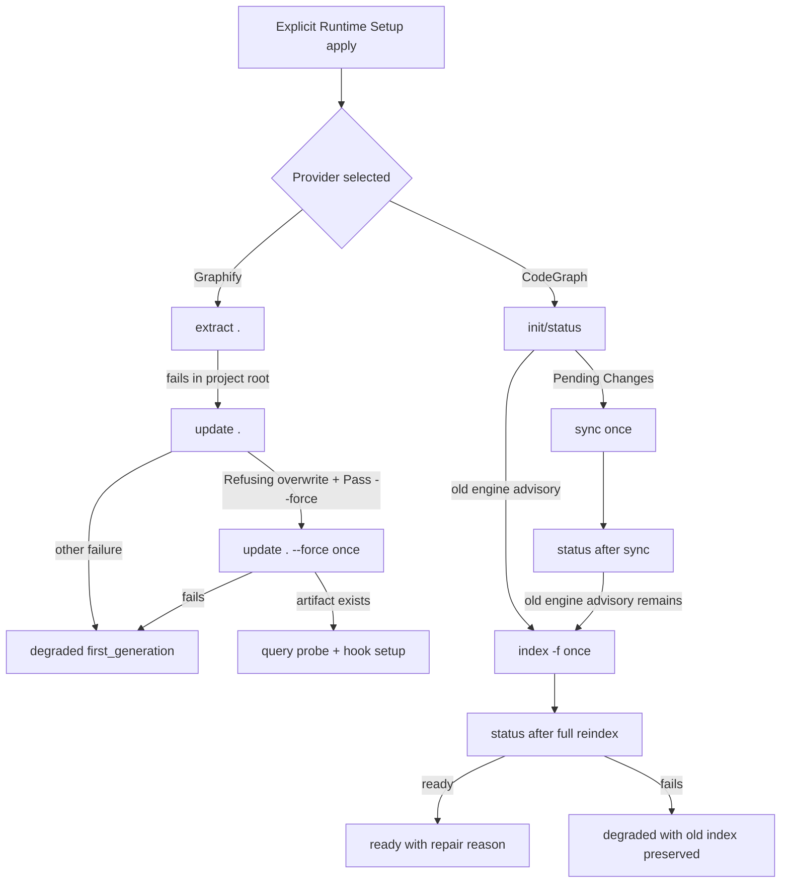

# fix: Harden large-repo provider setup repair

## 完成说明

本计划已在 v1.11.0 的 `fix(runtime-setup)` 批次落地，当前状态收口为 `completed`。完成证据包括 `CHANGELOG.md` 中 2026-06-16 02:23:52 的实现记录，以及当前 source 中 Graphify overwrite refusal 后的一次性 `graphify update . --force` repair、CodeGraph `codegraph sync` 后仍提示 full rebuild 时的一次性 `codegraph index -f` repair、guided confirmation 文案、`spec-mcp-setup` prose、provider registry、Bash/PowerShell contract tests 和 fake provider fixtures。

下方 `Problem Frame`、`Direct Evidence Readiness` 和 `Direct Evidence` 中关于“current code”的描述是实施前规划证据，保留为历史上下文，不再代表当前代码状态。当前实现选择复用通用 `SPEC_FIRST_STAGE_TIMEOUT_SECONDS` / 900 秒默认 stage timeout 约束 provider rebuild；若后续真实大仓仍出现 rebuild timeout，再以独立 follow-up 评估 rebuild-specific timeout，而不是继续挂在本计划下开发。

## Summary

This plan makes Runtime Setup complete more reliably on large repositories by adding bounded install-init repair for two provider-native failure modes: Graphify refusing to overwrite an older larger graph without `--force`, and CodeGraph reporting an old engine index that needs a full `codegraph index -f` rebuild after `sync` cannot clear the advisory.

The work stays inside explicit setup paths (`$spec-mcp-setup` / `/spec:mcp-setup`, including `--only graphify`, `--only codegraph`, and confirmed guided setup). It does not make ordinary workflows, git hooks, or downstream code navigation automatically rebuild large provider indexes.

---

## Decision Brief

- **Recommended approach:** Extend the existing provider install-init repair pattern: scripts recognize deterministic provider messages, run at most one bounded repair command, then record structured readiness facts and next actions. This keeps setup pragmatic without turning it into a broad cleanup engine.
- **Key decisions:** Graphify `--force` is allowed only after the provider explicitly refuses overwrite and suggests force; CodeGraph `index -f` is allowed only after status still asks for full rebuild following a sync attempt.
- **Validation focus:** Simulated provider CLIs should prove the exact log-triggered branches, retry limits, preserved degradation behavior, Bash/PowerShell parity, and no execution in `--check` / `--verify-only`.
- **Largest risks / boundaries:** Large-repo commands may run long and mutate provider-owned artifacts (`graphify-out/`, `.codegraph/`), so timeout, opt-in, and source/runtime boundaries must stay explicit.

---

## Problem Frame

Runtime Setup already installs and initializes Graphify and CodeGraph through controlled provider routes. In large repositories, two observed provider-native conditions can leave setup in a frustrating partial state even though the correct next action is deterministic:

- Graphify can finish AST extraction, detect that the newly generated graph has fewer nodes than the existing `graphify-out/graph.json`, and refuse to overwrite unless `--force` is passed.
- CodeGraph can report the index is up to date while also warning that it was built by an earlier engine and should be rebuilt with `codegraph index -f`; `codegraph sync` can complete without clearing that warning.

The current code handles nearby cases but not these exact ones. `install-helpers.sh` / `.ps1` fallback from `graphify extract .` to `graphify update .`, but the Bash path discards Graphify output and neither side has a controlled `--force` retry. `install-mcp.sh` / `.ps1` detects CodeGraph `Pending Changes`, runs one `codegraph sync`, and rechecks status, but it does not detect the engine rebuild advisory or escalate to one full reindex.

---

## Requirements

- R1. Graphify setup must automatically recover from the deterministic overwrite refusal shown by Graphify after `graphify update .` when explicit Graphify setup is already approved.
- R2. Graphify force repair must be bounded: only default project-root setup (`workspace_rel="."`), only after matching provider output, only one retry, and never from `--check`, `--plan`, `--verify-only`, ordinary workflows, or provider hooks.
- R3. CodeGraph setup must automatically recover from the deterministic old-engine/full-rebuild advisory when explicit CodeGraph setup is already approved and `codegraph sync` does not clear it.
- R4. CodeGraph full rebuild must be bounded: only install-init/apply mode, only after status asks for `index -f`, only one full rebuild, and preserve a degraded-but-usable state if rebuild fails while the existing index remains usable.
- R5. Bash and PowerShell setup scripts must stay behaviorally parallel for Graphify and CodeGraph.
- R6. Readiness output must distinguish lifecycle facts from semantic truth: provider indexes are advisory navigation candidates, not confirmed code-understanding evidence.
- R7. The implementation must preserve existing source/runtime boundaries: update source files and tests, do not hand-edit `.claude/`, `.codex/`, or `.agents/skills/` runtime mirrors.
- R8. The final change must include focused tests, `CHANGELOG.md`, and contract prose updates where user-visible setup behavior changes.

---

## Assumptions

- A1. The Graphify refusal text is stable enough to match by substrings such as `Refusing to overwrite` and `Pass --force to override`; the implementation should match conservatively and degrade if the message changes.
- A2. CodeGraph's old-engine advisory is stable enough to match by the suggested command (`codegraph index -f`) or the status line `Run "codegraph index -f" ...`; the implementation should avoid relying on decorative output formatting.
- A3. Large-repo timeout values should be configurable by environment variable first, with a higher default for provider rebuild stages than for query probes.

---

## Scope Boundaries

- No Graphify MCP server installation, `graphify watch`, CodeGraph watcher management, or long-running daemon startup.
- No automatic `--force` from git hooks, ordinary workflows, Graphify query/path/explain consumption, or post-commit refresh.
- No automatic `codegraph index -f` from `--check`, `--verify-only`, downstream codegraph MCP usage, or ordinary code navigation.
- No deletion of `graphify-out/`, `.codegraph/`, chunk files, cache directories, or generated provider artifacts beyond provider-native overwrite/reindex commands.
- No semantic claim that a refreshed provider graph is correct. Downstream workflows must still confirm conclusions from source, tests, logs, contracts, or user evidence.

### Deferred to Follow-Up Work

- Adaptive progress streaming or cancellation UX for very long provider rebuilds.
- A generalized provider retry framework shared across Graphify, CodeGraph, and future tools. This plan keeps the two concrete repairs local to avoid premature abstraction.
- Deterministic stale graph freshness checks based on Graphify `built_at_commit`; existing project-graph consumption rules already treat provider facts as advisory.

---

## Completion Criteria

- Graphify setup detects the overwrite refusal after `graphify update .`, retries exactly once with `graphify update . --force`, and records a visible setup fact / reason code when force was used.
- CodeGraph setup detects the old-engine/full-rebuild advisory, runs `codegraph sync` first, runs exactly one `codegraph index -f` only if the advisory remains after sync, rechecks status, and records a visible setup fact / reason code when full reindex was used.
- `--check`, `--plan`, and `--verify-only` cannot trigger either repair path.
- Bash and PowerShell focused tests cover both provider repairs.
- `skills/spec-mcp-setup/SKILL.md`, `skills/spec-mcp-setup/provider-tools.json`, `setup-plan-renderer.cjs`, and relevant contract tests describe the bounded repair behavior and guided confirmation disclosure.
- `npm run test:mcp-setup` passes, plus focused Jest/shell/parser checks for touched scripts.

---

## Direct Evidence Readiness

- target_repo: `.`
- evidence_sources: direct source reads, `rg`, `git status --short`, user-provided setup logs, `spec-first internal task-governance-signals`
- source_refs:
  - `skills/spec-mcp-setup/SKILL.md`
  - `skills/spec-mcp-setup/provider-tools.json`
  - `skills/spec-mcp-setup/mcp-tools.json`
  - `skills/spec-mcp-setup/scripts/install-helpers.sh`
  - `skills/spec-mcp-setup/scripts/install-helpers.ps1`
  - `skills/spec-mcp-setup/scripts/install-mcp.sh`
  - `skills/spec-mcp-setup/scripts/install-mcp.ps1`
  - `skills/spec-mcp-setup/scripts/setup-plan-renderer.cjs`
  - `skills/spec-mcp-setup/scripts/provider-readiness-renderer.cjs`
  - `tests/unit/dependency-readiness-baseline.test.js`
  - `tests/unit/mcp-setup.sh`
  - `tests/unit/mcp-setup-powershell-contracts.test.js`
  - `docs/contracts/project-graph-consumption.md`
- current_revision: `899b868f`
- worktree_status: dirty; existing uncommitted changes already implement Graphify hook PATH repair in Runtime Setup source/tests/changelog
- confidence: high for the current setup script shape; medium for exact upstream provider output stability
- limitations: no live large-repo setup command was run during planning; user-provided logs supply the observed Graphify and CodeGraph messages

---

## Direct Evidence

- repo_scope: single repo, `spec-first`
- source_reads_completed:
  - `install-helpers.sh` contains `run_graphify_code_only_fallback`, `run_graphify_first_generation_if_requested`, and recently added `repair_graphify_hook_path_visibility`.
  - `install-helpers.ps1` contains the PowerShell equivalents `Invoke-GraphifyCodeOnlyFallback`, `Invoke-GraphifyFirstGenerationIfRequested`, and recently added `Repair-GraphifyHookPathVisibility`.
  - `install-mcp.sh` and `install-mcp.ps1` already run one `codegraph sync` when `codegraph status` reports `Pending Changes`.
  - `mcp-tools.json` declares CodeGraph project bootstrap as `codegraph init` plus `codegraph status` and pins `@colbymchenry/codegraph@1.0.1`; Graphify is pinned as `graphifyy@0.8.39`.
  - `setup-plan-renderer.cjs` owns guided confirmation display strings for CodeGraph and Graphify; it currently discloses `codegraph init` / `codegraph status` and Graphify `extract` / `update` fallback, but not the new bounded `--force` or `index -f` repair commands.
  - `provider-readiness-renderer.cjs` currently receives Graphify first-generation/hook env overrides and renders next actions, but it does not yet know about force overwrite or CodeGraph full reindex reason codes.
- source_reads_required:
  - Re-read current `install-helpers.*` before implementation because the worktree already contains uncommitted hook PATH repair changes.
  - Inspect exact test helper patterns around existing Graphify fake CLI fixtures before adding new force retry fixtures.
- commands_or_tools_used:
  - `rg -n "codegraph|Graphify|graphify|index -f|sync|first generation|force|Refusing to overwrite|Pending Changes|engine" ...`
  - `git rev-parse --short HEAD && git status --short`
  - `spec-first internal task-governance-signals --source plan-declared --json`
- impact_on_plan:
  - Classified as Deep by deterministic helper (`cross-module`, `critical-path-hit`, `runtime`, `contract`, `workflow`) and accepted because the change touches setup scripts, provider registry/prose, and tests across Bash/PowerShell.
- key_findings:
  - Graphify repair needs captured output from `graphify update .`; current Bash fallback redirects output to `/dev/null`, so implementation must capture diagnostics safely.
  - CodeGraph repair belongs in the existing status-probe branch after `sync`, not in provider readiness rendering or downstream MCP usage.
  - Existing hook PATH repair should remain orthogonal to force overwrite repair.
- limitations:
  - Planning did not use Graphify/CodeGraph advisory graph output; direct source reads are the basis.

---

## Context & Research

### Relevant Code and Patterns

- `skills/spec-mcp-setup/scripts/install-helpers.sh`: Graphify CLI resolution, project skill install, first generation, code-only update fallback, query probe, hook setup, and provider JSON rendering.
- `skills/spec-mcp-setup/scripts/install-helpers.ps1`: PowerShell mirror for Graphify install and first generation.
- `skills/spec-mcp-setup/scripts/install-mcp.sh`: CodeGraph install/configure/bootstrap/status flow, including one `codegraph sync` repair for `Pending Changes`.
- `skills/spec-mcp-setup/scripts/install-mcp.ps1`: PowerShell mirror for CodeGraph install/configure/bootstrap/status flow.
- `skills/spec-mcp-setup/scripts/provider-readiness-renderer.cjs`: Graphify readiness and lifecycle presentation from environment overrides plus filesystem/CLI probes.
- `tests/unit/dependency-readiness-baseline.test.js`: primary fixture-heavy test surface for Graphify provider readiness and install helper behavior.
- `tests/unit/mcp-setup.sh` and `tests/unit/mcp-setup-powershell-contracts.test.js`: lightweight contract drift guards for Bash/PowerShell setup scripts.

### Institutional Learnings

- `docs/plans/2026-06-11-002-feat-project-graph-consumption-protocol-plan.md` established that project-graph/code-graph output is candidate-only and must be confirmed from source/test/log evidence.
- `docs/contracts/project-graph-consumption.md` reinforces that setup facts and provider indexes are advisory, not semantic authority.

### External References

- No external web research was used. The plan is grounded in local source and user-provided real setup logs.

---

## Key Technical Decisions

- KTD1. **Use provider-output-gated repair, not unconditional force/reindex.** Graphify `--force` and CodeGraph `index -f` are allowed only after the provider itself emits a deterministic repair hint. This keeps scripts in deterministic territory.
- KTD2. **Keep repair inside explicit install-init/apply mode.** The repair should be reachable from confirmed guided setup and `--only` apply paths only. It must not run in `--check`, `--plan`, `--verify-only`, ordinary workflows, or hooks.
- KTD3. **Prefer one-shot local branches over a generic retry framework.** The two repairs have different evidence, commands, and artifact ownership. A generic abstraction would add contract cost before there are enough providers to justify it.
- KTD4. **Record repair as lifecycle/setup metadata, not confirmed truth.** Reason codes such as `graphify-force-overwrite-used` and `codegraph-full-reindex-used` explain setup actions. They do not upgrade provider output into source evidence.
- KTD5. **Preserve usable degraded states.** If CodeGraph reports up-to-date but full reindex fails, setup should not erase the existing index or mark the provider fully unavailable. It should report degraded readiness with concrete next action.

---

## Open Questions

### Resolved During Planning

- Should Graphify `--force` be automatic? Yes, but only after the provider explicitly refuses overwrite and suggests force, and only during explicit setup.
- Should CodeGraph `index -f` run before `sync`? No. Run one cheaper `sync` first whenever the full-rebuild advisory appears, then escalate only if the advisory remains.
- Should setup delete provider artifacts before retrying? No. Use provider-native commands only.

### Deferred to Implementation

- Exact timeout defaults and env var names: implementation should inspect existing timeout helpers and choose the smallest consistent extension, with tests proving configurability.
- Exact CodeGraph advisory regex: implementation should match robust substrings from `codegraph status` output without tying to decorative formatting.
- Whether CodeGraph provider readiness needs a new field or only `reason_code` / diagnostic summary in configured dependency results: decide based on existing `verify-tools.*` projection shape during implementation.

---

## High-Level Technical Design

> *This illustrates the intended approach and is directional guidance for review, not implementation specification. The implementing agent should treat it as context, not code to reproduce.*

---

## Implementation Units

### U1. Graphify force-overwrite repair

**Goal:** Make Graphify first generation succeed when `graphify update .` refuses to overwrite an older larger graph and explicitly suggests `--force`.

**Requirements:** R1, R2, R5, R6

**Dependencies:** Existing Graphify CLI resolution and code-only fallback; preserve current hook PATH repair changes

**Files:**
- Modify: `skills/spec-mcp-setup/scripts/install-helpers.sh`
- Modify: `skills/spec-mcp-setup/scripts/install-helpers.ps1`
- Test: `tests/unit/dependency-readiness-baseline.test.js`
- Test: `tests/unit/mcp-setup.sh`
- Test: `tests/unit/mcp-setup-powershell-contracts.test.js`

**Approach:**
- Change the Graphify code-only fallback to capture exit code plus bounded stdout/stderr diagnostic text instead of discarding it.
- Add a conservative matcher for Graphify overwrite refusal: it must include both refusal language and the provider's force hint.
- Retry exactly once with `graphify update . --force` only when `workspace_rel="."`, the ordinary update failed, and the matcher passes.
- On success, set first-generation status to completed with a distinct next-action/reason such as `graphify-force-overwrite-used`, and continue existing query probe and hook setup.
- On failure, preserve current failed first-generation behavior with diagnostics; do not delete existing `graphify-out/`.

**Execution note:** Characterization-first: add fake Graphify CLI coverage for the refusal output before changing the fallback logic.

**Patterns to follow:**
- Existing `run_graphify_with_timeout` / `Invoke-GraphifyCommandWithTimeout` command wrappers.
- Existing first-generation env override pattern: `SPEC_FIRST_PROVIDER_GRAPHIFY_FIRST_GENERATION_STATUS`, `..._NEXT_ACTION`, `..._ARTIFACT_REF`.
- Existing Graphify hook PATH repair should remain separate and run after first generation succeeds.

**Test scenarios:**
- Happy path: fake `graphify extract .` fails, `graphify update .` emits the overwrite refusal and exits non-zero, `graphify update . --force` succeeds and writes `graphify-out/graph.json`; provider readiness reports initialized/indexed and first generation completed with force-used reason.
- Edge case: fake `graphify update .` fails without the force hint; setup does not run `--force` and reports failed first generation.
- Edge case: explicit `--requirement-workspace` targets a non-root workspace; setup does not run `update . --force`.
- Error path: `--force` retry fails; setup remains degraded/actionable and does not mark hook refresh verified.
- Integration: successful force retry continues into query probe and Graphify hook install/status, including existing off-PATH hook repair when applicable.

**Verification:**
- Focused Jest proves force retry command ordering and readiness fields.
- Shell/PowerShell contract tests prove both scripts contain the force repair branch and preserve existing non-actions.

---

### U2. CodeGraph full reindex repair

**Goal:** Make CodeGraph setup clear the old-engine/full-rebuild advisory by escalating from `sync` to one `codegraph index -f` when status still requests it.

**Requirements:** R3, R4, R5, R6

**Dependencies:** Existing CodeGraph install/configure/bootstrap/status branch

**Files:**
- Modify: `skills/spec-mcp-setup/scripts/install-mcp.sh`
- Modify: `skills/spec-mcp-setup/scripts/install-mcp.ps1`
- Modify: `skills/spec-mcp-setup/mcp-tools.json` only if the project bootstrap contract needs to declare the full-rebuild command
- Test: `tests/unit/dependency-readiness-baseline.test.js`
- Test: `tests/unit/mcp-setup.sh`
- Test: `tests/unit/mcp-setup-powershell-contracts.test.js`

**Approach:**
- Add a status-output classifier for CodeGraph old-engine/full-rebuild advisory. Match robustly on `codegraph index -f` rather than UI framing.
- Keep current `Pending Changes` handling, and also treat the old-engine/full-rebuild advisory as a cheaper-sync-first condition: run one `codegraph sync`, then re-run status.
- If post-sync status still asks for full rebuild, run `codegraph index -f` once with a large-repo rebuild timeout.
- Re-run `codegraph status` after full reindex.
- If the advisory clears, keep status ready and set last action / reason to indicate full reindex was used.
- If full reindex fails while status had otherwise shown an up-to-date usable index, report degraded/action-required with diagnostic summary and next action, but do not erase `.codegraph/` or claim no index exists.

**Execution note:** Characterization-first with fake `codegraph` command output for `status`, `sync`, and `index -f`.

**Patterns to follow:**
- Existing `run_and_capture` / `Invoke-ChildJsonScript` style for diagnostics and exit code.
- Existing `Pending Changes` one-sync repair branch.
- Existing project bootstrap result fields: `status`, `last_action`, `reason_code`, `next_action`, `diagnostic_summary`, `repair_diagnostic_summary`.

**Test scenarios:**
- Happy path: fake status reports old-engine advisory, fake sync is already up to date, fake post-sync status still reports the advisory, fake `index -f` succeeds, final status clears advisory; result remains ready and records full-reindex action.
- Edge case: status reports `Pending Changes` and old-engine advisory; sync runs first, then full reindex only if advisory remains.
- Error path: `index -f` fails; setup reports degraded/action-required with next action to run/inspect `codegraph index -f`, while diagnostics show the old index was initially usable.
- Guard: unselected CodeGraph or `--check` / `--plan` / verify-only paths do not run `index -f`.

**Verification:**
- Focused test fixture proves command order: `status -> sync -> status -> index -f -> status` for old-engine-only and pending-changes-plus-old-engine cases where the advisory remains after sync.
- Bash and PowerShell contract tests assert the old-engine classifier and full reindex command are present.

---

### U3. Readiness and status presentation

**Goal:** Surface force/reindex repairs honestly in setup facts and final output without overstating provider authority.

**Requirements:** R4, R6, R8

**Dependencies:** U1, U2

**Files:**
- Modify: `skills/spec-mcp-setup/scripts/provider-readiness-renderer.cjs` if new Graphify first-generation reason display is needed
- Modify: `skills/spec-mcp-setup/scripts/verify-tools.sh` only if CodeGraph result projection needs new reason-code display
- Modify: `skills/spec-mcp-setup/scripts/verify-tools.ps1` only if PowerShell projection needs parity
- Test: `tests/unit/dependency-readiness-baseline.test.js`
- Test: `tests/unit/mcp-setup-verify-host-contracts.test.js` if `verify-tools.*` output changes
- Test: `tests/unit/mcp-setup-powershell-contracts.test.js`

**Approach:**
- Prefer existing fields before adding schema: `first_generation.next_action`, `lifecycle.fallback_used`, configured dependency `reason_code`, and diagnostic summaries.
- Add only compact, user-actionable next actions:
  - Graphify force used: no user action if successful; optional lifecycle note is enough.
  - Graphify force failed: rerun setup or inspect Graphify output; do not suggest deleting artifacts automatically.
  - CodeGraph full reindex used: ready when status clears.
  - CodeGraph full reindex failed: preserve degraded output and manual `codegraph index -f` / status inspection guidance.
- Keep `query_verified` reserved for actual Graphify query probe, not for generation/reindex success.

**Patterns to follow:**
- Existing Graphify query probe advisory wording in `provider-readiness-renderer.cjs`.
- Existing `generated_runtime_manifest.status` separation from dependency readiness.

**Test scenarios:**
- Graphify force-used success does not create a next action that implies manual work is still required.
- Graphify force failure creates a next action but keeps artifact existence separate from readiness.
- CodeGraph full reindex failure does not report baseline dependencies as failed when dependency install/config succeeded.

**Verification:**
- Focused JSON assertions on provider readiness/configured dependency output.

---

### U4. Contract prose and registry updates

**Goal:** Document the new bounded repair behavior in source-of-truth setup prose and provider registries.

**Requirements:** R2, R4, R6, R7, R8

**Dependencies:** U1, U2, U3

**Files:**
- Modify: `skills/spec-mcp-setup/SKILL.md`
- Modify: `skills/spec-mcp-setup/provider-tools.json`
- Modify: `skills/spec-mcp-setup/scripts/setup-plan-renderer.cjs`
- Modify: `skills/spec-mcp-setup/mcp-tools.json` if CodeGraph project bootstrap metadata changes
- Modify: `CHANGELOG.md`
- Test: `tests/unit/dependency-readiness-baseline.test.js`
- Test: `tests/unit/mcp-setup.sh`
- Test: `tests/unit/mcp-setup-powershell-contracts.test.js`

**Approach:**
- Update Graphify setup prose to state `--force` is a bounded install-init repair only after overwrite refusal.
- Update CodeGraph setup prose to state `index -f` is a bounded install-init repair only after status still asks for full rebuild after sync.
- Update registry `usage_note` / `install_effect` and `setup-plan-renderer.cjs` guided confirmation display strings so the confirmation block discloses these possible provider-owned writes before user approval.
- Add changelog after source changes, using the repository's current format and developer profile.

**Test scenarios:**
- Contract tests contain the load-bearing phrases: `--force`, `Refusing to overwrite`, `codegraph index -f`, and explicit setup-only boundaries.
- Guided confirmation tests assert `setup-plan-renderer.cjs --mode guided-confirm` discloses Graphify bounded force retry and CodeGraph full reindex escalation as possible setup-owned repair actions.
- Negative checks ensure prose does not imply ordinary workflows or hooks run force/reindex.

**Verification:**
- `npm run test:mcp-setup` and focused Jest/contract checks pass.

---

### U5. Verification and runtime refresh closeout

**Goal:** Verify the setup repair plan without overstating coverage, then refresh generated runtime mirrors only after source validation if needed.

**Requirements:** R5, R7, R8

**Dependencies:** U1, U2, U3, U4

**Files:**
- Test: `tests/unit/dependency-readiness-baseline.test.js`
- Test: `tests/unit/mcp-setup.sh`
- Test: `tests/unit/mcp-setup-powershell-contracts.test.js`
- Test: `tests/unit/mcp-setup-verify-host-contracts.test.js` if verify output changes
- Potential runtime regeneration command after validation: `spec-first init --claude --codex -y`

**Approach:**
- Run the narrow setup checks first:
  - focused Jest for provider readiness, guided confirmation renderer output, and PowerShell contracts
  - `bash tests/unit/mcp-setup.sh`
  - `bash -n skills/spec-mcp-setup/scripts/install-helpers.sh skills/spec-mcp-setup/scripts/install-mcp.sh`
  - PowerShell parser checks for touched `.ps1` scripts when `pwsh` is available
  - `npm run test:mcp-setup`
  - `git diff --check`
- Run broader `npm run typecheck` only if source changes touch shared CLI helpers or JSON/schema projections outside setup scripts.
- Use `spec-first init --claude --codex -y` only after source validation when runtime mirrors need refresh; do not patch mirrors manually.

**Test scenarios:**
- Validation commands prove both provider repair branches are covered by focused tests.
- Guided confirmation validation proves the approval preview names the possible `graphify update . --force` and `codegraph index -f` provider-owned repairs.
- If runtime refresh is run, generated mirror changes are reviewed as generated output rather than source edits.

**Verification:**
- Final closeout lists actual checks and explicitly names any skipped checks.

---

## System-Wide Impact

- **Interaction graph:** Runtime Setup guided/headless apply paths call `install-mcp.*` for CodeGraph and `install-helpers.*` for Graphify; downstream workflows consume resulting setup facts as advisory context.
- **Error propagation:** Provider-native repair failures should surface as structured degraded/action-required facts with reason codes and diagnostics, not as silent success.
- **State lifecycle risks:** Graphify `--force` overwrites provider-owned graph output; CodeGraph `index -f` rebuilds `.codegraph/`. Both are acceptable only under explicit setup opt-in.
- **API surface parity:** Bash and PowerShell setup scripts must remain parallel; Claude and Codex host setup surfaces should receive the same readiness semantics.
- **Surface coverage:** Runtime Setup source is in-scope; ordinary workflows, provider hooks, MCP query behavior, README user manual, and generated runtime mirrors are deferred/out-of-scope unless source validation shows user-visible docs or runtime refresh are required.
- **Integration coverage:** Unit fixtures should simulate provider CLI output because real large-repo runs are too expensive and environment-dependent for unit tests.
- **Unchanged invariants:** Direct source evidence remains the conclusion authority; provider graphs remain `provider_untrusted` candidates.

---

## Risks & Dependencies

| Risk | Mitigation |
|------|------------|
| `--force` overwrites useful Graphify artifacts after a partial extraction | Gate only on provider's explicit refusal message and explicit setup opt-in; do not run from hooks or verify-only |
| CodeGraph full reindex can be slow on large repos | Use a rebuild-specific timeout and preserve degraded next action on failure |
| Output matching becomes brittle across provider versions | Match command recommendations (`--force`, `codegraph index -f`) rather than decorative status layout |
| Bash/PowerShell drift | Add contract assertions and focused fake-provider fixtures for both script families |
| Existing uncommitted hook PATH repair conflicts with this plan | Treat it as a dependency and re-read touched files before implementation |

---

## Documentation / Operational Notes

- This is user-visible Runtime Setup behavior and requires `CHANGELOG.md`.
- If final behavior affects README/setup docs beyond `SKILL.md` and registries, update `README.md`, `README.zh-CN.md`, or user manual in the implementation pass.
- Runtime mirrors should be refreshed with `spec-first init --claude --codex -y` only after source checks pass.

---

## Sources & References

- User-provided Graphify log: `graphify update .` AST extraction completes, then refuses overwrite because new graph has fewer nodes and suggests `--force`.
- User-provided CodeGraph log: `codegraph status` reports index up to date but asks for `codegraph index -f` or `codegraph sync`; `sync` completes but does not clear the advisory.
- Source: `skills/spec-mcp-setup/SKILL.md`
- Source: `skills/spec-mcp-setup/provider-tools.json`
- Source: `skills/spec-mcp-setup/mcp-tools.json`
- Source: `skills/spec-mcp-setup/scripts/install-helpers.sh`
- Source: `skills/spec-mcp-setup/scripts/install-helpers.ps1`
- Source: `skills/spec-mcp-setup/scripts/install-mcp.sh`
- Source: `skills/spec-mcp-setup/scripts/install-mcp.ps1`
- Source: `skills/spec-mcp-setup/scripts/provider-readiness-renderer.cjs`
- Contract: `docs/contracts/project-graph-consumption.md`
- Prior plan: `docs/plans/2026-06-11-002-feat-project-graph-consumption-protocol-plan.md`
