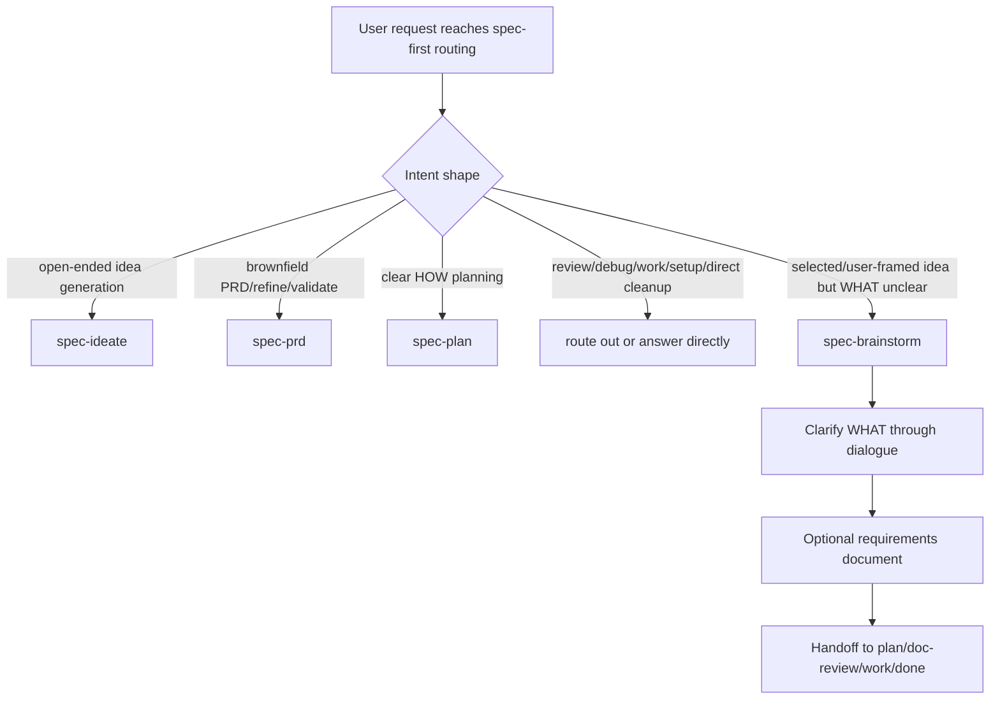

# refactor: Tighten spec-brainstorm routing boundary

## Summary

本计划收窄 `spec-brainstorm` 的触发边界、补齐 near-neighbor 分流、route-out 输出契约与最小回归验证，使它稳定承担 WHAT discovery，而不是成为 ideation、PRD、plan、review、debug 或 direct cleanup 的泛入口。改动保持 source-first：只修改 `skills/`、`tests/`、`CHANGELOG.md` 等 source-of-truth，不手改 `.claude/`、`.codex/`、`.agents/skills/` generated runtime mirrors。

---

## Decision Brief

- **Recommended approach:** 保留并优化 `spec-brainstorm`；不退役、不拆新 skill、不新增平行 public workflow。
- **Key decisions:** 先改 frontmatter `description`，再在 `SKILL.md` 入口附近补 near-neighbor exit cues 和 route-out shape；把回归证据落到 routing fixture/test，而不是继续堆主 prompt。
- **Validation focus:** 证明 `idea generation -> spec-ideate`、`brownfield PRD -> spec-prd`、`clear plan request -> spec-plan`、`single doc cleanup -> direct` 不再被 `spec-brainstorm` 吞掉。
- **Largest risks / boundaries:** 测试只能做 regression evidence，不能变成 deterministic semantic router；`using-spec-first` 仍是 entry governor，`spec-brainstorm` 只声明自身边界。

---

## Problem Frame

`docs/项目审查/详细审查/skill/Skill-15-spec-brainstorm-详细审查报告.md` 将 `spec-brainstorm` 评为 P1 优化对象。报告核心判断是：它应是 WHAT discovery workflow，而不是 ideation、PRD、plan 或 direct document cleanup 的万能入口。

当前 source 已有较完整的 workflow contract summary、synthesis checkpoint、requirements capture、handoff、Markdown canonical 和 project-graph advisory boundary，但触发描述仍偏宽，且缺少专门的 normalized routing/near-neighbor eval。结果是：当用户表达“给我想法”“写计划”“改现有 PRD”“整理这个文档”“审查这份需求”等相邻意图时，入口层可能误把请求吸入 brainstorm，造成上下文噪声、错误 artifact、后续 plan/work 需要清理上游误判。

本计划的重点不是让 `spec-brainstorm` “更强”，而是让它更窄、更可证、更容易被父 workflow 和入口治理消费。

---

## Requirements

- R1. `spec-brainstorm` 必须清楚声明：只在用户已有问题、方向或候选 feature，但 WHAT、范围、用户行为、成功标准或 planning handoff context 尚未定清时触发。
- R2. `spec-brainstorm` 必须显式排除这些 near-neighbor：开放式 idea generation、brownfield PRD、明确 implementation plan、execution/debug/review/setup、窄事实问答、单文档 cleanup。
- R3. 错误进入 `spec-brainstorm` 时，workflow 应输出可消费 route-out shape，而不是继续进入 Phase 1 到 Phase 4。
- R4. route-out shape 必须至少包含 `status`、`reason_code`、`recommended_next_action`、`limitation`，并在读过 source evidence 时包含 `source_refs`。
- R5. 新增验证必须覆盖 review 报告列出的 P1 分流场景，且不要只做关键词存在检查。
- R6. 现有合同不得回退：Markdown requirements 仍是 canonical artifact，HTML 仍是 optional sidecar，project-graph/code-graph 仍是 advisory only，handoff 仍使用 current-host entrypoint language。
- R7. 任何 source 修改都必须同步 `CHANGELOG.md`；用户可见 workflow routing 变化标记 `(user-visible)`。
- R8. 不修改 generated runtime mirrors；如果后续需要 runtime refresh，单独执行 `spec-first init` 并审查 drift。

---

## Scope Boundaries

- 不创建 `spec-brainstorm-v2`、`spec-discovery` 或新的 public workflow。
- 不把 `using-spec-first` 的完整 route map 复制进 `spec-brainstorm`。
- 不让 script 或 test 模拟最终语义判断；route 选择仍由 LLM/entry governor 决定。
- 不引入 per-skill `manifest.json`、Review Studio、trust report 或 `reports/output_quality_scorecard.md`；当前按 Production 边界补最小 eval 证据，不升 Governed package。
- 不重写 `references/requirements-capture.md`、`references/synthesis-summary.md`、`references/handoff.md` 的主体流程，除非测试显示 route-out 改动必须调整局部文字。
- 不改 `CLAUDE.md`、`AGENTS.md` managed bootstrap block，除非后续验证发现入口锚点与新边界冲突。

### Deferred to Follow-Up Work

- `fresh-source eval` 可作为后续复核动作，在 source 修改完成后由独立 read-only reviewer 或等价 fresh source pass 执行。
- 如果 routing fixture 后续稳定且复用价值上升，再考虑将 fixture 升级为统一 skill routing eval harness。
- 如果 `spec-brainstorm` 被证明达到 team critical 或 release critical，再补 owner/review cadence/lifecycle metadata，而不是本轮直接加治理包。

---

## Direct Evidence Readiness

- target_repo: `.`
- evidence_sources: direct source reads, `rg`, `find`, existing Jest contract tests, review report
- source_refs:
  - `skills/spec-brainstorm/SKILL.md`
  - `skills/spec-brainstorm/references/requirements-capture.md`
  - `skills/spec-brainstorm/references/synthesis-summary.md`
  - `skills/spec-brainstorm/references/handoff.md`
  - `tests/unit/spec-brainstorm-contracts.test.js`
  - `tests/unit/public-workflow-contract-summary.test.js`
  - `tests/unit/project-graph-consumption-contracts.test.js`
  - `skills/spec-ideate/SKILL.md`
  - `skills/spec-prd/SKILL.md`
  - `skills/using-spec-first/SKILL.md`
  - `docs/项目审查/详细审查/skill/Skill-15-spec-brainstorm-详细审查报告.md`
- current_revision: `082999e2`
- worktree_status: dirty with unrelated existing changes; implementation must not revert or overwrite unrelated work
- confidence: high for desired source boundary; medium for final route quality until fixture/fresh-source evidence exists
- limitations: this plan was written from current source and review evidence; no source edits or tests were executed during planning. The canonical eval-fixture contract (`skills/spec-skill-audit/scripts/eval-fixture-normalizer.js`, `tests/unit/eval-fixture-contracts.test.js`, `docs/contracts/workflows/eval-fixture-contract.md`) was read to align U4’s fixture shape, but the new fixture has not yet been run through `normalizeFixtureFile` / `validateNormalizedCases`; the implementer must run `tests/unit/eval-fixture-contracts.test.js` after creating it.

---

## Direct Evidence

- repo_scope: `spec-first` root repo
- source_reads_completed:
  - `skills/spec-brainstorm/SKILL.md` shows current frontmatter description is broad and contract summary exists near the top.
  - `skills/spec-brainstorm/references/` contains eight reference files; long behavior already lives outside the entrypoint.
  - `tests/unit/spec-brainstorm-contracts.test.js` locks synthesis, Markdown canonical, handoff wording, readiness gate and related contracts, but does not cover the P1 route confusion matrix directly.
  - `skills/spec-ideate/SKILL.md` owns open-ended idea generation and explicitly precedes `spec-brainstorm`.
  - `skills/spec-prd/SKILL.md` owns brownfield PRD creation/refinement/validation for existing systems.
  - `skills/using-spec-first/SKILL.md` explicitly says workflow-first is not brainstorming-first and forbids making `spec-brainstorm` the universal default front door.
- source_reads_required:
  - Before implementation, re-read the exact current `CHANGELOG.md` top section because it is already dirty.
  - Before implementation, re-run `git status --short` and inspect in-scope diffs for files that will be edited.
  - If existing tests changed since this plan, re-read current test files before patching.
- commands_or_tools_used:
  - `sed` for source reads
  - `rg` for source/test references
  - `find` and `wc` for resource inventory
  - `git rev-parse --short HEAD`
  - `git status --short`
- impact_on_plan:
  - Scope is source-only and test-only; no runtime mirror edit is allowed.
  - Tests should focus on routing boundary evidence instead of broad workflow behavior.
  - Existing dirty worktree means implementation must avoid unrelated files and avoid broad formatting.
- key_findings:
  - Current source already has the contract skeleton needed to accept a targeted boundary patch.
  - Missing evidence is specifically routing/near-neighbor eval, not general workflow structure.
  - Neighbor skills already define enough ownership to anchor route-out recommendations.
  - A repo-wide canonical eval-fixture contract already governs every `skills/**/evals/*.json`; the new routing fixture must conform to it rather than introduce a parallel schema, and adding it unconditionally triggers `tests/unit/eval-fixture-contracts.test.js`.
  - The current `description` ends with an ambient/unprompted activation clause that must be removed for the narrowing to hold at runtime.
- limitations:
  - No provider-backed model eval was run.
  - No current session cached skill behavior should be treated as proof after source edits.

---

## Context & Research

### Relevant Code And Patterns

- `skills/spec-brainstorm/SKILL.md`: entrypoint, trigger, workflow contract, phase routing.
- `skills/spec-brainstorm/references/*.md`: progressive disclosure pattern already in use; keep long process details here.
- `tests/unit/spec-brainstorm-contracts.test.js`: existing source-level contract coverage to preserve.
- `tests/unit/public-workflow-contract-summary.test.js`: ensures public workflows expose required compact contract summary.
- `tests/unit/project-graph-consumption-contracts.test.js`: ensures `spec-brainstorm` keeps project graph optional and user-led.
- `skills/using-spec-first/evals/routing-cases.json`: example of routing fixtures as examples-as-context rather than deterministic router.
- `skills/spec-skill-audit/scripts/eval-fixture-normalizer.js`: source-owned canonical normalizer (`spec-first.workflow-eval-fixtures.v1`) that the new U4 fixture must satisfy.
- `tests/unit/eval-fixture-contracts.test.js`: global contract test that walks every `skills/**/evals/*.json`; the new fixture is auto-covered here.
- `docs/contracts/workflows/eval-fixture-contract.md`: canonical envelope and tag-dependent `expected_outcome` rules.

### Institutional Learnings

- `docs/10-prompt/结构化项目角色契约.md` requires Light contract, Explicit boundaries, source/runtime separation, and script facts vs LLM judgment separation.
- The detailed review report recommends normalized trigger/boundary eval and keeping visual/html rendering as conditional references.
- Existing changelog policy requires every source change to update `CHANGELOG.md`.

### External References

- None. This plan intentionally uses local source, local review report, and local project role contract only.

---

## Key Technical Decisions

- KTD1. **Frontmatter trigger is the first control surface.** Route quality starts from `description`; the body can clarify behavior, but runtime skill selection often sees the frontmatter first.
- KTD2. **Near-neighbor cues belong near the contract summary.** The exclusion map must be discoverable before the phase flow, otherwise an incorrectly invoked brainstorm may continue too far before noticing route mismatch.
- KTD3. **Route-out shape is an output contract, not a workflow artifact.** It should be small and chat-consumable; it should not create a report, plan, task pack, or runtime asset.
- KTD4. **Fixture evidence reuses the canonical eval contract.** The routing fixture conforms to `spec-first.workflow-eval-fixtures.v1` and is validated by the existing source-owned normalizer and global contract test; brainstorm-local routing fields live under `extensions`. Tests assert route categories and reason codes via that normalizer, not exact final prose, and no second routing-fixture schema is introduced.
- KTD5. **No new deterministic router.** Scripts/tests may prepare facts and regression evidence; the LLM and entry governor still decide the semantic route in live use.
- KTD6. **Preserve existing source package shape.** The package already has useful `references/`; this round should add only an earned eval/fixture and minimal entrypoint prose.

---

## Open Questions

### Resolved During Planning

- Should `spec-brainstorm` be retired or split? Resolved as no. Current source and review report support optimize/retain, not retire/split.
- Should visual/html rendering be moved into the entrypoint? Resolved as no. It remains conditional reference material.
- Should this plan introduce per-skill governance manifest? Resolved as no. Current repo uses centralized governance and tests; adding a local manifest now risks a second truth source.
- What schema should the routing fixture use? Resolved as the canonical `spec-first.workflow-eval-fixtures.v1` envelope. The earlier draft’s standalone `prompt`/`expected_route` shape would fail the existing global eval-fixture contract test; brainstorm-local fields go under `extensions`.
- Should fresh-source eval be optional? Resolved as no — it is a required closeout decision: run it or record why it was not run.

### Deferred to Implementation

- Exact route-out prose wording: choose while patching `SKILL.md`, as long as the required fields and reason codes remain visible and aligned with existing repo `reason_code` conventions.
- Exact fixture file path: `skills/spec-brainstorm/evals/routing-cases.json` (skill-package evidence under the canonical eval contract). A `tests/unit/fixtures/...` location is not equivalent because only `skills/**/evals/*.json` is auto-walked by the canonical global test.
- Whether to add the optional brainstorm-specific routing test on top of canonical validation: decide after the fixture validates through the normalizer.

---

## High-Level Technical Design

> This illustrates the intended approach and is directional guidance for review, not implementation specification. The implementing agent should treat it as context, not code to reproduce.



The implementation should make the `S` path sharper without moving the whole `B` router into `spec-brainstorm`.

---

## Implementation Units

### U1. Tighten `spec-brainstorm` Frontmatter Trigger

**Goal:** Make the skill description route to WHAT discovery only, while naming major exclusions.

**Requirements:** R1, R2, R6

**Dependencies:** None

**Files:**
- Modify: `skills/spec-brainstorm/SKILL.md`
- Test: `tests/unit/spec-brainstorm-contracts.test.js`

**Approach:**
- Replace the current broad description with wording that emphasizes a selected or user-framed feature/problem whose WHAT is unresolved.
- **Remove the current expansionary fallback clause.** The existing `description` ends with “…or seems unsure about scope or direction — even if they don't explicitly ask to brainstorm.” That tail clause actively widens the trigger and directly counteracts the boundary-narrowing goal; narrowing the rest of the description while leaving it in place lets runtime skill selection re-absorb near-neighbor intents through the fallback. Drop or rewrite it so the trigger no longer claims unprompted/ambient activation.
- Include concise exclusions for:
  - `spec-ideate`: broad idea generation, “what should we improve”, “surprise me”
  - `spec-prd`: brownfield PRD authoring/refinement/validation
  - `spec-plan`: clear implementation planning
  - `spec-work`/`spec-debug`/`spec-doc-review`/setup/direct: execution, failure investigation, review, setup, narrow factual/direct cleanup
- Do not introduce host-specific `/spec:*` or `$spec-*` wording into frontmatter.

**Execution note:** Treat this as a route-surface change; keep patch small and run focused contract tests before broad suites.

**Patterns to follow:**
- `skills/spec-ideate/SKILL.md` frontmatter names positive trigger and exclusions.
- `skills/spec-prd/SKILL.md` frontmatter explicitly says “Not for PRD/Figma/source consistency audits”.

**Test scenarios:**
- Happy path: description still says `spec-brainstorm` clarifies unresolved WHAT before planning.
- Boundary: description names idea generation, brownfield PRD, clear planning, direct cleanup or factual answers as exclusions.
- Boundary: description no longer contains an ambient/unprompted activation clause (e.g., “even if they don't explicitly ask to brainstorm”).
- Regression: public workflow contract summary still appears within the first 120 lines.

**Verification:**
- A reader can distinguish `spec-brainstorm` from `spec-ideate`, `spec-prd`, and `spec-plan` from frontmatter alone.

---

### U2. Add Near-Neighbor Exit Cues In The Entry Contract

**Goal:** Ensure an incorrectly invoked `spec-brainstorm` can stop early and recommend the correct next action.

**Requirements:** R2, R3, R4

**Dependencies:** U1

**Files:**
- Modify: `skills/spec-brainstorm/SKILL.md`
- Test: `tests/unit/spec-brainstorm-contracts.test.js`

**Approach:**
- Add a compact `### Near-Neighbor Exit Cues` or equivalent subsection after `Workflow Contract Summary`.
- Keep entries short and local to brainstorm:
  - broad idea generation -> current host ideation workflow
  - brownfield PRD -> current host PRD workflow
  - clear implementation plan -> current host plan workflow
  - review request -> current host doc-review/code-review workflow as applicable
  - bug/failure -> current host debug workflow
  - implementation-ready task -> current host work workflow
  - single-document cleanup, summarization, or narrow factual answer -> direct handling
- Avoid copying the full `using-spec-first` route table.

**Entrypoint-weight guard (U2 + U3 combined).** Near-neighbor exit cues plus the route-out shape add prose to `SKILL.md`, which already carries the contract summary. Per the role contract, rigor must grow faster than context cost. If the combined new prose for U2 and U3 exceeds roughly 25 lines, sink the detail into a single new conditional reference (e.g., `references/routing-boundary.md`) and keep only a compact pointer plus the required route-out fields in the entrypoint. Match the skill’s existing progressive-disclosure pattern; do not let the boundary patch bloat the front door.

**Test scenarios:**
- Happy path: exit cues mention all required neighbor categories.
- Edge case: direct cleanup is explicitly outside brainstorm.
- Regression: no hardcoded Claude-only or Codex-only command appears where existing host-neutral tests forbid it.
- Regression: `SKILL.md` entrypoint does not regress past the public-workflow contract-summary line budget asserted by `public-workflow-contract-summary.test.js`.

**Verification:**
- The skill can return early with a route recommendation before Phase 1 when the request does not belong to brainstorm.

---

### U3. Define The Route-Out Output Shape

**Goal:** Make route-out behavior consumable by parent workflows and users.

**Requirements:** R3, R4

**Dependencies:** U2

**Files:**
- Modify: `skills/spec-brainstorm/SKILL.md`
- Test: `tests/unit/spec-brainstorm-contracts.test.js`

**Approach:**
- Add a minimal output shape for wrong-entry, degraded, or handoff cases:
  - `status: not_applicable | handoff | degraded`
  - `reason_code: idea_generation | brownfield_prd | clear_plan_request | execution_ready | debug_request | doc_review | direct_cleanup | missing_feature_description | insufficient_evidence`
  - `recommended_next_action: <current-host entrypoint or direct action>`
  - `limitation: <why brainstorm should not continue>`
  - `source_refs: <only when source evidence was read>`
- State that route-out should not create a requirements doc or durable artifact unless the user redirects back into brainstorm.
- Keep `source_refs` repo-relative.

**Consumer + vocabulary alignment (do before finalizing the enum).** `reason_code` is already an established cross-skill field (`spec-code-review`, `spec-work`, `spec-plan`, and others use it). Before locking this enum:
- Name the actual consumer of the route-out shape. It is chat-consumable for the user and for a parent/entry router reading the turn; it is **not** a workflow artifact, schema-validated payload, or machine contract any script parses today. Record this so the shape stays a lightweight prose-level convention (KTD3), not a new typed contract.
- `rg "reason_code" skills` and confirm the new values do not collide semantically with, or contradict, existing `reason_code` usage. Reuse existing spelling/casing conventions; only add brainstorm-specific values where no existing one fits. Do not silently introduce a parallel, differently-shaped `reason_code` taxonomy.
- Keep this enum the single source the U4 fixture’s **negative-case** `extensions.reason_code` values reference; the two must not drift. Positive trigger cases (correctly staying in brainstorm) have no route-out and carry no `reason_code`.

**Test scenarios:**
- Happy path: all required route-out fields appear in `SKILL.md`.
- Boundary: known reason codes cover the detailed review report’s P1 cases and align with existing repo `reason_code` conventions.
- Error path: `missing_feature_description` remains distinct from “wrong workflow”.

**Verification:**
- Future tests and users can identify why `spec-brainstorm` refused or handed off.
- The route-out reason codes in `SKILL.md` and the fixture’s negative-case `extensions.reason_code` values match exactly.

---

### U4. Add Normalized Routing Fixture Conforming To The Canonical Eval Contract

**Goal:** Turn the review report’s near-neighbor concern into repeatable evidence **without forking the repo’s existing eval-fixture schema**.

**Requirements:** R4, R5

**Dependencies:** U1, U2, U3

**Files:**
- Create: `skills/spec-brainstorm/evals/routing-cases.json`
- Create (optional): `tests/unit/spec-brainstorm-routing-contracts.test.js` — only for brainstorm-specific assertions beyond structural conformance; structural validation is already owned by the canonical normalizer (see below).
- No changes expected to `tests/unit/changelog-skill-contracts.test.js`.

**Binding constraint — the canonical eval-fixture contract already governs this file.**

Any `skills/**/evals/*.json` is automatically walked and validated by:
- source-owned normalizer: `skills/spec-skill-audit/scripts/eval-fixture-normalizer.js` (canonical `schema_version: "spec-first.workflow-eval-fixtures.v1"`)
- global contract test: `tests/unit/eval-fixture-contracts.test.js` → `all source eval JSON files normalize and validate with unique ids per skill`
- contract doc: `docs/contracts/workflows/eval-fixture-contract.md`

The new fixture **must** satisfy `validateNormalizedCase`, or that already-green global test turns red. The earlier draft shape (top-level `prompt`, `expected_route`, `reason_code`; no `coverage_tags`) does **not** validate: the normalizer’s `input` adapter accepts only `input` / `user_intent` / `input_shape` / `intent` (not `prompt`), and the `legacy_filename_fallback` rescues `missing_coverage_tags` but never `missing_input`. Do not introduce a second routing-fixture schema; reuse the canonical envelope.

**Per-case hard requirements (from `validateNormalizedCase`):**
- non-empty `id` (unique within the skill)
- non-empty `input` (the user intent string — not `prompt`)
- non-empty `coverage_tags[]`, each matching `^[a-z0-9][a-z0-9-]*$` (e.g. `trigger`, `boundary`, `routing`)
- non-empty `source_refs[]` (repo-relative POSIX; may be inherited from the top-level `source_refs`)
- `source_ref_authority` ∈ `source | historical | advisory` (defaults to `source`; top-level default is fine)
- `trigger` and `expected` cases require non-empty `expected_outcome`
- `boundary` cases may omit `expected_outcome` only when they carry `boundary_note` or `forbidden_signals[]`

**Approach:**
- Path: `skills/spec-brainstorm/evals/routing-cases.json` (routing evidence belongs with the skill package).
- Use the canonical envelope with top-level inheritance for `source_refs`. Carry brainstorm-local routing fields (`expected_route`, `reason_code`) under each case’s `extensions` object — the normalizer preserves `extensions` and the contract doc explicitly allows local fields there. Conformant shape:

```json
{
  "schema_version": "spec-first.workflow-eval-fixtures.v1",
  "skill": "spec-brainstorm",
  "source_refs": ["skills/spec-brainstorm/SKILL.md"],
  "coverage_tags": ["routing"],
  "cases": [
    {
      "id": "selected-feature-what-unclear",
      "input": "I chose saved filters; help define scope before planning",
      "coverage_tags": ["trigger"],
      "expected_outcome": "Stay in spec-brainstorm and clarify WHAT before planning.",
      "boundary_note": "A selected direction exists, but product behavior and scope need clarification.",
      "extensions": { "expected_route": "spec-brainstorm" }
    },
    {
      "id": "open-idea-generation-routes-to-ideate",
      "input": "Give me ideas for what we should improve next.",
      "coverage_tags": ["boundary"],
      "boundary_note": "Open-ended idea generation belongs to spec-ideate, which precedes brainstorm.",
      "forbidden_signals": ["writes a requirements doc", "enters Phase 1 dialogue"],
      "extensions": { "expected_route": "spec-ideate", "reason_code": "idea_generation" }
    }
  ]
}
```

- `reason_code` is a **route-out-only** field (U3 defines it for wrong-entry / degraded / handoff). Positive `trigger`/`expected` cases mean "correctly stays in brainstorm" — they have no route-out, so they must **not** carry `extensions.reason_code`; use only `extensions.expected_route` (and `boundary_note`) for them. Only `boundary` negative cases carry `extensions.reason_code`.
- Provide at least **three** `trigger`/`expected` positive cases and at least **six** `boundary` negative cases covering the review report’s P1 confusion matrix. Each negative case carries its route-out `reason_code` under `extensions` and a `boundary_note` (and/or `forbidden_signals[]`):
  - `idea_generation` → `spec-ideate`
  - `brownfield_prd` → `spec-prd`
  - `clear_plan_request` → `spec-plan`
  - `direct_cleanup` → direct handling
  - `debug_request` → `spec-debug`
  - `doc_review` → `spec-doc-review`
  - `execution_ready` → `spec-work`
- Keep every negative case’s `extensions.reason_code` value in lockstep with the route-out `reason_code` enum defined in U3 / `SKILL.md` (positive cases carry no `reason_code`).
- Do not call an LLM in this unit; this is structural examples-as-context evidence, not semantic proof.

**Optional brainstorm-specific test (`spec-brainstorm-routing-contracts.test.js`):**
- Import the canonical normalizer (`normalizeFixtureFile` / `validateNormalizedCases`) rather than hand-parsing JSON, so the fixture is validated through the same path as CI.
- Add brainstorm-only assertions the global test does not make: every `extensions.reason_code` in a negative case has a matching route-out reason token in `SKILL.md`; positive and negative case counts meet the minimums above.
- This test is additive evidence; it must not re-implement or fork structural validation.

**Test scenarios:**
- Happy path: fixture normalizes and validates with zero errors through the canonical normalizer.
- Boundary: each P1 report case appears as a `boundary` negative case with a route-out `reason_code` matched in `SKILL.md`.
- Error path: a case with no `coverage_tags` / `input`, or a `boundary` case with neither `boundary_note` nor `forbidden_signals`, fails validation.

**Verification:**
- `npx jest tests/unit/eval-fixture-contracts.test.js --runInBand` (canonical global validation — must stay green)
- `npx jest tests/unit/spec-brainstorm-routing-contracts.test.js --runInBand` (only if the optional brainstorm-specific test is added)

---

### U5. Preserve Existing Brainstorm Contracts

**Goal:** Ensure the boundary patch does not break established brainstorm behavior.

**Requirements:** R6

**Dependencies:** U1, U2, U3, U4

**Files:**
- Modify if needed: `tests/unit/spec-brainstorm-contracts.test.js`
- No expected changes: `skills/spec-brainstorm/references/requirements-capture.md`
- No expected changes: `skills/spec-brainstorm/references/synthesis-summary.md`
- No expected changes: `skills/spec-brainstorm/references/handoff.md`

**Approach:**
- Run existing tests and only update assertions that are directly affected by intentional wording changes.
- Preserve these existing behaviors:
  - Phase 2.5 synthesis checkpoint.
  - Markdown requirements canonical artifact.
  - HTML sidecar optional only.
  - repo-relative paths inside generated docs.
  - current-host entrypoint wording.
  - project graph candidates are advisory only and must not decide WHAT.

**Test scenarios:**
- Regression: existing `spec-brainstorm-contracts` pass.
- Regression: public workflow summary still finds required contract headings.
- Regression: project graph consumption contract still finds brainstorm advisory boundary tokens.

**Verification:**
- `npx jest tests/unit/spec-brainstorm-contracts.test.js tests/unit/public-workflow-contract-summary.test.js tests/unit/project-graph-consumption-contracts.test.js --runInBand`

---

### U6. Update Changelog And Run Focused Verification

**Goal:** Close the source change according to repository governance.

**Requirements:** R5, R7, R8

**Dependencies:** U1, U2, U3, U4, U5

**Files:**
- Modify: `CHANGELOG.md`

**Approach:**
- Add a compact entry at the top of `CHANGELOG.md`.
- Mark `(user-visible)` because routing behavior and skill trigger boundary are user-visible.
- Mention:
  - `skills/spec-brainstorm/SKILL.md`
  - new routing fixture/test
  - source/runtime boundary
  - focused verification commands
- Do not edit generated runtime mirrors.

**Test scenarios:**
- Happy path: changelog format test passes.
- Regression: `git diff --check` shows no whitespace issues.

**Verification:**
- `npx jest tests/unit/changelog-format.test.js --runInBand`
- `git diff --check -- CHANGELOG.md skills/spec-brainstorm tests/unit`

---

## System-Wide Impact

- **Workflow routing:** User-facing routing becomes less likely to default to brainstorm. This improves `using-spec-first` discipline without changing its source route map.
- **Spec chain quality:** Requirements docs under `docs/brainstorms/` should be created only when WHAT clarification genuinely happened.
- **Downstream consumers:** `spec-plan`, `spec-work`, `spec-doc-review`, and human reviewers receive cleaner WHAT artifacts with fewer upstream assumptions.
- **Testing:** Adds skill-level route boundary evidence. It does not create a general workflow router or guarantee all possible prompts route correctly.
- **Runtime delivery:** Source changes may require a later `spec-first init` for runtime mirrors, but this plan does not include runtime refresh.
- **Unchanged invariants:** Scripts prepare deterministic facts; LLM decides semantic route. Generated runtime mirrors are not source.

---

## Risk Analysis & Mitigation

| Risk | Likelihood | Impact | Mitigation |
|---|---:|---:|---|
| Trigger becomes too narrow and valid brainstorms are missed | Medium | Medium | Keep positive trigger broad for selected/user-framed ideas with unresolved WHAT |
| Eval overfits wording | Medium | Medium | Assert categories, reason codes, and fixture shape rather than exact prose |
| New fixture breaks the canonical eval-fixture global test | High | High | Conform to `spec-first.workflow-eval-fixtures.v1` (`input`, `coverage_tags`, `source_refs`, `extensions`); run `tests/unit/eval-fixture-contracts.test.js` before closeout; never use top-level `prompt`/`expected_route` |
| Narrowed description re-widened by ambient fallback clause | Medium | High | Remove the “even if they don't explicitly ask” activation tail in U1; add a boundary test asserting its absence |
| `SKILL.md` grows heavier | Medium | Medium | Limit new prose to trigger, near-neighbor cues, and route-out shape |
| `spec-brainstorm` duplicates `using-spec-first` | Medium | High | Include only local exit cues; do not copy the full route table |
| Existing tests fail due wording changes | Medium | Low | Update only assertions tied to intentional new wording |
| Runtime mirrors drift after source change | Low | Medium | Do not hand-edit mirrors; record whether `spec-first init` was run or deferred |
| Dirty worktree causes accidental overwrite | Medium | High | Inspect in-scope diffs before editing and leave unrelated dirty files untouched |

---

## Phased Delivery

### Phase 1: Boundary Source Patch

- Implement U1, U2, U3.
- Run focused source contract tests.
- Review `SKILL.md` for entrypoint bloat.

### Phase 2: Evidence Patch

- Implement U4.
- Run routing fixture test and existing brainstorm tests.
- Confirm fixture is skill evidence, not deterministic routing logic.

### Phase 3: Closeout

- Implement U5, U6.
- Run focused validation.
- Record runtime refresh status as not run or separately executed.

---

## Validation Plan

Run the narrowest meaningful checks first:

```bash
npx jest tests/unit/spec-brainstorm-contracts.test.js tests/unit/public-workflow-contract-summary.test.js tests/unit/project-graph-consumption-contracts.test.js --runInBand
npx jest tests/unit/changelog-format.test.js --runInBand
npm run lint:skill-entrypoints
git diff --check -- CHANGELOG.md skills/spec-brainstorm tests/unit
```

**Mandatory once U4 lands a new `skills/spec-brainstorm/evals/*.json` — not conditional.** Adding any eval JSON file is automatically picked up by the canonical global walk in `tests/unit/eval-fixture-contracts.test.js` (and `test:eval-fixtures` / `test:unit`), regardless of whether the normalizer itself changed. These must pass:

```bash
npx jest tests/unit/eval-fixture-contracts.test.js --runInBand
npm run test:eval-fixtures
npm run test:unit
```

If the optional brainstorm-specific routing test is added, also run:

```bash
npx jest tests/unit/spec-brainstorm-routing-contracts.test.js --runInBand
```

Fresh-source eval is a required closeout decision, not optional: after source edits, either run it (independent read-only reviewer or equivalent fresh source pass over the on-disk `SKILL.md`) or record in closeout why it was not run (e.g., missing dispatch primitive, runtime unable to invoke, helper agents disabled). Do not claim brainstorm route behavior is validated from current-session cached skill calls.

---

## Documentation / Operational Notes

- `README.md` and `README.zh-CN.md` likely do not need updates unless they document brainstorm routing semantics directly.
- No CLI docs update is expected because this plan does not add commands or flags.
- No schema migration is expected.
- No generated runtime mirror should be committed as part of this plan.
- If `spec-first init` is run after source validation, treat it as runtime regeneration and review generated diffs separately.

---

## Alternative Approaches Considered

- **Add a new `spec-discovery` workflow:** Rejected. It would duplicate `spec-brainstorm` and increase public workflow confusion.
- **Move full route map into `spec-brainstorm`:** Rejected. `using-spec-first` owns entry routing; duplicating it creates a second truth source.
- **Only update tests, not prose:** Rejected. Runtime skill routing reads the prose surface; eval without source boundary change would not improve behavior.
- **Add a deterministic route script:** Rejected. This would violate the project boundary that scripts prepare facts and LLM decides semantic route.
- **Upgrade to full Governed package:** Deferred. Current risk is route confusion, solvable with Production-level trigger/output eval and compact boundary prose.

---

## Success Metrics

- `spec-brainstorm` source clearly communicates WHAT discovery ownership and near-neighbor exclusions.
- Routing fixture contains positive and negative cases for the review report’s P1 concerns.
- Focused tests pass without weakening existing brainstorm contract tests.
- `CHANGELOG.md` records the user-visible source behavior change.
- No generated runtime mirror is modified as a source fix.

---

## Sources & References

- **Origin review:** `docs/项目审查/详细审查/skill/Skill-15-spec-brainstorm-详细审查报告.md`
- **Skill source:** `skills/spec-brainstorm/SKILL.md`
- **Brainstorm references:** `skills/spec-brainstorm/references/requirements-capture.md`, `skills/spec-brainstorm/references/synthesis-summary.md`, `skills/spec-brainstorm/references/handoff.md`
- **Neighbor skill boundaries:** `skills/spec-ideate/SKILL.md`, `skills/spec-prd/SKILL.md`, `skills/using-spec-first/SKILL.md`
- **Existing tests:** `tests/unit/spec-brainstorm-contracts.test.js`, `tests/unit/public-workflow-contract-summary.test.js`, `tests/unit/project-graph-consumption-contracts.test.js`
- **Canonical eval-fixture contract:** `skills/spec-skill-audit/scripts/eval-fixture-normalizer.js`, `tests/unit/eval-fixture-contracts.test.js`, `docs/contracts/workflows/eval-fixture-contract.md`
- **Fixture precedent:** `skills/using-spec-first/evals/routing-cases.json`
- **Role contract:** `docs/10-prompt/结构化项目角色契约.md`

---

## Completion Evidence

本计划已完成。实现范围包括：收窄 `skills/spec-brainstorm/SKILL.md` frontmatter/入口合同，新增 near-neighbor exit cues、route-out shape、Examples As Context 指针，新增 canonical `skills/spec-brainstorm/evals/routing-cases.json` 与 `tests/unit/spec-brainstorm-routing-contracts.test.js`，并补充现有 `spec-brainstorm-contracts` 断言。执行中 `npm run test:unit` 还暴露了既有 `agent-native-architecture` source-truth 句式漂移，已用一行 source 文案修复。

验证已通过：focused brainstorm/project-graph/public-workflow/routing/changelog/skill-path Jest、`npm run test:eval-fixtures`、`npm run lint:skill-entrypoints`、`npm run test:unit`、`git diff --check`。Review 采用 `$spec-code-review` single-agent report-only fallback，未发现 actionable finding。`$yao-meta-skill` 复审后修复了新增 `evals/` 未被入口引用的问题；其通用 Production 1000-token resource budget 与当前 spec-first public workflow 入口合同不兼容，记录为限制而非本轮继续压缩。未手改 generated runtime mirrors，未运行 `spec-first init`。
