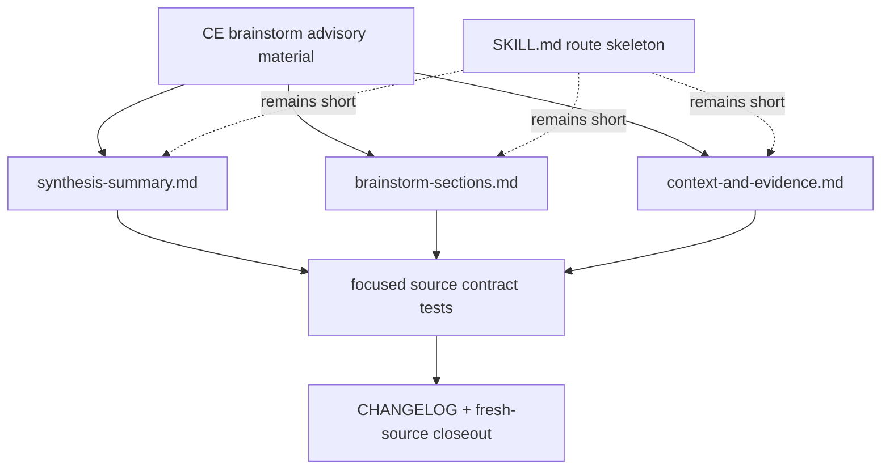

# refactor: Selectively absorb CE brainstorm quality patterns

## Summary

本计划把 CE `ce-brainstorm` 对照中更具体的 synthesis 压缩规则、requirements 文档 prose economy、以及 claim verification 思路选择性吸收到 `spec-brainstorm` source 包。落地方式保持 source-first 和 progressive disclosure：细则进入 `skills/spec-brainstorm/references/`，`SKILL.md` 继续保持短入口，不新增 mandatory subagent phase，也不手改 generated runtime mirrors。

---

## Decision Brief

- **Recommended approach:** 只吸收能降低 malformed synthesis、提升 requirements artifact 可读性、并加强 source-claim 可信度的最小规则；不复制 CE 的完整 workflow、HTML/Proof 分叉、scout dossier 或模型分层。
- **Key decisions:** `synthesis-summary.md` 承接 CE 的 conversational compression、detail tests、worked example 和 pre-flight re-review；`brainstorm-sections.md` / `requirements-capture.md` 承接 prose economy；claim verifier 先降级为 optional/degraded evidence helper。
- **Validation focus:** 用 focused source contract tests 锁住新增规则、保持 routing fixture 不变、运行 skill package 边界检查，并在实现后做 fresh-source eval 或记录未执行原因。
- **Largest risks / boundaries:** 当前 worktree 已有未提交的 `spec-brainstorm` 相关改动；实现必须基于当前磁盘内容补丁化修改，不能回退或覆盖这些既有改动。

---

## Problem Frame

前置分析对照发现：CE 版本在 synthesis 细则和文档 prose economy 上更具体，能减少 agent 把内部三桶草稿直接贴给用户、把 call out 写成遗漏问题、或把 requirements 文档写成长段泛化 prose 的风险。与此同时，CE 的主 workflow 把 scout dossier、claim verifier、模型层级、HTML/Proof 输出和较宽触发描述放进核心路径；直接照搬会冲突 spec-first 的 Light contract、source/runtime 边界、Codex dispatch 授权纪律和当前 `spec-brainstorm` 刚压缩后的 entrypoint 形态。

因此本计划目标不是“把 CE brainstorm 搬进 spec-first”，而是把三个高边际收益机制吸收到当前 source 包的正确位置，并用测试和 closeout 证据防止边界漂移。

---

## Requirements

- R1. `spec-brainstorm/SKILL.md` 必须继续保持短入口，只承担 trigger、near-neighbor exit、route-out shape 和 reference routing；CE 细则不得塞回主 prompt。
- R2. Synthesis 规则必须更具体地约束 stage-2 输出：保留三桶 internal draft、压缩成 conversational user-facing synthesis、禁止 doc-preview 化、禁止 implementation detail 泄漏。
- R3. Synthesis 必须吸收 CE 的可执行质量测试：read-aloud test、single-sentence test、pre-flight re-review、worked example，以及“超过 bullet cap 时提高抽象层级而不是涨 cap”的规则。
- R4. Requirements 文档规则必须吸收 prose economy：一句一个想法、requirement 为单一 intent 加少量 qualifier、剪掉无行动价值的 hedge/intensifier、resolve in place、precision is not padding。
- R5. Claim verification 只能作为 optional/degraded evidence helper：用于 checkable source claims，失败时 inline verify 或标为 unverified assumption；不得成为硬依赖、不得默认派生 subagent/dossier、不得把 provider 能力写成 workflow contract。
- R6. 不改变 `spec-brainstorm` 的已完成 routing boundary：open-ended ideation、PRD、plan、debug/review/work/direct cleanup 仍应 route out。
- R7. 新增或调整 source 规则必须有 focused tests 或明确未测原因；不能把 tests 变成 deterministic semantic router。
- R8. 后续实际 source 修改必须同步 `CHANGELOG.md`，并标注用户可见 workflow quality 变化；不手改 `.claude/`、`.codex/`、`.agents/skills/` generated runtime mirrors。

---

## Scope Boundaries

- 不复制 CE 的宽触发 frontmatter、`output:html` exclusive artifact、Proof/browser handoff、Path A 同轮 auto-write、scout dossier scratch path、模型 tier 指令或 mandatory claim verifier phase。
- 不新增 `spec-brainstorm-v2`、新 public workflow、per-skill `manifest.json`、trust report 或 output quality scorecard。
- 不改变 current-host entrypoint wording，不新增 `/spec:*` 或 `$spec-*` 硬编码到 `spec-brainstorm` source。
- 不调整 routing fixture 的 route matrix，除非实现发现新增规则确实改变 routing contract；本计划预期不改变 routing。
- 不运行实现、测试修复或 runtime regeneration；这些属于后续 `$spec-work`。

### Deferred to Follow-Up Work

- Provider-backed output-quality eval、blind reviewer scoring、trust report 和 governed-ready promotion 后续单独规划。
- 如果 optional claim verifier 在实际使用中稳定产生价值，再规划结构化 verifier artifact 或 eval harness；本轮只做 prose-level optional helper。
- 如需让当前 source 投影到 host runtime，后续由 `spec-first init` 处理并审查 drift，不在本计划阶段执行。

---

## Completion Criteria

- `skills/spec-brainstorm/references/synthesis-summary.md` 含更具体的 synthesis compression tests、worked example 和 pre-flight guidance，且不引入 CE 的 Path A 同轮 doc-write。
- `skills/spec-brainstorm/references/brainstorm-sections.md` 与必要时 `requirements-capture.md` 含 prose economy 规则，并保持 markdown canonical 与 requirements readiness gate。
- `skills/spec-brainstorm/references/context-and-evidence.md` 或相关 readiness gate 含 optional/degraded claim verification guidance，明确 dispatch authorization、fallback、evidence labels 和 assumptions。
- Focused tests、skill lint / eval fixture checks、fresh-source eval 或未执行说明、`CHANGELOG.md` 记录均完成。

---

## Direct Evidence Readiness

- target_repo: `.`
- evidence_sources: direct source reads, `rg`, `git status --short`, `git rev-parse HEAD`, `spec-first internal task-governance-signals`, codegraph advisory orientation, user-supplied CE comparison files
- source_refs:
  - `docs/10-prompt/结构化项目角色契约.md`
  - `skills/spec-brainstorm/SKILL.md`
  - `skills/spec-brainstorm/README.md`
  - `skills/spec-brainstorm/references/synthesis-summary.md`
  - `skills/spec-brainstorm/references/brainstorm-sections.md`
  - `skills/spec-brainstorm/references/requirements-capture.md`
  - `skills/spec-brainstorm/references/context-and-evidence.md`
  - `skills/spec-brainstorm/references/interaction-rules.md`
  - `skills/spec-brainstorm/references/discovery-flow.md`
  - `skills/spec-brainstorm/references/evaluation-governance.md`
  - `skills/spec-brainstorm/evals/routing-cases.json`
  - `tests/unit/spec-brainstorm-contracts.test.js`
  - `tests/unit/spec-brainstorm-routing-contracts.test.js`
  - `skills/spec-skill-audit/scripts/eval-fixture-normalizer.js`
  - `docs/plans/2026-06-21-001-refactor-spec-brainstorm-boundary-plan.md`
- current_revision: `f7eb0d88b05bb62bc648c5d4f4ad0a428806aebb`
- worktree_status: dirty with existing in-scope changes to `CHANGELOG.md`, `skills/spec-brainstorm/SKILL.md`, `skills/spec-brainstorm/references/synthesis-summary.md`, `tests/unit/spec-brainstorm-contracts.test.js`, `tests/unit/spec-brainstorm-routing-contracts.test.js`, plus untracked `skills/spec-brainstorm/README.md` and new reference files
- confidence: high that selective absorption is the right direction; medium on final wording until implementation and fresh-source review
- limitations: CE comparison material came from the user-named sibling checkout and is advisory external input, not target repo source. No subagents were dispatched because the current request did not explicitly authorize delegated/subagent work. No tests were run because this is plan-only.

---

## Direct Evidence

- repo_scope: `spec-first` root repo
- source_reads_completed:
  - Current `skills/spec-brainstorm/SKILL.md` is a short route/contract skeleton; it already routes long behavior into references.
  - Current `synthesis-summary.md` has two-stage synthesis, Path A/B, keep/detail tests, headless routing, and no same-turn requirements write for Path A.
  - Current `brainstorm-sections.md` defines section contract but lacks CE's explicit prose economy section.
  - Current `requirements-capture.md` has a readiness gate and some prose discipline, but can absorb the tighter economy rules without changing schema.
  - Current `context-and-evidence.md` already has verify-before-claiming and source-claim boundaries; it is the correct home for optional claim verifier guidance.
  - Current tests read `SKILL.md` plus references and already lock route boundary, synthesis checkpoint, markdown canonical, README/governance expectations, and routing fixture normalizer integration.
  - Existing plan `docs/plans/2026-06-21-001-refactor-spec-brainstorm-boundary-plan.md` is completed and covers boundary narrowing, not this CE-pattern absorption.
- source_reads_required:
  - Before implementation, re-read all dirty in-scope files because they may change under the user's hands.
  - Re-read the top of `CHANGELOG.md` immediately before editing because it is already dirty and ordered.
  - If tests have changed, re-read current `tests/unit/spec-brainstorm-contracts.test.js` before adding assertions.
- commands_or_tools_used:
  - `spec-first startup-reminder --codex`
  - `git status --short`
  - `git rev-parse HEAD`
  - `date +%F`
  - `rg --files` and `rg -n`
  - `sed` bounded source reads
  - `spec-first internal task-governance-signals --source plan-declared --json`
  - `codegraph_explore` for advisory eval normalizer blast-radius orientation
- impact_on_plan:
  - Plan depth is Deep: `task-governance-signals` returned `candidate_level: deep` with `cross-module`, `critical-path-hit`, `keyword-hit`, and workflow/contract/runtime risk domains.
  - The implementation should be prose/source constrained, not architecture expansion.
  - Existing routing evals should remain stable; new tests should lock content rules, not route semantics.
- key_findings:
  - The current resource split creates good landing zones for each CE-derived rule.
  - CE synthesis rules are richer than current spec-first rules specifically on compression, detail-level tests, and worked examples.
  - CE claim verifier is useful as a concept but over-coupled as implemented: it assumes background dispatch, claim list extraction, and scout dossier handoff.
  - `normalizeFixtureFile` is already consumed by `tests/unit/spec-brainstorm-routing-contracts.test.js`; introducing a parallel eval schema would be unnecessary.
- limitations:
  - Codegraph output is `provider_untrusted` advisory orientation and was confirmed against direct source reads where relevant.
  - No provider-backed model eval or fresh-source reviewer has evaluated the not-yet-implemented wording.

---

## Context & Research

### Relevant Code And Patterns

- `skills/spec-brainstorm/SKILL.md`: keep short; do not add long CE-derived prose here.
- `skills/spec-brainstorm/references/synthesis-summary.md`: primary target for synthesis compression rules and worked example.
- `skills/spec-brainstorm/references/brainstorm-sections.md`: primary target for format-independent prose economy and section-content rules.
- `skills/spec-brainstorm/references/requirements-capture.md`: target only when prose economy must be reflected in the concrete template or readiness gate.
- `skills/spec-brainstorm/references/context-and-evidence.md`: primary target for optional claim verification boundary.
- `skills/spec-brainstorm/references/evaluation-governance.md`: place to preserve maturity limits and avoid public-claim-ready overstatement.
- `tests/unit/spec-brainstorm-contracts.test.js`: focused source contract test for new prose rules.
- `tests/unit/spec-brainstorm-routing-contracts.test.js` and `skills/spec-brainstorm/evals/routing-cases.json`: should remain unchanged unless routing behavior changes.

### Institutional Learnings

- `docs/10-prompt/结构化项目角色契约.md` requires Light contract, Explicit boundaries, Scripts prepare / LLM decides, source/runtime separation, and no advisory facts promoted to confirmed truth.
- Existing `spec-brainstorm/README.md` says this package is production but not governed-ready; tests and routing fixtures are readiness evidence, not semantic output proof.

### External References

- CE comparison material from the user-named sibling checkout was read for advisory design input. Useful elements are synthesis detail tests, prose economy rules, worked example, and claim verifier concept. Rejected elements are broad trigger, mandatory scout/verifier flow, HTML/Proof handoff, and exclusive output-mode assumptions.

---

## Key Technical Decisions

- KTD1. **Reference-first absorption.** CE detail enters the narrow reference files where it is loaded at the phase that needs it; `SKILL.md` stays a route skeleton.
- KTD2. **Synthesis gets the most concrete CE transfer.** Malformed synthesis is a high-frequency failure mode, and CE already has specific tests and examples that map cleanly to spec-first's current Stage 1 / Stage 2 model.
- KTD3. **Prose economy is an artifact-quality rule, not a style preference.** Tight prose improves downstream planning, review, and traceability because contradictions and live decisions are easier to find.
- KTD4. **Claim verification remains optional/degraded.** The durable rule is "do not assert checkable repo claims without evidence"; helper dispatch is one implementation path only when explicitly authorized and available.
- KTD5. **Tests lock boundaries, not taste.** Focused tests should assert the presence of load-bearing constraints and examples, not every sentence or final model output.
- KTD6. **No new eval schema.** Existing routing fixture and global normalizer are sufficient for current route evidence; output-quality eval belongs to future governed work.

---

## Assumptions

- A1. The existing dirty `spec-brainstorm` source split is intentional and should be treated as the current baseline.
- A2. The goal is to plan the next source evolution only; implementation should wait for explicit handoff into `$spec-work`.
- A3. CE files remain available in the sibling checkout during implementation if exact wording needs another look.

---

## Open Questions

### Resolved During Planning

- Should CE be copied wholesale? No. It would import broader triggers, runtime coupling, and artifact assumptions that conflict with spec-first.
- Should `claim verifier` become a hard phase now? No. It should first land as optional/degraded evidence helper guidance.
- Should this create a new requirements or routing eval fixture? No by default. The behavior under plan does not change routing; source contract tests are enough unless implementation changes route outcomes.
- Should implementation update generated runtime mirrors? No. Source changes go into `skills/`; runtime refresh is a separate `spec-first init` action if needed.

### Deferred to Implementation

- Exact wording and section placement for each absorbed rule.
- Whether `requirements-capture.md` needs prose economy duplication after `brainstorm-sections.md` is updated, or whether a readiness-gate pointer is sufficient.
- Whether optional claim verifier guidance belongs entirely in `context-and-evidence.md` or also needs a short readiness-gate reference in `requirements-capture.md`.
- Whether fresh-source eval can be run with explicit helper-agent authorization; otherwise record `dispatch_authorization_missing` and perform an inline checklist review.

---

## High-Level Technical Design

> *This illustrates the intended approach and is directional guidance for review, not implementation specification. The implementing agent should treat it as context, not code to reproduce.*

The planned change strengthens phase-loaded guidance while preserving the short entrypoint and existing routing boundary.

---

## Implementation Units

### U1. Preserve The Entry Skeleton And Source Boundary

**Goal:** Make sure implementation starts from the current short `SKILL.md` design and does not re-expand it while absorbing CE rules.

**Requirements:** R1, R6, R8

**Dependencies:** None

**Files:**
- Modify (conditional): `skills/spec-brainstorm/README.md`
- Test: `tests/unit/spec-brainstorm-contracts.test.js`

**Approach:**
- Add or adjust maintainer guidance only if needed to state that CE-derived details belong in `references/`, not `SKILL.md`.
- Keep `SKILL.md` unchanged unless implementation discovers a broken reference route. If changed, the diff should be tiny and route-only.
- Preserve route-out reason codes, near-neighbor exits, and examples-as-context semantics.

**Patterns to follow:**
- `skills/spec-brainstorm/SKILL.md` current `Reference Routing` shape.
- `skills/spec-brainstorm/README.md` package governance and source/runtime boundary section.

**Test scenarios:**
- Boundary: source surface still describes `SKILL.md` as trigger/reference skeleton and references as behavior home.
- Regression: `SKILL.md` still points to synthesis, brainstorm sections, requirements capture, context/evidence, handoff, and evaluation governance references.
- Regression: routing contract tests still see the same route-out reason codes and expected routes.

**Verification:**
- The source package remains progressive-disclosure friendly, and a reviewer can see that CE rules did not bloat the initial-load entrypoint.

---

### U2. Strengthen Synthesis Compression Rules

**Goal:** Reduce malformed synthesis by importing CE's concrete detail-level tests, re-cut guidance, worked example, and pre-flight re-review into the spec-first synthesis reference.

**Requirements:** R2, R3, R6

**Dependencies:** U1

**Files:**
- Modify: `skills/spec-brainstorm/references/synthesis-summary.md`
- Test: `tests/unit/spec-brainstorm-contracts.test.js`

**Approach:**
- Add read-aloud and single-sentence tests for Stage 2 bullets.
- Add a pre-flight re-review note that catches doc-preview synthesis and paragraph-sized bullets before the user sees them.
- Add or adapt CE's worked example to show compression from internal draft into conversational Stage 2.
- Preserve spec-first-specific differences:
  - Path A remains announce-mode and does not write the requirements doc in the same turn.
  - Headless mode routes inferred bets to `## Assumptions`.
  - Wording uses current-host / spec-first terms, not CE `ce-plan` or `ce-brainstorm`.

**Patterns to follow:**
- Current `skills/spec-brainstorm/references/synthesis-summary.md` Stage 1 / Stage 2 structure.
- CE synthesis worked example and pre-flight concepts, translated into spec-first language.

**Test scenarios:**
- Happy path: synthesis reference contains read-aloud and single-sentence checks.
- Happy path: synthesis reference contains a worked example that demonstrates internal draft compression without exposing implementation details.
- Boundary: synthesis reference preserves "do not write the requirements doc in the same turn" for Path A.
- Boundary: synthesis reference does not mention CE entrypoints or CE output modes.
- Error path: tests assert call outs cannot be missed questions or blocking WHAT branches.

**Verification:**
- A future agent can compose a shorter, conversational synthesis while still routing full substance into the requirements document.

---

### U3. Add Requirements Prose Economy Rules

**Goal:** Make requirements artifacts easier for `spec-plan`, reviewers, and future readers to consume by importing CE's prose economy discipline into the format-independent section contract and concrete readiness gate.

**Requirements:** R4, R7

**Dependencies:** U1

**Files:**
- Modify: `skills/spec-brainstorm/references/brainstorm-sections.md`
- Modify (conditional): `skills/spec-brainstorm/references/requirements-capture.md`
- Test: `tests/unit/spec-brainstorm-contracts.test.js`

**Approach:**
- Add a `Prose Economy` section to `brainstorm-sections.md` with:
  - one idea per sentence;
  - requirement equals one intent plus at most one qualifier;
  - defer unresolved forks to Outstanding Questions;
  - cut hedges/intensifiers;
  - prefer verbs over nominalizations;
  - resolve superseded text in place;
  - keep precise domain terms, thresholds, IDs, and conditions.
- In `requirements-capture.md`, either reference that prose economy section from the readiness gate or add a compact readiness check so concrete markdown capture does not miss it.
- Avoid turning prose economy into a style linter or mechanical word blacklist.

**Patterns to follow:**
- `skills/spec-brainstorm/references/brainstorm-sections.md` existing "Outcome", "Hard Floor", and "ID And Content Rules" style.
- `skills/spec-brainstorm/references/requirements-capture.md` readiness gate categories.

**Test scenarios:**
- Happy path: section contract includes prose economy and resolve-in-place rules.
- Happy path: requirements capture readiness gate references prose economy or carries equivalent checks.
- Boundary: the rule preserves "precision is not padding" so exact IDs, conditions, and thresholds are not cut.
- Boundary: no generated requirement template gains process-exhaust or style-only boilerplate.

**Verification:**
- A requirements doc writer has concrete prose constraints before finalizing, and downstream readers can find live decisions without stacked resolution layers.

---

### U4. Introduce Optional Claim Verification Boundary

**Goal:** Turn CE's claim verifier idea into a spec-first-compatible optional helper for checkable source claims without adding a hard dependency on subagents or provider internals.

**Requirements:** R5, R7, R8

**Dependencies:** U1, U3

**Files:**
- Modify: `skills/spec-brainstorm/references/context-and-evidence.md`
- Modify (conditional): `skills/spec-brainstorm/references/requirements-capture.md`
- Modify (conditional): `skills/spec-brainstorm/references/evaluation-governance.md`
- Test: `tests/unit/spec-brainstorm-contracts.test.js`

**Approach:**
- Add a small "Optional Claim Verification Helper" subsection under source claims or external-tool context.
- Define when it applies: upcoming requirements doc will assert checkable repo claims such as absence, specific files/config/dependencies, or source-backed constraints.
- Define evidence labels: `confirmed`, `refuted`, `unverifiable`, and resulting doc action.
- Define degraded paths:
  - If dispatch is authorized and available, a fresh read-only helper may verify a bounded claim list.
  - If dispatch is not authorized, unavailable, or fails, verify inline with targeted source reads or label the claim as an unverified assumption.
  - Do not block brainstorming on helper availability.
- Explicitly reject CE coupling points: no mandatory scout dossier, no model tier names, no hidden background dispatch, no provider-specific contract.

**Patterns to follow:**
- Existing `context-and-evidence.md` "Verify before claiming" rule.
- `evaluation-governance.md` distinction between file-backed readiness evidence and missing semantic quality evidence.
- Project role contract's Scripts prepare / LLM decides boundary.

**Test scenarios:**
- Happy path: context/evidence reference describes optional claim verification and the four outcomes.
- Degraded path: reference says dispatch missing/failing falls back to inline verification or unverified assumptions.
- Boundary: reference does not require subagent dispatch, scratch dossiers, or provider/model tier names.
- Boundary: evaluation governance still says output-quality/trust evidence is missing unless separately established.

**Verification:**
- Source claims become more trustworthy without making optional host capabilities part of the hard workflow contract.

---

### U5. Update Tests, Changelog, And Closeout Evidence

**Goal:** Prove the source package absorbed the right rules without changing routing semantics or runtime mirrors.

**Requirements:** R6, R7, R8

**Dependencies:** U2, U3, U4

**Files:**
- Modify: `tests/unit/spec-brainstorm-contracts.test.js`
- Modify: `CHANGELOG.md`
- Test: `tests/unit/spec-brainstorm-routing-contracts.test.js`
- Test: `tests/unit/eval-fixture-contracts.test.js`

**Approach:**
- Add focused contract assertions for:
  - synthesis read-aloud/single-sentence/pre-flight/worked example;
  - prose economy in section contract/readiness gate;
  - optional/degraded claim verification boundary;
  - no CE entrypoint/output-mode leakage.
- Keep `tests/unit/spec-brainstorm-routing-contracts.test.js` and `skills/spec-brainstorm/evals/routing-cases.json` unchanged unless implementation changes route semantics.
- Add compact `CHANGELOG.md` entry after source edits, using the current repository format and `(user-visible)`.
- Run fresh-source eval after implementation if authorized; otherwise record the precise reason it was not run.

**Execution note:** Start by refreshing worktree status and reviewing dirty in-scope diffs. This task touches files already modified in the worktree.

**Patterns to follow:**
- Existing `spec-brainstorm` focused Jest tests that read source files directly.
- Existing changelog entries for `spec-brainstorm` refactors on 2026-06-21.

**Test scenarios:**
- Happy path: focused Jest passes for `spec-brainstorm` contracts and routing contracts.
- Integration-adjacent: global eval fixture contract still passes with no new fixture schema.
- Boundary: `lint:skill-entrypoints` still accepts the short `SKILL.md` entrypoint.
- Degraded review: fresh-source eval result or `dispatch_authorization_missing` is recorded in closeout.

**Verification:**
- Focused source contract coverage passes for `spec-brainstorm` content rules, routing boundary, and eval fixture shape.
- Skill entrypoint lint and skill package lint/resource-boundary checks still accept the compressed package shape.
- Whitespace/diff hygiene checks report no formatting artifacts.

---

## System-Wide Impact

- **Workflow surface:** `spec-brainstorm` output quality improves, but public routing boundaries should not change.
- **Downstream consumers:** `spec-plan`, `spec-doc-review`, and `spec-work` receive tighter requirements artifacts with clearer assumptions, scope boundaries, and source-claim labels.
- **Testing:** Existing structural tests expand to cover source prose contracts; no model-execution quality guarantee is introduced.
- **Runtime delivery:** Source changes remain under `skills/`; generated mirrors are unaffected until a separate runtime refresh.
- **Governance:** Optional claim verification strengthens evidence posture without promoting `spec-brainstorm` to governed-ready.

---

## Risks & Dependencies

| Risk | Mitigation |
|------|------------|
| CE prose is copied too literally and imports CE-specific entrypoints or output assumptions | Translate concepts into spec-first language and add tests that reject CE entrypoint/output-mode leakage |
| `SKILL.md` grows again after recent resource-boundary compression | Keep all absorbed rules in `references/`; change `SKILL.md` only for broken route references |
| Claim verifier becomes an implicit subagent dependency | State explicit dispatch authorization, availability, and degraded fallback rules |
| Tests become brittle style checks | Assert load-bearing phrases and boundaries, not full prose or final model output |
| Dirty worktree changes are overwritten | Re-read dirty files before implementation; patch around existing content; do not revert unrelated changes |
| Requirements docs become over-constrained and lose useful precision | Include "precision is not padding" and keep IDs/thresholds/domain terms verbatim |

---

## Alternative Approaches Considered

- **Copy CE `ce-brainstorm` wholesale:** Rejected. It would import broad triggers, HTML/Proof branching, mandatory dispatcher assumptions, and output-mode contract drift.
- **Only add prose economy and skip claim verification:** Rejected as too narrow. The claim verifier concept is valuable if framed as optional/degraded source-claim support.
- **Add a new governed eval package now:** Deferred. Current evidence remains file-backed; semantic output-quality evals need their own plan.
- **Put all rules in `SKILL.md` for discoverability:** Rejected. It would undo the current resource-boundary improvement and increase initial-load cost.
- **Make claim verification a hard gate before writing requirements docs:** Rejected. It would block on optional host capabilities and violate Scripts prepare / LLM decides boundaries.

---

## Documentation / Operational Notes

- Update `CHANGELOG.md` during implementation because this is user-visible workflow quality and source package behavior.
- No README or top-level docs update is required unless implementation changes package navigation or validation commands.
- Do not run `spec-first init` as part of the plan. If the user wants runtime mirrors refreshed after implementation, run it as a separate source-to-runtime operation.

---

## Completion Evidence

Completed on 2026-06-21.

- `skills/spec-brainstorm/SKILL.md` restored the public workflow contract anchors (`## Scenario Capability` and `## Capability-Class Evidence Boundary`), preserved the selected/user-framed WHAT discovery trigger, and kept the entrypoint under the production initial-load budget.
- `skills/spec-brainstorm/references/synthesis-summary.md` now carries read-aloud, single-sentence, pre-flight re-review, and worked-example guidance for compressed conversational synthesis.
- `skills/spec-brainstorm/references/brainstorm-sections.md` and `references/requirements-capture.md` now carry prose economy and readiness-gate checks, including "Precision is not padding".
- `skills/spec-brainstorm/references/context-and-evidence.md` now carries the optional/degraded claim verification helper with `confirmed`, `refuted`, `unverifiable`, and `unverified assumption` outcomes.
- Removed `skills/spec-brainstorm/README.md` from the source package to avoid a second skill-maintenance truth source; maintainer/governance posture remains in `references/evaluation-governance.md` and focused tests.
- Updated `tests/unit/spec-brainstorm-contracts.test.js` to lock load-bearing source rules without turning the tests into a semantic router or style linter.

Validation:

- `npx jest --runTestsByPath tests/unit/scenario-capability-matrix-contracts.test.js tests/unit/capability-aware-provider-contracts.test.js tests/unit/spec-brainstorm-contracts.test.js tests/unit/spec-brainstorm-routing-contracts.test.js tests/unit/eval-fixture-contracts.test.js --runInBand` passed: 5 suites, 47 tests.
- `npx jest --runTestsByPath tests/unit/public-workflow-contract-summary.test.js tests/unit/project-graph-consumption-contracts.test.js tests/unit/spec-brainstorm-contracts.test.js tests/unit/spec-brainstorm-routing-contracts.test.js tests/unit/scenario-capability-matrix-contracts.test.js tests/unit/capability-aware-provider-contracts.test.js --runInBand` passed: 6 suites, 46 tests.
- `npm run test:eval-fixtures` passed: 8 suites, 93 tests.
- `npm run lint:skill-entrypoints` passed: 189 files scanned.
- `python3 "$HOME/.agents/skills/yao-meta-skill/scripts/lint_skill.py" skills/spec-brainstorm` passed.
- `python3 "$HOME/.agents/skills/yao-meta-skill/scripts/resource_boundary_check.py" skills/spec-brainstorm` passed with warning only: estimated initial-load tokens `995 <= 1000`.
- `git diff --check` passed.
- `npm run test:unit` passed: 153 suites, 1293 tests.

Fresh-source eval was not run because this Codex request did not authorize subagents/personas/delegated review; closeout records `dispatch_authorization_missing` and uses direct source review plus full unit validation instead. Generated runtime mirrors were not edited.

---

## Sources & References

- Role contract: `docs/10-prompt/结构化项目角色契约.md`
- Existing completed boundary plan: `docs/plans/2026-06-21-001-refactor-spec-brainstorm-boundary-plan.md`
- Target skill source: `skills/spec-brainstorm/SKILL.md`
- Target references: `skills/spec-brainstorm/references/synthesis-summary.md`, `skills/spec-brainstorm/references/brainstorm-sections.md`, `skills/spec-brainstorm/references/requirements-capture.md`, `skills/spec-brainstorm/references/context-and-evidence.md`
- Target tests: `tests/unit/spec-brainstorm-contracts.test.js`, `tests/unit/spec-brainstorm-routing-contracts.test.js`, `tests/unit/eval-fixture-contracts.test.js`
- External advisory input: user-named CE `ce-brainstorm` files from the sibling checkout, used only for comparison and not as target source
