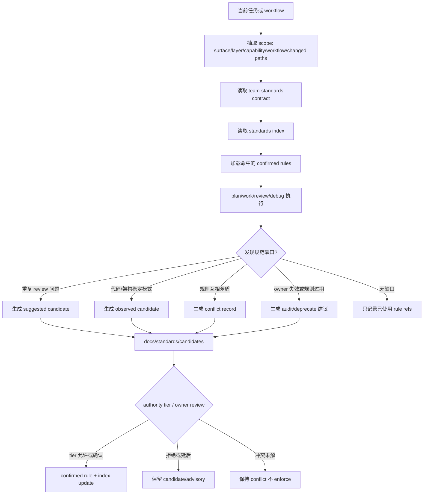
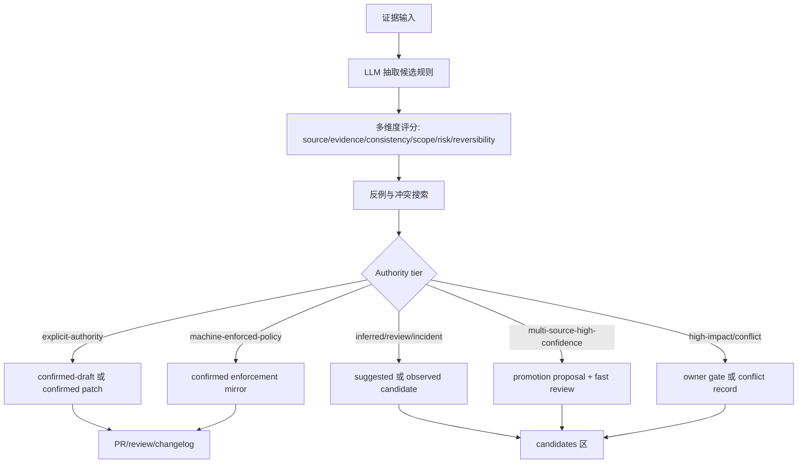
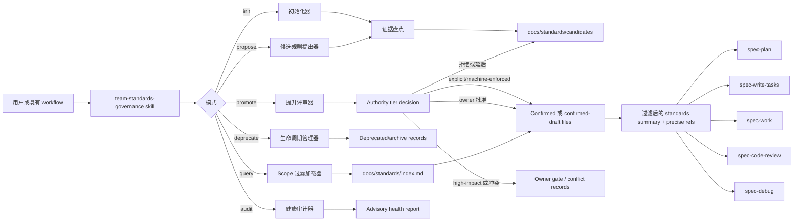
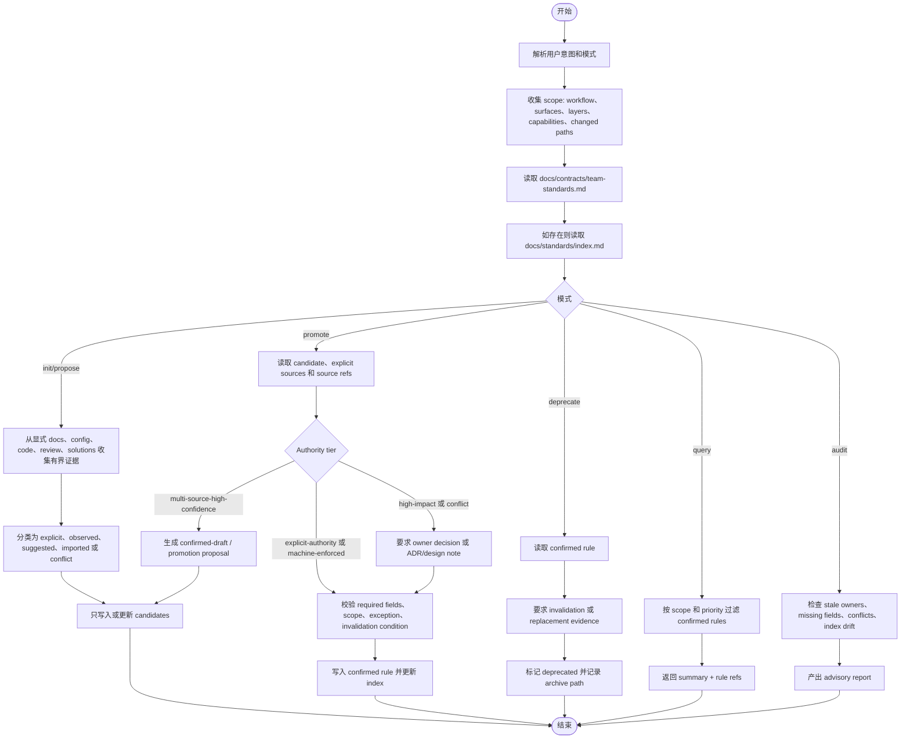
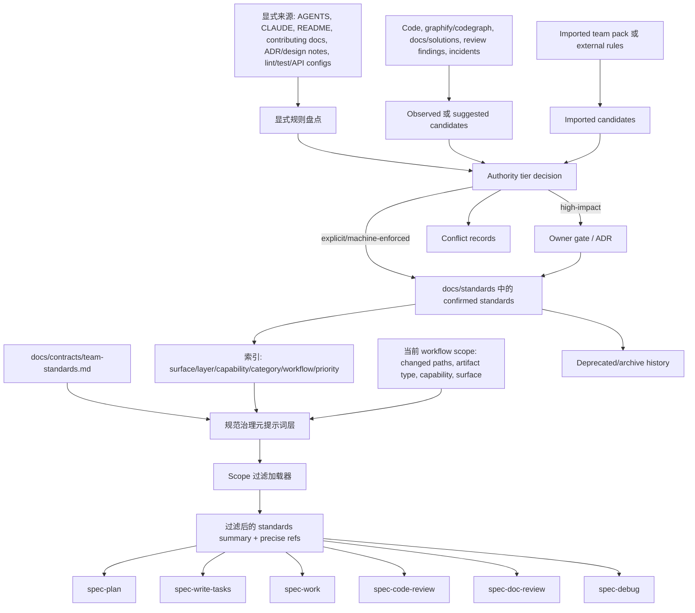
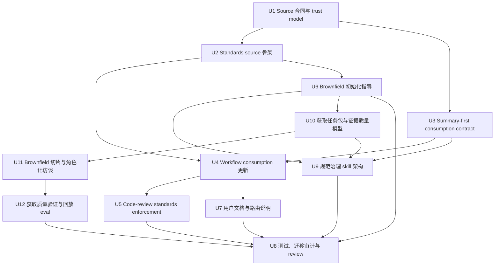

# 团队开发规范治理层深度计划

## 摘要

本计划为 spec-first 增加一等的团队开发规范输入与治理层：把当前分散在 `AGENTS.md`、`CLAUDE.md`、历史开发规范、workflow prose 和 code-review persona 中的规范消费方式，收敛为明确 source、trust level、scope、promotion gate、lifecycle 和 downstream consumption contract。它借鉴 OpenSpec 的显式 `context` / artifact-scoped `rules` 机制，但保留 spec-first 的 source-first、summary-first、trust-aware 和 `Scripts prepare, LLM decides` 边界。

深化后的方案覆盖多端工程场景：App、H5、PC Web、Admin、Backend、Job/Event/Data 等 surface 通过 scope 标签和跨端契约统一治理；高层系统架构、分层、设计决策规范作为 architecture/design standards 进入最高优先级规则，而不是混入普通代码风格规范。方案同时增加“规范治理元提示词层”：它负责动态解释、选择、加载、候选生成、分级自治和生命周期引导。业界已有 Qodo Rule Miner、CodeRabbit learnings、Claude Code auto memory 等“自动学习/自动生成规则”实践，因此本方案不把 human confirmation 作为一刀切前提，而是引入 authority tier：LLM 在低风险和显式权威来源层尽量自治，高影响治理层保留明确 owner gate。

本次继续深化后，计划增加“规范高质量获取层”：在写入 `docs/standards/**` 之前，先要求 acquisition task pack、证据质量评分、来源矩阵、brownfield 切片策略、角色化访谈、反例库、PR 回放和检索命中 eval。这样解决的是“怎么高质量获取团队规范”，而不只是“规范存在哪里、如何治理”。

---

## 决策摘要

- **推荐方案:** 先建立 `docs/standards/**` 作为团队开发规范的 confirmed source surface，并新增 `docs/contracts/team-standards.md` 定义 trust level、scope、lifecycle、注入边界和提升流程；再以 `skills/team-standards-governance/SKILL.md` 作为规范治理元提示词层，规定动态加载、候选生成、提升、废弃和审计方式；随后让 `spec-plan`、`spec-work`、`spec-write-tasks`、`spec-code-review`、`spec-doc-review`、`spec-debug` 按同一合同消费 confirmed standards。
- **关键决策:** 不恢复 `$spec-standards` / `/spec:standards` public workflow，不复用 `.spec-first/standards/` 作为当前 source，不把代码扫描结果本身自动确认为团队规范，不全量注入大文档；多端适配靠 surface/layer/capability/workflow 标签过滤，架构规范单列为最高优先级规则；LLM 自主能力按 authority tier 放大，而不是用单一“必须人工确认”压平所有场景；规范获取必须先过 acquisition quality layer，避免把历史债、个人偏好或低质量证据包装成团队规则。
- **验证重点:** 重点验证 public workflow catalog 仍不暴露 `spec-standards`，下游 workflow 只把 `confirmed` 且 scope 命中的规范当硬上下文，review persona findings 必须引用具体标准条款；同时验证索引加载不会要求全量读取 `docs/standards/**`，并用 PR replay / retrieval eval 验证“获取到的规范能否减少误判和正确命中”。
- **最大风险 / 边界:** 最大风险是把“规范治理”做成第二套流程引擎、大上下文注入器，或把模型置信度误当组织授权。本计划把第一版限定为轻合同、Markdown source、手工索引、focused contract tests 和分级自治的提升流程。

---

## 问题背景

当前 spec-first 流程已经严谨：从需求、计划、任务、执行、评审到知识沉淀都有明确 workflow 边界。但团队开发规范这一层仍不够稳定：

- `spec-plan`、`spec-work`、`spec-write-tasks`、`spec-code-review`、`spec-doc-review`、`spec-debug` 都已经承认 project standards 可作为上下文。
- `spec-project-standards-reviewer` 已能按 `AGENTS.md` / `CLAUDE.md` / 目录级文件审查项目明写规则。
- 历史 `spec-standards` 曾尝试生成 standards artifacts，但已被移除，当前测试和 runtime prune 明确不应恢复该 public workflow 或 `.spec-first/standards/` artifact root。
- 用户本轮 OpenSpec 对比讨论暴露的核心缺口不是“缺规范概念”，而是缺少团队规范的稳定输入、scope 选择、trust level、人工确认、冲突治理和跨 workflow 消费合同。

OpenSpec 的本地源码显示，`openspec/config.yaml` 通过 `context` 和 `rules` 显式给 artifact 生成过程提供约束；`rules` 按 artifact ID 注入，是给 agent 的约束，不应复制进产出文件。这对 spec-first 的启发是：规范必须显式、按消费场景选择、与产出模板分离。但 spec-first 不能照搬成全量 context 注入或自动从代码扫描确认规范，因为角色契约要求 advisory facts 不能冒充 confirmed truth。

本计划的目标是让团队规范成为 AI coding harness 的一等输入资产，而不是让它变成新的中心化状态机。

---

## 需求

- R1. 建立团队开发规范的 source-of-truth 边界，明确哪些文件能产生 hard project context，哪些历史文档、扫描结果、经验文档只能作为 advisory。
- R2. 定义 trust level：`confirmed`、`observed`、`imported`、`suggested`、`conflict`、`deprecated`，并规定只有 `confirmed` 且 scope 命中的规范可成为硬约束。
- R3. 定义规范条目的最小字段：`id`、`trust`、`priority`、`category`、`applies_to`、`layer`、`capability`、`owner`、`source_refs`、`rule`、`rationale`、`enforcement`、`exceptions`、`effective_from`、`migration_impact`、`invalidation_condition`、`last_reviewed`。
- R4. 支持团队开发规范的主要类型：高层架构约束、设计决策约束、source/runtime 边界、代码组织、测试策略、review 规则、安全/隐私约束、发布/变更流程约束。
- R5. 下游 workflow 必须按同一 consumption contract 读取规范：summary-first、scope-filtered、confirmed-first，不得全量注入整个规范库。
- R6. `spec-code-review` 的 project-standards persona 必须继续只审“项目明写规则”，并把 `docs/standards/**` 纳入明确标准来源后才可引用；不得把 generic best practice 当 finding。
- R7. 不恢复已退役的 `spec-standards` public workflow、命令、runtime mirror、`.spec-first/standards/` source/artifact contract 或旧 glue-map/candidates 消费路径。
- R8. 提供 brownfield 初始化路线：历史代码、历史文档、graphify/codegraph、docs/solutions 和 review 经验默认只能生成候选；只有满足 authority tier、scope、证据质量和冲突检查后才可进入 `confirmed-draft` 或 `confirmed`。
- R9. 用户文档要说明团队如何配置、维护、审查和演进规范，以及这些规范与 `docs/specs/<capability>/spec.md`、`docs/contracts/**`、`docs/solutions/**` 的区别。
- R10. 所有变更必须遵守 source/runtime 边界，不手改 `.claude/`、`.codex/`、`.agents/skills/`。
- R11. 支持多端 scope 模型，至少覆盖 `shared`、`app`、`h5`、`pc`、`admin`、`backend`、`job/event`、`data` 等真实 surface，并能表达跨端一致性规则。
- R12. 支持高层 architecture/design standards，覆盖系统分层、依赖方向、业务状态 ownership、跨端契约、设计决策门槛和 ADR/design note 触发条件。
- R13. 定义规范生命周期：什么时候新增、修改、例外、冲突、废弃、归档，以及每种状态如何影响 workflow enforcement。
- R14. 定义初始化产物结构：显式规则盘点、observed/suggested candidates、conflicts、promotion review 和 confirmed standards 的分区，避免候选与正式规范混放。
- R15. 定义按需加载和高效索引：通过 surface、layer、capability、category、workflow、priority 过滤规范，默认读取 index 和命中条目摘要，而不是全量注入。
- R16. 定义规范优先级、例外机制、生效时间、迁移影响和 owner 责任，避免 confirmed 规范变成无人维护的僵尸规则。
- R17. 设计一个可选的规范治理 standalone skill 架构，覆盖初始化、查询、候选生成、提升、冲突处理、废弃和按需加载，但不恢复 `spec-standards` public workflow。
- R18. 规范 skill 必须遵守 `Scripts prepare, LLM decides`：脚本或结构化步骤只能准备 deterministic/advisory facts；LLM 可做语义判断、置信评分、多轮复核和候选合并，但 authority boundary 由 `docs/contracts/team-standards.md` 定义。
- R19. 定义规范治理元提示词层：明确 AI 如何理解规范、选择规范、解释冲突、提出候选、触发生命周期动作、生成 handoff，并把这些行为与 confirmed 规范内容分离。
- R20. 支持受治理的自适应扩展动态：workflow 可根据重复问题、review finding、incident、实现偏差和跨端冲突提出候选或审计项，但不得在未满足 authority tier 时自动把候选提升为 confirmed。
- R21. 定义分级自治规则：显式权威来源可被 LLM 自动整理并进入 confirmed draft 或 confirmed 标注；代码推断、review 重复模式和高置信候选可自动生成 promotion proposal；高影响治理规则、冲突规则和 owner 不明规则必须保留 owner gate。
- R22. 定义规范获取任务包：每次初始化或提取规范前必须声明目标仓库、业务能力、surface、时间窗口、证据来源、排除范围、隐私边界和预期产物。
- R23. 定义证据质量评分：每个候选规则必须记录 `source_strength`、`recency`、`consistency`、`coverage`、`conflict_density`、`enforcement_feasibility`、`owner_trace`、`migration_cost`、`risk_level` 和 `retrieval_value`。
- R24. 定义来源矩阵：显式文档、机械配置、PR review、incident/postmortem、代码结构、测试、onboarding 问题、团队访谈分别能产生哪些 trust level 和 candidate type。
- R25. 定义 brownfield 切片策略：大型项目按高风险能力、核心链路、高 churn 模块、跨端一致性、近期 PR 热点、事故频发区和 owner 可用性分批获取规范。
- R26. 定义角色化访谈 playbook：对架构、安全、测试、SRE、App、H5、PC/Admin、Backend、Data、产品/业务 owner 使用不同问题集，补足代码无法回答的组织规则。
- R27. 定义规则质量验收清单和反例库：进入 confirmed 前必须通过 atomic、actionable、falsifiable、scoped、examples、exceptions、owner、invalidation、migration policy 检查，并明确哪些内容不得沉淀为规范。
- R28. 定义获取质量验证：用历史 PR replay、review finding 回放、检索命中 eval、噪音率和 owner 审查耗时验证规范是否真的提升 plan/work/review 质量。
- R29. 定义规范获取过程的隐私与脱敏边界：从 PR、事故、业务文档、访谈记录提取规范时，不得把敏感业务细节、客户数据或内部人员信息沉淀进可复用规范。

---

## 假设

- A1. 本计划没有 upstream `docs/brainstorms/*-requirements.md`；origin 是用户本轮 OpenSpec/spec-first 对比讨论和当前仓 source 复核，因此使用 plan-local `spec_id`。
- A2. 第一版优先落文档 source contract 和 workflow consumption prose，不实现新的 CLI producer 或自动扫描器。
- A3. `docs/03-实施方案/06-开发规范.md` 和 `docs/01-需求分析/11.project-standards/**` 是历史/方案材料，可作为迁移输入，但不是当前 confirmed team standards source。
- A4. “需要 owner 判断”不是因为 LLM 专业能力不足，而是因为团队规范同时是技术判断和组织授权。显式权威来源、低风险重复偏好和可回滚规则可以高度自治；架构边界、状态 ownership、安全、隐私、支付、权限、跨端契约等高影响规则需要 owner gate。
- A5. `docs/standards/**` 是推荐的新 source surface；若未来团队选择 `AGENTS.md` / `CLAUDE.md` / 目录级文件承载部分规范，也必须在合同中定义 priority 和 scope。
- A6. 多端项目的 surface 列表必须可项目化调整；本计划使用 App/H5/PC/Admin/Backend 等作为默认例子，不把这些名字硬编码成所有项目的固定枚举。

---

## 范围边界

- 不恢复 `$spec-standards`、`/spec:standards`、`skills/spec-standards/` 或 `.spec-first/standards/`。
- 不把 `docs/specs/<capability>/spec.md` 改造成团队开发规范；能力 spec 记录产品/系统能力真相，团队开发规范记录工程约束和协作规则。
- 不把 `docs/contracts/**` 的 workflow/schema contract 与团队规范混为一谈；contract 约束 harness/artifact，standards 约束团队在项目中的开发实践。
- 不把 `docs/solutions/**` 的经验文档直接提升为规范；经验文档提供可复用学习，只有经过确认和 scope 定义后才进入 standards。
- 不要求所有项目都一次性补齐完整规范库；第一版应支持薄规范、渐进补充和局部 scope。
- 不把 App、H5、PC、Admin、Backend 各自拆成孤立规范体系；共享规则和跨端契约优先，端特有规则只承载差异。
- 不把 architecture/design standards 写成“高内聚低耦合”这类不可执行口号；每条高层规范必须能判断违反条件、source of truth、owner 和例外。
- 不把规范 skill 做成 public `$spec-*` workflow、中心化状态机或自动批准器；它只能是 source skill / helper 方法论，服务既有 plan/work/review/debug workflow。
- 不让元提示词层自我修改角色契约、public workflow route map、runtime delivery 或绕过 authority tier 修改 confirmed standards；它只能解释当前规范、产生候选、提出冲突和组织 promotion review。
- 不设计复杂评分、状态机、规范 marketplace、远程同步或跨组织规范中心。

### 延后到后续工作

- CLI 辅助命令：如 `spec-first standards check/show/promote`，只有在文档 source 和 workflow consumption 被验证后再独立计划。
- 自动候选挖掘：可从 graphify/codegraph、review findings、docs/solutions、历史代码中生成候选，但属于后续 advisory producer，不进入第一版核心。
- 多项目团队规范包：可以借鉴历史 Team Pack 方案，但第一版先解决单仓 confirmed standards source 和 workflow consumption。

---

## 完成标准

- C1. `docs/contracts/team-standards.md` 明确 source、trust level、scope、promotion gate、consumer boundary、anti-patterns。
- C2. `docs/standards/index.md` 和首批分类文件存在，并给出可执行的轻量条目模板。
- C3. 下游 workflow prose 与 contract tests 对齐：只把 confirmed/scope-matched standards 作为硬上下文，observed/imported/suggested/conflict/deprecated 均保持 advisory 或不可用。
- C4. `spec-code-review` 的 project-standards persona 和 Stage 3b discovery 支持新 standards source，但仍要求每个 finding 引用具体条款。
- C5. public workflow catalog、using-spec-first route map、runtime capability catalog 和 init prune tests 继续证明 `spec-standards` 未恢复。
- C6. README/用户手册说明团队规范输入方式、brownfield 初始化方法和与 OpenSpec 的差异。
- C7. 计划实现后未手改 generated runtime mirrors；如 source-runtime projection 需要刷新，另由 `spec-first init` 执行并记录。
- C8. `docs/standards/index.md` 提供按 surface、layer、capability、category、workflow 的人工索引，并明确默认加载算法。
- C9. 首批标准文件包含 architecture/design/cross-surface 规则模板，能表达业务状态 ownership、依赖方向、跨端契约和设计决策门槛。
- C10. brownfield 初始化文档区分 explicit rules、observed patterns、suggested candidates、conflicts 和 confirmed promotions，并给出 authority tier / owner review 退出条件。
- C11. 生命周期规则覆盖新增、修改、例外、冲突、deprecated、archive，不允许没有 owner/invalidation condition 的 confirmed 规则合入。
- C12. 规范治理 skill 架构文档明确入口、模式、输入、输出、文件边界、执行流程、失败模式、handoff 和与现有 workflow 的调用关系；测试继续证明没有 `$spec-standards` / `/spec:standards` 回归。
- C13. 规范治理元提示词层文档明确 meta-prompt responsibilities、动态加载算法、自适应候选生成边界、handoff 输出格式和分级自治边界。
- C14. 自适应扩展流程能从 workflow feedback 生成 `suggested` / `observed` candidates、conflict records 或 audit report，并明确哪些 authority tier 可自动进入 confirmed draft、哪些必须 owner confirmation。
- C15. `docs/contracts/team-standards.md` 定义 authority-tier table、promotion decision rules 和 absence guards：模型 confidence 是 promotion 输入，不是独立 authority；high-impact governance 与 conflict-present 一律不可自动 enforce。
- C16. 规范获取任务包模板存在，且能表达 scope、source、time window、privacy boundary、candidate output 和 non-goals。
- C17. 候选规则必须带 evidence quality score；缺失关键证据、过期、冲突密度高或 owner 不明时只能保持 advisory。
- C18. Brownfield 初始化文档包含切片策略和角色化访谈 playbook，明确大型项目不得默认全仓一次性提取。
- C19. 规则质量验收清单和反例库存在，能阻止历史债、临时 workaround、个人偏好、旧架构残留和低频例外进入 confirmed。
- C20. 获取质量验证方案包含 PR replay、retrieval eval、误报/漏报观察和 adoption feedback，且结果只作为证据输入，不作为 LLM 自评。

---

## 直接证据准备度

- target_repo: `spec-first`
- evidence_sources: direct source reads、`rg`、CodeGraph orientation、task-governance-signals、git status、本地 OpenSpec read-only comparison
- source_refs:
  - `docs/10-prompt/结构化项目角色契约.md`
  - `skills/spec-plan/references/governance-boundaries.md`
  - `agents/spec-project-standards-reviewer.agent.md`
  - `docs/plans/2026-05-21-002-refactor-remove-spec-standards-plan.md`
  - `src/cli/state.js`
  - `tests/unit/spec-plan-contracts.test.js`
  - `tests/unit/spec-work-contracts.test.js`
  - `tests/unit/spec-code-review-contracts.test.js`
  - `tests/unit/spec-write-tasks-contracts.test.js`
  - `tests/unit/runtime-capability-catalog.test.js`
  - `tests/unit/using-spec-first-contracts.test.js`
  - `docs/05-用户手册/12-gitignore参考.md`
  - `docs/03-实施方案/06-开发规范.md`
  - `docs/01-需求分析/11.project-standards/第一层级.md`
  - `docs/validation/execution-logs/2026-05-04-spec-standards-loop.md`
- current_revision: `3988bcbe`
- worktree_status: target plan 正在原地深化；`templates/codex/hooks/session-start`、`tests/unit/codex-session-start-hook.test.js` 和 `tests/unit/version-reminder.sh` 已存在无关修改，不属于本任务范围
- confidence: 对当前 spec-first source/routing/retirement evidence 为高；对 OpenSpec comparison 为中，因为它来自 sibling repo read-only source，不是依赖项
- limitations: 未 dispatch fresh-source subagent review；未做实现变更；本地 OpenSpec source 可能不同于 upstream published OpenSpec state

---

## 直接证据

- repo_scope: 单仓 `spec-first`
- source_reads_completed:
  - 角色基线: `docs/10-prompt/结构化项目角色契约.md`
  - Planning contract: `skills/spec-plan/SKILL.md` 及相关 references
  - 当前 standards consumption: `skills/spec-plan/references/governance-boundaries.md`, `skills/spec-work/SKILL.md`, `skills/spec-write-tasks/SKILL.md`, `skills/spec-code-review/SKILL.md`, `skills/spec-doc-review/SKILL.md`, `skills/spec-debug/SKILL.md`
  - 当前 reviewer role: `agents/spec-project-standards-reviewer.agent.md`
  - Retirement state: `docs/plans/2026-05-21-002-refactor-remove-spec-standards-plan.md`, `src/cli/state.js`, related unit/smoke test hits
  - 历史设计: `docs/03-实施方案/06-开发规范.md`, `docs/01-需求分析/11.project-standards/**`, `docs/validation/execution-logs/2026-05-04-spec-standards-loop.md`
  - OpenSpec 对比: sibling repo `OpenSpec/openspec/config.yaml`, `OpenSpec/src/core/artifact-graph/instruction-loader.ts`, `OpenSpec/docs/core-workflow-prompts.md`, archived rules-injection spec
  - 业界实践: Qodo Rule Miner、CodeRabbit learnings、GitHub Copilot custom instructions、Claude Code memory、OpenAI Agents guardrails/human review、Anthropic agent evals、NIST AI RMF、OPA policy-as-code
- source_reads_required:
  - 实现阶段编辑前必须重读精确目标文件，尤其是所有 focused contract tests 和被修改的 README sections。
- commands_or_tools_used:
  - `mcp__codegraph.codegraph_explore`
  - `rg` for standards/spec-standards references
  - `node bin/spec-first.js internal task-governance-signals --source plan-declared --input ... --json`
  - `git status --short`, `git rev-parse --short HEAD`
- impact_on_plan:
  - `task-governance-signals` 返回 `candidate_level: deep`，命中 `cross-module`、`critical-path-hit` 以及 governance/contract/workflow 关键词。
  - 当前 tests 明确要求 active contracts 中没有 `$spec-standards`、`/spec:standards`、`.spec-first/standards/`、`docs/examples/standards-glue-consumption-examples.md` 或 `<standards-baseline-paths>`。
  - `spec-project-standards-reviewer` 已提供 review enforcement 形态：引用明写规则、抑制 generic best practices、按 changed file types 匹配 section。
- key_findings:
  - spec-first 已有 standards consumption 概念，但分散在多个 workflow，且主要绑定 host instructions。
  - OpenSpec 有价值的机制是 explicit configuration 和 artifact-scoped rule injection，不是 automatic mining。
  - 之前 `spec-standards` 尝试已经沉淀出重要 trust boundary：只有 confirmed standards 能成为 hard constraints；scripts 不确认 standards。
  - 持久缺口是 governance 和 source shape，不是再做一个 public workflow。
  - 后续讨论把设计要求扩展到 multi-surface scope、standards initialization、lifecycle governance、indexing、high-level architecture/design standards、规范治理元提示词层、自适应扩展动态、authority-tiered autonomy 和 acquisition quality layer。
- limitations:
  - 本计划不验证真实团队采纳。
  - 本计划不为 `hszq-app` 初始化 standards；它提供后续 pilot 可使用的 spec-first 机制。

---

## 上下文与研究

### 相关代码与模式

- `skills/spec-plan/references/governance-boundaries.md` 已说明：已加载 host instruction、目录级等价文件或精确读取 source 中的明写项目规范，在适用于计划文件时可以定义 hard context。
- `skills/spec-work/SKILL.md` 已要求实现阶段把适用于变更文件的明写规范当作 hard context，并把历史计划、经验文档、外部工具事实当作 advisory。
- `skills/spec-write-tasks/SKILL.md` 已说明：明写项目规范只有在适用于变更文件且与 source plan 一致时，才能成为任务约束。
- `skills/spec-code-review/SKILL.md` 的 Stage 3b 已支持从 `CLAUDE.md` / `AGENTS.md` 发现项目规范，leaf reviewer 会自行读取相关章节。
- `agents/spec-project-standards-reviewer.agent.md` 要求精确引用规则证据，并抑制 generic best practices。这正是 confirmed standards 应沿用的 enforcement 姿态。
- `src/cli/state.js` 包含已退役 standards runtime prune 路径，包括 `.spec-first/standards`、`.claude/commands/spec/standards.md`、`.claude/spec-first/workflows/spec-standards`、`.claude/skills/spec-standards`、`.agents/skills/spec-standards` 和 `.codex/commands/spec/standards.md`。
- 现有单测断言 active workflow surface 不再引用 `spec-standards`、`.spec-first/standards/`、旧 examples 或旧 baseline path blocks。

### 历史经验

- `docs/plans/2026-05-21-002-refactor-remove-spec-standards-plan.md` 的结论是：删除 `spec-standards` 时应保留 generic project standards review，但移除 generated baseline artifacts 和 public workflow surface。
- `docs/validation/execution-logs/2026-05-04-spec-standards-loop.md` 记录了一条有价值但实现已退役的经验：只有 confirmed standards 可以成为 hard constraints；observed/imported candidates 必须保持 advisory。本计划保留这条经验，但不恢复旧实现。
- `docs/01-需求分析/11.project-standards/第一层级.md` 主张轻量 shared project-level spec input，用来减少 plan/work/review 前的歧义；同时警告不要引入状态机字段、复杂 rule runtime、评分和自动 closure。
- `docs/03-实施方案/06-开发规范.md` 包含较早的 coding/process norms，可作为首批 `docs/standards/**` 草稿输入，但必须先 review 和规范化，才能成为 confirmed standards。

### OpenSpec 对比

- OpenSpec `openspec/config.yaml` 使用全局 `context` block，并用 `rules` 按 artifact ID 组织规则，例如 `specs`、`tasks`、`design`。
- OpenSpec instruction generation 会把 `context`、`rules`、`template`、`instruction`、output path 和 dependencies 作为独立字段返回；源码注释明确把 `context` 与 `rules` 描述为 AI 约束，而不是输出内容。
- OpenSpec archived rules-injection spec 要求 rules 只注入匹配 artifact、保留规则原文、追加到 schema guidance 而不是替换，并在 instruction loading 时对未知 artifact ID 发出 warning。
- spec-first 应采纳 artifact-scoped selection 和“约束与输出内容分离”的思想，但不应把无类型的 global injection 作为 hard project truth source。

### 业界实践：自动学习规则不是幻想，但通常带治理开关

- Qodo Rule Miner 是最接近“LLM/AI 自动分析、提取、生成规则、甚至自动激活”的公开落地：它从组织 PR discussion、accepted review comments、反复出现的 reviewer feedback 与 accept/reject pattern 中挖掘规则；首轮可按仓库生成规则，后续持续增量；配置上可以进入 Suggestions 让人批准，也可以 auto-approve 直接进入 active rules。该实践证明“自动挖掘规范”在 code review standards 场景已经产品化。
- CodeRabbit learnings 会基于团队与 review comment 的交互自动形成 review preferences；其 knowledge base 能承载 repository/organization 级偏好，配置文档称其会形成 dynamic self-improving configuration layer。CodeRabbit 也提供 learning approvals / approval delay，说明业界在自动学习和治理延迟之间提供可调档位。
- GitHub Copilot code review 主要采用显式 custom instructions：repository-wide `.github/copilot-instructions.md` 和 path-specific `.github/instructions/**/*.instructions.md`。它代表“显式规范输入 + path scope”路线，自动提取不是核心，但 scope-filtered instruction 是已被主流平台采用的形态。
- Claude Code 官方 memory 把持久知识分成 CLAUDE.md 和 auto memory：前者是用户显式 instructions，后者是基于 corrections/preferences 自动写入的 notes。它说明“自动沉淀”正在进入 agent runtime，但也说明显式 instructions 仍是更强权威层。
- OpenAI Agents SDK 把 guardrails 和 human review 并列：guardrails 自动校验输入、输出或工具行为；human review 用于敏感动作的 approve/reject。这支持本方案的核心区分：自动检查和自动建议可以非常强，但敏感 authority action 需要单独 gate。
- Anthropic agent evals 建议组合 code-based、model-based 和 human graders。该模式可映射到标准治理：deterministic checks 提供事实，LLM judge 做语义评估，人类/owner 用于校准和高影响裁决。
- OPA / policy-as-code 的行业经验是：一旦 policy 被显式写成 code，就可以自动、稳定、跨栈 enforcement；但 policy 本身不是靠运行时观察默默成为权威。对 spec-first 的启发是：confirmed standard 一旦明确，就应可自动消费；从行为观察到 policy 的提升仍需 authority semantics。
- NIST AI RMF 提供更高层治理语境：AI 风险管理强调 govern / map / measure / manage，以及组织中的责任、监督和风险分配。对本方案而言，owner gate 的本质是 accountability，不是对 LLM 能力的低估。

---

## 关键技术决策

- KTD1. 使用 `docs/standards/**` 作为 confirmed 团队开发规范的一等 source surface。
  - 理由：它可见、可 review、可移植，并且已经位于项目 docs source-of-truth 范围内；同时避免复用已退役的 `.spec-first/standards/` runtime artifacts。
- KTD2. 保留 `AGENTS.md` / `CLAUDE.md` 作为 host instruction 入口，但不把完整规范库塞进去。
  - 理由：host 文件适合承载高优先级 session rules 和指针；较大的 standards 应从 `docs/standards/**` 渐进披露。
- KTD3. 先在 source prose 中定义 trust level，再考虑 machine-readable CLI 支持。
  - 理由：难点是语义权威，不是解析。没有 authority rules 的 CLI 会重演旧 standards artifact 问题。
- KTD4. 规范进入上下文前必须 scope-filter。
  - 理由：大型 app 和长期项目无法注入完整 standards corpus。消费者只需要与当前文件、artifact 或决策匹配的 `applies_to` / `scope` 规则。
- KTD5. `confirmed` 是唯一 hard level。
  - 理由：observed code patterns 可能是偶然、遗留或不一致；imported/suggested rules 需要 human/project owner 确认后才能 enforce。
- KTD6. 通过 `spec-project-standards-reviewer` 扩展 review consumption，不新增 reviewer。
  - 理由：现有 reviewer 已有正确证据纪律：引用规则和 diff line，抑制 generic opinions。
- KTD7. 历史 `spec-standards` 材料只能作为 advisory design input。
  - 理由：当前 tests/source 已有意退役旧 workflow。值得保留的是 trust-aware standards 思想，不是旧 public workflow 或 artifacts。
- KTD8. 用 scope tags 支持多端项目，而不是为每个端复制一套规范。
  - 理由：App、H5、PC、Admin、Backend 等端会共享业务状态、API、权限、错误和埋点契约。复制多份规范会导致漂移；共享规则、跨端规则和端特有差异应通过 `applies_to`、`layer`、`capability`、`workflow` 等标签组合表达。
- KTD9. architecture/design standards 与 coding style standards 分离。
  - 理由：架构边界、分层、业务状态 ownership、跨端契约和 design note 门槛是高优先级工程约束，不应被普通格式、命名或测试偏好稀释；每条都必须能被 review 以 rule ID + 违反证据引用。
- KTD10. lifecycle 和 loading rules 先由文档治理，再考虑工具化。
  - 理由：第一阶段要先证明团队能正确新增、修改、废弃和按需读取规则。过早上 CLI/schema 会制造伪确定性，并容易把候选扫描结果误包装成 confirmed standards。
- KTD11. 把规范治理元提示词层作为“解释与编排层”，不作为规范事实源。
  - 理由：meta-prompt 可以提升 AI 对规范的选择、解释和候选生成质量，但它本身不是 confirmed standards。事实源仍是 `docs/standards/**`，权威合同仍是 `docs/contracts/team-standards.md`。
- KTD12. 把“LLM 自主决策”做成分级自治，而不是一刀切禁止或一刀切放开。
  - 理由：Qodo Rule Miner、CodeRabbit learnings 和 Claude Code auto memory 已证明自动提取规则有落地价值；但 OpenAI guardrails/human review、Anthropic evals、NIST AI RMF 和 OPA policy-as-code 共同指向另一条边界：自动分析可以尽量强，authority 必须按来源、影响面、冲突状态和责任归属分层。
- KTD13. 把“规范获取质量”作为独立层处理，不把它塞进 standards content 或 promotion gate。
  - 理由：规范治理回答“什么能成为权威”，规范消费回答“何时加载和执行”，规范获取回答“从哪里、用什么证据、按什么切片拿到候选”。三者混在一起会让候选生成、权威判断和上下文加载互相污染。
- KTD14. Brownfield 规范初始化必须按 slice 获取，而不是全仓总结。
  - 理由：大型 app/多端项目里，全仓总结容易把历史债、局部例外和过期模式泛化成团队规则。按 capability/surface/risk/churn/incident 切片可以让证据更具体、owner 更明确、迁移成本更可控。

---

## 开放问题

### 规划中已解决

- spec-first 是否应该学习 OpenSpec 的 `context` / `rules`？是，但只学习显式配置和 artifact-scoped selection 思想；不复制 all-context injection，也不把 config text 自动确认为所有 workflow 的 confirmed 规范。
- 代码扫描是否能初始化历史规范？可以，但只能生成候选。它可以基于 source refs 提出 `observed` / `suggested` 条目，不能创建 `confirmed`。
- `docs/specs/<capability>/spec.md` 是否应该存团队开发规范？不应该。capability specs 记录当前产品/系统能力真相；团队开发规范记录工程规则和 workflow 约束。
- 旧 `$spec-standards` 是否应该回来？不应该。当前 source 和 tests 已有意退役它。

### 延后到实现

- 精确 standards item 字段名：实现 U1 时在重读当前 docs 风格后，于 `docs/contracts/team-standards.md` 中最终确定。
- 每个 standards 文件是否需要 YAML frontmatter：实现 U1/U2 时按可读性和可测试性决定。
- 是否迁移整个 `docs/03-实施方案/06-开发规范.md`，还是只把它作为历史输入链接：需要先 review 其 stale/valid sections。
- 是否新增 deterministic standards selector script：延后到 docs-first consumption 稳定后再判断。

---

## 产物结构

```text
docs/
  contracts/
    team-standards.md
  standards/
    index.md
    shared.md
    cross-surface.md
    app.md
    h5.md
    pc.md
    admin.md
    backend.md
    architecture.md
    design.md
    coding.md
    testing.md
    review.md
    security.md
    candidates/
      README.md
      explicit-rules-inventory.md
      acquisition-task-pack.md
      evidence-quality-ledger.md
      source-matrix.md
      role-interview-notes.md
      observed-patterns.md
      suggested-candidates.md
      conflicts.md
      promotion-log.md
    archive/
      README.md
skills/
  team-standards-governance/
    SKILL.md
    references/
      initialization.md
      meta-prompt-governance.md
      authority-tiers.md
      acquisition-quality.md
      source-matrix.md
      role-interview-playbook.md
      validation-and-replay.md
      promotion-and-conflicts.md
      loading-and-consumption.md
      adaptive-expansion.md
      lifecycle.md
```

上面的目录是目标 source 形态，不要求第一天就填满每个文件。`index.md` 是加载地图；`shared.md` 和 `cross-surface.md` 记录跨多个产品端的规则；端侧文件记录差异；`architecture.md` 和 `design.md` 记录高优先级系统决策；`candidates/**` 把获取任务包、证据质量、候选和冲突与 confirmed 规则分离；`archive/**` 保留退役规则历史，避免静默删除。`skills/team-standards-governance/` 是辅助规范工作的 standalone source skill，不能暴露成 `$spec-standards` 或 `/spec:standards`。

---

## 规范内容模型

每条 confirmed 规则都应足够小，便于审查；也应足够窄，便于 scope 匹配。第一版可以保持 Markdown-only，但每条规则必须显式暴露这些字段：

| 字段 | 用途 | 示例 |
|-------|---------|---------|
| `id` | plan/work/review 可稳定引用的锚点 | `ARCH-STATE-001` |
| `trust` | 权威级别 | `confirmed`, `observed`, `suggested`, `imported`, `conflict`, `deprecated` |
| `priority` | 执行权重 | `P0-blocking`, `P1-required`, `P2-guidance` |
| `category` | 规则家族 | `architecture`, `design`, `coding`, `testing`, `security`, `review` |
| `applies_to` | 产品端、文件或 workflow scope | `shared`, `app`, `h5`, `pc`, `admin`, `backend`, `job/event`, `data` |
| `layer` | 架构层 | `domain`, `application`, `adapter`, `ui`, `api`, `storage`, `observability` |
| `capability` | 可选能力范围 | `order`, `payment`, `auth`, `portfolio` |
| `owner` | 负责维护者或团队 | `platform-team`, `mobile-team`, `security-owner` |
| `source_refs` | 证据或决策来源 | `AGENTS.md`, ADR, review report, design note, config file |
| `rule` | 规范正文 | 一句可执行规则 |
| `rationale` | 规则存在原因 | 风险、一致性、可维护性、合规 |
| `enforcement` | 检查方式 | review, tests, lint, plan gate, manual owner review |
| `exceptions` | 允许例外路径 | owner approval, migration window, documented design note |
| `effective_from` | 生效日期或版本 | `2026-06-21` |
| `migration_impact` | 对存量代码的影响 | none, new code only, touched files only, backfill required |
| `invalidation_condition` | 何时复审或退役 | architecture replaced, owner gone, exceptions dominate |
| `last_reviewed` | 新鲜度标记 | `2026-06-21` |

首批文档应包含这类业务系统示例：

- `ARCH-STATE-001`: backend 是订单、支付、持仓等业务状态的事实源；App/H5/PC/Admin 可以缓存或渲染状态，但不能独立决定最终业务状态。适用于 `backend`、`app`、`h5`、`pc`、`admin`、`data`；对 stateful flows 在 plan/review 中 enforce。
- `ARCH-DEPENDENCY-001`: dependency direction 从 UI/adapter layers 指向 application/domain contracts；domain code 不得 import UI、host runtime 或 transport adapters。该规则跨 surface 适用，并可在 code review 中 enforce。
- `DESIGN-NOTE-001`: 改变 API contracts、business state ownership、permission model、event semantics 或 cross-surface behavior 的变更，在进入实现前必须有 design note 或 ADR-like decision record。这是 planning rule，不是 coding-style rule。
- `CROSS-ERROR-001`: 同一 business capability 的 user-visible error semantics 必须在 App/H5/PC/Admin 保持一致，除非 standard 记录了 surface-specific exception。

这些示例刻意保持具体。类似“保持高内聚低耦合”的规则不可直接进入 confirmed standards，除非改写成带 scope、违反条件、owner 和例外路径的可执行边界。

---

## 生命周期治理

规范需要显式生命周期，因为 confirmed 规则会给 workflow 带来真实约束压力。合同应同时定义状态和流转触发条件：

| 状态 | Workflow 影响 |
|-------|-----------------|
| `suggested` | 来自 LLM/review/research 的 advisory candidate；绝不是 hard constraint。 |
| `observed` | 从 code/config/history 观察到的模式；是有用证据，不是政策。 |
| `imported` | 从外部或 team pack 引入待评审的规则；本仓接受前不可 enforce。 |
| `conflict` | 存在竞争规则或 source 矛盾；消费者必须暴露冲突并避免 hard enforcement。 |
| `confirmed` | scope 匹配且 priority/enforcement 适用时，成为 hard project context。 |
| `deprecated` | 为迁移上下文保留的历史规则；除非 migration note 明说，否则不约束新工作。 |
| `archived` | 退役期后移出 active index，但保留 traceability。 |

出现下列情况时应新增规范：

- 同一 review 问题或 agent 错误反复出现；
- 业务行为、权限、错误、API、埋点、支付、隐私或安全存在跨端一致性要求；
- 架构边界或状态 ownership 影响大，且 AI 容易猜错；
- 某个实践已经稳定、经过 review，并且有明确 owner；
- 事故或生产缺陷产生了可复用的预防规则；
- 新人或 coding agent 反复需要同一条非显然项目约束。

以下情况不应新增规范：只是个人偏好、已完全由 lint 覆盖且没有语义决策、只服务一次任务、抽象口号、缺少 owner/scope/enforcement、重复现有规则，或只是未确认的代码扫描观察。

当新增技术或产品端、scope 过宽/过窄、例外变多、review 争议反复出现、实践偏离规则，或 workflow 错误消费规则时，应修改规范。

当技术或架构已消失、被其他规则替代、例外占主导、enforcement ROI 为负、规则无法评估或 owner 不再存在时，应 deprecate 而不是静默删除。预期路径是 `confirmed` -> `deprecated` -> `archived`，并由 `promotion-log.md` 或等价历史记录原因。

---

## 按需加载与索引

规范层要解决的是上下文选择，而不是制造新的上下文大块。默认加载逻辑应为：

1. 读取 `docs/contracts/team-standards.md`，获得 authority semantics。
2. 读取 `docs/standards/index.md`，获得 rule index 和 file map。
3. 从当前 workflow 推导 query tags：`surface`、`layer`、`capability`、`category`、`workflow`、changed paths 和 priority。
4. 只打开匹配的 standards 文件，并且只读取当前 plan/work/review/debug slice 需要的规则。
5. 将匹配的 `confirmed` 规则视为 hard context；只有 workflow 明确需要 advisory initialization evidence 时才纳入 `observed` / `suggested`。
6. 在 plan decisions、task constraints、code-review findings 或 work closeout 中引用 rule IDs 和 source refs。

因此，`docs/standards/index.md` 应保留一张紧凑索引表：

| 规则 ID | Trust | Priority | Category | Applies To | Layer | Capability | Workflow | File | Owner |
|---------|-------|----------|----------|------------|-------|------------|----------|------|-------|
| `ARCH-STATE-001` | `confirmed` | `P0-blocking` | `architecture` | `shared,backend,app,h5,pc,admin,data` | `domain,api,ui` | `*` | `plan,work,review` | `architecture.md` | `platform-team` |

消费者默认不能全量读取 `docs/standards/**`。如果 index 缺失或过期，workflow 应响亮降级到当前 host instructions 和精确 source reads，而不是发明规范或扫描整个目录树。

---

## 规范治理元提示词层

规范治理需要单独的 meta-prompt layer。它不是具体规范，不是 source of truth，也不是自动审批器；它是 AI 在处理规范时的解释与编排规则，决定如何从当前任务中提取 scope、如何查找命中规范、如何判断 trust、如何输出候选、如何触发生命周期动作，以及如何把规范结果交给现有 workflow。

层级关系如下：

```text
元治理层
  └─ docs/10-prompt/结构化项目角色契约.md、AGENTS.md、using-spec-first
     定义最高边界：source/runtime、Scripts prepare, LLM decides、workflow routing

规范治理元提示词层
  └─ skills/team-standards-governance/SKILL.md
     定义如何解释、选择、加载、候选生成、提升、废弃、审计规范

规范合同层
  └─ docs/contracts/team-standards.md
     定义 rule fields、trust level、owner、enforcement、lifecycle、loading contract

规范内容层
  └─ docs/standards/**
     记录 shared、cross-surface、architecture、design、app、h5、pc、admin、backend 等具体规则
```

元提示词层负责：

- 从用户请求、workflow、changed paths、artifact type、surface、layer、capability 中抽取 scope。
- 按 `docs/contracts/team-standards.md` 判断 `confirmed`、`observed`、`suggested`、`imported`、`conflict`、`deprecated` 的使用方式。
- 先读 `docs/standards/index.md`，再读取命中的 rule files，不默认加载全量 `docs/standards/**`。
- 解释 confirmed 规则如何影响 plan/work/review/debug，但不发明产品需求。
- 把重复 review issue、incident、implementation drift、cross-surface inconsistency 转成 `suggested` 或 `observed` candidate。
- 发现 owner 缺失、规则冲突、scope 过宽、规则过期时，输出 audit 或 conflict，而不是静默忽略。
- 为 `spec-plan`、`spec-work`、`spec-code-review`、`spec-doc-review`、`spec-debug` 生成过滤后的 handoff：rule IDs、short rule text、source refs、exceptions、limitations。

元提示词层禁止：

- 未经 authority tier 自动把 candidate 提升为 `confirmed`。
- 自行修改 `docs/10-prompt/结构化项目角色契约.md`、`AGENTS.md`、using-spec-first route map 或 public workflow catalog。
- 把代码扫描、graphify/codegraph、历史 docs、LLM 总结直接当作 confirmed source。
- 通过 runtime mirrors 修复规范行为。
- 把 generic best practice 包装成项目规范 finding。

### 自适应扩展动态

自适应扩展只允许发生在候选、冲突、审计和加载选择层，不允许自动改变 confirmed truth。



自适应动态的输出等级：

| 输出 | 触发 | 可否 enforce |
|------|------|--------------|
| filtered rule refs | 当前任务 scope 命中 confirmed rules | 可以，限 scope 内 |
| `suggested` candidate | 重复问题、review finding、incident、AI 常猜错 | 不可以 |
| `observed` candidate | 代码/配置/测试中稳定出现的模式 | 不可以 |
| `conflict` record | 规范互相冲突或 source 互相矛盾 | 不可以，必须先解决 |
| audit report | owner 过期、字段缺失、index drift、scope 过宽 | 不可以，作为治理输入 |
| confirmed patch | owner confirmation 后的提升结果 | 可以，合入后按 scope enforce |

---

## 规范高质量获取层

当前方案的核心补强点是：不要把“能生成规范”误认为“高质量获得规范”。规范获取需要像需求发现一样有 scope、证据、反例和验证。下面逐个问题收敛为 plan 中应明确支持的机制。

| 问题 | 风险 | 方案补强 | 对应产物 |
|------|------|----------|----------|
| 1. 获取范围不清 | LLM 做成全仓泛化总结，噪音大且不可 review | 引入 acquisition task pack，先声明 repo、capability、surface、time window、source、privacy、non-goals | `acquisition-task-pack.md` |
| 2. 证据质量不一 | 旧文档、历史债、临时模式被同等对待 | 每条候选规则带 evidence quality score 和 source refs，不达阈值保持 advisory | `evidence-quality-ledger.md` |
| 3. 来源类型混杂 | 显式规范、代码观察、review 偏好、事故教训被混成一个权威等级 | 建立 source matrix，定义每类来源最多能产生的 trust/tier | `source-matrix.md` |
| 4. 大型存量项目太大 | 全仓初始化成本高、上下文膨胀、owner 不清 | 按 capability/surface/risk/churn/incident 切片获取 | `initialization.md` |
| 5. 代码无法表达组织规则 | 只能提取“怎么写”，漏掉“为什么”和“谁负责” | 加角色化访谈 playbook，补架构、安全、测试、SRE、端侧、后端、数据、业务 owner 的隐性规范 | `role-interview-playbook.md` |
| 6. 规则不可执行 | 形成口号、风格偏好、抽象原则 | confirmed 前跑 rule quality checklist：atomic/actionable/falsifiable/scoped/examples/exceptions/owner/invalidation/migration | `acquisition-quality.md` |
| 7. 低质量内容进入规范 | 个人偏好、临时 workaround、旧架构残留、低频例外被沉淀 | 建立反例库和 do-not-promote list | `acquisition-quality.md` |
| 8. 冲突处理不完整 | 多端规则互相覆盖，review 时各执一词 | 获取阶段即记录 conflict density、override source 和 resolution options | `conflicts.md` |
| 9. 隐私和敏感信息泄漏 | PR、事故、业务文档中的敏感细节被写入可复用规范 | 获取任务包声明 redaction policy，候选只保留抽象规则和必要 source refs | `acquisition-quality.md` |
| 10. 自动化价值无法证明 | 规范写完但 agent 不加载、review 不命中 | 用 retrieval eval 验证任务切片能否命中正确规则 | `validation-and-replay.md` |
| 11. 规范是否减少 review 成本不可见 | 新规则可能只增加审查噪音 | 用历史 PR replay 观察误报、漏报、owner 修改量和 finding 可采纳率 | `validation-and-replay.md` |
| 12. 候选队列长期膨胀 | candidates 变成新垃圾场 | 定义 candidate aging、merge、reject、archive 和 re-review cadence | `lifecycle.md` |
| 13. 团队采纳弱 | 没有人知道何时用、如何纠错 | 用户文档给出获取流程、owner review、例外和反馈入口 | 用户手册 |

### 来源矩阵

| 来源 | 可提取内容 | 最高默认 trust/tier | 必须补充的证据 |
|------|------------|---------------------|----------------|
| 明写项目文档 | 已声明规则、owner、scope、例外 | `explicit-authority` / `confirmed-draft` | 冲突检查、last_reviewed |
| lint/CI/test/schema config | 已机械执行的约束 | `machine-enforced-policy` / confirmed enforcement mirror | 命令或配置 evidence、适用 scope |
| ADR/design note | 架构决策、状态 ownership、依赖方向 | `explicit-authority`，高影响仍需 owner/ADR trace | 当前有效性、替代方案、invalidation |
| PR review comments | 反复出现的团队偏好和错误模式 | `repeated-review-or-incident` / `suggested` | 多次出现、accepted/rejected pattern、反例 |
| incident/postmortem | 事故预防规则 | `suggested`，高影响需 owner gate | root cause、预防机制、迁移影响 |
| 代码结构和 graph/code evidence | 实际模式、目录边界、依赖方向 | `inferred-from-code` / `observed` | 反例扫描、是否历史债、owner 确认 |
| 测试布局和 fixtures | 质量门槛、边界用例、数据契约 | `observed` 或 `machine-enforced-policy` | 测试是否当前有效、覆盖范围 |
| onboarding/agent 误判记录 | 缺失规范候选 | `suggested` | 重复性、影响面、是否已有规则覆盖 |
| 角色化访谈 | 隐性规则、例外、责任边界 | `suggested` 或 explicit owner decision | 访谈对象角色、确认记录、冲突项 |

### 获取质量评分

每条候选规则除了 `confidence_score`，还应有证据质量维度。评分不需要第一版自动计算，但字段和解释必须存在：

| 维度 | 关注点 | 低分含义 |
|------|--------|----------|
| `source_strength` | 来源是否明写、可追溯、可复核 | 只有模型总结或单次观察 |
| `recency` | 来源是否仍代表当前工程 | 过期文档、旧架构、废弃模块 |
| `consistency` | 多来源是否一致 | 不同端/不同文档说法冲突 |
| `coverage` | 规则覆盖面是否足够清楚 | 只在一个样例出现却被泛化 |
| `conflict_density` | 冲突和例外数量 | 例外太多，不应 confirmed |
| `enforcement_feasibility` | 能否 review/test/lint/audit | 只能靠主观判断 |
| `owner_trace` | 是否知道谁负责 | owner 不明或已失效 |
| `migration_cost` | 存量影响是否可控 | 需要大范围重构但未说明窗口 |
| `risk_level` | 违反规则的后果 | 高风险但缺 owner gate |
| `retrieval_value` | agent 是否会在正确场景命中 | 规则太泛或索引标签不足 |

### Brownfield 切片顺序

大型项目初始化时推荐按以下优先级切片，而不是全仓扫描：

1. 高风险能力：认证、权限、支付、隐私、安全、资金、数据一致性。
2. 核心链路：用户主路径、交易链路、运营后台关键流程。
3. 跨端一致性：App/H5/PC/Admin 共用能力、错误语义、权限显示、状态展示。
4. 高 churn 模块：最近 30-90 天频繁修改且 review 争议多的区域。
5. 事故频发区：bug、incident、回滚、线上告警集中区域。
6. 新人/agent 高频误判区：重复解释成本高的非显然规则。
7. Owner 可用区：能快速确认 scope 和例外的团队先做，避免 candidate 堆积。

### 获取质量验证

规范获取完成后，不应只看“生成了多少规则”。更有用的验证是：

- **PR replay:** 选最近一批 PR，用新规范重新跑 review，看是否能提前发现真实问题，是否增加噪音。
- **Retrieval eval:** 给 plan/work/review/debug 场景，让 agent 只从 index 加载规则，检查是否命中正确 rule IDs。
- **Owner edit distance:** owner 对候选规则改动越大，说明获取质量或 scope 识别越差。
- **Rule adoption:** 后续任务中规则被引用、被执行、被例外申请、被废弃的比例。
- **Noise budget:** project-standards reviewer 因规则产生的无效 finding 不能超过可接受阈值。

---

## 分级自治与 Authority Tier

业界没有统一采用“所有规范都必须人确认”或“所有规范都可由 LLM 自主确认”两种极端。更成熟的落地形态是把 autonomy 和 authority 拆开：LLM 可以高度自治地发现、归纳、评分、对抗复核、生成 patch 和解释冲突；但能否进入 confirmed/enforced，要看证据来源和规则影响面。

### Authority tier table

| Tier | 典型来源 | LLM 可自主动作 | 是否可自动进入 confirmed | 典型 gate |
|------|----------|----------------|---------------------------|-----------|
| `explicit-authority` | `AGENTS.md`、`CLAUDE.md`、ADR/design note、README/contributing、lint/test/API config 中明写规则 | 抽取、去重、scope 标注、字段补齐、生成 index patch | 可以进入 `confirmed-draft`；若来源本身已是当前权威且无冲突，可直接标 `confirmed` 并保持 reviewable | deterministic source ref + conflict check |
| `machine-enforced-policy` | lint、formatter、typecheck、schema、OPA/Rego、CI check、test config | 抽取 enforcement 描述、绑定 rule ID、生成 docs mirror | 可以确认“存在这个机械约束”；不能自动扩展为语义架构规则 | 命令/config evidence |
| `inferred-from-code` | 代码结构、目录模式、graphify/codegraph、测试布局 | 生成 `observed` pattern、置信分、反例扫描、候选 rule card | 不可以 | owner 或后续 promotion |
| `repeated-review-or-incident` | 重复 review comment、bug/incident、postmortem、agent 错误复现 | 生成 `suggested` candidate、聚合同类证据、影响面分析 | 不可以 | owner 或负责团队评审 |
| `multi-source-high-confidence` | 显式文档 + 代码模式 + review 经验一致，且无冲突 | 生成 promotion proposal、推荐 scope/priority/exceptions | 默认进入 `confirmed-draft`，需 review 合入；低影响偏好可配置 auto-approve | repo 配置 + owner 可追溯 |
| `high-impact-governance` | 架构分层、业务状态 ownership、权限、安全、隐私、支付、数据生命周期、跨端契约 | 生成候选、方案比较、风险和反例、decision brief | 不可以 | owner gate / ADR / design note |
| `conflict-present` | 来源互相矛盾、scope 不清、owner 不明、例外过多 | 生成 conflict record 和 resolution options | 不可以 | 冲突解决后重新分级 |

`confidence_score` 的定位是 promotion 输入，不是 authority 本身。它可以决定“是否值得 owner 快速批准”“是否生成 confirmed-draft”“是否需要再找反例”，但不能单独把 inferred rule 变成 enforced policy。

### 自主分析执行 loop



第一版不需要实现复杂自动评分器，但 `docs/contracts/team-standards.md` 和 `team-standards-governance` skill 必须给后续自动化留下正确边界：自动挖掘越强，越要显式记录证据、反例、影响面、tier、为什么能或不能 enforce。

---

## 规范治理 Skill 架构

可选规范 skill 应是 guided source-maintenance skill，而不是 command-backed public workflow。可用工作名是 `team-standards-governance`；具体目录可在实现时最终确认，但不能命名为 `spec-standards`，也不能创建 `$spec-standards` / `/spec:standards`。

### Skill 角色与模式

| 模式 | 目的 | 主要输入 | 主要输出 | 硬边界 |
|------|---------|-------------|--------------|---------------|
| `init` | 初始化 brownfield standards candidates | `AGENTS.md`, `CLAUDE.md`, README、contributing docs、architecture docs、lint/test/API configs、graph/code evidence、review findings、`docs/solutions/**` | `candidates/explicit-rules-inventory.md`、`observed-patterns.md`、`suggested-candidates.md`、`conflicts.md`、`acquisition-task-pack.md`、`evidence-quality-ledger.md` | 只写 candidates 和获取证据，不写 confirmed rules |
| `query` | 返回某个 workflow slice 相关规范 | workflow、changed paths、surface、layer、capability、category | 带 rule IDs 和 source refs 的 filtered summary | 默认绝不全量加载 standards |
| `propose` | 基于重复证据草拟新候选规则 | issue/review/incident/source refs | `suggested` / `observed` candidate cards、confidence/evidence report、tier recommendation | 绝不把 confidence 当 policy authority |
| `promote` | 按 authority tier 把 candidates 或显式规则转成 confirmed/confirmed-draft | candidate card、explicit source refs、owner decision、scope、exceptions | confirmed-draft、confirmed rule patch 和 index update | 只有 explicit-authority/machine-enforced-policy 可自动；high-impact/conflict 必须 owner gate |
| `deprecate` | 安全退役过期规范 | rule ID、invalidation evidence、replacement 或 migration note | `deprecated` rule state、archive/promotion log update | 绝不静默删除历史 |
| `audit` | 检查 standards 健康度 | index、rule files、candidate/conflict/archive areas | drift/conflict/stale-owner report | advisory report，不是 enforcement gate |

### 组件架构



### 执行逻辑



### ASCII 上下文加载视图

```text
Workflow 切片
  ├─ workflow: plan | work | review | debug | doc-review
  ├─ changed paths / artifact 类型
  ├─ surfaces: app | h5 | pc | admin | backend | data | shared
  ├─ layers: ui | api | domain | adapter | storage | observability
  └─ capability: auth | payment | order | portfolio | *

        │
        ▼
docs/contracts/team-standards.md
        │  定义 authority 和 trust semantics
        ▼
docs/standards/index.md
        │  按 surface/layer/capability/category/workflow/priority 过滤
        ▼
仅命中的 rule files
        │  例如 architecture.md + cross-surface.md + 一个 surface file
        ▼
过滤后的 summary
        │  rule IDs + 短规则正文 + source refs + exceptions
        ▼
既有 workflow decision/review/closeout
```

### Skill 安全规则

- 只有当 active mode 和 owner evidence 允许时，skill 才能写 `docs/standards/candidates/**`、confirmed standards files、index updates 和 archive records。
- skill 不得编辑 generated runtime mirrors、route maps、public workflow catalogs 或 `.spec-first/standards/`。
- `query` mode 只读。
- `init` 和 `propose` modes 只写 candidates，不写 confirmed rules。
- `promote` mode 必须先判定 authority tier：显式权威来源和已存在机械 enforcement 可自动生成 confirmed/confirmed-draft patch；高影响治理、冲突、owner 不明或纯代码推断必须要求 owner decision。
- `audit` mode 只产出 advisory findings，不能独立阻断其他 workflows。
- 交给 `spec-plan`、`spec-work`、`spec-code-review`、`spec-doc-review` 或 `spec-debug` 的 handoff 只能包含过滤后的 rule refs 和已知限制。

---

## 高层技术设计

> *本图只表达预期方案形状，供 review 判断方向，不是实现规格。实现 agent 应把它当上下文，而不是要逐字复刻的代码。*



设计规则：

- `docs/standards/**` 是 source，不是 generated runtime。
- Candidate sources 在被 promote 前都只是 advisory。
- Consumers 接收过滤后的 summaries 和 precise refs，不接收整个 standards corpus。
- 代码审查只能 enforce 已引用的 confirmed rules。
- Architecture/design standards 与其他规范同属 source 层，但 priority 高于本地 style guidance。
- 规范治理元提示词层负责动态解释和选择规范，但不拥有 confirmed truth。
- Scripts 可以准备 candidate facts；LLM 可以做语义判断、置信评分和多轮反思；promotion 和 applicability 必须落入 authority tier，不由 confidence 单独决定。

---

## 实施单元



### U1. 定义规范 source 合同与信任模型

**目标:** 创建权威合同，定义团队规范 source、trust levels、scope matching、promotion rules 和 consumer boundaries。

**需求:** R1, R2, R3, R5, R7, R8, R13, R16, R21

**依赖:** 无

**文件:**
- 新增: `docs/contracts/team-standards.md`
- 修改: `docs/contracts/context-governance.md`
- 测试: `tests/unit/context-governance-contracts.test.js`

**方案:**
- 定义 `docs/standards/**`、root/ancestor `AGENTS.md` 和 `CLAUDE.md`、目录级等价文件作为可能的 standards sources，并明确 priority 和 conflict rules。
- 定义 trust levels 和 hard-context rules：
  - `confirmed`: scope 匹配时成为 hard project context。
  - `observed`: 来自 code/docs/history 的 advisory evidence。
  - `imported`: 被本 repo 接受前保持 advisory。
  - `suggested`: 来自 LLM/review/research 的 candidate。
  - `conflict`: 解决前是 enforcement 的 visible blocker。
  - `deprecated`: 除非 migration 引用，否则仅作为历史信息。
- 要求每条 confirmed standard 都包含 scope、source refs、owner、enforcement mode 和 invalidation condition。
- 明确 scripts 可以收集 candidate facts，但不能确认 standards。
- 定义 authority tier：`explicit-authority`、`machine-enforced-policy`、`inferred-from-code`、`repeated-review-or-incident`、`multi-source-high-confidence`、`high-impact-governance`、`conflict-present`。
- 明确 LLM 可以自主抽取、评分、合并、反例搜索和生成 patch；能否 enforce 由 tier 决定。
- 显式禁止把 `.spec-first/standards/` 当作当前 source 或 required context。

**遵循模式:**
- `docs/contracts/context-governance.md` 的 source/runtime 与 host instruction reuse 表述。
- `docs/contracts/project-graph-consumption.md` 的 provider-untrusted/advisory evidence 姿态。
- `docs/10-prompt/结构化项目角色契约.md` 的 `Scripts prepare, LLM decides`。

**测试场景:**
- 合同测试：context governance 只能通过新的 team standards contract 提及 `docs/standards/**`，不能把它写成 raw mandatory read。
- 负向：active contract text 不得重新引入 `.spec-first/standards/`、`glue-map.json`、`<standards-baseline-paths>`、`/spec:standards` 或 `$spec-standards`。
- 正向：contract text 明确只有 scope 匹配的 `confirmed` standards 是 hard context。
- 正向：contract text 明确 observed/imported/suggested candidates 在 owner confirmation 前保持 advisory。
- 正向：explicit-authority 和 machine-enforced-policy 可生成 confirmed-draft/confirmed 记录，但必须带 source refs 和 conflict check。
- 负向：high-impact-governance、conflict-present 和 inferred-from-code 不能仅凭 confidence 自动 enforce。

**验证:**
- 审查者能准确识别哪些路径是 source、哪些是 generated/advisory，以及 downstream workflows 可以 enforce 哪些 trust levels。

---

### U2. 创建规范 source 骨架和首批规则模板

**目标:** 增加最小 `docs/standards/**` source 结构和可读规则模板，用来承载 confirmed standards，同时避免变成巨型单体文档。

**需求:** R1, R3, R4, R8, R11, R12, R14, R15

**依赖:** U1

**文件:**
- 新增: `docs/standards/index.md`
- 新增: `docs/standards/shared.md`
- 新增: `docs/standards/cross-surface.md`
- 新增: `docs/standards/app.md`
- 新增: `docs/standards/h5.md`
- 新增: `docs/standards/pc.md`
- 新增: `docs/standards/admin.md`
- 新增: `docs/standards/backend.md`
- 新增: `docs/standards/architecture.md`
- 新增: `docs/standards/design.md`
- 新增: `docs/standards/coding.md`
- 新增: `docs/standards/testing.md`
- 新增: `docs/standards/review.md`
- 新增: `docs/standards/security.md`
- 新增: `docs/standards/candidates/README.md`
- 新增: `docs/standards/archive/README.md`
- 可选修改: `docs/03-实施方案/06-开发规范.md`

**方案:**
- `index.md` 只做导航、索引和 consumption summary，不复制每条规则全文。
- 实际 standards 放在主题文件和 surface 文件里，每个文件保持 scoped、scannable。
- 使用紧凑 rule cards，而不是长篇 prose essays。字段采用 `id`、`trust`、`priority`、`category`、`applies_to`、`layer`、`capability`、`owner`、`source_refs`、`rule`、`rationale`、`enforcement`、`exceptions`、`effective_from`、`migration_impact`、`invalidation_condition`、`last_reviewed`。
- 首批只 seed 明显当前有效的 confirmed rules，例如 source/runtime boundary、changelog discipline、业务状态 ownership、依赖方向和 design note trigger。
- 将较早的 `docs/03-实施方案/06-开发规范.md` 当作 historical input；具体章节只有经过 review 和 promotion 才能进入 confirmed standards。

**遵循模式:**
- `docs/contracts/**` 下现有简洁 contract docs。
- `agents/spec-project-standards-reviewer.agent.md` 的 evidence requirements，因为每条规则必须能在 review 中被 cite。

**测试场景:**
- 文档 lint/diff check：新增文件没有绝对路径，也没有 hidden HTML。
- Contract check：每个 standards 文件包含清晰 trust/authority statement，或指向 `docs/contracts/team-standards.md`。
- 负向：index 不复制所有子文件全文。
- 负向：任何文件都不得声称 code scanning 可以自动确认规则。

**验证:**
- 下游 agent 能读取 `docs/standards/index.md`、定位相关 category/surface 文件，并引用规则，而不需要加载巨型合并文档。

---

### U3. 定义 summary-first 规范消费合同

**目标:** 规定 workflow 如何只选择和注入相关 standards，吸收 OpenSpec artifact-scoped `rules` 的优点，同时避免 global context bloat。

**需求:** R2, R3, R5, R7, R15, R16

**依赖:** U1, U2

**文件:**
- 修改: `docs/contracts/team-standards.md`
- 修改: `skills/spec-plan/references/governance-boundaries.md`
- 修改: `skills/spec-work/SKILL.md`
- 修改: `skills/spec-write-tasks/SKILL.md`
- 修改: `skills/spec-code-review/SKILL.md`
- 修改: `skills/spec-doc-review/SKILL.md`
- 修改: `skills/spec-debug/SKILL.md`
- 测试: `tests/unit/spec-plan-contracts.test.js`
- 测试: `tests/unit/spec-work-contracts.test.js`
- 测试: `tests/unit/spec-write-tasks-contracts.test.js`
- 测试: `tests/unit/spec-code-review-contracts.test.js`
- 测试: `tests/unit/spec-doc-review-contracts.test.js`
- 测试: `tests/unit/spec-debug-contracts.test.js`

**方案:**
- 增加统一 consumption 规则：先读 standards summary；只有 scope 需要时才打开精确 category/surface 文件；把 confirmed/scope-matched rules 当 hard context。
- 定义各 consumer 示例：
  - `spec-plan`：standards 塑造实现约束和风险，但不能发明产品需求。
  - `spec-write-tasks`：standards 只有在与 source plan 一致时，才能变成 task constraints。
  - `spec-work`：scope 匹配时 standards 约束 changed files；具体实现仍由 direct source evidence 决定。
  - `spec-code-review`：standards findings 必须同时引用 rule 和 diff/source violation。
  - `spec-doc-review`：standards 可以校准文档期望，但不能变成 generic style preferences。
  - `spec-debug`：standards 可以解释 expected invariants，但不能替代 reproduction/source evidence。
- 保留 Host Instruction Reuse Policy：root host files 不自动 full reread，除非策略允许或精确需要。

**遵循模式:**
- `skills/spec-plan/references/governance-boundaries.md` 中已有的 `Written project standards ... may define hard project context` 语言。
- `skills/spec-write-tasks/SKILL.md` 中已有的 `Written project standards may become hard task constraints only when they apply to the changed files` 语言。

**测试场景:**
- 正向：每个 workflow 引用 `docs/contracts/team-standards.md` 或等价 source contract 语言。
- 正向：每个 workflow 明确 confirmed/scope-matched standards 可作为 hard context。
- 负向：没有 workflow 默认要求 full `docs/standards/**` read。
- 负向：没有 workflow 复活 `.spec-first/standards/` 或旧 glue/candidates artifacts。
- 负向：没有 workflow 把 external-tool facts 当作 scope authority。

**验证:**
- 所有被触及的 workflow contract tests 通过，并体现一致 trust-boundary language。

---

### U4. 将规范集成到 plan、task、work、debug 和 doc-review

**目标:** 让 standards 在日常 workflow 决策中有用，但不把它们变成 workflow state 或 product scope authority。

**需求:** R5, R8, R9, R15

**依赖:** U3

**文件:**
- 修改: `skills/spec-plan/references/governance-boundaries.md`
- 修改: `skills/spec-work/SKILL.md`
- 修改: `skills/spec-write-tasks/SKILL.md`
- 修改: `skills/spec-doc-review/SKILL.md`
- 修改: `skills/spec-debug/SKILL.md`
- 测试: `tests/unit/` 下对应 focused unit tests

**方案:**
- 对 planning：当某条 standards rule 实质改变方案时，要求轻量 decision note：`rule_id`、`source_tag`、`consequence`，未采纳时记录 `deferred_reason`。
- 对 task packs：standards 只能在不扩大 source-plan scope 时进入 `context_refs` 或 task constraints。
- 对 work closeout：当某条 standard 实质影响实现或阻断选项时，在 closeout evidence 或 limitations 中记录 standards rule ID。
- 对 debug：允许 standards 定义 expected invariants，但 root cause evidence 仍必须基于 source/test/log。
- 对 doc-review：允许 standards 校准文档要求，但要区分 document-quality feedback 和 standards violations。

**遵循模式:**
- `skills/spec-plan/references/governance-boundaries.md` 的 decision ledger format。
- `skills/spec-work/SKILL.md` 的 closeout evidence posture。
- `skills/spec-write-tasks/SKILL.md` 的 task pack `context_refs` discipline。

**测试场景:**
- Planning test：standards 可以影响技术决策，但不能发明 WHAT 或产品需求。
- Task-pack test：standards context refs 不扩大 source-plan scope。
- Work test：hard standards 只限 changed files/scope 和 confirmed source。
- Debug test：standards 是 expected behavior hints，不替代 reproduction evidence。
- Doc-review test：standards violations 必须有明确 source rule，不是 style preference。

**验证:**
- Workflow prose 仍保持 summary-first 和 source-first；plan/work/debug 路径不依赖 standards CLI 或 generated runtime artifact。

---

### U5. 扩展 code review 的规范 enforcement

**目标:** 更新 `spec-code-review` 和 `spec-project-standards-reviewer`，让 confirmed `docs/standards/**` 规则能以与 `AGENTS.md` / `CLAUDE.md` 相同的 evidence rigor 被 enforce。

**需求:** R5, R6, R7, R15, R16

**依赖:** U2, U3

**文件:**
- 修改: `skills/spec-code-review/SKILL.md`
- 修改: `skills/spec-code-review/references/persona-catalog.md`
- 修改: `agents/spec-project-standards-reviewer.agent.md`
- 测试: `tests/unit/spec-code-review-contracts.test.js`
- 测试: `tests/unit/agents-governance-contracts.test.js`
- 测试: `tests/unit/workflow-skill-agent-map-contracts.test.js`

**方案:**
- 将 Stage 3b 从只发现 `CLAUDE.md` / `AGENTS.md`，扩展到发现 `docs/contracts/team-standards.md` 声明的 standards source paths。
- 保持 parent orchestrator 廉价：只传 paths 和 changed file scope，不把完整 standards content dump 到每个 reviewer prompt。
- 更新 project-standards reviewer：
  - 只读取与 changed file types 相关的 standards files；
  - 只 enforce `confirmed` standards；
  - 将 `observed`、`suggested`、`imported`、`conflict`、`deprecated` 作为 hard findings 抑制；
  - 引用精确 standard ID/section 和 diff/source line。
- generic best-practice review 继续留在其他 personas，不进入 project-standards reviewer。

**遵循模式:**
- `agents/spec-project-standards-reviewer.agent.md` 现有 `<standards-paths>` block 和 evidence requirements。
- `skills/spec-code-review/references/subagent-template.md` 的 anchored confidence rubric。

**测试场景:**
- 正向：`docs/standards/review.md` 中的 confirmed rule 在 diff 违反时能产生 project-standards finding。
- 负向：suggested 或 observed rule 不能产生 hard project-standards finding。
- 负向：`applies_to` 不匹配的 confirmed rule 不适用于无关文件。
- 负向：没有明写 standard 的 generic maintainability advice 会被 project-standards reviewer 抑制。
- 降级：`docs/standards/**` 缺失时，review 行为保持当前状态且不失败。

**验证:**
- Code review 仍 confidence-gated、evidence-anchored；standards 不变成主观 style channel。

---

### U6. 文档化 brownfield 规范初始化

**目标:** 给已有大型项目的团队一条安全初始化 standards 的路径，同时避免把扫描结果伪装成既有政策。

**需求:** R2, R8, R9, R11, R14

**依赖:** U1, U2

**文件:**
- 新增或修改: `docs/standards/index.md`
- 新增或修改: `docs/standards/shared.md`
- 新增或修改: `docs/standards/candidates/README.md`
- 新增或修改: `docs/standards/candidates/explicit-rules-inventory.md`
- 新增或修改: `docs/standards/candidates/observed-patterns.md`
- 新增或修改: `docs/standards/candidates/suggested-candidates.md`
- 新增或修改: `docs/standards/candidates/conflicts.md`
- 修改: `docs/05-用户手册/12-gitignore参考.md`
- 可选新增: `docs/05-用户手册/团队开发规范治理.md`

**方案:**
- 定义 brownfield 初始化 recipe：
  1. 盘点 `AGENTS.md`、`CLAUDE.md`、README、contributing docs、lint/test config、architecture docs、当前 PR review norms 中的显式规则。
  2. 从代码、graphify/codegraph、tests 和重复 review findings 中提取 observed patterns，并标为 `observed`。
  3. 与历史文档和 `docs/solutions/**` 对比，保持 advisory。
  4. 显式标记 conflicts。
  5. 按 authority tier 决定 promotion：显式权威来源和机械 enforcement 可自动生成 `confirmed-draft` 或 confirmed patch；代码推断、重复 review 和事故经验进入 candidates；高影响治理规则必须 owner/ADR/design note。
- 加入 promotion decision 示例：
  - “Observed many modules use KMP/Clean Architecture” 在 owner 确认 scope 和 exceptions 前不是 confirmed rule。
  - “AGENTS.md 要求不手改 source/runtime mirrors” 在本仓可作为 confirmed。
  - “linter enforces formatting” 可作为 enforcement 引用，但 linter 存在本身不是 semantic architecture rule。
- 明确大型 app 项目应按 capability/surface slices 初始化，而不是一次写一个巨大 standards document。

**遵循模式:**
- `docs/01-需求分析/11.project-standards/第一层级.md` 的 lightweight repo profile thinking。
- `docs/validation/execution-logs/2026-05-04-spec-standards-loop.md` 的 confirmed-only lesson。

**测试场景:**
- 文档审查：brownfield guidance 明确 code scanning 只创建 candidates。
- 文档审查：guidance 解释 conflicts 和 owner confirmation。
- 负向：guidance 不推荐 `.spec-first/standards/` 作为 source 或 generated root。
- 负向：guidance 不要求 graphify/codegraph 可用。

**验证:**
- 维护者能为大型存量 repo bootstrap standards，而不制造巨型上下文文件或自动政策声明。

---

### U7. 更新用户文档和 route references

**目标:** 让团队规范机制可发现，但不新增 public workflow entrypoint。

**需求:** R7, R9, R10

**依赖:** U1, U2, U3

**文件:**
- 修改: `README.md`
- 修改: `README.zh-CN.md`
- 修改: `docs/README.md`
- 修改: `docs/05-用户手册/README.md`
- 修改: `docs/05-用户手册/12-gitignore参考.md`
- 测试: `tests/unit/runtime-capability-catalog.test.js`
- 测试: `tests/unit/using-spec-first-contracts.test.js`

**方案:**
- 增加简短说明：team standards 是 source docs，不是 `$spec-*` workflow。
- 链接 `docs/contracts/team-standards.md` 和 `docs/standards/index.md`。
- route maps 继续不出现 `$spec-standards` 和 `/spec:standards`。
- 更新 gitignore guidance：`docs/standards/**` 是 confirmed standards source 示例，而 `.spec-first/standards/` 仍是 retired/generated cleanup 范围。
- 解释与 OpenSpec 的关系：
  - OpenSpec-style explicit constraints 有价值。
  - spec-first 在 enforcement 前要求 trust level 和 source boundary。

**遵循模式:**
- 现有 compact changelog 和 README 中关于 source/runtime boundaries 的语言。
- `docs/05-用户手册/12-gitignore参考.md` 现有 shared project standards section。

**测试场景:**
- Runtime catalog test 继续断言没有 `spec-standards`。
- using-spec-first route map test 继续断言没有 standards public workflow。
- Docs grep：README 提到 team standards source docs，但不把它呈现成命令。
- Gitignore policy test 继续与 source/runtime boundary 对齐。

**验证:**
- 用户能找到规范写在哪里，并理解为什么没有新增 command。

---

### U9. 设计 standalone 规范治理 skill

**目标:** 新增一个 source skill，帮助团队执行规范初始化、查询、候选生成、提升、废弃和健康审计，但不恢复 `spec-standards` public workflow。

**需求:** R17, R18, R19, R20, R21, R22, R23, R24, R25, R26, R27, R28, R29, R7, R8, R13, R14, R15, R16

**依赖:** U1, U2, U3, U6, U10, U11

**文件:**
- 新增: `skills/team-standards-governance/SKILL.md`
- 新增: `skills/team-standards-governance/references/initialization.md`
- 新增: `skills/team-standards-governance/references/meta-prompt-governance.md`
- 新增: `skills/team-standards-governance/references/authority-tiers.md`
- 新增: `skills/team-standards-governance/references/acquisition-quality.md`
- 新增: `skills/team-standards-governance/references/source-matrix.md`
- 新增: `skills/team-standards-governance/references/role-interview-playbook.md`
- 新增: `skills/team-standards-governance/references/validation-and-replay.md`
- 新增: `skills/team-standards-governance/references/promotion-and-conflicts.md`
- 新增: `skills/team-standards-governance/references/loading-and-consumption.md`
- 新增: `skills/team-standards-governance/references/adaptive-expansion.md`
- 新增: `skills/team-standards-governance/references/lifecycle.md`
- 测试: `tests/unit/skill-entrypoint-contracts.test.js`
- 测试: `tests/unit/runtime-capability-catalog.test.js`
- 测试: `tests/unit/using-spec-first-contracts.test.js`

**方案:**
- `SKILL.md` 只承载入口、模式选择、边界和输出 contract；细节拆到 references，遵守 progressive disclosure。
- `meta-prompt-governance.md` 定义 AI 如何解释规范、抽取 scope、选择加载内容、生成 handoff，以及哪些动作必须禁止。
- `authority-tiers.md` 定义 autonomy vs authority 的分层：显式来源、机械 enforcement、代码推断、重复 review、多源高置信、高影响治理和冲突规则分别如何处理。
- `acquisition-quality.md` 定义获取任务包、证据质量评分、规则验收清单、反例库和隐私脱敏边界。
- `source-matrix.md` 定义不同来源能产生的 trust level、candidate type 和必须补充的证据。
- `role-interview-playbook.md` 定义架构、安全、测试、SRE、多端、后端、数据和业务 owner 的访谈问题。
- `validation-and-replay.md` 定义 PR replay、retrieval eval、owner edit distance、noise budget 和 adoption feedback。
- `adaptive-expansion.md` 定义从 workflow feedback 生成 `suggested` / `observed` candidates、conflict records 和 audit reports 的闭环。
- 明确定义六个 mode：`init`、`query`、`propose`、`promote`、`deprecate`、`audit`。
- `init` / `propose` 只写 `docs/standards/candidates/**`，不得写 confirmed rules。
- `query` 只读，输出 filtered standards summary 和 precise refs。
- `promote` 必须先检查 authority tier，再检查 owner confirmation 或 explicit source refs、required fields、scope、exceptions、effective_from、migration_impact、invalidation_condition 和 index update。
- `deprecate` 必须记录 invalidation evidence、replacement/migration note 和 archive path。
- `audit` 只输出 advisory health report，不能成为 blocking gate。
- skill 文档要显式说明它不是 `$spec-*` public workflow，不进入 using-spec-first route map，不创建 `.spec-first/standards/`。

**遵循模式:**
- `skills/using-spec-first/SKILL.md` 的 standalone/public workflow 边界。
- `skills/spec-plan/references/governance-boundaries.md` 的 source/runtime、summary-first 和 provider_untrusted 边界。
- `docs/contracts/workflows/fresh-source-eval-checklist.md` 的 skill/agent prose 语义验证方式。

**测试场景:**
- 正向：skill entrypoint lint 接受 `team-standards-governance` 作为 standalone skill source。
- 正向：skill 文档包含六种 mode 及其输出边界。
- 正向：skill 文档包含元提示词层职责和自适应扩展边界。
- 正向：skill 文档包含 authority tier，并明确 confidence score 不是 authority。
- 正向：skill 文档把 acquisition quality 作为候选生成前置条件，且不把 evidence score 当 authority。
- 负向：route map、runtime capability catalog、README 命令列表不出现 `$spec-standards` / `/spec:standards`。
- 负向：skill 文档不得声明代码推断或高影响治理规则可自动 promote confirmed rules。
- 负向：skill 文档不得允许 meta-prompt 自行修改 confirmed standards、public workflow 或 runtime mirrors。
- 负向：skill 文档不得把 `.spec-first/standards/` 当 source。

**验证:**
- 后续实现者可以只按该 skill 架构落地 source skill，而不会误恢复退役 workflow 或越过 owner confirmation。

---

### U10. 定义获取任务包与证据质量模型

**目标:** 让每次规范获取都有明确 scope、来源、证据质量和隐私边界，避免 LLM 做全仓泛化总结。

**需求:** R22, R23, R24, R27, R29

**依赖:** U1, U2, U6

**文件:**
- 新增或修改: `docs/standards/candidates/acquisition-task-pack.md`
- 新增或修改: `docs/standards/candidates/evidence-quality-ledger.md`
- 新增或修改: `docs/standards/candidates/source-matrix.md`
- 新增: `skills/team-standards-governance/references/acquisition-quality.md`
- 新增: `skills/team-standards-governance/references/source-matrix.md`
- 测试: `tests/unit/team-standards-governance-contracts.test.js`

**方案:**
- 定义 acquisition task pack 最小字段：`target_repo`、`capability`、`surfaces`、`layers`、`time_window`、`evidence_sources`、`excluded_sources`、`privacy_boundary`、`expected_candidate_types`、`non_goals`、`owner_candidates`。
- 定义 evidence quality score 字段和解释，不要求第一版自动计算，但要求每条 candidate 明确评分理由。
- 定义 source matrix：显式文档、机械配置、ADR、PR review、incident、代码结构、测试、onboarding、访谈分别能产出的最高 trust/tier。
- 定义 do-not-promote list：个人偏好、历史债、临时 workaround、低频例外、未确认 review opinion、旧架构残留、敏感业务细节。
- 明确 privacy/redaction：候选规则应抽象为工程约束，只保留必要 source refs，不复制敏感日志、客户数据或人员信息。

**测试场景:**
- 正向：获取任务包模板包含 scope、time window、privacy 和 non-goals。
- 正向：候选规则模板包含 evidence quality score。
- 负向：source matrix 不允许代码结构直接产生 confirmed。
- 负向：do-not-promote list 明确阻止个人偏好和临时 workaround。

**验证:**
- 后续初始化规范时，reviewer 能看出每条候选从哪里来、证据质量如何、为什么还不能或可以提升。

---

### U11. 定义 Brownfield 切片策略与角色化访谈

**目标:** 为大型多端存量项目提供可执行的规范获取路线，补足代码扫描无法获得的隐性团队规则。

**需求:** R25, R26, R24, R29

**依赖:** U10

**文件:**
- 修改: `docs/standards/candidates/README.md`
- 新增或修改: `docs/standards/candidates/role-interview-notes.md`
- 新增: `skills/team-standards-governance/references/role-interview-playbook.md`
- 修改: `skills/team-standards-governance/references/initialization.md`
- 可选修改: `docs/05-用户手册/团队开发规范治理.md`

**方案:**
- 定义 slice priority：高风险能力、核心链路、跨端一致性、高 churn、事故频发、新人/agent 高频误判、owner 可用。
- 定义每类角色的问题集：
  - 架构负责人：分层、依赖方向、状态 ownership、设计决策门槛。
  - 安全/隐私：权限、数据外发、脱敏、日志、敏感操作。
  - 测试/QA：必须覆盖的场景、fixture、回归边界。
  - SRE/运维：发布、监控、告警、回滚和事故约束。
  - App/H5/PC/Admin：跨端一致性、端特有例外、UI 状态和错误语义。
  - Backend/Data：API、事件、数据生命周期、幂等和一致性。
  - 产品/业务 owner：业务状态真相、合规、用户承诺和例外审批。
- 访谈结果只能生成 suggested 或 explicit owner decision；访谈摘要不能绕过 source refs 和 privacy boundary。
- 将“未回答的问题”写成 open candidate questions，而不是让 LLM 补全。

**测试场景:**
- 正向：文档包含至少架构、安全、测试、SRE、多端、后端/数据、业务 owner 的访谈入口。
- 正向：切片策略明确大型项目不得全仓一次性提取。
- 负向：访谈记录不能直接成为 confirmed，除非包含明确 owner decision 和 scope。

**验证:**
- 团队可以选一个能力 slice 启动规范获取，而不需要先完成全仓 standards baseline。

---

### U12. 增加获取质量验证与回放 eval

**目标:** 验证获取到的规范是否真实提升 plan/work/review/debug，而不是只增加文档数量。

**需求:** R28, R23, R15, R16

**依赖:** U10, U11, U5

**文件:**
- 新增: `skills/team-standards-governance/references/validation-and-replay.md`
- 可选新增: `docs/validation/standards-governance/2026-06-21-acquisition-quality-validation.md`
- 测试: `tests/unit/team-standards-governance-contracts.test.js`
- 测试: `tests/unit/spec-code-review-contracts.test.js`

**方案:**
- 定义 PR replay：选定最近一批 PR 或 review findings，用新标准重放，记录应命中、误报、漏报、owner 修改量和 finding 可采纳率。
- 定义 retrieval eval：给 plan/work/review/debug 场景，要求 agent 只通过 `docs/standards/index.md` 选择规则，评估是否命中正确 rule IDs。
- 定义 owner edit distance：owner 对候选规则的改动越大，说明提取质量或 scope 识别越差。
- 定义 noise budget：project-standards reviewer 的无效 finding 必须可观察且可回退。
- 定义 adoption feedback：规则后续被引用、例外、修改、废弃的比例进入 lifecycle review。

**测试场景:**
- 正向：validation reference 明确 PR replay 和 retrieval eval 的输入/输出。
- 正向：eval 结果只作为 promotion evidence，不替代 owner/high-impact gate。
- 负向：不得用 LLM 自评声称规范获取质量已通过。

**验证:**
- 获取流程能证明“这批规范减少了重复解释/漏审/误审”，而不仅是生成了更多规则。

---

### U8. 增加聚焦验证、review 和迁移审计

**目标:** 证明新治理层可用、不会回归退役 standards 行为，并且不是只增加 prose。

**需求:** R1 至 R29

**依赖:** U4, U5, U6, U7, U9, U10, U11, U12

**文件:**
- 修改: `CHANGELOG.md`
- 修改: U1 到 U12 列出的 focused unit tests
- 可选验证报告: `docs/validation/standards-governance/2026-06-21-team-standards-governance-validation.md`

**方案:**
- 为每个被触及的 workflow、reviewer 和 skill source 跑 focused contract tests。
- 跑 absence guards，确认 `spec-standards` public workflow 和退役 `.spec-first/standards/` references 未回归。
- 跑 `git diff --check`。
- 如果 standards source contract 或 skill prose 改变行为语义，跑 document review 或 fresh-source eval。
- 增加 migration audit section，把历史 standards docs 分类为：
  - 已提升的 confirmed rule；
  - 保留为 historical/advisory；
  - conflict/deferred；
  - stale/deprecated。

**遵循模式:**
- 已完成 plans 中的 completion evidence sections。
- `docs/contracts/workflows/fresh-source-eval-checklist.md`，用于语义 workflow/skill prose 变化的 fresh-source evaluation。

**测试场景:**
- 正向：所有 changed workflows focused tests 通过。
- 负向：grep audit 确认没有 active `.spec-first/standards/` consumption path。
- 正向：sample confirmed rule 能被 project-standards reviewer 在 controlled fixture 或 documented manual check 中 cite。
- 负向：sample suggested rule 不可 enforce。
- 正向：explicit-authority sample 可生成 confirmed-draft/confirmed patch，并保留 source refs。
- 负向：high-impact/conflict sample 不可自动 enforce，即使 confidence 很高。
- 正向：acquisition task pack/evidence quality/source matrix/replay eval 的 reference 文档存在并互相引用。
- 负向：获取质量验证不得使用 LLM 自评作为通过依据。
- 正向：standalone 规范 skill 不出现在 public workflow route map。

**验证:**
- 实现可以用证据关闭：standards governance 可用、规范 skill 边界清晰、旧 `spec-standards` 仍保持 retired。

---

## 系统影响

- **Workflow 输入:** `spec-plan`、`spec-write-tasks`、`spec-work`、`spec-code-review`、`spec-doc-review` 和 `spec-debug` 获得共享 standards contract，不再各自维护 ad hoc language。
- **Review 行为:** project-standards review 的 source discovery 更宽，但 authority 更严格：只有 confirmed、scope-matched、可引用的 standards 才能产生 findings。
- **上下文大小:** summary-first 和 scope-filtered consumption 防止大 standards docs 变成默认 context tax。
- **Source/runtime 边界:** 新 source docs 位于 `docs/`；generated mirrors 不手改。`.spec-first/standards/` 保持 retired。
- **Brownfield 采纳:** 已有大型 app 可以从显式文档和 observed patterns 初始化 standards，但不会声称代码扫描等于政策。
- **规范获取质量:** 初始化不再等于全仓扫描总结；每次获取有任务包、证据质量、来源矩阵、切片策略和验证反馈。
- **组织知识获取:** 角色化访谈把代码无法表达的架构、安全、运维、业务 owner 约束转成候选规则，但仍受 evidence 和 authority tier 约束。
- **Skill surface:** 新增 `team-standards-governance` 只作为 standalone source skill，不进入 public workflow route map。
- **元提示词层:** 规范治理的动态解释、加载、候选生成和生命周期引导集中在 skill source 中，不分散到每个 workflow 的临时 prompt。
- **Surface coverage:**
  - CLI/runtime：第一版 out-of-scope，除防 public workflow regression 的测试外不改 CLI/runtime。
  - Workflow prose：in-scope，用于共享 consumption contract。
  - Agent/reviewer：in-scope，用于扩展 project-standards reviewer。
  - Standalone skill：in-scope，用于规范初始化、查询、提升、废弃和审计的 source skill。
  - Docs/user guide：in-scope，用于 discoverability 和维护流程。
  - Tests：in-scope，用于 contract 和 absence guards。
  - Generated runtime mirrors：out-of-scope；未来如需 source-runtime projection，必须通过 `spec-first init` 再生成。

---

## 风险与依赖

| 风险 | 概率 | 影响 | 缓解 |
|------|------------|--------|------------|
| 规范文档变成巨大上下文 | 中 | 高 | `index.md` summary-first，scope-filtered 读取，禁止全量默认注入。 |
| 候选规则被误当 confirmed | 高 | 高 | trust level contract、tests、reviewer 只 enforce confirmed。 |
| 旧 `spec-standards` 被变相恢复 | 中 | 高 | public route/catalog/runtime prune tests 保持 negative assertions。 |
| 规范与 `AGENTS.md`/`CLAUDE.md` 冲突 | 中 | 中 | contract 定义 priority、conflict 显式记录，冲突状态不可 enforce。 |
| 过度设计成 CLI/状态机 | 中 | 中 | 第一版 docs-first，不做评分、自动 promote 或新 workflow。 |
| Review 噪音增加 | 中 | 中 | project-standards reviewer 必须引用规则和 diff/source 线，generic best practice 继续 suppress。 |
| 历史开发规范过期 | 高 | 中 | 迁移时逐条标记 source、last_reviewed、invalidation condition，不整篇提升。 |
| 规范 skill 被误认为 public workflow | 中 | 高 | skill 命名避开 `spec-standards`，route map/catalog 测试明确禁止 `$spec-standards` / `/spec:standards`。 |
| 高层架构规范退化为口号 | 中 | 高 | `architecture.md` / `design.md` 规则必须有 violation condition、owner、exceptions 和 enforcement。 |
| Scope tags 漂移或过宽 | 中 | 中 | `index.md` 维护 surface/layer/capability/workflow 索引，audit mode 定期报告 stale/overbroad rules。 |
| Owner 缺失导致僵尸规范 | 中 | 中 | confirmed rule 必须包含 owner、last_reviewed、invalidation_condition；无 owner 的规则进入 conflict/deprecated。 |
| 元提示词层越权确认规范 | 中 | 高 | `meta-prompt-governance.md` 明确只能解释、加载和提出候选；promotion 必须进入 authority tier。 |
| LLM confidence 被误当 authority | 高 | 高 | 合同明确 confidence score 只是 promotion input；high-impact/conflict/inferred-from-code 不能仅凭高分 enforce。 |
| 过度保守导致自动化价值不足 | 中 | 中 | explicit-authority 和 machine-enforced-policy 允许自动 confirmed-draft/confirmed patch，multi-source-high-confidence 支持 fast review。 |
| 自适应扩展形成隐性自进化 | 中 | 高 | `adaptive-expansion.md` 只允许在符合 authority tier 时生成 confirmed-draft；禁止自动修改角色契约、route map、runtime mirrors 或高影响 confirmed truth。 |
| 获取范围过大导致低质候选 | 高 | 高 | acquisition task pack 必须定义 slice、time window、source 和 non-goals；大型项目禁止默认全仓一次性提取。 |
| 证据质量评分被当作机械真理 | 中 | 中 | evidence score 只解释证据强弱，不替代 authority tier、owner gate 或 PR replay。 |
| 访谈内容泄漏敏感信息 | 中 | 高 | 获取任务包必须声明 privacy/redaction；候选规则只写抽象约束和必要 source refs。 |
| PR replay 过拟合历史 PR | 中 | 中 | replay 只作为 acquisition evidence；结合 retrieval eval、owner edit distance 和后续 adoption feedback。 |
| 候选队列膨胀 | 高 | 中 | candidate aging、merge/reject/archive cadence；长期无 owner 或无 replay value 的候选退役。 |

---

## 备选方案

- **恢复 `spec-standards` workflow。** 拒绝。它已被明确退役，当前 source/runtime/tests 都围绕清理旧 workflow 建立；恢复会重开旧 artifact sprawl 和 public surface 问题。
- **只用 `AGENTS.md` / `CLAUDE.md` 承载所有规范。** 拒绝作为唯一方案。入口文件适合高优先级规则和指针，不适合长生命周期分类规范库。
- **完全照搬 OpenSpec `openspec/config.yaml`。** 部分采纳。artifact-scoped `rules` 很有价值，但 spec-first 需要 trust level、source/runtime 边界和 summary-first consumption。
- **从代码自动扫描生成 confirmed standards。** 拒绝作为通用规则。代码事实可生成 observed/suggested candidate；只有与显式权威来源或机械 enforcement 对齐，且无冲突、低影响、scope 清楚时，才能进入 confirmed-draft 或 fast review。
- **把规范放进 `docs/specs/<capability>/spec.md`。** 拒绝。capability spec 维护当前能力真相，团队规范维护开发实践约束，二者消费者和更新时机不同。
- **先做 machine-readable schema 和 CLI。** 延后。没有语义 authority contract 的 schema 只会制造伪确定性。
- **直接把规范 skill 做成 `$spec-standards`。** 拒绝。用户需要的是规范治理能力，不是恢复已退役 public workflow；standalone source skill 更符合 light contract 和 source/runtime 边界。
- **让元提示词层不分层地自动维护 confirmed standards。** 拒绝。meta-prompt 是解释与编排层，不是 authority layer；自动维护必须受 authority tier 约束，否则会把 advisory feedback 伪装成团队政策。

---

## 成功指标

- 下游 workflow 在 plan/work/review/debug 时可以稳定引用同一 standards contract，而不是各自发明读取规则。
- project-standards reviewer 对规范 finding 的误报不增加，且 finding 都能引用具体 rule ID/section。
- 大型存量项目可以先建立 5 到 20 条 confirmed standards，而不是一次性写成巨文档。
- `spec-standards` 相关 public entrypoint 和 `.spec-first/standards/` active consumption 仍保持 0。
- 新增规范变更能通过普通 PR/review/changelog 流程治理。
- `team-standards-governance` skill 能在 `query` mode 返回 bounded filtered refs，并在 `init/propose` mode 只写 candidates。
- lifecycle review 能把 stale rules 退到 `deprecated` 或 `archived`，而不是长期留在 confirmed。
- architecture/design rules 能在 plan/review 中以 rule ID + source refs 形成可审查约束。
- 元提示词层能把 workflow feedback 转成 `suggested`/`observed`/`conflict`/audit 输出；显式权威或机械 enforcement 场景可以生成 confirmed-draft/confirmed patch，高影响治理仍走 owner gate。
- 高置信 promotion proposal 能减少 owner review 负担，但不会绕过 high-impact/conflict gate。
- 每条自动确认或 confirmed-draft 的规则都能追溯到 explicit source ref、machine-enforced evidence、tier reason 和 conflict check。
- 每个规范获取批次都有 acquisition task pack，并明确目标 slice、证据来源、排除范围和隐私边界。
- 每条 candidate 都有 evidence quality score；低证据质量候选不会进入 confirmed。
- Brownfield pilot 能在单个 capability/surface slice 内产出小批量高质量候选，而不是全仓巨量候选。
- PR replay 能显示新增规则对真实 review 问题的命中、误报和漏报。
- Retrieval eval 能证明 plan/work/review/debug 场景可通过 index 命中正确 rule IDs。
- Owner edit distance 和 candidate reject reason 能反向改善获取 prompt、source matrix 和切片策略。
- 下游 workflow 的 handoff 中能看到过滤后的 rule refs、source refs、exceptions 和 limitations，而不是整库 standards dump。

---

## 分阶段交付

### 阶段 1：Source contract 与骨架

- 完成 U1、U2。
- 目标是让团队知道“规范写在哪里、怎么写、什么可以 enforce”。

### 阶段 2：Workflow consumption

- 完成 U3、U4。
- 目标是让 plan/work/tasks/debug/doc-review 共享同一消费边界。

### 阶段 3：Review enforcement

- 完成 U5。
- 目标是让 confirmed standards 真正进入 code review，但不产生 best-practice 噪音。

### 阶段 4：Acquisition quality 与 brownfield 获取

- 完成 U6、U10、U11、U12。
- 目标是让存量项目可以按 slice 高质量获取规范候选，并用证据质量、访谈和回放验证减少误提取。

### 阶段 5：Docs、standalone skill 与语义 review

- 完成 U7、U9、U8。
- 目标是证明旧 `spec-standards` 未回归，新治理层和 standalone skill 可被实际 workflow 消费，获取质量机制不会变成另一套隐性自动审批。

---

## 文档计划

- `docs/contracts/team-standards.md`: 权威合同，定义 source/trust/scope/promotion/consumer。
- `docs/standards/index.md`: 用户入口，说明如何查找、添加、确认和引用规则。
- `skills/team-standards-governance/SKILL.md`: standalone source skill 入口，定义 mode、边界、输出和 handoff。
- `skills/team-standards-governance/references/meta-prompt-governance.md`: 定义规范治理元提示词层的职责、禁止事项和 handoff 规则。
- `skills/team-standards-governance/references/authority-tiers.md`: 定义 LLM 分级自治、confidence scoring、auto-confirm 条件、owner gate 和 conflict handling。
- `skills/team-standards-governance/references/acquisition-quality.md`: 定义获取任务包、证据质量评分、规则质量验收、反例库和隐私脱敏。
- `skills/team-standards-governance/references/source-matrix.md`: 定义不同证据来源可产生的候选类型和最高默认 trust/tier。
- `skills/team-standards-governance/references/role-interview-playbook.md`: 定义多角色访谈问题和 owner decision 记录规则。
- `skills/team-standards-governance/references/validation-and-replay.md`: 定义 PR replay、retrieval eval、owner edit distance、noise budget 和 adoption feedback。
- `skills/team-standards-governance/references/adaptive-expansion.md`: 定义受治理的自适应候选生成、冲突记录、审计和 owner review 流程。
- `skills/team-standards-governance/references/*.md`: 其他 references 分别承载初始化、提升/冲突、加载/消费、生命周期细则。
- `README.md` / `README.zh-CN.md`: 简短介绍团队规范 source docs，不新增命令。
- `docs/05-用户手册/团队开发规范治理.md`: 若内容过长，新增用户手册页承载 brownfield 初始化和维护流程。
- `docs/05-用户手册/12-gitignore参考.md`: 更新 confirmed standards source 示例，避免隐藏 standards source。

---

## 运维 / 推出说明

- 第一版是 docs/source/workflow prose 变更，预计不需要运行 `spec-first init`。
- 如果后续修改 `AGENTS.md` / `CLAUDE.md` managed blocks 或 runtime templates，必须通过 source 变更加 `spec-first init` 刷新 runtime。
- 若在大型外部项目试点，先选一个能力或技术面做 slice，不要一次性初始化全仓规范。
- 规范 promotion 应进入普通 PR review；explicit-authority 或 machine-enforced-policy 可由 agent 准备 confirmed-draft/confirmed patch，但不能静默绕过 diff review。
- 规范 skill 的 `promote` mode 不是通用自动审批器；它只能按 authority tier 准备 source patch。高影响治理、冲突和纯代码推断必须有 owner decision。

---

## 来源与参考

- 角色基线: `docs/10-prompt/结构化项目角色契约.md`
- Planning governance: `skills/spec-plan/references/governance-boundaries.md`
- Work governance: `skills/spec-work/SKILL.md`
- Task-pack governance: `skills/spec-write-tasks/SKILL.md`
- Code review governance: `skills/spec-code-review/SKILL.md`
- Project standards reviewer: `agents/spec-project-standards-reviewer.agent.md`
- 已退役 standards plan: `docs/plans/2026-05-21-002-refactor-remove-spec-standards-plan.md`
- Runtime prune source: `src/cli/state.js`
- Gitignore/user standards note: `docs/05-用户手册/12-gitignore参考.md`
- 历史开发规范: `docs/03-实施方案/06-开发规范.md`
- 历史 repo-profile 设计: `docs/01-需求分析/11.project-standards/第一层级.md`
- 历史 standards loop: `docs/validation/execution-logs/2026-05-04-spec-standards-loop.md`
- OpenSpec 对比 source: sibling repo `OpenSpec/openspec/config.yaml`, `OpenSpec/src/core/artifact-graph/instruction-loader.ts`, `OpenSpec/docs/core-workflow-prompts.md`
- Qodo Rule Miner: `https://docs.qodo.ai/governance/rule-enforcement/rule-miner`
- CodeRabbit learnings: `https://docs.coderabbit.ai/guides/learnings/`
- CodeRabbit learning approvals: `https://docs.coderabbit.ai/guides/learnings/#learning-approval`
- GitHub Copilot custom instructions: `https://docs.github.com/en/copilot/customizing-copilot/adding-repository-custom-instructions-for-github-copilot`
- Claude Code memory: `https://docs.anthropic.com/en/docs/claude-code/memory`
- OpenAI Agents guardrails: `https://openai.github.io/openai-agents-python/guardrails/`
- OpenAI Agents human-in-the-loop: `https://openai.github.io/openai-agents-python/human_in_the_loop/`
- Anthropic agent evaluation: `https://docs.anthropic.com/en/docs/test-and-evaluate/eval-tool`
- NIST AI Risk Management Framework: `https://www.nist.gov/itl/ai-risk-management-framework`
- Open Policy Agent policy-as-code: `https://www.openpolicyagent.org/docs/latest/`
