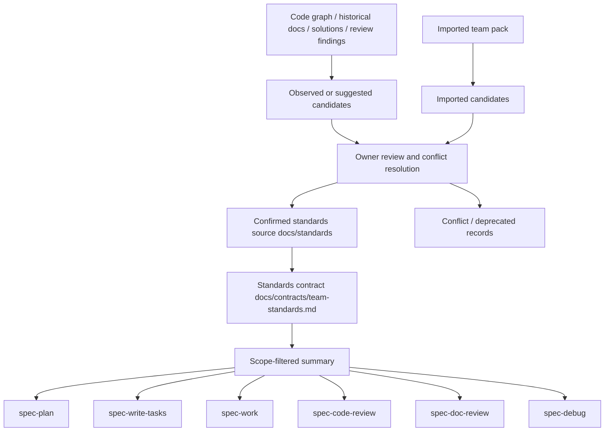
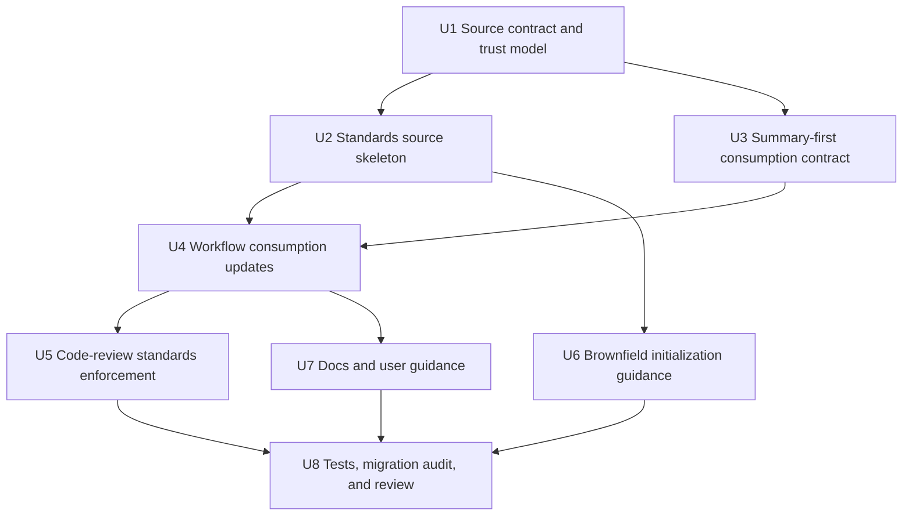

# 团队开发规范治理层深度计划

## Summary

本计划为 spec-first 增加一等的团队开发规范输入与治理层：把当前分散在 `AGENTS.md`、`CLAUDE.md`、历史开发规范、workflow prose 和 code-review persona 中的规范消费方式，收敛为明确 source、trust level、scope、promotion gate 和 downstream consumption contract。它借鉴 OpenSpec 的显式 `context` / artifact-scoped `rules` 机制，但保留 spec-first 的 source-first、summary-first、trust-aware 和 `Scripts prepare, LLM decides` 边界。

---

## Decision Brief

- **Recommended approach:** 先建立 `docs/standards/**` 作为团队开发规范的 confirmed source surface，并新增 `docs/contracts/team-standards.md` 定义 trust level、适用范围、注入边界和提升流程；随后让 `spec-plan`、`spec-work`、`spec-write-tasks`、`spec-code-review`、`spec-doc-review`、`spec-debug` 按同一合同消费 confirmed standards。
- **Key decisions:** 不恢复 `$spec-standards` / `/spec:standards` public workflow，不复用 `.spec-first/standards/` 作为当前 source，不把代码扫描结果自动确认为团队规范，不全量注入大文档。
- **Validation focus:** 重点验证 public workflow catalog 仍不暴露 `spec-standards`，下游 workflow 只把 `confirmed` 且 scope 命中的规范当硬上下文，review persona findings 必须引用具体标准条款。
- **Largest risks / boundaries:** 最大风险是把“规范治理”做成第二套流程引擎或大上下文注入器。本计划把第一版限定为轻合同、文档 source、focused contract tests 和可人工 review 的提升流程。

---

## Problem Frame

当前 spec-first 流程已经严谨：从需求、计划、任务、执行、评审到知识沉淀都有明确 workflow 边界。但团队开发规范这一层仍不够稳定：

- `spec-plan`、`spec-work`、`spec-write-tasks`、`spec-code-review`、`spec-doc-review`、`spec-debug` 都已经承认 project standards 可作为上下文。
- `spec-project-standards-reviewer` 已能按 `AGENTS.md` / `CLAUDE.md` / 目录级文件审查项目明写规则。
- 历史 `spec-standards` 曾尝试生成 standards artifacts，但已被移除，当前测试和 runtime prune 明确不应恢复该 public workflow 或 `.spec-first/standards/` artifact root。
- 用户本轮 OpenSpec 对比讨论暴露的核心缺口不是“缺规范概念”，而是缺少团队规范的稳定输入、scope 选择、trust level、人工确认、冲突治理和跨 workflow 消费合同。

OpenSpec 的本地源码显示，`openspec/config.yaml` 通过 `context` 和 `rules` 显式给 artifact 生成过程提供约束；`rules` 按 artifact ID 注入，是给 agent 的约束，不应复制进产出文件。这对 spec-first 的启发是：规范必须显式、按消费场景选择、与产出模板分离。但 spec-first 不能照搬成全量 context 注入或自动从代码扫描确认规范，因为角色契约要求 advisory facts 不能冒充 confirmed truth。

本计划的目标是让团队规范成为 AI coding harness 的一等输入资产，而不是让它变成新的中心化状态机。

---

## Requirements

- R1. 建立团队开发规范的 source-of-truth 边界，明确哪些文件能产生 hard project context，哪些历史文档、扫描结果、经验文档只能作为 advisory。
- R2. 定义 trust level：`confirmed`、`observed`、`imported`、`suggested`、`conflict`、`deprecated`，并规定只有 `confirmed` 且 scope 命中的规范可成为硬约束。
- R3. 定义规范条目的最小字段：ID、标题、类别、scope、authority、source refs、owner、enforcement、invalidation condition、last reviewed。
- R4. 支持团队开发规范的主要类型：工程架构约束、source/runtime 边界、代码组织、测试策略、review 规则、安全/隐私约束、发布/变更流程约束。
- R5. 下游 workflow 必须按同一 consumption contract 读取规范：summary-first、scope-filtered、confirmed-first，不得全量注入整个规范库。
- R6. `spec-code-review` 的 project-standards persona 必须继续只审“项目明写规则”，并把 `docs/standards/**` 纳入明确标准来源后才可引用；不得把 generic best practice 当 finding。
- R7. 不恢复已退役的 `spec-standards` public workflow、命令、runtime mirror、`.spec-first/standards/` source/artifact contract 或旧 glue-map/candidates 消费路径。
- R8. 提供 brownfield 初始化路线：历史代码、历史文档、graphify/codegraph、docs/solutions 和 review 经验只能生成候选，必须经 owner review 后提升为 `confirmed`。
- R9. 用户文档要说明团队如何配置、维护、审查和演进规范，以及这些规范与 `docs/specs/<capability>/spec.md`、`docs/contracts/**`、`docs/solutions/**` 的区别。
- R10. 所有变更必须遵守 source/runtime 边界，不手改 `.claude/`、`.codex/`、`.agents/skills/`。

---

## Assumptions

- A1. 本计划没有 upstream `docs/brainstorms/*-requirements.md`；origin 是用户本轮 OpenSpec/spec-first 对比讨论和当前仓 source 复核，因此使用 plan-local `spec_id`。
- A2. 第一版优先落文档 source contract 和 workflow consumption prose，不实现新的 CLI producer 或自动扫描器。
- A3. `docs/03-实施方案/06-开发规范.md` 和 `docs/01-需求分析/11.project-standards/**` 是历史/方案材料，可作为迁移输入，但不是当前 confirmed team standards source。
- A4. 团队规范需要人类 owner 或项目维护者确认；LLM 可以整理、提出候选和指出冲突，但不能自行把候选提升为 confirmed。
- A5. `docs/standards/**` 是推荐的新 source surface；若未来团队选择 `AGENTS.md` / `CLAUDE.md` / 目录级文件承载部分规范，也必须在合同中定义 priority 和 scope。

---

## Scope Boundaries

- 不恢复 `$spec-standards`、`/spec:standards`、`skills/spec-standards/` 或 `.spec-first/standards/`。
- 不把 `docs/specs/<capability>/spec.md` 改造成团队开发规范；能力 spec 记录产品/系统能力真相，团队开发规范记录工程约束和协作规则。
- 不把 `docs/contracts/**` 的 workflow/schema contract 与团队规范混为一谈；contract 约束 harness/artifact，standards 约束团队在项目中的开发实践。
- 不把 `docs/solutions/**` 的经验文档直接提升为规范；经验文档提供可复用学习，只有经过确认和 scope 定义后才进入 standards。
- 不要求所有项目都一次性补齐完整规范库；第一版应支持薄规范、渐进补充和局部 scope。
- 不设计复杂评分、状态机、规范 marketplace、远程同步或跨组织规范中心。

### Deferred to Follow-Up Work

- CLI 辅助命令：如 `spec-first standards check/show/promote`，只有在文档 source 和 workflow consumption 被验证后再独立计划。
- 自动候选挖掘：可从 graphify/codegraph、review findings、docs/solutions、历史代码中生成候选，但属于后续 advisory producer，不进入第一版核心。
- 多项目团队规范包：可以借鉴历史 Team Pack 方案，但第一版先解决单仓 confirmed standards source 和 workflow consumption。

---

## Completion Criteria

- C1. `docs/contracts/team-standards.md` 明确 source、trust level、scope、promotion gate、consumer boundary、anti-patterns。
- C2. `docs/standards/index.md` 和首批分类文件存在，并给出可执行的轻量条目模板。
- C3. 下游 workflow prose 与 contract tests 对齐：只把 confirmed/scope-matched standards 作为硬上下文，observed/imported/suggested/conflict/deprecated 均保持 advisory 或不可用。
- C4. `spec-code-review` 的 project-standards persona 和 Stage 3b discovery 支持新 standards source，但仍要求每个 finding 引用具体条款。
- C5. public workflow catalog、using-spec-first route map、runtime capability catalog 和 init prune tests 继续证明 `spec-standards` 未恢复。
- C6. README/用户手册说明团队规范输入方式、brownfield 初始化方法和与 OpenSpec 的差异。
- C7. 计划实现后未手改 generated runtime mirrors；如 source-runtime projection 需要刷新，另由 `spec-first init` 执行并记录。

---

## Direct Evidence Readiness

- target_repo: `spec-first`
- evidence_sources: direct source reads, `rg`, CodeGraph orientation, task-governance-signals, git status, local OpenSpec read-only comparison
- source_refs:
  - `docs/10-prompt/结构化项目角色契约.md`
  - `skills/spec-plan/references/governance-boundaries.md`
  - `agents/spec-project-standards-reviewer.agent.md`
  - `docs/plans/2026-05-21-002-refactor-remove-spec-standards-plan.md`
  - `src/cli/state.js`
  - `tests/unit/spec-plan-contracts.test.js`
  - `tests/unit/spec-work-contracts.test.js`
  - `tests/unit/spec-code-review-contracts.test.js`
  - `tests/unit/spec-write-tasks-contracts.test.js`
  - `tests/unit/runtime-capability-catalog.test.js`
  - `tests/unit/using-spec-first-contracts.test.js`
  - `docs/05-用户手册/12-gitignore参考.md`
  - `docs/03-实施方案/06-开发规范.md`
  - `docs/01-需求分析/11.project-standards/第一层级.md`
  - `docs/validation/execution-logs/2026-05-04-spec-standards-loop.md`
- current_revision: `7ba299f1`
- worktree_status: `git status --short CHANGELOG.md docs/plans` returned clean before this plan was written
- confidence: high for current spec-first source/routing/retirement evidence; medium for OpenSpec comparison because it is a sibling repo read-only source, not a dependency
- limitations: no fresh-source subagent review was dispatched; no implementation changes were made; local OpenSpec source may differ from upstream published OpenSpec state

---

## Direct Evidence

- repo_scope: single repo, `spec-first`
- source_reads_completed:
  - Role baseline: `docs/10-prompt/结构化项目角色契约.md`
  - Planning contract: `skills/spec-plan/SKILL.md` and relevant references
  - Current standards consumption: `skills/spec-plan/references/governance-boundaries.md`, `skills/spec-work/SKILL.md`, `skills/spec-write-tasks/SKILL.md`, `skills/spec-code-review/SKILL.md`, `skills/spec-doc-review/SKILL.md`, `skills/spec-debug/SKILL.md`
  - Current reviewer role: `agents/spec-project-standards-reviewer.agent.md`
  - Retirement state: `docs/plans/2026-05-21-002-refactor-remove-spec-standards-plan.md`, `src/cli/state.js`, related unit/smoke test hits
  - Historical design: `docs/03-实施方案/06-开发规范.md`, `docs/01-需求分析/11.project-standards/**`, `docs/validation/execution-logs/2026-05-04-spec-standards-loop.md`
  - OpenSpec comparison: sibling repo `OpenSpec/openspec/config.yaml`, `OpenSpec/src/core/artifact-graph/instruction-loader.ts`, `OpenSpec/docs/core-workflow-prompts.md`, archived rules-injection spec
- source_reads_required:
  - During implementation, reread exact target files before editing, especially all focused contract tests and any README sections changed.
- commands_or_tools_used:
  - `mcp__codegraph.codegraph_explore`
  - `rg` for standards/spec-standards references
  - `node bin/spec-first.js internal task-governance-signals --source plan-declared --input ... --json`
  - `git status --short`, `git rev-parse --short HEAD`
- impact_on_plan:
  - `task-governance-signals` returned `candidate_level: deep` with `cross-module`, `critical-path-hit`, and governance/contract/workflow keyword hits.
  - Current tests explicitly require no `$spec-standards`, `/spec:standards`, `.spec-first/standards/`, `docs/examples/standards-glue-consumption-examples.md`, or `<standards-baseline-paths>` in active contracts.
  - `spec-project-standards-reviewer` already provides the review enforcement shape: cite written rules, suppress generic best practices, match sections to changed file types.
- key_findings:
  - spec-first already has standards consumption concepts, but they are distributed and mostly tied to host instructions.
  - OpenSpec's useful mechanism is explicit configuration and artifact-scoped rule injection, not automatic mining.
  - The previous `spec-standards` attempt already learned important trust boundaries: only confirmed standards become hard constraints; scripts do not confirm standards.
  - The durable gap is governance and source shape, not another public workflow.
- limitations:
  - This plan does not validate real-team adoption.
  - This plan does not initialize standards for `hszq-app`; it provides the spec-first mechanism that a later pilot can use.

---

## Context & Research

### Relevant Code and Patterns

- `skills/spec-plan/references/governance-boundaries.md` already says written project standards from loaded host instructions, directory-scoped equivalents, or precisely read source files may define hard context when they apply to planned files.
- `skills/spec-work/SKILL.md` already tells implementation to treat written standards that govern changed files as hard context and prior plans/learnings/external-tool facts as advisory.
- `skills/spec-write-tasks/SKILL.md` already says written project standards may become hard task constraints only when they apply to changed files and remain consistent with the source plan.
- `skills/spec-code-review/SKILL.md` has Stage 3b project-standards discovery for `CLAUDE.md` / `AGENTS.md`, and the leaf reviewer reads relevant sections itself.
- `agents/spec-project-standards-reviewer.agent.md` requires exact quoted rule evidence and suppresses generic best practices. This is the right enforcement posture for confirmed standards.
- `src/cli/state.js` contains retired standards runtime prune paths, including `.spec-first/standards`, `.claude/commands/spec/standards.md`, `.claude/spec-first/workflows/spec-standards`, `.claude/skills/spec-standards`, `.agents/skills/spec-standards`, and `.codex/commands/spec/standards.md`.
- Existing unit tests assert that active workflow surfaces no longer reference `spec-standards`, `.spec-first/standards/`, old examples, or old baseline path blocks.

### Institutional Learnings

- `docs/plans/2026-05-21-002-refactor-remove-spec-standards-plan.md` concluded that deleting `spec-standards` should preserve generic project standards review while removing generated baseline artifacts and public workflow surface.
- `docs/validation/execution-logs/2026-05-04-spec-standards-loop.md` captured a useful but now-retired insight: confirmed-only standards may become hard constraints; observed/imported candidates must remain advisory. This plan keeps that lesson without reviving the old implementation.
- `docs/01-需求分析/11.project-standards/第一层级.md` argued for a lightweight shared project-level spec input that reduces ambiguity before plan/work/review. It also warns against state machine fields, complex rule runtime, scoring, and automatic closure.
- `docs/03-实施方案/06-开发规范.md` contains older coding/process norms that can seed the first `docs/standards/**` draft, but it needs review and normalization before becoming confirmed standards.

### OpenSpec Comparison

- OpenSpec `openspec/config.yaml` uses a global `context` block and `rules` keyed by artifact ID such as `specs`, `tasks`, and `design`.
- OpenSpec instruction generation returns `context`, `rules`, `template`, `instruction`, output path, and dependencies as separate fields; comments explicitly describe `context` and `rules` as constraints for AI, not output content.
- OpenSpec archived rules-injection spec requires rules to be injected only for matching artifact, preserve rule text, add rules to schema guidance rather than replacing it, and warn on unknown artifact IDs during instruction loading.
- spec-first should adopt artifact-scoped selection and separation from output content, but should not adopt untyped global injection as a hard project truth source.

---

## Key Technical Decisions

- KTD1. Use `docs/standards/**` as the first-class source surface for confirmed team development standards.
  - Rationale: It is visible, reviewable, portable, and already within project docs source-of-truth. It avoids reusing retired `.spec-first/standards/` runtime artifacts.
- KTD2. Keep `AGENTS.md` / `CLAUDE.md` as host instruction entrypoints, but do not overload them with the full standards library.
  - Rationale: Host files should carry load-bearing session rules and pointers; large standards should be progressively disclosed from `docs/standards/**`.
- KTD3. Define trust level in source prose before adding machine-readable CLI support.
  - Rationale: The hard part is semantic authority, not parsing. A CLI without authority rules would reproduce the old standards artifact problem.
- KTD4. Scope-filter standards before injection.
  - Rationale: Large apps and long-lived projects cannot inject the whole standards corpus. Consumers need only standards whose `applies_to` / `scope` match the current files, artifact, or decision.
- KTD5. Make `confirmed` the only hard level.
  - Rationale: Observed code patterns may be accidental, legacy, or inconsistent. Imported and suggested rules need human/project owner confirmation before enforcement.
- KTD6. Extend review consumption through `spec-project-standards-reviewer` rather than inventing a new reviewer.
  - Rationale: The existing reviewer already has the correct evidence discipline: quote rule plus diff line, suppress generic opinions.
- KTD7. Use historical `spec-standards` materials as advisory design input only.
  - Rationale: Tests and source have intentionally retired the old workflow. The useful concept is trust-aware standards, not the old public workflow or artifacts.

---

## Open Questions

### Resolved During Planning

- Should spec-first learn from OpenSpec's `context` / `rules`? Yes, but only the explicit configuration and artifact-scoped selection idea. Do not copy all-context injection or treat config text as automatically confirmed across every workflow.
- Should code scanning initialize historical standards? Yes, but only as candidate generation. It can propose `observed` / `suggested` entries with source refs; it cannot create `confirmed`.
- Should `docs/specs/<capability>/spec.md` store team development standards? No. Capability specs record current product/system capability truth. Team development standards record engineering rules and workflow constraints.
- Should old `$spec-standards` come back? No. Current source and tests intentionally retired it.

### Deferred to Implementation

- Exact standards item field names: finalize while writing `docs/contracts/team-standards.md` after rereading current docs style.
- Whether to include YAML frontmatter per standards file: decide during U1/U2 based on readability and testability.
- Whether to migrate all of `docs/03-实施方案/06-开发规范.md` or only link it as historical input: decide after review of stale/valid sections.
- Whether to add a deterministic standards selector script: defer until docs-first consumption proves stable.

---

## Output Structure

```text
docs/
  contracts/
    team-standards.md
  standards/
    index.md
    team.md
    architecture.md
    coding.md
    testing.md
    review.md
    security.md
```

The tree above is the intended first source shape, not a constraint. Implementation may merge `team.md` into `index.md` if the first pass is thinner than expected.

---

## High-Level Technical Design

> *This illustrates the intended approach and is directional guidance for review, not implementation specification. The implementing agent should treat it as context, not code to reproduce.*



Design rules:

- `docs/standards/**` is source, not generated runtime.
- Candidate sources are advisory until promoted.
- Consumers receive filtered summaries and precise refs, not the whole standards corpus.
- Code review can enforce only cited confirmed rules.
- Scripts may prepare candidate facts, but LLM/human review decides promotion and applicability.

---

## Implementation Units



### U1. Define standards source contract and trust model

**Goal:** Create the authoritative contract that defines team standards source, trust levels, scope matching, promotion rules, and consumer boundaries.

**Requirements:** R1, R2, R3, R5, R7, R8

**Dependencies:** None

**Files:**
- Create: `docs/contracts/team-standards.md`
- Modify: `docs/contracts/context-governance.md`
- Test: `tests/unit/context-governance-contracts.test.js`

**Approach:**
- Define `docs/standards/**`, root/ancestor `AGENTS.md` and `CLAUDE.md`, and directory-scoped equivalents as possible standards sources, with priority and conflict rules.
- Define trust levels and hard-context rules:
  - `confirmed`: hard project context when scope matches.
  - `observed`: advisory evidence from code/docs/history.
  - `imported`: advisory until accepted by this repo.
  - `suggested`: candidate from LLM/review/research.
  - `conflict`: visible blocker for enforcement until resolved.
  - `deprecated`: historical only unless referenced for migration.
- Require every confirmed standard to include scope, source refs, owner, enforcement mode, and invalidation condition.
- State that scripts can collect candidate facts but cannot confirm standards.
- Explicitly ban `.spec-first/standards/` as current source or required context.

**Patterns to follow:**
- `docs/contracts/context-governance.md` for source/runtime and host instruction reuse wording.
- `docs/contracts/project-graph-consumption.md` for provider-untrusted/advisory evidence posture.
- `docs/10-prompt/结构化项目角色契约.md` for `Scripts prepare, LLM decides`.

**Test scenarios:**
- Contract test: context governance mentions `docs/standards/**` only through the new team standards contract, not as a raw mandatory read.
- Negative: no active contract text reintroduces `.spec-first/standards/`, `glue-map.json`, `<standards-baseline-paths>`, `/spec:standards`, or `$spec-standards`.
- Positive: contract text states that only `confirmed` standards with matching scope are hard context.
- Positive: contract text states that observed/imported/suggested candidates remain advisory until owner confirmation.

**Verification:**
- A reviewer can identify exactly which paths are source, which are generated/advisory, and which trust levels downstream workflows may enforce.

---

### U2. Create the standards source skeleton and first rule template

**Goal:** Add the minimal `docs/standards/**` source structure and a readable rule template that can hold confirmed standards without becoming a massive monolithic document.

**Requirements:** R1, R3, R4, R8

**Dependencies:** U1

**Files:**
- Create: `docs/standards/index.md`
- Create: `docs/standards/team.md`
- Create: `docs/standards/architecture.md`
- Create: `docs/standards/coding.md`
- Create: `docs/standards/testing.md`
- Create: `docs/standards/review.md`
- Create: `docs/standards/security.md`
- Optionally modify: `docs/03-实施方案/06-开发规范.md`

**Approach:**
- Keep `index.md` as navigation plus consumption summary, not as a duplicate of every rule.
- Put actual standards in thematic files. Each file should remain scoped and scannable.
- Use compact rule cards rather than long prose essays. Suggested fields:
  - ID, title, status/trust level, category, applies_to, authority, owner, source_refs, rule, rationale, enforcement, exceptions, invalidation_condition, last_reviewed.
- Seed only a small set of obviously current confirmed rules from role contract and AGENTS guidance, such as source/runtime boundary and changelog discipline.
- Treat older `docs/03-实施方案/06-开发规范.md` as historical input unless specific sections are reviewed and promoted.

**Patterns to follow:**
- Existing concise contract docs under `docs/contracts/**`.
- `agents/spec-project-standards-reviewer.agent.md` evidence requirements, because each rule must be citeable in review.

**Test scenarios:**
- Documentation lint/diff check: new files have no absolute paths and no hidden HTML.
- Contract check: every standards file includes a clear trust/authority statement or points to `docs/contracts/team-standards.md`.
- Negative: index does not duplicate full content from all child files.
- Negative: no file claims code scanning can auto-confirm rules.

**Verification:**
- A downstream agent can read `docs/standards/index.md`, identify the relevant category file, and cite a rule without loading a giant combined document.

---

### U3. Define summary-first standards consumption

**Goal:** Specify how workflows should select and inject only relevant standards, mirroring OpenSpec's artifact-scoped `rules` without global context bloat.

**Requirements:** R2, R3, R5, R7

**Dependencies:** U1, U2

**Files:**
- Modify: `docs/contracts/team-standards.md`
- Modify: `skills/spec-plan/references/governance-boundaries.md`
- Modify: `skills/spec-work/SKILL.md`
- Modify: `skills/spec-write-tasks/SKILL.md`
- Modify: `skills/spec-code-review/SKILL.md`
- Modify: `skills/spec-doc-review/SKILL.md`
- Modify: `skills/spec-debug/SKILL.md`
- Test: `tests/unit/spec-plan-contracts.test.js`
- Test: `tests/unit/spec-work-contracts.test.js`
- Test: `tests/unit/spec-write-tasks-contracts.test.js`
- Test: `tests/unit/spec-code-review-contracts.test.js`
- Test: `tests/unit/spec-doc-review-contracts.test.js`
- Test: `tests/unit/spec-debug-contracts.test.js`

**Approach:**
- Add a common consumption phrase: read standards summary first; open exact category files only when scope requires; treat confirmed/scope-matched rules as hard context.
- Define consumer-specific examples:
  - `spec-plan`: standards shape implementation constraints and risks, but do not invent product requirements.
  - `spec-write-tasks`: standards may become task constraints only when consistent with source plan.
  - `spec-work`: standards govern changed files when scope matches; direct source evidence still decides implementation.
  - `spec-code-review`: standards findings require cited rule plus diff/source violation.
  - `spec-doc-review`: standards can calibrate document expectations but not become generic style preferences.
  - `spec-debug`: standards can explain intended invariants but do not replace reproduction/source evidence.
- Preserve Host Instruction Reuse Policy: root host files are not automatic full rereads unless allowed or precisely needed.

**Patterns to follow:**
- Existing `Written project standards ... may define hard project context` language in `skills/spec-plan/references/governance-boundaries.md`.
- Existing `Written project standards may become hard task constraints only when they apply to the changed files` language in `skills/spec-write-tasks/SKILL.md`.

**Test scenarios:**
- Positive: each workflow references `docs/contracts/team-standards.md` or equivalent source contract wording.
- Positive: each workflow states confirmed/scope-matched standards can be hard context.
- Negative: no workflow requires full `docs/standards/**` read by default.
- Negative: no workflow revives `.spec-first/standards/` or old glue/candidates artifacts.
- Negative: no workflow treats external-tool facts as scope authority.

**Verification:**
- All touched workflow contract tests pass and show identical trust-boundary language across consumers.

---

### U4. Integrate standards with planning, tasks, work, debug, and document review

**Goal:** Make standards useful in everyday workflow decisions without turning them into workflow state or product scope authority.

**Requirements:** R5, R8, R9

**Dependencies:** U3

**Files:**
- Modify: `skills/spec-plan/references/governance-boundaries.md`
- Modify: `skills/spec-work/SKILL.md`
- Modify: `skills/spec-write-tasks/SKILL.md`
- Modify: `skills/spec-doc-review/SKILL.md`
- Modify: `skills/spec-debug/SKILL.md`
- Test: corresponding focused unit tests under `tests/unit/`

**Approach:**
- For planning, require a lightweight decision note when a standards rule materially changes approach: `rule_id`, `source_tag`, `consequence`, and `deferred_reason` when not applied.
- For task packs, let standards appear as `context_refs` or task constraints only when they do not expand source-plan scope.
- For work closeout, when a standard materially shaped implementation or blocked an option, record the standards rule ID in closeout evidence or limitations.
- For debug, allow standards to define expected invariants, but keep root cause evidence source/test/log based.
- For doc-review, allow standards to calibrate document requirements, but distinguish document-quality feedback from standards violations.

**Patterns to follow:**
- `skills/spec-plan/references/governance-boundaries.md` decision ledger format.
- `skills/spec-work/SKILL.md` closeout evidence posture.
- `skills/spec-write-tasks/SKILL.md` task pack `context_refs` discipline.

**Test scenarios:**
- Planning test: standards can influence technical decisions but cannot invent WHAT or product requirements.
- Task-pack test: standards context refs do not expand source-plan scope.
- Work test: hard standards are limited to changed files/scope and confirmed source.
- Debug test: standards are expected behavior hints, not replacement for reproduction evidence.
- Doc-review test: standards violations require explicit source rule, not style preference.

**Verification:**
- Workflow prose remains summary-first and source-first; no plan/work/debug path requires a standards CLI or generated runtime artifact.

---

### U5. Extend code review standards enforcement

**Goal:** Update `spec-code-review` and `spec-project-standards-reviewer` so confirmed `docs/standards/**` rules can be enforced with the same evidence rigor as `AGENTS.md` / `CLAUDE.md`.

**Requirements:** R5, R6, R7

**Dependencies:** U2, U3

**Files:**
- Modify: `skills/spec-code-review/SKILL.md`
- Modify: `skills/spec-code-review/references/persona-catalog.md`
- Modify: `agents/spec-project-standards-reviewer.agent.md`
- Test: `tests/unit/spec-code-review-contracts.test.js`
- Test: `tests/unit/agents-governance-contracts.test.js`
- Test: `tests/unit/workflow-skill-agent-map-contracts.test.js`

**Approach:**
- Extend Stage 3b from path discovery of `CLAUDE.md` / `AGENTS.md` to discovery of standards source paths declared by `docs/contracts/team-standards.md`.
- Keep parent orchestrator cheap: it should pass paths and changed file scope, not dump full standards content into every reviewer prompt.
- Update the project-standards reviewer to:
  - read only standards files relevant to changed file types;
  - enforce only `confirmed` standards;
  - suppress `observed`, `suggested`, `imported`, `conflict`, and `deprecated` as hard findings;
  - cite exact standard ID/section plus diff/source line.
- Keep generic best-practice review in other personas, not this one.

**Patterns to follow:**
- Existing `<standards-paths>` block and evidence requirements in `agents/spec-project-standards-reviewer.agent.md`.
- Anchored confidence rubric in `skills/spec-code-review/references/subagent-template.md`.

**Test scenarios:**
- Positive: `docs/standards/review.md` with a confirmed rule can produce a project-standards finding when the diff violates it.
- Negative: a suggested or observed rule cannot produce a hard project-standards finding.
- Negative: a confirmed rule with non-matching `applies_to` does not apply to unrelated files.
- Negative: generic maintainability advice without a written standard is suppressed by project-standards reviewer.
- Fallback: when `docs/standards/**` is absent, review behavior remains current and does not fail.

**Verification:**
- Code review remains confidence-gated and evidence-anchored; standards do not become a subjective style channel.

---

### U6. Document brownfield standards initialization

**Goal:** Give teams with existing large projects a safe way to initialize standards from history without pretending the scan result is already policy.

**Requirements:** R2, R8, R9

**Dependencies:** U1, U2

**Files:**
- Create or modify: `docs/standards/index.md`
- Create or modify: `docs/standards/team.md`
- Modify: `docs/05-用户手册/12-gitignore参考.md`
- Optionally create: `docs/05-用户手册/团队开发规范治理.md`

**Approach:**
- Define a brownfield initialization recipe:
  1. Inventory existing explicit rules from `AGENTS.md`, `CLAUDE.md`, README, contributing docs, lint/test config, architecture docs, current PR review norms.
  2. Extract observed patterns from code, graphify/codegraph, tests, and repeated review findings as `observed`.
  3. Compare against historical docs and `docs/solutions/**` as advisory.
  4. Mark conflicts explicitly.
  5. Promote only reviewed, scoped, owner-confirmed entries to `confirmed`.
- Include example promotion decisions:
  - "Observed many modules use KMP/Clean Architecture" is not a confirmed rule until owner confirms scope and exceptions.
  - "AGENTS.md says source/runtime mirrors must not be edited" is confirmed for this repo.
  - "A linter enforces formatting" may be referenced as enforcement, but linter existence alone is not a semantic architecture rule.
- Clarify that large app projects should initialize by capability/surface slices, not one huge standards document.

**Patterns to follow:**
- `docs/01-需求分析/11.project-standards/第一层级.md` for lightweight repo profile thinking.
- `docs/validation/execution-logs/2026-05-04-spec-standards-loop.md` for confirmed-only lesson.

**Test scenarios:**
- Docs review: brownfield guidance states code scanning creates candidates only.
- Docs review: guidance explains conflicts and owner confirmation.
- Negative: guidance does not recommend `.spec-first/standards/` as source or generated root.
- Negative: guidance does not require graphify/codegraph availability.

**Verification:**
- A maintainer can bootstrap standards for a large existing repo without making a giant context file or automatic policy claim.

---

### U7. Update user-facing docs and route references

**Goal:** Make the team standards mechanism discoverable without adding a new public workflow entrypoint.

**Requirements:** R7, R9, R10

**Dependencies:** U1, U2, U3

**Files:**
- Modify: `README.md`
- Modify: `README.zh-CN.md`
- Modify: `docs/README.md`
- Modify: `docs/05-用户手册/README.md`
- Modify: `docs/05-用户手册/12-gitignore参考.md`
- Test: `tests/unit/runtime-capability-catalog.test.js`
- Test: `tests/unit/using-spec-first-contracts.test.js`

**Approach:**
- Add a short explanation that team standards are source docs, not a `$spec-*` workflow.
- Link to `docs/contracts/team-standards.md` and `docs/standards/index.md`.
- Keep route maps free of `$spec-standards` and `/spec:standards`.
- Update gitignore guidance so `docs/standards/**` is an example confirmed standards source, while `.spec-first/standards/` remains retired/generated cleanup territory.
- Explain relation to OpenSpec:
  - OpenSpec-style explicit constraints are useful.
  - spec-first requires trust level and source boundary before enforcement.

**Patterns to follow:**
- Existing compact changelog and README language for source/runtime boundaries.
- Existing `docs/05-用户手册/12-gitignore参考.md` shared project standards section.

**Test scenarios:**
- Runtime catalog test continues to assert no `spec-standards`.
- using-spec-first route map test continues to assert no standards public workflow.
- Docs grep: README mentions team standards source docs without presenting them as a command.
- Gitignore policy test remains aligned with source/runtime boundary.

**Verification:**
- Users can find where to write standards and understand why no command is exposed.

---

### U8. Add focused validation, review, and migration audit

**Goal:** Prove the new governance layer is usable, does not regress retired standards behavior, and is not just longer prose.

**Requirements:** R1 through R10

**Dependencies:** U4, U5, U6, U7

**Files:**
- Modify: `CHANGELOG.md`
- Modify: focused unit tests listed in U1 to U7
- Optional validation report: `docs/validation/standards-governance/2026-06-21-team-standards-governance-validation.md`

**Approach:**
- Run focused contract tests for every touched workflow and reviewer.
- Run absence guards for `spec-standards` public workflow and retired `.spec-first/standards/` references.
- Run `git diff --check`.
- Run a document review or fresh-source eval on the standards source contract if behavior semantics changed.
- Add a migration audit section that classifies historical standards docs as:
  - promoted confirmed rule,
  - kept historical/advisory,
  - conflict/deferred,
  - stale/deprecated.

**Patterns to follow:**
- Existing plan completion evidence sections in completed plans.
- `docs/contracts/workflows/fresh-source-eval-checklist.md` if semantic workflow prose changes require fresh-source evaluation.

**Test scenarios:**
- Positive: focused tests pass for all changed workflows.
- Negative: grep audit confirms no active `.spec-first/standards/` consumption path.
- Positive: a sample confirmed rule is citeable by project-standards reviewer in a controlled fixture or documented manual check.
- Negative: a sample suggested rule is not enforceable.

**Verification:**
- The implementation can be closed with evidence that standards governance is available and old `spec-standards` remains retired.

---

## System-Wide Impact

- **Workflow inputs:** `spec-plan`, `spec-write-tasks`, `spec-work`, `spec-code-review`, `spec-doc-review`, and `spec-debug` gain a shared standards contract instead of each carrying ad hoc language.
- **Review behavior:** project-standards review becomes broader in source discovery but stricter in authority: only confirmed, scope-matched, cited standards produce findings.
- **Context size:** summary-first and scope-filtered consumption prevent large standards docs from becoming a default context tax.
- **Source/runtime boundary:** new source docs live under `docs/`; generated mirrors remain untouched. `.spec-first/standards/` remains retired.
- **Brownfield adoption:** existing large apps can initialize standards from explicit docs and observed patterns without claiming code scan equals policy.
- **Surface coverage:**
  - CLI/runtime: out-of-scope for first implementation except tests that prevent public workflow regression.
  - Workflow prose: in-scope for shared consumption contract.
  - Agent/reviewer: in-scope for project-standards reviewer expansion.
  - Docs/user guide: in-scope for discoverability and maintenance flow.
  - Tests: in-scope for contract and absence guards.
  - Generated runtime mirrors: out-of-scope; regenerate only through `spec-first init` if future source-runtime changes require it.

---

## Risks & Dependencies

| Risk | Likelihood | Impact | Mitigation |
|------|------------|--------|------------|
| 规范文档变成巨大上下文 | Medium | High | `index.md` summary-first，scope-filtered 读取，禁止全量默认注入。 |
| 候选规则被误当 confirmed | High | High | trust level contract、tests、reviewer 只 enforce confirmed。 |
| 旧 `spec-standards` 被变相恢复 | Medium | High | public route/catalog/runtime prune tests 保持 negative assertions。 |
| 规范与 `AGENTS.md`/`CLAUDE.md` 冲突 | Medium | Medium | contract 定义 priority、conflict 显式记录，冲突状态不可 enforce。 |
| 过度设计成 CLI/状态机 | Medium | Medium | 第一版 docs-first，不做评分、自动 promote 或新 workflow。 |
| Review 噪音增加 | Medium | Medium | project-standards reviewer 必须引用规则和 diff/source 线，generic best practice 继续 suppress。 |
| 历史开发规范过期 | High | Medium | 迁移时逐条标记 source、last_reviewed、invalidation condition，不整篇提升。 |

---

## Alternative Approaches Considered

- **恢复 `spec-standards` workflow。** 拒绝。它已被明确退役，当前 source/runtime/tests 都围绕清理旧 workflow 建立；恢复会重开旧 artifact sprawl 和 public surface 问题。
- **只用 `AGENTS.md` / `CLAUDE.md` 承载所有规范。** 拒绝作为唯一方案。入口文件适合高优先级规则和指针，不适合长生命周期分类规范库。
- **完全照搬 OpenSpec `openspec/config.yaml`。** 部分采纳。artifact-scoped `rules` 很有价值，但 spec-first 需要 trust level、source/runtime 边界和 summary-first consumption。
- **从代码自动扫描生成 confirmed standards。** 拒绝。代码事实可生成 observed/suggested candidate，但不能决定团队规范。
- **把规范放进 `docs/specs/<capability>/spec.md`。** 拒绝。capability spec 维护当前能力真相，团队规范维护开发实践约束，二者消费者和更新时机不同。
- **先做 machine-readable schema 和 CLI。** 延后。没有语义 authority contract 的 schema 只会制造伪确定性。

---

## Success Metrics

- 下游 workflow 在 plan/work/review/debug 时可以稳定引用同一 standards contract，而不是各自发明读取规则。
- project-standards reviewer 对规范 finding 的误报不增加，且 finding 都能引用具体 rule ID/section。
- 大型存量项目可以先建立 5 到 20 条 confirmed standards，而不是一次性写成巨文档。
- `spec-standards` 相关 public entrypoint 和 `.spec-first/standards/` active consumption 仍保持 0。
- 新增规范变更能通过普通 PR/review/changelog 流程治理。

---

## Phased Delivery

### Phase 1: Source contract and skeleton

- 完成 U1、U2。
- 目标是让团队知道“规范写在哪里、怎么写、什么可以 enforce”。

### Phase 2: Workflow consumption

- 完成 U3、U4。
- 目标是让 plan/work/tasks/debug/doc-review 共享同一消费边界。

### Phase 3: Review enforcement

- 完成 U5。
- 目标是让 confirmed standards 真正进入 code review，但不产生 best-practice 噪音。

### Phase 4: Brownfield guidance and docs

- 完成 U6、U7。
- 目标是让存量项目可以初始化，不误把扫描结果当政策。

### Phase 5: Validation and semantic review

- 完成 U8。
- 目标是证明旧 `spec-standards` 未回归，新治理层可被实际 workflow 消费。

---

## Documentation Plan

- `docs/contracts/team-standards.md`: 权威合同，定义 source/trust/scope/promotion/consumer。
- `docs/standards/index.md`: 用户入口，说明如何查找、添加、确认和引用规则。
- `README.md` / `README.zh-CN.md`: 简短介绍团队规范 source docs，不新增命令。
- `docs/05-用户手册/团队开发规范治理.md`: 若内容过长，新增用户手册页承载 brownfield 初始化和维护流程。
- `docs/05-用户手册/12-gitignore参考.md`: 更新 confirmed standards source 示例，避免隐藏 standards source。

---

## Operational / Rollout Notes

- 第一版是 docs/source/workflow prose 变更，预计不需要运行 `spec-first init`。
- 如果后续修改 `AGENTS.md` / `CLAUDE.md` managed blocks 或 runtime templates，必须通过 source 变更加 `spec-first init` 刷新 runtime。
- 若在大型外部项目试点，先选一个能力或技术面做 slice，不要一次性初始化全仓规范。
- 规范 promotion 应进入普通 PR review，不能由本地 agent 静默写入 confirmed。

---

## Sources & References

- Role baseline: `docs/10-prompt/结构化项目角色契约.md`
- Planning governance: `skills/spec-plan/references/governance-boundaries.md`
- Work governance: `skills/spec-work/SKILL.md`
- Task-pack governance: `skills/spec-write-tasks/SKILL.md`
- Code review governance: `skills/spec-code-review/SKILL.md`
- Project standards reviewer: `agents/spec-project-standards-reviewer.agent.md`
- Retired standards plan: `docs/plans/2026-05-21-002-refactor-remove-spec-standards-plan.md`
- Runtime prune source: `src/cli/state.js`
- Gitignore/user standards note: `docs/05-用户手册/12-gitignore参考.md`
- Historical development norms: `docs/03-实施方案/06-开发规范.md`
- Historical repo-profile design: `docs/01-需求分析/11.project-standards/第一层级.md`
- Historical standards loop: `docs/validation/execution-logs/2026-05-04-spec-standards-loop.md`
- OpenSpec comparison source: sibling repo `OpenSpec/openspec/config.yaml`, `OpenSpec/src/core/artifact-graph/instruction-loader.ts`, `OpenSpec/docs/core-workflow-prompts.md`
