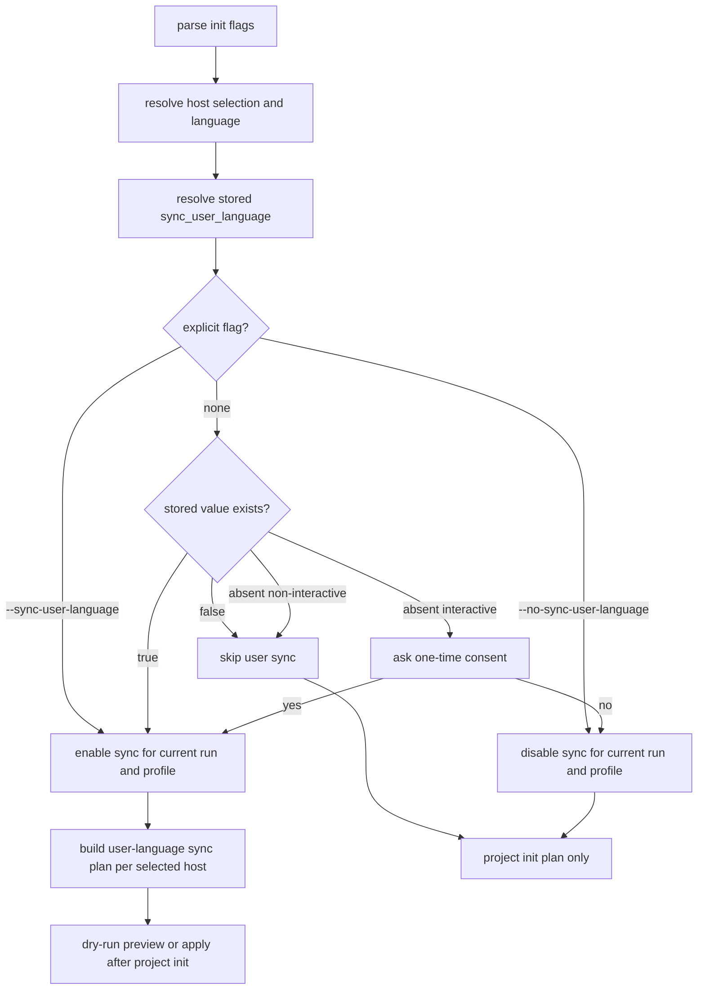

# feat: 用户级语言偏好同步

## Summary

为 `spec-first init` 增加“一次授权后默认静默同步”的用户级语言偏好能力：首次由用户显式授权并持久化到全局 developer profile，后续 `init` 在当前选择的 host 范围内自动维护 Codex / Claude Code 的用户级 instruction 文件。项目级 `AGENTS.md` / `CLAUDE.md` 语言治理继续保留，用户级同步只写语言偏好，不写项目治理、workflow 或 changelog 规则。

---

## Decision Brief

- **Recommended approach:** 新增独立的 user-language sync plan/apply 阶段，复用现有 `lang-policy` 的幂等块写入思想，但使用用户级专属 marker 和 language-only 内容；不要把用户级文件伪装成 repo-root `operationPlan`。
- **Key decisions:** 首次授权必须来自交互确认或显式 `--sync-user-language`；授权后通过 `sync_user_language=true` 持久化，后续静默同步；`--no-sync-user-language` 显式关闭并持久化 false。
- **Validation focus:** 覆盖交互、`-y`、`--dry-run`、显式 opt-in/opt-out、双宿主、`CODEX_HOME`、all-repos 只写一次、用户内容保留和 marker 幂等。
- **Largest risks / boundaries:** 用户级文件影响所有项目，不能无条件默认静默写；同步失败必须 fail loud，不得让用户以为全局偏好已经生效。

---

## Problem Frame

当前 `spec-first init` 会把语言策略写到项目级 `AGENTS.md` 或 `CLAUDE.md`，但执行过程中仍可能因为会话缓存、skill/subagent prompt、非当前仓库上下文或用户级规则缺失而偶发英文回答或英文文档输出。用户希望提升“所有回答默认中文”的稳定性，但无条件静默写用户级文件会越过项目初始化边界，影响所有项目的 agent 行为。

本计划采用 B 方案：首次需要用户授权；授权被持久化后，后续 `spec-first init` 默认静默维护用户级语言规则。这样同时满足体验目标和 mutation gate 边界。

---

## Requirements

- R1. `spec-first init` 必须保留当前项目级语言策略写入行为，不降低 `AGENTS.md` / `CLAUDE.md` 的仓库级治理作用。
- R2. 首次用户级语言同步必须由交互确认或显式 CLI flag 授权；没有授权时不得写用户级 instruction 文件。
- R3. 授权后必须在全局 developer profile 持久化 `sync_user_language=true`，让后续 `spec-first init` 可默认静默维护用户级语言规则。
- R4. 用户必须能通过显式 opt-out 关闭该行为，并持久化 `sync_user_language=false`。
- R5. 用户级同步只写语言偏好 managed block，不写 changelog、workflow 入口治理、graphify、runtime setup 或项目角色契约内容。
- R6. Codex 用户级目标为 effective Codex home 下的 `AGENTS.md`；必须复用现有 `CODEX_HOME` 解析 helper，不能硬编码默认 home path。
- R7. Claude Code 用户级目标为用户 home 下的 Claude Code user instruction 文件；写入时保留用户在 managed block 外的内容。
- R8. `--dry-run` 必须展示将写哪些用户级文件，但不得修改任何用户级文件或全局 developer profile。
- R9. all-repos 初始化时，用户级同步是 host-level 全局副作用，每个 host 最多写一次，不能对每个 child repo 重复写。
- R10. 用户级同步失败必须显式报告；不得静默吞掉权限、profile 或文件写入失败。
- R11. 文档和 help 必须清楚区分项目级 instruction、用户级 instruction、config、hook，避免用户误以为 hook 能强制回答语言。

---

## Assumptions

- A1. Claude Code 的用户级自然语言规则入口按当前官方文档和本轮讨论采用 `~/.claude/CLAUDE.md`；若实现时发现本仓已有更精确的 Claude config home helper，应优先复用 helper。
- A2. 用户级语言规则能提高遵循率，但不是 hard enforcement；系统/开发者指令、当前请求、skill prompt 或宿主缓存仍可能覆盖。
- A3. 用户级文件中已经存在同名用户级 managed block 时，以 spec-first 管理段落为可替换区域；managed block 外所有内容必须保留。

---

## Scope Boundaries

- 不做无条件默认静默写用户级文件。
- 不写或修改 `~/.codex/AGENTS.override.md`。
- 不用 hook 拦截或改写模型回答语言。
- 不把项目级 `AGENTS.md` / `CLAUDE.md` 的完整治理块复制到用户级文件。
- 不批量迁移或清理用户已有的全局 instruction 内容。
- 不改变 `spec-first init` 的 runtime asset source/runtime 边界，不手改 generated runtime mirrors。

---

## Completion Criteria

- 用户首次授权后，全局 developer profile 能记录 `sync_user_language=true`，再次运行 `spec-first init` 自动同步用户级语言 block。
- 用户显式关闭后，全局 developer profile 能记录 `sync_user_language=false`，后续 `init` 不再自动写用户级文件。
- `--sync-user-language` 在 non-interactive / `-y` 路径下可作为明确授权；`--no-sync-user-language` 可作为明确关闭。
- `--dry-run` 能展示用户级同步计划且不落盘。
- Codex 路径遵守 `CODEX_HOME`；Claude 路径使用用户 home 下的 user instruction 位置。
- all-repos 模式每个 host 最多写一次用户级文件。
- README / README.zh-CN / help / CHANGELOG 同步说明用户可见行为。

---

## Direct Evidence Readiness

- target_repo: `spec-first`
- evidence_sources: direct source reads, `rg`, `codegraph_explore`, `spec-first internal task-governance-signals`, official docs lookup, git status/revision
- source_refs:
  - `src/cli/lang-policy.js`
  - `src/cli/developer.js`
  - `src/cli/commands/init.js`
  - `src/cli/init-i18n.js`
  - `src/cli/helpers/global-config-dir.js`
  - `tests/unit/lang-policy.sh`
  - `tests/unit/developer.sh`
  - `tests/unit/init-interactive.test.js`
  - `tests/unit/init-dry-run.test.js`
  - `docs/brainstorms/2026-04-01-runtime-language-governance-requirements.md`
- current_revision: `3988bcbe`
- worktree_status: dirty before this plan; existing unrelated changes were present in `CHANGELOG.md`, `docs/08-版本更新/README.md`, `docs/plans/2026-06-21-003-fix-version-check-cooldown-short-circuit-plan.md`, `docs/plans/2026-06-21-004-feat-team-standards-governance-layer-plan.md`, `src/cli/commands/update.js`, `src/cli/index.js`, `src/cli/version-reminder.js`, `templates/codex/hooks/session-start`, and related tests. This plan must not revert or depend on those changes.
- confidence: medium-high for local implementation shape; medium for host docs because external host behavior can evolve.
- limitations: no runtime proof that Codex/Claude loaded user instruction files in a fresh external process during planning; official docs were used as external guidance, not as deterministic host verification.

---

## Direct Evidence

- repo_scope: single repo, current working tree under `spec-first`
- source_reads_completed:
  - `src/cli/lang-policy.js` shows project-level language policy block generation and marker replacement.
  - `src/cli/developer.js` shows global developer profile parsing/formatting for `name`, `lang`, `initialized_at`, `version`, and `hosts`.
  - `src/cli/commands/init.js` shows CLI parsing, interactive input collection, `buildInitWritePlan`, project instruction file writes, global profile writes, and all-repos parent/child planning.
  - `src/cli/helpers/global-config-dir.js` exposes `effectiveCodexHome()` for `CODEX_HOME`-aware Codex global config resolution.
  - `tests/unit/lang-policy.sh`, `tests/unit/developer.sh`, `tests/unit/init-interactive.test.js`, and `tests/unit/init-dry-run.test.js` provide local test patterns.
- source_reads_required:
  - During implementation, re-read the final affected sections before editing because this worktree already contains unrelated dirty changes.
  - Re-check README / README.zh-CN sections that document `spec-first init` before editing docs.
- commands_or_tools_used:
  - `git rev-parse --short HEAD`
  - `git status --short`
  - `rg` focused searches for language policy, developer profile, init flags, and `CODEX_HOME`
  - `spec-first internal task-governance-signals --source plan-declared --json`
  - official docs lookup for Codex `AGENTS.md` and Claude Code memory/user instruction behavior
- impact_on_plan:
  - The helper returned `candidate_level=deep` because the change crosses CLI, runtime-ish host behavior, developer profile, and dual-host instruction surfaces. This plan uses Deep structure, but keeps implementation units narrow.
  - Existing operation plans are project-root relative and containment-checked, so user-level writes should be modeled separately.
- key_findings:
  - `buildInitMetadataPlan` currently applies `buildManagedBlock(developer.lang)` to project-level instruction files.
  - `resolveGlobalDeveloperWriteAction` already has a global profile update mechanism that can be extended with a boolean sync preference.
  - `applyOperationPlan` asserts project-root containment, so user-level files should not be added to project `operationPlan`.
  - `buildWorkspaceInitPlan` creates parent and child project plans, so user-level sync must avoid child-repo repetition.
- limitations:
  - Planning did not run implementation tests because no implementation was changed.

---

## Context & Research

### Relevant Code and Patterns

- `src/cli/lang-policy.js` has the existing marker-based managed block primitive and project-level language/changelog content split.
- `src/cli/commands/init.js` is the central integration point for parsing flags, interactive prompts, previewing write plans, applying project plans, and writing the global developer profile.
- `src/cli/helpers/global-config-dir.js` is the current source of truth for `CODEX_HOME` resolution and should be reused for Codex user-level file targeting.
- `tests/unit/init-interactive.test.js` already isolates `os.homedir()` with a Jest spy, which is the right pattern for testing user-level file writes safely.
- `tests/unit/developer.sh` verifies developer profile parsing and serialization; it should gain round-trip tests for `sync_user_language`.

### Institutional Learnings

- `docs/brainstorms/2026-04-01-runtime-language-governance-requirements.md` established the project-level language governance model and explicitly chose repo instruction files for project scope. This plan extends scope upward to user-level only after explicit authorization.
- Repository role contract requires clear source/runtime boundaries and preview-first behavior for mutation. User-level instruction files are outside project source and must be treated as global side effects.

### External References

- Codex official docs identify `AGENTS.md` as the guidance surface for Codex, with user-level global guidance under Codex home.
- Claude Code official memory docs identify `CLAUDE.md` as the user/project instruction surface and describe memory files as behavioral guidance rather than hard enforcement.

---

## Key Technical Decisions

- KTD1. **Use a dedicated user-language managed block.** Do not reuse the project `spec-first:lang` marker because the project block includes changelog governance and repo-specific rules. Use a distinct marker pair such as `spec-first:user-language:start/end`.
- KTD2. **Keep user writes outside project `operationPlan`.** `applyOperationPlan` is project-root contained by design. User-level sync needs its own plan/apply helpers with explicit display paths and absolute internal targets.
- KTD3. **Persist consent in the existing global developer profile.** Extend `.spec-first/.developer` with `sync_user_language=true|false` instead of creating a second global settings file.
- KTD4. **CLI explicit flags override stored preference for the current run and update the profile.** `--sync-user-language` means enable and write; `--no-sync-user-language` means disable and skip writes. Passing both is an argument error.
- KTD5. **Interactive prompt is one-time by stored state.** If `sync_user_language` is absent, ask once after host and language are known. If true or false exists, do not ask; users can change through flags.
- KTD6. **Sync only selected/current host targets.** The current init platform selection determines which user-level files are maintained. Running `--codex` should not unexpectedly touch Claude's user file.
- KTD7. **Fail loud on sync failure.** User-level sync failure should be surfaced with path and reason. The implementation may not silently claim global language sync succeeded.

---

## Open Questions

### Resolved During Planning

- Should `spec-first init` unconditionally write user-level files by default? No. Use one-time authorization and stored preference.
- Should hook files enforce language? No. Language is model behavior guidance, not a mechanical command/file mutation event.
- Should the user-level block include changelog governance? No. Changelog is repo-level governance and does not belong in global personal preference.

### Deferred to Implementation

- Exact CLI help wording and prompt copy: finalize in `src/cli/init-i18n.js` while keeping zh/en message key parity.
- Exact display path normalization: implementer should choose compact user-facing labels such as `$CODEX_HOME/AGENTS.md` or `~/.claude/CLAUDE.md` while avoiding absolute paths in docs.

---

## High-Level Technical Design

> *This illustrates the intended approach and is directional guidance for review, not implementation specification. The implementing agent should treat it as context, not code to reproduce.*

---

## Implementation Units

### U1. User-Level Language Block Helpers

**Goal:** Add language-only block generation and idempotent replacement for user-level instruction files.

**Requirements:** R5, R7, R10

**Dependencies:** None

**Files:**
- Modify: `src/cli/lang-policy.js`
- Test: `tests/unit/lang-policy.sh`

**Approach:**
- Add a dedicated user-language marker pair, e.g. `<!-- spec-first:user-language:start -->` / `<!-- spec-first:user-language:end -->`.
- Add a `buildUserLanguageBlock(lang)` or equivalent helper that emits only default response language guidance, not project changelog or repo governance.
- Reuse or generalize the existing marker replacement logic so both project and user blocks preserve content outside managed markers.
- Keep `buildManagedBlock(lang)` behavior unchanged for project-level files.

**Patterns to follow:**
- Existing `buildManagedBlock`, `applyManagedBlock`, and `tests/unit/lang-policy.sh` marker/idempotency tests.

**Test scenarios:**
- Happy path: empty user instruction content plus `zh` -> user-language block with Chinese guidance and user-language markers.
- Happy path: existing user content plus block -> original prose before/after block remains unchanged.
- Edge case: replacing `zh` user block with `en` keeps exactly one user-language start marker.
- Edge case: corrupted user-language start marker without end marker appends a fresh complete block without deleting user content.
- Error path: project `buildManagedBlock` still includes changelog governance; user block must not include `CHANGELOG` or repo source-change refusal text.

**Verification:**
- `tests/unit/lang-policy.sh` proves project block and user block are distinct, idempotent, and content-preserving.

---

### U2. Global Developer Profile Consent Field

**Goal:** Persist one-time authorization as a first-class global developer profile field.

**Requirements:** R2, R3, R4

**Dependencies:** U1

**Files:**
- Modify: `src/cli/developer.js`
- Test: `tests/unit/developer.sh`

**Approach:**
- Extend `parseDeveloperContents` / `normalizeDeveloper` / `formatDeveloperContents` to support `sync_user_language=true|false`.
- Represent the value internally as a boolean or nullable preference, not as a truthy arbitrary string.
- Preserve the current behavior for legacy profiles without this key.
- Ensure `false` round-trips; do not drop false as an empty/default value.
- Keep existing `hosts` behavior unchanged.

**Patterns to follow:**
- Existing `hosts` normalization and round-trip tests in `tests/unit/developer.sh`.

**Test scenarios:**
- Happy path: profile containing `sync_user_language=true` parses to enabled state and serializes back.
- Happy path: profile containing `sync_user_language=false` parses to disabled state and serializes back.
- Edge case: legacy profile without the key parses with an unset value, not false.
- Edge case: invalid value such as `maybe` is ignored or normalized to unset without crashing.
- Integration: explicit name/lang overwrite preserves existing `initialized_at` and updates `sync_user_language` only when the current run explicitly changes it.

**Verification:**
- Developer profile tests pass without changing existing `name/lang/hosts` semantics.

---

### U3. Init CLI Flags and Interactive Consent Flow

**Goal:** Expose the opt-in/opt-out behavior through CLI flags and one-time interactive prompt.

**Requirements:** R2, R3, R4, R8, R11

**Dependencies:** U2

**Files:**
- Modify: `src/cli/commands/init.js`
- Modify: `src/cli/init-i18n.js`
- Test: `tests/unit/init-interactive.test.js`
- Test: `tests/unit/init-i18n.test.js`
- Test: `tests/unit/cli-entry-contracts.test.js`

**Approach:**
- Add `--sync-user-language` and `--no-sync-user-language` to `parseInitArgs`; reject both together.
- Update help text and CLI contract tests.
- In interactive mode, after language and host selection are known, ask once only if the stored preference is unset and no explicit sync flag was provided.
- Default the prompt to false because this is a user-global mutation.
- In non-interactive mode, do not ask. Only explicit flag or stored `sync_user_language=true` should write user-level files.
- Carry the resolved sync preference through `collectInitInput`, `buildInitPlans`, and relevant plan objects.

**Patterns to follow:**
- Existing global profile reuse prompt and `maybeConfirmGlobalProfileOverwrite` flow.
- Existing zh/en message key parity test in `tests/unit/init-i18n.test.js`.

**Test scenarios:**
- Happy path: interactive first run with no stored preference and user confirms sync -> profile write includes `sync_user_language=true`.
- Happy path: interactive first run and user declines -> profile write includes `sync_user_language=false` and no user files are written.
- Happy path: stored true and no flag -> no prompt; user sync plan is produced.
- Happy path: stored false and no flag -> no prompt; no user sync plan.
- Happy path: `--sync-user-language -y` writes without prompt.
- Happy path: `--no-sync-user-language -y` disables without prompt.
- Error path: passing both sync flags returns exit 2 with usage.
- i18n: zh/en message objects expose the same new keys and localized copy.

**Verification:**
- Interactive and CLI entry tests demonstrate explicit authorization, stored silent behavior, opt-out, and help text.

---

### U4. User Language Sync Plan and Apply

**Goal:** Plan and apply user-level instruction file writes safely outside repo-root operation plans.

**Requirements:** R5, R6, R7, R8, R9, R10

**Dependencies:** U1, U2, U3

**Files:**
- Create: `src/cli/user-language-sync.js`
- Modify: `src/cli/commands/init.js`
- Test: `tests/unit/user-language-sync.test.js`
- Test: `tests/unit/init-dry-run.test.js`
- Test: `tests/unit/init-interactive.test.js`

**Approach:**
- Create a dedicated module that can:
  - resolve host targets for selected platforms;
  - build a previewable sync plan with display paths and absolute internal targets;
  - apply the plan with atomic writes and directory creation;
  - return structured diagnostics for success/failure.
- Codex target resolution must use `effectiveCodexHome()` from `src/cli/helpers/global-config-dir.js`, then target `AGENTS.md` under that directory.
- Claude target resolution should use `os.homedir()` and the Claude user instruction path.
- Do not add these writes to `operationPlan`; instead attach `userLanguageSyncPlan` to the top-level host init plan or run-level plan.
- In all-repos mode, build/apply user sync once per host plan, not once per child repo.
- On `--dry-run`, print the user-language sync plan but do not apply it.
- On apply failure, report the host, display path, and error. Do not silently mark sync as done.

**Patterns to follow:**
- Existing `buildInitWritePlan` preview shape for managed file operations, but keep user writes in a separate plan type.
- Existing `writeFileAtomic` usage for safe file writes.
- Existing Codex `effectiveCodexHome()` handling.

**Test scenarios:**
- Happy path: Codex sync writes user-language block to a temp `CODEX_HOME` `AGENTS.md`.
- Happy path: Claude sync writes user-language block under isolated test home `CLAUDE.md`.
- Happy path: both hosts selected -> two user sync operations.
- Edge case: `CODEX_HOME` env var points to a temp directory -> Codex target uses it rather than default home.
- Edge case: all-repos init with two child repos -> user sync apply helper called once per selected host, not once per child.
- Edge case: existing user content before/after marker remains unchanged.
- Error path: parent directory or file write failure surfaces structured diagnostic and non-success status.
- Dry-run: planned user sync operation appears in preview; filesystem remains unchanged.

**Verification:**
- Dedicated module tests cover path resolution and marker behavior; init tests cover integration across interactive, `-y`, dry-run, and all-repos modes.

---

### U5. Preview, Apply Output, and Failure Reporting

**Goal:** Make user-global side effects visible and auditable in init output.

**Requirements:** R8, R10, R11

**Dependencies:** U3, U4

**Files:**
- Modify: `src/cli/commands/init.js`
- Modify: `src/cli/init-i18n.js`
- Test: `tests/unit/init-dry-run.test.js`
- Test: `tests/unit/init-interactive.test.js`

**Approach:**
- Extend init preview output with a distinct section such as "User-level language sync" so it is not confused with project runtime assets.
- Apply output should say whether user-level language sync was written, preserved, skipped, or failed.
- `--no-sync-user-language` should print a clear disabled/skipped state when relevant.
- Do not list full absolute internal paths in docs; command output may show user-friendly home-relative or env-relative display paths.
- If sync fails after project init writes have succeeded, report partial success clearly and return a non-zero exit code or explicit action-required status. The implementation should choose one consistent contract and lock it with tests.

**Patterns to follow:**
- `printInitDryRun`, `printInitApplySuccess`, and existing `applyDeveloperProfile*` messages.

**Test scenarios:**
- Happy path: dry-run output includes user-level language sync section when sync is enabled.
- Happy path: apply output includes user-level sync success message.
- Happy path: no stored consent and no flag -> output does not claim user sync.
- Error path: simulated write failure prints action-required diagnostic and does not claim success.

**Verification:**
- Init output tests assert visible behavior without depending on exact noisy path lists.

---

### U6. Documentation, Changelog, and Verification Pass

**Goal:** Document the new user-visible init behavior and verify the change through the narrowest meaningful test set.

**Requirements:** R11

**Dependencies:** U1, U2, U3, U4, U5

**Files:**
- Modify: `README.md`
- Modify: `README.zh-CN.md`
- Modify: `CHANGELOG.md`
- Test: `tests/unit/changelog-format.test.js`
- Test: `tests/unit/init-i18n.test.js`

**Approach:**
- Document:
  - project-level language block remains the default repo governance mechanism;
  - user-level sync is opt-in once, then silent on future init;
  - flags for enable/disable;
  - target surfaces for Codex and Claude Code;
  - hook is not used to enforce answer language.
- Add changelog entry with `(user-visible)` because CLI behavior and user-level files change.
- Keep docs concise and avoid duplicating the full language block in many places.

**Patterns to follow:**
- Existing init help and README sections describing host selection, `--lang`, `-y`, and runtime generation.

**Test scenarios:**
- Docs mention both opt-in and opt-out flags.
- Changelog format test passes.
- `node --check` passes for changed JS files.
- Focused unit tests pass for language policy, developer profile, init interactive/dry-run/i18n, and user-language sync module.

**Verification:**
- Run focused tests first:
  - `bash tests/unit/lang-policy.sh`
  - `bash tests/unit/developer.sh`
  - `npx jest tests/unit/init-interactive.test.js tests/unit/init-dry-run.test.js tests/unit/init-i18n.test.js tests/unit/cli-entry-contracts.test.js tests/unit/user-language-sync.test.js --runInBand`
  - `npx jest tests/unit/changelog-format.test.js --runInBand`
  - `npm run typecheck`
- Expand to `npm run test:unit` if the focused suite touches shared init contracts broadly or if implementation changes shared operation-plan behavior.

---

## System-Wide Impact

- **CLI behavior:** Adds new user-visible flags and one interactive prompt branch.
- **Global user state:** Extends `.spec-first/.developer`; existing profile reads must remain backward compatible.
- **Host instruction surfaces:** Writes user-level Codex / Claude instruction files only after authorization; does not change project-level `AGENTS.md` / `CLAUDE.md` semantics.
- **Workspace mode:** all-repos must avoid repeated global writes across children.
- **Generated runtime mirrors:** No direct generated runtime mirror writes are required by the feature itself. If help text or templates change later, refresh through source and `spec-first init`, not manual runtime patching.
- **Testing:** Requires isolated home/CODEX_HOME fixtures to avoid touching the real user's files.

---

## Risks & Dependencies

| Risk | Mitigation |
|------|------------|
| User-level files affect all projects, making silent mutation surprising | Require first-run prompt or explicit flag; persist choice; expose dry-run preview |
| User content in global instruction files is overwritten | Dedicated markers and content-preserving replacement; tests for before/after content |
| Project language block and user language block drift | Put shared wording/builders in `lang-policy.js`, but keep project-only changelog governance out of user block |
| `CODEX_HOME` users get writes in the wrong directory | Reuse `effectiveCodexHome()` and add env-based test |
| all-repos writes the same user file repeatedly | Attach user sync at host/run level, not per child project plan |
| Sync failure is mistaken for success | Structured failure diagnostics and output tests; fail loud |
| New profile field breaks legacy parsing | Normalize missing/invalid values as unset and round-trip existing fields unchanged |

---

## Alternative Approaches Considered

- **A. 无条件默认静默写用户级文件:** Rejected. It maximizes language adherence but violates mutation boundary because `spec-first init` would modify all-project user behavior without consent.
- **B. 仅新增 `--sync-user-language`，不持久化:** Rejected as too weak for the user's problem. It requires users to remember the flag on every run and does not create the desired future silent maintenance.
- **C. 用 hook 强制中文输出:** Rejected. Hooks govern tool/command/file mutation events, not reliable natural-language model behavior; this would add complexity without trustworthy enforcement.
- **D. 把完整项目治理块复制到用户级文件:** Rejected. It would turn repo-specific CHANGELOG/workflow/source-runtime rules into global personal instructions and create false authority across unrelated projects.

---

## Documentation / Operational Notes

- The implementation closeout must state whether user-level files were actually changed and whether generated runtime assets were affected.
- New docs should tell users to start a fresh Codex/Claude session after changing user-level instruction files because existing sessions may have cached guidance.
- This feature should not promise perfect language enforcement; describe it as improving the default guidance surface.

---

## Sources & References

- Related source: `src/cli/lang-policy.js`
- Related source: `src/cli/developer.js`
- Related source: `src/cli/commands/init.js`
- Related source: `src/cli/helpers/global-config-dir.js`
- Related tests: `tests/unit/lang-policy.sh`
- Related tests: `tests/unit/developer.sh`
- Related tests: `tests/unit/init-interactive.test.js`
- Related requirements: `docs/brainstorms/2026-04-01-runtime-language-governance-requirements.md`
- External docs: `https://developers.openai.com/codex/guides/agents-md`
- External docs: `https://code.claude.com/docs/en/memory`
