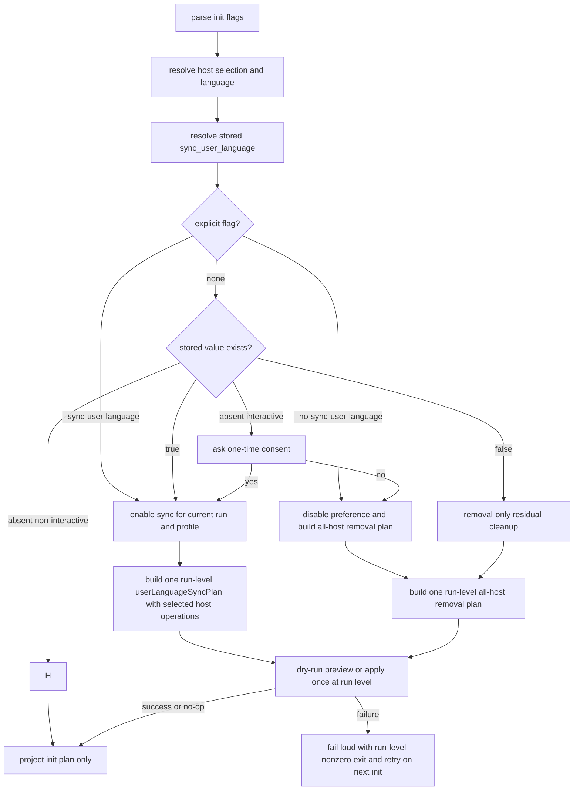

# feat: 用户级语言偏好同步

## Summary

为 `spec-first init` 增加“一次授权后默认静默同步”的用户级语言偏好能力：首次由用户显式授权并持久化到全局 developer profile，后续 `init` 在当前选择的 host 范围内自动维护 Codex / Claude Code 的用户级 instruction 文件。同时把项目级 `AGENTS.md` / `CLAUDE.md` 的语言段升级为同源 hard-execution 文案；项目级继续保留 changelog/governance，用户级同步只写语言偏好，不写项目治理、workflow 或 changelog 规则。

---

## Decision Brief

- **Recommended approach:** 新增独立的 user-language sync plan/apply 阶段，并把语言规则抽象成共享生成器：项目级 `spec-first:lang` block 与用户级 `spec-first:user-language` block 复用同一套 zh/en hard-execution language prose；项目级继续叠加 changelog/governance，用户级只写 language-only 内容；不要把用户级文件伪装成 repo-root `operationPlan`。
- **Key decisions:** 首次授权必须来自交互确认或显式 `--sync-user-language`；授权后通过 `sync_user_language=true` 持久化，后续静默同步；`--no-sync-user-language` 显式关闭、持久化 false，并删除所有 host（spec-first 曾写过的 Codex / Claude 用户文件）中的 spec-first managed language block。
- **Decision record:** `docs/adr/0001-init-owns-limited-user-language-sync.md` 记录 `spec-first init` 只在语言偏好这一窄范围内拥有用户级 instruction sync ownership；不得扩展为全局 workflow / changelog / 项目治理规则。
- **Validation focus:** 覆盖交互、`-y`、`--dry-run`、显式 opt-in/opt-out、双宿主、`CODEX_HOME`、all-repos 只写一次、用户内容保留和 marker 幂等。
- **Largest risks / boundaries:** 用户级文件影响所有项目，不能无条件默认静默写；同步失败必须 fail loud，不得让用户以为全局偏好已经生效。

---

## Problem Frame

当前 `spec-first init` 会把语言策略写到项目级 `AGENTS.md` 或 `CLAUDE.md`，但执行过程中仍可能因为会话缓存、skill/subagent prompt、非当前仓库上下文或用户级规则缺失而偶发英文回答或英文文档输出。用户希望提升“所有回答默认中文”的稳定性，但无条件静默写用户级文件会越过项目初始化边界，影响所有项目的 agent 行为。

本计划采用 B 方案：首次需要用户授权；授权被持久化后，后续 `spec-first init` 默认静默维护用户级语言规则。这样同时满足体验目标和 mutation gate 边界。

Option zero（只在根因处修复，不新增用户级 instruction surface）已被权衡后不采用：skill/subagent prompt、会话缓存和非当前仓上下文仍应继续各自修复，但它们不能覆盖 fresh session、跨 repo、host-level workflow 这类缺少项目级 instruction 的入口面。用户级 language-only block 是补齐默认 guidance surface，不是替代根因修复，也不承诺完全语言 enforcement。

---

## Requirements

- R1. `spec-first init` 必须保留当前项目级语言策略写入行为，不降低 `AGENTS.md` / `CLAUDE.md` 的仓库级治理作用。
- R2. 首次用户级语言同步必须由交互确认或显式 CLI flag 授权；没有授权时不得写用户级 instruction 文件。
- R3. 授权后必须在全局 developer profile 持久化 `sync_user_language=true`，让后续 `spec-first init` 可默认静默维护用户级语言规则。
- R4. 用户必须能通过显式 opt-out 关闭该行为，持久化 `sync_user_language=false`，并移除**所有 host**（spec-first 曾写过的 Codex / Claude 用户文件）中已有的 spec-first 用户语言 managed block——同意是全局布尔，opt-out 语义为「到处都关」，按 host 删会遗留 orphaned active block；managed block 外的用户内容必须保留。
- R5. 用户级同步只写语言偏好 managed block，不写 changelog、workflow 入口治理、graphify、runtime setup 或项目角色契约内容。
- R6. Codex 用户级目标为 effective Codex home 下的 `AGENTS.md`；必须复用现有 `CODEX_HOME` 解析 helper，不能硬编码默认 home path。
- R7. Claude Code 用户级目标必须由单一 helper 解析到 Claude Code user instruction 文件；写入时保留用户在 managed block 外的内容。
- R8. `--dry-run` 必须展示将写哪些用户级文件，但不得修改任何用户级文件或全局 developer profile。
- R9. all-repos 初始化时，用户级同步是 host-level 全局副作用，每个 host 最多写一次，不能对每个 child repo 重复写。
- R10. 用户级同步失败必须显式报告；不得静默吞掉权限、profile 或文件写入失败。
- R11. 文档和 help 必须清楚区分项目级 instruction、用户级 instruction、config、hook，避免用户误以为 hook 能强制回答语言。
- R12. 项目级 `AGENTS.md` / `CLAUDE.md` 的语言段必须同步升级为与用户级 block 同等强度的 hard-execution 文案；项目级仍必须保留 changelog/governance 内容，不能退化成 language-only block。
- R13. 项目级和用户级语言文案必须由同一个共享语言规则生成器派生，避免 zh/en 或 project/user 两处文案漂移。
- R14. `sync_user_language=false` 必须表示“全局 opt-out 且允许清理 spec-first 用户语言 managed block”。如果显式 opt-out 的删除步骤失败，后续 `init` 在读取到 stored false 时仍必须尝试 removal-only 残留清理，直到所有 host 的 spec-first 用户语言 managed block 被确认不存在；stored false 不得导致旧 block 被永久跳过。

---

## Assumptions

- A1. Claude Code 的用户级自然语言规则入口按当前官方文档采用 `~/.claude/CLAUDE.md`。实现必须通过单一解析 helper（建议 `resolveClaudeUserInstructionPath()`）得到最终写入路径，不能在调用点硬编码 `os.homedir()/.claude`；v1 helper 固定返回 `{ absolutePath: ~/.claude/CLAUDE.md, displayPath: "~/.claude/CLAUDE.md", basis: "claude-memory-home-fixed" }`。当前 docs/help/tests 不承诺 `CLAUDE_CONFIG_DIR` 会重定位 user memory / `CLAUDE.md`；若未来 Claude Code 官方文档或实测行为确认支持重定位，再单独扩展 helper 与测试。
- A2. 用户级语言规则能提高遵循率，但不是 hard enforcement；系统/开发者指令、当前请求、skill prompt 或宿主缓存仍可能覆盖。
- A3. 用户级文件中已经存在同名用户级 managed block 时，以 spec-first 管理段落为可替换区域；managed block 外所有内容必须保留。

---

## Scope Boundaries

- 不做无条件默认静默写用户级文件。
- 不写或修改 `~/.codex/AGENTS.override.md`。
- 不用 hook 拦截或改写模型回答语言。
- 不把项目级 `AGENTS.md` / `CLAUDE.md` 的完整治理块复制到用户级文件。
- 不批量迁移或清理用户已有的全局 instruction 内容。
- 不改变 `spec-first init` 的 runtime asset source/runtime 边界，不手改 generated runtime mirrors。

---

## Completion Criteria

- 用户首次授权后，全局 developer profile 能记录 `sync_user_language=true`，再次运行 `spec-first init` 自动同步用户级语言 block。
- 用户显式关闭后，全局 developer profile 能记录 `sync_user_language=false`，所有 host（spec-first 曾写过的 Codex / Claude 用户文件）中的 spec-first 用户语言 managed block 被移除；若删除失败，命令非零退出，后续 `init` 读取 stored false 时继续执行 removal-only 残留清理，直到旧 block 不再生效。
- 项目级 `AGENTS.md` / `CLAUDE.md` 的 `spec-first:lang` block 使用同一套 hard-execution 语言文案，同时继续包含项目级 changelog/governance 规则。
- `--sync-user-language` 在 non-interactive / `-y` 路径下可作为明确授权；`--no-sync-user-language` 可作为明确关闭。
- `--dry-run` 能展示用户级同步计划且不落盘。
- Codex 路径遵守 `CODEX_HOME`；Claude 路径由 `resolveClaudeUserInstructionPath()` 统一解析到 `~/.claude/CLAUDE.md`，并在测试中锁定 `basis: "claude-memory-home-fixed"`。
- all-repos 模式每个 host 最多写一次用户级文件。
- README / README.zh-CN / help / CHANGELOG 同步说明用户可见行为。

---

## Direct Evidence Readiness

- target_repo: `spec-first`
- evidence_sources: direct source reads, `rg`, `codegraph_explore`, `spec-first internal task-governance-signals`, official docs lookup, git status/revision
- source_refs:
  - `src/cli/lang-policy.js`
  - `src/cli/developer.js`
  - `src/cli/commands/init.js`
  - `src/cli/init-i18n.js`
  - `src/cli/helpers/global-config-dir.js`
  - `tests/unit/lang-policy.sh`
  - `tests/unit/developer.sh`
  - `tests/unit/init-interactive.test.js`
  - `tests/unit/init-dry-run.test.js`
  - `docs/brainstorms/2026-04-01-runtime-language-governance-requirements.md`
- current_revision: `3988bcbe`
- worktree_status: dirty before this plan; existing unrelated changes were present in `CHANGELOG.md`, `docs/08-版本更新/README.md`, `docs/plans/2026-06-21-003-fix-version-check-cooldown-short-circuit-plan.md`, `docs/plans/2026-06-21-004-feat-team-standards-governance-layer-plan.md`, `src/cli/commands/update.js`, `src/cli/index.js`, `src/cli/version-reminder.js`, `templates/codex/hooks/session-start`, and related tests. This plan must not revert or depend on those changes.
- confidence: medium-high for local implementation shape; medium for host docs because external host behavior can evolve.
- limitations: no runtime proof that Codex/Claude loaded user instruction files in a fresh external process during planning; official docs were used as external guidance, not as deterministic host verification.

---

## Direct Evidence

- repo_scope: single repo, current working tree under `spec-first`
- source_reads_completed:
  - `src/cli/lang-policy.js` shows project-level language policy block generation and marker replacement.
  - `src/cli/developer.js` shows global developer profile parsing/formatting for `name`, `lang`, `initialized_at`, `version`, and `hosts`.
  - `src/cli/commands/init.js` shows CLI parsing, interactive input collection, `buildInitWritePlan`, project instruction file writes, global profile writes, and all-repos parent/child planning.
  - `src/cli/helpers/global-config-dir.js` exposes `effectiveCodexHome()` for `CODEX_HOME`-aware Codex global config resolution.
  - `tests/unit/lang-policy.sh`, `tests/unit/developer.sh`, `tests/unit/init-interactive.test.js`, and `tests/unit/init-dry-run.test.js` provide local test patterns.
- source_reads_required:
  - During implementation, re-read the final affected sections before editing because this worktree already contains unrelated dirty changes.
  - Re-check README / README.zh-CN sections that document `spec-first init` before editing docs.
- commands_or_tools_used:
  - `git rev-parse --short HEAD`
  - `git status --short`
  - `rg` focused searches for language policy, developer profile, init flags, and `CODEX_HOME`
  - `spec-first internal task-governance-signals --source plan-declared --json`
  - official docs lookup for Codex `AGENTS.md` and Claude Code memory/user instruction behavior
- impact_on_plan:
  - The helper returned `candidate_level=deep` because the change crosses CLI, runtime-ish host behavior, developer profile, and dual-host instruction surfaces. This plan uses Deep structure, but keeps implementation units narrow.
  - Existing operation plans are project-root relative and containment-checked, so user-level writes should be modeled separately.
- key_findings:
  - `buildInitMetadataPlan` currently applies `buildManagedBlock(developer.lang)` to project-level instruction files.
  - Current project-level init flow is `buildInitMetadataPlan` -> `applyManagedBlock(instruction, buildManagedBlock(developer.lang))` -> `buildPlanFileOperation(adapter.instructionFile, ...)`, so project-level `AGENTS.md` / `CLAUDE.md` language wording must be changed through `buildManagedBlock` / shared `lang-policy.js` helpers, not through a second write path.
  - `resolveGlobalDeveloperWriteAction` already has a global profile update mechanism that can be extended with a boolean sync preference.
  - `applyOperationPlan` asserts project-root containment, so user-level files should not be added to project `operationPlan`.
  - `buildWorkspaceInitPlan` creates parent and child project plans, so user-level sync must avoid child-repo repetition.
- limitations:
  - Planning did not run implementation tests because no implementation was changed.

---

## Context & Research

### Relevant Code and Patterns

- `src/cli/lang-policy.js` has the existing marker-based managed block primitive and project-level language/changelog content split.
- `src/cli/commands/init.js` is the central integration point for parsing flags, interactive prompts, previewing write plans, applying project plans, and writing the global developer profile.
- `src/cli/helpers/global-config-dir.js` is the current source of truth for `CODEX_HOME` resolution and should be reused for Codex user-level file targeting.
- `tests/unit/init-interactive.test.js` already isolates `os.homedir()` with a Jest spy, which is the right pattern for testing user-level file writes safely.
- `tests/unit/developer.sh` verifies developer profile parsing and serialization; it should gain round-trip tests for `sync_user_language`.

### Institutional Learnings

- `docs/brainstorms/2026-04-01-runtime-language-governance-requirements.md` established the project-level language governance model and explicitly chose repo instruction files for project scope. This plan extends scope upward to user-level only after explicit authorization.
- Repository role contract requires clear source/runtime boundaries and preview-first behavior for mutation. User-level instruction files are outside project source and must be treated as global side effects.

### External References

- Codex official docs identify `AGENTS.md` as the guidance surface for Codex, with user-level global guidance under Codex home.
- Claude Code official memory docs identify `CLAUDE.md` as the user/project instruction surface and describe memory files as behavioral guidance rather than hard enforcement.

---

## Key Technical Decisions

- KTD1. **Use a dedicated user-language managed block.** Do not reuse the project `spec-first:lang` marker because the project block includes changelog governance and repo-specific rules. Use a distinct marker pair such as `spec-first:user-language:start/end`.
- KTD2. **Keep user writes outside project `operationPlan`.** `applyOperationPlan` is project-root contained by design. User-level sync needs its own plan/apply helpers with explicit display paths and absolute internal targets.
- KTD3. **Persist consent in the existing global developer profile.** Extend `.spec-first/.developer` with `sync_user_language=true|false` instead of creating a second global settings file.
- KTD4. **CLI explicit flags override stored preference for the current run and update the profile.** `--sync-user-language` means enable and write selected/current host targets; `--no-sync-user-language` means disable, remove existing spec-first user-language managed blocks from ALL hosts spec-first could have written (Codex + Claude user files), not only the currently selected host — opt-out is global because the consent flag is global. Passing both is an argument error.
- KTD5. **Interactive prompt is one-time by stored state.** If `sync_user_language` is absent, ask once after host and language are known. If true or false exists, do not ask; users can change through flags. Stored `false` skips user-language writes, but it remains authorization for removal-only residual cleanup of spec-first managed user-language blocks so a previous failed opt-out cannot leave an active orphaned block forever.
- KTD6. **The write/maintain path syncs only selected/current host targets.** The current init platform selection determines which user-level files are written/maintained; running `--codex` must not unexpectedly write Claude's user file. This scoping applies to enable/maintain ONLY — explicit opt-out removal is global (see KTD4), because the consent flag is global and per-host removal would orphan an active block on an unselected host.
- KTD7. **Fail loud on sync failure.** User-level sync failure should be surfaced with path and reason, and the command must return a non-zero exit code even when project init writes already succeeded. The implementation may not silently claim global language sync succeeded.
- KTD8. **Use shared language-rule fragments for project and user blocks.** `lang-policy.js` should expose or internally use one language-rule builder per language, then compose it into two wrappers: project managed block = shared language rules + project changelog/governance; user managed block = shared language rules only. Do not maintain separate hand-copied zh/en prose for project and user scopes.
- KTD9. **Separate marker upsert from marker removal.** Writing a managed block and deleting a managed block have different absence semantics: upsert appends when markers are absent, while removal is a no-op when markers are absent. Do not encode both behaviors in a single ambiguous helper whose no-marker behavior depends on caller assumptions.
- KTD10. **Model user-language sync as one run-level aggregate plan.** `userLanguageSyncPlan` belongs to the current `spec-first init` invocation, not to a repo-local `operationPlan`, child project plan, or individual host/project plan. The plan contains per-host operations (`codex` / `claude` write, remove, noop, skipped, failed), is built once after language/host/preference resolution, is applied once at run level, and owns the user-sync preview/output/exit-code summary. This avoids repeated all-repos writes and prevents global cleanup failures from being hidden inside a local project success.
- KTD11. **Create only on enable/write, never on cleanup.** Enable/maintain operations may create the missing user instruction parent directory and file because that is the authorized desired state. Explicit opt-out and stored-false residual cleanup must treat missing user files/directories as no-op and must not create empty global instruction files just to prove removal. Dry-run reports `create` or `missing/no-op` without writing.
- KTD12. **Use only the global developer profile as sync authorization.** `sync_user_language` is authoritative only when read from global `~/.spec-first/.developer` or set by the current run's explicit flag/interactive answer. Project-local or legacy developer profiles may be parsed/round-tripped for compatibility, but must never authorize user-level file writes, trigger cleanup, suppress consent prompts, or migrate consent into the global profile.
- KTD13. **Keep `unset`, explicit `false`, and non-interactive absent distinct.** First interactive prompt `No` is a formal preference decision equivalent to disabling user-language sync: on the final apply path, persist `sync_user_language=false` and run the same all-host managed-block cleanup semantics as opt-out. `--dry-run`, preview-only paths, and a final apply cancellation must not persist false. Non-interactive runs with no stored preference must remain `unset`, skip user sync, and must not write `sync_user_language=false`.

---

## Open Questions

### Resolved During Planning

- Should `spec-first init` unconditionally write user-level files by default? No. Use one-time authorization and stored preference.
- Should hook files enforce language? No. Language is model behavior guidance, not a mechanical command/file mutation event.
- Should the user-level block include changelog governance? No. Changelog is repo-level governance and does not belong in global personal preference.
- Should explicit opt-out remove user-language blocks from all hosts or only the selected host? All hosts (global). Consent is a single global boolean, so `--no-sync-user-language` cleans every host where spec-first wrote the block; per-host removal would orphan an active block on an unselected host. (Resolved in the 2026-06-22 review.)
- Should first interactive prompt `No` count as a formal opt-out? Yes, but only on final apply. It persists `sync_user_language=false` and uses all-host cleanup semantics; dry-run, preview-only, final apply cancellation, and non-interactive absent state must not write false.

### Deferred to Implementation

- Exact CLI help wording and prompt copy: finalize in `src/cli/init-i18n.js` while keeping zh/en message key parity.
- Exact display path normalization: implementer should choose compact user-facing labels such as `$CODEX_HOME/AGENTS.md` or `~/.claude/CLAUDE.md` while avoiding absolute paths in docs. The Claude display label must follow the same helper decision as `resolveClaudeUserInstructionPath()` rather than hardcoding a conflicting path in help text.

---

## High-Level Technical Design

> *This illustrates the intended approach and is directional guidance for review, not implementation specification. The implementing agent should treat it as context, not code to reproduce.*



---

## Implementation Units

### U1. Shared Language Policy Helpers

**Goal:** Refactor language policy generation so project-level and user-level instruction files share one hard-execution language rule source, while keeping their wrappers and governance scope separate.

**Requirements:** R5, R7, R12, R13

**Dependencies:** None

**Files:**
- Modify: `src/cli/lang-policy.js`
- Test: `tests/unit/lang-policy.sh`

**Approach:**
- Refactor `src/cli/lang-policy.js` around shared language fragments:
  - shared zh/en language-rule builders contain the hard-execution natural-language policy;
  - project policy builders compose the shared language rules plus project-only changelog/governance;
  - user policy builders compose the shared language rules only.
- Make the shared/wrapper boundary explicit so implementers and the regression test agree: the *shared fragment* is the hard-execution language-rule body (absolute-requirement statement + current-request exception + code-identifier/log/quote carve-outs), EXCLUDING headings, markers, and project-only governance. The *project wrapper* = shared fragment + `### Changelog`/governance; the *user wrapper* = shared fragment only.
- Keep `buildManagedBlock(lang)` as the project-level API used by `buildInitMetadataPlan`; update its language section to use the shared hard-execution prose while preserving project markers and changelog/governance.
- Add a dedicated user-language marker pair, e.g. `<!-- spec-first:user-language:start -->` / `<!-- spec-first:user-language:end -->`.
- Add a `buildUserLanguageBlock(lang)` or equivalent helper that emits the same shared absolute hard-execution response language guidance, but not project changelog or repo governance.
- Match the existing project-level `buildManagedBlock(lang)` dispatch shape: choose the English user-language policy when `lang === 'en'`; otherwise choose the Chinese user-language policy. Keep the bilingual implementation explicit in code, e.g. separate `buildZhUserLanguagePolicy()` and `buildEnUserLanguagePolicy()` helpers or an equivalent equally readable structure.
- For `zh`, the generated user-language block must use forceful wording equivalent to:

  ```md
  ## Language

  语言规则为绝对硬执行要求：所有面向用户的新生成自然语言内容必须使用简体中文。

  适用范围包括但不限于：回答、状态更新、澄清问题、总结、评审、生成文档、需求、计划、任务、变更说明、commit message 和 PR 文案。

  只有用户在当前请求中明确要求其他语言、翻译、双语输出或保留原文时，才允许切换语言。

  代码标识符、命令、路径、配置键、环境变量、API 名称、协议名、日志、工具输出和引用材料可以保留原文；围绕它们新增的解释、结论和说明仍必须使用简体中文。

  如果 skill、agent、模板、历史上下文或示例文本使用英文，但用户当前请求没有明确要求英文，最终面向用户的新生成内容仍必须使用简体中文。
  ```

- For `en`, the generated user-language block must use equivalent forceful wording in English, e.g.:

  ```md
  ## Language

  Language rules are an absolute hard-execution requirement: all newly generated natural-language content intended for the user must be in English.

  This applies to, without limitation: responses, status updates, clarification questions, summaries, reviews, generated documents, requirements, plans, tasks, change notes, commit messages, and PR text.

  Only when the user explicitly asks in the current request for another language, translation, bilingual output, or preserving original text may you switch languages.

  Code identifiers, commands, paths, config keys, environment variables, API names, protocol names, logs, tool output, and quoted material may remain in their original language; any new explanation, conclusion, or surrounding guidance must still be in English.

  If a skill, agent, template, historical context, or example text uses another language, but the user's current request does not explicitly ask for that language, the final newly generated user-facing content must still be in English.
  ```

- Generalize the existing marker-replacement logic into two marker-pair-parameterized helpers with explicit, non-overlapping semantics:
  - `upsertMarkerBlock(existing, block, startMarker, endMarker)`: replace content between a well-formed start/end pair; append a fresh complete block when markers are absent or corrupted; preserve all bytes outside the replaced/appended region.
  - `removeMarkerBlock(existing, startMarker, endMarker)`: remove only a complete well-formed managed block; return input byte-for-byte unchanged when markers are absent or corrupted.
- Make `applyManagedBlock` delegate to `upsertMarkerBlock(existing, block, LANG_START, LANG_END)` so existing project callers keep today's append-on-absent behavior. Both project and user blocks must preserve content outside their own markers. (Direct reuse is impossible today: `applyManagedBlock` hardcodes the project marker pair, so "reuse as-is" is not an option — commit to the parameterized helpers.)
- Export `upsertMarkerBlock`, `removeMarkerBlock`, and `buildUserLanguageBlock` from `lang-policy.js` (current `module.exports` lists only `writeLangPolicy` / `applyManagedBlock` / `buildManagedBlock`) so `user-language-sync.js` (U4) imports them instead of duplicating logic.
- Keep `buildManagedBlock(lang)` project-level semantics unchanged: it still writes `spec-first:lang` markers and still includes changelog/governance. Only its language prose is strengthened and sourced from the shared language-rule builder.
- The embedded zh/en blocks above are illustrative of the required wording, not a second source of truth: `lang-policy.js` is authoritative, and the normalized regression-parity test (not the plan prose) is the drift gate. Keep the samples as intent reference; do not treat byte-equality with the plan as a requirement.

**Patterns to follow:**
- Existing `buildManagedBlock`, `buildZhPolicy`, `buildEnPolicy`, `applyManagedBlock`, and `tests/unit/lang-policy.sh` bilingual marker/idempotency tests.
- Current init write path: `buildInitMetadataPlan` calls `applyManagedBlock(..., buildManagedBlock(developer.lang))`, so project-level `AGENTS.md` / `CLAUDE.md` must receive the strengthened wording through the existing `buildManagedBlock` path.

**Test scenarios:**
- Happy path: project `buildManagedBlock('zh')` contains the same hard-execution Chinese language rule as `buildUserLanguageBlock('zh')`, plus project changelog/governance.
- Happy path: project `buildManagedBlock('en')` contains the same hard-execution English language rule as `buildUserLanguageBlock('en')`, plus project changelog/governance.
- Happy path: empty user instruction content plus `zh` -> user-language block with Chinese guidance and user-language markers.
- Happy path: `zh` user-language block includes absolute hard-execution wording and the explicit current-request exception boundary.
- Happy path: empty user instruction content plus `en` -> user-language block with English guidance and user-language markers.
- Happy path: `en` user-language block includes equivalent absolute hard-execution wording and the explicit current-request exception boundary.
- Happy path: existing user content with no user-language markers plus block -> appends exactly one user-language block and preserves original prose byte-for-byte before the appended block.
- Happy path: existing user content with a complete user-language block -> replaces only that managed block and preserves original prose before/after it byte-for-byte.
- Edge case: replacing `zh` user block with `en` keeps exactly one user-language start marker.
- Edge case: corrupted user-language start marker without end marker appends a fresh complete block without deleting user content; a subsequent write must converge to exactly one user-language block (no duplicate start markers).
- Edge case: removing a complete user-language block leaves prose before and after the block byte-for-byte intact.
- Edge case: removing a user-language block when none is present is a byte-for-byte no-op (covers `-y --no-sync-user-language` on a file that never carried a block).
- Error path: project `buildManagedBlock` still includes changelog governance; user block must not include `CHANGELOG` or repo source-change refusal text.
- Regression guard: normalized hard-execution language prose for project and user blocks must stay equal for each language, excluding headings, markers, and project-only governance.

**Verification:**
- `tests/unit/lang-policy.sh` proves project and user blocks share language prose, remain distinct in governance scope, are bilingual, idempotent, and content-preserving.

---

### U2. Global Developer Profile Consent Field

**Goal:** Persist one-time authorization as a first-class global developer profile field.

**Requirements:** R2, R3, R4, R14

**Dependencies:** U1

**Files:**
- Modify: `src/cli/developer.js`
- Modify: `src/cli/commands/init.js` (the `resolveGlobalDeveloperWriteAction` overwrite-trigger / branch-preservation change prescribed below lives here, not in `developer.js`)
- Test: `tests/unit/developer.sh`

**Approach:**
- Extend `parseDeveloperContents` / `normalizeDeveloper` / `formatDeveloperContents` to support `sync_user_language=true|false`.
- Represent the value internally as a boolean or nullable preference, not as a truthy arbitrary string.
- Preserve the current behavior for legacy profiles without this key.
- Treat global `~/.spec-first/.developer` as the only persisted source of truth for this field. If parser utilities encounter `sync_user_language` in project-local, legacy, or non-global profile contents, they may preserve/normalize it as data, but `init` must not use it as authorization for user-level writes, all-host cleanup, stored-false residual cleanup, prompt suppression, or migration into the global profile.
- Ensure `false` round-trips; do not drop false as an empty/default value.
- Update global profile write resolution so an explicit sync preference change triggers `overwrite` even when `name`, `lang`, and `hosts` are unchanged. The branch that only updates `hosts` must preserve the existing `sync_user_language` value, and the explicit name/lang overwrite branch must preserve or update it according to the current run's resolved preference.
- Treat interactive consent (the one-time prompt answered yes/no) as an explicit preference change for the overwrite trigger, not only the `--sync-user-language` / `--no-sync-user-language` flags — otherwise re-init that grants consent hits the `preserve` branch and never persists. The object handed to `resolveGlobalDeveloperWriteAction` is identity-only today, so enrich it with the run's resolved `sync_user_language` before resolution so both overwrite branches can carry it through.
- Keep existing `hosts` behavior unchanged.

**Patterns to follow:**
- Existing `hosts` normalization and round-trip tests in `tests/unit/developer.sh`.

**Test scenarios:**
- Happy path: profile containing `sync_user_language=true` parses to enabled state and serializes back.
- Happy path: profile containing `sync_user_language=false` parses to disabled state and serializes back.
- Edge case: legacy profile without the key parses with an unset value, not false.
- Edge case: invalid value such as `maybe` is ignored or normalized to unset without crashing.
- Integration: project-local or legacy profile content containing `sync_user_language=true` does not authorize global user-language sync, does not suppress the first global consent prompt, and is not migrated into `~/.spec-first/.developer` unless the current run has an explicit flag or interactive answer.
- Integration: explicit name/lang overwrite preserves existing `initialized_at` and updates `sync_user_language` only when the current run explicitly changes it.
- Integration: existing profile plus unchanged `name`/`lang`/`hosts` still writes when the run passes `--sync-user-language` or `--no-sync-user-language`.
- Integration: host-only profile updates preserve the stored `sync_user_language` value.

**Verification:**
- Developer profile tests pass without changing existing `name/lang/hosts` semantics.

---

### U3. Init CLI Flags and Interactive Consent Flow

**Goal:** Expose the opt-in/opt-out behavior through CLI flags and one-time interactive prompt.

**Requirements:** R2, R3, R4, R8, R11, R14

**Dependencies:** U2

**Files:**
- Modify: `src/cli/commands/init.js`
- Modify: `src/cli/init-i18n.js`
- Test: `tests/unit/init-interactive.test.js`
- Test: `tests/unit/init-i18n.test.js`
- Test: `tests/unit/cli-entry-contracts.test.js`

**Approach:**
- Add `--sync-user-language` and `--no-sync-user-language` to `parseInitArgs`; reject both together.
- Update help text and CLI contract tests.
- In interactive mode, after language and host selection are known, ask once only if the stored preference is unset and no explicit sync flag was provided.
- Default the prompt to false because this is a user-global mutation.
- Treat prompt `No` as a formal opt-out only if the init run reaches final apply. In that case, persist `sync_user_language=false` and build the all-host cleanup plan. If the run is `--dry-run`, preview-only, or the user cancels the final apply confirmation, do not write the profile and do not turn `unset` into false.
- In non-interactive mode, do not ask. Only explicit flag or stored `sync_user_language=true` should write user-level files. If no stored preference exists, leave it unset; do not persist `sync_user_language=false` merely because the run was non-interactive.
- Carry the resolved sync preference through `collectInitInput`, `buildInitPlans`, and relevant plan objects.

**Patterns to follow:**
- Existing global profile reuse prompt and `maybeConfirmGlobalProfileOverwrite` flow.
- Existing zh/en message key parity test in `tests/unit/init-i18n.test.js`.

**Test scenarios:**
- Happy path: interactive first run with no stored preference and user confirms sync -> profile write includes `sync_user_language=true`.
- Happy path: interactive first run and user declines, then final apply proceeds -> profile write includes `sync_user_language=false`, no user-language block is written, and all-host cleanup is planned/applied if any spec-first user-language blocks exist.
- Dry-run: interactive first run and user declines under `--dry-run` -> preview shows disabled/cleanup intent, but global profile remains unset and no user files are written or removed.
- Edge case: interactive first run and user declines, then cancels final apply confirmation -> global profile remains unset and no user-level cleanup/write happens.
- Edge case: non-interactive first run with no stored preference -> no prompt, no user sync, and no `sync_user_language=false` is written.
- Happy path: stored true and no flag -> no prompt; user sync plan is produced.
- Happy path: stored false and no flag -> no prompt; no user-language write plan; if residual spec-first user-language blocks exist, only a removal cleanup plan is produced.
- Happy path: `--sync-user-language -y` writes without prompt.
- Happy path: `--no-sync-user-language -y` disables without prompt, writes or preserves `sync_user_language=false`, and plans all-host removal of existing user-language managed blocks.
- Edge case: stored `sync_user_language=false` and no flag does not prompt or write language blocks, but if a spec-first user-language managed block is still present in any host user file, init produces a removal-only cleanup plan for that residual block.
- Edge case: existing profile with unchanged name/lang/hosts and only `--sync-user-language` or `--no-sync-user-language` still updates the profile.
- Error path: passing both sync flags returns exit 2 with usage.
- i18n: zh/en message objects expose the same new keys and localized copy.

**Verification:**
- Interactive and CLI entry tests demonstrate explicit authorization, stored silent behavior, opt-out, and help text.

---

### U4. User Language Sync Plan and Apply

**Goal:** Plan and apply user-level instruction file writes safely outside repo-root operation plans.

**Requirements:** R5, R6, R7, R8, R9, R10, R14

**Dependencies:** U1, U2, U3

**Files:**
- Create: `src/cli/user-language-sync.js`
- Modify: `src/cli/commands/init.js`
- Modify: `src/cli/helpers/global-config-dir.js` (add/export `samePhysicalPath`; add/export or support `resolveClaudeUserInstructionPath()` as the single Claude user instruction resolver)
- Test: `tests/unit/user-language-sync.test.js`
- Test: `tests/unit/init-dry-run.test.js`
- Test: `tests/unit/init-interactive.test.js`

**Approach:**
- Create a dedicated module that can:
  - resolve host targets for selected platforms;
  - build a previewable sync plan with display paths and absolute internal targets;
  - build a previewable removal plan for explicit opt-out that scans ALL host user files spec-first could have written (Codex + Claude) and removes only the spec-first user-language managed block wherever it exists (global opt-out), regardless of the current run's selected host;
  - apply enable/maintain plans with atomic writes and directory creation;
  - apply removal/cleanup plans without creating missing files or directories;
  - return structured diagnostics for success/failure.
- Codex target resolution must use `effectiveCodexHome()` from `src/cli/helpers/global-config-dir.js`, then target `AGENTS.md` under that directory.
- Add a shared physical-path helper in `src/cli/helpers/global-config-dir.js`, e.g. `samePhysicalPath(left, right)` backed by the existing symlink-aware `canonicalize()` implementation, and export it. Do not duplicate canonicalization logic inside `user-language-sync.js`; either export `samePhysicalPath` directly or export `canonicalize` only if another caller genuinely needs raw canonical paths.
- Guard the same-physical-file collision for BOTH hosts: when the project-level and user-level instruction files resolve to the same path (e.g. init run with `projectRoot` equal to the host's global config home), do not write the user-level block. In apply mode, mark that host operation as `failed` with a fail-loud diagnostic and make the run-level command exit non-zero even if repo-local init succeeded; in `--dry-run`, preview the collision/action-required diagnostic only and do not turn the preview itself into an apply failure. The project block already governs that file, and otherwise `spec-first:lang` and `spec-first:user-language` would interleave in one file across two apply helpers in a single run. Use the shared physical-path helper, NOT `isCodexHomeProjectRoot`: that predicate compares `canonical(projectRoot/.codex)` to `effectiveCodexHome()` and is the wrong test here (it is false exactly when `projectRoot === effectiveCodexHome()` — the real collision — and true when `projectRoot === ~`, where the two files differ). Correct guards: Codex — collision iff `samePhysicalPath(projectRoot/AGENTS.md, effectiveCodexHome()/AGENTS.md)`; Claude — collision iff `samePhysicalPath(projectRoot/CLAUDE.md, resolveClaudeUserInstructionPath().absolutePath)`.
- Claude target resolution must not hardcode `os.homedir()/.claude` at call sites; resolve through a single `resolveClaudeUserInstructionPath()` helper in `src/cli/helpers/global-config-dir.js` or `src/cli/user-language-sync.js`. The helper is a firm requirement of U4, not optional, and returns at least `{ absolutePath, displayPath, basis }` so docs/output/tests can consume the same decision. For v1, official Claude Code docs identify user memory as `~/.claude/CLAUDE.md`, so the helper must anchor there and record `basis: claude-memory-home-fixed`; treat `CLAUDE_CONFIG_DIR` as out of scope for user memory / `CLAUDE.md` until official docs or implementation verification proves otherwise.
- Do not add these writes to `operationPlan`, `parentPlan`, `childPlans`, or any individual platform/project plan. Build `userLanguageSyncPlan` as a run-level aggregate owned by the current `spec-first init` invocation.
- The run-level plan should contain one operation per effective host target: enable/maintain uses the selected/current host set; explicit opt-out and stored-false residual cleanup use all host targets spec-first could have written. Each operation records at least `{ host, action, absolutePath, displayPath, basis, status/reason }`.
- Missing-target semantics are action-specific: enable/maintain against a missing user instruction file is a planned `create` and may create the parent directory plus file on apply; explicit opt-out and stored-false residual cleanup against a missing file or missing parent directory is `missing/no-op` and must not create anything. `--dry-run --sync-user-language` previews `create`; `--dry-run --no-sync-user-language` previews `missing/no-op` for absent targets.
- Build order: parse flags -> resolve host selection and language -> resolve stored/explicit/interactive `sync_user_language` preference -> build repo-local init plans -> build one run-level `userLanguageSyncPlan` from the resolved preference and effective host set. `--dry-run` may preview both repo-local and run-level plans, but must apply neither.
- Apply order: apply repo-local project/runtime plans through the existing flow; apply the user-language aggregate exactly once from the top-level init runner, never from `applyProjectInitPlan` or per-child workspace logic. For explicit opt-out/removal flows, avoid the inconsistent state where `sync_user_language=false` is persisted but old blocks remain active: either apply the all-host removal plan before persisting profile false, or keep a stored-false residual-cleanup mechanism that reruns removal-only cleanup on later init attempts until no block remains.
- In all-repos mode, child plans must not own or apply user sync. Workspace summary should receive the already-applied run-level user sync result, not rebuild or replay it per child.
- On `--dry-run`, print the user-language sync plan but do not apply it.
- On apply failure, report the host, display path, and error. Do not silently mark sync as done.

**Patterns to follow:**
- Existing `buildInitWritePlan` preview shape for managed file operations, but keep user writes in a separate plan type.
- Existing `writeFileAtomic` usage for safe file writes.
- Existing Codex `effectiveCodexHome()` handling.

**Test scenarios:**
- Happy path: Codex sync writes user-language block to a temp `CODEX_HOME` `AGENTS.md`.
- Happy path: Claude sync writes user-language block under isolated test home `CLAUDE.md`.
- Happy path: both hosts selected -> two user sync operations.
- Edge case: `CODEX_HOME` env var points to a temp directory -> Codex target uses it rather than default home.
- Edge case: enable/maintain when the user instruction file and parent directory are missing -> apply creates the directory/file and writes the user-language block; dry-run reports `create` without touching the filesystem.
- Edge case: explicit opt-out or stored-false residual cleanup when a user instruction file or parent directory is missing -> operation is `missing/no-op`, no directory/file is created, and dry-run reports the same.
- Error path: apply mode with `projectRoot` equal to `effectiveCodexHome()` (init inside Codex home) -> project `AGENTS.md` is not double-written, user-level Codex operation is `failed` with `same-physical-path-collision`, output says repo-local init succeeded but user-level sync failed/action-required, and final exit code is non-zero.
- Error path: apply mode with `projectRoot/CLAUDE.md` equal to `resolveClaudeUserInstructionPath().absolutePath` -> project `CLAUDE.md` is not double-written, user-level Claude operation is `failed` with `same-physical-path-collision`, output says repo-local init succeeded but user-level sync failed/action-required, and final exit code is non-zero.
- Dry-run: same-physical-path collision appears in preview as action-required, but no files/profile are written and the preview is not treated as an apply failure.
- Edge case: `samePhysicalPath` handles symlinked home/config directories consistently for Codex and Claude collision checks.
- Regression: `CLAUDE_CONFIG_DIR` does not affect v1 Claude user instruction targeting; the helper still returns `~/.claude/CLAUDE.md` with `basis: "claude-memory-home-fixed"` unless a future documented change deliberately updates this contract.
- Edge case: all-repos init with two child repos -> the run-level aggregate apply helper is called once total; its internal host operations run at most once per targeted host and never once per child.
- Edge case: existing user content before/after marker remains unchanged.
- Edge case: `--no-sync-user-language` removes the user-language managed block from ALL hosts that have it — e.g. opted in with both hosts, then `--codex --no-sync-user-language` still removes the Claude block too — and preserves all surrounding user content.
- Error path: `--no-sync-user-language` removal failure returns non-zero and leaves enough state for the next init to retry removal-only cleanup instead of silently preserving an active orphaned block.
- Error path: parent directory or file write failure surfaces structured diagnostic and non-success status.
- Dry-run: planned user sync operation appears in preview; filesystem remains unchanged.

**Verification:**
- Dedicated module tests cover path resolution and marker behavior; init tests cover integration across interactive, `-y`, dry-run, and all-repos modes.

---

### U5. Preview, Apply Output, and Failure Reporting

**Goal:** Make user-global side effects visible and auditable in init output.

**Requirements:** R8, R10, R11, R14

**Dependencies:** U3, U4

**Files:**
- Modify: `src/cli/commands/init.js`
- Modify: `src/cli/init-i18n.js`
- Test: `tests/unit/init-dry-run.test.js`
- Test: `tests/unit/init-interactive.test.js`

**Approach:**
- Extend init preview output with a distinct section such as "User-level language sync" so it is not confused with project runtime assets.
- Apply output should render the run-level aggregate result and say per host whether user-level language sync was written, removed, preserved/noop, skipped, or failed.
- `--no-sync-user-language` should print a clear disabled state and, for EVERY host where a managed block was found and removed (Codex and/or Claude, not only the selected host), a removed state listing each cleaned user file.
- Do not list full absolute internal paths in docs; command output may show user-friendly home-relative or env-relative display paths.
- If sync fails after project init writes have succeeded, report partial success clearly and return a non-zero run-level exit code. In all-repos mode, include the already-applied aggregate user sync result in the workspace summary as `action-required` with a dedicated reason code and set the command exit code to non-zero (R10 fail-loud applies to both modes), so command success never implies global language sync succeeded. In single-repo mode, merge the aggregate user-sync result into the top-level `run()` result; printing a diagnostic alone is insufficient because the project success path may otherwise return `exit_code: 0`.
- For opt-out/removal failures, output must distinguish preference intent from cleanup completion: say the user-language sync preference is disabled or pending-disable according to the chosen apply ordering, but do not claim old global guidance was removed unless every all-host removal operation either succeeded or was a no-op. Use a reason code such as `user-language-cleanup-failed` so future work can identify retryable residual cleanup.

**Patterns to follow:**
- `printInitDryRun`, `printInitApplySuccess`, and existing `applyDeveloperProfile*` messages.

**Test scenarios:**
- Happy path: dry-run output includes user-level language sync section when sync is enabled.
- Happy path: apply output includes user-level sync success message.
- Happy path: no stored consent and no flag -> output does not claim user sync.
- Happy path: `--no-sync-user-language` output reports disabled, and reports removed when a managed block was removed.
- Error path: simulated write failure prints action-required diagnostic, exits non-zero, and does not claim success.
- Error path: simulated all-host removal failure for `--no-sync-user-language` exits non-zero, does not claim removed, and leaves a later stored-false init able to retry removal-only cleanup.

**Verification:**
- Init output tests assert visible behavior without depending on exact noisy path lists.

---

### U6. Documentation, Changelog, and Verification Pass

**Goal:** Document the new user-visible init behavior and verify the change through the narrowest meaningful test set.

**Requirements:** R1, R11, R12, R13

**Dependencies:** U1, U2, U3, U4, U5

**Files:**
- Modify: `README.md`
- Modify: `README.zh-CN.md`
- Modify: `CHANGELOG.md`
- Test: `tests/unit/changelog-format.test.js`
- Test: `tests/unit/init-i18n.test.js`

**Approach:**
- Document:
  - project-level language block remains the default repo governance mechanism and now uses the same hard-execution language rules as the user-level block;
  - user-level sync is opt-in once, then silent on future init;
  - flags for enable/disable;
  - target surfaces for Codex and Claude Code;
  - hook is not used to enforce answer language.
- Add changelog entry with `(user-visible)` because CLI behavior and user-level files change.
- Keep docs concise and avoid duplicating the full language block in many places.

**Patterns to follow:**
- Existing init help and README sections describing host selection, `--lang`, `-y`, and runtime generation.

**Test scenarios:**
- Docs mention both opt-in and opt-out flags.
- Changelog format test passes.
- `node --check` passes for changed JS files.
- Focused unit tests pass for language policy, developer profile, init interactive/dry-run/i18n, and user-language sync module.
- Non-regression (R1): project-level `AGENTS.md` / `CLAUDE.md` write *behavior* (`writeLangPolicy` / `applyManagedBlock` project path, markers, and retained changelog/governance) is unchanged. The project block's language *prose* does change (R12), so existing `tests/unit/lang-policy.sh` content assertions on the old wording — e.g. the `生成文档、需求/计划/任务` and `commit/PR 文案` bullets and their English equivalents — must be UPDATED to the new shared hard-execution wording; only the structural invariants (start/end markers, heading presence, retained changelog/governance and the source-change refusal text) remain true non-regression assertions.

**Verification:**
- Run focused tests first:
  - `bash tests/unit/lang-policy.sh`
  - `bash tests/unit/developer.sh`
  - `npx jest tests/unit/init-interactive.test.js tests/unit/init-dry-run.test.js tests/unit/init-i18n.test.js tests/unit/cli-entry-contracts.test.js tests/unit/user-language-sync.test.js --runInBand`
  - `npx jest tests/unit/changelog-format.test.js --runInBand`
  - `npm run typecheck`
- Expand to `npm run test:unit` if the focused suite touches shared init contracts broadly or if implementation changes shared operation-plan behavior.

---

## System-Wide Impact

- **CLI behavior:** Adds new user-visible flags and one interactive prompt branch.
- **Global user state:** Extends `.spec-first/.developer`; existing profile reads must remain backward compatible.
- **Host instruction surfaces:** Writes user-level Codex / Claude instruction files only after authorization; project-level `AGENTS.md` / `CLAUDE.md` continue to be written by existing init flow but their language prose is upgraded to the shared hard-execution wording while retaining project governance.
- **Long-term ownership:** This is an intentional, narrow product commitment: `spec-first init` owns the `spec-first:user-language` managed block as a user-global language preference surface after explicit authorization. The commitment is bounded by `docs/adr/0001-init-owns-limited-user-language-sync.md` and must not expand to global workflow, changelog, project governance, or role-contract rules without a separate plan/review/ADR.
- **Workspace mode:** all-repos must avoid repeated global writes across children by storing user sync as one run-level aggregate result owned by the init invocation; workspace summary may report that result, but child plans and child apply paths must never own, rebuild, or replay it.
- **Opt-out cleanup:** `sync_user_language=false` becomes an explicit global cleanup state for spec-first user-language blocks, not merely a skip flag; stale managed blocks found after a previous failed cleanup are retried as removal-only operations.
- **Generated runtime mirrors:** No direct generated runtime mirror writes are required by the feature itself. If help text or templates change later, refresh through source and `spec-first init`, not manual runtime patching.
- **Testing:** Requires isolated home/CODEX_HOME fixtures to avoid touching the real user's files.

---

## Risks & Dependencies

| Risk | Mitigation |
|------|------------|
| User-level files affect all projects, making silent mutation surprising | Require first-run prompt or explicit flag; persist choice; expose dry-run preview |
| User content in global instruction files is overwritten | Dedicated markers and content-preserving replacement; tests for before/after content |
| User disables sync but an old managed block remains active | Treat explicit opt-out as an all-host managed-block removal plan; stored false continues removal-only residual cleanup until spec-first user-language blocks are gone; preserve content outside markers |
| Cleanup creates new global instruction files while trying to remove old blocks | Keep creation semantics action-specific: enable/maintain can create missing targets, cleanup treats missing files/directories as no-op and never creates them |
| Project language block and user language block drift | Put shared wording/builders in `lang-policy.js`, but keep project-only changelog governance out of user block |
| Shared abstraction accidentally leaks project governance into user-level files | Compose shared language rules first, then wrap separately; tests assert user block excludes `CHANGELOG` and project source-change refusal text |
| Project-level language upgrade accidentally drops changelog governance | Keep `buildManagedBlock` as the project API and add regression tests that project blocks still include changelog/governance |
| Project-level prose upgrade (R12) changes init output for every existing repo, not just new user-level sync (high blast radius) | Treat the project-level hard-execution upgrade as an explicit co-goal of this plan, not an incidental side effect; gate behind `buildManagedBlock` regression tests; ship the project-prose change and user-sync together or split deliberately |
| `CODEX_HOME` users get writes in the wrong directory | Reuse `effectiveCodexHome()` and add env-based test |
| Claude config/home behavior drifts or is misunderstood | Route all Claude user instruction targeting through `resolveClaudeUserInstructionPath()` and lock v1 to `~/.claude/CLAUDE.md` with `basis: "claude-memory-home-fixed"`; do not treat `CLAUDE_CONFIG_DIR` as user-memory relocation unless future docs or verification deliberately change the contract |
| Path collision detection forks canonicalization logic | Export and reuse `samePhysicalPath` (or an intentionally exported `canonicalize`) from `global-config-dir.js`; do not duplicate symlink handling in `user-language-sync.js` |
| Project-level and user-level instruction targets resolve to the same physical file | Do not write the user-level block; in apply mode mark the run-level user sync result failed/non-zero with `same-physical-path-collision`, while reporting repo-local init as partial success; dry-run only previews the action-required state |
| all-repos writes the same user file repeatedly | Attach user sync to one run-level aggregate plan, not to child project plans or individual platform/project plans |
| Sync failure is mistaken for success | Structured failure diagnostics and output tests; fail loud |
| New profile field breaks legacy parsing | Normalize missing/invalid values as unset and round-trip existing fields unchanged |

---

## Alternative Approaches Considered

- **A. 无条件默认静默写用户级文件:** Rejected. It maximizes language adherence but violates mutation boundary because `spec-first init` would modify all-project user behavior without consent.
- **B. 仅新增 `--sync-user-language`，不持久化:** Rejected as too weak for the user's problem. It requires users to remember the flag on every run and does not create the desired future silent maintenance.
- **C. 用 hook 强制中文输出:** Rejected. Hooks govern tool/command/file mutation events, not reliable natural-language model behavior; this would add complexity without trustworthy enforcement.
- **D. 把完整项目治理块复制到用户级文件:** Rejected. It would turn repo-specific CHANGELOG/workflow/source-runtime rules into global personal instructions and create false authority across unrelated projects.

---

## Documentation / Operational Notes

- The implementation closeout must state whether user-level files were actually changed and whether generated runtime assets were affected.
- New docs should tell users to start a fresh Codex/Claude session after changing user-level instruction files because existing sessions may have cached guidance.
- This feature should not promise perfect language enforcement; describe it as improving the default guidance surface.
- Docs/help must describe `--no-sync-user-language` as global cleanup across Codex and Claude user instruction files that spec-first could have written, not as cleanup limited to the currently selected host.

---

## Observability / Success Signals

- Primary deterministic success: focused tests prove authorization, dry-run, all-host cleanup, missing-target no-op, path collision failure, run-level aggregation, and project/user language prose sharing behavior.
- Behavioral success is intentionally observational, not a hard release gate: after release, track user/session reports where spec-first-generated responses, status updates, plans, tasks, reviews, docs, changelog text, or PR/commit prose unexpectedly appear in English despite Chinese language preference.
- A useful adoption signal is fewer manual project-level language patches or repeated user reminders after `spec-first init --sync-user-language`; absence of such reports is not proof of perfect enforcement.
- Invalidation condition: if English-output incidents remain concentrated in specific skill/subagent prompts or cached-session flows after user-level sync is enabled, fix those root causes directly rather than expanding the user-level block scope.

---

## Sources & References

- Related source: `src/cli/lang-policy.js`
- Related source: `src/cli/developer.js`
- Related source: `src/cli/commands/init.js`
- Related source: `src/cli/helpers/global-config-dir.js`
- Related tests: `tests/unit/lang-policy.sh`
- Related tests: `tests/unit/developer.sh`
- Related tests: `tests/unit/init-interactive.test.js`
- Related requirements: `docs/brainstorms/2026-04-01-runtime-language-governance-requirements.md`
- External docs: `https://developers.openai.com/codex/guides/agents-md`
- External docs: `https://code.claude.com/docs/en/memory`
