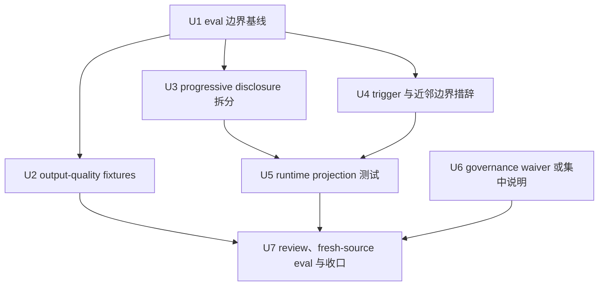

# refactor: spec-plan skill 质量与边界优化

## 概要

本计划把 `spec-plan` 的 P1 审查结论转成可落地的 source 优化方案：先补 trigger/boundary 与输出质量 fixture，再压缩 `SKILL.md` 热路径并重分配 reference ownership，最后用 runtime projection、集中治理说明、fresh-source eval 和文档审查收口。目标是让 `spec-plan` 继续作为 HOW planning workflow 服务主链路，同时降低入口初载成本、输出漂移和第二真相源风险。

---

## 决策简报

- **推荐方案：** 采用“测试与 fixture 先行，入口瘦身随后，治理只做最小诚实记录”的路径。先锁定当前 plan-only、handoff、near-neighbor 和 output contract，再移动 prose，避免大改后无法判断行为是否漂移。
- **关键决策：** 不新增公开 workflow、agent 或 per-skill `manifest.json`；不把计划 artifact 做成执行状态机；不把外部 `$yao-meta-skill` 的 governance band 当本仓 confirmed truth；所有行为变更从 `skills/spec-plan/**` source 出发，runtime mirror 只由后续 `spec-first init` 再生成。
- **验证重点：** `spec-plan` 的 normalized eval、输出质量 fixture、合同测试、runtime 路径改写、Codex/Claude 投影、source/runtime 边界、plan-only safety、handoff menu、PRD/brainstorm/work/debug/doc-review 近邻边界。
- **最大风险/边界：** 最大风险是为了“治理完整”继续给入口加 prose 或新增第二套元数据拓扑。本计划要求 governance 先落在现有集中合同或 documented waiver，只有出现明确 consumer 后才扩 schema。

---

## 问题框定

`spec-plan` 位于 `Spec -> Plan -> Tasks -> Code` 主链路，是把已经足够清晰的 WHAT 转成可执行 HOW 的公开 workflow。当前 source 已经包含 plan-only safety、contract summary、requirements carry-forward、direct evidence、research、deepening、doc-review 和 handoff 等完整能力，但入口文件仍有 756 行，且携带 10 个 references 与 1 个 eval 文件。审查报告给出的 P1 结论是：它应该重构，而不是继续堆能力。

核心问题不是 `spec-plan` 缺少能力，而是能力密度和证据密度不匹配：

- 入口承载了大量 Phase 0/1/3/5 细节，容易让宿主模型漏掉后置规则，也增加 runtime 投影与路径 rewrite 的漂移面。
- `evals/examples.json` 已是 canonical fixture 封套，但只有 5 个 trigger/boundary cases，尚未覆盖 plan-only safety、既有 review origin、dirty worktree、PRD handoff 熵、task-pack handoff、输出质量期望等审查报告点名场景。
- `$yao-meta-skill` 静态检查显示 initial-load token 超预算、缺 per-skill `agents/interface.yaml`、无 `manifest.json`；这些是外部打包视角的 advisory signal，不应原样变成本仓 source 要求。
- 本仓已有 `docs/contracts/workflows/skill-agent-quality-governance.md`、`src/cli/contracts/dual-host-governance/skills-governance.json`、`tests/unit/spec-plan-contracts.test.js` 等本地治理和投影机制。计划应沿用这些 source，而不是新增第二真相源。

因此本轮优化要以可验证收敛为目标：让入口更像 orchestrator，让 references 承载可条件读取细节，让 eval 和 contract tests 承担可回归证据，让 governance 诚实表达成熟度和缺口。

---

## 需求

- R1. `spec-plan` 必须继续表达 `spec-brainstorm` 定义 WHAT、`spec-plan` 定义 HOW、`spec-work` 执行的主链路边界。
- R2. 直接调用 `$spec-plan` 时仍必须进入 planning workflow；输入不清时用 clarification/bootstrap，而不是退出或自动改走其他 workflow。
- R3. 计划阶段不得实现代码、运行实现验证、改生成态 runtime mirror、生成 task pack 或进入 `spec-work`；handoff 前只能写计划 artifact 和必要 docs/changelog。
- R4. `SKILL.md` 热路径必须保留 trigger、non-trigger、inputs、outputs、artifacts、failure modes、workflow skeleton、downstream consumers、plan-only safety、reference routing 和 handoff 边界。
- R5. 长细节应下沉到现有 references，或在确有 ownership 分离时新增最多 1 个清晰 reference；不得为了瘦身制造 reference sprawl。
- R6. `evals/examples.json` 必须覆盖 trigger、近邻边界、plan-only safety、review-origin planning、dirty worktree limitation、task-pack handoff 和 PRD/brainstorm/work/debug/doc-review 路由边界。
- R7. 如果新增 output-quality fixtures，每个 case 必须声明顶层字段 `input_files`、`baseline_risks`、`with_skill_expectations`、`objective_assertions`、`evidence_status`，并在存在未覆盖证据时声明顶层 `missing_evidence`（与参考模式 `skills/spec-write-tasks/evals/output-quality-cases.json` 一致：`evidence_status` 为必需顶层字段，`missing_evidence` 为顶层可选字段，正常路径 case 可省略）；不得声称已经证明模型语义质量。
- R8. Contract tests 必须验证 source + references 的组合契约，而不是依赖入口文件包含所有长文。
- R9. Runtime projection tests 必须继续覆盖 Claude command 渲染、Codex skill 渲染、reference path rewrite、high-value anchors 和生成态 runtime drift detection。
- R10. 不新增 per-skill `manifest.json`、`agents/interface.yaml`、第二套 skill package metadata 或独立 governance report 作为本轮 source。
- R11. 若治理元数据确实需要表达，必须优先使用或扩展现有统一治理面；若没有明确 consumer，则记录 documented waiver 和重估条件。
- R12. 所有 source file refs 和计划正文路径必须保持 repo-relative；runtime mirror 只能作为投影结果验证，不作为修改来源。
- R13. 实现完成前必须运行 focused contract/eval/projection/changelog 验证；若无法执行 fresh-source eval 或 doc-review，必须记录 `not_run` 和原因。
- R14. `CHANGELOG.md` 必须记录本次 source 变更、用户可见影响、验证和生成态 runtime mirror 状态。

---

## 假设

- A1. 本计划直接来自当前用户对 `spec-plan` 审查与优化方案的继续规划请求，不从 brainstorm/PRD requirements 继承 `spec_id`。
- A2. `docs/项目审查/详细审查/skill/Skill-25-spec-plan-详细审查报告.md` 是 origin review evidence，但其中没有稳定 finding IDs；本计划用 R-ID 覆盖其 P1 结论和验证清单，不在 frontmatter 发明 finding id。
- A3. `$yao-meta-skill` 的 `resource_boundary_check.py`、`lint_skill.py`、`validate_skill.py`、`governance_check.py` 输出是 advisory。它能暴露风险，但本仓是否采纳由角色契约和本仓 source/consumer 决定。
- A4. 当前工作区已有其他未提交 `spec-prd` 改动。后续实现必须只处理 `spec-plan` 相关文件和本计划声明的 docs/changelog/test surface，不回滚或重写无关改动。

---

## 范围边界

- 不实现本计划中的任何 `skills/spec-plan/**` 变更。
- 不修改 `.claude/`、`.codex/`、`.agents/skills/` 生成态 runtime mirrors。
- 不新增公开 workflow、公开 agent、CLI 命令、schema 支撑的执行状态机或计划执行 artifact。
- 不把 plan document 变成第二真相源；实现进度仍由 `spec-work` 和 git evidence 推导。
- 不把 `spec-write-tasks` 提升为默认强制步骤；task pack 仍是可选 derived artifact。
- 不把 output-quality fixtures 当 provider telemetry、human adjudication 或 semantic quality proof。
- 不以通过 `$yao-meta-skill` 外部 budget 为唯一目标牺牲本仓公开 workflow 合同摘要和宿主交付合同。

### 后续延迟事项

- 统一 skill lifecycle metadata：若多个 public workflow 都需要 owner/review cadence/maturity，可另开计划设计集中式 advisory lifecycle contract。本轮只为 `spec-plan` 记录 waiver 或最小约束。
- 真实 provider-backed model eval：需要独立 eval runner、样本集和人工/LLM adjudication 标准，不在本轮入口瘦身中完成。
- Runtime regeneration：source 变更落地后由后续 `spec-first init --claude --codex` 或等价 setup/update 流程处理，不在 plan 阶段执行。

---

## 完成标准

- `skills/spec-plan/evals/examples.json` 覆盖 P1 审查要求的 trigger、boundary、fallback 和 handoff 场景，并继续通过 canonical eval fixture normalizer。
- `skills/spec-plan/evals/` 若新增 output-quality 文件，必须有 focused contract test 锁定 evidence gaps 和 objective assertions。
- `skills/spec-plan/SKILL.md` 的热路径更紧凑，但前 120 行仍满足公开 workflow 合同摘要，且保留 plan-only safety、direct invocation、question-tool fallback、governance-boundaries reference 和 examples-as-context anchor。
- `skills/spec-plan/references/*` 的 ownership 清晰：section/template/rendering/deepening/handoff/governance/universal planning 各自承载细节，不复制入口合同。
- `tests/unit/spec-plan-contracts.test.js`、`tests/unit/runtime-plan-contracts.test.js`、`tests/unit/skill-path-rewrite-guard.test.js` 或相邻 tests 覆盖 source/reference/runtime projection 的关键 anchor。
- `docs/contracts/workflows/skill-agent-quality-governance.md`、`src/cli/contracts/dual-host-governance/skills-governance.json` 或 plan-local validation artifact 明确说明为什么本轮不新增 per-skill `manifest.json`。
- fresh-source eval 或等价 reviewer 复核记录存在；如果不可用，记录 `dispatch_authorization_missing`、`not_run` 或具体 host limitation。
- `CHANGELOG.md` 记录所有 source 变更和验证；生成态 runtime mirrors 未手改。

---

## 直接证据准备度

- target_repo: `spec-first`
- evidence_sources: 直接 source 读取、审查报告读取、项目角色契约读取、`wc -l`、聚焦 `rg`、当前 git 状态、`task-governance-signals` advisory helper、package/changelog/source governance 读取
- source_refs:
  - `docs/项目审查/详细审查/skill/Skill-25-spec-plan-详细审查报告.md`
  - `docs/10-prompt/结构化项目角色契约.md`
  - `skills/spec-plan/SKILL.md`
  - `skills/spec-plan/references/governance-boundaries.md`
  - `skills/spec-plan/references/plan-template.md`
  - `skills/spec-plan/references/plan-sections.md`
  - `skills/spec-plan/references/markdown-rendering.md`
  - `skills/spec-plan/references/visual-communication.md`
  - `skills/spec-plan/evals/examples.json`
  - `tests/unit/spec-plan-contracts.test.js`
  - `tests/unit/workflow-eval-readiness-contracts.test.js`
  - `tests/unit/eval-fixture-contracts.test.js`
  - `tests/unit/runtime-plan-contracts.test.js`
  - `tests/unit/skill-path-rewrite-guard.test.js`
  - `tests/unit/public-workflow-contract-summary.test.js`
  - `docs/contracts/workflows/skill-agent-quality-governance.md`
  - `src/cli/contracts/dual-host-governance/skills-governance.json`
  - `src/cli/contracts/dual-host-governance/skills-governance.schema.json`
  - `src/cli/plugin.js`
  - `docs/catalog/runtime-capabilities.md`
  - `templates/claude/commands/spec/plan.md`
- current_revision: `681ce9f0`
- worktree_status: 写本计划前工作区已 dirty；既有修改包括 `CHANGELOG.md`、多个 `skills/spec-prd/**` 文件、`tests/unit/spec-prd-contracts.test.js`，以及未跟踪的 `docs/validation/spec-prd/**` eval artifact。后续实现应把这些视为无关既有改动。
- confidence: 对 source topology、当前 contract surface 和优化方向的信心高；对精确 prose 拆分的信心中等，因为实现前仍需重读当前文件并确认最终行数/token delta。
- limitations: 计划阶段未运行语义模型 eval；本计划不依赖当前外部 API 事实，因此未做外部 web research；宽泛 `rg "spec-plan"` 返回大量历史/advisory docs，因此消费者结论以 `src/cli/plugin.js`、runtime catalog、command template 和 focused tests 等当前 source 为准。

---

## 直接证据

- repo_scope: 单仓库，`spec-first`
- source_reads_completed:
  - 当前 `skills/spec-plan/SKILL.md` 为 756 行。origin 报告记录为 757 行，因此后续实现应以当前 source 读取为准，不沿用历史行数。
  - `skills/spec-plan/references/` 当前有 10 个 markdown reference；最大文件是 `plan-template.md` 308 行、`deepening-workflow.md` 254 行、`synthesis-summary.md` 199 行。
  - `skills/spec-plan/evals/examples.json` 当前有 5 个 case，覆盖已定需求规划、深化、执行边界、debug 边界和 review 边界。
  - `tests/unit/workflow-eval-readiness-contracts.test.js` 已要求第一批 workflow fixture 使用 canonical schema，并包含 `trigger` 与 `boundary` coverage tags。
  - `tests/unit/eval-fixture-contracts.test.js` 会校验 source authority，并拒绝把 generated mirrors 和历史 plans 当作 source refs。
  - `tests/unit/spec-plan-contracts.test.js` 已检查 plan-only safety、context orientation、governance boundaries、reference path anchors、runtime inspection 和 projection behavior。
  - `tests/unit/runtime-plan-contracts.test.js` 检查 Codex 渲染后的 `spec-plan` research dispatch semantics。
  - `src/cli/contracts/dual-host-governance/skills-governance.json` 将 `spec-plan` 标为 `entry_surface: workflow_command`、`command_name: plan`、`host_scope: dual_host`、`host_delivery.claude: command`、`host_delivery.codex: skill`。
  - `src/cli/contracts/dual-host-governance/skills-governance.schema.json` 使用 `additionalProperties: false`，且只允许 delivery/topology metadata，不允许 owner/cadence/maturity 字段。
  - `templates/claude/commands/spec/plan.md` 说明 Claude command 行为由 `skills/spec-plan/SKILL.md` 渲染产生。
  - `docs/catalog/runtime-capabilities.md` 将 `/spec:plan` 和 `$spec-plan` 列为公开 planning workflow 入口。
  - `spec-first internal task-governance-signals` 返回 `candidate_level: deep`、`risk_domains: contract, runtime, workflow`，以及 `cross-module`、`critical-path-hit`、`candidate-deep` reason codes。
- source_reads_required:
  - 实现前立即重读所有 `skills/spec-plan/**` 文件，因为 prompt prose 可能在本计划之后已经变化。
  - 移动文本前按 anchor 重读 `tests/unit/spec-plan-contracts.test.js`；该文件里多处断言是精确 snippet 检查。
  - 修改 reference 名称或移动关键字符串前，重读 `src/cli/plugin.js` 的 high-value anchors。
- commands_or_tools_used:
  - `git status --short`
  - `ls docs/plans`
  - `wc -l skills/spec-plan/SKILL.md skills/spec-plan/references/*.md skills/spec-plan/evals/examples.json ...`
  - 聚焦 `sed` 读取角色契约、skill source、references、tests、governance docs、command template 和 catalog
  - 聚焦 `rg` 检索 review report、governance records 和 `spec-plan` source surfaces
  - `spec-first internal task-governance-signals`
- impact_on_plan:
  - deep 分级由 workflow、contract 和 runtime projection surface 共同支撑。
  - 现有测试已经足以支撑“先扩测试再重构 prose”的路线，但必须先扩展再移动入口文本。
  - governance metadata 不应通过 per-skill manifest 解决，因为当前 schema 刻意排除了这些字段。
- key_findings:
  - `spec-plan` 功能已经成熟；优化重点应是降低入口负载和增强证据，而不是继续扩能力面。
  - 当前 eval 覆盖偏结构性，对输出质量和 handoff 降级的覆盖仍薄。
  - 当前 runtime delivery chain 依赖 source 路径改写和 high-value anchors，因此 reference 移动必须配套 projection tests。
- limitations:
  - 写入本计划前没有对这份新计划运行 `$spec-doc-review`。
  - 本次规划没有在当前会话 live 运行 `$yao-meta-skill` scripts；使用的是此前收集的 advisory outputs 与当前 source reads。

---

## 上下文与研究

### 相关代码与模式

- `spec-brainstorm` 最近使用了可借鉴的公开 workflow 瘦身模式：紧凑 `SKILL.md`、细节下沉 references、focused contract tests，以及 changelog 中解释 `resource_boundary_check` 限制。`spec-plan` 应复用这种纪律，而不是照搬它的文件拓扑。
- `spec-write-tasks/evals/output-quality-cases.json` 是最接近的本地 file-backed 输出质量 fixture 模式。它显式区分 `baseline_risks`、`with_skill_expectations`、`objective_assertions`、`evidence_status` 和 `missing_evidence`。
- `spec-app-consistency-audit/evals/recorded-output-fixtures.json` 是最接近的记录型确定性输出 fixture 模式，并显式说明它不是 provider-backed model evidence。
- `docs/contracts/workflows/skill-agent-quality-governance.md` 已说明 examples-as-context 不是 semantic readiness，deterministic tests 也不能假装判断 semantic quality。
- `src/cli/plugin.js` 对 `spec-plan` 使用 `HIGH_VALUE_SKILL_ANCHORS` 和 `HIGH_VALUE_COMMAND_ANCHORS`，因此移动 prose 时必须保留或有意更新 anchors。

### 组织经验

- `docs/10-prompt/结构化项目角色契约.md` 要求 Light contract、Explicit boundaries、source/runtime separation，以及 scripts prepare facts while LLM decides。
- `spec-brainstorm`、`agent-native-architecture` 和 `spec-app-consistency-audit` 的近期 changelog 条目显示了本仓已接受的姿态：外部 `$yao-meta-skill` budget findings 是有用压力，但不能覆盖 spec-first source contracts。
- 现有治理 source 刻意避免在 dual-host delivery schema 中加入 per-skill lifecycle metadata。任何 owner/cadence/maturity surface 都需要有 consumer 的独立论证合同。

### 外部参考

- 未使用。本计划只涉及本地 workflow source、tests 和 governance boundaries，不依赖当前外部 API、法律、SDK 或 provider 文档。

---

## 关键技术决策

- KTD1. 先测试再移动 prose：先扩展 fixtures 和 contract tests，再重构入口。这能降低入口瘦身悄悄破坏 handoff、plan-only 或 runtime projection 行为的风险。
- KTD2. 保持 markdown plan artifact 作为 canonical 形态：不为 `spec-plan` 引入 plan JSON schema 或 runtime state machine。
- KTD3. 先复用当前 references，再考虑新增：把 section/template/rendering/deepening/handoff 细节移动到 ownership 已清晰的现有文件；只有 Phase 0/1 research flow 没有自然归属时，最多新增 1 个 reference。
- KTD4. 把 output-quality fixtures 当作 review evidence，而不是 model eval proof：缺少 provider telemetry、model execution evidence 或 human adjudication 时，必须记录 `missing_evidence`。
- KTD5. 保持 dual-host delivery：每个行为相关 source change 都必须同时经过 Claude command rendering 和 Codex skill rendering 检查。
- KTD6. 不新增 per-skill manifest：如果需要表达 governance maturity，使用 `docs/contracts/workflows/skill-agent-quality-governance.md` 或未来集中式 advisory contract，而不是 `skills/spec-plan/manifest.json`。
- KTD7. 保持 question-tool fallback 足够响亮：任何入口瘦身都必须保留 `request_user_input`/`AskUserQuestion` 要求和编号 fallback 条件。

---

## 开放问题

### 规划阶段已解决

- 本计划应为 Standard 还是 Deep？已定为 Deep，因为 `task-governance-signals` 报告 `candidate_level: deep`，且范围触及 workflow、contract、runtime projection 和 governance surfaces。
- 实现是否应新增 per-skill `manifest.json` 来满足 `$yao-meta-skill`？已定为否。当前 spec-first governance source 是集中式且仅面向 delivery；per-skill manifest 会在缺少本地 consumer 的情况下制造第二套 artifact topology。
- 本计划是否需要外部 web research？已定为否。该工作是本地 prompt/source/test governance，不依赖当前外部事实。

### 延迟到实现阶段

- 精确 reference 拆分：实现阶段重读当前 `SKILL.md` 后，再判断哪些 Phase 0/1/3 section 仍与 reference 内容重复。
- 是否新增 `skills/spec-plan/evals/output-quality-cases.json` 或扩展 `examples.json`：根据 objective assertions 是否能干净落入 canonical eval schema 决定。
- 是否为 planning-depth 或 output-quality gap 记录 `rule-maturity` advisory shadow hit：只有实现时找到具体 durable evidence ref 和相近现有 rule IDs 才做。

---

## 高层技术设计

> 本图只说明计划执行形状，供审查方向使用，不是实现规范。后续实现 agent 应把它当作上下文，而不是要复刻的代码。

---

## 实施单元

### U1. 扩展 trigger 与 boundary eval 基线

**目标：** 先补 `spec-plan` 的 routing、near-neighbor、fallback 和 handoff fixture 基线，为后续入口瘦身提供边界覆盖的文档化与结构性证据。这些 fixture 是 examples-as-context 与结构性 source evidence，CI 中只经 normalizer 结构校验和 contract test 字符串级断言，不实际运行模型；瘦身后的行为级防漂移由 U7 fresh-source eval 承担。

**需求：** R1, R2, R3, R6, R8

**依赖：** 无

**文件：**
- 修改：`skills/spec-plan/evals/examples.json`
- 修改：`tests/unit/workflow-eval-readiness-contracts.test.js`
- 修改：`tests/unit/eval-fixture-contracts.test.js`
- 修改：`tests/unit/spec-plan-contracts.test.js`

**方案：**
- 在现有 canonical fixture 封套下增加 cases，覆盖 direct invocation always plans、unclear input bootstrap、brainstorm-owned WHAT、PRD-grade origin handoff entropy、execution-ready work boundary、debug boundary、doc-review boundary、dirty worktree limitation、generated runtime mirror exclusion 和 task-pack optional handoff。
- 保持 eval fixture 只是 examples-as-context 和结构性 source evidence，不把它升级为 deterministic router。
- 若新增 coverage tags，先确认 normalizer 和现有 cross-workflow tests 是否允许；否则复用 `trigger`、`boundary`、`planning`、`workflow-routing`、`failure` 等已有风格。

**参考模式：**
- `skills/spec-plan/evals/examples.json`
- `skills/spec-debug/evals/examples.json`
- `tests/unit/workflow-eval-readiness-contracts.test.js`

**测试场景：**
- 正常路径：清晰 implementation-plan prompt 的 expected outcome 仍是 durable plan artifact，且不修改实现代码。
- 边界：`fix failing test now` 的 expected outcome 是路由到 `spec-debug` 或 `spec-work`，而不是生成计划。
- 边界：`review this plan only` 的 expected outcome 是路由到 `spec-doc-review`，除非用户要求 revise/deepen plan。
- 边界情况：直接 `$spec-plan` 但输入模糊时，expected outcome 是澄清或 bootstrap scope，而不是判为 `not a planning task`。
- 集成：canonical fixture normalizer 接受每个新增 case，并拒绝把生成态 mirrors 或历史 plans 当 source authority。

**验证：**
- Eval fixture normalizer 不报告 validation errors。
- 第一批 workflow eval readiness 仍能看到 `spec-plan` 的 trigger 和 boundary coverage。
- `spec-plan` source 将 eval examples 作为上下文引用，而不是当作 router。

---

### U2. 增加输出质量 fixture 与断言

**目标：** 把审查报告中“输出契约和质量证据不足”的结论落成 file-backed 输出质量 review cases。

**需求：** R6, R7, R8, R13

**依赖：** U1

**文件：**
- 新建（若需要独立 output-quality evidence）：`skills/spec-plan/evals/output-quality-cases.json`
- 修改（若复用 canonical eval cases）：`skills/spec-plan/evals/examples.json`
- 可选新建：`skills/spec-plan/evals/README.md`
- 修改：`tests/unit/spec-plan-contracts.test.js`
- 修改：`tests/unit/eval-fixture-contracts.test.js`

**方案：**
- 如果 canonical `examples.json` 无法自然表达 output-quality assertions，则新增 `output-quality-cases.json`，仿照 `spec-write-tasks` 的 `baseline_risks`、`with_skill_expectations`、`objective_assertions`、`missing_evidence` 结构。
- 覆盖至少三类质量风险：计划 artifact 变成执行状态、缺直接证据导致 unsupported plan、handoff menu 只展示不路由、origin review findings 丢失、task-pack handoff 过早生成。
- 每个 case 必须声明 `evidence_status`（如 `file-backed fixture`），并在存在未覆盖证据时用顶层 `missing_evidence` 列出缺口，明确 file-backed fixture 不是 provider telemetry，也不是 human adjudication。

**参考模式：**
- `skills/spec-write-tasks/evals/output-quality-cases.json`
- `skills/spec-write-tasks/evals/README.md`
- `skills/spec-app-consistency-audit/evals/recorded-output-fixtures.json`

**测试场景：**
- 正常路径：review-origin planning case 期望计划包含 `origin`/source refs 和 in-scope finding 覆盖，同时不发明 finding IDs。
- 错误路径：缺少 Direct Evidence 或 limitations 的计划输出会被 objective assertions 标为不完整。
- 边界：要求 compile tasks 的 case 期望 `spec-plan` 提供 handoff，而不是静默创建 task pack。
- 集成：新增 eval 文件是 source/test 侧资产，由 `tests/unit/eval-fixture-contracts.test.js` 的 `evals/**/*.json` 扫描自动纳入校验；它不进入 host runtime packaging（`src/cli/plugin.js` 的 support-file 打包面向 agent support files，skill eval 不在其中），因此无需为此设打包条件门。

**验证：**
- Output-quality fixtures 暴露 objective assertions 和 missing evidence。
- 聚焦 contract tests 证明 fixture 文件属于 source-owned 资产，且不会被当成 semantic proof。

---

### U3. 瘦身 `SKILL.md` 并重分配 reference ownership

**目标：** 把入口文件从长流程说明收敛成 route-critical orchestrator，同时保留公开 workflow 合同摘要、plan-only safety 和 mandatory reference loads。

**需求：** R1, R2, R3, R4, R5, R8, R12

**依赖：** U1

**文件：**
- 修改：`skills/spec-plan/SKILL.md`
- 修改：`skills/spec-plan/references/governance-boundaries.md`
- 修改：`skills/spec-plan/references/plan-sections.md`
- 修改：`skills/spec-plan/references/plan-template.md`
- 修改：`skills/spec-plan/references/deepening-workflow.md`
- 修改：`skills/spec-plan/references/plan-handoff.md`
- 可选新建：`skills/spec-plan/references/planning-flow.md`
- 修改：`tests/unit/spec-plan-contracts.test.js`
- 修改：`tests/unit/public-workflow-contract-summary.test.js`
- 修改：`tests/unit/context-governance-contracts.test.js`

**方案：**
- 保留 `SKILL.md` 的前置热路径：description、direct invocation rule、Plan-Only Safety Contract、Workflow Contract Summary、examples-as-context、governance-boundaries mandatory load、Interaction Method、Feature Description、Core Principles、Plan Quality Bar。
- 将 Phase 0/1 中可条件读取的 resume/source/research/direct-evidence/depth-classification 细节移入现有 reference 或一个新的 `planning-flow.md`。如果新增 reference，必须同时更新 tests、runtime projection anchors 和 packaging expectations。
- 将 Phase 3/4 中与 section/template/rendering 相关的细则继续归入 `plan-sections.md`、`markdown-rendering.md`、`plan-template.md`，入口只保留“读这些 references”的强指针。
- 保留 high-value anchor 短语在入口热路径：`src/cli/plugin.js` 的 `HIGH_VALUE_SKILL_ANCHORS['spec-plan']` 与 `HIGH_VALUE_COMMAND_ANCHORS['spec-plan']` 当前为 `Implementation Units`、`Concrete requirements traceability`、`Test scenarios`、`governance-boundaries.md`、`universal-planning.md`，且只校验渲染后的 SKILL/command 本体（不含 references）。下沉 section/template 细则时，这 5 个短语必须仍出现在渲染后的 `SKILL.md`（它们多数本就属于应保留的 Plan Quality Bar 与 output contract 指针）。只有某个 anchor 的语义确实整体迁出入口时，才在 U5 同步更新 anchor 列表；保留短语与更新 anchor 二选一，不得两头都动。
- 保留 Plan-Only Safety 的强语言，不为 token 减载删除 handoff blocking、question tool fallback、do not implement 等规则。

**参考模式：**
- `skills/spec-brainstorm/SKILL.md` 当前 compact orchestrator 形态
- `skills/spec-plan/references/plan-sections.md`
- `tests/unit/public-workflow-contract-summary.test.js`

**测试场景：**
- 正常路径：前 120 行仍包含公开 workflow 合同摘要八项字段。
- 边界：`SKILL.md` 不再内联完整 `Context Orientation Anchor`，但 `SKILL.md + governance-boundaries.md` 组合仍包含 source/runtime 和 LLM decision boundary。
- 边界：下沉 section/template 细则后，渲染后的 `SKILL.md` 仍包含 `Implementation Units`、`Concrete requirements traceability`、`Test scenarios`、`governance-boundaries.md`、`universal-planning.md` 五个 high-value anchor 短语；任一缺失应触发 `missing_anchor:*` / `missing_command_anchor:*`。
- 边界情况：新 reference 路径如果存在，Claude/Codex runtime path rewrite 后仍指向正确 runtime path。
- 集成：生成态 runtime inspection 仍报告 `spec-plan` high-value anchors 存在。

**验证：**
- Entry contract tests 以 source + references 作为组合真相源通过。
- `SKILL.md` 初载体量明显下降或至少删除重复长段，且没有丢失 mandatory handoff和 plan-only anchors。

---

### U4. 收紧 description 与 near-neighbor 边界

**目标：** 让宿主 description 和入口 prose 更准确地区分 plan、brainstorm、PRD、work、debug、doc-review、write-tasks 和 universal planning。

**需求：** R1, R2, R3, R4, R6

**依赖：** U1

**文件：**
- 修改：`skills/spec-plan/SKILL.md`
- 修改：`skills/spec-plan/evals/examples.json`
- 修改：`docs/catalog/runtime-capabilities.md`，仅当用户可见 catalog wording 必须变化时
- 修改：`tests/unit/spec-plan-contracts.test.js`
- 修改：`tests/unit/workflow-eval-readiness-contracts.test.js`

**方案：**
- 保持 description 足够支持直接 `$spec-plan` 和通用 planning，同时用紧凑排除语句覆盖 implementation、debugging、standalone review、task-pack compilation 和 product discovery 不清晰的场景。
- 避免把 description 过拟合成很长的 router table。详细 routing 继续留在 `using-spec-first` 和 `spec-plan` Phase 0 bootstrap。
- 明确非软件问答型 planning 边界，但不削弱软件计划 artifact 生成。

**参考模式：**
- `skills/spec-brainstorm/SKILL.md` 的 description 与 near-neighbor eval pattern
- `skills/using-spec-first/evals/routing-cases.json`

**测试场景：**
- 正常路径：`plan implementation from requirements` 仍是 trigger。
- 边界：`compile this plan into tasks` 指向 `spec-write-tasks`。
- 边界：`review this plan` 指向 `spec-doc-review`，除非用户要求 edit/deepen。
- 边界：`fix this bug` 根据 root-cause clarity 指向 `spec-debug` 或 `spec-work`。
- 边界情况：`plan a study schedule` 仍是非软件 universal planning，默认不生成 durable repo artifact。

**验证：**
- Frontmatter/description 更新不移除 direct invocation rule。
- Fixture coverage 证明 near-neighbor boundaries 是有意设计，而不是偶然缺口。

---

### U5. 更新 runtime projection 与路径 rewrite 守卫

**目标：** 确保 source prose 移动后，Claude command 和 Codex skill runtime 投影仍保持关键 anchors、reference paths 和 research dispatch semantics。

**需求：** R8, R9, R12, R13

**依赖：** U2, U3, U4

**文件：**
- 修改：`src/cli/plugin.js`
- 修改：`tests/unit/spec-plan-contracts.test.js`
- 修改：`tests/unit/runtime-plan-contracts.test.js`
- 修改：`tests/unit/skill-path-rewrite-guard.test.js`
- 修改：`tests/unit/init-dry-run.test.js`

**方案：**
- 默认姿态是按 U3 保留 5 个 anchor 短语于入口，不动 anchor 列表；只有某个 anchor 语义确实整体迁出 `SKILL.md` 时，才更新 `HIGH_VALUE_SKILL_ANCHORS` 和 `HIGH_VALUE_COMMAND_ANCHORS` 指向仍应在 runtime artifact 中可发现的锚点。两条路径互斥，不得对同一 anchor 既保留短语又改列表。
- 保留 `skills/spec-plan/references/*` source 路径在 runtime render 中按 host 转换的行为。
- Codex 渲染后的 research dispatch semantics 仍应包含 `spawn_agent`、explicit fallback、repo/learnings researcher agent paths，并避免旧 Task shorthand 回退文本。
- 不通过手改 runtime mirror 修复测试；所有测试都从 source render/plan/inspect 出发。

**参考模式：**
- `tests/unit/skill-path-rewrite-guard.test.js`
- `tests/unit/runtime-plan-contracts.test.js`
- `tests/unit/spec-plan-contracts.test.js`

**测试场景：**
- 集成：Claude runtime plan 在 rewrite 后包含 `.claude/spec-first/workflows/spec-plan/references/...` 路径。
- 集成：Codex runtime skill 在 rewrite 后包含 `.agents/skills/spec-plan/references/...` 路径。
- 边界情况：eval fixtures 中的 source refs 保持 source paths，不被 rewrite 成生成态 mirrors。
- 错误路径：rendered runtime 缺失 high-value anchor 时 focused test 失败。

**验证：**
- Runtime projection tests 在两个 host adapters 上都通过。
- `git diff` 中没有 generated runtime mirror 文件被编辑。

---

### U6. 记录治理 posture 或 waiver

**目标：** 回应 P1/P2 审查中的 owner/review cadence/maturity 和 `$yao-meta-skill` governance findings，同时避免新增第二套 skill topology。

**需求：** R10, R11, R12, R14

**依赖：** U3

**文件：**
- 修改：`docs/contracts/workflows/skill-agent-quality-governance.md`
- 条件修改：`tests/unit/governance-contracts.test.js`，仅当 governance waiver 文案进入可测试合同面
- 可选新建：`docs/validation/spec-plan/fresh-source-eval-2026-06-22-skill-quality.md`
- 明确不修改：`src/cli/contracts/dual-host-governance/skills-governance.json`，除非 delivery metadata 真实变化；本计划预期不需要
- 明确不修改：`src/cli/contracts/dual-host-governance/skills-governance.schema.json`；lifecycle schema 扩展必须另开独立计划并先确认真实 consumer

**方案：**
- 新增或引用 documented waiver：当 delivery governance 已集中化且 schema 仅表达 delivery 时，public workflow skills 不需要 per-skill `manifest.json`。
- 记录重估条件：只有至少两个 public workflows 需要把 owner/cadence/maturity 作为被消费字段，且已有 consumer test 时，才创建集中式 lifecycle metadata contract。
- 如果除 plan/validation artifact 外不需要修改 docs，就在 validation report 明确说明 governance finding 是 advisory，并带原因延迟处理。

**参考模式：**
- `docs/contracts/workflows/skill-agent-quality-governance.md`
- `src/cli/contracts/dual-host-governance/skills-governance.schema.json`
- `docs/项目审查/2026-06-20-spec-prd-skill-optimization-suggestions.md`

**测试场景：**
- 边界：除非有意设计新的 central lifecycle contract，否则 `skills-governance.schema.json` 保持 `additionalProperties: false`。
- 边界：实现后不存在 `skills/spec-plan/manifest.json`。
- 集成：governance tests 仍确认 rule-maturity 和 skill governance 是 advisory，而不是 automatic promotion。

**验证：**
- Governance posture 记录在一个 source-owned 位置或 validation artifact 中。
- 不在 `skills/spec-plan/` 下引入第二真相源。

---

### U7. Fresh-source eval、doc-review 与 closeout 证据

**目标：** 完成语义复核、文档审查、验证记录和 changelog，避免只靠当前会话自评。

**需求：** R13, R14

**依赖：** U1, U2, U3, U4, U5, U6

**文件：**
- 新建：`docs/validation/spec-plan/fresh-source-eval-2026-06-22-skill-quality.md`
- 修改：`CHANGELOG.md`
- 可选修改：`README.md`
- 可选修改：`README.zh-CN.md`

**方案：**
- 按 `docs/contracts/workflows/fresh-source-eval-checklist.md` 或等价 fresh read-only reviewer，注入当前磁盘 source，而不是调用当前会话缓存的 skill。
- 运行或记录 `$spec-doc-review` 对修改后的 `spec-plan` source/plan output 的 review；如果当前 host 没有 dispatch 授权，记录 `dispatch_authorization_missing` 和 fallback review。
- 若用户可见行为只有质量和边界收敛，README 通常不需要改；若 description、handoff menu 或 public entry semantics 发生明显变化，再更新 README EN/ZH。

**参考模式：**
- `docs/contracts/workflows/fresh-source-eval-checklist.md`
- 现有 `docs/validation/spec-prd/fresh-source-eval-2026-06-22-requirements-grill.md`
- 近期 `CHANGELOG.md` 中 skill source refactors 相关条目

**测试场景：**
- 正常路径：validation artifact 记录已读取 source files、reviewer prompt boundary、findings、accepted/rejected changes 和 limitations。
- 错误路径：如果 fresh-source eval 不能运行，artifact 记录 `not_run` 和具体原因，而不是声称 pass。
- 集成：changelog entry 写明 source surfaces、tests run 和生成态 runtime mirror status。

**验证：**
- 存在 fresh-source review 或 documented fallback review。
- Changelog format tests 通过。
- 最终 diff check 没有 whitespace errors。

---

## 系统级影响

- **交互图：** Claude 公开入口仍是 `/spec:plan`，Codex 公开入口仍是 `$spec-plan`。下游 consumers 仍是 `spec-write-tasks`、`spec-work`、`spec-doc-review`、issue creation、Proof/HITL review paths 和 human reviewers。
- **错误传播：** 缺失 source documents、缺失 dispatch、question tools 不可用、optional providers degraded 和 dirty worktree evidence 都必须保持为 loud limitations 或 handoff choices，而不是 silent assumptions。
- **状态生命周期风险：** Plan files 仍是带 `status: active` 的 decision artifacts；它们不记录实现进度。Task packs 仍是 derived 且 optional。
- **API surface 对齐：** Claude command 与 Codex skill 的 runtime projection 在行为关键 anchors 上必须保持等价，即使 delivery shape 不同。
- **覆盖范围：** `skills/spec-plan/**` 在范围内；`tests/unit/*spec-plan*` 和 eval fixture tests 在范围内；`src/cli/plugin.js` high-value anchors 在范围内；generated mirrors 除 render/inspect tests 外均在范围外；README docs 除非 public wording 变化，否则延迟处理。
- **集成覆盖：** Source reference 移动必须通过 runtime render/path rewrite tests 证明，不能只依赖 source text assertions。
- **不变约束：** `spec-plan` 定义 HOW，不定义 WHAT，也不执行；生成态 runtime mirrors 不是 source；scripts 产出 advisory deterministic facts，LLM 负责 semantic planning decisions。

---

## 风险与依赖

| 风险 | 可能性 | 影响 | 缓解措施 |
|---|---|---|---|
| 入口瘦身删除 load-bearing instruction | 中 | 高 | U3 移动 prose 前先扩展 U1/U5 测试，并使用 source + reference 组合断言。 |
| Output-quality fixtures 带来虚假信心 | 中 | 中 | 要求 `missing_evidence`，并声明它们是 file-backed review cases，不是 model eval proof。 |
| Per-skill governance manifest 制造第二套拓扑 | 低 | 高 | U6 明确拒绝 per-skill manifest，除非另有 central lifecycle contract 计划。 |
| Reference 移动后 runtime projection 破坏 | 中 | 高 | 更新 high-value anchors，并运行 Claude/Codex render tests。 |
| 误改既有 dirty `spec-prd` 工作 | 低 | 中 | 实现范围限制在 `spec-plan`、tests、validation docs 和 changelog；closeout 前检查 diff。 |
| References 过度拆分损害可发现性 | 中 | 中 | 优先复用现有 references；只有 ownership 清晰且有测试时最多新增 1 个 reference。 |

---

## 文档与运维说明

- 任何 source/docs/test 变更都必须更新 `CHANGELOG.md`。
- README 更新是条件性的。如果实现只提升内部质量和边界，不改变 public entry semantics，则 changelog 加 validation artifact 应已足够。
- Runtime regeneration 是实现后的动作。不要手改 `.claude/`、`.codex/` 或 `.agents/skills/`。

---

## 来源与参考

- **Origin review：** `docs/项目审查/详细审查/skill/Skill-25-spec-plan-详细审查报告.md`
- **角色基线：** `docs/10-prompt/结构化项目角色契约.md`
- **Skill source：** `skills/spec-plan/SKILL.md`
- **Plan references：** `skills/spec-plan/references/`
- **Eval fixture：** `skills/spec-plan/evals/examples.json`
- **主要测试：** `tests/unit/spec-plan-contracts.test.js`, `tests/unit/workflow-eval-readiness-contracts.test.js`, `tests/unit/eval-fixture-contracts.test.js`, `tests/unit/runtime-plan-contracts.test.js`, `tests/unit/skill-path-rewrite-guard.test.js`
- **Governance source：** `docs/contracts/workflows/skill-agent-quality-governance.md`, `src/cli/contracts/dual-host-governance/skills-governance.json`
- **Runtime delivery source：** `src/cli/plugin.js`, `templates/claude/commands/spec/plan.md`, `docs/catalog/runtime-capabilities.md`
