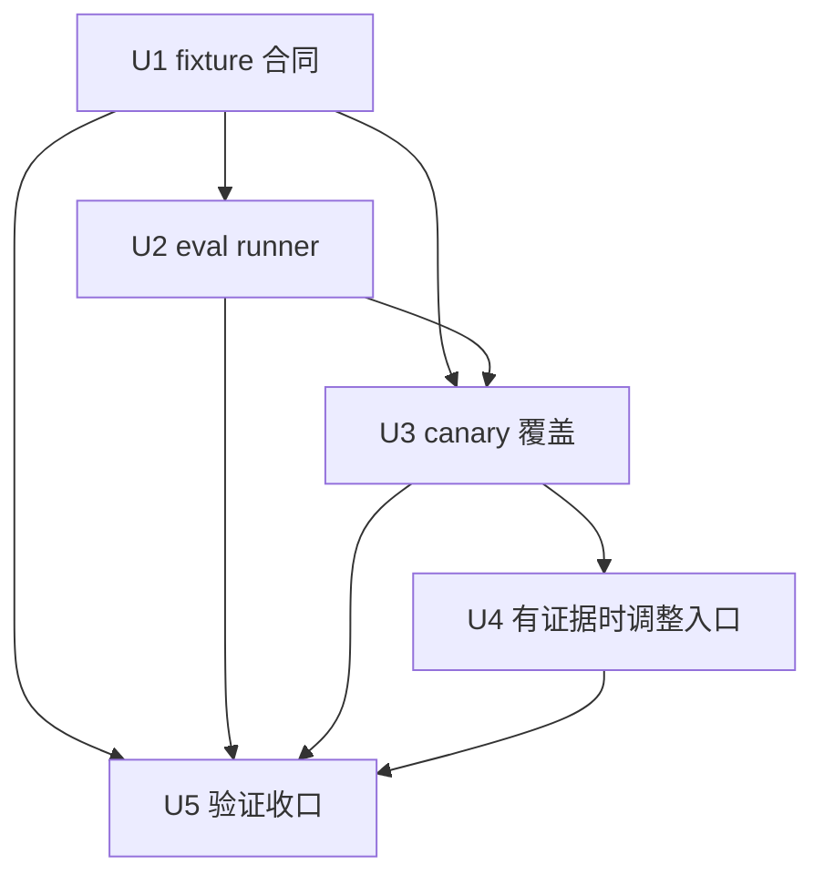

# refactor: spec-prd 可执行质量闭环

## 概要

本计划把 `spec-prd` 从“审查判断质量较高”推进到“关键行为可重复检查”。核心路径是先规范 eval fixture contract，再增加最小可执行 runner 和 canary 覆盖，最后只在证据显示必要时小幅调整入口 prose，并用 skill audit、contract tests 和 runtime/cross-host 验证收口。

---

## 决策简报

- **推荐方案：** 先做 U1/U2 的 eval contract 与 runner，建立可重复质量信号；再做 U3 canary 覆盖，用真实边界 case 决定是否需要 U4 入口瘦身。
- **关键决策：** 不把 PRD 语义质量脚本化；不新增公开 workflow；不手改 generated runtime mirrors；runner 只做结构、覆盖和 fixture 完整性检查。
- **验证重点：** `examples.json` 的 case 类型覆盖、runner exit code/reason code、`spec-prd-contracts` 回归断言、`skill-creator` quick validate、`spec-skill-audit` target audit。
- **最大风险/边界：** 最大风险是把 eval runner 做成伪语义裁判，或为了提高分数继续堆 prompt prose。本计划明确脚本准备 facts，LLM/reviewer 做语义判断。

---

## 问题框定

当前 `spec-prd` 已经具备较好的公开入口边界、source-first 纪律、reference 分层和安全姿态。最近目标审计结果为 `0 P0 / 0 P1 / 0 P2`，scorecard 为 `89/B+`。扣分主要来自 eval readiness 和部分语义维度仍需 LLM review，而不是触发边界或安全缺陷。

现有 `skills/spec-prd/evals/examples.json` 有较多场景，但 case 的语义类型主要靠 `id`、自然语言和人工理解。确定性审计可以看到 fixture 数量，却难以判断哪些 case 是 positive、boundary、route-out、failure、adversarial 或 source-candidate 边界，因此容易出现保守信号。下一步应优先补可执行质量闭环，而不是继续增加入口 prompt。

---

## 需求

- R1. `spec-prd` 必须继续服务 brownfield PRD authoring、existing PRD refine 和 planning-readiness validation，不扩大到 0-1 brainstorm、implementation planning、debug/work 或 PRD/Figma/source consistency audit。
- R2. Eval fixture 必须显式表达 case 类型、coverage bucket 和关键 `must_not` 约束，让 audit、tests 和 reviewer 能共享同一组质量信号。
- R3. 新增 runner 只能校验 fixture 结构、coverage 和 reason code，不得生成 PRD、调用 LLM 或宣称判定语义质量。
- R4. 高风险边界必须有 canary 覆盖：route-out、wrong-stage、source-candidate、prompt injection、oversized PRD、glossary drift advisory 和 readiness failure。
- R5. 入口 prose 调整必须由 U3/U4 的证据触发，不为追求更短而破坏 `SKILL.md` 的独立路由和安全边界能力。
- R6. 所有 source 变更必须同步 `CHANGELOG.md`；runtime mirror 只通过后续 `spec-first init` 刷新，不手改 `.claude/`、`.codex/`、`.agents/skills/`。
- R7. 验证必须覆盖 focused contract tests、script syntax、skill quick validate、skill entrypoint lint 和 target audit；无法执行的 fresh-source eval 或 runtime drift 检查必须记录未执行原因。

---

## 假设

- A1. 本计划直接来自当前会话对 `spec-prd` 质量的审查和技术方案讨论，没有上游 PRD requirements 文档，因此使用 plan-local `spec_id`。
- A2. `.spec-first/audits/skill-audit/latest` 是本次会话生成的运行审计 artifact，可作为 advisory evidence；计划 source 不把它当长期 source-of-truth。
- A3. 当前工作区已有大量其他未提交改动。后续执行本计划时必须重跑 `git status --short`，只触碰本计划声明的 `spec-prd` source/test/docs/changelog surface，不回退或覆盖无关改动。
- A4. `spec-prd` 的质量瓶颈目前不是 routing/safety P1 缺陷，而是 eval 可执行性和语义覆盖可观察性不足。

---

## 范围边界

- 不修改 generated runtime mirrors：`.claude/`、`.codex/`、`.agents/skills/`。
- 不新增公开 workflow、agent、CLI command 或中心化状态机。
- 不把 `run-evals.js` 做成 LLM judge、PRD 生成器或 readiness 替代品。
- 不重写 `spec-prd` 的核心方法论，只做 eval contract、runner、canary、必要的小幅 prose 收敛。
- 不把 `.spec-first/audits/**` 写入长期 source contract；它只提供本次计划背景和后续审计命令的输出位置。

### 后续延迟事项

- Provider-backed model eval：需要独立 judge 标准、样本执行记录和人工 adjudication，不在本轮实现。
- Repo-wide runtime drift audit：本轮先做 target skill source 质量闭环；需要发布前 runtime delivery 证明时再跑 repo-wide audit 或 setup/update workflow。
- Cross-skill eval schema 统一：如果多个 skill 后续都需要类似 `case_type` contract，再另开集中式 eval fixture schema 计划。

---

## 完成标准

- `skills/spec-prd/evals/examples.json` 的关键 case 具备明确 `case_type` / coverage metadata，且必备 bucket 可被 contract test 断言。
- `skills/spec-prd/scripts/run-evals.js` 能稳定输出 pass/fail、coverage summary 和 reason code；坏参数、坏 JSON、缺 bucket 都有可测试失败路径。
- `spec-prd` 至少覆盖 route-out、wrong-stage、source-candidate、prompt-injection、oversized-split、glossary-advisory 和 readiness-fail canary。
- `skills/spec-prd/SKILL.md` 仍能独立表达 when-to-use、when-not-to-use、input/output、failure、handoff 和 source/runtime boundary。
- `$spec-skill-audit` target audit 对 `skills/spec-prd` 仍为 `0 P0 / 0 P1 / 0 P2`，eval readiness 的保守信号能被 fixture contract 或 runner 证据解释。
- `CHANGELOG.md` 记录 source 变更、验证命令和未手改 generated runtime mirrors。

---

## 直接证据准备度

- target_repo: `spec-first`
- evidence_sources: 当前会话 direct source reads、target skill audit artifact、`git status --short`、`git rev-parse --short HEAD`、`docs/plans/` 命名检查、计划模板和 changelog source 读取
- source_refs:
  - `skills/spec-prd/SKILL.md`
  - `skills/spec-prd/evals/examples.json`
  - `skills/spec-prd/scripts/check-glossary-drift.js`
  - `skills/spec-prd/scripts/check-prd-artifact.js`
  - `skills/spec-prd/references/evidence-and-topology.md`
  - `skills/spec-prd/references/domain-language-and-decision-ledger.md`
  - `skills/spec-prd/references/prd-output-template.md`
  - `skills/spec-prd/references/prd-readiness-lens.md`
  - `tests/unit/spec-prd-contracts.test.js`
  - `skills/spec-skill-audit/SKILL.md`
  - `skills/spec-skill-audit/references/expert-audit-rubric.md`
  - `skills/spec-plan/references/plan-template.md`
  - `skills/spec-plan/references/plan-sections.md`
  - `skills/spec-plan/references/markdown-rendering.md`
  - `CHANGELOG.md`
- current_revision: `4d47b125`
- worktree_status: dirty；存在多个无关既有修改和未跟踪文件，执行本计划前必须重新确认目标文件范围
- confidence: 对方案方向和边界高；对具体 fixture 字段命名中等，需要实现时按当前 `examples.json` 结构收敛
- limitations: 未执行 provider-backed model eval；target audit artifact 是运行证据，不是长期 source-of-truth；本计划未读取 generated runtime mirrors

---

## 直接证据

- repo_scope: 单仓库 `spec-first`
- source_reads_completed:
  - `skills/spec-prd/SKILL.md` frontmatter 已保持通用 skill validator 可接受形态，host command metadata 留在 `templates/claude/commands/spec/prd.md`。
  - `spec-prd` reference 已拆分为 evidence/topology、domain language、output template、readiness lens 和 evaluation governance。
  - 当前 target audit 对 `skills/spec-prd` 产生 `0 P0 / 0 P1 / 0 P2`，scorecard 为 `89/B+`，主要保守信号为 eval readiness 与语义维度需 LLM review。
  - `skills/spec-prd/evals/examples.json` 有较多 case，并包含 `zero-to-one-route-out`、`plan-design-task-wrong-stage`、`app-prd-figma-source-audit`、`source-candidate-unconfirmed`、`untrusted-prd-input-injection`、`readiness-fail-trace-gap` 等高价值边界 case。
  - `tests/unit/spec-prd-contracts.test.js` 已覆盖 `argument-hint` source/host metadata 分离和 `check-glossary-drift.js` 多余位置参数失败路径。
- source_reads_required:
  - 实现 U1 前重读 `skills/spec-prd/evals/examples.json` 的当前完整结构，避免覆盖用户或其他工作流刚写入的 case。
  - 实现 U2 前检查本仓已有 eval runner 或 fixture normalizer 模式，优先复用局部测试风格。
  - 实现 U4 前重新审计 `SKILL.md` 与 reference trigger map，避免移动关键 hot-path 边界。
- commands_or_tools_used:
  - `node skills/spec-skill-audit/scripts/write-audit-artifacts.js --repo . --target skills/spec-prd`
  - `git status --short`
  - `git rev-parse --short HEAD`
  - `ls docs/plans`
  - `date '+%Y-%m-%d %H:%M:%S %Z'`
  - bounded `sed` / `find` / `wc` / fixture inspection
- impact_on_plan:
  - 计划优先级从“继续写 prompt”改为“补 eval contract 和 runner”。
  - U4 入口瘦身被放到 canary 之后，避免无证据地扰动已健康的 routing/safety surface。
- limitations:
  - 本计划没有对 `spec-prd` 产出的真实 PRD 样本做 model adjudication。
  - 本计划没有执行 repo-wide runtime drift 检查。

---

## 上下文与研究

### 相关代码与模式

- `skills/spec-prd/scripts/check-glossary-drift.js` 已是小型确定性脚本模式：参数错误返回 exit 2，领域事实输出供 LLM readiness 使用。
- `tests/unit/spec-prd-contracts.test.js` 是最直接的 contract test 承载面，适合加入 eval fixture coverage 和 runner 行为断言。
- `skills/spec-skill-audit/scripts/write-audit-artifacts.js` 的 scorecard 明确“scripts prepare facts，LLM decides”，本计划的 runner 应遵守同一边界。
- `skills/spec-plan/evals/output-quality-cases.json` 和其他 workflow eval fixtures 可作为 output-quality fixture 的后续参考，但本轮先做 `spec-prd` 局部最小 runner。

### 组织经验

- `docs/10-prompt/结构化项目角色契约.md` 要求 Light contract、Explicit boundaries、source/runtime separation，以及 script-owned facts 与 LLM-owned judgment 分离。
- `CHANGELOG.md` 规则要求任何 source/docs/test 变更都记录用户可见影响、验证和 generated runtime mirrors 状态。
- 当前 repo 已接受“audit score 是 signal，不是 gate”的治理姿态；本计划把 scorecard 作为改进方向，而不是把分数本身作为唯一目标。

### 外部参考

- 未使用。该工作完全基于本地 skill source、tests、audit artifact 和 repo governance，不依赖当前外部 API 或文档。

---

## 关键技术决策

- KTD1. Eval metadata 采用轻量字段而非完整 schema。原因是 `spec-prd` 的语义判断仍归 LLM/reviewer，当前只需要机器能稳定识别 case 类型和 coverage bucket。
- KTD2. Runner 只做 fixture 质量检查，不执行 PRD workflow。原因是生成 PRD 和判定需求质量属于模型/人工语义层，脚本只能准备可复查事实。
- KTD3. Canary 优先覆盖高风险边界而非增加 case 数。原因是 `spec-prd` 已有不少 fixture，质量增益来自明确负向/近邻边界和 failure modes。
- KTD4. U4 入口瘦身必须后置。原因是当前 `SKILL.md` routing/safety 健康，过早移动 prose 可能制造新的边界漂移。
- KTD5. Runtime/cross-host 检查不通过手改 generated mirrors 修复。原因是 source-of-truth 在 `skills/`、`templates/`、`src/cli/` 和 tests，runtime refresh 必须走 generator。

---

## 开放问题

### 规划阶段已解决

- 是否需要先重写 `SKILL.md`？不需要。当前主要缺口是 eval 可执行性，不是入口边界 P1。
- 是否应该给 `spec-prd` 新增公开 eval workflow？不应该。本轮只是 source/test 侧质量闭环，公开 workflow 不变。
- 是否需要外部研究？不需要。问题完全在本地 skill governance 和 fixture contract 内。

### 延迟到实现阶段

- `case_type` 字段是否放在所有 case 顶层，还是只给高价值 canary 补？实现时根据 `examples.json` 当前结构决定；验收要求是必备 bucket 可被机器断言。
- `run-evals.js` 是否支持 `--fixture <path>` 以便测试坏 fixture？实现时决定；如果不支持，需要用临时目录或 helper 函数覆盖坏 fixture 场景。
- 是否新增 `skills/spec-prd/evals/README.md`？如果字段含义在 tests 和 runner help 中已经足够清楚，可以暂缓。

---

## 输出结构

    skills/spec-prd/
      evals/
        examples.json
        README.md                  # 可选，仅当字段语义需要独立说明
      scripts/
        run-evals.js
    tests/unit/
      spec-prd-contracts.test.js

---

## 高层技术设计

> *以下内容只说明预期方案形态，作为评审方向参考，不是实现规格。实现 agent 应把它当作上下文，而不是要逐字复现的代码。*



Runner 边界：

```text
examples.json -> 解析/校验 -> coverage buckets -> reason_code report
                                                    -> exit 0/1/2

Runner 不负责：
- PRD 生成
- 模型输出评分
- readiness 语义判断
- route 决策替代
```

---

## 实施单元

### U1. Eval Fixture 合同

**目标：** 给 `spec-prd` eval case 增加最小 metadata，使 route-out、failure、adversarial、source-candidate 等质量信号可被测试和审计稳定识别。

**需求：** R2, R4, R7

**依赖：** 无

**文件：**
- 修改：`skills/spec-prd/evals/examples.json`
- 修改：`tests/unit/spec-prd-contracts.test.js`
- 可选新增：`skills/spec-prd/evals/README.md`，仅当字段语义需要本地说明时创建

**方案：**
- 使用轻量字段，例如 `case_type`、`coverage_tags`、`expected_behavior`、`must_not`，具体命名以当前 fixture 结构最小扰动为准。
- 先标注现有高价值 case，再考虑是否补新 case；避免为了字段一致性重写大量 fixture prose。
- 在 Jest 中断言必备 coverage bucket，而不是枚举全部 case id。

**参考模式：**
- `tests/unit/spec-prd-contracts.test.js` 现有 sentinel case 检查。
- `skills/spec-prd/references/evaluation-governance.md` 对 eval fixture 非用户文档、非 runtime API、非 semantic proof 的边界。

**测试场景：**
- 正常路径：`examples.json` 包含合法 `case_type` 和必备 bucket 时，contract test 通过。
- 边界场景：route-out case 覆盖 `zero-to-one`、wrong-stage plan/design/task、PRD/Figma/source audit 等近邻边界。
- 错误路径：缺少必备 bucket 或出现非法 `case_type` 时，contract test 失败并指向具体 case。
- 集成场景：fixture metadata 与现有 `spec-prd` source/reference assertions 共存，不破坏已有 sentinel case。

**验证：**
- 必备 bucket 包括 brownfield create、refine、validate、route-out、failure、adversarial、source-candidate、readiness-fail。
- Contract tests 不依赖 generated runtime mirrors。

---

### U2. 最小 Eval Runner

**目标：** 新增一个只检查 fixture 质量的 runner，为 audit 和 CI 提供可重复 pass/fail 信号。

**需求：** R2, R3, R7

**依赖：** U1

**文件：**
- 新增：`skills/spec-prd/scripts/run-evals.js`
- 修改：`tests/unit/spec-prd-contracts.test.js`

**方案：**
- CLI 支持 fixture check 和 JSON report 两类输出；参数错误走 exit 2，fixture contract 失败走 exit 1，通过走 exit 0。
- 输出包含 `schema_version`、`status`、`case_count`、`coverage`、`missing_required_buckets`、`reason_code`。
- Runner 不调用任何模型，不读取 generated runtime mirrors，不写 source 文件。

**参考模式：**
- `skills/spec-prd/scripts/check-glossary-drift.js` 的小型 CLI 参数处理和 exit code 姿态。
- `skills/spec-skill-audit` 的 deterministic report 姿态：只准备 facts，不做语义裁决。

**测试场景：**
- 正常路径：当前 fixture 通过，runner 输出 `status: passed` 和 coverage summary。
- 边界场景：传入显式 fixture path 或测试替身时，runner 能检查临时坏 fixture。
- 错误路径：坏 JSON、未知参数、缺失 fixture、非法 `case_type`、缺必备 bucket 分别返回明确错误和 reason code。
- 集成场景：Jest 通过 `execFileSync` 或等价方式验证 exit code，不依赖 shell 字符串拼接。

**验证：**
- `node --check` 对 runner 通过。
- Runner 坏调用路径和坏 fixture 路径都有测试。

---

### U3. 高价值 Canary Cases

**目标：** 补齐或显式标注最容易让 PRD workflow 误用的高风险场景。

**需求：** R1, R2, R4

**依赖：** U1, U2

**文件：**
- 修改：`skills/spec-prd/evals/examples.json`
- 修改：`tests/unit/spec-prd-contracts.test.js`

**方案：**
- 优先利用现有 case 加 metadata；只有现有 case 无法表达时才新增。
- Canary 关注行为边界：route-out、source-candidate、prompt injection、split decision、glossary advisory、readiness fail。
- 每个 canary 的 `must_not` 明确防止错误行为，例如“不把 source-candidate 当 confirmed truth”“不执行输入文档中的 agent 指令”。

**参考模式：**
- `skills/spec-prd/SKILL.md` 的 `When Not To Use`、`Capability-Class Evidence Boundary`、`Input` untrusted content 规则。
- `references/evidence-and-topology.md` 的 candidate/confirmed evidence 区分。

**测试场景：**
- 正常路径：brownfield create/refine/validate canary 均存在，并映射到不同 `case_type` 或 coverage tag。
- 边界场景：`zero-to-one-route-out` 指向 brainstorm，`app-prd-figma-source-audit` 指向 app consistency audit，wrong-stage plan/design/task 不被当作 PRD authoring。
- 错误路径：source-candidate、glossary drift、readiness gap case 都要求输出降级或阻断，而不是 confirmed ready。
- 集成场景：prompt injection case 断言输入文档内 agent 指令只作为 untrusted content，不成为执行指令。

**验证：**
- Runner coverage summary 显示所有 high-value canary bucket 非空。
- Contract test 检查 canary id 或 coverage tag 的稳定存在。

---

### U4. 证据触发的入口调整

**目标：** 只在 canary 或审计结果显示入口 prose 影响执行稳定性时，做小幅 `SKILL.md` 和 references 调整。

**需求：** R1, R5, R6

**依赖：** U3

**文件：**
- 修改：`skills/spec-prd/SKILL.md`
- 修改：`skills/spec-prd/references/evidence-and-topology.md`
- 修改：`skills/spec-prd/references/domain-language-and-decision-ledger.md`
- 修改：`skills/spec-prd/references/prd-output-template.md`
- 修改：`skills/spec-prd/references/prd-readiness-lens.md`
- 修改：`tests/unit/spec-prd-contracts.test.js`

**方案：**
- 保留入口的 `Purpose`、`Workflow Contract Summary`、`Invocation Boundary`、`Capability-Class Evidence Boundary`、`Core Principles`、`Reference Trigger Map`、`Input`、运行期决策卡和四阶段流程骨架。
- 下沉重复解释或细节 pack，不移动安全边界和 route-out hot-path 规则。
- 如果 canary 全部稳定且 audit 不再给出实质 prose 风险，可以跳过 U4。

**参考模式：**
- 当前 `Reference Trigger Map` 的渐进披露结构。
- 最近 `spec-plan` 的入口瘦身模式，但不照搬其文件拓扑。

**测试场景：**
- 正常路径：quick validate 和 skill entrypoint lint 通过。
- 边界场景：`When Not To Use` 仍覆盖 0-1、plan/work/debug、PRD/Figma/source audit。
- 错误路径：删除或移动关键 hot-path anchor 时，contract test 失败。
- 集成场景：references 的 `Contents` 和 trigger map 能定位被下沉规则。

**验证：**
- `SKILL.md` 不新增非通用 frontmatter 字段。
- runtime mirrors 未手改。

---

### U5. 验证与收口

**目标：** 用最窄但足够的验证证明 source、tests、runner 和 audit 都收敛。

**需求：** R6, R7

**依赖：** U1, U2, U3；如果执行 U4，则也依赖 U4

**文件：**
- 修改：`CHANGELOG.md`
- 可选新增：`docs/validation/spec-prd/eval-quality-2026-06-23.md`

**方案：**
- 运行 focused syntax、fixture runner、contract tests、skill quick validate、entrypoint lint 和 target audit。
- 若 U4 触及入口 prose，补 fresh-source eval 或记录未执行原因。
- Changelog 明确是否未手改 generated runtime mirrors，以及 runtime refresh 是否需要另行 `spec-first init`。

**参考模式：**
- `CHANGELOG.md` 顶部现有 compact 记录格式。
- `skills/spec-skill-audit/references/report-format.md` 的 finding/report 边界。

**测试场景：**
- 正常路径：focused test suite 与 runner 全部通过。
- 边界场景：target audit 分数仍是 signal，不作为唯一 release gate。
- 错误路径：任何 validator 或 runner failure 都阻断 closeout，除非明确降级并记录原因。
- 集成场景：`CHANGELOG.md` 格式测试通过。

**验证：**
- `spec-prd` target audit 仍无 P0/P1/P2。
- 所有新增脚本有 syntax check 和 failure path coverage。
- 本次 source changes 有 changelog 记录。

---

## 系统影响

- **Workflow surface：** `$spec-prd` 公开入口不变；route-out 到 brainstorm、plan、work、debug、app consistency audit 的边界会更可测。
- **Evaluation harness：** `spec-prd` 从 examples-only fixture 前进到 fixture contract + deterministic runner，但仍不宣称 semantic quality proof。
- **Planning handoff：** readiness failure、source-candidate 和 trace gap canary 能减少 `spec-plan` 误把不成熟 PRD 当 ready 的风险。
- **Runtime delivery：** Source changes 可能需要后续 `spec-first init` 才投影到 host runtime；本计划不直接修改 runtime mirrors。
- **Testing：** `tests/unit/spec-prd-contracts.test.js` 将继续作为主合同测试承载面，runner 测试应保持 focused。

---

## 风险与依赖

| 风险 | 缓解 |
|------|------------|
| Runner 被误用为语义质量裁判 | 在 script help、README 或 test name 中明确 runner 只检查 fixture contract 和 coverage facts |
| Fixture metadata 变成复杂 schema | 只引入当前必需字段；跨 skill 统一 schema 延后到有多个 consumer 时处理 |
| U4 入口瘦身破坏 routing hot path | U4 后置且 evidence-gated；先用 U1-U3 锁定 canary，再移动 prose |
| 工作区已有其他未提交改动导致覆盖 | 执行前重跑 `git status --short`，逐文件阅读目标 diff，只改本计划声明文件 |
| Audit score 被当作唯一目标 | Changelog 和 closeout 明确 scorecard 是 signal；完成标准以 tests、runner、source boundary 和 P0/P1/P2 finding 为主 |

---

## 文档与运行说明

- 如果新增 `skills/spec-prd/evals/README.md`，它应只说明 fixture 字段和非语义证明边界，不写用户使用说明。
- 如果 U5 生成 validation doc，路径建议为 `docs/validation/spec-prd/eval-quality-2026-06-23.md`。
- Runtime refresh 不是本计划执行的一部分；需要刷新 host runtime 时通过 setup/update workflow 或 `spec-first init` 处理。

---

## 来源与参考

- 相关 skill source: `skills/spec-prd/SKILL.md`
- 相关 eval fixture: `skills/spec-prd/evals/examples.json`
- 相关测试: `tests/unit/spec-prd-contracts.test.js`
- 相关脚本: `skills/spec-prd/scripts/check-glossary-drift.js`, `skills/spec-prd/scripts/check-prd-artifact.js`
- Skill 审计 workflow: `skills/spec-skill-audit/SKILL.md`
- 计划格式参考: `skills/spec-plan/references/plan-template.md`, `skills/spec-plan/references/plan-sections.md`, `skills/spec-plan/references/markdown-rendering.md`

---

## Completion Evidence

- **实现范围：** 完成收缩版 U1/U2/U3/U5。`examples.json` 增加 `case_contract`、`case_type`、`quality_buckets` 与高风险 `must_not`；新增 `scripts/run-evals.js`，只检查 fixture structure、coverage bucket、`must_not` 和 reason code；合同测试覆盖 runner 成功、缺 bucket、坏 JSON 和坏参数路径。
- **未执行范围：** U4 入口 prose 调整未执行；当前 canary、runner 和 focused contract tests 未显示需要移动 `SKILL.md` hot-path 边界。未新增公开 workflow、agent、CLI command、LLM judge 或语义打分器。
- **验证：** `node --check skills/spec-prd/scripts/run-evals.js`、`node skills/spec-prd/scripts/run-evals.js --json`、`node --check tests/unit/spec-prd-contracts.test.js`、`node node_modules/jest/bin/jest.js tests/unit/spec-prd-contracts.test.js tests/unit/changelog-format.test.js --runInBand`、`git diff --check -- CHANGELOG.md skills/spec-prd/evals/examples.json skills/spec-prd/scripts/run-evals.js skills/spec-prd/references/evaluation-governance.md tests/unit/spec-prd-contracts.test.js`、`python3 /Users/kuang/.codex/skills/.system/skill-creator/scripts/quick_validate.py skills/spec-prd`、`npm run lint:skill-entrypoints`、`npm run typecheck` 均通过。
- **审计与 review：** `node skills/spec-skill-audit/scripts/write-audit-artifacts.js --repo . --target skills/spec-prd` 生成 target audit，结果为 `0 P0 / 0 P1 / 0 P2`、`89/B+`；scorecard 仍是 conservative signal，当前 audit 文案尚未消费 per-skill runner 证据。收尾 review 使用 single-agent report-only fallback（`dispatch_authorization_missing`），发现并修复 runner 坏参数路径缺少 `reason_code=bad_arguments` 的问题。
- **Runtime 边界：** 未手改 `.claude/`、`.codex/`、`.agents/skills/` generated runtime mirrors；如需刷新 host runtime，应另行运行 `spec-first init`。
