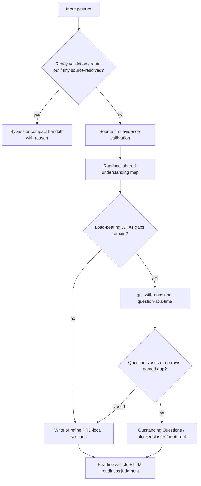
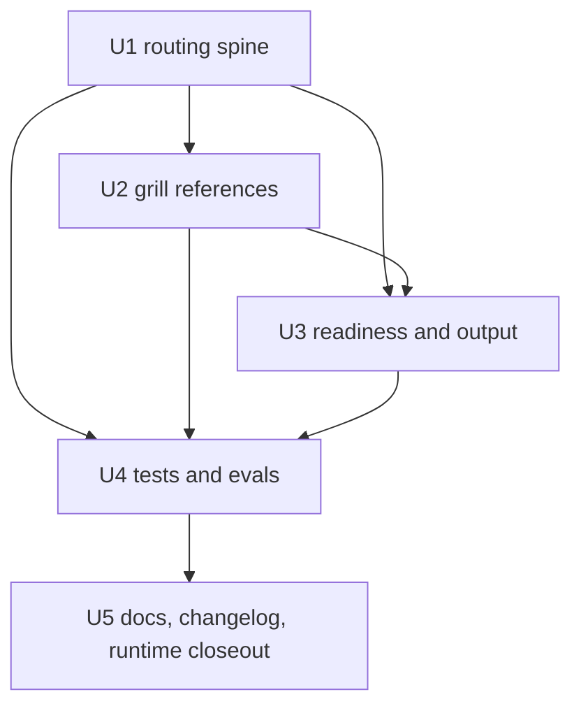

# refactor: spec-prd grill-first 需求澄清

## 概要

本计划把 `spec-prd` 对 `pure-text`、`reference-claims`、`draft` 和 `resume-prd` 输入的默认姿态改成 grill-first：先 source-first 查证，再按 `grill-with-docs` 式一问一答关闭 load-bearing WHAT gaps，最后再写入或更新 durable PRD。实现重点是调整 skill source 和 references 的路由/停止条件，保留 PRD 主 artifact、lazy context/ADR、script-owned facts 与 LLM-owned readiness 的边界。

---

## 决策简报

- **推荐方案：** 用 `skills/spec-prd/SKILL.md` 保留紧凑路由锚点，把详细一问一答机制继续放在 `grill-with-docs-integration.md` 与 domain/readiness references 中；同步 tests、eval fixtures、用户手册和 changelog。
- **关键决策：** 取消固定 `1-3` owner question cap 作为停止条件；停止条件改为 source、owner answer、accepted assumption、Outstanding Question、blocker cluster 或 route-out 已关闭所有 load-bearing WHAT gaps。
- **验证重点：** `tests/unit/spec-prd-contracts.test.js` 的旧 cap 断言、`skills/spec-prd/evals/examples.json` 的 routing fixtures、用户手册中的旧“超过 3 个”描述、以及 runtime mirror 只通过 generator 刷新的 closeout 证据。
- **最大风险/边界：** 最大风险是把 `spec-prd` 变成无限访谈器或第二套 PRD artifact topology。本计划要求每个 owner question 都有 PRD write target，并禁止默认创建 `CONTEXT.md`、ADR、report、schema 或 runtime artifact。

---

## 问题框定

上游 PRD 明确指出，当前 `$spec-prd` 虽然已经集成 `grill-with-docs` 思想，但 normal mode 仍保留 compact/bounded 路径和 `1-3` 问 cap，导致 pure-text 或 reference-claims 场景可能过早写出 PRD。用户期望 `$spec-prd` 更完整地参考 `grill-with-docs`：在 durable PRD 写入前，先 source-first 校准事实，再围绕 actor、flow、state、exception、acceptance、scope、permission、release-slice、术语和决策依赖逐个澄清，直到 `spec-plan` 不需要发明 WHAT。

本计划只定义 HOW。WHAT 以 origin PRD 为准，不重新设计输入 posture、context/ADR 策略或 readiness 语义。

---

## 需求

- R1. 针对 `pure-text`、`reference-claims`、`draft` 和 `resume-prd`，默认进入 grill-first clarification；ready validation、明确 route-out 和 tiny/source-resolved bypass 保持例外。（origin R-02, R-12, AE-02, AE-12）
- R2. Grill-first 必须 source-first；能由 repo source、docs、tests、contracts、既有 PRD、glossary 或 ADR-like artifact 回答的问题不得转问 owner。（origin R-03, AE-03）
- R3. Owner question 必须一问一答、等待反馈、带 recommended answer、consequence 和 PRD write target。（origin R-04, AE-04）
- R4. 固定 `1-3` cap 不再是 targeted posture 的停止条件；停止条件是所有 load-bearing WHAT gaps 被 source、owner、accepted assumption、Outstanding Question、blocker 或 route-out 关闭。（origin R-05, AE-05）
- R5. 新建 PRD 在 scope、acceptance、terminology 和 boundary 关键分支闭合前不写 durable file；先维护 run-local shared understanding map。Resume/refine 可增量写入已确认或明确 assumption 的内容。（origin R-06, R-07, AE-06, AE-07）
- R6. Context/ADR 继续 lazy；不默认创建 `CONTEXT.md`、`CONTEXT-MAP.md` 或 `docs/adr/**`，且任何辅助 context/ADR 决策必须同步进入 PRD-local sections。（origin R-10, R-11, AE-10, AE-11）
- R7. 实现必须保留 `$spec-prd` brownfield PRD workflow 身份，不新增 public grill workflow、interview transcript artifact 或 planning workflow。（origin R-01, AE-01）
- R8. Contract/eval coverage 必须覆盖 grill-first routing、no fixed cap、非数值 progress contract、source-first owner-question avoidance trace shape、terminology challenge、scenario stress、low-value question filtering、implementation-ready/direct route-out bypass、lazy context/ADR、run-local map write timing 和 compact/tiny bypass exceptions。（origin R-08, R-09, R-13, R-14, NFR-02, AE-08, AE-09, AE-13, AE-14, AE-18）
- R9. Source 变更必须更新 `CHANGELOG.md`，报告 per-host generated runtime mirror 状态，并在 source prose behavior 改变时执行 fresh-source eval；只有 checklist-backed 不可执行原因、未覆盖 acceptance examples 和 residual risk 都写清时才允许 `not_run`。（origin R-15, R-16, AE-15, AE-16）
- R10. Hot path 保持紧凑：`SKILL.md` 只保留稳定路由锚点，详细 grill mechanics 留在 references 和 eval fixtures 中。（origin NFR-01, AE-17）

**Origin actors:** Product owner / user, PRD workflow orchestrator, `spec-prd` maintainer, `spec-plan`, future reviewer。
**Origin flows:** FS-01 grill-first routing posture, FS-02 owner question cadence and closure, FS-03 PRD write timing and run-local map, FS-04 context/ADR lazy topology, FS-05 verification/eval/source-runtime governance。
**Origin acceptance examples:** AE-01..AE-18 全部作为实现约束；NA-01..NA-07 作为 negative acceptance。

---

## 范围边界

- 不实现本计划中的 source changes；implementation 由后续 `$spec-work` 执行。
- 不手改 generated runtime mirrors；source 变更后可按 closeout 需要通过 generator 投影，并报告 `.claude/**`、`.codex/**`、`.agents/skills/**` 的 generated runtime mirror 状态。
- 不新增 public `$grill-prd`、`$spec-grill`、agent、CLI command、schema 或 report artifact。
- 不把 `CONTEXT.md`、`CONTEXT-MAP.md`、ADR 或 glossary 变成 PRD readiness 前置条件。
- 不让脚本判断 semantic PRD completeness；脚本和 tests 只检查 deterministic facts、anchors、fixtures 和 trace shape。
- 不把 owner interview transcript 作为 durable planning source；PRD-local sections 仍是 `spec-plan` 直接输入。

### 延迟到后续工作

- 跨 skill 的统一 clarification/eval schema：只有出现多个 consumer 时另开 contract-backed 计划。
- Provider-backed model eval：需要独立样本、judge 标准和人工 adjudication，不在本计划内。
- 全仓 runtime drift 治理：本计划只要求本次 source 变更后的 runtime projection closeout，不新增 repo-wide drift system。

---

## 完成标准

- `skills/spec-prd/SKILL.md` 对 targeted postures 明确默认 grill-first，并把 compact/bounded 改为 tiny/source-resolved/ready validation exception。
- `domain-language-and-decision-ledger.md`、`grill-with-docs-integration.md`、readiness/output references 不再把固定 `1-3` cap 作为 load-bearing closure 的正常停止条件。
- 每个 owner question 都有非数值 progress contract：绑定 `gap id`、source attempt、PRD write target 和 closure state；无法关闭或缩窄命名 gap 时停止访谈并输出 blocker、route-out 或 Outstanding Question。
- 新建 PRD write timing 明确为 run-local map 先闭合关键分支，durable PRD 后写；resume/refine 的增量写入只允许 confirmed 或 labeled assumption。
- Implementation-ready/direct route-out 与 tiny/source-resolved bypass 的 reason、edge cases 和测试覆盖明确，不被误写成默认 compact shortcut。
- Context/ADR lazy topology 和 PRD-local persistence 在 references、tests、eval fixtures 和用户文档中一致。
- `tests/unit/spec-prd-contracts.test.js`、`tests/unit/eval-fixture-contracts.test.js` 与 `skills/spec-prd/evals/examples.json` 覆盖新 routing/cap/write-timing/lazy-topology 语义。
- `CHANGELOG.md` 记录 source surface、验证命令、fresh-source eval 状态和 `.claude/**`、`.codex/**`、`.agents/skills/**` generated runtime mirror 状态。

---

## 直接证据准备度

- target_repo: `spec-first`
- evidence_sources: origin PRD direct read、bounded source reads、targeted `rg`、`git status --short`、`git rev-parse --short HEAD`、`task-governance-signals` advisory output、plan template/reference reads、role contract read
- source_refs:
  - `docs/brainstorms/2026-06-23-005-refactor-spec-prd-grill-first-clarification-requirements.md`
  - `docs/10-prompt/结构化项目角色契约.md`
  - `docs/contracts/governance/task-governance-signals.md`
  - `skills/spec-prd/SKILL.md`
  - `skills/spec-prd/references/domain-language-and-decision-ledger.md`
  - `skills/spec-prd/references/evidence-and-topology.md`
  - `skills/spec-prd/references/grill-with-docs-integration.md`
  - `skills/spec-prd/references/prd-output-template.md`
  - `skills/spec-prd/references/prd-readiness-lens.md`
  - `skills/spec-prd/evals/examples.json`
  - `tests/unit/spec-prd-contracts.test.js`
  - `docs/05-用户手册/22-PRD需求文档质量增强流程.md`
  - `CHANGELOG.md`
- current_revision: `72e5e544`
- worktree_status: dirty；当前已有 `CHANGELOG.md` 修改、两个未跟踪 PRD，以及本计划新增文件
- confidence: 高；origin PRD 已 ready-for-planning，source evidence 明确旧 cap anchors 和需要同步的 test/eval/docs surfaces
- limitations: 未执行 `spec-doc-review` workflow；当前 Codex 会话没有可调用的 workflow dispatcher。未读取或修改 generated runtime mirrors。

---

## 直接证据

- repo_scope: 单仓库 `spec-first`
- source_reads_completed:
  - Origin PRD 明确 settled WHAT：target postures、source-first、no fixed cap、run-local map write timing、lazy context/ADR、PRD-local persistence、source/runtime boundary。
  - `skills/spec-prd/SKILL.md` 当前仍含 “normal 1-3 question cap” 与 material-gaps 才 deep clarification 的旧 wording anchor。
  - `domain-language-and-decision-ledger.md` 当前包含 `Use 1-3 concrete scenarios`、normal run `1-3` cap、超过 3 个问题再切 `grill-with-docs` 的旧 stop semantics。
  - `grill-with-docs-integration.md` 已具备 one-question-at-a-time、recommended answer、source-first lookup、lazy context/ADR 和 PRD-local persistence，是应被提升为 targeted posture 默认行为的细节 source。
  - `tests/unit/spec-prd-contracts.test.js` 和 `skills/spec-prd/evals/examples.json` 锁定了旧 `question cap`、`normal cap exceeded`、`compact-prd-output-shape` 等 fixtures，需要同步更新。
  - 用户手册 `docs/05-用户手册/22-PRD需求文档质量增强流程.md` 仍有 “超过 3 个 load-bearing gaps” 和 “普通 run 最多 1-3 个” 的用户可见描述。
- source_reads_required:
  - 实现前重读目标 files 的最新 diff，避免覆盖 origin PRD、004 PRD 或其他并行修改。
  - 如果 implementation 发现 `check-prd-artifact.js` 或 glossary drift 语义被误用，再读取对应脚本；默认不改脚本语义。
  - Fresh-source eval 前读取 `docs/contracts/workflows/fresh-source-eval-checklist.md`。
- commands_or_tools_used:
  - `git status --short`
  - `git rev-parse --short HEAD`
  - `ls docs/plans`
  - `rg -n "1-3|question cap|grill-with-docs|normal cap|requirements-grill|compact-prd-output-shape|bounded-scenario|pre-prd|source-first|deep-grill|progressive-detail" ...`
  - `node bin/spec-first.js internal task-governance-signals --source plan-declared --input <temp-json> --json`
- impact_on_plan:
  - `task-governance-signals` returned `candidate_level=deep` with `collection_status=ok`, `risk_domains=["contract","workflow"]`, and reason codes including `critical-path-hit` and `many-files-or-paths`; this plan accepts Deep depth while keeping the implementation split to five bounded units.
  - Source evidence supports changing prompt/reference/test/doc surfaces, not CLI schema or artifact topology.
- limitations:
  - `task-governance-signals` is advisory; depth is final LLM judgment based on origin PRD and direct source reads.
  - No external research was used because the work is local workflow/source governance, not framework/API usage.

---

## 上下文与研究

### 相关代码与模式

- `skills/spec-prd/SKILL.md` should remain the concise orchestration spine with `Reference Trigger Map` anchors rather than absorbing the full `grill-with-docs` manual.
- `skills/spec-prd/references/domain-language-and-decision-ledger.md` owns Domain Grill / Pre-PRD Clarification cadence and should be the main source for no-fixed-cap stop semantics.
- `skills/spec-prd/references/grill-with-docs-integration.md` already owns sustained one-question-at-a-time behavior, recommended answers, source-first session rules, context/ADR lazy topology and PRD-local persistence.
- `tests/unit/spec-prd-contracts.test.js` is the right focused contract test surface for wording anchors and eval fixture semantics.
- `skills/spec-prd/evals/examples.json` is examples-as-context/advisory coverage, not a semantic proof system.

### 组织经验

- `docs/10-prompt/结构化项目角色契约.md` 要求 Light contract、Explicit boundaries、Scripts prepare / LLM decides、source/runtime separation。该原则直接约束本计划：不新增 hard semantic script，不手改 generated mirrors，不把 `grill-with-docs` 复制成第二 public workflow。
- `CHANGELOG.md` 顶部格式要求任何 source/docs/test 变更都记录用户可见影响、验证状态和 runtime mirror 状态。

### 外部参考

- 未使用。该计划完全基于本仓 origin PRD、skill source、tests、用户文档和治理契约。

---

## 关键技术决策

- KTD1. `SKILL.md` 只写 stable routing anchor，详细 mechanics 留在 references。原因是 hot path 需要可读，且 NFR-01 明确避免把 `SKILL.md` 膨胀成完整访谈手册。
- KTD2. Grill-first 是 targeted input posture 的默认 clarification posture，不是新的 public workflow。原因是 PRD chain 仍为 `docs/brainstorms/*-requirements.md` -> plan -> tasks -> work -> review -> knowledge。
- KTD3. 停止条件改为 load-bearing WHAT closure，而非问题数量。原因是固定 cap 会让 `spec-plan` 重新发明 acceptance、scope、terminology 或 boundary。
- KTD4. New PRD write timing 采用 run-local shared understanding map 先闭合、durable file 后写。原因是半成品 PRD 会造成错误 source-of-truth；resume/refine 则已有 durable artifact，可增量写入 confirmed/labeled content。
- KTD5. Context/ADR 保持 lazy 且 PRD-local persistence 必须存在。原因是 auxiliary docs 可帮助长期术语/决策沉淀，但不能成为 planning 恢复要求的唯一来源。
- KTD6. Tests/evals 锁定 prompt/source anchors 和 fixtures，不宣称语义 completeness。原因是 readiness 仍由 LLM 基于 confirmed facts 判断。
- KTD7. Runtime projection 属于 closeout 验证，不属于 source edit。原因是 `.claude/**`、`.codex/**`、`.agents/skills/**` 是 generated mirrors，只能通过 `spec-first init` 等 generator 更新。

---

## 开放问题

### 规划阶段已解决

- 是否直接改 `skills/spec-prd/**`？不。当前阶段只产出 plan；implementation 由 `$spec-work` 执行。
- 是否新增 public grill workflow？不。Origin PRD 明确保持 `$spec-prd` workflow identity。
- 是否修改 `check-prd-artifact.js`？默认不改。脚本只产 deterministic artifact facts，不负责 deep clarification semantic completeness。
- 是否同步用户手册？是。默认交互语义对用户可见，用户手册中的旧 cap 描述需要同步。

### 延迟到实现阶段

- Exact wording：实现时基于当前 source diff 选择最小 wording，避免大段重写。
- Eval fixture 形态：优先改写现有 `requirements-grill-question-cap`、`bounded-scenario-grill-permission-edge` 等 cases；只有缺口无法表达时新增 case。
- Fresh-source eval：若 skill prose 行为语义改变，收口阶段应执行 fresh-source eval；如果当前 host 无 dispatcher，记录 `not_run` 原因。
- Runtime refresh：source 修改后是否运行 `node bin/spec-first.js init --codex -y` 由 implementation closeout 决定，并必须报告结果。

---

## 高层技术设计

> 以下内容只说明预期方案形态，作为评审方向参考，不是实现规格。实现 agent 应把它当作上下文，而不是要逐字复现的代码。

Unit dependency overview:

---

## 实施单元

### U1. 更新 `spec-prd` 路由主干

**目标：** 让 `SKILL.md` 对 targeted postures 默认 grill-first，并把 compact/bounded 描述收窄为明确例外。

**需求：** R1, R2, R4, R7, R10

**依赖：** 无

**文件：**
- 修改：`skills/spec-prd/SKILL.md`

**方案：**
- 在 `Reference Trigger Map` 和 Phase 2 / Domain Grill anchors 中明确：`pure-text`、`reference-claims`、`draft`、`resume-prd` 默认先 source-first calibration，再使用 `grill-with-docs-integration.md` 关闭 load-bearing WHAT gaps。
- 移除或重写 “normal 1-3 question cap” 作为停止条件的措辞；保留一问一答、recommended answer、write target 和 loud fallback。
- 将 compact/bounded 定义为 tiny、ready validation、implementation-ready/direct route-out 或 fully source-resolved exception，并要求输出 reason。

**执行提示：** U1 只改路由主干 prose 和断言意图；`tests/unit/spec-prd-contracts.test.js` 的实际重写集中到 U4，避免同一测试文件在多个实施单元里被反复改写。

**参考模式：**
- 当前 `SKILL.md` 的 `Reference Trigger Map` 渐进披露结构。
- Origin PRD 的 Change Delta 和 Requirements R-01..R-05。

**测试场景：**
- Happy path：`pure-text` with anchored target but missing acceptance -> expected default grill-first before PRD write。
- Edge case：tiny docs typo / already planning-ready validation -> compact or bypass remains allowed with reason。
- Edge case：implementation-ready/direct route-out -> bypass grill-first only when reason is explicit and downstream `spec-plan` will not invent WHAT。
- Error path：missing product/system anchor -> route to brainstorm or blocker, not grill indefinitely。
- Integration：contract test fails if `SKILL.md` still claims normal runs cap load-bearing closure at `1-3` questions。

**验证：**
- U4 的 contract tests 将锁定 routing anchors 与 new no-fixed-cap semantics。
- `SKILL.md` 不新增 host-only frontmatter 或 runtime-only metadata。

---

### U2. 对齐 Domain Grill 与 `grill-with-docs` references

**目标：** 把 detailed clarification mechanics 统一到 source references，消除 old cap / over-cap trigger wording 的冲突。

**需求：** R2, R3, R4, R6, R10

**依赖：** U1

**文件：**
- 修改：`skills/spec-prd/references/domain-language-and-decision-ledger.md`
- 修改：`skills/spec-prd/references/evidence-and-topology.md`
- 修改：`skills/spec-prd/references/grill-with-docs-integration.md`

**方案：**
- 将 `Use 1-3 concrete scenarios`、`Ask no more than 1-3`、`more than 3 load-bearing questions` 等 wording 改为 “问到 closure，但每次只问一个有 write target 的 load-bearing question”。
- 增加非数值 progress contract：每个 owner question 必须绑定 `gap id`、source attempt、PRD write target 和 closure state（`closed` / `narrowed` / `accepted assumption` / `Outstanding Question` / `blocker` / `route-out`）。如果下一问不能关闭或缩窄命名 gap，或只扩张范围而不影响当前 release slice，则停止访谈并输出 blocker cluster 或 deferred Outstanding Questions。
- 在 domain reference 中保留 source-first、glossary challenge、fuzzy term sharpening、scenario stress、code contradiction、decision capture 七类动作，但限制在会影响 PRD write target 或 readiness 的 gaps；显式过滤低价值问题和与当前 release slice 无关的扩张性追问。
- 在 `grill-with-docs-integration.md` 中澄清：它是 targeted posture 默认 detailed clarification mode，不要求用户显式点名，也不是 standalone artifact topology。
- `evidence-and-topology.md` 的 owner question ladder 改为 source-first triage 后一问一答，不再把 “超过三问” 本身作为模式切换的核心判断。

**参考模式：**
- `grill-with-docs-integration.md` 现有 Source-First Session Rules、Context/ADR Topology Adapter 和 PRD-local persistence sections。
- Origin PRD AE-03..AE-05、AE-08..AE-11。

**测试场景：**
- Happy path：source-answerable behavior gap is resolved from source and not asked as owner question。
- Edge case：fuzzy term affects multiple PRD sections -> challenge canonical term and persist decision PRD-locally。
- Edge case：scenario stress reveals an exception path that affects acceptance -> ask one write-targeted owner question and persist closure state。
- Error path：owner question without PRD write target is rejected by contract wording/fixture expectation。
- Error path：next question would only expand scope without changing current release slice -> stop and defer rather than continue interviewing。
- Integration：context/ADR updates remain lazy and supporting; PRD-local closure remains mandatory.

**验证：**
- `rg "1-3|more than 3|normal cap"` on changed `skills/spec-prd/**` only finds historical or explicitly deprecated references, not active stop rules。
- U4 contract tests assert one-question-at-a-time without fixed-count cap and source-first owner-question avoidance。

---

### U3. 更新 readiness 与 PRD output 写入时机

**目标：** 让 readiness lens 和 output template 明确 run-local map、durable PRD write timing、resume/refine 写入边界和 PRD-local persistence。

**需求：** R5, R6, R8

**依赖：** U1, U2

**文件：**
- 修改：`skills/spec-prd/references/prd-readiness-lens.md`
- 修改：`skills/spec-prd/references/prd-output-template.md`

**方案：**
- Readiness lens 明确：run-local shared understanding map 本身不是 readiness evidence；closure 需要体现在 PRD-local sections、accepted assumptions、Outstanding Questions、blocker cluster 或 route-out。
- Output template 明确 new PRD 在关键 scope/acceptance/terminology/boundary 关闭后写入；resume/refine 可边澄清边写，但每次写入必须标注 confirmed source、owner answer 或 assumption。
- Closeout Summary 需要能报告 lazy context/ADR updates 及其 PRD-local reflection，但不要求 auxiliary docs 存在。
- Readiness lens 明确 implementation-ready/direct route-out 是 route-out 或 compact bypass 的例外路径，必须带 reason，不能掩盖尚未闭合的 load-bearing WHAT gaps。

**参考模式：**
- Origin PRD 的 Producer / Artifact / Consumer、Source-Of-Truth Resolution 和 AE-06..AE-13。
- `prd-output-template.md` 现有 core/conditional PRD sections。

**测试场景：**
- Happy path：new PRD with closed grill questions writes Decision Notes / Glossary / Evidence And Assumptions before ready-for-planning。
- Edge case：resume-prd updates an existing PRD incrementally, but each update is confirmed or labeled assumption。
- Edge case：implementation-ready/direct route-out reports reason and bypasses grill only when downstream planning input is already sufficient。
- Error path：unresolved load-bearing grill question blocks `ready-for-planning` even if section presence scripts pass。
- Integration：lazy `CONTEXT.md` term update is also reflected in PRD Glossary or Decision Notes。

**验证：**
- U4 contract tests cover new PRD pre-write boundary、resume/refine exception 和 route-out/bypass reason。
- No script is asked to decide semantic readiness。

---

### U4. 更新 contract tests 与 eval fixtures

**目标：** 用 focused tests 和 examples-as-context 锁定新行为，替换旧 `1-3 question cap` 期望。

**需求：** R1, R2, R3, R4, R6, R8

**依赖：** U1, U2, U3

**文件：**
- 修改：`tests/unit/spec-prd-contracts.test.js`
- 修改：`skills/spec-prd/evals/examples.json`

**方案：**
- 改写旧断言：`Use 1-3 concrete scenarios`、`1-3 question cap`、`normal cap exceeded` 不再作为 expected active behavior。
- 更新 `compact-prd-output-shape`：保留 tiny/source-resolved bypass，但不能表达为 rough inputs 默认 “no long owner interview”。
- 更新 `bounded-scenario-grill-permission-edge`：从 `1-3 question cap` 改为 “one-question-at-a-time, write-targeted, stop at closure”。
- 更新 `requirements-grill-question-cap`：从 “cap exceeded triggers deep mode” 改为 “fixed cap absent; targeted postures continue until closure or explicit blocker/route-out”。
- 增补或改写 cases：grill-first pure-text、reference-claims source-first、source-answerable fact does not become owner question、resume-prd incremental confirmed write、implementation-ready/direct route-out with reason、lazy context/ADR no-ceremony、run-local map before new PRD write。
- 增加负向 trace/fixture 形状：当 source 存在可回答事实时，expected trace 必须包含 source ref 或 source lookup marker，owner question 字段为空或不得包含该事实问题；若继续问 owner，只允许产品/范围/验收/术语/边界决策问题，并带 PRD write target。
- 将 `tests/unit/spec-prd-contracts.test.js` 的实际修改集中在本单元；U1-U3 只声明断言意图。若采用 TDD，可在 U1-U3 留最小 failing expectation，但最终 test/eval harmonization 由 U4 完成。

**参考模式：**
- 现有 `expectEvalCase`、`expectCoverageTags`、`expectQualityBuckets` helper。
- `skills/spec-prd/evals/examples.json` 中 `pre-prd-clarification-loop-trigger`、`requirements-grill-source-first`、`deep-grill-closure-blocks-readiness`。

**测试场景：**
- Happy path：eval fixture for pure-text missing acceptance expects grill-first before durable PRD write。
- Edge case：source-first fixture expects source lookup before owner question。
- Edge case：implementation-ready/direct bypass fixture distinguishes route-out from compact bypass and requires a reason。
- Error path：fixed-count cap expectation is absent; unresolved load-bearing gaps block readiness。
- Error path：owner question asks a source-answerable fact -> fixture/contract fails。
- Integration：tests cover source prose anchors and eval fixtures in the same suite, preventing source/eval drift。

**验证：**
- `npx jest tests/unit/eval-fixture-contracts.test.js tests/unit/spec-prd-contracts.test.js --runInBand` passes。
- `node skills/spec-prd/scripts/run-evals.js --json` passes after fixture updates。

---

### U5. 同步用户文档、changelog、runtime 与 fresh-source closeout

**目标：** 收口用户可见文档、变更记录、runtime projection 和 behavior-eval 证据。

**需求：** R1, R2, R3, R4, R6, R8, R9

**依赖：** U4

**文件：**
- 修改：`docs/05-用户手册/22-PRD需求文档质量增强流程.md`
- 修改：`CHANGELOG.md`
- 按 final old-cap audit 命中决定是否修改：`README.md`
- 按 final old-cap audit 命中决定是否修改：`README.zh-CN.md`
- 可选新增：`docs/validation/spec-prd/fresh-source-eval-2026-06-23-grill-first-clarification.md`

**方案：**
- 用户手册移除 “超过 3 个 load-bearing gaps” 和 “普通 run 最多 1-3 个” 作为现行语义的描述，改为 targeted postures 默认 grill-first、source-first、one-question-at-a-time、closure-based stop。
- Changelog 记录 source files、用户可见行为变化、验证命令、generated runtime mirror 状态和 fresh-source eval 状态。
- 若 source prose behavior 改变，必须执行 fresh-source eval；只有 `docs/contracts/workflows/fresh-source-eval-checklist.md` 确认当前 host 缺少可用 fresh eval 路径时才允许 `not_run`。`not_run` 必须包含 checklist path、不可执行原因、未覆盖 acceptance examples 和 closeout residual risk。
- 如果创建 `docs/validation/spec-prd/fresh-source-eval-2026-06-23-grill-first-clarification.md`，该文件只作为 optional closeout evidence，不是 workflow 输出、planning source 或新增 report artifact。
- Source 改完后按需要运行 runtime projection，例如 `node bin/spec-first.js init --codex -y`，并以 per-host matrix 报告 `.claude/**`、`.codex/**`、`.agents/skills/**` 的 `refreshed` / `stale-reported` / `not-present` / `intentionally-skipped` 状态、命令、原因和风险；如果只刷新 Codex，必须声明其他 mirrors 未交付新行为。
- 执行 final old-cap audit：对 `skills/spec-prd/**`、`skills/spec-prd/evals/examples.json`、`tests/unit/spec-prd-contracts.test.js`、用户手册、`README.md`、`README.zh-CN.md` 中的 `1-3|more than 3|question cap|normal cap` 做最终 `rg`；每个残留命中必须标注 historical/deprecated 或移除。

**参考模式：**
- `CHANGELOG.md` 顶部 compact 条目格式。
- `docs/contracts/workflows/fresh-source-eval-checklist.md`。
- 既有 `docs/validation/spec-prd/fresh-source-eval-2026-06-22-requirements-grill.md`。

**测试场景：**
- Happy path：用户手册和 skill source 描述相同 default posture 和 stop semantics。
- Edge case：manual still documents tiny/source-resolved bypass and route-out exceptions。
- Error path：runtime mirror stale is reported or regenerated, not patched manually。
- Error path：old cap anchor remains in a user-facing or fixture path without historical/deprecated label -> closeout fails。
- Integration：fresh-source eval or explicit not-run reason appears in closeout。

**验证：**
- `git diff --check -- CHANGELOG.md docs/05-用户手册/22-PRD需求文档质量增强流程.md skills/spec-prd/SKILL.md skills/spec-prd/references/domain-language-and-decision-ledger.md skills/spec-prd/references/evidence-and-topology.md skills/spec-prd/references/grill-with-docs-integration.md skills/spec-prd/references/prd-output-template.md skills/spec-prd/references/prd-readiness-lens.md skills/spec-prd/evals/examples.json tests/unit/spec-prd-contracts.test.js`
- `npx jest tests/unit/eval-fixture-contracts.test.js tests/unit/spec-prd-contracts.test.js tests/unit/changelog-format.test.js --runInBand`
- `node skills/spec-prd/scripts/run-evals.js --json`
- `rg -n "1-3|more than 3|question cap|normal cap" skills/spec-prd/** tests/unit/spec-prd-contracts.test.js docs/05-用户手册/22-PRD需求文档质量增强流程.md README.md README.zh-CN.md`
- 可选非阻塞：仅当本地已有确定性 validator、且不会引入新 schema、remote judge 或 provider eval 时，运行 skill-creator quick validate for `skills/spec-prd`。

---

## 系统影响

- **Workflow surface:** `$spec-prd` 入口不变；rough targeted inputs 的默认交互更主动，用户会更常看到一问一答 clarification。
- **PRD artifact:** `docs/brainstorms/*-requirements.md` 仍是 planning handoff 主 artifact；run-local map 不成为新 durable schema。
- **Context/ADR:** 可作为 lazy supporting docs，但不成为 readiness 前置或 planning 恢复要求。
- **Testing/eval:** Contract tests 和 eval examples 将从 old cap semantics 转向 closure-based semantics。
- **Runtime delivery:** Source changes 需要通过 generator 投影；generated mirrors 不作为 source 修改面。
- **Downstream consumers:** `spec-plan` 应得到更少 hidden assumptions 的 PRD，但仍要把 unresolved blockers/Outstanding Questions 当作 planning handoff boundary。

---

## 备选方案

- **只解释旧触发条件，不改 source：** 拒绝。用户明确要求 `$spec-prd` 完全参考 `grill-with-docs` 并先详细澄清，PRD 已将此沉淀为 P0 behavior。
- **把 `grill-with-docs` 全量复制进 `SKILL.md`：** 拒绝。会破坏 hot path compactness，并与 NFR-01 冲突。
- **新增 semantic readiness script 或 schema：** 拒绝。脚本只能产 facts，不能判断 PRD semantic completeness。
- **默认创建 `CONTEXT.md`/ADR：** 拒绝。违背 origin R-10 和 source/runtime/artifact topology 边界。

---

## 风险与依赖

| 风险 | 缓解 |
|------|------|
| 交互成本上升，被误解为无限访谈 | 每个问题必须绑定 `gap id`、source attempt、PRD write target 和 closure state；无可负责提问序列或下一问无法缩窄命名 gap 时输出 blocker/route-out/Outstanding Question |
| Source-first 变成形式主义，仍问 owner 可查事实 | U2/U4 用 source-first fixtures 和 tests 锁定 owner-question avoidance |
| 术语挑战、场景压力和低价值问题过滤被遗漏 | U2/U4 将 fuzzy term、scenario stress 和 low-value question filtering 作为一等 coverage，而非隐藏在 no fixed cap 里 |
| Implementation-ready/direct bypass 被误用成 compact shortcut | U1/U3/U4/U5 要求 reason、edge case 和用户文档同步，明确它是 route-out 或 tiny/source-resolved exception |
| Context/ADR lazy 被实现成默认 ceremony | U2/U3/U5 同步 lazy-only wording，tests 覆盖 no-ceremony case |
| Tests 继续锁旧 `1-3` cap | U4 明确替换旧断言和 eval cases |
| 旧 cap anchor 残留在用户文档或 fixtures | U5 final old-cap audit 覆盖 skill、eval、contract test、用户手册和 README；残留必须标注 historical/deprecated 或移除 |
| Runtime mirrors 与 source 漂移 | U5 要求 per-host runtime matrix，报告 `.claude/**`、`.codex/**`、`.agents/skills/**` 各自状态 |
| Fresh-source eval 被廉价跳过 | U5 将 behavior-prose 变更的 fresh-source eval 作为必须 closeout；`not_run` 需要 checklist-backed 原因、未覆盖 examples 和 residual risk |
| 并行未提交 PRD/CHANGELOG 改动被覆盖 | Implementation 前重跑 `git status --short` 并只改本计划声明 files |

---

## 文档与运行说明

- 用户手册必须同步，因为默认交互行为对 `$spec-prd` 使用者可见。
- Changelog 条目需要标注 `(user-visible)`，因为 rough PRD / pure-text 输入的默认澄清体验会改变。
- Fresh-source eval 是 behavior-prose 变更的必须 closeout；如果 checklist 确认当前 host 无法执行，必须用 `not_run` 明确说明原因、未覆盖 examples 和 residual risk。
- Runtime closeout 必须逐 host 报告 mirror 状态；只刷新 Codex 时要明确 Claude 与 standalone mirrors 是否 stale、not-present 或 intentionally-skipped。
- `skill-creator quick validate` 不作为 P0 closeout gate；只有在本地确定性、非 provider、非 schema 扩展的条件下可作为非阻塞补充验证。
- 后续执行本计划时，不要把 current session cached skill 行为当验证结果；验证 source file 和 focused tests。

---

## 来源与参考

- Origin PRD: `docs/brainstorms/2026-06-23-005-refactor-spec-prd-grill-first-clarification-requirements.md`
- Role contract: `docs/10-prompt/结构化项目角色契约.md`
- Target skill source: `skills/spec-prd/SKILL.md`
- Target references: `skills/spec-prd/references/domain-language-and-decision-ledger.md`, `skills/spec-prd/references/evidence-and-topology.md`, `skills/spec-prd/references/grill-with-docs-integration.md`, `skills/spec-prd/references/prd-output-template.md`, `skills/spec-prd/references/prd-readiness-lens.md`
- Eval fixtures: `skills/spec-prd/evals/examples.json`
- Contract tests: `tests/unit/spec-prd-contracts.test.js`
- User docs: `docs/05-用户手册/22-PRD需求文档质量增强流程.md`

## Completion Evidence

本计划已完成并标记 `status: completed`。实现范围覆盖 `skills/spec-prd/SKILL.md`、相关 references、eval fixtures、contract tests、用户手册、CHANGELOG 和 fresh-source eval 记录；`$spec-prd` targeted rough inputs 已改为 source-first grill-first clarification，固定 owner-question count 不再作为停止条件。

验证已通过：`npx jest tests/unit/eval-fixture-contracts.test.js tests/unit/spec-prd-contracts.test.js tests/unit/changelog-format.test.js --runInBand`、`node skills/spec-prd/scripts/run-evals.js --json`、old-cap audit、`git diff --check` 和 `python3 /Users/kuang/.codex/skills/.system/skill-creator/scripts/quick_validate.py skills/spec-prd`。Fresh-source eval 记录见 `docs/validation/spec-prd/fresh-source-eval-2026-06-23-grill-first-clarification.md`，多 agent 代码审查 findings 已处理；generated runtime mirrors 通过 `node bin/spec-first.js init --claude --codex -y --lang zh` 刷新，未手改 runtime mirrors。Post-init dry-run 仍报告 repo-level `skills_drifted` advisory；`spec-prd` source 与 `.agents/skills/spec-prd/**` 关键 mirror diff clean。
