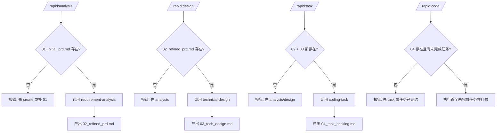
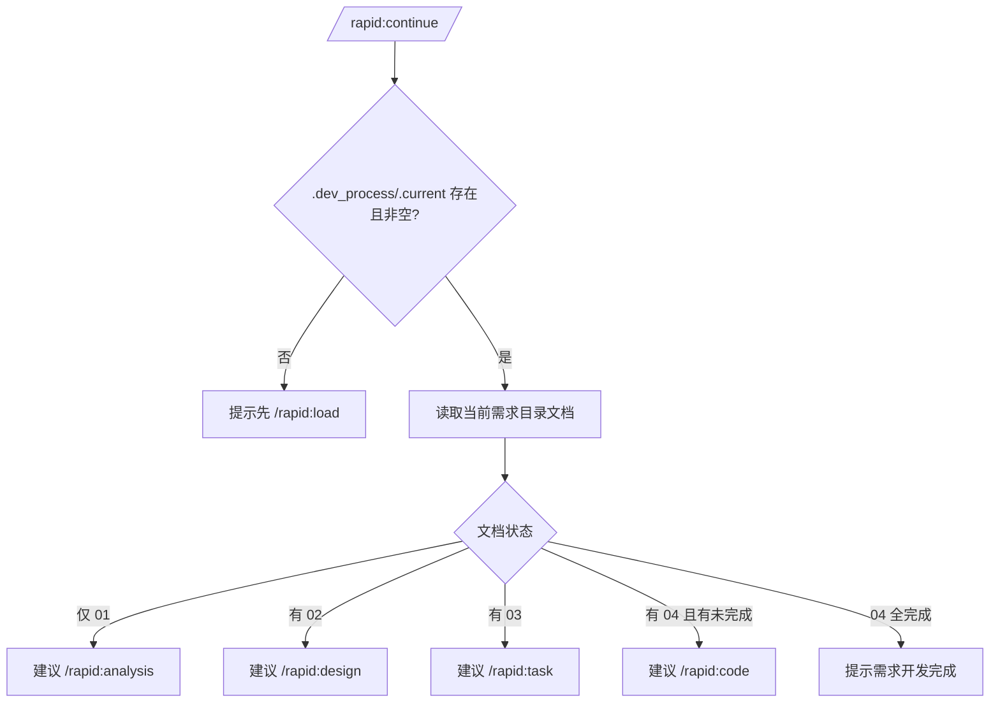
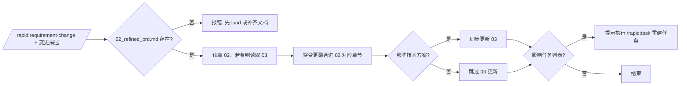

# Rapid 工作流流程图文档

## 1. 核心逻辑概述

Rapid 是一个“文档状态机”工作流：通过 `.dev_process/.current` 指向当前需求目录，再按阶段产出 `01~04` 文档，驱动后续命令执行。

```mermaid
flowchart LR
    A[开始] --> B[/rapid:create 或 /rapid:load 或 /rapid:list]
    B --> C[设置 .dev_process/.current]
    C --> D[01_initial_prd.md]
    D --> E[/rapid:analysis]
    E --> F[02_refined_prd.md]
    F --> G[/rapid:design]
    G --> H[03_tech_design.md]
    H --> I[/rapid:task]
    I --> J[04_task_backlog.md]
    J --> K[/rapid:code]
    K --> L[逐项标记任务为 - [x]]
    C --> M[/rapid:continue 恢复上下文并推荐下一步]
    F --> N[/rapid:requirement-change 融合变更]
    H --> N
    N --> I
```

## 2. 命令前置条件网关



## 3. /rapid:continue 恢复判定流



## 4. /rapid:code 内部执行流（结合 coding-task 规则）

```mermaid
flowchart TD
    A[读取 04_task_backlog.md] --> B[定位第一个 - [ ] 任务]
    B --> C[参考 02 + 03 实施]
    C --> D[代码验证: 语法/导入/Lint/类型]
    D --> E[运行测试]
    E --> F[代码审查: 准确性/性能/安全/可维护性]
    F --> G[任务改为 - [x]]
    G --> H{是否继续下一个任务?}
    H -- 是 --> B
    H -- 否 --> I[结束当前轮]
```

## 5. 需求变更流



## 6. 实现观察

`/rapid:task` 文档中写的是“调用 coding-task skill 进行任务拆解”，但 `coding-task` skill 主体描述偏向“任务执行与审查闭环”。建议后续统一“拆解”和“执行”的职责边界。

## 7. 依据文件

- `/Users/kuang/xiaobu/rapid/commands/rapid/README.md`
- `/Users/kuang/xiaobu/rapid/commands/rapid/create.md`
- `/Users/kuang/xiaobu/rapid/commands/rapid/load.md`
- `/Users/kuang/xiaobu/rapid/commands/rapid/analysis.md`
- `/Users/kuang/xiaobu/rapid/commands/rapid/design.md`
- `/Users/kuang/xiaobu/rapid/commands/rapid/task.md`
- `/Users/kuang/xiaobu/rapid/commands/rapid/code.md`
- `/Users/kuang/xiaobu/rapid/commands/rapid/continue.md`
- `/Users/kuang/xiaobu/rapid/commands/rapid/requirement-change.md`
- `/Users/kuang/xiaobu/rapid/skills/requirement-analysis/SKILL.md`
- `/Users/kuang/xiaobu/rapid/skills/technical-design/SKILL.md`
- `/Users/kuang/xiaobu/rapid/skills/coding-task/SKILL.md`
