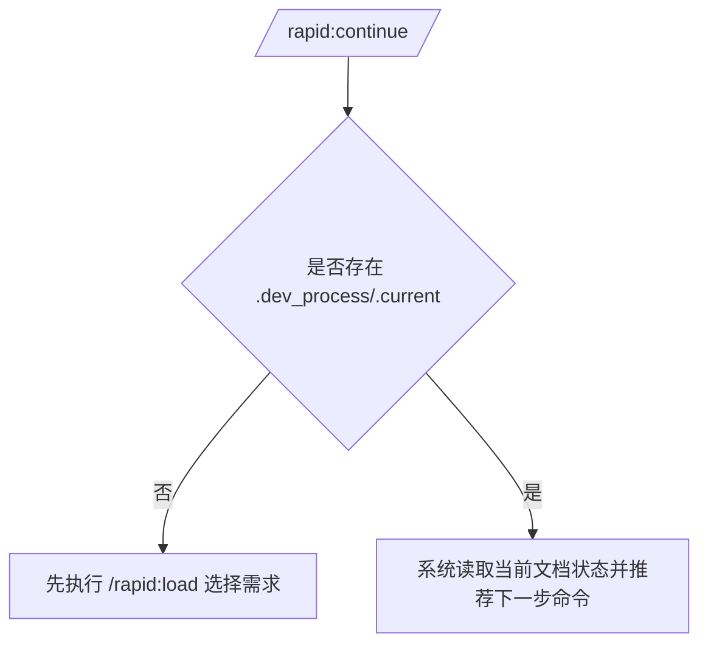
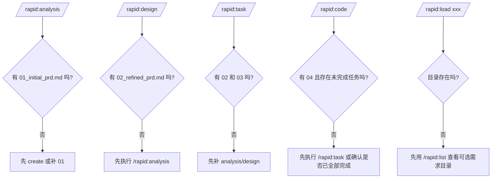

# Rapid 新人上手精简版

## 1. 主流程（只看这个就能开工）

```mermaid
flowchart LR
    A[/rapid:create 新建需求/] --> B[填写 01_initial_prd.md]
    B --> C[/rapid:analysis/]
    C --> D[产出 02_refined_prd.md]
    D --> E[/rapid:design/]
    E --> F[产出 03_tech_design.md]
    F --> G[/rapid:task/]
    G --> H[产出 04_task_backlog.md]
    H --> I[/rapid:code/]
    I --> J[完成一个任务就打勾 - [x]]
```

## 2. 继续开发（中断后恢复）



## 3. 常见错误分支



## 4. 新人操作口诀

1. `create` 建目录，先写 `01`。
2. `analysis -> design -> task -> code` 按顺序走。
3. 中断了就 `continue`。
4. 切需求用 `load`，看不清就 `list`。
5. 变更需求用 `requirement-change`，再视影响重跑 `task`。
