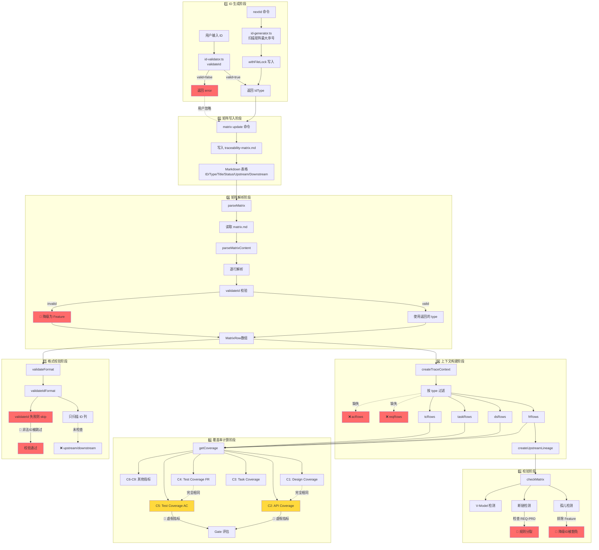

# ID 链路全流程全景图

> 生成日期：2026-03-10
> 范围：从 ID 生成到覆盖率计算的完整数据流
> 目的：可视化问题传播路径，指导修复优先级

---

## 一、全流程概览



---

## 二、关键节点详解

### 节点 1：ID 校验器（id-validator.ts）

**职责**：校验 ID 格式，返回类型识别结果

**输入**：ID 字符串（如 `FR-AUTH-001`）

**输出**：`{ valid: boolean, type?: IdType, error?: string }`

**问题**：
- ❌ 不支持 AC 类型（F-02）
- ❌ 返回结果被调用方误用为降级依据

**代码位置**：`src/core/trace-engine/id-validator.ts:26-38`

---

### 节点 2：矩阵解析器（parseMatrixContent）

**职责**：解析 Markdown 表格为 MatrixRow 数组

**输入**：Markdown 文本

**输出**：`MatrixRow[]`

**问题**：
- 🔴 **F-02**：`const type: IdType = validation.type ?? 'Feature'` 静默降级
- 🔴 **NEW-04**：Feature 语义重载（合法 ID vs 降级目标）

**代码位置**：`src/core/trace-engine/matrix.ts:150-151`

**影响链**：
```
非法 ID → validateId 返回 valid=false
       → parseMatrixContent 降级为 Feature
       → 进入 MatrixRow 数组
       → 被后续所有模块当作"合法 Feature"处理
```

---

### 节点 3：上下文构建器（createTraceContext）

**职责**：按类型过滤 MatrixRow，构建派生索引

**输入**：`MatrixRow[]`

**输出**：`TraceContext { frRows, dsRows, taskRows, tcRows, lineage }`

**问题**：
- ❌ **NEW-05**：缺少 reqRows（REQ 行被忽略）
- ❌ **F-05**：缺少 acRows（AC 覆盖率无法计算）

**代码位置**：`src/core/trace-engine/trace-context.ts:15-29`

**影响链**：
```
REQ 行 → 未被过滤到 reqRows
       → 无法单独统计 REQ 覆盖率
       → C-PRD 由独立 PRD 校验器计算（不依赖 reqRows）
```

**说明**：checkMatrix 直接遍历 rows，不依赖 reqRows；C-PRD 来自 `validatePrd()` 而非矩阵。

---

### 节点 4：矩阵完整性检查（checkMatrix）

**职责**：检测孤儿项、断链、V-Model 违规

**输入**：`MatrixRow[]`

**输出**：`MatrixCheckResult { orphans, brokenChains, vModelPairs, warnings }`

**问题**：
- 🔴 **F-01**：`hasPrd = u.startsWith('REQ-PRD-')` 硬编码，与文档冲突
- 🔴 **NEW-02**：`r.type !== 'Feature'` 排除 Feature，降级 ID 被豁免

**代码位置**：`src/core/trace-engine/matrix.ts:51-77`

**影响链**：
```
非法 ID → 降级为 Feature (节点2)
       → orphan 检测排除 Feature (节点4)
       → 非法 ID 完全隐身
```

---

### 节点 5：覆盖率计算器（getCoverage）

**职责**：计算 C1-C9 九项覆盖率指标

**输入**：`TraceContext`

**输出**：`CoverageMetrics { C1, C2, ..., C9 }`

**问题**：
- 🟡 **NEW-01**：C2 = C1（`calcUpstreamCoverage(frRows, dsRows)` 完全相同）
- 🟡 **F-05**：C5 = C4（AC 覆盖率实际是 FR 覆盖率）

**代码位置**：`src/core/trace-engine/coverage.ts:36-45`

**影响链**：
```
C2 和 C1 逻辑相同 → Gate 评估时 C2 虚假通过
C5 和 C4 逻辑相同 → AC 覆盖率为 0 时仍显示 100%
```

---

### 节点 6：格式校验器（validateIdFormat）

**职责**：校验矩阵中 ID 格式和重复性

**输入**：`traceability-matrix.md` 内容

**输出**：`string[]` 错误列表

**问题**：
- 🔴 **F-04**：只扫描 ID 列（第 1 列），upstream/downstream 未检查
- 🔴 **F-04**：`if (!validateId(id).valid) continue` 跳过非法 ID
- 🟡 **NEW-06**：连字符正则 `/[A-Z]+-[A-Z]+-[A-Z]+-[A-Z0-9]+/` 误报合法 TC

**代码位置**：`src/core/validators/format-validator.ts:80-93`

**影响链**：
```
非法 ID 在 ID 列 → validateId 失败 → continue 跳过 → 不报错
路径污染在 downstream 列 (F-03) → 未扫描 → 不报错
```

---

### 节点 7：trace fix 命令

**职责**：自动修复 TASK 的 downstream 字段

**输入**：已实现的 TASK 行

**输出**：写入文件路径到 downstream

**问题**：
- 🔴 **F-03**：`placeholder = 'src/core/**/${task.id}.ts'` 污染链路字段

**代码位置**：`src/cli/commands/trace.ts:51-59`

**影响链**：
```
trace fix 写入路径 → downstream 混入非 ID 值
                  → validateIdFormat 未检查 downstream (F-04)
                  → 脏数据持久化
```

---

## 三、问题传播路径

### 路径 1：非法 ID 的双重静默

```
用户输入非法 ID (如 AC-AUTH-001)
  ↓
validateId 返回 { valid: false }
  ↓
parseMatrixContent 降级为 Feature (F-02)
  ↓
checkMatrix 排除 Feature 类型 (NEW-02)
  ↓
validateIdFormat 跳过非法 ID (F-04)
  ↓
非法 ID 完全隐身，无任何告警
```

**影响**：用户按文档写 AC ID，系统静默接受但功能失效。

---

### 路径 2：规则源分裂导致的拒绝

```
文档规定：使用 REQ-*，禁止 REQ-PRD-*
  ↓
用户写入 REQ-AUTH-001
  ↓
checkMatrix 检查 hasPrd = u.startsWith('REQ-PRD-') (F-01)
  ↓
未找到 REQ-PRD-* → 报错 "missing REQ-PRD-*"
  ↓
用户困惑：文档说禁止，代码却要求
```

**影响**：文档与代码冲突，用户无所适从。

---

### 路径 3：脏数据流转（链路字段污染）

```
trace fix 写入路径到 downstream (F-03)
  ↓
validateIdFormat 未检查 downstream (F-04)
  ↓
parseMatrix 解析时未校验 downstream 格式
  ↓
链路字段混入非 ID 值（如 src/core/**/*.ts）
  ↓
人工查看矩阵时困惑，自动化工具可能误判
```

**影响**：链路字段语义污染，但不直接影响覆盖率计算（覆盖率只看 upstream）。

---

### 路径 4：虚假覆盖率通过 Gate

```
C2 = C1 逻辑 (NEW-01)
  ↓
实际未做 API 设计区分
  ↓
C2 显示 100%（实际是 C1 的值）
  ↓
Gate 评估 C2 = 100% 通过（设计阶段门禁要求 100%）
  ↓
虚假通过，实际 API 覆盖率未知
```

**影响**：质量门禁失效。

**代码依据**：`src/core/gate-engine/gate-evaluator.ts:130-139`

---

## 四、数据流依赖图

```
┌─────────────────────────────────────────────────────────────┐
│                     ID 生成与写入                              │
│  用户 → matrix update → traceability-matrix.md               │
└────────────────────────┬────────────────────────────────────┘
                         │
                         ↓
┌─────────────────────────────────────────────────────────────┐
│                     矩阵解析层                                │
│  parseMatrix → parseMatrixContent → validateId               │
│  🔴 降级点：validation.type ?? 'Feature'                      │
└────────────────────────┬────────────────────────────────────┘
                         │
                         ↓
┌─────────────────────────────────────────────────────────────┐
│                     上下文构建层                              │
│  createTraceContext → 按 type 过滤 → 构建 lineage            │
│  ❌ 缺失：reqRows, acRows                                    │
└────────┬────────────────┬────────────────┬──────────────────┘
         │                │                │
         ↓                ↓                ↓
┌────────────┐  ┌─────────────────┐  ┌──────────────┐
│ checkMatrix│  │  getCoverage    │  │validateFormat│
│ 完整性检查  │  │  覆盖率计算      │  │  格式校验     │
│ 🔴 豁免点  │  │  🟡 虚假指标    │  │  🔴 跳过点   │
└────────────┘  └─────────────────┘  └──────────────┘
         │                │                │
         └────────────────┴────────────────┘
                         │
                         ↓
                  ┌──────────────┐
                  │  Gate 评估   │
                  │  质量门禁    │
                  └──────────────┘
```

---

## 五、修复优先级矩阵

| 问题 | 影响节点 | 传播路径 | 严重度 | 优先级 |
|------|---------|---------|--------|--------|
| F-02 降级 | 节点2 | 路径1 | 🔴 高 | P0 |
| NEW-02 豁免 | 节点4 | 路径1 | 🔴 高 | P0 |
| F-04 跳过 | 节点6 | 路径1,3 | 🔴 高 | P0 |
| F-01 规则分裂 | 节点4 | 路径2 | 🔴 高 | P0 |
| F-03 路径污染 | 节点7 | 路径3 | 🟡 中 | P1 |
| F-05 C5虚假 | 节点5 | 路径4 | 🟡 中 | P1 |
| NEW-01 C2虚假 | 节点5 | 路径4 | 🟡 中 | P1 |
| NEW-05 缺失rows | 节点3 | 路径3 | 🟡 中 | P1 |
| F-06 状态校验弱 | - | - | 🟢 低 | P2 |
| F-07 退避失效 | - | - | 🟢 低 | P2 |

---

## 六、修复策略

### 阶段 1：阻断脏数据入口（P0）

**目标**：让非法数据无法进入系统

1. **节点 2 改造**：parseMatrixContent 对非法 ID 直接抛错
   ```typescript
   const validation = validateId(id);
   if (!validation.valid) {
     throw new Error(`Invalid ID: ${id} - ${validation.error}`);
   }
   const type = validation.type!;  // 不再降级
   ```

2. **节点 6 改造**：validateIdFormat 扫描全表，非法即报错
   ```typescript
   // 扫描 upstream/downstream 列
   for (const ref of [...(row.upstream ?? []), ...(row.downstream ?? [])]) {
     if (!validateId(ref).valid) {
       errors.push(`Invalid reference: ${ref} in ${row.id}`);
     }
   }
   ```

3. **节点 1 改造**：id-validator 支持 AC 类型
   ```typescript
   { type: 'AC', regex: /^AC-[A-Z][A-Z0-9]{1,15}-\d{3}-\d{2}$/ }
   ```

4. **统一规则源**：创建 `src/shared/id-rules.ts`
   ```typescript
   export const ID_RULES = {
     REQ: { pattern: /^REQ-/, upstream: [], downstream: ['FR'] },
     FR: { pattern: /^FR-/, upstream: ['REQ'], downstream: ['DS','TASK','TC'] },
     // ...
   };
   ```

---

### 阶段 2：修复功能虚假（P1）

**目标**：让覆盖率指标真实可信

1. **节点 3 改造**：补充 reqRows 和 acRows
   ```typescript
   const reqRows = rows.filter((row) => row.type === 'REQ');
   const acRows = rows.filter((row) => row.type === 'AC');
   ```

2. **节点 5 改造**：实现真实 C5
   ```typescript
   function calcTestCoverageAC(acRows: MatrixRow[], tcRows: MatrixRow[]): number {
     return calcUpstreamCoverage(acRows, tcRows);  // 用 AC 而非 FR
   }
   ```

3. **节点 5 改造**：C2 要么实现 API 区分，要么删除
   ```typescript
   // 方案 1：实现真实 API 覆盖率
   function calcApiCoverage(frRows: MatrixRow[], dsRows: MatrixRow[]): number {
     const apiDsRows = dsRows.filter(ds => ds.title.includes('[API]'));
     return calcUpstreamCoverage(frRows, apiDsRows);
   }

   // 方案 2：删除 C2，只保留 C1
   ```

4. **节点 7 删除**：移除 trace fix 的路径写入逻辑

---

### 阶段 3：加固可靠性（P2）

**目标**：防止并发冲突和状态损坏

1. 强化 isStageState 校验
2. 引入原子写（已有示例在 todo-runner）
3. 实现真实退避等待

---

## 七、验收标准

### 测试用例 1：非法 ID 必须失败

```bash
# 写入非法 ID
echo "| AC-AUTH-001 | AC | 用户登录验证 | Planned | FR-AUTH-001 | |" >> matrix.md

# 预期：parseMatrix 抛错
# 实际（修复前）：降级为 Feature，静默通过
```

### 测试用例 2：路径污染必须被检测

```bash
# trace fix 写入路径
# 预期：validateIdFormat 报错 "Invalid reference: src/core/**"
# 实际（修复前）：未检查 downstream，静默通过
```

### 测试用例 3：REQ-PRD 必须被拒绝

```bash
# 写入 REQ-PRD-001
# 预期：validateId 返回 valid=false
# 实际（修复前）：checkMatrix 要求 REQ-PRD，文档禁止
```

### 测试用例 4：C5 必须使用 AC

```bash
# 矩阵中有 AC 但无 TC
# 预期：C5 = 0%
# 实际（修复前）：C5 = C4（使用 FR）
```

---

## 八、总结

**核心问题**：Fail Fast 原则被系统性违反，导致脏数据在 7 个节点间静默流转。

**修复原则**：
1. 入口严防（节点 1,2,6）
2. 中间透传（节点 3,4）
3. 出口真实（节点 5）

**预期效果**：
- 非法 ID 在解析阶段立即失败
- 覆盖率指标真实反映质量
- 质量门禁可信可靠
