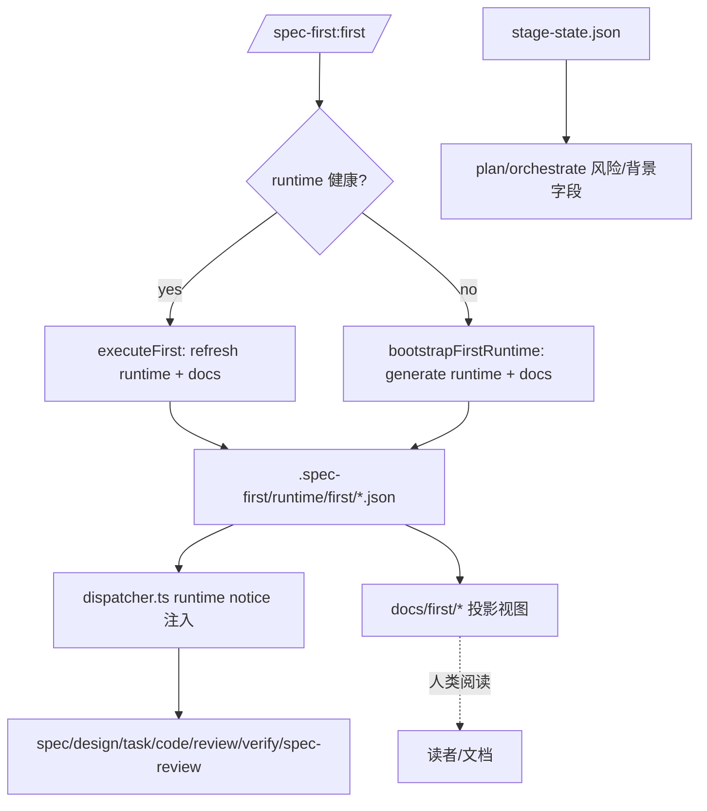

# Spec-First First Skill 上下文注入现状分析报告（更新版）

## 执行摘要
- first 产物已被多个 skill **自动注入**，但注入链路仅依赖 `.spec-first/runtime/first/*`。
- `docs/first/*` 目前仅作为人类可读投影视图，**runtime 缺失时不会降级注入**。
- 已确认策略：**允许在 runtime 缺失时使用 docs/first 作为降级来源**。
- 推荐方案：**方案 2（背景上下文服务 + dispatcher 集成）**，在不改动大量 SKILL.md 的前提下补齐降级注入。

## First 产物概览

### Runtime 真源
- 位置：`.spec-first/runtime/first/`
- 核心文件：`index.json`, `summary.json`, `role-views.json`, `stage-views.json`
- 语义：runtime 为真源，docs 仅投影

### Docs 投影视图
- 位置：`docs/first/`
- 用途：人类可读长期文档，不作为真源

## 当前注入链路（代码级真实行为）

### 1) 生成与刷新
- 入口：`/spec-first:first` -> `src/cli/commands/first.ts`
- 有健康 runtime 则刷新，否则 bootstrap 生成 runtime + docs

### 2) 背景状态落盘
- `detectBackgroundInputStatus()`：runtime 健康为 `full`，runtime 缺失但 docs 存在为 `degraded`，全缺失为 `blind`
- 写入 `specs/<featureId>/stage-state.json`

### 3) Prompt 注入
- `src/core/skill-runtime/dispatcher.ts` 在 assemblePrompt 后追加 runtime notice
- 注入数据源仅限 runtime：`readFirstRuntimeIndex/readFirstStageViews/readFirstRoleViews`
- **缺口**：runtime 缺失时不读 `docs/first/*`

## Skill 注入矩阵（实际行为）

| Skill | 注入字段 | 数据源 | 备注 |
|------|---------|--------|------|
| spec | `background_input_status` + `spec_view_summary` | stage-views | runtime only |
| design | `background_input_status` + `design_view_summary` | stage-views | runtime only |
| task | `backgroundInputStatus` | runtime index | runtime only |
| code | `backgroundInputStatus` + `codeViewSummary` | stage-views | runtime only |
| review | `backgroundInputStatus` + `codeViewSummary` | stage-views | runtime only |
| verify | `backgroundInputStatus` + `verifyViewSummary` | stage-views | runtime only |
| spec-review | `backgroundInputStatus` + `specViewSummary` | stage-views | runtime only |
| onboarding | role 列表 | role-views | runtime only |
| plan | `backgroundInputStatus` + 风险字段 | stage-state | runtime-agnostic |
| orchestrate | `background_status` + 风险字段 | stage-state | runtime-agnostic |

未自动注入的 skill 仍可手动读取背景，但目前无统一自动降级机制：
- 05-research, 10-archive, 16-sync, 17-feature, 02-catchup, 21-analyze 等

## 流程图



## 审查结果

### Stage 1 合规
- 结论：通过。runtime 真源与注入链路可追溯，未发现硬性阻断项。

### Stage 2 质量

MUST FIX
- 无

SHOULD FIX
1. **runtime 缺失时 docs/first 不参与注入**
   - 影响：背景已存在但无法进入 prompt，形成“降级但无内容”的断裂
   - 证据：`dispatcher.ts` 仅读 runtime

2. **背景字段命名不一致**
   - 影响：输入层/输出层字段混用
   - 证据：notice 中混用 `background_input_status` / `backgroundInputStatus`

3. **注入摘要过薄**
   - 影响：仅提供 summary，缺少关键列表信息

OUT_OF_SCOPE
- 是否将 docs/first 纳入 `ai context` pack（需要产品策略确认）

## 推荐方案（方案 2：背景上下文服务）

### 核心目标
- runtime 缺失时自动读取 docs/first 作为降级来源
- 维持现有 runtime notice 注入机制
- 不要求大规模修改 SKILL.md

### 实现思路
- 新增 `background-context-service.ts`：封装 runtime + docs 的读取与降级策略
- dispatcher 内通过 service 生成 notice
- 降级时标记 `background_input_status=degraded` 并注明 `source: docs/first`

### 伪代码草案
```typescript
// background-context-service.ts (伪代码)
export function loadStageBackground(projectRoot: string, stage: string) {
  const runtime = tryReadRuntimeStageView(projectRoot, stage);
  if (runtime) return { source: 'runtime', view: runtime };

  const doc = tryReadDocsStageView(projectRoot, stage); // 例如 docs/first/stage-views.md 摘要
  if (doc) return { source: 'docs', view: doc, degraded: true };

  return null;
}
```

## 建议落地顺序
1. 方案 2：docs/first 降级注入
2. 字段命名一致化
3. 注入摘要增强（控制条数与体积）

## 结论
当前系统已存在 runtime 级自动注入，但 docs/first 无降级路径。基于已确认策略，**优先落地方案 2** 可在最小改动下补齐断裂链路，并保持 prompt 结构稳定。
