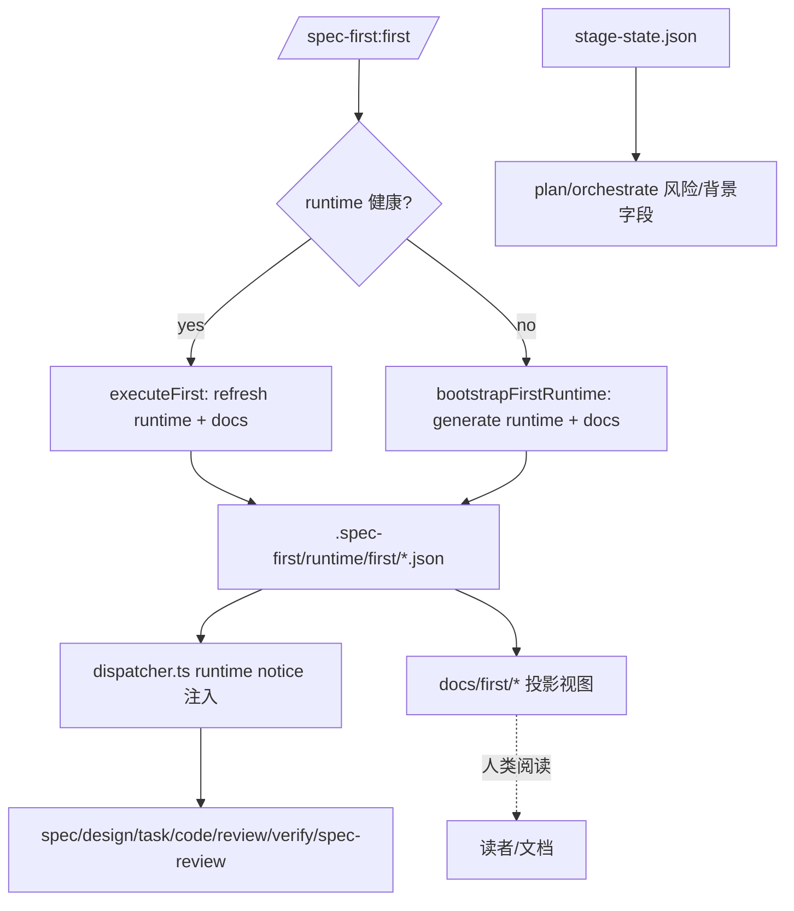

# Spec-First 00-first 背景注入审查报告

## 结论摘要
- 00-first 生成的背景资料**被后续 skill 通过 runtime 真源注入**，而 **docs/first 目前仅作为人类可读投影视图层**。
- 当前实现中，**当 runtime 缺失时，docs/first 不会被降级注入**；即便 docs 存在，也不会进入 prompt 上下文链路。
- 已确认策略调整：**允许在 runtime 缺失时使用 docs/first 作为降级来源**。

## 审查范围
- 技术链路（runtime 生成 / docs 投影 / prompt 注入 / 背景状态）
- 00-first 产物与后续 skill 的上下文依赖关系
- background 质量字段协议一致性

## 现状实现链路（精确到文件）

### 1) 00-first 产物生成
- 入口：`/spec-first:first` -> `src/cli/commands/first.ts`
- 逻辑：
  - 若 runtime 健康：`executeFirst()` 刷新 runtime + docs 投影
  - 否则：`bootstrapFirstRuntime()` 生成最小 runtime + docs 投影
- 真源：`.spec-first/runtime/first/*.json`
- 投影视图：`docs/first/*`

**相关文件**
- `src/cli/commands/first.ts`
- `src/core/skill-runtime/first-bootstrap.ts`
- `src/core/skill-runtime/first-context.ts`
- `src/core/skill-runtime/first-runtime-store.ts`
- `src/core/skill-runtime/first-doc-projection.ts`

### 2) Runtime 结构与视图映射
- runtime summary：`first-summary.ts` 定义 summary 结构
- stage-views：`first-stage-views.ts` 生成 spec/design/code/verify 视图摘要
- role-views：`first-role-views.ts` 生成 role 视图（用于 onboarding）

**相关文件**
- `src/core/skill-runtime/first-summary.ts`
- `src/core/skill-runtime/first-stage-views.ts`
- `src/core/skill-runtime/first-role-views.ts`

### 3) 背景状态判定与落盘
- `detectBackgroundInputStatus()`：
  - runtime 健康 -> `full`
  - runtime 缺失但 docs/first 存在 -> `degraded`
  - 全部缺失 -> `blind`
- init/advance 会把该值写入 `specs/<featureId>/stage-state.json`

**相关文件**
- `src/core/skill-runtime/first-context.ts`
- `src/core/process-engine/init.ts`

### 4) Skill Prompt 注入链路（当前）
- `dispatcher.ts` 在 assemblePrompt 后，按 skillName 插入 runtime notice
- 注入数据源仅限 runtime：
  - `.spec-first/runtime/first/index.json`
  - `.spec-first/runtime/first/role-views.json`
  - `.spec-first/runtime/first/stage-views.json`

**相关文件**
- `src/core/skill-runtime/dispatcher.ts`

## 下游 Skill 注入矩阵（当前）

| Skill | 注入字段 | 数据源 | 备注 |
|------|---------|--------|------|
| spec | `background_input_status` + `spec_view_summary` | stage-views | runtime only |
| design | `background_input_status` + `design_view_summary` | stage-views | runtime only |
| task | `backgroundInputStatus` | runtime index | runtime only |
| code | `backgroundInputStatus` + `codeViewSummary` | stage-views | runtime only |
| review | `backgroundInputStatus` + `codeViewSummary` | stage-views | runtime only |
| verify | `backgroundInputStatus` + `verifyViewSummary` | stage-views | runtime only |
| spec-review | `backgroundInputStatus` + `specViewSummary` | stage-views | runtime only |
| onboarding | role 列表 | role-views | runtime only |
| plan | `backgroundInputStatus` + 风险字段 | stage-state + high-risk | runtime-agnostic |
| orchestrate | `background_status` + 风险字段 | stage-state + high-risk | runtime-agnostic |

## 流程图

## 审查结果

### Stage 1 合规
- 目标：检查链路完整性与背景注入可追溯性
- 结果：**通过**（链路清晰、依赖点可追溯）

### Stage 2 质量

**MUST FIX**
- 无

**SHOULD FIX**
1. **runtime 缺失时，docs/first 不参与上下文注入**
   - 影响：背景资料不可用，prompt 处于“盲区”或“降级但无内容”状态
   - 证据：`dispatcher.ts` 仅读取 runtime 文件，不读 `docs/first/*`

2. **背景字段命名在不同 skill 中不一致**
   - 影响：输入层/输出层字段混用，易导致 prompt 误解释
   - 证据：同一文件中出现 `background_input_status` / `backgroundInputStatus`

3. **stage-view 注入只带 summary，不带关键列表**
   - 影响：摘要过薄，下游仍需回读原始资料

**OUT_OF_SCOPE**
- 是否扩展 `ai context` 将 docs/first 纳入 context pack（属于产品策略调整）

## 已确认的目标策略变更
- **允许在 runtime 缺失时使用 docs/first 作为降级来源**

## 优化建议（按优先级）

### P1: docs/first 降级注入
- 在 `dispatcher.ts` 的各 runtime notice 构建函数中：
  - 当 `readFirstRuntimeIndex()` 返回空或不健康时，尝试读取 `docs/first/summary.md` / `docs/first/stage-views.md` / `docs/first/role-views.md`
  - 若存在则注入简化摘要并标记 `background_input_status=degraded`
  - 若不存在则提示 `recommended_action: /spec-first:first`

### P2: 字段命名统一
- runtime notice 中统一使用 `backgroundInputStatus`
- 文档输出层（报告/状态面板）继续使用 `background_input_status`

### P3: 视图摘要增强
- 注入 `summary` 之外增加小型列表（例如 3-5 项）
- 控制 prompt 大小，避免压垮上下文预算

## 建议的落地顺序
1. P1：支持 docs/first 降级注入（与已确认策略一致）
2. P2：字段命名一致性
3. P3：视图摘要增强

## 附录：关键文件索引
- `src/cli/commands/first.ts`
- `src/core/skill-runtime/first-bootstrap.ts`
- `src/core/skill-runtime/first-context.ts`
- `src/core/skill-runtime/first-runtime-store.ts`
- `src/core/skill-runtime/first-stage-views.ts`
- `src/core/skill-runtime/first-role-views.ts`
- `src/core/skill-runtime/dispatcher.ts`
- `skills/spec-first/00-first/SKILL.md`
- `skills/spec-first/shared/background-quality-contract.md`

