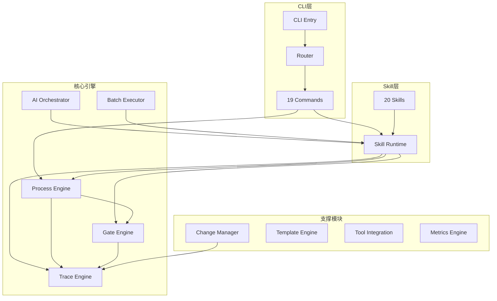

# Spec-First 代码库架构模型

> 生成时间: 2026-03-11
> Feature: FSREQ-20260310-SKILLREFINE-001

## 1. 模块依赖图



## 2. 核心概念映射表

| 概念 | 实现位置 | 描述 |
|------|----------|------|
| **Context Pack** | `src/core/ai-orchestrator/` | AI 上下文包，包含 Feature 状态、阶段、追溯信息 |
| **Gate** | `src/core/gate-engine/` | 阶段质量门禁，校验阶段推进条件 |
| **追踪矩阵** | `src/core/trace-engine/` | FR→DS→TASK→TC 的追溯链路 |
| **状态机** | `src/core/process-engine/` | 8 active + 2 terminal stages 阶段流转 |
| **Skill Runtime** | `src/core/skill-runtime/` | Skill 分发、prompt 组装、hard-gate 校验 |
| **AI Orchestrator** | `src/core/ai-orchestrator/` | AI 自动循环、上下文恢复、context-pack |
| **Batch Executor** | `src/core/batch-executor/` | 批量任务执行、并发控制、失败率控制 |

## 3. 技术栈清单

| 组件 | 技术 | 版本 |
|------|------|------|
| Runtime | Node.js | ≥20 |
| Language | TypeScript | ≥5.4 |
| Module | ESM | - |
| Bundler | tsup | - |
| Test | Vitest | - |
| Lint | ESLint + Prettier | - |
| Templates | Handlebars | - |
| Config | js-yaml | - |

## 4. 目录结构

```
spec-first/
├── src/
│   ├── cli/                    # CLI 入口
│   │   ├── index.ts           # 主入口
│   │   ├── router.ts          # 命令路由
│   │   └── commands/          # 19 个命令实现
│   ├── core/                   # 核心模块
│   │   ├── process-engine/    # 阶段状态机
│   │   ├── skill-runtime/     # Skill 运行时
│   │   ├── ai-orchestrator/   # AI 编排器
│   │   ├── gate-engine/       # Gate 引擎
│   │   ├── trace-engine/      # 追溯引擎
│   │   ├── batch-executor/    # 批量执行器
│   │   ├── change-mgr/        # 变更管理
│   │   ├── template/          # 模板引擎
│   │   ├── tool-integration/  # 工具集成
│   │   └── metrics-engine/    # 指标引擎
│   └── shared/                 # 共享类型
├── skills/
│   └── spec-first/            # 20 个 Skill 定义
│       ├── 00-first/          # 项目认知
│       ├── 01-init/           # 初始化
│       ├── 02-catchup/        # 上下文恢复
│       ├── 03-spec/           # 需求规格
│       ├── 04-design/         # 技术设计
│       ├── 05-research/       # 调研
│       ├── 06-task/           # 任务拆解
│       ├── 07-code/           # 代码实现
│       ├── 08-review/         # 代码审查
│       ├── 10-archive/        # 归档
│       ├── 11-plan/           # 计划
│       ├── 12-verify/         # 验收
│       ├── 13-orchestrate/    # 编排
│       ├── 14-status/         # 状态
│       ├── 15-doctor/         # 诊断
│       ├── 16-sync/           # 同步
│       ├── 17-feature/        # Feature 管理
│       ├── 20-spec-review/    # 规格审查
│       └── 21-analyze/        # 分析
└── tests/                      # 测试目录
    ├── unit/                   # 单元测试
    ├── integration/            # 集成测试
    └── e2e/                    # 端到端测试
```

## 5. Skill 分类

| 分类 | Skill | 数量 |
|------|-------|------|
| 认知 | first, onboarding | 2 |
| 生命周期 | init, archive | 2 |
| 规格定义 | spec, design, research | 3 |
| 计划与实现 | task, code, plan | 3 |
| 验证 | review, verify, spec-review, analyze | 4 |
| 编排 | orchestrate | 1 |
| 状态管理 | status, feature, sync, catchup, doctor | 5 |

## 6. 数据流

```
用户输入 → CLI Router → Command Handler
                              ↓
                    Skill Runtime (分发)
                              ↓
                    Process Engine (状态校验)
                              ↓
                    Gate Engine (门禁检查)
                              ↓
                    Trace Engine (追溯记录)
                              ↓
                    输出产物 (spec.md, design.md, etc.)
```

## 7. 关键接口

### Skill Runtime
- `resolveSkillPath()`: 解析 Skill 路径
- `assemblePrompt()`: 组装 Skill prompt
- `buildHardGateRuntimeNotice()`: 构建 Gate 通知

### Process Engine
- `getCurrentStage()`: 获取当前阶段
- `advanceStage()`: 推进阶段
- `validateTransition()`: 校验阶段转换

### Gate Engine
- `checkGate()`: 执行 Gate 检查
- `evaluateCondition()`: 评估条件

### Trace Engine
- `generateId()`: 生成追溯 ID
- `updateMatrix()`: 更新追溯矩阵
- `checkCoverage()`: 检查覆盖率
