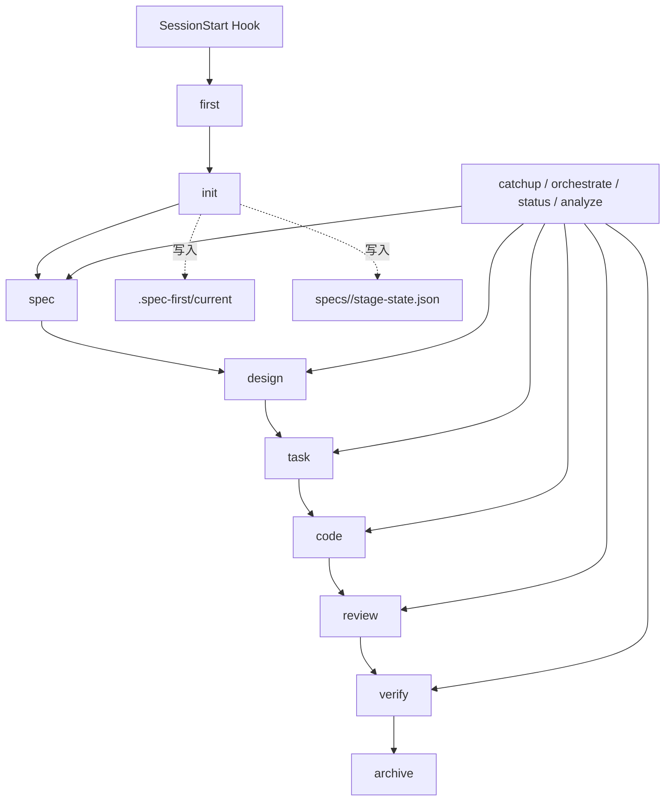
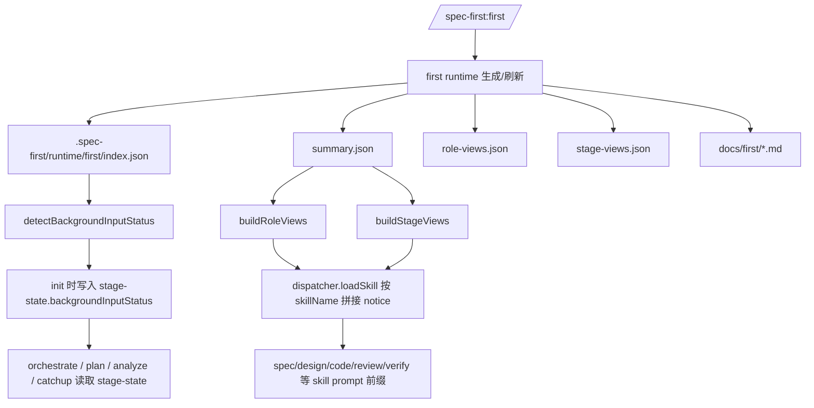
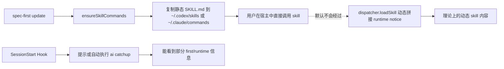
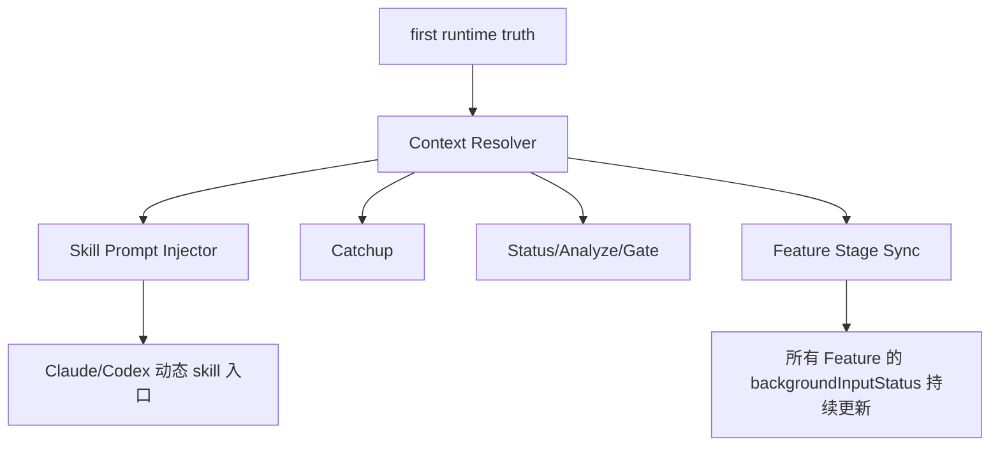

# first 产物到后续 skill 自动注入链路审查结论

## 审查目标

确认以下命题是否在当前代码中真实成立:

> 在第一步 `first` skill 生成相关文档后，后续的 skill 节点会自动注入这些信息作为上下文辅助。

本次结论基于当前仓库代码实现，不基于理想设计或文档声明。

---

## 一、当前节点流转图

说明:

- `first` 负责生成项目级背景真源。
- `init` 负责创建 Feature 工作区，并把当时检测到的 `backgroundInputStatus` 写入 `stage-state.json`。
- 后续 `spec/design/task/code/review/verify` 理论上应消费 `first` 产物，但真实消费深度并不一致。

---

## 二、当前实际上下文注入图

这张图只表示“代码里存在的注入能力”，不等于“宿主实际调用时一定会发生”。

---

## 三、宿主真实执行链路图

关键含义:

- `dispatcher.loadSkill()` 中的动态注入逻辑是存在的。
- 但 `ensureSkillCommands()` 当前做的是“复制 skill 目录”，不是“注册一个经过 dispatcher 的动态入口”。
- 所以在真实宿主调用里，大多数 skill 拿到的是静态 `SKILL.md`，不是动态拼接后的内容。

---

## 四、代码级结论

### Stage 1: 合规审查

结论: **未做到“全流程自动注入”**

原因:

1. `first` 真源层已建立，但后续 skill 的真实宿主执行链路没有强制经过动态注入入口。
2. `backgroundInputStatus` 在 `init` 时被采样写入，但 `first` 后续刷新后不会自动回写所有 Feature 的 `stage-state.json`。
3. 技能文档中声明“优先读取 spec-view/design-view/code-view”，但真实宿主路径里这件事并不稳定发生。

### Stage 2: 质量审查

#### MUST FIX

1. **真实宿主调用路径没有接入动态注入入口**
   - 影响: `first` 生成的 runtime 背景不会稳定出现在后续 skill prompt 中。
   - 证据:
     - `src/shared/skill-commands.ts`: 负责把 skill 目录原样复制到宿主目录。
     - `src/core/skill-runtime/dispatcher.ts`: `loadSkill()` 内实现了动态 notice 注入。
   - 判定:
     - 动态注入能力存在。
     - 宿主真实入口未统一走这条路径。

#### SHOULD FIX

1. **`backgroundInputStatus` 是一次性快照，不是持续同步状态**
   - 影响: 先 `init` 再补跑 `first` 后，已有 Feature 仍可能保留旧状态。
   - 证据:
     - `src/core/process-engine/init.ts`: `createInitialStageState()` 与 `recoverExistingFeature()` 调用 `detectBackgroundInputStatus()`。
     - 未发现 `first` 执行后自动批量同步 Feature `stage-state.json` 的逻辑。

2. **注入内容目前以摘要 notice 为主，缺少统一上下文切片协议**
   - 影响: 即使后续接入动态入口，也只是“前缀摘要”，不是统一、可控、可裁剪的背景包。
   - 证据:
     - `src/core/skill-runtime/dispatcher.ts`: 当前主要注入 `*_view_summary`、`backgroundInputStatus`、`riskSignals`。
     - `src/core/ai-orchestrator/context-pack.ts`: 已有上下文包能力，但主要围绕 Feature 产物，不直接消费 `first` runtime 视图。

3. **SessionStart/catchup 是补偿链路，不是 skill 级自动注入**
   - 影响: 只能在会话开始或人工执行 catchup 时补一点背景，不能替代每个 skill 节点的稳定上下文装载。
   - 证据:
     - `src/core/tool-integration/session-hook.ts`
     - `src/cli/commands/ai.ts`

#### OUT_OF_SCOPE

1. `context-sync.ts` 把设计摘要写回 `CLAUDE.md` / `AGENTS.md` 的逻辑与本问题存在相关性，但不是 `first -> downstream skill` 主链路，适合单独治理。

---

## 五、当前实现中“已经做到”的部分

以下能力已经有基础，不应忽略:

1. `first` 已生成三类 runtime 真源:
   - `summary.json`
   - `role-views.json`
   - `stage-views.json`

2. `dispatcher` 已按 skill 类型准备好多种 runtime notice:
   - `spec-runtime-context`
   - `design-runtime-context`
   - `code-runtime-context`
   - `review-runtime-context`
   - `verify-runtime-context`
   - `orchestrate-runtime-context`

3. `docs/first/*` 已作为降级视图存在:
   - runtime 不健康时，可回退到 docs 摘要。

换句话说，**数据层和注入模板层已经有了，缺的是统一的宿主执行接线与持续同步机制。**

---

## 六、推荐方案

推荐采用 **“单一上下文解析器 + 宿主动态入口 + 状态持续同步”** 的三层方案。

### 方案目标

把当前分散在 `first-context`、`dispatcher`、`catchup`、`stage-state` 中的逻辑收口成一条稳定主链路:

### 方案拆解

#### 1. 建立统一 `Context Resolver`

职责:

- 输入: `projectRoot + featureId + skillName`
- 输出:
  - `backgroundInputStatus`
  - `source` (`runtime` / `docs` / `none`)
  - `roleView`
  - `stageView`
  - `summary`
  - `missingAssets`
  - `recommendedAction`

收益:

- 消除 `dispatcher` 中每个 skill 手写一套 notice 逻辑的重复。
- `catchup`、`status`、`orchestrate`、`analyze` 可以共用同一份背景判断。

#### 2. 宿主 skill 入口改为动态代理

当前问题:

- 宿主拿到的是静态 `SKILL.md` 副本。

建议改法:

- Claude/Codex 不直接复制原始 skill 目录作为最终入口。
- 改为注册一个轻量动态代理入口:
  - 运行 `spec-first skill render <skillName> [featureId]`
  - 内部调用 `dispatcher.loadSkill()` 或新的 `Context Resolver`
  - 输出已拼接 runtime notice 的最终 skill 内容

收益:

- 后续 skill 每次调用都能稳定拿到最新 `first` 上下文。
- 真实宿主链路与测试链路一致，不再分裂。

#### 3. `first` 执行后自动同步 Feature 背景状态

当前问题:

- `backgroundInputStatus` 是 init 时快照。

建议改法:

- `first` 成功后扫描 `specs/*/stage-state.json`
- 对每个 Feature 重算 `backgroundInputStatus`
- 回写 `stage-state.json`
- 记录同步摘要

收益:

- `orchestrate`、`plan`、`analyze` 读取到的是最新状态。
- 用户补跑 `first` 后，后续 skill 的背景质量立刻提升。

#### 4. 从“摘要注入”升级为“预算可控的 first context slice”

建议:

- 基于 `stage-views.json` 与 `role-views.json` 生成轻量切片:
  - `spec`: businessCapabilities + coreEntities + warnings
  - `design`: moduleBoundaries + integrationPoints + risks
  - `code`: entryPoints + likelyChangeAreas + changeHazards
  - `verify`: criticalFlows + validationFocus + releaseBlockers

- 统一 token/字节预算，例如 600-1000 bytes。

收益:

- 比单行 summary 更有用。
- 比整份文档注入更稳定。

---

## 七、实施优先级

### P0

1. 打通宿主动态入口，确保真实 skill 调用经过统一注入链路。
2. 在 `first` 完成后自动同步所有 Feature 的 `backgroundInputStatus`。

### P1

3. 抽取统一 `Context Resolver`，替代 `dispatcher` 内部重复的 notice 构建。
4. 为不同 skill 定义标准化 `first context slice`。

### P2

5. 将 `catchup`、`status`、`analyze` 全部迁移到同一解析器。
6. 为“注入是否生效”补集成测试，覆盖真实宿主入口。

---

## 八、最终结论

最终判断:

> 当前实现 **没有真正做到** “first 生成后，在后续 skill 节点中自动注入这些信息作为上下文辅助” 的全流程闭环。

更准确的说法是:

- **已做到**: 真源生成、阶段视图生成、按 skill 拼接 notice 的内部能力。
- **未做到**: 宿主真实执行路径与这些内部能力的全链路打通。

所以当前状态应定义为:

> **“能力已具备 60%-70%，但主执行链路仍未接线完成。”**

