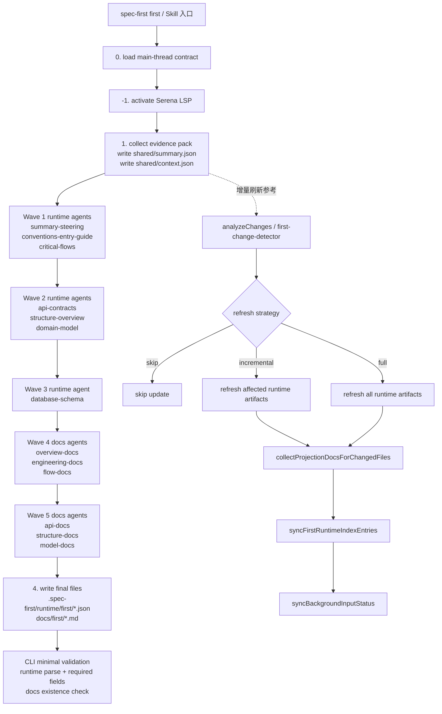

# First 执行流程图

> 本文档整理当前 `spec-first first` 的**实际调度口径**：Skill 层负责波次编排和文件生成，CLI 只做最小支撑与验收。
> 范围仅覆盖 `Path X` 对齐后的当前实现口径，不包含 `Path Y` 的合同变更设想。

## 1. 核心结论

- `first` 的正式调度在 Skill 层，不在 `src/` 里的 CLI 命令。
- `spec-first first` 入口只验证 runtime/docs 是否已写入，不负责生成波次。
- 最终文件分三类：
  - shared 共享证据：`evidence-pack/shared/summary.json`、`evidence-pack/shared/context.json`
  - runtime 真源：`.spec-first/runtime/first/*.json`
  - docs 产物：`docs/first/*.md`
- `database-er.md` 是条件性 docs 产物，只在数据库 schema 处于 healthy 时生成。

## 2. 总体流程图



### 2.1 ASCII 线框图

```text
┌──────────────────────────────┐
│        spec-first first      │
└───────────────┬──────────────┘
                │
                v
┌──────────────────────────────┐
│ 0. load main-thread contract │
└───────────────┬──────────────┘
                │
                v
┌──────────────────────────────┐
│ -1. activate Serena LSP      │
└───────────────┬──────────────┘
                │
                v
┌─────────────────────────────────────────────────────┐
│ 1. collect evidence pack                            │
│    - write evidence-pack/shared/summary.json       │
│    - write evidence-pack/shared/context.json       │
└───────────────┬─────────────────────────────────────┘
                │
                v
      ┌─────────────────────────────┐
      │ Wave 1 runtime agents       │
      │ summary-steering            │
      │ conventions-entry-guide     │
      │ critical-flows              │
      └───────────────┬─────────────┘
                      │
                      v
      ┌─────────────────────────────┐
      │ Wave 2 runtime agents       │
      │ api-contracts               │
      │ structure-overview          │
      │ domain-model                │
      └───────────────┬─────────────┘
                      │
                      v
      ┌─────────────────────────────┐
      │ Wave 3 runtime agent        │
      │ database-schema             │
      └───────────────┬─────────────┘
                      │
                      v
      ┌─────────────────────────────┐
      │ Wave 4 docs agents          │
      │ overview / engineering /    │
      │ flow docs                   │
      └───────────────┬─────────────┘
                      │
                      v
      ┌─────────────────────────────┐
      │ Wave 5 docs agents          │
      │ api / structure / model     │
      └───────────────┬─────────────┘
                      │
                      v
┌─────────────────────────────────────────────────────┐
│ 4. write final files                                │
│    runtime: .spec-first/runtime/first/*.json        │
│    docs:    docs/first/*.md                        │
└───────────────┬─────────────────────────────────────┘
                │
                v
┌─────────────────────────────────────────────────────┐
│ CLI minimal validation                               │
│ - runtime parse + required fields                    │
│ - docs existence check                               │
└─────────────────────────────────────────────────────┘

增量刷新分支:

┌─────────────────────────────────────────────────────┐
│ first-change-detector                               │
│ - analyzeChanges                                    │
│ - getAffectedArtifacts                              │
└───────────────┬─────────────────────────────────────┘
                │
        ┌───────┴────────┐
        │                │
        v                v
┌──────────────┐   ┌──────────────────────────────┐
│ skip update  │   │ incremental / full refresh   │
└──────────────┘   └───────────────┬──────────────┘
                                   │
                                   v
                   ┌────────────────────────────────┐
                   │ first-artifact-mapping         │
                   │ - runtime artifacts            │
                   │ - projection docs              │
                   └───────────────┬────────────────┘
                                   │
                                   v
                   ┌────────────────────────────────┐
                   │ first-context                  │
                   │ - sync runtime index           │
                   │ - sync background status       │
                   └────────────────────────────────┘
```

## 3. 波次与文件生成

| 波次 | 角色 | 主要输入 | 主要输出 | 备注 |
|------|------|----------|----------|------|
| -1 | Serena 激活 | 当前项目、LSP 可用性 | `evidence-pack/shared/context.json` | 成功写 `serena_status: active`，失败写 `serena_status: unavailable` |
| 1 | runtime agents | evidence pack、shared 摘要、当前 wave | `summary.json`、`steering.json`、`conventions.json`、`critical-flows.json` | 单波最多 3 个 agent |
| 2 | runtime agents | evidence pack、Wave 1 runtime 结果 | `api-contracts.json`、`structure-overview.json`、`domain-model.json` | 单波最多 3 个 agent |
| 3 | runtime agent | evidence pack、前序 runtime 结果 | `database-schema.json` | 仅在数据库场景下走健康态分支 |
| 4 | docs agents | evidence pack、已确认 runtime 结果 | `README.md`、`summary.md`、`steering.md`、`conventions.md`、`development-guidelines.md`、`entry-guide.md`、`critical-flows.md`、`call-graph.md` | 单波最多 3 个 agent |
| 5 | docs agents | evidence pack、已确认 runtime 结果 | `api-docs.md`、`external-deps.md`、`codebase-overview.md`、`architecture.md`、`domain-model.md`、`database-er.md` | `database-er.md` 受 `database-schema.status` 约束 |

## 4. 最终文件清单

### 4.1 shared 共享证据

- `evidence-pack/shared/summary.json`
- `evidence-pack/shared/context.json`

这两份文件属于 Skill 层执行产物，供本轮 runtime agents / docs agents 共享，不是 `spec-first first` CLI 的最终验收输出。

### 4.2 runtime 真源

当前 runtime 资产固定为 9 个：

- `.spec-first/runtime/first/summary.json`
- `.spec-first/runtime/first/steering.json`
- `.spec-first/runtime/first/conventions.json`
- `.spec-first/runtime/first/critical-flows.json`
- `.spec-first/runtime/first/entry-guide.json`
- `.spec-first/runtime/first/api-contracts.json`
- `.spec-first/runtime/first/structure-overview.json`
- `.spec-first/runtime/first/domain-model.json`
- `.spec-first/runtime/first/database-schema.json`

其中 `database-schema.json` 是条件性 runtime 资产，只有数据库场景健康时才会成为必需项。

### 4.3 docs 产物

当前 canonical docs 共 14 个槽位，其中 `database-er.md` 为条件性产物：

- `docs/first/README.md`
- `docs/first/summary.md`
- `docs/first/steering.md`
- `docs/first/conventions.md`
- `docs/first/development-guidelines.md`
- `docs/first/critical-flows.md`
- `docs/first/call-graph.md`
- `docs/first/entry-guide.md`
- `docs/first/api-docs.md`
- `docs/first/external-deps.md`
- `docs/first/codebase-overview.md`
- `docs/first/architecture.md`
- `docs/first/domain-model.md`
- `docs/first/database-er.md`（条件性）

## 5. 实际调度规则

### 5.1 Skill 层是调度器

- `execution-flow.md` 定义了 `collect evidence pack -> dispatch runtime agents -> dispatch docs agents -> write final files`。
- `subagent-architecture.md` 定义了 runtime/docs 两类 agent、波次和并发上限。
- 这意味着“谁先跑、谁后跑、谁能并发”由 Skill 合同决定，不由 `first.ts` 决定。

### 5.2 CLI 只做最小支撑

- `spec-first first` 只验证 runtime/doc 是否已写入。
- `--check-health` 只读取已有产物，判断当前产物是否健康。
- CLI 不负责 wave 调度，也不负责把 evidence pack 分发给 agent。

### 5.3 增量刷新靠变更检测

- `first-change-detector.ts` 先用 Git diff 和工作区变更推导这次更新策略。
- `first-artifact-mapping.ts` 把源文件映射到 runtime artifacts 和 docs projection。
- `first-context.ts` 在已有 runtime truth 健康时，决定增量刷新还是全量刷新，并在写回后同步 runtime index 和 background input status。

## 6. 阅读建议

如果你要继续审查或实现，建议按这个顺序看：

1. `skills/spec-first/00-first/references/execution-flow.md`
2. `skills/spec-first/00-first/references/subagent-architecture.md`
3. `skills/spec-first/00-first/references/evidence-pack-spec.md`
4. `src/core/skill-runtime/first-artifact-mapping.ts`
5. `src/core/skill-runtime/first-change-detector.ts`
6. `src/core/skill-runtime/first-context.ts`
7. `src/cli/commands/first.ts`
