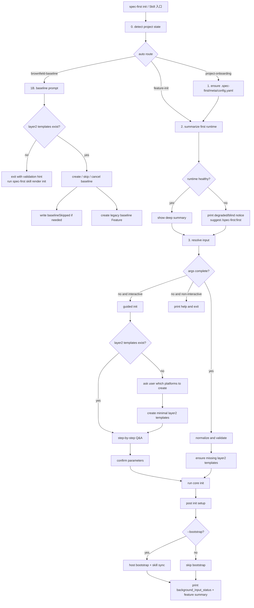

# Init Skill 执行流程图

> 本文档整理当前 `spec-first init` 的**实际执行口径**：CLI 负责项目状态识别、轨道路由、参数收集与最小初始化；平台模板缺失时允许补齐最小模板后继续执行。
> 范围仅覆盖当前落地的 `01-init` 路径，不包含未来可能的合同变更分支。

## 1. 核心结论

- `init` 的入口是 `spec-first:init`，它不是单纯的命令包装，而是一个项目初始化路由器。
- `.git` 不是硬门槛，初始化可在本地项目、远程 clone 项目、绿地项目和存量项目上统一执行。
- 当前默认只消费 `00-first` 的深度背景摘要；若 `00-first` 不完整，初始化仍继续，但会降级提示。
- 最终输出分两类：
  - 项目壳：`.spec-first/meta/config.yaml`
  - 业务工作区：`.spec-first/layer2/*.yaml`、`specs/FSREQ-*/`
- `brownfield-baseline` 只在存量项目且尚无基线时触发；`feature-init` 才是常规创建业务 Feature 的主路径。

## 2. 总体流程图



### 2.1 ASCII 线框图

```text
┌──────────────────────────────┐
│      spec-first init         │
└───────────────┬──────────────┘
                │
                v
┌──────────────────────────────┐
│ 0. detect project state      │
│ - .spec-first?               │
│ - meta/config.yaml?          │
│ - project maturity           │
│ - legacy baseline?           │
│ - layer2 platforms           │
└───────────────┬──────────────┘
                │
                v
        ┌──────────────────────┐
        │ auto route           │
        └───────┬───────┬──────┘
                │       │
      ┌─────────┘       └─────────┐
      v                           v
┌──────────────────┐     ┌────────────────────────┐
│ project-onboarding│     │ brownfield-baseline    │
└─────────┬────────┘     └──────────┬─────────────┘
          │                         │
          v                         v
┌──────────────────────────┐   ┌────────────────────────┐
│ ensure meta/config.yaml   │   │ check layer2 templates │
│ then continue             │   │ if missing → exit hint │
└──────────────┬───────────┘   └──────────┬─────────────┘
               │                          │
               └──────────────┬───────────┘
                              v
                 ┌──────────────────────────┐
                 │ feature-init             │
                 │ - summarize first runtime│
                 │ - degraded/blind allowed │
                 └────────────┬─────────────┘
                              │
                              v
                 ┌──────────────────────────┐
                 │ resolve input           │
                 │ - args complete?        │
                 │ - interactive guided?   │
                 └────────────┬─────────────┘
                              │
                              v
                 ┌──────────────────────────┐
                 │ validate / create layer2 │
                 │ - auto create minimal    │
                 │   templates if missing   │
                 └────────────┬─────────────┘
                              │
                              v
                 ┌──────────────────────────┐
                 │ core init                │
                 │ - create Feature         │
                 │ - register hooks/skills  │
                 └────────────┬─────────────┘
                              │
                              v
                 ┌──────────────────────────┐
                 │ output summary           │
                 │ background_input_status   │
                 │ feature dir / ID         │
                 └──────────────────────────┘
```

## 3. 轨道与文件生成

| 轨道 | 进入条件 | 主要动作 | 主要输出 |
|------|----------|----------|----------|
| project-onboarding | `.spec-first` 不存在，或 `meta/config.yaml` 缺失 | 自动补齐项目壳，然后进入 feature-init | `.spec-first/meta/config.yaml` |
| brownfield-baseline | 存量项目且没有基线 Feature，且未跳过基线 | 交互式创建 `FSREQ-19700101-LEGACY-BASELINE` | `specs/FSREQ-19700101-LEGACY-BASELINE/` |
| feature-init | 项目已就绪，或 greenfield，或已有基线 | 收集参数、校验平台、创建新 Feature | `specs/FSREQ-*/`、`.spec-first/layer2/*.yaml` |

## 4. 平台模板与参数流

### 4.1 平台模板流

- 先读取 `.spec-first/layer2/*.yaml`。
- 若目录为空或不存在，先问用户要创建的平台。
- 随后生成最小模板，至少包含 `platform`、`label`、`description`。
- 如果是直参模式，缺失平台模板会在校验后自动补齐。

### 4.2 参数收集顺序

`feat → mode → size → platforms → title → feature-id → bootstrap`

- `feat` 必须满足大写缩写规则。
- `mode` 只接受 `N` 或 `I`。
- `size` 只接受 `S`、`M`、`L`。
- `platforms` 必须来自现有模板，或在缺模板时先创建最小模板。
- `bootstrap` 决定是否执行宿主环境检查与自修复。

## 5. 实际调度规则

### 5.1 CLI 只负责路由，不负责内容生产

- `init.ts` 负责检测项目状态、路由轨道、收集参数和调用核心 `init`。
- 真正的 Feature 目录和工作区内容由 `core/process-engine/init.ts` 生成。
- `first` 背景摘要只在 `feature-init` 中作为提示信息读取，不会阻断初始化。

### 5.2 `--bootstrap` 是附加能力

- 开启时会尝试宿主检查、AI runtime hooks 注册、Skill 命令同步和宿主级 Skill 同步。
- 失败会提示警告，但不应掩盖 Feature 本身是否初始化成功。

### 5.3 `.git` 只是增强能力

- 存在 `.git` 时，可安装 hooks。
- 不存在 `.git` 时仍可完成初始化，不会分流到专门的 `no-git` 轨道。

## 6. 最终文件清单

### 6.1 项目壳

- `.spec-first/meta/config.yaml`

### 6.2 平台模板

- `.spec-first/layer2/*.yaml`

### 6.3 Feature 工作区

- `specs/FSREQ-*/`

### 6.4 可选宿主侧副作用

- `.claude/settings.json`
- `.claude/hooks/*`
- 宿主级 Skill / AI runtime 相关注册项

## 7. 阅读建议

如果你要继续审查或实现，建议按这个顺序看：

1. `skills/spec-first/01-init/SKILL.md`
2. `skills/spec-first/01-init/references/prerequisites.md`
3. `skills/spec-first/01-init/references/interaction-guide.md`
4. `src/cli/commands/init.ts`
5. `src/core/process-engine/init.ts`
6. `src/core/skill-runtime/first-platform-detector.ts`
